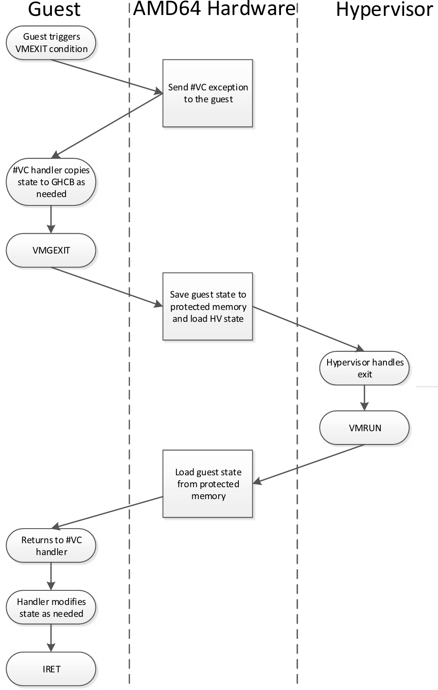
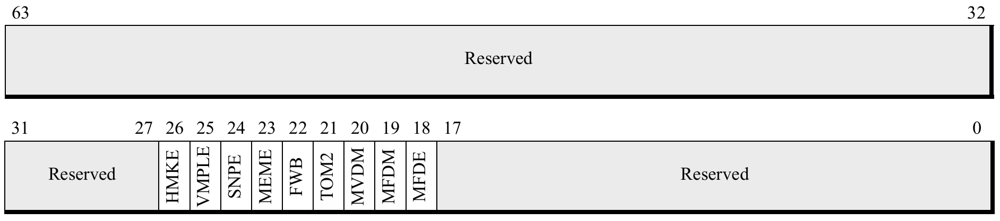
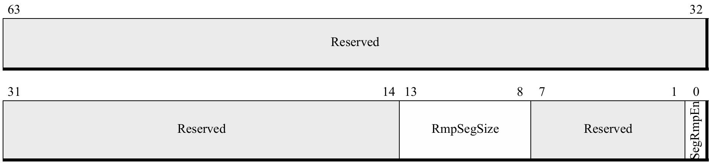
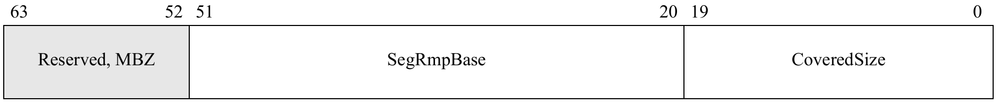

# APM-SEV

## 15.34 Secure Encrypted Virtualization

* 当 CPU 利用 AMD-V 虚拟化特性在 guest mode 下运行时，可启用 **安全加密虚拟化（Secure Encrypted Virtualization，简称 SEV）** 功能。
  * SEV 能够支持加密虚拟机（VM）的运行，在该模式下，虚拟机的代码与数据会受到安全保护，仅虚拟机自身内部可获取其解密版本。
  * 每个虚拟机可关联一个唯一的加密密钥：若其他实体使用不同密钥访问数据，SEV 加密虚拟机的数据会因解密密钥错误而无法正确解密，最终得到无法识别的乱码数据。
* 需重点注意的是，SEV 模式与标准 x86 虚拟化安全模型存在显著差异
  * 在 SEV 模式下，hypervisor 不再能检查或修改 guest 的全部代码与数据。
  * 由 guest 管理的 guest 页表（guest page tables）可将数据内存页标记为 **私有（private）** 或 **共享（shared）**，允许被选中的页面在 guest 外部进行共享访问。
    * “私有页” 则通过 guest 专属密钥进行加密，
    * “共享页” 可被 hypervisor 访问。

### 15.34.1 确定对 SEV 的支持

* 内存加密功能的支持情况会在 CPUID `8000_001F [EAX]` 中报告，具体描述参见 7.10.1 节 “Determining Support for Secure Memory Encryption” 第 238 页。其中`Bit 1` 用于指示是否支持安全加密虚拟化。
* 当内存加密功能存在时，CPUID `8000_001F [EBX]` 和 CPUID `8000_001F [ECX]` 会提供与内存加密使用相关的额外信息，例如，同时支持的密钥数量、用于将页面标记为加密状态的页表位等。
* 此外，在部分实现中，启用内存加密功能后，处理器的物理地址大小可能会缩减（例如从 `48` bits 缩减至 `43` bits）。
  * 以该示例而言，物理地址的第 `47` 至 `43` 位（`bits 47:43`）将被视为保留位，除非有其他特别说明。
  * 若某一实现支持内存加密，CPUID `8000_001F [EBX]` 会报告是否存在物理地址大小缩减的情况。
* **此模式下的保留位与其他页表保留位的处理方式一致：若在地址转换过程中发现这些保留位的值非零，将触发缺页异常（page fault）。**
* **译注**：这就杜绝 hypervisor 试图修改 PT/NPT 在 SPA 中嵌入信息的可能性。
  * 对于 TDX 也是类似的，当不在 SEAM mode 时，为编码 TDX private KeyID 而保留的物理地址位被视为保留位（详见 TDX CPU Arch Spec）：
    * 试图修改 PT 在 PA 中嵌入 keyID 会导致翻译线性地址（VA）时产生一个原因是 *保留位被修改* 的 `#PF`；
    * 试图修改 EPT 在 HPA 中嵌入 keyID 会导致翻译 GPA 时产生一次原因是 *EPT miscofig* 的 VM-Exit
* 有关内存加密功能的完整 CPUID 详情，可参见《卷 3》（Volume 3）的 E.4.17 节。
* **译注**：收集了一些 SEV 对物理地址空间影响的信息
* Using SEV with AMD EPYC Processors, Table 10-1: ASID bit usage

3rd and 2nd Gen AMD EPYC with `256` ASIDs (`8 bits`) and `16TB` DRAM | 3rd and 2nd Gen AMD EPYC with `512` ASIDs (`9 bits`) and `8TB` DRAM
-----------------------------|---------------------------
`64:52` 保留                 | `64:52` 保留
`51:44` asids/cbit `cbit=51` | `51:43` asids/cbit `cbit=51`
`43:0` 物理地址               | `42:0` 物理地址

* 例如，在 AMD EPYC 9654 上可见
```c
Architecture:            x86_64
  CPU op-mode(s):        32-bit, 64-bit
  Address sizes:         52 bits physical, 57 bits virtual
  Byte Order:            Little Endian
CPU(s):                  384
  On-line CPU(s) list:   0-383
Vendor ID:               AuthenticAMD
  BIOS Vendor ID:        Advanced Micro Devices, Inc.
  Model name:            AMD EPYC 9654 96-Core Processor
    BIOS Model name:     AMD EPYC 9654 96-Core Processor
    CPU family:          25
    Model:               17
    Thread(s) per core:  2
    Core(s) per socket:  96
    Socket(s):           2
    Stepping:            1
-------------------------------------------------------
encryption bit position in PTE           = 0x33 (51)
physical address space width reduction   = 0x6 (6)
number of VM permission levels           = 0x4 (4)
number of SEV-enabled guests supported   = 0x3ee (1006)
minimum SEV guest ASID                   = 0x1 (1)
```
* 由此可见，到了第四代 EPYC，SEV 支持了更多的 SEV-enabled guest，但对物理地址位的重用反而减少了

### 15.34.2 Key 管理
* 在本文档定义的内存加密扩展功能下，每个启用 SEV 的 guest 虚拟机都关联有一个内存加密密钥，而 SME 模式（若使用，参见第 238 页的 7.10 节）则关联另一个独立密钥。
* SEV 功能的密钥管理不由 CPU 负责，而是由 AMD SOC（系统级芯片）上搭载的独立处理器 —— **AMD 安全处理器（AMD Secure Processor，简称 AMD-SP）** 处理。关于 AMD-SP 运行机制的详细讨论，超出了本手册的涵盖范围。
* CPU 软件无法感知这些密钥的具体值，但 hypervisor 应通过 *AMD-SP 驱动* 协调虚拟机密钥的加载。
  * 该协调过程还会确定 hypervisor 应为特定 guest 分配哪个 ASID（地址空间标识符）。
* 在 SEV 模式下，ASID 用作密钥索引，用于标识应使用哪一个加密密钥对与该启用 SEV 的 guest 相关的内存流量进行加密/解密。
* ==加密密钥本身始终对 CPU 软件不可见，且绝不会以明文形式存储在芯片外部。==

### 15.34.3 启用 SEV
* 在启动加密虚拟机之前，软件必须按照第 238 页 7.10.2 节 “Enabling Memory Encryption Extensions” 中的描述，将 `SYSCFG` MSR 中的 `MemEncryptionModEn` 设为 `1`。
* 之后，若 hypervisor 将 VMCB 偏移量 `0x090` 处的 **SEV 启用位**（`bit 1`）设为 `1`，则可在执行 `VMRUN` 指令期间，为特定虚拟机启用 SEV。
* 当 VMCB 中启用 SEV 后，`VMRUN` 指令执行过程中会额外进行以下一致性检查：
  * 必须启用嵌套分页（Nested paging）
  * 必须设置 `HWCR` MSR 中的 `SmmLock`（系统管理模式锁定）bit
  * ASID 不得大于 CPUID `Fn8000_001F_ECX [NumEncryptedGuests]` 所定义的最大值
* 若上述任一一致性检查失败，`VMRUN` 指令将终止，并返回 `VMEXIT_INVALID` 错误码。
* 若 `MemEncryptionModEn` 为 `0`，则无法启用 SEV，且 VMCB 中用于 SEV 的控制位将被忽略。
* 需注意，在 CPUID `Fn8000_001F_EAX[64BitHost]` 设为 `1` 的系统上，hypervisor 必须处于 64-bit 模式，才能执行 `VMRUN` 指令以启动 *SEV-enabled* 的 guest。
  * 若不满足此条件，`VMRUN` 将失败，并返回 `VMEXIT_INVALID` 错误码。

### 15.34.4 支持的操作模式
* 安全加密虚拟化（Secure Encrypted Virtualization，SEV）可在运行于任意操作模式的 guest 上启用。但 guest 仅能在 long mode 或传统物理地址扩展模式（legacy PAE mode） 下，对内存加密进行控制。
* 在所有其他操作模式下，guest 的所有内存访问都会被无条件判定为 “私有访问”，并使用该 guest 专属的密钥进行加密。

### 15.34.5 SEV 加密行为
* 当 guest 在启用 SEV 的情况下运行时，guest 页表用于确定内存页的 `C-bit`，进而确定该内存页的加密状态。
  * 这使得 guest 能够决定哪些页是私有页，哪些是共享页，**但这种控制仅适用于数据页**。
* 代表 *指令获取* 和 *guest 页表遍历* 进行的（guest 的）内存访问始终被视为私有访问，无论 `C-bit` 的软件值如何。
  * 此行为可确保非 guest 实体（如 hypervisor）无法向启用 SEV 的 guest 注入自己的代码或数据。
    * 如果 guest 确实希望让指令页或页表中的数据可被 guest 外部的代码访问，则必须将这些数据显式复制到共享数据页中。
  * 需要注意的是，虽然 guest 可以选择在 *指令页* 和 *页表地址* 上显式设置 `C-bit`，但在这种情况下，该位的值无关紧要，因为硬件始终会将这些访问作为私有访问来处理。

### 15.34.6 页表支持
* 启用 SEV 的 guest，会通过 CPUID `8000_001F [EBX]` 定义的 `C-bit`，在其自身的 guest 页表中控制加密操作。
  * 该 `C-bit` 的位置，与非虚拟化模式下 SME（安全内存加密）所定义的 `C-bit` 位置一致（参见第 238 页的 7.10 节 “安全内存加密”）。
  * 若 `C-bit` 属于地址位，则当通过嵌套页表进行转换时，此 bit 会从 guest 物理地址中被屏蔽。因此，hypervisor 无需知晓 guest 选择将哪些页标记为私有页。
* 例如，若 `C-bit` 为地址第 `47` 位，当 guest 访问虚拟地址 `0x54321` 时，该地址可能会被转换为 guest 物理地址 `0x8000_00AB_C321` —— 此地址表明该页需使用 guest 私有密钥进行加密。
  * 当该 guest 物理地址通过嵌套页表转换时，会使用 host 虚拟地址 `0xAB_C321` 执行转换操作。
  * 如图 15-30 所示，guest 物理地址中的 `C-bit` 数值会被保存，并在嵌套页表转换完成后，应用于最终的系统物理地址。
* 注意，由于 guest 物理地址始终需通过嵌套页表进行转换，因此 guest 物理地址空间的大小，不会受 CPUID `8000_001F [EBX]` 中指示的物理地址空间缩减影响。
  * 但如果 `C-bit` 本身属于物理地址位，则 guest 物理地址空间的大小会实际缩减 `1` 位。


* **译注**
* TDX host 在处理 TDVM 缺页时需要根据 `shared-bit` 来区分是私有页面还是共享页面的缺页，fault in 和填 EPT 页表的路径是不同的。
  * TDX host 可以通过 `td_params->config_flags` 中的配置的 `TDX_CONFIG_FLAGS_MAX_GPAW` 了解到 guest `shared-bit` 的位置。
* 在 EPT 映射建立后，guest 的页面访问时，硬件会根据 `shared-bit` 是否设置去走 shared EPT 页表还是 secure EPT 页表。

### 15.34.7 限制

* 与 SME 类似，在部分硬件实现中，对于同一物理页使用不同加密使能状态或密钥的映射，硬件可能不强制保证一致性。
  * 在此类系统中，若要更改某一内存页的加密使能状态或密钥，软件必须先确保该页已从所有 CPU cache 中被刷新。
  * 但需注意，某些传统的 cache 刷新技术可能无法生效，具体细节请参见 15.34.9 节。
* 注意，若硬件实现如 CPUID `Fn8000_001F_EAX[10]`（hardware cache coher across enc domains）所示，能强制保证不同加密域之间的一致性，则无需执行上述 cache 刷新操作。

### 15.34.8 SEV 与 SME 的交互
* SEV 可与 SME 模式结合使用。在此场景下，guest 页表负责控制 guest 内存的加密，而 ==host（嵌套）页表负责控制 **共享内存** 的加密==。
* 表 15-30 对上述行为进行了总结。当 CPU 处于 guest 模式，且 guest 已在 VMCB 中启用 SEV 时，SEV 即被视为处于活跃状态。
* Table 15-30. Encryption Control

访问类型 | MemEntryptionModEn | Guest Mode | SEV Mode 激活 | 加密 | 加密 Key | 备注
--------|--------------------|------------|---------------|------|---------|--------
.       |.                   |.           |.              |.     |.        | **Legacy Mode（内存加密禁用）**
All     | 0                  | X          | X             | No   | N/A
.       |.                   |.           |.              |.     |.        | **Secure Memory Encryption Mode**
All     | 1                  | 0          | X             | 可选 | Host Key | 由页表决定（`CR3`）
All     | 1                  | 1          | 0             | 可选 | Host Key | 由嵌套页表决定（`hCR3`）
.       |.                   |.           |.              |.     |.        | **Secure Encrypted Virtualization Mode**
取指令  | 1                  | 1           | 1             | 是   | Guest Key | .
Guest 页表访问  | 1           | 1          | 1             | 是   | Guest Key | .
嵌套页表访问  | 1             | 1           | 1             | 可选 | Host Key  | 由嵌套页表决定（`hCR3`）
数据访问 | 1                  | 1           | 1 | 可选<sup>1</sup> | 见表 15-31：SEV/SME 交互 | 由 guest 页表（`gCR3`）和嵌套页表决定（`hCR3`）

**注意**：
1. 仅在 long mode 和 legacy PAE mode 下，内存加密由 guest 控制。在所有其他模式下，这些内存访问始终被判定为私有访问，并使用 guest 专属密钥进行加密。

* 注意，在嵌套页表遍历（nested page table walk）过程中，可能会出现 guest 页表和嵌套页表均处于加密状态的情况。
  * 在此场景下，guest 页表将通过 guest 私有加密密钥解密，而嵌套页表则通过 host（SME）加密密钥解密。
* 若 guest 将数据访问标记为共享（`C = 0`），但嵌套页表中该页被标记为加密状态，则仍可选择通过 host（SME）密钥对这些数据访问进行加密。
* ==若某一（数据）页在 guest 页表和嵌套页表中 **均被标记为加密**，则 **guest 页表具有优先级**，该页将通过 guest 密钥进行加密。==
* 表 15-31 对上述行为进行了总结。
* Table 15-31. SEV/SME Interaction

.              | .     | 嵌套页表          | 嵌套页表
---------------|-------|------------------|--------
.              | .     | C = 0            | C = 1
**Guest 页表** | C = 0 | 不加密            | 用 host key 加密
**Guest 页表** | C = 1 | 用 guest key 加密 | 用 guest key 加密

### 15.34.9 页面冲刷 MSR

* 如果不支持跨加密域的一致性（参见的 “15.34.7 限制” ），且 hypervisor 希望读取加密页，则必须首先从所有 CPU cache 中刷新该页的 guest 视图，以确保能够查看该数据的最新副本。
  * 这可以通过在 guest 运行过的所有内核上执行 `WBINVD` 指令，或使用 `VMPAGE_FLUSH` MSR（`C001_011E`）来实现。
  * CPUID `8000_001F [EAX]` 的第 `2` 位指示是否支持 `VMPAGE_FLUSH` MSR。
* `VMPAGE_FLUSH` MSR 是一个只写寄存器，可用于代替 guest 刷新 4KB 数据。
  * Hypervisor 将页的 **host 线性地址** 和 **guest ASID** 写入该 MSR，之后硬件会对该页执行写回无效（write-back invalidation）操作，使系统中所有 CPU cache 内的脏数据都被加密并写入 DRAM。
* 注意，`VMPAGE_FLUSH` MSR 使用标准的 host 页表来执行页转换。Page Flush MSR 操作会命中并逐出内存的 guest-cached 的实例，而使用相同转换的 `CLFLUSH` 指令则不会。

Bit[s]  | 描述
--------|----------------------------------------------
`63:12` | **虚拟地址**：只写。要冲刷的页面的 host 虚拟地址
`11:0`  | **ASID**：只写。冲刷用到的 guest ASID

* `VMPAGE_FLUSH` MSR 仅会刷新被 guest 标记为 “私有” 的内存页。若 hypervisor 无法确定某内存页是否被标记为 “私有”，但仍希望将该页从 cache 中逐出，则除使用 `VMPAGE_FLUSH` MSR 外，还应执行标准的 `CLFLUSH` 指令。
* 若尝试刷新未映射到物理地址的 host 虚拟地址，或使用 `ASID = 0`，将触发 `#GP (0)` 故障。
  * 若 SMAP（ supervisor-mode access prevention，超级用户模式访问保护）已启用，则输入地址需在页表中映射为超级用户（supervisor）地址。
* 若支持跨加密域的一致性，则无论 guest 是否将内存页标记为 “私有”，均可使用 `CLFLUSH` 指令将 guest 页从 cache 中逐出。

### 15.34.10 `SEV_STATUS` MSR

* Guest 可通过读取 `SEV_STATUS` MSR（`C001_0131`），确定当前哪些 SEV 功能处于活跃状态。
* 如表 15-32 所示，该 MSR 会指示在针对该 guest 的上一次 `VMRUN` 指令中，哪些 SEV 功能已被启用。
* `SEV_STATUS` MSR 为只读寄存器，且 hypervisor 无法拦截对该 MSR 的访问操作。
* 此 MSR 仅在支持 SEV 功能的处理器上可用。
* Table 15-32. SEV_STATUS MSR Fields

Bit[s]  | 描述
--------|----------------------------------------------
63:24   | 保留
23      | **IbpbOnEntry_Active**: IBPB on Entry feature is enabled in SEV_FEATURES[21]
22-18   | 保留
18      | **SecureAVIC_Active**: Secure AVIC feature is enabled in SEV_FEATURES[16]
17      | **SmtProtection_Active**: SMT Protection feature is enabled in SEV_FEATURES[15]
16      | **VmsaRegProt_Active**: VMSA Register Protection feature is enabled in SEV_FEATURES[14] 
15      | **GuestInterceptCtl_Active**: Guest Intercept Control feature is enabled in SEV_FEATURES[13]
14      | **IbsVirtualization_Active**: IBS Virtualization feature is enabled in SEV_FEATURES[12]
13      | **PmcVirtualization_Active**: PMC Virtualization feature is enabled in SEV_FEATURES[11]
12      | **VmgexitParameter_Active**: `VMGEXIT` Parameter feature is enabled in SEV_FEATURES[10]
11      | **SecureTsc_Active**: Secure TSC feature is enabled in SEV_FEATURES[9]
10      | **VmplSSS_Active**: VMPL SSS feature is enabled in SEV_FEATURES[8]
9       | **SNPBTBIsolation_Active**: BTB isolation feature is enabled in SEV_FEATURES[7]
8       | **PreventHostIBS_Active**: PreventHostIBS feature is enabled in SEV_FEATURES[6]
7       | **DebugVirtualization_Active**: Debug Virtualization feature is enabled in SEV_FEATURES[5]
6       | **AlternateInjection_Active**: Alternate Injection feature is enabled in SEV_FEATURES[4]
5       | **RestrictedInjection_Active**: Restricted Injection feature is enabled in SEV_FEATURES[3]
4       | **ReflectVC_Active**: ReflectVC feature is enabled in SEV_FEATURES[2]
3       | **vTOM_Active**: Virtual TOM feature is enabled in SEV_FEATURES[1]
2       | **SNP_Active**: SNP-Active mode is selected by SEV_FEATURES[0]
1       | **SEV_ES_Enabled**: SEV-ES feature is enabled in VMCB offset `0x90`
0       | **SEV_Enabled**: SEV feature is enabled in VMCB offset `0x90`

### 15.34.11 虚拟透明加密（VTE）
* 虚拟透明加密（Virtual Transparent Encryption）功能启用后，可强制 SEV guest 内的所有内存访问均使用 guest 密钥进行加密。
* CPUID `Fn8000_001F [EAX]` 的第 `16` 位用于指示是否支持该功能。
* 若要启用此功能，hypervisor 必须将 VMCB 偏移量 `0x90` 的第 `5` 位设为 `1`。
  * 只有当 SEV（第 `1` 位）也被设为 `1` 且 SEV-ES（第 `2` 位）被清为 `0` 时，第 `5` 位才会被硬件识别。
  * 在这些位的所有其他配置下（即 SEV 禁用或 SEV-ES 启用时），硬件会忽略第 `5` 位。
* 启用此功能后，CPU 硬件会将所有 guest 内存引用的 guest `C-bit` 视为 `1`。此时，guest 页表中实际的 `C-bit` 会被硬件忽略。
* Guest 地址转换不受影响，因此嵌套页表转换时会使用（不含 `C-bit` 的）guest 物理地址。

## 15.35 Encrypted State（SEV-ES）

* 使用第 15.34 节所述 SEV 功能的加密虚拟机，还可额外启用 SEV-ES 功能，以保护 guest 寄存器状态不被 hypervisor 访问。
* SEV-ES 虚拟机的 CPU 寄存器状态会在世界切换（world switch）过程中被加密，hypervisor 无法直接访问或修改该状态。
* 该设计旨在防御多种攻击，例如：
   * 数据窃取攻击（exfiltration，未授权读取虚拟机状态）
   * 控制流攻击（修改虚拟机状态）
   * 回滚攻击（恢复虚拟机此前的寄存器状态）
* SEV-ES 包含架构级支持：当特定类型的世界切换即将发生时，会向虚拟机的操作系统发送通知；这使得虚拟机在功能需要时，能够有选择地与 hypervisor 共享信息。

### 15.35.1 确定对 SEV-ES 的支持情况
* SEV-ES 的支持情况可通过读取 CPUID `Fn8000_001F [EAX]` 来确定，具体说明参见 15.34.1 节。
* 其中 `EAX` 寄存器的第 `3` 位（`Bit 3`）用于指示是否支持 SEV-ES。

### 15.35.2 启用 SEV-ES
* 通过将 VMCB 偏移量 `0x90` 的第 `2` 位设为 `1`，可基于单个虚拟机启用 SEV-ES 功能。
* 启用 SEV-ES 时，hypervisor 还必须同时启用 SEV（偏移量 `0x90` 的第 `1` 位）和 LBR 虚拟化（偏移量 `0xB8` 的第 `0` 位）。
* 此外，运行 SEV-ES guest 时，所有与启用 SEV 相关的其他编程要求（参见 15.34.3 节）也必须满足。
* 在部分系统中，对于禁用 SEV-ES 的 SEV guest，其可使用的 ASID 值存在限制。
  * 虽然 SEV-ES 可在任何有效的 SEV ASID（定义于 CPUID `Fn8000_001F [ECX]`）上启用，但对于禁用 SEV-ES 的 SEV guest，其可使用的 ASID 存在限制。
  * CPUID `Fn8000_001F [EDX]` 会指示 “启用 SEV 但禁用 SEV-ES 的 guest” 必须使用的最小 ASID 值。
  * 例如，若 CPUID `Fn8000_001F [EDX]` 返回值为 `5`，则所有使用 ASID `1-4` 且启用 SEV 的虚拟机，都必须同时启用 SEV-ES。
* 注意，首次运行 SEV-ES 虚拟机前，hypervisor 必须与 AMD 安全处理器（AMD Secure Processor）协同，为该 guest 虚拟机创建初始加密状态镜像。

### 15.35.3 SEV-ES 概览

* SEV-ES 架构在设计上默认保护 guest VM 的寄存器状态，仅允许 guest VM 自身根据需求授权选择性访问。这一额外的安全保护功能通过两种方式实现：
  1. 当发生虚拟机退出事件（`#VMEXIT`）时，所有虚拟机寄存器状态都会被保存并加密。该状态仅会在执行 `VMRUN` 指令时被解密并恢复。
  2. 特定类型的 `#VMEXIT` 事件会在 guest VM 内部触发一个新的异常。
     * 此新异常（`#VC`，详见 15.35.5 节）表明 guest VM 执行了某项需要 hypervisor 参与的操作，例如虚拟机发起的 I/O 访问。
     * Guet 的 `#VC` 处理程序负责判断：为了让 hypervisor 模拟该操作，需要向其暴露哪些寄存器状态。
     * 此外，`#VC` 处理程序还会检查 hypervisor 返回的值，若判定输出可接受，则更新 guest 状态。
* 需要暴露的寄存器状态会借助一种名为 “**Guest-Hypervisor Communication Block**，简称 **GHCB**）” 的新结构来存储。
* GHCB 的位置由 guest 指定，guest 将其所在页面映射为共享内存页，从而允许 hypervisor 直接访问。
* 只有存储在 GHCB 中的状态可被 hyperviosr 读取 —— ==因为传统 VMCB 保存状态结构中存储的所有状态，均使用 guest 内存加密密钥进行加密，并受到完整性保护==。
* 在 `#VC` 处理程序中，guest 可使用一条新指令（详见 15.35.6 节）执行世界切换（world switch）并调用 hyperviosr。
* 作为响应，hyperviosr 可检查 GHCB，并确定 guest 请求的服务类型。

### 15.35.4 退出的类型

* 当 SEV-ES 启用时，所有 `#VMEXIT` 事件会被归类为 “**自动退出（Automatic Exits，简称 AE）**” 或 “**非自动退出（Non-Automatic Exits，简称 NAE）**” 两类。
  * **AE 事件** 通常是与 guest 执行过程 **异步发生** 的事件（例如中断），或是无需暴露任何 guest 寄存器状态的事件。
  * 所有其他 `#VMEXIT` 事件均归类为 **NAE 事件**；对于 NAE 事件，guest 可自主决定在 GHCB 中暴露哪些寄存器状态（若需暴露）。
* 在 guest 执行期间，仅当 VMCB 控制区域中对应的拦截位被设为 `1` 时，`#VMEXIT` 事件（包括 AE 和 NAE）才会被触发。
* Hypervisor 仅能通过 VMCB 控制区域 `EXITCODE` 字段中的 `#VMEXIT` codes，获知特定的 AE 事件；而 NAE 事件会触发 `#VC` 异常，并由 guest 处理。
* 表 15-33 列出了所有可能的 AE 事件，其余所有事件均被视为 NAE 事件。
* Table 15-33. AE Exitcodes

代码 | 名称                    | 备注                   | 硬件推进 `RIP`
-----|------------------------|------------------------|--------------
52h  | VMEXIT_MC              | Machine check 异常     | No
60h  | VMEXIT_INTR            | 物理中断                | No
61h  | VMEXIT_NMI             | 物理 NMI                | No
62h  | VMEXIT_SMI             | 物理 SMI                | No
63h  | VMEXIT_INIT            | 物理 INIT               | No
64h  | VMEXIT_VINTR           | 虚拟中断                | No
77h  | VMEXIT_PAUSE           | `PAUSE` 指令            | Yes
78h  | VMEXIT_HLT             | `HLT` 指令              | Yes
7Fh  | VMEXIT_SHUTDOWN        | 关闭                    | No
8Fh  | VMEXIT_EFER_WRITE_TRAP | 见 15.35.10 节          | Yes
90h -9Fh | VMEXIT_CR[0-15]_WRITE_TRAP | 见 15.35.10 节  | Yes
A5h  | VMEXIT_BUSLOCK         | Bus Lock 阈值           | No
A6h  | VMEXIT_IDLE_HLT        | 如果 `HLT` 指令 idle     | Yes
400h | VMEXIT_NPF             | 只有当 `PFCODE[3]=0`     | No
403h | VMEXIT_VMGEXIT         | `VMGEXIT` 指令          | Yes
–1   | VMEXIT_INVALID         | 无效的 guest 状态         | –
–2   | VMEXIT_BUSY            | `BUSY` bit 在 VMSA 中设置 | –
-3   | VMEXIT_IDLE_REQUIRED   | sibling thread 不是 idle | –
-4   | VMEXIT_INVALID_PMC     | 无效的 PMC 状态           | –

* 对于因特定指令引发的退出（事件），CPU 会响应自动退出（AE）事件，自动推进 guest 的指令指针（`RIP`），以确保在后续执行 `VMRUN`（虚拟机运行）指令时，能从下一条指令开始恢复执行。
* 对于嵌套页错误（nested page faults），仅当不存在 *保留位错误（reserved bit error）* 时，才会将其视为 AE 事件。这样设计的目的是帮助区分两类嵌套页错误：
  * 一类是因需求缺失导致的错误（即 hypervisor 需分配页），
  * 另一类是因内存映射 I/O（MMIO）模拟导致的错误（即 hypervisor 需模拟设备）。
* 因此，hypervisor 应在所有计划模拟的 MMIO 页上设置一个页表保留位（例如某个保留地址位）。（这可能包括启用 SEV 后会变为保留位的地址位，详见 15.34.1 节。）此举可确保 MMIO 页错误会成为非自动退出（NAE）事件 —— 这一点至关重要，因为只有这样，才能调用 guest 的 `#VC` 处理程序，协助完成 MMIO 模拟。
  * **译注**： TDX 在需要 MMIO 模拟时，是通过 hypervisor 在 fault in 时填入清除 `suppress #VE bit (63)` 的 EPT 页表项，然后让 TD guest MMIO 再次访问造成 `#VE` 弹射回 TD VM，在 guest kernel 的 `#VE` 处理程序中发出 `TDG.VP.VMCALL<#VE.RequestMMIO>`，请求 hypervisor 模拟 MMIO 访问。
* 而属于 AE 事件的嵌套缺页不会调用任何 guest 处理程序，此时 hypervisor 应根据需要分配内存，随后恢复 guest 的执行。
* ==注意，当 guest 在启用 SEV-ES 的情况下运行时，在嵌套缺页发生时，指令字节（存储于 VMCB 偏移量 `0xD0` 处）绝不会被保存到 VMCB 中==。

### 15.35.5 `#VC` 异常
* 当启用 SEV-ES 的 guest 正在运行，且发生非自动退出（NAE）事件时，**硬件始终会生成** VMM 通信异常（`#VC`，VMM Communication Exception）。
  * **译注**：TDX 的 `#VE` 有可能是硬件/微码生成，也有可能是 TDX module 注入。
* ==`#VC` 异常属于精确型、伴随型 **fault** 类型的异常（precise, contributory, fault type exception），使用异常向量 `29`（exception vector 29），且该异常 **无法被屏蔽**。==
* `#VC` 异常的错误码等于触发此次 NAE 事件的 `#VMEXIT` 代码（详见附录 C）。
* 在响应 `#VC` 异常时，典型流程如下：
  1. Guest 处理程序通过检查错误码，确定异常产生的原因，并判断为处理该事件需将哪些寄存器状态复制到 GHCB 中；
  2. 随后，处理程序执行 `VMGEXIT` 指令，创建一个自动退出（AE）事件并调用 hypervisor。
  3. 在之后执行 `VMRUN` 指令恢复 guest 后，guest 将从 `VMGEXIT` 指令之后继续执行
  4. 此时处理程序可查看 hypervisor 返回的结果，并根据需要将 GHCB 中的状态复制回自身内部状态。
* 该流程如图 15-31 所示。
* 注意，hypervisor 不应设置 VMCB 中针对 `#VC` 异常的拦截位（intercept bit）—— 此举会阻碍 guest 对 NAE 事件的正常处理。
* 同理，对于可能在 `#VC` 处理程序中发生的事件（如执行 `IRET` 指令），hypervisor 也应避免设置其拦截位。



### 15.35.6 `VMGEXIT`
* `VMGEXIT` 指令会创建自动退出（AE）事件，其设计目的是允许 guest 的 `#VC` 处理程序在需要时调用 hypervisor。
* `VMGEXIT` 指令会触发一个带有 `VMEXIT_VMGEXIT` 代码的 AE 事件，且其行为类似陷阱（**trap**）
  * 这意味着在后续执行 `VMRUN` 指令恢复 guest 时，程序会从 `VMGEXIT` 指令的下一条指令开始继续执行。
* `VMGEXIT` 指令没有对应的 hypervisor 拦截位（intercept bit），因为在启用 SEV-ES 的 guest 中执行该指令时，会无条件触发 AE 事件。
* 仅当 guest 在 SEV-ES 模式启用的状态下运行时，`VMGEXIT` 操作码（opcode）才有效。若 guest 未启用 SEV-ES 模式，`VMGEXIT` 操作码会被当作 `VMMCALL` 操作码处理，且行为与 `VMMCALL` 指令完全一致。
  * **译注**：参考 Linux 内核的实现，`VMGEXIT()` 宏的编码是给 `vmmcall` 指令加上 `rep` 前缀
  * arch/x86/include/asm/sev.h 
  ```c
  #define VMGEXIT()  { asm volatile("rep; vmmcall\n\r"); }
  ```
* Guest 的 `#VC` 处理程序可使用 **`VMGEXIT` 参数（`VMGEXIT` Parameter）** 功能，以原子方式向 hypervisor 传递一个参数。
  * CPUID `Fn8000_001F_EAX` 寄存器的 “`VMGEXIT` 参数” 位（`VmgexitParameter`，第 `17` 位）若为 `1`，则表示支持该功能。
  * 启用 “`VMGEXIT` 参数” 功能的方式为：在 VMSA（Virtual Machine State Area，虚拟机状态区域）的 `SEV_FEATURES`（SEV 功能）字段中，将第 `10` 位（`VmgexitParameter`）设为 `1`。
  * 当该功能启用后，执行 `VMGEXIT` 指令时，`RAX` 寄存器的值和当前特权级（`CPL`）值会被写入 VMCB 控制区域的对应偏移量处：
    * `RAX` 值写入偏移量 `0x110`（`VMGEXIT_RAX`）
    * `CPL` 值写入偏移量 `0x118`（`VMGEXIT_CPL`）

### 15.35.7 GHCB
* GHCB 是一个未加密的内存页，用于 SEV-ES guest 与 hypervisor 之间传输寄存器状态。
* Guest VM 可通过 `GHCB` MSR（地址为 `C001_0130`）设置 GHCB 的位置。
  * 该 MSR 的值还会被包含在 VMCB 中，并分别在执行 `VMRUN` 指令时恢复、在触发 `#VMEXIT` 事件时保存。
* GHCB MSR 的作用是配置 GHCB 内存页的位置，该 MSR 的格式定义如下：

位   | 功能
-----|----------------------------
63:0 | GHCB 的 Guest 物理地址（GPA）

* 该 MSR 的值会从 VMCB 偏移量 `0x0A0` 处进行保存/恢复。建议软件向该 MSR 写入页对齐地址（page-aligned address）。
* `GHCB` MSR 仅能在 guest mode 下进行读写操作；若在 host mode 下尝试访问该 MSR，将触发 `#GP`。
* 硬件从不直接访问 GHCB，因此 GHCB 的格式并非固定不变。

### 15.35.8 `VMRUN`

* 当 SEV-ES 启用时，*VM save state area* 不再位于 VMCB 页面的偏移量 `0x400` 处。相反，它会从一个名为 “**虚拟机保存区域（VM Save Area，简称 VMSA）**” 的独立页面的偏移量 `0x0` 处开始存放
  * 该页面的位置由 VMCB 偏移量 `0x108` 处的 “**VMSA 指针（VMSA Pointer）**” 指示。
  * VMSA 指针的值以 host 物理地址（Host Physical Address）的形式存储。
* 硬件访问 VMSA 保存状态区域时，始终会采用加密内存访问方式，并使用 guest 的内存加密密钥（guest's memory encryption key）进行加密。
* 当硬件执行 `VMRUN` 指令，且 VMCB 指示 guest 已启用 SEV-ES 时，硬件会从 *VMSA 指针* 所指向的加密保存状态区域中加载 guest 状态。
* 此外，除标准 `VMRUN` 指令的行为外，该指令还会执行以下操作：
  * 计算 guest 状态的校验和（checksum），以验证状态完整性
  * 执行 `VMLOAD` 操作，加载额外的 guest 寄存器状态
  * 加载 guest 通用寄存器（GPR）状态
  * 加载 guest 浮点单元（FPU）状态
* 当 guest 启用 SEV-ES 后，加密的虚拟机状态保存区域定义会扩展，以包含所有通用寄存器（GPR）和浮点单元（FPU）的状态（详见附录 B）。
* 若 `VMRUN` 流程的任意环节发生错误，或完整性校验和不匹配，则会生成 `#VMEXIT` 事件，并附带 `VMEXIT_INVALID` 代码。
* 注意，若 SEV-ES 已启用，`VMRUN` 指令会忽略 VMCB“*清理位（clean bits）*” 的第 `5-10` 位（`bits 10:5`），并始终重新加载完整的 guest 状态。
* 另需注意，对于启用 SEV-ES 的 guest ，尽管 `VMRUN` 指令会加载完整的 guest 状态，但仅会将 “传统 `VMRUN` 指令定义的最小 hypervisor 状态”（详见 15.5.1 节）保存到 host save area。
  * Hypervisor 需自行将其所需的额外段状态（segment state）和通用寄存器（GPR）值保存到 host save area —— 因为这些值会在后续 `#VMEXIT` 事件发生时由硬件自动恢复。
  * 硬件在执行 `VMRUN` 指令时，不会自动保存 hypervisor 的 host 状态（如 `FS` 段寄存器、`STAR` 寄存器或通用寄存器的值）。
  * 有关 VMCB 各状态项的详细分类，详见附录 B。
* 最后需注意，对启用 SEV-ES 的 guest 进行 “事件注入（event injection）” 存在限制：不允许注入软件中断（software interrupts）以及第 `3`、`4` 号异常向量（exception vectors `3` and `4`）。
  * 若尝试执行此类注入操作，`VMRUN` 指令会失败，并返回 `VMEXIT_INVALID` 错误码。
* **译注**：TDX 则是将 TD VM 的所有 VMCS 都纳入运行在 SEAM Root Mode 的 TDX module 的管理范畴；而 TDX module 会给每个 pCPU 创建一个 VMCS，作为一个虚拟 CPU 来管理，因此 TD host 的状态也会被纳入 TDX module 的管理范畴。它们都保持在加密内存中。

### 15.35.9 Automatic Exits
* 当启用 SEV-ES 的 guest 正在执行时，若发生自动退出（AE）事件，硬件会自动将 guest 状态保存到 *加密保存状态区域*，并从 host 保存区域恢复 hypervisor 状态。
* 具体而言，除 `#VMEXIT` 流程标准的状态保存/恢复操作外，**硬件** 还会执行以下步骤：
  * 执行 `VMSAVE` 操作，保存额外的 guest 寄存器状态
  * 保存 guest 通用寄存器（GPR）状态
  * 保存 guest 浮点单元（FPU）状态
  * 计算并存储 guest 状态的校验和（checksum），供后续执行 `VMRUN` 指令时使用
  * 执行 `VMLOAD` 操作，加载额外的 host 寄存器状态
  * 加载 host  通用寄存器（GPR）状态
  * 将浮点单元（FPU）状态重新初始化为复位值
* 从 host 保存区域加载 host 通用寄存器状态时，采用的格式与附录 B 中描述的 “扩展 VMCB（虚拟机控制块）” 格式一致。
  * 所有寄存器状态要么从该区域加载，要么重新初始化为默认值，因此 hypervisor 无法看到任何 guest 寄存器状态。

### 15.35.10 控制寄存器写入 Traps
* 对于启用 SEV-ES 的 guest，不建议使用 `CR [0-15]_WRITE` 拦截功能。
  * 这些拦截发生在控制寄存器被修改之前，然而由于该寄存器位于加密状态镜像中，hypervisor 无法自行修改控制寄存器。（**译注**：意思是说，即使 hypervisor 拦截了也无法模拟）
* 建议 hypervisor 改用新的 `CR[0-15]_WRITE_TRAP` 和 `EFER_WRITE_TRAP` 拦截位，这些拦截位会在控制寄存器 **被修改后** 引发自动退出（AE）事件。
  * 通过这些拦截，hypervisor 能够跟踪 guest 模式，并验证是否启用了所需功能。
  * 当触发这些陷阱时，控制寄存器的新值会被保存到 `EXITINFO1 中`。
* `CR` 写入 traps 仅支持 SEV-ES guest。
* 注意，SEV-ES guest 对 `EFER.SVME` 的写入操作始终会被硬件忽略。

### 15.35.11 与 SMI 和 `#MC` 的交互

* 当启用 SEV-ES 的 guest 正在执行时，若发生 SMI，平台 SMI 处理程序不会立即执行。相反，该 SMI 会处于挂起状态，并生成一个 `#VMEXIT` 事件，且附带 SMI 相关退出代码（`#VMEXIT (SMI)`）。
  * 随后，在执行 `STGI`（Set Global Interrupt Enable，设置全局中断使能）指令后，SMI 会在 hypervisor 上下文环境中被处理。
* 注意，无论 VMCB 中 SMI 拦截位（SMI intercept bit）的值如何，都会出现此行为。
* 在部分系统中，machine check error 会首先以 SMI 的形式送达。
  * 若此类情况发生在启用 SEV-ES 的 guest 执行期间，会生成 `#VMEXIT (SMI)` 事件，且 `EXITINFO1[MCREDIR]`（machine check redirect bit，机器检查重定向位）会被设为 `1`（详见第 522 页 “SMI 拦截（SMI Intercept）” 章节）。
  * 如前文所述，该 SMI 会保持挂起状态，直至 `STGI` 指令执行。
  * 在 `STGI` 指令执行后、平台 SMI 处理程序完成执行时，hypervisor 应检查 `MCREDIR` 位，以判断此次 `#VMEXIT (SMI)` 事件是否由 guest 中的 machine check error 引发，并进行相应处理。
* **译注**：TDX 在启用 EMCA gen2 后`#MC` 的行为类似，也是先产生 SMI。然后将 SMI 转化为 VM-exit 到 TDX module 去处理，TD exit 的时候递交 pending 的 SMI，由 SMI 去注入 `#MC` 到 host VMM。

## 15.36 Secure Nested Paging (SEV-SNP) 
* SEV-SNP 功能为加密 VM 提供了额外保护，旨在实现与 hypervisor 更强的隔离。SEV-SNP 需与 15.34 节和 15.35 节分别描述的 SEV 和 SEV-ES 功能配合使用，且需要启用并使用这些功能。
* SEV-SNP 的主要作用是为虚拟机内存提供完整性保护，以帮助防范基于 hypervisor 的攻击 —— 这类攻击通常依赖于破坏 guest 数据、地址别名（aliasing）、重放（replay）及其他多种攻击手段。
* 为实现这一目标，系统引入了一种名为 **反向映射表（Reverse Map Table，RMP）** 的全新系统级数据结构，用于对内存访问执行额外的安全检查（详见 15.36.3 节）。
* 除内存保护外，SEV-SNP 还包含多项安全功能，包括全新的虚拟机特权级别（Virtual Machine Privilege Level，VMPL）架构、中断注入限制以及侧信道（side-channel）保护。这些功能旨在支持更多使用场景并增强安全防护能力。
* 本章虽描述了 SEV-SNP 的 CPU 硬件行为，但该技术还需配合使用 AMD Secure Processor（AMD-SP）的 SEV-SNP Application Binary Interface（ABI），以管理 SEV-SNP 虚拟机的生命周期事件。更多详情请参阅 AMD 官网发布的《SEV-SNP ABI 规范》（文档编号：PID#56860）。

### 15.36.1 确定对 SEV-SNP 的支持
* 可通过读取 CPUID `Fn8000_001F [EAX]` 来确定对 SEV-SNP 的支持，如 15.34.1 节所述。
  * 第 `4` 位表示对 SEV-SNP 的支持，第 `5` 位表示对 VMPL 的支持。
  * 在实现中可用的 VMPL 数量由 CPUID `Fn8000_001F [EBX]` 的第 `15-12` 位（bits `15:12`）指示。
* CPUID `Fn8000_001F [EAX]` 还会指示对 SEV-SNP guest 所使用的其他安全功能的支持情况，这些功能将在以下章节中介绍。

### 15.36.2 开启 SEV-SNP

* SEV-SNP 的机密性保护依赖于 SEV。启用 SEV-SNP 之前，必须设置 MSR `C001_0010`（即 `SYSCFG` 寄存器，系统配置寄存器）中的 `MemEncryptionModEn` 位（内存加密模式使能位），且需满足 15.34.3 节中描述的所有编程要求。
* 当 MSR `C001_0010` 中的 `SecureNestedPagingEn` 位设为 `1` 后，部分 MSR 将无法再修改。这些寄存器包括：
  * 固定范围 MTRR 寄存器（内存类型范围寄存器，详见 7.7.2 节）
  * IORR 寄存器（I/O 范围寄存器，详见 7.9.2 节）
  * `TOP_MEM` 与 `TOP_MEM2` 寄存器（内存顶部地址寄存器，详见 7.9.4 节）
  * `SMM_KEY` 寄存器（系统管理模式密钥寄存器，详见 15.32.2 节）
  * `SYSCFG` MSR 本身
* 若在 `SecureNestedPagingEn` 位设为 `1` 后尝试写入 `SYSCFG` MSR，该操作将被硬件忽略；而尝试写入上述其他 MSR 时，会触发 `#GP(0)`。
* 启用 SEV-SNP 需执行两步初始化流程：
  * 按照 15.36.4 节的描述构建反向映射表（Reverse Map Table，RMP）；
  * 在系统的每个核心上，设置 MSR `C001_0010`（`SYSCFG`）中的 `VMPLEn` 位（虚拟机特权级别使能位）与 `SecureNestedPagingEn` 位。
* 当 SEV-SNP 功能已全局启用后，可在虚拟机创建阶段，通过设置 VMSA 偏移量 `0x3B0` 处 `SEV_FEATURES` 字段的第 `0` 位，为单个虚拟机（per-VM basis）激活 SEV-SNP。
* 此外，已激活 SEV-SNP 的虚拟机还必须启用 SEV-ES（配置方式详见 15.35.2 节）与 SEV（配置方式详见 15.34.3 节）。
* 本章中，“*SNP-enabled（SNP 已启用）*” 一词表示 SEV-SNP 已在 `SYSCFG` MSR 中全局启用；“*SNP-active（SNP 已激活）*” 一词表示 SEV-SNP 已在特定虚拟机的 VMSA 之 `SEV_FEATURES` 字段中启用。
  * 处于 “SNP-enabled” 状态的系统，既支持 “SNP-active” 虚拟机，也支持非 “SNP-active” 虚拟机；
  * 而 “SNP-active” 虚拟机仅能在 “SNP-enabled” 状态的系统上运行。

### 15.36.3 反向映射表 Reverse Map Table
* **反向映射表（Reverse Map Table，简称 RMP）** 是一个由所有逻辑处理器全局共享的数据结构，驻留在系统内存中，用于确保系统物理地址（system physical address）与 guest 物理地址（guest physical address）之间呈一对一映射关系。
* 对于每一个可能分配给 guest 使用的物理内存页，RMP 中都会对应存在一条表项。如表格 15-34（Table 15-34）所述，RMP 表项包含该系统物理页（system physical page）的安全属性信息。
* Table 15-34. Fields of an RMP Entry

名称                   | 说明
-----------------------|-------------------------
Assigned               | 用于指示系统物理页已分配给 guest 或 AMD-SP 的标志位。<br/> 0：hypervisor 所有<br/> 1：一个 guest 或 AMD-SP 所有
Page_Size              | 页面大小的编码。<br/> 0：4KB 页<br/> 1：2MB 页
Immutable              | 用于指示软件可通过 x86 RMP 操作指令修改表项的标志位。<br/> 0：RMP 条目可以被软件修改<br/> 1：RMP 条目不能被软件修改
Guest_Physical_Address | 与该页关联的 Guest 物理地址（GPA）
ASID                   | 该页被分配给的 guest 的 ASID
VMSA                   | 用于指示该页是一个 VMSA 页面的标志位。<br/> 0：非 VMSA 页<br/> 1：VMSA 页
Validated              | 用于指示 guest 已经检验过该页面的标志位。<br/> 0：guest 还未校验过该页<br/> 1：guest 用 `PVALIDATE` 校验过该页
Permissions[0]         | 该页的 VMPL 权限掩码。更多细节见 15.36.7 节
...                    | .
Permissions[n-1]       | .

* RMP 的完整性通过以下方式保障：仅允许软件通过特定专用指令对其进行操作，具体包括：
  * `RMPUPDATE`：供 hypervisor 使用，用于修改 RMP 表项中的 `Guest_Physical_Address`、分配状态（`Assigned`）、页大小（`Page_Size`）、不可变（`Immutable`）及地址空间标识符（`ASID`）字段。详见 15.36.5 节。
  * `PSMASH`：允许 hypervisor 将 RMP 中一个 `2MB` 的表项拆分为 `512` 个 `4KB` 的表项。详见 15.36.11 节。
  * `RMPADJUST`：允许 guest 修改 RMP 表项的 *VMPL 权限掩码*。详见 15.36.7 节。
  * `PVALIDATE`：允许 guest 写入 RMP 表项中的 “已验证（`Validated`）” 标志位。详见 15.36.6 节。
* 当 SEV-SNP 全局启用后，它会对页访问控制施加更多限制。Hypervisor 和 guest 通过上述指令来强制实施这些内存访问限制。若违反 RMP 所规定的内存访问限制，将会触发异常。详见 15.36.10 节。

### 15.36.4 初始化 RMP

* 本节介绍单级 RMP（反向映射表）的初始化流程。两级 RMP 的相关内容，请参见第 621 页的 15.36.22 节 “分段式 RMP（Segmented RMP）”。
* MSR `C001_0132`（即 `RMP_BASE` 寄存器，RMP 基地址寄存器）定义了 RMP 第一个字节的系统物理地址；
* MSR `C001_0133`（即 `RMP_END` 寄存器，RMP 结束地址寄存器）定义了 RMP 最后一个字节的系统物理地址。
* 软件必须在全局启用 SEV-SNP 之前，为系统中的每个 core 配置完全相同的 `RMP_BASE` 和 `RMP_END` 值。
* `RMP_BASE` 与 `(RMP_END + 1)` 必须按 `8KB` 对齐。AMD-SP 可能会对这两个寄存器提出更高的对齐要求，具体需参考最新的 AMD-SP 规范以确定所需的对齐方式。
* `RMP_BASE` 至 `RMP_END` 之间的内存区域包含两部分：
  * 首先是一个 `16KB` 的区域，用于处理器的记录管理（bookkeeping）；
  * 后续区域则存放 RMP 表项，每个表项大小为 `16B`。
    * **译注**：TDX 的 PAMT 表的每个表项大小也是 `16B`
* RMP 的大小决定了运行时 hypervisor 可分配给 SNP-active 的虚拟机的物理内存范围。
* RMP 覆盖的系统物理地址空间从 `0x0` 开始，直至通过以下公式计算得出的地址：
  `((RMP_END + 1 – RMP_BASE – 16KB) / 16B) × 4KB`
* 例如，若 `RMP_BASE` 等于 `0x10_0000`，要覆盖前 `4GB` 物理内存，需将 `RMP_END` 设置为 `0x110_3FFF` —— 此时 RMP 的大小略超过 `16MB`。
* 当 SEV-SNP 全局启用后，内存访问会受到 RMP 检查的限制。为确保 RMP 初始状态 “已知且无限制（known and non-restrictive）”，
  * 软件应在设置 `SYSCFG` MSR 中的 `SecureNestedPagingEn` 位之前，将 `RMP_BASE` 至 `RMP_END` 范围内的所有内存写零。
  * 之后，hypervisor 需请求 AMD-SP 完成 RMP 的初始化收尾工作：AMD-SP 会对 RMP 进行初始化，防止所有软件直接写入 `RMP_BASE` 至 `RMP_END` 之间的内存。
  * 此后，所有 RMP 表项的操作都必须通过 x86 RMP 操作指令，或通过与 AMD-SP 的交互来完成。

### 15.36.5 Hypervisor RMP 管理
* Hypervisor 通过修改分配给 SNP-active 的 guest 的页面所对应的 RMP 表项，来管理这些页面的 SEV-SNP 安全属性。
* 由于 RMP 经 AMD-SP 初始化后会禁止对其进行直接访问，因此 hypervisor 必须使用 `RMPUPDATE` 指令来修改 RMP 表项。
* 通过 `RMPUPDATE` 指令，hypervisor 可修改 RMP 表项中的 `Guest_Physical_Address`、分配状态（`Assigned`）、页大小（`Page_Size`）、不可变（`Immutable`）及地址空间标识符（`ASID`）字段。
* SEV-SNP 会根据页面 RMP 表项中 “分配状态（`Assigned`）”“地址空间标识符（`ASID`）” 和 “不可变（`Immutable`）” 字段的设置（具体规则见表 15-35），为每个系统物理页关联一个所有者。
* 一个页面的所有者可为 hypervisor、guest 或 AMD-SP。
* Table 15-35. RMP Page Assignment Settings

所有者      | Assigned | ASID         | Immutable
-----------|----------|---------------|------------
Hypervisor | 0        | 0             | -
Guest      | 1        | Guest 的 ASID | -
AMD-SP     | 1        | 0             | 1

* 当 hypervisor 将某一页面分配给 guest 时，还必须设置该页面 RMP 表项中的 `Guest_Physical_Address` 与 “页大小（`Page_Size`）”，使其与 guest 的嵌套页表（nested page table）映射关系保持一致。
  * 若未保持一致，guest 对该页面的访问将触发 fault。有关 RMP 访问检查的详细说明，请参见 15.36.10 节。
* 对于 “不可变（`Immutable`）” 字段设为 `0` 的页面，hypervisor 可通过执行 `RMPUPDATE` 指令，将 “分配状态（`Assigned`）” 设为 `0` 且 “地址空间标识符（`ASID`）” 设为 `0`，从而将该页面转为 hypervisor 所有的页面。
* 若页面的 “不可变（`Immutable`）” 字段设为 `1`，hypervisor 需请求 AMD-SP 协助完成页面的归属转换。
* 根据 RMP 初始化要求需将 RMP 区域内存写零（详见 15.36.4 节），系统中所有页面的初始归属均为 hypervisor。
  * 未被 RMP 覆盖的内存页面，将被视为 hypervisor 的永久页面（permanent hypervisor pages）。
  * 例如，若 RMP 配置为仅覆盖前 `4GB` 内存，则在 RMP 访问检查机制中，所有 `4GB` 以上的内存都会被认定为 hypervisor 内存。

### 15.36.6 页面验证

* 分配给 VM 的每个页面要么处于 *已验证* 状态，要么处于 *未验证* 状态，这由该页面 RMP 表项中的 “已验证（`Validated`）” 标志位指示。
* VM 对未验证的私有页面进行内存访问时，会触发 `#VC`。
* 所有页面初始分配时均处于 *未验证* 状态。
* VM 可使用 `PVALIDATE` 指令来设置或清除页面的 `Validated` 标志位。通常，VM 应在启动期间使用 `PVALIDATE` 指令设置 `Validated` 标志位，以获得对 hypervisor 分配的内存的访问权限。
* 如果 VM 的内存空间需要缩减（例如在内存热插拔事件后），它可在之后使用 `PVALIDATE` 指令清除 `Validated` 标志位。
* 页面验证机制使 VM 能够检测到 hypervisor 对其页面的意外重映射。
  * VM 在访问某一页面之前，必须先验证该页面。
  * 页面一旦通过验证，hypervisor 若使用 `RMPUPDATE` 指令对该页面执行解除分配、重新分配或重映射操作，都会导致该页面变为 *未验证* 状态。
    * 此时，VM 可通过访问未验证页面时触发的 `#VC` 异常，检测到页面映射被篡改。
* `PVALIDATE` 指令接收 *一个页大小* 作为输入参数，指示应验证 `4KB` 页面还是 `2MB` 页面。
  * 如果 VM 尝试对嵌套页表中映射为 `2MB` 或 `1GB` 页面执行 `4KB` 页面的 `PVALIDATE` 指令，`PVALIDATE` 会触发 `#VMEXIT`（NPF，页未命中）。
    * 在这种情况下，hypervisor 可使用 `PSMASH` 指令（详见 15.36.11 节）将较大的页面拆分为 `4KB` 页面。
    * **译注**：TDX 中的 page demotion 逻辑
  * 如果 VM 尝试对嵌套页表中映射为 `4KB` 页面执行 `2MB` guest 页面的 `PVALIDATE` 指令，`PVALIDATE` 会向 VM 返回错误指示。
    * 此时，VM 可改为对每个 `4KB` 页面单独执行 `PVALIDATE` 指令。
    * **译注**：TD guest 中也有类似的逻辑

### 15.36.7 Virtual Machine Privilege Levels

* 典型的 guest VM 可能包含多个 vCPU。SEV-SNP 对这一能力进行了扩展，允许 vCPU 在不同的 **虚拟机特权级别（Virtual Machine Privilege Levels，简称 VMPL）** 下运行。
* ==在单个 vCPU 内部，不同 VMPL 通过唯一的 VMSA 来表示，且各 VMPL 的运行方式需互斥（即同一时间 vCPU 仅能以一个 VMPL 运行）。==
* 每个 VMSA 都会被分配一个 VMPL，该 VMPL 由 VMSA 中的 `VMPL` 字段标识。
* VMPL 以数字形式标识，起始值为 `0`，其中 `VMPL0` 的特权级别最高。
* 某一硬件实现中可用的 VMPL 数量，由 `CPUID` 指令 `Fn8000_001F` 功能的 `EBX` 寄存器第 `15-12` 位（`bits 15:12`）指示。
* 借助 VMPL 功能，guest 可对自身地址空间进行细分，并以 “按页（page-by-page）” 为粒度，为不同 vCPU 实现特定的访问控制规则。
* 处理器会根据 RMP 表项中的 *VMPL 权限掩码*，对 guest 的内存访问进行限制。
  * 每个 RMP 表项都包含一组权限掩码，已实现的每个 VMPL 对应一个掩码。
* ==当 guest 发起内存访问时，处理器会检查当前页面的 VMPL 权限掩码，以判断该访问是否被允许。==
  * **译注**：SEV-SNP 白皮书提到过，RMP 页面权限检查在页表遍历（table-walk）结束后的 RMP 查找阶段执行
* 权限掩码各比特位的定义详见表 15-36（Table 15-36）。
* Table 15-36. VMPL Permission Mask Definition

Bit   | 名称    | 设置
------|---------|----------------
0     | Read    | `0`：读引起 `#VMEXIT(NPF)` <br/>`1`：允许读
1     | Write   | `0`：写引起 `#VMEXIT(NPF)` <br/>`1`：允许写
2     | Execute-User | `0`：在 `CPL 3` 执行引起 `#VMEXIT(NPF)` <br/>`1`：允许在 `CPL 3` 执行
3     | Execute-Supervisor | `0`：在 `CPL < 3` 执行引起 `#VMEXIT(NPF)` <br/>`1`：允许在 `CPL < 3` 执行
4     | Supervisor-Shadow-Stack | `0`：SSS 访问引起 `#VMEXIT(NPF)` <br/>`1`：允许 SSS 访问
5 - 7 | Reserved | SBZ

* 当 guest 的访问因 VMPL 权限违规而触发 `#VMEXIT(NPF)` 时，`EXITINFO1` 中的某个错误码位会被置位，具体规则详见 15.36.10 节。
* 注意，配置页面时仅允许 VMPL *写权限* 而不允许 *读权限* 的做法是非法的；对这类非法配置的页面发起数据访问，会触发 `#VMEXIT(NPF)`。
* 当 hypervisor 通过 `RMPUPDATE` 指令将页面分配给 guest 时，会为 `VMPL0` 启用完整权限（读、写、执行等），同时禁用所有其他 VMPL 的权限。
* 之后，VM 可使用 `RMPADJUST` 指令修改数值上高于自身 VMPL 的权限。
  * 例如，以 `VMPL0` 权限运行的 vCPU，可通过 `RMPADJUST` 指令限制某一内存页的权限，使其在 `VMPL1` 下仅具备读写权限、不具备执行权限；
  * 但以 `VMPL1` 权限运行的 vCPU，既无法修改自身的权限，也无法修改 `VMPL0` 的权限。
* 此外，`RMPADJUST` 指令无法授予 “超出当前 VMPL 权限掩码允许范围” 的权限。
  * 例如，若 `VMPL1` 尝试通过该指令为 `VMPL2` 授予某页面的写权限，但 `VMPL1` 自身并不具备该页面的写权限，则 `RMPADJUST` 指令会执行失败。

#### VMPL Supervisor Shadow Stack
* VMPL Supervisor Shadow Stack（VMPL SSS）功能允许 SNP-active 的 guest（而非 hypervisor，详见 15.25.14 节）通过 “VMPL SSS 权限位” 将特定页面标记为 *SSS 页面*，从而限制哪些 guest 物理地址可用于 guest 的 supervisor 影子栈。
  * 若 guest 对 “VMPL 权限中未标记为 SSS 页面” 的内存发起 supervisor 影子栈访问，将触发 `#VMEXIT(NPF)`。
* VMPL SSS 功能的支持情况可通过 `CPUID` 指令判断：当 `CPUID` 功能号 `Fn8000_001F` 的 `EAX` 寄存器中 “`VmplSSS`” 位（第 `7` 位）的值为 `1` 时，表示硬件支持该功能。
* 启用 VMPL SSS 功能需在 VMSA 的 `SEV_FEATURES` 字段中设置第 `8` 位（`VmplSSS` 位）。
* 注意，VMPL SSS 功能与 “嵌套页表控制的 SSS 功能” 二者互斥：若 `SEV_FEATURES` 字段的 `VmplSSS` 位（第 `8` 位）设为 `1`，且 VMCB 的 `SSS` 位设为 `1`，则执行 `VMRUN` 指令会失败，并触发 `#VMEXIT(VMEXIT_INVALID)`。
* 若 VMPL SSS 功能已启用，则无论是 supervisor 影子栈访问，还是用户态影子栈访问，都必须指向私有内存页面。
  * 若访问的不是私有内存页面，将在 guest 中触发 `#PF` 异常，且该异常的错误码中 “`Reserved(RSV)`” 位会被置位。

### 15.36.8 Virtual Top-of-Memory
* 在 SNP-active 的 guest 的 VMSA 中，`VIRTUAL_TOM` 字段会指定一个按 `2MB` 对齐的 guest 物理地址，该地址被称为 “**虚拟内存顶部”（virtual top of memory）**。
* 当某一 SNP-active 的 VM 的 VMSA 中，`SEV_FEATURES` 字段的第 `1` 位（`vTOM` 位）被置 `1` 时，数据访问的 `C-bit` 将由 `VIRTUAL_TOM` 字段决定，而非 guest 页表内容。具体规则如下：
  * 所有地址低于 `VIRTUAL_TOM` 的数据流访问，其有效 `C-bit` 为 `1`；
  * 所有地址等于或高于 `VIRTUAL_TOM` 的数据流访问，其有效 `C-bit` 为 `0`。
* **注意**，无论 `VIRTUAL_TOM` 的值如何，也无论该功能是否启用，*页表访问* 和 *指令获取* 的有效 `C-bit` 始终为 `1`。
* Virtual TOM MSR（`C001_0135`）寄存器，可用于修改 `VIRTUAL_TOM` 的值。
  * 当 `CPUID` 指令功能号 `Fn8000_001F` 的 `EAX` 寄存器中 “`VirtualTom`” 位（第 `18` 位）的值为 `1` 时，表示硬件支持该 MSR。
  * 当 Virtual TOM 功能处于激活状态时，该 MSR 寄存器支持读写；若功能未激活时尝试访问该寄存器，将触发 `#GP(0)` 异常。
  * 此外，Virtual TOM MSR 的第 `63-52` 位和第 `20-0` 位为保留位（`Reserved`），读取时始终返回 `0`（RAZ，Read As Zero）。
  * 对该寄存器执行 `WRMSR` 指令时，会刷新当前 ASID 所属的 TLB 条目。
* 当 `SEV_FEATURES` 字段中  virtual top of memory 功能已启用时，guest 页表项中的 `C-bit` 必须全部设为 `0`。
  * 若 guest 页表中某一内存访问对应的 `C-bti` 被设为 `1`，将因 “保留位错误” 触发 `#PF` 异常。

### 15.36.9 Reflect `#VC`
* 运行 SEV-SNP VM 时，CPU 会针对响应可能需要 hypervisor 交互的事件而生成 `#VC` 异常。`#VC` 异常及可能导致这些异常的事件已在 15.35.5 节中讨论。
* SEV-SNP VM 既可以选择在其当前 guest 上下文中直接处理 `#VC` 异常，也可以将 `#VC` 异常转换为自动退出（Automatic Exits）。
  * 此行为由 `SEV_FEATURES` 的第 `2` 位（`ReflectVC`）控制。
    * 如果该位设置为 `1`，那么任何原本会导致 `#VC` 异常的事件都将转为自动退出。
* 当 `#VC` 被转换为自动退出时，guest VM 会终止，并返回退出代码 `VMEXIT_VC`。
  * `#VC` 的错误码（反映导致 `#VC` 的事件，例如 `VMEXIT_CPUID`）会被保存到 VMSA 中的 `GUEST_EXITCODE` 字段。
  * 有关导致 `#VC` 的事件的附加信息会被保存到 VMSA 中的 `GUEST_EXITINFO1`、`GUEST_EXITINFO2`、`GUEST_EXITINTINFO` 和 `GUEST_NRIP` 字段。
  * 保存到这些字段的信息与为所发生事件提供的标准退出信息相同。例如，如果 VM 执行了一条被标记为需要拦截的 port I/O 指令，`GUEST_EXITCODE` 字段将被设置为 `VMEXIT_IOIO`，而 `GUEST_EXITINFO1` 字段将包含有关 I/O port 访问的信息，如 15.10.2 节所定义。
* Reflect `#VC` 功能使 `#VC` 事件能够由处于不同于发起事件的 VMPL 的 vCPU 处理。
  * 例如，一个 guest 可能包含一个由两个不同 VMSA 组成的 vCPU。其中一个 VMSA 定义为在 `VMPL0` 级别执行，另一个则启用了 Reflect `#VC` 并定义为在 `VMPL3` 级别执行。
  * 当在 `VMPL3` 级别运行的 vCPU 遇到 `#VC` 情况时，相关信息会被保存到其 VMSA 中，控制权会交还给 hypervisor。
  * 然后，hypervisor 可以让该 vCPU 在 `VMPL0` 级别运行，`VMPL0` 级别的 vCPU 可以读取保存到 `VMPL3` VMSA中的退出信息，根据需要与 hypervisor 交互，将适当的响应数据写回 `VMPL3` VMSA，并指示 hypervisor 恢复 vCPU 在 `VMPL3` 级别上的执行。
* 如果 `#VC` 事件是在处理中断或异常期间发生的，`GUEST_EXITINTINFO.V` 位将被设置。
  * 如果启用了 *备用注入（Alternate Injection）* 功能（参见 15.36.15 节），硬件会自动设置 VMSA 中的 `VINTR_CTRL[BUSY]` 位。这使更高特权级别的 VMPL 能够重新注入导致 `#VC` 的事件。
* 无论 Reflect `#VC` 功能是否启用，硬件都会在每次自动退出时填充 `GUEST_EXITCODE`、`GUEST_EXITINFO1`、`GUEST_EXITINFO2`、`GUEST_EXITINTINFO` 和 `GUEST_NRIP` 字段。
  * 对于非 Reflect `#VC` 的自动退出，这些字段被设置为与 VMCB 中设置的值相同。

### 15.36.10 RMP 和 VMPL 访问检查

- 当 SEV-SNP 全局启用后，处理器会根据 RMP 的内容对所有内存访问施加限制，无论发起访问的是 hypervisor、传统 guest VM、非 SNP guest VM 或 SNP-active guest VM。
- 根据访问的上下文，处理器可能执行以下一项或多项检查：
- **RMP 覆盖性检查（RMP-Covered）**：检查目标页是否被 RMP 覆盖。如果某页对应的 RMP 表项位于 `RMP_END` 之下，则该页被 RMP 覆盖。
  - 任何未被 RMP 覆盖的页都被视为 *Hypervisor 所有页（Hypervisor-Owned page）*。
- **Hypervisor 所有性检查（Hypervisor-Owned）**：检查若目标页被 RMP 覆盖，则该目标页的 `Assigned` bit 是否为 `0`。
  - 如果指定系统物理地址（sPA）的页表项表明目标页大小为 `2MB`，那么该目标页所包含的所有 `4KB` 子页的 RMP 表项的 `Assigned` bit 都必须设为 `0`。
  - 当 SEV-SNP 启用时，对 `1GB` 页的访问仅会安装 `2MB` 的 TLB 表项，因此在本检查中，`1GB` 访问会被当作 `2MB` 访问处理。
- **Guest 所有性检查（Guest-Owned）**：检查目标页 RMP 表项的 `ASID` 字段是否与当前 VM 的 `ASID` 匹配。
- **反向映射检查（Reverse-Map）**：检查目标页 RMP 表项的 `Guest_Physical_Address` 是否与转换得到的 guest 物理地址一致。
- **已验证检查（Validated）**：检查目标页 RMP 表项的 `Validated` 字段是否为 `1`。
- **可修改性检查（Mutable）**：检查目标页 RMP 表项的 `Immutable` 字段是否为 `0`。
- **页大小检查（Page-Size）**：检查是否满足以下条件：
  - 若嵌套页表表明页大小为 `2MB` 或 `1GB`，则目标页 RMP 表项的 `Page_Size` 字段为 `1`。
  - 若嵌套页表表明页大小为 `4KB`，则目标页 RMP 表项的 `Page_Size` 字段为 `0`。
- **VMPL检查（VMPL）**：检查 VMPL 权限掩码是否允许该访问。详情参见 15.36.7 节。
- Table 15-39 说明了各项检查分别在何种条件下执行，以及检查失败时会产生何种 fault。
- Table15-39. RMP Memory Access Checks

Host/Guest | SNP-Active | 访问类型 | C-Bit | 检查             | Fault
-----------|------------|---------|-------|------------------|-----------
Host       | -  | 数据写，页表访问 | -    | Hypervisor-Owned | `#PF`
Guest      | 否 | 数据写，页表访问 | -    | Hypervisor-Owned | `#VMEXIT(NPF)`
Guest      | 是 | 取指令，页表访问 | -    | RMP-Covered,<br/>Guest-Owned,<br/>Reverse-Map,<br/>Mutable,<br/>Page-Size | `#VMEXIT(NPF)`
.          | . | .               | -   | Validate         | `#VC`
.          | . | .               | -   | VMPL             | `#VMEXIT(NPF)`
Guest      | 是 | 数据写          | 0   | Hypervisor-Owned | `#VMEXIT(NPF)`
Guest      | 是 | 数据写，数据读  | 1    | RMP-Covered,<br/>Guest-Owned,<br/>Reverse-Map,<br/>Mutable,<br/>Page-Size | `#VMEXIT(NPF)`
.          | . | .               | 1   | Validate         | `#VC`
.          | . | .               | 1   | VMPL             | `#VMEXIT(NPF)`

* 此外，任何导致 RMP 检查的内存访问，若被访问的 RMP 表项正被其他逻辑处理器使用，都可能引发 RMP 违规（`#PF` 或 `#VMEXIT(NPF)`）。这种情况下，软件应重试该访问。
* 如果内存访问导致页表项中的 `Accessed` bit 或 `Dirty` bit 被修改，SEV-SNP 会将这种页表修改操作视为与 *数据写入* 访问类似的操作。对于任何此类页表修改访问，其访问的页大小本质上为 `4KB`。
* 若启用了 Virtual TOM 功能（参见 15.36.8 节），则会根据 Virtual TOM 的设置来确定特定 guest 访问的 `C-bit`。
  * Virtual TOM 地址以下的 guest 物理地址，其 `C-bit` 被视为 `1`。
* 与 RMP 检查相关的 `#PF` 会设置以下 *错误位*：
  * 第 31 位（RMP）：若错误由 RMP 检查或 VMPL 检查失败导致，该位设为 `1`；否则为 `0`。
  * 本节描述的所有 RMP 违规都会将该位置`1`。
* 此外，`#VMEXIT(NPF)` 在 `EXITINFO1` 中可能设置以下错误位：
  * 第 34 位（ENC）：若 guest 的有效 `C-bit` 为 `1`，该位设为 `1`；否则为 `0`。
  * 第 35 位（SIZEM）：若错误由 `PVALIDATE` 或 `RMPADJUST` 与 RMP 之间的大小不匹配导致，该位设为 `1`；否则为 `0`。
  * 第 36 位（VMPL）：若错误由 VMPL 权限检查失败导致，该位设为`1`；否则为 `0`。
  * 第 37 位（SSS）：若 VmplSSS 功能已启用，该位的值与 VMPL 权限掩码的 `SSS`位（第 4 位）一致。
* 在 guest 的任何指令获取、页表访问或对私有（`C=1`）内存的数据写入操作中，有效 `C-bit` 始终为 `1`。
* ==本节描述的所有 RMP 检查都在页表和嵌套页表访问检查 **之后** 执行，且优先级低于现有的分页检查。==
* 表 15-39 反映了 RMP 检查的相对优先级：VMPL 检查的优先级最低，其次是页面验证检查。
  * 例如，若 guest 访问同时未通过页大小检查和已验证检查，会触发 `#VMEXIT(NPF)` 而非 `#VC`，因为页大小检查的优先级高于页面验证检查。
* 页面验证检查失败会导致 `#VC`，错误码为 `PAGE_NOT_VALIDATED（0x404）`。
  * 发生该错误时，出错的 guest 虚拟地址会被保存到 `CR2` 寄存器中。

### 15.36.11 大页管理

* Hypervisor 可能需要将分配给 guest 的 `2MB` 页面转换为 `4KB` 页面。这种转换被称为 **页面拆分（page smashing）**，且要求 hypervisor 修改 RMP。
* Hypervisor 可使用 `RMPUPDATE` 指令修改 RMP 中该页面的大小，但此操作会清除 `Validated` bit。
* 若需将 `2MB` 页面转换为 `4KB` 页面，且不改变该内存区域的已验证状态，hypervisor 可使用 `PSMASH` 指令。
* `PSMASH` 指令接收一个按 `2MB` 对齐的系统物理地址作为参数，在拆分页面的同时保留 RMP 中的 `Validated` bit。
* `PSMASH` 指令成功执行后，生成的 `4KB` 页面对应的 RMP 表项将包含以下内容：
   * `Guest_Physical_Address` 字段为连续值；
   * `Page_Size` 设为 `0`，表示该表项对应 `4KB` 页面；
   * 其他所有 RMP 字段均从原 `2MB` 页面的 RMP 表项中复制而来。
* Hypervisor 可能需要拆分 `2MB` 页面的场景之一是：guest 对“由 `2MB` 页面后备（backed by a 2MB page）”的 `4KB` 页面执行 `PVALIDATE` 或 `RMPADJUST` 指令。此时，这两条指令会触发 `#VMEXIT(NPF)`，且 `EXITINFO1` 中的 `SIZEM` bit 会被置位。
  * 要解决此问题，hypervisor 可拆分该 `2MB` 页面，之后让 guest 重新执行上述指令。
* 若 guest 希望验证一个按 `2MB` 对齐的内存区域，应首先尝试以 `2MB` 为大小参数执行 `PVALIDATE` 指令。
  * 如果该内存区域实际由 `4KB` 页面提供支持，`PVALIDATE` 指令会终止并返回 `FAIL_SIZEMISMATCH` 错误。
  * 这种情况下，guest 应改为对每个 `4KB` 页面单独执行 `PVALIDATE` 指令。
  * 通过这种方式，guest 可利用更高效的 `2MB` 映射（无需拆分），同时避免 hypervisor 执行不必要的页面拆分操作。
* 表 15-40（Table 15-40）总结了可能出现的页大小不匹配场景及对应的解决方法。
* Table 15-40. PVALIDATE/RMPADJUST Page Size Mismatch Combinations

请求页面大小 | RMP 中的页面大小 | 错误条件        | 推荐处理方式
------------|-----------------|----------------|---------------
4 KB        | 2 MB            | `#VMEXIT(NPF)` | `PSMASH`（hypervisor）
2 MB        | 4 KB            | `FAIL_SIZEMISMATCH` | guest 对每个 `4KB` 子页分别重试（操作）

* 将一组连续的 `4KB` 页面反向转换为单个 `2MB` 页面的操作，需要 guest 或 AMD-SP 的协助，以确保该操作的执行安全性。

### 15.36.12 运行 SNP-Active 虚拟机

* 与 SEV-ES guests 类似，SNP-active guest 由 hypervisor 控制的 VMCB 和 guest 加密的 VMSA 共同描述。
* SNP-active guest 的初始 VMSA 必须通过与 AMD-SP 协同配置来搭建，其详细流程超出本手册范围。
  * 这包括 VMSA 中 `SEV_FEATURES` 字段的初始配置——该字段用于指示特定 VM 实例已启用的 guest 安全功能。
  * 若 SEV-SNP 未全局启用，对 SNP-active guest 执行 `VMRUN` 指令将失败，并返回 `VMEXIT_INVALID` 错误码。

#### `VMRUN` 检查（VMRUN Checks）
* 当系统全局启用 SEV-SNP 后，`VMRUN` 指令会对多个内存页面执行额外的安全检查。
  * 这些检查与 15.36.10 节描述的检查类似。
  * 注意：若某检查依赖页大小，则采用 `4KB` 页大小进行判断。
* 除该节所述检查外，还新增一项检查：
  * **VMSA 检查**：验证 RMP 表项中的 `VMSA` 字段是否等于 `1`。
* RMP 表项中的 `VMSA` 字段可由 AMD-SP 设置，或由运行在 `VMPL0` 的 vCPU 通过 `RMPADJUST` 指令设置。
* `VMRUN` 指令执行的具体检查如下：
* Table 15-41. VMRUN Page Checks

页类型 | SNP-Active    | 检查             | Fault
------|---------------|------------------|--------------------------
VMCB  | -             | Hypervisor-Owned | `#GP(0)`
AVIC Backing Page | - | Hypervisor-Owned | `#VMEXIT(VMEXIT_INVALID)`
VMSA  | 否            | Hypervisor-Owned | `#VMEXIT(VMEXIT_INVALID)`
VMSA  | 是            | RMP-Covered<br/> Guest-Owned<br/> Reverse-Map<br/> Mutable<br/> VMSA | `#VMEXIT(VMEXIT_INVALID)`

* AVIC 逻辑表（AVIC Logical Table）、AVIC 物理表（AVIC Physical Table）、IOPM_BASE_PA（I/O 权限映射基址物理地址）、MSRPM_BASE_PA（MSR 权限映射基址物理地址）以及 `nCR3` 不会被 `VMRUN` 指令检查，因为这些结构仅由硬件读取。
* `VMRUN` 指令执行成功后，VMCB 页面、所有 AVIC 后备页面（AVIC Backing Page）以及 VMSA 页面会被硬件标记为 `in-use`；
  * 此时若尝试通过 `RMPUPDATE` 等指令修改这些页面的 RMP 表项，将返回 `FAIL_INUSE` 响应。
* 当发生 `#VMEXIT` 事件后，硬件会自动清除 `in-use` 标记。

#### 其他检查（Other Checks）
* 除 `VMRUN` 指令执行的 RMP 检查外，部分与 VM 相关的其他操作也会执行特殊的 RMP 检查：
* `VM_HSAVE_PA` MSR 中存储的地址，是 `VMRUN` 指令用于保存 host 状态的页面地址，该地址必须指向一个 hypervisor-owned 的页面。
  * 若此检查失败，执行 `WRMSR` 指令会触发 `#GP(0)`）。
  * 注意，`VM_HSAVE_PA` MSR 的值不能为 `0` —— 若 `HSAVE_PA` 为 `0` 时尝试执行 `VMRUN`，指令会失败并触发 `#GP(0)` 异常。
* `VMSAVE` 指令同样会执行检查，确保目标页面归 hypervisor 所有。
  * 如 15.36.8 节所述，`VMSAVE` 指令不应与 SEV-ES guest 及 SNP-active guest 配合使用，但可用于其他类型的 guest。
  * 若在 host 模式下执行 `VMSAVE`，且目标页面未通过 RMP 检查，会触发 `#GP(0)` 异常。
  * 若 `VMSAVE` 指令处于虚拟化状态（详见 15.33.1 节），且在 guest 中执行时目标页面未通过 RMP 检查，会触发 `#VMEXIT(NPF)`，标识为 RMP 权限错误。
* 在支持 SEV-SNP 的处理器中，不支持在 SEV-ES guest 或 SNP-active guest 内部执行 `VMSAVE` 指令，执行后会触发 `#VMEXIT(VMSAVE)`（即 `VMSAVE` 指令导致的虚拟机退出）。

#### 拦截行为（Intercept Behavior）
* SNP-active guest 执行的所有 port I/O 指令（`IN`、`INS`、`OUT`、`OUTS`）及 `CPUID` 指令，无论 VMCB 和 IOPM（I/O 权限映射）中设置的拦截位如何，都会被视为“需拦截（intercepted）”。
* 在 SNP-active guest 中执行这些指令，会无条件触发“非自动退出（Non-Automatic Exit）”。

### 15.36.13 调试寄存器
* SEV-ES guest 与 SNP-active guest 可通过设置 `SEV_FEATURES` 字段的第 `5` 位（`DebugVirtualization`，调试虚拟化位），选择启用 CPU 调试寄存器的完全虚拟化功能。
* 当该功能启用时，`DR[0-3]` 寄存器（调试寄存器 `0-3`）与 `DR[0-3]_ADDR_MASK` 寄存器（调试寄存器 `0-3` 地址掩码寄存器）会作为 “B 类状态（type ‘B’ state）” 进行切换（详见附录 B）。

### 15.36.14 内存类型
* 当 SNP-active guest 访问内存时，硬件会强制使用一致性内存类型（coherent memory types）。
* 这一机制可防止 hypervisor 通过为 guest 的内存访问配置非一致性内存类型（non-coherent memory types），来破坏 guest 内存的完整性。
* 若根据 15.25.8 节所述的内存类型判定逻辑，确定某一 guest 内存访问属于非一致性访问，**硬件** 会按照表 15-40（Table 15-40）中的说明，强制将其转换为一致性内存类型。
* Table 15-40. Non-Coherent Memory Type Conversion

非一致性内存类型 | 强制一致性内存类型
----------------|--------------------
UC              | CD
WC              | WC+

#### 补充说明（基于 SEV-SNP 内存安全语境）
* **一致性内存类型（Coherent Memory Types）**：指遵循 CPU 缓存一致性协议的内存类型，确保多个处理器核心、硬件组件对同一内存地址的访问结果一致（即某一组件修改内存后，其他组件能读取到最新值），是保障内存数据可靠性的基础。
* **非一致性内存类型（Non-Coherent Memory Types）**：不遵循缓存一致性协议的内存类型，可能导致不同组件访问同一内存时获取到过期数据；hypervisor 若恶意使用此类内存类型，可能引发 guest 内存数据错乱，因此 SEV-SNP 硬件会强制拦截并修正。
* **内存类型判定逻辑**：SEV-SNP 架构中用于判断内存访问应归属何种类型的硬件逻辑（详见 15.25.8 节），涵盖访问主体（guest/hypervisor）、页面属性（私有 / 共享）等判断维度，非一致性判定结果会触发硬件的类型强制修正。

### 15.36.15 TLB 管理

* 对于 non-SNP-active guest，当 hypervisor 将某一 VMSA 迁移到新的逻辑处理器时，必须确保该 VMSA 无法使用任何过期（不正确）的 TLB 转换条目，以防止 guest 内存被破坏。
* 而对于 SNP-active guest，为避免在 “正确管理 guest TLB 内容” 这一环节依赖 hypervisor，硬件会检测 VMSA 的迁移行为，并自动为该 guest 管理 TLB。
* 硬件通过 VMSA 中的两个字段跟踪相关信息：`TLB_ID`（字节偏移量 `0x3D0`）和 `PCPU_ID`（字节偏移量 `0x3D8`）。
  * 在 guest 创建阶段，软件应将 `TLB_ID` 和 `PCPU_ID` 初始化为 `0`。
  * 在该 VMSA 的整个生命周期内，后续这两个字段的值均由硬件管理。
* 在运行过程中，若有需求，软件可显式将 `PCPU_ID` 写为 `0`，以强制在下次对该 VMSA 执行 `VMRUN` 指令时刷新 TLB。
  * 若执行此操作，硬件会在刷新 TLB 后，将 `PCPU_ID` 字段设为非零值。
* 例如，当 guest 软件执行 `RMPADJUST` 指令修改某一 VMPL 的权限时，可能需要确保所有以目标 VMPL 运行的 vCPU 的现有 TLB 条目不再被使用。
  * 此时，guest 软件可通过将受影响 VMSA 的 `PCPU_ID` 写为 `0` 来实现这一目的。
  * 当这些 VMSA 通过 `VMRUN` 指令重新进入运行状态时，硬件会确保现有 TLB 条目不再被使用，并将 `PCPU_ID` 设为非零值。
  * Guest 软件可通过检查该值是否为非零，来确认操作已完成，再继续执行后续流程。
* 与所有类型的 guest 相同，hypervisor 可根据需求，使用 VMCB 中的 `TLB_CONTROL` 字段强制刷新 TLB。
  * 当 hypervisor 向 `TLB_CONTROL` 字段写入 `0x3` 或 `0x7` 时，guest 的全局 TLB 条目和非全局 TLB 条目都会被置为无效。

### 15.36.16 中断注入限制（Interrupt Injection Restrictions）
* SNP-active guest 可分别通过设置 `SEV_FEATURES` 字段的第 `3` 位和第 `4` 位，选择启用“受限注入（Restricted Injection）”或“交替注入（Alternate Injection）”功能。
  * 这两项功能会强制施加额外的中断与事件注入安全保护，旨在防范恶意注入攻击。
  * 对于特定的 VMSA，这两项功能互斥；若尝试同时启用二者，执行 `VMRUN` 指令时会触发 `#VMEXIT(VMEXIT_INVALID)`。

#### 受限注入（Restricted Injection）
* 此功能会禁用所有基于 hypervisor 的中断排队与事件注入，仅保留一个新的异常向量—— `#HV`（向量号 `28`）。
  * 该向量专为 SNP guest 预留，但 **从不由硬件生成**。
  * 仅允许向启用了“受限注入”的 VMSA 注入 `#HV` 异常，且 `#HV` 属于良性异常，仅能以“异常”类型（`VMCB.EVENTINJ[Type]=3`）注入，且不携带错误码。
* 启用“受限注入”的 guest 需通过软件管理的半虚拟化接口（para-virtualization interface）与 hypervisor 通信，传递事件相关信息。
  * 该接口可将 `#HV` 注入用作“门铃信号（doorbell）”，告知 guest 已有新事件添加。
* 若 hypervisor 尝试注入任何不支持的事件，或在启用 AVIC（高级虚拟化中断控制器）的情况下运行 guest，那么对“启用受限注入”的 guest 执行 `VMRUN` 指令会失败，并返回`VMEXIT_INVALID` 错误码。

#### 交替注入（Alternate Injection）
* 此功能会用“guest 控制的排队与注入”替代所有基于 hypervisor 的中断排队与事件注入。
* 当某一 VMSA 中启用“交替注入”后，`VMRUN` 指令会从以下两个 VMSA 字段读取事件注入相关信息：
  * 事件注入控制信息：读取 VMSA 的 `EventInjCtrl` 字段（偏移量 `0x3E0`）；
  * 中断排队信息：读取 VMSA 的 `VIntrCtrl` 字段（偏移量 `0x3B8`）。
* 该功能旨在用于多 VMPL 架构，使高特权级 VMSA 能直接向低特权级 VMSA 注入事件与中断。
* 启用“交替注入”后，`VMRUN` 指令会忽略 VMCB 中 `EventInjCtlr` 字段（偏移量 `0xA8h`）的值；
* 虽会处理 VMCB 中 `VIntrCtrl` 字段（偏移量 `0x60`），但仅使用其中的“虚拟中断屏蔽（`V_INTR_MASKING`）”“虚拟 GIF 模式（Virtual GIF Mode）”和“ AVIC 启用（AVIC Enable）”位。
  * 若 guest 已启用“交替注入”，则“AVIC 启用”位必须设为 `0`，否则 `VMRUN` 指令会失败，并返回 `VMEXIT_INVALID` 错误码。
  * `VIntrCtrl` 字段的其余子字段（`V_TPR`、`V_IRQ`、`VGIF`、`V_INTR_PRIO`、`V_IGN_TPR`、`V_INTR_VECTOR`、`V_NMI`、`V_NMI_MASK`、`V_NMI_EN`）均从 VMSA 中读取。
  * 此外，加密的 `VIntrCtrl` 字段第 `10` 位定义为“中断影子（`INT_SHADOW`）”位，而 VMCB 偏移量 `0x68` 第 `0` 位处未加密的 `INT_SHADOW` 位会被忽略。
  * 当发生 `#VMEXIT` 时，仅会将 `V_TPR`、`V_IRQ`、`V_NMI`、`V_NMI_MASK` 和 `INT_SHADOW` 的值写回加密的 `VIntrCtrl` 字段。
* 在启用“交替注入”的 guest 中，加密的 `VIntrCtrl` 字段第 `63` 位定义为 `BUSY` bit。
  * 执行 `VMRUN` 指令时，若 `VIntrCtrl[BUSY]` 设为 `1`，`VMRUN` 会失败并返回 `VMEXIT_BUSY` 错误码。
  * `BUSY` bit 的作用是：当软件正在修改 VMSA 时，可将其临时标记为“不可运行”状态。

#### 额外拦截行为（Additional Intercept Behavior）
* 在启用上述两项功能（受限注入或交替注入）之一的 guest 中，还存在硬件强制的额外拦截行为：
  * 对于任意一项功能，无论 VMCB 中设置的拦截位如何，硬件都会将物理 INTR、NMI、INIT 及 `#MC` 事件视为 “需拦截”。
  * 在启用 “交替注入（Alternate Injection）” 的情况下，无论 `MSR_PROT`（MSR 保护）拦截配置及 MSR 保护位图如何，guest 对 x2APIC MSR 范围（MSR 地址 `0x800-0x8FF`）的任何 MSR 访问都会被拦截。
    * 在此场景下，拦截行为与 “MSR 位图指示对应 MSR 需拦截” 时的行为一致。

### 15.36.17 侧信道防护
* SEV-SNP 针对特定侧信道攻击的可选防护措施。

#### 分支目标缓冲区隔离（Branch Target Buffer Isolation）
* SNP-active guest 可通过设置 `SEV_FEATURES` 字段的第 `7` 位（`BTBIsolation`），选择启用 *分支目标缓冲区隔离* 模式。
* 分支目标缓冲区（Branch Target Buffer，BTB）是 CPU 内部用于间接分支预测的结构，SNP-active guest 可选择对其施加额外限制，以助力防范某些基于推测执行的侧信道攻击。
* 当 BTB 隔离功能启用且 guest 处于运行状态时，CPU 硬件会确保：该 guest 上下文之外的任何代码，都无法影响硬件在 guest 内部基于 BTB 执行的预测。
  * 硬件会跟踪 BTB 中预测信息的来源，并在维护隔离性有必要时，清空 BTB 内容。
* 在支持 BTB 隔离的硬件中，若当前上下文的 `SPEC_CTRL[IBRS]`（推测控制寄存器的间接分支限制选择位）已启用，则不会写入新的 BTB 预测信息。
  * 因此，建议临时执行的 non-guest 软件（如 hypervisor 退出处理代码）将 `SPEC_CTRL[IBRS]` 设为 `1`。
  * 这能确保该上下文的间接分支信息不会存储到 BTB 中，且在恢复 guest 执行时，可能无需执行 BTB 清空操作。

#### 入口处的间接分支预测屏障（Indirect Branch Prediction Barrier on Entry）
* SNP-active guest 可通过设置 `SEV_FEATURES` 字段的第 `21` 位（`IbpbOnEntry`，入口间接分支预测屏障位），选择在进入 guest 时启用间接分支预测屏障（IBPB）。
* IBPB on Entry 功能的支持情况，可通过 `CPUID` 指令功能号 `Fn8000_001F` 的第 `31` 位（`IbpbOnEntry` bit）判断
  * 该 bit 为 `1` 表示支持。
* 当启用 `IbpbOnEntry` 并进入 guest 上下文时，CPU 硬件会在执行 guest 指令前，将 `PRED_CMD[IBPB]`（预测命令寄存器的间接分支预测屏障位）设为 `1`。

#### 基于指令的采样（Instruction Based Sampling）
* SEV-ES guest 与 SNP-active guest 可选择禁止 hypervisor 使用基于指令的采样（IBS）功能，以限制 hypervisor 可能收集到的、与 guest 执行相关的信息。
* Guest 可通过设置 `SEV_FEATURES` 字段的第 `6` 位（`PreventHostIBS`，禁止 host IBS bit）启用此限制。
* 当对已启用该防护的 guest 执行 `VMRUN` 指令时，`IbsFetchCtl[IbsFetchEn]`（IBS 取指控制寄存器的 IBS 取指使能位）和 `IbsOpCtl[IbsOpEn]`（IBS 操作控制寄存器的 IBS 操作使能位）这两个 MSR bits 必须为 `0`。
  * 若这两个位中任意一个不为 `0`，`VMRUN` 指令将执行失败，并返回 `VMEXIT_INVALID` 错误码。

### 15.36.18 Secure TSC

* SNP-active guests 可通过 `SEV_FEATURES` 寄存器的第 `9` 位（`SecureTscEn`，安全时间戳计数器使能位）选择启用 **安全时间戳计数器（Secure TSC）** 功能。
* 该功能启用后，当 guest 通过 TSC MSR 寄存器、`RDTSC` 指令或 `RDTSCP` 指令读取时间戳计数器（Time Stamp Counter）时，Secure TSC 会改变 guest 所看到的 TSC 数值。
  * 其计算方式为：先将原始 TSC 数值与 VMSA 中的 `GUEST_TSC_SCALE`（guest TSC 比例系数）值进行缩放运算，再将运算结果与 VMSA 中的 `GUEST_TSC_OFFSET`（guest TSC 偏移量）值相加。
  * 在此计算过程中，不会使用 P0 频率、`TSC_RATIO`（`0xC001_0104`）以及 `TSC_OFFSET`（VMCB 偏移量 `0x50`）的值。
  * `GUEST_TSC_SCALE` 是一个 8.32 格式的定点二进制数，由 8 位整数部分和 32 位小数部分组成。
* 关于 Secure TSC 功能的更多细节以及 `GUEST_TSC_SCALE` 的初始化方法，可参考《AMD-SP SEV-SNP ABI 规范》（AMD-SP SEV-SNP ABI specification）。
* 启用 Secure TSC 功能的 guest 可读取 `GUEST_TSC_FREQ` MSR 寄存器（`0xC001_0134`），该寄存器会返回 guest 视角下 TSC 的有效频率（单位：`MHz`）。
  * 此 MSR 寄存器为只读属性：若尝试向其写入数据，或在未启用 Secure TSC 功能的 guest 外部读取该寄存器，都会触发 `#GP(0)` 异常。
* 对于已启用 Secure TSC 功能的 guest，不建议对 TSC MSR 寄存器（`0x10`）执行写入操作。
  * 若发生此类写入，后续读取到的 TSC 数值将处于未定义状态。

### 15.36.19 SEV-SNP 指令虚拟化

* 当启用 SEV-SNP 时，hypervisor 会使用 `RMPUPDATE` 和 `PSMASH` 指令来修改 RMP。
* 在嵌套虚拟化场景中，当 hypervisor 以 guest 身份运行时，这两条指令应分别替换为 `WRMSR` 指令，对应的 MSR 分别为 `VIRT_RMPUPDATE`（`0xC001_F001`）和 `VIRT_PSMASH`（`0xC001_F002`）。
  * 其中，`VIRT_RMPUPDATE` MSR、`VIRT_PSMASH` MSR，以及用于报告 `VIRT_RMPUPDATE` 和 `VIRT_PSMASH` MSR 支持情况的 `CPUID` 功能号（`Fn8000_001F_EAX`）的第 `29` 位（`NestedVirtSnpMsr`），均未在处理器硬件中实现，需由 top-level hypervisor 进行仿真。
* `VIRT_RMPUPDATE` MSR 输入约定：
  * `RAX`：按 `4KB` 对齐的 GPA
  * `RDX`：新 RMP 条目的低 8 字节（字节 `7:0`）
  * `R8` ：新 RMP 条目的高 8 字节（字节 `15:8`）
* `VIRT_RMPUPDATE` MSR 输出约定：
  * `RAX`：`RMPUPDATE` 指令的返回码
* `VIRT_PSMASH` MSR 输入约定：
  * `RAX`：按 `2MB` 对齐的 GPA
* `VIRT_PSMASH` MSR 输出约定：
  * `RAX`：`PSMASH` 指令的返回码

### 15.36.20 允许的 SEV 特性（Allowed SEV Features）
* Hypervisor 可通过 Allowed SEV Features 机制，限制 SEV-SNP VM 中可启用的 SEV 功能。
* 该机制的支持情况可通过 `CPUID` 指令判断：当 `CPUID` 功能号 `Fn8000_001F_EAX[AllowedSevFeatures](bit 27) = 1` 时，表示硬件支持 Allowed SEV Features。
* Allowed SEV Features Mask 的启用条件为：VMCB 偏移量 `0x138` 处的第 `63` 位设为 `1`。
* Hypervisor 可通过以下方式控制功能权限：
  - 将 `ALLOWED_SEV_FEATURES_MASK` 中对应的位设为 `1`，允许启用特定 SEV 功能；
  - 将该掩码中对应的位设为 `0`，禁止启用特定 SEV 功能。
* 其中，`ALLOWED_SEV_FEATURES_MASK` 的第 `61-0` 位，与 VMSA 中 `SEV_FEATURES` 字段的第 `61-0` 位一一对应。
* 部分 SEV 功能的使用存在双重条件：需同时满足 *Allowed SEV Features Mask 已启用* 和 *掩码中已配置允许该功能*。
  * 若 Allowed SEV Features Mask 未启用，则这些功能不可用（详见附录 B 的表 B-4 中关于 `SEV_FEATURES` 的说明）。
* 当 Allowed SEV Features Mask 已启用时，执行 `VMRUN` 指令会触发一项检查：
  * 验证 VMSA 偏移量 `0x3B0` 处 `SEV_FEATURES` 字段中所有已置 `1` 的位，是否在`ALLOWED_SEV_FEATURES_MASK` 中也同样置`1`。
  * 若不满足该条件，`VMRUN` 指令会执行失败，并返回 `VMEXIT_INVALID` 错误码。
* 当发生 `#VMEXIT` 事件时，`SEV_FEATURES` 字段的值会被保存到 VMCB 偏移量 `0x140` 处的 `GUEST_SEV_FEATURES` 字段中。

### 15.36.21 Secure AVIC
* 安全高级虚拟化中断控制器（Secure AVIC）功能可为对性能敏感的 APIC 访问提供硬件加速，并支持为 SEV-SNP guest 管理其专属的 APIC 状态。
* 此外，Secure AVIC 还具备安全防护能力：通过限制可注入到 SEV-SNP guest 中的事件类型，助力防范恶意注入攻击。

#### 15.36.21.1 启用 Secure AVIC
* Secure AVIC 的硬件支持情况可通过 `CPUID` 指令判断：当 `CPUID` 功能号 `Fn8000_001F` 的 `EAX` 寄存器中 `SecureAvic` 位（第 `26` 位）的值为 `1` 时，表示硬件支持 Secure AVIC。
* 当 `SEV_FEATURES` 字段的 `SecureAvic` 位（第 `16` 位）被置 `1` 时，将选择进入 Secure AVIC 模式。
* 在 Secure AVIC 模式下，guest 可将 “Secure AVIC Control MSR” 的 `SecureAvicEn` 位（第 `0` 位）置 `1`，以启用 guest APIC 后备页面及完整的 Secure AVIC 功能。
* 此外，该功能的启用还依赖于 VMCB 中 `ALLOWED_SEV_FEATURES_MASK` 的值。
* 注意，Secure AVIC 功能仅支持 x2APIC MSR 接口。

#### 15.36.21.2 `VMRUN` and `#VMEXIT`
* Secure AVIC 模式与“受限注入（Restricted Injection）”、“交替注入（Alternate Injection）”及“hypervisor 控制的 AVIC 模式”三者互斥。
  * 若 `SecureAvic` 位（`SEV_FEATURES` 第 `16` 位）设为 `1`，且同时满足以下任一条件，执行 `VMRUN` 指令将失败，并触发 `#VMEXIT(VMEXIT_INVALID)`：
    - VMCB 中的 `AVIC Enable` bit 设为 `1`；
    - `SEV_FEATURES` 中的“受限注入（RestrictedInjection）”bit 或“交替注入（AlternateInjection）”bit 设为 `1`。
* `VMRUN` 指令会从 VMSA 偏移量 `0x320` 处加载“Secure AVIC Control MSR”。
  * 若 `SecureAvicEn` 位（该 MSR 第 `0` 位）设为 `1`，且 `GuestApicBackingPagePtr`（guest APIC 后备页面指针）并非有效的 guest 物理地址（GPA），`VMRUN` 指令将执行失败，并触发 `#VMEXIT(VMEXIT_INVALID)`。
* 在 Secure AVIC 模式下，从 VMCB 和 VMSA 加载的中断控制信息，与“交替注入（Alternate Injection）”模式下加载的信息一致。
* 当 `SecureAvicEn` 位设为 `1` 时，将忽略从 VMSA 加载的 “虚拟 INTR（可屏蔽中断）”和“虚拟 VNMI（虚拟不可屏蔽中断）”信息，转而按以下规则确定：
1. **IRR（中断请求寄存器）更新**：  
   * Guest APIC 后备页面中的 `IRR` 字段，会用 hypervisor 希望注入的 `IRR` 值进行更新。
   * 若 `UpdateIRR` 位（VMCB 中控制 `IRR` 更新的标志位）设为 `1`，
     * 需先将“guest-controlled AllowedIRR mask”与“host-controlled RequestedIRR”执行 **逻辑与** 运算，
     * 再将结果与 guest APIC 后备页面的 `IRR` 字段执行 **逻辑或** 运算，最终更新 `IRR` 字段。  
   * 其中，256 位的 `AllowedIRR` 向量通过 guest 后备页面中的 8 个 32 位寄存器指定：
     * Guest Allowed IRR 的第 `n` 位，对应后备页面偏移量（`0x204 + n/32`）处寄存器的第（`n mod 32`）位；
     * `RequestedIRR` 则在 VMCB 偏移量 `0x150` 处指定。
2. **虚拟中断状态字段更新**：  
   * 硬件会评估 guest APIC 后备页面的内容，并自动更新“`V_IRQ`（虚拟中断请求）”、“`V_INTR_PRIO`（虚拟中断优先级）”、“`V_IGN_TPR`（忽略虚拟任务优先级）”和“`V_INTR_VECTOR`（虚拟中断向量）”字段。
3. **`V_NMI` 位设置规则**：  
   * 满足以下任一条件时，硬件会设置 `V_NMI` 位（虚拟不可屏蔽中断标志）：
     - VMSA 中“guest-controlled V_NMI” bit 设为 `1`；
     - VMSA 中“guest-controlled AllowedNMI” bit 与 VMCB 中“host-controlled V_NMI” bit 均设为 `1`；
     - Guest APIC 后备页面中 “`NmiReq`（不可屏蔽中断请求）”bit（偏移量 `0x278` 第 `0` 位）设为 `1`。
* 当 `SecureAvicEn` 位设为 `1` 时，`VMRUN` 指令会执行以下清除操作：
  - 清除 guest APIC 后备页面中的 `NmiReq` 位；
  - 将 VMCB 中的 `UpdateIRR` 字段和 `RequestedIRR` 字段清零。
* 在支持 Secure AVIC 的处理器上，若 VMSA 的 `VIntrCtrl` 字段中 `BUSY` bit 设为 `1`，对 SEV-ES guest 或 SEV-SNP guest 执行 `VMRUN` 指令将失败，并返回`VMEXIT_BUSY` 错误码。
* 在 Secure AVIC 模式下发生 `#VMEXIT` 时，硬件会执行以下保存操作：
  - 将“guest 虚拟中断状态（`VIntrCtrl` 字段第 `15-0` 位）”和“Secure AVIC Control MSR”的值保存到 VMSA 中；
  - 若 `EXITINTINFO` 的 `VECTOR` 字段不等于 `29`（即非 `#VC` 异常），则将 `EXITINTINFO` 写入 VMSA 的 `EVENTINJ` 字段。
  - 此操作可确保处理器在下次执行 `VMRUN` 时，自动重新注入此前被中断的事件。
* 在 Secure AVIC 模式下，无论 VMCB 中对应事件的“拦截位”取值如何，硬件都会将“物理INTR（物理可屏蔽中断）”、“NMI（不可屏蔽中断）”、“INIT（初始化信号）”及“`#MC`”事件视为“需拦截”状态。

#### 15.36.21.3 Secure AVIC Control MSR
* Secure AVIC Control MSR 用于在 guest 中配置 Secure AVIC 功能。该 Secure AVIC Control MSR（`C001_0138`）的字段定义如下：
* Figure 15-32. Secure AVIC Control MSR



Bits  | 助记符       | 描述      | 访问类型
------|-------------|-----------|----------
63:52 | 保留         |.          | MBZ
51:12 | GuestApicBackingPagePtr | guest APIC 后备页面指针 | R/W
11:2  | 保留         | .         | MBZ
1     | AllowedNmi   | 允许 NMI 的 host 注入 | R/W
0     | SecureAvicEn | Secure Avic 开启      | R/W

* Secure AVIC Control MSR 仅能在 Secure AVIC 模式下访问。
  * 若在非 Secure AVIC 模式下尝试访问该 MSR，将触发 `#GP(0)` 异常。
* 向该 MSR 写入数据时，若 `SecureAvicEn`（Secure AVIC 使能位）” 已设为 `1`，且 “guest APIC 后备页面指针（Guest APIC Backing Page Pointer）” 并非有效的 guest 物理地址（GPA），则会生成 `#GP (0)` 异常。

#### 15.36.21.4 Guest APIC Backing Page

##### Guest 对 local APIC 寄存器的访问
* Guest 对 local APIC 寄存器的访问会被重定向至系统内存中的 “guest APIC 后备页面”。
* 该后备页面的 GPA 存储在 VMSA 中，guest 可通过 Secure AVIC Control MSR 对其进行管理。

##### Guest APIC 后备页面的内存固定要求
* 在 `VMRUN` 至 `VMEXIT` 的期间，必须将 vCPU 对应的 guest APIC后备页面 *固定（pinned）* 在系统内存中。
  * 这是因为当 Secure AVIC 功能启用时，一些 AVIC 硬件加速流程可能不支持重启。
* 若 AVIC 硬件对 guest 所拥有后备页面的访问触发“嵌套页缺页（nested page fault）”，会触发以下操作：
  1. 将 `EXITINFO1`的第 `63` 位（Not Restartable，不可重启位）设为 `1`（此退出类型为“自动退出（Automatic Exit）”）；
  2. 将 VMSA 中的 `BUSY` 位置为 `1`。
* 若 guest APIC 后备页面未通过验证（即 RMP 表项中的 `Validated` bit 为 `0`），会触发 `#VC`，错误码为 `NOT_RESTARTABLE(0x406)`。
* 此外，若 ReflectVC 功能已启用，还会将 VMSA 中的 `BUSY` 位置为 `1`。

##### Guest APIC 后备页面的安全性要求
* 为保障安全，guest 应确保“guest 后备页面指针（Guest Backing Page Pointer）”映射到一个加密的 guest 页面。

#### 15.36.21.5 Guest APIC 访问
* Guest 对 APIC 的访问由 Secure AVIC 硬件按以下规则处理：
  - **允许（Allow）**：执行对后备页面的访问操作。
  - **错误（Fault）**：不执行对后备页面的访问，且生成 `#VC`（NAE）。
  - **陷阱（Trap）**：执行对后备页面的访问操作，且生成 `#VC`（NAE）。
* 除 Interrupt Command Register（`ICR`）的访问行为外（详见表 15-22），Secure AVIC 模式与 x2APIC 模式下 APIC 寄存器的访问行为完全一致。
* 当生成 `VMEXIT_AVIC_INCOMPLETE_IPI`（AVIC 不完整 IPI 退出）或 `VMEXIT_AVIC_NOACCEL`（AVIC 无加速退出），且 ReflectVC 功能已启用时，VMSA 中的 `BUSY`位会被置 `1`。
* 在 Secure AVIC 模式下，MSRPM（MSR 权限映射表）中关于 x2APIC MSR 的拦截配置会被忽略。具体拦截规则如下：
  - 启用 Secure AVIC 时，对 x2APIC MSR 的访问 **不会** 被拦截；
  - 禁用 Secure AVIC 时，对 x2APIC MSR 的访问 **始终** 会被拦截。

##### ICR，TPR 和 EOI 访问
* Secure AVIC 硬件会对 Self IPI 进行加速，具体包括以下两种场景：
  * 对 `ICR` MSR（`0x830`）的写操作，且该寄存器的 “目标简码（Destination Shorhand，DSH）” 字段值为 `self (01b)`；
  * 对 `SELF_IPI` MSR（`0x83F`）的写操作。
* 执行加速时，硬件会先更新后备页面中的 `IRR`，评估更新后的 `IRR` 状态；若中断屏蔽规则和优先级允许，则注入虚拟中断 `VINTR`，随后继续执行 guest 代码。
* 若对 `ICR` 的写操作满足以下任一条件，会触发 “非自动退出（Non-Automatic Exit）”，并返回 “`AVIC_INCOMPLETE_IPI`（AVIC 未完成处理器间中断）” 退出码，且 `Reason ID` 为 `Unaccelerated IPI (5)`：
  * `DSH` 字段值为 `all including self (10b)`；
  * `DSH` 字段值为 `all excluding self (11b)`；
  * `DSH` 字段值为 “特定目标（target，非自身相关）”。
* 在 Secure AVIC 模式下，物理 APIC ID 表和逻辑 APIC ID 表均不生效。
* 此外，Secure AVIC 硬件还会对任务优先级寄存器（`TPR`）和中断结束寄存器（`EOI`）这两类 APIC 寄存器的访问进行加速。
  * Secure AVIC 对这两类寄存器的加速逻辑，与传统 AVIC（legacy AVIC）的加速逻辑完全一致。

### 15.36.22 分段式 RMP（Segmented RMP）

* 分段式 RMP 功能提供了一种分配非连续 RMP 内存的方式，有助于实现更高效的 RMP 布局，并降低 NUMA 系统中的 RMP 访问延迟。
* 一个 RMP 段对应一段系统物理地址范围，以及一个覆盖该段中部分或全部地址的 RMP。
* RMP 段的大小支持可编程配置，这为不同的系统配置提供了灵活性。
* **RMP 段表（RMP Segment Table）** 用于指定每个段的 RMP 基址，以及该段中被 RMP 覆盖的内存大小。

#### 15.36.22.1 判定分段式 RMP 的支持情况
* 分段式 RMP 的硬件支持情况可通过 `CPUID` 指令判断：当 `CPUID` 功能号 `Fn8000_001F_EAX[SegmentedRmp](bit 23) = 1` 时，表示硬件支持分段式 RMP。
  * 若支持分段式 RMP，`CPUID` 功能号 `Fn8000_0025` 的 `EAX` 寄存器与 `EBX` 寄存器会提供更多分段式 RMP 相关信息。
* **段大小** 指的是 RMP 段表（RMP Segment Table）中一个表项所映射的系统物理地址空间大小。
* RMP 段的 *最小大小* 与 *最大大小*，需通过 `CPUID` 功能号 `Fn8000_0025` 的 `EAX` 寄存器计算得出：
  - **最小 RMP 段大小**：由 `Fn8000_0025_EAX[MinRmpSegSize](bits 5:0)` 计算，结果为 `2^(MinRmpSegSize) Mbytes`；
  - **最大 RMP 段大小**：由 `Fn8000_0025_EAX[MaxRmpSegSize](bits 11:6)` 计算，结果为 `2^(MaxRmpSegSize) Mbytes`。
* `CPUID` 功能号 `Fn8000_0025_EBX[NumCachedSegments](bits 9:0)`，表示硬件可缓存的 RMP 段定义数量。
  * 为实现最佳性能，配置的 RMP 段数量应小于或等于该缓存数量（`NumCachedSegments`）。
* `CPUID` 功能号 `Fn8000_0025_EBX[NumSegReduction](bit 10)`，表示 RMP 段表所定义的 RMP 段数量是否受限。具体规则如下：
  - 当 `NumSegReduction` 值为 `0` 时，最多可定义 `512` 个 RMP 段；
  - 当 `NumSegReduction` 值为 `1` 时，最多可定义的 RMP 段数量等于 `NumCachedSegments`（硬件可缓存的 RMP 段数量）。

#### 15.36.22.2 启用分段式 RMP

* Segmented RMP Configuration MSR（`C001_0136`）用于配置分段式 RMP。该 MSR 的字段定义如下：
* Figure15-33. Segmented RMP Configuration Register



Bits  | 助记符       | 描述           | 访问类型
------|-------------|----------------|----------
63:14 | 保留         |.               | MBZ
13:8  | RmpSegSize   | RMP 段大小     | R/W
7:1   | 保留         | .              | MBZ
0     | SegRmpEn     | 分段式 RMP 开启 | R/W

1. **寄存器写入权限与异常规则**
   * 仅当 `SYSCFG` MSR 中的 `SecureNestedPagingEn` 为 `0` 时，才能对该寄存器执行写入操作。
   * 若在 `SecureNestedPagingEn` 为 `1` 时尝试写入，将触发 `#GP(0)` 异常。
     * 当 `SecureNestedPagingEn` 为 `1` 时，此 MSR 处于只读状态。

2. **`RmpSegSize` 字段（RMP 段大小配置）**
   * `RmpSegSize` 用于确定 RMP 段的大小，计算公式为 `2^(RmpSegSize)`。
   * 当 `SegRmpEn` 为 `1` 时，`RmpSegSize` 的值必须在 `MinRmpSegSize` 和 `MaxRmpSegSize` 之间（包含边界值）。
   * 若尝试将 `RmpSegSize` 设置为超出允许范围的值，将触发 `#GP(0)` 异常。
3. **分段式 RMP 启用后的 `RMP_BASE` MSR 规则**
   * 当分段式 RMP 启用时，`RMP_BASE` MSR（**RMP 基地址** MSR）指向一个 `1MB` 对齐的内存区域。该区域的使用规则如下：
     - 区域的前 `16KB` 用于处理器的簿记操作（bookkeeping，即系统状态记录与管理）。
     - 区域的接下来 `4KB` 包含 RMP 段表（RMP Segment Table）。
     - 必须在 `SecureNestedPagingEn` 设置为 `1` 之前，完成 RMP 段表的填充（即写入必要配置数据）。在 AMD-SP 完成 SNP 的系统初始化后，软件将无法再修改 RMP 段表。
4. **`RMP_BASE` 对齐检查与异常**
   * 当 `SecureNestedPagingEn` 设置为 `1` 时，硬件会检查 `RMP_BASE` 的对齐状态。
   * 若 `SegRmpEn` 为 `1` 且 `RMP_BASE` 的值未满足 `1MB` 对齐要求，将触发 `#GP(0)` 异常。

#### 15.36.22.3 RMP 段表（RMP Segment Table）

* **RMP 段表（RMP Segment Table，RST）** 用于指定每个段对应的 RMP，以及该 RMP 所覆盖的系统内存大小。
* 每个 RST 表项的格式如下：
* Figure 15-34. RMP Segment Table Entry



##### 各字段说明
1. **`SegRmpBase`（段 RMP 基址）**
   * 该字段指定指向“当前段中受 RMP 覆盖的内存所对应的 RMP”的指针。
2. **`CoveredSize`（覆盖大小）字段**
   * 该字段表示 RMP 所覆盖的段大小，单位为 `Gbytes`。具体规则如下：
     - 若 `CoveredSize` 等于 `0`，则当前段对应的内存 **不受 RMP 覆盖**；
     - 若 `CoveredSize` 对应的覆盖大小 **大于** RMP 段本身的大小，则整个段均受 RMP 覆盖；
     - 当前段对应的 RMP 大小计算公式为：`4MB × CoveredSize`。
   * **译注**：例如，`CoveredSize = 1` 时该 RMP 覆盖 `1 GB` 的内存
     - 覆盖 `1 GB` 内存需 `2^30 / 2^12 = 2^18` 个 RMP 条目
     - 一个 RMP 条目是 `16 B`，`2^18` 个 RMP 条目占用的空间为 `2^18 x 2^4 = 2^22` 即 `4 MB`
     - 故，当 `CoveredSize = n GB` 时，需要一个大小为 `4 MB x n` 的 RMP 分段来表示

##### RST 表项相关异常规则
1. 当 `NumSegReduction` 等于 `0` 时，若在表遍历（table walk）过程中检测到对应 RST 表项的“保留位（`reserved` bits）”被置 `1`，将生成 `#PF` 或 `VMEXIT_NPF`保留位错误。
2. 当 `NumSegReduction` 等于 `1`，且 `SecureNestedPagingEn` 从 `0` 切换为 `1` 时，若已定义的 RST 表项所对应的 RMP **未位于有效的物理地址空间内**，将生成 `#GP(0)`。

##### 分段式 RMP 启用时的 RMP 条目存在条件
* 当分段式 RMP 启用后，系统内存中的某一页若满足以下所有条件，则存在对应的 RMP 条目：
1. 该页的地址存在对应的 RST 表项；
2. 对应 RST 表项中的 `CoveredSize` 值 **不等于 0**；
3. 该页的地址处于“由 `SegRmpBase` 和 `CoveredSize` 共同定义的 RMP 覆盖范围内”。
* 若某一页不满足上述条件（即不存在对应的 RMP 条目），则该页属于“Hypervisor-Owned page”。
* 关于分段式 RMP 启用时如何确定 RMP 条目地址的更多细节，可参考《AMD架构程序员手册》第三卷（APM Volume 3）中的 `GET_RMP_ENTRY_ADDR` 函数说明。

### 15.36.23 Guest 拦截控制（Guest Intercept Control）
* Guest 拦截控制功能允许在较高特权级 VMPL 下执行的 vCPU，对在较低特权级 VMPL 下运行的 vCPU 的特定事件进行拦截和仿真。
* Guest 拦截控制功能的支持情况可通过 `CPUID` 指令判断：当 `CPUID` 功能号 `Fn8000_001F[GuestInterceptCtl] (bit 22) = 1` 时，表示硬件支持该功能。
* `SEV_FEATURES[GuestInterceptCtl]`（第 `13` 位）可用于在 SEV-SNP guest 中启用 guest 拦截控制功能。
* Guest 控制的 “指令、异常及中断事件拦截”，由 VMSA 中从偏移量 `0x900` 开始的 `8` 个 `4` 字节拦截向量定义。
  * 这些字段的布局，与 VMCB 中从偏移量 `0x0` 开始的 “host 控制拦截向量” 布局完全一致。
  * 当 `SEV_FEATURES` 中的 `GuestInterceptCtl` 位被置 `1` 时，若 “host 控制的对应拦截位” 或 “guest 控制的对应拦截位” 中任意一个被置 `1`，该指令、异常或中断事件都会被拦截。
* 注意，在 SEV-ES 和 SEV-SNP guest 中，`CPUID` 指令及所有 I/O 端口访问均会被无条件拦截。
* Guest 控制的 “MSR 拦截”，由 VMSA 中从偏移量 `0x920` 开始的 `4` 个 `8` 字节拦截向量定义，**适用于特定 MSR**（详见第 743 页的表 B-2）。
  * 对于每个 MSR，会为 “读访问” 和 “写访问” 分别定义 `2` 个控制位：其中
    * *低位（lsb）* 为 “MSR 读拦截位”
    * *高位（msb）* 为 “MSR 写拦截位”
    * 详见第 753 页的附录 B.1 “Guest MSR Intercepts”。
  * 若某一 MSR 的对应拦截位被置 `1`，则对该 MSR 执行的 `RDMSR` 或 `WRMSR` 指令会被拦截。
  * 除非有明确说明，否则若某一 MSR 在这些 VMSA 向量中 **未定义拦截位**，对其执行的 `RDMSR` 或 `WRMSR` 指令将被无条件拦截。
* Guest 控制的 MSR 拦截，与第 518 页 15.11 节 “MSR Intercepts” 中定义的 “host 控制 MSR 拦截” 相互独立
  * 只要 “host 控制的对应拦截位” 或 “guest 控制的对应拦截位” 中任意一个指示拦截，`RDMSR` 或 `WRMSR` 指令就会被拦截。
* ==VM 创建期间，所有未定义的 “guest 控制 MSR 拦截位” 均应初始化为 `1`。==
* 在 Secure AVIC 模式下，x2APIC 相关 MSR 不受 guest 拦截控制功能的约束（即该功能无法拦截 x2APIC MSR 的访问）。