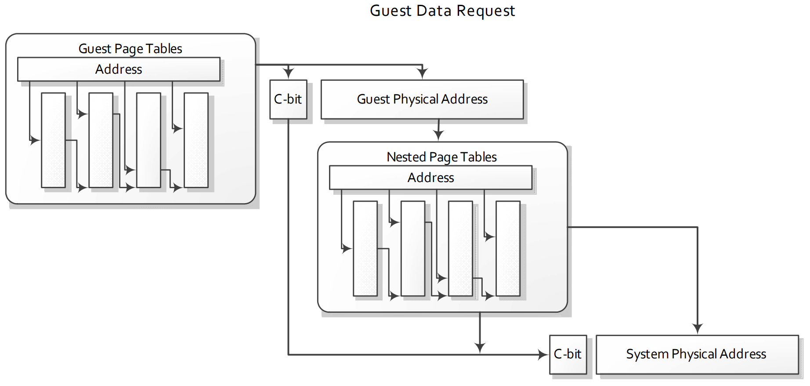

# APM-SEV

## 15.34 Secure Encrypted Virtualization

* 当 CPU 利用 AMD-V 虚拟化特性在 guest mode 下运行时，可启用 **安全加密虚拟化（Secure Encrypted Virtualization，简称 SEV）** 功能。
  * SEV 能够支持加密虚拟机（VM）的运行，在该模式下，虚拟机的代码与数据会受到安全保护，仅虚拟机自身内部可获取其解密版本。
  * 每个虚拟机可关联一个唯一的加密密钥：若其他实体使用不同密钥访问数据，SEV 加密虚拟机的数据会因解密密钥错误而无法正确解密，最终得到无法识别的乱码数据。
* 需重点注意的是，SEV 模式与 *标准 x86 虚拟化安全模型存在显著差异*
  * 在 SEV 模式下，hypervisor 不再能检查或修改 guest 的全部代码与数据。
  * 由 guest 管理的 guest 页表（guest page tables）可将数据内存页标记为 “私有”（private）或 “共享”（shared），允许被选中的页面在 guest 外部进行共享访问。
    * “私有页” 则通过 guest 专属密钥进行加密，
    * “共享页” 可被 hypervisor 访问。

### 15.34.1 确定对 SEV 的支持

* 内存加密功能的支持情况会在 CPUID `8000_001F [EAX]` 中报告，具体描述参见 7.10.1 节 “Determining Support for Secure Memory Encryption” 第 238 页。其中`Bit 1` 用于指示是否支持安全加密虚拟化。
* 当内存加密功能存在时，CPUID `8000_001F [EBX]` 和 `CPUID 8000_001F [ECX]` 会提供与内存加密使用相关的额外信息，例如，同时支持的密钥数量、用于将页面标记为加密状态的页表位等。
* 此外，在部分实现中，启用内存加密功能后，处理器的物理地址大小可能会缩减（例如从 `48` bits 缩减至 `43` bits）。
  * 以该示例而言，物理地址的第 `47` 至 `43` 位（`bits 47:43`）将被视为保留位，除非有其他特别说明。
  * 若某一实现支持内存加密，CPUID `8000_001F [EBX]` 会报告是否存在物理地址大小缩减的情况。
* **此模式下的保留位与其他页表保留位的处理方式一致：若在地址转换过程中发现这些保留位的值非零，将触发缺页异常（page fault）。**
* **译注**：这就杜绝 hypervisor 试图修改 PT/NPT 在 SPA 中嵌入信息的可能性。
  * 对于 TDX 也是类似的，当不在 SEAM mode 时，为编码 TDX private KeyID 而保留的物理地址位被视为保留位（详见 TDX CPU Arch Spec）：
    * 试图修改 PT 在 PA 中嵌入 keyID 会导致翻译线性地址（VA）时产生一个原因是 *保留位被修改* 的 `#PF`；
    * 试图修改 EPT 在 HPA 中嵌入 keyID 会导致翻译 GPA 时产生一次原因是 *EPT miscofig* 的 VM-Exit
* 有关内存加密功能的完整 CPUID 详情，可参见《卷 3》（Volume 3）的 E.4.17 节。
* **译注**：收集了一些 SEV 对物理地址空间影响的信息
* Using SEV with AMD EPYC Processors, Table 10-1: ASID bit usage

3rd and 2nd Gen AMD EPYC with `256` ASIDs (`8 bits`) and `16TB` DRAM | 3rd and 2nd Gen AMD EPYC with `512` ASIDs (`9 bits`) and `8TB` DRAM
-----------------------------|---------------------------
`64:52` 保留                 | `64:52` 保留
`51:44` asids/cbit `cbit=51` | `51:43` asids/cbit `cbit=51`
`43:0` 物理地址               | `42:0` 物理地址

* 例如，在 AMD EPYC 9654 上可见
```c
Architecture:            x86_64
  CPU op-mode(s):        32-bit, 64-bit
  Address sizes:         52 bits physical, 57 bits virtual
  Byte Order:            Little Endian
CPU(s):                  384
  On-line CPU(s) list:   0-383
Vendor ID:               AuthenticAMD
  BIOS Vendor ID:        Advanced Micro Devices, Inc.
  Model name:            AMD EPYC 9654 96-Core Processor
    BIOS Model name:     AMD EPYC 9654 96-Core Processor
    CPU family:          25
    Model:               17
    Thread(s) per core:  2
    Core(s) per socket:  96
    Socket(s):           2
    Stepping:            1
-------------------------------------------------------
encryption bit position in PTE           = 0x33 (51)
physical address space width reduction   = 0x6 (6)
number of VM permission levels           = 0x4 (4)
number of SEV-enabled guests supported   = 0x3ee (1006)
minimum SEV guest ASID                   = 0x1 (1)
```
* 由此可见，到了第四代 EPYC，SEV 支持了更多的 SEV-enabled guest，但对物理地址位的重用反而减少了

### 15.34.2 Key 管理
* 在本文档定义的内存加密扩展功能下，每个启用 SEV 的 geuest 虚拟机都关联有一个内存加密密钥，而 SME 模式（若使用，参见第 238 页的 7.10 节）则关联另一个独立密钥。
* SEV 功能的密钥管理不由 CPU 负责，而是由 AMD SOC（系统级芯片）上搭载的独立处理器 —— **AMD 安全处理器（AMD Secure Processor，简称 AMD-SP）** 处理。关于 AMD-SP 运行机制的详细讨论，超出了本手册的涵盖范围。
* CPU 软件无法感知这些密钥的具体值，但 hypervisor 应通过 *AMD-SP 驱动* 协调虚拟机密钥的加载。
  * 该协调过程还会确定 hypervisor 应为特定 guest 分配哪个 ASID（地址空间标识符）。
* 在 SEV 模式下，ASID 用作密钥索引，用于标识应使用哪一个加密密钥对与该启用 SEV 的 guest 相关的内存流量进行加密/解密。
* ==加密密钥本身始终对 CPU 软件不可见，且绝不会以明文形式存储在芯片外部。==

### 15.34.3 启用 SEV
* 在启动加密虚拟机之前，软件必须按照第 238 页 7.10.2 节 “Enabling Memory Encryption Extensions” 中的描述，将 `SYSCFG` MSR 中的 `MemEncryptionModEn` 设为 `1`。
* 之后，若 hypervisor 将 VMCB 偏移量 `0x090` 处的 **SEV 启用位**（`bit 1`）设为 `1`，则可在执行 `VMRUN` 指令期间，为特定虚拟机启用 SEV。
* 当 VMCB 中启用 SEV 后，`VMRUN` 指令执行过程中会额外进行以下一致性检查：
  * 必须启用嵌套分页（Nested paging）
  * 必须设置 `HWCR` MSR 中的 `SmmLock`（系统管理模式锁定）bit
  * ASID 不得大于 CPUID `Fn8000_001F_ECX [NumEncryptedGuests]` 所定义的最大值
* 若上述任一一致性检查失败，`VMRUN` 指令将终止，并返回 `VMEXIT_INVALID` 错误码。
* 若 `MemEncryptionModEn` 为 `0`，则无法启用 SEV，且 VMCB 中用于 SEV 的控制位将被忽略。
* 需注意，在 CPUID `Fn8000_001F_EAX[64BitHost]` 设为 `1` 的系统上，hypervisor 必须处于 64-bit 模式，才能执行 `VMRUN` 指令以启动 *SEV-enabled* 的 guest。
  * 若不满足此条件，`VMRUN` 将失败，并返回 `VMEXIT_INVALID` 错误码。

### 15.34.4 支持的操作模式
* 安全加密虚拟化（Secure Encrypted Virtualization，SEV）可在运行于任意操作模式的 guest 上启用。但 guest 仅能在 long mode 或传统物理地址扩展模式（legacy PAE mode） 下，对内存加密进行控制。
* 在所有其他操作模式下，guest 的所有内存访问都会被无条件判定为 “私有访问”，并使用该 guest 专属的密钥进行加密。

### 15.34.5 SEV 加密行为
* 当 guest 在启用 SEV 的情况下运行时，guest 页表用于确定内存页的 `C-bit`，进而确定该内存页的加密状态。
  * 这使得 guest 能够决定哪些页是私有页，哪些是共享页，**但这种控制仅适用于数据页**。
* 代表 *指令获取* 和 *guest 页表遍历* 进行的（guest 的）内存访问始终被视为私有访问，无论 `C-bit` 的软件值如何。
  * 此行为可确保非 guest 实体（如 hypervisor）无法向启用 SEV 的 guest 注入自己的代码或数据。
    * 如果 guest 确实希望让指令页或页表中的数据可被 guest 外部的代码访问，则必须将这些数据显式复制到共享数据页中。
  * 需要注意的是，虽然 guest 可以选择在 *指令页* 和 *页表地址* 上显式设置 `C-bit`，但在这种情况下，该位的值无关紧要，因为硬件始终会将这些访问作为私有访问来处理。

### 15.34.6 页表支持
* 启用 SEV 的 guest，会通过 CPUID `8000_001F [EBX]` 定义的 `C-bit`，在其自身的 guest 页表中控制加密操作。
  * 该 `C-bit` 的位置，与非虚拟化模式下 SME（安全内存加密）所定义的 `C-bit` 位置一致（参见第 238 页的 7.10 节 “安全内存加密”）。
  * 若 `C-bit` 属于地址位，则当通过嵌套页表进行转换时，此 bit 会从 guest 物理地址中被屏蔽。因此，hypervisor 无需知晓 guest 选择将哪些页标记为私有页。
* 例如，若 `C-bit` 为地址第 `47` 位，当 guest 访问虚拟地址 `0x54321` 时，该地址可能会被转换为 guest 物理地址 `0x8000_00AB_C321` —— 此地址表明该页需使用 guest 私有密钥进行加密。
  * 当该 guest 物理地址通过嵌套页表转换时，会使用 host 虚拟地址 `0xAB_C321` 执行转换操作。
  * 如图 15-30 所示，guest 物理地址中的 `C-bit` 数值会被保存，并在嵌套页表转换完成后，应用于最终的系统物理地址。
* 注意，由于 guest 物理地址始终需通过嵌套页表进行转换，因此 guest 物理地址空间的大小，不会受 CPUID `8000_001F [EBX]` 中指示的物理地址空间缩减影响。
  * 但如果 `C-bit` 本身属于物理地址位，则 guest 物理地址空间的大小会实际缩减 `1` 位。



* **译注**
* TDX 在处理 guest 缺页时需要根据 shared-bit 来区分是私有页面还是共享页面的缺页，fault in 和填 EPT 页表的路径是不同的。EPT 映射建立后，guest 的页面访问时，硬件会根据 shared-bit 是否设置去查 shared EPT 或 security EPT。
* TDX host 可以通过 `td_params->config_flags` 中的配置的 `TDX_CONFIG_FLAGS_MAX_GPAW` 了解到 guest shared-bit 的位置

### 15.34.7 限制

* 与 SME 类似，在部分硬件实现中，对于同一物理页使用不同加密使能状态或密钥的映射，硬件可能不强制保证一致性。
  * 在此类系统中，若要更改某一内存页的加密使能状态或密钥，软件必须先确保该页已从所有 CPU cache 中被刷新。
  * 但需注意，某些传统的 cache 刷新技术可能无法生效，具体细节请参见 15.34.9 节。
* 注意，若硬件实现如 CPUID `Fn8000_001F_EAX[10]`（hardware cache coher across enc domains）所示，能强制保证不同加密域之间的一致性，则无需执行上述 cache 刷新操作。

### 15.34.8 SEV 与 SME 的交互
* SEV 可与 SME 模式结合使用。在此场景下，guest 页表负责控制 guest 内存的加密，而 ==host（嵌套）页表负责控制 **共享内存** 的加密==。
* 表 15-30 对上述行为进行了总结。当 CPU 处于 guest 模式，且 guest 已在 VMCB 中启用 SEV 时，SEV 即被视为处于活跃状态。
* Table 15-30. Encryption Control

访问类型 | MemEntryptionModEn | Guest Mode | SEV Mode 激活 | 加密 | 加密 Key | 备注
--------|--------------------|------------|---------------|------|---------|--------
.       |.                   |.           |.              |.     |.        | **Legacy Mode（内存加密禁用）**
All     | 0                  | X          | X             | No   | N/A
.       |.                   |.           |.              |.     |.        | **Secure Memory Encryption Mode**
All     | 1                  | 0          | X             | 可选 | Host Key | 由页表决定（`CR3`）
All     | 1                  | 1          | 0             | 可选 | Host Key | 由嵌套页表决定（`hCR3`）
.       |.                   |.           |.              |.     |.        | **Secure Encrypted Virtualization Mode**
取指令  | 1                  | 1           | 1             | 是   | Guest Key | .
Guest 页表访问  | 1           | 1          | 1             | 是   | Guest Key | .
嵌套页表访问  | 1             | 1           | 1             | 可选 | Host Key  | 由嵌套页表决定（`hCR3`）
数据访问 | 1                  | 1           | 1 | 可选<sup>1</sup> | 见表 15-31：SEV/SME 交互 | 由 guest 页表（`gCR3`）和嵌套页表决定（`hCR3`）

**注意**：
1. 仅在 long mode 和 legacy PAE mode 下，内存加密由 guest 控制。在所有其他模式下，这些内存访问始终被判定为私有访问，并使用 guest 专属密钥进行加密。

* 注意，在嵌套页表遍历（nested page table walk）过程中，可能会出现 guest 页表和嵌套页表均处于加密状态的情况。
  * 在此场景下，guest 页表将通过 guest 私有加密密钥解密，而嵌套页表则通过 host（SME）加密密钥解密。
* 若 guest 将数据访问标记为共享（`C = 0`），但嵌套页表中该页被标记为加密状态，则仍可选择通过 host（SME）密钥对这些数据访问进行加密。
* ==若某一（数据）页在 guest 页表和嵌套页表中 **均被标记为加密**，则 **guest 页表具有优先级**，该页将通过 guest 密钥进行加密。==
* 表 15-31 对上述行为进行了总结。
* Table 15-31. SEV/SME Interaction

.              | .     | 嵌套页表          | 嵌套页表
---------------|-------|------------------|--------
.              | .     | C = 0            | C = 1
**Guest 页表** | C = 0 | 不加密            | 用 host key 加密
**Guest 页表** | C = 1 | 用 guest key 加密 | 用 guest key 加密

### 15.34.9 页面冲刷 MSR

* 如果不支持跨加密域的一致性（参见的 “15.34.7 限制” ），且 hypervisor 希望读取加密页，则必须首先从所有 CPU cache 中刷新该页的 guest 视图，以确保能够查看该数据的最新副本。
  * 这可以通过在 guest 运行过的所有内核上执行 `WBINVD` 指令，或使用 `VMPAGE_FLUSH` MSR（`C001_011E`）来实现。
  * CPUID `8000_001F [EAX]` 的第 `2` 位指示是否支持 `VMPAGE_FLUSH` MSR。
* `VMPAGE_FLUSH` MSR 是一个只写寄存器，可用于代替 guest 刷新 4KB 数据。
  * Hypervisor 将页的 **host 线性地址** 和 **guest ASID** 写入该 MSR，之后硬件会对该页执行写回无效（write-back invalidation）操作，使系统中所有 CPU cache 内的脏数据都被加密并写入 DRAM。
* 注意，`VMPAGE_FLUSH` MSR 使用标准的 host 页表来执行页转换。Page Flush MSR 操作会命中并逐出内存的 guest-cached 的实例，而使用相同转换的 `CLFLUSH` 指令则不会。

Bit[s]  | 描述
--------|----------------------------------------------
`63:12` | **虚拟地址**：只写。要冲刷的页面的 host 虚拟地址
`11:0`  | **ASID**：只写。冲刷用到的 guest ASID

* `VMPAGE_FLUSH` MSR 仅会刷新被 guest 标记为 “私有” 的内存页。若 hypervisor 无法确定某内存页是否被标记为 “私有”，但仍希望将该页从 cache 中逐出，则除使用 `VMPAGE_FLUSH` MSR 外，还应执行标准的 `CLFLUSH` 指令。
* 若尝试刷新未映射到物理地址的 host 虚拟地址，或使用 `ASID = 0`，将触发 `#GP (0)` 故障。
  * 若 SMAP（ supervisor-mode access prevention，超级用户模式访问保护）已启用，则输入地址需在页表中映射为超级用户（supervisor）地址。
* 若支持跨加密域的一致性，则无论 guest 是否将内存页标记为 “私有”，均可使用 `CLFLUSH` 指令将 guest 页从 cache 中逐出。

### 15.34.10 `SEV_STATUS` MSR

* Guest 可通过读取 `SEV_STATUS` MSR（`C001_0131`），确定当前哪些 SEV 功能处于活跃状态。
* 如表 15-32 所示，该 MSR 会指示在针对该 guest 的上一次 `VMRUN` 指令中，哪些 SEV 功能已被启用。
* `SEV_STATUS` MSR 为只读寄存器，且 hypervisor 无法拦截对该 MSR 的访问操作。
* 此 MSR 仅在支持 SEV 功能的处理器上可用。
* Table 15-32. SEV_STATUS MSR Fields

Bit[s]  | 描述
--------|----------------------------------------------
63:24   | 保留
23      | **IbpbOnEntry_Active**: IBPB on Entry feature is enabled in SEV_FEATURES[21]
22-18   | 保留
18      | **SecureAVIC_Active**: Secure AVIC feature is enabled in SEV_FEATURES[16]
17      | **SmtProtection_Active**: SMT Protection feature is enabled in SEV_FEATURES[15]
16      | **VmsaRegProt_Active**: VMSA Register Protection feature is enabled in SEV_FEATURES[14] 
15      | **GuestInterceptCtl_Active**: Guest Intercept Control feature is enabled in SEV_FEATURES[13]
14      | **IbsVirtualization_Active**: IBS Virtualization feature is enabled in SEV_FEATURES[12]
13      | **PmcVirtualization_Active**: PMC Virtualization feature is enabled in SEV_FEATURES[11]
12      | **VmgexitParameter_Active**: `VMGEXIT` Parameter feature is enabled in SEV_FEATURES[10]
11      | **SecureTsc_Active**: Secure TSC feature is enabled in SEV_FEATURES[9]
10      | **VmplSSS_Active**: VMPL SSS feature is enabled in SEV_FEATURES[8]
9       | **SNPBTBIsolation_Active**: BTB isolation feature is enabled in SEV_FEATURES[7]
8       | **PreventHostIBS_Active**: PreventHostIBS feature is enabled in SEV_FEATURES[6]
7       | **DebugVirtualization_Active**: Debug Virtualization feature is enabled in SEV_FEATURES[5]
6       | **AlternateInjection_Active**: Alternate Injection feature is enabled in SEV_FEATURES[4]
5       | **RestrictedInjection_Active**: Restricted Injection feature is enabled in SEV_FEATURES[3]
4       | **ReflectVC_Active**: ReflectVC feature is enabled in SEV_FEATURES[2]
3       | **vTOM_Active**: Virtual TOM feature is enabled in SEV_FEATURES[1]
2       | **SNP_Active**: SNP-Active mode is selected by SEV_FEATURES[0]
1       | **SEV_ES_Enabled**: SEV-ES feature is enabled in VMCB offset `0x90`
0       | **SEV_Enabled**: SEV feature is enabled in VMCB offset `0x90`

### 15.34.11 虚拟透明加密（VTE）
* 虚拟透明加密（Virtual Transparent Encryption）功能启用后，可强制 SEV guest 内的所有内存访问均使用 guest 密钥进行加密。
* CPUID `Fn8000_001F [EAX]` 的第 `16` 位用于指示是否支持该功能。
* 若要启用此功能，hypervisor 必须将 VMCB 偏移量 `0x90` 的第 `5` 位设为 `1`。
  * 只有当 SEV（第 `1` 位）也被设为 `1` 且 SEV-ES（第 `2` 位）被清为 `0` 时，第 `5` 位才会被硬件识别。
  * 在这些位的所有其他配置下（即 SEV 禁用或 SEV-ES 启用时），硬件会忽略第 `5` 位。
* 启用此功能后，CPU 硬件会将所有 guest 内存引用的 guest `C-bit` 视为 `1`。此时，guest 页表中实际的 `C-bit` 会被硬件忽略。
* Guest 地址转换不受影响，因此嵌套页表转换时会使用（不含 `C-bit` 的）guest 物理地址。

## 15.35 Encrypted State（SEV-ES）

* 使用第 15.34 节所述 SEV 功能的加密虚拟机，还可额外启用 SEV-ES 功能，以保护 guest 寄存器状态不被 hypervisor 访问。
* SEV-ES 虚拟机的 CPU 寄存器状态会在世界切换（world switch）过程中被加密，hypervisor 无法直接访问或修改该状态。
* 该设计旨在防御多种攻击，例如：
   * 数据窃取攻击（exfiltration，未授权读取虚拟机状态）
   * 控制流攻击（修改虚拟机状态）
   * 回滚攻击（恢复虚拟机此前的寄存器状态）
* SEV-ES 包含架构级支持：当特定类型的世界切换即将发生时，会向虚拟机的操作系统发送通知；这使得虚拟机在功能需要时，能够有选择地与 hypervisor 共享信息。

### 15.35.1 确定对 SEV-ES 的支持情况
* SEV-ES 的支持情况可通过读取 CPUID `Fn8000_001F [EAX]` 来确定，具体说明参见 15.34.1 节。
* 其中 `EAX` 寄存器的第 `3` 位（`Bit 3`）用于指示是否支持 SEV-ES。

### 15.35.2 启用 SEV-ES
* 通过将 VMCB 偏移量 `0x90` 的第 `2` 位设为 `1`，可基于单个虚拟机启用 SEV-ES 功能。
* 启用 SEV-ES 时，hypervisor 还必须同时启用 SEV（偏移量 `0x90` 的第 `1` 位）和 LBR 虚拟化（偏移量 `0xB8` 的第 `0` 位）。
* 此外，运行 SEV-ES guest 时，所有与启用 SEV 相关的其他编程要求（参见 15.34.3 节）也必须满足。
* 在部分系统中，对于禁用 SEV-ES 的 SEV guest，其可使用的 ASID 值存在限制。
  * 虽然 SEV-ES 可在任何有效的 SEV ASID（定义于 CPUID `Fn8000_001F [ECX]`）上启用，但对于禁用 SEV-ES 的 SEV guest，其可使用的 ASID 存在限制。
  * CPUID `Fn8000_001F [EDX]` 会指示 “启用 SEV 但禁用 SEV-ES 的 guest” 必须使用的最小 ASID 值。
  * 例如，若 CPUID `Fn8000_001F [EDX]` 返回值为 `5`，则所有使用 ASID `1-4` 且启用 SEV 的虚拟机，都必须同时启用 SEV-ES。
* 注意，首次运行 SEV-ES 虚拟机前，hypervisor 必须与 AMD 安全处理器（AMD Secure Processor）协同，为该 guest 虚拟机创建初始加密状态镜像。

### 15.35.3 SEV-ES 概览

* SEV-ES 架构在设计上默认保护 guest VM 的寄存器状态，仅允许 guest VM 自身根据需求授权选择性访问。这一额外的安全保护功能通过两种方式实现：
  1. 当发生虚拟机退出事件（`#VMEXIT`）时，所有虚拟机寄存器状态都会被保存并加密。该状态仅会在执行 `VMRUN` 指令时被解密并恢复。
  2. 特定类型的 `#VMEXIT` 事件会在 guest VM 内部触发一个新的异常。
     * 此新异常（`#VC`，详见 15.35.5 节）表明 guest VM 执行了某项需要 hypervisor 参与的操作，例如虚拟机发起的 I/O 访问。
     * Guet 的 `#VC` 处理程序负责判断：为了让 hypervisor 模拟该操作，需要向其暴露哪些寄存器状态。
     * 此外，`#VC` 处理程序还会检查 hypervisor 返回的值，若判定输出可接受，则更新 guest 状态。
* 需要暴露的寄存器状态会借助一种名为 “**Guest-Hypervisor Communication Block**，简称 **GHCB**）” 的新结构来存储。
* GHCB 的位置由 guest 指定，guest 将其所在页面映射为共享内存页，从而允许 hypervisor 直接访问。
* 只有存储在 GHCB 中的状态可被 hyperviosr 读取 —— ==因为传统 VMCB 保存状态结构中存储的所有状态，均使用 guest 内存加密密钥进行加密，并受到完整性保护==。
* 在 `#VC` 处理程序中，guest 可使用一条新指令（详见 15.35.6 节）执行世界切换（world switch）并调用 hyperviosr。
* 作为响应，hyperviosr 可检查 GHCB，并确定 guest 请求的服务类型。

### 15.35.4 退出的类型

* 当 SEV-ES 启用时，所有 `#VMEXIT` 事件会被归类为 “自动退出（Automatic Exits，简称 AE）” 或 “非自动退出（Non-Automatic Exits，简称 NAE）” 两类。
  * AE 事件通常是与 guest 执行过程异步发生的事件（例如中断），或是无需暴露任何 guest 寄存器状态的事件。
  * 所有其他 `#VMEXIT` 事件均归类为 NAE 事件；对于 NAE 事件，guest 可自主决定在 GHCB 中暴露哪些寄存器状态（若需暴露）。
* 在 guest 执行期间，仅当 VMCB 控制区域中对应的拦截位被设为 `1` 时，`#VMEXIT` 事件（包括 AE 和 NAE）才会被触发。
* Hypervisor 仅能通过 VMCB 控制区域 `EXITCODE` 字段中的 `#VMEXIT` codes，获知特定的 AE 事件；而 NAE 事件会触发 `#VC`异常，并由 guest 处理。
* 表 15-33 列出了所有可能的 AE 事件，其余所有事件均被视为 NAE 事件。
* Table 15-33. AE Exitcodes

代码 | 名称                    | 备注                   | 硬件把 `RIP` 提前
-----|------------------------|------------------------|----
52h  | VMEXIT_MC              | Machine check 异常     | No
60h  | VMEXIT_INTR            | 物理中断                | No
61h  | VMEXIT_NMI             | 物理 NMI                | No
62h  | VMEXIT_SMI             | 物理 SMI                | No
63h  | VMEXIT_INIT            | 物理 INIT               | No
64h  | VMEXIT_VINTR           | 虚拟中断                | No
77h  | VMEXIT_PAUSE           | `PAUSE` 指令            | Yes
78h  | VMEXIT_HLT             | `HLT` 指令              | Yes
7Fh  | VMEXIT_SHUTDOWN        | 关闭                    | No
8Fh  | VMEXIT_EFER_WRITE_TRAP | 见 15.35.10 节          | Yes
90h -9Fh | VMEXIT_CR[0-15]_WRITE_TRAP | 见 15.35.10 节  | Yes
A5h  | VMEXIT_BUSLOCK         | Bus Lock 阈值           | No
A6h  | VMEXIT_IDLE_HLT        | 如果 `HLT` 指令 idle     | Yes
400h | VMEXIT_NPF             | 只有当 `PFCODE[3]=0`     | No
403h | VMEXIT_VMGEXIT         | `VMGEXIT` 指令          | Yes
–1   | VMEXIT_INVALID         | 无效的 guest 状态         | –
–2   | VMEXIT_BUSY            | `BUSY` bit 在 VMSA 中设置 | –
-3   | VMEXIT_IDLE_REQUIRED   | sibling thread 不是 idle | –
-4   | VMEXIT_INVALID_PMC     | 无效的 PMC 状态           | –