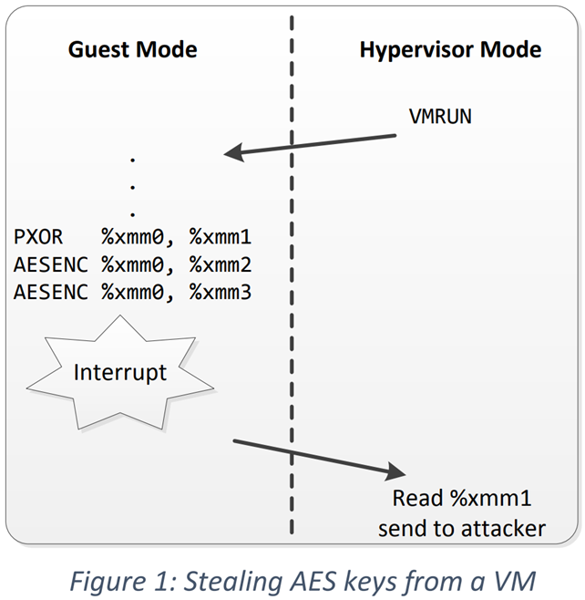
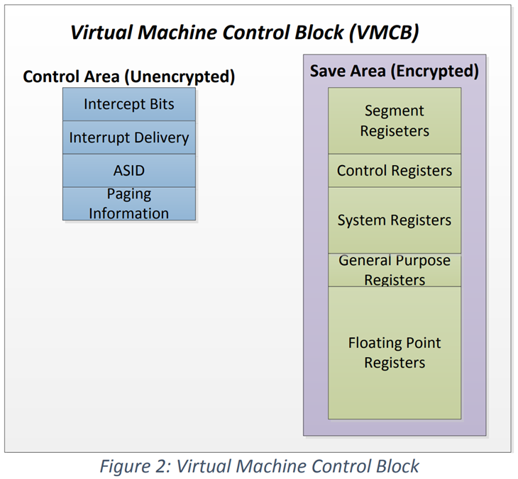
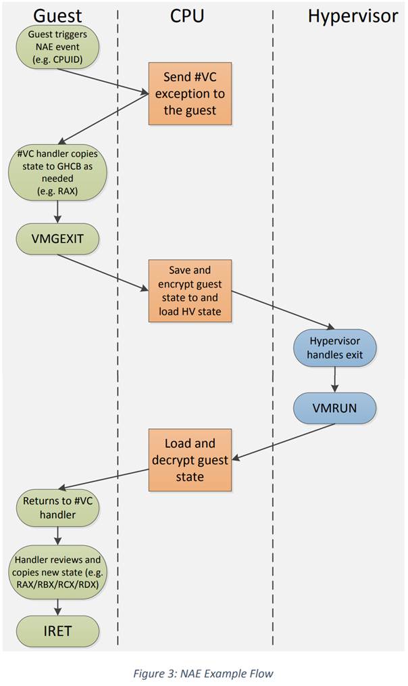

# SEV-ES

## 介绍
* 近期，AMD 推出了 **安全加密虚拟化（SEV，Secure Encrypted Virtualization）** 技术。
  * 该技术将内存加密与 AMD-V 虚拟化技术相结合，为加密虚拟机（VM，Virtual Machine）提供支持。
  * 加密虚拟机非常适用于云计算等多租户环境，因为它能防范各类跨虚拟机攻击和基于虚拟机监控程序（hypervisor）的攻击。
  * 例如，若 hypervisor 存在漏洞，导致共存的其他虚拟机突破自身隔离环境并读取系统任意内存，此类漏洞也无法用于窃取启用 SEV 的虚拟机数据或破坏其安全性。
* 尽管没有任何安全系统能达到 100% 的安全性，但 SEV 通过以下方式大幅缩小了云中虚拟机的攻击面：为每个虚拟机分配唯一的密钥，并用该密钥对虚拟机内存进行加密，且此密钥对 hypervisor 不可见。
  * 虚拟机的内存空间中通常存储着大量敏感信息和重要数据，对这些内容进行加密有助于防范攻击，避免敏感数据泄露。
* 然而，当虚拟机正在使用敏感信息时，这些信息往往不仅存在于内存中，还会驻留在 CPU 寄存器内。
  * 每当虚拟机因中断或其他事件暂停运行时，其寄存器内容会被保存到 hypervisor 的内存中 —— 即便启用了 SEV，hypervisor 仍能读取这部分内存。
  * 对于恶意或已被攻陷的 hypervisor 而言，这些信息可能使其得以窃取数据，或篡改 guest 状态中的关键值（如指令指针、加密密钥等）。
* 新推出的 “**带加密状态的 SEV（SEV-ES，SEV with Encrypted State）**” 特性，通过在虚拟机暂停运行时对所有 CPU 寄存器内容进行加密和保护，阻断了上述这类攻击。
  * 这一机制可防止 CPU 寄存器中的信息泄露给 hypervisor 等组件，甚至能检测并阻止对 CPU 寄存器状态的恶意篡改。
  * SEV-ES 基于 SEV 技术构建，进一步缩小了攻击面，为客户机虚拟机提供了更强的防护能力，使其免受来自 hypervisor 的威胁。
* 本文档从技术层面概述了 SEV-ES 特性、其架构设计背后的原理，以及该特性为进一步隔离加密虚拟机所提供的防护措施。如需了解更多技术细节，请参阅《AMD64 程序员手册》（AMD64 Programmer's Manual）。

## 安全目标

* SEV-ES（带加密状态的安全加密虚拟化）技术旨在保护 guest VM 的寄存器状态，防范来自恶意 hypervisor 的攻击。
  * 这类攻击可能包括读取 guest 寄存器值、写入恶意值，甚至将旧状态重放至虚拟机中。
* 恶意 hypervisor 读取客户机寄存器值，可能导致敏感数据被隐秘窃取。
  * 例如，x86 架构的 `AES` 指令执行时，通常会将 `AES` 密钥存储在 XMM 寄存器中，攻击者可通过读取该寄存器获取密钥。
  * 而写入恶意值则可能直接或间接篡改 guest VM 的控制流 —— 比如在虚拟机恢复运行时覆盖指令指针（`RIP`）。这种篡改可能导致 guest VM 内部出现非预期行为，例如跳过关键的安全检查。
* SEV-ES 通过对 guest VM 的寄存器状态进行加密和完整性保护，抵御上述各类攻击。

* 保护虚拟机寄存器状态面临一项挑战：在某些情况下，hypervisor 确实需要访问虚拟机寄存器，以提供设备模拟、MSR（模型专用寄存器）处理等服务。
  * 这些访问必须受到严格控制，以防止被恶意利用 —— 但此类恶意行为往往难以检测。
  * 为解决这一问题，SEV-ES 技术允许 guest VM 根据具体场景，自主决定向 hypervisor 暴露哪些信息。
  * 这一设计原则与 SEV（基础安全加密虚拟化）类似：在 SEV 中，guest VM 可自主控制共享哪些内存页面。
  * 将此类控制功能交由 guest VM 实现，既能保证灵活性，也能针对不同场景进行定制化配置。

## 技术概览

### 加密寄存器状态

* 在传统 AMD-V 架构中，保存和恢复 guest VM 的寄存器状态是一个多步骤流程。
  * 用于将控制权转移给 guest VM 的 `VMRUN` 指令，仅能保存和加载整机状态中的一部分。
  * 许多状态数据（包括任务寄存器（`TR`）等系统寄存器，以及 `RDX` 等通用寄存器）无法通过 `VMRUN` 指令自动保存和恢复。
  * 因此，在恢复 guest 运行前，常规的 hypervisor 还需
    * 加载 guest 的通用寄存器（GPR）值、
    * 通过 `VMLOAD` 指令加载额外的系统状态，
    * 甚至可能需要通过 `XRSTOR` 指令加载 guest 的浮点寄存器状态。
* SEV-ES 架构将上述整个操作整合为一条原子化硬件指令 —— `VMRUN`。
  * 当为启用 SEV-ES 的 guest 执行 `VMRUN` 指令时，CPU 硬件会加载所有 guest 寄存器信息，包括系统寄存器、通用寄存器（GPR）和浮点寄存器。
  * 同样，当虚拟机停止运行（即所谓的 “VMEXIT”）时，硬件会自动将所有这些状态保存回内存，并加载 hypervisor 的状态。
  * 这种单一原子化流程确保了 hypervisor 与 guest 之间的 “世界切换”（world switch）不会被中断，且 guest 的信息不会泄露到 hypervisor 中。
* 硬件在保存和恢复 guest 寄存器状态时，会将数据存储到用虚拟机内存加密密钥加密的内存中。
  * 该密钥对 CPU 上的所有软件均不可见，hypervisor 也无法使用，因此 hypervisor 无法读取 guest 寄存器的实际状态。
  * 此外，在保存寄存器状态时，CPU 会计算一个完整性校验值（integrity-check value），该值被存储在受保护的 DRAM 中 —— 这部分 DRAM 对所有 CPU 软件均不可访问。
  * 后续当通过 `VMRUN` 指令恢复 guest 运行时，CPU 会校验该完整性校验值，以确保 guest 寄存器状态未被 hypervisor 篡改。
* 因此，SEV-ES 架构不仅能确保 guest 寄存器内容对 hypervisor 保密，还能防止 hypervisor 轻易篡改或重放这些状态。
  * 自上次 VM-Exit 以来，若寄存器状态存在任何此类篡改，完整性校验值都能检测出来；
  * 若完整性校验值不正确，CPU 将拒绝恢复 guest VM 的运行。
  * 换言之，guest VM 仅能恢复到其上次停止时的精确状态。

* 需注意的是，在 SEV-ES 架构中，用于描述特定虚拟机的 **虚拟机控制块（VMCB，Virtual Machine Control Block）** 被划分为两个部分：
  * 第一部分称为 “控制区（control area）”，由 hypervisor 拥有和管理，包含 hypervisor 希望拦截的事件信息、中断传递信息等内容；
  * 第二部分即 “保存区（save area）”，用于存储虚拟机寄存器状态。
* 当 SEV-ES 启用时，该区域会按上述方式进行加密，并受到完整性保护。

### VM "Exits"

* 执行 `VMRUN` 指令后，CPU 硬件会继续运行 guest VM，直至发生导致虚拟机退出的事件（即 “VM Exit”）。
* AMD64 架构定义了可能触发 VMEXIT 的具体事件，hypervisor 可通过设置 VMCB 控制区中的 “**拦截位（intercept bits）**”，配置哪些事件会触发 VMEXIT。
  * 例如，hypervisor 可设置拦截位，使外部中断、对控制寄存器的写入操作、对特定端口的读取操作等事件触发 VMEXIT。
  * 在传统 AMD-V 架构中，当 VMEXIT 事件发生时，CPU 硬件会将控制权交还给 hypervisor，并返回一个事件代码，用于指示触发 VMEXIT 的原因。
* 在 SEV-ES 架构中，所有可能的 VMEXIT 事件被划分为两组，分别称为 “**自动退出（AE，Automatic Exits）**” 和 “**非自动退出（NAE，Non-Automatic Exits）**”。
  * 通常而言，当 guest VM 执行需要 hypervisor 进行模拟处理的操作（如内存映射 I/O（MMIO）、访问模型专用寄存器（MSR）等）时，会触发 NAE 事件；
  * 与之相反，AE 事件无需 hypervisor 进行任何模拟处理，这类事件包括异步中断、shutdown 事件以及特定类型的页错误。
* 当 SEV-ES 启用时，AE 事件是唯一会触发完整 “世界切换（world switch）” 并将控制权交还给 hypervisor 的 VMEXIT 事件。
  * 如前所述，这类事件会促使 CPU 硬件保存并加密所有 guest 寄存器状态，同时加载 hypervisor 状态。
  * Hypervisor 完成所需执行的任务后，可通过 `VMRUN` 指令恢复 guest 运行 —— 该指令会将控制权交还给 guest，并从其暂停的位置继续执行。
* 与 AE 事件不同，NAE 事件的触发始终源于 guest 内部的特定行为，例如执行特定指令、访问经模拟的设备寄存器等。
  * 且与传统 AMD-V 虚拟化不同：当 SEV-ES 启用时，这些事件不会触发 “世界切换” 以将控制权交还给 hypervisor；
  * 相反，当 NAE 事件发生时，系统会生成一个新的异常 —— `#VC`（**虚拟化通信异常，VMM Communication Exception**），该异常必须由 guest VM 自行处理。

### VMM Communication 异常（#VC）

* 新的 `#VC` 异常会通知 guest VM 操作系统：其执行的某一操作需要 hypervisor 进行仿真处理。
  * 随后，`#VC` 异常处理程序必须决定如何响应，并向 hypervisor 请求相应服务。
* 为便于实现这一通信过程，SEV-ES 架构定义了 “**客户机 - 监控程序通信块（GHCB，Guest Hypervisor Communication Block）**”。
  * GHCB 位于一块共享内存页中，因此 guest VM 和 hypervisor 均可访问。
  * SEV-ES 架构未明确规定 GHCB 的具体结构，但建议其镜像 VMCB 的保存区设计，以便 guest 与 hypervisor 便捷地传递状态信息。
* **译注**：TD guest 通过 tdcall<`TDG.VP.VEINFO.GET`> 获取 VE info 结构的信息，通过 tdcall<`TDG.VP.VMCALL`> 的 GHCI 规范，通过寄存器将信息传递给 VMM
  * 此时，用 TDX hypercall Leaf ID `.r10 = TDX_HYPERCALL_STANDARD = 0`，`.r11 = hcall_func(EXIT_REASON_CPUID)` 传递退出原因
  * 类似 `TDVMCALL_MAP_GPA`、`TDVMCALL_GET_QUOTE` 用的是其他的 TDX hypercall Leaf ID
* 不同事件需要 guest 与 hypervisor 之间传递不同的状态数据。因此，`#VC` 处理程序必须在运行时判断应向 hypervisor 暴露哪些 guest 状态信息。
  * 例如，若 guest 尝试执行 `CPUID` 指令而触发 `#VC` 处理程序，为获取 `CPUID` 模拟服务，guest 应向 hypervisor 共享执行该指令时使用的 `RAX` 寄存器值；
  * 反之，若 guest 通过 `OUTW` 指令尝试向端口写入数据，则应共享 `AX` 和 `DX` 寄存器的值，依此类推。
* 为共享所需信息，`#VC` 处理程序会将相关状态数据及 hypervisor 服务请求复制到 GHCB 中。通过这种方式，`#VC` 处理程序可自主决定向 hypervisor 暴露哪些状态信息。
* 复制完相关状态后，`#VC` 处理程序通过新的 `VMGEXIT`（**虚拟机通用退出，Virtual Machine General Exit**）指令将控制权转移给 hypervisor。
  * 该指令会触发一次 AE Exit，此时 CPU 会保存所有 guest 状态，并恢复 hypervisor 的执行。
* 至此，hypervisor 通过读取 GHCB，即可确定 guest 所需的模拟支持。
  * 由于 hypervisor 无法直接修改 guest 状态，它需执行必要的模拟操作，并将 guest 所需的新状态值回写到 GHCB 中。
  * 例如，完成 `CPUID` 模拟后，hypervisor 应将 `RAX/RBX/RCX/RDX` 寄存器的新值写入 GHCB。
* 当 hypervisor 恢复 guest 运行时，guest 将从 `VMGEXIT` 指令执行后的暂停位置继续运行，且仍处于 `#VC` 处理程序内部。
* 此时，`#VC` 处理程序可检查 GHCB 中 hypervisor 请求的状态变更，并判断这些变更是否可接受。
  * 若可接受，处理程序会将新状态复制到相关寄存器中，随后完成异常处理流程。
  * 该 `#VC` 处理程序的流程示例下图所示。

### 初始化 SEV-ES VM

* SEV-ES VMs 的初始化流程与现有 SEV VMs 的初始化流程极为相似。需注意的是，在 SEV-ES 架构下，guest VM 启动执行前，其初始内存镜像与初始 CPU 寄存器状态均需由 AMD 安全处理器（AMD-SP）加密。
* 在初始化过程中，AMD-SP 会对内存镜像与初始 CPU 寄存器状态进行密码学度量（cryptographic measurement），生成一份 “启动回执（launch receipt）”
  * 该回执可用于 guest 的远程证明（attestation）。
  * 通过这一证明机制，guest VM 的所有者可在向虚拟机交付敏感信息（secrets）前，确认虚拟机是否已使用正确的镜像与寄存器状态成功启动。

## 软件影响

* 与 SEV 特性一致，支持 SEV-ES 无需修改任何应用程序代码，仅会对 guest OS 和 hypervisor 产生影响。
  * 具体而言，guest OS 需支持处理新的 `#VC` 异常，并能与 hypervisor 通信以获取所需的模拟支持。
  * 需注意的是，由于所有 NAE 事件均会触发新的 `#VC` 异常，guest OS 中的驱动程序无需修改，也无需感知 SEV-ES 的存在。所有为获取模拟支持而与 hypervisor 进行的通信，均通过一个集中式处理程序完成。
* 由于 SEV-ES 下 hypervisor 无法查看 guest 寄存器状态，hypervisor 软件必须支持通过新的 GHCB 结构与 guest 的 `#VC` 处理程序通信。
  * 在多数情况下，这仅需调整为：响应模拟请求时读写 GHCB 结构，而非此前的 VMCB（虚拟机控制块）。
  * 此外，在 SEV-ES 架构中，许多与模拟相关的任务（如指令解析 / 重执行）实际上被转移到了 guest 内部的 `#VC` 处理程序中，这意味着 hypervisor 所需提供的模拟支持大幅减少。

## 性能优化

* 尽管 SEV-ES 的主要目标是保护 guest 寄存器状态，并让 guest 自主掌控可被访问的信息，但 `#VC` 异常也为优化 guest 与 hypervisor 的通信提供了契机。
* 具体而言，guest 的 `#VC` 处理程序有望通过实现特定逻辑，减少 “世界切换（world switch）” 的次数，或在 guest 内部直接处理部分 NAE 事件。
  * 例如，`#VC` 处理程序可缓存静态值（如 `CPUID` 指令的执行结果），或将多个 hypervisor 服务请求批量整合，通过单次 `VMGEXIT` 指令提交。
  * 要支持这类优化，可能需要 guest 与 hypervisor 之间进行专门的通信协调。

## 结论

* SEV-ES 特性通过硬件强制手段，为 guest VM 提供了更强的安全隔离能力，使其免受 hypervisor 的威胁。
* 该特性在 SEV 所提供的内存保护基础上进一步拓展，为 guest 寄存器状态提供机密性与完整性双重保护，防范监控程序造成的信息泄露与控制流篡改风险。
  * SEV-ES 赋予 guest VM 全程自主控制权，使其能决定 hypervisor 可查看和修改哪些状态数据；
  * 同时，该特性可支持设备模拟等现有功能，且无需对设备驱动程序与 hypervisor 进行大幅修改。
* 尽管 SEV 已通过内存加密缩小了虚拟机的攻击面，但 SEV-ES 对 guest 寄存器状态的保护进一步升级，为防范来自已被攻陷监控程序的威胁提供了更全面的安全保障。