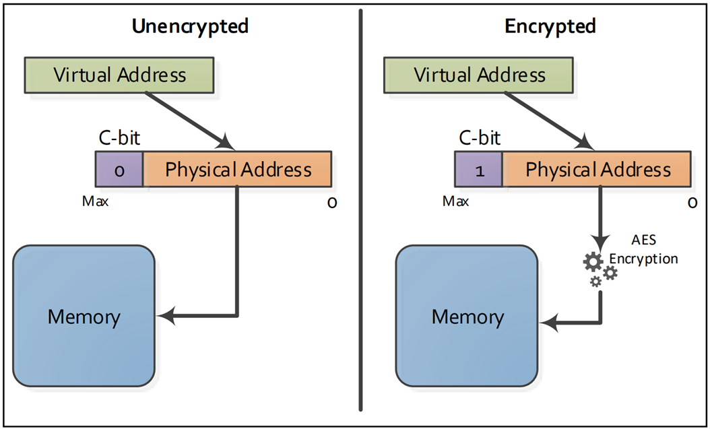
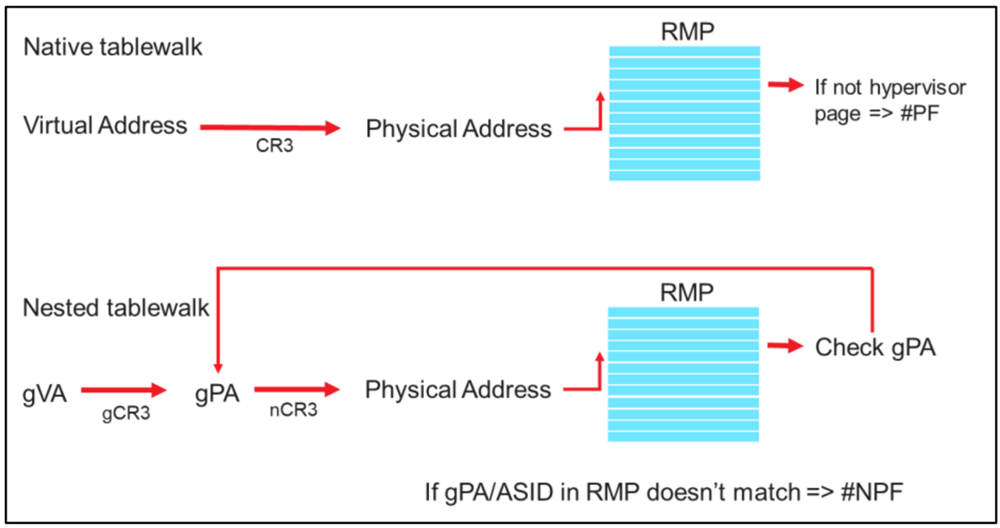
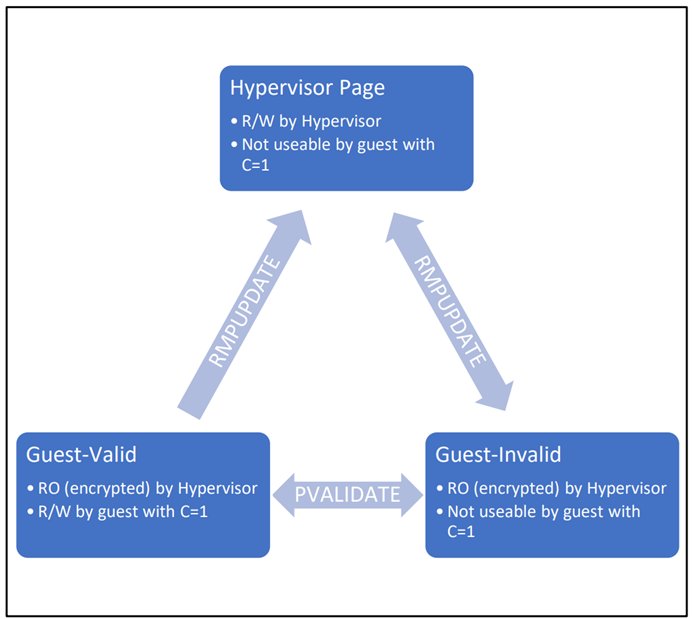

# SEV-SNP

## 完整性的例子

* AMD SEV 系列技术所采用的 AES 加密（高级加密标准加密），为内存提供了更强的机密性保护。
  * 攻击者若不知晓加密密钥，便无法破解存储在 DRAM 中的 VM 数据。
  * SEV 内存加密密钥本身由硬件随机数生成器生成，并存储在专用硬件寄存器中，软件无法直接读取该寄存器。
  * 此外，硬件在设计上确保：相同的明文数据存储在不同内存地址时，加密后的密文会有所不同（避免相同明文对应固定密文的安全风险）。
* 尽管有加密保护，动机明确的攻击者仍可能尝试篡改内存中的数据 —— 即便其不知晓加密密钥。这类攻击被称为 “完整性攻击”，因为它们会导致内存中的数据偏离虚拟机预期的正常值。
* 虽然攻击者在没有加密密钥的情况下，难以向虚拟机内存中植入已知数据，但他们仍可能破坏内存完整性，使虚拟机读取到随机值，或实施 “重放攻击”。
  * 在重放攻击中，攻击者会先捕获某一时刻的内存密文，之后再用此前捕获的密文替换当前内存数据。
  * 若攻击者知晓原始数据的内容，这类攻击的成功率会更高。
* 完整性攻击本身并不会直接破坏虚拟机的安全性，只有当虚拟机内部的软件使用了被篡改的数据时，才可能导致安全漏洞或信息泄露。
  * 此类攻击能否成功，取决于虚拟机内部的软件特性，以及软件在遇到被篡改数据时的行为表现。
  * 由于虚拟机中的软件通常无法感知自身内存完整性是否已被破坏，因此其在该场景下的行为往往难以预测。
* SEV-SNP 的设计目标之一，便是防范基于软件的完整性攻击，并降低内存完整性被破坏所带来的风险。
* SEV-SNP 完整性保护的核心原则是：**若某一虚拟机能够读取某一私有（加密）内存页，那么它读取到的必须始终是该虚拟机上次写入该页面的值**。
  * 这意味着，若虚拟机向内存地址 `X` 写入了值 `A`，那么后续它读取地址 `X` 时，要么得到值 `A`，要么触发 “内存无法读取” 的异常 —— SEV-SNP 的设计确保虚拟机不会从地址 `X` 中读取到其他非预期值。
* 为支持标准的虚拟机任务，这一完整性保障需满足：无论在 “上次写入” 与 “本次读取” 之间内存发生何种操作（如页面交换、虚拟机迁移），该保障都必须持续有效。
  * 即便内存页被交换到磁盘，甚至整个虚拟机迁移到新 host，完整性保障仍需成立。
  * 要强制实施这一完整性保障，需结合新的 CPU 硬件与固件功能，本文后续章节将对此展开讨论。
* 在典型使用场景中，虚拟机不仅要执行自身任务，还需通过 I/O 与外部实体通信，例如通过网络链路、存储服务器或其他组件进行数据交互。在 SEV 架构中，这类通信通过 “共享（未加密）内存” 实现：
  * 虚拟机若希望对外提供数据，需将数据放入共享内存页；
  * 外部传入虚拟机的数据，也需先放入共享内存页。
  * 由于共享内存未使用虚拟机专属密钥加密，为保障 I/O 通信的安全性，应采用 HTTPS 等合适的软件加密协议。

* AMD SEV 虚拟机通过 guest 页表中的 “**加密位（C-bit，enCrypted bit）**”，控制内存页为 “私有” 或 “共享” 状态。
  * `C-bit` 的具体位置由实现方式定义，可能是物理地址的最高位（如图 1 所示）。
  * 虚拟机将共享（未加密）内存标记为 `C=0`，表明该内存无需使用虚拟机的内存加密密钥加密；
  * 私有（加密）内存页仅供该虚拟机独占使用，被标记为 `C=1`。
* 在典型的虚拟机配置中，大部分内存页会被标记为私有，仅有用于外部通信的特定内存页会被标记为共享。
* 与 SEV 的机密性保障一致，SEV-SNP 的完整性保障也仅适用于 guest 的私有内存页。

## 威胁模型的细节

* 与早期的 SEV 和 SEV-ES 特性一致，在 SEV-SNP 架构下，AMD 系统级芯片（SoC，System-On-Chip）硬件、AMD 安全处理器（AMD-SP）以及虚拟机（VM）本身均被视为完全可信的组件。
  * 其中，虚拟机需自行负责保护自身及相关接口的安全，并应遵循标准最佳实践，保护其使用的所有 I/O（输入 / 输出）数据（如网络流量、硬盘数据等）。
  * 为此，AMD 强烈建议为受保护虚拟机搭配全磁盘加密（FDE，Full Disk Encryption）解决方案 —— 因为所有 SEV 技术仅保护 “使用中数据（data in-use）”，而 FDE 可保护 “静态数据（data-at-rest）”，目前已有多款主流商业 FDE 解决方案可供选择。
* 在 SEV-SNP 架构下，所有其他 CPU 软件组件和 PCI 设备均被视为完全不可信（如图 2 所示），这包括 host 系统的 BIOS（基本输入输出系统）、hypervisor、设备驱动程序、其他虚拟机等。
  * “完全不可信” 意味着这些组件被默认具有恶意属性，甚至可能与其他不可信组件串通，试图破坏 SEV-SNP 虚拟机的安全保障。
* SEV-SNP 的威胁模型包含了比前代 AMD SEV 技术更丰富的防护特性，可抵御更多类型的威胁。
* SEV 和 SEV-ES 采用的是 “良性但存在漏洞（benign but vulnerable）” 的 hypervisor 威胁模型：在此模型中，hypervisor 并非被认为是 100% 安全的，但会被信任为 “具有良性意图”—— 也就是说，hypervisor 不会主动尝试破坏其管理的 SEV 虚拟机，但自身可能存在可被利用的漏洞。
  * 通过阻断特定攻击或提高攻击难度，SEV 和 SEV-ES 技术可帮助限制 hypervisor 某些类型漏洞的暴露风险，或大幅提升漏洞被利用的难度。
  * 而 SEV-SNP 则进一步覆盖了更多攻击向量，可应对虚拟机安全面临的额外潜在威胁。
  * 各类 SEV 技术已覆盖和未覆盖的威胁详情，汇总于表 1 中。

### 机密性（Confidentiality）
* 如前所述，所有当前 SEV 技术均通过基于硬件的内存加密来应对机密性威胁。
* 这一机制可防止 hypervisor、支持 DMA（直接内存访问）的设备等不可信组件直接读取虚拟机内的明文数据（当然，虚拟机主动允许不可信组件访问某一页面的情况除外）。
* SEV-ES 技术新增了对虚拟机寄存器状态的机密性保护：当虚拟机退出并回到 hypervisor 控制时，其寄存器状态会被加密。这一保护机制在 SEV-SNP 中同样适用。

### 完整性（Integrity）
* SEV-SNP 技术专为抵御完整性攻击而设计，这类攻击包括数据重放攻击、数据损坏攻击、内存重映射攻击和内存别名攻击。
* SEV-SNP 的核心保障 ——“虚拟机读取到的始终是其上次写入内存的数据”，意味着上述所有攻击向量都必须被阻断。

### 可用性（Availability）

* 任何虚拟化平台的可用性保障都包含两个层面：
* 第一层：确保 hypervisor 始终保留对系统的控制权，防止 guest 阻止 hypervisor 运行或导致物理机无法使用。
  * 所有 SEV 技术均支持这一层面的可用性，可保障 hypervisor 在需要时（如通过物理定时器中断）随时重新获取控制权，或无需虚拟机同意即可随时终止该虚拟机。
* 第二层：guest VM 是否能获得可用性保障（如最低运行时长）。
  * 这一点未被纳入任何 SEV 技术的威胁模型 —— 因为恶意 hypervisor 完全可以选择不运行某一（或全部）guest VM，无法强制保障 guest 的可用性。

### 物理访问攻击（Physical Access Attacks）
* 部分物理攻击（如 DRAM 冷启动攻击，即离线分析 DRAM 芯片数据）可被 SEV 技术阻断，但 “在线 DRAM 完整性攻击”（如虚拟机运行时对 DDR 总线发起的攻击）则不在 SEV 技术的防护范围内。这类在线物理攻击技术复杂度极高，且需要攻击者具备极高权限的本地访问能力和充足资源，实施门槛远高于普通攻击。

### 其他类型威胁（Miscellaneous）
* 针对安全虚拟机的潜在攻击还有多种类型，其中部分被纳入 SEV-SNP 的威胁模型防护范围：
  * **TCB 回滚攻击防护**：SEV-SNP 包含专门特性，可帮助防范可信计算基（TCB）回滚攻击。正如后文将介绍的，这一特性通过密码学手段验证 AMD-SP 固件及系统中其他可信组件是否符合虚拟机的安全策略。
  * **中断与异常注入限制**：SEV-SNP 支持可选特性，可限制向虚拟机注入中断和异常的方式。
  * **BTB 防护**：SEV-SNP 还可通过保护分支目标缓冲区（BTB，Branch Target Buffer），抵御特定类型的侧信道攻击。
* 上述后两项防护机制的具体细节，将在本白皮书后续章节展开讨论。

### 未覆盖的攻击类型
* 此外，有三类攻击未被纳入 SEV 系列技术的防护范围：
* **CPU 数据结构的架构性侧信道攻击**：目前尚无任何硬件手段可专门防范这类攻击。
  * 与标准软件安全实践一致，对侧信道攻击敏感的代码（如加密库）需通过自身设计来规避此类风险（如采用抗侧信道攻击的算法实现）。
* **指纹攻击（Fingerprinting Attack）防护**：当前代 SEV 技术暂不支持防范指纹攻击。
  * 这类攻击通过监控虚拟机的内存访问模式、性能计数器信息等，推断虚拟机正在运行的代码类型。
  * 尽管指纹攻击有时能获取虚拟机内运行代码的相关信息，但通常而言，最敏感的信息是数据本身（如数据库中的数据），而非运行的代码（如数据库软件的版本）。
  * 因此，当前 SEV 技术的核心重点仍是保护虚拟机内的敏感数据内容。
* 未来版本的 SEV 技术可能会新增对部分指纹攻击的防护能力。

### 表 2：完整性威胁

威胁      | 需要的安全属性                | SEV-SNP 实施的机制
----------|-----------------------------|-------------------
重放保护   | 只有内存页面的所有者可以写页面 | 反向映射表（RMP）
数据污染   | 只有内存页面的所有者可以写页面 | 反向映射表（RMP）
内存别名   | 每个物理内存页每次只能映射到一个单独的 guest 页面 | 反向映射表（RMP）
内存重映射 | 每个物理内存页每次只能映射到一个单独的 guest 页面 | 页面检验（Page Validation）

## 完整性的威胁
* 上一节重点介绍了四种独特的完整性威胁，分别是：
  * 重放攻击防护（Replay Protection）
  * 数据损坏（Data Corruption）
  * 内存别名（Memory Aliasing）
  * 内存重映射（Memory Re-Mapping）
* 抵御这些威胁需要强制实施不同的安全属性，具体如表 2 所示。
* 在重放攻击防护和基于数据损坏的攻击中，这类攻击的核心在于不可信代码能够写入受保护虚拟机（protected VM）的内存。
  * SEV-SNP 通过强制实施 “仅内存页所有者（例如，被分配该页面的 SEV-SNP 虚拟机）可向该页面写入数据” 的规则来应对此问题。
  * 这一规则的强制实施，依赖于下一节将介绍的反向映射表（Reverse Map Table，RMP）机制。
* **内存别名** 攻击指的是，hypervisor 恶意地将两个不同的 guest 页面同时映射到同一个物理内存页。
  * Guest 天然期望其 guest 物理地址空间中的不同页面会映射到不同的内存，因此任何别名映射都可能导致非预期的数据损坏。
  * 要应对这一威胁，需确保每个物理内存页在同一时间只能映射到一个 guest 页面。同样，这一属性的强制实施也依赖于 RMP 结构。
  * **译注**：TDX 的 PAMT 表可阻止这一类型的攻击，确保每个 GFN 只属于某个 TD
* 最后一种完整性威胁 —— **内存重映射**，指的是 hypervisor 恶意地将单个 guest 页面重映射到多个不同的物理内存页。
  * 在这种威胁场景下，guest 可能会看到不一致的内存视图：例如，它写入的部分数据能在内存中正常呈现，而另一部分数据却无法呈现。
  * 应对这一威胁，需要满足两个条件：
    * 一是每个 guest 页面在同一时间只能映射到一个物理内存页；
    * 二是除非由 AMD 安全处理器（AMD-SP）等可信实体操作，否则该映射关系不得更改。
  * SEV-SNP 通过一种名为 “**页面验证（Page Validation）**” 的机制来应对此威胁。
    * 页面验证机制的实现，依赖于新的 RMP 机制与新的虚拟机代码的结合，二者共同管理客户机内存与系统内存之间的 “单射关系”（即每个 guest 页面仅对应一个物理内存页，反之亦然）。
  * **译注**：TDX guest 的 accept page 机制可阻止此类攻击

## 反向映射表

* 如前所述，SEV-SNP 的多项完整性保障通过一种名为 “**反向映射表（Reverse Map Table，RMP）**” 的新结构实现强制实施。
  * RMP 是整个系统共享的单一数据结构，VM 可能使用的每一个 `4KB` DRAM 页面，在 RMP 中都对应一个表项。
  * RMP 的目标十分明确：跟踪每个内存页的所有者。内存页的所有者可能是 hypervisor、特定虚拟机，或 AMD 安全处理器（AMD-SP）。
  * 内存访问会受到严格控制，仅该页面的所有者有权对其执行写入操作。
  * RMP 会与标准 x86 页表配合使用，共同强制实施内存限制与页面访问权限。
* RMP 以 **系统物理地址（System Physical Address）** 作为索引，==在 CPU 和 IOMMU（输入输出内存管理单元）的 **页表遍历（table-walk）结束后** 进行检查==。
  * 例如，在原生（非虚拟化，non-VM）模式下，虚拟地址会通过标准 x86 页表转换为物理地址；
  * 转换完成后，最终得到的物理地址将用于索引 RMP，读取并检查对应的 RMP 表项
  * 若 RMP 表项显示该页面为 hypervisor 所有，则检查通过，并创建新的 TLB 表项；
  * 若 RMP 表项显示该页面 hypervisor 所有，则页表遍历会触发页错误（`#PF`，Page Fault），对应的内存访问请求被拒绝。
* 当在 SEV-SNP 虚拟机中运行时，RMP 检查流程会略复杂。
  * 与原生模式类似，虚拟地址需先转换为系统物理地址，但在此场景下，会通过 AMD-V 二级分页机制完成地址转换：
  * 先将 guest 虚拟地址（GVA，Guest Virtual Address）转换为 guest 物理地址（GPA，Guest Physical Address），最终转换为系统物理地址（SPA，System Physical Address）。
  * 随后，SPA 会用于索引 RMP 并检查对应表项 —— 该 RMP 表项应包含以下信息：
    * 该页面为 guest 所有
    * 已分配给当前特定 guest，且映射到当前特定 GPA。
  * 具体而言，RMP 表项中会记录该页面应映射到的 GPA，硬件会验证此 GPA 是否与当前页表遍历得到的 GPA 一致。
    * 若此项验证或其他任何检查失败，系统会生成异常，对应的内存访问请求被拒绝。

* 并非所有内存访问都需执行 RMP 检查。具体来说，**来自 hypervisor（或非 SEV-SNP guest）的读取访问无需 RMP 检查**，因为数据机密性已通过 AES（高级加密标准）内存加密技术得到保护。
* 除此之外，**任何模式下的所有写入访问均需执行 RMP 检查**；且 **对 SEV-SNP 虚拟机内部私有内存页的读取与写入访问，均需执行 RMP 检查**。
  * 这里的 “写入访问” 既包括标准的内存写入操作，也包括页表遍历过程中对 `A/D` bit（访问位 / 脏位）的更新操作。
  * 与标准 x86 分页机制类似，RMP 检查的结果会 cached 在 CPU 的 TLB 及相关结构中，以提升后续访问效率。
* 由于 RMP 用于强制实施内存访问控制，因此 **该表本身无法被软件直接写入**。
  * 系统新增了专门的 CPU 指令，用于操作 RMP 表项（例如允许 hypervisor 将页面分配给特定 guest、收回已分配页面等）。
  * 在需要时，硬件会自动执行 TLB 失效操作，确保系统中所有处理器都能获取到更新后的 RMP 表项信息，避免因 cache 不一致导致访问控制失效。

**译注**：
* RMP 表类似 TDX 中的 PAMT 表，但 TDX 并不是在页表遍历后去检查 PAMT 表，而是在 add page/augment page 的时候通过 PAMT 表检查新增页面的合法性，不合法的页面就没机会加入 PAMT 表，从而避免了 SEV-SNP 在页表遍历后的查 RMP 表的过程。由于非法页面始终无法加入 SEPT，TD VM 对该 GPA 的访问总是会触发 EPT Violation。

私有内存          | SEV-SNP | 结果               | TDX    | 结果
-----------------|---------|--------------------|--------|-----------------
VMM 读            | 不阻止   | 返回密文           | 不阻止 | 返回零数据（abort page 语义）
VMM 写            | 阻止     | 触发 `#PF`        | 不阻止 | 污染数据，TD VM 消费时引发 `#MC`
TVM 读写其他 TVM  | 阻止     | 触发 VMEXIT(`NPF`) | 不可能 | PAMT 和 SEPT 都由 TDX module 管理

* TDX 对于 TD VM 读取其他 TD VM 的私有内存，即便能绕过 PAMT 和 SEPT 被 TDX module 管理这一层，Ci 逻辑也能确保返回零数据，并且 poison 页面，造成 TD VM 下次消费时引发 `#MC`
* TDX 的设计最大化利用了原有的内存 ECC 检查和生成 `#MC` 的硬件逻辑，然而系统软件上需要增加对这种新增的 `#MC` 的复杂处理
* SEV-NP 的 RMP 检查增加了硬件/微码在 PMH 遍历页表后的处理逻辑，然而系统软件上的改动较小

## 页面验证

* 如前所述，每个 RMP 表项都包含某一特定 DRAM 页面应映射到的 GPA。这一设计从结构上确保了每个 SPA 在同一时间只能映射到一个 GPA。
* 反之，为满足 SEV-SNP 的完整性保障要求，也不允许单个 GPA 映射到多个 SPA 的情况发生。
  * 尽管嵌套页表会确保每个 GPA 仅能映射到一个 SPA，但 hypervisor 可随时修改这些页表。
  * SEV-SNP 的完整性要求此类页表操作不得破坏预期的完整性，而这一需求通过“验证（Validation）”机制得以解决。
* 每个 RMP 表项中都包含一个“**已验证位（Validated bit）**”：
  * 当 CPU 硬件为某一 guest 创建新的 RMP 表项时，该位会被自动 **置为 `0`（未验证状态）**。
  * 已分配给 guest 但“已验证位”为 `0` 的页面，既无法被 hypervisor 使用，也不能作为 guest 的私有页面 —— 因为该页面尚未通过验证。
  * Guest 只有通过新的 CPU 指令 `PVALIDATE` 将“已验证位”置 `1` 后，才能使用该页面。
  * 且只有 guest 有权执行 `PVALIDATE` 指令，同时每个 guest VM 仅能验证自身的内存。
  * **译注**：类似 SEPT 条目状态中的 `SEPT_PENDING`，但注意，页面归属是 PAMT 表记录的
* 因此，向 guest 虚拟机添加新页面需执行两步操作（如下图所示）：
  * 第一步，hypervisor 通过新的 `RMPUPDATE` 指令将页面分配给 guest，此时页面会转换为 **`Guest-Invalid`** 状态；
    * **译注**：类似 TDX 的 SEAMCALL `TDH.MEM.PAGE.ADD`/`TDH.MEM.PAGE.ADD`
  * 第二步，guest 通过新的 `PVALIDATE` 指令验证该页面，使其转换为 **`Guest-Valid`** 状态，之后该页面方可投入使用。
    * **译注**：类似 TDX 的 TDVMCALL `TDG.MEM.PAGE.ACCEPT`

* 为满足 SEV-SNP 预期的完整性要求，**guest VM 不得对同一 GPA 对应的内存执行多次验证**。
  * 要实现这一点，guest VM 可在启动时验证其所有内存，并拒绝后续对额外内存的验证（内存热插拔场景除外）；
  * 或者，guest VM 也可跟踪已验证的内存地址，拒绝对同一地址执行重复验证。
* 若 guest VM 正确完成内存验证，即可保证 GPA 与 SPA 之间的“单射映射（injective mapping）”关系：
  * 一方面，guest 对每个 GPA 仅执行一次验证；
  * 另一方面，RMP 表从结构上确保每个 SPA 仅能映射到一个 GPA。
  * **译注**：TDX guest 中用一个全局变量 `unaccepted_table` 的 `.bitmap[]` 来跟踪未接收的私有内存。并且 private -> shared -> private 的页面需要重新 accept

* 若页面验证操作执行正确，便能阻断如上图所示的这类重映射攻击。在该示例中，GPA `A` 最初映射到 SPA `X`。Guest 通过执行 `PVALIDATE` 指令验证这一映射关系，此操作会将 SPA `X` 对应的 RMP 表项中的 `Validated bit` 置 `1`。
* 若此后 hypervisor 恶意尝试将 GPA `A` 重映射到另一个不同的 SPA `Y`，其操作流程会如下：
  * 首先，hypervisor 会通过 `RMPUPDATE` 指令为 SPA `Y` 创建一个 RMP 表项，并试图将该表项与同一个 GPA `A` 关联；
  * 接着，hypervisor 恶意修改嵌套页表（NPT，Nested Page Table），将 GPA `A` 的映射目标改为 SPA `Y`。
* 然而，当 guest 尝试访问 SPA `Y` 时，系统会触发 `#VC`（VMM Communication）异常。
  * 该异常产生的原因是：SPA `Y` 对应的 RMP 表项中 `Validated bit` 处于未置位状态（因为当通过 `RMPUPDATE` 指令将新页面分配给 guest 时，硬件会自动将该页面 RMP 表项的 `Validated bit` 初始化为 `0`）。
  * 由于 guest 清楚自己此前已完成对 GPA `A` 的验证，因此能识别出当前出现的验证错误不符合正常逻辑 —— 这表明自身正遭受攻击，且 hypervisor 存在异常行为。
  * 对此，guest 可选择终止运行，或采取其他措施保护自身安全。

## 页面状态

* 如前所示，SEV-SNP 中的 RMP 会跟踪每个内存页的状态。这些状态定义了内存的用途、允许读写的主体，以及该页面后续可转换至的其他状态。
  * 例如，处于 `Hypervisor` 状态的页面，可由 hypervisor 读写，也可由 SEV-SNP 虚拟机以 `C=0`（共享页面）的方式访问读写；
  * 与之相反，处于 `Guest-Valid` 状态的页面，仅可由 SEV-SNP 虚拟机读写，而  无法对其执行写入操作。
* 图 4 中的示意图描述了三种基本页面状态，分别是：`Hypervisor`、`Guest-Valid` 和 `Guest-Invalid`。
* SEV-SNP 架构共定义了八种主要页面状态，具体如表 3 所示。

状态           | 描述                    | 备注
--------------|-------------------------|--------------------------
HYPERVISOR    | 其他未分配内存的默认状态  | 适用于 hypervisor 内存、非 SEV-SNP 虚拟机（non-SNP-VM）内存，以及共享内存（`C=0`）。
GUEST-INVALID | 页面已被分配给 guest 但还未做好被使用的准备 | 还不能被 SEV-SNP VM 使用直到验证发生
GUEST-VALID   | 页面已被分配给 guest 且可用 | 页面可以被分配给的 SEV-SNP VM 作为私有内存（`C=1`）使用
PRE-GUEST     | 页面不可变且无效         | 当初始化启动 SEV-SNP VM 时使用
PRE-SWAP      | 页面不可变且有效         | 当交换 guest 页面到磁盘时使用
FIRMWARE      | 页面不可变且保留给 AMD-SP 使用 | 通常用作过渡状态，直至 AMD 安全处理器（AMD-SP）完成对该页面的配置
METADATA      | 页面不可变且用于元数据    | 当交换 guest 页面到磁盘时被元数据使用
CONTEXT       | 页面不可变且用于上下文信息 | 上下文页面（Context pages）由 AMD 安全处理器（AMD-SP）用于标识各个独立的虚拟机（VM），并存储每个虚拟机专属的（per-VM）数据

* 页面状态转换如图 6 所示，可通过以下三种方式触发：
  * 新增的 CPU 指令 `RMPUPDATE`（红色标识）
  * 新增的 CPU 指令 `PVALIDATE`（蓝色标识）
  * AMD 安全处理器（AMD-SP）中的虚拟机管理 API（绿色标识）。

* 与早期 SEV 技术一致，SEV-SNP 在 AMD-SP 中也实现了 **虚拟机管理 API**。Hypervisor 通过调用该接口，辅助完成虚拟机生命周期管理（如创建、销毁）及页面管理等任务。
* 出于安全考虑，AMD-SP 将要操作的所有页面，必须在调用相关 API 之前被置于一种特殊状态 ——“不可变状态（`Immutable states`）”。
  * 处于不可变状态的页面，无法被 CPU 上的任何软件（无论是 hypervisor 还是 guest）写入，且除 AMD-SP 外，任何主体均无法修改其 RMP 表项。
  * 当 AMD-SP 完成对某一不可变状态页面的处理后，会根据具体 API 调用的定义，将该页面转换至其他状态。
* 例如，“**元数据（Metadata）页面**” 就是一种不可变页面。
  * 这类页面仅允许 AMD-SP 写入，用于存储与 “已交换至磁盘的 guest 页面” 相关的元数据条目。
  * 基于 SEV-SNP 的完整性保障机制，任何交换至磁盘的页面，在换回内存前必须先验证其完整性。
  * 当某一页面被交换至磁盘时，AMD-SP 会创建一条元数据条目，其中包含一个基于 AES-GCM 算法生成的 **认证标签（authentication tag）**，以及该页面 RMP 表项中的相关数据（如页面原本所在的 GPA）。
  * 由于元数据页面本身无法被 hypervisor 写入，因此这些信息的完整性得到了保障。
  * 当页面从磁盘换回内存时，AMD-SP 会验证页面内容未被篡改，并确保该页面重新进入 guest 地址空间时，所处的位置与交换前一致。
  * 元数据页面本身也可通过类似方式交换至磁盘，从而在需要时将整个 guest 的状态保存到磁盘中。
  * **译注**：类似 SGX 中 VA page 的概念，目前 TDX 的设计没有类似的机制

## 虚拟机特权级别（Virtual Machine Privilege Levels）

* **虚拟机特权级别（Virtual Machine Privilege Levels，VMPLs）** 是 SEV-SNP 架构中的一项新可选功能，允许 guest VM 将其地址空间划分为四个级别。这些级别可用于在虚拟机内部提供硬件隔离的抽象层，以实现额外的安全控制，同时也有助于管理与 hypervisor 之间的通信。
* 这些级别本质上具有层级关系，其中 **VMPL0** 是最高特权级别，**VMPL3** 是最低特权级别。
* 启用此功能后，虚拟机的每个虚拟 CPU（vCPU）都会被分配一个 VMPL。
* Guest 私有内存中每个页面的 RMP（Reverse Map，反向映射）表项也会新增与各个 VMPL 对应的页面访问权限，并且这些权限会在标准分页权限之外额外生效。
  * 具体而言，guest 的单个页面可被标记为可读、可写、超级用户模式可执行（supervisor-mode executable）和用户模式可执行（user-mode executable）。
* 默认情况下，当一个页面首次被 guest 验证时，VMPL0 会被授予该页面的完整权限，而其他所有 VMPL 则不被授予任何权限。
  * Guest 可通过新的 `RMPADJUST` 指令修改 VMPL 权限。
  * `RMPADJUST` 指令允许某个给定的 VMPL 修改特权级别更低的 VMPL 的权限。例如，VMPL0 可以向 VMPL1 授予某个页面的读写权限（但不包括执行权限）。
  * 该操作存在限制：一个级别无法授予比其当前自身所拥有权限更多的权限。
* VMPLs 主要用于设置额外的页面权限检查，在其他方面则与 x86 架构的其他安全功能相互独立（orthogonal）。
* **RMP 页面权限检查在页表遍历（table-walk）结束后的 RMP 查找阶段执行**。
* 页面权限检查本质上具有限制性，例如，要使 guest 的某个页面具备可写权限，该页面必须在以下三类表中均被标记为可写：
  * guest 管理的页表（与活跃的 vCPU 对应）
  * 嵌套页表（由 hypervisor 管理）
  * RMP 表（由特权级别更高的 VMPL 管理）。
* **译注**
  * VMPL 在 VMSA 中设置
  * 只有 VMPL0 可以设置 VMSA 属性，用于运行 vCPU

* 在某些方面，VMPLs 类似于嵌套虚拟化（nested virtualization）：guest 内部可包含运行在高 VMPL 级别的自身管理层，该管理层控制着其他页面的权限。
* 这使得一些应用场景成为可能，例如对“安全执行 hypervisor ”（security enforcing hypervisor）进行安全虚拟化。
  * 在 bare-metal 系统中，标准 hypervisor 可用于强制某些页面为只读、不可执行等；
  * 而 SEV-SNP 则在云环境中实现了相同的使用模式。
  * 在这种场景下，由于云中的实际 hypervisor 被视为不可信，guest 内部的 VMPL0 会承担起强制执行所需页面权限的角色。
* 除作为抽象层外，虚拟机特权级别（VMPLs）还可用于多个额外场景。
  * 例如，高级可编程中断控制器（APIC）模拟传统上是由 hypervisor 处理的任务。在 SEV-SNP 架构中，部分虚拟机可能需要更具限制性的环境，此时可将 APIC 模拟迁移到 guest的信任域内部。
  * 这种情况下，可通过 VMPL0 执行可信的 APIC 模拟，同时允许 guest 的其余部分在较低级别的 VMPLs 中运行，且无需感知模拟过程的存在。
* VMPL0 还可充当 guest 与 hypervisor 通信的中介。在此之前，SEV 和 SEV-ES 技术要求 guest OS 具备 “感知能力”（enlightened），即能够识别这些安全特性。
  * 当时的设计预期是，guest OS 需执行一系列操作，例如在页表中设置 `C-bit` 、处理 `#VC` 异常（SEV-ES 架构中）等。
  * 而在 SEV-SNP 架构下，这些任务可选择性地委托给 VMPL0 执行，无需 guest OS 直接处理。
* 在这种使用模式中，VMPL0 可借助一个名为 **“虚拟内存顶部”（Virtual Top of Memory，vTOM）** 的水标，配置另一虚拟 CPU（vCPU）中哪些 guest 内存为私有内存（`C=1`）、哪些为共享内存（`C=0`）。
  * vTOM 地址以下的内存会被自动视为私有内存，vTOM 地址以上的内存则被视为共享内存。
* 通过这种 vTOM 分离内存的方式，无需在标准 x86 页表中添加 `C-bit`（加密位）标记，从而简化了 guest OS 的软件实现。
* 此外，VMPL0 还可用于处理另一 vCPU 中发生的 `#VC`（虚拟化）事件。SEV-SNP 虚拟机可通过如下方式配置：
  * 当某一 vCPU 执行了需拦截的指令（如 `RDMSR` 指令，即读取 mode specific 寄存器指令）时，该 vCPU 会退出执行，同时调用 VMPL0。
  * 随后，VMPL0 可直接从原始 vCPU 的加密保存区读取被拦截的信息，执行所需的超级调用（hyper-call），并代原始 vCPU 模拟该指令，具体流程如下图所示。

* 尽管这种方式的性能不如原生 “感知型” guest（natively enlightened guest），但该机制能让 VMPL0 充当 “粘合逻辑”，支持运行非感知型（unenlightened，即传统型）guest 虚拟机。
* 这一特性有望使 SEV-SNP 技术应用于保护老旧工作负载 —— 这类工作负载可能难以升级到较新的操作系统，却仍需安全防护。

## 中断/异常保护

* 虽然几乎所有虚拟机操作系统（VM OS）都支持中断和异常处理，但部分操作系统可能会基于 bare-metal 硬件，对中断和异常行为做出内置假设。如果恶意 hypervisor 可能破坏这些假设，就有可能导致该行为违背操作系统的设计假设。
  * 例如，某一操作系统可能认为，当任务优先级寄存器（`TPR`）处于提升状态时，不会接收低优先级中断；
  * 或者执行加法指令（`ADD`）后，不会触发未定义指令异常（`#UD`）。
* 为解决这些问题，SEV-SNP 新增了两种可选模式，虚拟机可选择启用这两种模式，以在中断和异常相关的虚拟机与 hypervisor 交互层面，支持更具限制性的接口。
  * 第一种模式名为 “**受限注入（Restricted Injection）**”，它会禁用虚拟中断排队功能，并部分禁用中断注入接口。
    * 在此模式下，仅允许 hypervisor 注入一个新定义的异常向量 —— `#HV` 异常，将其用作 “门铃信号（doorbell）”。
    * 受限注入模式假设虚拟机与 hypervisor 会通过半虚拟化（para-virtualized）方式传递事件，例如借助共享内存中的事件队列实现通信。
    * 而 `#HV` 异常则可作为一种信号，通知 guest 重新扫描事件队列以获取新信息。
  * 第二种模式称为 “**备用注入（Alternate Injection）**”，它支持标准的虚拟中断排队和注入接口，但这些接口仅能由 guest 自身控制。
    * 该模式在加密保存区（即 “虚拟机保存区”，Virtual Machine Save Area，简称 VMSA）中新增了字段，用于支持中断排队和事件注入。
    * 由于这些字段位于 VMSA 内，因此只有能够访问 guest VMSA 数据的角色（如 VMPL0）才能对其进行操作。
    * 在备用注入模式下，所有与中断相关的安全敏感状态（如任务优先级寄存器 `TPR`）都会保存到 VMSA 中，从而防止恶意 hypervisor 对其进行篡改。

* 这两种模式结合使用，可使 VMPL0 执行中断处理与 APIC 模拟：
  * 用于运行 VMPL0 的 vCPU 可在启用 “受限注入（Restricted Injection）” 模式的状态下运行，从而通过半虚拟化接口和 `#HV` 异常与 hypervisor 通信；
  * 而用于运行其他 VMPL（guest 的主操作系统大概率运行于这些 VMPL 中）的 vCPU，则可在启用 “备用注入（Alternate Injection）” 模式的状态下运行。
  * 通过这种方式，VMPL0 能够在安全的时机，向主操作系统注入事件与虚拟中断。从软件层面来看，主操作系统可使用标准的 APIC 或 x2APIC 接口，其所需的任何 APIC 访问操作均可被捕获，并在 VMPL0 中完成仿真。

## 受信平台信息（Trusted Platform Information）

* 传统上，平台特性与功能需通过 `CPUID` 指令来探测。Hypervisor 通常会出于多种原因捕获并模拟 `CPUID` 指令，例如限制 guest 可使用的特性，以简化其迁移流程。
  * 在多数情况下，恶意 hypervisor 即便篡改 `CPUID` 返回的特性信息，也仅能导致 guest 出现拒绝服务（denial-of-service）问题。
* 然而，在某些场景中，错误的 `CPUID` 信息可能引发安全隐患。
  * 例如，若 hypervisor 谎报 x86 扩展保存区（Extended Save Area，用于 `XSAVE/XRSTOR` CPU 指令）的大小，可能导致 guest 分配的内存区域过小，进而在执行硬件 `XSAVE` 指令时触发缓冲区溢出（buffer overflow）。
  * 尽管在多数情况下，guest 虚拟机可尝试验证接收到的 `CPUID` 信息（例如检查上报的 `XSAVE` 缓冲区大小是否正确），但这一过程可能存在难度，尤其是在启动阶段。
* 为简化 guest 必须执行的验证操作，SEV-SNP 支持一项可选功能 —— 通过 AMD 安全处理器（AMD-SP）对 `CPUID` 结果进行过滤。
  * AMD-SP 会验证 hypervisor 上报的 `CPUID` 结果：一方面确保其不超出平台实际具备的能力，另一方面确保 x86 扩展保存区大小等安全敏感信息的准确性。
* `CPUID` 过滤可实时（on-the-fly）执行，也可作为 guest 启动流程的一部分。
  * 若选择实时过滤，guest 在接收到 `CPUID` 信息后，可请求 AMD-SP 验证安全敏感信息的正确性；
* 此外，在虚拟机启动时，还可创建一个特殊的 “CPUID page”，该页面包含经 AMD-SP 预先校验的 `CPUID` 信息，使 guest 从启动初期即可获取可信的 `CPUID` 信息。
  * 除安全优势外，这个特殊页面还能加快 `CPUID` 信息的访问速度，从而缩短虚拟机的启动时间。

## TCB 版本控制（TCB Versioning）

* 在 SEV-SNP 架构中，存在多个可升级的固件组件，包括 AMD 安全处理器应用程序接口（AMD-SP API）、CPU 微码补丁（CPU microcode patch）等。在 SEV-SNP 威胁模型中，这些固件组件被视为可信组件，因此构成了该架构的可信计算基（TCB）。
  * 当漏洞被修复或功能完成升级时，这些组件的新版本可能会发布。
  * 若在其中某个组件中发现安全漏洞，guest 所有者可能会要求获得保障 —— 确保其 VM 运行在已打补丁的固件上，而非存在漏洞的版本。
* 早期的 SEV 和 SEV-ES 特性依赖 AMD-SP 自行上报的版本号来实现 TCB 版本控制。一个 guest 所有者可指定 AMD-SP 固件的最低版本，低于该版本的固件无法加载对应的虚拟机。
* 而在 SEV-SNP 中，这一校验机制得到增强，具备了强密码学安全性。具体而言，SEV-SNP 会将所有 TCB 组件的版本号与一个名为 “**芯片背书密钥（Chip Endorsement Key）**” 的熔丝秘密（fused secret）相结合，生成 “**版本化芯片背书密钥（Versioned Chip Endorsement Key，VCEK）**”。
  * VCEK 是一种椭圆曲线数字签名算法（ECDSA）私钥，对每一块运行特定 TCB 版本的 AMD 芯片而言，其 VCEK 都是唯一的。
  * VCEK 的生成过程采用了密码学哈希函数，因此某个特定的 TCB 版本无法伪装成更新的 TCB 版本。

* VCEK 具有多种用途，其中包括为 *证明报告（attestation reports）* 进行签名。

## 虚拟机启动与证明（VM Launch & Attestation）

* 与早期的 SEV 和 SEV-ES 架构一致，SEV-SNP 虚拟机从初始未加密镜像启动。该初始镜像应包含 guest VM 的启动代码等内容，但由于启动时处于未加密状态，其中不应包含任何敏感信息。
* 在启动过程中，hypervisor 会请求 AMD 安全处理器（AMD-SP）将这组初始页面加载到 guest 中。
  * AMD-SP 会通过密码学方式，将这些页面的内容度量（measure）到一个启动摘要（launch digest）中。
  * 在 SEV-SNP 架构中，AMD-SP 还会度量与这些页面相关联的元数据，即页面将要放置的 GPA 以及页面类型。
  * 这一设计确保启动摘要既能捕获初始 guest 内存的内容，也能记录其布局信息。
* 在 SEV-SNP 架构中，启动流程结束时，guest 所有者可提供一个经过签名的 **身份块（Identity Block，IDB）**，并将其与该虚拟机关联。
  * IDB 包含能让 guest 所有者唯一标识虚拟机的字段，同时也包含预期的启动摘要。
  * 只有与预期启动摘要匹配的虚拟机，才能与该 IDB 关联；且 IDB 会作为证明报告的一部分被纳入其中。
* SEV 和 SEV-ES 仅支持在 guest 启动阶段进行证明，而 SEV-SNP 则支持更灵活的证明机制。
  * Guest 虚拟机可在任何时候通过一条受保护的路径，向 AMD-SP 请求生成证明报告。
  * 在 SEV-SNP 虚拟机启动过程中，AMD-SP 会创建一组私有通信密钥，guest 可通过这些密钥与 AMD-SP 直接通信（**译注**：VMPCK）。
  * 借助这条通信路径，guest 不仅能请求证明报告，还能申请加密密钥等其他资源。

* **证明报告（Attestation Report）** 包含启动阶段的身份块（IDB）信息、系统信息，以及 guest VM 在请求生成报告时提供的一段任意数据。
  * 该证明报告由 AMD 安全处理器（AMD-SP）固件通过 *版本化芯片背书密钥（VCEK）* 进行签名。
  * 借助证明报告，第三方（如 guest 所有者）能够验证特定数据是否来自某一特定虚拟机。
* 例如，某一虚拟机可发布一个公钥，并请求 AMD-SP 生成一份证明报告，且要求报告中包含该公钥的哈希值（如上图所示）。
  * 随后，第三方可通过这份证明报告验证该公钥与该虚拟机的关联关系。
  * 此外，证明报告还能证明该虚拟机运行时已启用相应的安全特性，且是在正版 AMD 平台上启动的。
  * 由于证明报告由 VCEK 签名，对报告的验证过程既能证明平台的真实性，也能证明所使用的可信计算基（TCB）版本（因为 VCEK 是由 TCB 版本衍生而来）。
  * 当证明验证成功后，guest 所有者等第三方便可选择向该虚拟机提供敏感信息，例如磁盘解密密钥或运行所需的其他密钥。
* 除远程证明外，SEV-SNP 还支持其他生成 guest 密钥材料的使用模式。
  * SEV-SNP 虚拟机可直接向 AMD-SP 请求密钥，以满足 *数据密封（data sealing）* 等多种用途。
    * 这些密钥可从不同来源衍生而来，虚拟机可根据自身使用场景的需求，选择密钥的衍生来源。
    * 例如，可请求 **本地密封密钥（local sealing key）**，这类密钥与当前硬件在特定 TCB 级别下的状态绑定，且与 IDB 签名密钥相关联。
  * 通过这些控制手段，虚拟机所请求的密钥可确保无法被恶意攻击者或其他设备衍生获取。

## 虚拟机迁移（VM Migration）

* 虚拟机迁移，尤其是动态虚拟机迁移（live VM migration），是现代云架构的标准特性。当需要进行负载均衡、主机系统维护或实现其他目的时，动态虚拟机迁移可在不中断服务的情况下，将一台虚拟机迁移到另一台物理系统上。
* 所有 SEV 技术均支持虚拟机迁移，而 SEV-SNP 进一步提升了迁移相关的灵活性。
* 在 SEV 和 SEV-ES 架构中，虚拟机迁移由 guest 所有者提供的策略决定。
  * 该策略会明确虚拟机是否可迁移，若可迁移，则指定可迁移至何种类型的系统。
  * AMD 安全处理器（AMD-SP）负责执行此迁移策略，具体方式是在迁移开始前，对目标 host 上的 AMD-SP 进行身份验证。
* 在 SEV-SNP 架构中，迁移策略的执行职责被转移到了一个名为 “**迁移代理（Migration Agent，MA）**” 的新实体上。
  * 迁移代理本身是一台 SEV-SNP 虚拟机，与 **主虚拟机（primary VM）** 运行在同一物理系统中。
  * 启动某台虚拟机时，可选择性地将其与已在运行的迁移代理相关联。
  * 由于迁移代理属于 guest 可信计算基（TCB）的一部分，因此虚拟机与迁移代理的绑定信息会包含在其证明报告（attestation report）中。
  * 每台虚拟机仅能与一个迁移代理关联，但单个迁移代理可管理任意数量虚拟机的迁移过程。
* 迁移代理负责确定主虚拟机可迁移至哪些系统。尽管迁移代理的架构细节超出了本白皮书的讨论范围，但其可通过任意所需方式实现复杂的迁移策略。
* 在典型的云场景中，迁移代理本身不可迁移。相反，每台物理机上都会运行一个独立的迁移代理实例。
  * 当某台虚拟机即将迁移时，源 host 上的迁移代理会对目标 host 上的迁移代理进行身份验证，并建立受保护的网络连接。
  * 若验证和连接建立成功，迁移代理会传输所需的 guest 信息，以便在新 host 上重新构建该 guest。
* 需重点注意的是，得益于迁移代理的灵活性，源 host 和目标 host 无需同时在线。
  * 当虚拟机暂停时，其状态可导出至对应的迁移代理。
  * 迁移代理可选择立即将该状态传输至另一台迁移代理以实现动态迁移，也可选择暂存该状态或将其存入长期存储中。
  * 之后，迁移代理可根据需求，在同一台物理机或另一台物理机上重新构建该虚拟机。

## 侧信道

* 近期，大量安全研究聚焦于 CPU 侧信道攻击 —— 这类攻击利用 CPU 的内部结构实现信息泄露。
  * 以 Spectre 为代表的推测执行（speculative）侧信道攻击已被证实，其在特定场景下会利用硬件分支预测（branch prediction）等标准技术造成数据泄露。
  * AMD 已为 CPU 新增硬件能力，助力软件抵御部分此类攻击（如 Spectre Variant 2）。
* Spectre Variant 2 表明，在特定软件环境下，若攻击者能够影响其他实体的分支预测结果，间接分支预测器（BTB，Branch Target Buffer）就可能被利用。
  * 在最新的 CPU 设计中，AMD 新增了对 `SPEC_CTRL` MSR 和 `PRED_CMD` MSR 的支持，使软件能对 BTB 结构进行更精细的控制。
  * 在 SEV-SNP 架构中，`SPEC_CTRL` MSR 被虚拟化，guest 可独立于 hypervisor 选择自身的推测执行策略，例如启用 IBRS（间接分支限制推测）模式。
* 在传统虚拟化场景中，hypervisor 会采取措施保护自身免受来自 guest 的攻击，可能包括使用返回导向编程防护（retpoline）或启用 IBRS 等技术。但当 hypervisor 不可信时，guest 还需防范来自 hypervisor-based 的攻击。例如，
  * 恶意 hypervisor 可能尝试 “污染” guest 将要使用的 BTB 条目，
  * 或在 SEV-SNP guest 运行前，利用其他虚拟机污染 BTB。
* 为抵御此类攻击，SEV-SNP 虚拟机可选择启用额外防护功能：
  * CPU 硬件会阻止该虚拟机推测性地使用由其他实体写入的 BTB 条目。
  * 该功能会跟踪 BTB 条目是由 hypervisor 还是其他软件写入，必要时会自动执行 BTB 刷新，确保 SEV-SNP 虚拟机不会推测性地使用这些外部写入的 BTB 条目。
* 同时多线程（SMT，Simultaneous Multi-Threading）是 CPU 硬件中另一个侧信道研究热点。
  * 由于 SMT 设计中硬件资源共享，可能存在更多可供观察的侧信道。
  * 若 SEV-SNP 虚拟机认为自身对这类观察高度敏感，可选择启用一项策略：仅允许在禁用 SMT 的系统上运行。
* 尽管 SEV-SNP 为 guest 提供了多种防护选项，以应对推测执行侧信道攻击和 SMT 带来的风险，但它无法抵御所有可能的侧信道攻击。
  * 例如，SEV-SNP 不防护针对软件的传统侧信道攻击（如 “PRIME+PROBE” 攻击）。
    * 这类攻击需专门针对易受侧信道影响的软件算法 —— 通常是因为这些算法的代码路径会根据敏感值改变 cache 或 TLB 的访问模式。
    * 现代加密库会特别避免此类行为，因为即便在非虚拟化平台上，这类攻击也可能发生。
  * 由于 SEV-SNP 硬件并非为明确防护此类攻击而设计，虚拟机所有者有责任遵循标准安全实践，确保其使用的库和软件已更新，不再采用可能易受这类攻击影响的算法。
* 另一类超出 SEV-SNP 防护范围的侧信道攻击包括应用程序指纹攻击，例如性能监控或缺页监控。
  * 如前所述，SEV-SNP 的核心目标是保护虚拟机内的数据，而这类攻击通常仅试图判断当前运行的应用程序类型，不会直接破坏 guest 虚拟机数据的机密性或完整性。
  * 未来版本的 SEV 可能会新增防护措施，以应对部分此类攻击向量。
* **译注**：
  * **PRIME+PROBE**：一种经典侧信道攻击技术，攻击者先 “填充” 目标 cache（PRIME），再通过监控 cache 访问延迟（PROBE）推断目标程序的 cache 访问模式，进而泄露敏感信息。
  * **应用程序指纹攻击（Application Fingerprinting Attack）**：通过 hypervisor 的性能特征（如执行时间）、缺页频率等间接信息，推断程序类型或运行状态的攻击，不直接窃取数据但可能辅助后续攻击。

## 结论
* SEV-SNP 为运行在不可信 hosting 环境中的虚拟机提供了更高级别的安全性与隔离性。
* SEV 和 SEV-ES 特性已能针对存在潜在漏洞的 hypervisor 提供数据机密性保护，而 SEV-SNP 在此基础上进一步新增了完整性保障功能，可保护虚拟机免受恶意 hypervisor 的攻击。
* 除完整性保护外，SEV-SNP 还通过多种形式提供了新的架构灵活性，包括多虚拟机特权级别（VMPLs）、全新的证明与密钥衍生架构，以及可灵活定制的迁移策略。
  * SEV-SNP 还通过多项可选防护功能提升了安全门槛，能够防范恶意中断注入、特定推测执行侧信道攻击以及可信计算基（TCB）回滚攻击。
  * 与早期的 SEV 和 SEV-ES 特性类似，这些功能设计为在 guest OS 层面启用，这意味着无需对虚拟机内部的应用程序进行任何修改。
* 在现代云计算环境中，虚拟机隔离是一项具有挑战性的任务。SEV-SNP 是首个支持为隔离虚拟机同时提供机密性与完整性保护的 x86 架构，能够为各类工作负载实现更安全的云计算。
* AMD 认为，安全云计算是未来数据中心的关键工作负载，而 SEV-SNP 正是迈向这一目标的重要一步。

## 译注：信息总结
### RMP 表中的信息
* **SPA**：系统物理地址，即 GPA，每个在 RMP 中对应一个表项（索引）
* **Validated bit**：已验证位
* **Page States**：页面状态，Hv/guest(?)/FW/Swap/Metadata/Context，见表 3
* **GPA & ASID**：映射到当前 SPA 的 GPA 和 ASID
* **VMLnRWsXuX**：页面在不同 VML 上的可读、可写、超级用户模式可执行和用户模式可执行
* **Page Size**：页面大小