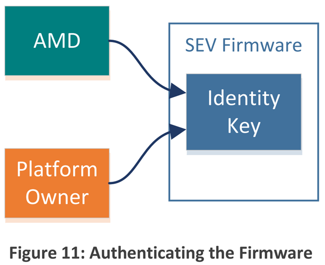

# SEV

## 介绍

* 现代计算系统对实用安全的需求空前迫切。系统复杂度的提升、云计算的发展以及新技术的涌现，共同造就了一个防护难度高且防护至关重要的计算环境。AMD 认识到这些严峻挑战，并开发了全新的内存加密技术，旨在为各类系统应对上述安全需求提供支持。
* **安全内存加密（SME，Secure Memory Encryption）** 定义了一种简单高效的架构能力，用于实现主内存加密。
* 尽管内存加密技术此前已在各类专用产品和行业中应用，但 SME 是一种通用机制，具备以下特点：灵活性强、集成于 CPU 架构、可从嵌入式工作负载扩展至高端服务器工作负载，且无需修改应用软件。
* 主内存加密可用于保护系统免受各类攻击。如今，数据存储在磁盘上时通常会被加密，但存储在 DRAM 中时却以明文形式存在。这使得数据易受未授权管理员、恶意软件的窥探，或硬件探测工具的窃取。
* 新的非易失性内存技术（NVDIMM，非易失性双列直插式内存模块）进一步加剧了这一问题 —— 与硬盘类似，NVDIMM 芯片可从系统中物理移除，且其上存储的数据完好无损。若不进行加密，敏感数据、密码、密钥等存储信息都可能轻易遭到泄露。
* **安全加密虚拟化（SEV，Secure Encrypted Virtualization）** 将主内存加密能力与现有的 AMD-V 虚拟化架构相结合，为加密虚拟机提供支持。
  * 对虚拟机进行加密，不仅能保护其免受物理威胁，还能防范来自其他虚拟机甚至 hypervisor 本身的威胁。
  * 因此，SEV 代表了一种全新的虚拟化安全范式，尤其适用于云计算场景 —— 在该场景下，虚拟机无需完全信任其 host 系统的 hypervisor 与管理员。
  * 与 SME 一致，支持 SEV 也无需修改应用软件。
* 本文档从技术层面概述了 SME 与 SEV，并阐述了操作系统（OS）、虚拟机监控程序（HV）及客户机虚拟机（VM）软件如何在各类不同环境中利用这两项技术，保护 DRAM 中的数据安全。

## SME 技术概览

* 主内存加密通过 **片上（on-die）内存控制器** 中的专用硬件实现。**每个内存控制器均集成一个高性能高级加密标准（AES）引擎**：
  * 当数据写入 DRAM 时，该引擎对数据进行加密；
  * 当从 DRAM 读取数据时，引擎对数据进行解密，具体流程如图 1“Memory Encryption Behavior” 所示。

* 数据加密采用 128 位密钥，并结合一种 “基于物理地址的额外微调（physical address-based tweak）” 模式，以防范密文块移动攻击（cipher-text block move attacks）。
* **译注**：
  * **密文块移动攻击（cipher-text block move attack）**：一种针对加密内存的攻击方式，攻击者通过移动内存中的密文块，欺骗系统将错误密文解密为有效数据；
  * “**基于物理地址的微调**” 可通过将地址信息融入加密过程，使密文与地址绑定，从而防范此类攻击。
* SME 模式下，AES 引擎使用的加密密钥在每次系统复位时随机生成，且对 CPU 核心上运行的所有软件均不可见。
  * 该密钥由 AMD 安全处理器（AMD-SP）全权管理，**AMD-SP** 是一款 32 位微控制器（基于 ARM® Cortex®-A5 架构），作为专用安全子系统集成在 AMD 系统级芯片（SOC）中。
  * 密钥通过片上符合 NIST SP 800-90 标准的硬件随机数生成器生成，并存储在专用硬件寄存器中；
  * 在任何情况下，该密钥都不会以明文形式暴露在 SOC 外部。与后文将介绍的 SEV 模式不同，**SME 无需 CPU 核心上运行的软件参与密钥管理**。
* 内存中哪些页面需要加密，由操作系统（OS）或虚拟机监控程序（HV）通过软件管理的页表控制。
* 启用内存加密后，**物理地址的第 `47` 位（即 “加密位”，`C-bit`，全称为 enCrypted bit）用于标记某一内存页面是否受保护**：
  * 操作系统或监控程序在 **页表项（PTE，Page Table Entry）中将物理地址的第 `47` 位置 `1`，表明该页面需加密**；
  * 此后，对该内存页面的所有访问，都会由内存控制器中的 AES 引擎 **自动完成加密与解密操作**。
* 通过 AES 引擎进行内存加解密，会给 DRAM 内存访问带来少量额外延迟。
  * 该延迟对软件的影响高度依赖于系统工作负载，但总体估算显示，其对系统性能的整体影响极小。
  * 若仅对部分内存进行加密，性能影响会进一步降低 —— 因为未加密内存的访问通常不会产生额外延迟。

## SME 使用模型

* 本节将介绍软件利用 SME 特性的两种不同示例模型。在第一种模型中，所有 DRAM 均会被加密；而在第二种模型中，仅特定区域（对应 guest VM）会被加密。

### 全内存加密

* 全内存加密对许多计算系统而言是一种简单且极具吸引力的模型，尤其适用于需防范物理攻击的场景 —— 例如政府数据中心，或是物理安全措施较为有限的中小型企业数据中心及远程企业数据中心。
* 在全内存加密模式下，所有 DRAM 内容均通过随机密钥加密，能有效抵御冷启动攻击、DRAM 接口窥探攻击及类似类型的攻击。
* 对于配备 NVDIMM 的系统，全内存加密还能防范攻击者通过移除内存模块、提取其中内容的攻击行为。
* 借助 SME 实现全内存加密，需由操作系统（OS）或虚拟机监控程序（HV）在所有页表的全部 DRAM 物理地址中设置 `C-bit`。
  * 这一操作需覆盖指令页、数据页，以及与页表本身对应的页面。
  * 本质上，操作系统或监控程序软件可将系统 DRAM 视为从地址 `0x8000_0000_0000` 开始。
  * 若由监控程序设置 `C-bit` 以加密所有物理内存，则该监控程序控制的所有虚拟机（VM）会与监控程序一同被加密，且使用同一加密密钥。
* 需注意的是，SME 支持对加密内存执行 DMA 操作。从设备角度来看，对加密内存的访问与普通内存访问并无差异，仅需将物理地址的第 `47` 位置 `1` 即可。

**译注**
* 这里还不是对标 Intel 的 **TME**，因为 TME 不需要 OS 或 HV 修改页表。后面介绍的 *透明 SME（Transparent SME）* 可以对标 TME

### 部分内存加密

* 通过在页表中使用 `C-bit`，OS 或 HV 可灵活选择仅对部分内存进行加密（若有此需求）。
  * 这种方式既能为加密内存提供物理安全保护，又能通过不对非敏感数据加密来提升系统性能。
  * 此外，通过区分内存的加密与未加密状态，还可为关键工作负载提供一层隔离保护。
* 这种隔离机制的典型应用场景是：系统仅将 guest VM 所用内存标记为加密状态，且无需对 guest VM 本身进行任何修改。
* 具体实现方式为：hypervisor 在所有与 DRAM 对应的嵌套页表项中设置 `C-bit`（如图 3“Encrypted VMs” 所示），即可仅对虚拟机内存启用加密功能。

* 此类场景可用于防范恶意主机管理员对虚拟机的攻击：尽管管理员能访问硬件和主机系统，但即便使用内存扫描工具，也无法查看 guest VM 的数据。

**译注**
* Intel 的 **MKTME** 将平台物理地址的高 bits（从 `CPUID MAX_PA` 信息枚举的可用最高位开始）重新用作 KeyID，需要用 `PCONFIG` 指令对 Key 进行编程

### SME 的特殊注意事项
* SME 为软件提供了一种简单直接的方法来加密部分或全部 内存页。然而，在使用加密内存时，有一些重要的特殊编程注意事项必须考虑。
* 主要注意事项是，硬件不会管理同一页面的 *加密副本* 和 *未加密副本* 之间的一致性。因此，软件在修改页面的 `C-bit` 时必须格外小心，并确保如果需要修改某个页面的 `C-bit`，必须在修改页表之前将该页面从 CPU cache 中刷新。
* 值得注意的是，设备可以对加密内存执行 DMA 操作，但与 CPU 访问类似，它们必须设置物理地址的第 `47` 位，而某些 32 位 legacy 设备无法做到这一点。
  * 为了弥补这一不足，软件可以利用 IOMMU 将设备请求地址重新映射到设置了 `C-bit` 的地址。
* 有关 SME 特性的更多技术细节，请参见最新版本的《AMD 程序员手册》（APM）第 2 卷。

### 透明 SME（Transparent SME）
* 尽管 SME 为管理主内存加密提供了高度灵活性，但其确实需要 OS 或 HV 提供支持。
* 对于希望将 SME 的物理保护功能与 OS/HV 解耦的系统，**透明 SME（TSME，Transparent SME）** 是一种可选方案。
* 在 TSME 模式下，无论特定页面的 `C-bit` 取值如何，所有内存都会被加密。该模式提供了一种无需修改软件即可启用加密的简便方法。
* 在支持 TSME 的平台上，可通过 BIOS 设置启用该功能。

**译注**
* 对标 Intel 的 **TME**，通过 BIOS 激活 TME 后，软件可以通过 MSR 指导无需加密的地址范围

## SEV 简介：复杂性与整合性

* 随着硬件与软件技术的双重进步，如今的计算系统比以往任何时候都更为复杂。软件（尤其是承担系统安全职责、权限最高的内核级软件）的规模与功能大幅提升。例如，Linux 内核的代码量已从最初的不足 20 万行增长至如今的近 2200 万行。
* 这种技术演进也带来了前所未有的系统整合度 —— 同一硬件可承载更多任务、处理更多工作。整合性提升催生了诸多积极成果，例如云计算与虚拟数据中心的出现，使得任何人都能以经济实惠的价格购买计算资源。
* 然而，复杂性与整合性通常会对系统安全性产生负面影响。复杂软件更难通过验证，也更可能存在可被黑客利用的漏洞。以典型的 Linux 系统为例，其加载到内存中的内核代码量接近 5.5MB，而这些代码必须完全无漏洞才能避免系统安全受损。
* 整合型系统同样会对安全性造成不利影响：它扩大了攻击面，使得大量不同软件可共用同一硬件，并共享内存等资源。这种情况催生的安全模型，需依赖大量 “无漏洞的特权代码”；而特权代码规模庞大且攻击面广，最终会增加系统被入侵的可能性。
* 为应对这些挑战，AMD 架构中新增了 “SEV” 特性，旨在更好地满足现代系统对复杂性管理与隔离性的需求。
* SEV 借助加密技术强化隔离能力，对代码与数据进行加密，进而构建出一种全新的安全模型 —— 在该模型中，即便是 hypervisor 这类更高权限的代码，也无法未经授权访问经加密保护的代码。

## SEV 安全模型
* 传统计算系统采用基于 “环（ring）” 的安全模型。在此模型中，高权限代码可完全访问其自身权限级别的资源，以及所有低权限级别的资源。

* 而在 SEV 模型中，不同权限级别（即 hypervisor vs. guest）下运行的代码相互隔离，彼此无法访问对方的资源。
* 尽管从传统角度看，监控程序的权限级别 “高于” 客户机，但 SEV 通过加密隔离将这两个级别分离。
  * 这一设计为低权限代码提供了额外的安全保障，且无需低权限代码信任其启动与运行所依赖的高权限代码。
  * Hypervisor 与 guest 之间仍可通信，但这些通信路径受到严格管控。
* 因此，SEV 技术围绕特定威胁模型构建：
  * 该模型假定攻击者不仅能在目标机器上执行用户级权限代码，还可能在权限更高的 hypervisor 级别执行恶意软件；
  * 此外，攻击者甚至可能拥有对机器的物理访问权限（包括直接接触 DRAM 芯片）。
  * 在所有这些场景下，SEV 都能提供额外保障，帮助保护 guest VM 的代码与数据免受攻击者威胁。
  * 需注意的是，SEV 无法防范针对 guest 的拒绝服务（DoS）攻击。

## SEV 的应用场景
* SEV 围绕硬件虚拟机概念构建，可在多种应用场景中增强安全性。由于采用了主内存加密技术，SEV 能提供与前文所述 SME 相同的物理攻击防护能力。此外，SEV 还可用于保护以下环境：

### 云计算

* 云计算，尤其是基础设施即服务（IaaS）数据中心的发展，使得计算能力变得经济实惠且易于获取。然而，这种发展也伴随着安全挑战——云基础设施及相关人员未必始终可信。在处理健康记录、商业机密等敏感数据时，这一问题尤为突出。此外，多客户共享硬件的模式，也引发了各类工作负载所有者的安全担忧。
* 尽管软件设计者已竭尽全力，但仍有许多隔离机制失效的案例，导致敏感代码或数据被泄露。
* SEV 可通过基于硬件的更强安全隔离，提升 IaaS 云的安全级别。现有安全技术（如微软的 BitLocker® 和 LUKS）可保护硬盘中的静态数据，而 SEV 则能保护使用中的数据，通过加密手段确保客户工作负载彼此隔离，且不受 host 软件的影响。即便是云数据中心中怀有恶意的管理员，也无法访问托管虚拟机中的数据。

### 沙箱隔离

* 借助硬件虚拟机结构，SEV 构建了安全沙箱环境的理念——软件可在沙箱中执行，并受到保护，免受系统中其他所有软件的影响。
* 这些沙箱既可以是包含独立磁盘和操作系统的完整虚拟机，也可以体积小巧，用于更精细的隔离。
  * 例如，可利用 SEV 硬件对 Docker 容器进行加密隔离，使其与 host 系统分离，从而更好地保护机密数据。

## SEV 架构

### 技术概述

* SEV 是 AMD-V 架构的一项扩展，支持在 hypervisor 的控制下运行多个 VM。
* ==启用后，SEV 硬件会为所有代码和数据标记其 **虚拟机地址空间标识符（VM ASID）**，该标识符用于指示数据来自哪个虚拟机或面向哪个虚拟机。==
  * 此标记在系统级芯片（SOC）内部会始终与数据绑定，防止数据被所有者以外的任何实体使用。
* 如果说标记是为了保护 SOC 内部的虚拟机数据，那么 128 位 AES 加密则用于保护 SOC 外部的数据。
  * 当数据进出 SOC 时，硬件会根据相关联的标记，使用对应的密钥对数据 **分别** 进行加密和解密。
* ==每个虚拟机以及 hypervisor 都关联一个标记，进而关联一个对应的加密密钥==。
  * 借助标记和内存加密机制，数据被限制为只能由使用该标记的虚拟机访问。
  * 如果其他任何实体（包括 hypervisor）访问该数据，他们只能看到加密形式的数据。
  * 这就在虚拟机之间以及虚拟机与 hypervisor 之间提供了强大的加密隔离。

### 加密内存
* SEV 使用与前文所述的 SME 功能相同的高性能内存加密引擎。它也使用页表中相同的 `C-bit` 来标记页面是否加密，但存在一些额外限制。
* SEV 的关键特性之一是 guest VM 能够选择哪些数据内存页需要设为私有。
  * 这种选择通过标准的 CPU 页表完成，并且完全由 guest 控制。
  * 私有内存使用 guest 专属密钥进行加密，而共享内存则可能使用 hypervisor 的密钥加密。
  * 这一特性使虚拟机可以将其希望保密（私有）的数据内存页进行标记，而将其他页面用于与其他虚拟机或 hypervisor 通信。
  * 在典型配置中，guest 会将其所有代码和数据映射为私有，仅暴露它选择的特定共享页。
* 为保障安全性，SEV 硬件要求某些类型的内存（包括指令页和页表）必须始终为私有，以保护虚拟机。

* 图 10 展示了一个通信配置示例。
  * 在该示例中，启用 SEV 的 guest 与 hypervisor 通过双方均标记为共享的内存进行通信。
  * Guest 的所有其他内存都使用 guest 的密钥（hypervisor 无法使用该密钥）加密。
  * Hypervisor 不用于与 guest 直接通信的任何内存，则使用前文所述的 SME 功能进行加密。

**译注**
* TDX 与 SEV 本质上都重用了有效物理地址的高 bits 来分别采用用不同的加密 keys
  * TDX 用的 keyID，SEV 用的 ASID
  * 将 keyID/ASID 嵌入物理地址的过程是地址翻译完成后由微码/硬件自动完成的，无需固件（TDX module）或软件的参与

### 密钥管理
* SEV 的安全性在很大程度上依赖于内存加密密钥的安全性。若密钥被恶意实体（如恶意或存在漏洞的 hypervisor）获取，会对受 SEV 保护的 guest 造成威胁。
* 尽管 hypervisor 必须管理 guest 及其资源，但绝不能让 hypervisor 知晓内存加密密钥本身。
* 运行在 AMD 安全处理器（AMD-SP）中的 SEV 固件提供了一个 **安全的密钥管理接口** 来实现这一点。
  * Hypervisor 通过该接口为安全 guest 启用 SEV，并执行常见的 hypervisor 操作，如启动、运行、快照、迁移和调试客户机。
* 为保护启用 SEV 的 guest，固件协助实施三项主要安全属性：
  * 平台的真实性
  * 已启动 guest 的远程证明
  * Guest 数据的机密性

* **平台认证** 可防止恶意软件或恶意设备伪装成合法平台。
  * 平台的真实性通过其身份密钥证明。
  * 该密钥由 AMD 签名，以证明该平台是具备 SEV 功能的正宗 AMD 平台。
  * 平台所有者也会对其签名，向 guest 所有者或远程平台上的其他固件实例表明谁是该机器的管理员和所有者。
* **Guest 启动远程** 证明向 guest 所有者证明其 guest 已安全启动并启用了 SEV。
  * 固件向 guest 所有者提供与 SEV 相关的 guest 状态各组成部分（包括内存的初始内容）的签名，以验证 guest 是否处于预期状态。
  * 通过这种证明，guest 所有者可以确保在向 guest 传输机密信息之前，hypervisor 未干扰 SEV 的初始化。

* 图 12 展示了这一过程的示例。
  * 首先，guest 所有者将 guest 镜像提供给云系统。
  * SEV 固件协助启动 guest，并向 guest 所有者返回一个度量值。
  * 如果 guest 所有者认为该度量值正确，就会向运行中的 guest 提供额外的机密信息（如磁盘解密密钥），使其能够继续启动。
* **Guest 的机密性** 通过使用仅 SEV 固件知晓的内存加密密钥对内存进行加密来实现。
* SEV 管理接口不允许在未正确认证接收方的情况下，将内存加密密钥或任何其他机密 SEV 状态导出到固件外部。
  * 这可防止 hypervisor 获取密钥，进而避免 guest 数据被泄露。
  * 该接口还提供了一种将 guest 数据迁移到另一个具备 SEV 功能的平台的机制。
    * 在迁移过程中，guest 的内存内容在传输期间始终处于加密状态。
    * 一旦远程平台通过认证，**SEV 固件就会安全地发送 guest 的内存加密密钥**，使远程平台能够自行运行该 guest。
    * 这种传输机制使 hypervisor 能够在启用 SEV 的情况下安全地实现迁移和快照功能。

**译注**
* TDX 是无论如何也不允许内存加密密钥离开主机的，无论是 Live migration 还是 TDX connect，用的都是新生成的传输密钥

## SEV 对软件的影响
### Hypervisor
* 与传统虚拟化技术一样，SEV 在许多虚拟机功能（如设备模拟和调度）上仍依赖 hypervisor，但降低了在安全性方面对 hypervisor 的依赖。
  * 启用 SEV 的 guest 在需要时仍会使用 hypervisor，但可以通过将不打算在虚拟机外部共享的内存页标记为私有来保护自身。
* 在运行时，hypervisor 与 AMD 安全处理器（AMD-SP）通信，以协调内存加密密钥的管理。
  * 这种通信通过 AMD-SP 驱动程序进行，涉及的任务包括：
    * 当某个虚拟机即将运行时通知 AMD-SP，从而使 AMD-SP 能够将相应的加密密钥加载到 AES-128 加密引擎中。
    * Hypervisor 还与 AMD-SP 通信，以建立安全机制来执行 guest 远程证明、迁移等操作。
* 尽管 hypervisor 可以控制运行虚拟机所使用的 **地址空间标识符（ASID）** 并选择加密密钥，但这并不被视为安全问题，因为除非 guest 已使用该密钥加密，否则加载的加密密钥是毫无意义的。
  * 如果加载了错误的密钥，或者为 guest 使用了错误的 ASID，该 guest 的第一次指令获取将会失败 —— 因为内存会用错误的密钥解密，导致执行无效数据（且很可能引发 fault）。
* **译注**：这里和 TDX 的 Ci 的原理似乎不太一样
  * TDX 使用密钥 A 加密生成的 ECC 和加载回来后用密钥 B 解密后的数据算出的 ECC 必然不一样，因此一旦 TD VM 消费 poison 数据就会产生 `#MC`
  * 这里提到“*导致执行无效数据*”，难道 SEV guest 还有机会执行错误数据？！

### Guest
* 启用 SEV 的 guest 中的操作系统必须知晓这一新硬件特性，并相应地配置其页表。
  * 配置方式可类似于 SME 全内存加密模式，即 **大多数 DRAM 地址的 `C-bit`（第 `47` 位）被设置为 `1`**。
* 对于启用 SEV 的 guest，有一个重要注意事项：**出于安全原因，SEV 硬件不允许直接对 guest 的加密内存执行 DMA 操作**。
* 所有 DMA 操作（无论是来自真实硬件还是 hypervisor 模拟的设备）都必须在 guest 的共享内存中进行。
  * 因此，guest 操作系统可以选择为 DMA 分配共享内存页（`C-bit` 清零）（译注：类似使用 **Coherent DMA** 接口时），
  * 或者为 DMA 目的将数据复制到/从专用缓冲区（即“**反弹缓冲区”，bounce buffer**）（译注：类似使用 **Stream DMA** 接口）。
    * 某些操作系统已支持反弹缓冲区功能，例如 Linux 的 swiotlb（软件I/O转换缓冲区）功能就可用于此目的。
* 最后需要说明的是，SEV 支持多核 guest，且核心之间共享数据不会产生额外的性能损耗。
  * Hypervisor 只需为特定 guest 的所有虚拟 CPU 实例使用相同的 ASID 即可。

## SEV的特殊注意事项
* 前文列出的许多关于 SME 功能的特殊注意事项也适用于 SEV。
* 特别是，与 SME 一样，在以不同的 `C-bit` 访问某一页面之前，必须将该页面从 cache 中刷新。
* 此外，在更换硬件内存加密密钥之前，hypervisor 软件必须执行全面的 cache 刷新，以确保所有使用该密钥加密的已修改数据都已写回 DRAM。
* 最后，由于只有当 guest 操作系统在 64 位或 32 位 PAE 模式下运行时，才能控制 `C-bit`，因此在所有其他模式下，SEV 硬件会强制将 `C-bit` 设为`1`。
  * 这使得 guest 操作系统能够立即开始运行加密代码，然后安全地切换到其最终运行模式。

## 结论
* 本文档介绍的两项内存加密技术，是通用计算机安全领域的重大进步，可在多种环境中应用。
* SME 技术是一项灵活且强大的架构特性，可为操作系统或 hypervisor 提供主内存加密功能。
* 本文档阐述了内存加密的几种具体使用模式，包括全内存加密、选择性加密和透明加密。
  * 所有这些模式都能为系统提供针对物理硬件攻击的全新保护，在某些情况下还能帮助保护系统免受恶意管理员的攻击。
* 此外，可能还存在其他使用模式，它们能提供更多选择以及性能与安全性之间的权衡方案。
* SME 无需修改任何应用程序代码，只需对操作系统或 hypervisor 进行适当修改，系统中的所有应用程序都能得到保护。
* 此外，SEV 技术可增强虚拟机的安全性，它支持运行加密的 guest，而 hypervisor 无法直接访问这些 guest。
  * 这不仅为云用户提供了新的保护，也为希望限制自身对客户数据可见性的云服务提供商带来了新的保障。
* 基于 AMD-V 技术的 SEV，可在云环境和 Docker 类模型中使用，为虚拟化环境提供了一种全新的安全模型。
* 与 SME 技术一样，SEV 无需修改 guest VM 的应用程序代码，且借助专用硬件引擎，可快速、透明地对虚拟机进行加密。