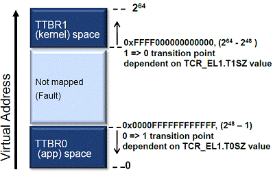

#  地址翻译
* 在 AArch64 模式下，处理器能够访问更大范围的地址空间，不再仅仅是`2^32`Byte，地址可以用 *64位* 表示，但其中 **有效位是48位**。也就是可以访问`256T`字节范围的物理地址。
* 在不同的 Exception Level 下，MMU 使用的地址转换机制不同，进而使用的地址转换控制寄存器也不同。MMU 最关键的寄存器是 **TTBR（Translation Table Base Register）** 和 **TCR（Translation Control Register）**。
* 在 EL1，根据 TCR 配置的不同，MMU 访问的地址范围也有所不同，使用不同的基址寄存器进行地址转换。通常情况下，用户程序使用`TTBR0`，内核空间使用`TTBR1`如下图：

* AArch64 模式有 3 个不同的地址转换粒度，4KB、16KB 和 64KB，不同的粒度大小定义了不同的内存页大小和各级页表大小：

Property | 4KB granule | 16KB granule | 64KB granule | Notes
---------|-------------|--------------|--------------|------
Maximum number of entries in a translation table | 512 | 2048 (2k) | 8192 (8K) | -
Address bits resolved in one level of lookup | 9 | 11 | 13 | 2<sup>9</sup>=512, 2<sup>11</sup>=2K, 2<sup>13</sup>=8K
Page size | 4KB | 16KB | 64KB | -
Page address range | VA[11:0]=PA[11:0] | VA[13:0]=PA[13:0] | VA[15:0]=PA[15:0] | 2<sup>12</sup>=4K, 2<sup>14</sup>=16K, 2<sup>16</sup>=64K


# 代码转换地址
## 物理地址转虚拟地址
* 首先是宏`__va(x)`
  * arch/arm64/include/asm/memory.h
  ```c
  /*
   * PAGE_OFFSET - the virtual address of the start of the linear map (top
   *       (VA_BITS - 1))
   * KIMAGE_VADDR - the virtual address of the start of the kernel image
   * VA_BITS - the maximum number of bits for virtual addresses.
   * VA_START - the first kernel virtual address.
   */
  #define VA_BITS         (CONFIG_ARM64_VA_BITS)
  ...
  #define PAGE_OFFSET     (UL(0xffffffffffffffff) - \
      (UL(1) << (VA_BITS - 1)) + 1)
  ...
  extern s64          memstart_addr;
  /* PHYS_OFFSET - the physical address of the start of memory. */
  #define PHYS_OFFSET     ({ VM_BUG_ON(memstart_addr & 1); memstart_addr; })
  ...
  #define __phys_to_virt(x)   ((unsigned long)((x) - PHYS_OFFSET) | PAGE_OFFSET)
  #define __va(x)         ((void *)__phys_to_virt((phys_addr_t)(x)))
  ```
* 对于`CONFIG_ARM64_VA_BITS`为 39，`VA_BITS` 就是 (39)
* `PAGE_OFFSET`
  ```c
  = 0xffffffffffffffff - (1 << (VA_BITS - 1)) + 1
  = 0xffffffffffffffff - 0x4000000000 +1
  = 0xffff_ffc0_0000_0000
  ```
* `PHYS_OFFSET`是内存起始的物理地址，由启动时选定，不同系统选定的起始地址可能不同
  * 可以通过`/proc/iomem`简单地查看，一般是第一条`System RAM`类型的起始地址

# References
- [ARM64的启动过程之（一）：内核第一个脚印](http://www.wowotech.net/armv8a_arch/arm64_initialize_1.html)
- [ARM64的启动过程之（二）：创建启动阶段的页表](http://www.wowotech.net/armv8a_arch/create_page_tables.html)
- [ARM64的启动过程之（三）：为打开MMU而进行的CPU初始化](http://www.wowotech.net/armv8a_arch/arm64_initialize_1.html)
- [ARM64的启动过程之（四）：打开MMU](http://www.wowotech.net/armv8a_arch/turn-on-mmu.html)
- [（一）ARMv8 MMU及Linux页表映射](https://www.cnblogs.com/LoyenWang/p/11406693.html)
- [armv8 memory translation](https://www.cnblogs.com/-9-8/p/8406345.html)
- [ARMv8 Virtualization Overview](https://kernelgo.org/armv8-virt-guide.html)
