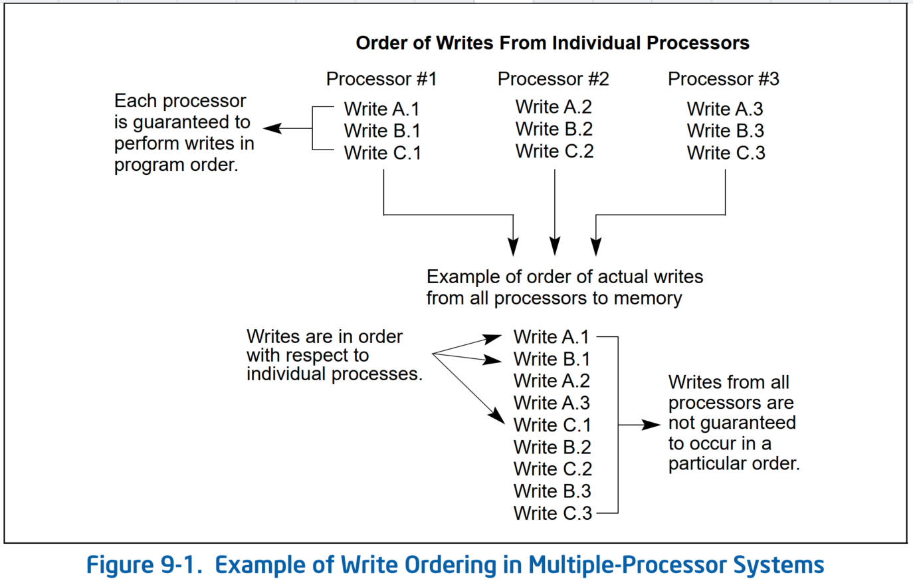
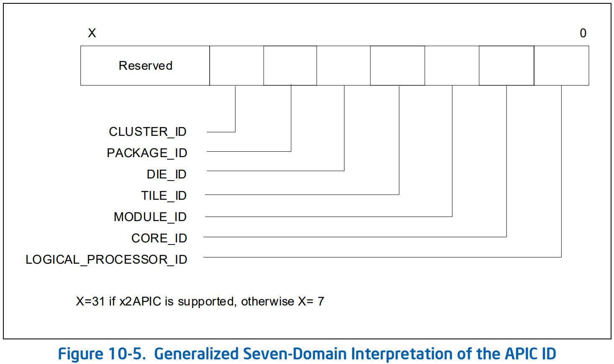
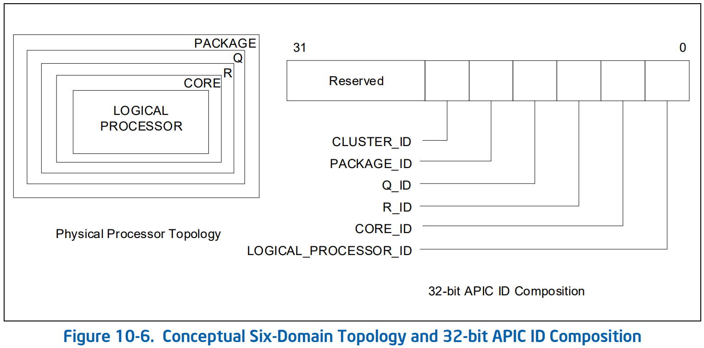

# 10 Multiple-Processors Management

## 10.1 锁定的原子操作
* 32 位 IA-32 处理器支持系统内存中位置上的锁定原子操作。这些操作通常用于管理共享数据结构（例如信号量、段描述符、系统段或页表），其中两个或多个处理器可能会尝试同时修改相同的字段或标志。
* 处理器使用三种相互依赖的机制来执行锁定原子操作：
  * 有保证的原子操作。
  * 总线锁定，使用 `LOCK#` 信号和 `LOCK` 指令前缀。
  * Cache 一致性协议，确保可以对 cache 数据结构进行原子操作（cache lock）；此机制存在于 Pentium 4、Intel Xeon 和 P6 系列处理器中。
* 这些机制在以下方面是相互依赖的。
  * 某些基本内存事务（例如在系统内存中读取或写入字节）始终保证以原子方式处理。也就是说，一旦启动，处理器就保证该操作将在另一个处理器或总线 agent 被允许访问该内存位置之前完成。
  * 该处理器还支持总线锁定，以执行通常需要 *原子地处理* 但没有以这种方式 *自动地处理* 的选定内存操作（例如共享内存区域中的读取-修改-写入操作）。
  * 由于经常使用的内存位置通常被 cached 在处理器的 L1 或 L2 caches 中，因此原子操作通常可以在处理器的 caches 内执行，而无需 asserting 总线锁。
    * 这里，处理器的 cache 一致性协议确保在被 cached 的内存位置上执行原子操作时，正确管理 caching 相同内存位置的其他处理器。
**注意**：在存在有争议的锁访问的情况下，软件可能需要实现确保公平访问资源的算法，以防止锁饥饿。硬件不提供保证对参与的 agent 的资源公平。软件负责管理信号量的公平性和独占锁定功能。
* 处理锁定原子操作的机制随着 IA-32 处理器的复杂性而发展。较新的 IA-32 处理器（例如 Pentium 4、Intel Xeon 和 P6 系列处理器）和 Intel 64 提供了比早期处理器更精细的锁定机制。以下各节描述了这些机制。

### 10.1.1 有保证的原子操作
* Intel486 处理器（以及此后更新的处理器）保证以下基本内存操作始终以原子方式执行：
  * 读取或写入一个字节。
  * 读取或写入在 `16` 位边界上对齐的 *字*。
  * 读取或写入在 `32` 位边界上对齐的 *双字*。
* Pentium 处理器（以及此后更新的处理器）保证以下附加内存操作始终以原子方式执行：
  * 读取或写入在 `64` 位边界上对齐的 *四字*。
  * 对适合 `32` 位数据总线的 uncached 内存位置进行 `16` 位访问。
* P6 系列处理器（以及此后更新的处理器）保证以下附加内存操作始终以原子方式执行：
  * 对适合 cacheline 的已 cached 的内存进行未对齐的 `16` 位、`32` 位和 `64` 位访问。
* 枚举支持 Intel® AVX（通过设置功能标志 `CPUID.01H:ECX.AVX[bit 28]`）的处理器保证以下指令执行的 `16` 字节内存操作始终以原子方式执行：
  * `MOVAPD`、`MOVAPS` 和 `MOVDQA`
  * `VMOVAPD`、`VMOVAPS` 和用 `VEX.128` 编码的 `VMOVDQA`
  * `VMOVAPD`、`VMOVAPS`、`VMOVDQA32` 和用 `EVEX.128` 和 `k0`（masking disabled）编码的 `VMOVDQA64`
  * （注意，这些指令要求其内存操作数的线性地址是 `16` 字节对齐的。）
* Intel Core 2 Duo、Intel Atom、Intel Core Duo、Pentium M、Pentium 4、Intel Xeon、P6 系列、Pentium 和 Intel486 处理器不保证对分割跨越 cache lines 和页边界的 cacheable 的内存的访问是原子的。
* Intel Core 2 Duo、Intel Atom、Intel Core Duo、Pentium M、Pentium 4、Intel Xeon 和 P6 系列处理器提供总线控制信号，允许外部内存子系统进行原子分割访问；然而，非对齐数据访问将严重影响处理器的性能，应该避免。
* 除了上面提到的之外，访问大于四字的数据的 x87 指令或 SSE 指令可以使用多个内存访问来实现。
  * 如果这样的指令存储到内存，则某些访问可能会完成（写入内存），而另一些访问可能会因架构原因（例如，由于页表条目被标记为“not present”）而导致操作失败。
  * 在这种情况下，即使整个指令导致了 fault，完成的访问的效果也可能对软件可见。
  * 如果 TLB 失效被延迟（参见第 4.10.4.4 节），即使所有访问都针对同一页，也可能会发生此类页错误。

### 10.1.2 总线锁定（Bus Locking）
* Intel 64 和 IA-32 处理器提供 `LOCK#` 信号，该信号在某些关键内存操作期间自动置位（asserted），以锁定系统总线或等效链路（equivalent link）。该信号的置位（assertion）称为 **总线锁定**。
  * 当该输出信号被置位时，来自其他处理器或总线 agents 的总线控制请求将被阻止。
  * 软件可以通过在指令前添加 `LOCK` 前缀来指定 `LOCK` 语义后的其他场合。
* 对于 Intel386、Intel486 和 Pentium 处理器，显式锁定指令将导致 `LOCK#` 信号置位。
  * 硬件设计人员有责任使 `LOCK#` 信号在系统硬件中可用，以控制处理器之间的内存访问。
* 对于 P6 及更新的处理器系列，如果正在访问的内存区域已在处理器内部被 cached，则通常不会置位 `LOCK#` 信号；相反，锁定仅应用于处理器的 caches（请参见第 10.1.4 节“Effects of a LOCK Operation on Internal Processor Caches”）。
  * 这些处理器将在以下任一情况下为锁定访问置位总线锁：
  1. 访问是针对多个 cache lines（一个 **split lock**）；
  2. 访问使用 `WB` 以外的内存类型（一个 **UC lock**）
     * 使用术语“UC lock”是因为最常见的情况涉及对 `UC` 内存的访问。尽管有这个名称，但对 `WC`、`WP` 和 `WT` 内存的锁定访问也会导致总线锁定。

#### 10.1.2.1 自动锁定（Automatic Locking）
* 处理器自动遵循 `LOCK` 语义的操作如下：
  * 当执行引用内存的 `XCHG` 指令时。
  * 当切换到任务时，处理器会测试并设置 `TSS` 描述符的类型字段中的 `busy` 标志。为了确保两个处理器不会同时切换到同一任务，处理器在测试和设置此标志时遵循 `LOCK` 语义。
* 加载段描述符时，如果 `accessed` 标志已清除，则处理器会在段描述符中设置该标志。在此操作期间，处理器遵循 `LOCK` 语义，以便描述符在更新时不会被另一个处理器修改。为了使此操作有效，更新描述符的操作系统过程应使用以下步骤：
  - 使用锁定操作修改 `access-rights` 字节以指示段描述符不存在，并为 `type` 字段指定一个值以指示描述符正在更新。
  - 更新段描述符的字段。（此操作可能需要多次内存访问；因此不能使用锁定操作。）
  - 使用锁定操作修改 `access-rights` 字节以指示段描述符有效且存在。
  - Intel386 处理器总是更新段描述符中的 `accessed` 标志，无论它是否清除。Pentium 4、Intel Xeon、P6 系列、Pentium 和 Intel486 处理器仅在尚未设置时更新此标志。
* 处理器使用锁定的周期（locked cycles）来设置分页结构条目中的 `accessed` 和 `dirty` 标志。
* 在发出中断请求后，中断控制器可以使用数据总线将中断向量发送到处理器。在此期间，处理器遵循 `LOCK` 语义，以确保在传输向量时数据总线上不会出现其他数据。

#### 10.1.2.2 软件控制的总线锁定
* 为了显式强制 `LOCK` 语义，软件可以在以下指令用于修改内存位置时使用 `LOCK` 前缀。当 `LOCK` 前缀与任何其他指令一起使用或未对内存进行 *写操作*（即，当目标操作数位于寄存器中时）时，会生成 invalid-opcode 异常（`#UD`）。
  * bit 测试和修改指令（`BTS`、`BTR` 和 `BTC`）。
  * 交换指令（`XADD`、`CMPXCHG`、`CMPXCHG8B` 和 `CMPXCHG16B`）。
  * `XCHG` 指令自动采用 `LOCK` 前缀。
  * 以下单操作数算术和逻辑指令：`INC`、`DEC`、`NOT` 和 `NEG`。
  * 以下二操作数算术和逻辑指令：`ADD`、`ADC`、`SUB`、`SBB`、`AND`、`OR` 和 `XOR`。
* 锁定指令保证仅锁定目标操作数定义的内存区域，但系统可能会将其解释为更大内存区域的锁定。
* 软件应使用相同的地址和操作数长度来访问信号量（用于在多个处理器之间发送信号的共享内存）。
  * 例如，如果一个处理器使用 *字* 来访问来访问信号量，则其他处理器不应使用 *字节* 访问来访问该信号量。
* 注意：不要使用 `WC` 内存类型实现信号量。不要对包含用于实现信号量的位置的 cache line 执行非临时存储（non-temporal stores）。
* Bus lock 的完整性不受内存字段对齐的影响。`LOCK` 语义遵循更新整个操作数所需的尽可能多的总线周期。但是，建议锁定访问与其自然边界对齐，以获得更好的系统性能：
  * 8-bit 访问的任何边界（锁定或其他方式）
  * 锁定 *字* 访问的 `16-bit` 边界
  * 锁定 *双字* 访问的 `32-bit` 边界
  * 锁定 *四字* 访问的 `64-bit` 边界
* 锁定操作相对于所有其他内存操作和所有外部可见事件来说是原子的。
  * 只有取指令和页表访问才能通过（pass）被锁定的指令。
  * 被锁定的指令可用于同步一个处理器写入的数据和另一处理器读取的数据。
* 对于 P6 系列处理器，锁定操作会序列化所有未完成的加载和存储操作（即等待它们完成）。这一规则也适用于 Pentium 4 和 Intel Xeon 处理器，但有一个例外。
  * 引用弱顺序内存类型（例如 `WC` 内存类型）的加载操作可能不会被序列化。
* 不应使用锁定指令来确保写入的数据可以作为指令被获取。
* 注意：当前版本的 Pentium 4、Intel Xeon、P6 系列、Pentium 和 Intel486 处理器的锁定指令允许将写入的数据作为指令获取。但是，Intel 建议需要使用 self-modifying 代码的开发人员使用不同的同步机制，如以下各节所述。

#### 10.1.2.3 禁用总线锁的特性
* 由于总线锁定在某些情况下可能会对性能产生不利影响，因此处理器可能支持系统软件可用来禁用总线锁定的两个功能。这些称为 **UC-lock 禁用** 和 **split-lock 禁用**。
* 处理器通过设置 `IA32_CORE_CAPABILITIES` MSR（MSR 索引 `0xCF`）的 `bit 4` 来枚举对 UC-lock 禁用的支持。
* `IA32_CORE_CAPABILITIES[5]` 枚举了对 split-lock 禁用的支持
* 软件通过设置 `MSR_MEMORY_CTRL` MSR（MSR 索引 `0x33`）的 `bit 28` 来启用 UC-lock 禁用。
  * 当设置该位时，使用 `WB` 以外的内存类型进行锁定访问会导致带有错误码为零的 general-protection 异常（`#GP`）。不会发生锁定访问。
* 软件通过设置 `MSR_MEMORY_CTRL[29]` 来启用 split-lock 禁用。
  * 当设置该位时，对多个 cache lines 的锁定访问会导致对齐检查（alignment-check ）异常（`#AC`），错误码为零。不会发生锁定访问。
    * 仅当 `CR0.AM = 1`、`EFLAGS.AC = 1` 且 `CPL = 3` 时，才会发生其他对齐检查异常。然而，即使 `CR0.AM = 0`、`EFLAGS.AC = 0`，或 `CPL < 3`，也可能会发生由split-lock 禁用导致的对齐检查异常。
* 虽然 `MSR_MEMORY_CTRL` 不是 architectural MSR，但上述行为在枚举 `IA32_CORE_CAPABILITIES` 中支持的处理器 models 之间是一致的。
* 除了这些禁用总线锁定的功能之外，还有一些功能允许软件检测总线锁定何时发生。有关操作系统总线锁定检测的信息，请参阅第 18.3.1.6 节；有关 VMM 总线锁定检测的信息，请参阅第 26.2 节。

### 10.1.3 处理子修改和交叉修改代码
* 处理器将数据写入当前正在执行的代码段以将该数据作为代码执行的行为称为 **自修改代码（self-modifying code）**。IA-32 处理器在执行自修改代码时会表现出 model-specific 的行为，具体取决于代码已修改的当前执行指针的超前程度。
* 随着处理器微体系结构变得更加复杂，并开始在 retirement 点之前推测性地执行代码（如 P6 和更新的处理器系列），有关应在修改前或修改后执行哪些代码的规则变得模糊。要编写自修改代码并确保其符合当前和未来版本的 IA-32 架构，请使用以下编码选项之一：
* 选项 1
  * 将修改过的代码（作为数据）存入代码段；
  * 跳转到新代码或一个中间位置
  * 执行新代码
* 选项 2
  * 将修改过的代码（作为数据）存入代码段；
  * 执行一个序列化指令；（例如，`CPUID` 指令）
  * 执行新代码
* 对于打算在 Pentium 或 Intel486 处理器上运行的程序，不需要使用这些选项之一，但建议使用这些选项以确保与 P6 和更新的处理器系列的兼容性。
* 自修改代码的执行性能水平低于非自修改代码或普通代码。性能下降的程度取决于修改的频率和代码的具体特征。
* 一个处理器将数据写入第二个处理器当前正在执行的代码段以使第二个处理器将该数据作为代码执行的行为称为 **交叉修改代码（cross-modifying code）**。与自修改代码一样，IA-32 处理器在执行交叉修改代码时会表现出 model-specific 的行为，具体取决于代码已被修改的执行处理器当前执行指针的超前程度。
* 要编写交叉修改代码并确保其符合当前和未来版本的 IA-32 架构，必须实现以下处理器同步算法：
* 修改代码处理器的动作
  * `Memory_Flag := 0;`（设置 `Memory_Flag` 为 `1` 以外的其他值）
  * 将修改过的代码（作为数据）存入代码段；
  * `Memory_Flag := 1;`
* 执行代码处理器的动作
```sh
WHILE (Memory_Flag ≠ 1)
    Wait for code to update;
ELIHW;
Execute serializing instruction; (* For example, CPUID instruction *)
Begin executing modified code;
```
*（对于打算在 Intel486 处理器上运行的程序，不需要使用此选项，但建议使用此选项以确保与 Pentium 4、Intel Xeon、P6 系列和 Pentium 处理器的兼容性。）
* 与自修改代码一样，交叉修改代码的执行性能水平低于非交叉修改（正常）代码，具体取决于修改频率和代码的具体特征。
* 自修改代码和交叉修改代码的限制也适用于 Intel 64 架构。

### 10.1.4 `LOCK` 操作对处理器内部 Caches 的影响
* 对于 Intel486 和 Pentium 处理器，在 `LOCK` 操作期间，`LOCK#` 信号始终在总线上有效，即使被锁定的内存区域已被 cached 在处理器中。
* 对于 P6 和更新的处理器系列，如果在 `LOCK` 操作期间被锁定的内存区域作为回写内存被 cached 在正在执行 `LOCK` 操作的处理器中，并且完全包含在 cache line 中，则处理器可能不会置位总线上的 `LOCK#` 信号。
  * 相反，它将在内部修改内存位置并允许其 cache 一致性机制确保操作以原子方式执行。此操作称为“**cache locking**”。
  * Cache 一致性机制自动防止已被 cached 的同一内存区域的两个或多个处理器同时修改该区域中的数据。

## 10.2 内存顺序
* 术语“**内存顺序（memory ordering）**”是指处理器通过 *系统总线* 向 *系统内存* 发出读取（加载）和写入（存储）的顺序。
* Intel 64 和 IA-32 架构支持多种内存顺序模型，具体取决于架构的实现。例如，Intel386 处理器强制执行 **程序顺序（program ordering）**（通常称为 **强顺序（strong ordering）**），其中读取和写入在所有情况下都按照它们在指令流中出现的顺序在系统总线上发出。
* 为了实现指令执行的性能优化，IA-32 架构允许偏离（departures from）Pentium 4、Intel Xeon 和 P6 系列处理器中称为 **处理器顺序（processor ordering）** 的强顺序模型。这些 **处理器顺序** 变体（此处称为 **内存顺序模型（memory-ordering model）**）允许执行性能增强操作，例如允许 *读取* 先于 *已缓冲的写入*。
* 任何这些变体的目标都是提高指令执行速度，同时保持内存一致性，即使在多处理器系统中也是如此。

### 10.2.1 Intel® Pentium® 和 Intel486™ 处理器中的内存顺序
* Pentium 和 Intel486 处理器遵循处理器顺序内存模型；然而，在大多数情况下，它们作为强定序处理器运行。读取和写入始终按照系统总线上的编程顺序出现，但以下展示的处理器顺序的情况除外。
  * 当所有 *已缓冲的的写入* 不指向到读取未命中所访问的同一地址且都是 cache 命中时，允许读取未命中在系统总线上先于 *已缓冲的写入*
* 对于 I/O 操作，读取和写入始终按编程顺序出现。
* 旨在在处理器顺序处理器（例如 Pentium 4、Intel Xeon 和 P6 系列处理器）中正确运行的软件不应依赖于 Pentium 或 Intel486 处理器的相对较强的顺序。
  * 相反，它应该确保对旨在控制处理器之间并发执行的共享变量的访问明确要求通过使用 *适当的锁定* 或 *序列化操作* 来遵守程序顺序（请参见第 10.2.5 节，“Strengthening or Weakening the Memory-Ordering Model”））。

### 10.2.2 P6 及更新的处理器系列中的内存顺序
* Intel Core 2 Duo、Intel Atom、Intel Core Duo、Pentium 4 和 P6 系列处理器也使用处理器顺序的内存顺序模型，该模型可以进一步定义为“通过 store-buffer 转发进行写入排序”。该模型的特征如下。
* 在定义为 write-back cacheable 的内存区域的 **单处理器** 系统中，内存顺序模型遵循以下原则（**注意**：单处理器和多处理器系统的内存排序原则是从处理器上执行的软件的角度编写的，其中术语“处理器（processor）”指的是逻辑处理器，例如，支持多核和/或 Intel 超线程技术的物理处理器被视为多处理器系统。）：
  * *读取* 不会与其他 *读取* 重新排序。
  * *写入* 不会与 *较旧的读取* 重新排序。
  * 对内存的 *写入* 不会与其他 *写入* 重新排序，但以下情况除外：
    - 使用 non-temporal move 指令（`MOVNTI`、`MOVNTQ`、`MOVNTDQ`、`MOVNTPS` 和 `MOVNTPD`）执行流式存储（写入）； 和
    - 字符串操作（参见第 10.2.4.1 节）。
  * 执行 `CLFLUSH` 指令时，不能对内存进行重新排序；可以通过执行 `CLFLUSHOPT` 指令来重新排序写入，该指令刷新除正在写入的 cache line 之外的 cache lines。
    * 本手册的早期版本指定可以通过执行 `CLFLUSH` 指令来重新排序对内存的写入。没有实现 `CLFLUSH` 指令的处理器允许这种重新排序。
    * `CLFLUSH` 指令的执行不会相互重新排序。
    * 访问不同 cache line 的 `CLFLUSHOPT` 的执行可以彼此重新排序。
    * `CLFLUSHOPT` 的执行可以与访问不同 cache line 的 `CFLUSH` 的执行重新排序。
  * *读取* 可以与 **对不同位置的旧写入** 进行重新排序，但不能与对 *同一位置的旧写入* 进行重新排序。
  * *读取* 或 *写入* 不能用 I/O 指令、锁定指令或序列化指令重新排序。
  * *读取* 无法越过较早的 `LFENCE` 和 `MFENCE` 指令。
  * `CLFLUSH` 和 `CLFLUSHOPT` 的 *写入* 和 *执行* 不能越过较早的 `LFENCE`、`SFENCE` 和 `MFENCE` 指令。
  * `LFENCE` 指令无法越过较早的 *读取*。
  * `SFENCE` 指令无法越过之前的 `CLFLUSH` 和 `CLFLUSHOPT` *写入* 或 *执行*。
  * `MFENCE` 指令无法越过之前的 `CLFLUSH` 和 `CLFLUSHOPT` *读取*、*写入* 或 *执行*。
* 在 **多处理器** 系统中，适用以下排序原则：
  * 各个处理器使用与单处理器系统中相同的排序原则。
  * 所有处理器都以相同的顺序观察单个处理器的 *写入*。
  * 来自单个处理器的 *写入* **不会** 根据来自其他处理器的 *写入* 进行排序。
  * 内存顺序遵循因果关系（内存顺序尊重 transitive 可见性）。
  * 除了执行 stores 的处理器之外，任何两个 stores 都以一致的顺序被处理器看到
  * 锁定指令具有完全顺序。
* 请参见 Figure 9-1 中的示例。考虑系统中的三个处理器，每个处理器执行三次写入，三个定义位置（A、B 和 C）各写入一次。
  * 单独地，处理器以相同的程序顺序执行写入，但是由于总线仲裁和其他内存访问机制，每次在处理器上执行各自的代码序列时，三个处理器写入各个存储器位置的顺序可以不同。
  * 位置 A、B 和 C 中的最终值可能会随着写入序列的每次执行而变化。
* Figure 9-1. Example of Write Ordering in Multiple-Processor Systems

* 本节描述的处理器排序模型与 Pentium 和 Intel486 处理器使用的模型几乎完全相同。
* Pentium 4、Intel Xeon 和 P6 系列处理器中唯一的增强功能是：
  * 增加了对推测性读取的支持，同时仍然遵循上述排序原则。
  * 当同一内存位置的 *读取* 越过 *写入* 时，Store-buffer forwarding。
  * 长字符串存储和字符串移动操作中的乱序存储（请参见下面的第 10.2.4 节“Fast-String Operation and Out-of-Order Stores”）。
* **注意**：在 P6 处理器系列中，由于 errata，不会发生从 *流式存储* 到同一地址的 *`WC` 内存读取* 的 store-buffer forwarding。

### 10.2.3 内存排序原则的示例演示
* 本节提供了一组示例，用于说明第 10.2.2 节中介绍的内存顺序原则的行为。它们旨在让软件编写者了解内存顺序如何影响不同指令序列的结果。
* 这些示例仅限于访问定义为 **可写回缓存（`WB`）** 的内存区域。（第 10.2.3.1 节描述了示例通用性的其他限制。）读者应该明白，它们仅描述了软件可见的行为。
* 逻辑处理器可以重新排序两次访问，即使其中一个示例表明它们不能重新排序。这样的示例仅说明软件无法检测到发生了这样的重新排序。
* 类似地，只要软件可见的行为与内存访问的单次执行一致，逻辑处理器就可以多次执行内存访问。

#### 10.2.3.1 假设、术语和表示法
* 如上所述，本节中的示例仅限于访问定义为可写回 cacheable（`WB`）的内存区域。它们仅适用于普通的 loads、stores 和锁定的读取-修改-写入指令。
* 它们不一定适用于以下任何一种情况：
  * 字符串指令的乱序存储（参见第 10.2.4 节）；
  * 具有 non-temporal hint 的访问；
  * 作为地址转换的一部分被处理器从内存中读取（例如，（译注：硬件进行）页面遍历）；
  * 以及处理器对分段和分页结构的更新（例如，更新“`accessed`”位）。
* 本节中示例的基本原理适用于单个内存访问和锁定的读取修改-写入指令。
* Intel-64 内存顺序模型保证，对于以下每个内存访问指令，构成的（constituent）内存操作似乎作为（appears to）单次内存访问执行：
  * 读取或写入单个字节的指令。
  * 读取或写入地址与 2 字节边界对齐的字（word，2 字节）的指令。
  * 读取或写入双字（doubleword，4 字节）的指令，其地址与 4 字节边界对齐。
  * 读取或写入四字（quadword，8 字节）的指令，其地址与 8 字节边界对齐。
* 任何锁定指令（`XCHG` 指令或带有 `LOCK` 前缀的其他读取-修改-写入指令）似乎都执行为不可分割且不可中断的 load（s）序列，后跟 store（s）序列，无论对齐与否。
* 其他指令可以通过多次内存访问来实现。从内存顺序的角度来看，
  * 无法保证组成内存访问的相对顺序。
  * 也无法保证一个 store 的组成操作与一个 load 的组成操作以相同的顺序执行。
* 第 10.2.3.2 节至第 10.2.3.7 节给出了使用 `MOV` 指令的示例。这些示例所遵循的原则适用于一般的 load 和 store 访问，也适用于从内存 load 或 store 到内存的其他指令。
* 第 10.2.3.8 节和第 10.2.3.9 节给出了使用 `XCHG` 指令的示例。这些示例所遵循的原则适用于其他锁定的读取-修改-写入指令。
* 本节使用的术语“处理器”是指逻辑处理器。这些示例是使用 Intel-64 汇编语言语法编写的，并使用以下符号约定：
  * 以“`r`”开头的参数（例如 `r1` 或 `r2`）指的是仅对所考虑的处理器可见的寄存器（例如 `EAX`）。
  * 内存位置用 `x`、`y`、`z` 表示。
  * Stores 写为 `mov [ _x], val`，这意味着 `val` 被存储到内存位置 `x`。
  * Loads 写为 `mov r, [ _x]`，这意味着内存位置 `x` 的内容被加载到寄存器 `r` 中。
* 如前所述，这些示例仅指软件可见的行为。当后续部分做出诸如“两个存储被重新排序”之类的陈述时，其含义只是“从软件的角度来看，这两个存储似乎被重新排序了”。

#### 10.2.3.2 Loads 和 Stores 均不会与类似操作重新排序
* Intel-64 内存顺序模型不允许使用相同类型的操作对 loads 和 stores 进行重新排序。也就是说，它确保 loads 按程序顺序被看见，stores 也按程序顺序被看见。以下示例说明了这一点：

##### Example 9-1. Stores Are Not Reordered with Other Stores

Processor 0    | Porcessor 1
---------------|----------------
`mov [ _x], 1` | `mov r1, [ _y]`
`mov [ _y], 1` | `mov r2, [ _x]`
---------------|----------------
初始 `x = y = 0`
不允许 `r1 = 1` 且 `r2 = 0`

* 仅当处理器 0 的两个 stores 被重新排序（两个 loads 发生在它们之间）或处理器 1 的两个 loads 被重新排序（两个 stores 发生在它们之间）时，才会显示不允许的返回值。
* 如果 `r1 = 1`，
  * 则 *store 到 y* 发生在 *从 y load* 之前。由于 Intel-64 内存顺序模型不允许重新排序 stores，因此较早的 *store 到 x* 发生在 *从 y load* 之前。
  * 由于 Intel-64 内存顺序模型不允许重新排序 loads，因此 *store 到 x* 也发生在较晚的 *从 x load* 之前。此时 `r2 = 1`。
* **译注**：因为是 TSO，store 是 FIFO 的

#### 10.2.3.3 Stores 不会根据较早的 Loads 进行重新排序
* Intel-64 内存顺序模型确保处理器的 store 操作不会发生在该处理器的上一次 load 操作之前。Example 9-2 说明了这一点。

##### Example 9-2. Stores Are Not Reordered with Older Loads

Processor 0    | Processor 1
---------------|----------------
`mov r1, [ _x]`| `mov r2, [ _y]`
`mov [ _y], 1` | `mov [ _x], 1`
---------------|----------------
初始 `x = y = 0`
不允许 `r1 = 1` 且 `r2 = 1`

* 假设 `r1 = 1`：
  * 因为 `r1 = 1`，所以处理器 1 *store 到 x* 发生在处理器 0 *从 x load* 之前。
  * 因为 Intel-64 内存顺序模型阻止同一处理器将每个 store 与先前的 load 重新排序，所以处理器 1 *从 y load* 发生在其 *store 到 x* 之前。
  * 类似地，处理器 0 *从 x load* 发生在其 *store 到 y* 之前。
  * 因此，处理器 1 *从 y load* 发生在处理器 0 *从 y load* 之前，这意味着 `r2 = 0`。
* **译注**：因为是 TSO，load-store 不会乱序，处理器 0 上能看到处理器 1 上 store 的新值，那处理器 1 上 store 之前的 load 必然已执行完成

#### 10.2.3.4 不同位置的 Loads 可能会与较早的 Stores 重新排序
* Intel-64 内存顺序模型允许将不同位置的 load 与较早的 store 重新排序。
* 但是，同一位置的 loads 不会与 stores 重新排序。
* 以下示例说明了不同位置的 load 可以与较早的 store 重新排序这一事实：

##### Example 9-3. Loads May be Reordered with Older Stores

Processor 0    | Processor 1
---------------|----------------
`mov [ _x], 1` | `mov [ _y], 1`
`mov r1, [ _y]`| `mov r2, [ _x]`
---------------|----------------
初始 `x = y = 0`
允许 `r1 = 0` 且 `r2 = 0`

* 在每个处理器上，load 和 store 不同的位置，因此可以重新排序。因此允许任何操作交错。
* 一种这样的交错是两次 loads 发生在两次 stores 之前。这将导致每个 load 都返回值 `0`。
* **译注**：因为是 TSO，两个处理器上的 store 可能都缓冲在各自的 store buffer 中，而两个 load 的内容来自 cache 或内存中的过时内容，结果就是处理器间看到对方出现 store-load 乱序。在 store-load 之间加入 `MFENCE` 指令可以保证指令之间的序列化。

* 以下示例说明了对同一位置的 load 不能与较早的 store 重新排序事实：
##### Example 9-4. Loads Are not Reordered with Older Stores to the Same Location

Processor 0    |
---------------|
`mov [ _x], 1`
`mov r1, [ _x]`
---------------|
初始 `x = 0`
不允许 `r1 = 0`

* Intel-64 内存顺序模型不允许将 load 与先前的 store 重新排序，因为访问的是同一位置。因此，`r1 = 1` 必须成立。
* **译注**：load 会优先从 store buffer 中查找看有没有同一位置上的 store，有则返回，无才会去 cache 或内存中 load

#### 10.2.3.5 允许处理器内转发
* 内存顺序模型允许两个处理器以不同的顺序看见并发的 stores；
* 具体而言，每个处理器可能认为（perceive）自己的 store 在另一个处理器的 store 之前发生。以下示例说明了这一点：

##### Example 9-5. Intra-Processor Forwarding is Allowed

Processor 0     | Processor 1
----------------|----------------
`mov [ _x], 1`  | `mov [ _y], 1`
`mov r1, [ _x]` | `mov r3, [ _y]`
`mov r2, [ _y]` | `mov r4, [ _x]`
----------------|----------------
初始 `x = y = 0`
允许 `r2 = 0` 和 `r4 = 0`

* 内存顺序模型对两个处理器执行两个 stores 的顺序没有任何限制。
* 这一事实允许处理器 0 在看到处理器 1 的 store 之前看到自己的 store，而处理器 1 在看到处理器 0 的 store 之前看到自己的 store。（每个处理器都是自洽的（self consistent）。）这允许 `r2 = 0` 和 `r4 = 0`。
* 实际上，此示例中的重新排序可能是 store-buffer forwarding 的结果。
  * 虽然 store 暂时保存在处理器的 store buffer 中，但它可以满足处理器自己的 loads，但对其他处理器不可见（并且无法满足）其他处理器的 loads。
* **译注**：这个场景本质上和上面的 TSO 的 store-load 乱序是一样的，处理器的 store 先写到了自身的 store buffer 里，而对同一地址的 load 先从自己的 store buffer 里加载，导致处理器 0 和 1 看到地址 `[ _x]` 和 `[ _y]` 相反的结果的值，看起来似乎 load-load 出现乱序，其实是因为先从本地 store buffer 加载了数据。同样，在 store-load 之间加入 `MFENCE` 指令可以保证指令之间的序列化。

#### 10.2.3.6 传递可见的 Stores
* 内存顺序模型确保了 store 的传递可见性；因果相关的 store 在所有处理器看来都按与因果关系一致的顺序发生。以下示例说明了这一点：

##### Example 9-6. Stores Are Transitively Visible

Processor 0    | Processor 1      | Processor 2
---------------|------------------|---------------------
`mov [ _x], 1` | `mov r1, [ _x]`
.              | `mov [ _y], 1`   | `mov r2, [ _y]`
.              |.                 | `mov r3, [ _x]`
---------------|------------------|---------------------
初始 `x = y = 0`
不允许 `r1 = 1, r2 = 1, r3 = 0`

* 假设 `r1 = 1` 且 `r2 = 1`。
  * 由于 `r1 = 1`，处理器 0 的 store 发生在处理器 1 的 load 之前。
  * 由于内存顺序模型阻止 store 与较早的 load 重新排序（参见第 10.2.3.3 节），处理器 1 的 load 发生在其 store 之前。因此，处理器 0 的 store 在因果上先于处理器 1 的 store。
  * 由于处理器 0 的 store 在因果上先于处理器 1 的 store，内存顺序模型确保从所有处理器的角度来看，处理器 0 的 store 在处理器 1 的 store 之前发生。
  * 由于 `r2 = 1`，处理器 1 的 store 发生在处理器 2 的 load 之前。
  * 由于 Intel-64 内存顺序模型阻止 loads 重新排序（参见第 10.2.3.2 节），处理器 2 的 load 按顺序发生。
  * 上述各项意味着处理器 0 *对 x 的 store* 发生在处理器 2 *从 x laod* 之前。这意味着 `r3 = 1`。
* **译注**：还是注意一点，TSO 的 load-store（处理器 1） 和 load-load（处理器 2）不乱序。如果在处理器 2 上看到了 `[ _y]` 的新值，那么处理器 1 上对 `[ _x]` 的更新必然已完成

#### 10.2.3.7 其他处理器看到的 Stores 顺序一致
* 如第 10.2.3.5 节所述，内存顺序模型允许两个处理器以不同的顺序看见两个处理器执行的 store。
* 但是，对于执行 store 的处理器以外的所有处理器，任何两个 stores 都必须以相同的顺序执行。以下示例说明了这一点：
##### Example 9-7. Stores Are Seen in a Consistent Order by Other Processors

Processor 0    | Processor 1    | Processor 2     |Processor 3
---------------|----------------|-----------------|---------------
`mov [ _x], 1` | `mov [ _y], 1` | `mov r1, [ _x]` | `mov r3, [_y]`
.              | .              | `mov r2, [ _y]` | `mov r4, [_x]`
---------------|----------------|-----------------|---------------
初始 `x = y =0`
不允许 `r1 = 1, r2 = 0, r3 = 1, r4 = 0`

* 根据第 10.2.3.2 节讨论的原则：
  * 处理器 2 的第一次和第二次 load 不能重新排序。
  * 处理器 3 的第一次和第二次 load 不能重新排序。
  * 如果 `r1 = 1` 且 `r2 = 0`，则相对于处理器 2，处理器 0 的 store 似乎先于处理器 1 的 store。
  * 类似地，`r3 = 1` 且 `r4 = 0` 意味着相对于处理器 1，处理器 1 的 store 似乎先于处理器 0 的 store。
* 由于内存顺序模型确保任何两个 store 对于所有处理器（执行 store 的处理器除外）都似乎以相同的顺序执行，因此不允许出现这组返回值。
* **译注**：采用 TSO 模型 load-load 是不会乱序的（执行 store 的处理器除外）

#### 10.2.3.8 被锁定的指令有完全顺序
* 内存顺序模型可确保所有处理器都同意所有锁定指令的单一执行顺序，包括大于 8 字节或未自然对齐的指令。以下示例说明了这一点：

##### Example 9-8. Locked Instructions Have a Total Order

Processor 0     | Processor 1     | Processor 2     | Processor 3
----------------|-----------------|-----------------|---------------
`xchg [ _x], r1`| `xchg [ _y], r2`
.               | .               | `mov r3, [ _x]` | `mov r5, [_y]`
.               | .               | `mov r4, [ _y]` | `mov r6, [_x]`
----------------|-----------------|-----------------|---------------
初始 `r1 = r2 = 1, x = y = 0`
不允许 `r3 = 1, r4 = 0, r5 = 1, r6 = 0`

* 处理器 2 和处理器 3 必须就两次 `XCHG` 执行的顺序达成一致。不失一般性，假设处理器 0 的 `XCHG` 首先发生。
  * 如果 `r5 = 1`，则处理器 1 *交换到 y 的 `XCHG`* 发生在处理器 3 *从 y load* 之前。
  * 由于 Intel-64 内存顺序模型阻止重新排序 loads（参见第 10.2.3.2 节），处理器 3 的 loads 按顺序发生，因此，处理器 1 的 `XCHG` 发生在处理器 3 *从 x load* 之前。
  * 由于处理器 0 *交换到 x 的 `XCHG`* 发生在处理器 1 的 `XCHG` 之前（根据假设），它发生在处理器 3 *从 x load* 之前。因此，`r6 = 1`。
* 如果处理器 1 的 `XCHG` 发生在处理器 0 的 `XCHG` 之前，则适用类似的论点（指的是处理器 2 的 loads）。
* **译注**：被锁定的指令/有锁定语义的指令会排空 store buffer，将内容写入 cache 或内存；而 TSO 的 load-load 不乱序

#### 10.2.3.9 用锁指令的 Loads 和 Stores 不会被重新排序
* 内存顺序模型可防止 loads 和 stores 与执行较早或较晚的锁定指令重新排序。
* 本节中的示例仅说明在一个 load 或 一个 store 之前执行锁定指令的情况。
* 读者应注意，如果在一个 load 或 一个 store之后执行锁定指令，也会阻止重新排序。
* 第一个示例说明 loads 不能与较早的锁定指令重新排序：

##### Example 9-9. Loads Are not Reordered with Locks

Processor 0      | Processor 1
-----------------|-----------------
`xchg [ _x], r1` | `xchg [ _y], r3`
`mov r2, [ _y]`  | `mov r4, [ _x]`
-----------------|-----------------
初始 `x = y = 0, r1 = r3 = 1`
不允许 `r2 = 0 and r4 = 0`

* 如第 10.2.3.8 节所述，锁定指令的执行具有完全顺序。不失一般性，假设处理器 0 的 `XCHG` 首先发生。
* 由于 Intel-64 内存顺序模型阻止处理器 1 的 load 与其较早的 `XCHG` 重新排序，因此处理器 0 的 `XCHG` 发生在处理器 1 的 load 之前。这意味着 `r4 = 1`。
* 如果处理器 1 的 `XCHG` 发生在处理器 0 的 `XCHG` 之前，则适用类似的论点（改为指处理器 2 的访问）。
* 第二个示例说明 stores 不能与较早的锁定指令重新排序：

##### Example 9-10. Stores Are not Reordered with Locks

Processor 0      | Processor 1
-----------------|-----------------
`xchg [ _x], r1` | `mov r2, [ _y]`
`mov [ _y], 1`   | `mov r3, [ _x]`
-----------------|-----------------
初始 `x = y = 0, r1 = 1`
不允许 `r2 = 1 and r3 = 0`

* 假设 `r2 = 1`。
  * 因为 `r2 = 1`，所以处理器 0 的 *store 到 y* 发生在处理器 1 *从 y load* 之前。
  * 因为内存顺序模型阻止 store 与较早锁定的指令重新排序，所以处理器 0 的 *`XCHG` 换入 x* 发生在其 *store 到 y* 之前。因此，处理器 0 的 *`XCHG` 换入 x* 发生在处理器 1 *从 y load* 之前。
  * 因为内存顺序模型阻止 loads 被重新排序（参见第 10.2.3.2 节），所以处理器 1 的 loads 按顺序发生，因此，处理器 0 的 *`XCHG` 换入 x* 发生在处理器 1 *从 x load*之前。因此，`r3 = 1`。

### 10.2.4 快速字符串操作与乱序 Stores
* Intel® 64 and IA-32 Architectures Software Developer’s Manual 第 1 卷的第 7.3.9.3 节描述了一种称为 **快速字符串操作（fast-string operation）** 的重复字符串操作的优化。
* 如该部分所述，快速字符串操作产生的 stores 可能看起来乱序执行。
* 依赖于顺序存储排序的软件不应该使用字符串操作来存储整个数据结构。
* 数据和信号量应该分开。顺序相关代码应该在任何字符串操作之后写入离散信号量变量，以允许所有处理器看到正确排序的数据。
* 仅对具有原生的数据大小的字符串的原生的数据元素保证 store 和 load 操作的原子性，并且仅当它们包含在单个 cache line 中时才保证。
* 第 10.2.4.1 节和第 10.2.4.2 节提供了进一步的解释和示例。

#### 10.2.4.1 写回（WB）内存上字符串操作的内存排序模型
* 本节介绍 Intel 64 架构中写回（`WB`）内存上的字符串操作的内存顺序模型。
1. 单个字符串操作中的 stores 可能会乱序执行。
2. 分别来自不同字符串操作的 stores（例如，来自连续字符串操作的 stores）不会乱序执行。来自较早字符串操作的所有 stores 都将在来自较晚字符串操作的任何 store 之前完成。
3. 字符串操作不会与其他 store 操作重新排序。
* 快速字符串操作（例如，使用 `MOVS/STOS` 指令和 `REP` 前缀启动的字符串操作）可能会被异常或中断给打断。
  * 中断是精确的，但可能会延迟 - 例如，中断可能在 cache lines 边界处、循环的每几次迭代之后或每操作几个字节之后发生。
  * 不同的实现可能会选择不同的选项，甚至可能选择不延迟中断处理，因此软件不应依赖延迟。
  * 当到达中断/陷阱处理程序时，源/目标寄存器指向要操作的下一个字符串元素，而存储在栈中的 `EIP` 指向字符串指令，`ECX` 寄存器具有上次成功迭代后保存的值。该陷阱/中断处理程序的返回应导致字符串指令从中断点恢复。
* 字符串操作内存顺序原则（上面的第 2 项和第 3 项）应通过考虑快速字符串操作的不可破坏性来解释。
  * 例如，如果快速字符串操作在 `k` 次迭代后中断，则中断处理程序执行的 stores 将在从迭代 `0` 到 `k` 的快速字符串 store 之后以及从第（`k+1`）次迭代开始的快速字符串 store 之前变为可见。
* 仅当启用快速字符串操作时，单个字符串操作中的 stores 才可能乱序执行（上面的第 1 项）。
* 快速字符串操作通过 `IA32_MISC_ENABLE` model specific register 启用/禁用。

#### 10.2.4.2 说明字符串操作的内存顺序原则的示例
* 以下示例使用与第 10.2.3.1 节中所述的相同的符号和约定。
* 在示例 9-11 中，处理器 0 通过 `rep:stosd` 执行一轮（`128` 次迭代）*双字* 字符串 store 操作，将值 `1`（`EAX` 中的值）按升序写入位置 `_x`（保存在 `ES:EDI` 中）的 `512` 字节块中。
  * 由于每个操作都 stores 一个 *双字*（`4` 个字节），因此该操作重复 `128` 次（`ECX` 中的值）。
  * 内存块初始内容为 `0`。
* 处理器 1 正在读取两个内存位置，它们是处理器 0 正在更新的内存块的一部分，即读取 `_x` 到（`_x+511`）范围内的位置。

##### Example 9-11. Stores Within a String Operation May be Reordered
Processor 0       | Processor 1
------------------|-----------------
`rep:stosd [ _x]` | `mov r1, [ _z]`
.                 | `mov r2, [ _y]`
------------------|-----------------
在处理器 0 上初始内容：`EAX = 1, ECX=128, ES:EDI =_x`
内存中初始内容：`[_x] to 511[_x]= 0, _x <= _y < _z < _x+512`
允许 `r1 = 1, r2 = 0`

* 处理器 1 可能会察觉到处理器 0 中重复的字符串 stores 是乱序发生的。
* 假设在处理器 0 上启用了快速字符串操作。
* 在示例 9-12 中，处理器 0 执行两轮单独的 `rep stosd` 操作，即 `128` 个双字存储，将值 `1`（`EAX` 中的值）按升序写入从位置 `_x`（保存在 `ES:EDI` 中）的第一个 `512` 字节块。然后，它将 `1` 写入从（`_x+512`）到（`_x+1023`）的第二个内存块。
* 所有内存位置最初都包含 `0`。内存块最初包含 `0`。
* 处理器 1 从两个内存块执行两次 load 操作。

##### Example 9-12. Stores Across String Operations Are not Reordered
Processor 0          | Processor 1
---------------------|-----------------
`rep:stosd [ _x]`
.                    | `mov r1, [ _z]`
`mov ecx, $128`
.                    | `mov r2, [ _y]`
`rep:stosd 512[ _x]`
---------------------|-----------------
在处理器 0 上初始内容：`EAX = 1, ECX=128, ES:EDI =_x`
内存中初始内容：`[_x] to 1023[_x]= 0, _x <= _y < _x+512 < _z < _x+1024`
禁止 `r1 = 1 and r2 = 0`

* 在上面的例子中，处理器 1 不可能在看到较早的字符串操作对第一个 `512` 块的 stores 之前感知到处理器 0 中较晚的字符串操作（对第二个 `512` 块）中的任何 stores。
* 以上示例假设在处理器 0 对第一个块的字符串操作被中断时，不会执行对第二个块（`_x+512` 到 `_x+1023`）的写入。
* 如果处理器 0 对第一个块的字符串操作被中断，并且中断处理程序执行对第二个内存块的写入，那么在对第一个内存块的字符串操作恢复之前，第二个内存块中的更改将可见。
* 在示例 9-13 中，处理器 0 通过 `rep:stosd` 执行一轮（`128` 次迭代）双字字符串 store 操作，将值 `1`（`EAX` 中的值）按升序写入位置 `_x`（保存在 `ES:EDI` 中）的 `512` 字节块中。
  * 然后它将数据写入前一个字符串操作内存块之外的第二个内存位置。
  * 处理器 1 执行两次读取操作，第一次读取来自 `512` 字节块之外的地址，但将由处理器 0 更新，第二次读取来自字符串操作内存块内部。

##### Example 9-13. String Operations Are not Reordered with later Stores

Processor 0       | Processor 1
------------------|----------------
`rep:stosd [ _x]` | `mov r1, [ _z]`
`mov [_z], $1`    | `mov r2, [ _y]`
------------------|----------------
在处理器 0 上初始内容：`EAX = 1, ECX=128, ES:EDI =_x`
内存中初始内容：`[_y] = [_z] = 0, [_x] to 511[_x]= 0`| `_x <= _y < _x+512, _z` 是分开的内存位置
禁止 `r1 = 1 and r2 = 0`

* 处理器 1 无法感知处理器 0 随后的 store，直到它看到字符串操作中的所有 stores。
* 示例 9-13 假设在字符串操作中断时未执行处理器 0 对 `[_z]` 的 store。
  * 如果字符串操作被中断，并且中断处理程序执行了处理器 0 对 `[_z]` 的 store，则在字符串操作恢复之前，对 `[_z]` 的更改将变为可见的。
* 示例 9-14 说明了字符串操作中断时的可见性原则。

##### Example 9-14. Interrupted String Operation

Processor 0                                        | Processor 1
---------------------------------------------------|----------------
`rep:stosd [ _x]` //在 `es:edi` 到达 `_y` 之前被中断 | `mov r1, [ _z]`
`mov [_z], $1` //中断处理函数                        |`mov r2, [ _y]`
---------------------------------------------------|----------------
在处理器 0 上初始内容：`EAX = 1, ECX=128, ES:EDI =_x`
内存中初始内容：`[_y] = [_z] = 0, [_x] to 511[_x]= 0` | `_x <= _y < _x+512, _z` 是分开的内存位置
允许 `r1 = 1 and r2 = 0`

* 在示例 9-14 中，处理器 0 启动字符串操作以写入从地址 `_x` 开始的 `512` 字节内存块。
* 处理器 0 在 store 操作 `k` 次迭代后中断。当处理器 0 中断时，地址 `_y` 尚未被处理器 0 更新。
* 控制处理器 0 的中断处理程序写入地址 `_z`。
* 在看到字符串操作恢复时执行的对 `512` 字节内存块的其余 store 之前，处理器 1 可能会看到中断处理程序对 `_z` 的 store。
* 示例 9-15 说明了具有较早 stores 的字符串操作的顺序。在所有先前的 stores 可见之前，字符串操作中的任何 store 都不能可见。

##### Example 9-15. String Operations Are not Reordered with Earlier Stores

Processor 0       | Processor 1
------------------|----------------
`mov [_z], $1`    | `mov r1, [ _y]`
`rep:stosd [ _x]` | `mov r2, [ _z]`
------------------|----------------
在处理器 0 上初始内容：`EAX = 1, ECX=128, ES:EDI =_x`
内存中初始内容：`[_y] = [_z] = 0, [_x] to 511[_x]= 0` | `_x <= _y < _x+512, _z` 是分开的内存位置
禁止 `r1 = 1 and r2 = 0`

### 10.2.5 加强或削弱内存顺序模型
* Intel 64 和 IA-32 架构提供了几种机制来加强或削弱内存顺序模型，以处理特殊的编程情况。这些机制包括：
  * I/O 指令、锁定指令、LOCK 前缀和序列化指令强制处理器进行更强的顺序。
  * `SFENCE` 指令（在 Pentium III 处理器中引入 IA-32 架构）以及 `LFENCE` 和 `MFENCE` 指令（在 Pentium 4 处理器中引入）为特定类型的内存操作提供内存顺序和序列化功能。
  * 内存类型范围寄存器（memory type range registers，MTRR）可用于加强或削弱特定物理内存区域的内存顺序（请参阅第 12.11 节“Memory Type Range Registers (MTRR)”）。
    * MTRR 仅在 Pentium 4、Intel Xeon 和 P6 系列处理器中可用。
  * 页面属性表（page attribute table，PAT）可用于加强特定页面或页面组的内存顺序（请参见第 12.12 节“Page Attribute Table（PAT）”）。
    * PAT 仅在 Pentium 4、Intel Xeon 和 Pentium III 处理器中可用。
* 这些机制的使用方式如下：
* 总线上的内存映射设备和其它 I/O 设备通常对其 I/O 缓冲区的写入顺序很敏感。I/O 指令（`IN` 和 `OUT` 指令）可用于对此类访问施加严格的写入顺序，如下所示。
  * 在执行 I/O 指令之前，处理器会等待程序中的所有先前指令完成，并等待所有缓冲的写入都排空到内存。
  * 只有指令获取和页表遍历才能越过 I/O 指令。
  * 直到处理器确定 I/O 指令已完成后，才会开始执行后续指令。
* 多处理器系统中的同步机制可能依赖于强内存顺序模型。
  * 在这里，程序可以使用锁定指令（例如 `XCHG` 指令或 `LOCK` 前缀）来确保对内存的读取修改写入操作以原子方式执行。
  * 锁定指令通常像 I/O 指令一样运行，因为它们等待所有先前的内存访问完成，并等待所有缓冲写入都排空到内存（参见第 10.1.2 节“Bus Locking”）。
  * 与 I/O 操作不同，锁定指令不会等待所有先前的指令完成执行。
* 程序同步也可以通过序列化指令进行（参见第 10.3 节）。这些指令通常用于关键过程或任务边界，以在跳转到新代码段或发生上下文切换之前强制完成所有先前的指令。
  * 与 I/O 指令一样，处理器会等到所有先前的指令都已完成并且所有缓冲写入都已排空到内存后，才会执行序列化指令。
* `SFENCE`、`LFENCE` 和 `MFENCE` 指令提供了一种性能高效的方法，可确保在产生弱顺序结果的例程与使用该数据的例程之间 load 和 store 的内存顺序。这些指令的功能如下：
  * **`SFENCE`** — 序列化程序指令流中在 `SFENCE` 指令之前发生的所有 store（写入）操作，但不影响 load 操作。
  * **`LFENCE`** — 序列化程序指令流中在 `LFENCE` 指令之前发生的所有 load（读取）操作，但不影响 store 操作。
    * 具体而言，`LFENCE` 不会执行，直到所有先前的指令都在本地完成，并且直到 `LFENCE` 完成，后面的指令才会开始执行。
    * 因此，从内存 load 且在 `LFENCE` 之前的指令会在 `LFENCE` 完成之前从内存接收数据。
    * 在 store 到内存的指令之后的 `LFENCE` 可能会在 store 的数据全局可见之前完成。
    * `LFENCE` 之后的指令可能会在 `LFENCE` 之前从内存中获取，但它们不会执行，直到 `LFENCE` 完成。
  * **`MFENCE`** — 序列化程序指令流中在 `MFENCE` 指令之前发生的所有 store 和 load 操作。
* 请注意，`SFENCE`、`LFENCE` 和 `MFENCE` 指令提供了一种比 `CPUID` 指令更有效的内存顺序控制方法。
* MTRR 是在 P6 系列处理器中引入的，用于定义物理内存指定区域的 cache 特性。以下是两个示例，说明如何使用设置了 MTRR 的内存类型来加强或削弱 Pentium 4、Intel Xeon 和 P6 系列处理器的内存顺序：
  * Strong uncached（`UC`）内存类型强制对内存访问采用强顺序模型。
    * 此时，对 `UC` 内存区域的所有读取和写入都出现在总线上，不会执行乱序或推测性访问。
    * 此内存类型可应用于专用于一个 memory mappped I/O 设备的地址范围，以强制采用强内存顺序。
  * 对于可以接受弱顺序的内存区域，可以选择写回（`WB`）内存类型。
    * 在这里，可以推测性地执行读取，并且可以缓冲和组合写入。
    * 对于这种类型的内存，cache locking 是在 *不跨 cache lines 拆分的* 原子（锁定）操作上执行的，这有助于减少与使用典型同步指令（例如 `XCHG`）相关的性能损失，这些指令会在整个读取-修改-写入操作期间锁定总线。
    * **对于 `WB` 内存类型，如果内存访问包含在 cache line 内，则 `XCHG` 指令会锁定 cache 而不是总线**。
* PAT 是在 Pentium III 处理器中引入的，目的是增强可分配给页面或页面组的 cacheing 特性。
  * PAT 机制通常用于加强页面级别的 caching 特性，相对于 MTRR 建立的 caching 特性。
  * 表 12-7 显示了 PAT 与 MTRR 的交互。
* Intel 建议，编写用于在 Intel 酷睿 2 双核、Intel Atom、Intel 酷睿双核、Pentium 4、Intel Xeon 和 P6 系列处理器上运行的软件采用处理器顺序模型或较弱的内存顺序模型。
  * Intel 酷睿 2 双核、Intel Atom、Intel 酷睿双核、Pentium 4、Intel Xeon 和 P6 系列处理器不实施强内存顺序模型，除非使用 `UC` 内存类型。
  * 尽管 Pentium 4、Intel Xeon 和 P6 系列处理器支持处理器顺序，但 Intel 不保证未来的处理器将支持此模型。
  * 为了使软件可移植到未来的处理器，建议操作系统提供关键区域和资源控制构造以及基于 I/O、锁定和/或序列化指令的 API（应用程序接口），用于同步对多处理器系统中共享内存区域的访问。
  * 此外，在系统硬件不支持此内存顺序模型的情况下，软件不应依赖处理器顺序。

## 10.3 序列化指令
* Intel 64 和 IA-32 架构定义了几个 **序列化指令（serializing instructions）**。这些指令强制处理器完成前一条指令对标志、寄存器和内存的所有修改，并在获取和执行下一条指令之前将所有缓冲的写入排空到内存。
  * 例如，当使用 `MOV` 到控制寄存器指令将新值加载到控制寄存器 `CR0` 以启用保护模式时，处理器必须在进入保护模式之前执行序列化操作。此序列化操作可确保在切换到保护模式之前完成处理器处于实地址模式时启动的所有操作。
* 序列化指令的概念是在 Pentium 中引入到 IA-32 架构的，以支持并行指令执行。
  * 序列化指令对于未实现并行指令执行的 Intel486 及更早的处理器毫无意义。
* 需要注意的是，在 P6 和更新的处理器系列上 **执行序列化指令会限制推测执行，因为推测执行的指令的结果会被丢弃**。
* 以下指令是序列化指令：
* **特权序列化指令（Privileged serializing instructions）** - `INVD`、`INVEPT`、`INVLPG`、`INVVPID`、`LGDT`、`LIDT`、`LLDT`、`LTR`、`MOV`（至控制寄存器，`MOV CR8` 除外）、`MOV`（至调试寄存器）、`WBINVD` 和 `WRMSR`
  * `MOV CR8` 在架构上未被定义为序列化指令。
  * 对任何 *非序列化 MSR* 执行 `WRMSR` 都不是序列化。*非序列化 MSR* 包括：`IA32_SPEC_CTRL` MSR（MSR 索引 `48H`）、`IA32_PRED_CMD` MSR（MSR 索引 `49H`）、`IA32_TSX_CTRL` MSR（MSR 索引 `122H`）、`IA32_TSC_DEADLINE` MSR（MSR 索引 `6E0H`）、`IA32_PKRS` MSR（MSR 索引 `6E1H`）、`IA32_HWP_REQUEST` MSR（MSR 索引 `774H`）或任何 `x2APIC` MSR（MSR 索引 `802H` 至 `83FH`）。
* **非特权序列化指令（Non-privileged serializing instructions）** - `CPUID`、`IRET`、`RSM` 和 `SERIALIZE`。
  * 当处理器序列化指令执行时，它会确保在执行下一条指令之前完成所有待处理的内存事务（包括存储在其 store buffer 中的写入）。
  * 任何内容都不能通过序列化指令，序列化指令也不能通过任何其他指令（读取、写入、指令预取或 I/O）。
  * 例如，`CPUID` 可以在任何特权级别执行以序列化指令执行，而不会影响程序流，但会修改 `EAX`、`EBX`、`ECX` 和 `EDX` 寄存器。
* 以下指令是内存排序指令，而不是序列化指令。这些指令会排空数据内存子系统。它们不会序列化指令执行流：
  * **非特权内存排序指令（Non-privileged memory-ordering instructions）** - `SFENCE`、`LFENCE` 和 `MFENCE`。
  * `LFENCE` 确实提供了一些指令顺序保证。它直到所有先前的指令都在本地完成才会执行，并且直到 `LFENCE` 完成之后，后面的指令才会开始执行。
  * `SFENCE`、`LFENCE` 和 `MFENCE` 指令在控制内存 loads 和 stores 的序列化方面提供了更精细的粒度（参见第 10.2.5 节“Strengthening or Weakening the Memory-Ordering Model”）。
* 关于序列化指令，以下附加信息值得注意：
* 处理器在序列化指令执行时不会将其数据 cache 中已修改数据的内容写回到外部存储器。
  * 软件可以通过执行 `WBINVD` 指令（这是一条序列化指令）强制将已修改数据写回。
  * `WBINVD` 完成所需的时间或周期数会因不同 cache 层次结构的大小和其他因素而异。因此，使用 `WBINVD` 指令可能会影响中断/事件响应时间。
    * 关于这一点详见 SDM Vol 3. Ch 2.8.4 Invalidating Caches and TLBs
* 执行启用或禁用分页的指令（即更改控制寄存器 `CR0` 中的 `PG` 标志）时，该指令后面应跟着一条跳转指令。
  * *跳转指令的目标指令* 使用 `PG` 标志的新设置（即启用或禁用分页）获取，但 *跳转指令本身* 使用先前的设置获取。
  * Pentium 4、Intel Xeon 和 P6 系列处理器不需要在 move 到寄存器 `CR0` 后执行跳转操作（因为在 Pentium 4、Intel Xeon 或 P6 系列处理器中使用 `MOV` 指令写入 `CR0` 完全是序列化的）。但是，为了保持与编写在其他 IA-32 处理器上运行的代码的向后和向前兼容性，建议执行跳转操作。
* 在启用分页的情况下，每当执行一条指令来更改 `CR3` 的内容时，都会使用与 `CR3` 的新值相对应的转换表来获取下一条指令。
  * 因此，下一条指令和后续指令应该具有基于 `CR3` 的新值的映射。（TLB 中的全局条目不会失效，请参阅第 4.10.4 节“Invalidation of TLBs and Paging-Structure
Caches.”。）
* Pentium 处理器和较新的处理器系列使用分支预测（branch-prediction）技术来提高性能，方法是在执行分支指令之前预取分支指令的目标。
  * 因此，在执行分支指令时，指令执行不是确定性地序列化的。


## 10.4 多处理器（MP）初始化

### 10.4.1 BSP 和 AP 处理器
* MP 初始化协议定义了两类处理器：bootstrap processor (BSP) 和 application processors (AP)
  * 在 MP 系统上电或复位后，系统硬件动态选择系统总线上的处理器之一作为 BSP
  * 其余处理器被指定为 AP
* 作为 BSP 选择机制的一部分，在 BSP 的 `IA32_APIC_BASE` MSR 中设置 `BSP 标志`，表明它是 BSP。为所有其他处理器清除此标志

* BSP 执行 BIOS 的引导程序代码来配置 APIC 环境，设置系统范围的数据结构，并启动和初始化 AP
  * 当 BSP 和 AP 被初始化时，BSP 接着开始执行操作系统初始化代码
* 上电或复位后，AP 完成最小的自配置，然后等待来自 BSP 处理器的启动信号（SIPI 消息）
  * 接收到 SIPI 消息后，AP 将执行 BIOS AP 配置代码，该代码以 AP 置于 halt 状态结束
* 对于支持 Intel 超线程技术的 Intel 64 和 IA-32 处理器，MP 初始化协议将系统总线或 coherent link domain 上的每个逻辑处理器视为一个单独的处理器（具有唯一的 APIC ID）
  * 在启动期间，其中一个逻辑处理器被选为 BSP，其余逻辑处理器被指定为 AP

### 10.4.2 MP 初始化协议的要求和限制
* MP 初始化协议对系统提出了如下要求和限制：
* MP 协议仅在上电或复位后执行。如果 MP 协议已完成并选择了 BSP，则后续的 INIT（针对特定处理器或系统范围）不会导致重复 MP 协议。相反，每个逻辑处理器检查其 `BSP 标志`（在 `IA32_APIC_BASE` MSR 中）以确定
  * 它是否应该执行 BIOS 引导程序代码（如果它是 BSP）
  * 或进入 wait-for-SIPI 状态（如果它是 AP）
* 在 MP 初始化协议期间，必须禁止系统中所有能够向处理器提供中断的设备这样做。必须禁止中断的持续时间包括 *BSP 向 AP 发出 INIT-SIPI-SIPI 序列* 和 *AP 响应序列中的最后一个 SIPI* 之间的窗口

### 10.4.3 MP 系统的 MP 初始化协议算法
* MP 系统上电或复位之后，系统中的处理器执行 MP 初始化协议算法以初始化系统总线或 coherent link domain 上的每个逻辑处理器。在执行该算法的过程中，执行以下启动和初始化操作：
1. 根据系统拓扑，为每个逻辑处理器分配一个唯一的 APIC ID。如果处理器支持 `CPUID` leaf `0x0B`，则唯一 ID 为 `32` 位值，否则唯一 ID 为 `8` 位值。（参见第 10.4.5 节“识别 MP 系统中的逻辑处理器”）。
2. 每个逻辑处理器都根据其 APIC ID 分配一个唯一的仲裁优先级。
3. 每个逻辑处理器与系统中的其他逻辑处理器同时执行其内部 BIST。
4. 完成 BIST 后，逻辑处理器使用硬件定义的选择机制从系统总线上的可用逻辑处理器中选择 BSP 和 AP。BSP 选择机制根据处理器的系列（family）、型号（model）和 stepping ID 的不同而有所不同，如下所示：
   - 系列 `0x0F` 中的后续各代 IA 处理器（请参阅第 10.4 节）、具有系统总线的 IA 处理器（family=`0x06`、external_model=`0`、model>=`0x0E`）或所有其他现代 Intel 处理器（系列=`0x06`、extended_model>`0`）：
     * 逻辑处理器开始监视正在 toggling 的 `BNR#` 信号。当 `BNR#` 引脚停止 toggling 时，每个处理器都会尝试在系统总线上发出一个 `NOP` 的特殊 cycle。
     * 具有最高仲裁优先级的逻辑处理器成功发出一个 `NOP` 特殊 cycle 并被指定为 BSP。该处理器在其 `IA32_APIC_BASE` MSR 中设置 BSP 标志，然后获取并开始执行 BIOS 引导代码，从 reset vector（物理地址 `0xFFFF_FFF0`）开始。
     * 剩余的逻辑处理器（未能发出一个 `NOP` 特殊 cycle 的）被指定为 AP。它们将 BSP 标志保留在清除状态，并进入“wait-for-SIPI 状态”。
   - 系列 `0x0F` 中的早期 IA 处理器（family=`0x0F`，model=`0x0`，stepping<=`0x09`），支持 MP 操作的 P6 系列或更旧的处理器（family=`0x06`，extended_model=`0`，model<=`0x0D`；或 family<`0x06`） ：（略过）
5. 作为引导代码的一部分，BSP 创建 ACPI 表和/或 MP 表，并根据需要将其初始 APIC ID 添加到这些表中。
6. 在引导程序结束时，BSP 将处理器计数器设置为 `1`，然后向系统中的所有 AP 广播 `SIPI` 消息。这里，`SIPI` 消息包含 BIOS AP 初始化代码的向量（位于 `0x000VV000`，其中 `VV` 是 SIPI 消息中包含的向量）。
7. AP 初始化代码的第一个操作是（在 AP 之间）建立 BIOS 初始化 semaphore 的竞争。Semaphore 的第一个 AP 开始执行初始化代码。（有关 semaphore 实现的详细信息，请参见第 10.4.4 节“MP 初始化示例”。）作为 AP 初始化过程的一部分，AP 将其 APIC ID 号添加到适当的 ACPI 和/或 MP 表中，并将处理器计数器增加 `1`。初始化过程完成后，AP 执行 `CLI` 指令并自行停止（halts）。
8. 当每个 AP 获得对 semaphore 的访问并执行 AP 初始化代码时，BSP 建立连接到系统总线的处理器数量的计数，完成执行 BIOS 引导代码，然后开始执行操作系统引导程序（boot-strap）和启动代码。
9. 当 BSP 执行操作系统引导和启动代码时，AP 保持暂停（halted）状态。在此状态下，它们将仅响应 INIT、NMI 和 SMI。它们还将响应 snoops 和 `STPCLK#` 引脚的 assertions 。
* 以下部分给出了在 MP 配置中运行的多个处理器的 MP 初始化协议的示例（有代码）。

### 10.4.4 MP 初始化的例子
* 随附的代码示例中使用了以下常量和数据定义

#### 10.4.4.1 典型的 BSP 初始化序列
* 在选择了 BSP 和 AP 之后（通过硬件协议，参见第 10.4.3 节，“MP 系统的 MP 初始化协议算法”），BSP 开始执行位于常规的 IA-32 架构起始地址（`0xFFFF_FFF0`）的 BIOS boot-strap 代码（POST）。引导程序代码通常执行以下操作：
1. 初始化内存
2. 将微码更新加载到处理器中
3. 初始化 MTRR
4. 启用 caches
5. 执行 `EAX` 寄存器中值为 `0x0` 的 `CPUID` 指令，然后读取 `EBX`、`ECX` 和 `EDX` 寄存器以确定 BSP 是否为 “GenuineIntel”
6. 执行 `EAX` 寄存器中值为 `0x1` 的 `CPUID` 指令，然后将 `EAX`、`ECX` 和 `EDX` 寄存器中的值保存在 RAM 中的系统配置空间中，以备后用
7. 将 AP 的启动代码加载到低 1 MByte 内存中的 4 KByte 页中执行
8. 切换到保护模式并确保 APIC 地址空间映射到 strong uncacheable (UC) 内存类型
9. 从 local APIC ID 寄存器（默认为 `0`）确定 BSP 的 APIC ID，下面的代码片段是一个适用于系统中逻辑处理器的示例，其 local APIC 单元在 xAPIC 模式下运行，APIC 寄存器使用内存映射访问接口：
    ```asm
    MOV ESI, APIC_ID ;Address of local APIC ID register
    MOV EAX, [ESI]
    AND EAX, 0FF000000H ;Zero out all other bits except APIC ID
    MOV BOOT_ID, EAX ;Save in memory
    ```
    * 将 APIC ID 保存在 ACPI 和/或 MP 表中，并可选择保存在 RAM 中的系统配置空间中
10. 将 *AP 启动代码的 4-KByte 页的基地址* 转换为 8-bit 向量。8 位向量定义了实地址模式地址空间（1 MB 空间）中 4 字节页面的地址。例如，向量 `0x0BD` 指定了启动内存地址为 `0x000BD000`
11. 通过设置 APIC spurious vector register（SVR）的第 `8` 位启用 local APIC
    ```asm
    MOV ESI, SVR  ;Address of SVR
    MOV EAX, [ESI]
    OR EAX, APIC_ENABLED ;Set bit 8 to enable (0 on reset)
    MOV [ESI], EAX
    ```
12. 通过为 APIC 错误处理程序建立一个 `8` 位向量来设置 LVT 错误处理入口
    ```asm
    MOV ESI, LVT3
    MOV EAX, [ESI]
    AND EAX, FFFFFF00H ;Clear out previous vector.
    OR EAX, 000000xxH  ;xx is the 8-bit vector the APIC error handler.
    MOV [ESI], EAX;
    ```
13. 将 Lock Semaphore 变量 `VACANT` 初始化为 `0x00`。AP 使用此信号量来确定它们执行 BIOS AP 初始化代码的顺序
14. 执行以下操作以设置 BSP 以检测系统中 AP 的存在和处理器的数量（在有限的持续时间内，最少 100 毫秒）：
    - 将 `COUNT` 变量的值设置为 `1`
    - 在 AP BIOS 初始化代码中，AP 将递增 `COUNT` 变量以指示其存在。等待 `COUNT` 被更新的有限持续时间可以用定时器来完成。当计时器到期时，BSP 检查 `COUNT` 变量的值。如果计时器到期并且 `COUNT` 变量没有增加，则没有 AP 存在或发生了一些错误
15. 向 AP 广播 INIT-SIPI-SIPI IPI 序列以唤醒它们并初始化它们。或者，在加电或重置之后，由于所有 AP 都已处于“wait-for-SIPI 状态”，因此 BSP 可以仅向 AP 广播单个 SIPI IPI 以唤醒它们并初始化它们。如果软件知道它希望唤醒多少个逻辑处理器，它可能会选择轮询 `COUNT` 变量。如果预期的处理器在 100 毫秒计时器到期之前出现，则可以取消计时器并跳到第 16 步
16. 读取并评估 `COUNT` 变量并建立处理器计数
17. 如有必要，重新配置 APIC 并根据需要继续进行剩余的系统诊断

#### 10.4.4.2 典型的 AP 初始化序列
* 当 AP 收到 SIPI 时，它开始在 SIPI 中编码的向量处执行 BIOS AP 初始化代码。AP 初始化代码通常执行以下操作：
1. 等待 BIOS 初始化 Lock Semaphore。当获得对信号量的控制时，初始化继续
2. 将微码更新加载到处理器中
3. 初始化 MTRR（使用与 BSP 相同的映射）
4. 启用 caches
5. 执行 `EAX` 寄存器中值为 `0x0` 的 `CPUID` 指令，然后读取 `EBX`、`ECX` 和 `EDX` 寄存器以确定 AP 是否为“GenuineIntel”
6. 执行 `EAX` 寄存器中值为 `0x1` 的 `CPUID` 指令，然后将 `EAX`、`ECX` 和 `EDX` 寄存器中的值保存在 RAM 中的系统配置空间中，以备后用
7. 切换到保护模式并确保 APIC 地址空间映射到 strong uncacheable (UC) 内存类型
8. 从 local APIC ID 寄存器中确定 AP 的 APIC ID，并将其添加到 MP 和 ACPI 表中，并可选择添加到 RAM 中的系统配置空间中
9. 通过设置 `SVR` 寄存器中的第 8 位并设置用于错误处理的 `LVT3`（错误 LVT）来初始化和配置本地 APIC（如第 10.4.4.1 节“典型 BSP 初始化序列”中的步骤 9 和 10 所述）。
10. 配置 APs 的 SMI 执行环境（每个 AP 和 BSP 必须有不同的 SMBASE 地址）
11. 将 `COUNT` 变量加 `1`
12. 释放信号量
13. 执行以下操作之一：
    * `CLI` 和 `HLT` 指令（如果不支持 `MONITOR/MWAIT`），或
    * 执行 `CLI`、`MONITOR` 和 `MWAIT` 序列，进入深度 C-state
14. 等待 INIT IPI

## Linux 的 MP 唤醒实现
```cpp
#0  do_boot_cpu (apicid=apicid@entry=1, cpu=cpu@entry=1, idle=idle@entry=0xff1100000570a040,
    cpu0_nmi_registered=cpu0_nmi_registered@entry=0xffa0000000013d34) at linux/arch/x86/kernel/smpboot.c:1076
#1  0xffffffff81119bc0 in native_cpu_up (cpu=1, tidle=0xff1100000570a040) at linux/arch/x86/kernel/smpboot.c:1230
#2  0xffffffff811b1a18 in __cpu_up (tidle=0xff1100000570a040, cpu=1) at linux/arch/x86/include/asm/smp.h:83
#3  bringup_cpu (cpu=1) at linux/kernel/cpu.c:608
#4  0xffffffff811b1ea1 in cpuhp_invoke_callback (cpu=cpu@entry=1, state=CPUHP_BRINGUP_CPU, bringup=bringup@entry=true,
    node=node@entry=0x0 <fixed_percpu_data>, lastp=lastp@entry=0x0 <fixed_percpu_data>) at linux/kernel/cpu.c:192
#5  0xffffffff811b20c6 in __cpuhp_invoke_callback_range (bringup=bringup@entry=true, cpu=cpu@entry=1, st=st@entry=0xff1100007fb1b6e0,
    target=target@entry=CPUHP_BRINGUP_CPU, nofail=nofail@entry=false) at linux/kernel/cpu.c:678
#6  0xffffffff811b2edf in cpuhp_invoke_callback_range (target=CPUHP_BRINGUP_CPU, st=0xff1100007fb1b6e0, cpu=1, bringup=true)
    at linux/kernel/cpu.c:702
#7  cpuhp_up_callbacks (target=CPUHP_BRINGUP_CPU, st=0xff1100007fb1b6e0, cpu=1) at linux/kernel/cpu.c:733
#8  _cpu_up (cpu=cpu@entry=1, tasks_frozen=tasks_frozen@entry=0, target=CPUHP_BRINGUP_CPU, target@entry=CPUHP_ONLINE)
    at linux/kernel/cpu.c:1411
#9  0xffffffff811b30e2 in cpu_up (target=CPUHP_ONLINE, cpu=1) at linux/kernel/cpu.c:1447
#10 cpu_up (cpu=<optimized out>, target=CPUHP_ONLINE) at linux/kernel/cpu.c:1419
#11 0xffffffff811b36ff in bringup_nonboot_cpus (setup_max_cpus=8192) at linux/kernel/cpu.c:1513
#12 0xffffffff83eb2c16 in smp_init () at linux/kernel/smp.c:1112
#13 0xffffffff83e78bd2 in kernel_init_freeable () at linux/init/main.c:1629
#14 0xffffffff8209c2d6 in kernel_init (unused=<optimized out>) at linux/init/main.c:1526
#15 0xffffffff81002129 in ret_from_fork () at linux/arch/x86/entry/entry_64.S:308
#16 0x0000000000000000 in ?? ()
```
* arch/x86/kernel/smpboot.c
```cpp
/*
 * NOTE - on most systems this is a PHYSICAL apic ID, but on multiquad
 * (ie clustered apic addressing mode), this is a LOGICAL apic ID.
 * Returns zero if CPU booted OK, else error code from
 * ->wakeup_secondary_cpu.
 */
static int do_boot_cpu(int apicid, int cpu, struct task_struct *idle,
               int *cpu0_nmi_registered)
{
    /* start_ip had better be page-aligned! */
    unsigned long start_ip = real_mode_header->trampoline_start;

    unsigned long boot_error = 0;
    unsigned long timeout;

#ifdef CONFIG_X86_64
    /* If 64-bit wakeup method exists, use the 64-bit mode trampoline IP */
    if (apic->wakeup_secondary_cpu_64)
        start_ip = real_mode_header->trampoline_start64;
#endif
    idle->thread.sp = (unsigned long)task_pt_regs(idle);
    early_gdt_descr.address = (unsigned long)get_cpu_gdt_rw(cpu);
    initial_code = (unsigned long)start_secondary;
    initial_stack  = idle->thread.sp;
...
    /*
     * Wake up a CPU in difference cases:
     * - Use a method from the APIC driver if one defined, with wakeup
     *   straight to 64-bit mode preferred over wakeup to RM.
     * Otherwise,
     * - Use an INIT boot APIC message for APs or NMI for BSP.
     */
    if (apic->wakeup_secondary_cpu_64)
        boot_error = apic->wakeup_secondary_cpu_64(apicid, start_ip);
    else if (apic->wakeup_secondary_cpu)
        boot_error = apic->wakeup_secondary_cpu(apicid, start_ip);
    else
        boot_error = wakeup_cpu_via_init_nmi(cpu, start_ip, apicid,
                             cpu0_nmi_registered);
...
    return boot_error;
}
```
### INIT-SIPI-SIPI 序列
```cpp
static int
wakeup_secondary_cpu_via_init(int phys_apicid, unsigned long start_eip)
{
    unsigned long send_status = 0, accept_status = 0;
    int maxlvt, num_starts, j;

    maxlvt = lapic_get_maxlvt();

    /*
     * Be paranoid about clearing APIC errors.
     */
    if (APIC_INTEGRATED(boot_cpu_apic_version)) {
        if (maxlvt > 3)     /* Due to the Pentium erratum 3AP.  */
            apic_write(APIC_ESR, 0);
        apic_read(APIC_ESR);
    }

    pr_debug("Asserting INIT\n");

    /*
     * Turn INIT on target chip
     */
    /*
     * Send IPI
     */
    apic_icr_write(APIC_INT_LEVELTRIG | APIC_INT_ASSERT | APIC_DM_INIT,
               phys_apicid);

    pr_debug("Waiting for send to finish...\n");
    send_status = safe_apic_wait_icr_idle();

    udelay(init_udelay);

    pr_debug("Deasserting INIT\n");

    /* Target chip */
    /* Send IPI */
    apic_icr_write(APIC_INT_LEVELTRIG | APIC_DM_INIT, phys_apicid);

    pr_debug("Waiting for send to finish...\n");
    send_status = safe_apic_wait_icr_idle();

    mb();

    /*
     * Should we send STARTUP IPIs ?
     *
     * Determine this based on the APIC version.
     * If we don't have an integrated APIC, don't send the STARTUP IPIs.
     */
    if (APIC_INTEGRATED(boot_cpu_apic_version))
        num_starts = 2;
    else
        num_starts = 0;

    /*
     * Run STARTUP IPI loop.
     */
    pr_debug("#startup loops: %d\n", num_starts);

    for (j = 1; j <= num_starts; j++) {
        pr_debug("Sending STARTUP #%d\n", j);
        if (maxlvt > 3)     /* Due to the Pentium erratum 3AP.  */
            apic_write(APIC_ESR, 0);
        apic_read(APIC_ESR);
        pr_debug("After apic_write\n");

        /*
         * STARTUP IPI
         */

        /* Target chip */
        /* Boot on the stack */
        /* Kick the second */
        apic_icr_write(APIC_DM_STARTUP | (start_eip >> 12),
                   phys_apicid);

        /*
         * Give the other CPU some time to accept the IPI.
         */
        if (init_udelay == 0)
            udelay(10);
        else
            udelay(300);

        pr_debug("Startup point 1\n");

        pr_debug("Waiting for send to finish...\n");
        send_status = safe_apic_wait_icr_idle();

        /*
         * Give the other CPU some time to accept the IPI.
         */
        if (init_udelay == 0)
            udelay(10);
        else
            udelay(200);

        if (maxlvt > 3)     /* Due to the Pentium erratum 3AP.  */
            apic_write(APIC_ESR, 0);
        accept_status = (apic_read(APIC_ESR) & 0xEF);
        if (send_status || accept_status)
            break;
    }
    pr_debug("After Startup\n");

    if (send_status)
        pr_err("APIC never delivered???\n");
    if (accept_status)
        pr_err("APIC delivery error (%lx)\n", accept_status);

    return (send_status | accept_status);
}
...
/*
 * Wake up AP by INIT, INIT, STARTUP sequence.
 *
 * Instead of waiting for STARTUP after INITs, BSP will execute the BIOS
 * boot-strap code which is not a desired behavior for waking up BSP. To
 * void the boot-strap code, wake up CPU0 by NMI instead.
 *
 * This works to wake up soft offlined CPU0 only. If CPU0 is hard offlined
 * (i.e. physically hot removed and then hot added), NMI won't wake it up.
 * We'll change this code in the future to wake up hard offlined CPU0 if
 * real platform and request are available.
 */
static int
wakeup_cpu_via_init_nmi(int cpu, unsigned long start_ip, int apicid,
           int *cpu0_nmi_registered)
{
    int id;
    int boot_error;

    preempt_disable();

    /*
     * Wake up AP by INIT, INIT, STARTUP sequence.
     */
    if (cpu) {
        boot_error = wakeup_secondary_cpu_via_init(apicid, start_ip);
        goto out;
    }

    /*
     * Wake up BSP by nmi.
     *
     * Register a NMI handler to help wake up CPU0.
     */
    boot_error = register_nmi_handler(NMI_LOCAL,
                      wakeup_cpu0_nmi, 0, "wake_cpu0");

    if (!boot_error) {
        enable_start_cpu0 = 1;
        *cpu0_nmi_registered = 1;
        id = apic->dest_mode_logical ? cpu0_logical_apicid : apicid;
        boot_error = wakeup_secondary_cpu_via_nmi(id, start_ip);
    }

out:
    preempt_enable();

    return boot_error;
}
```

## 10.9 支持硬件多线程处理器的编程考量
* 在多线程环境中，某些硬件资源可能在硬件拓扑的某个层级上被物理共享。
  * 在多处理器系统中，多个 socket 之间通常会共享总线和内存子系统。
  * 在支持硬件多线程的处理器内部，某些资源为每个处理器 core 提供，而其他资源则可能为每个逻辑处理器提供（参见第 10.7 节 "Intel® 超线程技术架构" 和第 10.8 节 "多核架构"）。
* 从软件编程的角度来看，处理器操作的控制转移是以逻辑处理器为粒度进行管理的（操作系统通过在平台上分配一个可用的逻辑处理器来调度可运行的任务）。
* 为了管理多线程环境中共享资源的拓扑结构，软件理解并管理由多个逻辑处理器共享的资源可能会非常有用。

### 10.9.1 共享资源的分层映射

* 在多处理器系统中，每个逻辑处理器关联的 **APIC_ID** 值都是唯一的（参见第10.6节"检测硬件多线程支持和拓扑结构"）。
  * 这个 `8-bit` 或 `32-bit` 的值可以分解为多个子字段，每个子字段对应硬件资源拓扑映射的一个分层域。
  * `APIC_ID` 的分解可能包含以下几个子字段，代表物理处理器封装内的拓扑结构。
  * `APIC_ID` 的高位（higher-order bits）也可能被 cluster vendors 用于表示各一致性多处理器系统的集群节点拓扑：
- **Cluster（集群）**：某些多线程环境由多个多处理器系统 clusters 组成。`CLUSTER_ID` 子字段通常由 vendor 固件支持，用于区分不同 clusters。对于 non-cluster 系统，`CLUSTER_ID` 通常为 `0`，系统拓扑会简化。
- **Package（封装）**：一个物理处理器 package 与一个 socket 匹配。一个 package 可能包含一个或多个软件可见的 die。`PACKAGE_ID` 子字段用于区分一个 cluster 内的不同物理 package。
- **Die（裸片）**：Package 内的软件可见芯片。`DIE_ID` 子字段用于区分一个封装内的不同裸片。如果没有软件可见的 die，该位字段的宽度为 `0`。
- **DieGrp（裸片组）**：共享某些资源的一组 die。
- **Tile（片）**：共享某些资源的一组 cores。`TILE_ID` 子字段用于区分不同 tile。如果没有软件可见的 tile，该位字段的宽度为 `0`。
- **Module（模块）**：共享某些资源的一组 cores。`MODULE_ID` 子字段用于区分不同 module。如果没有软件可见的 module，该位字段的宽度为 `0`。
- **Core（核心）**：处理器 core 可能包含在 modules 内、tiles 内、软件可见的 die 上，或直接出现在 package 域中。`CORE_ID` 子字段用于区分处理器 cores。对于单核处理器，该位字段的宽度为 `0`。
- **Logical Processor（逻辑处理器）**：一个处理器 core 提供一个或多个共享执行资源的逻辑处理器。`LOGICAL_PROCESSOR_ID` 子字段用于区分一个核心中的逻辑处理器。如果一个处理器核心提供多个逻辑处理器，该位字段的宽度非零。
* `LOGICAL_PROCESSOR_ID` 和 `CORE_ID` 子字段在 `APIC_ID` 字段中是位连续（bit-wise）的。



* 如果处理器支持 CPUID leaf `0x0B` 和 leaf `0x1F`，32-bit 的 APIC ID 可以表示 cluster 以及物理处理器 package 内的多个拓扑域。
* 物理处理器 package 内的确切分层域数量必须通过 CPUID leaf `0x0B` 和 leaf `0x1F` 来枚举。
* 常见的处理器 families 可能采用类似于 8-bit 初始 APIC ID 所表示的拓扑结构。
* 一般来说，CPUID leaf `0x0B` 和leaf `0x1F` 可以支持一种拓扑枚举算法，将 32-bit APIC ID 分解为四个以上的子字段（见 Figure 10-6）。
* **注意**：
  * CPUID leaf `0x0B` 和 leaf `0x1F` 在报告的域类型数量上可能存在差异（CPUID leaf `0x1F` 定义了额外的域类型）。
  * 如果处理器支持 CPUID leaf `0x1F`，建议优先使用该 leaf 而非 leaf `0x0B`。CPUID leaf `0x0B` 将继续保留以实现向后兼容。
* 每个子字段的宽度取决于硬件和软件配置。字段宽度可以在运行时使用下文讨论的算法来确定（Example 10-16 至 Example 10-21）。
* 图 10-6 描述了一个假设的 MP 系统中三个分层子字段的关系。有效的 `APIC_ID` 值在 package 边界或 core 边界上不需要是连续的。


