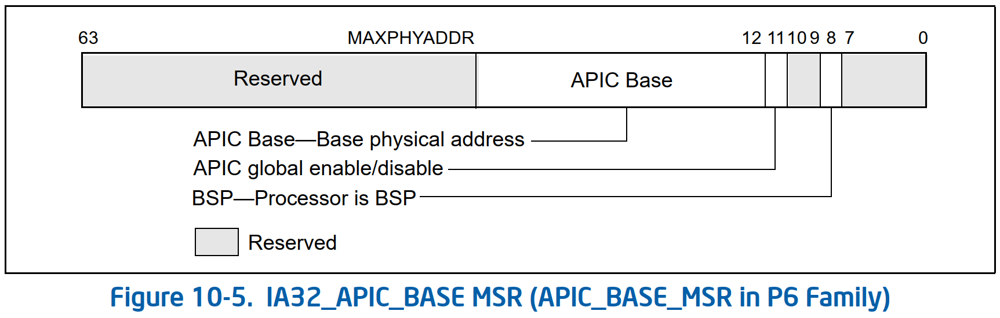

# Multiple-Processor Management

### 8.4.1 BSP 和 AP 处理器
* MP 初始化协议定义了两类处理器：bootstrap processor (BSP) 和 application processors (AP)
  * 在 MP 系统上电或复位后，系统硬件动态选择系统总线上的处理器之一作为 BSP
  * 其余处理器被指定为 AP
* 作为 BSP 选择机制的一部分，在 BSP 的 `IA32_APIC_BASE` MSR 中设置 `BSP 标志`，表明它是 BSP。为所有其他处理器清除此标志

* BSP 执行 BIOS 的引导程序代码来配置 APIC 环境，设置系统范围的数据结构，并启动和初始化 AP
  * 当 BSP 和 AP 被初始化时，BSP 接着开始执行操作系统初始化代码
* 上电或复位后，AP 完成最小的自配置，然后等待来自 BSP 处理器的启动信号（SIPI 消息）
  * 接收到 SIPI 消息后，AP 将执行 BIOS AP 配置代码，该代码以 AP 置于 halt 状态结束
* 对于支持 Intel 超线程技术的 Intel 64 和 IA-32 处理器，MP 初始化协议将系统总线或 coherent link domain 上的每个逻辑处理器视为一个单独的处理器（具有唯一的 APIC ID）
  * 在启动期间，其中一个逻辑处理器被选为 BSP，其余逻辑处理器被指定为 AP

### 8.4.2 MP 初始化协议的要求和限制
* MP 初始化协议对系统提出了如下要求和限制：
* MP 协议仅在上电或复位后执行。如果 MP 协议已完成并选择了 BSP，则后续的 INIT（针对特定处理器或系统范围）不会导致重复 MP 协议。相反，每个逻辑处理器检查其 `BSP 标志`（在 `IA32_APIC_BASE` MSR 中）以确定
  * 它是否应该执行 BIOS 引导程序代码（如果它是 BSP）
  * 或进入等待 SIPI 状态（如果它是 AP）
* 在 MP 初始化协议期间，必须禁止系统中所有能够向处理器提供中断的设备这样做。必须禁止中断的时间包括 *BSP 向 AP 发出 INIT-SIPI-SIPI 序列* 和 *AP 响应序列中的最后一个 SIPI* 之间的窗口

### 8.4.4 MP 初始化的例子
* 随附的代码示例中使用了以下常量和数据定义

#### 8.4.4.1 典型的 BSP 初始化序列
* 在选择了 BSP 和 AP 之后（通过硬件协议，参见第 8.4.3 节，“MP 系统的 MP 初始化协议算法”），BSP 开始执行位于常规的 IA-32 架构起始地址（`0xFFFF FFF0`）的 BIOS boot-strap 代码（POST）。引导程序代码通常执行以下操作：
1. 初始化内存
2. 将微码更新加载到处理器中
3. 初始化 MTRR
4. 启用 caches
5. 执行 `EAX` 寄存器中值为 `0x0` 的 `CPUID` 指令，然后读取 `EBX`、`ECX` 和 `EDX` 寄存器以确定 BSP 是否为 “GenuineIntel”
6. 执行 `EAX` 寄存器中值为 `0x1` 的 `CPUID` 指令，然后将 `EAX`、`ECX` 和 `EDX` 寄存器中的值保存在 RAM 中的系统配置空间中，以备后用
7. 将 AP 的启动代码加载到低 1 MByte 内存中的 4 KByte 页中执行
8. 切换到保护模式并确保 APIC 地址空间映射到 strong uncacheable (UC) 内存类型
9. 从本地 APIC ID 寄存器（默认为 `0`）确定 BSP 的 APIC ID，下面的代码片段是一个适用于系统中逻辑处理器的示例，其本地 APIC 单元在 xAPIC 模式下运行，APIC 寄存器使用内存映射访问接口：
    ```asm
    MOV ESI, APIC_ID ;Address of local APIC ID register
    MOV EAX, [ESI]
    AND EAX, 0FF000000H ;Zero out all other bits except APIC ID
    MOV BOOT_ID, EAX ;Save in memory
    ```
    * 将 APIC ID 保存在 ACPI 和/或 MP 表中，并可选择保存在 RAM 中的系统配置空间中
10. 将 *AP 启动代码的 4-KByte 页的基地址* 转换为 8-bit 向量。8 位向量定义了实地址模式地址空间（1 MB 空间）中 4 字节页面的地址。例如，向量 `0x0BD` 指定了启动内存地址为 `0x000BD000`
11. 通过设置 APIC spurious vector register（SVR）的第 `8` 位启用 local APIC
    ```asm
    MOV ESI, SVR  ;Address of SVR
    MOV EAX, [ESI]
    OR EAX, APIC_ENABLED ;Set bit 8 to enable (0 on reset)
    MOV [ESI], EAX
    ```
12. 通过为 APIC 错误处理程序建立一个 `8` 位向量来设置 LVT 错误处理入口
    ```asm
    MOV ESI, LVT3
    MOV EAX, [ESI]
    AND EAX, FFFFFF00H ;Clear out previous vector.
    OR EAX, 000000xxH  ;xx is the 8-bit vector the APIC error handler.
    MOV [ESI], EAX;
    ```
13. 将 Lock Semaphore 变量 `VACANT` 初始化为 `0x00`。AP 使用此信号量来确定它们执行 BIOS AP 初始化代码的顺序
14. 执行以下操作以设置 BSP 以检测系统中 AP 的存在和处理器的数量（在有限的持续时间内，最少 100 毫秒）：
    * 将 `COUNT` 变量的值设置为 `1`
    * 在 AP BIOS 初始化代码中，AP 将递增 `COUNT` 变量以指示其存在。等待 `COUNT` 被更新的有限持续时间可以用定时器来完成。当计时器到期时，BSP 检查 `COUNT` 变量的值。如果计时器到期并且 `COUNT` 变量没有增加，则没有 AP 存在或发生了一些错误
15. 向 AP 广播 INIT-SIPI-SIPI IPI 序列以唤醒它们并初始化它们。如果软件知道它希望唤醒多少个逻辑处理器，它可能会选择轮询 `COUNT` 变量。如果预期的处理器在 100 毫秒计时器到期之前出现，则可以取消计时器并跳到第 16 步
16. 读取并评估 `COUNT` 变量并建立处理器计数
17. 如有必要，重新配置 APIC 并根据需要继续进行剩余的系统诊断

#### 8.4.4.2 典型的 AP 初始化序列
* 当 AP 收到 SIPI 时，它开始在 SIPI 中编码的向量处执行 BIOS AP 初始化代码。AP 初始化代码通常执行以下操作：
1. 等待 BIOS 初始化 Lock Semaphore。当获得对信号量的控制时，初始化继续
2. 将微码更新加载到处理器中
3. 初始化 MTRR（使用与 BSP 相同的映射）
4. 启用 caches
5. 执行 `EAX` 寄存器中值为 `0x0` 的 `CPUID` 指令，然后读取 `EBX`、`ECX` 和 `EDX` 寄存器以确定 AP 是否为“GenuineIntel”
6. 执行 `EAX` 寄存器中值为 `0x1` 的 `CPUID` 指令，然后将 `EAX`、`ECX` 和 `EDX` 寄存器中的值保存在 RAM 中的系统配置空间中，以备后用
7. 切换到保护模式并确保 APIC 地址空间映射到 strong uncacheable (UC) 内存类型
8. 从本地 APIC ID 寄存器中确定 AP 的 APIC ID，并将其添加到 MP 和 ACPI 表中，并可选择添加到 RAM 中的系统配置空间中
9. 通过设置 `SVR` 寄存器中的第 8 位并设置用于错误处理的 `LVT3`（错误 LVT）来初始化和配置本地 APIC（如第 8.4.4.1 节“典型 BSP 初始化序列”中的步骤 9 和 10 所述）。
10. 配置 APs 的 SMI 执行环境（每个 AP 和 BSP 必须有不同的 SMBASE 地址）
11. 将 `COUNT` 变量加 `1`
12. 释放信号量
13. 执行以下操作之一：
    * `CLI` 和 `HLT` 指令（如果不支持 `MONITOR/MWAIT`），或
    * 执行 `CLI`、`MONITOR` 和 `MWAIT` 序列，进入深度 C-state
14. 等待 INIT IPI

## Linux 的 MP 唤醒实现

* arch/x86/kernel/smpboot.c
```cpp
/*
 * NOTE - on most systems this is a PHYSICAL apic ID, but on multiquad
 * (ie clustered apic addressing mode), this is a LOGICAL apic ID.
 * Returns zero if CPU booted OK, else error code from
 * ->wakeup_secondary_cpu.
 */
static int do_boot_cpu(int apicid, int cpu, struct task_struct *idle,
               int *cpu0_nmi_registered)
{
    /* start_ip had better be page-aligned! */
    unsigned long start_ip = real_mode_header->trampoline_start;

    unsigned long boot_error = 0;
    unsigned long timeout;

#ifdef CONFIG_X86_64
    /* If 64-bit wakeup method exists, use the 64-bit mode trampoline IP */
    if (apic->wakeup_secondary_cpu_64)
        start_ip = real_mode_header->trampoline_start64;
#endif
    idle->thread.sp = (unsigned long)task_pt_regs(idle);
    early_gdt_descr.address = (unsigned long)get_cpu_gdt_rw(cpu);
    initial_code = (unsigned long)start_secondary;
    initial_stack  = idle->thread.sp;
...
    /*
     * Wake up a CPU in difference cases:
     * - Use a method from the APIC driver if one defined, with wakeup
     *   straight to 64-bit mode preferred over wakeup to RM.
     * Otherwise,
     * - Use an INIT boot APIC message for APs or NMI for BSP.
     */
    if (apic->wakeup_secondary_cpu_64)
        boot_error = apic->wakeup_secondary_cpu_64(apicid, start_ip);
    else if (apic->wakeup_secondary_cpu)
        boot_error = apic->wakeup_secondary_cpu(apicid, start_ip);
    else
        boot_error = wakeup_cpu_via_init_nmi(cpu, start_ip, apicid,
                             cpu0_nmi_registered);
...
    return boot_error;
}
```
### INIT-SIPI-SIPI 序列
```cpp
static int
wakeup_secondary_cpu_via_init(int phys_apicid, unsigned long start_eip)
{
    unsigned long send_status = 0, accept_status = 0;
    int maxlvt, num_starts, j;

    maxlvt = lapic_get_maxlvt();

    /*
     * Be paranoid about clearing APIC errors.
     */
    if (APIC_INTEGRATED(boot_cpu_apic_version)) {
        if (maxlvt > 3)     /* Due to the Pentium erratum 3AP.  */
            apic_write(APIC_ESR, 0);
        apic_read(APIC_ESR);
    }

    pr_debug("Asserting INIT\n");

    /*
     * Turn INIT on target chip
     */
    /*
     * Send IPI
     */
    apic_icr_write(APIC_INT_LEVELTRIG | APIC_INT_ASSERT | APIC_DM_INIT,
               phys_apicid);

    pr_debug("Waiting for send to finish...\n");
    send_status = safe_apic_wait_icr_idle();

    udelay(init_udelay);

    pr_debug("Deasserting INIT\n");

    /* Target chip */
    /* Send IPI */
    apic_icr_write(APIC_INT_LEVELTRIG | APIC_DM_INIT, phys_apicid);

    pr_debug("Waiting for send to finish...\n");
    send_status = safe_apic_wait_icr_idle();

    mb();

    /*
     * Should we send STARTUP IPIs ?
     *
     * Determine this based on the APIC version.
     * If we don't have an integrated APIC, don't send the STARTUP IPIs.
     */
    if (APIC_INTEGRATED(boot_cpu_apic_version))
        num_starts = 2;
    else
        num_starts = 0;

    /*
     * Run STARTUP IPI loop.
     */
    pr_debug("#startup loops: %d\n", num_starts);

    for (j = 1; j <= num_starts; j++) {
        pr_debug("Sending STARTUP #%d\n", j);
        if (maxlvt > 3)     /* Due to the Pentium erratum 3AP.  */
            apic_write(APIC_ESR, 0);
        apic_read(APIC_ESR);
        pr_debug("After apic_write\n");

        /*
         * STARTUP IPI
         */

        /* Target chip */
        /* Boot on the stack */
        /* Kick the second */
        apic_icr_write(APIC_DM_STARTUP | (start_eip >> 12),
                   phys_apicid);

        /*
         * Give the other CPU some time to accept the IPI.
         */
        if (init_udelay == 0)
            udelay(10);
        else
            udelay(300);

        pr_debug("Startup point 1\n");

        pr_debug("Waiting for send to finish...\n");
        send_status = safe_apic_wait_icr_idle();

        /*
         * Give the other CPU some time to accept the IPI.
         */
        if (init_udelay == 0)
            udelay(10);
        else
            udelay(200);

        if (maxlvt > 3)     /* Due to the Pentium erratum 3AP.  */
            apic_write(APIC_ESR, 0);
        accept_status = (apic_read(APIC_ESR) & 0xEF);
        if (send_status || accept_status)
            break;
    }
    pr_debug("After Startup\n");

    if (send_status)
        pr_err("APIC never delivered???\n");
    if (accept_status)
        pr_err("APIC delivery error (%lx)\n", accept_status);

    return (send_status | accept_status);
}
...
/*
 * Wake up AP by INIT, INIT, STARTUP sequence.
 *
 * Instead of waiting for STARTUP after INITs, BSP will execute the BIOS
 * boot-strap code which is not a desired behavior for waking up BSP. To
 * void the boot-strap code, wake up CPU0 by NMI instead.
 *
 * This works to wake up soft offlined CPU0 only. If CPU0 is hard offlined
 * (i.e. physically hot removed and then hot added), NMI won't wake it up.
 * We'll change this code in the future to wake up hard offlined CPU0 if
 * real platform and request are available.
 */
static int
wakeup_cpu_via_init_nmi(int cpu, unsigned long start_ip, int apicid,
           int *cpu0_nmi_registered)
{
    int id;
    int boot_error;

    preempt_disable();

    /*
     * Wake up AP by INIT, INIT, STARTUP sequence.
     */
    if (cpu) {
        boot_error = wakeup_secondary_cpu_via_init(apicid, start_ip);
        goto out;
    }

    /*
     * Wake up BSP by nmi.
     *
     * Register a NMI handler to help wake up CPU0.
     */
    boot_error = register_nmi_handler(NMI_LOCAL,
                      wakeup_cpu0_nmi, 0, "wake_cpu0");

    if (!boot_error) {
        enable_start_cpu0 = 1;
        *cpu0_nmi_registered = 1;
        id = apic->dest_mode_logical ? cpu0_logical_apicid : apicid;
        boot_error = wakeup_secondary_cpu_via_nmi(id, start_ip);
    }

out:
    preempt_enable();

    return boot_error;
}
```