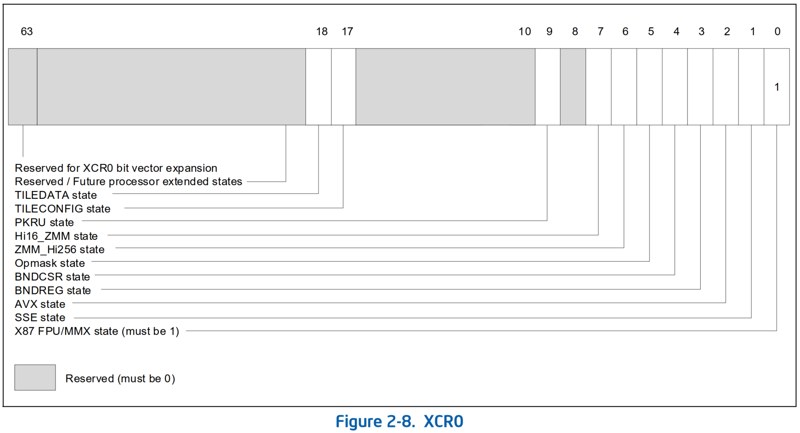

# AMX

## Extended Feature Disable (XFD)



* 扩展功能禁用（Extended Feature Disable，XFD）的扩展是 XSAVE 功能集的扩展，它允许操作系统启用功能，同时阻止 *特定用户线程* 使用该功能
  * 如果 `XCR0[i] = IA32_XFD[i] = 1`，则为状态组件 `i` *启用 XFD*
  * 如果 `XCR0[i] = 0`，`IA32_XFD[i]` 不影响处理器操作
  * 当为状态组件 **启用 XFD** 时，任何指令将访问该状态的组件不会执行，而是生成设备不可用 Device-not-available 异常（`#NM`）
* 当 XFD 导致指令生成 `#NM` 时，处理器加载 `IA32_XFD_ERR` MSR 以识别被禁用的状态组件
  * 具体来说，MSR 加载了 `IA32_XFD` MSR 的逻辑与和错误指令所需的状态组件对应的位图
  * Intel AMX 指令需要启用 `XTILECFG` 状态和 `XTILEDATA` 状态
* 不是由 XFD 引起的 Device-not-available 异常，例如那些因将 `CR0.TS` 设置为 `1` 而产生的异常，不会修改 `IA32_XFD_ERR` MSR

## Kernel 的支持
* 系统启动时，需要将 `IA32_XFD` MSR 的相关 bit 位 `XTILEDATA (bit 18)` 给置上
* 当执行 AMX 指令时，由于 XFD 导致生成 `#NM`，其处理函数需要完成以下几件事情：
  1. 读取 `IA32_XFD_ERR` MSR 以确定是不是 AMX 相关组件导致的异常
  2. 如果线程具备相应的权限，分配 per 线程的 xsave 区域的空间（因为大部分线程都不使用 AMX，线程切换时不需要保存 xsave 寄存器，所以采用的 lazy 分配策略）
  3. 清空 `IA32_XFD` MSR 相应的 bit，以防止将来执行 AMX 指令时产生 `#NM` 异常
* 进程换出的时候用 `xsave` 类似的指令将 xsave 寄存器相关的内容保存至 per 线程的 xsave 区域
* 进程换入时并不急于将 xsave 区域的内容恢复到 xsave 寄存器，而是推迟到返回用户态前用 `xrstore` 类似的指令恢复

### 初始化 XFD MSR
```c
start_kernel()
-> setup_arch(&command_line)
   -> early_cpu_init()
      -> early_identify_cpu(&boot_cpu_data)
         -> fpu__init_system()
            -> fpu__init_cpu()
               -> fpu__init_cpu_xstate()
            -> fpu__init_system_xstate(fpu_kernel_cfg.max_size)
               -> fpu__init_cpu_xstate()
-> trap_init()
   -> cpu_init()
      -> fpu__init_cpu()
         -> fpu__init_cpu_xstate()
```
* arch/x86/kernel/fpu/xstate.c
```c
/*
 * Enable the extended processor state save/restore feature.
 * Called once per CPU onlining.
 */
void fpu__init_cpu_xstate(void)
{
    if (!boot_cpu_has(X86_FEATURE_XSAVE) || !fpu_kernel_cfg.max_features)
        return;

    cr4_set_bits(X86_CR4_OSXSAVE);

    /*
     * Must happen after CR4 setup and before xsetbv() to allow KVM
     * lazy passthrough.  Write independent of the dynamic state static
     * key as that does not work on the boot CPU. This also ensures
     * that any stale state is wiped out from XFD.
     */
    if (cpu_feature_enabled(X86_FEATURE_XFD))
        wrmsrl(MSR_IA32_XFD, init_fpstate.xfd);

    /*
     * XCR_XFEATURE_ENABLED_MASK (aka. XCR0) sets user features
     * managed by XSAVE{C, OPT, S} and XRSTOR{S}.  Only XSAVE user
     * states can be set here.
     */
    xsetbv(XCR_XFEATURE_ENABLED_MASK, fpu_user_cfg.max_features);

    /*
     * MSR_IA32_XSS sets supervisor states managed by XSAVES.
     */
    if (boot_cpu_has(X86_FEATURE_XSAVES)) {
        wrmsrl(MSR_IA32_XSS, xfeatures_mask_supervisor() |
                     xfeatures_mask_independent());
    }
}
```

### `#NM` 异常的处理
* v6.3
```c
arch/x86/include/asm/trapnr.h|14| <<global>> #define X86_TRAP_NM 7
arch/x86/kernel/idt.c|88| <<global>> INTG(X86_TRAP_NM, asm_exc_device_not_available),
arch/x86/include/asm/idtentry.h|551| <<SYM_CODE_END>> DECLARE_IDTENTRY(X86_TRAP_NM, exc_device_not_available);
-> handle_xfd_event()
   -> xfd_enable_feature(xfd_err)
      -> __xfd_enable_feature(xfd_err, NULL)
            u64 xfd_event = xfd_err & XFEATURE_MASK_USER_DYNAMIC;
         -> fpstate_realloc(xfd_event, ksize, usize, guest_fpu)
               newfps->xfd = curfps->xfd & ~xfeatures; //把 MSR_IA32_XFD 相关的位置为 0，该进程执行 AMX 指令不要再引发 #NM
               fpu->fpstate = newfps;
            -> xfd_update_state(fpu->fpstate)
                  u64 xfd = fpstate->xfd;
                  if (__this_cpu_read(xfd_state) != xfd) {
                     wrmsrl(MSR_IA32_XFD, xfd);
                     __this_cpu_write(xfd_state, xfd);
                  }
```
* 处理 `#NM` 的入口，主要是 xsave 产生的异常，其他的原因不太可能
* arch/x86/kernel/traps.c
```c
static bool handle_xfd_event(struct pt_regs *regs)
{
    u64 xfd_err;
    int err;

    if (!IS_ENABLED(CONFIG_X86_64) || !cpu_feature_enabled(X86_FEATURE_XFD))
        return false;
    //当 MSR_IA32_XFD_ERR 为 0 时说明不是 XFD 引起的事件
    rdmsrl(MSR_IA32_XFD_ERR, xfd_err);
    if (!xfd_err)
        return false;
    //清除 MSR_IA32_XFD_ERR，让下回 #NM 异常使用
    wrmsrl(MSR_IA32_XFD_ERR, 0);
    //只有用户态引发 #NM
    /* Die if that happens in kernel space */
    if (WARN_ON(!user_mode(regs)))
        return false;

    local_irq_enable();
    //使能改进程的 XFD feature，包括 xsave 空间的分配
    err = xfd_enable_feature(xfd_err);
    //如有权限问题或者使能时发生错误，杀死触发 #NM 的进程
    switch (err) {
    case -EPERM:
        force_sig_fault(SIGILL, ILL_ILLOPC, error_get_trap_addr(regs));
        break;
    case -EFAULT:
        force_sig(SIGSEGV);
        break;
    }

    local_irq_disable();
    return true;
}

DEFINE_IDTENTRY(exc_device_not_available)
{
    unsigned long cr0 = read_cr0();

    if (handle_xfd_event(regs))
        return;
...
    /* This should not happen. */
    if (WARN(cr0 & X86_CR0_TS, "CR0.TS was set")) {
        /* Try to fix it up and carry on. */
        write_cr0(cr0 & ~X86_CR0_TS);
    } else {
        /*
         * Something terrible happened, and we're better off trying
         * to kill the task than getting stuck in a never-ending
         * loop of #NM faults.
         */
        die("unexpected #NM exception", regs, 0);
    }
}
```
* arch/x86/kernel/fpu/xstate.c
```c
int __xfd_enable_feature(u64 xfd_err, struct fpu_guest *guest_fpu)
{
    u64 xfd_event = xfd_err & XFEATURE_MASK_USER_DYNAMIC;
    struct fpu_state_perm *perm;
    unsigned int ksize, usize;
    struct fpu *fpu;

    if (!xfd_event) {
        if (!guest_fpu)
            pr_err_once("XFD: Invalid xfd error: %016llx\n", xfd_err);
        return 0;
    }
    //防止并发使能
    /* Protect against concurrent modifications */
    spin_lock_irq(&current->sighand->siglock);
    //如果进程组没有相关 XFD 特性的权限，让它死吧
    /* If not permitted let it die */
    if ((xstate_get_group_perm(!!guest_fpu) & xfd_event) != xfd_event) {
        spin_unlock_irq(&current->sighand->siglock);
        return -EPERM;
    }
    //获取进程相关的 fpu 信息，从这里可以看到它在 task_struct 的位置
    fpu = &current->group_leader->thread.fpu;
    perm = guest_fpu ? &fpu->guest_perm : &fpu->perm;
    ksize = perm->__state_size;
    usize = perm->__user_state_size;

    /*
     * The feature is permitted. State size is sufficient.  Dropping
     * the lock is safe here even if more features are added from
     * another task, the retrieved buffer sizes are valid for the
     * currently requested feature(s).
     */
    spin_unlock_irq(&current->sighand->siglock);
    //给 xsave 区域分配 per 进程的空间
    /*
     * Try to allocate a new fpstate. If that fails there is no way
     * out.
     */
    if (fpstate_realloc(xfd_event, ksize, usize, guest_fpu))
        return -EFAULT;
    return 0;
}
```

### 进程换出的时候保存 `xsave`
```c
context_switch()
-> switch_to()
   -> __switch_to_asm()
         jmp __switch_to
         -> switch_fpu_prepare(prev_fpu, cpu)
            -> save_fpregs_to_fpstate(old_fpu)
         -> switch_fpu_finish()
```
* arch/x86/kernel/fpu/core.c
```c
/*
 * Save the FPU register state in fpu->fpstate->regs. The register state is
 * preserved.
 *
 * Must be called with fpregs_lock() held.
 *
 * The legacy FNSAVE instruction clears all FPU state unconditionally, so
 * register state has to be reloaded. That might be a pointless exercise
 * when the FPU is going to be used by another task right after that. But
 * this only affects 20+ years old 32bit systems and avoids conditionals all
 * over the place.
 *
 * FXSAVE and all XSAVE variants preserve the FPU register state.
 */
void save_fpregs_to_fpstate(struct fpu *fpu)
{
    if (likely(use_xsave())) {
        os_xsave(fpu->fpstate);
        update_avx_timestamp(fpu);
        return;
    }

    if (likely(use_fxsr())) {
        fxsave(&fpu->fpstate->regs.fxsave);
        return;
    }

    /*
     * Legacy FPU register saving, FNSAVE always clears FPU registers,
     * so we have to reload them from the memory state.
     */
    asm volatile("fnsave %[fp]; fwait" : [fp] "=m" (fpu->fpstate->regs.fsave));
    frstor(&fpu->fpstate->regs.fsave);
}
```
* arch/x86/kernel/fpu/xstate.h
```c
/*
 * Save processor xstate to xsave area.
 *
 * Uses either XSAVE or XSAVEOPT or XSAVES depending on the CPU features
 * and command line options. The choice is permanent until the next reboot.
 */
static inline void os_xsave(struct fpstate *fpstate)
{
    u64 mask = fpstate->xfeatures;
    u32 lmask = mask;
    u32 hmask = mask >> 32;
    int err;

    WARN_ON_FPU(!alternatives_patched);
    xfd_validate_state(fpstate, mask, false);

    XSTATE_XSAVE(&fpstate->regs.xsave, lmask, hmask, err);

    /* We should never fault when copying to a kernel buffer: */
    WARN_ON_FPU(err);
}
```

### 进程返回用户态前恢复 `xrstore`
```c
exit_to_user_mode_prepare()
-> arch_exit_to_user_mode_prepare()
   -> switch_fpu_return()
      -> fpregs_restore_userregs()
         -> restore_fpregs_from_fpstate()
            -> os_xrstor()
            -> fxrstor()
            -> frstor()
```