# APIC

## 11.1 Local 和 I/O APIC 概览
* 每个 local APIC 由一组 APIC 寄存器（见表 11-1）和相关硬件组成，这些硬件控制 *中断向处理器核的递交* 和 *IPI 消息的生成*。
* APIC 寄存器是内存映射的，可以使用 `MOV` 指令读取和写入。
* Local APIC 可以从以下来源接收中断：
* **Locally connected I/O devices**：这些中断起源于直接连接到处理器的本地中断引脚（`LINT0` 和 `LINT1`）的 I/O 设备的边沿或电平 asserted。
  * I/O 设备也可以连接到 8259 型中断控制器，后者又通过本地中断引脚之一连接到处理器。
* **Externally connected I/O devices**：这些中断起源于连接到 I/O APIC 的中断输入引脚的 I/O 设备的边沿或电平 asserted。
  * 中断作为 I/O 中断消息从 I/O APIC 发送到系统中的一个或多个处理器。
* **Inter-processor interrupts (IPIs)**：Intel 64 或 IA-32 处理器可以使用 IPI 机制来中断系统总线上的另一个处理器或一组处理器。
  * IPI 用于软件自中断、中断转发或抢占式调度。
* **APIC timer generated interrupts**：local APIC 计时器可以编程为在达到编程计数时向其关联的处理器发送本地中断（参见第 11.5.4 节“APIC Timer”）。
* **Performance monitoring counter interrupts**：P6 系列、奔腾 4 和 Intel Xeon 处理器提供了在性能监控计数器溢出时向其相关处理器发送中断的能力。
* **Thermal Sensor interrupts**：Pentium 4 和 Intel Xeon 处理器能够在内部温度传感器触发时向自身发送中断。
* **APIC internal error interrupts**：当在 local APIC 中识别出错误条件时（例如尝试访问未实现的寄存器），APIC 可以被编程为向其关联的处理器发送中断。
* 在这些中断源中：处理器的 `LINT0` 和 `LINT1` 引脚、APIC 定时器、性能监控计数器、温度传感器和内部 APIC 错误检测器被称为 **本地中断源**。
  * 从本地中断源接收到信号后，local APIC 使用中断递交协议将中断递交到处理器核，该协议已通过一组称为 **本地向量表（local vector table）** 或 **LVT** 的 APIC 寄存器设置（参见第 11.5.1 节， “Local Vector Table”）。
  * 本地向量表中为每个本地中断源提供了一个单独的条目，这允许为每个中断源设置特定的中断递交协议。
    * 例如，如果 `LINT1` 引脚要用作 NMI 引脚，则可以设置本地向量表中的 `LINT1` 条目以向处理器核提供向量号为 `2` 的中断（NMI 中断）。
* Local APIC 通过其 IPI 消息处理设施处理来自其他两个中断源（externally connected I/O 设备和 IPI）的中断。
* 处理器可以通过在其 local APIC 中编程 Interrupt Command Register（`ICR`）来生成 IPI。
  * 写入 `ICR` 的行为会导致在系统总线（对于奔腾 4 和英特尔至强处理器）或 APIC 总线（对于奔腾和 P6 系列处理器）上生成并发布一条 IPI 消息。
* IPI 可以发送到系统中的其他处理器或自己（自中断）。当目标处理器接收到 IPI 消息时，其 local APIC 会自动处理该消息（使用消息中包含的信息，例如向量号和触发模式）。
* Local APIC 还可以通过 I/O APIC 接收来自外部连接设备的中断（见图 11-1）。I/O APIC 负责接收系统硬件和 I/O 设备产生的中断，并将其作为中断消息转发给 local APIC。
* 可以对 I/O APIC 上的各个引脚进行编程，以在 asserted 时生成特定的中断向量。
* I/O APIC 还有一个“virtual wire mode”，允许它与标准 8259A 型外部中断控制器通信。
* 注意，可以禁用 local APIC（请参阅第 11.4.3 节，“Enabling or Disabling the Local APIC”）。这允许关联的处理器核直接从 8259A 中断控制器接收中断。
* Local APIC 和 I/O APIC 都是为在 MP 系统中运行而设计的（见图 11-2 和 11-3）。
  * 每个 local APIC 处理来自 I/O APIC 的中断、来自系统总线上处理器的 IPI，以及自生成的中断。
  * 中断也可以通过本地中断引脚传送到各个处理器；然而，这种机制通常不用于 MP 系统。

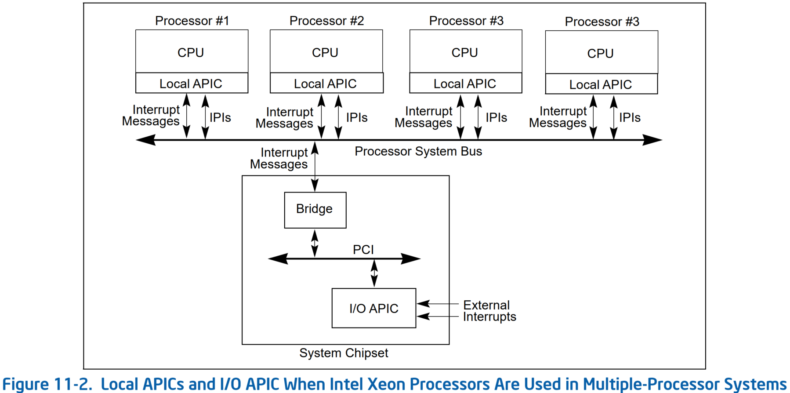


* IPI 机制通常用于 MP 系统，用于向系统总线上的处理器发送 fixed 中断（针对特定向量号的中断）和专用中断。例如，
  * local APIC 可以使用 IPI 将 fixed 中断转发给另一个处理器进行服务。
  * 专用 IPI（包括 NMI、INIT、SMI 和 SIPI IPI）允许系统总线上的一个或多个处理器执行系统范围的启动和控制功能。

## 11.4 Local APIC

### 11.4.1 The Local APIC Block Diagram

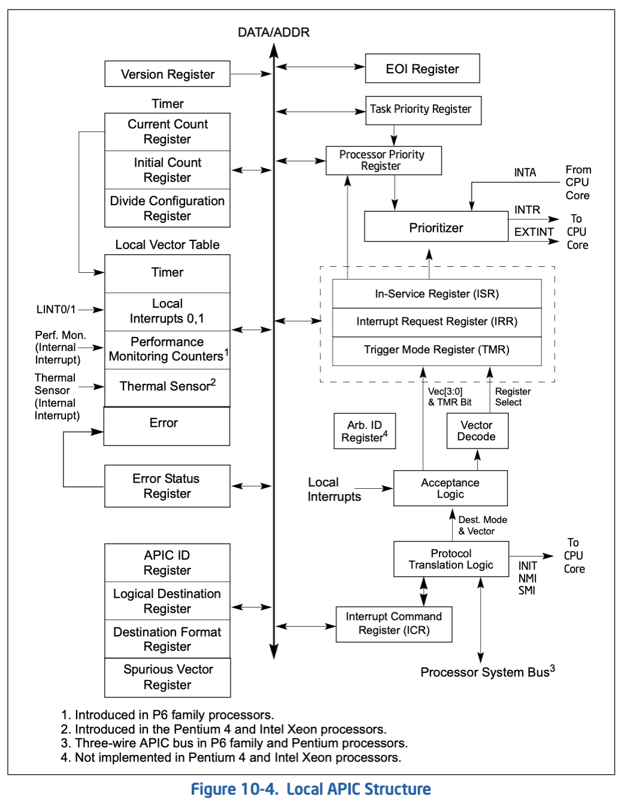

* 图 11-4 给出了 Local APIC 的功能框图。
* 软件通过读取和写入 local APIC 的寄存器来与 local APIC 交互。
* APIC 寄存器内存映射到处理器物理地址空间的 `4 KB` 区域，初始起始地址为 `0xFEE00000`。
* 为了正确的 APIC 操作，该地址空间必须映射到已指定为强不可缓存（`UC`）的内存区域。请参阅第 12.3 节 “Methods of Caching Available.”。
* 在 MP 系统配置中，系统总线上 Intel 64 或 IA-32 处理器的 APIC 寄存器最初映射到 **物理地址空间的相同 `4 KB` 区域**。
  * 软件可以选择将所有 local APIC 的初始映射更改为一个其他的 `4 KB` 区域，或者将每个 local APIC 的 APIC 寄存器映射到其自己的 `4 KB` 区域。第 11.4.5 节 “重定位 Local APIC 寄存器” 描述了如何重定位 APIC 寄存器的基地址。
* 在支持 x2APIC 架构的处理器上（由 `CPUID.01H:ECX[21] = 1` 指示），local APIC 支持 xAPIC 模式和（如果由软件启用）x2APIC 模式下的操作。x2APIC 模式提供扩展的处理器寻址能力（参见第 11.12 节）
**注意**：
* 对于 P6 系列、Pentium 4 和 Intel Xeon 处理器，APIC 在内部处理对 `4 KB` APIC 寄存器空间内的地址的所有内存访问，并且不产生外部总线周期。
* 对于带有片上 APIC 的 Pentium 处理器，会产生总线周期来访问 APIC 寄存器空间。因此，对于打算在 Pentium 处理器上运行的软件，系统软件不应明确地将 APIC 寄存器空间映射到常规系统内存。这样做可能会导致生成无效操作码异常（`#UD`）或不可预测的执行

### 11.4.4 Local APIC 状态和位置
* Local APIC 的状态和位置包含在 `IA32_APIC_BASE` MSR 中（见图 11-5）。MSR位功能描述如下：

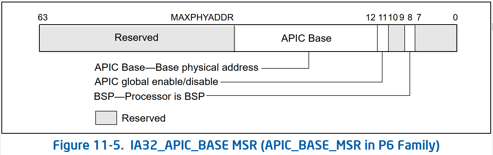

* **BSP flag, bit 8** — 指示处理器是否为引导处理器 (BSP)。请参见第 9.4 节“MultipleProcessor (MP) Initialization”。上电或复位后，对于选择作为 BSP 的处理器，该标志设置为 `1`，对于其余处理器 (AP)，该标志设置为 `0`。
* **APIC Global Enable flag, bit 11** — 启用或禁用 local APIC（请参见第 11.4.3 节 “Enabling or Disabling the Local APIC”）。此标志在 Pentium 4、Intel Xeon 和 P6 系列处理器中可用。不保证在未来的 Intel 64 或 IA-32 处理器中可用或在同一位置可用。
* **APIC Base field, bits 12 到 35** — 指定 APIC 寄存器的基地址。该 24 位值再扩展低 12 位以形成基地址。这会自动在 `4 KB` 边界上对齐地址。上电或复位后，该字段设置为 `0xFEE0 0000`。
* `IA32_APIC_BASE` MSR 中的 bit `0` 到 `7`、bit `9` 和 `10` 以及 bit `MAXPHYADDR` 到 `63` 被保留。
  * 对于不支持 CPUID leaf `0x80000008` 的处理器，`MAXPHYADDR` 为 bit `36`，或者对于支持 CPUID leaf `0x80000008` 的处理器，由 `CPUID.80000008H:EAX[bit 7:0]` 指示。

### 11.4.5 重定位 Local APIC 寄存器
* Pentium 4、Intel Xeon 和 P6 系列处理器允许通过修改 `IA32_APIC_BASE` MSR 基地址字段中的值将 APIC 寄存器的起始地址从 `0xFEE00000` 重定位到另一个物理地址。
* APIC 架构的这种扩展旨在帮助解决与现有系统内存映射的冲突，并允许 MP 系统中的各个处理器将其 APIC 寄存器映射到物理内存中的不同位置。

### 11.4.6 Local APIC ID
* 启动时，系统硬件会为系统总线（Pentium 4 和 Intel Xeon 处理器）或 APIC 总线（P6 系列和 Pentium 处理器）上的每个 local APIC 分配一个唯一的 APIC ID。
* 硬件分配的 APIC ID 基于系统拓扑结构，包含插槽（socket）位置和 cluster 信息的编码（参见 Figure 10-2 和第 10.9.1 节“Hierarchical Mapping of Shared Resources”）。
* 在多处理器系统中，local APIC ID 也被 BIOS 和操作系统用作 **处理器 ID**。
  * 某些处理器允许软件修改 APIC ID。但是，软件修改 APIC ID 的能力取决于处理器型号。因此，操作系统软件应避免写入 local APIC ID 寄存器。
* `EBX` 寄存器的第 `31-24` 位返回的值（当执行 `CPUID` 指令且 `EAX` 寄存器中的源操作数值为 `1` 时）始终是 **初始 APIC ID（Initial APIC ID）**（由平台初始化确定）。即使软件更改了 local APIC ID 寄存器中的值，情况也是如此。
* 处理器通过采样引脚 `A11#` 和 `A12#` 以及引脚 `BR0#` 至 `BR3#`（对于 Pentium 4、Intel Xeon 和 P6 系列处理器）和引脚 `BE0#` 至 `BE3#`（对于 Pentium 处理器）来接收硬件分配的 APIC ID（或初始 APIC ID）。
  * 从这些引脚锁存（latched）的 APIC ID 存储在 local APIC ID 寄存器的 `APIC ID` 字段中（参见 Figure 12-6），并用作处理器的初始 APIC ID。

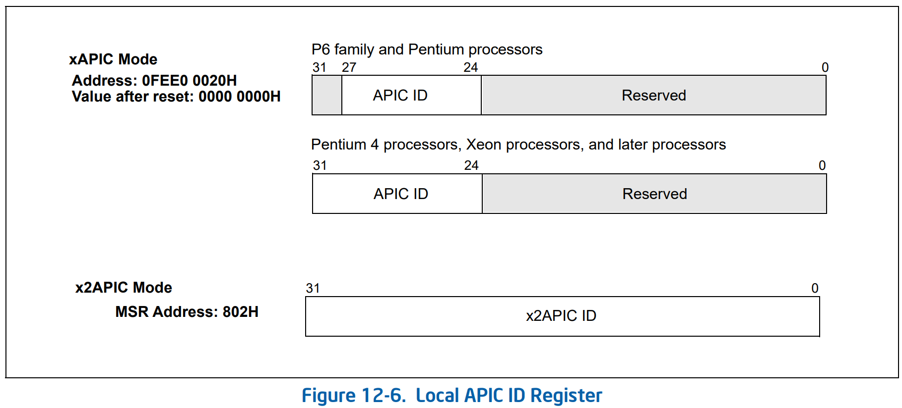

* 对于 P6 系列和 Pentium 处理器，local APIC ID 寄存器中的 `local APIC ID` 字段为 `4` 位。编码 `0x0` 到 `0xE` 可用于唯一标识连接到 APIC 总线的 15 个不同处理器。
* 对于 Pentium 4 和 Intel Xeon 处理器，xAPIC 规范将 `local APIC ID` 字段扩展至 `8` 位。这些字段可用于标识系统中最多 `255` 个处理器。

### 11.4.7 Local APIC 状态

#### 11.4.7.3 在 INIT Reset 之后的 Local APIC 状态（“Wait-for-SIPI” 状态）
* 处理器的 INIT Reset 可以通过以下两种方式之一启动：
  * 通过 asserting 处理器的 `INIT #` Pin
  * 通过给处理器发送一个 INIT IPI（delivery mode 设置为 `INIT` 的 IPI）
* 通过这些机制之一接收到 INIT 后，处理器会通过开始处理器核和 local APIC 的初始化过程来进行响应。
* INIT Reset 后 local APIC 的状态与上电或硬件复位后的状态相同，只是 APIC ID 和仲裁 ID 寄存器不受影响。该状态也称为 **“wait-for-SIPI”状态**（另请参见：第 9.4.2 节“MP Initialization Protocol Requirements and Restrictions”）。

## 11.5 处理本地中断
* 以下部分描述了 local APIC 中提供的用于处理本地中断的设施。其中包括：处理器的 LINT0 和 LINT1 引脚、APIC 定时器、性能监控计数器、Intel Processor Trace、热传感器和内部 APIC 错误检测器。
* 本地中断处理设施包括：LVT、错误状态寄存器 (ESR)、除法配置寄存器 (DCR) 以及初始计数和当前计数寄存器。

### 11.5.1 本地向量表（Local Vector Table）
* 本地向量表（LVT）允许软件指定将本地中断传送到处理器核的方式。它由以下 32 位 APIC 寄存器组成（见图 11-8），每个本地中断一个：


* **Delivery Mode**：指定要发送到处理器的中断类型。某些递交模式只有在与特定触发模式结合使用时才会按预期运行。允许的递交方式如下：
  * **111（ExtINT）**：使处理器响应中断，就好像中断源自外部连接的（8259A 兼容的）中断控制器
    * 对应于 ExtINT 的特殊 INTA 总线 cycle 被路由到外部控制器。期望外部控制器提供 *Vector* 信息
    * APIC 体系结构在一个系统中只支持一个 ExtINT 源，通常包含在兼容桥中
    * 系统中只有一个处理器应该有一个 LVT 条目配置为使用 ExtINT 递交模式
    * 不支持 LVT CMCI 寄存器、LVT 温度监控寄存器或 LVT 性能计数器寄存器
* **Delivery Status（Read Only）**：指示中断递交状态如下：
    * **0（Idle）**：此中断源当前没有活动，或者来自此源的先前中断已传送到处理器核并被接受
    * **1（Send Pengding）**：表示来自该源的中断已传送至处理器核但尚未被接受

### 11.5.2 有效中断向量
* Intel 64 和 IA-32 架构定义了 `256` 个向量编号，范围从 `0` 到 `255`（参见第 6.2 节“Exception and Interrupt Vectors”）。
  * local 和 I/O APIC 支持 `240` 个这样的向量（在 `16` 到 `255` 的范围内）作为有效中断。
  * 当通过 local APIC 发送或接收范围为 `0` 到 `15` 的中断向量时，APIC 会在其错误状态寄存器（Error Status Register）中指示非法向量（参见第 11.5.3 节“Error Handling”）。
  * Intel 64 和 IA-32 架构保留向量 `16` 到 `31` 用于预定义中断、异常和 Intel 保留的 encodings（参见表 6-1）。但是，local APIC 不会将此范围内的向量视为非法。
* 当一个非法向量值（`0` 到 `15`）被写入 LVT 条目并且递交模式是 fixed 的（bit `8-11` 等于 `0`）时，APIC 可能会发出非法向量错误信号，而不管掩码位是否被设置或是否实际在输入上看到了中断。

### 11.5.5 本地中断的接受
* 当本地中断被发送到处理器核时，它受制于图 11-17 中中断接受流程图中指定的接受标准。
  * 如果中断被接受，它会被记录到 `IRR` 寄存器中，并由处理器根据其优先级进行处理（参见第 11.8.4 节，“Interrupt Acceptance for Fixed Interrupts”）
  * 如果中断未被接受，则将其发送回 local APIC 并重试

### ICR 的组成
* 对于 xAPIC 是 MMIO 映射的寄存器地址 `0xFEE0 0300`（0-31 bit）和 `0xFEE0 0310`（32-63 bit）

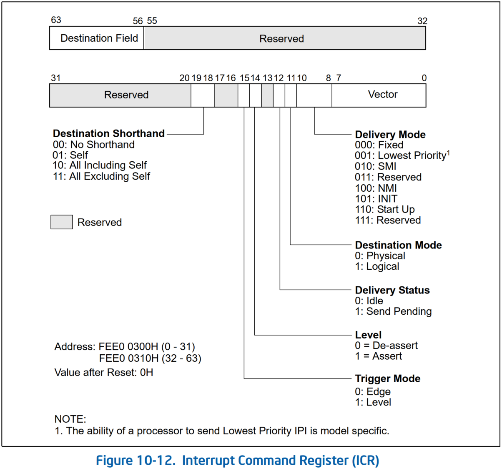

* 对于 x2APIC 是 MSR 地址 `0x830`

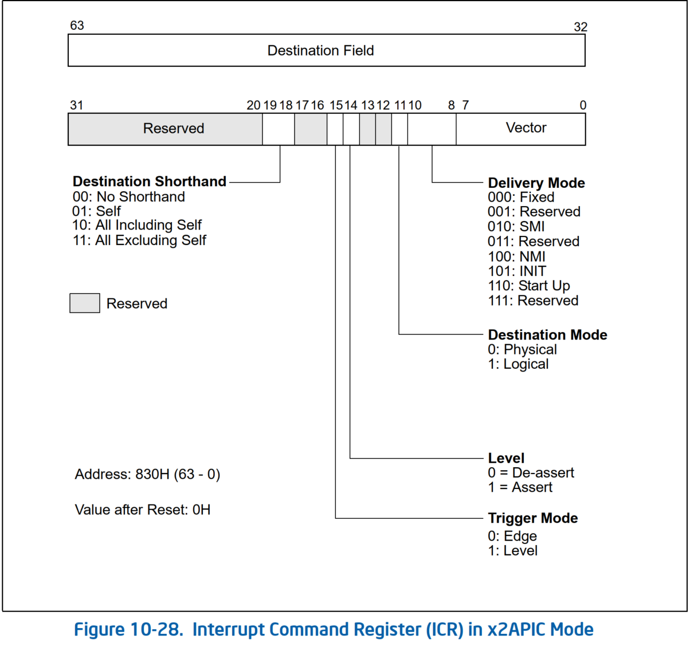

* **Vector**：目标 CPU 收到的中断向量号，其中 0-15 号被视为非法，会给目标 CPU 的 APIC 产生一个 Illegal Vector 错误
* **Delivery Mode**：指定要发送的 IPI 类型。该字段也称为 **IPI 消息类型** 字段
  * **000 (Fixed)**：按 *Vector* 的值向所有目标 CPU 发送相应的中断向量号
  * **001 (Lowest Priority)**：按 *Vector* 的值向所有目标 CPU 中优先级最低的 CPU 发送相应的中断向量号
    * 发送 Lowest Priority 模式的 IPI 的能力取决于 CPU 型号，不总是有效，建议 BIOS 和 OS 不要发送 Lowest Priority 模式的 IPI
  * **010 (SMI)**：向所有目标 CPU 发送一个SMI，为了兼容性 *Vector* 必须为 `0`
  * **011 (Reserved)**：保留
  * **100 (NMI)**：向所有目标 CPU 发送一个 NMI，此时 *Vector* 会被忽略
  * **101 (INIT)**：向目标处理器或多个处理器发送 INIT 请求，使它们执行 INIT。作为此 IPI 消息的结果，所有目标处理器都执行 INIT。*Vector* 必须编程为 `0x0` 以实现未来兼容性
    * CPU 在 INIT 后其 APIC ID 和 Arb ID（只在奔腾和 P6 上存在）不变
  * **101 (INIT Level De-assert)**：向所有 CPU 广播一个同步的消息，将所有 CPU 的 APIC 的 Arb ID（只在奔腾和 P6 上存在）重置为初始值（初始 APIC ID）
    * 要使用此模式，*Level* 必须取 `0`，*Trigger Mode* 必须取 `1`，*Destination Shorthand* 必须设置为 `All Including Self`
    * 不支持 Pentium 4 和 Intel Xeon 处理器
  * **110 (Start-Up)**：向目标处理器发送一个特殊的“start-up”IPI（称为 SIPI）。该向量通常指向作为 BIOS 引导代码一部分的启动例程（请参阅第 8.4 节“多处理器 (MP) 初始化”）。如果源 APIC 无法交付使用此 delivery mode 发送的 IPI，则不会自动重试。由软件确定 SIPI 是否未成功交付，并在必要时重新发布 SIPI
    * 目标会从物理地址 `0x000VV000` 开始执行，其中 `0xVV`为 *Vector* 的值

## 设置 Local APIC

### 注册 LAPIC 地址
```cpp
   //init/main.c
-> start_kernel()
      //arch/x86/kernel/setup.c
   -> setup_arch()
         //arch/x86/kernel/apic/apic.c
      -> init_apic_mappings()
         -> detect_init_APIC()
               mp_lapic_addr = APIC_DEFAULT_PHYS_BASE; //#define APIC_DEFAULT_PHYS_BASE 0xfee00000
            apic_phys = mp_lapic_addr;
         -> register_lapic_address(apic_phys)
            -> set_fixmap_nocache(FIX_APIC_BASE, address); //创建从 APIC_BASE（VA）到 0xfee00000（PA）的固定映射（fix mapping）
```
* 用 MMIO 的方式读写 LAPIC 寄存器就是在 `APIC_DEFAULT_PHYS_BASE` 的基础上加上寄存器的偏移
* arch/x86/include/asm/apicdef.h
```cpp
#define APIC_BASE (fix_to_virt(FIX_APIC_BASE))
#define APIC_BASE_MSR   0x800
```
* arch/x86/include/asm/apic.h
```cpp
static inline void native_apic_mem_write(u32 reg, u32 v)
{
    volatile u32 *addr = (volatile u32 *)(APIC_BASE + reg);

    alternative_io("movl %0, %P1", "xchgl %0, %P1", X86_BUG_11AP,
               ASM_OUTPUT2("=r" (v), "=m" (*addr)),
               ASM_OUTPUT2("0" (v), "m" (*addr)));
}

static inline u32 native_apic_mem_read(u32 reg)
{
    return *((volatile u32 *)(APIC_BASE + reg));
}
```

#### 应答 APIC 中断
* 比如说应答中断 `ack_APIC_irq()`

### BSP 设置 Local APIC
```cpp
//arch/x86/kernel/head_64.S
secondary_startup_64
   //init/main.c
-> start_kernel()
      //arch/x86/kernel/time.c
   -> time_init()
          late_time_init = x86_late_time_init;
      if (late_time_init)
      -> late_time_init()
         //arch/x86/kernel/time.c
      => x86_late_time_init()
         -> x86_init.irqs.intr_mode_init()
            //arch/x86/kernel/apic/apic.c
         => apic_intr_mode_init()
               switch (apic_intr_mode)
               case APIC_SYMMETRIC_IO:
                   pr_info("APIC: Switch to symmetric I/O mode setup\n");
            -> apic_bsp_setup(upmode)
               -> setup_local_APIC()
```
* arch/x86/kernel/x86_init.c
```cpp
/*
 * The platform setup functions are preset with the default functions
 * for standard PC hardware.
 */
struct x86_init_ops x86_init __initdata = {
...
    .irqs = {
        .pre_vector_init    = init_ISA_irqs,
        .intr_init      = native_init_IRQ,
        .intr_mode_select   = apic_intr_mode_select,
        .intr_mode_init     = apic_intr_mode_init,
        .create_pci_msi_domain  = native_create_pci_msi_domain,
    },
...
}
```

### AP 设置 Local APIC
* 启动地址变为 `start_secondary` 见 [Multiple-Processors Management](MP_management.md)
```cpp
//arch/x86/kernel/head_64.S
secondary_startup_64
   //arch/x86/kernel/smpboot.c
-> start_secondary()
   -> smp_callin()
         //arch/x86/kernel/apic/apic.c
      -> apic_ap_setup()
         -> setup_local_APIC()
```

### 设置 Local APIC 的 LVT
* 在 `setup_local_APIC()` 这个函数中可以看到对 LVT 中各个条目的设置
  * `APIC_LVT0` 对 LINT0 引脚进行设置
  * `APIC_LVT1` 对 LINT1 引脚进行设置，可见其投递类型为 NMI
* arch/x86/kernel/apic/apic.c
```cpp
/**
 * setup_local_APIC - setup the local APIC
 *
 * Used to setup local APIC while initializing BSP or bringing up APs.
 * Always called with preemption disabled.
 */
static void setup_local_APIC(void)
{
    int cpu = smp_processor_id();
    unsigned int value;

    if (disable_apic) {
        disable_ioapic_support();
        return;
    }

    /*
     * If this comes from kexec/kcrash the APIC might be enabled in
     * SPIV. Soft disable it before doing further initialization.
     */
    value = apic_read(APIC_SPIV);
    value &= ~APIC_SPIV_APIC_ENABLED;
    apic_write(APIC_SPIV, value);
...
    /*
     * Double-check whether this APIC is really registered.
     * This is meaningless in clustered apic mode, so we skip it.
     */
    BUG_ON(!apic->apic_id_registered());

    /*
     * Intel recommends to set DFR, LDR and TPR before enabling
     * an APIC.  See e.g. "AP-388 82489DX User's Manual" (Intel
     * document number 292116).  So here it goes...
     */
    apic->init_apic_ldr();
...
    /*
     * Set Task Priority to 'accept all except vectors 0-31'.  An APIC
     * vector in the 16-31 range could be delivered if TPR == 0, but we
     * would think it's an exception and terrible things will happen.  We
     * never change this later on.
     */
    value = apic_read(APIC_TASKPRI);
    value &= ~APIC_TPRI_MASK;
    value |= 0x10;
    apic_write(APIC_TASKPRI, value);

    /* Clear eventually stale ISR/IRR bits */
    apic_pending_intr_clear();

    /*
     * Now that we are all set up, enable the APIC
     */
    value = apic_read(APIC_SPIV);
    value &= ~APIC_VECTOR_MASK;
    /*
     * Enable APIC
     */
    value |= APIC_SPIV_APIC_ENABLED;
...
    /*
     * Set spurious IRQ vector
     */
    value |= SPURIOUS_APIC_VECTOR;
    apic_write(APIC_SPIV, value);

    perf_events_lapic_init();

    /*
     * Set up LVT0, LVT1:
     *
     * set up through-local-APIC on the boot CPU's LINT0. This is not
     * strictly necessary in pure symmetric-IO mode, but sometimes
     * we delegate interrupts to the 8259A.
     */
    /*
     * TODO: set up through-local-APIC from through-I/O-APIC? --macro
     */
    value = apic_read(APIC_LVT0) & APIC_LVT_MASKED;
    if (!cpu && (pic_mode || !value || skip_ioapic_setup)) {
        value = APIC_DM_EXTINT;
        apic_printk(APIC_VERBOSE, "enabled ExtINT on CPU#%d\n", cpu);
    } else {
        value = APIC_DM_EXTINT | APIC_LVT_MASKED;
        apic_printk(APIC_VERBOSE, "masked ExtINT on CPU#%d\n", cpu);
    }
    apic_write(APIC_LVT0, value);

    /*
     * Only the BSP sees the LINT1 NMI signal by default. This can be
     * modified by apic_extnmi= boot option.
     */
    if ((!cpu && apic_extnmi != APIC_EXTNMI_NONE) ||
        apic_extnmi == APIC_EXTNMI_ALL)
        value = APIC_DM_NMI;
    else
        value = APIC_DM_NMI | APIC_LVT_MASKED;

    /* Is 82489DX ? */
    if (!lapic_is_integrated())
        value |= APIC_LVT_LEVEL_TRIGGER;
    apic_write(APIC_LVT1, value);

#ifdef CONFIG_X86_MCE_INTEL
    /* Recheck CMCI information after local APIC is up on CPU #0 */
    if (!cpu)
        cmci_recheck();
#endif
}
```
* 对 LAPIC 中 PMU 产生的 PMI 条目设置为 NMI 的投递类型
  * `APIC_LVTPC` 即 LVT Performance Monitoring Counters Register 的位置，（xAPIC MMIO 的 APIC page 或 x2APIC 的 MSR 中）偏移为 `0x0340`
  * `APIC_DM_NMI` 即 NMI Delivery Mode，编码为 `100`，占据条目的 `8 ~ 10 bit`，故其宏定义为 `0x00400`
* arch/x86/events/core.c
```c
void perf_events_lapic_init(void)
{
    if (!x86_pmu.apic || !x86_pmu_initialized())
        return;

    /*
     * Always use NMI for PMU
     */
    apic_write(APIC_LVTPC, APIC_DM_NMI);
}
```

## 11.8 处理中断
* 当 local APIC 收到来自本地源的中断、来自 I/O APIC 或 IPI 的中断消息时，它处理消息的方式取决于处理器实现，如以下部分所述。
### 11.8.1 Pentium 4 and Intel Xeon Processors 的中断处理
* 对于 Pentium 4 和 Intel Xeon 处理器，local APIC 处理本地中断、中断消息和它接收到的 IPI，如下所示：

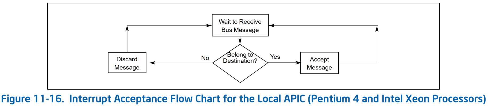

1. 确定它是否是指定的目的地（见图 11-16）。如果是指定的目的地，则接受消息；如果不是，则丢弃该消息。
2. 如果 local APIC 确定它是中断的指定目的地，并且如果中断请求是 NMI、SMI、INIT、ExtINT 或 SIPI，则中断将直接发送到处理器核进行处理。
3. 如果 local APIC 确定它是中断的指定目的地，但中断请求不是步骤 2 中给出的中断之一，则 local APIC 会在 `IRR` 中设置适当的位。
4. 当中断在 `IRR` 寄存器中挂起时，local APIC 根据它们的优先级和 `PPR` 中的当前处理器优先级，将它们一次分派一个给处理器（请参阅第 11.8.3.1 节，“Task and Processor Priorities”）。
5. 当一个 fixed 中断被分派到处理器核进行处理时，*处理例程的完成* 由指令处理程序代码中的一条指令指示，该指令写入 local APIC 中的 end-of-interrupt（`EOI`）寄存器（参见第 11.8.5，“Signaling Interrupt Servicing Completion”）。
   * 写入 `EOI` 寄存器的行为导致 local APIC 从其 `ISR` 队列中删除中断，并（对于电平触发的中断）在总线上发送一条消息，指示中断处理已完成。
   * 对 `EOI` 寄存器的写入不得包含在 NMI、SMI、INIT、ExtINT 或 SIPI 的处理程序例程中。

### 11.8.2 P6 Family and Pentium Processors 的中断处理
* 对于 P6 系列和奔腾处理器，local APIC 处理本地中断、中断消息和它接收到的 IPI，如下所示（见图 11-17）。

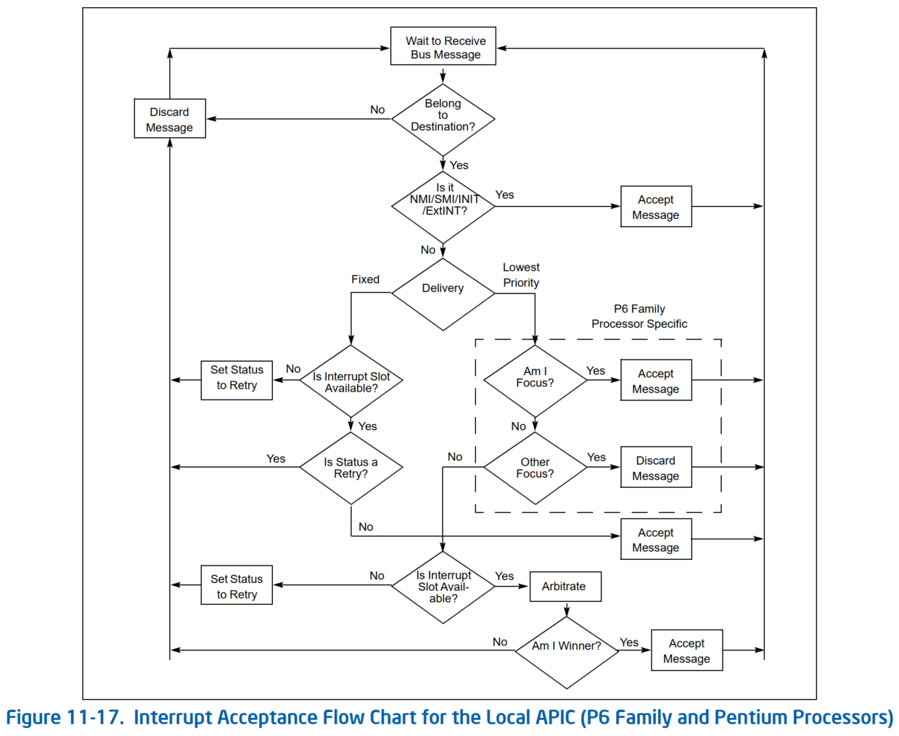

1. （仅限 IPI）local APIC 检查 IPI 消息以确定它是否是 IPI 的指定目标，如第 11.6.2 节 “Determining IPI Destination.” 中所述。
   * 如果是指定的目的地，则继续其接受程序；如果不是目的地，则丢弃 IPI 消息。
   * 当消息指定 lowest-priority 递交模式时，local APIC 将与指定为 IPI 消息接收者的其他处理器进行仲裁（请参阅第 11.6.2.4 节，“Lowest Priority Delivery Mode”）。
2. 如果 local APIC 确定它是中断的指定目的地，并且如果中断请求是 NMI、SMI、INIT、ExtINT 或 INIT-deassert 中断，或 MP 协议 IPI 消息（BIPI、FIPI 和 SIPI）之一 ，中断直接送到处理器核处理。
3. 如果 local APIC 确定它是中断的指定目的地，但中断请求不是步骤 2 中给出的中断之一，则 local APIC 从包含在 `IRR` 和 `ISR` 寄存器中的两个未决中断队列之一中寻找一个空槽（见图 11-20）。
   * 如果插槽可用（请参阅第 11.8.4 节，“Interrupt Acceptance for Fixed Interrupts”），则将中断放入插槽中。
   * 如果插槽不可用，它会拒绝中断请求并将其与重试消息一起发送回发送方。
4. 当中断在 `IRR` 寄存器中挂起时，local APIC 根据它们的优先级和 `PPR` 中的当前处理器优先级，将它们一次分派一个给处理器（参见第 11.8.3.1 节，“Task and Processor Priorities”）
5. 当 fixed 中断已被分派到处理器核进行处理时，*处理程序例程的完成* 由指令处理程序代码中的一条指令指示，该指令写入 end-of-interrupt（`EOI`）寄存器（参见第 11.8.5，“Signaling Interrupt Servicing Completion”）。
   * 写入 `EOI` 寄存器的行为导致 local APIC 从其队列中删除中断，并（对于电平触发的中断）在总线上发送一条消息，指示中断处理已完成。
   * 对 `EOI` 寄存器的写入不得包含在 NMI、SMI、INIT、ExtINT 或 SIPI 的处理程序例程中。
* 以下部分更详细地描述了 local APIC 和处理器对中断的接受及其处理。

### 11.8.3 中断、任务和处理器优先级
* 通过 local APIC 传递给处理器的每个中断都有一个基于其向量号的优先级。Local APIC 使用此优先级来确定相对于处理器的其他活动（包括其他中断的服务）何时服务中断。
* 每个中断向量都是一个 `8` bit 的值。
  * **中断优先级（interrupt-priority class）** 是中断向量的 `7:4` bit 的值。
  * 最低的中断优先级是 `1`，最高的是 `15`；
  * 范围在 `0-15` 内的中断（中断优先级为 `0`）向量是非法的，永远不会被传送。
  * 因为向量 `0-31` 保留给 Intel 64 和 IA-32 架构专用，所以软件应该配置中断向量以使用 `2-15` 范围内的中断优先级。
* 每个中断优先级包含 `16` 个向量。interrupt-priority class 中，中断的相对优先级由向量号的 `3:0` bit 的值决定。
  * 这些位的值越高，该中断优先级中的优先级就越高。
  * 因此，每个中断向量由两部分组成，高 `4` 位表示其 interrupt-priority class，低 `4` 位表示其在中断优先级中的排名

#### 11.8.3.1 任务和处理器优先级
* Local APIC 还定义了 **任务优先级（task priority）** 和 **处理器优先级（processor priority）**，它们决定了处理中断的顺序。
* 任务优先级（task-priority class）是 **任务优先级寄存器（task-priority register，`TPR`）** 的第 `7:4` 位的值，可以用软件写入（`TPR` 是一个读/写寄存器）

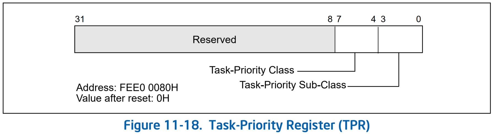

* 注意：在本讨论中，术语“任务”指的是软件定义的任务、进程、线程、程序或由操作系统分派以在处理器上运行的例程。它不涉及 IA-32 架构定义的任务，如第 8 章“Task anagement”中所述。

* 任务优先级允许软件为中断处理器（interrupting the processor）设置一个优先级阈值。
  * 这种机制使操作系统能够暂时阻止低优先级中断干扰处理器正在进行的高优先级工作。
  * 使用任务优先级阻止此类中断的能力源于 `TPR` 控制 *处理器优先级寄存器（processor-priority register，`PPR`）* 的值的方式。
    * `TPR` 还决定了本地处理器的仲裁优先级
* **处理器优先级（processor-priority class）** 是一个 `0-15` 范围内的值，保存在 *处理器优先级寄存器（`PPR`）* 的 bit `7:4` 中；参见图 11-19。
  * `PPR` 是一个只读寄存器。*处理器优先级* 表示处理器正在执行的当前优先级。

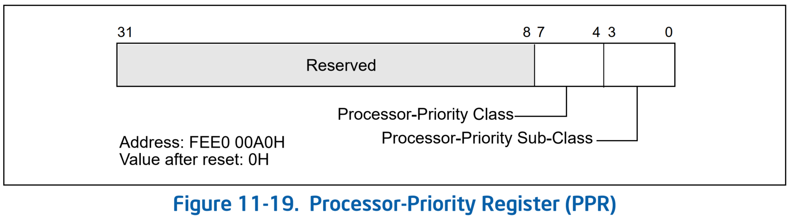

* `PPR` 的值基于 `TPR` 的值和 `ISRV` 的值；
  * `ISRV` 是 `ISR` 中设置的最高优先级位的向量号，如果 `ISR` 中未设置任何位，则为 `0x00`
* `PPR` 的值确定如下：
  * `PPR[7:4]`（处理器优先级）`TPR[7:4]`（任务优先级）和 `ISRV[7:4]`（在服务中的最高优先级中断的优先级）中的最大值。
  * `PPR[3:0]`（处理器优先级子类）确定如下：
    * 如果 `TPR[7:4]` > `ISRV[7:4]`，`PPR[3:0]` 是 `TPR[3:0]`（任务优先级子类）。
    * 如果 `TPR[7:4]` < `ISRV[7:4]`，`PPR[3:0]` 为 `0`。
    * 如果 `TPR[7:4]` = `ISRV[7:4]`，`PPR[3:0]` 可能是 `TPR[3:0]` 或 `0`。实际行为是 model-specific 的。

* 处理器优先级决定了中断处理器（interrupting the processor）的优先级阈值。
  * 处理器将只递交那些中断优先级高于 `PPR` 中处理器优先级的中断。
  * 如果处理器优先级为 `0`，则 `PPR` 不禁止传递任何中断；
  * 如果它是 `15`，则处理器禁止传递所有中断。
    * 处理器优先机制不影响 NMI、SMI、INIT、ExtINT、INIT-deassert 和启动递交模式的中断传递。
* 处理器不使用处理器优先级子类来确定递交和禁止哪些中断。（处理器仅使用处理器优先级子类来满足 `PPR` 的读取。）

### 11.8.4 Fixed 中断的中断接受
* Local APIC 有两个中断挂起寄存器：中断请求寄存器（`IRR`）或 in-service 寄存器（`ISR`），local APIC 将它在二者之一中接受的 fixed 中断排队。
  * 这两个 `256` 位只读寄存器如图 11-20 所示。
  * 这些寄存器中的 `256` 位代表 `256` 个可能的向量；
  * 向量 `0` 到 `15` 由 APIC 保留
* 注意：所有具有 NMI、SMI、INIT、ExtINT、start-up 或 INIT-deassert 递交模式的中断都会绕过 `IRR` 和 `ISR` 寄存器，并直接发送到处理器核以进行服务。


* `IRR` 包含已被接受但尚未分派给处理器进行服务的活动中断请求。
  * 当 local APIC 接受中断时，它会设置 `IRR` 中对应于已接受中断向量的位。
  * 当处理器核准备好处理下一个中断时，local APIC 清除已设置的最高优先级 `IRR` 位并设置相应的 `ISR` 位。
  * 然后将 `ISR` 中设置的最高优先级位的向量分派给处理器核进行服务。
* 当处理器为最高优先级中断服务时，local APIC 可以通过设置 `IRR` 中的位来发送额外的 fixed 中断。
  * 当中断服务例程向 `EOI` 寄存器发出写操作时，local APIC 通过清除设置的最高优先级 `ISR` 位来响应。
  * 然后重复清除 `IRR` 中最高优先级位并设置 `ISR` 中相应位的过程。
  * 然后，处理器核开始为 `ISR` 中设置的最高优先级位执行服务路由。
* 如果使用相同的向量号生成多个中断，则 local APIC 可以在 `IRR` 和 `ISR` 中设置向量的位。
  * 这意味着对于 Pentium 4 和 Intel Xeon 处理器，`IRR` 和 `ISR` 可以为每个中断向量排队两个中断：一个在 `IRR` 中，一个在 `ISR` 中。
  * 为同一中断向量发出的任何其他中断都将折叠到 `IRR` 中的单个位中。
* 对于 P6 系列和奔腾处理器，`IRR` 和 `ISR` 寄存器可以为每个中断向量排队不超过两个中断，并且将拒绝在同一向量内接收到的其他中断。
* 如果 local APIC 接收到中断优先级高于当前正在服务的中断的中断，并且处理器核中启用了中断，则 local APIC 立即将更高优先级的中断分派给处理器（无需等待写入到 `EOI` 寄存器）。
  * 当前正在执行的中断处理程序随后被中断，以便可以处理更高优先级的中断。
  * 当更高优先级的中断处理完成后，被中断的中断服务将恢复。
* 触发模式寄存器（trigger mode register，`TMR`）指示中断的触发模式（见图11-20）。
  * 在 `IRR` 中接受中断后，相应的 `TMR` 位将针对边沿触发的中断清零并设置为电平触发的中断。
  * 如果在生成相应中断向量的 `EOI` cycle 时设置了 `TMR` 位，则会向所有 I/O APIC 发送 EOI 消息。

### 11.8.5 Signaling Interrupt Servicing Completion
* 对于除以 NMI、SMI、INIT、ExtINT、start-up 或 INIT-Deassert 递交模式递交的中断之外的所有中断，中断处理程序必须包括对 end-of-interrupt `EOI` 寄存器的写入
  * 此写入必须发生在处理程序例程的末尾，在 `IRET` 指令之前的某个时间。
  * 此操作表明当前中断的服务已完成，local APIC 可以从 `ISR` 发出下一个中断。


* 收到 EOI 后，APIC 会清除 `ISR` 中的最高优先级位，并将下一个最高优先级中断分派给处理器。
* 如果终止的中断是电平触发的中断，则 local APIC 还会向所有 I/O APIC 发送 end-of-interrupt 消息。
* 系统软件可能更愿意将 EOI 定向到特定的 I/O APIC，而不是让 local APIC 将 end-of-interrupt 消息发送到所有 I/O APIC。
* 软件可以通过设置 Spurious Interrupt 向量寄存器的第 `12` 位来禁止 EOI 消息的广播。
  * 如果设置了该位，即使相关的 `TMR` 位指示当前中断是电平触发的，也不会在 EOI cycle 生成广播 EOI。
  * 该位的默认值为 `0`，表示执行 EOI 广播。
* 如果处理器不支持抑制 EOI 广播，则 Spurious Interrupt 向量寄存器的第 `12` 位保留为 `0`。
  * 在 local APIC *版本寄存器（Version Register）* 的第 `24` 位中报告了对 EOI 广播抑制的支持（参见第 11.4.8 节）；如果该位设置为 `1`，则支持该功能。
  * 支持时，该功能在 xAPIC 模式和 x2APIC 模式下均可用。
* 希望为 *电平触发中断* 执行定向 EOI 的系统软件应设置 Spurious Interrupt 向量寄存器的第 `12` 位，并跟随每个 EOI 到 local xAPIC 以获取具有定向 EOI 到生成中断的 I/O APIC 的电平触发中断（ 这是通过写入 I/O APIC 的 `EOI` 寄存器来完成的）。
* 执行定向 EOI 的系统软件必须保留一个映射，将电平触发的中断与系统中的 I/O APIC 相关联。

### 11.8.6 Task Priority in IA-32e Mode
* 在 IA-32e 模式下，操作系统可以使用任务优先级寄存器（`TPR`）显式管理 16 个 interrupt-priority classes（参见第 11.8.3 节“Interrupt, Task, and Processor Priority”）。
* 操作系统可以使用 `TPR` 暂时阻止特定（低优先级）中断打断高优先级任务。这是通过将一个值加载到 `TPR` 来完成的，其中 task-priority class 对应于要被阻止的最高interrupt-priority class。 例如：
  * 加载 task-priority class 为 `8` (`01000`B) 的 `TPR` 会阻止所有中断优先级为 `8` 或更低的中断，同时允许所有 interrupt-priority class 为 `9` 或更高的中断被识别。
  * 加载任务优先级为 `0` 的 `TPR` 可启用所有外部中断。
  * 使用任务优先级 `0x0F`（`01111`B）加载 `TPR` 会禁用所有外部中断。
* `TPR`（如图 11-18 所示）在复位时被清零。
  * 在 64 位模式下，软件可以使用备用接口 `MOV CR8` 指令读写 `TPR`。
  * 当 `MOV CR8` 指令执行完成时，新的任务优先级被建立。
  * 使用 `MOV CR8` 加载 `TPR` 后，软件不需要强制序列化。
* 使用 `MOV CRn` 指令需要特权级 0。
  * 以 *大于 0* 的特权级运行的程序无法读取或写入 `TPR`。尝试这样做会导致一般保护异常。
* `TPR` 是从中断控制器 (IC) 中抽象出来的，它优先处理和管理向处理器递交的外部中断。
  * IC 可以是外部设备，例如 APIC 或 8259。通常，IC 提供与 `TPR` 相似或相同的优先级机制。
  * 然而，IC 被认为依赖于实现，其底层优先级机制可能会发生变化。
  * 相比之下，`CR8` 是 Intel 64 架构的一部分。软件可以依赖这个定义保持不变。
* `CR8` 当前仅使用低四位。其余 `60` 位保留，必须写入零。不这样做会导致 `#GP`。

#### 11.8.6.1 CR8 和 APIC 之间任务优先级的交互
* Intel 64 位架构的第一个实现包括一个本地高级可编程中断控制器 (APIC)，它类似于以前 IA-32 处理器使用的 APIC。Local APIC 的某些方面会影响架构定义的任务优先级寄存器和使用 `CR8` 的编程接口的操作。
* 值得注意的 `CR8` 和 APIC 相互作用是：
  * 处理器启动并启用 local APIC。
  * APIC 必须启用，`CR8` 才能用作于 `TPR`。写入 `CR8` 会反映到 APIC 任务优先级寄存器中。
  * `APIC.TPR[bits 7:4] = CR8[bits 3:0]`，`APIC.TPR[bits 3:0] = 0`。读取 `CR8` 返回一个 64 位值，即 `TPR[bits 7:4]]` 的值，零扩展到 64 位。
* `APIC.TPR` 和 `CR8` 的直接更新之间没有排序机制。
  * 操作系统软件应实现直接 `APIC TPR` 更新或 `CR8` 样式的 `TPR` 更新，但不要混合使用它们。
  * 软件可以使用序列化指令（例如，`CPUID`）来序列化 `MOV CR8` 和存储到 APIC 之间的更新。

## 11.9 Spurious Interrupt
* 当处理器将其任务优先级提高到大于或等于 *处理器 `INTR` 信号当前被 asserted 的中断* 的级别时，可能会发生特殊情况。
  * 如果在发出 `INTA` cycle 时，要分配的中断已被屏蔽（由软件编程），则 local APIC 将提供一个伪中断向量（Spurious Interrupt Vector）。
  * 分配（dispensing）伪中断向量不会影响 `ISR`，因此该向量的处理程序应该在没有 `EOI` 的情况下返回。
* 伪中断向量的向量号在伪中断向量寄存器中指定：

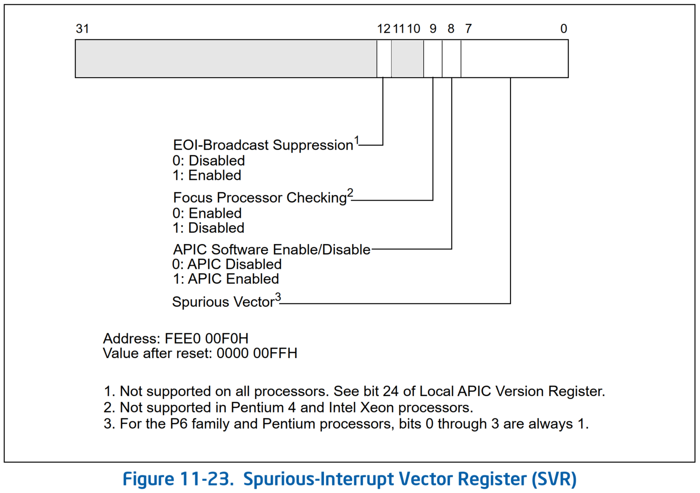

* 该寄存器中各字段的作用如下：
* **Spurious Vector**：确定当 local APIC 生成伪向量时要传送给处理器的向量号。
  * （Pentium 4 和 Intel Xeon 处理器）该字段的 bit `0` 到 `7` 可由软件编程。
  * （P6 系列和奔腾处理器）该字段的 bit `4` 到 `7` 可由软件编程，bit `0` 到 `3` 硬连线为逻辑 `1`。软件写入位 `0` 到 `3` 无效。
* **APIC Software Enable/Disable**：允许软件临时启用（`1`）或禁用（`0`）local APIC（请参阅第 11.4.3 节，“Enabling or Disabling the Local APIC”）
* **Focus Processor Checking**：确定在使用最低优先级交付模式时是启用（`0`）还是禁用（`1`）焦点处理器检查。在 Pentium 4 和 Intel Xeon 处理器中，该位保留，应清零。
* **Suppress EOI Broadcasts**：确定电平触发中断的 `EOI` 是否导致 `EOI` 消息广播到 I/O APIC（`0`）或（`1`）。请参阅第 11.8.5 节。该位的默认值为 `0`，表示执行 `EOI` 广播。如果处理器不支持 `EOI` 广播抑制，则此位保留为 `0`
* **注意** 即使设置了掩码位，也不要使用伪向量对 `LVT` 或 IOAPIC `RTE` 进行编程。
  * 伪向量 `ISR` 不执行 `EOI`
  * 如果出于某种原因由 `LVT` 或 `RTE` 条目生成中断，则 in-service 寄存器中的位将保留为伪向量设置。这将屏蔽所有具有相同或较低优先级的中断