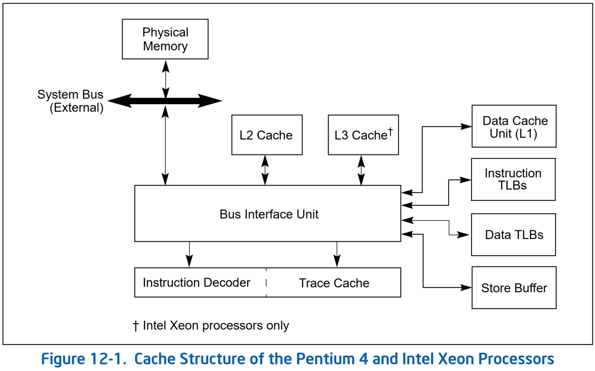
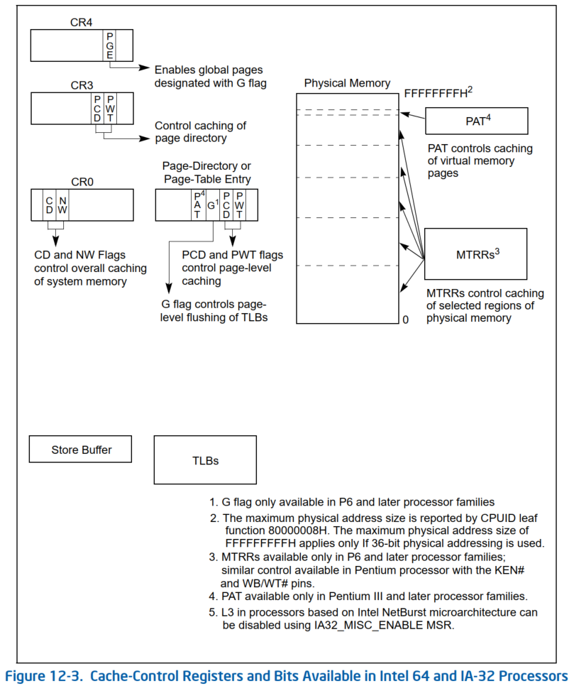
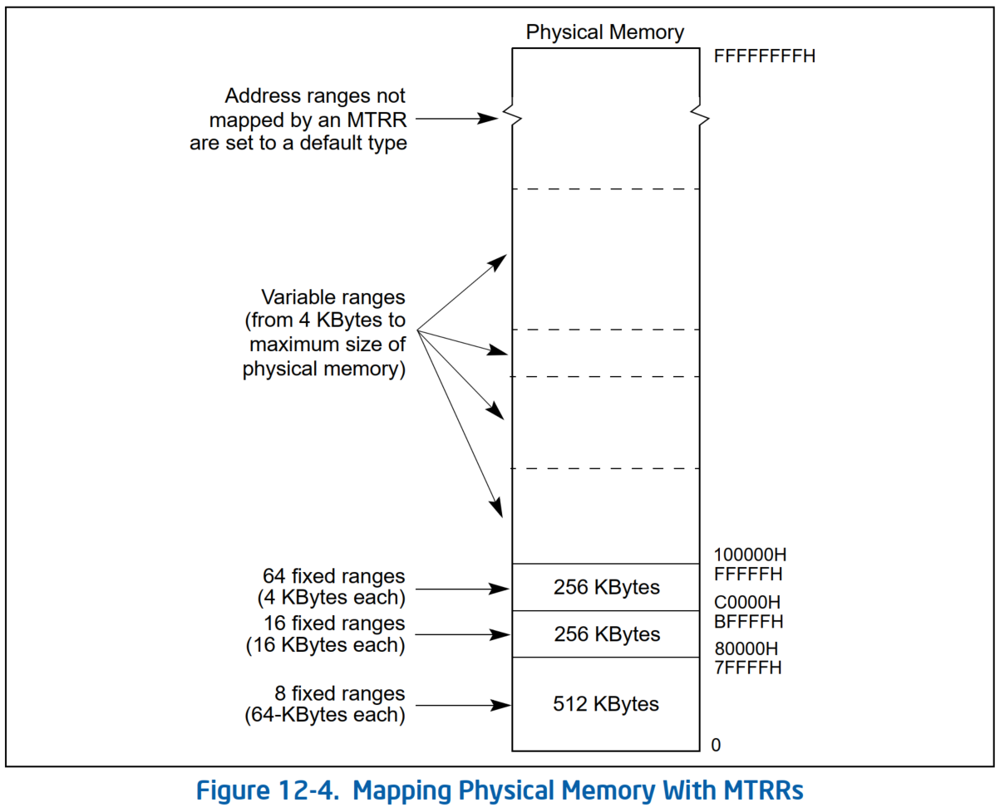
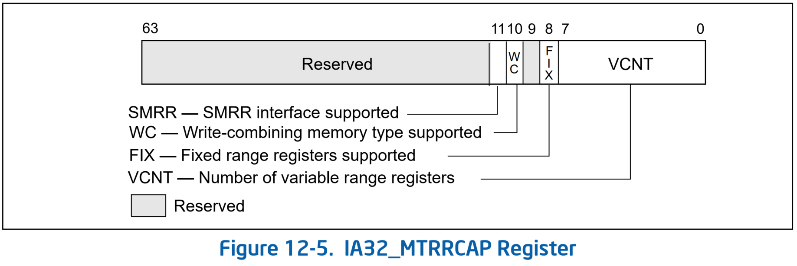
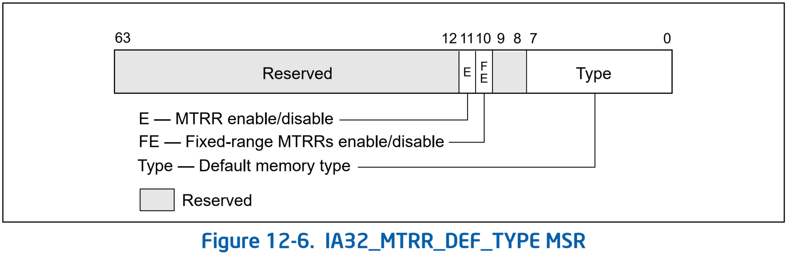
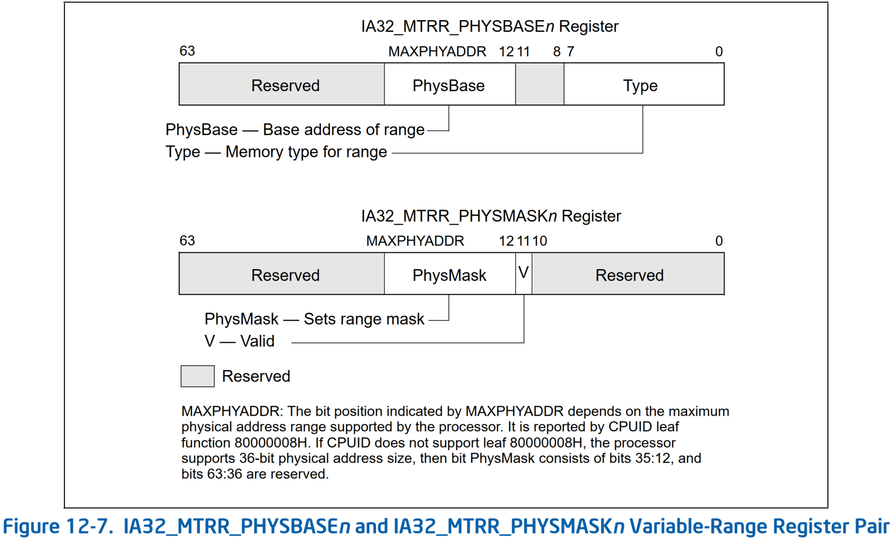
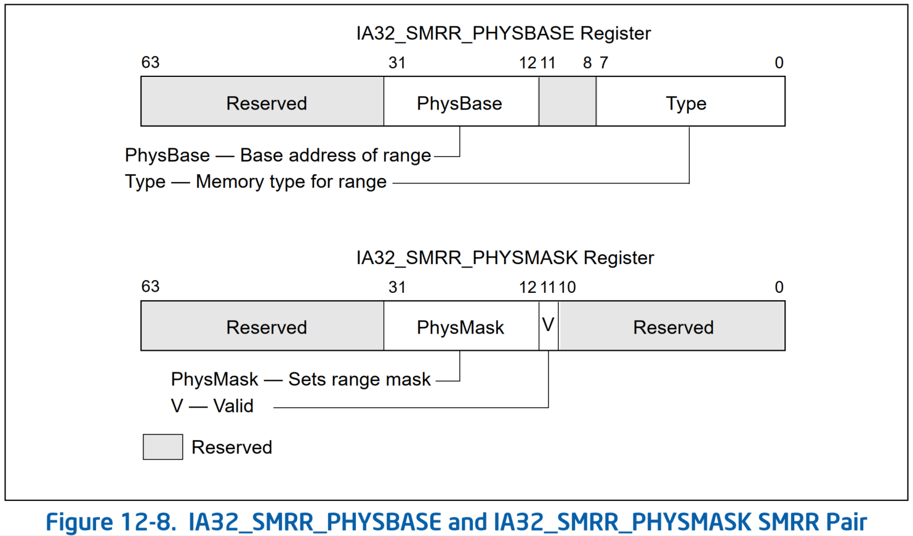
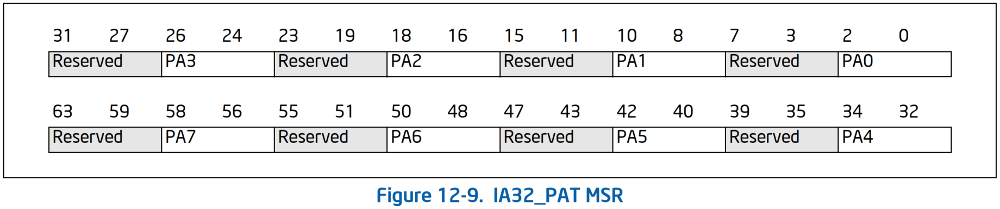

# 12 Memory Cache Control

## 12.1 Internal Caches, TLBs, and Buffers
* Figure 12-1. Cache Structure of the Pentium 4 and Intel Xeon Processors

* Figure 12-2. Cache Structure of the Intel Core i7 Processors


## 12.3 Methods of Caching Available
* 处理器允许系统内存的任何区域缓存在 L1、L2 和 L3 cache 中。
  * 在系统内存的各个页面或区域中，它允许指定 caching 类型（也称为内存类型 memory type）（请参见第 12.5 节）。
* 目前为 Intel 64 和 IA-32 架构定义的内存类型有（参见 Table 12-2）：

* **Strong Uncacheable（UC）** - 系统内存位置不被缓存。
  * 所有读取和写入都出现在系统总线上，并按程序顺序执行，无需重新排序。
  * 不会进行推测内存访问、页表遍历或推测分支目标的预取（prefetches of speculated branch targets）。
  * 这种类型的缓存控制对于 memory-mapped I/O 设备很有用。
  * 当与普通 RAM 一起使用时，它会大大降低处理器性能。
  * 注意：引用内存的 x87 和 SIMD 指令的行为取决于实现。在一些实现中，对 `UC` 内存的访问可能发生多次。为了确保可预测的行为，请使用通用寄存器的加载和存储来访问可能具有读或写副作用的 `UC` 内存。

* **Uncacheable（UC-）** - 与 strong uncacheable（`UC`）内存类型具有相同的特性，不同之处在于该内存类型可以通过对 `WC` 内存类型的 MTRR 进行编程来覆盖。
  * 这种内存类型在从 Pentium III 处理器开始的处理器系列中可用，并且只能通过 PAT 进行选择。

* **Write Combining（WC）** - 系统内存位置不会被缓存（与 uncacheable 内存一样），并且处理器的总线一致性协议不会强制执行一致性。
  * 允许推测性读取。
  * 写入可以被延迟并在 *写入组合 buffer（WC buffer）* 中组合以减少内存访问。
  * 如果 WC buffer 已部分填充，则写入可能会延迟到下一次发生串行化事件为止；例如 `SFENCE` 或 `MFENCE` 指令、`CPUID` 或其他序列化指令、对 uncached 内存的读取或写入、中断发生或 `LOCK` 指令（包括带有 `XACQUIRE` 或 `XRELEASE` 前缀的指令）的执行。
  * 另外，在逐出（evicting）在事务区域（transactional region）内执行的任何写入之前，`XEND` 指令（以结束事务区域）的执行逐出在相应执行 `XBEGIN` 指令（以开始事务区域）之前缓冲的任何写入。
  * 这种类型的缓存控制适用于视频 frame buffers，其中 *写入顺序并不重要*，只要写入更新内存以便可以在图形显示器上看到它们即可。
  * 有关缓存 `WC` 内存类型的更多信息，请参见第 12.3.1 节“Buffering of Write Combining Memory Locations”。
  * 通过对 MTRR 进行编程，可以在 Pentium Pro 和 Pentium II 处理器中使用这种内存类型；或者在从 Pentium III 处理器开始的处理器系列中，通过对 MTRR 进行编程或通过 PAT 选择它。

* **Write-through（WT）** - 对系统内存的写入和读取都会被缓存。
  * 读取来自缓存命中时的 cache line；读取未命中会导致缓存填充。
  * 允许推测性读取。
  * 所有写入都会写入 cache line（如果可能）并写入系统内存。
  * 当写透到内存时，无效的 cache line 永远不会被填充，有效的 cache line 要么被填充，要么失效。
  * 允许写入组合。
  * 这种类型的 cache 控制适用于 frame buffers 或当系统总线上存在访问系统内存但不执行内存访问监听（snooping）的设备时。
  * 它强制处理器中的 cache 和系统内存之间的一致性。

* **Write-back（WB）** - 对系统内存的写入和读取都会被缓存。
  * 读取来自缓存命中时的 cache line；读取未命中会导致缓存填满。
  * 允许推测性读取。
  * 写入未命中会导致 cache line 填充（在从 P6 系列处理器开始的处理器系列中），并且如果可能，写入完全在缓存中执行。
  * 允许写入组合。
  * 回写内存类型通过消除对系统内存的许多不必要的写入来减少总线流量。
  * 对 cache line 的写入不会立即转发到系统内存；相反，它们会累积在 cache 中。
  * 当执行回写操作时，修改后的 cache line 将被写入系统内存。
    * 当需要释放 cache line 时，例如当在已满的 cache 中分配新的 cache line 时，会触发回写操作。
    * 它们还由用于维护缓存一致性的机制触发。
  * 这种类型的缓存控制提供了最佳性能，但它要求所有在系统总线上访问系统内存的设备都能够监听（snooping）内存访问，以确保系统内存和 cache 的一致性。

* **Write protected（WP）** - 读取尽可能来自 cache line，读取未命中会导致缓存填充。
  * 写入被传播到系统总线并导致总线上所有处理器上的相应 cache line 无效。
  * 允许推测性读取。
  * 通过对 MTRR 进行编程，从 P6 系列处理器开始的处理器系列中都可以使用此内存类型（请参见 table 12-6）。

* Table 12-2. Memory Types and Their Properties

内存类型和助记符          | 可缓存 | 写回可缓存 | 允许推测性读取 | 内存顺序模型
------------------------|-------|-----------|---------------|----------------
Strong Uncacheable (UC) | No    | No        | No            | 强顺序
Uncacheable (UC-)       | No    | No        | No            | 强顺序。只能通过 PAT 选择。可以被 MTRR 中的 `WC` 覆盖
Write Combining (WC)    | No    | No        | Yes           | 弱顺序。可通过编程 MTRR 或通过 PAT 选择来实现
Write Through (WT)      | Yes   | No        | Yes           | 推测性处理器顺序
Write Back (WB)         | Yes   | Yes       | Yes           | 推测性处理器顺序
Write Protected (WP)    | 读 yes；写 no | No | Yes          | 推测性处理器顺序。可通过编程 MTRR

### 12.3.1 Buffering of Write Combining Memory Locations
* 对 `WC` 内存类型的写入不会按照典型意义上的“cached”一词进行缓存。
  * 它们保留在一个内部的 **写组合 buffer（WC buffer）** 中，该 buffer 与内部 L1、L2 和 L3 caches 以及 store buffer 分开。
  * WC buffer 未被监听，因此不提供数据一致性。
  * 对 `WC` 内存的写入进行 buffering 是为了允许软件在一小段时间内向 WC buffer 提供更多修改的数据，同时尽可能保持对软件的非侵入性。
  * 对 `WC` 内存的写入进行 buffering 也会导致数据折叠（collapsed）；也就是说，对同一内存位置的多次写入将保留该位置中最后写入的数据，而其他写入将丢失。
* WC buffer 的大小和结构没有在体系结构上定义。
  * 对于 Intel Core 2 Duo、Intel Atom、Intel Core Duo、Pentium M、Pentium 4 和 Intel Xeon 处理器；WC buffer 由多个 `64` 字节 `WC` buffers 组成。
  * 对于 P6 系列处理器，WC buffer 由多个 `32` 字节 WC buffers 组成。
* 当软件开始写入 `WC` 内存时，处理器开始一次填充一个 WC buffer。当一个或多个 WC buffer 已满时，处理器可以选择将 buffers 逐出到系统内存。
  * 用于逐出 WC buffer 的协议取决于实现，软件不应依赖该协议来实现系统内存一致性。
  * 当使用 `WC` 内存类型时，软件 **必须** 对数据写入系统内存被延迟的事实敏感，并且在需要系统内存一致性时 **必须** 故意清空 WC buffers。
* 一旦处理器开始将数据从 WC buffer 移入系统内存，它将根据 buffer 包含有效数据的量做出总线事务风格决策（bus-transaction style decision）。
  * 如果 buffer 已满（例如，所有字节都有效），处理器将在总线上执行突发写入事务（burst-write transaction）。
    * 这导致所有 `32` 字节（P6 系列处理器）或 `64` 字节（Pentium 4 和更新的处理器）在单个突发事务中在数据总线上传输。
    * 如果 WC buffer 的一个或多个字节无效（例如，尚未由软件写入），处理器将使用“部分写入（partial write）”事务（一次一个块，其中一个“块”是 `8` 字节）。
* 对于发送到内存的 1 个 WC buffer 的数据，这将导致最多 4 个部分的写入事务（对于 P6 系列处理器）或 8 个部分的写入事务（对于 Pentium 4 及更新的处理器）。
* 根据定义，`WC` 内存类型是 **弱顺序** 的。一旦开始驱逐 WC buffer，数据就会受到其定义的弱顺序语义的影响。
  * 在 WC buffer 的连续分配/解除分配之间不会维持顺序（例如，先写入 WC buffer 1，然后再写入 WC buffer 2，在系统总线上可能会显示为先写入 buffer 2，再写入 buffer 1）。
  * 当 WC buffer 作为部分写入被逐出到内存时，无法保证连续部分写入之间的顺序（例如，chunk 2 的部分写入可能会在 chunk 1 的部分写入之前出现在总线上，反之亦然）。
* `WC` 传播到系统总线的唯一能得到保证的元素是由事务原子性提供的元素。
  * 例如，对于 P6 系列处理器，一个完全满的 WC buffer 将始终使用任何 chunck 顺序作为一个单个 32 位突发事务进行传播。
  * 在 WC buffer 逐出中，数据将作为部分逐出，同一 chunck（`0 mod 8` 对齐）中包含的所有数据将同时传播。
  * 同样，对于从基于 Intel NetBurst 微架构的处理器开始的最新处理器，一个完整的 WC buffer 将始终作为一个单个突发事务进行传播，并使用事务中的任何块顺序。
  * 对于部分 buffer 的传播，同一块中包含的所有数据将同时传播。

### 12.3.2 Choosing a Memory Type
* 最简单的系统内存模型不使用具有读或写副作用的 memory-mapped I/O，不包括 frame buffer，并对所有内存使用回写内存类型。
  * I/O agent 可以对回写内存执行直接内存访问 (DMA)，并且 cache 协议可维护 cache 一致性。
* 系统可以将 strong uncacheable 内存用于其他 memory-mapped I/O，并且应始终将 strong uncacheable 内存用于具有读取副作用的 memory-mapped I/O。
* Dual-ported 内存可以被认为是写入副作用，需要相对快速的写入（making relatively prompt writes desirable），因为这些写入在到达内存 agent 之前无法在另一个 port 观察到。
* 系统可以使用 strong uncacheable、uncacheable、write-through（写透）或 write-combining（写组合）内存作为 frame buffers 或包含屏幕上显示的像素值的 dual-ported 内存。
  * Frame buffer 通常很大（几兆字节），并且通常写入的数据多于处理器读取的数据。
  * 对 frame buffer 使用 strong uncacheable 内存会产生大量总线流量，因为整个 buffer 上的操作是使用部分写入而不是行写入来实现的。
  * 将 write-through 内存用于 frame buffer 可以取代（displace）处理器的 L2 和 L3 caches 以及 L1 数据 cache 中几乎所有其他有用的 cached lines。
  * 因此，系统应尽可能使用 write-combining（写组合）内存作为 frame buffers。
* 当软件无法以受益于 write-back caching 的方式访问数据结构时，软件可以使用 page-level 的 cache 控制来分配适当的有效内存类型。
  * 例如，软件可能会读取大型数据结构一次，并且不会再次访问该结构，直到该结构被另一个 agent 重写。如此大的数据结构应标记为 uncacheable，否则读取它将逐出处理器会再次引用的 cached lines。
* 类似的示例是一个只写数据结构，该结构被写入（将数据导出到另一个 agent），但从不被软件读取。这样的结构可以被标记为 uncacheable，因为软件永远不会读取它写入的值。  
  * 尽管作为 uncacheable 内存，它将使用 *部分写（partial writes）* 来写入，而作为 write-back 内存，它将使用 *行写入（line writes）* 来写入，这可能不会发生直到另一个 agent 读取结构并触发隐式回写。
* 在 Pentium III、Pentium 4 和更新的处理器上，提供了新指令，使软件能够更好地控制数据的缓存、预取和写回特性。
  * 这些指令允许软件使用弱顺序或处理器顺序的内存类型来提高处理器性能，但在必要时对内存读取和/或写入强制使用强顺序。
  * 它们还允许软件更好地控制数据 caching。

### 思考：如果 partial write 将数据直接绕过 cache 写到内存，那么 CPU 对 cache 中同一 Cache Line 的数据如何处理？
在计算机系统中，当数据通过绕过缓存（Bypass Cache）的方式直接写入内存时（例如使用非临时存储指令或配置内存为不可缓存类型），CPU 对同一缓存行（Cache Line）中的缓存数据会采取特定的处理策略以维护一致性。以下是详细分析：

---

#### 1. 绕过缓存的写入方式
以下两种常见场景会导致数据直接写入内存而绕过缓存：
- **非临时存储指令**（如 x86 的 `MOVNTI`、`MOVNTQ`）：  
  显式绕过缓存，直接写入内存。
- **不可缓存内存类型**（Uncacheable, `UC`）：  
  通过页表属性或内存类型寄存器（如 x86 PAT）配置内存区域为不可缓存。

#### 2. 缓存行的处理机制
当绕过缓存的写入发生时，CPU 需要确保缓存中可能存在的旧数据不会导致一致性问题。具体行为如下：

##### (1) 非临时存储指令（如 `MOVNTI`）
- **缓存行无效化（Invalidation）**：  
  CPU 在执行非临时存储指令时，会检查目标地址对应的缓存行是否在缓存中存在。  
  - 如果存在，该缓存行会被标记为 **无效（`Invalid`）**，强制后续访问重新从内存加载。  
  - 如果不存在，写入直接进入内存，不会缓存该数据。

- **写入合并优化（Write Combining）**：
  多次非临时写入可能被合并到 **Write Combining Buffer（WC Buffer）**，减少总线事务，但最终仍直接写入内存。

##### (2) 不可缓存内存类型（`UC`）
- **完全绕过缓存**：
  `UC` 内存的读写操作始终直接访问内存，不会缓存任何数据。
  - 即使缓存中存在同一缓存行的副本，CPU 会忽略它们，始终从内存读取最新值。
  - 缓存中的旧数据（如果存在）不会被自动更新或失效，但 UC 内存的访问永远不会使用缓存。

#### 3. 缓存一致性协议的影响
缓存一致性协议（如 MESI）的规则在绕过缓存的写入场景下依然生效，但行为有所不同：

- **UC 内存区域**：
  由于内存类型为不可缓存，缓存一致性协议不会管理这些地址的缓存行，因此不会触发协议状态转换（如 `Invalid → Modified`）。

- **非临时写入（如 `MOVNTI`）**：
  若缓存中存在目标缓存行的副本，写入会触发一致性协议将其标记为 **`Invalid`**，其他核心的缓存副本也会失效。

#### 4. 示例场景
假设缓存行大小为 `64` 字节，内存地址 `0x1000` 对应的缓存行已被缓存（状态为 **`Modified`**），此时执行以下操作：

##### 场景 1：使用 `MOVNTI` 写入 `0x1004`（4 字节）
1. CPU 执行 `MOVNTI` 将数据直接写入内存地址 `0x1004`。
2. 检查发现缓存中存在 `0x1000` 对应的缓存行（状态为 `Modified`）。
3. **无效化该缓存行**，确保后续读取会从内存加载最新数据。
4. 内存中 `0x1004` 的值被更新，但缓存中不再保留该缓存行。

##### 场景 2：`UC` 内存写入 `0x1004`
1. 内存类型为 `UC`，写入直接进入内存，不涉及缓存。
2. 缓存中若存在 `0x1000` 的缓存行，其状态保持不变（如 `Modified`）。
3. 后续读取 `0x1000` 时，若内存类型仍为 UC，直接访问内存，忽略缓存中的旧数据。

#### 5. 潜在问题与注意事项
- **缓存残留脏数据**：
  若缓存中存在同一缓存行的 **`Modified`** 数据，而绕过缓存的写入仅修改部分数据，可能导致内存中的部分更新与缓存中的旧数据混合。
  **解决方案**：
  在绕过缓存的写入前，显式调用缓存维护指令（如 `CLFLUSH`）或确保内存类型配置正确。

- **性能影响**：
  频繁绕过缓存写入会导致缓存无效化开销，尤其在多核系统中可能引发总线争用。

- **架构差异**：
  ARM 架构的缓存管理机制与 x86 不同（如需要显式缓存维护指令），需参考具体平台文档。

#### 6. 总结
| 场景                | 缓存行为                                                                 | 一致性机制                         |
|---------------------|--------------------------------------------------------------------------|-----------------------------------|
| **非临时存储指令**  | 目标缓存行被标记为 Invalid，强制后续访问从内存加载。                       | 缓存无效化 + 写入直达内存           |
| **不可缓存内存(`UC`)** | 完全绕过缓存，读写直达内存，不修改缓存行状态。                             | 无缓存参与，依赖内存类型配置         |

- **核心原则**：
  绕过缓存的写入需确保缓存中旧数据失效，防止后续操作使用过时副本。
- **适用场景**：
  设备寄存器访问、DMA 缓冲区、避免缓存污染的高吞吐数据流（如视频帧处理）。

---

### SDM Vol.1 10.4.6.2 Caching of Temporal vs. Non-Temporal Data
* 程序引用的数据可以是临时的（temporal，数据将被再次使用）或非临时的（non-temporal，数据将被引用一次并且不会在近期重复使用）。
  * 例如，程序代码通常是临时的，而多媒体数据，如 3-D 图形应用程序中的显示列表，通常是非临时的。
  * 为了高效利用处理器的 cache，通常希望 cache 临时数据而不是 cache 非临时数据。
  * 使用非临时数据 overloading 处理器的 cache 有时被称为“污染缓存”（polluting the caches）。
  * Intel SSE 和 SSE2 cacheability 控制指令使程序能够以最大程度减少缓存污染的方式将非临时数据写入内存。
* 这些 Intel SSE 和 SSE2 non-temporal store 指令通过将正在访问的内存视为写组合（write combining，WC）类型来最大程度减少缓存污染。
* 如果程序使用其中一条指令指定 non-temporal store，并且目标区域的内存类型为写回（`WB`）、写透（`WT`）或写合并（`WC`），则处理器将执行以下操作：
  * 如果写入的内存位置存在于 cache hierarchy 中，则 cache 中的数据将被 evicted。
    * 如果内存类型不是 `WC` 并且行已经在 cache 中，则某些较旧的 CPU 实现（例如 Pentium M）允许使用非临时存储指令写入的地址进行就地更新。
  * Non-temporal 数据以 `WC` 语义写入内存。
* 使用 `WC` 语义，存储事务（store transaction）将是弱序的（weakly ordered），这意味着数据可能不会按程序顺序写入内存，并且 store 不会写分配（write allocate，即，处理器在执行 store 之前不会将相应的 cache line 提取到 cache hierarchy 中）。此外，不同的处理器实现可能会选择折叠（collapse）和合并（combine）这些 stores。
* 如果为 non-temporal store 指定的内存地址位于 uncacheable 的内存中，则写入区域（region）的内存类型可以覆盖（override）non-temporal 提示。
  * 此处提到的 Uncacheable 意味着写入的区域已映射到不可缓存（`UC`）或写保护（`WP`）内存类型。
* 通常，`WC` 语义要求软件确保与其他处理器和其他系统 agent（如显卡）的一致性。
  * 必须针对生产者消费者使用模型适当使用同步和 fencing。
  * Fencing 可确保所有系统 agent 对 stored 的数据具有全局可见性；例如，fence 失败可能导致写入的 cache line 停留在处理器内，而对其他 agents 不可见。
* 在内存类型别名（aliasing）存在的情况下，总线上可见的内存类型是特定于实现的。
  * 作为一个可能的示例，写入总线的内存类型可能反映第一次存储到此行的内存类型，如程序顺序所示；其他替代方案也是可能的。
  * 此行为应被视为保留，并且对任何特定实现的行为的依赖都可能导致未来的不兼容。

### 12.3.3 Code Fetches in Uncacheable Memory
* 程序可以从 uncacheable（`UC`）内存执行代码，但其含义与访问 `UC` 内存中的数据不同。
  * 在获取代码时，处理器绝不会推测性地从 cacheable 代码转换为 `UC` 代码。
  * 它也从不推测性地获取导致 `UC` 代码的分支目标。
* 处理器可以多次获取相同的 `UC` cache line，以便对指令进行一次解码。它可以解码 cache line 中的连续 `UC` 指令，而无需在每个指令之间进行提取。
* 它还可以从相同或连续的 4 KB 页获取额外的 cachelines，以便解码一条非推测性 `UC` 指令（即使指令完全包含在一行中，这也可能是正确的）。
* 由于上述原因，并且由于未来处理器中的 cachelines 大小可能会发生变化，因此软件应避免将具有读取副作用的 memory-mapped I/O 放置在同一页或用于执行 `UC` 代码的后续页中。

## 12.4 Cache 控制协议
* 以下部分介绍当前为 Intel 64 和 IA-32 架构定义的 cache 控制协议。
* 在 L1 数据 cache 和 L2/L3 unified caches 中，MESI（修改 modified、独占 exclusive、共享 shared、无效invalid）cache 协议维护着与其他处理器的 caches 的一致性。
* L1 数据 cache 和 L2/L3 unified caches 的每个 cache line 有两个 MESI 状态标志。每条线都可以标记为处于 Table 12-4 中定义的状态之一。
* 一般来说，MESI 协议的操作对于程序来说是透明的。
* Table 12-4. MESI Cache Line States

Cache Line 状态                  | M (Modified) | E (Exclusive) | S (Shared) | I (Invalid)
---------------------------------|--------------|---------------|-------------|--------------
该 cache line 有效？              | 是           | 是            | 是          | 否
内存中的拷贝是……                  | 过期的        | 有效的        | 有效的       | -
是否有拷贝在其他处理器的 caches 中？| 否           | 否            | 可能        | 可能
在该行上的一次写……                | 不会到系统总线 | 不会到系统总线 | 使处理器获得该行的独占所有权 | 直接进入系统总线

* P6 系列处理器中的 L1 指令 cache 仅实现 MESI 协议的“SI”部分，因为指令 cache 不可写。
* 指令 cache 监视数据 cache 中的变化，以在修改指令时保持 caches 之间的一致性。有关缓存指令含义的更多信息，请参见第 12.6 节“Self-Modifying Code”。

## 12.5 Cache Control
* Intel 64 和 IA-32 架构提供了多种机制来控制数据和指令的缓存以及控制处理器、cache 和内存之间的读写顺序。这些机制可以分为两组：
  * **Cache 控制寄存器和比特位** - Intel 64 和 IA-32 架构定义了 *多个专用寄存器* 以及 *控制寄存器* 以及 *页表和目录表条目* 中的各种位，用于控制位于 L1、L2 和 L3 caches 中 caching 的系统内存。这些机制控制虚拟内存页和物理内存区域的 caching。
  * **Cache 控制和内存顺序指令** - Intel 64 和 IA-32 架构提供了多种指令来控制数据缓存、内存读写顺序以及数据预取。这些指令允许软件控制特定数据结构的 caching，控制内存中特定位置的内存一致性，并在程序中的特定位置强制执行强内存顺序序。
* 以下各节描述了这两组 cache 控制机制。

### 12.5.1 Cache 控制寄存器和比特位
* Figure 12-3 描述了 IA-32 处理器中的 cache 控制机制。除了内存地址空间问题外，这些在 Intel 64 处理器中的工作方式相同。
* Figure 12-3. Cache-Control Registers and Bits Available in Intel 64 and IA-32 Processors


* Intel 64 和 IA-32 架构提供以下 cache 控制寄存器和位，用于启用或限制对内存中各个页面或区域的 caching：
* **`CD` 标志，控制寄存器 `CR0` 的第 `30` 位** - 控制系统内存位置的 caching（请参见第 2.5 节“Control Registers”）。
  * 如果清除 `CD` 标志，则为整个系统内存启用 caching，但可能会通过其他 cache 控制机制限制单个页面或内存区域。
  * 设置 `CD` 标志后，对于 P6 和更新的处理器系列，caching 将限制在处理器的 caches（cache 层次结构）中，而对于 Pentium 处理器则禁止 cache（请参阅下面的注释）。
  * 然而，设置 `CD` 标志后，caches 仍将响应监听通信（snoop traffic）。
    * 应显式刷新 caches 以确保内存一致性。
  * 为了获得最高的处理器性能，控制寄存器 `CR0` 中的 `CD` 和 `NW` 标志都应该被清除。Table 12-5 显示了 `CD` 和 `NW` 标志的交互。
  * 对于从 P6 系列开始的处理器系列，设置 `CD` 标志的效果与 Pentium 处理器有些不同（参见 Table 12-5）。
  * 为了确保设置 `CD` 标志后的内存一致性，应显式刷新 caches（请参见第 12.5.3 节“Preventing Caching”）。
  * 为 P6 和更新的处理器系列设置 `CD` 标志会修改 cache line 填充和更新行为。
  * 此外，在这些处理器上设置 `CD` 标志不会强制对内存访问进行严格排序，除非 MTRR 被禁用和/或所有内存都被引用为 uncached（请参见第 9.2.5 节“Strengthening or Weakening the Memory-Ordering Model”）。
* Table 12-5. Cache Operating Modes

CD | NW | Caching 和读写策略                                       | L1 | L2/L3
---|---|----------------------------------------------------------|----|-------
**0**|**0**| 正常的 cache 模式。最佳性能的 cache 模式                |    |
\- | - | 读取命中访问 cache；读取未命中可能会导致替换。               | Yes | Yes
\- | - | 写入命中会更新 cache。                                     | Yes | Yes
\- | - | 仅写入 shared line 和写入未命中会更新系统内存。             | Yes | Yes
\- | - | 写入未命中会导致 cache line 填充。                         | Yes | Yes
\- | - | 写命中可以将 shared line 更改为在 MTRR 的控制下进行修改并具有相关的失效周期。| Yes |
\- | - | 写入未命中不会导致 cache line 填充（仅限奔腾处理器）。       | Yes |
\- | - | 写命中可以在 `WB/WT#` 的控制下将 shared line 更改为 exclusive（仅限奔腾处理器）| Yes |
\- | - | 允许无效。                                                | Yes | Yes
\- | - | 支持外部监听流量（snoop traffic）。                        | Yes | Yes
**0**|**1**| 无效的配置                                            |    |
\- | - | 生成错误代码为 `0` 的 general-protection 异常（`#GP`）。   | NA | NA
**1**|**0**| 无填充 cache 模式。保持内存一致性。                    |    |
\- | - | 加电或重置后处理器的状态（Pentium 4 及更高版本的处理器系列）。| Yes | Yes
\- | - | 读取命中访问 cache；读取未命中不会导致替换（请参阅下面的 Pentium 4 和 Intel Xeon 处理器参考）。| Yes | Yes
\- | - | 写入命中会更新 cache。                                     | Yes | Yes
\- | - | 仅写入 shared line 和写入未命中会更新系统内存。              | Yes | Yes
\- | - | 写入未命中会访问内存。                                      | Yes | Yes
\- | - | 写命中可以在 MTRR 的控制下以及相关的读取无效周期将 shared line 更改为 exclusive。| Yes | Yes
\- | - | 写命中可以在 `WB/WT#` 的控制下将 shared line 更改为 exclusive（仅限奔腾处理器）| Yes |
\- | - | 除非禁用 MTRR 和/或所有内存都被引用为 uncached，否则不会强制执行严格的内存顺序（仅限 P6 和更高版本的处理器系列）| Yes | Yes
\- | - | 允许无效。                                                | Yes | Yes
\- | - | 支持外部监听流量。                                         | Yes | Yes
**1**|**1**| 不保持内存一致性。                                     |    |
\- | - | 加电或重置后处理器的状态（Pentium 6 及更高版本的处理器系列）。| Yes | Yes
\- | - | 读取命中访问 cache；读取未命中不会导致替换。                 | Yes | Yes
\- | - | 写入命中会更新 cache 并将 exclusive line 更改为 modified。  | Yes | Yes
\- | - | 写命中后 shared line 保持 shared                           | Yes | Yes
\- | - | 写入未命中会访问内存。                                      | Yes | Yes
\- | - | 监听时禁止失效；但允许使用 `INVD` 和 `WBINVD` 指令。         | Yes | Yes
\- | - | 支持外部监听流量（snoop traffic）。                         | No  | Yes

* 注意：
  1. 此表中的 L2/L3 列适用于 Pentium 4、Intel Xeon 和 P6 系列处理器。它旨在表示基于具有外部平台特定回写式 L2 缓存的奔腾处理器的系统中可以实现的内容。
  2. Pentium 4 及更新的处理器系列不支持此模式；将 `CD` 和 `NW` 位设置为 `1` 选择无填充 cache 模式。
  3. Intel Atom 处理器不支持。如果 Intel Atom 处理器中 `CD = 1`，则禁用缓存。

### 12.5.2 Precedence of Cache Controls
* Cache 控制标志和 MTRR 分层操作以限制 cache。
  * 也就是说，如果设置了 `CD` 标志，则全局阻止 cache（参见 Table 12-5）。
  * 如果 `CD` 标志被清除，则 page-level cache 控制标志和/或 MTRR 可用于限制 cache。
  * 如果 page-level 和 MTRR 缓存控制重叠，则阻止 caching 的机制优先。
    * 例如，如果 MTRR 使系统内存的某个区域 uncacheable，则无法使用 page-level caching 控制来启用该区域中页面的 caching。
    * 反之亦然；也就是说，如果 page-level caching 控制将页面指定为 uncacheable，则 MTRR 不能用于使该页面 cacheable。
* 如果 *回写* 和 *写透* caching 策略对页面和内存区域的分配存在重叠，则 *写透策略优先*。
* *写组合* 策略（只能通过 MTRR 或 PAT 分配）优先于 *写透* 或 *回写*。
* Page level 内存类型的选择取决于是否使用 PAT 来选择页的内存类型，如以下各节所述。
* 在基于 Intel NetBurst 微架构的处理器上，可以通过 `IA32_MISC_ENABLE` MSR 的 bit `6` 禁用三级 cache。
  * 对于这些处理器中的 L3 cache，使用 `IA32_MISC_ENABLE[bit 6]` 优先于 `CD` 标志、MTRR 和 PAT。
    * 即当三级 cache 禁用标志置位（cache 禁用）时，其他缓存控制对三级 cache 没有影响；
    * 当该标志被清除（启用）时，cache 控制对 L3 cache 的影响与对 L1 和 L2 cache 的影响相同。
* Intel Core i7 处理器以及基于 Intel Core 和 Intel Atom 微架构的处理器不支持 `IA32_MISC_ENABLE[bit 6]`。

#### 12.5.2.3 跨有不同内存类型的页面写入值
* 如果内存中的两个相邻页具有不同的内存类型，并且将一个字或更长的操作数写入跨越这两个页之间的页边界的内存位置，则该操作数可能会被写入内存两次。
* 此操作不会对实际内存的写入造成问题；但是，如果将设备映射到分配给页面的内存空间，则该设备可能会发生故障（malfunction）。

### 12.5.3 Preventing Caching

### 12.5.4 Disabling and Enabling the L3 Cache

### 12.5.5 Cache Management Instructions

### 12.5.6 L1 Data Cache Context Mode

## 12.6 SELF-MODIFYING CODE

## 12.7 Implicit Caching (PENTIUM 4, INTEL® XEON®, AND P6 FAMILY PROCESSORS)
* 当内存元素可以被潜在地 cacheable 时，就会发生隐式 caching，尽管该元素可能从未在正常的冯·诺依曼序列中被访问过。
* 由于积极的预取（aggressive prefetching）、分支预测和 TLB 未命中处理，隐式 caching 发生在 P6 和更新的处理器系列上。
* 隐式 caching 是现有 Intel386、Intel486 和 Pentium 处理器系统行为的扩展，因为在这些处理器系列上运行的软件也无法确定地预测指令预取的行为。
* 为了避免与隐式 caching 相关的问题，当对 cache 一致性机制无法自动处理的 cacheable 数据进行更改时，操作系统必须显式使 cache 无效。
  * 这包括对处理器侦听（snooping ）机制未检测到的 dual-ported 或物理别名内存 boards 的写入，以及对内存中页表条目的更改。
* Example 12-1 中的代码显示了隐式 caching 对页表条目的影响。
  * 线性地址 `0xF000` 指向物理位置 `0xB000`（`0xF000` 的页表项包含值 `0xB000`），线性地址 `0xF000` 的页表项是 `PTE_F000`（译注：这是另一个线性地址）。
  * 由于 P6 和更新的处理器系列中的推测执行，最后执行的 `MOV` 指令会将物理位置 `0xB000` 处的值放入 `EBX`，而不是新物理地址 `0xA000` 处的值。
  * 这种情况可以通过在 load 和 store 之间设置 TLB 失效来解决。
  * 译注：这是由于过期的 TLB caching 引起的问题，因此解决问题的出发点是 TLB invalidation。虽然加屏障（speculation barrier）可以从防止预取的角度来避免这个问题，但只能说是利用该功能的副作用了。
##### Example 12-1. Effect of Implicit Caching on Page-Table Entries
```nasm
mov EAX, CR3; Invalidate the TLB
mov CR3, EAX; by copying CR3 to itself
mov PTE_F000, A000H; Change F000H to point to A000H 修改线性地址 0xF000 的页表项（也是个线性地址，且不是 0xF000），使其指向物理页帧为 0xA000
mov EBX, [F000H]; 取线性地址 0xF000 指向的内容，期望取 0xA000 的内容，但由于 TLB 缓存的映射还是指向 0xB000，因此取的是 0xB000 的内容
```

## 12.8 Explicit Caching
* Pentium III 处理器引入了四个新指令，即 `PREFETCHh` 指令，为软件提供了对数据 caching 的显式控制。
  * 这些指令向处理器提供“提示”，即应立即或尽快将 `PREFETCHh` 指令请求的数据读入 cache 层次结构，以预测其使用情况。
  * 这些指令提供了提示的不同变体，允许选择将读取数据的 cache 级别。
* `PREFETCHh` 指令可以帮助减少通常与从内存读取数据相关的长延迟，从而有助于防止处理器“stalls”。
  * 但是，应谨慎使用这些说明。过度使用可能会导致资源冲突，从而降低应用程序的性能。
* 此外，这些指令只能用于从内存中预取数据；它们不应该被用来预取指令。
* 有关正确使用预取指令的更多详细信息，请参阅《Intel® 64 和 IA-32 架构优化参考手册》中的第 7 章“Optimizing Cache Usage”。

## 12.9 Invalidating the Translation Lookaside Buffers (TLBS)

## 12.10 Store Buffer
* Intel 64 和 IA-32 处理器将每次写入（store）内存临时存储在 store buffer（存储缓冲区）中。
  * Store buffer 允许处理器继续执行指令而无需等到对 memory 和/或 cache 的写入完成，从而提高了处理器性能。
  * 它还允许延迟写入，以便更有效地使用内存访问总线周期（memory-access bus cycles）。
* 一般来说，store buffer 的存在对于软件来说是透明的，即使在使用多个处理器的系统中也是如此。
  * 处理器确保写操作始终按程序顺序执行。
  * 它还确保在以下情况下始终将 store buffer 的内容排空到内存：
    * 当异常或中断产生时。
    * 执行串行化指令时（仅限 P6 和更新的处理器系列）。
    * 当执行 I/O 指令时。
    * 当执行 `LOCK` 操作时。
    * 执行 `BINIT` 操作时（仅限 P6 和更新的处理器系列）。
    * 使用 `SFENCE` 指令对存储进行排序时（仅限 Pentium III 和更新的处理器系列）。
    * 使用 `MFENCE` 指令对存储进行排序时（仅限 Pentium 4 和更新的处理器系列）。
* 第 9.2 节“Memory Ordering”中对写入顺序的讨论给出了 store buffer 操作的详细描述。

## 12.11 Memory Type Range Registers (MTRRS)
* 以下章节仅适用于 P6 和更新的处理器系列。
* 内存类型范围寄存器（memory type range registers，MTRR）提供了一种将内存类型（请参见第 12.3 节“Methods of Caching Available”）与系统内存中的物理地址范围相关联的机制。
  * 它们允许处理器优化不同类型内存的操作，例如 RAM、ROM、frame-buffer 内存和 memory-mapped I/O 设备。
  * 它们还通过 *消除早期 IA-32 处理器上用于此功能的内存控制引脚* 以及 *驱动它们所需的外部逻辑* 来简化系统硬件设计。
* MTRR 机制允许在物理内存中定义多个范围，并且它定义了一组 model-specific registers（MSR），用于指定每个范围中包含的内存类型。
  * Table 12-8 显示了可以指定的内存类型及其属性；
  * Figure 12-4 显示了物理内存与 MTRR 的映射。
  * 有关每种内存类型的更详细说明，请参见第 12.3 节“Methods of Caching Available”。
* 硬件重置后，P6 和更新的处理器系列会禁用所有 *固定* 和 *可变* MTRR，这实际上使所有物理内存都无法缓存。
  * 然后，初始化软件应将 MTRR 设置为特定的、系统定义的内存映射。
    * 典型地，由 BIOS（基本输入/输出系统）软件配置 MTRR。 
  * 然后，操作系统或执行程序可以使用正常的页级缓存属性（page-level cacheability attributes）自由修改内存映射。
* 在使用 P6 系列或更新系列处理器的多处理器系统中，每个处理器 **必须使用相同的 MTRR 内存映射**，以便软件具有一致的内存视图。
* **注意**：在多处理器系统中，操作系统必须保持系统中所有处理器之间的 MTRR 一致性（即所有处理器必须使用相同的 MTRR 值）。P6 和更新的处理器系列不提供硬件支持来维持这种一致性。
* Table 12-8. Memory Types That Can Be Encoded in MTRRs

内存类型和助记符       | 在 MTRR 中的编码
---------------------|------------------
Uncacheable (UC)     | `00`H
Write Combining (WC) | `01`H
Reserved*            | `02`H
Reserved*            | `03`H
Write-through (WT)   | `04`H
Write-protected (WP) | `05`H
Writeback (WB)       | `06`H
Reserved*            | `07 - FF`H
* 注意：\* 使用这些编码会导致 general-protection 异常（`#GP`）

* Figure 12-4. Mapping Physical Memory With MTRRs


### 12.11.1 MTRR Feature Identification
* MTRR 功能的可用性因型号而异。软件可以通过执行 `CPUID` 指令并读取功能信息寄存器（`EDX`）中 MTRR 标志（bit `12`）的状态来确定处理器是否支持 MTRR。
  * 如果设置了 MTRR 标志（表明处理器实现了 MTRR），则可以从 `64` 位 `IA32_MTRRCAP` MSR（对于 P6 系列处理器，称为 MTRRcap MSR）获取有关 MTRR 的附加信息。
  * `IA32_MTRRCAP` MSR 是只读 MSR，可以使用 `RDMSR` 指令读取。
* Figure 12-5 显示了 `IA32_MTRRCAP` MSR 的内容。 该寄存器中标志位和字段的作用如下：
* **VCNT（variable range registers count）域，bits 0 到 7** - 指示处理器上实现的可变范围的数量。
* **FIX（fixed range registers supported）标志，bit 8** - 当置位时，支持固定范围 MTRRs（`IA32_MTRR_FIX64K_00000` 到 `IA32_MTRR_FIX4K_0F8000`）；当清除时，不支持固定范围寄存器。
* **WC（write combining）标志，bit 10** - 当置位时，支持 write-combining（`WC`）内存类型；当清除时，不支持 `WC` 类型。
* **SMRR（System-Management Range Register）标志，bit 11** - 当 bit `11` 置位时，支持系统管理范围寄存器接口；当清除时，不支持 SMRR 接口。
* `IA32_MTRRCAP` MSR 中的 bit `9` 和 bit `12` 至 `63` 被保留。如果软件尝试写入 `IA32_MTRRCAP` MSR，则会生成 general-protection 异常（`#GP`）。
* 软件必须读取 `IA32_MTRRCAP` 的 `VCNT` 域以确定可变 MTRR 的数量，并查询 `IA32_MTRRCAP` 中的其他功能位以确定处理器支持的其他功能。
  * 例如，一些处理器可能在 `VCNT` 域中报告值“`8`”，其他处理器可能报告具有不同的 `VCNT` 值。
* Figure 12-5. IA32_MTRRCAP Register


### 12.11.2 Setting Memory Ranges with MTRRs
* 内存范围和每个范围中指定的内存类型由三组寄存器设置：
  * `IA32_MTRR_DEF_TYPE` MSR
  * 固定范围 MTRR
  * 可变范围 MTRR
* 可以分别使用 `RDMSR` 和 `WRMSR` 指令读取和写入这些寄存器。

#### 12.11.2.1 `IA32_MTRR_DEF_TYPE` MSR
* `IA32_MTRR_DEF_TYPE` MSR（对于 P6 系列处理器，称为 `MTRRdefType` MSR）设置 MTRR 未包含的（not encompassed）物理内存区域的默认属性。该寄存器中标志位和字段的作用如下：
* **Type 域，bits 0 到 7** - 指示用于那些没有被 MTRR 指定内存类型的物理内存地址范围的默认内存类型（有关该字段的编码，请参见 Table 12-8）。
  * 该字段的合法值为 `0`、`1`、`4`、`5` 和 `6`。所有其他值都会导致生成 general-protection 异常（`#GP`）。
  * Intel 建议对所有不存在内存的物理内存地址使用 `UC`（uncached）内存类型。
    * 要将 `UC` 类型分配给不存在的内存位置，可以在 `Type` 字段中将其指定为默认类型，也可以使用固定和可变 MTRR 显式分配。
* **FE（fixed MTRRs enabled）标志，bit 10** - 设置后启用固定范围 MTRR；当清除时，固定范围 MTRR 将被禁用。
  * 当启用固定范围 MTRR 时，当发生范围重叠时，固定范围 MTRR 的优先级高于可变范围 MTRR。
  * 如果固定范围 MTRR 被禁用，则可变范围 MTRR 仍然可以使用并且可以映射固定范围 MTRR 通常覆盖的范围。
* **E（MTRRs enabled）标志，bit 11** - 设置后启用 MTRR；清除时，所有 MTRR 均被禁用，并且 `UC` 内存类型应用于所有物理内存。
  * 当该标志被设置时，`FE` 标志可以禁用固定范围 MTRR；当该标志位清零时，`FE` 标志位没有影响。
  * 当设置 `E` 标志时，默认内存类型字段中指定的类型将用于尚未由固定或可变 MTRR 映射的内存区域。
* `IA32_MTRR_DEF_TYPE` MSR 中的 bit `8` 和 `9`，以及 bit `12` 到 `63` 被保留；如果软件尝试向处理器写入非零值，处理器会生成 general-protection 异常（`#GP`）。
* Figure 12-6. IA32_MTRR_DEF_TYPE MSR


#### 12.11.2.2 Fixed Range MTRRs
* 固定内存范围由 11 个固定范围寄存器进行映射，每个寄存器 64 位。
  * 每个寄存器都分为 `8` bit 域，用于指定寄存器控制的每个子范围的内存类型
  * 译注：那么总共可以指定 `11 x 8 = 88` 个固定内存范围
* **寄存器 `IA32_MTRR_FIX64K_00000`** - 映射从 `0x0` 到 `0x7FFFF` 的 `512-KByte` 的地址范围。该范围分为八个 `64-KByte` 的子范围。
* **寄存器 `IA32_MTRR_FIX16K_80000` 和 `IA32_MTRR_FIX16K_A0000`** - 映射从 `0x80000` 到 `0xBFFFF` 的两个 `128-KByte` 的地址范围。该范围分为十六个 `16-KByte` 的子范围，每个寄存器映射 8 个范围。
* **寄存器 `IA32_MTRR_FIX4K_C0000` 到 `IA32_MTRR_FIX4K_F8000`** - 映射从 `0xC0000` 到 `0xFFFFF` 的八个 `32-KByte` 的地址范围。该范围分为六十四个 `4-KByte` 的子范围，每个寄存器映射 8 个范围。
* Table 12-9 示出了固定物理地址范围与固定范围 MTRR 对应字段之间的关系；Table 12-8 显示了 MTRR 的内存类型编码。
* Table 12-9. Address Mapping for Fixed-Range MTRRs

* 对于 P6 系列处理器，固定范围 MTRR 的前缀是 `MTRRfix`。

#### 12.11.2.3 Variable Range MTRRs
* Pentium 4、Intel Xeon 和 P6 系列处理器允许软件为每个范围使用一对 MTRR 来指定 `m` 个可变大小地址范围的内存类型。
  * 支持的范围数 `m` 在 `IA32_MTRRCAP` MSR 的 bits `7:0` 中给出（参见第 12.11.1 节中的 Figure 12-5）。
* 每对中的第一个条目（`IA32_MTRR_PHYSBASEn`）定义该范围的基地址和内存类型；第二个条目（`IA32_MTRR_PHYSMASKn`）包含用于确定地址范围的掩码。
  * “`n`”后缀的范围是 `0` 到 `m–1`，标识特定的寄存器对。
* 对于 P6 系列处理器，这些可变范围 MTRR 的前缀是 `MTRRphysBase` 和 `MTRRphysMask`。
* Figure 12-7. IA32_MTRR_PHYSBASEn and IA32_MTRR_PHYSMASKn Variable-Range Register Pair

* Figure 12-7 显示了这些寄存器中的标志和字段。这些标志和字段的功能是：
* **`Type` 域，bits 0 到 7** - 指定范围的内存类型（有关该字段的编码，请参见 Table 12-8）。
* **`PhysBase` 域，bits 0 到 `(MAXPHYADDR-1)`** - 指定地址范围的基地址。在 `MAXPHYADDR` 为 `36` 位的情况下，该 `24` 位值在低端扩展 `12` 位以形成基地址（这会自动在 `4 KB` 边界上对齐地址）。
* **`PhysMask` 域，bits 12 到 `(MAXPHYADDR-1)`** - 指定掩码（如果最大物理地址大小为 `36` 位，则为 `24` 位；如果最大物理地址大小为 `40` 位，则为 `28` 位）。掩码根据以下关系确定被映射区域的范围：
  * `Address_Within_Range AND PhysMask = PhysBase AND PhysMask`
  * 该值在低端扩展 `12` 位以形成掩码值。有关更多信息：请参阅第 12.11.3 节“Example Base and Mask Calculations”。
  * `PhysMask` 域的宽度取决于处理器支持的最大物理地址大小。
    * `CPUID.80000008H` 报告处理器支持的最大物理地址大小。
    * 如果 `CPUID.80000008H` 不可用，软件可能会假设处理器支持 `36` 位物理地址大小（则 `PhysMask` 为 `24` 位宽，并且保留 `IA32_MTRR_PHYSMASKn` 的高 `28` 位）。请参阅下面的注释。
* **`V（Valid）标志，bit 11`** - 当置位时，开启寄存器对；当清除时，禁用寄存器对
* `IA32_MTRR_PHYSBASEn` 和 `IA32_MTRR_PHYSMASKn` 寄存器中的所有其他位均被保留；如果软件尝试写入，处理器会生成 general-protection 异常（`#GP`）。
* 某些掩码值可能会导致范围不连续。在此类范围中，未由掩码值映射的区域将设置为默认内存类型，除非某个其他 MTRR 指定了该范围的类型。Intel 不鼓励使用“不连续”范围。
* **注意**：软件可以通过使用 ACPI/`INT15` e820 接口机制来解析 BIOS 提供的内存描述。然后，该信息可用于确定 MTRR 的初始化方式（例如：允许 BIOS 定义有效内存范围以及平台（包括处理器）支持的最大内存范围）。
* 有关重叠可变 MTRR 范围的信息，请参阅第 12.11.4.1 节“MTRR Precedences”。

#### 12.11.2.4 System-Management Range Register Interface
* 如果 `IA32_MTRRCAP`[bit `11`] 被置位，则处理器支持 SMRR 接口，以限制对系统管理模式（SMM）软件使用的指定内存地址范围的访问（请参见第 32.4.2.1 节）。
  * 如果支持 SMRR 接口，强烈建议 SMM 软件使用它来保护 SMI 处理程序存储在 SMRAM 区域中的 SMI 代码和数据。
* 系统管理范围寄存器由一对 MSR 组成（见 Figure 12-8）。
  * `IA32_SMRR_PHYSBASE` MSR 定义 SMRAM 内存范围的基地址以及用于在 SMM 中访问它的内存类型。
  * `IA32_SMRR_PHYSMASK` MSR 包含一个有效位和一个掩码，用于确定受 SMRR 接口保护的 SMRAM 地址范围。
  * 这些 MSR 只能在 SMM 中写；尝试在 SMM 之外写入它们会导致 general-protection 异常。<sup>1</sup>
1. 对于某些处理器型号，仅当使用 `IA32_FEATURE_CONTROL` MSR 中的一个 model-specific bit 启用 SMRR 接口时，`RDMSR` 和 `WRMSR` 才能访问这些 MSR。
* Figure 12-8. IA32_SMRR_PHYSBASE and IA32_SMRR_PHYSMASK SMRR Pair


### 12.11.3 基址和掩码计算的例子

#### 12.11.3.1 支持大于 `36` 位物理地址的基址和掩码计算
* 对于支持大于 `36` 位物理地址大小的 Intel 64 和 IA-32 处理器，软件应查询 `CPUID.80000008H` 以确定最大物理地址。请参阅示例。

##### Example 12-3. 为具有 40-Bit 地址大小的系统设置内存
* 如果处理器支持 `40` 位物理地址大小，则 `PhysMask` 域（在 `IA32_MTRR_PHYSMASKn` 寄存器中）为 `28` 位而不是 `24` 位。
* 缓存 `0-64` MBypte 为 `WB` cache 类型
  * `IA32_MTRR_PHYSBASE0 = 0000 0000 0000 0006`H，`0x6` 表示 `WB` 内存类型
  * `IA32_MTRR_PHYSMASK0 = 0000 00FF FC00 0800`H，`0x800` 表示 `V` 标志位被置位，*寄存器对* 开启，
    * `0-64` MByte 范围内的物理地址与 `IA32_MTRR_PHYSMASK0` 与操作的结果等于 `IA32_MTRR_PHYSBASE0 AND IA32_MTRR_PHYSMASK0`
* 缓存 `64-96` MByte 为 `WB` cache 类型
  * `IA32_MTRR_PHYSBASE1 = 0000 0000 0400 0006`H，`0x6` 表示 `WB` 内存类型
  * `IA32_MTRR_PHYSMASK1 = 0000 00FF FE00 0800`H，即 `(0x0400_0000 ~ 0x05ff_ffff) AND 0x00ff_fe00_0000 = IA32_MTRR_PHYSBASE1 AND IA32_MTRR_PHYSMASK1`
    * `96 MByte = 0x0600_0000 = 0x0400_0000 + 0x0200_0000 = 0x05ff_ffff + 0x1`
* 缓存 `96-100` MByte 为 `WB` cache 类型
  * `IA32_MTRR_PHYSBASE2 = 0000 0000 0600 0006`H
  * `IA32_MTRR_PHYSMASK2 = 0000 00FF FFC0 0800`H
* 缓存 `64-68` MByte 为 `UC` cache 类型
  * `IA32_MTRR_PHYSBASE3 = 0000 0000 0400 0000`H，`0x0` 表示 `UC` 内存类型
  * `IA32_MTRR_PHYSMASK3 = 0000 00FF FFC0 0800`H
* 缓存 `15-16` MByte 为 `UC` cache 类型
  * `IA32_MTRR_PHYSBASE4 = 0000 0000 00F0 0000`H
  * `IA32_MTRR_PHYSMASK4 = 0000 00FF FFF0 0800`H
* 缓存 `A0000000-A0800000` MByte 为 `WC` cache 类型
  * `IA32_MTRR_PHYSBASE5 = 0000 0000 A000 0001`H，`0x1` 表示 `WC` 内存类型
  * `IA32_MTRR_PHYSMASK5 = 0000 00FF FF80 0800`H

### 12.11.4 范围大小和对齐要求
* 要映射到可变范围 MTRR 的范围必须满足以下“2 的幂”大小和对齐规则：
1. 最小范围大小为 `4 KB`，并且范围的基地址必须至少位于 `4 KB` 边界上。
2. 对于大于 `4 KB` 的范围，每个范围的长度必须为 `2n`，并且其基地址必须在 `2n` 边界上对齐，其中 `n` 是等于或大于 `12` 的值。基地址对齐值不能小于它的长度。
   * 例如，`8 KB` 范围无法在 `4 KB` 边界上对齐。它必须至少在 `8 KB` 边界上对齐。

#### 12.11.4.1 MTRR Precedences
* 如果未启用 MTRR（通过在 `IA32_MTRR_DEF_TYPE` MSR 中设置 `E` 标志），则所有内存访问均为 `UC` 内存类型。
* 如果启用了 MTRR，则用于内存访问的内存类型确定如下：
1. 如果物理地址落在物理内存的前 `1 MB` 内并且启用了固定 MTRR，则处理器将使用为适当的固定范围 MTRR 存储的内存类型。
2. 否则，处理器尝试将物理地址与可变范围 MTRR 设置的内存类型进行匹配：
   * 如果一个可变内存范围匹配，则处理器将使用 `IA32_MTRR_PHYSBASEn` 寄存器中存储的该范围的内存类型。
   * 如果两个或多个可变内存范围匹配并且内存类型相同，则使用该内存类型。
   * 如果两个或多个可变内存范围匹配并且其中一种内存类型是 `UC`，则使用 `UC` 内存类型。
   * 如果两个或多个可变内存范围匹配且内存类型为 `WT` 和 `WB`，则使用 `WT` 内存类型。
   * 对于上述规则未定义的重叠，处理器行为未定义。
3. 如果没有固定或可变内存范围匹配，处理器将使用默认内存类型。

### 12.11.5 MTRR 初始化
* 在硬件复位时，P6 和更新的处理器会清除可变范围 MTRR 中的有效标志，并清除 `IA32_MTRR_DEF_TYPE` MSR 中的 `E` 标志以禁用所有 MTRR。MTRR 中的所有其他位均未定义。
* 在初始化 MTRR 之前，软件（通常是系统 BIOS）必须将所有固定范围和可变范围 MTRR 寄存器字段初始化为 `0`。
  * 然后，软件可以根据已知的内存类型（包括其自动配置的设备上的内存）来初始化 MTRR。
  * 初始化预计在引导操作系统之前发生。
* 有关在 MP（多处理器）系统中初始化 MTRR 的信息，请参见第 12.11.8 节“MTRR Considerations in MP Systems”。

### 12.11.6 重映射内存类型
* 系统设计人员可能会重新映射内存类型以调整性能，或者因为未来的处理器可能无法实现 Pentium 4、Intel Xeon 和 P6 系列处理器支持的所有内存类型。以下规则支持一致的内存类型重新映射：
1. 不应将一种内存类型映射到具有较弱内存顺序模型的另一种内存类型。例如，uncacheable 类型不能映射为任何其他类型，回写、写透和写保护类型不能映射为弱顺序的写组合类型。
2. 不延迟写入的内存类型不应映射到延迟写入的内存类型，因为这种内存类型的应用程序可能依赖于其写透行为。因此，回写类型不能映射到写透类型。
3. 将写入数据视为不一定存储并通过后续读取读回的内存类型，例如写保护类型，只能映射到具有相同行为的另一种类型（Pentium 4 、Intel Xeon 和 P6 系列处理器没有其他类型）或 uncacheable 类型。
* 在许多特定情况下，系统设计者可以获得有关如何使用内存类型的附加信息，从而允许附加映射。例如，没有相关写入副作用的写透内存可以映射到回写内存。

### 12.11.7 MTRR 维护编程接口
* 操作系统在启动后维护 MTRR，并设置或更改内存映射设备的内存类型。操作系统应提供驱动程序和应用程序编程接口（API）来访问和设置 MTRR。该函数调用 `MemTypeGet()` 和 `MemTypeSet()` 定义此接口。

#### 12.11.7.1 `MemTypeGet()` 函数
* `MemTypeGet()` 函数返回由参数 `base` 和 `size` 指定的物理内存范围的内存类型。
  * 基地址是起始物理地址，大小是内存范围的字节数。
  * 该函数自动将基地址和大小与 `4 KB` 边界对齐。
  * Example 12-4 给出了 `MemTypeGet()` 函数的伪代码。

##### Example 12-4. `MemTypeGet()` 伪代码
```vb
#define MIXED_TYPES -1 /* 0 < MIXED_TYPES || MIXED_TYPES > 256 */
IF CPU_FEATURES.MTRR /* processor supports MTRRs */
   THEN
       Align BASE and SIZE to 4-KByte boundary;
       IF (BASE + SIZE) wrap physical-address space
          THEN return INVALID;
       FI;
       IF MTRRdefType.E = 0
          THEN return UC;   '如果未启用 MTRR，则返回 `UC` 内存类型
       FI;
       FirstType := Get4KMemType (BASE);
       /* Obtains memory type for first 4-KByte range. */
       /* See Get4KMemType (4KByteRange) in Example 12-5. */
       FOR each additional 4-KByte range specified in SIZE
           NextType := Get4KMemType (4KByteRange);
           IF NextType != FirstType
              THEN return Mixed_Types; '如果超过一种内存类型对应于指定范围，则返回 MIXED_TYPES 状态
           FI;
       ROF;
       return FirstType;    '否则，返回为该范围定义的内存类型（UC、WC、WT、WB 或 WP）
   ELSE return UNSUPPORTED; '如果处理器不支持 MTRR，则该函数返回 UNSUPPORTED
FI;
```
* Example 12-5 中的 `Get4KMemType()` 函数的伪代码获取给定物理地址处单个 `4 KB` 范围的内存类型。
  * 示例代码通过将地址与已知的固定范围进行比较来确定 `PHY_ADDRESS` 是否落在固定范围内：`0` 到 `0x7FFFF`（`64 KB` 区域）、`0x80000` 到 `0xBFFFF`（`16 KB` 区域）以及 `0xC0000` 到 `0xFFFFF`（`4 KB` 区域）。
  * 如果地址属于这些范围之一，则其 MTRR 之一内的相应位将确定内存类型。

##### Example 12-5. `Get4KMemType()` 伪代码
```vb
IF IA32_MTRRCAP.FIX AND MTRRdefType.FE /* fixed registers enabled */
   THEN IF PHY_ADDRESS is within a fixed range
           return IA32_MTRR_FIX.Type;
FI;
FOR each variable-range MTRR in IA32_MTRRCAP.VCNT
    IF IA32_MTRR_PHYSMASK.V = 0
       THEN continue;
    FI;
    IF (PHY_ADDRESS AND IA32_MTRR_PHYSMASK.Mask) =
       (IA32_MTRR_PHYSBASE.Base AND IA32_MTRR_PHYSMASK.Mask)
       THEN
           return IA32_MTRR_PHYSBASE.Type;
    FI;
ROF;
return MTRRdefType.Type;
```

#### 12.11.7.2 `MemTypeSet()` 函数
* Example 12-6 中的 `MemTypeSet()` 函数将参数 `base` 和 `size` 指定的物理内存范围的 MTRR 设置为 `type` 指定的类型。基地址和大小都是 `4KB` 的倍数且大小不为`0`。
##### Example 12-6. `MemTypeSet()` 伪代码
```vb
IF CPU_FEATURES.MTRR (* processor supports MTRRs *)
   THEN
       IF BASE and SIZE are not 4-KByte aligned or size is 0
          THEN return INVALID;
       FI;
       IF (BASE + SIZE) wrap 4-GByte address space
          THEN return INVALID;
       FI;
       IF TYPE is invalid for Pentium 4, Intel Xeon, and P6 family processors
          THEN return UNSUPPORTED;
       FI;
       IF TYPE is WC and not supported
          THEN return UNSUPPORTED;
       FI;
       IF IA32_MTRRCAP.FIX is set AND range can be mapped using a fixed-range MTRR
          THEN
              pre_mtrr_change();
              update affected MTRR;
              post_mtrr_change();
       FI;
    ELSE (* try to map using a variable MTRR pair *) '这里感觉不对，怎么会是处理器支持 MTRR 条件的 else
        IF IA32_MTRRCAP.VCNT = 0
           THEN return UNSUPPORTED;
        FI;
        IF conflicts with current variable ranges
           THEN return RANGE_OVERLAP;
        FI;
        IF no MTRRs available
           THEN return VAR_NOT_AVAILABLE;
        FI;
        IF BASE and SIZE do not meet the power of 2 requirements for variable MTRRs
           THEN return INVALID_VAR_REQUEST;
        FI;
        pre_mtrr_change();
        Update affected MTRRs;
        post_mtrr_change();
FI;

pre_mtrr_change()
BEGIN
     disable interrupts;
     Save current value of CR4;
     disable and flush caches;
     flush TLBs;
     disable MTRRs;
     IF multiprocessing
        THEN maintain consistency through IPIs;
     FI;
END

post_mtrr_change()
BEGIN
     flush caches and TLBs;
     enable MTRRs;
     enable caches;
     restore value of CR4;
     enable interrupts;
END
```
* `MemTypeSet()` 函数中的物理地址到可变范围映射算法通过循环遍历当前可变范围寄存器并确定相关物理地址是否与任何当前范围匹配来检测与当前变量范围寄存器的冲突。
  * 在此扫描期间，算法可以检测任何当前可变范围是否重叠并且可以连接成单个范围。
* `pre_mtrr_change()` 函数在更改 MTRR 之前禁用中断，以避免执行具有部分有效的 MTRR 设置的代码。
  * 该算法通过设置控制寄存器 `CR0` 中的 `CD` 标志并清除 `NW` 标志来禁用 cache。
  * 使用 `WBINVD` 指令使 caches 无效。
  * 该算法通过清除控制寄存器 `CR4` 中的 page-global enable（`PGE`）标志（如果 `PGE` 已设置）或更新控制寄存器 `CR3`（如果 `PGE` 已清除）来刷新所有 TLB 条目
  * 最后，它通过清除 `IA32_MTRR_DEF_TYPE` MSR 中的 `E` 标志来禁用 MTRR。
* 内存类型更新后，`post_mtrr_change()` 函数重新启用 MTRR，并再次使 caches 和 TLB 失效。
  * 由于处理器对指令和数据的积极预取（aggressive prefetch），因此需要第二次无效。
  * 该算法通过设置 `CD` 标志来重新启用 caching 并恢复中断。
* 操作系统可以批处理多个 MTRR 更新，以便仅发生一对 cache 失效。

### 12.11.8 MTRR Considerations in MP Systems
* 在 MP（多处理器）系统中，操作系统必须保持系统中所有处理器之间的 MTRR 一致性。
  * Pentium 4、Intel Xeon 和 P6 系列处理器不提供硬件支持来保持这种一致性。一般来说，所有处理器必须具有相同的 MTRR 值。
* 此要求意味着，当操作系统初始化 MP 系统时，必须在寄存器 `MTRRdefType` 中的 `E` 标志为 `0` 时加载引导处理器的 MTRR。
  * 然后，操作系统指示其他处理器使用相同的内存映射加载其 MTRR。
  * 当所有处理器都加载了它们的 MTRR 后，操作系统会向它们发出信号以启用它们的 MTRR。
  * 屏障同步用于防止进一步的内存访问，直到所有处理器指示 MTRR 已启用。
    * 这种同步很可能是一种 shoot-down style 算法，会采用共享变量和处理器间中断。
* 对 MP 系统中 MTRR 值的任何更改都需要操作系统使用以下过程重复加载和启用过程以保持一致性：
1. 向所有处理器广播以执行以下代码序列。
2. 禁用中断。
3. 等待所有处理器都到达此点。
4. 进入无填充（no-fill）cache 模式。（将控制寄存器 `CR0` 中的 `CD` 标志设置为 `1`，将 `NW` 标志设置为 `0`。）
5. 使用 `WBINVD` 指令刷新所有 caches。注意，对于支持自侦听（self-snooping）、CPUID 功能标志位 `27` 的处理器，此步骤是不必要的。
6. 如果控制寄存器 `CR4` 中设置了 `PGE` 标志，则通过清除该标志来刷新所有 TLB。
7. 如果控制寄存器 `CR4` 中的 `PGE` 标志被清除，则通过执行从控制寄存器 `CR3` 到另一个寄存器的 `MOV`，然后从该寄存器执行回 `CR3` 的 `MOV` 来刷新所有 TLB。
8. 禁用所有范围寄存器（通过清除寄存器 `MTRRdefType` 中的 `E` 标志）。如果仅修改变量范围，软件可能会清除受影响的寄存器对的有效位。
9. 更新 MTRR。
10. 启用所有范围寄存器（通过设置寄存器 `MTRRdefType` 中的 `E` 标志）。如果仅修改了可变范围寄存器并且清除了它们各自的有效位，则改为设置受影响范围的有效位。
11. 再次刷新所有 caches 和所有 TLB。（Pentium 4、Intel Xeon 和 P6 系列处理器需要 TLB 刷新。使用 Pentium 4、Intel Xeon 和 P6 系列处理器时不需要执行 `WBINVD` 指令，但在未来的系统中可能需要。）
12. 进入正常 cache 模式以重新启用 caching。（将控制寄存器 `CR0` 中的 `CD` 和 `NW` 标志设置为 `0`。）
13. 如果在步骤 6（上述）中清除，则在控制寄存器 `CR4` 中设置 `PGE` 标志。
14. 等待所有处理器到达此点。
15. 启用中断。

* 译注：对应到 Linux Kernel 代码 arch/x86/kernel/cpu/mtrr/mtrr.c:`set_mtrr()`

### 12.11.9 Large Page Size Considerations
* MTRR 为有限数量的具有 `4 KB` 粒度（与 `4 KB` 页的粒度相同）的区域提供内存类型。给定页面的内存类型 cache 在处理器的 TLB 中。
  * 当使用大页（`2 MB`、`4 MB` 或 `1 GB`）时，单个页表条目涵盖多个 `4 KB` 颗粒，每个颗粒具有单一内存类型。
  * 由于大页的内存类型 cache 在 TLB 中，因此如果将大页映射到 MTRR 已映射到多个内存类型的内存区域，则处理器可能会以未定义的方式运行。
  * 通过确保大页面内的所有 MTRR 内存类型范围都属于同一类型，可以避免未定义的行为。
* 如果大页映射到包含不同 MTRR 定义的内存类型的内存区域，则页表条目中的 `PCD` 和 `PWT` 标志应设置为该范围内最保守的内存类型。
  * 例如，用于 memory mapped I/O 和常规内存的大页面被映射为 `UC` 内存。
  * 或者，操作系统可以使用多个 `4 KB` 页面来映射该区域，每个页面都有自己的内存类型。
* 大页中所有 `4 KB` 范围都具有相同内存类型的要求意味着具有不同内存类型的大页可能会遭受性能损失，因为它们必须用最低公分母内存类型进行标记。
  * 同样的考虑也适用于 `1 GB` 页面，每个页面可能包含多个 `2 MB` 范围。
* Pentium 4、Intel Xeon 和 P6 系列处理器为 `0` 到 `4 MB` 的物理内存范围提供特殊支持，这可能由固定和可变 MTRR 进行映射。
  * 当 Pentium 4、Intel Xeon 或 P6 系列处理器检测到大页与此内存范围的前 `1 MB` 重叠且内存类型与固定 MTRR 冲突时，将调用此支持。
  * 此处，处理器将内存范围映射为 TLB 内的多个 `4 KB` 页。
  * 此操作以性能为代价来确保正确的行为。
  * 为了避免这种性能损失，操作系统软件应该为地址大于或等于 `4 MB` 的内存区域保留大页选项。

## 12.12 Page Attribute Table（PAT）
* Page Attribute Table（PAT）扩展了 IA-32 架构的页表格式，允许根据线性地址映射将内存类型分配给物理内存区域。
* PAT 是 MTRR 的配套功能；也就是说，MTRR 允许将内存类型映射到物理地址空间的区域，其中 PAT 允许将内存类型映射到线性地址空间内的页面。
* MTRR 对于静态描述物理范围的内存类型非常有用，并且通常由系统 BIOS 设置。
* PAT 扩展了页表中 `PCD` 和 `PWT` 位的功能，以允许可以使用 MTRR 分配的所有五种内存类型（加上一种附加内存类型）也可以动态分配给线性地址空间的页面。
* PAT 被引入到 Pentium III 处理器上的 IA-32 架构中。它也适用于 Pentium 4 和 Intel Xeon 处理器。

### 12.12.1 检测对 PAT 特性的支持
* 操作系统或执行程序可以通过执行 `EAX` 寄存器中值为 `1` 的 `CPUID` 指令来检测 PAT 的可用性。
  * 对 PAT 的支持由 `PAT` 标志（返回到 `EDX` 寄存器的值的第 `16` 位）指示。
  * 如果支持 PAT，则操作系统或执行程序可以使用 `IA32_PAT` MSR 对 PAT 进行编程。
* 当内存类型已分配给 PAT 中的条目时，软件可以使用页表和页目录条目中的 PAT-index bit（`PAT`）以及 `PCD` 和 `PWT` bits 来将 PAT 中的内存类型分配给一个单独的页面。
* **注意**，任何控制寄存器中都没有单独的标志或控制位来启用 PAT。PAT 始终在所有支持它的处理器上启用，并且在所有分页模式下，只要启用分页，就会始终进行表查找。

### 12.12.2 IA32_PAT MSR
* `IA32_PAT` MSR 位于 MSR 地址 `0x277`（请参阅《Intel® 64 和 IA-32 架构软件开发人员手册》第 4 卷中的第 2 章“Model-Specific Registers（MSR）”）。
  Figure 12-9 显示 64 位 `IA32_PAT` MSR 的格式。
* `IA32_PAT` MSR 包含八个页面属性字段：`PA0` 到 `PA7`。
  * 每个字段的 *三个低位* 用于指定内存类型。
  * 每个字段的 *高 5 位* 保留，必须设置为全 `0`。
  * 八个页面属性字段中的每一个都可以包含 Table 12-10 中指定的任何内存类型编码。
* Figure 12-9. IA32_PAT MSR

* 注意，对于 P6 系列处理器，`IA32_PAT` MSR 被命名为 `PAT` MSR。

* Table 12-10. 可以用来编程 PAT 的内存类型的编码

编码   | 助记符
------|-----------
`00`H | Uncacheable (`UC`)
`01`H | Write Combining (`WC`)
`02`H | Reserved*
`03`H | Reserved*
`04`H | Write Through (WT)
`05`H | Write Protected (WP)
`06`H | Write Back (WB)
`07`H | Uncached (UC-)
`08`H - `FF`H | Reserved*

* 注意：\* 使用这些编码将导致 general-protection 异常（`#GP`）。

### 12.12.3 从 PAT 选择一个内存类型
* 要从 PAT 选择页面的内存类型，必须在页面的页表或页目录条目中编码由 `PAT`、`PCD` 和 `PWT` 位组成的一个 3-bit 来索引。
* Table 12-11 显示了 `PAT`、`PCD` 和 `PWT` 位的可能编码以及每种编码选择的 PAT 条目。
  * `PAT` 位是指向 `4 KB` 页面的页表条目中的第 `7` 位，以及指向更大页面的分页结构条目中的第 `12` 位。
  * `PCD` 和 `PWT` 位分别是指向任意大小页面的分页结构条目中的位 `4` 和 `3`。
* Table 12-11. Selection of PAT Entries with PAT, PCD, and PWT Flags

PAT | PCD | PWT | PAT 条目
----|-----|-----|---------
0   | 0   | 0   | PAT0
0   | 0   | 1   | PAT1
0   | 1   | 0   | PAT2
0   | 1   | 1   | PAT3
1   | 0   | 0   | PAT4
1   | 0   | 1   | PAT5
1   | 1   | 0   | PAT6
1   | 1   | 1   | PAT7

* 为页面选择的 PAT 条目与页面映射到的物理内存区域的 MTRR 设置结合使用，以确定页面的有效内存类型，如 Table 12-7 所示。

### 12.12.4 编程 PAT
* Table 12-12 显示了处理器加电或复位后每个 PAT 条目的默认设置。软复位（`INIT` 复位）后该设置保持不变。
* Table 12-12. Memory Type Setting of PAT Entries Following a Power-up or Reset

PAT 条目 | 加电或复位后的内存类型
--------|---------------------
PAT0    | WB
PAT1    | WT
PAT2    | UC-
PAT3    | UC
PAT4    | WB
PAT5    | WT
PAT6    | UC-
PAT7    | UC

* 可通过使用 `WRMSR` 指令写入 `IA32_PAT` MSR 来更改 PAT 所有条目中的值。
  * 对于在 `CPL` 为 `0` 时运行的软件，`IA32_PAT` MSR 是可读写的（分别使用 `RDMSR` 和 `WRMSR` 指令）。
* Table 12-10 显示了 PAT 中允许的条目编码。尝试将未定义的内存类型编码写入 PAT 会导致生成 general-protection 异常（`#GP`）。
* 操作系统负责确保 PAT 条目的更改以保持处理器 caches 和 translation lookaside buffers（TLB）一致性的方式发生。
  * 这是通过遵循第 12.11.8 节“MTRR Considerations in MP Systems”中指定的过程来完成的，用于更改多处理器系统中的 MTRR 值。它需要特定的操作序列，其中包括刷新处理器 caches和 TLB。
* PAT 允许在页表中指定任何内存类型，因此可以将单个物理页映射到两个或多个不同的线性地址，每个线性地址具有不同的内存类型。
  * Intel 不支持这种做法，因为它可能会导致未定义的操作，从而导致系统故障（failure）。
  * 特别是，`WC` 页绝不能别名为 cacheable 页，因为 `WC` 写入可能不会检查处理器 caches。
* 将先前映射为 cacheable 内存类型的页面重新映射到 `WC` 页面时，操作系统可以通过执行以下操作来避免此类别名：
1. 删除页表中先前到 cacheable 内存类型的映射；也就是说，让他们不存在。
2. 刷新可能已使用该映射的处理器的 TLB，即使是推测性的。
3. 使用新的内存类型（例如 `WC`）创建到同一物理地址的新映射。
4. 刷新之前可能使用过该映射的所有处理器上的 caches。
* 注意，对于支持 self-snooping（`CPUID` feature 标志位 `27`）的处理器，此步骤是不必要的。
* 使用页目录作为页表（以映射大页）并启用页大小扩展的操作系统必须仔细检查（scrutinize ）`4 KB` 页表条目的 PAT 索引位的使用。
  * 页表项（page-table entry）的 *PAT 索引位*（bit `7`）对应于页目录项（page-directory entry）中的 *页大小位（`PS`）*。
    * 译注：当页目录项的 *页大小位*（bit `7`） 为 `1` 时，该条目映射大页页帧的地址；为 `0` 时存的是下一级页表页的地址
  * 因此，在为 *也用作页目录* 的页表设置 cache 类型时，操作系统只能使用 PAT entry `PA0` 到 `PA3`。
    * 译注：此时 bit `7` 为 `0`，该目录项映射的是下一级页表页
  * 如果操作系统在将此内存用作页表时尝试使用 PAT entry `PA4` 到 `PA7`，则会有效地设置 `PS` 位（*页大小位*，bit `7`）以将此内存访问为页目录（page directory，页表页）。
    * 译注：此时 bit `7` 为 `1`，该目录项映射的是一个大页页帧
* 为了与不支持 PAT 的早期 IA-32 处理器兼容，应谨慎选择 PAT 中条目的编码（请参见第 12.12.5 节“PAT Compatibility with Earlier IA-32 Processors”）。

### 12.12.5 PAT Compatibility with Earlier IA-32 Processors