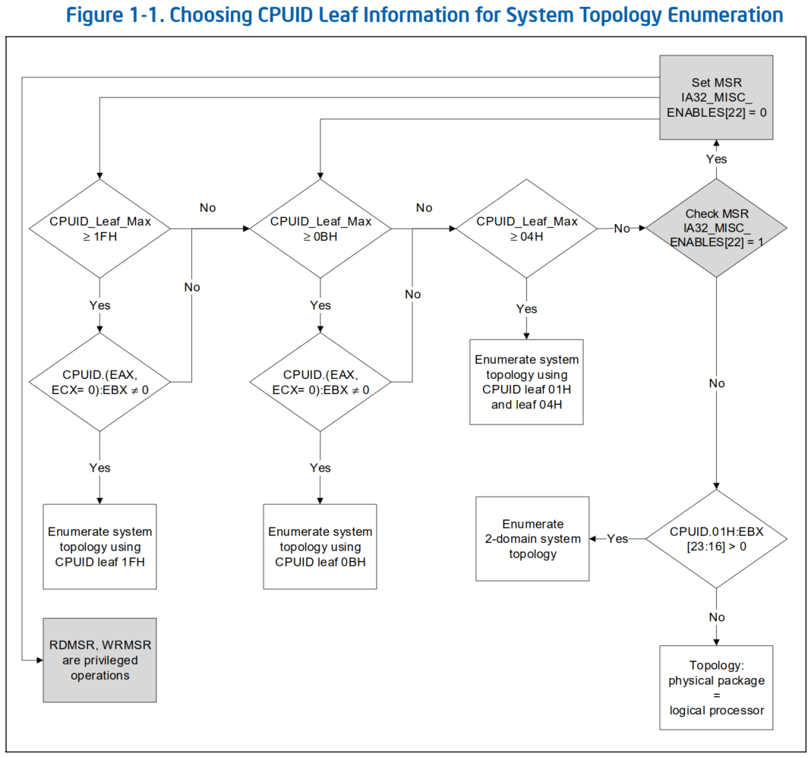

# Intel® 64 Architecture Processor Topology Enumeration

# 1 介绍

## 1.1 术语表
* **Physical Processor：** 能够同时执行一个或多个软件线程的微处理器的 physical package。
  * 每个 physical package 装插入一个 physical socket。
  * 每个 physical package 可能包含一个或多个 processor cores，也称为 **physical package**。
* **Processor Core：** 提供专用功能的电路，用于解码、执行指令并在 physical package 中的某些子系统之间传输数据。
  * 一个 Processor Core 可能包含一个或多个 logical processors。
* **Logical Processor：** 处理器硬件资源的基本模块性，允许软件执行程序（OS）调度任务或执行线程上下文。每个 logical processor 一次只能执行一个线程上下文。
* **Intel Hyper-Threading Technology：** IA-32 系列处理器中的一项功能，其中每个 processor core 提供多个 logical processor 的功能。
* **SMT：** 同步多线程（Simultaneous Multi-Threading）的缩写。一种有效的硅片方法，通过在 logical processor 之间共享执行资源和 cache 层次结构，在同一 processor core 内提供多个 logical processors 的功能。
* **Multi-Core Processor：** 包含多个 processor cores 的一个 physical processor。
* **Multi-Processor Platform：** 由两个或多个 physical sockets 组成的计算机系统。
* **Hardware Multi-Threading：** 指允许系统运行多线程软件的硬件支持的任何组合。硬件对多线程的支持形式有：SMT、multi-core 和 multi-processor。
* **Processor Topology：** 一个 physical package 内的处理器实体（logical processors、processor cores）相对于 physical processor 内硬件资源共享层次的层次关系。
* **Cache Hierarchy：** cache 级别的物理排列，用于缓冲（buffers）处理器实体和物理内存子系统之间的数据传输。
* **Cache Topology：** 相对于一个 physical processor 中 logical processors 的 cache 级别的层次关系。
* **Die：** 一个 package 内的一个软件可见的芯片（chip）。
  * 当一个 processor package 包含单个 die 时，*die-scope* 和 *package-scope* 是同义词。
  * 当一个 package 包含多个 die 时，它们是不同的。
* **DieGrp：** 一组共享某些资源的 die。
* **Tile：** 一组共享某些资源的 cores。`TILE_ID` 子字段区分不同的 tiles。如果没有软件可见的 tiles，则该位字段的宽度为 `0`。
* **Module：** 一组共享某些资源的 cores。`MODULE_ID` 子字段区分不同的 modules。如果没有软件可见 modules，则该位字段的宽度为 `0`。
* **Domain：** 处理器拓扑层次结构的一层，表示单一拓扑类型的分组。
  * 例如，一个 three-domain 拓扑将由 logical processors、processor cores 和 packages 的 domain 组成。
  *以前的文档将其称为“Level”，例如“three-level topology”。

# 2 在一个多处理器系统中的唯一 APIC ID
* 尽管传统的 IA-32 多处理器系统为系统中的每个 logical processor 分配唯一的 APIC ID，但编程接口在过去已经发生了多次演变。
* 对于 Pentium Pro 和 Pentium III Xeon 处理器，APIC ID 只能从 local APIC 寄存器访问（local APIC 寄存器使用 Memory-Mapped I/O 接口，由操作系统管理）。
* 在第一代 Pentium 4 和 Intel® Xeon® 处理器（2000、2001）中，`CPUID` 指令提供了在处理器重置期间分配的 initial APIC ID 的信息。
* 支持 Intel 超线程技术的第一代 Intel Xeon MP 处理器和 Pentium 4 处理器中的 `CPUID` 指令提供了更多信息，使软件能够将 initial APIC ID 分解为两级拓扑枚举。
* 随着 2005 年双核 Intel 64 处理器的推出，使用 `CPUID` 的系统拓扑枚举演变为基于 `8-bit` 位宽 initial APIC ID 的三级算法。
* Intel 64 平台能够支持大量 logical processor，这些处理器的数量超出了 `8-bit` initial APIC ID 字段的容量。
  * Intel 64 架构中的 x2APIC 扩展定义了 32 位 x2APIC ID，当前 Intel 64 处理器中的 `CPUID` 指令允许软件使用 x2APIC ID 来枚举系统拓扑。
* `CPUID` 的扩展拓扑枚举 leaf（leaf `0x0B`）于 2009 年与 x2APIC ID 一起推出。
  * 此 leaf 已被 v2 扩展拓扑枚举 leaf（`CPUID` leaf `0x1F`）取代，后者是当前 Intel 64 处理器系统拓扑枚举的首选接口。
* 当前 Intel 64 处理器中的 `CPUID` 指令可能独立于 x2APIC 硬件支持 leaf `0x0B` 或 leaf `0x1F`。
  * 对于许多当前的 Intel 64 平台，可以使用 `CPUID` leaf `0x1F`、`CPUID` leaf `0x0B` 或旧式的 initial APIC ID（通过 `CPUID` leaf `0x01` 和 `CPUID` leaf `0x04`）执行系统拓扑枚举。
  * 但是，现代平台不应使用旧方法，原因如第 7 节所述。图 1-1 显示了软件应如何选择使用哪个 `CPUID` leaf 信息进行系统拓扑枚举的示例。

## 2.1 x2APIC ID/APIC ID Topology Bit Layouts
* 可以通过位掩码解析 x2APIC ID/APIC ID，以提取 `LOGICAL_PROCESSOR_ID`、`CORE_ID`、`PACKAGE_ID` 等。然后可以使用这些来确定任何特定 logical processor 的拓扑和位置。
* 表 1-1 说明了 Topology Bit Layout 的基本示例，其中显示了每个 ID 的位置。
* Table 1-1. Example A: Topology Bit Layout

Domain                 | Bit Layout | 描述
-----------------------|------------|----------------------------------
`LOGICAL_PROCESSOR_ID` | `[0]`      | 每个 core 两个 logical processors
`CORE_ID`              | `[3:1]`    | 每个 package 八个 cores

* `PACKAGE_ID` 掩码可用于系统中的所有 APIC ID/x2APIC ID，以确定哪些 logical processors 属于每个 package。然后，这将枚举系统中有多少个 packages。
  * 表 1-2 显示了使用掩码并将值 *右移四位* 后，每个 package 可以标记的特定数字标识符（第二列）。
* 然后，还可以使用 `CORE_ID`（相对于 Package）掩码识别 package 内的 cores。
* 对于 package 中的每个 locgical processor，可以确定每个 core 的数字标识符和属于该 core 的 logical processors 集。
  * 表 1-2 显示了使用掩码并将值 *右移一位* 后创建的数字标识符（第三列）。
* 另一种在不确定 package 的情况下识别整个系统的 cores 的方法是使用 `CORE_ID`（相对于系统）掩码。
  * 这可以应用于整个系统，并识别每个 core 和该 core 内的 logical processors 集（第四列）。
* 要单独识别 core 内的 logical processor（使用上述任一方法进行识别），可以使用 `LOGICAL_PROCESSOR_ID`（相对于 core）掩码（第五列）。
  * 这仅提供该 core 内每个 logical processor 的数字标识符。
  * 这些数字标识符不需要连续，但它们相对于被识别的上层必须是唯一的。
* Table 1-2. Example A Masks and Shifts

APIC ID | `PACKAGE_ID` 掩码：`0xFFFFFFF0`，右移 `4` 位 | `CORE_ID`（相对于 Package）掩码：`0xE`，右移 `1` 位 | `CORE_ID`（相对于系统）掩码：`0xFFFFFFFE` |`LOGICAL_PROCESSOR_ID`（相对于 Core）掩码：`0x1`
----------|---|---|-----------|----
0 (0x0)   | 0 | 0 | 0 (0x0)   | 0
1 (0x1)   | 0 | 0 | 0 (0x0)   | 1
2 (0x2)   | 0 | 1 | 2 (0x2)   | 0
3 (0x3)   | 0 | 1 | 2 (0x2)   | 1
4 (0x4)   | 0 | 2 | 4 (0x4)   | 0
5 (0x5)   | 0 | 2 | 4 (0x4)   | 1
6 (0x6)   | 0 | 3 | 6 (0x6)   | 0
7 (0x7)   | 0 | 3 | 6 (0x6)   | 1
8 (0x8)   | 0 | 4 | 8 (0x8)   | 0
9 (0x9)   | 0 | 4 | 8 (0x8)   | 1
10 (0xA)  | 0 | 5 | 10 (0xA)  | 0
11 (0xB)  | 0 | 5 | 10 (0xA)  | 1
12 (0xC)  | 0 | 6 | 12 (0xC)  | 0
13 (0xD)  | 0 | 6 | 12 (0xC)  | 1
14 (0xE)  | 0 | 7 | 14 (0xE)  | 0
15 (0xF)  | 0 | 7 | 14 (0xE)  | 1
16 (0x10) | 1 | 0 | 16 (0x10) | 0
17 (0x11) | 1 | 0 | 16 (0x10) | 1
18 (0x12) | 1 | 1 | 18 (0x12) | 0
19 (0x13) | 1 | 1 | 18 (0x12) | 1
20 (0x14) | 1 | 2 | 20 (0x14) | 0
21 (0x15) | 1 | 2 | 20 (0x14) | 1
22 (0x16) | 1 | 3 | 22 (0x16) | 0
23 (0x17) | 1 | 3 | 22 (0x16) | 1
24 (0x18) | 1 | 4 | 24 (0x18) | 0
25 (0x19) | 1 | 4 | 24 (0x18) | 1
26 (0x1A) | 1 | 5 | 26 (0x1A) | 0
27 (0x1B) | 1 | 5 | 26 (0x1A) | 1
28 (0x1C) | 1 | 6 | 28 (0x1C) | 0
29 (0x1D) | 1 | 6 | 28 (0x1C) | 1
30 (0x1E) | 1 | 7 | 30 (0x1E) | 0
31 (0x1F) | 1 | 7 | 30 (0x1E) | 1

## 2.2 算法枚举拓扑发现方法
* 正如介绍中提到的，枚举拓扑的算法随着时间的推移而不断发展。
* 图 1-1 说明了发现当前平台上可用的最佳方法的方法。



* 可以通过设置 `EAX = 0`、执行 `CPUID` 并检查 `EAX` 中的返回值（即 `CPUID.0:EAX`）来确定所支持的 `CPUID` leaf 的最大值。
* 如果 `CPUID.0:EAX ≥ 0x1F`，则软件可以通过设置 `EAX=1FH、ECX=0` 并执行 `CPUID` 来检查 `EBX` 中返回的非零值（即 `CPUID.(EAX=0x1F, ECX=0):EBX ≠ 0`）来确定 `CPUID` leaf `0x1F` 是否存在。
* 如果未找到 leaf `0x1F`，则软件应以相同方式检查 `CPUID` leaf `0x0B`。如果 `CPUID.0:EAX ≥ 0x0B`，则软件可以通过设置 `EAX=0x0B`、`ECX=0` 并执行 `CPUID` 来检查 `EBX` 中返回的非零值来确定 `CPUID` leaf `0x0B` 是否存在。例如，`CPUID.(EAX=0x0B, ECX=0):EBX ≠ 0`。
* 功能齐全的硬件多线程需要完整报告 CPUID leaves。
* 如果软件在较新的 Intel 64 或 IA-32 处理器（2004 版以上）上观察到 `CPUID.0:EAX < 4`，则应检查 MSR `IA32_MISC_ENABLES[bit 22]`。
* 如果 `IA32_MISC_ENABLES[bit 22]` 设置为“`1`”（通过 BIOS 或其他方式），用户可以通过将 `IA32_MISC_ENABLES[bit 22]` 设置为“`0`”（修改 BIOS CMOS 设置或使用 `WRMSR` 指令）来恢复 `CPUID` leaf 功能完整报告。
* 一些较旧的 IA-32 处理器仅支持两个 topology domains（logical processor 和 physical package）。
* 三级系统拓扑枚举算法（使用 `CPUID` leaf `0x01` 和 leaf `0x04`）与这些较旧的处理器完全兼容。
* 对于将 `CPUID.0x01:EBX[23:16]` 报告为保留（即 `0`）的处理器，该处理器仅支持一个 topology domain。

## 2.3 CPUID Leaf 0x1F 取代 CPUID Leaf 0x0B
* `CPUID` leaf `0x0B` 于 2009 年推出。当时，系统拓扑由三个 domains 组成：logical processor、core 和 package。当时记录的软件算法不足以使旧版软件正确处理它不知道的新域。
* 算法已更新，为了保持旧版软件兼容性，引入了 `CPUID` leaf `0x1F` 来返回所有 topology domain 枚举，包括三个 domains 及更多 domains。
* `CPUID` leaf `0x0B` 将只枚举 logical processor、core 和 packagge 这三个 domain 以维护旧版软件。
* 所有新软件，尤其是使用 `CPUID` leaf `0x1F` 编写的软件，都需要根据本文档中指定的算法实现拓扑检测。新算法向后兼容，并且也适用于 `CPUID` leaf `0x0B`。

## 2.4 应用软件和拓扑枚举

# 3 使用 CPUID LEAF 0x1F 或 CPUID LEAF 0x0B 进行系统拓扑枚举
* 相同的算法可用于 `CPUID` leaf `0x0B` 和 `CPUID` leaf `0x1F`；有关这两个 leave 之间的差异的解释，请参见第 2.3 节。
* 自 `CPUID` leaf `0x0B` 的原始文档以来，此算法已更新，任何使用旧算法的软件都必须进行更改以遵守本节中概述的更新。
* 系统拓扑枚举算法可以概括为三个操作阶段：
  * 得出将用于提取每个 Sub-ID 的“掩码宽度”常量。
  * 收集系统中每个 logical processor 的唯一 APIC ID，并将每个 APIC ID 提取/分解为三组 Sub-ID。
  * 分析分层 Sub-ID 的关系，根据处理器拓扑的三个分层 domains 在操作系统的线程管理服务之间建立映射表。
* 生成的拓扑图可以由软件以多种特定于应用程序的方式使用。一些更常见的用法包括：
1. 确定 physical processor 的数量以实施 per-package 的许可策略。
   * 如表 1-1 中的示例拓扑所示，表 1-2 中为 `PACAKAGE_ID` 列提取的每个 unique ID 代表一个 physical package。
2. 线程绑定策略可以选择将每个新任务绑定到系统中的单独 core。这可能需要软件知道每个 logical processor 相对于每个不同处理器 core 的亲和性掩码之间的关系。
3. MP-scalling 优化策略可能希望根据大型最后一级 cache 的大小对其数据工作集进行分区，并允许多个线程处理驻留在每个最后一级 cache 中的数据 tile。
   * 这将需要软件管理系统中每个 `Cache_ID` 和 x2APIC ID 的亲和性掩码和线程绑定。
* 表 1-3 提供了 `CPUID` leaf `0x1F` 的参考。

### Table 1-3. Reference for CPUID Leaf 1FH

#### 注意
* `CPUID` leaf `0x1F` 为 V2 扩展拓扑枚举 leaf（V2 Extended Topology Enumeration Leaf）
* `CPUID` leaf `0x1F` 是 leaf `0x0B` 的首选超集。Intel 建议在可用时使用 leaf `0x1F`，而不是 leaf `0x0B`，并确保更新所有 leaf `0x0B` 算法以支持 leaf `0x1F`。
* `CPUID` leaf `0x1F` 的 sub-leaves 描述了 logical processors 的有序层次结构，从一个 Logical Processor 的最小范围 domain（sub-leaf index `0`）开始，到 Core domain（sub-leaf index `1`），再到最大范围 domain（最后一个有效 sub-leaf index），该 domain 隐式从属于 processor package（socket）未枚举的最高范围 domain。
* 每个有效 domain 的详细信息由相应的 sub-leaf 枚举。Domain 的详细信息包括：
  * 该 domain 的类型
  * 该 domain 的所有实例如何确定 logical processors 数量
  * 下一个更高范围 domain 的 x2 APIC ID 分区。
* 层次结构中 domain 的排序在架构上是固定的，如下所示。
  * 对于给定的处理器，并非所有 domains 都相关或可枚举；
  * 但是，logical processor 和 core domains 始终可枚举。
  * 例如，处理器可能报告仅由“logical processor”、“core”和“Die”组成的有序层次结构。
* 对于两个有效的 sub-leaf `N` 和 `N+1`，sub-leaf `N+1` 表示给定处理器的 sub-leaf `N` domain 的下一个直接更高范围的 domain。
* 如果 sub-leaf 索引“`N`”在 `ECX[15:08] (0x00)` 中返回无效域（invalid domain）类型，则所有索引大于“`N`”的 sub-leaves 也应返回无效域类型。
  * 返回无效域的 sub-leaf 始终在 `EAX` 和 `EBX` 中返回 `0`。

#### EAX
* Bits `04-00`：x2APIC ID 必须向右移动的位数，以寻址下一个更高范围 domain 的实例。
  * 当处理器不支持 logical processor 时，Logical Processor domain sub-leaf（令 sub-leaf `ECX=0`，即 `CPUID.(EAX=0x1F, ECX=0)`）上此字段的值可能返回为 `0`（x2APIC ID 中没有分配的位）
  * 否则返回 `1`（x2APIC ID 中有一个分配的位）；软件应进行相应规划。
* Bits `31-05`：保留。

#### EBX
* Bits `15-00`：相对于当前 logical processors，下一个更高范围 domain 内此 domain 的所有实例的 logical processors 数量。
  * 例如，在 processor socket/package 对称拓扑中，每个拓扑由“`M`”个 dies 和“`N`”个 cores 组成，每个 core 有“`L`”个 logical processors，此字段的“die” domain sub-leaf （令 sub-leaf `ECX=2`，即 `CPUID.(EAX=0x1F, ECX=2)`）值将是 `M*N*L`。
  * 在非对称拓扑中，这将是较低 domain 级别实例的值的总和，以创建每个较高 domain 级别实例。
  * 此数字反映了 Intel 提供的配置。
  * **注意**，软件不得使用此字段来枚举处理器拓扑。
    * 软件不得使用 `EBX[15:0]` 的值来枚举系统的处理器拓扑。该值仅用于显示和诊断目的。
    * BIOS/OS/应用程序可用的 logical processors 的实际数量可能与 `EBX[15:0]` 的值不同，具体取决于软件和平台硬件配置。
* Bits `31-16`：保留。

#### ECX
* Bits `07-00`：输入 `ECX` sub-leaf 索引。
* Bits `15-08`：Domain 类型：此字段提供指示 domain 的标识值，如下所示。
  * 尽管 domain 是有序的（如下所示），但它们分配的标识值不是有序的，软件不应依赖它。
    * 例如，如果在 core 和 module 之间指定了一个新 domain ，则它的标识值将高于 `5`。

Hierarchy | Domain            | Domain Type Identification Value
----------|-------------------|-----------------------------------
Lowest    | Logical Processor | 1
...       | Core              | 2
...       | Module            | 3
...       | Tile              | 4
...       | Die               | 5
...       | DieGrp            | 6
Highest   | Package/Socket    | (implied)

* 请注意，`0` 和 `7-255` 的枚举值是保留的。
* Bits `31-16`：保留。

#### EDX
* Bits `31-00`：当前 logical processors 的 x2APIC ID。它始终有效，并且不会随着 `ECX` 中的 sub-leaf 索引而变化。

#### 例子
* 在一台 2 packages，每个 package 48 个 cores，支持超线程的机器上，总共有 `2 x 48 x 2 = 192` 个 logical processors。分别以不同的 sub-leaf 执行 `cpuid -1 -l 0x1f` 命令：

##### 1. Logical processor domain
```sh
# cpuid -1 -l 0x1f -s 0
CPU:
   V2 extended topology (0x1f):
      x2APIC ID of logical processor = 0x94 (148)
      --- level 0 ---
      level number                          = 0x0 (0)    # 输入参数 -s 0，ECX[07-00] 的值
      level type                            = thread (1) # ECX[15-08] 的值为 1
      bit width of level & previous levels  = 0x1 (1)    # EAX[04-00] 的值为 1，x2APIC ID 必须向右移动的位数
      number of logical processors at level = 0x2 (2)    # EBX[15-00] 的值为 2，对 core domain 来说有 2 个 logical processors
# cpuid -1 -l 0x1f -s 0 -r
CPU:
   0x0000001f 0x00: eax=0x00000001 ebx=0x00000002 ecx=0x00000100 edx=0x0000000b
```

##### 2. Core domain
```sh
# cpuid -1 -l 0x1f -s 1
CPU:
      --- level 1 ---
      level number                          = 0x1 (1)   # 输入参数 -s 1，ECX[07-00] 的值为 1
      level type                            = core (2)  # ECX[15-08] 的值为 2
      bit width of level & previous levels  = 0x7 (7)   # EAX[04-00] 的值为 7，x2APIC ID 必须向右移动的位数
      number of logical processors at level = 0x60 (96) # EBX[15-00] 的值为 0x60，对 package domain 来说有 96 个 logical processors
# cpuid -1 -l 0x1f -s 1 -r
CPU:
   0x0000001f 0x01: eax=0x00000007 ebx=0x00000060 ecx=0x00000201 edx=0x00000082
```

##### 3. Package domain
```sh
# cpuid -1 -l 0x1f -s 2
CPU:
      --- level 2 ---
      level number                          = 0x2 (2)     # 输入参数 -s 2，ECX[07-00] 的值为 2
      level type                            = invalid (0) # ECX[15-08] 的值为 0，第一个无效的 domain 类型，隐含为 package domain
      bit width of level & previous levels  = 0x0 (0)     # EAX[04-00] 的值为 0
      number of logical processors at level = 0x0 (0)     # EBX[15-00] 的值为 0
# cpuid -1 -l 0x1f -s 2 -r
CPU:
   0x0000001f 0x02: eax=0x00000000 ebx=0x00000000 ecx=0x00000002 edx=0x000000ae
```

* 以下部分概述了如何获取软件所需的拓扑移位值。