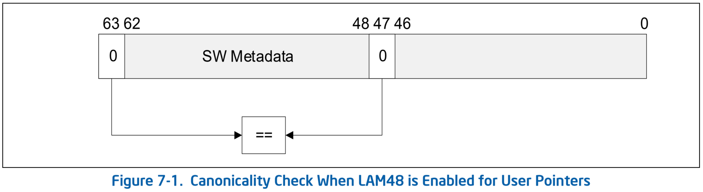
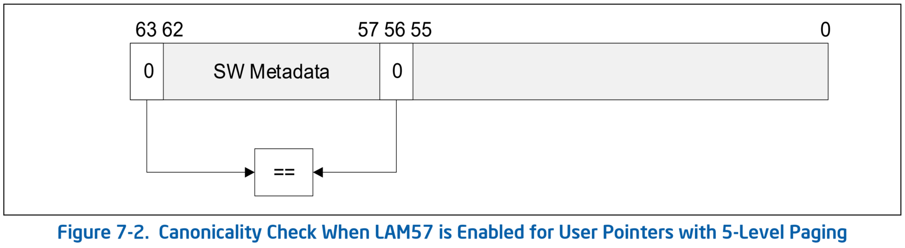
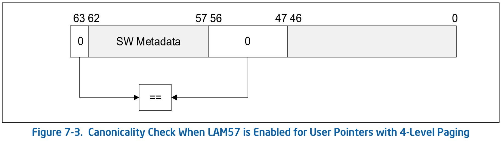
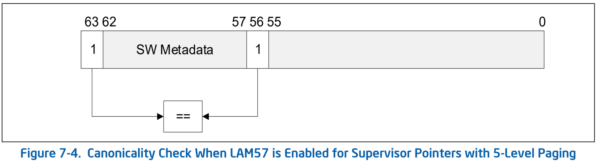
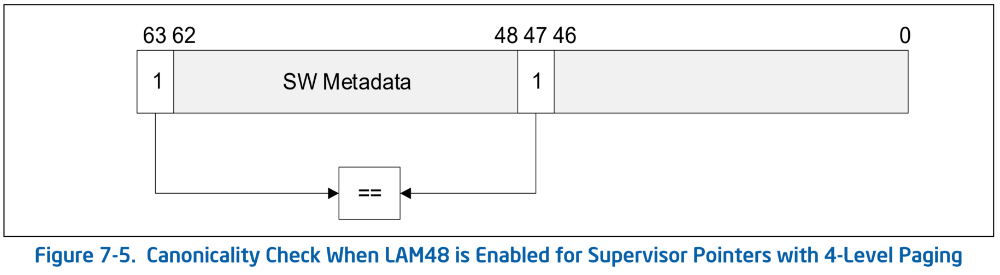

# Linear Address Masking (LAM)
* LAM 修改了应用于 64 位线性地址的检查，允许软件将未翻译的地址位用于元数据。
* 在 64 bit 模式下，线性地址有 64 位，可以使用 4 级分页（转换每个线性地址的低 48 位）或 5 级分页（转换 57 位）进行转换。通过 **规范性** 的概念保留高线性地址位。
  * 如果地址的 `63:47` 位相同，则线性地址是 *48 位规范* 的；
  * 如果 `63:56` 位相同，则它是 *57 位规范* 的。（显然，任何 48 位规范的线性地址也是 57 位规范的。）
* 当 4 级分页处于活动状态时，处理器要求用于访问内存的所有线性地址都是 48 位规范；类似地，5 级分页可确保所有线性地址都是 57 位规范的。
* 将元数据与指针相关联的软件的使用方法可能会受益于能够将元数据放置在指针本身（不翻译的）的高位中。然而，前面提到的规范性强制意味着软件必须先屏蔽指针中的元数据位（使其规范化），然后才能将其用作访问内存的线性地址。
* LAM 允许软件将指针与元数据一起使用，而无需屏蔽元数据位。启用 LAM 后，处理器会先屏蔽指针中的元数据位，然后再将其用作访问内存的线性地址。
  * LAM 仅在 64 位模式下支持，并且 **仅适用于数据访问的地址**。
  * LAM 不适用于用于取指令的地址或指定 `jump` 和 `call` 指令目标的地址。

## 7.1 Enumeration, Enabling, and Configuration
* 处理器支持的 LAM 由 CPUID feature flag `CPUID.(EAX=0x07，ECX=0x01):EAX.LAM[bit 26]` 枚举。
```sh
# cpuid -1 -l 0x7 -s 0x1
CPU:
      RAO-INT atomic instructions              = false
      AVX-VNNI: AVX VNNI neural network instrs = true
      AVX512_BF16: bfloat16 instructions       = true
      LASS: linear address space separation    = false
      CMPccXADD instructions                   = false
      ArchPerfmonExt is valid                  = false
      fast zero-length MOVSB                   = true
      fast short STOSB                         = true
      fast short CMPSB, SCASB                  = true
      WRMSRNS instruction                      = false
      AMX-FP16: FP16 tile operations           = false
      HRESET: history reset support            = false
      AVX-IFMA: integer fused multiply add     = false
      LAM: linear address masking              = false
      RDMSRLIST, WRMSRLIST instructions        = false
      IA32_PPIN & IA32_PPIN_CTL MSRs supported = false
      AVX-VNNI-INT8 instructions               = false
      AVX-NE-CONVERT instructions              = false
      PREFETCHIT0, PREFETCHIT1 instructions    = false
      CET_SSS: shadow stacks w/o page faults   = false
```
* LAM 的启用和配置由控制寄存器中的以下新位控制：
  * `CR3[62]`（**LAM_U48**）
  * `CR3[61]`（**LAM_U57**）
  * `CR4[28]`（**LAM_SUP**）
* LAM 支持不同的配置，即哪些指针位被屏蔽并且可用于元数据。
  * 对于 LAM48，位置 `62:48` 中的指针位被屏蔽（导致 LAM 宽度为 `15`）；
  * 对于 LAM57，位置 `62:57` 中的指针位被屏蔽（LAM 宽度为 `6`）。
* 对于 user 和 supervisor 指针，LAM 宽度可以进行不同的配置。
  * 如果指针的 bit `63` 为 `0`，则 LAM 将指针标识为 user 指针；
  * 如果指针的 bit `63` 为 `1`，则 LAM 将其标识为 supervisor 指针。
* `CR3.LAM_U48` 和 `CR3.LAM_U57` 为 user 指针启用和配置 LAM：
  * 如果 `CR3.LAM_U48 = CR3.LAM_U57 = 0`，则不会为 user 指针启用 LAM。
  * 如果 `CR3.LAM_U48 = 1` 且 `CR3.LAM_U57 = 0`，则为 user 指针启用 LAM48（LAM 宽度为 `15`）。
  * 如果 `CR3.LAM_U57 = 1`，则 LAM57 适用于 user 指针（LAM 宽度为 `6`；忽略 `CR3.LAM_U48`）。
* `CR4.LAM_SUP` 为 supervisor 指针启用并配置 LAM：
  * 如果 `CR3.LAM_SUP = 0`，则不会为 supervisor 指针启用 LAM。
  * 如果 `CR3.LAM_SUP = 1`，则为 supervisor 指针启用 LAM，其宽度由分页模式确定：
    * 如果启用 4 级分页，则为 supervisor 指针启用 LAM48（LAM 宽度为 `15`）。
    * 如果启用 5 级分页，则为 supervisor 指针启用 LAM57（LAM 宽度为 `6`）。
* 请注意，LAM 将指针标识为 user 或 supervisor 仅基于指针第 `63` 位的值，并且出于 LAM 的目的，不依赖于 CPL。

## 7.2 对 LAM Active 的 User 指针的数据访问的处理
* 回想一下，在没有 LAM 的情况下，定义了规范性检查，以便 4 级分页要求每个指针的 bit `63:47` 相同，而 5 级分页要求每个指针的 bit `63:56` 相同。LAM 允许通过修改规范性检查将其中一些位用作元数据。
* 当为 user 指针启用 LAM48 时（请参阅第 7.1 节），处理器允许将用户指针的 bit `62:48` 用作元数据。
* 无论哪种分页模式，处理器都会执行一个修改了的规范性检查，强制指针的 bit `47` 与 bit `63` 匹配。如图 7-1 所示，不检查 bit `62:48` ，因此可用于软件元数据。
  * 执行此修改的规范性检查后，通过对 bit `47` 的值（`0`）进行符号扩展来屏蔽 bit `62:48`，然后将生成的（`48` 位的规范）地址传递出去，以通过分页进行转换。
* 另请注意，如果 **没有 LAM**，5 级分页不适用对 user 指针的 bit `47` 进行规范性检查；当为 user 指针启用 LAM48 时，user 指针的 bit `47` 必须为 `0`。
* 另请注意，线性地址 bit `56:47` 通过 5 级分页进行转换。当为 user 指针启用 LAM48 时，这些位在从 user 指针派生的任何线性地址中始终为 `0`：指针的 bit `56:48` 包含元数据，而 bit `47` 必需为 `0`。



* 当为用户指针启用 LAM57 时，处理器允许将用户指针的 bit `62:57` 用作元数据。
* 对于 5 级分页，处理器执行修改了的规范性检查，仅强制指针的第 `56` 位与第 `63` 位匹配。如图 7-2 所示，未检查第 `62:57` 位，因此可用于软件元数据。
  * 执行此修改的规范性检查后，通过对 bit `56` 的值（`0`）进行符号扩展来屏蔽 bit `62:57`，然后将生成的（`57` 位规范）地址传递给 5 级分页进行转换。



* 当为具有 4 级分页的 user 指针启用 LAM57 时，处理器会执行修改后的规范性检查，该检查仅强制 user 指针的 bit `56:47` 与 bit `63` 匹配。如图 7-3 所示，bit `62:57` 不检查，因此可用于软件元数据。
  * 执行此修改的规范性检查后，通过对 bit `56` 的值（`0`）进行符号扩展来屏蔽 bit `62:57`，然后将生成的（`48` 位规范）地址传递给 4 级分页进行转换。



## 7.3 对 LAM Active 的 Supervisor 指针的数据访问的处理
* 与 user 指针（第 7.2 节）一样，LAM 可以配置为修改规范性检查，以允许在 supervisor 指针中使用元数据。
* 对于 supervisor 指针，可用的元数据位数（LAM 宽度）取决于激活的分页模式：
  * 对于 5 级分页，为 supervisor 指针启用 LAM 会导致 LAM57；
  * 使用 4 级分页，会产生 LAM48（请参见第 7.1 节）。
* 当为 supervisor 指针启用 LAM57（5 级分页）时，处理器会执行修改了的规范性检查，仅强制 supervisor 指针的第 `56` 位与第 `63` 位匹配。如图 7-4 所示，不检查第 `62:57` 位，因此可用于软件元数据。
  * 执行此修改后的规范性检查后，通过对 bit `56` 的值（`1`）进行符号扩展来屏蔽 bit `62:57`，然后将所得的（`57` 位规范）地址传递给 5 级分页进行转换。



* 当为 supervisor 指针启用 LAM48（4 级分页）时，处理器执行修改了的规范性检查，仅强制 supervisor 指针的 bit `47` 与 bit `63` 匹配。如图 7-5 所示，不检查 bit `62:48`，因此可用于软件元数据。
  * 执行此修改后的规范性检查后，通过对 bit `47` 的值（`1`）进行符号扩展来屏蔽 bit `62:48`，然后将生成的（`48` 位规范）地址传递给 4 级分页进行转换。



## 7.4 对写到控制寄存器的数据的规范性检查
* 支持 LAM 的处理器继续要求写入控制寄存器或 MSR 的地址为 57 位规范（如果处理器支持 5 级分页）或 48 位规范（如果处理器仅支持 4 级分页）；这些写入不会执行 LAM 屏蔽。
* 当此类寄存器的内容用作访问内存的指针时，处理器会根据访问时激活的分页模式和 LAM 模式配置来执行规范性检查和屏蔽。

## 7.5 Page Interactions
* 如第 7.2 节和第 7.3 节所述，LAM 通过符号扩展屏蔽指针中的某些位，从而产生要通过分页转换的线性地址。
* 在大多数情况下，地址转换不使用处于掩码位置中的地址位。然而，如果 5 级分页处于活动状态并且为 user 指针启用了 LAM48，则 user 指针的 bit `47` 必须为零，并且在 bit `62:48` 上扩展以形成线性地址 — 即使 bit `56:48` 由 5 级分页使用。
  * 这意味着，当为 user 指针启用 LAM48 时，为 user 指针转换的任何线性地址中的 bit `56:47` 均为 `0`。
* 缺页时在 `CR2` 中报告的错误线性地址。由于 LAM 屏蔽（通过符号扩展）在分页之前应用，因此 `CR2` 中记录的故障线性地址 **不包含** 屏蔽元数据。
* `INVLPG` 指令用于使源操作数指定的内存地址的任何 translation lookaside buffer (TLB) 条目无效。
  * LAM 不适用于指定的内存地址。因此，在 64 位模式下，如果指定的内存地址是非规范形式，则 `INVLPG` 与 `NOP` 相同。
* `INVPCID` 指令根据处理器上下文标识符（PCID）使 TLB 和分页结构 caches 中的映射无效。
  * `INVPCID` 描述符提供 *当描述符为类型 `0` 时* 要无效的内存地址（单独地址无效）。
* LAM 不适用于指定的内存地址，并且在 64 位模式下，如果该内存地址采用非规范形式，则处理器会生成 `#GP(0)` 异常。

## 7.6 VMX Interactions

### 7.6.1 Guest 线性地址
* 某些 VM exit 将与 VM exit 相关的 guest 线性地址保存在 VMCS 的域中。因为这样的线性地址是由屏蔽原始指针产生的，所以处理器不会在 VMCS 中报告被屏蔽的元数据。
* 保存的 guest 线性地址始终是第 7.2 节和第 7.3 节中描述的符号扩展的结果。

### 7.6.2 VM-Entry 检查 `CR3` 和 `CR4` 的值
* VM entry 检查 VMCS 的 guest 状态区域和 host 状态区域中的 `CR3` 和 `CR4` 域的值。特别是，检查这些域中与相应寄存器中保留的位相对应的位，并且这些位必须为 `0`。
* 在枚举支持 LAM（第 7.1 节）的处理器上，VM entry 允许在任一 `CR3` 域中设置 bit `62:61`，并允许在任一 `CR4` 域中设置 bit `28`。

### 7.6.3 CR3-Target Values
* 如果 “CR3-load exiting” VM 执行控制域为 `1`，则在 VMX non-root operation 中执行 `MOV` 到 `CR3` 会导致 VM exit，除非指令的源操作数的值等于 VMCS 中指定的 `CR3` 目标值之一。
* 处理器对 LAM 的支持不会改变此行为。指令源操作数与每个 `CR3` 目标值的比较考虑了所有 64 位，包括对 user 指针确定 LAM 启用的两个新位（请参见第 7.1 节）。

### 7.6.4 Hypervisor 管理的线性地址翻译（HLAT）
* 当 “启用 HLAT” tertiary processor based VM 执行控制域为 `1` 时，将启用 Hypervisor 管理的线性地址转换（HLAT）。有关更多详细信息，请参阅第 4 章“Non-Write-Back Lock Disable Architecture”。
* 当为 guest 启用 HLAT 时，如果地址与受保护的线性范围（Protected Linear Range，PLR）匹配，则处理器会使用 HLAT 分页结构（而不是 guest 分页结构）转换线性地址。 * 当 LAM 处于活动状态时，将检查（通过屏蔽从指针派生的）线性地址是否有 PLR 匹配。
* HLAT 分页结构的层次结构使用 VMCS 中的 guest 物理地址（而不是 `CR3` 中的客户物理地址）进行定位。
* 然而，用户指针的 LAM 启用和配置基于 `CR3[62:61]` 的值（参见第 7.1 节），即使 `CR3` 中的 guest 物理地址不用于转换从 user 指针派生的线性地址时也是如此。

## 7.7 Debug and Tracing Interactions

### 7.7.1 调试寄存器
* 调试寄存器 `DR0-DR3` 可以使用与数据断点或指令断点的存储器访问相匹配的线性地址进行编程。
* 当 LAM 处于活动状态时，将检查（通过屏蔽从指针派生的）线性地址是否与调试寄存器的内容匹配。

### 7.7.2 Intel Processor Trace
* Intel 处理器跟踪支持 `CR3` 过滤机制，通过该机制，可以根据与 `IA32_RTIT_CR3_MATCH` MSR 内容匹配的 `CR3` 的值启用或禁用包含架构状态的数据包的生成。
* 在支持 LAM 的处理器上，`CR3` 的 bit `62:61`（参见第 7.1 节）还必须与该 MSR 的 bit `62:61` 匹配才能启用跟踪。

### 7.8 Intel SGX Interactions
* `ENCLS`、`ENCLU` 和 `ENCLV` 的内存操作数是数据指针，遵循 LAM 架构并适当屏蔽。
* 继续，代码指针不屏蔽元数据位。
* `ECREATE` 不会屏蔽 SECS 中指定的 `BASEADDR`，并且未屏蔽的 `BASEADDR` 必须是规范的。
* 为 enclave 模式下的 LAM 支持定义了两个新的 SECS 属性位：
  * `ATTRIBUTE.LAM_U48`（bit `9`）- 为用户数据指针激活 LAM，并使用 bit `62:48` 作为 enclave 模式下的屏蔽元数据。如果 `CPUID.(EAX=0x12, ECX=0x01):EAX[9]` 为 `1`，则可以设置该位。
  * `ATTRIBUTE.LAM_U57`（bit `8`）- 为用户数据指针激活 LAM，并使用 bit `62:57` 作为 enclave 模式下的屏蔽元数据。如果 `CPUID.(EAX=0x12, ECX=0x01):EAX[8]` 为 `1`，则可以设置该位。
* 如果 bit `ATTRIBUTE.LAM_U48` 为 `1` 并且 `CPUID.(EAX=0x12, ECX=0x01):EAX[9]` 为 `0`，或者如果 bit `ATTRIBUTE.LAM_U57` 为 `1` 并且 `CPUID.(EAX=0x12，ECX=0x01):EAX[8]` 为 `0`，`ECREATE` 会导致 `#GP(0)` 。
* 如果 `SECS.ATTRIBUTES.LAM_U57` 为 `1`，则在执行由 SECS 控制的 enclave 期间为 user 指针启用 LAM57（无论 `CR3` 的值如何）。
* 如果 `SECS.ATTRIBUTES.LAM_U57` 为 `0` 并且 `SECS.ATTRIBUTES.LAM_U48` 为 `1`，则在执行由 SECS 控制的 enclave 期间为 user 指针启用 LAM48（无论 `CR3` 的值如何）。
* 当处于 enclave 模式时，supervisor 数据指针不受任何屏蔽。
* 以下 `ENCLU` leaf functions 检查 ELRANGE 内的线性地址。当 LAM 处于活动状态时，会对线性地址执行此检查，这些线性地址是由 leaf functions 使用的屏蔽 user 指针中的元数据位产生的。
  * `EACCEPT`
  * `EACCEPTCOPY`
  * `EGETKEY`
  * `EMODPE`
  * `EREPORT`
* SGX 数据结构中的以下线性地址字段保存 *加载到 EPCM 中* 或 *从 EPCM 写出* 的线性地址，并且不包含任何元数据。
  * `SECS.BASEADDR`
  * `PAGEINFO.LINADDR`

## 7.9 System Management Mode (SMM) Interactions
* 在枚举支持 LAM（第 7.1 节）的处理器上，RSM 允许使用设置 bit `62` 和 bit `61` 之一或两者的值来恢复 `CR3`，并使用设置 bit `28` 的值来恢复 `CR4` 的值。

## References
- [Support for Intel's Linear Address Masking [LWN.net]](https://lwn.net/Articles/902094/)

### Address Sanitizer
- [内存错误检测工具AddressSanitizer原理_poisoned redzones_正则化的博客](https://blog.csdn.net/weixin_41519463/article/details/123025329)
- [Android Address Sanitizer原理简介 wwm的笔记](https://wwm0609.github.io/2020/04/17/hwasan/)
- [Hardware-assisted AddressSanitizer Design Documentation — Clang 17.0.0git documentation](https://clang.llvm.org/docs/HardwareAssistedAddressSanitizerDesign.html)
- [KASAN - Kernel Address Sanitizer Naveen Naidu](https://naveenaidu.dev/kasan-kernel-address-sanitizer)
- [KASAN实现原理 - wowotech](http://www.wowotech.net/memory_management/424.html)