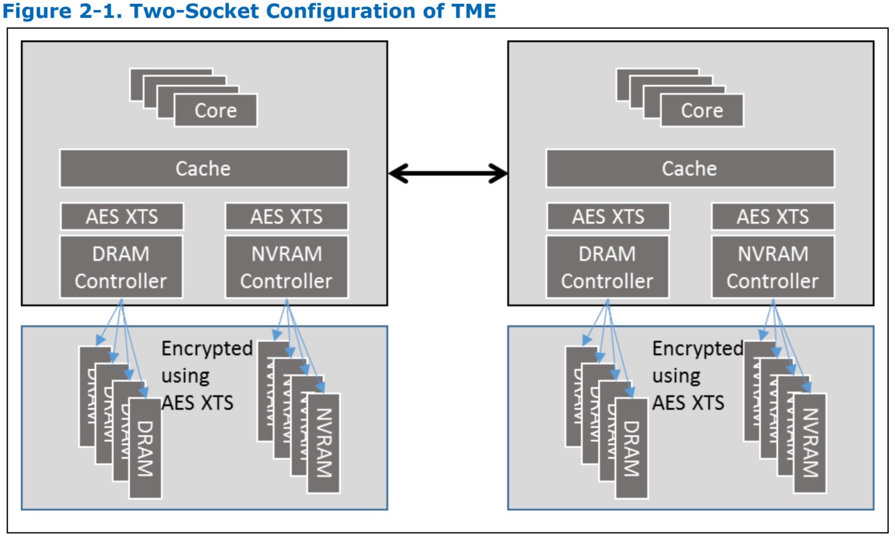
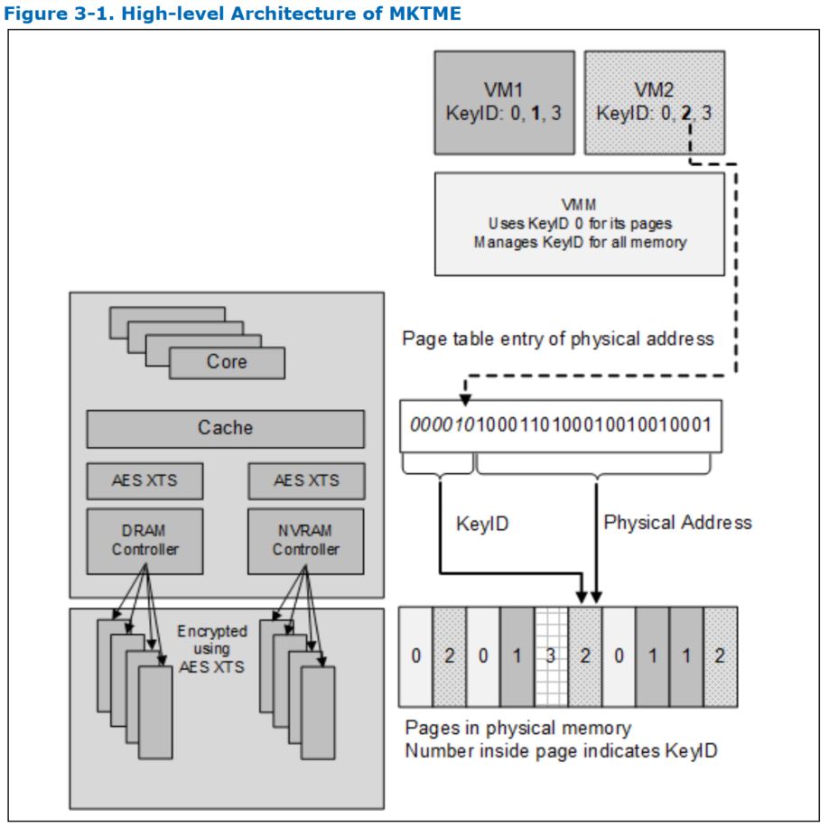
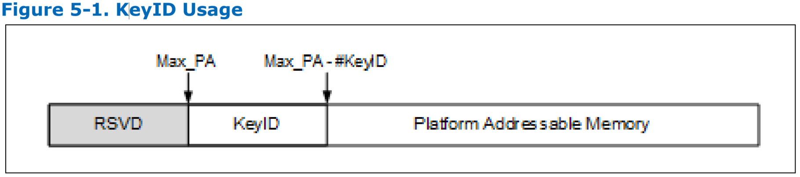
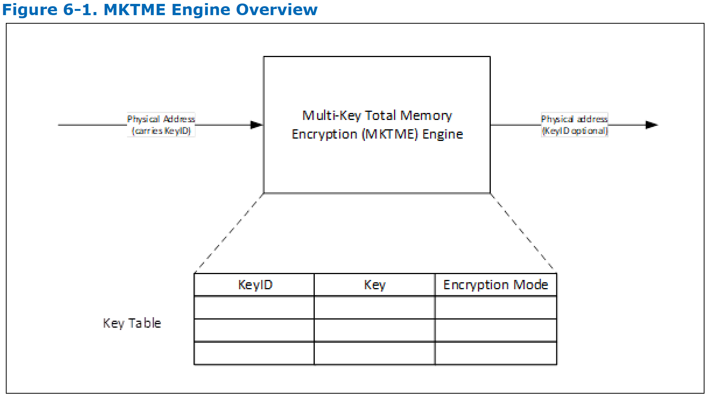

# Intel 内存加密技术

## 介绍
* 从 Intel® Xeon® Processor Scalable Family 开始支持的内存加密技术
* 注意，英特尔平台支持许多不同类型的内存，并非所有 SoC 都支持所有类型的内存的此功能
* 最初的实现集中在传统的 DRAM 上
* **Total Memory Encryption (TME)**：加密系统的整个物理内存的能力
  * 此功能通常在启动过程的早期阶段启用，只需对 BIOS 进行少量更改
  * 一旦配置和锁定，将使用 NIST 标准 AES-XTS 算法和 128 位 key 或 256 位 key 加密 SoC 外部存储器总线上的所有数据 ，具体选择哪种 key 取决于算法的可用性和选择
  * 用于 TME 的加密 key 是由 Intel SoC 中实现的硬件随机数生成器生成的，且无法通过软件或用 Intel SoC 的外部接口访问这些 key
  * TME 功能为外部存储器总线和 DIMM 提供 AES-XTS 保护
  * 该架构非常灵活，未来将支持额外的内存保护方案
  * 在启用时，该功能旨在支持（无需修改）现有系统和应用软件
  * 此功能对整体性能的影响可能相对较小，并且高度依赖于工作负载
* **Multi-Key Total Memory Encryption (MKTME)** 建立在 TME 之上，并增加了对多个加密 keys 的支持
  * SoC 实现支持固定数量的加密 key，软件可以配置 SoC 以使用可用 key 的一个子集
  * 软件管理 key 的使用，并且可以使用每个可用的 key 来加密内存的任何页面
  * 因此，MKTME 允许以 **页** 为粒度加密内存
  * 默认情况下，除非软件明确指定，否则 MKTME 使用 TME 加密 key
  * 除了支持 CPU 生成的临时 key（不能通过软件或使用 SoC 的外部接口访问），MKTME 还支持软件提供的 key
  * 当 *与非易失性存储器一起使用* 或 *与证明机制结合和/或与 key provisioning 服务* 一起使用时，软件提供的 key 特别有用
  * 在虚拟化场景中，我们预期 VMM 或 hypervisor 管理 key 的使用，以透明地支持 legacy 操作系统而无需任何更改（因此，在这种部署场景中，MKTME 也可以被视为 **TME 虚拟化**）
  * 操作系统可以在 native 和虚拟化环境中利用 MKTME 功能的额外优势
  * 正确地启用后，虚拟化环境中的每个 guest OS 都可以使用 MKTME，并且 guest OS 可以以 native OS 相同的方式利用 MKTME

## Total Memory Encryption (TME)

* **AES XTS 加密引擎** 位于到外部内存总线的直接数据通道中，因此，
  * 从内存总线上进入和/或离开 SoC 的所有内存数据都使用 AES XTS 进行加密
  * SoC 内部的数据（cache 等）仍然是明文的，并支持所有现有的软件和 I/O 模型
* 在典型部署中，加密 key 由 CPU 生成，因此对软件不可见
* 当系统配置有 NVRAM 时，
  * 如果要将 NVRAM 视为 DRAM，那么它也可以使用 CPU 生成的 key
  * 但是，如果要将 NVRAM 视为非易失性存储器，则可以选择在平台 power cycles/reboot 时生成/重用相同的 key

## Multi-Key Total Memory Encryption (MKTME)

* 上图显示了 MKTME 的基本架构，它与 TME 共享基本硬件架构，但 AES XTS 现在支持多个 keys
* 该图的右侧显示了 MKTME 在虚拟化环境中的使用，尽管架构也支持在本机操作系统部署场景中使用 MKTME
  * 在此示例中，我们展示了一个 hypervisor/VMM 和两个 VM
  * 默认情况下，hypervisor 使用 KeyID `0`（与 TME 相同），尽管它也可以为自己的内存使用不同的 KeyID
  * VM1 将 KeyID `1` 用于自己的私有页面，VM2 将 KeyID `2` 用于自己的私有页面
  * 此外，VM1 始终可以将 KeyID `0`（TME KeyID）用于任何页面，并且还选择将 KeyID `3`用于它自己和 VM2 之间的共享内存
* KeyID 包含在页表条目中，作为物理地址字段的高位
  * 如本例所示，显示了 KeyID `2`
  * 物理地址字段中的其余位用于实际寻址内存中的位
* 出于说明目的，该图显示了一种可能的页面分配以及 KeyID，尽管在这种情况下，hypervisor 可以完全自由地将任何 KeyID 与任何页面一起用于其自身或它的任何 guest VM
* 注意，在页表中 oversubscribing 物理地址位的想法也扩展到其他页表，包括 IA 页表和 IOMMU 页表
* KeyID 仍然是 SoC 中物理地址位的一部分，但对 AES XTS 和外部内存总线的调整除外
  * KeyID 不在 SoC 之外或在 AES XTS 的调整中使用

## TME & MKTME: Enumeration and Control Registers

### Enumeration
* TME 和 MKTME 功能通过本节中描述的 MSR 暴露给 BIOS/软件
* MKTME 处理器中可用/支持的最大 key 数目被枚举
* BIOS 将需要通过 MSR（稍后描述）激活此功能，并且它必须在早期引导过程中选择 MKTME 支持/使用的 key 的数量
* 激活后，连接到 CPU/SoC 的所有内存（TME 排除范围内的内存除外）都用 AES-XTS 进行加密，使用的 key 是由 CPU 在每次启动时生成的 128 位或 256 位临时 key（平台 key）
  * 注意，此行为仅在未 bypass TME 加密时适用（使用`IA32_TME_ACTIVATE MSR`中的第`31`位来控制）
  * 如果 bypass TME 加密（`IA32_TME_ACTIVATE MSR`中的第`31`位为`1`），则所有使用 KeyID0 的访问都将绕过加密/解密
* Intel 处理器支持外部内存控制器
  * 这些内存控制器可以通过 coherent buses 连接到处理器，例如 Intel® Ultra Path Interconnect（Intel® UPI）或 Compute Express Link（CXL）
  * MKTME 枚举可用于发现 Intel 处理器和连接到集成内存控制器的某些内存的功能，但不一定代表外部内存控制器功能，或连接到集成控制器的某些类型的内存
* 能够受 CPU 加密功能保护的内存区域，通过 UEFI 2.8 中引入的新 UEFI 内存属性`EFI_MEMORY_CPU_CRYPTO`，与系统软件进行通信
  * 如果设置了此标志，则内存区域能够受到 CPU 的内存加密功能的保护
  * 如果清除此标志，则内存区域无法使用 CPU 的内存加密功能进行保护，或者 CPU 不支持 CPU 内存加密功能
  * 系统软件必须查询属性以确定可以使用 MKTME 加密的范围

#### TME
* CPUID.TME (`CPUID.(EAX=07H, ECX=0H): ECX[13]`) 列举了这四个架构 MSR 的存在及其 MSR 地址：
  * `IA32_TME_CAPABILITY`   – 地址`981H`
  * `IA32_TME_ACTIVATE`     – 地址`982H`
  * `IA32_TME_EXCLUDE_MASK` – 地址`983H`
  * `IA32_TME_EXCLUDE_BASE` – 地址`984H`

#### Multi-key TME
* CPUID.TME 位指示存在`TME_CAPABILITY`MSR，并且该 MSR 将进一步枚举 *TME 的特性* 以及 *MKTME 的可用性和特性*
* MKTME 由 BIOS 使用`IA32_TME_ACTIVATE` MSR启用/配置
* **MKTME 需要 TME，因此如果不启用 TME 就无法启用**

#### 内存加密能力 MSR（IA32_TME_CAPABILITY）
##### `IA32_TME_CAPABILITY MSR` – 地址`981H`

架构 MSR 名称和位域         | MSR/位描述                      | 注释
--------------------------|---------------------------------|--------------------
`IA32_TME_CAPABILITY` MSR | 内存加密能力 MSR                 | TME 和 MKTME 的 MSR
0                         | 支持 AES-XTS 128 位加密算法      | NIST 标准
1                         | 保留                            |
2                         | 支持 AES-XTS 256 位加密算法      | NIST 标准
30:3                      | 保留                            |
31                        | bypass TME 加密支持             |
35:32                     | `MK_TME_MAX_KEYID_BITS` 可以被分配用作 MKTME 的 KeyID 的位数，<br>如不支持 MKTME 则为零 | `4`位允许最大值为`15`，因此可以支持`2^15 = 32K`个 keys
50:36                     | `MK_TME_MAX_KEYS` 可供使用的最大 key 数目，<br>该值可能不是 2 的幂，<br>如不支持 MKTME 则为零 | KeyID 0 是专门保留的，在此不考虑。<br>最大值为`32K-1`个 keys
63:51                     | 保留                            |

#### CPUID 报告的 MAX_PA_WIDTH
CPUID 枚举的 `MAX_PA_WIDTH`（leaf `80000008.EAX`）不受 MKTME 激活的影响，并且将继续报告可供软件使用的物理地址位的最大数量，而与 KeyID 位的数量无关

### 内存加密配置及状态寄存器
#### 激活 MSR（IA32_TME_ACTIVATE）
* 此 MSR 用于锁定以下 MSR
  * `IA32_TME_ACTIVATE`
  * `IA32_TME_EXCLUDE_MASK`
  * `IA32_TME_EXCLUDE_BASE`
* 锁定后，忽略对以上 MSR 的任何写入
* 当 CPU 复位时，锁也会复位
* 注意：`IA32_TME_EXCLUDE_MASK`和`IA32_TME_EXCLUDE_BASE MSR`期望在配置`IA32_TME_ACTIVATE` MSR 之前被配置
* 要启用 MKTME，必须设置`IA32_TME_ACTIVATE` MSR 中的 **硬件加密启用位**，并且第`35:32`位必须具有非零值（在此指定为 MKTME 配置的 KeyID 位的数量）

##### `IA32_TME_ACTIVATE` MSR – 地址`982H`

架构 MSR 名称和位域         | MSR/位描述                      | 注释
--------------------------|---------------------------------|--------------------
`IA32_TME_ACTIVATE` MSR   | 内存加密激活 MSR                 |
0                         | Lock RO - `WRMSR`成功时被设置；<br>往该位写值会被忽略 |
1                         | 硬件加密使能（TME 的使能依赖于 TME Encryption Bypass Enable 位（`bit 31`）的设置）| 该位也启用 MKTME；不使能硬件加密也无法启用 MKTME
2                         | Key 选择：<br>`0`- 创建一个新的 TME key（冷/热启动）<br>`1`- 从存储中恢复 TME key（从待机恢复）|
3                         | 为待机保存 TME key：将 key 保存到存储中以在从待机状态恢复时使用 | 可能并非所有 CPU 都支持
7:4                       | TME 策略/加密算法：<br>仅允许`IA32_TME_CAPABILITY` MSR 中列举的算法<br>例如：<br> `0000` – AES-XTS-128 <br> `0010` – AES-XTS-256<br> 其他值无效 | 要使用的 TME 加密算法
30:8                      | 保留                            |
31                        | 启用加密硬件时的 TME Encryption Bypass Enable 位<br>- 当此位设置为`0`时，使用基于硬件随机数生成器的 CPU 生成的临时密钥启用 TME <br>- 当该位设置为`1`时，将 bypass TME（对 KeyID0 不加密/解密） <br>在某些处理器上，bypassing TME 加密可以避免解密或加密和解密的延迟，为使用 KeyID 0 进行的访问提供性能优势 <br>软件必须检查硬件加密启用位（`bit 1`）和 TME Encryption Bypass Enable 位（`bit 31`）以确定是否启用了 TME 加密
35:32                     | 如果未枚举 MKTME，则保留 <br>`MK_TME_KEYID_BITS` 分配给 MKTME 使用的 KeyID 位数 <br>与枚举类似，这是一个编码值 <br>写入大于 `MK_TME_MAX_KEYID_BITS`的值将导致`#GP` <br>如果`EAX`（硬件加密启用）的第`1`位也未设置为`1`，则向该域写入非零值将`#GP`，因为必须启用加密硬件才能使用 MKTME | 示例：要支持`255`个 keys，则将该域将设置为`8`
47:36                     | 保留                            |
63:48                     | `MK_TME_CRYPTO_ALGS` <br>`Bit 48`: AES-XTS 128 <br>`Bit 49`: 保留 <br>`Bit 50`: AES-XTS-256 <br>`Bit 63:51`: 保留（`#GP`）| 用于设置 MKTME 允许使用哪些加密算法的 BIOS 的位掩码，稍后将由 key loading ISA 强制执行（`1` = 允许）

#### IA32_TME_ACTIVATE WRMSR 响应和错误处理

条件                                                       | 响应
-----------------------------------------------------------|------------------------------------
未枚举时 WRMSR                                             | `#GP`
锁定状态 =`1`时的 WRMSR                                     | `#GP`
WRMSR`63:8`（保留）≠ `0`                                    | `#GP`
WRMSR 不支持的策略值（`IA32_TME_CAPABILITY[IA32_TME_ACTIVATE[7:4]]=0`）| `#GP`
WRMSR enabled=`0`                                          | 禁用 TME，锁定 MSR，随后`RDMSR`返回`x..x01b`
WRMSR enabled=`1`且 key select=`0`（新 key）；RNG 成功       | 启用 TME，锁定 MSR，随后`RDMSR`返回`x..x011b`
WRMSR enabled=`1`且 key select=`0`；RNG 失败                | 未启用，随后`RDMSR`返回`x..x000b`
WRMSR enabled=`1`且 key select=`1`；从 CPU 恢复非零 key      | 启用 TME，锁定 MSR，随后`RDMSR`返回`x..x111b`
WRMSR enabled=`1`且 key select=`1`；失败 - 从 CPU 恢复零 key | 未启用，随后`RDMSR`返回`x..x100b`
WRMSR 任何其他合法值                                         | 后续`RDMSR`返回写入的值 + 锁定状态 =`1`
如果`MK_TME_KEYID_BITS` > `MK_TME_MAX_KEYID_BITS`           | `#GP`
如果`MK_TME_KEYID_BITS > 0` && `(TME) Enable == 0`（TME 必须与 MK-TME 在同一点启用）| `#GP`
如果`MK_TME_KEYID_BITS > 0`且 TME 未成功激活（未设置锁定）    | 写入未提交
如果设置了`MK_TME_CRYPTO_ALGS`保留位                         | `#GP`

#### 核心地址屏蔽 MSR（MK_TME_CORE_ACTIVATE）
* `MK_TME_CORE_ACTIVATE` MSR 仅 BIOS 能使用
* 使用`IA32_TME_ACTIVATE` MSR 成功激活后，`MK_TME_CORE_ACTIVATE`寄存器应写入每个物理内核，`EDX:EAX`中的值为`0`；如果不这样做可能会导致不可预知的行为
* 如果不支持 MKTME，则访问此 MSR 将`#GP`
* 执行 MKTME 激活后，BIOS 预期会在每个内核上写入此 MSR
* 每个内核上的第一个 SMI 也会导致以 package MSR 值进行同步
##### `MK_TME_CORE_ACTIVATE` MSR – 地址`9FFH`

架构 MSR 名称和位域         | MSR/位描述                       | 注释
---------------------------|---------------------------------|--------------------
`MK_TME_CORE_ACTIVATE` MSR | 如果不支持 MKTME 该 MSR 会`#GP`  |
31:0                       | 保留                            |
35:32                      | `MK_TME_KEYID_BITS`（只读） <br>分配给 MKTME 使用的 KeyID 位数 <br>与枚举类似，这是一个编码值 <br>这是一个只读字段。写入非零 产生`#GP` | 将在写入时从 package MSR 值中隐藏
63:36                      | 保留                            |

#### 排除范围 MSRs
* TME 和 MKTME（仅适用于 KeyID=`0`）支持一个排除范围以用于特殊情况
  * 注意：对于除`0`以外的所有 KeyID，TME 排除范围不适用于 MKTME
  * （注：感觉不能和 TME Encryption Bypass Enable 一起用？）
* 本 MSR 中指定的物理地址范围不应用本文档中描述的内存加密
* 此范围主要用于操作系统不可用且通常由 BIOS 配置的内存
* 但是，TME/MKTME（对于 KeyID=`0`）架构对排除范围的使用没有任何限制
* 该软件能够通过读取 MSR 来确定这个范围
* 该范围的定义遵循 Intel 处理器中实现的许多范围寄存器的定义
##### `IA32_TME_EXCLUDE_MASK` MSR – 地址`983H`

架构 MSR 名称和位域          | MSR/位描述                       | 注释
----------------------------|---------------------------------|--------------------
`IA32_TME_EXCLUDE_MASK` MSR |                                 |
10:0                        | 保留                            |
11                          | `Enable` - 当设置为`1`时，`IA32_TME_EXCLUDE_BASE`和`IA32_TME_EXCLUDE_MASK` MSR 用于定义 TME/MKTME 的排除区域（对于 KeyID=`0`）|
MAXPHYSADDR-1:12            | `TMEEMASK` - 此域指示必须与`TMEEBASE`匹配的位，以便有资格作为 TME/MKTME（对于 KeyID=`0`）排除内存范围访问 |
63:MAXPHYSADDR              | 保留；必须为零                    |

##### `IA32_TME_EXCLUDE_BASE` MSR – 地址`984H`

架构 MSR 名称和位域          | MSR/位描述                       | 注释
----------------------------|---------------------------------|--------------------
`IA32_TME_EXCLUDE_BASE` MSR |                                 |
11:0                        | 保留                            |
MAXPHYSADDR-1:12            | `TMEEBASE` - 排除 TME/MKTME（对于 KeyID=`0`）加密的物理基地址 |
63:MAXPHYSADDR              | 保留；必须为零                    |

* 注意：将`1`写入超出 *最大支持物理大小* 的位将导致`#GP`
* `IA32_TME_EXCLUDE_MASK` MSR 必须定义一个连续区域
  * 如果`TMEEMASK`域未指定连续区域，`WRMSR`将`#GP`
* 这些 MSR 被`IA32_TME_ACTIVATE` MSR 锁定
  * 如果`lock=1`，则`WRMSR`到`IA32_TME_EXCLUDE_MASK/IA32_TME_EXCLUDE_BASE` MSR 将导致`#GP`
  * （注：意思是需要在激活 TME 前就设置好？）

## MKTME 运行时的行为
* 在 BIOS 激活 MKTME 后，本节将描述处理器的运行时行为有许多变化

### 更改物理地址规范
* MKTME 最显着的变化是重新调整（repurposing）物理地址位的用途，以将 KeyID 传递给内存控制器（s）中的加密引擎（s）
* 此更改需要进行许多其他硬件和软件更改才能保持正确的行为
* 激活 MKTME 时，平台物理地址的高位（从`CPUID MAX_PA`信息枚举的可用最高位开始）重新用作 KeyID，如下所示
  

#### IA 分页
* 当在没有 EPT 的情况下使用 IA 分页时，IA 页表的每一级以`MAX_PA`开头的高位重新用作 KeyID 位
* 类似地，`CR3`中物理地址的高位将以相同的方式处理
* 注意，当 EPT 处于活动状态时，IA 分页不会生成/使用平台物理地址，而是生成/使用 guest 物理地址
* Guest 物理地址不会被 MKTME 修改，并且会像启用 MKTME 之前那样，继续索引到 EPT 页表遍历

#### EPT 分页
* 在 VMX non-root 操作期间启用 EPT 时，EPT 页面遍历的每一级的高位都重新用作 KeyID 位
* 类似地，EPTP（pointer）中物理地址的高位将以相同的方式处理
* 注意，guest OS 也可以在 IA 页面地址中使用 KeyID，并且 EPT 使用完整的 guest PA（包括 KeyID）

#### 其他物理地址
* 其他物理寻址结构，如 VMCS 指针、物理寻址位图等，将接受类似的处理，以 MAX PA 开始的地址的高位被重新用作 KeyID 位
* 注意，任何保留位检查保持不变，这意味着这些地址的检查将仅基于`CPUID MAX_PA`值

## MKTME Key 编程

### 概览

* MKTME 引擎维护一个软件无法访问的内部 key table，用于存储与每个 KeyID 关联的信息（key 和加密模式）。
* 每个 KeyID 可能与三种加密模式相关联：
  * 使用指定的密钥加密
  * 根本不加密（内存将是明文）
  * 使用 TME 密钥加密
* 未来的实现可能会支持其他加密模式。
* `PCONFIG`是用于为 MKTME 编程 KeyID 属性的新指令
  * 虽然初始实现可能仅将`PCONFIG`用于 MKTME，但它可能会在未来扩展以支持其他用途
  * 因此，`PCONFIG`与 MKTME 分开列举
### PCONFIG 指令
#### PCONFIG 指令细节

操作码      | 指令      | 描述
-----------|-----------|-------------
`0F 01 C5` | `PCONFIG` | 该指令用于执行配置平台特性的功能 <br>`EAX`：被调用的 Leaf function <br>`RBX/RCX/RDX`：特定 leaf 的用途

#### PCONFIG 描述
* `PCONFIG`指令由软件调用以配置平台功能
* `PCONFIG` 支持多个 leaves，通过在`EAX`中设置适当的 leaf value 来调用 leaf function
* `RBX`、`RCX`和`RDX`具有特定 leaf 的用途
* 尝试执行未定义的 leaf 会导致`#GP(0)`
* `PCONFIG` 是一个 package scoped 指令，同样，每个物理 package 都需要执行一次以配置所需的平台功能
* 地址和操作数在 64 位模式之外是 32 位（`IA32_EFER.LMA = 0 || CS.L = 0`），在 64 位模式下是 64 位 (`IA32_EFER.LMA = 1 && CS.L = 1`)
* `CS.D` 的值对地址计算没有影响
* `DS`段用于创建线性地址

##### PCONFIG Leaf 编码

Leaf                | 编码                    | 描述
--------------------|-------------------------|--------
`MKTME_KEY_PROGRAM` | `0x00000000`            | 该 leaf 用于对 *和 KeyID 关联的 key 和加密模式* 进行编程
保留                | `0x00000001-0xFFFFFFFF` | 保留供将来使用（如果使用`#GP(0)`）

* 一个 **`PCONFIG`目标（target）** 定义为平台上可以使用`PCONFIG`配置的任何硬件 block
  * 每个`PCONFIG`目标都与一个数字化的目标标识符（target identifier）相关联（Vol. 2B 4-277）
  * 在`CPUID (EAX = 1BH) `的 PCONFIG-information leaf 的 sub-leaves 中，枚举了支持的目标标识符以及其他`PCONFIG`功能（Vol. 2B 4-277）
    * 当`CPUID`在`EAX`设置为`1BH`的情况下执行时，处理器返回有关`PCONFIG`功能的信息，此 sub-leaves 信息在`ECX`的值（从`0`开始）中枚举（Vol. 2A 3-247）
* `PCONFIG`目前只支持一个目标，MKTME
##### PCONFIG 目标
目标标识符      | 值                      | 描述
---------------|-------------------------|--------
INVALID_TARGET | `0x00000000`            | 无效的目标 ID
MKTME          | `0x00000001`            | MKTME 引擎
保留           | `0x00000002-0xFFFFFFFF` | 保留供将来使用

##### MKTME_KEY_PROGRAM Leaf

* 软件使用`PCONFIG`的`MKTME_KEY_PROGRAM` leaf 来管理与 KeyID 关联的 key
* 通过以下设置来调用 leaf function
  * 在`EAX`中设置 leaf value `0`
  * 在`RBX`中设置`MKTME_KEY_PROGRAM_STRUCT`的地址
* leaf 的成功执行将清除`RAX`（设置为零）并且清除 `ZF`、`CF`、`PF`、`AF`、`OF`和`SF`
* 如果发生故障，`RAX`中会指示故障原因，其中`ZF`设置为`1`，并且清除 `CF`、`PF`、`AF`、`OF`和`SF`
* `MKTME_KEY_PROGRAM` leaf 使用内存中的`MKTME_KEY_PROGRAM_STRUCT`工作
###### MKTME_KEY_PROGRAM_STRUCT 格式

域             | 偏移（bytes）| 大小（bytes）| 注释
---------------|-------------|-------------|-----------
KEYID          | 0           | 2           | Key 标识符
KEYID_CTRL     | 2           | 4           | KeyID 控制：<br>- `Bits [7:0]`: 命令<br>- `Bits [23:8]`：加密算法<br>- `Bits [31:24]`：保留；必须为零
RSVD           | 6           | 58          | 保留；必须为零
KEY_FIELD_1    | 64          | 64          | 软件提供的 KeyID data key 或 KeyID data key 的熵
KEY_FIELD_2    | 128         | 64          | 软件提供的 KeyID tweak key 或 KeyID tweak key 的熵

###### KEYID
* 被编程到 MKTME 引擎中的 key 标识符

###### KEYID_CTRL
* `KEYID_CTRL` 域携带软件用来控制 KeyID 行为的两个子域：`命令`和`KeyID 加密算法`
* 使用的 *命令* 控制 *KeyID 的加密模式*
* 支持的 key 编程命令

命令                   | 编码                    | 描述
-----------------------|-------------------------|-----------------------------------------
`KEYID_SET_KEY_DIRECT` | 0                       | 软件使用此模式直接对 key 进行编程与 KeyID 一起使用
`KEYID_SET_KEY_RANDOM` | 1                       | CPU 生成并分配一个临时 key 与 KeyID 一起使用 <br>每次执行指令时，CPU 都会使用硬件随机数生成器生成一个新 key，并在 reset 时丢弃这些 key
`KEYID_CLEAR_KEY`      | 2                       | 清除与 KeyID 关联的（软件编程的）key <br>执行此命令时，KeyID 获取 TME 行为（使用平台 TME key 加密或 bypass TME 加密）
`KEYID_NO_ENCRYPT`     | 3                       | 使用此 KeyID 时不加密内存

* 密码算法域（`CRYPTO_ALG`）允许软件为 KeyID 选择一种激活的密码算法
* 如前所述，BIOS 可以激活一组算法，以便在使用`IA32_TME_ACTIVATE` MSR 对 keys 进行编程时使用（不适用于 *在未 bypass TME 加密时* 使用 TME 策略的 KeyID 0）
* ISA 检查以确保软件选择的算法是已被 BIOS 激活的算法之一
* 注意，软件需要在此域中提供一种激活的算法，包括`KEYID_CLEAR_KEY`和`KEYID_NO_ENCRYPT`命令

###### KEY_FIELD_1

* 如果使用直接 key 编程选项（`KEYID_SET_KEY_DIRECT`），则该域携带由软件提供的用于 KeyID 的 data key
* 当使用随机 key 编程选项（`KEYID_SET_KEY_RANDOM`）时，该域携带软件提供的熵，以混合在 CPU 生成的随机 data key 中
* 确保 *为直接编程选项提供的 key* 或 *为随机编程选项提供的熵* 不会导致 *weak key*，是软件的责任
* 指令中没有明确的检查来检测或防止 weak keys
* 使用 AES XTS-128 时，高位`48B`被视为保留，必须在执行指令之前由软件清零
* 使用 AES XTS-256 时，高位`32B`被视为保留，必须在执行指令之前由软件清零

###### KEY_FIELD_2

* 如果使用直接 key 编程选项（`KEYID_SET_KEY_DIRECT`），则该域携带由软件提供的用于 KeyID 的 tweak key
* 当使用随机 key 编程选项（`KEYID_SET_KEY_RANDOM`）时，该域携带软件提供的熵，以混合在 CPU 生成的随机 tweak key 中
* 确保 *为直接编程选项提供的 key* 或 *为随机编程选项提供的熵* 不会导致 *weak key*，是软件的责任
* 指令中没有明确的检查来检测或防止 weak keys
* 使用 AES XTS-128 时，高位`48B`被视为保留，必须在执行指令之前由软件清零
* 使用 AES XTS-256 时，高位`32B`被视为保留，必须在执行指令之前由软件清零

* 所有 KeyID 在 MKTME 激活时，默认为 TME 行为（使用 TME key 加密或 bypass 加密）
* 软件可以随时决定使用`PCONFIG`指令更改 KeyID 的 key
* 更改 KeyID 的 key 不会更改 TLB、caches 或 memory pipeline 的状态
* 软件有责任采取适当的措施来确保行为正确（改 key 之前刷 cache 是否足够？key 变了读回来时还能解得开吗？）
* 在指令执行时，`RAX`会填充返回值
###### `MKTME_KEY_PROGRAM` 的编程状态

返回值                 | 编码 | 描述
----------------------|------|----------------
PROG_SUCCESS          | 0    | KeyID 已成功编程
INVALID_PROG_CMD      | 1    | 无效的 KeyID 编程命令
ENTROPY_ERROR         | 2    | 熵不足
INVALID_KEYID         | 3    | KeyID 无效
INVALID_CRYPTO_ALG    | 4    | 选择的加密算法无效（不支持）
DEVICE_BUSY           | 5    | 访问密钥表失败

#### PCONFIG 虚拟化

* VMX root 模式下的软件可以使用 *为`PCONFIG`引入的以下执行控制* 来控制`VMX` non-root 模式下`PCONFIG`的执行：
  * `PCONFIG_ENABLE`：此控制为单一 bit 的控制，在 VMX non-root 模式下启用`PCONFIG`指令
    * 如果为`0`，则在 VMX non-root 模式下执行`PCONFIG`会导致`#UD`
    * 否则，`PCONFIG`的执行将根据`PCONFIG_EXITING`进行
    * 辅助执行控制的`VM-exit` 27 被分配给`PCONFIG_ENABLE`
  * `PCONFIG_EXITING`：这是一个`64b`控制，允许 VMX root 模式为`PCONFIG`的各种 leaf function 来 VM-exit
    * 如果`PCONFIG_ENABLE`控制被清除，则此控件没有任何效果
    * VMCS 索引`0x203E/0x203F`（`64b`控制域）分配给`PCONFIG_EXITING` 

#### PCONFIG Enumeration
* `PCONFIG`在扩展特性中被枚举（`CPUID.(EAX=07H, ECX=0H):EDX[18]`）
  * 当为`0`时，`PCONFIG`将`#UD`
  * 一个新的 CPUID leaf，`PCONFIG_LEAF`（leaf 编码 `1BH`），返回`PCONFIG`信息
  * 更具体地说，sub-leaf `n (n ≥ 0)`返回信息
* 期望软件会扫描所有 sub-leaves 以获取有关平台上支持的所有目标的信息
* 还需要注意的是，同一目标的 sub-leaves 不必是连续的

##### CPUID.PCONFIG_LEAF.n (n ≥ 0)
* 返回有关平台上支持的目标的信息
* 返回的信息如下所示：
  * `EAX`: Sub-leaf 类型
    * `Bits 11:0`: 
      * `0`: Invalid sub-leaf
      * `1`: Target Identifier
  * If EAX[11:0] == 0
    * EAX:EBX:ECX:EDX = 0
    * Sub-leaves `m>n` return all 0s
  * If EAX[11:0] == 1
    * EAX[31:12] = 0
    * EBX: Target_ID_1
    * ECX: Target_ID_2
    * EDX: Target_ID_3
* 预计软件会扫描所有 sub-leaves，直到返回一个无效的 sub-leaf
* 第一个无效 sub-leaf 之后的所有 sub-leaf 也无效

#### PCONFIG 并发

* 在`PCONFIG`的`MKTME_KEY_PROGRAM` leaf 在多个逻辑处理器上并发执行的情况下，只有一个逻辑处理器会成功更新 key table
  * `PCONFIG`执行将在其他逻辑处理器上返回错误码（`DEVICE_BUSY`），并且软件必须重试
  * 在指令执行失败并出现`DEVICE_BUSY`错误码的情况下，不会更新 key table，从而确保使用 KeyID 的信息完整更新 key table，或者根本不更新 key table
* 为了实现这一点，`PCONFIG`的`MKTME_KEY_PROGRAM` leaf 维护了一个用于更新 key table 的写锁
  * 该锁称为 **key table lock**，在指令流中表示为`KEY_TABLE_LOCK`
* 当没有逻辑处理器持有锁时（也是锁的初始状态），或者逻辑处理器试图在独占状态下更新 key table 时，锁可以被解锁
  * 只能有一个逻辑处理器将锁保持在独占状态
  * 锁是独占的，只有在锁处于解锁状态时才能获取
* `PCONFIG`使用以下语法以独占模式获取`KEY_TABLE_LOCK`，并释放锁：
  * `KEY_TABLE_LOCK.ACQUIRE(WRITE)`
  * `KEY_TABLE_LOCK.RELEASE()`

#### PCONFIG 操作
##### 变量定义
变量名                    | 类型                       | 大小（Bytes）| 描述
-------------------------|----------------------------|--------------|-------------------------
`TMP_KEY_PROGRAM_STRUCT` | `MKTME_KEY_PROGRAM_STRUCT` | 192          | 持有 key 编程结构的结构体
`TMP_RND_DATA_KEY`       | `UINT128`                  | 32           | 为随机 key 编程选项生成随机 data key
`TMP_RND_TWEAK_KEY`      | `UINT128`                  | 32           | 为随机 key 编程选项生成随机 tweak key

```c
(* #UD if PCONFIG is not enumerated or CPL>0 *)
if (CPUID.7.0:EDX[18] == 0 OR CPL > 0) #UD;

if (in VMX non-root mode)
{
    if (VMCS.PCONFIG_ENABLE == 1)
    {
        if ((EAX > 62 AND VMCS.PCONFIG_EXITING[63] == 1) OR
            (EAX < 63 AND VMCS.PCONFIG_EXITING[EAX] == 1))
        {
            Set VMCS.EXIT_REASON = PCONFIG; //No Exit qualification
            Deliver VMEXIT;
        }
    }
    else
    {
        #UD
    }
}

(* #GP(0) for an unsupported leaf *)
if (EAX != 0) #GP(0)

(* KEY_PROGRAM leaf flow *)
if (EAX == 0)
{
    (* #GP(0) if TME_ACTIVATE MSR is not locked or does not enable hardware encryption or multiple keys are not enabled *)
    if (IA32_TME_ACTIVATE.LOCK != 1 OR IA32_TME_ACTIVATE.ENABLE != 1 OR
        IA32_TME_ACTIVATE.MK_TME_KEYID_BITS == 0) #GP(0)

    (* Check MKTME_KEY_PROGRAM_STRUCT is 256B aligned *)
    if (DS:RBX is not 256B aligned) #GP(0);
    
    (* Check that MKTME_KEY_PROGRAM_STRUCT is read accessible *)
    <<DS: RBX should be read accessible>>
    
    (* Copy MKTME_KEY_PROGRAM_STRUCT to a temporary variable *)
    TMP_KEY_PROGRAM_STRUCT = DS:RBX.*;
    
    (* RSVD field check *)
    if (TMP_KEY_PROGRAM_STRUCT.RSVD != 0) #GP(0);
    
    if (TMP_KEY_PROGRAM_STRUCT.KEYID_CTRL.RSVD !=0) #GP(0);
    
    if (TMP_KEY_PROGRAM_STRUCT.KEYID_CTRL.ENC_ALG[0] == 1)
    {
        if (TMP_KEY_PROGRAM_STRUCT.KEY_FIELD_1.BYTES[63:16] != 0) #GP(0);
        if (TMP_KEY_PROGRAM_STRUCT.KEY_FIELD_2.BYTES[63:16] != 0) #GP(0);
    }

    if (TMP_KEY_PROGRAM_STRUCT.KEYID_CTRL.ENC_ALG[2] == 1)
    {
        if (TMP_KEY_PROGRAM_STRUCT.KEY_FIELD_1.BYTES[63:32] != 0) #GP(0);
        if (TMP_KEY_PROGRAM_STRUCT.KEY_FIELD_2.BYTES[63:32] != 0) #GP(0);
    }

    (* Check for a valid command *)
    if (TMP_KEY_PROGRAM_STRUCT.KEYID_CTRL.COMMAND is not a valid command)
    {
        RFLAGS.ZF = 1;
        RAX = INVALID_PROG_CMD;
        goto EXIT;
    }

    (* Check that the KEYID being operated upon is a valid KEYID *)
    if (TMP_KEY_PROGRAM_STRUCT.KEYID > 2^IA32_TME_ACTIVATE.MK_TME_KEYID_BITS – 1
        OR TMP_KEY_PROGRAM_STRUCT.KEYID > IA32_TME_CAPABILITY.MK_TME_MAX_KEYS
        OR TMP_KEY_PROGRAM_STRUCT.KEYID == 0)
    {
        RFLAGS.ZF = 1;
        RAX = INVALID_KEYID;
        goto EXIT;
    }

    (* Check that only one algorithm is requested for the KeyID and it is One of the activated algorithms *)
    if (NUM_BITS(TMP_KEY_PROGRAM_STRUCT.KEYID_CTRL.CRYPTO_ALG) != 1 ||
        (TMP_KEY_PROGRAM_STRUCT.KEYID_CTRL.CRYPTO_ALG &
        IA32_TME_ACTIVATE.MK_TME_CRYPTO_ALGS == 0))
    {
        RFLAGS.ZF = 1;
        RAX = INVALID_CRYPTO_ALG;
        goto EXIT;
    }

    (* Try to acquire exclusive lock *)
    if (NOT KEY_TABLE_LOCK.ACQUIRE(WRITE))
    {
        //PCONFIG failure
        RFLAGS.ZF = 1;
        RAX = DEVICE_BUSY;
        goto EXIT;
    }

    (* Lock is acquired and key table will be updated as per the command
       Before this point no changes to the key table are made *)
    switch(TMP_KEY_PROGRAM_STRUCT.KEYID_CTRL.COMMAND)
    {
    case KEYID_SET_KEY_DIRECT:
        <<Write
          DATA_KEY=TMP_KEY_PROGRAM_STRUCT.KEY_FIELD_1,
          TWEAK_KEY=TMP_KEY_PROGRAM_STRUCT.KEY_FIELD_2,
          ENCRYPTION_MODE=ENCRYPT_WITH_KEYID_KEY,
          to MKTME Key table at index TMP_KEY_PROGRAM_STRUCT.KEYID
        >>
        break;

    case KEYID_SET_KEY_RANDOM:
        TMP_RND_DATA_KEY = <<Generate a random key using hardware RNG>>
        if (NOT ENOUGH ENTROPY)
        {
            RFLAGS.ZF = 1;
            RAX = ENTROPY_ERROR;
            goto EXIT;
        }
        TMP_RND_TWEAK_KEY = <<Generate a random key using hardware RNG>>
        if (NOT ENOUGH ENTROPY)
        {
            RFLAGS.ZF = 1;
            RAX = ENTROPY_ERROR;
            goto EXIT;
        }

        (* Mix user supplied entropy to the data key and tweak key *)
        TMP_RND_DATA_KEY = TMP_RND_KEY XOR
            TMP_KEY_PROGRAM_STRUCT.KEY_FIELD_1.BYTES[15:0];
        TMP_RND_TWEAK_KEY = TMP_RND_TWEAK_KEY XOR
            TMP_KEY_PROGRAM_STRUCT.KEY_FIELD_2.BYTES[15:0];

        <<Write
          DATA_KEY=TMP_RND_DATA_KEY
          TWEAK_KEY=TMP_RND_TWEAK_KEY,
          ENCRYPTION_MODE=ENCRYPT_WITH_KEYID_KEY,
          to MKTME_KEY_TABLE at index TMP_KEY_PROGRAM_STRUCT.KEYID
        >>
        break;

    case KEYID_CLEAR_KEY:
        <<Write
          DATA_KEY=’0,
          TWEAK_KEY=’0,
          ENCRYPTION_MODE = ENCRYPT_WITH_TME_KEY_OR_BYPASS,
          to MKTME_KEY_TABLE at index TMP_KEY_PROGRAM_STRUCT.KEYID
        >>
        break;

    case KEYID_NO_ENCRYPT:
        <<Write
          DATA_KEY=’0,
          TWEAK_KEY=’0,
          ENCRYPTION_MODE=NO_ENCRYPTION,
          to MKTME_KEY_TABLE at index TMP_KEY_PROGRAM_STRUCT.KEYID
        >>
        break;
    }

    RAX = 0;
    RFLAGS.ZF = 0;

    //Release Lock
    KEY_TABLE_LOCK(RELEASE);

EXIT:
    RFLAGS.CF=0;
    RFLAGS.PF=0;
    RFLAGS.AF=0;
    RFLAGS.OF=0;
    RFLAGS.SF=0;
}
end_of_flow
```

#### Flags 影响
* `ZF`
  * 如果指令成功完成则清零
  * 如果发生错误则设置。`RAX`设置为错误代码
* `CF, PF, AF, OF, SF`：清除

#### 前缀的使用
* `LOCK`：引起`#UD`
* `REP*`：引起`#UD`（包括`REPNE/REPNZ`和`REP/REPE/REPZ`）
* Operand size：引起`#UD`
* `VEX`：引起`#UD`
* Segment overrides：忽略
* Address size：忽略
* `REX`：忽略

## 软件生命周期：用 KeyID 管理页面
### 概览
* 如文档前面所述，KeyID 是物理地址的组成部分，这意味着它不仅存在于页表中，还存在于 TLB、cache 中
* 因此，软件需要意识到这一点，并且必须采取适当的步骤来维护操作的正确性和安全性
* 注意，虽然本节侧重于虚拟化场景，但 TME 和 MKTME 架构适用于 native OS 和虚拟化环境，以及 DRAM 和 NVRAM 类型的内存

### 限制和 Cache 管理
* 硬件/CPU 不会在 *具有不同 KeyID 或加密 key 的同一物理页面的映射之间* 强制执行一致性
* 系统软件负责仔细管理有关 key 标识符（KeyID）使用的 caches，并在软件更改 *与物理页面关联的 KeyID 或 key 时* 维护 cache 一致性
* 具体来说，CPU 会将 *除了 KeyID 位之外相同的两个物理地址* 视为 *两个不同的物理地址*，尽管这两个地址引用内存中的相同位置
* 软件必须采取必要的步骤来确保这不会导致不可预测或不正确的行为，或违反所需的安全属性
* MKTME 保留整个物理地址的 caches 和 TLB 的现有行为，包括物理地址的 KeyID 部分，并期望软件正确 flush cache 和/或执行 TLB shootdowns
* 以下部分旨在提供软件不应使用的算法示例，以确保正确性和安全性
* 请查看本规范的最终版本，了解该领域的任何更新算法或要求

### 处理别名地址映射的通用软件指南
以下列表详细说明了 OS/VMM 软件 vendors 在使用有多个（默认是一个） KeyID 的 MKTME 时要考虑的一些一般准则
1. 软件应避免将同一个物理地址映射到多个 KeyID
2. 如果软件必须将同一个物理地址映射到多个 KeyID，则应将那些页面标记为只读，一个 KeyID 除外
3. 如果软件必须将同一个物理地址映射到多个 KeyID 作为读写，那么软件必须确保所有写入都用一个 KeyID 完成（这包括不修改数据的锁定和非锁定写入）

### 7.4 AddPage：将 KeyID 关联到页面
OS/VMM 在为物理页面分配新的 KeyID 时应使用以下算法：
1. 如果尚未编程（使用`PCONFIG`指令），则为 KeyID 编程一个新 key
2. 如果尚未映射，则通过更新其分页结构条目（IA-PT）将物理页面映射到 VMM 的地址空间（使用新的 KeyID）
3. 确保步骤 1 已成功完成
4. 通过新的映射（新的KeyID）实现零页面内容，避免 KeyID 域之间的数据泄露
5. 通过在 EPT 页表条目中设置的新 KeyID，使该页面可用于新的 VM

* 这将确保当为一个物理页面更改 KeyID 时，例如有 KeyID 的 VM，KeyID 域之间的数据不会泄漏（但数据在 CPU cache 中是明文的）
* 假设在使用此算法分配一个新的 KeyID 之前，软件/VMM 确保页面已从先前的 KeyID 中正确驱逐（使用下一节中定义的算法）
* 注意：`PCONFIG`指令的使用指南：`PCONFIG`是 package scope，因此软件应在每个 package/socket 上的一个 LP（logic processor）上执行`PCONFIG`
* 软件可以使用`CPUID Leaf 0BH`来确定系统的拓扑，这将指示系统上存在的物理 packages

### 7.5 EvictPage：解除 KeyID 与页面的关联
OS/VMM 在更改物理页面的 KeyID 时应使用以下算法，以使当前的 KeyID 不再与该页面一起使用：
1. 修改KeyID前需要完成的步骤：<br>
   a. 使虚拟机无法访问物理页面（通过更新 EPT 页表条目）<br>
   b. 使 TLB 中的所有页面映射/别名（`INVEPT`指令和 IOMMU（VT-d）失效，如果页面被映射为设备可访问）无效（跨逻辑处理器，使用旧的 KeyID）<br>
   c. 如果尚未映射，则通过更新其分页结构条目（IA-PT）将页面映射到 VMM 地址空间（使用旧的 KeyID）<br>
   d. OS/VMM 刷新脏 cache lines（对于使用旧 KeyID 的页面）以防止别名覆盖/数据损坏<br>
      * 选项：`CLFLUSH`、`CLWB+fence`、`CLFLUSHOPT+fence`或`WBIVD`
      * 如果软件使用 EPT page-modification logging 或 EPT 的访问和脏标志（优化）来跟踪页面修改，则软件可以选择避免执行这些刷新
2. 该页面现在可以与新的 KeyID 一起使用（例如，使用上一节中的步骤）

* 这将确保，当物理页的 KeyID 改变时，CPU cache 中不存在物理地址别名的 cache line
* 注意：`WBINVD`指令的使用指南：如果想用`WBINVD`指令使 socket 上的所有相关的 caches 无效，则应在每个 sockets 上运行这些指令

### 按 OS/VMM 分页示例
下面是一个软件序列示例，其中 OS/VMM 将页面从 VM2 重新分配到 VM3。VM2 内存使用 KeyID2，VM3 内存使用 KeyID3。
1. 使用第 7.5 节中描述的 EvictPage 算法从 VM2 中逐出具有 KeyID2 的页面
2. OS/VMM 使用 KeyID2 读取被逐出的页面，使用全盘加密 key（可选）加密页面内容，然后使用 VMM 将页面写入交换文件（或 OS/VMM 内存上的磁盘/存储 KeyID = `0`）。
3. 使用第 7.4 节中的 AddPage 算法将被驱逐的页面添加到 VM3 KeyID3。 

### OS/VMM 访问 Guest 内存
* OS/VMM 可以通过在其分页结构条目（IA-PT）中设置 guest KeyID 位来访问 guest 内存（明文）以用于仿真目的（MMIO）。
### I/O 交互
* OS/VMM 可以根据需要使用 TME key（KeyID=`0`）在 Guest VM 和 VMM 之间设置共享内存，以用于 I/O 目的
* 对于 directed I/O（例如，SR-IOV），OS/VMM 应该将 KeyID 编程为 IOMMU（VT-d）页表中物理地址的一部分，对应于 KeyID 作为 EPT 中物理地址的一部分（对于 Guest 虚拟机）
* 这将允许 DMA 能够以明文方式访问内存，而无需更改 guest VM 或 OS/VMM 中的 I/O 设备和/或 I/O 驱动程序 

## Reference
* Intel® Architecture Memory Encryption Technologies Specification (Document Number: 336907-003US, Revision: 1.3)