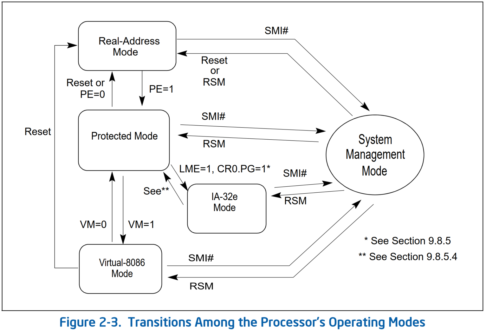
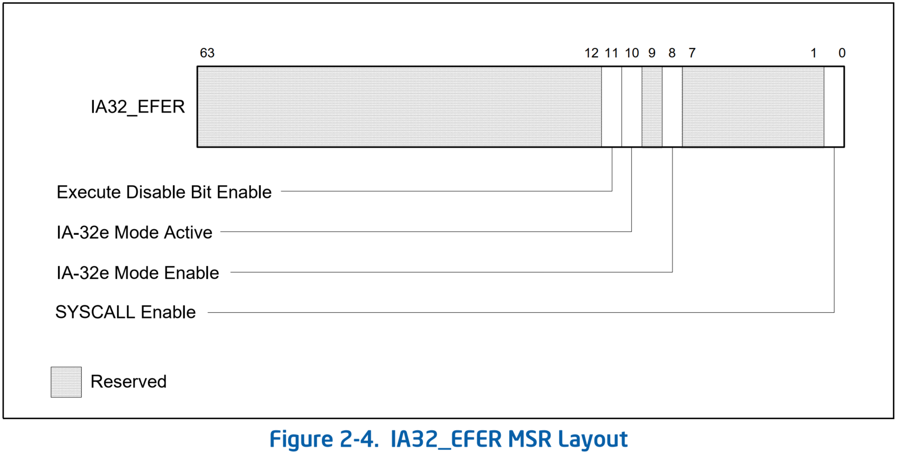
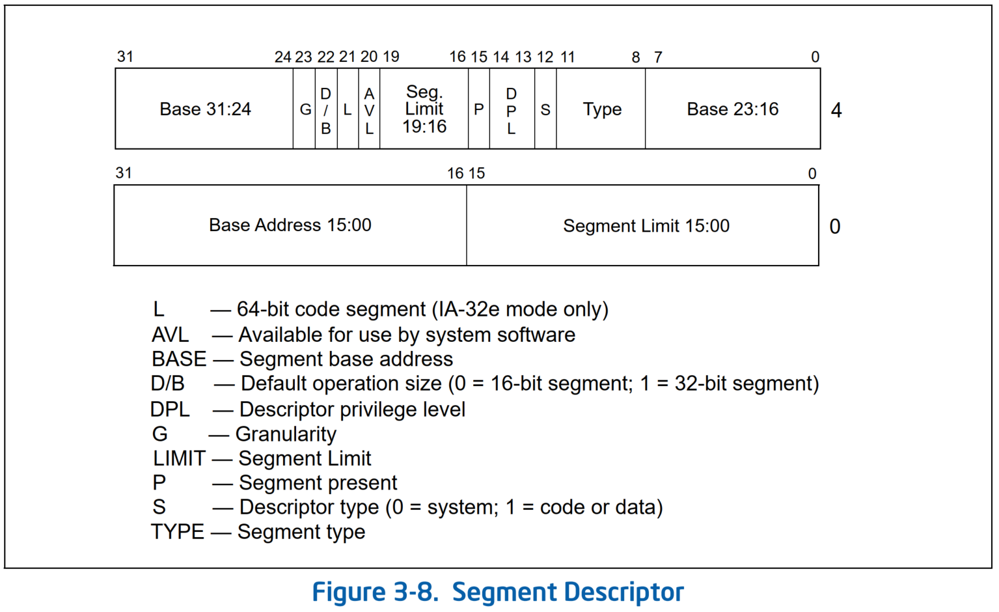

# Long Mode 与 Compatibility Mode

* Intel 处理器的 mode 变换如下图

* `LMA` 位（`IA32_EFER.LMA[bit 10]`）确定处理器是否在 IA-32e 模式（即 Long Mode）下运行。
  * 通过设置 `CR0.PG = 1` 启用分页。这会导致处理器将 `IA32_EFER.LMA` 位设置为 `1`（SDM Vol.3 10.8.5 Initializing IA-32e Mode）。
  * 通过清除 `CR0.PG = 0` 来停用 IA-32e 模式。这会导致处理器设置 `IA32_EFER.LMA = 0`（SDM Vol.3 0.8.5.4 Switching Out of IA-32e Mode Operation）。
  * 当运行在 IA-32e 模式下时，64 位或兼容子模式操作由代码段的 `CS.L` 位决定。
* 处理器通过启用分页并设置 `LME` 位（`IA32_EFER.LME[bit 8]`）从保护模式进入 IA-32e 模式。

### 扩展特性启用寄存器（Extended Feature Enable Register，EFER）

* Table 2-1. IA32_EFER MSR Information

Bit   | 描述
------|------------------------------------------
0     | **SYSCALL Enable: `IA32_EFER.SCE` (R/W)** 在 64 位模式启用 `SYSCALL/SYSRET` 指令
7:1   | 保留
8     | **IA-32e Mode Enable: `IA32_EFER.LME` (R/W)** 启用 IA-32e mode（即长模式）
9     | 保留
10    | **IA-32e Mode Active: `IA32_EFER.LMA` (R)** 当设置的时候指明 IA-32e mode 是激活的（注意，只读）
11    | **Execute Disable Bit Enable: `IA32_EFER.NXE` (R/W)** 通过防止从设置了 `XD` 位的 PAE 页中获取指令来启用页访问限制（参见第 4.6 节）
63:12 | 保留

### 段描述符

#### `D/B`（默认操作大小/默认栈指针大小和/或上限）标志
* 根据段描述符是一个可执行代码段、一个向下扩展数据段还是栈段来执行不同的功能。
  * 对于 32 位代码和数据段，该标志应始终设置为 `1`；
  * 对于 16 位代码和数据段，该标志应始终设置为 `0`。
* **可执行代码段（Executable code segment）**
  * 该标志称为 `D` 标志，它指示段中指令引用的有效地址和操作数的默认长度。
    * 如果设置了该标志，则假定为 32 位地址和 32 位或 8 位操作数；
    * 如果清除，则假定为 16 位地址和 16 位或 8 位操作数。
  * 指令前缀 `66`H 可用于选择默认值以外的操作数大小，而前缀 `67`H 可用于选择默认值以外的地址大小。
* **栈段（Stack segment，由 `SS` 寄存器指向的数据段）**
  * 该标志称为 `B`（big）标志，它指定用于隐式栈操作（例如压入、弹出和调用）的栈指针的大小。
    * 如果该标志被设置，则使用 32 位栈指针，该指针存储在 32 位 `ESP` 寄存器中；
    * 如果标志清零，则使用 16 位堆栈指针，该指针存储在 16 位 `SP` 寄存器中。
  * 如果栈段设置为向下扩展数据段（在下一段中描述），则 `B` 标志还指定栈段的上限（upper bound）。
* **向下扩展的数据段（Expand-down data segment）**
  * 该标志称为 `B` 标志，它指定段的上限（upper bound）。
  * 如果设置了该标志，则上限为 `0xFFFFFFFF`（4 GBytes）；
  * 如果该标志被清除，则上限为 `0xFFFFH`（64 KB）。
#### `L`（64 位代码段）标志
* 在 IA-32e 模式下，段描述符的第二个双字的 bit `21` 指示代码段是否包含原生的 64 位代码。
  * 值为 `1` 表示该代码段中的指令以 64-bit mode 执行。
  * 值为 `0` 表示该代码段中的指令以 compatibility mode 执行。
* 如果设置了 `L`-bit，则必须清除 `D`-bit。
* 当不在 IA-32e mode 下或对于非代码段时，bit `21` 被保留并且应始终设置为 `0`。

## References
- [x86-64处理器的几种运行模式](https://zhuanlan.zhihu.com/p/69334474)