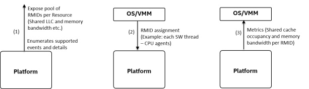
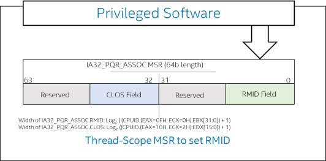
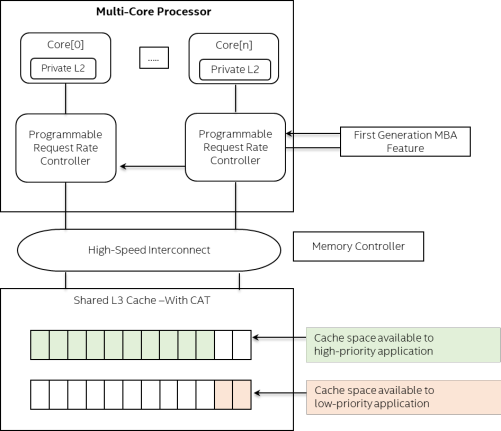
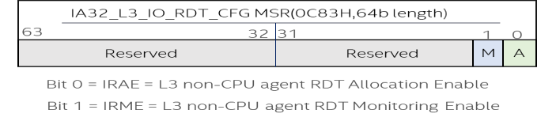
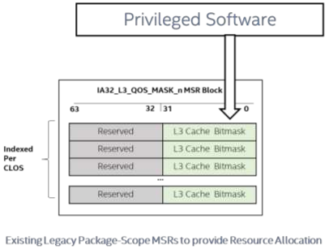
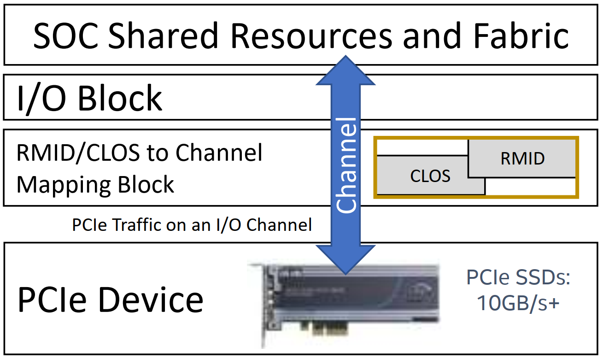
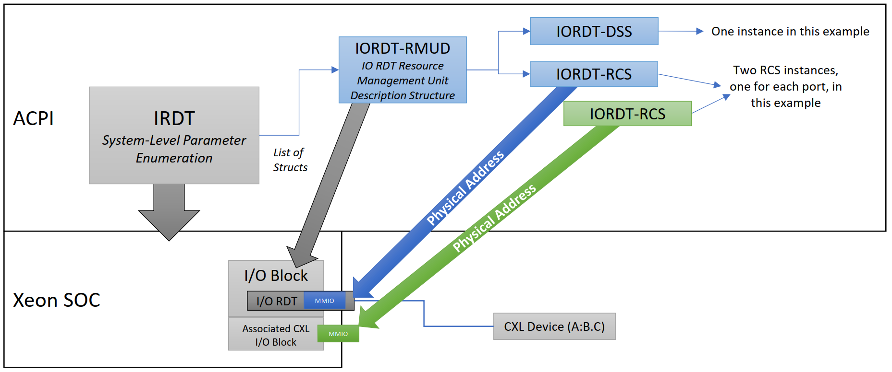
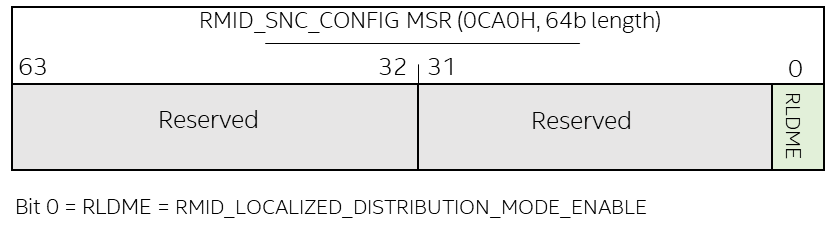

# Intel® Resource Director Technology (Intel® RDT) Architecture Specification

# 词汇表
缩写    | 术语                                       | 描述
--------|-------------------------------------------|----------------------------
ACPI   | Advanced Configuration and Power Interface | 高级配置和电源接口是一种开放标准，操作系统可以使用它来发现和配置计算机硬件组件，执行电源管理、自动配置和状态监控。
**CAT** | Cache Allocation Technology               | CAT 实现了软件引导的 cache 容量重新分配，使重要的数据中心虚拟机、容器或应用程序能够从改进的 cache 容量和减少的 cache 争用中受益。CAT 可用于增强运行时确定性并优先考虑重要的应用程序。
**CDP** | Code and Data Prioritization              | 作为 CAT 的专门扩展，代码和数据优先级（CDP）可以分别控制 L2 缓存和最后一级（L3）缓存中的代码和数据放置。某些特殊类型的工作负载可能会受益于更高的运行时确定性，从而提高应用程序性能的可预测性。
CH     | Channel | I/O 设备通道，用于在设备与 I/O Block 之间以及 coherent fabric 上进行通信。
CLOS   | Class(es) of Service                       | RDT 中用于资源控制的基本标签（fundamental tag）
**CMT** | Cache Monitoring Technology               | 通过监控各个线程、应用程序或虚拟机的最后一级缓存（L3）利用率，CMT 可改善工作负载特性、实现高级资源感知调度决策、辅助“noisy neighbor”检测并改善性能调试。
RDT    | Resource Director Technology               | RDT 是 Intel 平台服务质量技术的“总括（umbrella）”技术名称，包括 CPU Agents 和 non-CPU agents。
**MBA**| Memory Bandwidth Allocation                | MBA 能够对工作负载可用的内存带宽进行近似和间接的控制，从而针对系统中存在的“noisy neighbors”实现新水平的干扰缓解（interference mitigation）和带宽整形。
**MBM**| Memory Bandwidth Monitoring | 可以通过内存带宽监控（MBM）独立跟踪多个虚拟机或应用程序，MBM 可同时监控每个正在运行的线程的内存带宽。其优势包括检测 noisy neighbors、对带宽敏感的应用程序的性能进行特性描述和调试，以及更有效的 non-uniform memory access（NUMA）感知调度。
MMIO   | Memory Mapped I/O | I/O Intel RDT 定义了一系列 MMIO 映射接口，使 I/O 设备能够与 RMID 和 CLOS 关联，从而实现监控和控制。
PQR    | PQR | `IA32_PQR_ASSOC` MSR 的简写，将 IA 线程与 RMID 和 CLOS tags 关联。
RMD    | Resource Management Domain | 在特定 cache domain 内定义的一组功能，例如支持多个逻辑处理器的 L3 cache。
RTD    | Resource Telemetry Domain  | 资源管理域，其中支持一个或多个资源监控（telemetry）控制。
RMID   | Resource Monitoring ID(s)  | 用于 Intel RDT 中资源监控的基本标签。
SoC    | System-on-Chip             | 由 host 处理器、加速器、内存和 I/O 代理组成的集成芯片。
TC     | Traffic Class              | PCI Express 功能允许区分事务以应用适当的服务策略。
VC     | Virtual Channel            | 用于差分（differential）带宽分配的 PCI Express 功能。虚拟通道在整个层次结构中拥有专用的物理资源（缓冲、流量控制管理等）。
VMM    | Virtual Machine Monitor    | 控制虚拟化的软件层。

# 1 介绍
* 本文档定义了 Intel® 资源调配技术（Intel® RDT）功能集的架构。
* Intel RDT 的目标是为 CPU Agent 和 non-CPU Agent 如何利用共享平台资源（例如最后一级缓存（L3）和主存（通常为 DRAM）带宽）带来新的监控和控制级别。
* 监控和分配不一定应用于整个系统，而是应用于 **资源管理域（Resource Management Domain，RMD）**，该域对应于一组共享一组系统资源（例如 L2 cache 容量、L3 cache 容量、内存带宽和 I/O 设备）的 agents。
  * *资源管理域（RMD）* 由一组 CPU agents 或 non-CPU agents 组成。
  * *CPU agents set* 由一个或多个将 RMID 和/或 CLOS tag 与软件线程关联的逻辑处理器组成。
  * *Non-CPU agents* 包括 PCI Express*（PCIe*）/Compute Express Link（CXL）* 设备和集成加速器，因此广泛涵盖（encompassing）了从 cache 或内存读取和写入的代理集（不包括 IA 核心）。
* Intel RDT 功能集提供了一系列监控和分配功能，例如缓存监控技术（CMT）、内存带宽监控（MBM）、缓存分配技术（CAT）、代码和数据优先级（CDP）、内存带宽分配（MBA） 等。
  * 这些技术可以监控和控制共享平台资源，例如 L3 cache 容量或主存带宽，这些资源可能由平台上同时运行的许多应用程序、容器或虚拟机使用。
  * 如后续章节所述，这些功能可实现通信、实时和其他用途中的确定性行为和公平性，并最初在第 1.3 节中介绍。
* Intel RDT 功能基于一组架构标签（如下一节所述），以及在操作系统（OS）或虚拟机监视器（VMM）的控制下监控和控制共享平台资源的基本功能，如参考软件架构章节所述。

## 1.1 高级使用模型
* 各种行业部署模型都发现，增强系统资源利用率的可见性或对共享资源的控制很有价值。因此，使用 Intel RDT 可以观察到广泛的客户使用模型，包括但不限于：
  * **数据中心内的云托管** – 优先考虑重要的虚拟机（VM）并控制或缓解“noisy neighbors”。
  * **公有云/私有云** – 隔离重要的基础设施虚拟机，该虚拟机提供 VPN 等网络服务，以将私有云连接到公有云。
  * **数据中心基础设施** – 保护提供本地网络的虚拟交换机。
  * **通信** – 确保一致的性能并包含基于 Intel® Xeon® 服务器平台构建的网络设备上的后台任务。
  * **内容分发网络（CDN）** – 优先处理内容服务应用程序的关键部分，以提高吞吐量。
  * **网络** – 控制合并（consolidated）或共置（co-located）容器的影响，以帮助减少抖动（jitter）并减少嘈杂（noisy）场景中的数据包丢失，并保护基于 Dataplane Development Kit（DPDK）的高性能应用程序。
  * **工业控制** – 优先处理重要的代码部分，以帮助满足实时要求。
* 不同的使用模型会带来不同的需求。例如，数据中心使用可能需要控制相对容器优先级和管理 tail latencies，而工业控制使用可能需要严格管理控制循环周期（control loop cycle）时间，包括使用特定于模型的扩展 Intel RDT 功能。在参考软件架构一章中，基于实际部署的抽象示例更详细地描述了许多示例用例。

## 1.2 Scope
* 总体而言，本文档讨论了以下主题：
  * 介绍关键的 Intel RDT 架构概念和设计理念。
  * 详细了解适用于 CPU agents 和 non-CPU agents 的架构 Intel RDT 监控和分配功能。
  * 详细了解适用于 CPU agents 和 non-CPU agents 的特定型号的 Intel RDT 监控和分配功能。
  * BIOS 编写人员以及使用 BIOS 生成的 ACPI 枚举表的人员的注意事项。
  * 概述已观察到的 Intel RDT 功能的各种实际软件用法以及推荐的软件启用策略。
* 以下主题未涵盖（或在有限的上下文中涵盖）：
  * 适用于 CPU agents 和 non-CPU agents 的 Intel RDT 架构细节 - 使用 `CPUID` 的功能枚举和接口以及使用 MSR 的配置。这些细节在《Intel® 64 架构软件开发人员手册》（SDM）第 3B 卷的章节标题：调试、分支配置文件、TSC 和 Intel® 资源管理器技术（Intel® RDT）功能中提供。

# 2 Intel® Resource Director Technology 概述
* 本章概述了 Intel® RDT 的特性，包括目标、关键要素和架构框架，这些将在后续章节中详细讨论。

## 2.1 通用 Tags
* Intel RDT 通过使用数字 tags 在应用程序和逻辑处理器之间提供了一个抽象层。CPU agents 和 non-CPU agents 分别使用以下 tags 进行资源监控和分配：
  * 资源监控 ID（Resource Monitoring IDs，RMID）用于监控共享平台资源利用率。
  * 服务类别（Classes of Service，CLOS）用于控制共享平台资源，例如 L3 cache 占用率或内存带宽。
* RMID 和 CLOS tags 在《Intel® 64 和 IA-32 架构软件开发人员手册》第 3B 卷中进行了描述。
* RMID 和 CLOS tags 是独立的。
  * 使用 RMID 标记不会影响 CLOS，反之亦然（但是，当使用 CLOS tags 影响资源分配时，可能会通过基于 RMID 的监控功能观察到影响。）
  * 基于 RMID 的监控功能不会产生硬件开销或影响基于 CLOS 的分配功能。
  * 可以构建一个产品来实现基于 RMID 的监控功能、基于 CLOS 的控制功能或两者。
* 对于 CPU agents，RMID 和 CLOS tags 通过 `IA32_PQR_ASSOC` MSR 与逻辑处理器的操作相关联。
* 对于 non-CPU agents，一系列 MMIO 接口用于将来自 I/O 设备的 upstream traffic 与 RMID 和 CLOS tags 关联起来，tags 的数值解释与处理器 traffic 相同。（例如，用于跟踪处理器线程资源消耗的 RMID 值“`5`”与用于跟踪 PCIe 设备的 cache fill 行为的 RMID 值“`5`”含义相同。）
  * 这些用于 tagging non-CPU agents 的 MMIO 接口是使用称为 I/O Intel RDT（即 `IRDT`）的 ACPI 结构发现的。（参见第 5 章。）

## 2.2 L3 配置
* 本规范描述了两种可能支持 Intel RDT 功能的高级 L3 配置：
1. **Shared-L3 Configuration：** SoC 中的所有 agents 都有一个通用的共享 L3 cache，如图 2-1 所示。
   * 此 SoC 配置支持基于 CPUID 指令的 Intel RDT 功能接口，用于功能枚举和 Model-Specific Registers（MSR），用于功能配置和 telemetry retrieval。
* Figure 2-1. Shared-L3 Configuration System Model and Presence of Intel® RDT Features


2. **Multiple-L3 Configuration：** 可能有多个分别属于 CPU agents 或 non-CPU agents 本地的 L3 cache 实例，如图 2-2 所示。
* Figure 2-2. Multiple-L3 Configuration System Model and Presence of Intel ® RDT Features


* 特定 cache domain 内定义的一组功能（例如支持多个逻辑处理器的 L3 cache）可称为 **资源遥测域（Resource Telemetry Domain，RTD，用于监控功能）** 或 **资源分配域（Resource Allocation Domain，RAD，用于分配功能）**。
* 更一般地，支持 Intel RDT 监控功能、分配功能或两者的资源可称为 **资源管理域**（Resource Management Domain，RMD）。图 2-2 显示了多个 RMD 的示例。
* 有关不同 SoC 配置中 CPU agents 和 non-CPU agents 的 Intel RDT 功能映射，请参阅附录 A.4。

## 2.3 Intel® RDT Monitoring Technologies
### 2.3.1 Intel® RDT 监控的关键要素（Key Ingredients）
* Intel RDT 监控功能支持基于软件定义的资源监控 ID（RMID），这些资源监控 ID 以每个线程为基础 tagged 到应用程序或虚拟机，来监控共享平台资源，例如 L3 cache 占用率和内存带宽（图 2-3）。
* 对于 CPU Agents，每个逻辑处理器都会暴露 `IA32_PQR_ASSOC` MSR，以允许 OS/VMM 在 core 上调度应用程序、线程或虚拟机时指定 RMID。
* 然后，硬件将根据与其关联的 RMID 执行对指定应用程序/线程/虚拟机的资源监控，并且软件可以通过计数器寄存器读回给定 RMID 的 L3 cache 占用率（例如，如果支持 CMT 功能）。
  * 可以使用不同的 RMID 跟踪应用程序的每个线程，或者可以根据所需的监控粒度将线程分组为单个 RMID。
  * 类似地，可以根据需要使用可变粒度的 RMID 来跟踪 VM 中的线程、VM 内的应用程序、整个 VM 或 VM 组。
* Figure 2-3. Intel® RDT Monitoring – Enabling RMID-Based Monitoring for Shared Resources



* Intel RDT 监控的基本组成部分如下：
  * CPUID 和/或 ACPI 构造表示支持 Intel RDT 监控和 Resource Telemetry Domains（RTD）的子功能（CMT、MBM 等）。
  * 枚举给定 RTD 中可跟踪的 RMID 总数。
  * 允许系统软件 (OS/VMM) 指定软件线程和 non-CPU agents 的 RMID 的机制。
  * 允许系统软件通过架构 MSR 或 MMIO 接口按每个 RMID 检索收集的指标的机制。
* 使用 Intel RDT 监控的第一步是通过 CPUID 或 ACPI 枚举给定 Resource Management domain 上提供的监控能力集，并确定特定 Resource Telemetry Domain（RTD，即 caching domain）上可用于跟踪的 RMID 数量。这将允许 OS/VMM 确定可以使用的唯一 ID 数量。
  * 鉴于某些处理器拓扑可能包含因处理器而异（vary）的异构能力（heterogenous capabilities），建议软件从每个逻辑处理器（LP）的角度枚举 Intel RDT CPUID，以构建 *支持的功能列表* 以及 *哪些资源（如 L3 cache）可以在各个 LP 之间共享*。
* 第二个要素（Intel RDT 监控关联）允许 OS/VMM 为 CPU agents 指定正在运行的软件线程的 RMID。OS/VMM 还可以为 non-CPU agents 的 upstream traffic 和操作指定 RMID。
* 第三个要素（Intel RDT 标记（marking）和相关硬件支持）允许使用 OS/VMM 提供的 RMID 去 tagged 来自 CPU agents 和 non-CPU agents 的每个内存请求。
* 第四个要素是 Intel RDT 监控报告。当使用 RMID 和感兴趣的特定事件的代码（例如 L3 cache 占用率）对监控数据检索寄存器进行编程时，将适当地检索此信息并将其返回。
* 一个平台中可能存在多个 Intel RDT 监控功能，但软件不应假设一个 Intel RDT 监控功能的存在意味着任何其他功能的存在。为了避免出现歧义的情况，Intel RDT 功能按照Intel® 64 和 IA-32 架构软件开发人员手册第 3B 卷第 18.18.4 节中描述的顺序单独列举。

### 2.3.2 Shared-L3 versus Multiple-L3 配置
* 根据 L3 配置，Intel RDT 监控功能可能具有不同的范围定义。
  * 在 shared-L3 配置中，CPU agents 和 non-CPU agents 分配到共享 L3 cache 中。因此，所有监控功能对 CPU agents 和 non-CPU agents 都有一致的定义。
  * 在 multiple-L3 配置中， non-CPU agents 可能有一个单独的附近 L3 cache，该 cache 与 CPU agent 的 L3 cache 不同。因此，监控功能对 CPU agents 和 non-CPU agents 可能具有不同的定义。
    * 例如，在某些实现中，具有近（near）L3 cache 实现的 non-CPU agents 可能仅报告来自近 cache 的内存带宽监控数据。

## 2.4 Intel® RDT Allocation Technologies
### 2.4.1 Intel® RDT 分配的关键要素（Key Ingredients）

* Intel RDT 分配支持基于 **服务类别（Class of Service，CLOS）** tags 的资源分配。
  * 处理器暴露服务类别，可将应用程序（或单个线程）和来自 I/O 设备的 traffic 分配到这些类别中。
  * CLOS 可能具有多个关联的资源分配属性。例如，每个 CLOS 可能存在控制，以指定该 CLOS 可用的 L2 容量、可用的 L3 容量、可用的内存带宽和其他属性（图 2-4）。
* Figure 2-4. Intel® RDT Allocation – Enabling CLOS-based Allocation for Shared Resources


* 对于 L3 容量控制功能，例如 **缓存分配技术（Cache Allocation Technology ，CAT）**，给定 cache 的分配会根据与其关联的 class 受到限制。
* 同样，在支持 non-CPU agents 控制的某些实现中，来自 I/O 设备的上下文相关的和 upstream traffic 可以被控制，因为它使用共享系统资源。
  * 可以使用 *表示容量的 bitmasks* 以及 *影响 SOC cache 的分配功能中类别之间的重叠和隔离程度* 来配置每个 CLOS。
* 对于 CPU agents，每个逻辑处理器都会暴露 `IA32_PQR_ASSOC` MSR，以允许 OS/VMM 在调度应用程序、线程或 VM 时指定 CLOS。
  * 然后根据 CLOS 和相关 bitmask 控制应用程序/线程/VM 的 Cache 分配。
* Intel RDT Allocation 的基本组成部分如下：
  * CPUID 或 ACPI 构造，用于指示是否支持 **资源分配域（Resource Allocation Domains，RAD）** 的 Intel RDT Allocation 和子功能（CAT、MBA 等），并枚举可能与平台上的共享平台资源关联的 CLOS 总数。
  * 允许系统软件（OS/VMM）指定软件线程和 non-CPU agents 的 CLOS 的机制。
  * 允许系统软件通过架构 MSR 或 MMIO 接口配置每个 CLOS 可用的共享平台资源级别的机制。
* 利用 Intel RDT Allocation 的第一个要素是通过 CPUID 和/或 ACPI 枚举给定资源分配域上提供的分配能力级别，并确定可用于在特定 RAD（即某个 L3 caching domain）上分配共享平台资源的 CLOS 数量。
  * 这将允许 OS/VMM 确定可以使用多少个唯一 ID。
  * 鉴于某些处理器拓扑可能包含因处理器而异的异构能力（heterogenous capabilities），建议软件从每个逻辑处理器 (LP) 的角度枚举 Intel RDT CPUID 以构建支持的功能列表以及哪些资源（如 L3 cache）可以在各个 LP 之间共享。
* 第二个要素（Intel RDT Allocation 关联）允许 OS/VMM 为 CPU agents 指定正在运行的软件线程的 CLOS 到平台。OS/VMM 还可以为 upstream traffic 和 non-CPU agents 的操作指定 CLOS。
* 第三个要素（Intel RDT 标记和相关硬件支持）使来自 CPU agents 和 non-CPU agents 的每个内存请求都能够用 OS/VMM 提供的 CLOS 进行 tagged。
* 第四个要素是 Intel RDT Allocation 控制，此时分配寄存器使用 CLOS 进行编程，并且分配控制由特定的共享平台资源（例如 L3 Cache 容量）执行。
* 一个平台中可能存在多个 Intel RDT Allocation 功能。软件不应假设一个 RDT 分配功能的存在意味着任何其他功能的存在。
  * 为了避免出现歧义，Intel RDT 功能按照 Intel® 64 和 IA-32 架构软件开发人员手册第 3B 卷中描述的顺序单独枚举。

### 2.4.2 Shared-L3 versus Multiple-L3 配置
* Intel RDT Allocation 功能可能根据 L3 配置具有不同的定义。
  * 在 shared-L3 配置中，CPU agents 和 non-CPU agents 分配到共享 L3 cache 中。因此，所有分配功能对 CPU agents 和 non-CPU agents 都有一致的定义。
  * 在 multiple-L3 配置中，non-CPU agents 可能有一个单独的近 L3 cache，该 cache 不同于 CPU agents 的 L3 cache。因此，分配功能对 CPU agents 和 non-CPU agents 可能具有不同的定义。
    * 例如，具有近 L3 cache 实现的 non-CPU agents 为近 L3 cache 的 cache 容量分配提供了单独的接口。
* 第 3 章和第 4 章详细介绍了 CPU agents 和 non-CPU agents 的每个 Intel RDT 监控和分配功能。

# 3 适用于 CPU Agents 的 Intel® Resource Director Technology
* 本章概述了适用于 CPU agents 的 Intel RDT 功能。第 4 章详细介绍了 non-CPU agents 的功能。

## 3.1 Intel® RDT 监控功能
* Intel RDT 监控架构支持监控关键共享平台资源的利用率，并将这些数据直接提供给虚拟机管理程序、操作系统或其他特权软件。
* Intel RDT 监控支持三种事件代码：
  1) L3 cache 占用率
  2) L3 总外部带宽
  3) L3 本地外部带宽。
* 这允许基于资源使用情况进行更高效的调度，以及基于资源使用特征进行应用程序调优和性能预测，以及可选的更好的报告和计费。
* 此功能是对 Intel RDT Allocation 的补充，后者可控制 CPU agents 可用的共享平台资源。

### 3.1.1 通用框架
* Intel RDT 监控功能共享以下机制：
  * CPUID feature bits，用于枚举 Intel RDT 监控功能的存在情况以及每个子功能的详细信息。
  * `IA32_PQR_ASSOC` MSR，操作系统或虚拟机管理程序使用它来指定计划在逻辑处理器上运行的每个软件线程的 RMID。参见图 3-2。
  * `IA32_QM_EVTSEL` 和 `IA32_QM_CTR` MSR，用于读取 cache 占用率和带宽统计信息。参见图 3-3。
* 软件可以灵活地将 RMID 与线程、应用程序、VM 或容器关联。（参见图 3-1）。如果 Resource Telemetry Domain（RTD）中的多个逻辑处理器分配了相同的 RMID，则这些逻辑处理器的总资源监控遥测将累积在一起，并由硬件报告总数。
* 使用基于 window 的接口检索监控数据。软件将 `Event ID` 和 `RMID` 写入 `IA32_QM_EVTSEL` MSR，硬件将结果数据返回到 `IA32_QM_CTR` MSR。
* 有关 CPUID 和 MSR 使用的详细信息，请参阅《Intel® 64 和 IA-32 架构软件开发人员手册》第 3B 卷。
* Figure 3-1. Resource Monitoring IDs (RMIDs) Assignment Flow


* Figure 3-2. IA32_PQR_ASSOC MSR to Set RMID


* Figure 3-3. IA32_QM_EVTSEL and IA32_QM_CTR MSRs


### 3.1.2 Cache 占用监控技术
* Intel RDT Cache 占用率监控技术可让您了解 cache 利用率。诸如 **缓存监控技术（Cache Monitoring Technology，CMT）** 之类的功能可按每个 RMID 提供占用率计数器，这样就可以在系统运行期间实时跟踪和读回每个 RMID 的 cache 占用率。
* 有关 CMT 的更多具体功能详情，请参阅《Intel® 64 和 IA-32 架构软件开发人员手册》第 3B 卷。请注意，MSR 列于附录 A.5 中。有关 CMT 功能支持的产品详情，请参阅附录 A.2。

#### 3.1.2.1 L3 Cache 监控技术
* L3 **Cache 监控技术（Cache Monitoring Technology，CMT）** 允许操作系统、虚拟机管理程序或类似的系统管理 agent 确定平台上运行的应用程序对 Resource Telemetry Domain（RTD）的 L3 cache 的使用情况。

### 3.1.3 内存带宽监控
* **内存带宽监控（Memory Bandwidth Monitoring，MBM）** 可监控从 cache 或资源层次结构的一个级别到下一个级别的带宽，从而实现带宽感知调度决策、RTD 间调度优化，并支持反馈到带宽分配功能，从而控制内存带宽。
* 有关 MBM 的更多具体功能详情，请参阅 Intel® 64 和 IA-32 架构软件开发人员手册第 3B 卷。
  * 注意，MSR 列于附录 A.5 中。有关 MBM 功能支持的产品详情，请参阅附录 A.2。

#### 3.1.3.1 L3 Total 和 Local 外部内存带宽监控
* L3 Total 和 Local 外部内存带宽监控允许系统软件监控 L3 cache 和本地或远程内存之间的带宽使用情况。
* 在某些实现中，MBM 不能保证跟踪目录和 **扩展预测表（Extended Prediction Table，XPT）** 预取器流量（prefetcher traffic）。

## 3.2 Intel® RDT Allocation 功能
* Intel RDT Allocation 架构支持控制关键共享平台资源的利用率，并将此控制直接提供给虚拟机管理程序或操作系统。这允许更高效的资源使用以及基于资源重新分区的应用程序优先级和确定性恢复。
* Intel RDT Allocation 功能的实现可能是特定于产品的，也可能是架构性的。这些功能补充了 Intel RDT 监控，它提供了对 CPU agents 共享平台资源利用率的洞察。

### 3.2.1 通用框架
* Intel RDT allocation 功能共享以下机制：
  * CPUID feature bits，用于枚举 Intel RDT Allocation 功能的存在情况以及每个子功能的详细信息。
  * `IA32_PQR_ASSOC` MSR，软件使用它来指定每个软件线程的 CLOS。参见图 3-5。
  * 硬件中的机制，用于指定应用于每个 Class of Service 的资源使用情况。
* 软件可以灵活地将 Classes of Service 与线程、应用程序、VM 或容器关联（参见图 3-4）。
  * CLOS 值在所有分配功能之间共享。
  * 从所有 core 的角度来看，特定的数字 CLOS 值具有相同的含义。
  * 每个 CLOS 都有一组关联的掩码寄存器（稍后将介绍），用于将该 CLOS 与共享平台资源的一小部分关联。
  * 如果 Resource Allocation Domain（RAD）中的多个逻辑处理器分配了相同的 CLOS，则与该 CLOS 关联的资源分配将在该组逻辑处理器之间共享。
* Figure 3-4. Classes of Service (CLOS) Association Flow


* Figure 3-5. The IA32_PQR_ASSOC MSR to Set CLOS


* 对于每个资源，都会定义一个寄存器块（block），供软件配置每个 CLOS 的分配值。
  * 寄存器字段的定义取决于所管理的资源类型，将在后续章节中讨论。

### 3.2.2 Cache Occupancy Allocation 技术
* **Cache 占用分配技术（Cache Occupancy Allocation Technologies）** 系列允许基于每个 CLOS 控制共享 cache 空间，从而实现隔离和重叠，以实现更好的吞吐量、公平性、确定性和差异化。
* 通常，这些功能称为 **缓存分配技术（Cache Allocation Technology，CAT）**，这是本文档中使用的术语。某些处理器可能支持架构或特定于型号的 CAT，具体取决于产品代。特定于型号的实现在附录 B.1.4 中讨论。
* 有关 CAT 的更多具体功能详情，请参阅《Intel® 64 和 IA-32 架构软件开发人员手册》第 3B 卷。注意，MSR 列于附录 A.5 中。有关 CAT 功能支持的产品详情，请参阅附录 A.2。

#### 3.2.2.1 L2 Cache Allocation 技术
* L2 Cache Allocation Technology（L2 CAT）允许系统软件指定应用程序可以填充的 Resource Allocation Domain 的 L2 cache 空间量。

#### 3.2.2.2 L2 Cache 代码和数据优先级
* L2 Code Data Prioritization（L2 CDP）可区分单个 Class of Service 对 L2 Cache 使用的代码和数据。如果应用程序的代码占用空间很大，可能会压倒（overwhelm）cache 中的数据，反之亦然，则分别对代码和数据进行优先级排序的能力非常有用。
* L2 CDP 为每个 Class of Service 提供 *一对分配位掩码*（而不是像 L2 CAT 中那样为每个 CLOS 提供单个位掩码），以允许系统软件独立配置可用于代码和数据的 L2 cache 量。

#### 3.2.2.3 L3 Cache Allocation 技术
* L3 Cache Allocation Technology（L3 CAT）允许操作系统（OS）、虚拟机管理程序、虚拟机管理器（VMM）或类似的系统服务管理代理指定 CLOS 可填充的 Resource Allocation Domain 内的 L3 cache 空间量。

#### 3.2.2.4 L3 Cache 代码和数据优先级
* L3 Code Data Prioritization（L3 CDP）可区分单个 Class of Service 的 L3 Cache 使用的代码和数据。如果应用程序的代码占用空间很大，可能会压倒（overwhelm） cache 中的数据，反之亦然，则分别对代码和数据进行优先级排序的能力非常有用。
* L3 CDP 为每个 Class of Service 提供 *一对分配位掩码*（而不是像 L3 CAT 中那样每个 CLOS 一个位掩码），以允许系统软件独立配置可用于代码和数据的 L3 cache 量。

### 3.2.3 内存带宽分配
* **内存带宽分配（Memory Bandwidth Allocation，MBA）** 允许系统软件控制对内存的访问带宽。
  * 它允许减慢可能过度使用（overutilizing）带宽的“noisy neighbor”线程，
  * 并通过暴露对基于信用的限制机制的控制来创建闭环（closed-loop）控制系统（监控和控制相结合）。
* 有关 MBA 的更多具体功能详细信息，请参阅 Intel® 64 和 IA-32 架构软件开发人员手册第 3B 卷。请注意，MSR 列在附录 A.5 中。有关 MBA 功能支持的产品详细信息，请参阅附录 A.2。
* MBA 有三代，每代都扩展了其他功能：
1. **第一代 MBA（接口范围）**——这是 MBA 功能的初始实现，它提供对 per-core 的可用内存带宽的间接和近似控制。
2. **第二代 MBA（接口范围）**——这种增强的 MBA 功能提高了节流效率和准确性，同时提高了系统吞吐量。
   * 它没有采用严格的带宽控制机制，而是实现了动态硬件控制器，它可以对微秒级的带宽条件变化做出反应。
   * 在使用第二代 MBA 功能之前，MBA 硬件控制器需要 BIOS 辅助校准过程，其中可能包括填充的内存通道数量和其他系统参数等输入；这与第一代 MBA 有所不同。
   * Intel 的 BIOS 参考代码包含一个建议用于一般用途的默认配置，并且可以使用备用调整值创建 BIOS 配置文件，以针对某些用途（例如更严格的节流）进行优化。
3. **第三代 MBA（Agent 范围）** ——基于代号 Granite Rapids 微架构的未来处理器上的第三代 MBA 功能通过每个逻辑处理器（per-logical-processor）控制和进一步改进的控制器设计进一步增强了 MBA。
   * 总的内存带宽（所有 L3 未命中 traffic）现在由 MBA 3.0 管理。
   * 此实施遵循了过去的 MBA 先例，即在不进行重大软件大修的情况下提供重大增强功能，同时保持向后兼容性。
* MBA 性能属性会随时间而变化，例如提高系统级效率。软件不应假设 MBA 的性能属性或特定调整在产品代之间保持不变。
* 第三代 MBA 从接口范围转向 agent 范围节流支持，重新调整调度程序以利用此增强功能可能会有所帮助。
* MBA 的传统架构实现按照 Intel® 64 和 IA-32 架构软件开发人员手册第 3B 卷中描述的顺序列举，以避免出现歧义情况。
* MBA 功能提供以下架构组件：
  * 一种枚举 MBA 功能的机制，用于控制从每个 cache 级别（例如 L2、L3）到下一级的带宽。
  * 操作系统或虚拟机管理程序通过一个节流值（稍后讨论）配置一个特定的 Class of Service 的可用的带宽量的机制。
  * 操作系统或虚拟机管理程序指定线程所属 Class of Service 的机制。
  * 当应用程序被指定为属于一个特定的 Class of Service 时，硬件机制用于指导和执行 cache 层次结构每个级别的延迟值。
* 注意，在某些用途中（例如寻求以 `MB/s` 为单位的带宽控制的用途），MBA 可能需要应用程序级性能反馈或补充（complimentary）内存带宽监控（Memory Bandwidth Monitoring，MBM）才能以最佳方式使用。
  * 软件接口的向后兼容性得以保留，增强的 MBA 代际变化表现（manifest）为 MBA 功能基线之上的增强。

#### 3.2.3.1 第一代内存带宽分配
* 内存带宽分配（MBA）功能提供对 per-core 可用内存带宽的间接和近似控制，并已在 Intel® Xeon® 可扩展处理器系列中引入。此功能提供了一种方法来控制在数据中心等环境中可能过度使用带宽（相对于其优先级）的应用程序。
* MBA 功能使用 *来自 Intel RDT 功能集* 的现有构造，包括 Classes of Service（CLOS）。例如，
  * 用于 L3 CAT 的给定 CLOS 与用于 MBA 的 CLOS 含义相同。
  * 用于将线程与 CLOS 关联的基础设施（例如 `IA32_PQR_ASSOC_MSR`）和 CPUID 枚举的某些元素（例如 CPUID leaf `0x10` [Cache Allocation Technology Enumeration Leaf]）是共享的。
* 图 3-6 显示了内存带宽分配的高级实现。
* Figure 3-6. A High-Level Overview of the First-Generation MBA Feature



* 如上所示，MBA 功能在 cores 和高速互连（high-speed interconnect）之间引入了一个 **可编程请求速率控制器**，从而能够间接控制相对于其优先级过度利用（over-utilizing）带宽的 cores 的内存带宽。
  * 例如，高优先级 cores 可以不受限制地运行，但产生过多流量的低优先级 cores 可能会受到限制，以便为高优先级 cores 提供更多的带宽可用性。
* 由于 MBA 在 cores 和 interconnect、更高级别的共享 caches 和内存控制器之间使用可编程速率控制器，因此这些 caches 的带宽也可能会减少，因此应注意仅限制未有效使用 off-core caches 的带宽密集型（bandwidth-intense）应用程序。
* MBA 暴露的节流值是近似值，并根据特定的流量模式进行校准。
  * 随着工作负载特性的变化，提供的节流值可能会对每个工作负载产生不同的影响。
  * 在需要精确控制的情况下，内存带宽监控（MBM）功能可用作软件控制器的输入，该软件控制器决定要应用的 MBA 节流级别。

##### 3.2.3.1.1 使用注意事项
* 由于 MBA 提供的内存带宽控制是间接和近似的，因此使用闭环控制器的功能来监控内存带宽以及应用程序使用 cache 的效率（通过 cache 监控技术功能）可能会提供额外的价值。
  * 这种方法还允许管理员提供带宽目标（target）或设定点（set point），控制器可以使用该目标或设定点来指导应用的 MBA 节流值，并且这允许带宽控制独立于应用程序的执行特性。
* 由于控制是按处理器核心提供的（每个线程 CLOS 的延迟值最大值应用于 core），因此用户应小心安排线程，以免无意中（inadvertently）将高优先级线程（预期 MBA 节流为零）放置在低优先级线程（预期 MBA 节流）旁边，这会导致高优先级线程的无意节流，因为应用了最大已解析的（resolved）节流值。

#### 3.2.3.2 第二代内存带宽分配
* 第二代内存带宽分配 (MBA) 已在第三代 Intel® Xeon® 可扩展处理器系列和相关 Intel Atom® 处理器（如 P5000 系列）中实现。
  * 这种增强的 MBA 功能提高了节流效率和准确性，同时提高了系统吞吐量。
  * 它没有采用严格的带宽控制机制，而是实现了动态硬件控制器，可以对微秒级的带宽变化做出反应。
* 在使用第二代 MBA 功能之前，MBA 硬件控制器需要 BIOS 辅助校准过程，其中可能包括填充的内存通道数量和其他系统参数等输入；这与第一代 MBA 有所不同。
* Intel BIOS 参考代码包含建议用于一般用途的默认配置，可以使用备用调整值（alternate tuning values）创建 BIOS 配置文件，以针对某些用途（如更严格的节流）进行优化，如后续的 BIOS 注意事项章节中所述。
* 第二代 MBA 从 core/uncore 接口的静态节流转变为基于跟踪实际主存带宽的硬件控制器的更动态的控制方法。
  * 这使得主要使用 L3 cache 的软件能够观察到给定节流级别的吞吐量增加，或者对于表现出（exhibits）L3-bound 阶段的软件，可以观察到细粒度的（fine-grained）吞吐量优势。
  * 由于更仔细地考虑了内存带宽负载，与该功能的先前实现相比，使用第二代 MBA 时，此增强功能可能会导致系统效率提高。
  * 软件接口的向后兼容性得以保留，第二代 MBA 的变化表现为 MBA 功能基线之上的增强。
* 与上一代功能一样，第二代 MBA 使用 CPUID 进行枚举，并使用从软件线程到 CLOS（在 `IA32_PQR_ASSOC` MSR 中）创建的映射来执行节流，然后通过 `IA32_L2_QoS_Ext_BW_Thrtl_n` MSR 将其映射到每个 CLOS 的延迟值。
  * 特权操作系统或虚拟机管理器软件可以指定每个 CLOS 的延迟值，例如 0-90％ 的带宽限制，尽管最大值和粒度值取决于平台并在 CPUID 中枚举。

##### 3.2.3.2.1 第二代 MBA 的优势
* 接下来介绍在第一代 MBA 基础上添加的附加功能：
1. 以前，在 MBA 中只能选择物理 core 上两个 CLOS 之间的 **最大延迟值**。第二代 MBA 允许选择 **最小延迟值**，这可以增强 Intel® 超线程技术的使用。
2. 在第一代 MBA 中只能使用一个 *预编程校准表（preprogrammed calibration table）*，这意味着不同的内存配置可能根据配置而产生不同的线性（linearity）和百分比（percent）延迟值误差值。
   * 第二代 MBA 中的 BIOS 支持解决了这个问题，例如，某些 BIOS 实现可能会为每个内存配置编写不同的校准表。
3. 第二代 MBA 控制器能够更密切地监控内存带宽负载并提供更优化的结果。
4. 新的 MBA 硬件控制器减少了对细粒度软件控制器的需求，从而管理应用程序阶段以实现最佳效率。
* 注意，软件控制器可能仍然有价值，将 MBA 限制值转换为 GB/s 中的带宽或应用程序 Service Level Objectives（SLO），例如性能目标。
* Figure 3-7. Second Generation MBA, Including a Fast-Responding Hardware Controller


* 第二代 MBA 实现如图 3-7 所示。该功能通过使用 *高级硬件控制器和反馈机制* 来运行，从而允许围绕 *用户提供的延迟值设定点* 自动监控和控制硬件。
  * 该设定点和相关的节流值基础结构与上一代 MBA 保持不变，从而保持了软件兼容性。
* 除了新的硬件控制器之外，MBA 增强功能还包括：
1. 可配置的线程间延迟选择。
   * MBA 1.0 实现静态地选择在 core 上运行的线程间的最大 MBA Throttling Level（MBAThrotLvl）
   * （通过计算值 = `max(MBAThrotLvl(CLOS[thread0]), MBAThrotLvl(CLOS[thread1]))`）。
   * 软件可以选择要解析的最大或最小延迟并应用于线程；最大值仍为默认值。
2. 在某些实现中将 `CLOSID` 从 `8` 增加到 `15`（特定于产品，请参阅 CPUID）
   * 之前某些功能实现为 MBA 提供了 `8` 个 CLOS 标签。
   * 第三代 Intel® Xeon® Scalable Processor Family 和相关 Intel Atom® 处理器（如 P5000 系列）将此值增加到 `15`（也与 L3 CAT 一致）。

##### 3.2.3.2.2 软件可见的变化
* 第二代 MBA 引入了新的特定型号 MSR，允许软件从最大（默认）或最小解析节流值中进行选择（参见上一个公式）。此功能通过新 `MBA_CFG` MSR 中的一个 bit 进行控制，如表 3-1 所示。
* Table 3-1. MBA_CFG MSR Definition


* 注意，第二代 MBA 支持用于 min/max 配置的 `bit[0]`，但当控制器逻辑能够基于 *每个逻辑处理器* 或 *每个 agent* 管理节流值时，第三代 MBA 会删除该 `bit[0]`。
  * 此增强的瞬时性质（transient nature）是 min/max 控制保持 model specific 的原因。
* 为了枚举和管理对 model-specific 的 min/max 功能的支持，软件可以使用处理器 family/model/stepping 来匹配受支持的产品，然后使用 `CPUID` 来检测增强的第三代 MBA 支持。

#### 3.2.3.3 第三代内存带宽分配
* 基于代号 Granite Rapids 微架构的未来处理器上的第三代 MBA 功能通过每个逻辑处理器（per-logical-processor）控制和进一步改进的控制器设计进一步增强了该功能。
  * 总的内存带宽（所有 L3 未命中 traffic）现在由 MBA 管理。
  * 此实现遵循了过去的 MBA 先例，即在不进行重大软件改造的情况下提供重大增强功能，同时保持向后兼容性。

##### 3.2.3.3.1 硬件变化
* 第三代 MBA 建立在上一代引入的硬件控制器的基础上，这带来了显著的系统级优势，同时提供了独立节流逻辑处理器的新功能，而不是前几代中更粗粒度的（coarse-grained）每核（per-core）节流。
* 节流值不再被选为在 core 上运行的线程的两个节流值的“最小值”或“最大值”；相反，节流值独立且直接应用于每个逻辑处理器。第三代 MBA 实现如图 3-8 所示。
* Figure 3-8. High-Level Overview of the Third Generation MBA Feature


* 虽然这种增强意味着可以更直接地限制线程，但重新调整软件可能有助于理解 Intel® 超线程技术争用（contention）vs cache 和内存争用的影响，以及对软件性能的影响。

##### 3.2.3.3.2 软件可见的变化
* 为了允许软件更改其调整（tunning）行为并检测特定某代产品是否支持每个逻辑处理器节流，在 MBA CPUID leaf 中添加了一个 CPUID bit 以指示支持。有关详细信息，请参阅《Intel® 64 和 IA-32 架构软件开发人员手册》第 3B 卷中的“CPUID—CPU 标识”。
* 尽管硬件控制器基础架构有了另一项重大改进，并且功能、控制器响应能力、新的内部微架构和瞬态抑制（transient-arresting）能力都有所提高，但相对于前几代产品，使用第三代 MBA 不需要进行任何新的软件接口更改。
  * 以前使用第二代 MBA 最小/最大选择功能的软件应停止使用（discontinue）`MBA_CFG` MSR。
  * 第三代 MBA 功能是代号为 Granite Rapids 的服务器微架构上的默认操作模式。
* 注意，MBA MSR 已列于附录 A.5 中以作完整说明，但这些旧版 MSR 的详细信息可在 Intel® 64 和 IA-32 架构软件开发人员手册第 3B 卷中找到。有关 MBA 功能支持的产品详细信息，请参阅附录 A.2。

### 3.2.4 Cache 带宽分配
* **Cache 带宽分配（Cache Bandwidth Allocation，CBA）** 允许操作系统、虚拟机管理程序或类似的系统管理 agent 控制每个逻辑处理器的内部 core 和 downstream 内存带宽。此功能与 MBA 互补，并为 OS/VMM 提供了限制 core 内线程的能力。
* CBA 功能与现有的 MBA 功能一起提供了一种系统范围的机制，用于限制系统中不同 cache（包括外部内存）的带宽，以及控制处理器 core 或 module 内的带宽。
  * CBA 和 MBA 结合起来，提供带宽资源的确定性控制和动态管理，以满足系统 Service Level Objectives（SLO）。
  * CBA 功能重用并扩展了 Intel RDT 功能集的现有构造，包括 Classes of Service（CLOS）。
* 例如，用于 L3 CAT 的给定 CLOS 与用于 CBA 的 CLOS 含义相同。
  * 基础设施（例如用于将线程与 CLOS 关联的 MSR（`IA32_PQR_ASSOC_MSR`））和 CPUID 枚举的某些元素（例如 CPUID leaf `0x10`（Cache Allocation Technology Enumeration Leaf））是共享的。
* **Cache 带宽分配（CBA）** 功能可控制每个逻辑处理器的 1 级（L1）cache、2 级（L2）cache 和 3 级（L3）cache（如适用）之间的可用带宽。
  * 由于减少 upstream 带宽也会减少外部内存的带宽，因此这也提供了对内存带宽的间接控制。
  * 这种对外部内存带宽的间接控制也可以减少内存带宽。
  * CBA 功能与 MBA 一起提供了一种控制不同应用程序带宽的机制。
* 软件应该理解，应用程序的有效限制可能是 CBA 或 MBA 中指定更多限制的那个。
* 与 Intel RDT 功能类似，CBA 包含以下关键要素：
  * 一种枚举 CBA 功能的机制，用于控制从 cache 的每个级别（例如 L1、L2、L3）到下一个级别 (CPUID) 的带宽。
  * 一种机制，用于操作系统或虚拟机管理程序通过节流级别 (MSR，稍后讨论) 配置具有特定 Class of Service 的逻辑处理器可用的带宽量。
  * 一种机制，用于操作系统或虚拟机管理程序向应用程序所属的 Class of Service 发出信号 (PQR MSR)。
  * 硬件机制，用于引导和执行（enforce）整个 cache 层次结构的带宽节流级别。
* 在某些用法中，软件可以使用性能监视器事件和内存带宽监视（MBM）度量给定的线程、应用程序、VM 或容器在不同级别的 cache 层次和外部内存中消耗的内存带宽。
  * 一旦测量了内存带宽，软件就可以动态调整该应用程序使用的 Class of Service（CLOS）的带宽限制级别。
  * 在其他用法中，软件控制回路可以监视应用程序性能并动态调整限制级别以实现某些性能目标。

#### 3.2.4.1 CBA 概述
* CBA 功能实现了本地硬件控制器，启用后可以独立地限制跨 cache 层次结构的逻辑处理器的内存带宽，并补充限制外部内存带宽的 MBA 控制器。

#### 3.2.4.2 CBA 节流机制示例
* L2 cache 和 L3 cache 之间强制带宽限制的一个例子是逻辑处理器内的本地 CBA 控制器和 MBA 硬件控制器之间的带宽限制的最大值。图 3-9 显示了 CBA 实施的一个示例。
* Figure 3-9. Example of CBA Throttling between L2 and L3 caches


#### 3.2.4.3 软件接口
* 为了让软件调整其调整行为并检测特定某一代产品是否支持 cache 带宽限制，Intel RDT 在 CPUID leaf 中添加了一个 CPUID bit 以指示支持（详细信息请参阅《Intel® 架构指令集扩展手册》）。
* `IA32_PQR_ASSOC` MSR 指定与每个逻辑处理器关联的 Class of Service。
* CBA 功能定义了一组称为 `IA32_QoS_Core_BW_Thrtl_n` 的 MSR，它们为每个 CLOS 提供了一个字节编码（byte-encoded）域，用于编程内存带宽限制级别。
  * 限制级别的值越高意味着带宽限制越多，数字越低表示限制越少。
  * CBA 功能的 CPUID 枚举了逻辑处理器支持的级别数和最高级别。
  * 逻辑处理器的每个 CLOS 限制值的重置值为 `0`，表示未限制带宽。
* CBA `IA32_QoS_Core_BW_Thrtl_n` MSR 中的每个域都可以从 `0` 编程到 CPUID 中提供的最大节流级别。
  * 如果编程的值超出了从 `0` 到最大节流级别的范围，则会导致 `#GP` 故障。
  * CBA 的 Resource Management Domain（RMD）是每个逻辑处理器的（per logical processor），因此 `IA32_QoS_Core_BW_Thrl_n` MSR 是逻辑处理器范围。

#### 3.2.4.4 软件使用
* 接下来的步骤序列提供了 CBA 功能的典型软件用法：
1. 系统设置所需的工作负载。
2. 软件可以使用性能计数器和 MBM 计数器（如果可用）来分析和了解应用程序的带宽特性。
3. 系统管理员在 `IA32_QoS_Core_BW_Thrtl_n` MSR（例如，在 VMM 中）中设置带宽限制级别域，以强制执行每个应用程序所需的限制和 CLOS。他们可以监视带宽以确认设置是否合适并在需要时进行调整。
* 在某些情况下，嵌入式或通信用途等专用应用软件将能够传达（communicate）内存带宽和延迟要求。
* 性能管理软件可以使用此信息来编程 RDT 功能（包括 CBA），以满足软件内存带宽和延迟要求。

# 4 适用于 Non-CPU Agents 的 Intel® Resource Director Technology
* 本章详细介绍了 non-CPU agents 的 Intel RDT 功能。讨论包括用例以及如何通过扩展基础 CPU Agent Intel RDT 功能为 non-CPU agents 提供 Intel RDT 监控和控制。第 3 章介绍了 Intel RDT 功能集中常见的组件。

## 4.1 介绍
* 面向 non-CPU agents 的 Intel RDT 是一组功能，用于监控和控制 non-CPU agents（包括 PCI Express* (PCIe*) [5] 和 Compute Express Link (CXL)* [6] 设备和集成加速器）的资源利用率。
  * 该功能集支持监控共享 cache 和内存带宽的使用情况，并控制 non-CPU agents 的 cache 使用情况。
  * 该功能集为 I/O 设备提供相当于 CMT、MBM 和 CAT 的 CPU agents 的 Intel RDT 功能。
* Non-CPU agents Intel RDT 在某些情况下包括 *设备级别* 和 *通道级别* 粒度的控制。
  * 但是，这种粒度从根本上来说比软件线程更粗。
  * CPU cores 可以执行数百个线程，所有线程都标有 RMID 和 CLOS，而 I/O 设备（如 NIC）可以服务于数百个软件线程，但它只能在设备级别或通道级别进行监控和控制（有关通道级别监控和控制的详细信息，请参阅后续章节）。
* Figure 4-1. Non-CPU Agent Building Atop CPU Agent Intel® RDT Features


## 4.2 特性
* **Cache 监控技术（Cache Monitoring Technology，CMT）** 提供对 cache（通常为 L3 cache）的可视性。
  * CMT 为 non-CPU agents 提供基于每个 RMID 的占用计数器，因此可以在系统运行期间跟踪和动态读回 cache 占用情况（例如，特定 RMID 用于 I/O agent 的容量）。
* L3 总的和本地的外部 **内存带宽监控（Memory Bandwidth Monitoring，MBM）** 允许系统软件基于每个 RMID 监控 non-CPU agents 在 L3 cache 和本地或远程内存之间的带宽使用情况。
* **Cache 分配技术（Cache Allocation Technology，CAT）** 允许基于每个 CLOS 控制 non-CPU agents 的共享 cache 容量，从而实现隔离和重叠，以实现更好的吞吐量、公平性、确定性和差异化。

## 4.3 Enumeration
* Intel RDT 使用 `CPUID` 指令枚举支持的功能，并使用架构 Model-Specific Registers（MSR）作为监控和分配功能的接口，如第 3 章和《Intel® 64 和 IA-32 架构软件开发人员手册》第 3B 卷中所述。
* 没有为 non-CPU agents Intel RDT 创建的 `CPUID` leaves 或 sub-leaves；相反，现有的 `CPUID` leaves 被扩充（augmented）。
  * `CPUID.0xF`（Shared Resource Monitoring Enumeration leaf）。
    * `[ResID=1]:EAX[bit 9,10]` 枚举 non-CPU agents 的 CMT 和 MBM 功能的存在。
  * `CPUID.0x10`（Cache Allocation Technology Enumeration Leaf）。
    * `[ResID=1 (L3 CAT)]:ECX[bit 1]` 枚举 non-CPU agents 的 L3 CAT 功能的存在。
* **I/O Intel RDT 表（IRDT）** 提供了 non-CPU agents 的 Intel RDT 的其他枚举信息，IRDT 是高级配置和电源接口（ACPI）[4] 的 vendor-specific 扩展。
  * IRDT 表提供了有关支持的功能、连接到 I/O block 后面特定 link 的设备的结构、每个 link 上支持的 tagging 和控件的形式，以及用于控制给定设备的特定 MMIO 接口的信息。
* 确认存在用于 CPU agents 的 Intel RDT 是使用等效 non-CPU agents Intel RDT 功能的先决条件。
  * 附录 A.4 中提供了兼容性矩阵。
  * 如果不存在特定的 CPU agent Intel RDT 功能，则任何使用 non-CPU agent Intel RDT 等效功能的尝试都会导致 MSR 接口出现 general protection fault（`#GP`）。
  * 尝试启用 I/O complex 中不受支持的功能将导致忽略对相应 MMIO 启用或配置接口的写入。
* 软件可能会使用现有的 `CPUID` leaves 来收集每个资源级别（例如 L3 cache）的最大 RMID 和 CLOS tags 数量，non-CPU agent Intel RDT 也受这些限制。
* 某些平台可能支持多种功能，例如支持 L3 CAT 和 non-CPU agent Intel RDT 等效功能，但不支持 CMT 或 MBM 监控。

## 4.4 接口
* 在配置 non-CPU agent Intel RDT（通过 MMIO）之前，应启用该功能。如果存在一个或多个 `CPUID` bits，表示支持一个或多个 non-CPU agent Intel RDT 功能，则意味着存在 `IA32_L3_IO_RDT_CFG` 架构 MSR。此 MSR 用于启用 non-CPU agent Intel RDT 功能。
* 此 MSR 中定义了两个 bits。
  * `IRAE (Bit[0])` 启用 non-CPU agent Intel RDT 资源 **分配** 功能。
  * `IRME (Bit[1])` 启用 non-CPU agent RDT **监控** 功能。
* 如果 `CPUID` 指示存在一个或多个 non-CPU agent Intel RDT 资源 **监控** 功能，则支持 non-CPU agent Intel RDT 监控 bit。
* 如果 `CPUID` 指示存在一个或多个 non-CPU agent Intel RDT 资源 **分配** 功能，则支持 non-CPU agent Intel RDT 分配 bit。
* 默认值为 `0x0`（默认情况下，监控和分配功能均被禁用）。所有未定义的 bits 均保留。对保留 bits 的任何写入都将生成 General Protection Fault（`#GP(0)`）。
* 此 MSR 是 die-scoped 的，并在系统重置时清除。预计软件将在特定 SOC die 上可能存在的所有 L3 cache 中一致地配置此 MSR。
* `IA32_L3_IO_RDT_CFG` MSR 的定义如图 4-2 所示，其 MSR 地址为 `0x0C83`。
* Non-CPU agent RDT 使用 RMID 和 CLOS tags 的方式与 CPU agent 使用的方式相同。
* Figure 4-2. The IA32_L3_IO_QOS_CFG MSR for Enabling Non-CPU Agent Intel® RDT



* MMIO 接口（将在后续章节中讨论）由 non-CPU agent Intel RDT 定义，以便设备和/或通道能够使用 RMID 和 CLOS 进行 tagged（如适用）。
* Figure 4-3. Tagging for PCIe and CXL Devices


* 图 4-3 显示了使用 RMID 和 CLOS 进行设备 tagging 的示例，其中 PCIe 设备和 CXL 设备被 tagged 以用于监控和控制 L3 cache 中的 upstream 资源（显示在 fabric 内）。
* 注意，还显示了 CPU cores，并且根据 CPU agent Intel RDT 功能集的定义，它们的带宽可以通过内存带宽分配（MBA）功能集（feature set）进行控制。
* 在图 4-3 的模型中，cores、PCIe 设备和 CXL 设备对称排列在 fabric 中，并且在使用 RMID 和 CLOS 的能力方面也是对称的。
* Intel RDT 监控数据获取 MSR `IA32_QM_EVTSEL` 和 `IA32_QM_CTR` 用于监控 non-CPU agents 的使用情况，其方式与用于 Intel RDT for CPU agents 的方式相同。
* CPU cache 容量控制 MSR 接口还用于控制 I/O 设备对 L3 cache 的访问。
  * 分配给设备的 CLOS 和 `IA32_L3_QOS_MASK_n` MSR 中相应的容量 bitmask 控制（governs）着可以填充数据的 L3 cache 部分，如《Intel® 64 和 IA-32 架构软件开发人员手册》第 3B 卷中所述。
* 对于 CPU agents 和 non-CPU agent 的 L3 填充，CLOS tag 保留相同的含义。
* 根据特定于模型的数据流模式（patterns），其他 cache 级别也可能适用，这些数据流模式
  * 由 *I/O 设备数据如何以特定于模型的方式填充到 cache 中* 控制（governed），
  * 由 *一个给定某代产品对 DDIO（the Data Direct I/O feature）的实现* 控制（governed）。

## 4.5 通用 Tags
* Non-CPU agent Intel RDT 允许将 non-CPU agent 的 traffic 和操作与 RMID 和 CLOS 相关联。
  * 在 CPU agent Intel RDT 中，RMID 和 CLOS 是数字 tags，可通过 `IA32_PQR_ASSOC` MSR 与线程操作相关联。
  * 在 non-CPU agent Intel RDT 中，一系列 MMIO 接口可用于将 I/O 设备与 RMID 和 CLOS tags 相关联，并且 tags 的数字解释保持不变。
* 也就是说，从 CPU core 或 non-CPU agents 的角度来看，特定的 CLOS tag（例如 CLOS[5]）意味着相同的事情，对于 RMID 也是如此。
* 这样，non-CPU agents 使用的 RMID 和 CLOS 被称为来自 RMID 或 CLOS tags 的“公共池”，在公共 L3 配置级别定义。
  * 这些 tags 通常在特定资源级别（例如 L3 cache）具有特定含义。
* 使用 non-CPU agent Intel RDT，可以选择特定设备进行监控和控制，并添加软件枚举和控制以 
  1. 使 non-CPU agent Intel RDT 能够构建在 CPU agent Intel RDT 之上，
  2. 理解 I/O 链路后面设备的拓扑，例如 PCIe 或 CXL，
  3. 使设备能够与 RMID 和 CLOS tags 关联。

## 4.6 I/O Blocks 和 Channels
* I/O 接口 blocks 用于从 *有序的 non-coherent domain*（例如 PCIe）桥接到 *无序的 coherent domain*（例如，托管 L3 cache 的共享互连 fabric）。
  * Non-CPU agent Intel RDT 接口描述每个 I/O complex（可能包含 downstream PCIe root ports 或 CXL links）后面连接的设备，并为其启用配置 RMID/CLOS 标记。
* I/O 架构形式化如下图所示。通道映射可能发生在设备和 I/O block 之间的任何位置。
* Figure 4-4. Mapping of Channels in the I/O Domain (PCIe Example)


* 如图 4-4 所示，通过 root port 连接的 PCIe 设备通过 I/O block 路由，该 block 在流量到达 coherent fabric 之前应用 non-CPU agent Intel RDT tagging（RMID 和 CLOS tagging）。
  * 根据 PCIe 规范 [5] 中的定义，在各种 TC 上路由并映射到 VC 的设备 traffic 可以映射到 root port 和 I/O block 之间的 **内部“通道”**。
  * Non-CPU agent Intel RDT 枚举结构定义了 PCIe VC 和 non-CPU agent Intel RDT 通道之间的映射，以便软件可以根据支持此功能的平台的通道执行 tagging 配置（有关更多详细信息，请参阅以下部分）。

* Figure 4-5. Mapping of Channels in the I/O Domain (CXL Example)


* 图 4-5 显示了带有 CXL [6] 的示例。在这种情况下，可能正在使用 CXL.IO 和 CXL.Cache link，并且 I/O block 再次负责 tagging（如果支持）。
  * Links（CXL.IO 和 CXL.Cache）通过单独的软件接口单独控制。（有关 MMIO 控制接口，请参阅第 7 章。）

## 4.7 I/O Block 配置
* 如上一节所述，通过其 VC 映射到“通道”的 PCIe 设备可以在 I/O block 中按通道进行配置。CXL 是此示例的一个子集，具有相同的配置格式，但只有一个配置条目（相当于单个通道）。
* IRDT ACPI 支持枚举数量的通道，并通过 MMIO 接口配置到“映射表”，如图 4-6 所示。许多 downstream PCIe 设备可以映射到各种通道，并且可以通过 I/O block 的配置 tagged 其 traffic streams（如适用）。
* Figure 4-6. Resource Monitoring and Control for PCIe and CXL Endpoints


## 4.8 Shared-L3 配置
* 以下小节描述了共享 L3 配置和 non-CPU agent Intel RDT 功能相互作用。

### 4.8.1 软件流程
* 利用 non-CPU agent Intel RDT 所需的关键软件操作包括 
  1. 枚举支持的功能及其支持的详细信息，以及 
  2. 通过架构平台接口使用这些功能。
* 该软件可以通过解析 `CPUID` 和 IRDT ACPI 表中的位域的组合来枚举 non-CPU agent Intel RDT 的存在。
  * `CPUID` 基础架构提供有关 CPU agent Intel RDT 和 non-CPU agent Intel RDT 支持级别的基本信息，以及与 CPU agent Intel RDT 共享的通用 CLOS/RMID tags 的详细信息。
  * IRDT ACPI 扩展专门提供有关 non-CPU agent RDT 的更多详细信息，例如
    * 哪些 I/O block 支持 non-CPU agent Intel RDT，以及
    * 配置 I/O block 的控制接口在 MMIO 空间中的位置。
* 一旦软件枚举了 non-CPU agent Intel RDT 的存在，就可以通过选择 RMID/CLOS tags 子集与 non-CPU agent Intel RDT 一起使用来进行配置更改，并通过 MSR 配置这些 tags 的资源限制，用于共享平台资源，例如 L3 cache（例如，对于 L3 CAT 的 I/O 使用），可以通过 I/O block MMIO 接口（其位置通过 IRDT ACPI 枚举）进行配置。
* 关联资源限制后，可以通过将每个 I/O 设备分配到 RMID/CLOS tags 中（通过其映射到通道）将 RMID/CLOS tagging 应用于 I/O 设备 upstream traffic（并通过每个 I/O  block 的 MMIO 接口进行相应的配置，其位置通过 IRDT ACPI 枚举）。
* 应该注意的是，虽然 upstream 共享 SoC 资源（如 L3 cache）是通过共享 RMID/CLOS tags 进行监控和控制的，但某些更接近 I/O 的资源可以在每个 I/O block 内进行本地控制。
  * 在此视图中，RMID 和 CLOS 用于可能与 CPU cores 共享的 upstream 资源，但 I/O 设备域独有的功能通过 I/O block 特定接口进行控制。
* 一旦分配了 tags 并应用了资源限制，来自 I/O 设备的 upstream traffic（尽管 I/O blocks）将使用相应的 RMID/CLOS 进行 tagged，并且此类 traffic 在 SoC 的共享资源内受到监控和控制，就像 CPU agent 资源在 CPU agent Intel RDT 中根据这些 tags 进行控制一样。
* 由于用于枚举 non-CPU agent Intel RDT 的 IRDT ACPI 表是由 BIOS 生成的，因此在发生热插拔操作时，OS 或 VMM 软件应根据新添加或删除的设备更新其内部的设备映射跟踪。
* 在一组 PCIe 通道 bifurcation 的情况下，可能映射到各个通道的 downstream 设备仍可能被单独 tagged 和控制，但共享通道的设备将根据相同的 RMID/CLOS tags 一起映射。
  * 由于 CXL 设备没有通道概念，因此在 bifurcated 的 CXL link 的情况下，所有 downstream 设备都将遵循相同的 RMID/CLOS。

### 4.8.2 监控：RMID 的数据流
* 如前所述，一旦将 RMID tags 应用于 non-CPU agent traffic，平台中所有 RMID 驱动的计数器基础架构都可以与 non-CPU agent Intel RDT 一起使用。
* 以附录 A.2 中的功能为例，将为 non-CPU agent 收集基于 RMID 的 cache 占用率和内存带宽溢出数据，并可以通过软件检索。
  * 对于每种受支持的 Cache 监控资源类型，硬件仅支持有限（finite）数量的 RMID。
  * `CPUID.(EAX=0x0F(Shared Resource Monitoring Enumeration leaf), ECX=0x1).ECX` 枚举可以使用此资源类型监控的最高 RMID 值，有关详细信息，请参阅《Intel® 64 和 IA-32 架构软件开发人员手册》第 3B 卷。
* 由于已定义用于基于 RMID 的计数器的 CPU agent Intel RDT 数据检索的接口，因此使用相同的接口，包括针对为 CPU agent Intel RDT 的 CMT 和 MBM 功能定义的三个事件 ID（EvtIDs）相应的集合基于 MSR 的数据检索（请参阅第 3 章）。
* RMID 由软件从 L3 cache 级别定义的 RMID 池中分配给设备，`IA32_QM_EVTSEL` / `IA32_QM_CTR` MSR 可用于指定 RMID 和事件 ID 并检索数据。
* 用于检索事件数据的 MSR pair 如图 3-3 所示，但是，所有属性都是从 CPU agent RDT 继承的（有关详细信息，请参阅第 3 章）。
  * 所有访问规则和使用顺序、保留位属性、初始值和虚拟化属性都是从 CPU agent Intel RDT 继承的。

### 4.8.3 配置：基于 CLOS 的控制接口
* Non-CPU agent 的 Intel RDT 分配功能使用基于 CLOS 的 tagging 来控制给定级别的 cache，具体取决于特定 cache 和 SoC 实现中 I/O 设备的数据填充位置。
  * 在常见情况下，这将是 ACPI 中描述的最后一级 cache（L3）- 特别是在 IRDT 子表中称为 RCS 及其标志。
  * 软件可以根据 I/O 数据可能填充到的预期 cache 级别调整其控制的 cache 级别，具体取决于 RCS 中的标志。
  * 这反过来可能会影响哪个 CPU agent CAT 控制屏蔽（mask）软件程序来控制 non-CPU agent 的数据填充，并且可能因特定 RCS 如何连接到平台上的共享资源而异。
* 对于每种受支持的 Cache 分配资源类型，硬件仅支持有限数量的 CLOS。
  * `CPUID.(EAX=0x10(Cache Allocation Technology Enumeration Leaf), ECX=2):EDX[15:0]` 报告资源支持的最大 CLOS（CLOS 以零为参考，这意味着报告的值“`15`”表示总共支持 16 个 CLOS）。
  * Bits `31:16` 是保留的，有关详细信息，请参阅《Intel® 64 和 IA-32 架构软件开发人员手册》第 3B 卷。
* 在典型示例中，non-CPU agent（例如 PCIe 设备）将数据填充到 L3 cache 中，RCS 结构的“Cache Level Bit Vector”将设置 bit `17` 以指示 L3 cache，并且软件可以控制 CPU agent Intel RDT L3 CAT 掩码（在 `IA32_L3_QoS_MASK_n` MSR 中）以定义 non-CPU agent 可以填充的 cache 的量。
  * 与 RMID 管理一样，此上下文中使用的 CLOS 是从适用资源（此上下文中为 L3 cache）的池中提取的。
* 如果将来引入或使用其他 cache 级别，则可能需要增量软件启用才能理解其他 cache 级别的填充。
* 由于用于控制的 masks 取自（drawn from）CPU agent Intel RDT 定义中此类 cache 控制的现有定义，因此保留字段、初始化值等详细信息在 Intel® 64 和 IA-32 架构软件开发人员手册第 3B 卷中定义。
* 图 4-7 显示了 CPU agent Intel RDT L3 CAT 控制 MSR 的示例。
* Figure 4-7. Reuse of the IA32_L3_QOS_MASK_n MSRs for L3 CAT Control


## 4.9 CXL 特定注意事项
* 本节介绍 CXL 特定的设备注意事项，包括多个 links 和 CXL 设备类型上的 traffic 的管理。

### 4.9.1 CXL block 接口基础知识
* CXL 设备可以通过多个 RCS 连接到 RMUD，并且可能需要对每个 RCS 进行独立控制。有关 RMUD 和 RCS 的详细信息，请参阅第 5 章。
* Non-CPU agent Intel RDT 功能为 CXL.IO 和 CXL.Cache link 类型提供监控和控制。
* CXL.mem 不受 I/O block 中的控制，因为它在 Intel RDT 术语中被视为资源而不是 agent。相反，到 CXL.mem 的带宽在 agent 源处进行控制（例如，使用 MBA），如前所述，并在受支持的情况下进行控制。

### 4.9.2 集成加速器
* 可以使用前面章节中描述的语义来监视和控制集成加速器（包括使用集成 CXL links 的加速器）。

## 4.10 使用案例
* 本节介绍了许多涉及 PCIe、CXL 和集成加速器的 non-CPU agent Intel RDT 用例。
* 作为图 4-4 和图 4-5 所示架构模型的实现，I/O block tags upstream DMA traffic（例如 PCIe 写入），如图 4-8 所示，从而可以通过 Intel RDT RMID 和 CLOS 监视和控制设备在结构共享资源（例如 L3 cache）中的资源利用率。
* Figure 4-8. Device Traffic Tagging Model with PCIe as the Sole Traffic Path


* 作为一个具体的例子，图 4-9 展示了一个高性能 PCIe SSD，它带有 CLOS tagging（以便可以控制其 L3 cache 占用空间（footprint））和 RMID（以便可以监控其 L3 cache 占用率和内存溢出带宽）。

* Figure 4-9. PCIe Device Example, with Traffic on a Channel Tagged with an RMID and CLOS



* 图 4-10 显示了 CXL 设备的示例，其中设备 traffic 使用两条路径，一条通过 CXL.IO，一条通过 CXL.Cache，通过两个单独的 I/O blocks，
  * 请注意 CXL.Cache link 仅定义一个通道。在这种情况下，软件可以为 links 分别配置 RMID 和 CLOS tagged。Links 独立运行（operate）。
* 注意，没有为 CXL.Mem 提供任何控制，因为 CXL.Mem 的使用解决了访问目标设备上的内存的问题，并且可以使用 Intel RDT 的内存带宽分配（MBA）功能控制来自逻辑处理器的带宽。有关此案例的更详细讨论围绕图 4-14
* Figure 4-10. CXL Example of Device Tagging Model with CXL.IO and CXL.Cache Traffic Paths


* 图 4-11 显示了具有不同属性的多个设备的示例，其中一对位于不同 I/O blocks 上的 PCIe 设备可能被独立控制，具有单独的 RMID 和 CLOS tags。
  * 在​​这种情况下，未有效利用 cache 的 PCIe SSD 可能会受到限制，但填充 cache 以供 CPU cores 使用的 NIC 可能会优先考虑。
* Figure 4-11. Example of Controlling Two Different PCIe Devices


* 下图展示了一个 CXL 加速器的示例，可能是支持 CXL 的 FPGA 卡，利用 CXL.IO 和 CXL.Cache，独立于连接了 PCIe 设备的 I/O block 进行控制。
* Figure 4-12. Example of Controlling a CXL Accelerator


* 图 4-13 显示了 tagging 和控制集成加速器（Data Streaming Accelerator（DSA））以及 PCIe 设备的示例。
  * 根据系统负载条件和 DSA 使用情况，软件可以选择分配 cache 的非重叠部分（non-overlapping portions），以最大限度地减少 cache 争用效应（contention effects）。

* Figure 4-13. Example of Controlling a High-Bandwidth Integrated Accelerator


* 图 4-14 显示了使用多种功能的复杂示例，其中各种 PCIe 设备由 non-CPU agent Intel RDT 控制，但还存在一个 CXL 设备，使用 CXL.IO 和 CXL.Mem links。
  * CXL 设备可以在其 CXL.IO 接口上进行 tagged 和控制。
* 由于 CXL.Mem 的主要用途是用于 host 访问设备内存，因此通过 CXL.mem 路径向上的流量响应不受 MBA 带宽整形的影响，尽管它们使用 RMID 和 CLOS tags 发送。
* 如果此 link 上的带宽受限，并且软件试图在不同优先级的访问 agents（例如 CPU cores）之间重新分配带宽，则可以使用 MBA 功能重新分配带宽并在请求源（agent 的 traffic 注入点）处进行节流。
* 此示例表明，为了全面管理平台上的 cache 和带宽资源，可能需要结合使用 CPU agent Intel RDT 和 non-CPU agent Intel RDT 控制。
* Figure 4-14. MBA to Control a CXL.Mem Pooling Device


# 5 BIOS 注意事项
* 软件可以通过执行 `CPUID` 来查询 CPU Agents Intel RDT 功能的处理器对共享资源监控和分配功能的支持。
* 可以查阅名为 `IRDT` 的 ACPI 结构以获取有关 non-CPU Agents 的增强型 Intel RDT 功能支持的更多详细信息。
  * 这些 ACPI 结构还提供用于分配或监控共享资源的特定 MMIO 接口的位置。

## 5.1 Non-CPU Agent 的架构 Intel® RDT 特性
* 本节介绍 non-CPU agent 的架构 Intel RDT 功能的 ACPI 枚举。

### 5.1.1 RMID/CLOS tagging - ACPI 枚举
#### 5.1.1.1 ACPI 定义目标

* 本章中的 IRDT ACPI 枚举定义实现了多个目标，包括：
1. 为 SoC 提供顶级配置信息，例如 non-CPU agent Intel RDT 相对于 CPU agent Intel RDT 支持多少个 RMID/CLOS tags（按 `CPUID` 枚举，参见第 3 章）。
2. 提供控制层次结构的逻辑描述 - 即使用哪个 MMIO 地址来配置 link 的 RMID/CLOS tagging。
3. 为 I/O blocks 后面的设备实现拓扑提供灵活性，并涵盖具有离散（discrete）或集成 PCIe 和 CXL links 以及集成加速器的情况。
4. 为软件提供增强的易用性信息，包括设备拓扑、TC/VC/通道映射信息，以实现高级 QoS 使用，从而实现前向兼容性。

#### 5.1.1.2 IRDT ACPI 枚举概述
* 本节提供了一些图表，介绍了关键的 I/O Intel RDT 结构及其与 Intel SoC 组件的映射。第 5.1.1.4 节提供了表格细节。
* 定义为支持 I/O Intel RDT 的顶级 ACPI 结构是“`IRDT`”结构。
  * 这是 ACPI 表空间的 vendor-specific 扩展 [4]。
  * 命名的 IRDT 结构由 BIOS 生成，包含本章所述的所有其他 non-CPU agent Intel RDT ACPI 枚举结构和字段。
* Figure 5-1. Non-CPU Agent Intel® RDT ACPI Enumeration


* 注意，`IRDT` 结构中的所有保留字段都应由 BIOS 初始化为 `0`。
* 层次结构中的 `IRDT` 结构下（嵌入在 IRDT 结构中）是 I/O Intel RDT **资源管理单元描述符（Resource Management Unit Descriptors，RMUD）**。
  * RMUDs 通常映射到系统内的 I/O blocks，尽管一个 RMUD 可能定义在其他级别（例如每个 SoC 一个 RMUD）。
* 图 5-1 显示了示例映射，顶部显示 ACPI 详细信息，底部显示 Intel® Xeon® SoC 到硬件 blocks 的映射。
* IRDT 和 RMUD 关系显示了典型实现，其中 **RMUD 描述 I/O block 的属性**。
* IRDT 表定义零个或多个 RMUD，RMUD 包含一个或多个 RP。
* RMUD 结构包含两个嵌入式结构，即 **设备特定结构（Device Specific Structures，DSSes）** 和 **资源控制结构（Resource Control Structures，RCSes）**，它们映射到设备和 links，并有助于描述 *哪些 I/O 设备* 连接到 *特定 links* 以及 *哪些 I/O links* 由 *哪些设备使用* 的关系。
  * 每个 RMUD 定义一个或多个 DSS 和 RCS 结构。
* 在图 5-1 的示例中，每个 PCIe、CXL 或其他 non-CPU agent 设备（包括加速器）都有一个 DSS，从属于 RMUD。
* CXL 设备可能具有多个 links（例如，CXL.Cache 和 CXL.IO），并且此拓扑由关联的 DSS 结构和设备及其 links 的多个 RCS 结构描述。
* 注意，图 5-1 显示了 RMUD downstream 的 DSS 结构，但为了简单起见未显示 RCS。
* Figure 5-2. ACPI Enumeration – Detail of DSS and RCS Structures Downstream from an RMUD


* 图 5-2 显示了 RMUD 映射到 DSS 和 RCS 结构的示例。
* 连接到 I/O block 的每个设备都由 DSS 描述，并具有一个或多个 links，其属性在 RCS 结构中描述。
* **RCS 结构** 包含指向 MMIO 位置的指针（以绝对地址形式，而不是 BAR 相对形式），以允许软件在 I/O block 中配置 RMID/CLOS tag 和带宽整形属性（如果支持）。
* Figure 5-3. Mapping from RCS Structures to MMIO Addresses for Per-link Control


* 图 5-3 显示了进一步的细节层，其中通过 I/O block 映射的设备由 RMUD 描述，DSS 描述设备的属性，RCS 提供指向用于配置特定 link 的 tagging 和带宽整形的 MMIO 位置的指针。

#### 5.1.1.3 ACPI 枚举案例示例
* 鉴于上一节中描述的表层次结构，图 5-4 显示了 CXL Type 1（CXL.IO + CXL.Cache）设备映射示例。该设备由 RMUD 后面的一个 DSS 描述，同时使用两个 RCS，每个 link 类型（CXL.IO 和 CXL.Cache）一个。
* Figure 5-4. CXL Enumeration Example with CXL.IO and CXL.Cache Links



#### 5.1.1.4 ACPI 特性枚举——表结构详情
##### 5.1.1.4.1 介绍和符号

* 鉴于前面描述的 RMUD、DSS 和 RCS 结构的关系，本节将描述表格式的详细信息。
* 使用本章前面显示的 ACPI 表层次结构，以下是每种表类型和组成字段的详细信息。
* 表中详细说明了字段定义，文本涵盖了解释、极端情况和字段之间的交互。

##### 5.1.1.4.2 IRDT 表格式和字段描述
* 顶层 ACPI 表，即 I/O Resource Director Technology table（IRDT）如表 5-1 所示，该表的一个实例在系统级定义，由系统 BIOS 生成。
  * 该表包含唯一签名，长度包括所有子结构，包括嵌入式 RMUD。
  * IRDT 表的长度是可变的。
* Table 5-1. IRDT Table Format (Variable Length)

域        | 字节长度 | 字节偏移 | 描述
----------|---------|---------|----------------------------------------
Signature | 4       | 0       | “IRDT”。顶层 I/O Intel RDT 描述表的签名。
Length    | 4       | 4       | 描述表的长度（以字节为单位），包括相关重映射结构的长度。
Revision  | 1       | 8       | 1
Checksum  | 1       | 9       | 校验和：整个表的总和必须为零。
OEMID     | 6       | 10      | OEM ID.
OEM Table ID | 8    | 16      | 对于 IORDT 描述表，表 ID 是制造商 model ID。
OEM Revision | 4    | 24      | IRDT 表的 OEM 修订版本号，适用于 OEM 表 ID。
Creator ID   | 4    | 28      | 创建该表的实用程序的供应商 ID。
Creator revision | 4| 32      | 创建表的实用程序的修订版本号。
IO Protocol Flags| 2| 36      | Bit 0：`IO_PROTO_MON` - 如果平台上的某个 I/O 协议设备支持 I/O Intel RDT 监控功能，则设置。<br/>Bit 1：`IO_PROTO_CTL` - 如果平台上的某个 I/O 协议设备支持 I/O Intel RDT 分配功能，则设置。<br/>Bit 2-15：保留。
Cache Protocol Flags| 2 | 38 | Bit 0：`IO_COH_MON` - 如果平台上的某处支持用于 coherent non-IA agents 的 I/O Intel RDT 监控功能，则设置该 bit。<br/>Bit 1：`IO_COH_CTL` - 如果平台上的某处支持用于 coherent non-CPU agents 的 I/O Intel RDT 分配功能，则设置该 bit。<br/>Bit 2-15：保留。
Reserved  | 8       | 40     | -
Resource Management Hardware Blocks[] | - | 48 | 一个结构列表。该列表将包含一个或多个资源管理单元描述符（RMUD）。<br/>接下来将介绍 RMUD 结构。

* 一系列 high-level 标志允许快速提取 I/O links（例如 PCIe）和 coherent links（例如 CXL）的基本监控和控制功能。
* IRDT 表中嵌入了一组一个或多个资源管理单元描述符结构（Resource Management Unit Descriptor Structures，RMUDs），这些结构通常映射到 I/O blocks 并定义其属性。
* 在某些实例中，可以为系统定义一个 RMUD，或者在更细粒度的方法中，可以为每个 downstream link 和设备组合定义一个 RMUD，尽管这种情况并不常见。

##### 5.1.1.4.3 RMUD 表格式及字段说明
* 资源管理单元描述符（Resource Management Unit Descriptor，RMUD）结构定义如表 5-2 所示，包含多个字段，包括 RMUD 实例的长度和所有嵌入子结构（DSS 和 RCS 条目）、映射到 SoC 属性的集成参数，包括可用于监控和控制此 RMUD 下的设备的最小和最大 RMID 和 CLOS tags。
* 虽然常见情况是这些参数与 CPU agent Intel RDT 参数匹配，但某些 RMUD 可能支持整体 RMID 和 CLOS 空间的子集。
* Table 5-2. RMUD Table Format (Variable length)

域        | 字节长度 | 字节偏移 | 描述
----------|---------|---------|----------------------------------------
Type      | 1       | 0       | Type 0 = “RMUD”。I/O Intel RDT 资源管理单元描述符的签名。
Reserved  | 3       | 1       | 保留
Length    | 4       | 4       | 此 RMUD 及其所有子结构的总长度。
Segment   | 2       | 8       | 包含此 RMUD 的 PCI Segment 以及其中的所有设备。
Reserved  | 3       | 10      | 保留
DSS and RCS Structures [] | - | 13 | 此 RMUD 后面的设备列表，每个设备有一个 DSS 表实例。<br/>包含 DSS 控制结构和 RCS 控制结构的列表，由子结构中偏移量为零的“`Type`”字段标识。<br/>接下来介绍 DSS 和 RCS 结构。

* 每个 RMUD 条目包含许多嵌入的 DSS 和 RCS 结构，由其“`Type`”字段标识，描述给定 RMUD 背后的设备和链接。

##### 5.1.1.4.4 DSS 表格式及字段说明
* 每个 RMUD 背后的设备范围结构描述了设备的属性，也就是说，每个 DSS 与特定 RMUD 背后的设备 1:1 映射。
* DSS 表定义如表 5-3 所示，包括“`type`”字段（`Type = 0` 表示 DSS）、条目长度、设备类型和嵌入的 channel management structure（CHMS）。
* CHMS 定义哪些 RCS 适用于控制此设备（DSSes），以及每个 link 的虚拟通道（VC）可能映射到哪些内部 I/O block 通道
  * （对于 PCIe，最多支持八个 VC，但对于 CXL，只有第一个条目有效）。
  * CHMS 的有效配置包括每个 RCS（link）一个条目。
* 在 DSS 设备 `Type` 域中，值 `0x02` 表示此 DSS 描述了一个 PCIe Sub-hierarchy。
  * DSS 描述的每个 root port 的类型为 `0x02`。系统软件可以使用在这样的 root port 下找到的枚举设备来理解 RMUDS 下通道中的共享带宽关系。
* DSS 类型 `0x01` 表示存在 root complex integrated endpoint device（RCEIP），例如加速器。
  * 注意，一个 PCI sub-hierarchy 可能表示一个 root port，并且对于与 root port 相对应的每个 DSS，期望 `Device Type = 0x2`。
* 注意，`CHMS` 域包含 CHMS 结构列表，这些结构可能描述能够通过多个通道发送 traffic 的 DSS 条目（这些条目又由唯一的 RCS 条目描述）。
* 注意，DSS 条目不直接描述任何离散（discrete）可插拔设备（例如 PCIe 卡），而是指示 root port（Device Type `0x2`）。
* Table 5-3. DSS Table Format (Variable length)

域        | 字节长度 | 字节偏移 | 描述
----------|---------|---------|----------------------------------------
Type      | 2       | 0       | 0 = DSS
Length    | 2       | 2       | 此条目的长度（以字节为单位）。
Device Type | 1     | 4       | 为此域定义了以下值。<br/>`0x01`：Root Complex Integrated Endpoint（RCEIP）设备 - “`Path`”域标识的设备是一个 root complex 的集成 PCI endpoint 设备。<br/>`0x02`：PCI Sub-hierarchy - “`Path`”域标识的设备是 PCI-PCI 桥。在这种情况下，指定的桥设备及其所有 downstream 设备都包含在范围中。<br/>该字段的其他值保留供将来使用。
Enumeration ID | 2  | 5       | 如果 Device Type 等于 `1` 或 `2`，则此域列出 BDF
Reserved  | 1       | 7       | 保留
Structure: CHMS and RCS Enumeration [] | - | 8 | Packed 为字节域。<br/>一个 RCS 可能支持多个 DSSes，一个 DSS 可能具有多个 RCSs（links），因此这是一个数组，其大小可从 DSS `Length` 域得出。在每个条目中：<br/>**Byte 0：** 控制此 link 的 RCS Enumeration ID。对应于此 DSS 下的 RCS 结构的 enumeration ID。<br/>**Bytes 1-8：** 表示相应 VC 使用的“`RCS-CFG-Table`”中的索引。`Byte 1` 表示 `VC0` 的通道，`Byte 2` 表示 `VC1` 的通道，依此类推。在此域中，bit `7` 是有效位（如果清除了启用位，则条目无效）。Bit `6` 设置时表示此通道与另一个 DSS 共享。此域中的有效字节数在每个 RCS“`Channel Count`”域中定义，任何未使用的字节（例如，对于单通道 CXL link）都保留。<br/>**Byte 9-15：** 保留（填充）

##### 5.1.1.4.5 RCS 表格式及字段说明
* RCS 结构提供了特定 link 接口类型（例如 PCIe 或 CXL）支持的监控和控制类型的详细信息，以及 MMIO 位置（其中存在可用于应用监控和控制功能的表）。
* 提供的 MMIO 位置是 MMIO 空间中的绝对位置（`64` bits），而不是托管在特定设备中并相对于 BAR 定义。
* Table 5-4. RCS Table Format (Currently 40B)

域        | 字节长度 | 字节偏移 | 描述
----------|---------|---------|----------------------------------------
Type      | 2       | 0       | RCS = 1.
Length    | 2       | 2       | 描述表的长度（以字节为单位），包括相关重映射结构的长度。
Link Interface Type | 2 | 4   | Link 接口类型：<br/>`0x0` = PCIe 或 CXL.IO<br/>`0x1` = CXL.Cache<br/>`0x2` 及以上：保留
RCS Enumeration ID  | 1 | 6   | 此 RMUD 下此 RCS 的唯一标识符。
Channel Count | 1   | 7       | 为此 link 接口定义的通道数（影响相应 DSS 中的 `CHMS` 结构的解释）。
Flags     | 2       | 8       | `Bit 0`：保留。<br/>`Bit 1`：RTS：支持 RMID tagging。<br/>`Bit 2`：CTS：支持 CLOS tagging。<br/>`Bit 3`：REGW：如果设置，则 RCS Block MMIO 位置中定义的 RMID 和 CLOS 是 `2B` 寄存器。如果清除，则它们是 `8B` 寄存器。<br/>`Bit 4-15`：保留。
RMID Block Offset | 2 | 10    | *RMID tagging 域的开始处* 距离 `RCS Block MMIO Location` 的字节偏移量。
CLOS Block Offset | 2 | 12    | *CLOS tagging 域的开始处* 距离 `RCS Block MMIO Location` 的字节偏移量。
Reserved  | 18    | 14        | 保留。
RCS Block MMIO Location | 8 | 32 | RCS 托管的 I/O Block MMIO BAR Location 定义了 MMIO 物理地址。

* 注意，如果 CXL.IO 和 PCIe 设备共享某个 RCS 及其通道的带宽，则两种协议的 traffic 都在同一通道条目上传输。
* 注意，在枚举中，域、RMID 偏移和 CLOS 偏移是相对于“`RCS Block MMIO Location`”域指定的，这意味着 RMID 和 CLOS 偏移可以在 MMIO 空间内重新定位。
  * 偏移定义了一组连续的 RMID 或 CLOS tagging 域的 block，条目数由“`Channel Count`”域定义（例如，在某些 PCIe tagging 实现中，8 个通道的值可能很常见）。

## 5.2 针对 CPU Agents 的 Model-Specific Intel® RDT 功能
* 本节介绍针对 CPU agents 的 Model-Specific Intel RDT 功能的 BIOS 开关。

### 5.2.1 资源感知 MBA 的 BIOS 开关
* 有关资源感知 MBA（MBA 4.0）功能支持的产品详细信息，请参阅附录 A.3。有关资源感知 MBA（MBA 4.0）功能详细信息，请参阅附录 B.1.1。
* 资源感知 MBA 功能是第三代 MBA（第 3 章）的 model-specific 扩展，它提供了一组扩展功能，可以更好地处理复杂的现代 SoC 上的异构（heterogenous ）内存类型。
  * 由于内存类型可能会随着时间的推移而发生显著变化，因此使用 model-specific 的实现。下一章将提供资源感知 MBA 的更详细描述。
* 为了支持资源感知 MBA，系统 BIOS 应支持旧式 BW 配置文件配置开关，该开关带有三个选项的下拉菜单，与第二代 MBA 一样。
* MBA BW profile
  * Linear (default)
  * Biased
  * Legacy
* 此外，BIOS 应添加三个开关，并特别为资源感知 MBA 添加一个下拉菜单。
* 这些缩放比率允许将 MBA 校准值调整为每种异构 downstream 内存类型可用的典型带宽级别，并且调整值可能进一步根据每种内存类型的内存通道或 links 数量进行缩放。
* 此调整代码的示例实现将随每个适用平台的 Intel 参考 BIOS 实现一起提供。
1. 描述：“PMM BW 降级 vs 基线全内存 BW 配置文件。例如：选择 1/2x 会导致 PMM BW 节流与 DDR 节流以 2:1 的比例缩放。”
   * PMM MBA BW downscale
     * 1x (default)
     * 1/2x
     * 1/4x
     * 1/8x
2. 描述：“CXL（Type3）BW 降级 vs 基线全内存 BW 配置文件。例如：选择 1/2x 会导致 CXL（Type3）BW 节流与 DDR 节流以 2:1 的比例缩放。”
   * CXL (Type3) MBA BW downscale
     * 1x (default)
     * 1/2x
     * 1/4x
     * 1/8x
3. 描述：“远程目标 BW 降级 vs 基线全内存 BW 配置文件。例如：选择 1/2x 会导致远程目标 BW 节流与 DDR 节流以 2:1 的比例缩放。”
   * Remote Target MBA (UPI) BW downscale
     * 1x (default)
     * 1/2x
     * 1/4x
     * 1/8x

# 6 MMIO 寄存器描述
* 本章介绍与 Intel RDT 相关的 MMIO 寄存器。

## 6.1 Non-CPU Agent Intel® RDT 寄存器位置
* Non-CPU agent Intel RDT 相关寄存器集（MMIO 接口）必须驻留在至少一个 `4 KB` 对齐的内存映射页面上。
  * 寄存器区域的确切位置取决于实现，并由 BIOS 通过 IRDT ACPI 结构传达给系统软件（参见第 5 章）。
* 多个 RCS 可以映射到同一个 `4 KB` 对齐的页面或不同的页面。
  * 用于 non-CPU agent Intel RDT 的页面中不得存在其他不相关的寄存器。
  * 虚拟机监视器 (VMM) 或操作系统可以使用基于页面的访问控制来确保只有指定的实体才能使用 non-CPU agent Intel RDT 控制。
* 访问 non-CPU agent Intel RDT MMIO 接口时，请注意，*对保留域的写入*、*对 MMIO 空间内保留偏移量的写入* 或 *大于域支持的最大值的值的写入* 将被硬件忽略。

### 6.1.1 软件访问寄存器
* 软件通过读取和写入内存映射寄存器与 non-CPU agent Intel RDT 功能进行交互。软件访问这些寄存器时定义了以下要求。
  * 通过多次访问（无论是在软件中还是由于硬件分解地）更新寄存器时，某些寄存器可能对如何按顺序访问以实现正确行为有特定要求。这些要求记录在相应寄存器描述中。
  * 不支持对 non-CPU agent Intel RDT 相关寄存器的锁定操作。软件不应向 non-CPU agent Intel RDT 功能硬件寄存器发出锁定操作。

### 6.1.2 Non-CPU agent 的寄存器说明
#### 6.1.2.1 Link 接口类型 RMID/CLOS Tagging MMIO 接口
* 第 4 章中定义的 IRDT ACPI 结构定义了用于配置每种 link 接口类型的 RMID/CLOS 的 MMIO 接口，如 RCS 结构中定义的那样。
* `RCS` 域中定义的 MMIO 指针描述了特定 link 接口类型的配置接口所在的位置。MMIO 位置被指定为绝对物理地址。
* 表 6-1 显示了 RMID 和 CLOS tagging 以及带宽整形的 MMIO 域布局。
* 所有 RCS 类型都使用通用格式，例如支持 PCIe 或 CXL 的 RCS 实例使用相同的域布局。
* 所有 RCS 枚举的 MMIO 都使用通用表格式。
* Table 6-1. MMIO Table Format

寄存器名字       | Mem 偏移                     | 长度（B）   | 备注
----------------|------------------------------|------------|---------------
IO RDT Reserved | `0x0000`                     | 可变        | 保留
IO_PQR_CLOS0    | RCS :: CLOS Block Offset     | RCS :: REGW | 所有 RCS 类型均通用
IO_PQR_CLOS1    | IO_PQR_CLOS0 + RCS :: REGW   | RCS :: REGW | Per-channel
IO_PQR_CLOS2    | IO_PQR_CLOS0 + RCS :: REGW*2 | RCS :: REGW | Per-channel
...             | 可变                         | 可变         | -
保留            | 可变                         | 可变         | -
IO_PQR_RMID0    | RCS :: RMID Block Offset     | RCS :: REGW | 所有 RCS 类型均通用
IO_PQR_RMID1    | IO_PQR_RMID0 + RCS :: REGW   | RCS :: REGW | Per-channel
IO_PQR_RMID2    | IO_PQR_RMID0 + RCS :: REGW*2 | RCS :: REGW | Per-channel
...             | 可变                         | 可变         | -
保留            | 可变                         | 可变         | -
IO_RDT Reserved | 可变                         | 可变         | 页面剩余部分

* 注意，`RCS :: REGW` 域指示表 6-1 中域的寄存器访问宽度，为 `2B` 或 `8B`。
  * 根据实现方式，此宽度可能是 `2` 个字节或 `8` 个字节。宽度由 RCS 表中的 `REGW` 域指示（第 5.1.1.4.5 节）。
* 注意，`RMID` 和 `CLOS` 域的基数在 RCS 结构中枚举，这些域的大小随支持的通道数而变化。
  * 可配置的 RMID 和 CLOS 集合被组织为连续的 `4B` 寄存器 blocks。
* 从枚举偏移量（`RCS :: CLOS` Block Offset）开始的“`PQR`”域被定义为枚举寄存器域间距为 `RCS :: REGW`，这可能需要 `2B` 或 `8B` 寄存器访问。
  * 存在一个 CLOS 寄存器 block，后跟一个 RMID 寄存器 block，每个通道都有索引。
  * 也就是说，在 `IO_PQR_CLOS0` 域中设置一个值将指定此 RCS 上 `Channel[0]` 要使用的 CLOS。
* RMID 和 CLOS 的有效域宽度通过 `CPUID` leaves 定义（有关详细信息，请参阅 Intel® 64 和 IA-32 架构软件开发人员手册第 3B 卷），适用于共享 L3 配置。
* 如果支持，更高的偏移量允许对多个通道进行编程（高于 Channel 0）。
  * 鉴于 PCIe 支持多个 VC，在 PCIe link 的情况下可能支持多个通道，但 CXL link 仅支持两个条目，一个位于 `IA_PQR_CLOS0`，一个位于 `IO_PQR_RMID0`。
* `RMID` 和 `CLOS` 域被解释为数字 tags，与 CPU agent Intel RDT 功能集中的完全相同，软件可以根据需要分配 RMID 和 CLOS 的值。
* 软件可以在运行时的任何时间点重新配置 RMID 和 CLOS 域的值，并且可以随时读回此值。
  * 作为所有架构 CPU agent Intel RDT 基础设施，它是动态可重新配置的，这使得控制循环能够跨功能集协作（collaboratively）且一致地（consistently）工作。

# 7 编程指南
## 7.1 Intel® RDT 监控软件 CPU Agents 流程
* 本节简要介绍了某些示例软件实现中 CPU agent 的 Intel RDT 监控软件流程，以提供最终用户如何查看和使用 RDT 功能的背景信息。
* 虽然本章提供了示例和推荐流程，但绝不仅限于在软件中启用枚举和配置功能后使用模型，并且除了列出的示例之外，还观察到了许多不同的 RDT 软件实现和用法。

### 7.1.1 Intel® RDT 监控软件 CPU Agents 流程
* 软件应首先验证 RDT 监控功能是否存在，然后再尝试配置它并读回监控数据。
* 在上下文切换或接收中断时，可能还需要软件定期管理以维护逻辑线程上的正确 RMID 映射（有关详细信息，请参阅第 3.1.1 节）。

#### 7.1.1.1 Step 1 – 枚举
* 在尝试读取或写入与 Intel RDT 监控功能相关的 MSR 之前，软件应首先执行 `CPUID` 指令并解析其输出，以确保 Intel RDT 监控和任何要使用的子功能（例如，CMT、MBM）在平台上受支持，否则将生成 General Protection fault（`#GP(0)`）。
* 如 Intel® 64 和 IA-32 架构软件开发人员手册第 3B 卷中所述，如果 `CPUID` 功能标志 `CPUID.0x7(Structured Extended Feature Flags).0:EBX[12]` 设置为“`1`”，则Intel RDT 监控通常在平台上受支持。
* 一旦验证了 Intel RDT 监控支持，软件应使用 `CPUID.0xF(Shared Resource Monitoring Enumeration leaf).0:EDX` 来检查哪些平台资源支持监控。
  * 调用 `CPUID` 后，`EBX` 寄存器将指示当前 socket 上支持的 *最大 RMID*（尽管特定资源可能支持较少的 RMID，并且可以按下文所述逐个资源进行枚举）。
* 软件可以使用 `CPUID.0xF(Shared Resource Monitoring Enumeration leaf).ResID` 来确定特定资源支持的 RMID 数量、要编程到 `IA32_QM_EVTSEL` 中的事件类型位掩码，以检索 `IA32_QM_CTR` 中该事件的数据，以及功能特定章节中讨论的升级因子（upscaling factor）。
  * 软件可以选择为每个资源构建这些枚举响应的记录，以减少重复 `CPUID` 调用的开销。
* 鉴于某些处理器可能支持多个 L2 caches、多个 L3 caches 和各种逻辑处理器类型，建议软件从每个逻辑处理器的角度使用 `CPUID` 来理解可能存在的任何不对称资源支持。
* 软件应解析 Processor Family、Model 和 Stepping（FMS），以验证特定处理器是否支持给定 model-specific 功能。
* 要了解哪些特定产品支持哪些功能，请参阅附录 A.3。

```sh
# cpuid -1 -l 0x7
CPU:
   extended feature flags (7):
...
      RTM: restricted transactional memory     = true
      RDT-CMT/PQoS cache monitoring            = true
...
      RDT-CAT/PQE cache allocation             = true
...
# cpuid -1 -l 0xf
CPU:
   Quality of Service Monitoring Resource Type (0xf/0):
      Maximum range of RMID = 415
      supports L3 cache QoS monitoring = true
# cpuid -1 -l 0xf -s 1
CPU:
   L3 Cache Quality of Service Monitoring (0xf/1):
      Conversion factor from IA32_QM_CTR to bytes = 106496
      Maximum range of RMID                       = 415
      Counter width                               = 32
      QoS monitoring counter size-24              = 0x8 (8)
      IA32_QM_CTR bit 61 is overflow              = false
      (QoS monitoring counter size synth)         = 32
      supports L3 occupancy monitoring            = true
      supports L3 total bandwidth monitoring      = true
      supports L3 local bandwidth monitoring      = true
```

#### 7.1.1.2 Step 2 - RMID 关联
* 在验证平台支持 Intel RDT 监控后，软件应将每个感兴趣的逻辑线程或 VM 与 RMID 关联，以便跟踪线程的资源利用率。
* 一般来说，如果操作系统或 VMM 将应用程序从一个 core 或 socket 移动到另一个 core 或 socket，则 RMID 将会更新（与应用程序一起移动或根据需要重新映射到另一个socket），以保持感兴趣的应用程序与编程到逻辑线程上的 RMID 之间的准确映射。
* 默认情况下，线程初始化为 `RMID[0]`，这可以深入了解（insight into）系统的内存带宽，但不一定了解 cache 占用率（在非空闲系统中，cache 占用率为 100%）。

#### 7.1.1.3 Step 3 – 事件选择设置
* 在将 RMID 与线程关联并在运行时根据需要更新每个线程的 `IA32_PQR_ASSOC` 寄存器后（考虑到上下文交换和内核之间的线程迁移），软件可以执行任意一段时间，而硬件会跟踪占用情况，然后再轮询最终占用情况。
* 应用程序执行所需的时间段后，软件可以将 RMID 和事件代码编程到 `IA32_QM_EVTSEL` MSR 中，这将导致相应的数据在 `IA32_QM_CTR` MSR 中可用（将在下一节中讨论）。

#### 7.1.1.4 Step 4 – 数据采样
* `IA32_QM_EVTSEL` MSR 用 RMID/Event ID 组合进行编程后，可以从 `IA32_QM_CTR` MSR 读回相应的事件数据，该 MSR 具有第 3.1.1 节中定义的位域布局。
* 软件必须检查 `Error bit` 和 `Unavailable bit`，以验证返回的数据是否有效（如果支持，则检查 `Overflow bit`）—— 如果指示错误，则不得使用报告的监控数据。
* 如第 3.1.1 节所述，如果将大于全局最大值（在 `CPUID` 中指定）的 RMID 编程到 `IA32_QM_EVTSEL` 中，或者编程了未知/不受支持的 Event ID，则将设置 `Error bit`。
* 类似地，当请求 *不支持该特定资源* 或 *不支持那么高的 RMID 值的 RMID 的数据* 时，将设置 `Unavailable bit`。
  * 例如，如果资源“`A`”的占用监控支持四个 RMID，而资源“`B`”支持两个 RMID。
    * 如果软件请求资源 `A` 或 `B` 的 RMID `0` 或 `1` 的占用，则将报告有效数据。
    * 但是，如果请求资源“`B`”的 RMID `2` 或 `3` 的占用数据，则不会报告数据，并且将设置 `Unavailable bit`。
* 如果支持 `Overflow bit`，则在触发递增计数器溢出时设置 `Overflow bit`，允许软件纠正或丢弃可能导致错误带宽计算的错误值。
* 如果一个错误被指示了，则在将有效值编程到 `IA32_QM_EVTSEL` 中并解决任何妨碍准确监控的硬件条件后，将自动清除该错误。
  * 如果是 `Overflow bit` 被指示了，则在读取 `IA32_QM_CTR` 时清除该位。

#### 7.1.1.5 Step 5 – CMT/MBM 数据收集和分析示例
* 一旦收集了 CMT 和 MBM 数据，就可以按照以下示例进行解释。
* 考虑平台支持 CMT 和 MBM 的情况，并且有大量 RMID 可用。在此平台上，用户试图分析应用程序中的两个线程，因此两个线程都分配有单独的 RMID，并在单独的物理 cores 上运行一秒钟，然后通过 MSR 接口（`IA32_QM_EVTSEL` 和 `IA32_QM_CTR`）读回占用率和带宽。在此示例中，以下参数是解释结果的关键：
  * 系统拓扑 - 两个 Intel® Xeon™ CPU，每个 socket 有 14 个 cores，以及一个 3 级 cache 子系统，其中最后一级 cache 总计每个 socket 35 MB。
  * 使用 `CPUID` leaf `0x4` 作为 cores 和内存之间的最后一级 cache 来验证最后一级 cache，这意味着可以使用 L3 外部带宽值来测量内存带宽。
  * 通过 `CPUID` 枚举，将计数器值转换为最终字节值的 upscaling factor `(CPUID.0xF(Shared Resource Monitoring Enumeration leaf).1:EBX)` 为 `0xE000`（十进制 `57344`）。
  * 由于总的 L3 cache 大小为 `36700160` 字节，upscaling factor 为 `57344`，我们知道系统报告的 *最大可能 CMT 占用计数器值* 将是 *总 cache 大小* **除以** *conversion factor*，即 `36700160/57344 = 640`。
    * 在对线程进行分析时，我们可以将报告的 *占用率* 与 *最大占用率计数器值* 进行比较，从而指示应用程序正在使用的总 cache 的百分比，而无需先转换为字节。
* 假设线程配置如下：
  * 将 `thread[0]` 与 `RMID[1]` 关联。
  * 将 `thread[1]` 与 `RMID[2]` 关联。
  * 让系统中的所有其他 thread 保留默认的 `RMID[0]` 关联。
* 为了分析内存带宽，需要对 free-running 的 MBM 计数器进行初始采样：
  * 使用 `RMID[1]` 为第一个 thread 编程 `IA32_QM_EVTSEL`，使用事件代码 `0x2` 为总的 L3 外部带宽编程，然后从 `IA32_QM_CTR` 读取相应数据（并验证 `IA32_QM_CTR` 中的 `Unavailable bit` 和 `Error bit` 未设置，因此数据有效）。
  * 使用 `RMID[1]` 为第一个 thread 编程 `IA32_QM_EVTSEL`，使用事件代码 `0x3` 为本地 L3 外部带宽编程，然后从 `IA32_QM_CTR` 读取相应数据（并验证 `IA32_QM_CTR` 中的 `Unavailable bit` 和 `Error bit` 未设置，因此数据有效）。
  * 使用 `RMID[2]` 为第二个 thread 重复这些步骤。
* 注意，我们假设 `RMID[1]` 和 `RMID[2]` 之前已用于分析其他应用程序，因此它们初始可能包含非零的占用率和带宽计数器值。
* 注意，在此示例中，我们假设 `RMID[1]` 和 `RMID[2]` 专门为正在分析的两个线程设置，并且这些线程当前未被调度，并且它们在 L3 cache 中没有数据，因此带宽计数器即使包含初始值也未改变。
  * 即使没有使用 `RMID[1]` 和 `RMID[2]` 的线程被调度，占用率计数器也可能会发生变化，但是如果它们之前已经运行过并且 L3 cache 中有数据，则由于驱逐和标准 cache LRU 策略，cache 空间会动态重新分配。
* 注意，如果 `RMID[1]` 和 `RMID[2]` 中的线程在我们测量初始计数器值时正在运行，则计数器值中可能会出现偏差（skew），偏差与读取每个事件代码之间的时间延迟（应最小化）和应用程序消耗的带宽（可能因应用程序行为而有很大差异）成正比（proportional）。
* 既然已经确定了初始 MBM 计数器值，程序就可以运行一段时间，在本例中为一秒钟。然后可以按如下方式读回 Intel RDT 监控数据：
  * 使用 `RMID[1]` 为第一个线程编程 `IA32_QM_EVTSEL`，使用事件代码 `0x1` 为 L3 cache 占用率编程，然后从 `IA32_QM_CTR` 读取相应数据（并验证 `IA32_QM_CTR` 中的 `Unavailable bit` 和 `Error bit` 未设置，因此数据有效）。
  * 使用 `RMID[1]` 和总的 L3 外部带宽（`0x2`）的事件代码编程 `IA32_QM_EVTSEL`，从 `IA32_QM_CTR` 读取数据，并再次验证“`U`”和“`E`” bit 未设置。
  * 类似地，使用事件代码 `0x3` 读回本地 L3 外部带宽并验证数据有效。
  * 使用 `RMID[1]` 重复前三个步骤，读回第二个线程的 Intel RDT 监控指标。
* 下表显示了分析一秒后读回的示例数据。
* Table 7-1. Example CMT and MBM Counter Values

.                           | Thread 0  | .           | Thread 1   | .
----------------------------|-----------|-------------|------------|-----------
事件类型                     | 首次采样   | 第二次采样   | 首次采样   | 第二次采样
L3 Cache Occupancy          | N/A        | 0x25       | N/A        | 0x180
Total L3 External Bandwidth | 0x00FE985E | 0x00FEBC14 | 0x00002541 | 0x0000D9F7
Local L3 External Bandwidth | 0x0A8C9512 | 0x0A8CB5ED | 0x00000314 | 0x0000AC5D

* 注意，在前面的示例数据中，计数器值显示为 `32-bit` 值，这意味着计数器 MSR 中的上部域要么为零，要么没有变化，可以忽略不计 - 但是，当带宽较高时，或者在未来计数器可能快速递增的情况下，情况可能并非总是如此。
* 在示例中，线程的最终缓存占用率可以按如下方式计算：
  * `Thread[0]`: `CounterValue * UpscalingFactor = 37 * 57344 = 2121728 bytes`（大约 `2.02 MB`）
  * `Thread[1]`: `CounterValue * UpscalingFactor = 22020096 bytes = 21 MB`
* 因此，根据两个示例线程的 CMT 分析，我们发现 `Thread[0]` 占用了大约 `2MB` 的 cache 空间，而 `Thread[1]` 占用了大约 `21MB`，比 `Thread[0]` 多 `10` 倍以上，这表明它可能具有更大的数据工作集，或者它可能部分通过内存进行流式传输（streaming ）。
  * 软件还应考虑内存带宽读数，以确定 `Thread[1]` 是否只是 cache 友好型（cache-friendly）应用程序，还是流式传输（streaming）应用程序。
* 两个线程的总内存带宽值可以按以下方式确定：
* `Thread[0]`:
```c
(Second counter reading – First counter reading) * UpscalingFactor
= (0x00FEBC14 - 0x00FE985E) * 57344
= 9142 * 57344 = 524238848 bytes/second, or around 500 MB/s since we sampled for one second.
```
* `Thread[1]`:
```c
(Second counter reading – First counter reading) * UpscalingFactor
= (0x0000D9F7 - 0x00002541) * 57344
= 46262 * 57344 = 2652848128 bytes/second, or around 2.5 GB/s.
```
* 两个线程的本地内存带宽值可以按如下方式确定：
* `Thread[0]`:
```c
(Second counter reading – First counter reading) * UpscalingFactor
= (0x0A8CB5ED - 0x0A8C9512) * 57344
= 8411 * 57344 = 482320384 bytes/second, or around 460 MB/s.
```
* `Thread[1]`:
```c
(Second counter reading – First counter reading) * UpscalingFactor
= (0x0000AC5D - 0x00000314) * 57344
= 43337 * 57344 = 2485116928 bytes/second, or around 2.3 GB/s.
```
* 根据之前的计算，我们观察到 `Thread[0]` 的内存带宽需求较低，约为 `500 MB/s`，而 `Thread[1]` 占用的带宽更多，为 `2.5 GB/s`，但还不足以将其归类为流式线程。
* 由于其 `21 MB` 的 cache 占用率和中等的内存带宽，`Thread[1]` 最好被归类为 cache 友好型线程，但如果目标是进行详细分析，建议在较长时间内观察其行为并采样其他系统指标以更好地了解其时变（time-variant）行为和计算要求。
* 注意，在此示例中，线程的大多数带宽需求由本地 CPU 上的内存控制器满足，这意味着与 QPI 链路和其他来源相关的带宽较低，这意味着 NUMA 感知 OS 正确地将线程的内存分配定位在（located）与正在运行的线程相同的 socket 上。
* 但情况可能并非总是如此，如果检测到带宽不平衡，那么我们可以选择 *将计算线程移动到另一个 CPU（更靠近内存中的数据）* 或 *将内存中的数据移动到本地 CPU 内存控制器范围内的另一个地址范围*，以获得更好的性能。

### 7.1.2 原生操作系统环境
* 在非虚拟化环境中，RMIDs 可以与应用程序或应用程序线程相关联。
  * 如果需要，操作系统甚至可以选择将单个应用程序的不同部分与不同的 RMIDs 相关联。
  * 但典型的用法是在上下文切换期间保存和恢复 RMIDs 以及上下文信息。
* 对于多线程应用程序，多个线程可以共享相同的 RMID。
* 前面所述的含义也适用于多线程应用程序，但对共享代码/数据有以下额外考虑。
  * 例如，如果 `app0` 是多线程的（例如，每个应用程序有两个线程），那么我们可以获取应用程序每个线程的占用信息。
* 这里唯一的额外含义是，*共享数据的线程的占用* 将与 *填充共享数据的线程* 相关联。
  * 对于单个线程工作负载，最小化共享 cache 中的争用，以优化总系统吞吐量并提供 QoS 的启发式方法，也将对多线程工作负载有效。

### 7.1.3 虚拟化场景
* 在虚拟化的情况下，RMIDs 可以以不同的方式分配。
* VMM 可以选择将 RMIDs 分配给不同的 VM 或 vCPU。
* 当前计划的实现不支持报告 VM 中运行的应用程序的单独占用情况，除非 VMM 和 guest 操作系统都启用了对 Intel RDT 的支持。
* 接下来将介绍 VM 和 VCPU 级别的 RMID 分配。
* **分配给虚拟机（VM）的 RMID**：
  * 在此使用情况下，RMID 分配给 VM 而不是应用程序，并且报告的占用率基于每个 VM。
  * 在 VM 内运行的多个应用程序将具有合并的（consolidated）占用率，这将由 RMID 报告。
  * 优化整体系统吞吐量和基于 SLA 提供 QoS 的工作负载分析和启发式方法（heuristics）将基于 VM 的粒度。
  * 因此，为了提供 QoS，HP 应用程序可以映射到具有高优先级的 VM，以便最小化争用的调度决策将 HP VM 中运行的所有应用程序视为高优先级。
  * 基于共享 cache 中的争用进行占用率监控的启发式方法仍然有效，但将以 VM 的粒度工作。
  * 在调度 VM 时，VMM 可以使用 RMID 中可用的 VM 占用率监控信息。对 VM 没有其他额外影响。
* **分配给虚拟机内的 vCPU 的 RMID**：
  * 在此用例场景中，RMID 分配给虚拟机内的 vCPU。
  * 由于虚拟机内可能有多个应用程序在 vCPU 上运行，因此 RMID 报告的 vCPU 占用率将代表在该 vCPU 上运行的应用程序的综合（consolidated）占用率。
* 例如，如果有两个虚拟机，每个虚拟机有 2 个 vCPU，每个虚拟机中有四个应用程序，如图 7-1 所示。
  * 分配给 `vCPU0` 的 RMID 报告的占用率将代表 `App0` 和 `App1` 的综合占用率。同样，只有 `App2` 和 `App3` 的综合占用率才会被报告，依此类推。因此，系统吞吐量、QoS 和应用程序分析的优化必须以 `vCPU` 为粒度。
* Figure 7-1. RMIDs Assigned to vCPUs


* 在 VM 中运行的操作系统将具有自己的调度策略，该策略将决定如何将应用程序调度到 vCPU。
  * 当应用程序在 VM 内从一个 vCPU 迁移到另一个 vCPU 时，报告的综合占用率也会受到影响，因为它取决于调度到 vCPU 的应用程序的性质。
  * 因此，实施的任何策略或启发式方法都应以 VCPU 分析的粒度为粒度。
* 建议的方法是分析 vCPU 级别的工作负载，然后根据 vCPU 配置文件设计启发式方法以优化吞吐量并提供 QoS。

## 7.2 Intel® RDT CPU Agent Allocation 的软件流程
* 本节简要介绍了 CPU Agent 的 RDT Allocations 的软件流程，以提供最终用户如何查看该功能的背景信息。
### 7.2.1 Intel® RDT 软件 CPU Agent Allocation 的流程
#### 7.2.1.1 Step 1 – 枚举
* 在尝试读取或写入与 Intel RDT 分配功能相关的 MSR 之前，软件应首先轮询 `CPUID`，以确保 Intel RDT 分配和任何要使用的子功能（例如 L3 CAT、L2 CAT、MBA）在平台上受支持，否则将生成 General Protection fault（`#GP(0)`）。
* 如第 3.2 节所述，如果 CPUID 功能标志 `CPUID.0x7(Structured Extended Feature Flags).0:EBX[15]` 设置为“`1`”，则 Intel RDT Allocation 通常在平台上受支持。
* 一旦验证了 Intel RDT Allocation 支持，软件应轮询并检查 `CPUID.0x10.0:EBX`，以检查哪些平台资源支持分配。
  * 调用 `CPUID` 后，`EBX` 寄存器将指示当前 socket 上支持的 Intel RDT Allocation 功能。
* 软件可以使用 `CPUID.0x10.ResID` 来确定特定资源支持的 CLOS 数量、CAT bitmask 的最大长度、最大 MBA 延迟值等，以及给定 cache 级别的 CAT 之上的 CDP 等子功能的存在情况。
* 软件可以选择为每个资源构建这些枚举响应的记录，以减少重复 `CPUID` 调用的开销。
* 软件应解析 Processor Family、Model 和 Stepping（FMS），以验证特定处理器是否支持给定 model-specific 的功能。
* 要了解哪些功能在哪些特定产品上受支持，请参阅附录 A.3。
* 注意，软件必须按照第 3.1.1 节中指定的顺序枚举平台的 Intel RDT 监控功能。

```sh
# cpuid -1 -l 0x7
CPU:
   extended feature flags (7):
...
      RTM: restricted transactional memory     = true
      RDT-CMT/PQoS cache monitoring            = true
...
      RDT-CAT/PQE cache allocation             = true
...
# cpuid -1 -l 0x10
CPU:
   Resource Director Technology Allocation (0x10/0):
      L3 cache allocation technology supported = true
      L2 cache allocation technology supported = true
      memory bandwidth allocation supported    = true
# cpuid -1 -l 0x10 -s 1
CPU:
   L3 Cache Allocation Technology (0x10/1):
      length of capacity bit mask              = 0x14 (20)
      Bit-granular map of isolation/contention = 0x000c0001
      infrequent updates of COS                = false
      code and data prioritization supported   = true
      non-contiguous 1s value supported        = false
      highest COS number supported             = 0xe (14)
# cpuid -1 -l 0x10 -s 2
CPU:
   L2 Cache Allocation Technology (0x10/2):
      length of capacity bit mask              = 0x10 (16)
      Bit-granular map of isolation/contention = 0x00000000
      infrequent updates of COS                = false
      code and data prioritization supported   = true
      non-contiguous 1s value supported        = false
      highest COS number supported             = 0x7 (7)
# cpuid -1 -l 0x10 -s 3
CPU:
   Memory Bandwidth Allocation (0x10/3):
      maximum throttling value                 = 0x5a (90)
      per-thread MBA control                   = false
      delay values are linear                  = true
      highest COS number supported             = 0xe (14)
```

#### 7.2.1.2 Step 2 - 可选地启用 CDP
* 如果软件想要使用 CDP，请通过 `IA32_PQOS_CFG` MSR 启用它。

#### 7.2.1.3 Step 3 – 掩码和带宽控制设置
* 确定硬件存在后，Intel RDT Allocation 支持软件应配置 CAT 掩码和 MBA 延迟值（如果支持），以通过 `IA32_ResourceType_QOS_MASK_n` MSR 和 `IA32_L2_QOS_Ext_BW_Thrtl_n` MSR 向硬件提供容量分配/带宽提示，具体取决于第 3.1.1 节中指定的使用 model 和可用的 CLOS 数量（在 feature-specific 的 `ResID` sub-leaves 中枚举）。
* 首先验证 `IA32_L3_QOS_MASK_0` 是否包含 bitmask 长度的 *全“`1`”*（以便 `CLOS0` 可以访问整个 cache）以及所有线程是否在 `CLOS0` 中，然后再更改掩码（否则可能导致应用程序可用的 cache 快速变化，这可能会导致性能变化，但不会出现功能错误），这被认为是一种很好的做法。
* 还要验证 `IA32_L2_QOS_Ext_BW_Thrtl_n` MSR 中是否未配置带宽强制。
* 将 `CLOS[0]` 设置为具有大部分 cache 的最高优先级 CLOS，将 `CLOS1` 设置为次高优先级，依此类推，这也是最佳实践。

#### 7.2.1.4 Step 4 – CLOS 关联
* 在将 CAT/CDP per-CLOS 掩码 MSR 设置为已知值（无论是重叠、共享还是组合，具体取决于应用程序需求和目标）并设置 MBA 延迟值后，应通过 `IA32_PQR_ASSOC` MSR 将每个线程关联到所需的 Class of Service。此 MSR 可随时读取或写入。
* 作为某些实现的一部分，操作系统可以选择设置掩码，然后在上下文切换时更改 `IA32_PQR_ASSOC` MSR（例如将 cache 的一部分与应用程序或线程关联）。

## 7.3 Intel® RDT Non-CPU Agents 的软件流程
* 本节介绍 Non-CPU agents 的 Intel RDT 功能的软件架构注意事项、推荐使用流程和相关注意事项。这基于第 4 章中讨论的架构概念和软件使用示例。
* 寻求使用 Non-CPU agents 的 RDT 的软件有许多任务需要理解（comprehend）：
  * 枚举 Intel RDT CPU agents 的功能（通过 `CPUID`）和 Intel RDT non-CPU agents 的功能（通过 `CPUID` 和 ACPI）。
  * 从每个资源级别可用的池中保留（或理解使用共享含义）RMID 和 CLOS，并遵守特定处理器上的 RMID 和 CLOS 管理最佳实践。
  * 预先配置用于调节设备活动的任何资源限制，例如用于设备的 CLOS 的 cache 掩码。
  * 通过 ACPI 结构描述的 MMIO 接口配置每个设备的 tagging 属性，例如将设备与特定的 RMID、CLOS 和带宽限制关联（如果适用）。
  * 通过启用 MSR 基础架构为 non-CPU agents 启用 Intel RDT 功能 - `IA32_L3_IO_QoS_CFG` MSR 如图 4-2 所示，位于 MSR 地址 `0xC83`。
  * 根据软件策略和可能存在的任何控制循环定期调整资源限制。
  * 如果存在并启用 Sub-NUMA clustering（SNC），理解（Comprehending ）其含义。

# 附录 A Intel® RDT Feature 详情
## A.1 Intel® RDT Feature 演进
* 本节介绍各代产品和 Intel RDT 功能的截止。Intel RDT 为多处理器系统中的共享资源提供了许多监控和控制功能。本节介绍当前和未来 Intel 处理器中可用的功能更新，首先是简短描述，然后是包含详细信息的表格。

1. **Intel® RDT on the 3rd Gen Intel® Xeon® Scalable Processor Family.**
* 基于 Ice Lake 服务器微架构的第三代 Intel® Xeon® 可扩展处理器 Family 增加了以下 Intel RDT 增强功能：
  * 32 位 MBM 计数器（前几代为 24 位）和用于计数器宽度的新 `CPUID` 枚举功能。
  * 第二代内存带宽分配（MBA）：引入了以微秒时间尺度（timescales）运行的高级硬件反馈控制器，以及软件可选的最小/最大节流值解析功能。
    * 应用于内核上运行的线程的 MBA“节流值”的基线描述在《Intel® 64 和 IA-32 架构软件开发人员手册》第 3B 卷中进行了描述。
  * 第二代 MBA 功能还添加了一项 work-conserving 功能，其中频繁访问 L3 cache 的应用程序可能会受到较少的节流，直到它们超过用户指定的内存带宽使用阈值，从而提高系统吞吐量和效率，此外还增加了更精确的校准和控制。
    * 某些 BIOS 实现可能通过为各种用途提供可选校准配置文件来进一步提高灵活性。
* 15 MBA / L3 CAT CLOS：改进了功能一致性和接口灵活性。
  * 上一代处理器支持 16 个 L3 CAT Class of Service tags（CLOS），但仅支持 8 个 MBA CLOS。
  * 每个功能的枚举 CLOS 计数的变化与以前一样通过 `CPUID` 在处理器中枚举。
2. **Intel® RDT on Intel Atom® Processors, Including the P5000 Series.**
* 基于 Tremont 微架构的 Intel Atom® 处理器（例如 P5​​000 系列）增加了以下 Intel RDT 增强功能：
  * L2 CAT/CDP：支持的处理器上可以同时启用 L2 CAT/CDP 和 L3 CAT/CDP。
    * 由于这些是 Intel® 64 和 IA-32 架构软件开发人员手册第 3B 卷中定义的现有功能，因此无需启用新的软件。
  * 支持的处理器与基于 Ice Lake Server 微架构的第三代 Intel Xeon 可扩展处理器系列的功能相匹配，包括传统的 Intel RDT 非核心功能：L3 CAT/CDP、CMT、MBM 和第二代 MBA。
    * 由于这些功能是架构性的，因此无需启用新的软件。
    * Intel Xeon 处理器中的相关增强功能也延续到支持的 Intel Atom 处理器，并具有一致的软件启用功能。
    * 这些功能包括 32 位 MBM 计数器、第二代 MBA 和 15 MBA/L3 CAT CLOS。
3. **Intel® RDT in processors based on the 4th Gen Intel® Xeon® Scalable Processor Family.**
* 基于第四代 Intel® Xeon® 可扩展处理器系列的处理器添加了以下 Intel RDT 增强功能：
  * STLB QoS：Model-specific 的功能，用于以与 CAT（基于 CLOS，带有容量掩码）非常相似的方式管理 core 内的 second-level translation lookaside buffer 结构 （STLB）。
    * 这可能使对 TLB 性能敏感的软件能够实现更好的确定性。
    * 由于 STLB 结构的微架构性质，这是 model-specific 的功能。
    * 应手动访问感兴趣的代码区域（regions）。
4. **Intel® RDT in Processors Based on 5th Gen Intel® Xeon® Processors.**
* 基于第五代 Intel® Xeon® 处理器的处理器添加了以下 Intel RDT 增强功能：
  * L2 CAT 和 CDP：包括对 L2 cache 的控制以及将 L2 cache 划分为单独的代码和数据虚拟 caches 的能力。
  * 无需启用新软件；这与 Intel® 64 和 IA-32 架构软件开发人员手册第 3B 卷中描述的架构功能相同。
5. **将来的 Intel® RDT.**
* 未来的处理器将增加以下 Intel RDT 增强功能：
  * 第三代内存带宽分配（MBA）：新的逻辑处理器带宽控制功能（而不是前几代中更粗粒度（coarse-grained）的 core-level 节流值解析）。
    * 此功能可实现更精确的带宽整形和 noisy neighbor 控制。
    * 控制基础设施的某些部分现在以核心频率运行，以实现纳秒级响应的控制。
  * Intel® RDT 支持 non-CPU agents，为 PCIe 和 CXL 设备以及集成处理器加速器提供高级监控和控制功能。

## A.2 Intel® RDT Architectural Features 和支持的产品

## A.3 Intel® RDT Model-Specific Features 和支持的产品

## A.4 Feature Mapping: 不同 L3 配置中的 CPU Agents、Non-CPU Agents

配置       | Intel RDT Feature                 | CPU Agents Intel RDT Scope | Non-CPU Agents Intel RDT Scope | 注释
----------|-----------------------------------|----------------------------|--------------------------------|-----------
Shared-L3 | Cache Monitoring Technology (CMT) | Per-thread RMID-based      | Per-agent RMID-based           | 跨 CPU Agents 和 non-CPU Agents 的统一Per-RMID 计数器。
Shared-L3 | Memory Bandwidth Monitoring (MBM) | Per-thread RMID-based      | Per-agent RMID-based           | 跨 CPU Agents 和 non-CPU Agents 的统一Per-RMID 计数器。
Shared-L3 | Cache Allocation Technology (CAT) | Per-thread RMID-based      | Per-agent RMID-based           | 跨 CPU Agents 和 non-CPU Agents 的统一Per-RMID 计数器。
Shared-L3 | Code and Data Prioritization (CDP) | Per-thread RMID-based      | N/A                           | Non-CPU Agents 不支持 CDP。
Shared-L3 | Memory Bandwidth Allocation (MBA) | Per-thread MBA throttling (MBA3.0 及更高) or Per-core MBA throttling (MBA1.0-2.0) | N/A | Non-CPU Agents 不支持 MBA。

## A.5 与 Intel® RDT 一起使用的架构 MSR 功能
* 以下架构 Model-Specific 寄存器与 Intel® RDT 特性一起使用。

MSR 名称             | 注释
---------------------|------------------------
`IA32_PQR_ASSOC`     | 设置 RMID 和 CLOS pair。
`IA32_QM_EVTSEL`     | 设置要监控的事件代码和 RMID。
`IA32_QM_CTR`        | 报告监控遥测数据。
`IA32_L3_MASK_n`     | 为每个 CLOS 分配 L3 cache ways 的 bitmask。“`n`”个寄存器，每个 CLOS 一个寄存器。
`IA32_L2_QoS_Ext_BW_Thrtl_n` | 设置有效的节流级别。“`n`”个寄存器，每个 CLOS 一个寄存器
`IA32_L2_QOS_MASK_n` | 为每个 CLOS 分配 L2 cache ways 的 bitmask。“`n`”个寄存器，每个 CLOS 一个寄存器。
`IA32_L3_IO_QOS_CFG` | 设置为启用 non-CPU Agents 的分配和监控
`IA32_QoS_Core_BW_Thrtl_n` | 设置有效的节流级别，每个 CLOS 一个字节。“`n = 0` 至 `(((CLOS_MAX + 1) / 8) - 1)`”寄存器

## A.6 Intel® RDT Model Specific Features 的 Model-Specific Registers
* 以下值得注意的非架构 Model-Specific 寄存器与 Intel® RDT 功能一起使用，并将随着时间的推移而扩展。其他寄存器在前面的 model-specific 章节中讨论。

MSR 名称             | 注释
---------------------|------------------------
`MBA_CFG`            | 设置 RMID 和 CLOS pair。
`RMID_SNC_CONFIG`    | 清除以启用 RMID 共享模式（RMID Sharing Mode）。
`STLB_QOS_INFO`      | 发现 STLB QOS 参数
`STLB_QOS_MASK_N`    | STLB QOS Capacity Bitmask
`STLB_FILL_TRANSLATION` | 将逻辑地址填充到 STLB 中
`PQR_ASSOC`          | Resource Association 寄存器
`L3_QOS_MASK_N`      | L3 Class of Service Mask

# B Model-Specific Intel® RDT Features
## B.1 Model-Specific 的 Intel® RDT CPU Agents 功能
* 本节概述了在特定产品上实现的非架构功能。要了解哪些功能在哪些特定产品上受支持，请参阅附录 A.3。
* 在某些情况下，在 caches 或 memory hierarchies 快速发展的情况下，或在用途特殊且需要复杂的（intricate）软件启用和调整的情况下，或在专用处理器子集启用了更广泛产品线中的某些功能的情况下，可能会实现特定于型号的功能而不是架构功能。
* 特定产品代对 model-specific 功能的支持并不意味着未来的产品将支持相同的 model-specific 功能；此外，这并不能保证软件向前兼容。
* 软件应使用 Processor Family、Model 和 Stepping（FMS）来验证特定处理器是否支持给定的 model-specific 功能。

### B.1.1 资源感知 MBA
* CPU-agent 的资源感知 MBA（MBA 4.0）以前称为 *第四代 MBA（MBA 4.0）*，它支持超过 *第三代 MBA* 功能，因为 *带宽管理支持* 被实现为在一个 pre thread basis 上支持多达三种不同的资源 - DDR 内存、CXL links 和 UPI links。
* 第三代 MBA 功能（参见第 3.2.3.3 节）是默认操作模式，资源感知 MBA 是可选的。

#### B.1.1.1 概述
* 资源感知 MBA 允许按线程跟踪和控制不同资源的带宽 - 即同时启用按线程和按资源的带宽控制。
* 与第三代 MBA 一样，每个资源和线程都由硬件控制器管理，该控制器根据 Intel RDT 软件接口设置的一个带宽目标，调节（modulates）针对（targeting）特定 downstream 资源的每个线程的带宽。
* 管理的资源类型包括：
1. DDR – 所有流向 DDR 内存的 traffic，无论位置在哪里（本地、远程或 CXL）。
2. CXL – 所有流向 CXL 资源（例如 CXL.mem pools，包括远程）的 traffic。
3. UPI - 所有利用 Intel® Ultra Path Interconnect（Intel® UPI）link(s) 进行跨 socket 数据传输的 traffic，无论远程 socket 上的目标是什么。
* Resource Aware MBA 的高层次的实现如图 B-1 所示。
* Figure B-1. High-Level Overview of the Resource Aware MBA (MBA 4.0)


#### B.1.1.2 启用 MSR

* **资源感知 MBA（Resource Aware MBA，MBA 4.0）** 是可选（opt-in）功能。
  * 在配置每个线程和每个资源的 MBA 节流值之前，应启用该功能（通过配置 MSR）。
  * `MBA_CFG` MSR 用于为 CPU agent 启用资源感知 MBA 功能。
* 此 `MBA_CFG` MSR 中定义了一个 bit，即 `bit[2]`，设置后可启用资源感知 MBA 功能并在 *第三代 MBA* 和 *资源感知 MBA 模式* 之间切换。
* 默认值为 `0x0`（默认情况下禁用资源感知 MBA），所有未定义的 bit 均保留。
  * 对保留位的任何写入都将生成 General Protection Fault（`#GP(0)`）。
* 此 MSR 的范围为 die 级别，并在系统重置时清除。期望软件将会在 SoC 中可能存在的所有 L3 caches 中一致地配置此 MSR。
* `MBA_CFG` MSR 的定义如图 B-2 所示，其 MSR 地址为 `0xC84`。
* Figure B-2. The MBA_CFG MSR for Enabling Resource Aware MBA Feature


* 支持资源感知 MBA 的参考 BIOS 实现将使用三个选项的下拉菜单来扩展第二代 MBA 的传统带宽配置文件（legacy bandwidth profile）的 knobs（详情请参阅第 5.2 节）

### B.1.2 Intel® RDT 与 Sub-NUMA Clustering 的兼容性
* 以下小节介绍了 Intel RDT 和 Sub-NUMA 集群（Sub-NUMA Clustering，SNC）兼容性启用组件。
* 同时使用 SNC 和 RDT 可能会提供资源争用隔离优势，但需要随着 SNC 的引入而增加软件的 enablling。

#### B.1.2.1 介绍
* 以下小节描述了 Intel RDT 监控功能在每个 socket 存在多个 NUMA 域的情况下的行为，以及其他产品实现中由于逻辑或物理资源分区而导致每个处理器可能出现多个 NUMA 域的情况。
* 本节引用 Intel RDT 功能，例如第 3 章和第 4 章分别描述的 CPU agents 和 non-CPU agents 的 MBA、MBM、CMT 和 CAT。
* **Sub-NUMA 集群（Sub-NUMA Clustering，SNC）** 功能通过将地址从 *本地内存控制器* 映射到 *距离附近内存控制器较近的 L3 slices 的子集*，在处理器内创建本地化域，从而减少延迟并增加内存通道控制器之间的等效 traffic 隔离。
* **MBA 使用不受 SNC 的存在的影响**；带宽目标适用于所有 SNC 域。
* **L3 CAT 和监控功能（L3 CMT 和 MBM）的使用在存在 SNC 时会受到影响**。以下章节提供详细信息。
* 有关 Intel RDT 和 Sub-Numa Clustering（SNC）兼容性功能支持的产品详细信息（例如，同时支持这些功能的产品），请参阅附录 A.3。

#### B.1.2.2 支持 SNC 和 L3 Cache 分配技术
* L3 Cache 分配技术（L3 CAT）允许操作系统（OS）、虚拟机管理程序/虚拟机管理器（VMM）或类似的系统服务管理 agent 指定应用程序可以填充的 Resource Allocation Domain（RAD）的 L3 cache 容量。
* 在存在 SNC 的情况下，cache 容量 bitmask 仍然是 die-scoped 的，并适用于多个 L3 域。
* Cache 容量 bitmask 中的每一个 bit 管理所有 clusters，并指示每个 SNC cluster 中可用于给定资源管理域的部分。
  * 例如，当启用 SNC2 时，cache 容量 bitmask 中的每一 bit 代表每个 cluster 的 L3 cache 容量的一半，
  * 或者当启用 SNC4 时，代表每个 cluster 的 L3 cache 容量的四分之一，依此类推。
* 注意，总的 L3 cache 容量不会改变。
* 软件可以选择利用此属性在 SNC 域中应用一致的策略，例如 `CLOS[0]` 对其运行的任何 SNC 域中的 cache 具有完全访问权限，但 `CLOS[1]` 只能访问一半的 cache，这意味着它包含一组优先级较低的线程。

#### B.1.2.3 SNC 启用和 RMID 分布（Distribution）模式
* 启用 SNC 后，有两种模式可用于控制资源监控 ID（RMID）分配：默认模式和 RMID 共享。
* 软件应根据其使用需求考虑并选择在 SoC 和 SNC 域中分布（distributed）或共享 RMID 的模式。

##### B.1.2.3.1 缺省模式
* 启用 SNC 后，可用的 RMIDS 池将分布在所有 L3 slices 中。RMID 以与未启用 SNC 时相同的方式分布在各个核心中，参见图 B-3。
* 此分布方案（distribution scheme）允许直接使用由 `CPUID` 枚举的 RMIDs。
* 软件应该知道 SNC 域之间的 RMID 分布。
  * 例如，如果有 `320` 个可用的 RMID（通过枚举 `CPUID.(EAX=0FH(Shared Resource Monitoring Enumeration leaf), ECX=0H))` 并且选择了 SNC-4 配置，则处理器中存在四个本地域。
    * 这 `320` 个 RMID 可以分为四组，每组 `80` 个 RMIDs，
    * 前 `80` 个分配给 SNC 域 `0`，接下来的 `80` 个分配给 SNC 域 `1`，依此类推。
* 由于此分布策略（distribution policy），RMID 可能被视为本地化到 SNC 域，并且可能存在未计算带宽的情况。
  * 例如，考虑这样一种情况：RMID 为 `0` 的线程访问将只对 SNC 域 `0` 中的 traffic 生成计数。
  * 来自此线程的任何访问其他 SNC 域的 traffic 都不会增加任何其他计数器。
  * 换句话说，每个 SNC 域将从不共享的 RMIDs 全局池中获得相同数量的不同 RMIDs。
* Figure B-3. Default Mode Demonstrating SNC-4 and RMID Distribution


##### B.1.2.3.2 RMID 共享模式
* RMID 共享模式允许 *相同的 RMID 分布在（distributed）所访问任何和所有 SNC 域的 traffic 中*，但代价是 *可用的 SoC-level 的 RMID 数量的减少*。
* 此 model-specific 模式旨在减轻默认模式的缺点，在默认模式中，软件应该知道每个 SNC 域的 RMID 分布（和 NUMA 感知），并且如果一个域中带有 RMID tagged 的流量访问另一个 SNC 域中的资源，则不会对其进行计数。
* RMID 共享模式允许 *相同的 RMID 跨 SNC 域进行采样*，从而确保完整计数。
* 这是一种 opt-in 模式，要求软件清除以下 MSR `0XCA0`，`bit[0]` 所定义的 `enable bit`，参见图 B-4。
  * 注意，作为 model-specific 的功能，不保证所有处理器都支持此模式（有关支持详细信息，请参阅附录 A.3）。
* Figure B-4. The RMID_SNC_CONFIG MSR for Enabling RMID Sharing Mode



* 在此模式下，RMID 的数量分布在所有 L3 slices 中，从而有效地通过 SNC 域的数量减少了 RMID 的数量。在四个 SNC 域的情况下，RMID 的数量除以四。
```c
Number of valid RMIDs = (Highest RMID value / #SNC_clusters)
```
* 使用前面的 `320` 个 RMID 的示例，在启用 SNC-2 的模式下，将会有 `(320/2)`，即 `160` 个 RMID，在启用 `SNC-4` 的模式下，将会有 `(320/4)`，即 `80` 个 RMID。
* **注意**：在 SNC4 模式下，要确定 `RMID0` 的计数，应读取 `RMID0`、`RMID80`、`RMID160` 和 `RMID240` 的计数并将其相加，以提供 `RMID0` 的总计数。
* **注意**：软件负责读取每个计数器的值，并使用 `IA32_QM_CTR` MSR 的输出来计算和解释总和。如图 B-5 所示。
* Figure B-5. RMID Sharing Mode Demonstrating SNC-4 and RMID Distribution


#### B.1.2.4 Intel® RDT 软件注意事项
* 根据其首选使用模型以及特定处理器是否支持此 model-specific 功能，软件可以选择 RMID 在 SoC 和 SNC 域之间分布（distributed）或共享的模式。
* 默认模式中每个 SNC cluster 都有一组定义的 RMID，而 opt-in 模式中则在 SNC 域之间共享相同的 RMID。
* 如果未启用 SNC 模式，则远程内存带宽可以通过以下方式计算：
```c
Remote Memory BW = (Total Memory BW - Local Memory BW) * Scaling Factor.
```
* 启用 SNC 模式后，软件应根据 `SNC_RMID` 模式缩放度量的带宽（BW）。
* CMT 也受到类似影响。
* Table B-1. SNC Enabled and RMID Distribution Mode Summary

.                | 默认模式            | Opt-In：RMID 共享模式
-----------------|--------------------|-------------------------
主要亮点 | * `RMID_SNC_CONFIG` MSR 被设置。<br/> * 每个 SNC 域都有自己的一组 RMID。| * `RMID_SNC_CONFIG` MSR 被清除。<br/>* RMID 的数量除以 SNC 域的数量。<br/>* Opt-In 模式通过软件设置 MSR `0xCA0[0] = 0` 被启用
示例：每个模式的 SNC RMID 分布示例：SNC-4 配置和最大 `320` 个 RMIDs | 1. 对于每个 SNC 域，软件应从编程 `IA32_PQR_ASSOC` MSR 旁边提到的范围中选择一个 RMID。此范围取决于您选择的 NUMA cluster：<br/>* SNC_Domain_0: `RMID[79:0]`<br/>* SNC_Domain_1: `RMID[159: 80]`<br/>* SNC_Domain_2: `RMID[239:160]`<br/>* SNC_Domain_3: `RMID[319:240]`<br/>2. 为了获取通过 `IA32_QM_EVTSEL` 读取的监控数据，MSR 仅使用 RMID 值来读取计数器值。| 1.`有效 RMID 的数量 = (#RMIDS / #SNC_Domains)`<br/>这个例子在 `{0...79}` 中选择 `d`。<br/>** 该范围用于对 `IA32_PQR_ASSOC` MSR 中的 `RMID` 域进行编程，以便更新 SNC 域内的相应硬件计数器。<br/>2. 要通过 `IA32_QM_EVTSEL` MSR 获取监控数据，请使用以下公式读取 4 个计数器值：<br/>`MAX_VALID_RMID = #RMIDS / #SNC_DOMAINS`<br/>SNC_DOMAIN_0: `RMID[0+d]`<br/>SNC_DOMAIN_1: `RMID[MAX_VALID_RMID*1 + d]`<br/>SNC_DOMAIN_2: `RMID[MAX_VALID_RMID*2 + d]`<br/>SNC_DOMAIN_3: `RMID[MAX_VALID_RMID*3 + d]`<br/>对这个例子：<br/>SNC_DOMAIN_0: `RMID[0+d]`<br/>SNC_DOMAIN_1: `RMID[80+d]`<br/>SNC_DOMAIN_2: `RMID[160+d]`<br/>SNC_DOMAIN_3: `RMID[240+d]`
差异 | SoC 上的 RMIDS 数量相同。| RMIDS 除以 SNC 域的数量，因此可供使用的 RMIDS 数量也减少了。
差异 | 由于软件遍历 SNC 域，导致 traffic 计数丢失。这会导致 CMT/MBM 计数不准确。| traffic 计数遍历 SNC 域。
差异 | 软件需要了解 RMIDS 给 SNC 域的分布。| 软件需要读取 SNC 域中的所有 RMID 计数器并将各个计数相加以获得最终计数。
* **注意**：只有 Intel RDT 的监控功能会受到 SNC 功能的影响。分配功能（即 CAT 和 MBA）不受影响。
  * 位掩码和 BW 目标适用于所有域。
  * 有关 SNC 启用和 RMID 分布摘要，请参阅表 B-1。

#### B.1.2.5 缩放系数（Scaling Factor）调整
* CPUID 提供的缩放因子（`CPUID(0xF(Shared Resource Monitoring Enumeration leaf).0x1).EBX[31:0]`）需要在系统配置为 SNC 模式时在软件中进行调整，软件将使用该缩放因子将 MBM 计数转换为带宽数字。
* 此外，计算不同类型的带宽（例如本地、总带宽或远程带宽）也需要特殊考虑。本节介绍软件如何处理这些特殊情况。
* 在 SNC 模式下使用缩放因子时，`CPUID` 提供的缩放因子 **不会考虑** *处理本地 traffic 的 L3 slices 的数量* 的减少。
* 缩放因子值将与任何其他 clustering 模式保持不变。然后软件需要调整缩放因子。为此，我们定义：
```c
AdjustedScalingFactor = ScalingFactor / SNCClusterCount
```

#### B.1.2.6 SNC 和 Intel® RDT 对 Non-CPU Agent 的含义

* 在存在 SNC 的情况下，non-CPU agents 的 Intel RDT 受到的影响与传统 Intel RDT 功能类似。要获得正确的 CMT 或 MBM 数据采样软件应该 *将 I/O 设备内存分配本地化到给定 cluster* 或 *周期性地累加 RMID 计数*，具体取决于所选的 RMID 本地化模式。
* 如果设备上存在多个上下文（SR-IOV、SIOV，连接的 VM 可能跨越（span）多个 SNC 域执行，或者多个设备位于 IOSF 通道后面），并且内存访问分布在 SNC clusters 中，则监控准确性会大大降低，并且 missing cache occupancy 或内存带宽的风险会大大增加。
* SNC 还会影响 I/O traffic。
  * 寻求监控 I/O 容量或溢出 BW 到内存（CMT 或 MBM 的 I/O 等效项）的软件应使用 NUMA-aware 的支持构造（例如，ACPI HMAT、SLIT 表 [4]）确定给定地址属于哪个 SNC cluster，并为该 cluster 选择相应的 RMID。
  * 例如，如果分配给 RMID 的设备 DMA 写入不与地址及其内存控制器位于同一 SNC cluster 中，则不会跟踪。

#### B.1.2.7 计算每个 Cluster 的本地 MBM 带宽
* 当 MSR `0xCA0` 设置为 `1`（默认模式）时，软件将能够仅监控一个 SNC cluster 的本地 BW。
* 如果 MSR `0xCA0` 设置为 `0`（RMID 共享模式），则软件将能够监控所有 SNC clusters 的本地 BW。
* 无论 MSR `0xCA0` 中的值如何，都可以使用 *调整后的缩放因子* 将给定 *SNC cluster 的本地 MBM 计数* 转换为 *BW 数字*，其机制与 non-SNC 模式下使用的机制相同：
```c
LocalMbmBwClusterN = (LocalMbmCountDeltaClusterN * AdjustedScalingFactor) / SampleTime
```
* 这里：
  * `LocalMbmCountDeltaClusterN` = 第二次采样的 `LocalMbmCounter` 的值（`ClusterN`）- 第一次采样的 `LocalMbmCounter` 的值（`ClusterN`）
  * `AdjustedScalingFactor = ScalingFactor / SNCClusterCount`

#### B.1.2.8 计算整个 Socket 的本地 MBM 带宽
* 在任何 non-SNC 模式下运行时，本地 MBM BW 将对应于整个 socket 内的所有总 traffic。
* 为了在 SNC 模式下获得相同的指标，软件可能会将每个 cluster 的本地 BW 相加。
  * 这只有在 `MSR 0xCA0` 设置为 `0` 时才能实现。否则，软件只能从单个 cluster 捕获本地 BW。
```c
LocalMbmBwSocket = ((LocalMbmCountDeltaCluster0 + ... LocalMbmCountDeltaClusterN) * AdjustedScalingFactor) / SampleTime
```
* 这里：
  * `LocalMbmCountDeltaCluster0` = 第二次采样的 `LocalMbmCounter` 的值（`Cluster0`）- 第一次采样的 `LocalMbmCounter` 的值（`Cluster0`）
    * 每个 1，2，...N 的 delta 类似
  * `AdjustedScalingFactor = ScalingFactor / SNCClusterCount`

#### B.1.2.9 计算 Socket 的总 MBM 带宽
* 计算整个 socket 的总 MBM BW，包括来自所有 clusters 的 traffic，需要将 MSR `0xCA0` 设置为 `0`。
```c
TotalMbmBwSocket = ((TotalMbmCountDeltaCluster0 + ... TotalMbmCountDeltaClusterN) * AdjustedScalingFactor) / SampleTime
```
* 这里：
  * `TotalMbmCountDeltaCluster0` = 第二次采样的 `TotalMbmCounter` 的值（`Cluster0`）- 第一次采样的 `TotalMbmCounter` 的值（`Cluster0`）
    * 每个 1，2，...N 的 delta 类似
  * `AdjustedScalingFactor = ScalingFactor / SNCClusterCount`

#### B.1.2.10 估计远程 Traffic
* 与 Non-SNC 模式一样，可以使用以下简单关系根据 socket 的总 MBM BW 和本地 MBM BW 估算出远程 traffic：
```c
RemoteMbmBwSocket = TotalMbmBwSocket – LocalMbmBwSocket
```

#### B.1.2.11 将 MSR `0xCA0` 设置为 `1` 来估算远程带宽
* 如果软件决定不将 MSR `0xCA0` 切换为值 `0`（例如，退出默认模式），则前面描述的用于计算 socket 的远程 traffic 的机制将不起作用。但是，仍然可以使用来自单个 cluster 的 MBM 计数来估计整个 socket 的远程 traffic。
```c
RemoteMbmBwSocket = (TotalMbmBwClusterN - LocalMbmBwClusterN) * SNCClusterCount
```

#### B.1.2.12 本地和总 MBM 带宽示例
* 在此示例中，软件在配置为 SNC-4 模式的系统上运行，其中 `CPUID(0xF(Shared Resource Monitoring Enumeration leaf).0x1).EBX[31:0]` 读取缩放因子为 `0x1E000`（`ScalingFactor`）。
  * 然后计算得到 `AdjustedScalingFactor` 为 `0x1E000 / 4 = 0x7800`。
  * 如果系统配置了 MSR `0xCA0=0`（RMID Distribution 模式），则软件将能够在此示例中对所有四个 clusters 进行 BW 采样。
  * 在延迟一秒采样 MBM 计数后，观察到以下 MBM 计数增量：
* Table B-2. Local and Total Count Increment

Cluster | 本地 MBM 计数增量 | 全局 MBM 计数增量
--------|------------------|--------------------
0       | 174762           | 192238
1       | 43690            | 61166
2       | 0                | 17476
3       | 0                | 17476

* 软件可以按照以下这些步骤计算本地带宽（BW）、总带宽（BW）和远程带宽（BW）。
1. 使用前面描述的 `LocalMbmBw` 公式计算 Cluster 0 的本地带宽：
   ```c
   LocalMbmBwCluster0 = (LocalMbmCountDeltaCluster0 * AdjustedScalingFactor) / SampleTime
   LocalMbmBwCluster0 = (174762 * 0x7800) / 1
   LocalMbmBwCluster0 = 5368688640 B/s ~= 5 GB/s
   ```
2. 使用前面描述的 `TotalMbmBw` 公式计算 Cluster 0 的总带宽：
   ```c
   TotalMbmBwCluster0 = (TotalMbmCountDeltaCluster0 * AdjustedScalingFactor) / SampleTime
   TotalMbmBwCluster0 = (192238* 0x7800) / 1
   TotalMbmBwCluster0 = 5905551360 B/s ~= 5.5 GB/s
   ```
3. 按照相同的过程，可以计算不同 clusters 的本地和总带宽，如表 B-3 所示。
* Table B-3. Local and Total Bandwidth Example

Cluster | LocalMbmBwClusterN | TotalMbmBwClusterN
--------|--------------------|---------------------
0       | 5 GB/s             | 5.5 GB/s
1       | 1.25 GB/s          | 1.75 GB/s
2       | 0                  | 0.5 GB/s
3       | 0                  | 0.5 GB/s

4. 我们还可以计算 socket 的本地带宽和总带宽：
   ```c
   LocalMbmBwSocket =((LocalMbmCountDeltaCluster0 + ... LocalMbmCountDeltaClusterN) * AdjustedScalingFactor) / SampleTime
   LocalMbmBwSocket = ((174762 + 43690 + 0 + 0) * 0x7800) / 1
   LocalMbmBwSocket = 6710845440 B/s ~= 6.25 GB/s
   
   TotalMbmBwSocket =((TotalMbmCountDeltaCluster0 + ...TotalMbmCountDeltaClusterN) * AdjustedScalingFactor) / SampleTime
   TotalMbmBwSocket = ((192238 + 61166 + 17476 + 17476) * 0x7800) / 1
   TotalMbmBwSocket = 8858296320 B/s ~= 8.25 GB/s
   ```
5. 最后，可以估算出 socket 的远程带宽：
   ```c
   RemoteMbmBwSocket = TotalMbmBwSocket – LocalMbmBwSocket
   RemoteMbmBwSocket = 8.25 GB/s - 6.25 GB/s ~= 2 GB/s
   ```
* 如果 MSR `0xCA0` 设置为 `1`（默认模式），我们还可以使用此示例来估计 socket 的远程带宽。在这种情况下，只能从单个 cluster 获取 MBM 计数。
  * 假设软件已从 cluster 0 中选择 RMID，我们可以使用之前为 `LocalMbmBwCluster0` 和 `TotalMbmBwCluster0` 计算的值。然后：
  ```c
  RemoteMbmBwSocket = (TotalMbmBwCluster0 - LocalMbmBwCluster0) * SNCClusterCount
  RemoteMbmBwSocket = (5.5 GB/s - 5.0 GB/s) * 4 ~= 2 GB/s
  ```
* 注意，通过此机制获得的 `RemoteMbmBwSocket` 值与使用来自所有 clusters 的 MBM 计数获得的值相匹配。
* 通过分析此示例的结果，我们可以从分配给所选 RMID 的线程中得出结论：
  * 线程正在向 cluster 0 生成 `5 GB/s` 的 traffic。
  * 线程正在向 cluster 1 生成 `1.25 GB/s` 的 traffic。
  * 线程没有向 cluster 2 或 3 生成本地 traffic。
  * 线程正在向远程 socket 生成 `2 GB/s` 的 traffic。
  * 每个 SNC cluster 正在处理 `0.5 GB/s` 的远程 traffic。

### B.1.3 STLB QoS
* Translation Lookaside Buffer（TLB）未命中（miss）可能会因页面遍历而导致代价高昂的执行延迟。
* 从容量管理角度来看，STLB QoS 的行为方式与 Cache Allocation Technology（CAT）在数据 caches 上的行为方式类似，它使软件能够向硬件提供提示，指导（硬件）将翻译放置在 STLB 中。
  * 此控制可以在按 Classes of Service 组织的应用程序之间提供公平共享或改进 TLB 资源隔离。
* **注意**：此特定于模型的功能主要用于提供扩展的专用实时操作系统，以限制在核心上运行的任务数量，从而共享 TLB。
  * 根据软件环境，可能需要额外的运行时限制和软件优化才能观察到 STLB QoS 的潜在性能优势。

#### B.1.3.1 枚举对 STLB QoS 的支持
* STLB QoS 是 model specific 的，对它的支持通过 `IA32_CORE_CAPABILITIES` MSR 进行枚举。
* 要确定处理器是否支持 `IA32_CORE_CAPABILITIES` MSR，软件可以检查 `CPUID.0x7(Structured Extended Feature Flags).0:EDX[30]` 处的 CPUID `Extended Feature flag` 是否设置为“`1`”。
  * 如果 `CPUID.0x7(Structured Extended Feature Flags).0:EDX[30]` 为“`1`”，则可以通过 `IA32_CORE_CAPABILITIES` MSR 确认对 STLB QoS 的支持，如下所述。
* Table B-4. STLB QoS Enumeration in IA32_CORE_CAPABILITIES MSR

名称                   | 地址    | 域   | Bit | RW | Bit 名称   | 描述
-----------------------|--------|------|-----|----|------------|----------------------------------
IA32_CORE_CAPABILITIES | `0xCF` | Core | `0` | RO | `STLB_QOS` | 当设为 `1` 时，处理器支持 STLB QoS

#### B.1.3.2 STLB QoS 寄存器接口
* 本节包含用于配置 STLB QoS 的寄存器接口。
* 软件应首先读取 `STLB_QOS_INFO` 以确定 classes of service 的 *最大数量* 和 *容量 bitmask 长度*，然后可以使用 `STLB_QOS_MASK_n` 寄存器对 STLB 进行分区。

##### B.1.3.2.1 STLB_QOS_INFO
* 软件可以通过接下来定义的 `STLB_QOS_INFO` MSR 发现配置 STLB QoS 所需的信息。
* Table B-5. STLB_QOS_INFO MSR Definition

名称                   | 地址      | 域   | Bit     | RW | Bit 名称   | 描述
-----------------------|----------|------|---------|----|------------|----------------------------------
.                      | .        | .    | `5:0`   | RO | NCLOS      | 使用 minus-1 表示法的 STLB 资源支持的 CLOS 数量。
STLB_QOS_INFO          | `0x1A8F` | Core | `19:16` | RO | 4K_2M_CBM  | 使用 minus-1 表示法的 4K 和 2M 页面的容量 bitmask 长度。
.                      | .        | .    | `29:29` | RO | STLB_FILL_TRANSLATION_MSR_SUPPORTED | MSR 接口填充 STLB 翻译支持。
.                      | .        | .    | `30:30` | RO | 4K_2M_ALIAS | 表示 4K/2M 页面别名到同一结构。

##### B.1.3.2.2 STLB_QOS_MASK_N
* `STLB_QOS_MASK_n` 寄存器定义在将新翻译填充到 STLB 时要应用的容量 bitmask。
* 使用的 mask 将取决于 TLB 未命中时 core 的当前 Class of Service，该 class 通过 `IA32_PQR_ASSOC` MSR 配置（第 3.2 章 Intel RDT Allocation Common
Framework 中介绍）。
* `STLB_QOS_MASK_n` 寄存器是动态的，可能会在运行时更改。
* 软件应将使用的 mask 寄存器数量限制为支持的 STLB QoS CLOS 数量。
  * 例如，如果 `STLB_QOS_INFO[NCLOS]` 返回 `0x7`，则总共支持 8 个 classes of service，有效的 `STLB_QOS_MASK_n` 寄存器将为 `0x1A90 - 0x1A97`，如表 B-6 中定义。
* 尝试使用不受支持的 STLB QoS mask 寄存器将生成 `#GP(0)`。
* Table B-6. STLB_QOS_MASK_N MSR Definition

名称             | 地址             | 域   | Bit    | RW | Bit 名称 | 描述
----------------|------------------|------|--------|----|----------|----------------------------------
STLB_QOS_MASK_n | `0x1A90 - 0x1A9F` | Core | `7:0` | RW | WAY_MASK | CLOSn 的 STLB QoS mask。mask 位数在 `MSR STLB_QOS_INFO` 中枚举。bit `1` 表示允许分配给该路。`0` 表示不允许分配给该路 `i`。

* **注意**：
1. Mask 值必须是连续的 `1`。
2. Way mask 仅适用于 `4K/2M` STLB。

##### B.1.3.2.3 STLB_FILL_TRANSLATION
* 作为对 STLB QoS 的进一步特定扩展，某些处理器支持手动填充 STLB 中条目的机制，而不需要软件访问感兴趣的页面作为 TLB 填充流程的一部分来填充条目。
* 如果 `STLB_QOS_INFO[STLB_FILL_TRANSLATION_MSR_SUPPORTED]` 为“1”，则软件可以通过将用于填充的逻辑地址（LA）和 Class of Service 写入 `STLB_FILL_TRANSLATION`（如下所定义）来直接填充 STLB 中的条目。
* Table B-7. STLB_FILL_TRANSLATION MSR Definition

名称                  | 地址      | 域   | Bit     | RW | Bit 名称 | 描述
----------------------|----------|------|---------|----|----------|----------------------------------
STLB_FILL_TRANSLATION | `0x1A8E` | Core | `3:0`   | WO | CLOS     | 用于填充的 Class of service
.                     | .        | .    | `10:10` | WO | X        | 当 LA 为可执行页面时设置为 `1`。
.                     | .        | .    | `11:11` | WO | RW       | 当 LA 为可写页面时设置为 `1`。
.                     | .        | .    | `63:12` | WO | LA       | 用于填充的逻辑地址。

* **注意**：`STLB_FILL_TRANSLATION` MSR 不应在 VMX 加载列表中使用，因为会出现 `#GP(0)`。

### B.1.4 L3 Cache Allocation 技术
* 某些支持 Intel® Time Coordinated Computing（Intel® TCC）的 Intel® Core™ 和 Intel Atom® 处理器以及某些与通信相关的 Intel® Xeon® 处理器实施了 model specific 的非架构版 L3 Cache Allocation 技术（L3 CAT）。
  * 在 model-specific 的实施中，CBM bitmask 长度和支持的 CLOS 数量等参数是根据每个处理器而不是 `CPUID` 指定的（请参阅以下部分）。
* L3 CAT 的非架构实现与架构实现的行为类似，但在某些情况下，性能特征可能会有所不同。Intel 建议使用 model-specific 的非架构 L3 CAT 评估整体系统性能，以验证是否满足性能目标。

#### B.1.4.1 处理器支持列表
* 下表可用于识别哪些处理器支持 model-specific 的非架构 L3 CAT 实现。
* 用于对给定 CLOS 的容量 bitmask 进行编程的寄存器遵循 Intel ® 软件开发人员手册中定义的 `IA32_L3_MASK_n` MSR 的相同位置和定义。
* Table B-8. Processor support list（略）

#### B.1.4.2 寄存器定义
* model specific 的 L3 CAT 寄存器的命名约定与不带“`IA32_`”前缀的架构 L3 CAT 寄存器相同，例如，`PQR_ASSOC`（model specific）与 `IA32_PQR_ASSOC`（架构）。
* 以下增量在所有支持 model specific 的 L3 CAT 的平台上都是一致的：
  * 除非 `CPUID` 指示，否则不保证支持资源监控 ID（`RMID`）。
  * 不支持 L3 CDP。

##### B.1.4.2.1 PQR_ASSOC
* `PQR_ASSOC` MSR 严格遵循 `IA32_PQR_ASSOC` 定义，但 RMID 除外。
* 支持 model specific 的 L3 CAT 的平台通常不支持 RDT 监控，但 Intel® Xeon® E5 v3 系列除外，软件在假设支持任何 RDT 监控功能之前应仔细咨询 `CPUID`。

##### B.1.4.2.2 L3_QOS_MASK_n
* `L3_QOS_MASK_N` MSR 的定义与架构 L3 CAT 的 `IA32_L3_QOS_MASK_N` 相同。
* 有关支持的 mask 寄存器数量和可接受的 CBM bit vector 长度，请参阅表 B-8 中的处理器支持列表。

#### B.1.4.3 可共享位掩码
* 带有集成 GPU 的处理器可以默认配置为允许 GPU 在某些性能模式下完全访问 L3 cache。
* 此行为与写入 `L3_QOS_MASK_n` 寄存器的值无关，因为这些 mask 寄存器不会影响从 GPU 发起的事务的 cache 策略。软件应将所有 L3 cache ways 视为与 GPU 共享。
* 对于支持 Intel® Time Coordinated Computing（Intel® TCC）的处理器，可以为需要改进 L3 cache 隔离的处理器提供优化。

#### B.1.4.4 软件注意事项
* 使用 `CPUID(EAX=0x07(Structured Extended Feature Flags), ECX=0)` 发现枚举的架构 L3 CAT 支持的软件将不会自动与非架构实现一起使用。
  * 本节将介绍与 model specific 的非架构 L3 CAT 一起使用的已知细微差别和建议。
* **注意**：支持 L2 CAT 和 L3 CAT 的处理器在 L2 和 L3 之间支持的 CLOS 数量可能会有所不同。Intel 建议限制软件使用的 classes of service 不超过两个值中较小者。

##### B.1.4.4.1 Linux* 资源控制组（`/sys/fs/resctrl`）
* Intel 通过资源控制（`CONFIG_X86_CPU_RESCTRL`）在 Linux* 内核中启用对 Intel RDT 功能的支持。
* 资源控制提供了一个操作系统接口，用于配置和使用 Cache 分配技术（CAT）、Cache 监控技术（CMT）、内存带宽监控（MBM）和内存带宽分配（MBA）。
* 资源控制利用 `CPUID` 来检测对各种 Intel RDT 子功能的硬件支持。
  * 在支持 model specific 的非架构 L3 CAT 的处理器上，`CPUID.(EAX=0x07(Structured Extended Feature Flags),ECX=0)` 将不会枚举支持，因此资源控制将不支持 L3 CAT。
  * 无法通过 *resctrl* 接口配置 `L3_MASK_n` 寄存器，必须通过直接 MSR 访问来完成。
* 资源控制的一项功能是能够将 Class of Service 与 Process Identifier（PID）关联，并让内核在上下文切换时自动更新 CLOS。
* 如果希望使用支持 model specific 非架构 L3 CAT 的 CPU 并在上下文切换时更新 class of service，则如果平台还支持 L2 CAT，则可以实现这一点。
* 资源控制将用于配置 L2 CAT 并创建适当的 PID 到 CLOS 映射，而 L3 mask 则需要在 out-of-band 去配置（例如，直接 MSR 编程）。

##### B.1.4.4.2 Intel-cmt-cat 工具
* Intel RDT 软件包 `intel-cmt-cat` 是一个支持 Intel® RDT 分配和监控功能的软件库。
* 它可以在有或没有 Intel RDT 的内核支持的情况下工作，这使得 `intel-cmt-cat` 成为使用 model specific 非架构 L3 CAT 时非常有用的工具。
* `Intel-cmt-cat` 提供了一个 `pqos` 实用程序，它通过命令行界面访问 Intel RDT 功能。
  * `pqos` 可用于在支持非架构 L3 CAT 的平台上对 `L3_MASK_n` 寄存器进行编程。
  * 使用“`--iface=msr`”参数强制通过 MSR 接口而不是 OS 接口完成枚举和编程。