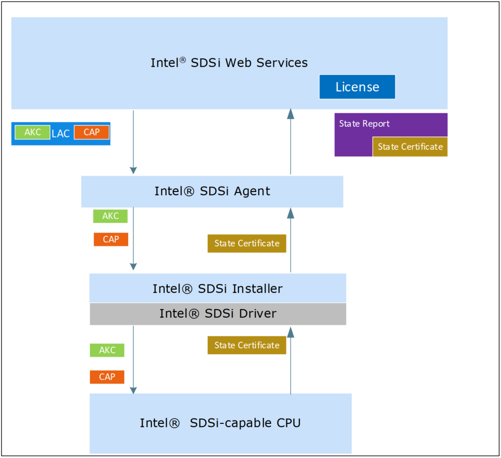
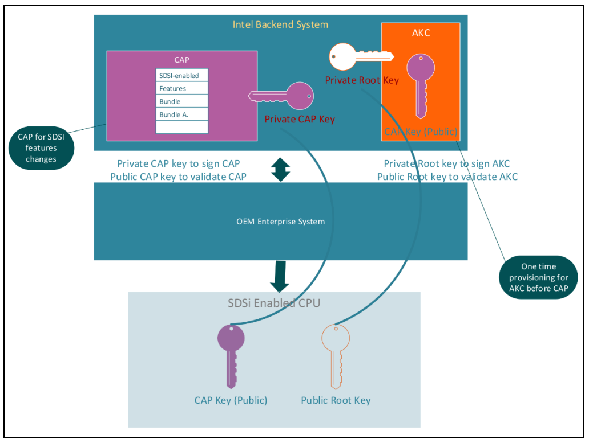
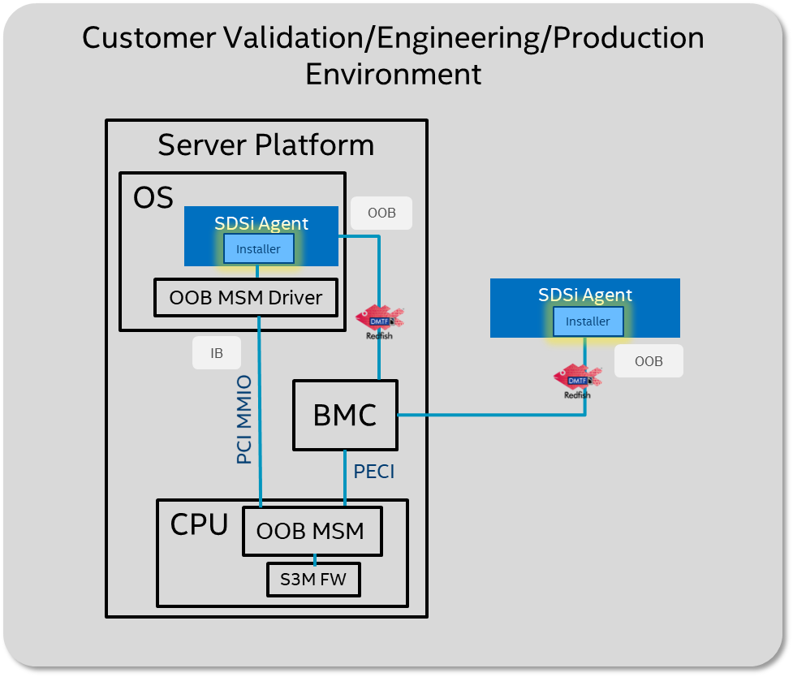
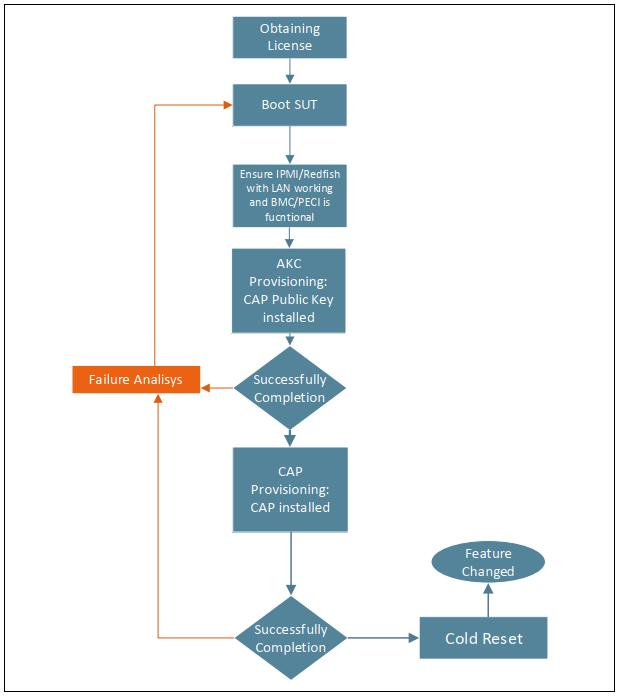

# SDSi（Software Defined Silicon）


* **SDSi License**: A record in the Intel® SDSi infrastructure registering the OTA authorization granted against Intel® SDSi-Enabled CPU.
* **Authentication Key Certificate (AKC)**: The key certificate used to authenticate the capability activation payload provisioned in the CPU.
* **Capability Activation Payload (CAP)**: A CPU reconfiguration token authenticated using the authentication key certificate and applied to the CPU configuration state installed in the CPU by the SDSi Installer using the “-w -p” command line options, leading to features enabling.
* **License Activation Code (LAC)**: License Activation Code (LAC) is the information available to the customer when an OTA purchase order has been fulfilled. LAC is a compound data structure that packages together the Capability Activation Payload and Authentication Key Certificate along with
wrapper info that is consumed by the Intel® SDSi Agent software.
  * 客户必须获取 LAC，provision 到给定的 Intel® SDSi Enabled CPU 并激活它，这样才能访问购买的 OTA 能力。
* **One-Time-Activation (OTA)**: 通过获得并激活与需要的能力关联的永久性 LAC，从而获得可以修改 Intel® SDSi-Enabled CPU configuration 的能力，该能力是永久的。 OTA 修改是永久的且无法逆转的。
  * 个人理解，这里指的是 LAC 的 provision 是一次性的、永久的把 CAP Public Key 写入到 CPU，但 CAP 的变更可以是多次的。

## 认证 AKC 和 CAP 的流程

* 认证大致流程如下： 
  1. SDSi 的 feature changes 的 CAP 会在 Intel SDSi Cloud Infrastructure 被用 Private CAP Key 签名
  2. Intel SDSi Cloud Infrastructure 用 Private Root Key 签名 AKC（含有 CAP 的 Public Key），而 Intel SDSi-enabled CPU 含有 Public Root Key，届时用于 validate AKC
  3. Provision AKC 时，CPU 用 Public Root Key 校验输入的 AKC 文件，把得到的 CAP 的 Public Key 存入 CPU
  4. Provision CAP 时，CPU 用 CAP 的 Public Key 去校验输入的 CAP 文件

## Provision
* Features/configuration 发生变更后需要重新 provisioning
* 不重叠的 feature bundles 不会被擦除
* 重叠的 feature bundles，最高的 capability 会被 provisioned，SPR 不支持降级（比如从 QAT 4 降到 QAT 2）
* 支持“return to base” capability，该能力可以将 CPU 返回到它的基本能力，但仅提供在有限的场景（比如，订单取消，RMA，validation 等）
* 所有的 ACK 和 CAPs 都有一个与之关联的 revision ID，用于防止*重放攻击*
* 每个 provisioning CPU 会检查 CAP 里的 revision ID，只有比存在 CPU 里的 revision ID 大的 CAP 会被 provisioned，CAP 里的 revision ID 小于 CPU 里存的 ID 会导致 provisioning 失败
* Provision 过 AKC 的 CPU，下次变更 CAP 时无需再次 provisioning AKC
* Intel SDSi enabled CPUs 对能存储的 CAPs 有限制，大概是 40 个，超过之后无法再存储 CAPs
* 不支持混合 SKUs，系统里的所有 CPU 需要是一致的 SKUs，且使能（或禁用）一样的 features
* 对于不一致的情况，系统 BIOS 需要有以下修正选项：
  1. BIOS 在继续启动前，应该在所有 socket 上禁用所有不匹配的 feature
  2. BIOS 在继续启动前，应该在所有 socket 上配置“lowest common denominator”
  3. BIOS 应该显示一条报警/警告给用户



### OOB Provision

* 通过 Installer 与 BMC 交互的方式被称为 OOB（Out-Of-Band）
  * Installer 可以部署在 OEM 的服务器端，也可以安装在客户的操作系统上
  * 二者都是通过 PECI 接口与 CPU 交互，执行 provision

* Intel SDSi Installer
> The Intel® SDSi Installer can operate in two different modes: In-Band and Out of Band (OOB). In-Band mode means that Intel® SDSi installer is using an internal PECI interface to communicate with the CPU and does not require external BMC communication to provisioning; meanwhile, the OOB installer can perform operations remotely thought BMC with one remote host connected to the target server or set of servers.
>
> This guide is focused on OOB mode because the current Intel® SDSi installer version only supports OOB mode at this time.

### In-band Provisioning 流程
* In-band provisioning 和 OOB-SUT 的场景大致相同，最显著的不同是不需要 BMC
* 因此 Agent/Installer 需要安装在 SUT (System Under Test) 上
* Intel 提供 OOB-MSM driver（Intel SDSi Installer and Agent package 的一部分），该驱动通过内部的 PCIe 接口（MMIO）与 CPU 直接交互
* Intel VSEC 驱动
```c
intel_vsec_pci_probe()
-> intel_vsec_walk_dvsec() // 填充 Designated Vendor-Specific header
-> intel_vsec_walk_vsec() // 填充 Vendor-Specific header
-> intel_vsec_walk_header()
   -> intel_vsec_add_dev() // 根据 header 信息填充 struct intel_vsec_device 结构
```
* Intel SGSi 驱动
```c
sdsi_probe() // 根据 struct intel_vsec_device 结构得到 SDSi discovery table
-> sdsi_map_mbox_registers() // 根据 SDSi discovery table 得到 SDSi MMIO 的地址
```

## Kernel Configs
* CONFIG_INTEL_VSEC
* CONFIG_INTEL_SDSI

## 工具
* Intel SDSi provision tool
  * tools/arch/x86/intel_sdsi/sdsi.c

## 设备文件
* `/sys/bus/auxiliary/devices/intel_vsec.sdsi.X/*`
  * /sys/bus/auxiliary/devices/intel_vsec.sdsi.X/guid
  * /sys/bus/auxiliary/devices/intel_vsec.sdsi.X/registers
  * /sys/bus/auxiliary/devices/intel_vsec.sdsi.X/provision_akc
  * /sys/bus/auxiliary/devices/intel_vsec.sdsi.X/provision_cap
  * /sys/bus/auxiliary/devices/intel_vsec.sdsi.X/state_certificate
  * /sys/bus/auxiliary/devices/intel_vsec.sdsi.X/meter_certificate
  * /sys/bus/auxiliary/devices/intel_vsec.sdsi.X/meter_current

* `guid` 属性以如下方式定义
```cpp
static DEVICE_ATTR_RO(guid);

static struct attribute *sdsi_attrs[] = {
    &dev_attr_guid.attr,
    NULL
};
```
* 其他属性通过一些列 `BIN_ATTR_ADMIN_RO()` 宏来定义，例如：
```cpp
static BIN_ATTR_ADMIN_RO(registers, SDSI_SIZE_REGS);

static struct bin_attribute *sdsi_bin_attrs[] = {
    &bin_attr_registers,
    &bin_attr_state_certificate,
    &bin_attr_meter_certificate,
    &bin_attr_meter_current,
    &bin_attr_provision_akc,
    &bin_attr_provision_cap,
    NULL
};
```
* 最后统一由 `sdsi_init() -> auxiliary_driver_register(&sdsi_aux_driver)` 加入 `/sys/bus/auxiliary/devices/intel_vsec.sdsi.X` 目录
```cpp
static const struct attribute_group sdsi_group = {
    .attrs = sdsi_attrs,
    .bin_attrs = sdsi_bin_attrs,
    .is_bin_visible = sdsi_battr_is_visible,
};
__ATTRIBUTE_GROUPS(sdsi);
...
static const struct auxiliary_device_id sdsi_aux_id_table[] = {
    { .name = "intel_vsec.sdsi" },
    {}
};
MODULE_DEVICE_TABLE(auxiliary, sdsi_aux_id_table);

static struct auxiliary_driver sdsi_aux_driver = {
    .driver = {
        .dev_groups = sdsi_groups,
    },
    .id_table   = sdsi_aux_id_table,
    .probe      = sdsi_probe,
    .remove     = sdsi_remove,
};
```

## 测试脚本
* selftests: sdsi: test sysfs setup
  * tools/testing/selftests/drivers/sdsi/sdsi.sh
  * tools/testing/selftests/drivers/sdsi/sdsi_test.py

* PCI Express Vendor Specific Capability (VSEC)

## State Report
* [State Report Format](https://wiki.ith.intel.com/display/sdsi/State+Report+Format)
* **State Report (SR)** 是代表服务器平台状态的信息。对于平台上的每个 hardware asset（当前 SDSi capable CPU），它可以包含一个或多个 State Certificates 和 一个或多个 Meter Certificates。
* **State Certificate** 包含单个 hardware asset 关于 SDSi 状态的信息，包括：
  * SDSi 寄存器
  * SDSi NVRAM 的 dump，里面有所有之前安装的 CAP 和 AKC
* **Meter Report** 包含关于处理器的各种参数的使用的信息，该信息是计数器的形式。