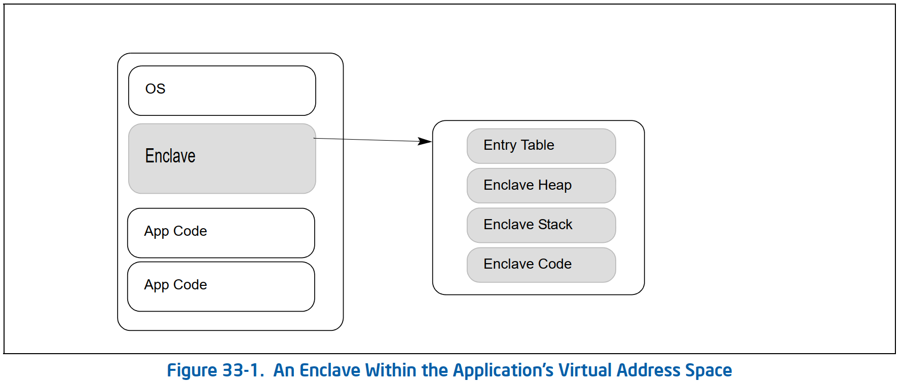

# Overview
* Intel® **Software Guard Extensions** (Intel® **SGX**) is a set of instructions and mechanisms for memory accesses added to Intel® Architecture processors.
* Intel SGX can encompass two collections of instruction extensions,
  * The **SGX1 extensions** allow an application to instantiate a protected container, referred to as an enclave.
    * The **enclave** is a trusted area of memory, where critical aspects of the application functionality have hardware-enhanced confidentiality and integrity protections.
  * The **SGX2 extensions** allow additional flexibility in
    * runtime management of enclave resources
    * thread execution within an enclave



# Enclave Interaction and Protection
* Intel SGX introduces two significant capabilities to the Intel Architecture
  1. the change in enclave memory access semantics
  2. protection of the address mappings of the application

# Enclave Life Cycle
* Enclave memory management is divided into two parts:
  * address space allocation
  * memory commitment
* **Address space allocation** is the specification of the range of linear addresses that the enclave may use. This range is called the **ELRANGE**.
* **Memory commitment** is the assignment of actual memory resources (as pages) within the allocated address space.
* Enclave process
  1. Untrusted application code starts using an initialized enclave typically by using the `EENTER` leaf function provided by Intel SGX to transfer control to the enclave code residing in the protected **Enclave Page Cache (EPC)**.
  2. Upon enclave entry, control is transferred by hardware to software inside the enclave.
  3. The software inside the enclave switches the stack pointer to one inside the enclave.
  4. When returning back from the enclave, the software swaps back the stack pointer then executes the `EEXIT` leaf function.
  5. The enclave code returns to the caller via the `EEXIT` leaf function.
* On processors that support the SGX2 extensions,
  * an enclave writer may add memory to an enclave using the SGX2 instruction set, after the enclave is built and running.
    * These instructions allow adding additional memory resources to the enclave for use in such areas as the heap.
  * allow the enclave to add new threads to the enclave.
* Calling an external procedure from an enclave could be done using the `EEXIT` leaf function.
   ```c
                  |  EEXIT   |
                  | ----->   |
   trusted section| <-----   | untrusted section
                  | software |
                  |convention|
   ```
* An active enclave consumes resources from the **Enclave Page Cache (EPC)**.
  * Intel SGX provides the `EREMOVE` instruction that an EPC manager can use to reclaim EPC pages committed to an enclave.
  * The EPC manager uses `EREMOVE` on every enclave page when the enclave is torn down.
  * After successful execution of `EREMOVE` the EPC page is available for allocation to another enclave.

# Data Structures and Enclave Operation
* SGX Enclave Control Structure (SECS)
  * one SECS for each enclave
  * contains meta-data about the enclave
    * used by the hardware
    * cannot be directly accessed by software
  * Included in the SECS is a field `MRENCLAVE`, that stores the enclave build measurement value:
    * initialized by the `ECREATE` instruction
    * updated by every `EADD` and `EEXTEND`.
    * locked by `EINIT`.
  * is created when `ECREATE` is executed.
* Thread Control Structure (TCS)
  * Every enclave contains one or more TCS structures.
  * contains meta-data used by the hardware to save and restore thread specific information when entering/exiting the enclave.
  * There is one field, `FLAGS`, that may be accessed by software.
    * This field can only be accessed by debug enclaves.
    * The flag bit, `DBGOPTIN`, allows to single step into the thread associated with the TCS.
  * can be created using the `EADD` instruction or the SGX2 instructions

# Enclave Page Cache
* The **Enclave Page Cache (EPC)** is the secure storage used to store enclave pages when they are a part of an executing enclave.
* For an EPC page, hardware performs additional access control checks to restrict access to the page after:
  * the current page access checks
  * translations are performed
* Generally an EPC page is only accessed by
  * the owner of the executing enclave
  * an instruction which is setting up an EPC page
* The EPC is divided into EPC pages.
  * an EPC page is `4KB` in size
  * always aligned on a `4KB` boundary
* Pages in the EPC can either be valid or invalid.
  * Every valid page in the EPC belongs to one enclave instance.
  * Each enclave instance has an EPC page that holds its SECS.
* The EPC is managed by privileged software.
  * Intel SGX provides a set of instructions for adding and removing content to and from the EPC.
  * The EPC may be configured by BIOS at boot time.
  * On implementations in which EPC memory is part of system DRAM, the contents of the EPC are protected by an encryption engine.

# Enclave Page Cache Map (EPCM)
* The security metadata for each EPC page is held in an internal micro-architectural structure called **Enclave Page Cache Map (EPCM)**
  * The EPCM is a secure structure used by the processor to track the contents of the EPC.
  * The EPCM holds one entry for each page in the EPC.
  * The format of the EPCM is micro-architectural, and consequently is implementation dependent.
* The EPCM contains the following architectural information:
  * The status of EPC page with respect to
    * validity
    * accessibility
  * An SECS identifier of the enclave to which the page belongs
  * The type of page:
    * regular
    * SECS
    * TCS
    * VA
  * The linear address through which the enclave is allowed to access the page
  * The specified read/write/execute permissions on that page
* The EPCM structure is used by the CPU in the *address-translation flow* to enforce access-control on the EPC pages.
* The EPCM entries are managed by the processor as part of various *instruction flows*.

# Enclave Instructions and Intel SGX
* The enclave instructions available with Intel SGX are organized as leaf functions under three instruction mnemonics:
  * ENCLS (ring 0)
  * ENCLU (ring 3)
  * ENCLV (VT root mode)
* Each leaf function uses `EAX` to specify the *leaf function index*, and may require additional implicit input registers as parameters.
  * The use of `EAX` is implied implicitly by the `ENCLS`, `ENCLU`, and `ENCLV` instructions;
  * `ModR/M` byte encoding is not used with `ENCLS`, `ENCLU`, and `ENCLV`.
  * The use of additional registers does not use `ModR/M` encoding and is implied implicitly by the respective leaf function index.
* Each *leaf function index* is also associated with a unique, leaf-specific mnemonic.
  * A long-form expression of Intel SGX instruction takes the form of `ENCLx`[LEAF_MNEMONIC], where ‘x’ is either ‘S’, ‘U’, or ‘V’.
  * The long-form expression provides clear association of the privilege-level requirement of a given “leaf mnemonic”.

# Discovering Support for Intel SGX and Enabling Enclave Instructions
* Processor support of Intel SGX is enumerated by a feature flag in `CPUID` leaf `07H`: `CPUID.(EAX=07H, ECX=0H):EBX.SGX[bit 2]`.
* If `CPUID.(EAX=07H, ECX=0H):EBX.SGX = 1`
  * the processor has support for Intel SGX, and requires *opt-in* enabling by BIOS via `IA32_FEATURE_CONTROL` MSR.
  * `CPUID` will report via the available sub-leaves of `CPUID.(EAX=12H)` on available and/or configured Intel SGX resources.
    * The available and configured Intel SGX resources enumerated by the sub-leaves of `CPUID.(EAX=12H)` depend on the state of BIOS configuration.
## Intel SGX Opt-In Configuration
* `IA32_FEATURE_CONTROL` provides the `SGX_ENABLE` field (`bit 18`).
  * Before system software can configure and enable Intel SGX resources, BIOS is required to set `IA32_FEATURE_CONTROL.SGX_ENABLE = 1` to opt-in the use of Intel SGX by system software.
* The semantics of setting `SGX_ENABLE` follows the rules of `IA32_FEATURE_CONTROL.LOCK` (`bit 0`).
  * Software is considered to have opted into Intel SGX if and only if `IA32_FEATURE_CONTROL.SGX_ENABLE` and `IA32_FEATURE_CONTROL.LOCK` are set to `1`.
  * The setting of `IA32_FEATURE_CONTROL.SGX_ENABLE` (`bit 18`) is not reflected by `CPUID`.

## Abort Page 语义
* 非 ecnclave 软件无法访问 PRM 内存。在 PRM 内部解析的内存访问会导致中止事务（aborted transaction），这在架构级别上是未定义的。
* 在当前处理器上，
  * 被 aborted 的写入被忽略，
  * 被 aborted 的读取返回一个 bit 全部设置为 1 的值。
* 这在上面描述的场景，其中 enclave 作为动态加载库加载到主机应用程序进程中。内核将 ELRANGE 中 enclave 的代码和数据映射到 EPC 页面。
  * 如果应用软件试图访问 ELRANGE 内部的内存，它将遇到中止事务语义。
* 当前语义不会导致应用程序崩溃（例如，由于 page fault），而且还保证主机应用程序将无法篡改 enclave 或读取其私有信息。

## Version Array (VA)
* SDM Vol. 3D 34-19
* 为了安全地存储被驱逐的 EPC 页面的版本，SGX 定义了一种特殊的 EPC 页面类型，称为 **Version Array（VA）**
* 每个 VA 页面包含`512`个 slots，每个 slot 包含一个从 EPC 中逐出的页面的`8 byte`的版本号
* 当 EPC 页面被驱逐时，软件会在 VA 页面中选择一个空 slot；此 slot 接收被驱逐页面的唯一版本号
* 重新加载 EPC 页面时，必须有一个保存页面的版本的 VA slot
  * 如果页面重新加载成功，则清除 VA slot 中的版本
* VA 页面也可以被驱逐，就像任何其他 EPC 页面一样
  * 当驱逐一个 VA 页面时，必须使用某个其他 VA 页面中的版本 slot 来保存被驱逐的 VA 的版本
* Version Array 页面必须是`4K`字节对齐的

### EPC 页面的操作系统管理
* EPC 是一种有限的资源。SGX1（即 `CPUID.(EAX=12H, ECX=0):EAX.SGX1 = 1` 但 `CPUID.(EAX=12H, ECX=0):EAX.SGX2 = 0`）为 EPC 管理器提供 leaf function 来管理此资源并正确地将页面从 EPC 换出和换入 EPC
  * 为此，EPC 管理器需要跟踪所有 EPC 条目、类型和状态、上下文关联和 SECS 关联
* 用`EBLOCK`指令将作为驱逐候选的 enclave 页面移动到`BLOCKED`状态，该指令确保不会通过尝试引用`BLOCKED`页面来创建新的缓存虚拟地址到物理地址的映射
* 在驱逐被 blocked 的页面之前，EPC 管理器应该在该 enclave 上执行`ETRACK` leaf function，并确保没有陈旧的缓存虚拟到物理地址映射被 blocked 的页面保留在平台上的任何线程上
* 从被 blocked 页面中删除所有过时的 translations 后，系统软件应使用`EWB` leaf function 将页面安全地逐出 EPC
  * `EWB`加密 EPC 中的页面，将其写入未受保护的内存（system RAM），并使 EPC 中的副本无效
  * 此外，`EWB`还会创建页面的 *加密 MAC（PCMD.MAC）* 并将其存储在未受保护的内存中（system RAM）
  * 将来只有当数据和 MAC 匹配时，才能将页面重新加载回处理器
  * 为了确保只能加载被驱逐页面的最新版本，被驱逐页面的版本安全地存储在 EPC 中的 Version Array（VA）中
* SGX1 包含两条用于重新加载已被系统软件驱逐的页面的指令：`ELDU`和`ELDB`，两条指令之间的区别在于指令结束后的页的状态
  * `ELDU`导致页面被重新加载并设置为`UNBLOCKED`状态
  * `ELDB`导致页面加载为`BLOCKED`状态
* `ELDB` 旨在供 Virtual Machine Monitor（VMM）使用
  * 当 VMM 重新加载被驱逐的页面时，它需要将其恢复到页面被驱逐时的正确状态（`BLOCKED`与`UNBLOCKE`）
  * 根据驱逐时页面的状态，VMM 选择`ELDB`或`ELDU`

### Enclave 页面的驱逐
* SGX 分页经过优化，允许操作系统（OS）在一次同步下将多个页面逐出 EPC
* 从 EPC 中逐出页面列表的建议流程是：
1. 对于要从 EPC 中逐出的每个页面：
   1. 在 Version Array（VA）页面中选择一个空槽
      * 如果 VA 页面没有空的 slot，用`EPA` leaf function 创建一个新的 VA 页面
   2. 从 enclave 上下文的映射表（页表和 EPT 表）中删除线性地址到物理地址的映射
   3. 对目标页面执行`EBLOCK` leaf function
      * 这会将目标页面状态设置为`BLOCKED`，此时不会创建页面的新映射。因此，任何没有在 TLB 中缓存映射的访问都将生成`#PF`
2. 对于包含在步骤 1 中选择的页面的每个 enclave：
   * 执行一个`ETRACK` leaf function，指向该 enclave 的`SECS`
   * 这将启动跟踪过程，以确保清除 blocked 页面的所有线性地址到物理地址转换的缓存
3. 对于在包含步骤 1 中选择的 enclave 的进程（OS）或 guests（VMM）中执行的所有逻辑处理器：
   * 向这些线程发出 IPI（处理器间中断），这会导致这些逻辑处理器异步地退出它们可能在其中的任何 enclave
   * 并刷新缓存的线性地址到物理地址转换，这些转换中可能持有对 blocked 页面的陈旧转换
   * 不需要额外的措施，例如执行“TLB shootdown”
4. 在 enclave 退出后，允许逻辑处理器恢复正常操作，包括 enclave 重入，因为跟踪逻辑会跟踪活动
5. 对于要驱逐的每个页面使用`EWB` leaf function 驱逐页面，参数包括
   1. 指向 EPC 页面的有效地址指针
   2. VA slot
   3. 用于保存加密页面内容的`4K`字节缓冲区
   4. 用于保存页面元数据的`128`字节缓冲区
   * 最后三个元素以加密的方式绑定在一起，必须用于稍后重新加载页面。
* 此时，系统软件在主存中拥有 *使用其页面元数据加密的* 每个页面数据的唯一副本

### 重新载入 Enclave 页面
* 要重新加载以前被驱逐的页面，系统软件需要四个元素：
  * 页面被驱逐时使用的 VA slot
  * 包含加密页面内容的缓冲区
  * 包含页面元数据的缓冲区
  * 与此页面关联的父 SECS
* 如果 VA 页面或父 SECS 尚未在 EPC 中，则必须先重新加载它们
1. 执行`ELDB/ELDU`（取决于是否需要页面为`BLOCKED`状态），作为参数传递：EPC 页面线性地址、VA slot、加密页面和页面元数据
2. 在 enclave 上下文映射表（页表和 EPT 表）中创建一个映射，以允许应用程序访问该页（OS：系统页表；VMM：EPT）

### 驱逐 SECS 页面
* SECS 页面的逐出类似于 enclave 页面的逐出，唯一的区别是，只有等到属于 enclave 的所有其他页面都被逐出后，才能逐出 SECS 页
* 由于所有其他页面都已被驱逐，因此在 enclave 内将没有线程执行，并且不需要使用`ETRACK`进行跟踪
* 重新加载 enclave 时，SECS 页面必须在所有其他构成（constituent）页面之前重新加载
1. 确保从 enclave 中逐出所有页面
2. 在 VA 页面中选择一个空 slot
   * 如果 VA 页面没有空的 slot ，则使用`EPA` leaf function 创建一个新 VA 页面
3. 使用`EWB` leaf function 驱逐页面，参数包括
   * 指向 EPC 页面的有效地址指针
   * VA slot
   * 一个`4K`字节缓冲区来保存加密页面内容
   * 一个`128`字节缓冲区来保存页面元数据
* 最后三个元素以加密方式绑定在一起，必须用于稍后重新加载页面

### 驱逐 Version Array 页面
* VA 页面不属于任何 enclave，不需要使用`ETRACK`进行跟踪
* 驱逐 VA 页面时，必须指定不同 VA 页面中的 slot，以便提供被驱逐的 VA 页面的版本控制
1. 在 VA 页面中选择一个 slot，而不是被驱逐的页面
   * 如果 VA 页面没有空的 slot ，则使用`EPA` leaf function 创建一个新 VA 页面
2. 使用`EWB` leaf function 驱逐页面，参数包括
   * 指向 EPC 页面的有效地址指针
   * VA slot
   * 一个`4K`字节缓冲区来保存加密页面内容
   * 一个`128`字节缓冲区来保存页面元数据
* 最后三个元素以加密方式绑定在一起，必须用于稍后重新加载页面


## 35.4 INTEL SGX KEY 和 ATTESTATION
### 35.4.1 Enclave 度量和识别
* 在 enclave 构建过程中，对每个 enclave 进行两次“度量”，并存储在两个`256 bit`度量寄存器（Measurement Registers，MR）中：`MRENCLAVE`和`MRSIGNER`
  * `MRENCLAVE`代表 enclave 的内容和构建过程
  * `MRSIGNER`代表签名 enclave 的`SIGSTRUCT`的实体
* 度量寄存器的值包含在证明中，以便远程方识别 enclave
* MR 也包含在大多数 keys 中，将 keys 绑定到具有特定 MR 的 enclave

#### 35.4.1.1 MRENCLAVE
* **MRENCLAVE** 是一个唯一的`256 bit`值，用于标识在初始启动期间加载到 enclave 的代码和数据
  * 它被计算为由`ECREATE` leaf function 初始化的 SHA256 哈希
  * `EADD`和`EEXTEND` leaf function 记录有关每个页面的信息以及这些页面的内容
  * `EINIT` leaf function 最终确定存储在`SECS.MRENCLAVE`中的哈希
  * 任何对构建过程、页面内容、页面权限等的篡改都会导致不同的`MRENCLAVE`值
* 图 35-2 说明了在构建 enclave 时更改 MRENCLAVE 寄存器的简化流程：

* 使用`ECREATE`创建 enclave
* 使用`EADD`将非 enclave 原始面复制到未初始化 enclave 的 EPC 中
* 修改 enclave 的页面内容后更新两次`MRENCLAVE`，即两次`EEXTEND`
* 使用`EINIT`完成 enclave 构建
* 有关插入 hash 的特定值的详细信息，请参见各个指令定义
#### 35.4.1.2 MRSIGNER
* 每个 enclave 都使用 `3072 bit` RSA key 进行签名，签名存储在`SIGSTRUCT`中
* 在`SIGSTRUCT`中，enclave 的签名者还为 enclave 分配了 **产品 ID（ISVPRODID）** 和 **安全版本（ISVSVN）**
* `MRSIGNER`是签名者公钥的 SHA-256 哈希
* 对于支持 Key Separation and Sharing（`CPUID.(EAX=12H, ECX=1).EAX.KSS[7]`）的平台，`SIGSTRUCT`可以另外指定`16 bytes` **扩展产品 ID（ISVEXTPRODID）** 和 `16 byptes` **系列 ID（ISVFAMILYID）**
* 在证明中，`MRSIGNER`可用于允许软件根据作者批准 enclave，而不是维护`MRENCLAVE`列表
* 它用于 key 派生，以允许软件创建应用程序的沿袭
* 通过使用相同的 key 签名多个 enclave，enclave 将共享相同的 keys 和数据
* 结合安全版本号，作者可以发布一个应用程序的多个版本，这些版本可以访问以前版本的 keys，但不能访问该应用程序的未来版本

## SGX 指令
### EREPORT - 创建一个加密的 Enclave 报告

#### EREPORT 执行的操作
1. 校验三个操作数（RBX，RCX，RDX 给出的地址）在 enclave 中
2. 根据`RBX`指向的`TARGETINFO`结构中给出的值，为目标 enclave 计算一个 report key
3. 组装 enclave `SECS`的数据以完成`REPORT`结构（包括使用`RCX`（`REPORTDATA`）操作数提供的数据）
4. 通过`REPORT`结构计算加密哈希
5. 将计算的哈希添加到`REPORT`结构中
6. 将完成的`REPORT`结构输出到`RDX`中的地址（`OUTPUTDATA`）


## Enclave 文件格式
* Enclave 文件通常以共享库的形式出现
* Enclave 库文件包含受信任的代码和数据部分，当 enclave 创建时，它们将被加载到受保护的 EPC 中
* 在 enclave 文件中，还有一个 SGX 特定的数据结构，即 enclave 元数据
  * 元数据未加载到 EPC，相反，不受信任的加载程序使用它来确定如何在 EPC 中正确加载 enclave
  * 元数据定义了许多受信任线程上下文，其中包括受信任的 stack 和可信运行时系统在 enclave 初始化时初始化的受信任的 heap
  * 需要受信任的线程上下文和受信任的 heap 来支持受信任的执行环境
  * 元数据还包含 enclave 签名结构，它是 enclave 真实性和来源的重要证明
* 即使 enclave 可以作为共享库文件交付，定义哪些代码和数据放置在 enclave 内以及哪些保留在不受信任的应用程序中是 enclave 开发的一个关键方面
* Enclave 镜像是一个静态链接共享对象，没有任何外部的依赖
* Enclave 可以和静态库链接，不能和动态库链接，如果 enclave 文件有未解析的依赖，签名 enclave 镜像的过程会失败
* 应用程序可以和不受信任的库进行链接，以帮助加载 enclave 镜像
* 要使用 enclave，应通过调用 API `sgx_create_enclave()` 或 `sgx_create_encalve_ex()` 将 `enclave.so` 加载到受保护的内存中
* 要卸载 enclave，使用参数 `sgx_enclave_id_t` 调用 `sgx_destroy_enclave()` 接口

## Enclave 接口和调用 enclave 函数
* 比如定义如下接口`ecall_malloc_free`
  * Enclave/TrustedLibrary/Libc.edl
```idl
/* Libc.edl - EDL sample for trusted C library. */

enclave {

    from "sgx_tstdc.edl" import sgx_oc_cpuidex;

    /*
     * A subset of the C99 standard is supported as well as SGX customized functions:
     *  sgx_cpuid, etc.
     */

    trusted {
        /*
         * Utilize malloc/free in enclave.
         */
        public void ecall_malloc_free(void);
    };
};
```
* 并且实现 enclave 函数 `ecall_malloc_free()`
  * Enclave/TrustedLibrary/Libc.cpp
```cpp
/* ecall_malloc_free:
 *   Uses malloc/free to allocate/free trusted memory.
 */
void ecall_malloc_free(void)
{
    void *ptr = malloc(100);
    assert(ptr != NULL);
    memset(ptr, 0x0, 100);
    free(ptr);
}
```
* 编译时会自动生成文件 Enclave/Enclave_t.c 以及函数 `sgx_ecall_malloc_free()` 来调用它
```cpp
static sgx_status_t SGX_CDECL sgx_ecall_malloc_free(void* pms)
{
    sgx_status_t status = SGX_SUCCESS;
    if (pms != NULL) return SGX_ERROR_INVALID_PARAMETER;
    ecall_malloc_free();
    return status;
}
```
  * 该文件会被编译和链接进将要运行在 EPC 中的 enclave 映像文件 `enclave.so` 中
* 编译时会自动生成文件 App/Enclave_u.c 及同名函数 `ecall_malloc_free()`
```cpp
sgx_status_t ecall_malloc_free(sgx_enclave_id_t eid)
{
    sgx_status_t status;
    status = sgx_ecall(eid, 25, &ocall_table_Enclave, NULL);
    return status;
}
```
  * 该文件会被编译和链接进运行在 EPC 之外的 app 中
  * 对于非调试版的 enclave，调试器看到的是这个函数

## References
* [SGX技术的分析和研究](http://jos.org.cn/html/2018/9/5594.htm)
* [Intel SGX Explained](http://css.csail.mit.edu/6.858/2020/readings/costan-sgx.pdf)
* [给Intel SGX初学者的几句话](https://blog.csdn.net/clh14281055/article/details/109169469)
* [小谈Intel SGX](https://blog.csdn.net/clh14281055/article/details/109091363)
* [Overview of Intel SGX - Part 1, SGX Internals](https://blog.quarkslab.com/overview-of-intel-sgx-part-1-sgx-internals.html)
* [Overview of Intel SGX - Part 2, SGX Externals](https://blog.quarkslab.com/overview-of-intel-sgx-part-2-sgx-externals.html)