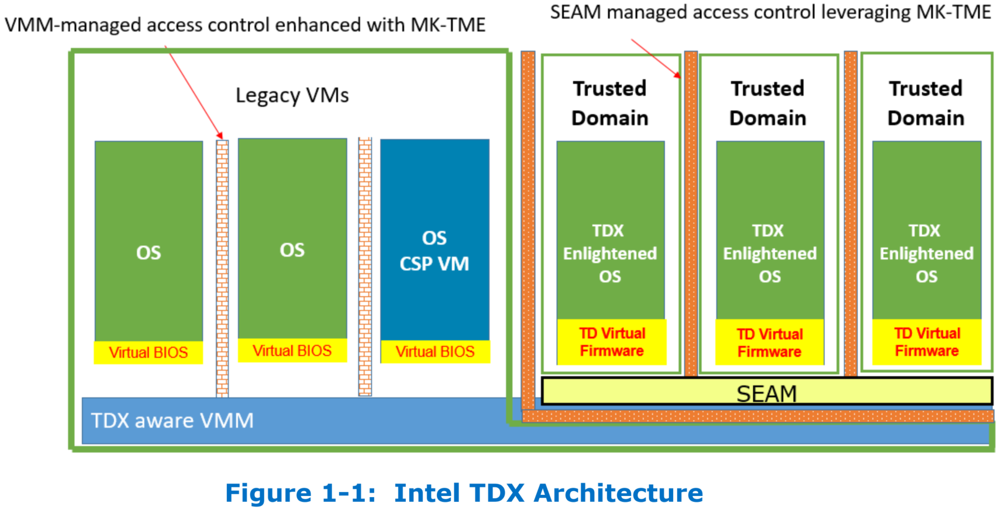
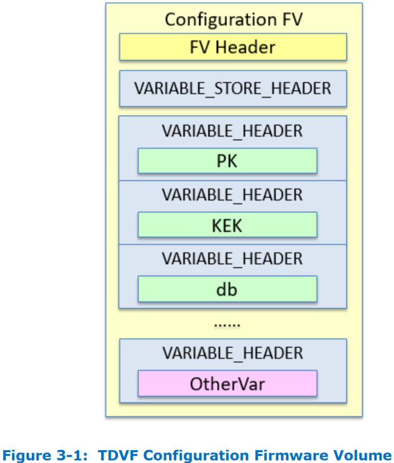
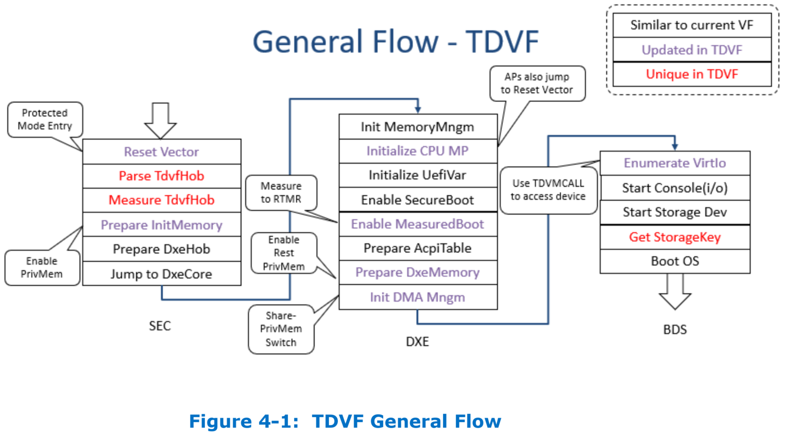
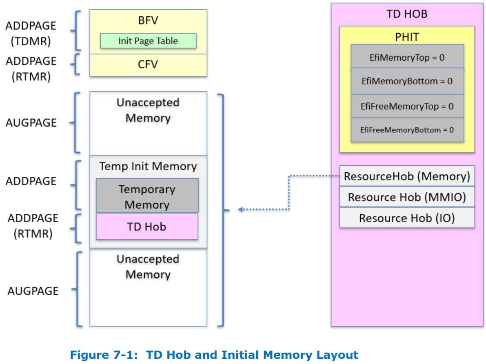
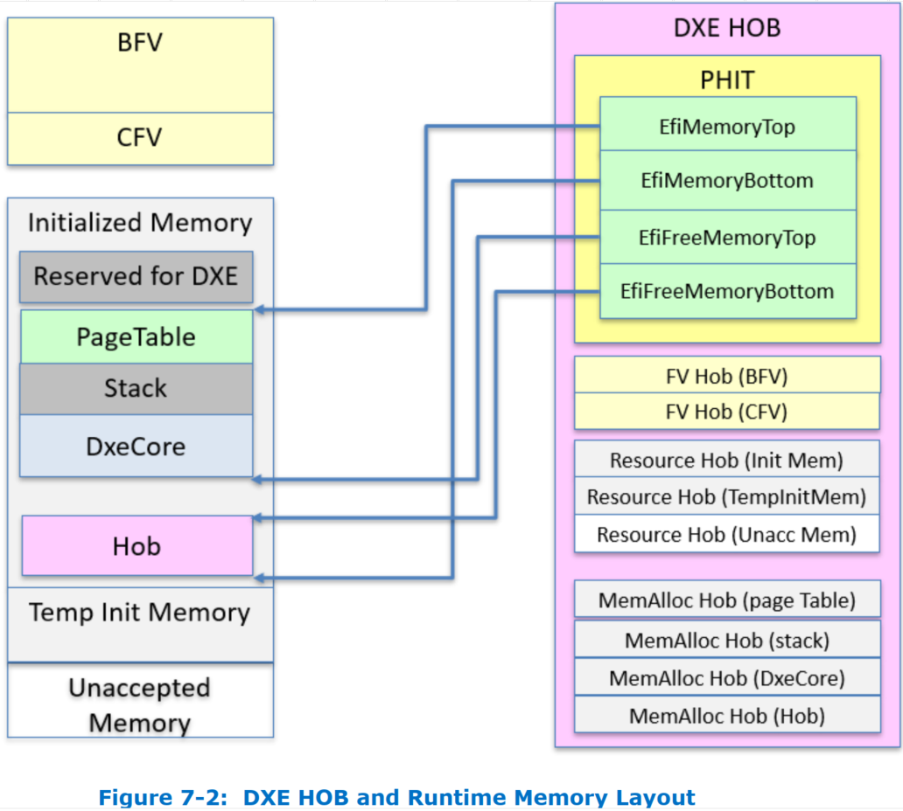
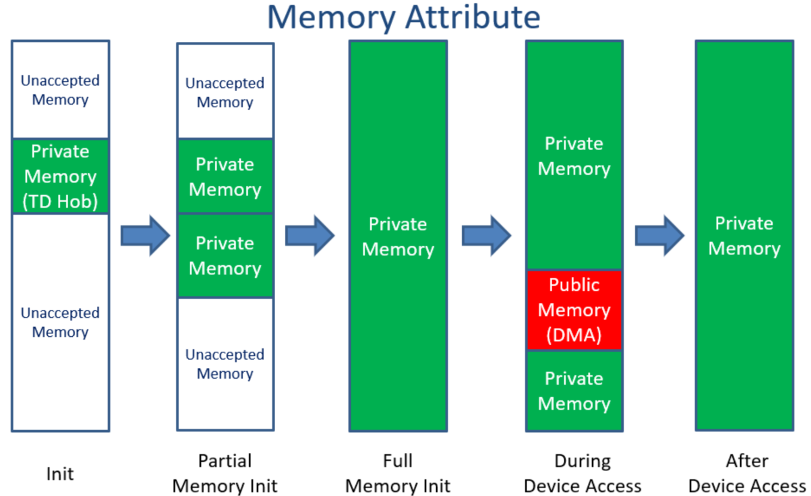
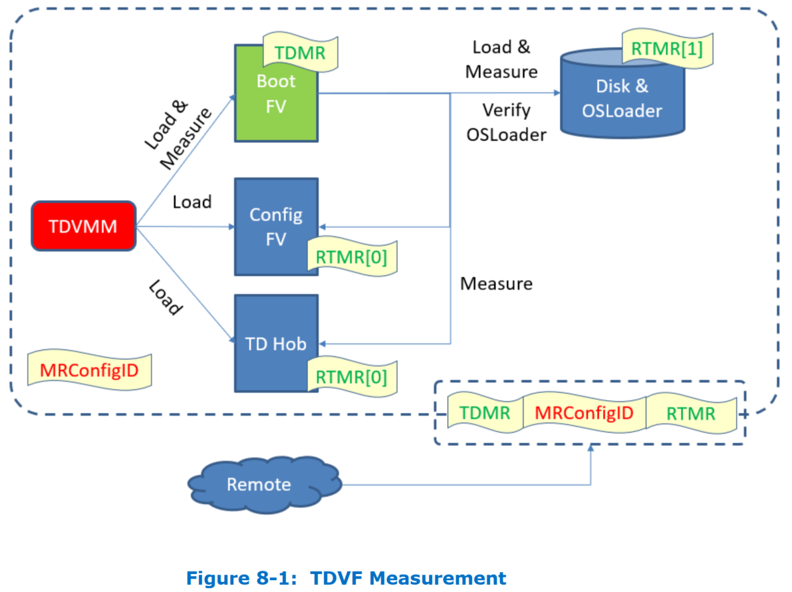
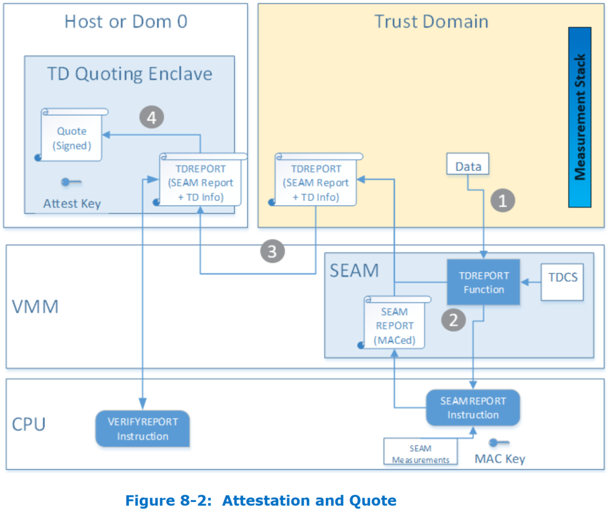
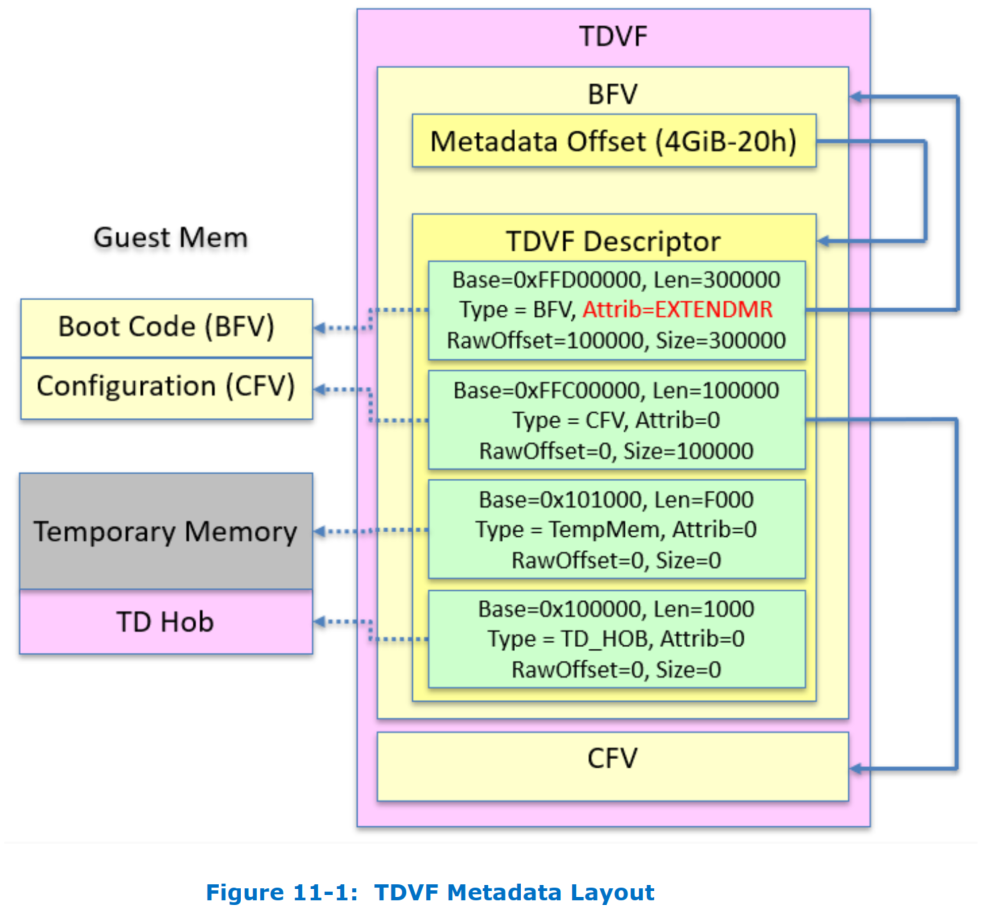

# TDVF
## 1 介绍


## 2 架构概览
### 2.1 TDVF 特性
* TDVF 有以下特性：
1. 使用 **Unified Extensible Firmware Interface（UEFI）** Secure Boot 作为带有 TD 启动扩展的基础
2. 使用 **Trusted Computing Group（TCG）** Trusted Boot 来启动一个已度量和校验过的 guest OS loader 或者内核
3. 通过移除以下传统 UEFI 实现中的特性来简化固件
   1. SEC，PEI，SMM（仅 DXE）
   2. CSM（仅 UEFI Class 3 OS）
   3. 配置用户界面
   4. 恢复
   5. Capsule-based 的固件升级
   6. ACPI S3（不被 TDX guest 支持）

### 2.2 TD 硬件
* 一个 TD 基于以下硬件
1. CPU：x2APIC
2. CPU：`xFLUSH`、`STI`、`CLI`、`LIDT`、`LGDT` 指令是允许的
3. VMM 特定的虚拟设备（块设备、控制台、网络）。高度依赖于 hypervisor 配置（例如，VirtIO 设备对于 KVM/XEN，Vmbus 设备对于微软 Hyper-V）
4. 热插拔 - CPU 和 内存热插拔现在还不支持。设备热插拔不在该文档的讨论范围
5. TD 可以支持也可以不支持以下特性。如果支持，设备必须通过 `TDCALL[TDG.VP.VMCALL]` 接口来访问，取代直接的硬件访问。例如，IO 访问需要被替换成 `TDCALL[TDG.VP.VMCALL]<INSTRUCTION.IO>`
   1. 持久性非易失存储
   2. 模拟物理设备（图形、键盘、存储等）
   3. I/O 子系统（PCI、USB、ISA、DMA、IOMMU、PIC、PIT 等）。例如，PCI 可能只被用于模拟 VirtIO 设备
   4. MMIO（APIC、HPET）
   5. vTPM

### 2.3 启动流程
* 一个 TD 启动采取以下步骤：
1. VMM 设置 TDVF，调用 TDX module 去创建初始度量，然后调用 TDX module 去启动 TDVF
2. TDVF 启动，并启用 UEFI Secure Boot
3. TDVF 准备 TD 事件日志和启动 OS loader

#### 2.3.1 VMM 设置阶段
* TDVF 镜像包含 *固件代码*，已度量到 TD Measurement Register（`MRTD`）
* TDVF 镜像也可以包含 *静态配置数据*，包括 UEFI Secure Boot 证书（PK/KEK/db/dbx）
* VMM 提供 *动态配置数据*，包括 **hand-off block（HOB）** 列表作为给入口点的一个参数
* VMM 调用 TD module 初始化 TD 内存。包括固件代码和由租户捕获的 UEFI Secure Boot 配置的只读数据
  * TDX module 通过 Extended Page Table（EPT）关联内存和 TD guest
  * TDX module 通过 TD-Virtual Machine Control State（VMCS）关联逻辑处理器和 TD guest
  * TDX module 在所有的处理器上执行 `TDENTER` 指令，包括 Bootstrap Processor（BSP） 和 Application Processors（APs）

#### 2.3.2 TDVF 启动阶段
* TDVF 在所有的处理器上启动：
  * 所有处理器以 32 位保护模式开始，用平坦段描述符（flat descriptors）（禁用分页）
  * `VCPU_INDEX` 为 `0` 的 CPU 被选为 BSP，其他的 CPUs 为 APs
  * 起始代码切换到 4 级分页（0 - 4GB）。也可选让起始代码切换到 5 级分页（0 - 4GB）
  * BSP 执行虚拟固件初始化，并通过 `TDCALL[TDG.VP.INFO]` 决定有多少 AP 要被唤醒
  * APs 执行 `TDCALL[TDG.VP.INFO]`，并在内存中等待 BSP 触发的虚拟唤醒

#### 2.3.3 TDVF OS 启动阶段
* TDVF 准备信息，并最终启动到 OS loader
  * 内存映射已准备，且私有内存已使用
  * ACPI 表报告平台信息
  * UEFI Secure Boot 被启用
  * TD 事件日志已准备
  * APs 在等待唤醒

### 2.4 TDVF 的要求
* TDVF 应该达到以下要求：
1. TDVF 由 hypervisor 和 TDX module 启动
   1. TDVF 的入口点是 32 位保护模式，由 TDX module 启动
   2. TDVF 开启长模式并继续运行在长模式
   3. TDVF 解析来自 hypervisor 的系统信息
   4. TDVF 挂起 AP 直到 AP 唤醒
2. TDVF 启动 guest TD
   1. TDVF 启动 guest TD OS loader
   2. TDVF 提供内存映射给 guest TD
   3. TDVF 提供 ACPI 表给 guest TD
   4. TDVF 支持多处理器，且允许 guest TD 去唤醒 APs
3. 安全
   1. TDVF 启用 UEFI Secure Boot
   2. TDVF 创建 TD 事件日志，并传递给 guest TD
   3. TDVF 设置私有内存

## 3 TDVF Binary Image

### 3.1 Boot Firmware Volume (BFV)
* TDVF 包含一个 **Firmware Volume（FV）**，即为 **Boot Firmware Volume**
  * FV 格式在 UEFI Platform Initialzation（PI）规范中定义
* Boot Firmware Volume 包括所有在启动期间需要 TDVF 组件
* 该文件系统 GUID 必须是 `EFI_FIRMWARE_FILE_SYSTEM2_GUID` 或 `EFI_FIRMWARE_FILE_SYSTEM3_GUID`，在 PI 规范中定义
  * edk2/MdePkg/Include/Guid/FirmwareFileSystem2.h
```cpp
///
/// The firmware volume header contains a data field for
/// the file system GUID
///
#define EFI_FIRMWARE_FILE_SYSTEM2_GUID \
  { 0x8c8ce578, 0x8a3d, 0x4f1c, { 0x99, 0x35, 0x89, 0x61, 0x85, 0xc3, 0x2d, 0xd3 } }
```
  * edk2/MdePkg/Include/Guid/FirmwareFileSystem3.h
```cpp
///
/// The firmware volume header contains a data field for the file system GUID
/// {5473C07A-3DCB-4dca-BD6F-1E9689E7349A}
///
#define EFI_FIRMWARE_FILE_SYSTEM3_GUID \
  { 0x5473c07a, 0x3dcb, 0x4dca, { 0xbd, 0x6f, 0x1e, 0x96, 0x89, 0xe7, 0x34, 0x9a }}
```

1. `TdResetVector` - 该组件提供 TDVF 的入口点，切换到长模式、跳转到 DxeIpl
   * FFS GUID 必须是 `EFI_FFS_VOLUME_TOP_FILE_GUID`，在 PI 规范中定义
2. `TdDxeIpl` - 该组件准备 DxeCore 需要的参数并跳转到 DxeCore
3. `DxeCore` - 这是标志的 DxeCore，用于标准的 UEFI 固件。它分派所有的 DXE modules
4. `DXE Modules` - 这些是 TDVF 特定的 modules，初始化 TDVF 环境和启动 OS loader
* BFV 可以包含一个初始的静态页表，帮助 `ResetVector` 从 32 位模式切换到 64 位模式

### 3.2 Configuration Firmware Volume (CFV)
* TDVF 也可以包含一个 **Configuration Firmware Volume (CFV)**，从 boot firmware volume 中分离出来。这么做的原因是
  * CFV 在 `RTMR` 中度量
  * BFV 在 `MRTD` 中度量
* Configuration Firmware Volume 含有所有的预备数据
  * 该区域是只读的
  * 一个可能的用法是给 UEFI Secure Boot Variable 提供该区域中内容，比如 PK、KEK、db、dbx
  * 该区域可包含额外的配置变量
* 该文件系统 GUID 必须是 `EFI_SYSTEM_NV_DATA_FV_GUID`，定义在 https://github.com/tianocore/edk2/blob/master/MdeModulePkg/Include/Guid/SystemNvDataGuid.h
```cpp
#define EFI_SYSTEM_NV_DATA_FV_GUID \
  {0xfff12b8d, 0x7696, 0x4c8b, {0xa9, 0x85, 0x27, 0x47, 0x7, 0x5b, 0x4f, 0x50} }
```
* 变量存储首部必须是 `VARIABLE_STORE_HEADER`，变量首部必须是 `VARIABLE_HEADER`，定义都在 https://github.com/tianocore/edk2/blob/master/MdeModulePkg/Include/Guid/VariableFormat.h
```cpp
///
/// Variable Store region header.
///
typedef struct {
  ///
  /// Variable store region signature.
  ///
  EFI_GUID    Signature;
  ///
  /// Size of entire variable store,
  /// including size of variable store header but not including the size of FvHeader.
  ///
  UINT32      Size;
  ///
  /// Variable region format state.
  ///
  UINT8       Format;
  ///
  /// Variable region healthy state.
  ///
  UINT8       State;
  UINT16      Reserved;
  UINT32      Reserved1;
} VARIABLE_STORE_HEADER;
...
///
/// Single Variable Data Header Structure.
///
typedef struct {
  ///
  /// Variable Data Start Flag.
  ///
  UINT16      StartId;
  ///
  /// Variable State defined above.
  ///
  UINT8       State;
  UINT8       Reserved;
  ///
  /// Attributes of variable defined in UEFI specification.
  ///
  UINT32      Attributes;
  ///
  /// Size of variable null-terminated Unicode string name.
  ///
  UINT32      NameSize;
  ///
  /// Size of the variable data without this header.
  ///
  UINT32      DataSize;
  ///
  /// A unique identifier for the vendor that produces and consumes this varaible.
  ///
  EFI_GUID    VendorGuid;
} VARIABLE_HEADER;
```



## 4 TD Launch
* 该章节描述了 VMM 如何将控制权传给 TDVF 的
### 4.1 TDVF 初始化
* 因为 TDVF 依赖于 TDX module，初始化流程和典型的 VM 支持的固件的用法是不同的（例如，Open Virtual Machine Firmware（OVMF））

#### 4.1.1 VCPU Init State
* 当 TDX module 启动 TDVF 时，虚拟 CPU（VCPU）在 32 位保护模式，且平坦段描述符（flat descriptors）和禁用分页的环境下执行

#### 4.1.2 系统信息
* 当 VMM 调用 TDX module 启动 TDVF，VMM 必须构建系统信息，作为 HOB 在 `RCX` 和 `R8`（系统内存位置），将之传递给 TDVF
##### Qemu
```cpp
tdx_finalize_vm()
-> tdvf_hob_create(tdx_guest, tdx_get_hob_entry(tdx_guest))
-> tdx_post_init_vcpus()
   -> hob = tdx_get_hob_entry(tdx_guest)
   -> hob_addr = (void *)hob->address;
      CPU_FOREACH(cpu)
      -> tdx_vcpu_ioctl(cpu, KVM_TDX_INIT_VCPU, 0, hob_addr);
         -> __tdx_ioctl(vcpu_fd, TDX_VCPU_IOCTL, cmd_id, flags, data)
               case TDX_VCPU_IOCTL:
               -> kvm_vcpu_ioctl(state, KVM_MEMORY_ENCRYPT_OP, &tdx_cmd)
                  -> ioctl(cpu->kvm_fd, type, arg)
   for_each_tdx_fw_entry(tdvf, entry)
   -> tdx_vm_ioctl(KVM_TDX_INIT_MEM_REGION, flags, &mem_region)
-> tdx_vm_ioctl(KVM_TDX_FINALIZE_VM, 0, NULL)
```
##### Kernel
```cpp
kvm_arch_vcpu_ioctl()
   case KVM_MEMORY_ENCRYPT_OP:
   -> kvm_x86_ops.vcpu_mem_enc_ioctl(vcpu, argp)
   => vt_vcpu_mem_enc_ioctl()
      -> tdx_vcpu_ioctl(vcpu, argp)
         -> tdx_td_vcpu_init(vcpu, (u64)cmd.data)
            -> tdh_vp_init(tdx->tdvpr_pa, vcpu_rcx)
               -> kvm_seamcall(TDH_VP_INIT, tdvpr, rcx, 0, 0, 0, 0, 0, 0, NULL);
```

#### 4.1.3 长模式变换
* 32 位的 TDVF 初始化代码会设置分页并切换到长模式
  * 因为 TDCALL 只在长模式有效
  * 32 位的 TDVF 初始化代码不能调用 TDCALL 转换私有内存区域
  * 32 位的 TDVF 初始化代码不能访问任何 permanent memory
* 32 位的 TDVF 初始化代码可以参考在 TDVF flash image 内部的一个初始化临时页表（ROM page table），该页表在构建时期创建
  * 因为该页表是不可更新的，页表的 Access Bit 和 Dirty Bit 必须被设置为 `1`
  * 如果实现 ROM page table 的话，它必须在 Boot Firmware Volume 中
* 一旦 TDVF 切换到长模式，它会从 resource description HOB 获得 permanent memory 的信息，分配私有内存，在私有内存中创建最终的页表
* TDVF 应该参考 Guest 物理地址宽度 GPAW（**RBX[0:6]**）来决定有多少内存可以被页表转换
  * 如果 GPAW 是 48 位，那么 TDVF 应该设置成 4 级分页
  * 如果 GPAW 是 52 位，那么 TDVF 应该设置成 5 级分页

#### 4.1.4 设置调用 C 函数的栈
* 32 位的 TDVF 初始化代码运行在 flash 上
  * 因为它不能访问任何 permanent memory
  * 这段代码也不能使用栈，（能使用栈）这是 C 语言的要求
* 在 TDVF 切换到长模式并发送 TDCALL 将私有内存转换为共享内存后，TDVF 可以在私有内存中设置栈，并调用 C 函数

#### 4.1.5 切换到 UEFI 环境
* PEI 的目的是探测和初始化内存。然而 TDVF 已经通过 HOB 了解到内存的信息了，TDVF 可以跳过为了收集信息的 PEI 阶段，直接跳到 DXE
* 如果需要更多的 HOB 条目，TDVF 可以从 permanent memory 分配一个新的 HOB，并将之传给 DXE
* 整个启动流程如下所示：
* **阶段 1**：TD 初始化代码 - 32 位保护模式（无栈）
  1. 使用 TDVF flash image 上的 ROM page table
  2. 切换到长模式
* **阶段 2**：TD 初始化代码 - 64 位长模式（无栈）
  1. 解析 TD Hob 来获得内存的位置
  2. 设置初始私有页面，现在我们可以使用内存了
  3. 在私有页面上设置临时栈
  4. 跳转到 C 代码
* **阶段 3**：TD 初始化代码 - 64 位长模式（C 代码）
  1. 在私有页面上设置 *TD 初始化堆*
  2. 在堆上创建 DXE Hob，基于 TD Hob
  3. 在堆上设置最终的页表
  4. 在堆上设置最终的栈
  5. 在堆上重定位 DXE core
  6. 跳转到 DXE
* **阶段 4**：UEFI 环境
  1. 分派驱动
  2. 唤醒 APs
  3. 设置 ACPI 表
  4. 准备 TD 度量
  5. 准备内存映射
  6. 启动控制台和存储设备
  7. 调用 OS loader
* **阶段 5**：OS 环境
  1. 初始化 OS
  2. 唤醒 APs



### 4.2 TD Hand-Off Block（HOB）
* TD HOB 列表用于将信息从 VMM 传递到 TDVF
  * HOB 格式在 PI 规范中定义
* TD HOB 必须包含 PHIT HOB、Resource Descriptor HOB。其他 HOBs 是可选的
* TDVF 必须基于 TD HOB 创建自己的 DXE HOB，把 DXE HOB 传给 DXE Core
  * DXE HOB 的需求在 UEFI PI 规范中描述
#### 4.2.1 PHIT HOB
* TD HOB 必须包含 **PHIT HOB** 作为第一个 HOB
  `EfiMemoryTop`、`EfiMemoryBottom`、`EfiFreeMemoryTop` 和 `EfiFreeMemoryBottom` 应该为零

#### 4.2.2 Resource Description HOB
* TD HOB 必须包含至少一个 **Resource Description HOB** 来声明物理内存资源
* 任何在这里报告的 DRAM 应该被 TDVF **接受**，除了 Temporary memory 和 TD HOB 区域，在 TD 元数据章节描述
* Resource HOB 可以基于 VMM 提供的 guest 硬件可选地报告 MMIO 和 IO 区域

#### 4.2.3 CPU HOB
* CPU HOB 是可选的
* 如果包含这样一个 HOB，TDVF 必须忽略它，并且为 DXE 创建它自己的 CPU HOB
* 基于 Resource HOB 报告的 IO，该 CPU HOB 应该有 `SizeOfMemorySpace` 等于 GPAW（48 或 52）和 `SizeOfIoSpace`（0 或 16）

#### 4.2.4 GUID Extension HOB
* TD HOB 可以包含 *GUID 扩展 HOB* 来描述 TD 特性，和 VMM 或 TDVF 相关
* 任何 TD HOB 中的 *GUID 扩展 HOB* 必须被传递给 DXE HOB

### 4.3 TDVF AP 处理

#### 4.3.1 AP Init State
* AP 的初始状态和 BSP 的初始状态完全相同
* `VCPU_INDEX` 在 `INIT_STATE.RSI` 或 `TD_INFO.R9[0:21]` 中报告
  * 它从 0 开始，在每次成功的 `TDINITVP` 时顺序地分配
* `NUM_VCPUS` 在 `TD_INFO.R8[0:31]` 中报告。它是可用的虚拟 CPU 的个数，例如，active 或者 ready
  * TDVF 需要该数目决定有多少 CPU 要加入
* `MAX_VCPUS` 在 `TD_INFO.R8[32:63]` 中报告。它是 TD 的虚拟 CPU 的最大数目
  * 这个版本的 TDVF 忽略该值
  * 在将来的版本中，它可以被用于其他目的，比如 later-add
* TDX module 会以从 `0` 到 `(NUM_VCPUS - 1)` 的 `VCPU_INDEX` 开启 VCPU
  * 如此，TDVF 把 `VCPU_INDEX` 为 `0` 的 CPU 作为 BSP 对待
  * 然而，TDVF 不能假设 `VCPU_INDEX` 为 `0` 的 CPU 被第一个被启动
  * TDVF 需要在早期初始化代码中汇合（CPU），让 BSP 执行主启动流程，且让 AP 执行等待循环

#### 4.3.2 报告从 VMM 到 TDVF 的 AP 信息
* 在 TDX 中，没有 INIT/SIPI 协议。期望是 VMM 需要启动所有的 VCPU 到 TDVF 入口点
  * 在 reset 后，所有的 CPUs 运行相同的初始化代码
  * TDVF 来做 BSP 选取
* BSP 选取可能有几种方式。TDVF 此时可以依赖来自 TDX module 的信息，但 TDVF 一定不能依赖来自 VMM 的信息
1. 所有的 CPUs 尝试设置全局标志
   * 第一个设置标志的 CPU 被选为 BSP，并且做剩余的 BSP 工作
   * 其余的 CPUs 只是等待来自 BSP 的释放信号，然后做剩余的 AP 工作（不依赖 TDX module 提供的信息）
2. `VCPU_INDEX` 是 `0` 的 CPU 为 BSP。`VCPU_INDEX` 为非零的 CPUs 是 APs（依赖 TDX module 提供的信息）

### TDVF Launch 的代码实现
* [Bug 3429 - Add TDVF to OvmfPkg ](https://bugzilla.tianocore.org/show_bug.cgi?id=3429)
* commit ID：`62540372230ecb5318a9c8a40580a14beeb9ded0..8b76f235340922a6d293bff05978ba57d3b498e1`
* commit ID：`b328bb54c6e5510bc687302e4b717694bd441891..b328bb54c6e5510bc687302e4b717694bd441891`

#### CPU 上电后的 Reset Vector
* `guidedStructureEnd:` 之前是 GUIDed Structure Table，见下面对 TDX Metadata 的详解
* `applicationProcessorEntryPoint:` 是 AP 的入口点
* `resetVector:` 是 **Reset Vector**，偏移在镜像末尾 - 16 Byte，因此会被映射到内存地址 `0xfffffff0`，会 CPU 上电后从 `0xfffffff0` 开始执行
* `fourGigabytes:` 会映射到 4G 结束的内存地址 `0xffffffff`
* edk2/OvmfPkg/ResetVector/ResetVector.nasmb 会包含所有会被汇编进 reset vector 的代码文件
  * 包括定义了 `%macro OneTimeCall` 的 edk2/UefiCpuPkg/ResetVector/Vtf0/CommonMacros.inc
* ResetVectorVtf0.asm 会被编译进 TDVF image，TDVF 作为 firmware 会被放入（虚拟的）ROM flash。在启动时 ROM 会映射到 4G 结束的内存地址
  * edk2/OvmfPkg/ResetVector/Ia16/ResetVectorVtf0.asm
```asm
...
guidedStructureEnd:

ALIGN   16

applicationProcessorEntryPoint:
;
; Application Processors entry point
;
; GenFv generates code aligned on a 4k boundary which will jump to this
; location.  (0xffffffe0)  This allows the Local APIC Startup IPI to be
; used to wake up the application processors.
;
    jmp     EarlyApInitReal16

ALIGN   8

    DD      0

;
; The VTF signature
;
; VTF-0 means that the VTF (Volume Top File) code does not require
; any fixups.
;
vtfSignature:
    DB      'V', 'T', 'F', 0

ALIGN   16

resetVector:
;
; Reset Vector
;
; This is where the processor will begin execution
;
; In IA32 we follow the standard reset vector flow. While in X64, Td guest
; may be supported. Td guest requires the startup mode to be 32-bit
; protected mode but the legacy VM startup mode is 16-bit real mode.
; To make NASM generate such shared entry code that behaves correctly in
; both 16-bit and 32-bit mode, more BITS directives are added.
;
%ifdef ARCH_IA32
    nop
    nop
    jmp     EarlyBspInitReal16

%else
; 对于 X64 TD guest 要求启动模式为 32 位保护模式，而 legacy VM 启动模式为 16 位实模式。为了使 NASM 生成在 16 位和 32 位模式下都能正确运行的共享入口代码，添加了更多的 BITS 指令
    mov     eax, cr0 ; CR0 的值传入 eax
    test    al, 1    ; CR0.PE（保护模式）是否开启？
    jz      .Real    ; 未开启，跳到实模式的入口点
BITS 32
    jmp     Main32   ; 已开启，跳到 32 位保护模式的入口点
BITS 16
.Real:
    jmp     EarlyBspInitReal16

%endif

ALIGN   16

fourGigabytes:
```
* 来看看一个 TD 刚启动时的样子
```c
(gdb) x /32i 0xfffffff0
   0xfffffff0:  mov    %cr0,%rax
=> 0xfffffff3:  test   $0x1,%al
   0xfffffff5:  je     0xfffffffc
   0xfffffff7:  jmpq   0xffffff24
   0xfffffffc:  .byte 0xe9
   0xfffffffd:  or     %edi,%edi
   0xffffffff:  nop
   0x100000000: Cannot access memory at address 0x100000000
```

#### TDVF 32 位保护模式的入口 `Main32`
* TDVF 的 32 位保护模式的入口点为 `Main32`
1. 先调用 `InitTdx` 例程做一些初始化工作，见下面详解
2. `Flat32SearchForBfvBase` 从 4G 地址 `0xffffffff` 以 4K 为单位搜索 BFV，搜索范围是 16MB
   * `Flat32SearchForBfvBase` 的定义位于 edk2/UefiCpuPkg/ResetVector/Vtf0/Ia32/SearchForBfvBase.asm
   * 通过比较 `EFI_FIRMWARE_FILE_SYSTEM2_GUID` 和 `EFI_FIRMWARE_FILE_SYSTEM3_GUID` 来确定 BFV 的位置
   * 通过 `EBP` 返回 BFV 的地址
3. `Flat32SearchForSecEntryPoint` 在 BFV 中找到 SEC 入口点
   * `Flat32SearchForSecEntryPoint` 的定义位于 edk2/UefiCpuPkg/ResetVector/Vtf0/Ia32/SearchForSecEntry.asm
   * `EBP` 为 BFV 的地址，通过 `ESI` 返回 SEC 入口点的地址
4. `Transition32FlatTo64Flat` 从 32 位平坦模式变为 64 位平坦模式
   * `Transition32FlatTo64Flat` 的定义位于 edk2/OvmfPkg/ResetVector/Ia32/Flat32ToFlat64.asm
   * 调用 `SetCr3ForPageTables64` 设置 `CR3` 为 64 位页表
     * `CheckTdxFeaturesBeforeBuildPagetables` 检查 TDX 特性，通过 `EAX` 返回
       * 返回 `0`：检查 `[WORK_AREA_GUEST_TYPE]` 看之前 `InitTdx` 是否设置了类型为 TDX
       * 返回 `1`：取出 `[TDX_WORK_AREA_PGTBL_READY]` 的值，如果是 `0` 说明当前运行这段代码的的是 BSP，将返回值 `1` 放入 `EAX`
       * 返回 `2`：根据设计，TDX BSP 负责初始化页表，页表就绪后把 `[TDX_WORK_AREA_PGTBL_READY]` 设为 `1`；TDX AP 在 `[TDX_WORK_AREA_PGTBL_READY] == 0` 的条件上自旋，直到其值变为 `1`。因此这里看到 `[TDX_WORK_AREA_PGTBL_READY]` 的值如果是 `1`，说明当前运行这段代码的的是 AP，将返回值 `2` 放入 `EAX`
     * 如果是 BSP 跳转到 `ClearOvmfPageTables` 通过一个循环清除初始页表条目
       * 紧接着构建初始页表
       * 调用 `TdxPostBuildPageTables`，将 `[TDX_WORK_AREA_PGTBL_READY]` 的值设为 `1`，解除 AP 在 `InitTdxWorkarea` 的自旋
     * BSP 和解除自旋的 AP 都会走到 `SetCr3` 设置 `CR3` 为 `PT_ADDR (0)` 后返回
   * 设置 `CR4` 的第 `5` 位启用 PAE
   * 设置 `IA32_EFER.LME` MSR（`0xc0000080`）的第 `8` 位，启用长模式（IA-32e Mode）
   * 设置 `CR0` 的第 `31` 位启用分页 `EnablePaging`，至此处理器处于 64 位平坦模式
5. 将 `rsi`、`rbp`、`rsp` 的高 32 位清零，因为这几个寄存器是在 32 位模式的状态下设置的
6. 从 `rsp` 恢复 `rax` 的初始值（好像这里这个初始值没什么用？）
7. 此时 `EBP` 为 BFV 的地址，`ESI` 位 SEC 入口点的地址，`jmp rsi` 跳转到 64 位 SEC 的入口地址

* edk2/OvmfPkg/ResetVector/Main.asm
```asm
BITS    16

;
; Modified:  EBX, ECX, EDX, EBP
;
; @param[in,out]  RAX/EAX  Initial value of the EAX register
;                          (BIST: Built-in Self Test)
; @param[in,out]  DI       'BP': boot-strap processor, or
;                          'AP': application processor
; @param[out]     RBP/EBP  Address of Boot Firmware Volume (BFV)
; @param[out]     DS       Selector allowing flat access to all addresses
; @param[out]     ES       Selector allowing flat access to all addresses
; @param[out]     FS       Selector allowing flat access to all addresses
; @param[out]     GS       Selector allowing flat access to all addresses
; @param[out]     SS       Selector allowing flat access to all addresses
;
; @return         None  This routine jumps to SEC and does not return
;
Main16:
    OneTimeCall EarlyInit16

    ;
    ; Transition the processor from 16-bit real mode to 32-bit flat mode
    ;
    OneTimeCall TransitionFromReal16To32BitFlat

BITS    32

    ; Clear the WorkArea header. The SEV probe routines will populate the
    ; work area when detected.
    mov     byte[WORK_AREA_GUEST_TYPE], 0

%ifdef ARCH_X64

    jmp SearchBfv
; 32 位保护模式开启的时候，从 resetVector 跳转到这
;
; Entry point of Main32
;
Main32:
    OneTimeCall InitTdx ; 调用 InitTdx 初始化

SearchBfv:

%endif

    ;
    ; Search for the Boot Firmware Volume (BFV)
    ;
    OneTimeCall Flat32SearchForBfvBase

    ;
    ; EBP - Start of BFV
    ;

    ;
    ; Search for the SEC entry point
    ;
    OneTimeCall Flat32SearchForSecEntryPoint

    ;
    ; ESI - SEC Core entry point
    ; EBP - Start of BFV
    ;

%ifdef ARCH_IA32
...
%else

    ;
    ; Transition the processor from 32-bit flat mode to 64-bit flat mode
    ;
    OneTimeCall Transition32FlatTo64Flat

BITS    64

    ;
    ; Some values were calculated in 32-bit mode.  Make sure the upper
    ; 32-bits of 64-bit registers are zero for these values.
    ;
    mov     rax, 0x00000000ffffffff
    and     rsi, rax
    and     rbp, rax
    and     rsp, rax

    ;
    ; RSI - SEC Core entry point
    ; RBP - Start of BFV
    ;

    ;
    ; Restore initial EAX value into the RAX register
    ;
    mov     rax, rsp

    ;
    ; Jump to the 64-bit SEC entry point
    ;
    jmp     rsi

%endif
```
#### TDVF 中的 `InitTdx`
* `Main32` 第一步要做的就是 `InitTdx`，过程需要完成以下事情：
1. `ReloadFlat32` 加载预设好的 32 位平坦模式的段寻址寄存器
2. `InitTdxWorkarea` 初始化 TDX 工作区
   * 如果不是 TD Guest，该步骤什么都不用做
   * 如果是 TD Guest：
     * AP 自旋循环等待 TDX 工作区的页表就绪 `TDX_WORK_AREA_PGTBL_READY` 的内容变为 `1`，然后退出 TDX 工作区初始化
     * BSP 设置工作区 `WORK_AREA_GUEST_TYPE` 的 Guest 类型内容为 `2`，表示 Guest 是 TDX；设置 TDX 工作区 `TDX_WORK_AREA_GPAW` 的 GPAW 的内容；然后退出 TDX 工作区初始化
* `gdtr` 的定义见 edk2/UefiCpuPkg/ResetVector/Vtf0/Ia16/Real16ToFlat32.asm，该文件还有预定义好的 GDT 描述符
  * edk2/OvmfPkg/ResetVector/Ia32/IntelTdx.asm
```asm
%define VM_GUEST_TDX     2

BITS 32
; 检查当前允许环境是否是 TDX
;
; Check if it is Intel Tdx
;
; Modified: EAX, EBX, ECX, EDX
;
; If it is Intel Tdx, EAX is 1
; If it is not Intel Tdx, EAX is 0
;
IsTdx:
    ;
    ; CPUID (0)
    ;
    mov     eax, 0
    cpuid                    ; Intel CPU 的 CPUID[0] 应该返回 vendor_id = "GenuineIntel"
    cmp     ebx, 0x756e6547  ; "Genu"
    jne     IsNotTdx
    cmp     edx, 0x49656e69  ; "ineI"
    jne     IsNotTdx
    cmp     ecx, 0x6c65746e  ; "ntel"
    jne     IsNotTdx

    ;
    ; CPUID (1)
    ;
    mov     eax, 1
    cpuid
    test    ecx, 0x80000000  ; CPUID[1].eax[bit 32] 为 1 表示 hypervisor guest status = true
    jz      IsNotTdx

    ;
    ; CPUID[0].EAX >= 0x21?
    ;
    mov     eax, 0
    cpuid
    cmp     eax, 0x21
    jl      IsNotTdx

    ;
    ; CPUID (0x21,0)
    ;
    mov     eax, 0x21
    mov     ecx, 0
    cpuid                     ;  在 TD guest 中执行 CPUID[0x21] 能返回 "IntelTDX    " 才对

    cmp     ebx, 0x65746E49   ; "Inte"
    jne     IsNotTdx
    cmp     edx, 0x5844546C   ; "lTDX"
    jne     IsNotTdx
    cmp     ecx, 0x20202020   ; "    "
    jne     IsNotTdx

    mov     eax, 1            ; eax 作为返回值，设为 1 表示是 TDX guest
    jmp     ExitIsTdx

IsNotTdx:
    xor     eax, eax

ExitIsTdx:

  OneTimeCallRet IsTdx        ; 返回调用处
; 初始化 TDX 工作区
;
; Initialize work area if it is Tdx guest. Detailed definition is in
; OvmfPkg/Include/WorkArea.h.
; BSP and APs all go here. Only BSP initialize this work area.
;
; Param[in] EBX[5:0]    CPU Supported GPAW (48 or 52)
; Param[in] ESI[31:0]   vCPU ID (BSP is 0, others are AP)
;
; Modified:  EBX
;
InitTdxWorkarea:

    ;
    ; First check if it is Tdx
    ;
    OneTimeCall IsTdx

    test    eax, eax            ; 如果 eax 为 0，不是 TDX guest，退出 TDX 工作区初始化
    jz      ExitInitTdxWorkarea

    cmp     esi, 0              ; VCPU_INDEX 在 INIT_STATE.RSI 中报告，0 表示当前 vCPU 是 BSP
    je      TdxBspEntry         ; 跳到 BSP 的 TDX 入口
    ; 在 TD guest 中，BSP/AP 共享同一个入口点。BSP 建立页表，而 AP 不应该做同样的任务。相反，AP 只是利用 BSP 构建的页表。AP 将等待直到页表准备就绪。
    ;
    ; In Td guest, BSP/AP shares the same entry point
    ; BSP builds up the page table, while APs shouldn't do the same task.
    ; Instead, APs just leverage the page table which is built by BSP.
    ; APs will wait until the page table is ready.
    ;
TdxApWait:
    cmp     byte[TDX_WORK_AREA_PGTBL_READY], 0
    je      TdxApWait           ; AP 循环等待 TDX 工作区的页表就绪位置的内容变为 1，然后退出 TDX 工作区初始化
    jmp     ExitInitTdxWorkarea

TdxBspEntry:
    ;
    ; Set Type of WORK_AREA_GUEST_TYPE so that the following code can use
    ; these information.
    ;
    mov     byte[WORK_AREA_GUEST_TYPE], VM_GUEST_TDX ; 设置工作区的 Guest 类型内容为 2，表示 Guest 是 TDX

    ;
    ; EBX[5:0] CPU supported GPA width
    ;
    and     ebx, 0x3f          ; EBX[5:0] 为 CPU Supported GPAW (48 or 52)
    mov     DWORD[TDX_WORK_AREA_GPAW], ebx ; 设置 TDX 工作区的 GPAW 的内容

ExitInitTdxWorkarea:
    OneTimeCallRet InitTdxWorkarea ; 返回调用处

;
; Load the GDT and set the CS/DS/ES/FS/GS/SS.
;
; Modified:  EAX, DS, ES, FS, GS, SS, CS
;
ReloadFlat32:

    cli                         ; 关中断，允许中断发生会导致 CS 段选择符的值改变
    mov     eax, ADDR_OF(gdtr)  ; 预定义好的 GDT 的线性地址传入 eax
    lgdt    [eax]               ; 将预定义好的 GDT 加载到 GDTR
    ; LINEAR_CODE_SEL equ $-GDT_BASE, $ 是当前位置，GDT_BASE 是 GDT 表的起始标号，那么 LINEAR_CODE_SEL 就是 load 到 CS 的代码段选择符
    jmp     LINEAR_CODE_SEL:dword ADDR_OF(jumpToFlat32BitAndLandHere) ; ADDR_OF(jumpToFlat32BitAndLandHere) 是段偏移

jumpToFlat32BitAndLandHere:

    debugShowPostCode POSTCODE_32BIT_MODE
    ; 上面的 jmp 指令是长跳转，设置了 CS，下面初始化其他段寄存器
    mov     ax, LINEAR_SEL ; LINEAR_SEL 是数据段选择符，传入到 ax
    mov     ds, ax         ; 设置数据段寄存器 ds 为数据段选择符 LINEAR_SEL
    mov     es, ax         ; 设置扩展段寄存器 es 为数据段选择符 LINEAR_SEL
    mov     fs, ax         ; 设置 fs 为数据段选择符 LINEAR_SEL
    mov     gs, ax         ; 设置 gs 为数据段选择符 LINEAR_SEL
    mov     ss, ax         ; 设置栈段寄存器 es 为数据段选择符 LINEAR_SEL

    OneTimeCallRet ReloadFlat32

;
; Tdx initialization after entering into ResetVector
;
; Modified:  EAX, EBX, ECX, EDX, EBP, EDI, ESP
;
InitTdx:
    ;
    ; First load the GDT and jump to Flat32 mode
    ;
    OneTimeCall ReloadFlat32 ; 加载预设好的 32 位平坦模式的段寻址寄存器

    ;
    ; Initialization of Tdx work area
    ;
    OneTimeCall  InitTdxWorkarea ; 初始化 TDX 工作区

    OneTimeCallRet InitTdx       ; 返回调用处
```

#### SEC 的入口点
* `Main32` 的最后会跳到这里
* BSP 会按之前说的去解析 TD Hob，然后初始化栈，跳到 DXE core 入口
* AP 则会汇合 `.check_arrival_cnt:`
  * 汇合后第二次进入忙等等待 DXE 的 MpInitLib 往 mailbox 发生的 Wakeup 命令 `.check_command:`
  * 收到 Wakeup 命令后跳到 mailbox 里收到的唤醒向量
* edk2/OvmfPkg/IntelTdx/Sec/X64/SecEntry.nasm
```asm
#include <Base.h>
%include "TdxCommondefs.inc"

DEFAULT REL
SECTION .text

extern ASM_PFX(SecCoreStartupWithStack)

%macro  tdcall  0
  db  0x66, 0x0f, 0x01, 0xcc
%endmacro

;
; SecCore Entry Point
;
; Processor is in flat protected mode
;
; @param[in]  RAX   Initial value of the EAX register (BIST: Built-in Self Test)
; @param[in]  DI    'BP': boot-strap processor, or 'AP': application processor
; @param[in]  RBP   Pointer to the start of the Boot Firmware Volume
; @param[in]  DS    Selector allowing flat access to all addresses
; @param[in]  ES    Selector allowing flat access to all addresses
; @param[in]  FS    Selector allowing flat access to all addresses
; @param[in]  GS    Selector allowing flat access to all addresses
; @param[in]  SS    Selector allowing flat access to all addresses
;
; @return     None  This routine does not return
;
global ASM_PFX(_ModuleEntryPoint)
ASM_PFX(_ModuleEntryPoint):

    ;
    ; Guest type is stored in OVMF_WORK_AREA
    ;
    %define OVMF_WORK_AREA        FixedPcdGet32 (PcdOvmfWorkAreaBase)
    %define VM_GUEST_TYPE_TDX     2
    mov     eax, OVMF_WORK_AREA          ; 之前的步骤把 Guest 类型放在 OVMF_WORK_AREA，现读入 eax
    cmp     byte[eax], VM_GUEST_TYPE_TDX ; 是不是 TD Guest
    jne     InitStack                    ; 如果不是 TD Guest，跳到初始化栈的例程

    mov     rax, TDCALL_TDINFO           ; 如果是 TD Guest，则 TDCALL(TDG.VP.INFO) 来获取信息
    tdcall

    ;
    ; R8  [31:0]  NUM_VCPUS
    ;     [63:32] MAX_VCPUS
    ; R9  [31:0]  VCPU_INDEX
    ; Td Guest set the VCPU0 as the BSP, others are the APs
    ; APs jump to spinloop and get released by DXE's MpInitLib
    ;
    mov     rax, r9      ; 这个 TDCALL 的返回值里 R9 放的是 VCPU_INDEX
    and     rax, 0xffff  ; 这里为什么不掩完整的 32 位？
    test    rax, rax     ; BSP 这里的结果是 0，AP 结果为非零
    jne     ParkAp       ; AP 跳到 ParkAp 去忙等，BSP 继续走

InitStack:
    ; 解析 TD Hob 获得 temporary memory 的位置并初始化栈
    ;
    ; Fill the temporary RAM with the initial stack value.
    ; The loop below will seed the heap as well, but that's harmless.
    ;
    mov     rax, (FixedPcdGet32 (PcdInitValueInTempStack) << 32) | FixedPcdGet32 (PcdInitValueInTempStack)
                                                              ; qword to store
    mov     rdi, FixedPcdGet32 (PcdOvmfSecPeiTempRamBase)     ; base address,
                                                              ;   relative to
                                                              ;   ES
    mov     rcx, FixedPcdGet32 (PcdOvmfSecPeiTempRamSize) / 8 ; qword count
    cld                                                       ; store from base
                                                              ;   up
    rep stosq ; 循环的次数来自 RCX，在上面得到的

    ;
    ; Load temporary RAM stack based on PCDs
    ;
    %define SEC_TOP_OF_STACK (FixedPcdGet32 (PcdOvmfSecPeiTempRamBase) + \
                          FixedPcdGet32 (PcdOvmfSecPeiTempRamSize))
    mov     rsp, SEC_TOP_OF_STACK ; 栈顶值放入 RSP
    nop

    ;
    ; Setup parameters and call SecCoreStartupWithStack
    ;   rcx: BootFirmwareVolumePtr
    ;   rdx: TopOfCurrentStack
    ;
    mov     rcx, rbp  ; BFV 的地址放入 RCX
    mov     rdx, rsp  ; 栈顶放入 RDX
    sub     rsp, 0x20 ; 栈（底）向下增长 32 字节
    call    ASM_PFX(SecCoreStartupWithStack) ; 跳到 C 函数 SecCoreStartupWithStack()

    ;
    ; Note: BSP never gets here. APs will be unblocked by DXE
    ;
    ; R8  [31:0]  NUM_VCPUS
    ;     [63:32] MAX_VCPUS
    ; R9  [31:0]  VCPU_INDEX
    ;
ParkAp:

    mov     rbp,  r9 ; R9 为 VCPU_INDEX，即 vCPU ID

.do_wait_loop:
    mov     rsp, FixedPcdGet32 (PcdOvmfSecGhcbBackupBase) ; RSP 是 Mailbox 的起始地址？

    ;
    ; register itself in [rsp + CpuArrivalOffset]
    ;
    mov       rax, 1
    lock xadd dword [rsp + CpuArrivalOffset], eax ; 原子地增加汇合的 CPU 数目
    inc       eax

.check_arrival_cnt:
    cmp       eax, r8d           ; R8 是可用的 vCPU 数目，检查汇合的 CPU 数目是否汇齐了
    je        .check_command     ; 如果汇齐了，就检查命令
    mov       eax, dword[rsp + CpuArrivalOffset]    ; 如果没汇齐，重新读入当前的汇合 CPU 数目
    jmp       .check_arrival_cnt                    ; 没汇齐继续重复这一过程等待汇齐

.check_command:
    mov     eax, dword[rsp + CommandOffset]         ; 读取命令 
    cmp     eax, MpProtectedModeWakeupCommandNoop   ; 命令是 No Operation 吗？
    je      .check_command                          ; 如果是，循环读取命令

    cmp     eax, MpProtectedModeWakeupCommandWakeup ; 如果不是，进一步判断命令是 Wakeup 吗？
    je      .do_wakeup                              ; 如果是 wakeup，跳到唤醒 AP 例程

    ; Don't support this command, so ignore
    jmp     .check_command                          ; 如果不是，继续检查命令

.do_wakeup:
    ;
    ; BSP sets these variables before unblocking APs
    ;   RAX:  WakeupVectorOffset
    ;   RBX:  Relocated mailbox address
    ;   RBP:  vCpuId
    ;
    mov     rax, 0
    mov     eax, dword[rsp + WakeupVectorOffset]    ; RAX 是唤醒向量，即 AP 被唤醒后的入口地址
    mov     rbx, [rsp + WakeupArgsRelocatedMailBox] ; RBX 是重定位后的 mailbox 地址
    nop                                             ; RBP 是从 R9 得到的 vCpuId，源自 TDCALL
    jmp     rax                                     ; AP 跳转到唤醒向量
    jmp     $
```
* BSP 跳到 C 函数的入口 `SecCoreStartupWithStack()`
```c
//edk2/OvmfPkg/IntelTdx/Sec/SecMain.c
SecCoreStartupWithStack()
   //edk2/OvmfPkg/Library/PeilessStartupLib/PeilessStartup.c
-> PeilessStartup (&SecCoreData)
      //edk2/OvmfPkg/Library/PeilessStartupLib/DxeLoad.c
   -> DxeLoadCore (1)
         DEBUG ((DEBUG_INFO | DEBUG_LOAD, "Loading DXE CORE at 0x%11p EntryPoint=0x%11p\n",
                 (VOID *)(UINTN)DxeCoreAddress, FUNCTION_ENTRY_POINT (DxeCoreEntryPoint)));
         //edk2/MdePkg/Library/BaseLib/Ia32/InternalSwitchStack.c
      -> HandOffToDxeCore (DxeCoreEntryPoint)
            //edk2/MdePkg/Library/BaseLib/SwitchStack.c
         -> SwitchStack ((SWITCH_STACK_ENTRY_POINT)(UINTN)DxeCoreEntryPoint, HobList.Raw, NULL, TopOfStack)
            //edk2/MdePkg/Library/BaseLib/Ia32/InternalSwitchStack.c
            -> InternalSwitchStack (EntryPoint, Context1, Context2, NewStack, Marker)
               -> LongJump (&JumpBuffer, (UINTN)-1)
```
#### TDX DXE 入口点
* BSP 从 SEC core 跳转过来，通过 mailbox 下发唤醒 AP 的命令，让 AP 在 `ApRunLoop` 上去第三次忙等
  * AP 直到 TD Guest OS 通过 mailbox 再次唤醒，并跳转到 OS 给出的 AP 启动地址 `trampoline_start64`
  * 更多细节以及 `ApRunLoop` 见 [TDX Guest 详解](tdx_guest.md)
* 在 TDX Dxe 的入口点创建事件，并注册回调函数 `AlertAcpiTable()`，只有当 ACPI Table 搞定了才继续
* edk2/OvmfPkg/TdxDxe/TdxDxe.c
```c
EFI_STATUS
EFIAPI
TdxDxeEntryPoint (
  IN EFI_HANDLE        ImageHandle,
  IN EFI_SYSTEM_TABLE  *SystemTable
  )
{
...
  //
  // Register for protocol notifications to call the AlterAcpiTable(),
  // the protocol will be installed in AcpiPlatformDxe when the ACPI
  // table provided by Qemu is ready.
  //
  Status = gBS->CreateEvent (
                  EVT_NOTIFY_SIGNAL,
                  TPL_CALLBACK,
                  AlterAcpiTable,
                  NULL,
                  &QemuAcpiTableEvent
                  );
...
}
```
* 当来自 Qemu 准备的 ACPI Table 可用时，`AlterAcpiTable()` 报告 MADT
* 收到报告后，重定位 mailbox `RelocateMailbox()`
  * edk2/OvmfPkg/TdxDxe/TdxAcpiTable.c
```c
/**
  Alter the MADT when ACPI Table from QEMU is available.

  @param[in]  Event     Event whose notification function is being invoked
  @param[in]  Context   Pointer to the notification function's context
**/
VOID
EFIAPI
AlterAcpiTable (
  IN EFI_EVENT  Event,
  IN VOID       *Context
  )
{
...
  RelocateMailboxAddress = RelocateMailbox ();
  if (RelocateMailboxAddress == 0) {
    ASSERT (FALSE);
    DEBUG ((DEBUG_ERROR, "Failed to relocate Td mailbox\n"));
    return;
  }
...
}
```
* 在系统启动开始时，host VMM 会预先分配一个 4K 对齐的 4K 大小的内存（Td mailbox）。BSP 和 AP 在那个内存区域一起做 page accept（在 TDVF 里）
* 之后，TDVF 旨在将 mailbox 重新定位到一个 4K 对齐的 4K 大小的内存块，该内存块分配在 ACPI Nvs 内存中。AP 被唤醒，并在重定位的 mailbox 自旋转以获取进一步的命令
* 通过汇编 edk2/OvmfPkg/TdxDxe/X64/ApRunLoop.nasm 提供的汇编函数 `AsmGetRelocationMap` 得到 `AsmRelocateApMailBoxLoopStart` 的地址
* BSP 将 `AsmRelocateApMailBoxLoopStart` 拷入新分配的 `ApLoopFunc` 缓存区
* BSP 初始化 mailbox
* BSP 通过 `MpSerializeStart()` 看 AP 有没有汇合，如果没有就忙等，如果汇合了就继续
* BSP 通过 `MpSendWakeupCommand()` 唤醒 AP，结束在 SEC 阶段进入的第二次忙等，让 AP 在重定位后的 `AsmRelocateApMailBoxLoopStart` 进入第三次忙等，等待 TD OS 的唤醒
```c
/**
  At the beginning of system boot, a 4K-aligned, 4K-size memory (Td mailbox) is
  pre-allocated by host VMM. BSP & APs do the page accept together in that memory
  region.

  After that TDVF is designed to relocate the mailbox to a 4K-aligned, 4K-size
  memory block which is allocated in the ACPI Nvs memory. APs are waken up and
  spin around the relocated mailbox for further command.

  @return   EFI_PHYSICAL_ADDRESS    Address of the relocated mailbox
**/
EFI_PHYSICAL_ADDRESS
EFIAPI
RelocateMailbox (
  VOID
  )
{
  EFI_PHYSICAL_ADDRESS  Address;
  VOID                  *ApLoopFunc;
  UINT32                RelocationPages;
  MP_RELOCATION_MAP     RelocationMap;
  MP_WAKEUP_MAILBOX     *RelocatedMailBox;
  EFI_STATUS            Status;

  Address    = 0;
  ApLoopFunc = NULL;
  ZeroMem (&RelocationMap, sizeof (RelocationMap));

  //
  // Get information needed to setup aps running in their
  // run loop in allocated acpi reserved memory
  // Add another page for mailbox
  //
  AsmGetRelocationMap (&RelocationMap);
  if ((RelocationMap.RelocateApLoopFuncAddress == 0) || (RelocationMap.RelocateApLoopFuncSize == 0)) {
    DEBUG ((DEBUG_ERROR, "Failed to get the RelocationMap.\n"));
    return 0;
  }
  //将大小对齐到页的数目，随后 +1 是多分配一页作为与 guest OS 通信的 mailbox
  RelocationPages = EFI_SIZE_TO_PAGES ((UINT32)RelocationMap.RelocateApLoopFuncSize) + 1;
  //从 ACPI Nvs 内存中分配页面，用变量 Address 返回
  Status = gBS->AllocatePages (AllocateAnyPages, EfiACPIMemoryNVS, RelocationPages, &Address);
  if (EFI_ERROR (Status)) {
    DEBUG ((DEBUG_ERROR, "Failed to allocate pages for MailboxRelocation. %r\n", Status));
    return 0;
  }
  //新分配的页面清零
  ZeroMem ((VOID *)Address, EFI_PAGES_TO_SIZE (RelocationPages));
  //第一页是与 guest OS 通信的 mailbox，需跳过；从第二页开始放 AP 允许的固件代码
  ApLoopFunc = (VOID *)((UINTN)Address + EFI_PAGE_SIZE);
  //将重定位后的 AP mailbox 循环的字节码拷贝至新分配的 ACPI Nvs 内存的第二页中
  CopyMem (
    ApLoopFunc,
    RelocationMap.RelocateApLoopFuncAddress,
    RelocationMap.RelocateApLoopFuncSize
    );

  DEBUG ((
    DEBUG_INFO,
    "Ap Relocation: mailbox %llx, loop %p\n",
    Address,
    ApLoopFunc
    ));
  //初始化 Multiprocessor Wakeup Mailbox Structure，新分配的 ACPI Nvs 内存的第一页是与 guest OS 通信的 mailbox
  //
  // Initialize mailbox
  //
  RelocatedMailBox               = (MP_WAKEUP_MAILBOX *)Address;
  RelocatedMailBox->Command      = MpProtectedModeWakeupCommandNoop;
  RelocatedMailBox->ApicId       = MP_CPU_PROTECTED_MODE_MAILBOX_APICID_INVALID;
  RelocatedMailBox->WakeUpVector = 0;
  //唤醒 AP 已移至最终运行循环。它们会循环直到 guest OS 唤醒它们。BSP 在这里与第二次忙等的 AP 们汇合
  //
  // Wakup APs and have been move to the finalized run loop
  // They will spin until guest OS wakes them
  //
  MpSerializeStart ();
  //BSP 通过 MpSendWakeupCommand() 唤醒 AP，结束在 SEC 阶段进入的第二次忙等
  MpSendWakeupCommand (
    MpProtectedModeWakeupCommandWakeup,
    (UINT64)ApLoopFunc, //让 AP 在 AsmRelocateApMailBoxLoopStart 进入第三次忙等，等待 TD OS 的唤醒
    (UINT64)RelocatedMailBox,
    0,
    0,
    0
    );

  return Address;
}
```
* `MpSendWakeupCommand()`：BSP 将调用此函数来唤醒在保护模式下在 mailbox 上自旋的 AP
* `MpSerializeStart()`：BSP 等待所有 AP 到达。这意味着 BSP 触发的任务已经启动。BSP 在 `RelocateMailbox()` 用它来等待所有的 AP 都进入第二轮自旋，然后唤醒他们，随后进入第三轮自旋
* `MpSerializeEnd`：BSP 等待所有 AP 到达。这意味着 BSP 触发的任务结束。
* edk2/OvmfPkg/Library/TdxMailboxLib/TdxMailbox.c
```c
/**
  This function will be called by BSP to wakeup APs the are spinning on mailbox
  in protected mode

  @param[in] Command          Command to send APs
  @param[in] WakeupVector     If used, address for APs to start executing
  @param[in] WakeArgsX        Args to pass to APs for excuting commands
**/
VOID
EFIAPI
MpSendWakeupCommand (
  IN UINT16  Command,
  IN UINT64  WakeupVector,
  IN UINT64  WakeupArgs1,
  IN UINT64  WakeupArgs2,
  IN UINT64  WakeupArgs3,
  IN UINT64  WakeupArgs4
  )
{
  volatile MP_WAKEUP_MAILBOX  *MailBox;

  MailBox               = (volatile MP_WAKEUP_MAILBOX *)GetTdxMailBox ();
  MailBox->ApicId       = MP_CPU_PROTECTED_MODE_MAILBOX_APICID_INVALID;
  MailBox->WakeUpVector = 0;
  MailBox->Command      = MpProtectedModeWakeupCommandNoop;
  MailBox->ApicId       = MP_CPU_PROTECTED_MODE_MAILBOX_APICID_BROADCAST;
  MailBox->WakeUpVector = WakeupVector;
  MailBox->WakeUpArgs1  = WakeupArgs1;
  MailBox->WakeUpArgs2  = WakeupArgs2;
  MailBox->WakeUpArgs3  = WakeupArgs3;
  MailBox->WakeUpArgs4  = WakeupArgs4;
  AsmCpuid (0x01, NULL, NULL, NULL, NULL);
  MailBox->Command = Command;
  AsmCpuid (0x01, NULL, NULL, NULL, NULL);
  return;
}

/**
  BSP wait until all the APs arriving. It means the task triggered by BSP is started.
**/
VOID
EFIAPI
MpSerializeStart (
  VOID
  )
{
  volatile MP_WAKEUP_MAILBOX  *MailBox;
  UINT32                      NumOfCpus;

  NumOfCpus = GetCpusNum ();
  MailBox   = (volatile MP_WAKEUP_MAILBOX *)GetTdxMailBox ();

  DEBUG ((DEBUG_VERBOSE, "Waiting for APs to arriving. NumOfCpus=%d, MailBox=%p\n", NumOfCpus, MailBox));
  while (MailBox->NumCpusArriving != (NumOfCpus -1)) {
    CpuPause ();
  }

  DEBUG ((DEBUG_VERBOSE, "Releasing APs\n"));
  MailBox->NumCpusExiting = NumOfCpus;
  InterlockedIncrement ((UINT32 *)&MailBox->NumCpusArriving);
}

/**
  BSP wait until all the APs arriving. It means the task triggered by BSP is ended.
**/
VOID
EFIAPI
MpSerializeEnd (
  VOID
  )
{
  volatile MP_WAKEUP_MAILBOX  *MailBox;

  MailBox = (volatile MP_WAKEUP_MAILBOX *)GetTdxMailBox ();
  DEBUG ((DEBUG_VERBOSE, "Waiting for APs to finish\n"));
  while (MailBox->NumCpusExiting != 1 ) {
    CpuPause ();
  }

  DEBUG ((DEBUG_VERBOSE, "Restarting APs\n"));
  MailBox->Command         = MpProtectedModeWakeupCommandNoop;
  MailBox->NumCpusArriving = 0;
  InterlockedDecrement ((UINT32 *)&MailBox->NumCpusExiting);
}
```

#### Bds 加载 Linux 内核
* 路径如下：
```cpp
//edk2/MdeModulePkg/Universal/BdsDxe/BdsEntry.c
BdsEntry()
-> DEBUG ((DEBUG_INFO, "[Bds] Entry...\n"));
   //edk2/OvmfPkg/Library/PlatformBootManagerLib/BdsPlatform.c
-> PlatformBootManagerAfterConsole()
   -> DEBUG ((DEBUG_INFO, "PlatformBootManagerAfterConsole\n"));
   -> BootMode = GetBootModeHob ();
   -> DEBUG ((DEBUG_INFO, "Boot Mode:%x\n", BootMode));
      //edk2/OvmfPkg/Library/PlatformBootManagerLib/QemuKernel.c
   -> TryRunningQemuKernel()
         //edk2/OvmfPkg/Library/X86QemuLoadImageLib/X86QemuLoadImageLib.c
      -> QemuLoadKernelImage()
         -> gBS->LoadImage()
            //edk2/MdeModulePkg/Core/Dxe/Image/Image.c
         => CoreLoadPeImage()
            -> PeCoffLoaderGetImageInfo()
            -> PeCoffLoaderLoadImage()
               -> PeCoffLoaderGetImageInfo()
                  // Use PE32+ offset，在这一步算出 ImageContext->EntryPoint = 0x01000000 + 0x00E9564D = 0x01E9564D
               -> ImageContext->EntryPoint = (PHYSICAL_ADDRESS)(UINTN)PeCoffLoaderImageAddress (ImageContext,
                                                                      (UINTN)Hdr.Pe32Plus->OptionalHeader.AddressOfEntryPoint, 0);
            -> PeCoffLoaderRelocateImage()
            -> DEBUG ((DEBUG_INFO | DEBUG_LOAD, "Loading driver at 0x%11p EntryPoint=0x%11p ",
                       (VOID *)(UINTN)Image->ImageContext.ImageAddress, FUNCTION_ENTRY_POINT (Image->ImageContext.EntryPoint)));
         -> DEBUG ((DEBUG_INFO, "%a: command line: \"%s\"\n", __FUNCTION__, (CHAR16 *)KernelLoadedImage->LoadOptions));
      -> QemuStartKernelImage()
         -> gBS->StartImage()
            //edk2/MdeModulePkg/Core/Dxe/Image/Image.c
         => CoreStartImage()
```
* `gBS->StartImage()` 来自 edk2/MdeModulePkg/Core/Dxe/Image/Image.c:`CoreStartImage()`
* 而它的赋值来自 edk2/MdeModulePkg/Core/Dxe/DxeMain/DxeMain.c
```cpp
//
// DXE Core Module Variables
//
EFI_BOOT_SERVICES  mBootServices = {
  ...
  (EFI_IMAGE_LOAD)CoreLoadImage,                                                          // LoadImage
  (EFI_IMAGE_START)CoreStartImage,                                                        // StartImage
  ...
};
```

##### bzImage 的 PE 部分的例子
* arch/x86/boot/header.S
```cpp
BOOTSEG     = 0x07C0        /* original address of boot-sector */
SYSSEG      = 0x1000        /* historical load address >> 4 */
...
    .code16
    .section ".bstext", "ax"

    .global bootsect_start
bootsect_start:
#ifdef CONFIG_EFI_STUB
    # "MZ", MS-DOS header
    .word   MZ_MAGIC               //bzImage:0x00: #define MZ_MAGIC 0x5a4d  /* "MZ" */ 
#endif

    # Normalize the start address
    ljmp    $BOOTSEG, $start2

start2:
...
#ifdef CONFIG_EFI_STUB
    .org    0x3c                  //bzImage:0x3c
    #
    # Offset to the PE header.
    #
    .long   pe_header             //bzImage:0x3c: 0x00000082，PE header 所在的位置
#endif /* CONFIG_EFI_STUB */

    .section ".bsdata", "a"
bugger_off_msg:
    .ascii  "Use a boot loader.\r\n"
    .ascii  "\n"
    .ascii  "Remove disk and press any key to reboot...\r\n"
    .byte   0

#ifdef CONFIG_EFI_STUB
pe_header:
    .long   PE_MAGIC              //bzImage:0x82: #define PE_MAGIC 0x00004550  /* "PE\0\0" */

coff_header:
#ifdef CONFIG_X86_32
...
#else
    .set    image_file_add_flags, 0
    .set    pe_opt_magic, PE_OPT_MAGIC_PE32PLUS        //#define PE_OPT_MAGIC_PE32PLUS 0x020b，对于非 x86_32，采用 PE32+ 的 magic
    .word   IMAGE_FILE_MACHINE_AMD64
#endif
    .word   section_count           # nr_sections
    .long   0               # TimeDateStamp
    .long   0               # PointerToSymbolTable
    .long   1               # NumberOfSymbols
    .word   section_table - optional_header # SizeOfOptionalHeader
    .word   IMAGE_FILE_EXECUTABLE_IMAGE | \
        image_file_add_flags        | \
        IMAGE_FILE_DEBUG_STRIPPED   | \
        IMAGE_FILE_LINE_NUMS_STRIPPED   # Characteristics

optional_header:
    .word   pe_opt_magic                              //bzImage:0x9a: 0x020b，这个例子采用 PE32+ 的 magic
    .byte   0x02                # MajorLinkerVersion  //bzImage:0x9c: 0x02
    .byte   0x14                # MinorLinkerVersion  //bzImage:0x9d: 0x14

    # Filled in by build.c
    .long   0               # SizeOfCode              //bzImage:0x9e: 0x0862 be00

    .long   0               # SizeOfInitializedData   //bzImage:0xa2: 0x0
    .long   0               # SizeOfUninitializedData //bzImage:0xa6: 0x0

    # Filled in by build.c
    .long   0x0000              # AddressOfEntryPoint //bzImage:0xaa: 0x00E9 564D

    .long   0x0200              # BaseOfCode          //bzImage:0xae: 0x0000 0200
...

extra_header_fields:
    # PE specification requires ImageBase to be 64k aligned
    .set    image_base, (LOAD_PHYSICAL_ADDR + 0xffff) & ~0xffff
#ifdef CONFIG_X86_32
    .long   image_base          # ImageBase
#else
    .quad   image_base          # ImageBase           //bzImage:0xb2: 0x0000 0000 0100 0000
#endif
    .long   0x20                # SectionAlignment    //bzImage:0xba: 0x0000 0020
    .long   0x20                # FileAlignment       //bzImage:0xbe: 0x0000 0020
    .word   0               # MajorOperatingSystemVersion
    .word   0               # MinorOperatingSystemVersion
    .word   LINUX_EFISTUB_MAJOR_VERSION # MajorImageVersion
    .word   LINUX_EFISTUB_MINOR_VERSION # MinorImageVersion
    .word   0               # MajorSubsystemVersion
    .word   0               # MinorSubsystemVersion
    .long   0               # Win32VersionValue

    #
    # The size of the bzImage is written in tools/build.c
    #
    .long   0               # SizeOfImage

    .long   0x200               # SizeOfHeaders
    .long   0               # CheckSum
    .word   IMAGE_SUBSYSTEM_EFI_APPLICATION # Subsystem (EFI application)
    .word   0               # DllCharacteristics
#ifdef CONFIG_X86_32
...
#else
    .quad   0               # SizeOfStackReserve
    .quad   0               # SizeOfStackCommit
    .quad   0               # SizeOfHeapReserve
    .quad   0               # SizeOfHeapCommit
#endif
    .long   0               # LoaderFlags
    .long   (section_table - .) / 8     # NumberOfRvaAndSizes

    .quad   0               # ExportTable
    .quad   0               # ImportTable
    .quad   0               # ResourceTable
    .quad   0               # ExceptionTable
    .quad   0               # CertificationTable
    .quad   0               # BaseRelocationTable
...
```

* bzImage
```c
00000000: 4d5a ea07 00c0 078c c88e d88e c08e d031  MZ.............1
00000010: e4fb fcbe 4000 ac20 c074 09b4 0ebb 0700  ....@.. .t......
00000020: cd10 ebf2 31c0 cd16 cd19 eaf0 ff00 f000  ....1...........
00000030: 0000 0000 0000 0000 0000 0000 8200 0000  ................
00000040: 5573 6520 6120 626f 6f74 206c 6f61 6465  Use a boot loade
00000050: 722e 0d0a 0a52 656d 6f76 6520 6469 736b  r....Remove disk
00000060: 2061 6e64 2070 7265 7373 2061 6e79 206b   and press any k
00000070: 6579 2074 6f20 7265 626f 6f74 2e2e 2e0d  ey to reboot....
00000080: 0a00 5045 0000 6486 0400 0000 0000 0000  ..PE..d.........
00000090: 0000 0100 0000 a000 0602 0b02 0214 00be  ................
000000a0: 6208 0000 0000 0000 0000 4d56 e900 0002  b.........MV....
000000b0: 0000 0000 0001 0000 0000 2000 0000 2000  .......... ... .
000000c0: 0000 0000 0000 0100 0000 0000 0000 0000  ................
000000d0: 0000 00c0 6208 0002 0000 0000 0000 0a00  ....b...........
000000e0: 0000 0000 0000 0000 0000 0000 0000 0000  ................
000000f0: 0000 0000 0000 0000 0000 0000 0000 0000  ................
00000100: 0000 0000 0000 0600 0000 0000 0000 0000  ................
00000110: 0000 0000 0000 0000 0000 0000 0000 0000  ................
00000120: 0000 0000 0000 0000 0000 0000 0000 0000  ................
00000130: 0000 0000 0000 0000 0000 2e73 6574 7570  ...........setup
00000140: 0000 c039 0000 0002 0000 c039 0000 0002  ...9.......9....
00000150: 0000 0000 0000 0000 0000 0000 0000 2000  .............. .
00000160: 5060 2e72 656c 6f63 0000 2000 0000 c03b  P`.reloc.. ....;
00000170: 0000 2000 0000 c03b 0000 0000 0000 0000  .. ....;........
00000180: 0000 0000 0000 4000 1042 2e63 6f6d 7061  ......@..B.compa
00000190: 7400 2000 0000 e03b 0000 2000 0000 e03b  t. ....;.. ....;
000001a0: 0000 0000 0000 0000 0000 0000 0000 4000  ..............@.
000001b0: 1042 2e74 6578 7400 0000 0084 6208 003c  .B.text.....b..<
000001c0: 0000 c05d e900 003c 0000 0000 0000 0000  ...]...<........
000001d0: 0000 0000 0000 2000 5060 0000 0000 0000  ...... .P`......
000001e0: 0000 0000 0000 0000 0000 0000 0000 00ff  ................
000001f0: ff1d 0100 dc95 0e00 0000 ffff 0000 55aa  ..............U.
00000200: eb6a 4864 7253 0f02 0000 0000 0010 0037  .jHdrS.........7
00000210: 0001 0080 0000 1000 0000 0000 0000 0000  ................
00000220: 0000 0000 0050 0000 0000 0000 ffff ff7f  .....P..........
00000230: 0000 0001 0115 7f00 ff07 0000 0000 0000  ................
00000240: 0000 0000 0000 0000 1104 0000 6272 e800  ............br..
00000250: 0000 0000 0000 0000 0000 0001 0000 0000  ................
00000260: 00c0 6207 9001 0000 b048 e900 8cd8 8ec0  ..b......H......
00000270: fc8c d239 c289 e274 16ba 004e f606 1102  ...9...t...N....
00000280: 8074 048b 1624 0281 c200 0473 0231 d283  .t...$.....s.1..
00000290: e2fc 7503 bafc ff8e d066 0fb7 e2fb 1e68  ..u......f.....h
000002a0: a302 cb66 813e 983a 55aa 5a5a 7517 bfa0  ...f.>.:U.ZZu...
000002b0: 3ab9 034e 6631 c029 f9c1 e902 f366 ab66  :..Nf1.).....f.f
000002c0: e8c1 0e00 0066 b8e4 0300 0066 e8f7 0000  .....f.....f....
000002d0: 00f4 ebfd 3806 ff02 7405 a2ff 02eb 0066  ....8...t......f
000002e0: 9c0f a00f a866 6083 ec2c 89d6 89e7 b90b  .....f`..,......
000002f0: 00f3 66a5 6661 0fa9 0fa1 071f 669d cd00  ..f.fa......f...
00000300: 669c 1e06 0fa0 0fa8 6660 fc66 0fb7 e48c  f.......f`.f....
```
* 解析 bzImage 的二进制文件的 PE 头部分可见 `AddressOfEntryPoint` 在 `0x00E9564D`，`ImageBase` 在 `0x01000000`
* `AddressOfEntryPoint` 和 TDVF 加载时打印的 `EntryPoint=0x000 01E9 564D` 差了 `0x0100 0000`，而 `Image->ImageContext.ImageAddress` 与 `ImageBase` 相等
  ```c
  Loading driver at 0x00001000000 EntryPoint=0x00001E9564D
  ```
* 打印来自 edk2/MdeModulePkg/Core/Dxe/Image/Image.c:`CoreLoadPeImage()`
```cpp
EFI_STATUS
CoreLoadPeImage (
  IN BOOLEAN                    BootPolicy,
  IN VOID                       *Pe32Handle,
  IN LOADED_IMAGE_PRIVATE_DATA  *Image,
  IN EFI_PHYSICAL_ADDRESS       DstBuffer    OPTIONAL,
  OUT EFI_PHYSICAL_ADDRESS      *EntryPoint  OPTIONAL,
  IN  UINT32                    Attribute
  )
{
...
  DEBUG ((
    DEBUG_INFO | DEBUG_LOAD,
    "Loading driver at 0x%11p EntryPoint=0x%11p ",
    (VOID *)(UINTN)Image->ImageContext.ImageAddress,
    FUNCTION_ENTRY_POINT (Image->ImageContext.EntryPoint)
    ));
...
}
```
* 也就是说，TDVF 的 `CoreLoadPeImage()` 将 QEMU 放入 TD 内存中的 bzImage 重新加载到 GPA 为 `ImageBase = 0x0100 0000` 的地址，并且解析 bzImage 的头部得知下一步的入口点在 GPA `ImageBase + AddressOfEntryPoint = 0x01E9 564D`
* 随后通过 `CoreStartImage()` 调用 `Image->EntryPoint()` 进入 bzImage 提供的二进制文件的 PE 入口点 `AddressOfEntryPoint`
  * edk2/MdeModulePkg/Core/Dxe/Image/Image.c
```cpp
EFI_STATUS
EFIAPI
CoreStartImage (
  IN EFI_HANDLE  ImageHandle,
  OUT UINTN      *ExitDataSize,
  OUT CHAR16     **ExitData  OPTIONAL
  )
{
...
    //
    // Call the image's entry point
    //
    Image->Started = TRUE;
    Image->Status  = Image->EntryPoint (ImageHandle, Image->Info.SystemTable);

    //
    // Add some debug information if the image returned with error.
    // This make the user aware and check if the driver image have already released
    // all the resource in this situation.
    //
    DEBUG_CODE_BEGIN ();
    if (EFI_ERROR (Image->Status)) {
      DEBUG ((DEBUG_ERROR, "Error: Image at %11p start failed: %r\n", Image->Info.ImageBase, Image->Status));
    }

    DEBUG_CODE_END ();
...
}
```

#### PE 入口点 `efi_pe_entry`
* 在我们这个例子中 bzImage 二进制文件中给出的 PE 的入口点 `AddressOfEntryPoint` 的值是 `0x00E9564D`，我们看看它是怎么得到的
1. 首先，在 arch/x86/boot/header.S 的注释 `# Filled in by build.c` 中我们可以知道 `AddressOfEntryPoint` 是由 arch/x86/boot/tools/build.c 编译生成的工具填入的
   * 事实上，这也是构建 bzImage 的最后一步
```sh
cmd_arch/x86/boot/bzImage := arch/x86/boot/tools/build arch/x86/boot/setup.bin arch/x86/boot/vmlinux.bin arch/x86/boot/zoffset.h arch/x86 /boot/bzImage
```
2. 我们来看看 arch/x86/boot/tools/build.c 是如何找到 `AddressOfEntryPoint` 并填入它的值的
   * arch/x86/boot/tools/build.c
```cpp
static unsigned long efi_pe_entry;
...
static void update_pecoff_text(unsigned int text_start, unsigned int file_sz,
                   unsigned int init_sz)
{
    unsigned int pe_header;
...
    pe_header = get_unaligned_le32(&buf[0x3c]); //bzImage:0x3c: 0x00000082，PE header 所在的位置
...
    //按规定 PE/COFF 的入口点的值需填在在 PE header + 0x28 的位置
    /*
     * Address of entry point for PE/COFF executable
     */
    put_unaligned_le32(text_start + efi_pe_entry, &buf[pe_header + 0x28]);
...
}
...
/*
 * Parse zoffset.h and find the entry points. We could just #include zoffset.h
 * but that would mean tools/build would have to be rebuilt every time. It's
 * not as if parsing it is hard...
 */
#define PARSE_ZOFS(p, sym) do { \
    if (!strncmp(p, "#define ZO_" #sym " ", 11+sizeof(#sym)))   \
        sym = strtoul(p + 11 + sizeof(#sym), NULL, 16);     \
} while (0)

static void parse_zoffset(char *fname)
{
    FILE *file;
    char *p;
    int c;
    //打开 arch/x86/boot/zoffset.h
    file = fopen(fname, "r");
    if (!file)
        die("Unable to open `%s': %m", fname);
    c = fread(buf, 1, sizeof(buf) - 1, file);
    if (ferror(file))
        die("read-error on `zoffset.h'");
    fclose(file);
    buf[c] = 0;

    p = (char *)buf;

    while (p && *p) {
        PARSE_ZOFS(p, efi32_stub_entry);
        PARSE_ZOFS(p, efi64_stub_entry);
        PARSE_ZOFS(p, efi_pe_entry); //根据 zoffset.h 的内容得到全局变量 efi_pe_entry 的值
        PARSE_ZOFS(p, efi32_pe_entry);
        PARSE_ZOFS(p, kernel_info);
        PARSE_ZOFS(p, startup_64);
        PARSE_ZOFS(p, _ehead);
        PARSE_ZOFS(p, _end);

        p = strchr(p, '\n');
        while (p && (*p == '\r' || *p == '\n'))
            p++;
    }
}

int main(int argc, char ** argv)
{
...
    parse_zoffset(argv[3]); //第三个参数即 arch/x86/boot/zoffset.h
...
    /* Copy the setup code */
    file = fopen(argv[1], "r"); //第一个参数即 arch/x86/boot/setup.bin
    if (!file)
        die("Unable to open `%s': %m", argv[1]);
    c = fread(buf, 1, sizeof(buf), file);
...
    c += reserve_pecoff_compat_section(c); //给 .compat section 保留 0x20 字节
    c += reserve_pecoff_reloc_section(c);  //给 .reloc section 保留 0x20 字节
    //对齐 setup.bin 的大小到 512 字节，计算出 setup 所占扇区数，setup 的每个扇区的大小规定是 512 字节
    /* Pad unused space with zeros */
    setup_sectors = (c + 511) / 512;
    if (setup_sectors < SETUP_SECT_MIN)
        setup_sectors = SETUP_SECT_MIN;
...
    //PE/COFF text 包含在 arch/x86/boot/vmlinux.bin 中，在 setup.bin 之后，而 setup 的每个扇区的大小规定是 512 字节
    update_pecoff_text(setup_sectors * 512, i + (sys_size * 16), init_sz);

    efi_stub_entry_update();
...
}
```
* 在函数 `update_pecoff_text()` 可以看到 `AddressOfEntryPoint` 的值是 `text_start + efi_pe_entry`
  * `text_start` 即，在 bzImage 中的 setup data 的结尾，以及 arch/x86/boot/vmlinux.bin 的开头位置
  * `efi_pe_entry` 这里是一个全局变量，`parse_zoffset()` 通过解析 arch/x86/boot/zoffset.h 文件得到
3. `efi_pe_entry` 来自哪里？
   * arch/x86/boot/vmlinux.bin 来自 arch/x86/boot/compressed/vmlinux
   * 从 arch/x86/boot/Makefile
```makefile
sed-zoffset := -e 's/^\([0-9a-fA-F]*\) [a-zA-Z] \(startup_32\|startup_64\|efi32_stub_entry\|efi64_stub_entry\|efi_pe_entry\|efi32_pe_entry\|input_data\|kernel_info\|_end\|_ehead\|_text\|z_.*\)$$/\#define ZO_\2 0x\1/p'

quiet_cmd_zoffset = ZOFFSET $@
      cmd_zoffset = $(NM) $< | sed -n $(sed-zoffset) > $@

targets += zoffset.h
$(obj)/zoffset.h: $(obj)/compressed/vmlinux FORCE
    $(call if_changed,zoffset)
```
   * 可以得到 arch/x86/boot/zoffset.h 的生成过程
```sh
cmd_arch/x86/boot/zoffset.h := nm arch/x86/boot/compressed/vmlinux | sed -n -e 's/^\([0-9a-fA-F]*\) [a-zA-Z] \(startup_32\|startup_64\|efi32_stub_entry\|efi64_stub_entry\|efi_pe_entry\|efi32_pe_entry\|input_data\|kernel_info\|_end\|_ehead\|_text\|z_.*\)$$/$(pound)define ZO_\2 0x\1/p' > arch/x86/boot/zoffset.h
```
   * arch/x86/boot/compressed/vmlinux 中有 `efi_pe_entry` 在偏移 `0000000000e91a4d` 处
```sh
$ nm arch/x86/boot/compressed/vmlinux | grep efi_pe_entry
0000000000e91a4d T efi_pe_entry
$ grep -ins efi_pe_entry arch/x86/boot/zoffset.h
7:#define ZO_efi_pe_entry 0x0000000000e91a4d
```
   * `efi_pe_entry()` 看来是一个函数，根据这个信息，我们在 drivers/firmware/efi/libstub/x86-stub.c 找到它的定义
4. `efi_pe_entry()` 怎么进入 arch/x86/boot/compressed/vmlinux？
   * x86-stub.o 首先要被裁剪为 x86-stub.stub.o
```sh
cmd_drivers/firmware/efi/libstub/x86-stub.stub.o := strip --strip-debug -o drivers/firmware/efi/libstub/x86-stub.stub.o drivers/firmware/efi/libstub/x86-stub.o; if objdump -r drivers/firmware/efi/libstub/x86-stub.stub.o | grep R_X86_64_64; then echo "drivers/firmware/efi/libstub/x86-stub.stub.o: absolute symbol references not allowed in the EFI stub" >&2; /bin/false; fi; objcopy --remove-section=.note.gnu.property --rename-section .bss=.bss.efistub,load,alloc drivers/firmware/efi/libstub/x86-stub.o drivers/firmware/efi/libstub/x86-stub.stub.o
```
   * x86-stub.stub.o 再打包进 drivers/firmware/efi/libstub/lib.a
```sh
cmd_drivers/firmware/efi/libstub/lib.a := rm -f drivers/firmware/efi/libstub/lib.a; ar cDPrsT drivers/firmware/efi/libstub/lib.a drivers/firmware/efi/libstub/alignedmem.stub.o drivers/firmware/efi/libstub/efi-stub-helper.stub.o drivers/firmware/efi/libstub/file.stub.o drivers/firmware/efi/libstub/gop.stub.o drivers/firmware/efi/libstub/lib-cmdline.stub.o drivers/firmware/efi/libstub/lib-ctype.stub.o drivers/firmware/efi/libstub/mem.stub.o drivers/firmware/efi/libstub/pci.stub.o drivers/firmware/efi/libstub/random.stub.o drivers/firmware/efi/libstub/randomalloc.stub.o drivers/firmware/efi/libstub/relocate.stub.o drivers/firmware/efi/libstub/secureboot.stub.o drivers/firmware/efi/libstub/skip_spaces.stub.o drivers/firmware/efi/libstub/tpm.stub.o drivers/firmware/efi/libstub/vsprintf.stub.o drivers/firmware/efi/libstub/x86-stub.stub.o
```
   * drivers/firmware/efi/libstub/lib.a 中的目标文件与其他内核自解压文件以及 piggy.o 都链接为 arch/x86/boot/compressed/vmlinux
```sh
cmd_arch/x86/boot/compressed/vmlinux := ld -m elf_x86_64 --no-ld-generated-unwind-info   -pie  --no-dynamic-linker --orphan-handling=warn -T arch/x86/boot/compressed/vmlinux.lds arch/x86/boot/compressed/kernel_info.o arch/x86/boot/compressed/head_64.o arch/x86/boot/compressed/misc.o arch/x86/boot/compressed/string.o arch/x86/boot/compressed/cmdline.o arch/x86/boot/compressed/error.o arch/x86/boot/compressed/piggy.o arch/x86/boot/compressed/cpuflags.o arch/x86/boot/compressed/early_serial_console.o arch/x86/boot/compressed/kaslr.o arch/x86/boot/compressed/ident_map_64.o arch/x86/boot/compressed/idt_64.o arch/x86/boot/compressed/idt_handlers_64.o arch/x86/boot/compressed/mem_encrypt.o arch/x86/boot/compressed/pgtable_64.o arch/x86/boot/compressed/acpi.o arch/x86/boot/compressed/tdx.o arch/x86/boot/compressed/tdcall.o arch/x86/boot/compressed/efi_thunk_64.o drivers/firmware/efi/libstub/lib.a -o arch/x86/boot/compressed/vmlinux
```
  * 因此，`efi_pe_entry()` 需要用 `nm` 工具解析得到，再存入 arch/x86/boot/zoffset.h，供 build 程序使用

##### 检验一下 `efi_pe_entry()` 入口地址
* 反汇编 arch/x86/boot/compressed/vmlinux
```c
0000000000e91a4d <efi_pe_entry>:
  e91a4d:       48 b8 a1 31 1b 5b 62    movabs $0x11d295625b1b31a1,%rax
  e91a54:       95 d2 11
  e91a57:       41 55                   push   %r13
  e91a59:       41 54                   push   %r12
  e91a5b:       55                      push   %rbp
  e91a5c:       57                      push   %rdi
  e91a5d:       56                      push   %rsi
  e91a5e:       48 be 02 00 00 00 00    movabs $0x8000000000000002,%rsi
  e91a65:       00 00 80
  e91a68:       53                      push   %rbx
  e91a69:       48 89 cb                mov    %rcx,%rbx
  e91a6c:       48 83 ec 48             sub    $0x48,%rsp
  e91a70:       48 89 15 d1 3b 02 00    mov    %rdx,0x23bd1(%rip)        # eb5648 <efi_system_table>
  e91a77:       48 89 44 24 30          mov    %rax,0x30(%rsp)
  e91a7c:       48 b8 8e 3f 00 a0 c9    movabs $0x3b7269c9a0003f8e,%rax
  e91a83:       69 72 3b
  e91a86:       48 89 44 24 38          mov    %rax,0x38(%rsp)
  e91a8b:       48 b8 49 42 49 20 53    movabs $0x5453595320494249,%rax
  e91a92:       59 53 54
  e91a95:       c7 44 24 24 00 00 00    movl   $0x0,0x24(%rsp)
  e91a9c:       00
  e91a9d:       48 39 02                cmp    %rax,(%rdx)
  e91aa0:       75 69                   jne    e91b0b <efi_pe_entry+0xbe>
  e91aa2:       80 3d 97 42 00 00 00    cmpb   $0x0,0x4297(%rip)        # e95d40 <efi_is64>
  e91aa9:       49 89 d4                mov    %rdx,%r12
  e91aac:       48 8d 54 24 30          lea    0x30(%rsp),%rdx
  e91ab1:       74 1c                   je     e91acf <efi_pe_entry+0x82>
  e91ab3:       49 8b 44 24 60          mov    0x60(%r12),%rax
  e91ab8:       4c 8d 05 e9 42 00 00    lea    0x42e9(%rip),%r8        # e95da8 <image>
  e91abf:       ff 90 98 00 00 00       callq  *0x98(%rax)
  e91ac5:       48 89 c5                mov    %rax,%rbp
  e91ac8:       48 85 c0                test   %rax,%rax
  e91acb:       75 2d                   jne    e91afa <efi_pe_entry+0xad>
  e91acd:       eb 44                   jmp    e91b13 <efi_pe_entry+0xc6>
  e91acf:       41 8b 44 24 3c          mov    0x3c(%r12),%eax
  e91ad4:       48 89 de                mov    %rbx,%rsi
  e91ad7:       48 8d 0d ca 42 00 00    lea    0x42ca(%rip),%rcx        # e95da8 <image>
  e91ade:       c7 05 c4 42 00 00 00    movl   $0x0,0x42c4(%rip)        # e95dac <image+0x4>
  e91ae5:       00 00 00
  e91ae8:       8b 78 58                mov    0x58(%rax),%edi
  e91aeb:       31 c0                   xor    %eax,%eax
  e91aed:       e8 4e ca ff ff          callq  e8e540 <__efi64_thunk>
  e91af2:       48 89 c5                mov    %rax,%rbp
  e91af5:       48 85 c0                test   %rax,%rax
  e91af8:       74 26                   je     e91b20 <efi_pe_entry+0xd3>
  e91afa:       48 8d 3d 18 3d 00 00    lea    0x3d18(%rip),%rdi        # e95819 <kernel_info_end+0xf59>
  e91b01:       31 c0                   xor    %eax,%eax
  e91b03:       e8 99 cc ff ff          callq  e8e7a1 <efi_printk>
  e91b08:       48 89 ee                mov    %rbp,%rsi
  e91b0b:       48 89 df                mov    %rbx,%rdi
  e91b0e:       e8 62 fe ff ff          callq  e91975 <efi_exit>
  e91b13:       48 8b 05 8e 42 00 00    mov    0x428e(%rip),%rax        # e95da8 <image>
  e91b1a:       4c 8b 68 40             mov    0x40(%rax),%r13
  e91b1e:       eb 0b                   jmp    e91b2b <efi_pe_entry+0xde>
  e91b20:       48 8b 05 81 42 00 00    mov    0x4281(%rip),%rax        # e95da8 <image>
  e91b27:       44 8b 68 20             mov    0x20(%rax),%r13d
  e91b2b:       48 8d 05 ce e4 16 ff    lea    -0xe91b32(%rip),%rax        # 0 <startup_32>
  e91b32:       bf 00 10 00 00          mov    $0x1000,%edi
  e91b37:       48 8d 74 24 28          lea    0x28(%rsp),%rsi
  e91b3c:       48 83 ca ff             or     $0xffffffffffffffff,%rdx
  e91b40:       4c 29 e8                sub    %r13,%rax
  e91b43:       89 05 e7 41 00 00       mov    %eax,0x41e7(%rip)        # e95d30 <image_offset>
  e91b49:       e8 29 ee ff ff          callq  e90977 <efi_allocate_pages>
  e91b4e:       48 8d 3d fd 3c 00 00    lea    0x3cfd(%rip),%rdi        # e95852 <kernel_info_end+0xf92>
  e91b55:       48 89 c5                mov    %rax,%rbp
  e91b58:       48 85 c0                test   %rax,%rax
  e91b5b:       75 a4                   jne    e91b01 <efi_pe_entry+0xb4>
  e91b5d:       48 8b 7c 24 28          mov    0x28(%rsp),%rdi
  e91b62:       31 f6                   xor    %esi,%esi
  e91b64:       ba 00 10 00 00          mov    $0x1000,%edx
  e91b69:       e8 82 95 ff ff          callq  e8b0f0 <memset>
  e91b6e:       48 8b 6c 24 28          mov    0x28(%rsp),%rbp
  e91b73:       ba 6c 00 00 00          mov    $0x6c,%edx
  e91b78:       49 8d b5 00 02 00 00    lea    0x200(%r13),%rsi
  e91b7f:       48 8d bd 00 02 00 00    lea    0x200(%rbp),%rdi
  e91b86:       e8 d5 95 ff ff          callq  e8b160 <memcpy>
  e91b8b:       c6 85 10 02 00 00 21    movb   $0x21,0x210(%rbp)
  e91b92:       48 8b 3d 0f 42 00 00    mov    0x420f(%rip),%rdi        # e95da8 <image>
  e91b99:       66 c7 85 f2 01 00 00    movw   $0x1,0x1f2(%rbp)
  e91ba0:       01 00
  e91ba2:       48 8d 74 24 24          lea    0x24(%rsp),%rsi
  e91ba7:       66 c7 85 fa 01 00 00    movw   $0xffff,0x1fa(%rbp)
  e91bae:       ff ff
  e91bb0:       66 c7 85 fe 01 00 00    movw   $0xaa55,0x1fe(%rbp)
  e91bb7:       55 aa
  e91bb9:       e8 84 d0 ff ff          callq  e8ec42 <efi_convert_cmdline>
  e91bbe:       48 8b 54 24 28          mov    0x28(%rsp),%rdx
  e91bc3:       48 85 c0                test   %rax,%rax
  e91bc6:       75 14                   jne    e91bdc <efi_pe_entry+0x18f>
  e91bc8:       48 89 d6                mov    %rdx,%rsi
  e91bcb:       bf 00 10 00 00          mov    $0x1000,%edi
  e91bd0:       e8 27 ee ff ff          callq  e909fc <efi_free>
  e91bd5:       31 f6                   xor    %esi,%esi
  e91bd7:       e9 2f ff ff ff          jmpq   e91b0b <efi_pe_entry+0xbe>
  e91bdc:       89 85 28 02 00 00       mov    %eax,0x228(%rbp)
  e91be2:       48 c1 e8 20             shr    $0x20,%rax
  e91be6:       4c 89 e6                mov    %r12,%rsi
  e91be9:       48 89 df                mov    %rbx,%rdi
  e91bec:       89 82 c8 00 00 00       mov    %eax,0xc8(%rdx)
  e91bf2:       48 c7 85 18 02 00 00    movq   $0x0,0x218(%rbp)
  e91bf9:       00 00 00 00
  e91bfd:       e8 8e e7 16 ff          callq  390 <efi64_stub_entry>
```
* bzImage
```c
00e95640: 0848 8b12 8950 1431 c05a 5b5d c348 b8a1  .H...P.1.Z[].H..
00e95650: 311b 5b62 95d2 1141 5541 5455 5756 48be  1.[b...AUATUWVH.
00e95660: 0200 0000 0000 0080 5348 89cb 4883 ec48  ........SH..H..H
00e95670: 4889 15d1 3b02 0048 8944 2430 48b8 8e3f  H...;..H.D$0H..?
00e95680: 00a0 c969 723b 4889 4424 3848 b849 4249  ...ir;H.D$8H.IBI
00e95690: 2053 5953 54c7 4424 2400 0000 0048 3902   SYST.D$$....H9.
00e956a0: 7569 803d 9742 0000 0049 89d4 488d 5424  ui.=.B...I..H.T$
00e956b0: 3074 1c49 8b44 2460 4c8d 05e9 4200 00ff  0t.I.D$`L...B...
00e956c0: 9098 0000 0048 89c5 4885 c075 2deb 4441  .....H..H..u-.DA
00e956d0: 8b44 243c 4889 de48 8d0d ca42 0000 c705  .D$<H..H...B....
00e956e0: c442 0000 0000 0000 8b78 5831 c0e8 4eca  .B.......xX1..N.
00e956f0: ffff 4889 c548 85c0 7426 488d 3d18 3d00  ..H..H..t&H.=.=.
00e95700: 0031 c0e8 99cc ffff 4889 ee48 89df e862  .1......H..H...b
00e95710: feff ff48 8b05 8e42 0000 4c8b 6840 eb0b  ...H...B..L.h@..
00e95720: 488b 0581 4200 0044 8b68 2048 8d05 cee4  H...B..D.h H....
00e95730: 16ff bf00 1000 0048 8d74 2428 4883 caff  .......H.t$(H...
00e95740: 4c29 e889 05e7 4100 00e8 29ee ffff 488d  L)....A...)...H.
00e95750: 3dfd 3c00 0048 89c5 4885 c075 a448 8b7c  =.<..H..H..u.H.|
00e95760: 2428 31f6 ba00 1000 00e8 8295 ffff 488b  $(1...........H.
00e95770: 6c24 28ba 6c00 0000 498d b500 0200 0048  l$(.l...I......H
00e95780: 8dbd 0002 0000 e8d5 95ff ffc6 8510 0200  ................
00e95790: 0021 488b 3d0f 4200 0066 c785 f201 0000  .!H.=.B..f......
00e957a0: 0100 488d 7424 2466 c785 fa01 0000 ffff  ..H.t$$f........
00e957b0: 66c7 85fe 0100 0055 aae8 84d0 ffff 488b  f......U......H.
00e957c0: 5424 2848 85c0 7514 4889 d6bf 0010 0000  T$(H..u.H.......
00e957d0: e827 eeff ff31 f6e9 2fff ffff 8985 2802  .'...1../.....(.
00e957e0: 0000 48c1 e820 4c89 e648 89df 8982 c800  ..H.. L..H......
00e957f0: 0000 48c7 8518 0200 0000 0000 00e8 8ee7  ..H.............
00e95800: 16ff 4157 488d 05f5 e316 ff41 5641 5541  ..AWH......AVAUA
```
* 比较 bzImage 从 `0x00E9564D` 处开始的二进制与 arch/x86/boot/compressed/vmlinux 从 `0xe91a4d` 的二进制可知 `efi_pe_entry()` 作为 PE 的入口地址确实被放到了 `0x00E9564D`
* 找一个运行中的例子，我们用同样的方法算出 PE 的入口地址 `efi_pe_entry()` 在 `0x00001E933ED`，加入硬件断点，可以看到反汇编出来的指令与上面是一样的
```c
(gdb) target remote :2234
Remote debugging using :2234
0x0000000000000000 in fixed_percpu_data ()
(gdb) hb *0x00001E933ED
Hardware assisted breakpoint 1 at 0x1e933ed
(gdb) c
Continuing.
Thread 1 hit Breakpoint 1, 0x0000000001e933ed in ?? ()
(gdb) x /32i 0x0000000001e933ed
=> 0x1e933ed:   movabs $0x11d295625b1b31a1,%rax
   0x1e933f7:   push   %r13
   0x1e933f9:   push   %r12
   0x1e933fb:   push   %rbp
   0x1e933fc:   push   %rdi
   0x1e933fd:   push   %rsi
   0x1e933fe:   movabs $0x8000000000000002,%rsi
   0x1e93408:   push   %rbx
   0x1e93409:   mov    %rcx,%rbx
   0x1e9340c:   sub    $0x48,%rsp
   0x1e93410:   mov    %rdx,0x23d31(%rip)        # 0x1eb7148
   0x1e93417:   mov    %rax,0x30(%rsp)
   0x1e9341c:   movabs $0x3b7269c9a0003f8e,%rax
   0x1e93426:   mov    %rax,0x38(%rsp)
   0x1e9342b:   movabs $0x5453595320494249,%rax
   0x1e93435:   movl   $0x0,0x24(%rsp)
   0x1e9343d:   cmp    %rax,(%rdx)
   0x1e93440:   jne    0x1e934ab
   0x1e93442:   cmpb   $0x0,0x43f7(%rip)        # 0x1e97840
   0x1e93449:   mov    %rdx,%r12
   0x1e9344c:   lea    0x30(%rsp),%rdx
   0x1e93451:   je     0x1e9346f
   0x1e93453:   mov    0x60(%r12),%rax
   0x1e93458:   lea    0x4449(%rip),%r8        # 0x1e978a8
   0x1e9345f:   callq  *0x98(%rax)
   0x1e93465:   mov    %rax,%rbp
   0x1e93468:   test   %rax,%rax
   0x1e9346b:   jne    0x1e9349a
   0x1e9346d:   jmp    0x1e934b3
   0x1e9346f:   mov    0x3c(%r12),%eax
   0x1e93474:   mov    %rbx,%rsi
   0x1e93477:   lea    0x442a(%rip),%rcx        # 0x1e978a8
(gdb)
   0x1e9347e:   movl   $0x0,0x4424(%rip)        # 0x1e978ac
   0x1e93488:   mov    0x58(%rax),%edi
   0x1e9348b:   xor    %eax,%eax
   0x1e9348d:   callq  0x1e8fee0
   0x1e93492:   mov    %rax,%rbp
   0x1e93495:   test   %rax,%rax
   0x1e93498:   je     0x1e934c0
   0x1e9349a:   lea    0x3e78(%rip),%rdi        # 0x1e97319
   0x1e934a1:   xor    %eax,%eax
   0x1e934a3:   callq  0x1e90141
   0x1e934a8:   mov    %rbp,%rsi
   0x1e934ab:   mov    %rbx,%rdi
   0x1e934ae:   callq  0x1e93315
   0x1e934b3:   mov    0x43ee(%rip),%rax        # 0x1e978a8
   0x1e934ba:   mov    0x40(%rax),%r13
   0x1e934be:   jmp    0x1e934cb
   0x1e934c0:   mov    0x43e1(%rip),%rax        # 0x1e978a8
   0x1e934c7:   mov    0x20(%rax),%r13d
   0x1e934cb:   lea    -0xe8f8d2(%rip),%rax        # 0x1003c00
   0x1e934d2:   mov    $0x1000,%edi
   0x1e934d7:   lea    0x28(%rsp),%rsi
   0x1e934dc:   or     $0xffffffffffffffff,%rdx
   0x1e934e0:   sub    %r13,%rax
   0x1e934e3:   mov    %eax,0x4347(%rip)        # 0x1e97830
   0x1e934e9:   callq  0x1e92317
   0x1e934ee:   lea    0x3e5d(%rip),%rdi        # 0x1e97352
   0x1e934f5:   mov    %rax,%rbp
   0x1e934f8:   test   %rax,%rax
   0x1e934fb:   jne    0x1e934a1
   0x1e934fd:   mov    0x28(%rsp),%rdi
   0x1e93502:   xor    %esi,%esi
   0x1e93504:   mov    $0x1000,%edx
(gdb)
   0x1e93509:   callq  0x1e8cb50
   0x1e9350e:   mov    0x28(%rsp),%rbp
   0x1e93513:   mov    $0x6c,%edx
   0x1e93518:   lea    0x200(%r13),%rsi
   0x1e9351f:   lea    0x200(%rbp),%rdi
   0x1e93526:   callq  0x1e8cbc0
   0x1e9352b:   movb   $0x21,0x210(%rbp)
   0x1e93532:   mov    0x436f(%rip),%rdi        # 0x1e978a8
   0x1e93539:   movw   $0x1,0x1f2(%rbp)
   0x1e93542:   lea    0x24(%rsp),%rsi
   0x1e93547:   movw   $0xffff,0x1fa(%rbp)
   0x1e93550:   movw   $0xaa55,0x1fe(%rbp)
   0x1e93559:   callq  0x1e905e2
   0x1e9355e:   mov    0x28(%rsp),%rdx
   0x1e93563:   test   %rax,%rax
   0x1e93566:   jne    0x1e9357c
   0x1e93568:   mov    %rdx,%rsi
   0x1e9356b:   mov    $0x1000,%edi
   0x1e93570:   callq  0x1e9239c
   0x1e93575:   xor    %esi,%esi
   0x1e93577:   jmpq   0x1e934ab
   0x1e9357c:   mov    %eax,0x228(%rbp)
   0x1e93582:   shr    $0x20,%rax
   0x1e93586:   mov    %r12,%rsi
   0x1e93589:   mov    %rbx,%rdi
   0x1e9358c:   mov    %eax,0xc8(%rdx)
   0x1e93592:   movq   $0x0,0x218(%rbp)
   0x1e9359d:   callq  0x1003f90                   # call <efi64_stub_entry>
   0x1e935a2:   push   %r15                        # <efi_main>:
   0x1e935a4:   lea    -0xe8f9ab(%rip),%rax        # 0x1003c00
   0x1e935ab:   push   %r14
   0x1e935ad:   push   %r13
```

##### 验证 bzImage 的运行时位置
* bzImage 的二进制
```c
00000000: 4d5a ea07 00c0 078c c88e d88e c08e d031  MZ.............1
00000010: e4fb fcbe 4000 ac20 c074 09b4 0ebb 0700  ....@.. .t......
00000020: cd10 ebf2 31c0 cd16 cd19 eaf0 ff00 f000  ....1...........
00000030: 0000 0000 0000 0000 0000 0000 8200 0000  ................
```
* 运行时被重定位到了 GPA `0x1000000`，即 `ImageBase`
```c
(gdb) x /64xb 0x0000000001000000
0x1000000:      0x4d    0x5a    0xea    0x07    0x00    0xc0    0x07    0x8c
0x1000008:      0xc8    0x8e    0xd8    0x8e    0xc0    0x8e    0xd0    0x31
0x1000010:      0xe4    0xfb    0xfc    0xbe    0x40    0x00    0xac    0x20
0x1000018:      0xc0    0x74    0x09    0xb4    0x0e    0xbb    0x07    0x00
0x1000020:      0xcd    0x10    0xeb    0xf2    0x31    0xc0    0xcd    0x16
0x1000028:      0xcd    0x19    0xea    0xf0    0xff    0x00    0xf0    0x00
0x1000030:      0x00    0x00    0x00    0x00    0x00    0x00    0x00    0x00
0x1000038:      0x00    0x00    0x00    0x00    0x82    0x00    0x00    0x00
```
##### 验证自解压内核的运行时位置
* 我们也可以反过来算出 arch/x86/boot/vmlinux.bin 在运行时的起始位置（该文件是 arch/x86/boot/compressed/vmlinux 去掉 ELF 等无关信息得到的二进制文件，因此不能反汇编。如果不想解析二进制的话可以反汇编带 ELF 信息的 arch/x86/boot/compressed/vmlinux 来分析）：
  1. 反汇编 arch/x86/boot/compressed/vmlinux 或者从 arch/x86/boot/zoffset.h 中得到 `efi_pe_entry()` 在自解压内核中的偏移为 `0xe8f7ed`
  2. 从 bzImage 的偏移 `0xaa` 处得到 PE 入口地址，在 `0xE933ED`
  3. 自解压内核在 bzImage 中的偏移为 `0xE933ED - 0xe8f7ed = 0x3c00`，前面长度为 `0x3c00` 的内容为 setup data
  4. 由于 bzImage 在运行时被加载到了 GPA `0x1000000`，自解压内核在运行时的位置为 `0x1000000 + 0x3c00 = 0x1003c00`
* 查看一下运行时自解压内核的反汇编，由于 `startup_32` 在自解压内核的起始位置，可以比较一下 arch/x86/boot/compressed/vmlinux 文件中反汇编自解压内核的内容
```c
(gdb) x /32i 0x0000000001003c00
   0x1003c00:   cld
   0x1003c01:   cli
   0x1003c02:   lea    0x1e8(%rsi),%esp
   0x1003c08:   callq  0x1003c0d
   0x1003c0d:   pop    %rbp
   0x1003c0e:   sub    $0xd,%ebp
   0x1003c11:   lea    0xe939f0(%rbp),%eax
   0x1003c17:   mov    %eax,0x2(%rax)
   0x1003c1a:   lgdt   (%rax)
   0x1003c1d:   mov    $0x18,%eax
   0x1003c22:   mov    %eax,%ds
   0x1003c24:   mov    %eax,%es
   0x1003c26:   mov    %eax,%fs
   0x1003c28:   mov    %eax,%gs
   0x1003c2a:   mov    %eax,%ss
   0x1003c2c:   lea    0xea7cc0(%rbp),%esp
   0x1003c32:   callq  0x1e891d0
   0x1003c37:   test   %eax,%eax
   0x1003c39:   jne    0x1e891c0
   0x1003c3f:   mov    %ebp,%ebx
   0x1003c41:   sub    0xe93c30(%rbp),%ebx
   0x1003c47:   mov    0x230(%rsi),%eax
   0x1003c4d:   add    %rax,%rbx
   0x1003c50:   not    %eax
   0x1003c52:   and    %eax,%ebx
   0x1003c54:   cmp    $0x1000000,%ebx
   0x1003c5a:   jae    0x1003c61
   0x1003c5c:   mov    $0x1000000,%ebx
   0x1003c61:   add    0x260(%rsi),%ebx
   0x1003c67:   sub    $0xec8000,%ebx
   0x1003c6d:   mov    %cr4,%rax
   0x1003c70:   or     $0x20,%eax
(gdb)
```
* arch/x86/boot/compressed/vmlinux 反汇编可以看到 `startup_32` 和运行时 `0x1003c00` 的内容一样，可见 arch/x86/boot/vmlinux.bin 被重定位到了 `0x1003c00`
```c
$ objdump -D arch/x86/boot/compressed/vmlinux

arch/x86/boot/compressed/vmlinux:     file format elf64-x86-64


Disassembly of section .head.text:

0000000000000000 <startup_32>:
   0:   fc                      cld
   1:   fa                      cli
   2:   8d a6 e8 01 00 00       lea    0x1e8(%rsi),%esp
   8:   e8 00 00 00 00          callq  d <startup_32+0xd>
   d:   5d                      pop    %rbp
   e:   83 ed 0d                sub    $0xd,%ebp
  11:   8d 85 f0 39 e9 00       lea    0xe939f0(%rbp),%eax
  17:   89 40 02                mov    %eax,0x2(%rax)
  1a:   0f 01 10                lgdt   (%rax)
  1d:   b8 18 00 00 00          mov    $0x18,%eax
  22:   8e d8                   mov    %eax,%ds
  24:   8e c0                   mov    %eax,%es
  26:   8e e0                   mov    %eax,%fs
  28:   8e e8                   mov    %eax,%gs
  2a:   8e d0                   mov    %eax,%ss
  2c:   8d a5 c0 7c ea 00       lea    0xea7cc0(%rbp),%esp
  32:   e8 99 55 e8 00          callq  e855d0 <verify_cpu>
  37:   85 c0                   test   %eax,%eax
  39:   0f 85 81 55 e8 00       jne    e855c0 <trampoline_32bit_src+0x80>
  3f:   89 eb                   mov    %ebp,%ebx
  41:   2b 9d 30 3c e9 00       sub    0xe93c30(%rbp),%ebx
  47:   8b 86 30 02 00 00       mov    0x230(%rsi),%eax
  4d:   48 01 c3                add    %rax,%rbx
  50:   f7 d0                   not    %eax
  52:   21 c3                   and    %eax,%ebx
  54:   81 fb 00 00 00 01       cmp    $0x1000000,%ebx
  5a:   73 05                   jae    61 <startup_32+0x61>
  5c:   bb 00 00 00 01          mov    $0x1000000,%ebx
  61:   03 9e 60 02 00 00       add    0x260(%rsi),%ebx
  67:   81 eb 00 80 ec 00       sub    $0xec8000,%ebx
  6d:   0f 20 e0                mov    %cr4,%rax
  70:   83 c8 20                or     $0x20,%eax
  73:   0f 22 e0                mov    %rax,%cr4
  76:   e8 85 b6 e8 00          callq  e8b700 <get_sev_encryption_bit>
  7b:   31 d2                   xor    %edx,%edx
  7d:   8d bb 00 40 eb 00       lea    0xeb4000(%rbx),%edi
  83:   31 c0                   xor    %eax,%eax
  85:   b9 00 18 00 00          mov    $0x1800,%ecx
  8a:   f3 ab                   rep stos %eax,%es:(%rdi)
  8c:   8d bb 00 40 eb 00       lea    0xeb4000(%rbx),%edi
  92:   8d 87 07 10 00 00       lea    0x1007(%rdi),%eax
  98:   89 07                   mov    %eax,(%rdi)
  9a:   01 57 04                add    %edx,0x4(%rdi)
  9d:   8d bb 00 50 eb 00       lea    0xeb5000(%rbx),%edi
  a3:   8d 87 07 10 00 00       lea    0x1007(%rdi),%eax
  a9:   b9 04 00 00 00          mov    $0x4,%ecx
  ae:   89 07                   mov    %eax,(%rdi)
  b0:   01 57 04                add    %edx,0x4(%rdi)
  b3:   05 00 10 00 00          add    $0x1000,%eax
  b8:   83 c7 08                add    $0x8,%edi
  bb:   49 75 f0                rex.WB jne ae <startup_32+0xae>
  be:   8d bb 00 60 eb 00       lea    0xeb6000(%rbx),%edi
  c4:   b8 83 01 00 00          mov    $0x183,%eax
  c9:   b9 00 08 00 00          mov    $0x800,%ecx
  ce:   89 07                   mov    %eax,(%rdi)
  d0:   01 57 04                add    %edx,0x4(%rdi)
  d3:   05 00 00 20 00          add    $0x200000,%eax
  d8:   83 c7 08                add    $0x8,%edi
  db:   49 75 f0                rex.WB jne ce <startup_32+0xce>
  de:   8d 83 00 40 eb 00       lea    0xeb4000(%rbx),%eax
  e4:   0f 22 d8                mov    %rax,%cr3
  e7:   b9 80 00 00 c0          mov    $0xc0000080,%ecx
  ec:   0f 32                   rdmsr
  ee:   0f ba e8 08             bts    $0x8,%eax
  f2:   0f 30                   wrmsr
  f4:   31 c0                   xor    %eax,%eax
  f6:   0f 00 d0                lldt   %ax
  f9:   b8 20 00 00 00          mov    $0x20,%eax
  fe:   0f 00 d8                ltr    %ax
 101:   8d 85 00 02 00 00       lea    0x200(%rbp),%eax
 107:   8b bd 34 3c e9 00       mov    0xe93c34(%rbp),%edi
 10d:   83 ff 00                cmp    $0x0,%edi
 110:   74 24                   je     136 <startup_32+0x136>
 112:   8d 85 90 03 00 00       lea    0x390(%rbp),%eax
 118:   8b b5 38 3c e9 00       mov    0xe93c38(%rbp),%esi
 11e:   8b 95 3c 3c e9 00       mov    0xe93c3c(%rbp),%edx
 124:   83 fa 00                cmp    $0x0,%edx
 127:   75 0d                   jne    136 <startup_32+0x136>
 129:   83 ec 28                sub    $0x28,%esp
 12c:   8d 85 ed f7 e8 00       lea    0xe8f7ed(%rbp),%eax
 132:   89 f9                   mov    %edi,%ecx
 134:   89 f2                   mov    %esi,%edx
 136:   e8 d5 02 00 00          callq  410 <startup32_check_sev_cbit>
 13b:   6a 10                   pushq  $0x10
 13d:   50                      push   %rax
 13e:   b8 33 00 05 80          mov    $0x80050033,%eax
 143:   0f 22 c0                mov    %rax,%cr0
 146:   cb                      lret
        ...

0000000000000190 <efi32_stub_entry>:
...

00000000000001a8 <efi32_pe_stub_entry>:
...

0000000000000200 <startup_64>:
 200:   fc                      cld
...
```

#### `efi_pe_entry()` 到内核启动
* `efi_pe_entry()` 会调用 `efi_stub_entry()`，正常情况下该函数不会返回
* drivers/firmware/efi/libstub/x86-stub.c
```cpp
/*
 * Because the x86 boot code expects to be passed a boot_params we
 * need to create one ourselves (usually the bootloader would create
 * one for us).
 */
efi_status_t __efiapi efi_pe_entry(efi_handle_t handle,
                   efi_system_table_t *sys_table_arg)
{
...
    efi_stub_entry(handle, sys_table_arg, boot_params); //正常情况下该函数不会返回
    /* not reached */
fail:
    efi_free(sizeof(struct boot_params), (unsigned long)boot_params);

    efi_exit(handle, status);
}
```
* `efi_stub_entry` 是一个汇编例程，先调用 `efi_main()`，该函数返回 `bzimage_addr = (unsigned long)startup_32`，根据这个值再找到 `startup_64` 的地址，并跳转过去
  * `startup_64` 在自解压内核 arch/x86/boot/compressed/vmlinux 中
  * arch/x86/boot/compressed/head_64.S
```cpp
/*
 * This macro gives the relative virtual address of X, i.e. the offset of X
 * from startup_32. This is the same as the link-time virtual address of X,
 * since startup_32 is at 0, but defining it this way tells the
 * assembler/linker that we do not want the actual run-time address of X. This
 * prevents the linker from trying to create unwanted run-time relocation
 * entries for the reference when the compressed kernel is linked as PIE.
 *
 * A reference X(%reg) will result in the link-time VA of X being stored with
 * the instruction, and a run-time R_X86_64_RELATIVE relocation entry that
 * adds the 64-bit base address where the kernel is loaded.
 *
 * Replacing it with (X-startup_32)(%reg) results in the offset being stored,
 * and no run-time relocation.
 *
 * The macro should be used as a displacement with a base register containing
 * the run-time address of startup_32 [i.e. rva(X)(%reg)], or as an immediate
 * [$ rva(X)].
 *
 * This macro can only be used from within the .head.text section, since the
 * expression requires startup_32 to be in the same section as the code being
 * assembled.
 */
#define rva(X) ((X) - startup_32)
...
#ifdef CONFIG_EFI_STUB
#ifdef CONFIG_EFI_HANDOVER_PROTOCOL
    .org 0x390
#endif
SYM_FUNC_START(efi64_stub_entry)
    and $~0xf, %rsp         /* realign the stack */
    movq    %rdx, %rbx          /* save boot_params pointer */
    call    efi_main                    //返回值为 bzimage_addr = (unsigned long)startup_32，放在 %rax
    movq    %rbx,%rsi                   //启动参数指针放在 %rsi
    leaq    rva(startup_64)(%rax), %rax //重定位后的 startup_64 放入 %rax
    jmp *%rax                           //跳转到 startup_64
SYM_FUNC_END(efi64_stub_entry)
SYM_FUNC_ALIAS(efi_stub_entry, efi64_stub_entry)
#endif
```
* `efi_pe_entry()` 最后调的 `efi64_stub_entry` 例程在运行时的 GPA 计算如下：
  * bzImage 在运行时重定位的 GPA：`0x1000000`
  * 自解压内核 arch/x86/boot/vmlinux.bin 在 bzImage 中的偏移：`0x3c00`
  * `efi64_stub_entry` 例程在自解压内核中的偏移 `0x390`
  * 最后得到 `efi64_stub_entry` 例程的 GPA 在 `0x1000000 + 0x3c00 + 0x390 = 0x1003f90`
* 在上面反汇编运行时 `efi_pe_entry()` 的例子可以验证最后调的确实是 `0x1003f90` 的 `efi64_stub_entry`
```c
0x1e9359d:   callq  0x1003f90                   # call <efi64_stub_entry>
```
* 反汇编运行时 `0x1003f90` 内容如下，与 `efi64_stub_entry` 例程代码相符：
```c
(gdb) x /32i 0x1003f90
   0x1003f90:   and    $0xfffffffffffffff0,%rsp
   0x1003f94:   mov    %rdx,%rbx
   0x1003f97:   callq  0x1e935a2         # call <efi_main>
   0x1003f9c:   mov    %rbx,%rsi
   0x1003f9f:   lea    0x200(%rax),%rax
   0x1003fa6:   jmpq   *%rax
   0x1003fa8:   nopl   0x0(%rax,%rax,1)
```
* 我们不关心 `efi_main()`，因此断点放在它返回之后
```c
(gdb) hb *0x1003f9c
Hardware assisted breakpoint 2 at 0x1003f9c
(gdb) c
Continuing.

Thread 1 hit Breakpoint 2, 0x0000000001003f9c in ?? ()
(gdb) i reg
rax            0x1003c00           16792576
rbx            0x7c415000          2084655104
rcx            0x7c4154b0          2084656304
rdx            0x2                 2
rsi            0x7c41549c          2084656284
rdi            0x38                56
rbp            0x7c415000          0x7c415000
rsp            0x7e7398f0          0x7e7398f0
r8             0x0                 0
r9             0x1e962e0           32072416
r10            0x80000000          2147483648
r11            0x0                 0
r12            0x7e308018          2117107736
r13            0x1000000           16777216
r14            0x7c4d9618          2085459480
r15            0x1                 1
rip            0x1003f9c           0x1003f9c
eflags         0x6                 [ IOPL=0 PF ]
cs             0x38                56
ss             0x30                48
ds             0x30                48
es             0x30                48
fs             0x30                48
gs             0x30                48
fs_base        0x0                 0
gs_base        0x0                 0
k_gs_base      0x0                 0
cr0            0x80010031          [ PG WP NE ET PE ]
cr2            0x0                 0
cr3            0x7e401000          [ PDBR=63 PCID=0 ]
cr4            0x2268              [ VMXE OSFXSR MCE PAE DE ]
cr8            0x0                 0
efer           0xd01               [ NXE LMA LME SCE ]     
```
* 我们可以看到 `efi_main()` 的返回值 `%rax = 0x1003c00`，由代码可知，它是 `bzimage_addr = (unsigned long)startup_32`，这和我们之前的计算是完全一样的
* `efi64_stub_entry` 例程的目的是跳到 `startup_64`，看看 `startup_64` 的运行时反汇编
```c
(gdb) x /32i 0x1003e00
   0x1003e00:   cld
   0x1003e01:   cli
   0x1003e02:   xor    %eax,%eax
   0x1003e04:   mov    %eax,%ds
   0x1003e06:   mov    %eax,%es
   0x1003e08:   mov    %eax,%ss
   0x1003e0a:   mov    %eax,%fs
   0x1003e0c:   mov    %eax,%gs
   0x1003e0e:   lea    -0x215(%rip),%rbp        # 0x1003c00
   0x1003e15:   mov    0xe93a15(%rip),%eax        # 0x1e97830
   0x1003e1b:   sub    %rax,%rbp
   0x1003e1e:   mov    0x230(%rsi),%eax
   0x1003e24:   dec    %eax
   0x1003e26:   add    %rax,%rbp
   0x1003e29:   not    %rax
   0x1003e2c:   and    %rax,%rbp
   0x1003e2f:   cmp    $0x1000000,%rbp
   0x1003e36:   jae    0x1003e3f
   0x1003e38:   mov    $0x1000000,%rbp
   0x1003e3f:   mov    0x260(%rsi),%ebx
   0x1003e45:   sub    $0xec8000,%ebx
   0x1003e4b:   add    %rbp,%rbx
   0x1003e4e:   lea    0xea7cc0(%rbx),%rsp
   0x1003e55:   lea    0xe93784(%rip),%rax        # 0x1e975e0
   0x1003e5c:   add    %rax,0x2(%rax)
   0x1003e60:   lgdt   (%rax)
   0x1003e63:   pushq  $0x10
   0x1003e65:   lea    0x3(%rip),%rax        # 0x1003e6f
   0x1003e6c:   push   %rax
   0x1003e6d:   lretq
   0x1003e6f:   push   %rsi
   0x1003e70:   callq  0x1e8f210
(gdb)
```
* 再比较下 `startup_64` 的二进制反汇编：
```c
0000000000000200 <startup_64>:
 200:   fc                      cld
 201:   fa                      cli
 202:   31 c0                   xor    %eax,%eax
 204:   8e d8                   mov    %eax,%ds
 206:   8e c0                   mov    %eax,%es
 208:   8e d0                   mov    %eax,%ss
 20a:   8e e0                   mov    %eax,%fs
 20c:   8e e8                   mov    %eax,%gs
 20e:   48 8d 2d eb fd ff ff    lea    -0x215(%rip),%rbp        # 0 <startup_32>
 215:   8b 05 15 3a e9 00       mov    0xe93a15(%rip),%eax        # e93c30 <image_offset>
 21b:   48 29 c5                sub    %rax,%rbp
 21e:   8b 86 30 02 00 00       mov    0x230(%rsi),%eax
 224:   ff c8                   dec    %eax
 226:   48 01 c5                add    %rax,%rbp
 229:   48 f7 d0                not    %rax
 22c:   48 21 c5                and    %rax,%rbp
 22f:   48 81 fd 00 00 00 01    cmp    $0x1000000,%rbp
 236:   73 07                   jae    23f <startup_64+0x3f>
 238:   48 c7 c5 00 00 00 01    mov    $0x1000000,%rbp
 23f:   8b 9e 60 02 00 00       mov    0x260(%rsi),%ebx
 245:   81 eb 00 80 ec 00       sub    $0xec8000,%ebx
 24b:   48 01 eb                add    %rbp,%rbx
 24e:   48 8d a3 c0 7c ea 00    lea    0xea7cc0(%rbx),%rsp
 255:   48 8d 05 84 37 e9 00    lea    0xe93784(%rip),%rax        # e939e0 <_data>
 25c:   48 01 40 02             add    %rax,0x2(%rax)
 260:   0f 01 10                lgdt   (%rax)
 263:   6a 10                   pushq  $0x10
 265:   48 8d 05 03 00 00 00    lea    0x3(%rip),%rax        # 26f <startup_64+0x6f>
 26c:   50                      push   %rax
 26d:   48 cb                   lretq
 26f:   56                      push   %rsi
 270:   e8 9b b3 e8 00          callq  e8b610 <load_stage1_idt>
 275:   5e                      pop    %rsi
 276:   56                      push   %rsi
 277:   48 89 f7                mov    %rsi,%rdi
 27a:   e8 b1 b4 e8 00          callq  e8b730 <paging_prepare>
 27f:   5e                      pop    %rsi
 280:   48 89 c1                mov    %rax,%rcx
 283:   48 8d 3d 0c 00 00 00    lea    0xc(%rip),%rdi        # 296 <trampoline_return>
 28a:   6a 08                   pushq  $0x8
 28c:   48 8d 80 00 10 00 00    lea    0x1000(%rax),%rax
 293:   50                      push   %rax
 294:   48 cb                   lretq
```
* 我们看看 `0x200(%rax)` 是不是 `0x1003e00`。往前步进两条指令，检视 `%rax` 确实变为 `0x1003e00`，即 `startup_64` 例程的地址
```c
(gdb) si
0x0000000001003f9f in ?? ()
(gdb)
0x0000000001003fa6 in ?? ()
(gdb) p /x $rax
$2 = 0x1003e00
(gdb) si
0x0000000001003e00 in ?? ()
```
* 再步进一条指令，跳转到 `startup_64` 例程，开启了内核自解压之旅

##### 相对虚拟地址宏 `rva(X)`
* 宏 `rva(X)` 给出了 `X` 的相对虚拟地址（relative virtual address），即 `X` 相对于 `startup_32` 的偏移量。
  * 这与 `X` 的链接时虚拟地址相同，因为 `startup_32` 位于 `0`（`objdump -d arch/x86/boot/compressed/vmlinux` 可以看到这一点），但以这种方式定义它告诉汇编器/链接器我们不需要 `X` 的实际运行时地址。
  * 当压缩内核作为 PIE 链接时，这会阻止链接器尝试创建不需要的运行时重定位条目以供参考。
* 引用 `X(%reg)` 将导致 `X` 的链接时 VA 与指令一起存储，以及运行时 `R_X86_64_RELATIVE` 重定位条目，该条目加上加载内核的 64 位基地址。
* 将其替换为 `(X - startup_32)(%reg)` 会导致存储偏移量，并且不会执行运行时重定位。
* 该宏应该用作带有基址寄存器的位移，其中基址寄存器包含 `startup_32` 的运行时地址[即 `rva(X)(%reg)`]，或作为立即数 [`$ rva(X)`]。
* 该宏只能在 .head.text 部分中使用，因为该表达式要求 `startup_32` 与正在汇编的代码位于同一部分中。

#### 4.3.3 在 TDVF 中初始化 AP
* 在 TDVF 中，不需要做正常的 CPU 初始化，比如，配置 MTRR 或者 patch 微码
* AP 只是在 wait-for-procedure 状态

#### 4.3.4 从 TDVF 报告 AP 信息给 OS
* 在 TDVF 中，CPU 信息通过 ACPI MADT 表报告
  * MADT 需要在 ASL 报告 *已存在的 APIC ID* 和 *处理器 UID* 以及 *使能标志*
* 已存在 APIC ID 可以从 `TD_VCPU_INFO_HOB` 或 `MAX_VCPUS` 获得
* ACPI 驱动需要指派处理器 UID，并且在 ASL 代码和 MADT 中匹配它们
* 使能标志可以被带有 `PROCESSOR_ENABLED_BIT` 的 `TD_VCPU_INFO_HOB` ，或 `NUM_VCPUS` 报告，或由 AP 自己确认

#### 4.3.5 在 OS 中初始化 AP
* 对于不支持 INIT-SIPI-SIPI 的系统，平台固件在 MADT ACPI 表中发布了一个 ACPI MADT MPWK（multi-processor wakeup）STRUCT
* 固件代码和操作系统代码见 [TDX Guest 详解](tdx_guest.md)

## 5 TDVF UEFI Secure Boot Support

### 5.1 Provisioning UEFI Secure Boot
* TDVF 的创建者应该负责准备 UEFI Secure Boot variable 作为 CFV
* 初始化代码可以构建一个 variable hob 并且把信息传递给 variable driver
* GUID hob `gEfiAuthenticatedVariableGuid` 的定义在：https://github.com/tianocore/edk2/blob/master/MdeModulePkg/Include/Guid/VariableFormat.h

### 5.2 Variable Driver
* TDVF variable driver 使用在 EDKII 中模拟的 variable driver
* 模拟的驱动不支持非易失性存储，并且使用 RAM 中的 variable storage
* 在变量初始化期间，variable driver 询问 variable GUID HOB 数据并且初始化 RAM 中的 variable storage

## 6 TDVF ACPI Support

### 6.1 ACPI 表的来源
* 有不同的方式创建 ACPI 表，例如：
1. ACPI 表可以在构建时创建，作为 Boot Firmware Volumne 的一部分。它被自动度量
2. ACPI 表可以在启动时输入，作为 TD Hob 的一部分或者 Configuration Firmware Volumne 的一部分。它被自动度量
3. ACPI 表可以通过一个 hypervisor 特定的配置接口输入
   * 如果选择该方法，在 TDVF 中的客户必须显式地度量原始 ACPI 表数据到 `RTMR` 寄存器

### 6.2 ACPI 支持
* ACPI S5 应该被支持

### 6.3 FADT
* FADT 应该被配置成 “no ACPI Hardware” 模式
* 由于缺少 SMM 支持，在 FADT 中的任何 SMI 命令域必须为 `0`

### 6.4 DSDT
* DSDT 可以基于 VMM 模拟的设备报告 PCI 或 IO 设备

### 6.5 MADT
* 参考 “TDVF AP 处理” 章节

## 7 TD Memory Management

### 7.1 内存类型
* 有 4 种类型的 TD 内存类型：
1. **Private Memory** - VMM 通过 `SEAMCALL[TDH.MEM.PAGE.ADD]` 添加或 TDVF 通过 `TDCALL[TDG.MEM.PAGE.ACCEPT]` 接受，页表中的 `S` 位被清除
2. **Shared Memory** - VMM 通过 `SEAMCALL[TDH.MEM.PAGE.ADD]` 添加或 TDVF 通过 `TDCALL[TDG.MEM.PAGE.ACCEPT]` 接受，页表中的 `S` 位被设置
3. **Unaccepted Memory** - VMM 通过 `SEAMCALL[TDH.MEM.PAGE.AUG]` 加入或还未 TDVF 接受
4. **Memory-Mapped I/O（MMIO）** - TDVF 通过 `TDCALL [TDG.VP.VMCALL] <#VE.REQUESTMMIO>` 访问的共享内存
* 私有内存应该被默认使用
  * 为了机密性和完整性，在 TD 中，私有页面是默认的内存类型。一定不能被用于 IO buffer
* 未被接受的内存是一种特殊的私有内存。TDVF 在使用前必须调用 `TDCALL[TDG.MEM.PAGE.ACCEPT]` 接受
* 共享内存可以从私有内存转换得到，它被用于从 VMM 传递信息或 IO buffer，包括直接内存访问（DMA）
  * 一定不能被用于页表或可执行文件
* MMIO 是特殊的共享内存
  * 只能通过 `TDCALL [TDG.VP.VMCALL] <#VE.REQUESTMMIO>` 访问
  * 不能通过直接内存访问读或写

#### 7.1.1 在 Guest 页表中指示私有内存
* 如果一个页是共享的，guest 用 Guest Physical Address（GPA）的 Shared（S）bit 来指示
* 如果 Guest 物理地址宽度（GPAW）是 `48`，那么 S-bit 是第 `47` 位 
* 如果 Guest 物理地址宽度（GPAW）是 `52`，那么 S-bit 是第 `51` 位

### 7.2 Initial State from VMM
* 内存映射信息通过 Resource description Hob 从 VMM 传递给 TDVF，下面是一个内存布局的示例：

* VMM 应该从 TDVF 二进制镜像中拷贝 BFV 和 CFV，然后填充 TD_HOB 来描述内存布局

#### 7.2.1 在 TD Resource HOB 中的内存类型
* Table 7-1: Memory Type in TD Resource HOB

内存类型           | 来自 VMM 的报告 | VMM 动作 | TDVF 动作
------------------|----------------|----------|--------------
Private Memory    | 可选的，因为 TDVF 可以从 TD 元数据直接获取该信息</br> 如果被报告，以下格式应该被使用</br> TD Hob - Resource Hob</br> 类型：`EFI_RESOURCE_SYSTEM_MEMORY`| `SEAMCALL[TDH.MEM.PAGE.ADD]` | N/A。直接使用
Unaccepted Memory | TD Hob - Resource Hob</br> 类型：`EFI_RESOURCE_MEMORY_UNACCEPTED`| `SEAMCALL[TDH.MEM.PAGE.AUG]` | `TDCALL[TDG.MEM.PAGE.ACCEPT]`
Memory-Mapped I/O (MMIO) | TD Hob - Resource Hob</br> 类型：`EFI_RESOURCE_MEMORY_MAPPED_IO`| N/A | 通过 `TDCALL [TDG.VP.VMCALL] <#VE.REQUESTMMIO>` 直接使用

* TDVF 在接受（通过 `SEAMCALL [TDH.MEM.PAGE.AUG]` 添加的）未接受的内存之前，可以指示（通过 `SEAMCALL [TDH.MEM.PAGE.ADD]` 添加的）临时初始化的内存的一小块做为临时使用
* 临时初始化的内存大小可以比较小，只要能支持 TDVF 代码完成内存的初始化
* 除了在 TD 元数据中声明的 Temporary memory 和 TD HOB 区域，任何在 TD Hob 中报告的物理内存应该被 TDVF *接受*
* Table 7-2: TDVF memory state from VMM

组件                     | 提供者        | 数据   | 报告         | VMM 动作                   | TDVF 动作 | 度量
-------------------------|---------------|--------|--------------|----------------------------|----------|--------
静态固件代码（BFV、页表）  | TDVF（租户）   | 初始化 | 来自 TD 元数据 |`SEAMCALL[TDH.MEM.PAGE.ADD]`</br>`SEAMCALL[TDH.MR.EXTEND]`</br>`SEAMCALL[TDH.MR.FINALIZE]`（在`SEAMCALL[TDH.MEM.PAGE.ADD]`后调用）| N/A | `MRTD`
静态固件配置（CFV、UEFI 变量）| TDVF（租户）| 初始化 | 来自 TD 元数据 |`SEAMCALL[TDH.MEM.PAGE.ADD]`| `SEAMCALL[TDH.MR.EXTEND]` | `RTMR[0]`
动态运行时配置（TD Hob）   | VMM（CSP）    | 初始化 | 来自 TD 元数据 |`SEAMCALL[TDH.MEM.PAGE.ADD]`| `SEAMCALL[TDH.MR.EXTEND]` | `RTMR[0]`
临时初始化 TD 内存        | VMM（CSP）     | 0      | 来自 TD 元数据 |`SEAMCALL[TDH.MEM.PAGE.ADD]`| N/A                       | N/A
未接受 TD 内存           | VMM（CSP）     | 0      | TD Hob - 资源 Hob |`SEAMCALL[TDH.MEM.PAGE.AUG]`|`TDCALL[TDG.MEM.PAGE.ACCEPT]`| N/A
MMIO                    | VMM（CSP）     | 初始化 | TD Hob - 资源 Hob | N/A                     |N/A                        | N/A
Disk                  | TD Guest（租户）| 未加载  | N/A          | 虚拟磁盘访问                 | `TDCALL[TDG.MR.EXTEND]` 磁盘中的内容，而不是整个磁盘 | `RTMR[1]` 给 OS loader、内核、initrd、启动参数</br> 注意：`RTMR[2]` 保留给 OS 内核度量 OS 应用程序</br> `RTMR[3]` 保留给特定的用途

### 7.3 Memory Information for DXE Core
* 初始化 TDVF 代码需要基于 TD HOB 构建一个 DXE HOB，传递内存信息给 DXE Core
* DXE HOB 创建如下：
1. TDVF 只用临时初始化内存来做临时栈和临时堆
2. TDVF 扫描 TD HOB 来获取布局信息
3. TDVF 从 `4GiB` 以下的顶部可用内存开始初始化 permanent memory（通过调用 `TDCALL[TDG.MEM.PAGE.ACCEPT]`）。初始化 permanent memory 的大小可以很小，足够支持初始 DXE core 完成初始化和运行对剩余 permanent memory 的测试
4. TDVF 从 `4GiB` 以下的顶部可用内存开始设置堆。页表、堆或 DXE Core 内存可以从那里分配
5. TDVF 在 permanent memory 构建 DXE_HOB<br/>
   a. PHIT 指向 permanent memory 中的位置<br/>
   b. 基于 TD 元数据创建 FV Hob<br/>
   c. 基于内存 GPAW bit（SizeOfMemorySpace `48`或`52`）和 IO 资源报告（SizeOfIoSpace `0`或`16`）创建 CPU Hob<br/>
   d. 基于内存初始状态创建 Resource Hob。TDVF 可以可选地分配共享内存。如果是这种情况，共享内存应该作为独立 HOB 报告，而不需要 `EFI_RESOURCE_ATTRIBUTE_ENCRYPTED`<br/>
   e. Memory Allocation Hob 被创建出来用以描述在堆上分配的内存，例如 permanent 页表、栈或 DxeCore Module
6. TDVF 回收临时内存
7. TDVF 处理 TD HOB 报告的 MMIO<br/>
   a. 如果 MMIO region 是给固定资源，比如 APIC 和 HPET，MMIO region 应该在 DXE HOB 中报告<br/>
   b. 如果 MMIO region 是给动态分配的资源并且将会被专门的 DXE 驱动管理，那么 MMIO region 可以 **不** 在 DXE HOB 中报告（比如 PCI host bridge 驱动给 PCI MMIO BAR 的 MMIO 空间）。如果支持 MMIO region，必须使用 `EFI_RESOURCE_ATTRIBUTE_UNCACHEABLE` HOB 资源属性，因为 PCI host bridge 驱动会尽可能用 `EFI_MEMORY_UC` GCD 属性添加该 region
8. TDVF 处理 TD HOB 报告的 Port IO<br/>
   a. 如果 Port IO region 是给固定资源，比如 8254 和 8259，Port IO region 应该在 DXE HOB 中报告<br/>
   b. 如果 Port IO region 是给动态分配的资源并且将会被专门的 DXE 驱动管理，那么 Port IO region 可以 **不** 在 DXE HOB 中报告（比如 PCI host bridge 驱动给 PCI port IO BAR 的 IO 空间）



#### 构造 TD HOB 的代码
* Qemu 会在 `tdx_finalize_vm()` 的时候调用 `tdvf_hob_create(tdx_guest, tdx_get_hob_entry(tdx_guest))` 
  * `tdx_guest->tdvf->entries[]` 中的条目对应到 TDVF metadata 中的条目
  * `tdx_get_hob_entry(tdx_guest)` 返回 `tdx_guest->tdvf->entries[]` 中 TD HOB 条目
  * `tdvf_hob_create()` 对 TD HOB 的内容进行初始化
    * 先是对 PHIT（Handoff Info Table）HOB 的内容进行初始化
    * 调用 `tdvf_hob_add_memory_resources()` 对 Resource Description HOB 的内容进行初始化，每一条 `tdx->ram_entries[]` 在 Resource Description HOB 中构成一条对应的 Resource Descriptor
* qemu-tdx/hw/i386/tdvf-hob.c
```cpp
static void tdvf_hob_add_memory_resources(TdxGuest *tdx, TdvfHob *hob)
{
    EFI_HOB_RESOURCE_DESCRIPTOR *region;
    EFI_RESOURCE_ATTRIBUTE_TYPE attr;
    EFI_RESOURCE_TYPE resource_type;

    TdxRamEntry *e;
    int i;
    //每一条 tdx->ram_entries[] 在 Resource Description HOB 中构成一条对应的 Resource Descriptor
    for (i = 0; i < tdx->nr_ram_entries; i++) {
        e = &tdx->ram_entries[i];

        if (e->type == TDX_RAM_UNACCEPTED) {
            resource_type = EFI_RESOURCE_MEMORY_UNACCEPTED;
            attr = EFI_RESOURCE_ATTRIBUTE_TDVF_UNACCEPTED;
        } else if (e->type == TDX_RAM_ADDED){
            resource_type = EFI_RESOURCE_SYSTEM_MEMORY;
            attr = EFI_RESOURCE_ATTRIBUTE_TDVF_PRIVATE;
        } else {
            error_report("unknown TDX_RAM_ENTRY type %d", e->type);
            exit(1);
        }

        /* REVERTME: workaround for the old version of TDVF expectations. */
        if (!tdx->tdvf.guid_found) {
            switch (e->type) {
            case TDX_RAM_UNACCEPTED:
                resource_type = EFI_RESOURCE_SYSTEM_MEMORY;
                break;
            case TDX_RAM_ADDED:
                resource_type = EFI_RESOURCE_MEMORY_RESERVED;
                break;
            default:
                break;
            }
        }
        //每次调用 hob->current 推进 EFI_HOB_RESOURCE_DESCRIPTOR 大小的长度
        region = tdvf_get_area(hob, sizeof(*region));
        *region = (EFI_HOB_RESOURCE_DESCRIPTOR) {
            .Header = {
                .HobType = EFI_HOB_TYPE_RESOURCE_DESCRIPTOR,
                .HobLength = cpu_to_le16(sizeof(*region)),
                .Reserved = cpu_to_le32(0),
            },
            .Owner = EFI_HOB_OWNER_ZERO,
            .ResourceType = cpu_to_le32(resource_type),
            .ResourceAttribute = cpu_to_le32(attr),
            .PhysicalStart = cpu_to_le64(e->address),
            .ResourceLength = cpu_to_le64(e->length),
        };
    }
}

void tdvf_hob_create(TdxGuest *tdx, TdxFirmwareEntry *td_hob)
{   //这是一个本地结构，.current 域的值根据需要进行调整
    TdvfHob hob = {
        .hob_addr = td_hob->address,
        .size = td_hob->size,
        .ptr = td_hob->mem_ptr,

        .current = td_hob->mem_ptr,
        .end = td_hob->mem_ptr + td_hob->size,
    };

    EFI_HOB_GENERIC_HEADER *last_hob;
    EFI_HOB_HANDOFF_INFO_TABLE *hit;
    //PHIT HOB 的内容是由 TDVF 构造 DXE HOB 时填的，VMM 构造的 TD HOB 中为 0
    /* Note, Efi{Free}Memory{Bottom,Top} are ignored, leave 'em zeroed. */
    hit = tdvf_get_area(&hob, sizeof(*hit)); //该函数会将 .current 推进 hit 的大小，返回 hit 的起始地址
    *hit = (EFI_HOB_HANDOFF_INFO_TABLE) {
        .Header = {
            .HobType = EFI_HOB_TYPE_HANDOFF,
            .HobLength = cpu_to_le16(sizeof(*hit)),
            .Reserved = cpu_to_le32(0),
        },
        .Version = cpu_to_le32(EFI_HOB_HANDOFF_TABLE_VERSION),
        .BootMode = cpu_to_le32(0),
        .EfiMemoryTop = cpu_to_le64(0),
        .EfiMemoryBottom = cpu_to_le64(0),
        .EfiFreeMemoryTop = cpu_to_le64(0),
        .EfiFreeMemoryBottom = cpu_to_le64(0),
        .EfiEndOfHobList = cpu_to_le64(0), /* initialized later */
    };
    //对 Resource Description HOB 的内容进行初始化
    tdvf_hob_add_memory_resources(tdx, &hob);
    //构造 last HOB
    last_hob = tdvf_get_area(&hob, sizeof(*last_hob));
    *last_hob =  (EFI_HOB_GENERIC_HEADER) {
        .HobType = EFI_HOB_TYPE_END_OF_HOB_LIST,
        .HobLength = cpu_to_le16(sizeof(*last_hob)),
        .Reserved = cpu_to_le32(0),
    };
    hit->EfiEndOfHobList = tdvf_current_guest_addr(&hob); //更新 HIT 的结束域的 GPA
}
```

#### 7.3.1 DXE Resource HOB 中的内存类型
* Table 7-3: DXE Resource HOB 中的内存类型

内存类型    | 来自 TDVF 初始代码的报告 | VMM/TDVF 初始代码动作 | TDVF 动作
-----------|-------------------------|----------------------|------------
Private Memory | DXE Hob - Resource Hob</br> 类型：`EFI_RESOURCE_SYSTEM_MEMORY` | `SEAMCALL[TDH.MEM.PAGE.ADD]`/`TDCALL[TDG.MEM.PAGE.ACCEPT]` | 直接使用
Shared Memory（可选）| DXE Hob - Resource Hob</br> 类型：`EFI_RESOURCE_SYSTEM_MEMORY` | `SEAMCALL[TDH.MEM.PAGE.ADD]`/`TDCALL[TDG.MEM.PAGE.ACCEPT]` | 直接使用
Unaccepted Memory| DXE Hob - Resource Hob</br> 类型：`EFI_RESOURCE_MEMORY_UNACCEPTED` | `SEAMCALL[TDH.MEM.PAGE.AUG]` | `TDCALL[TDG.MEM.PAGE.ACCEPT]`
Memory-Mapped I/O（MMIO）| DXE Hob - Resource Hob</br> 类型：`EFI_RESOURCE_MEMORY_MAPPED_IO` | N/A | 通过 `TDCALL [TDG.VP.VMCALL] <#VE.REQUESTMMIO>` 直接使用

### 7.4 到 TD-OS 的内存映射
* 如果内存区域是私有内存，最终的 UEFI 内存映射应该以正常 UEFI 内存类型报告该区域
  * 在 `ExitBootServices` 事件中会被 IOMMU 驱动自动转换为私有内存
* 如果内存区域是未接受内存，需要在 TD guest OS 中 `TDCALL[TDG.MEM.PAGE.ACCEPT]`，然后最终的 UEFI 内存映射应该以 `EfiUnacceptedMemoryType` 报告该区域
  * OS 在使用它前需要 `TDCALL[TDG.MEM.PAGE.ACCEPT]`
* 如果内存区域是 MMIO，则它只能通过 `TDCALL[TDG.VP.VMCALL]<#VE.REQUESTMMIO` 访问，不能通过直接内存读写访问
  * 不需要在 UEFI 内存映射中报告该区域，因为没有 *运行时* 属性的需要
  * 全 MMIO 区域应该通过内存资源描述符在 ACPI ASL 代码中报告
* 对于非 UEFI 系统，内存映射通过 E820 表报告
  * 私有内存被报告为正常 E820 内存类型
  * 未接受内存报告为 `AddressRangeUnaccepted` 类型
* TDVF 需要报告内存映射信息给 OS。更多的信息请参考 TDX Guest Hypervisor Communication Interface 文档

### 7.5 转换共享为私有
* TDVF 需要在内存初始化或回收 IO buffer 或 hypervisor 通信 buffer 后将共享内存转换为私有内存
* TDVF 必须采取以下步骤将共享内存转为私有内存：
  * Guest 从共享空间中移除 GPA，清除在页表中的 S-bit
  * `TDCALL[TDG.VP.VMCALL]<MAPGPA>`
  * `TDCALL[TDG.MEM.PAGE.ACCEPT]`
* 如果是 IO buffer，这些步骤可以由 IOMMU 协议 `FreePages()/Unmap()` 完成
* IOMMU 协议的定义可以在这找到：https://github.com/tianocore/edk2/blob/master/MdeModulePkg/Include/Protocol/IoMmu.h

### 7.6 转换私有为共享
* TDVF 需要在 hypervisor 通信，比如`TDCALL[TDG.VP.VMCALL]`，或 IO buffer 时将私有内存转换为共享内存
* TDVF 必须采取以下步骤将私有内存转为共享内存：
  * Guest 添加 GPA 到共享空间，设置在页表中的 S-bit
  * `TDCALL[TDG.VP.VMCALL]<MAPGPA>`
* 如果是 IO buffer，这些步骤可以由 IOMMU 协议 `AllocatePages()/Map()` 完成
### 7.7 Memory State Transition


### 7.8 优化需考虑的问题
* TDVF 实现可以在把控制权交给 OS 前把所有的物理页面添加到私有内存
* 这可能会增加启动时间，因为 `TDCALL[TDG.MEM.PAGE.ACCEPT]` 是耗时的
* 因此，TDVF 可以选择添加一部分内存到私有内存，并启动到 OS
* 然后 TD-OS 可以转换剩余的页为私有
* TDVF 可以做以下优化

#### 7.8.1 在 Pre-UEFI 初始化部分内存
* 当 TDVF MemoryInit module 初始化内存时，转换所有的内存为已接受的私有内存，MemoryInit module 需要标识 resource description HOB 为 `EFI_RESOURCE_SYSTEM_MEMORY`，属性为
```c
(EFI_RESOURCE_ATTRIBUTE_PRESENT |
 EFI_RESOURCE_ATTRIBUTE_INITIALIZED |
 EFI_RESOURCE_ATTRIBUTE_TESTED)
```
* 并不需要在早期阶段初始化所有的系统内存，这是一个单线程环境
* MemoryInit module 只需要初始化足够的内存来启动 DXE Core
* MemoryInit module 需要将 resource description HOB 分为两部分：
  * 初始化私有或共享内存 `EFI_RESOURCE_SYSTEM_MEMORY`，属性为
    ```c
    (EFI_RESOURCE_ATTRIBUTE_PRESENT |
     EFI_RESOURCE_ATTRIBUTE_INITIALIZED |
     EFI_RESOURCE_ATTRIBUTE_TESTED)
    ```
  * 未接受内存 `EFI_RESOURCE_MEMORY_UNACCEPTED`，属性为
    ```c
    (EFI_RESOURCE_ATTRIBUTE_PRESENT |
     EFI_RESOURCE_ATTRIBUTE_INITIALIZED |
     EFI_RESOURCE_ATTRIBUTE_TESTED)
    ```
* 例如，即便有 4G 内存可用，MemoryInit 可以只初始化 256M 内存给 DXE core

#### 7.8.2 在 UEFI 初始化部分内存
* 一旦 DXE Core 启动，它会检查 resource description HOB，并只用内存 `EFI_RESOURCE_SYSTEM_MEMORY`，属性为
  ```c
  (EFI_RESOURCE_ATTRIBUTE_PRESENT |
   EFI_RESOURCE_ATTRIBUTE_INITIALIZED |
   EFI_RESOURCE_ATTRIBUTE_TESTED)
  ```
* 在 DXE 阶段，一个 MemoryTest module 必须遍历 resource description HOB 并做 late-initialzation，为未接受内存 `EFI_RESOURCE_MEMORY_UNACCEPTED`，属性为
  ```c
  (EFI_RESOURCE_ATTRIBUTE_PRESENT |
   EFI_RESOURCE_ATTRIBUTE_INITIALIZED |
   EFI_RESOURCE_ATTRIBUTE_TESTED)
  ```
* 在 late initialzation 后，GCD 类型的内存从 `EfiGcdMemoryTypeUnaccepted` 转换成 `EfiGcdMemoryTypeSystemMemory`
* MemoryTest module 只需要初始化足够的已接受的私有内存给 UEFI 环境，启动 OS loader
  * 已接受的私有内存被报告为正常内存类型
  * 未接受内存被报告为 `EfiUnacceptedMemoryType`
  * 允许 OS 做 late initialzation
* 例如，如果有 256G 内存可用，UEFI 环境可以只初始化 8G 内存给 OS loader

#### 7.8.3 并行内存初始化
* 在多处理器环境中，MemoryTest module 被执行
* MemoryTest module 可以考虑使用多处理器并行化内存初始化过程
  * BSP 可以拆分任务，并且唤醒所有的 APs，并让多个 AP 做内存初始化
* 例如，如果一个系统有 16 个 CPUs 和 8G 内存需要被初始化，BSP 可以唤醒 15 个 AP，并让每个 CPU 初始化 512M 内存

## 8 TD Measurement

### 8.1 度量寄存器在 TD 中的使用
* TD 有两类度量寄存器：
  * **TD measurement register（MRTD）**：TD 构建过程和 TD 初始内容的静态度量
  * **Runtime Extendable measurement register（RTMR）**：一个通用目的度量寄存器的数组，可用于 TD 软件度量在运行时加载到 TD 的额外的逻辑和数据
* 一个系统有 1 个 `MRTD` 和 4 个 `RTMR`。典型的使用如下所示：
  * `MRTD` 用于 TDVF 代码（匹配 `PCR[0]`）
  * `RTMR[0]` 用于 TDVF 配置（匹配 `PCR[1,7]`）
  * `RTMR[1]` 用于 TD OS loader 或内核（匹配 `PCR[4,5]`）
  * `RTMR[2]` 用于 OS 应用程序（匹配 `PCR[8,15]`）
  * `RTMR[3]` 只保留给特定的用途
* Table 8-1 展示如何匹配 PCR 在常规平台的使用到 TD 度量寄存器在 TDVF 的使用
* Table 8-1: TD Measurement-related Register

PCR 索引 | 典型使用             | TD 寄存器 | TD 寄存器索引 | 事件日志 | 由扩展                | 被检查 | 内容
--|----------------------------|----------|--------------|----------|----------------------|--------|----------------
0 | 固件代码（BFV，包含初始页表）| `MRTD`        | 0 | NO  | VMM：`TDCALL[TDH.MR.EXTEND]`     | 远程   | VF 代码（BFV）
1 | 固件数据（CFV，TD Hob，ACPI 表）| `RTMR[0]` | 1 | YES | TDVF：`TDCALL[TDG.MR.RTMR.EXTEND]`| 远程   | 静态配置（CFV），动态配置（TD HOB，ACPI）
2 | 可选 ROM 代码              | `RTMR[1]`     | 2 | YES | TDVF：`TDCALL[TDG.MR.RTMR.EXTEND]`| 远程   | PCI 可选 ROM，例如 NIC
3 | 可选 ROM 数据              | `RTMR[1]`     | 2 | YES | TDVF：`TDCALL[TDG.MR.RTMR.EXTEND]`| 远程   |
4 | OS loader 代码             | `RTMR[1]`     | 2 | YES | TDVF：`TDCALL[TDG.MR.RTMR.EXTEND]`| 远程   | OS loader，OS 内核，initrd
5 | 配置（GPT，启动变量）       | `RTMR[1]`     | 2 | YES | TDVF：`TDCALL[TDG.MR.RTMR.EXTEND]`| 远程   | GPT，启动变量，启动参数
6 | N/A                       | N/A           |   | N/A | N/A                               | N/A    |  
7 | Secure Boot 配置           | `RTMR[0]`     | 1 | YES | TDVF：`TDCALL[TDG.MR.RTMR.EXTEND]`| 远程   | SecureBootConfig（in CFV）
8~15 | TD OS APP 度量          | `RTMR[2]`    | 3 | -  | TD OS：`TDCALL[TDG.MR.RTMR.EXTEND]` | -      | TD OS App。由 OS 完成

### 8.2 基础支持
* TDX module 应该度量 TD BFV 并且扩展到 `MRTD`
  * `MRTD` 可以被用于 attestation 的目的（与 trust boot 流程类似）
* 在运行期间，TDVF 应该度量 TD CFV 和 TD Hob 到 `RTMR[0]` 并且 OS 代码/数据扩展到 `RTMR[1]`
  * 该动作通过 `TDCALL[TDG.MR.RTMR.EXTEND]` 完成，允许动态度量扩展（动态数据）
  * `RTMR` 可以被用于 attestation 的目的（与 trust boot 流程类似）
* 原始的 `EFI_TCG2_PROTOCOL_GUID` 和 TPM2 ACPI 表应该仅被虚拟 TPM 使用



### 8.3 虚拟固件配置
* TDVF 可以支持消费不同的配置数据，作为控制代码流程的策略
* 必须注意的是，这是一个攻击面，因为 VMM 是不受信任的
* 请遵循以下指导方针：
  * TDVF 应该减少配置选项以减少攻击面
  * 配置数据必须拷贝到私有内存，在使用前被度量和校验

#### 8.3.1 构建时配置
* 构建时配置是 Configuration Firmware Volume（CFV），它包含 UEFI Secure Boot 变量（PK、KEK、db、dbx）
* 数据会以 UEFI 变量暴露

#### 8.3.2 启动时配置
* 启动时配置来自 VMM 的 TD HOB。该 HOB 包含系统配置，例如内存范围、MMIO 范围、IO 范围、CPU 号等
* Hypervisor 供应商可以添加 GUIDed 的 HOB 作为扩展，提供 hypervisor 特定信息给 hypervisor 特定的 TDVF，例如 ACPI 表和 SMBIOS 表
* 包含在 TD HOB 中的数据在整个固件启动期间必须可以被访问

#### 8.3.4 运行时配置
* 运行时配置使用非易失的 UEFI 变量数据
* 为了简化设计，TDVF 不支持非易失变量
* 如果 TDVF 将来需要需要支持非易失变量，变量区域必须被度量到 `RTMR[0]`

#### 8.3.4 Hypervisor 特定配置接口
* 当前一些虚拟固件可以使用 hypervisor 特定配置接口来获取配置信息
* 例如 OVMF 使用 `FW_CFG_IO_SELECTOR（0x510）` 和 `FW_CFG_IO_DATA（0x511）`来从 QEMU 获取信息。信息示例：
  * etc/system-states
  * etc/table-loader
  * etc/extra-pci-roots
  * bootorder
  * etc/boot-menu-wait
  * etc/tpm/config
  * etc/edk2/https/cacerts
  * etc/msr_feature_control
  * etc/e820
  * opt/ovmf/X-PciMmio64Mb
  * etc/reserved-memory-end
  * etc/ramfb
  * etc/smbios/smbios-tables
  * etc/smi/supported-features
  * etc/smi/requested-features
  * etc/smi/features-ok
* 如果 TDVF 使用这些方法，配置数据必须被度量到 `RTMR[0]`

### 8.4 Attestation 和 Quote 支持

1. Guest TD 调用 `TDCALL[TDG.MR.REPORT]` API 函数
2. TDX module 使用 `SEAMOPS[SEAMREPORT]` 指令创建一个 MAC TDREPORT_STRUCT，带有 *来自 CPU 的 TDX module 度量* 和 *来自 TDCS 的 TD 度量*
3. Guest TD 使用 `TDCALL[TDG.VP.VMCALL] <GETQUOTE>` 请求将 TDREPORT_STRUCT 转换为 Quote
4. TD Quoting enclave 使用 `ENCLU[EVERIFYREPORT2]` 指令来校验 TDREPORT_STRUCT
   * 允许 Quoting Enclave 校验 report 时不需要直接访问 CPU 的 HMAC key
   * 一旦 TDREPORT_STRUCT 的完整性被验证，TD Quoting Enclave 用一个 ECDSA 384 signing key 签名 TDREPORT_STRUCT body

## 9 TDVF 设备支持
* TDVF 设备驱动支持必须与 TD-VM 能力对齐
  * Microsoft Windows Hyper-V 需要 Vmbus
  * Linux KVM 需要 VirtIO

### 9.1 最小需求
* 一个典型的 guest OS 启用以下设备
  1. 调试设备（串口）
  2. 存储设备（块设备或 SCSI）
  3. 输出设备（图形）
  4. 输入设备（键盘）
  5. 网路设备（LAN）
* 对于容器的用户场景，一个简化的 TDVF 可以直接跳转到 OS 内核而不需要启用任何设备

### 9.2 VirtIO 需求
* VirtIO 的需求如下：
  * virtio-pci（从 PCI 枚举）
  * virtio-serial（串口输出/调试）
  * virtio-blk 和/或 virtio-scsi（存储）
  * virtio-gpu（图形）
  * virtio-input（键盘）
  * virto-net 和/或 virtio-socket（网络）

### 9.3 安全设备
* 无需支持 virtio-rng，因为 VMM 是不受信的
* TD 必须用 `RDSEED` 或 `RDRAND` 指令来获取随机数

### 9.4 热插拔设备
* 当前 TDX 不支持 CPU 热插拔特性。因此，TDVF 不支持热插拔
  1. CPU 热添加 - 被 TDX module 阻碍。TDX module 一次注入所有的 VCPU 到 guest TD。MADT ACPI 表持有且仅持有 TDX module 报告的激活的 CPU
  2. CPU 热移除 - 可以被用于来自 VMM 的拒绝服务攻击（denial-of-service attack）。该特性超出 TDX 的范围
  3. 内存热添加 - TD OS 应该忽略内存配置的改变
  4. 内存热移除 - 可以被用于来自 VMM 的拒绝服务攻击（denial-of-service attack）。该特性超出 TDX 的范围
* 虽然 TDVF 不支持热插拔，但是有恶意的 VMM 可能报告一个带有热插拔支持的 ACPI 表来访问 guest OS
  * 为了缓解该方式，任何来自 VMM 的输入必须被 OVMF 度量到 `RMTD` 用来 attestation
  * 注意，TDVF 不能校验 ACPI 表的内容
  * Guest OS 应该将 ACPI 输入作为不可信数据对待，并且小心地解析它

### 9.5 PCI 设备可选 ROM
* UEFI x86 PCI Option ROMs（OROM）是支持的
* 在执行前，OROM 必须被度量进 `RTMR`。因为 UEFI Secure Boot 已启用，PCI OROM 必须用有效的、针对注册到 UEFI Secure Boot 变量的证书签名
* 必须拒绝和忽略 legacy 16 位 OROM 和 32 位 UEFI OROM

## 10 Exception Handling
* 该章节描述可以被 TDX module 注入的异常

### 10.1 虚拟化异常（`#VE`）
* TDVF 提供缺省的 `#VE` 异常处理函数。异常处理函数是特定于实现的，如所有其他的异常处理函数
* 缺省异常处理函数可以：
  * 通过 `TDCALL[TDG.VP.VEINFO.GET]` Dump 异常的原因和体系结构的状态，包含通用目的寄存器，为分析根本原因而在调试模式
  * 死循环
* 必须注意，调试输出一定不要违反 TDX 的限制。比如，在 TD 中 IO port 访问是非法的，所以串口 IO 调试输入必须用 `TDCALL [TDG.VP.VMCALL] <INSTRUCTION.IO>` 修改

### 10.2 指令转换
* 虚拟化异常处理函数可能也转换一些禁止的指令为 `TDCALL [TDG.VP.VMCALL] <INSTRUCTION>`。例如：
  * `CPUID` => `TDCALL [TDG.VP.VMCALL] <INSTRUCTION.CPUID>`
  * `IN/OUT` => `TDCALL [TDG.VP.VMCALL] <INSTRUCTION.IO>`
  * `RDMSR` => `TDCALL [TDG.VP.VMCALL] <INSTRUCTION.RDMSR>`
  * `WRMSR` => `TDCALL [TDG.VP.VMCALL] <INSTRUCTION.WRMSR>`

## 11 TDVF Metadata
* 该章节描述 TDVF 元数据。该元数据给 VMM 提供用于构建一个 TD 的信息。

### 11.1 TDVF 元数据的位置
* 老版本的 TDVF，元数据位置在 `(TDVF end - 0x20)` 字节处指明
  * 指明的方式是给出 *TDVF 描述符（TDVF_DESCRIPTIOR）* 在从 TDVF 镜像开头算起的偏移量，偏移量的长度为 4 字节



### 11.2 TDVF 描述符
* VMM 参考 TDVF 描述符（TDVF_DESCRIPTIOR）来为 TDVF 设置内存
* Table 11-1：TDVF_DESCRIPTIOR 的定义

域                 | 偏移（字节）| 类型     | 大小（字节） | 描述
------------------|------------|----------|-------------|-----------
Signature         | 0          | CHAR8[4] | 4           | "TDVF"
Length            | 4          | UINT32   | 4           | 结构的大小（d）
Version           | 8          | UINT32   | 4           | 结构的版本。它必须为 `1`
NumberOfSectionEntry | 12      | UINT32   | 4           | section 条目的数目（n）
SectionEntries    | 16         | TDVF_SECTION[n] | 32*n | 见 table 11-2

* Table 11-2：TDVF_SECTION 的定义

域                 | 偏移（字节）| 类型     | 大小（字节） | 描述
------------------|------------|----------|-------------|-----------------------------------------------
DataOffset        | 0          | UINT32   | 4           | 在二进制镜像中到该原始 section 的偏移（**RawOffset**）
RawDataSize       | 4          | UINT32   | 4           | 在二进制镜像中到该原始 section 的大小（**Size**）</BR> 如果为零，VMM 应该从 `MemoryAddress` 到 `(MemoryAddress + MemoryDataSize)` 分配零内存</BR> 如果为零，那么 `DataOffset` 应该也是零
MemoryAddress     | 8          | UINT64   | 8           | section 被加载到的 guest 物理地址（**Base**）</BR> 必须 4K 对齐
MemoryDataSize    | 16         | UINT64   | 8           | section 被加载到内存中的大小（**Len**）</BR> 必须 4K 对齐</BR> 必须非零</BR> 必须不小于 `RawDataSize`</BR> 如果 `MemoryDataSize` 大于 `RawDataSize`，VMM 应该填零直到 `MemoryDataSize`
Type              | 24         | UINT32   | 4           | TDVF_SECTION 的类型（**Type**），见 table 11-3
Attributes        | 28         | UINT32   | 4           | section 的属性（**Attri**），见 table 11-4

* Table 11-3 TDVF_SECTION.Type 的定义

| 值             | 名称          | 内存类型           | VMM Action              | Td-Shim Action | 度量              |
|:---------------|:-------------|:------------------|:------------------------|:---------------|:------------------|
| 0              | BFV/TD Shim  | Private Memory    | PAGE.ADD + MR.EXTEND    | N/A            | MRTD              |
| 1              | CFV          | Private Memory    | PAGE.ADD                | RTMR.EXTEND    | RTMR[0]           |
| 2              | TD_HOB       | Private Memory    | PAGE.ADD                | RTMR.EXTEND    | RTMR[0]           |
| 3              | TempMem      | Private Memory    | PAGE.ADD                | N/A            | N/A               |
| 4              | PermMem      | Unaccepted Memory | PAGE.AUG                | PAGE.ACCEPT    | N/A               |
| 5              | Payload      | Private Memory    | PAGE.ADD + MR.EXTEND(o) | RTMR.EXTEND(o) | MRTD (or) RTMR[1] |
| 6              | PayloadParam | Private Memory    | PAGE.ADD                | RTMR.EXTEND    | RTMR[1]           |
| 7 ~ 0xFFFFFFFF | Reserved     | N/A               | N/A                     | N/A            | N/A               |

* Table 11-4：TDVF_SECTION.Attributes 的定义

Bits | 名字      | 描述
-----|----------|------------------------------------------------------
0 | `MR.EXTEND` | 如果 VMM 需要为该 section 使用 `TDCALL [TDH.MR.EXTEND]`</br> 0：不需要 `TDCALL [TDH.MR.EXTEND]`</br> 1：需要 `TDCALL [TDH.MR.EXTEND]`</br> 例如，TDVF BFV 设置为 `1`。TDVF CFV/TD_HOB/TempMem/PermMem 设置为 `0`。内核设置为 `1` 或 `0`。KernelParam 设为 `0`
1 | `PAGE.AUG` | 如果 VMM 需要为该 section 使用 `TDCALL [TDH.MEM.PAGE.AUG]`</br> 0：使用 `TDCALL [TDH.MEM.PAGE.ADD]`</br> 1：使用 `TDCALL [TDH.MEM.PAGE.AUG]`</br> PermMem 设为 `1`。其他设为 `0`
31:2 | 保留 | 必须是 `0`

#### TDVF_SECTION 的规则
* 一个 TDVF 应该包含至少一个 BFV 并且 reset vector 应该在 BFV 内。BFV 的 `RawDataSize` 必须为非零
* 一个 TDVF 可能没有、有一个或多个 CFV。CFV 的 `RawDataSize` 必须为非零
* 一个 TDVF 可能没有或者有一个 TD_HOB section。TD_HOB 的 `RawDataSize` 必须为零。如果 TD-Shim 报告零个 TD_HOB section，那么 TD-Shim 应该在 PermMem section 中报告所有需要的内存
* 一个 TDVF 可以没有或者有一个 TempMem。TempMem 的 `RawDataSize` 必须为零。如果存在该 section，它应该在 TD_HOB 上方
* 一个 TD-Shim 可以没有、有一个或多个 PermMem section。PermMem 的 `RawDataSize` 必须为零。VMM 应该为该 TD 分配 permanent 内存
* 一个 TD-Shim 可以没有或者有一个内核。如果整个镜像包含内核，内核的 `RawDataSize` 必须为非零。否则，`RawDataSize` 必须为零
* 一个 TD-Shim 可以没有或者有一个 KernelParam。只有当内核存在时 KernelParam 才存在

### TDVF Metadata 相关的代码

#### TDVF Metadata 在 TDVF 镜像中的布局
* TDVF Metadata 的布局在 EDKII 中定义如下：
  * edk2/OvmfPkg/ResetVector/X64/IntelTdxMetadata.asm
```asm
BITS    64

%define TDX_METADATA_SECTION_TYPE_BFV       0
%define TDX_METADATA_SECTION_TYPE_CFV       1
%define TDX_METADATA_SECTION_TYPE_TD_HOB    2
%define TDX_METADATA_SECTION_TYPE_TEMP_MEM  3
%define TDX_METADATA_VERSION                1
%define TDX_METADATA_ATTRIBUTES_EXTENDMR    0x00000001
; 填充 0 字节到 TDVF 元数据前面未对齐到 16 字节的空间
ALIGN   16 ; 对齐到 0x10，即地址以 0x00，0x10，0x20，...，0xf0 开始
TIMES (15 - ((TdxGuidedStructureEnd - TdxGuidedStructureStart + 15) % 16)) DB 0

TdxGuidedStructureStart:
; 标识 TDVF 元数据开始的 16 字节的 GUID
;
; TDVF meta data
;
TdxMetadataGuid:
  DB  0xf3, 0xf9, 0xea, 0xe9, 0x8e, 0x16, 0xd5, 0x44
  DB  0xa8, 0xeb, 0x7f, 0x4d, 0x87, 0x38, 0xf6, 0xae

_Descriptor:
  DB 'T','D','V','F'                                  ; Signature
  DD TdxGuidedStructureEnd - _Descriptor              ; Length
  DD TDX_METADATA_VERSION                             ; Version
  DD (TdxGuidedStructureEnd - _Descriptor - 16)/32    ; Number of sections

_Bfv:
  DD TDX_BFV_RAW_DATA_OFFSET             ; RawOffset，section 在 TDVF 镜像中的偏移
  DD TDX_BFV_RAW_DATA_SIZE               ; Size，section 在 TDVF 镜像中的大小
  DQ TDX_BFV_MEMORY_BASE                 ; Base，section 被加载到的 guest 物理地址
  DQ TDX_BFV_MEMORY_SIZE                 ; Len，section 被加载到内存中的大小
  DD TDX_METADATA_SECTION_TYPE_BFV       ; Type，该 section 类型是 BFV
  DD TDX_METADATA_ATTRIBUTES_EXTENDMR    ; Attri，BFV section 的属性

_Cfv:
  DD TDX_CFV_RAW_DATA_OFFSET
  DD TDX_CFV_RAW_DATA_SIZE
  DQ TDX_CFV_MEMORY_BASE
  DQ TDX_CFV_MEMORY_SIZE
  DD TDX_METADATA_SECTION_TYPE_CFV
  DD 0

_TdxHeapStack:
  DD 0
  DD 0
  DQ TDX_HEAP_STACK_BASE
  DQ TDX_HEAP_STACK_SIZE
  DD TDX_METADATA_SECTION_TYPE_TEMP_MEM  ; 类型实际上是 Temporary Memory
  DD 0

_TdxInitMem:
  DD 0
  DD 0
  DQ TDX_INIT_MEMORY_BASE
  DQ TDX_INIT_MEMORY_SIZE
  DD TDX_METADATA_SECTION_TYPE_TEMP_MEM  ; 类型实际上是 Temporary Memory
  DD 0

_TdHob:
  DD 0
  DD 0
  DQ TDX_HOB_MEMORY_BASE
  DQ TDX_HOB_MEMORY_SIZE
  DD TDX_METADATA_SECTION_TYPE_TD_HOB
  DD 0

_OvmfPageTable:
  DD 0
  DD 0
  DQ OVMF_PAGE_TABLE_BASE
  DQ OVMF_PAGE_TABLE_SIZE
  DD TDX_METADATA_SECTION_TYPE_TEMP_MEM  ; 类型实际上是 Temporary Memory
  DD 0

TdxGuidedStructureEnd:
ALIGN   16
```
* 相关宏定义见：edk2/OvmfPkg/ResetVector/ResetVector.nasmb
* 实际上，BFV 是 OVMF 镜像的代码部分（OVMF_CODE.fd），CFV 是 OVMF 镜像的变量部分（OVMF_VARS.fd）

#### GUIDed Structure Table
* **GUIDed structure** 要遍历它，应该首先验证 table footer GUID（`96b582de-1fb2-45f7-baea-a366c55a082d`）在 `0xffffffd0` 处的存在
  * 如果找到，则 `0xffffffce` 处的两个字节就是整个表的长度
  * 因此，使用要遍历的长度从 footer 开始从后往前查找，直到找到要查找的 guid 或跑到表的开头
* 该表由条目为以下形式的结构组成：
  * 条目的数据（由 guid 标识的任意字节）
  * 条目的长度：从数据开始到 guid 结束的（2 字节）
  * guid（16 字节）
* edk2/OvmfPkg/ResetVector/Ia16/ResetVectorVtf0.asm
```asm
BITS    16

ALIGN   16 ; 对齐到 0x10，即地址以 0x00，0x10，0x20，...，0xf0 开始
...
;
; Padding to ensure first guid starts at 0xffffffd0
;
TIMES (15 - ((guidedStructureEnd - guidedStructureStart + 15) % 16)) DB 0

; GUIDed structure.  To traverse this you should first verify the
; presence of the table footer guid
; (96b582de-1fb2-45f7-baea-a366c55a082d) at 0xffffffd0.  If that
; is found, the two bytes at 0xffffffce are the entire table length.
;
; The table is composed of structures with the form:
;
; Data (arbitrary bytes identified by guid)
; length from start of data to end of guid (2 bytes)
; guid (16 bytes)
;
; so work back from the footer using the length to traverse until you
; either find the guid you're looking for or run off the beginning of
; the table.
;
guidedStructureStart:

%ifdef ARCH_X64
;
; TDX Metadata offset block
;
; TdxMetadata.asm is included in ARCH_X64 because Inte TDX is only
; available in ARCH_X64. Below block describes the offset of
; TdxMetadata block in Ovmf image
;
; GUID : e47a6535-984a-4798-865e-4685a7bf8ec2
;
tdxMetadataOffsetStart:
    DD      fourGigabytes - TdxMetadataGuid - 16            ; TDX 元数据的位置，- 16 是因为标签 TdxMetadataGuid 包含了 GUID
    DW      tdxMetadataOffsetEnd - tdxMetadataOffsetStart   ; 本条目长度
    DB      0x35, 0x65, 0x7a, 0xe4, 0x4a, 0x98, 0x98, 0x47
    DB      0x86, 0x5e, 0x46, 0x85, 0xa7, 0xbf, 0x8e, 0xc2
tdxMetadataOffsetEnd:
...
;
; Table footer:
;
; length of whole table (16 bit word)
; GUID (table footer): 96b582de-1fb2-45f7-baea-a366c55a082d
;
    DW      guidedStructureEnd - guidedStructureStart
    DB      0xDE, 0x82, 0xB5, 0x96, 0xB2, 0x1F, 0xF7, 0x45
    DB      0xBA, 0xEA, 0xA3, 0x66, 0xC5, 0x5A, 0x08, 0x2D

guidedStructureEnd:
```
* ResetVectorVtf0.asm 会被编译进 TDVF image，TDVF 作为 firmware 会被放入（虚拟的）ROM flash。在启动时 ROM 会映射到 4G 结束的内存地址
  * 里面包含的 `resetVector:` 就是 vCPU 开始执行的地址
##### GUIDed Structe Table 实例
* 来看一个运行中的实例 
```c
(gdb) x /96xh 0xffffff50
0xffffff50:     0x0000  0x0000  0x0000  0x0000  0x0840  0x0000  0x0016  0x6535
0xffffff60:     0xe47a  0x984a  0x4798  0x5e86  0x8546  0xbfa7  0xc28e  0x052c
0xffffff70:     0x0000  0x0016  0x6566  0xdc88  0x984a  0x4798  0x5ea7  0x8555
0xffffff80:     0xbfa7  0xcc67  0x0000  0x0000  0x0000  0x0000  0x001a  0x371f
0xffffff90:     0x7255  0x3a3b  0x4b04  0x7b92  0xa61d  0xa8ef  0x54d4  0x0000
0xffffffa0:     0x0000  0x0000  0x0000  0x001a  0xb361  0x4c2e  0x7d9b  0x4cc3
0xffffffb0:     0x8180  0x7c12  0xd390  0x94d2  0xb004  0x0080  0x0016  0x71de
0xffffffc0:     0x00f7  0x1a7e  0x4fcb  0x0e89  0xc768  0x2f7e  0x4eb4  0x0088
0xffffffd0:     0x82de  0x96b5  0x1fb2  0x45f7  0xeaba  0x66a3  0x5ac5  0x2d08
0xffffffe0:     0x2ae9  0x90ff  0x9090  0x9090  0x0000  0x0000  0x5456  0x0046
0xfffffff0:     0x200f  0xa8c0  0x7401  0xe905  0xff28  0xffff  0x09e9  0x90ff
0x100000000:    Cannot access memory at address 0x100000000
```
* table footer 从 `0xffffffce` 开始到 `guidedStructureEnd` 所在的 `0xffffffe0` 结束
  * `0xffffffce ~ 0xffffffcf` 是 GUIDed Structure Table 的长度，`0x0088`
  * `0xffffffd0 ~ 0xffffffdf` 是 table footer 的 GUID，`0x82de  0x96b5  0x1fb2  0x45f7  0xeaba  0x66a3  0x5ac5  0x2d08`
  * 那么表的开始为 `0xffffffe0 - 0x88 = 0xffffff58`
* `0xffffff50 ~ 0xffffff57` 为填充的 `0`
* `0xffffff58 ~ 0xffffff5b` 为 TDX 元数据的位置 `0x0840  0x0000`，占 `4` 字节
* `0xffffff5c ~ 0xffffff5d` 为 TDX Metadata offset block 的长度 `0x0016`，即 `22` 字节，占 `2` 字节
* `0xffffff5e ~ 0xffffff6d` 为 TDX Metadata offset block 的 GUID `0x6535 0xe47a  0x984a  0x4798  0x5e86  0x8546  0xbfa7  0xc28e`，占 `16` 字节

地址                      | 长度     | 描述                                      | 内容
--------------------------|---------|-------------------------------------------|---------------------------------------
`0xffffffce ~ 0xffffffcf` | 2 Byte  | 整个表的长度（包含 table footer 的 GUID）   | `guidedStructureEnd - guidedStructureStart`
`0xffffffd0 ~ 0xffffffdf` | 16 Byte | table footer 的 GUID                      | `96b582de-1fb2-45f7-baea-a366c55a082d`
`0xffffffe0 ~ 0xffffffef` | 16 Byte | AP 入口点 `applicationProcessorEntryPoint`| `jmp EarlyApInitReal16`
`0xffffffe8 ~ 0xffffffef` | 8 Byte  | VTF（Volume Top File）签名（**注意**：位置与 AP 入口点部分重叠）| `DB 'V', 'T', 'F', 0`
`0xfffffff0 ~ 0xffffffff` | 16 Byte | **Reset Vector**（CPU 从这开始执行）       | `resetVector:`
`0xffffffff`              | 0 Byte  | 4G 物理地址                                | `fourGigabytes:`

#### Qemu 定位 TDVF Metadata
* 实践中，TDVF 元数据的位置是根据 GUIDed Structure Table 的 TDX Metadata offset block 得到的，而不是像图示的那样直接指到 TDVF Descriptor 的
```cpp
//hw/i386/pc_q35.c
pc_q35_init()
   //hw/i386/pc.c
-> pc_memory_init(pcms, get_system_memory(), rom_memory, &ram_memory, pci_hole64_size)
   -> pc_system_firmware_init(pcms, rom_memory) /* Initialize PC system firmware */
      //hw/i386/x86.c
      -> x86_bios_rom_init()
            if (is_tdx_vm()) {
            -> memory_region_init_ram_restricted(bios, NULL, "pc.bios", bios_size, &error_fatal);
            -> tdx_set_tdvf_region(bios); }
            if (sev_enabled() || is_tdx_vm()) {
            -> void *ptr = memory_region_get_ram_ptr(bios);
            -> load_image_size(filename, ptr, bios_size);
            -> x86_firmware_configure(ptr, bios_size);}
```
* Qemu 在启动的时候是需要解析 TDVF image 里的 GUIDed structure 的位置
* qemu-tdx/hw/i386/pc_sysfw.c
```cpp
void x86_firmware_configure(void *ptr, int size)
{
    int ret;

    /*
     * OVMF places a GUIDed structures in the flash, so
     * search for them
     */
    pc_system_parse_ovmf_flash(ptr, size);

    if (sev_enabled()) {
        ...
    } else if (is_tdx_vm()) {
        ret = tdx_parse_tdvf(ptr, size);
        if (ret) {
            error_report("failed to parse TDVF for TDX VM");
            exit(1);
        }
    }
}
```
* 看之前的表可以知道 GUIDed structure table footer 的 GUID 位置在 `ptr = flash_ptr + flash_size - (bytes_after_table_footer + sizeof(guid))`
  * `flash_ptr + flash_size` 是 flash 文件的结尾
  * `bytes_after_table_footer` 是 32 字节，包含 *AP 入口点* 和 *Reset Vector* 的代码
  * `sizeof(guid)` 是 GUIDed structure table footer 的 GUID，占 16 字节
  * `ptr` 就指向 GUIDed structure table footer 的 GUID 的起始地址（通过递增去取其内容）
* qemu-tdx/hw/i386/pc_sysfw_ovmf.c
```cpp
#define OVMF_TABLE_FOOTER_GUID "96b582de-1fb2-45f7-baea-a366c55a082d"

static const int bytes_after_table_footer = 32;
...
void pc_system_parse_ovmf_flash(uint8_t *flash_ptr, size_t flash_size)
{
    uint8_t *ptr;
    QemuUUID guid;
    int tot_len;
    //一个 Qemu 实例只解析一次 OMVF
    /* should only be called once */
    if (ovmf_flash_parsed) {
        return;
    }
    //解析过了的标志
    ovmf_flash_parsed = true;

    if (flash_size < TARGET_PAGE_SIZE) {
        return;
    }

    /*
     * if this is OVMF there will be a table footer
     * guid 48 bytes before the end of the flash file
     * (= 32 bytes after the table + 16 bytes the GUID itself).
     * If it's not found, silently abort the flash parsing.
     */
    qemu_uuid_parse(OVMF_TABLE_FOOTER_GUID, &guid);  //根据 GUIDed Structure 的 GUID 构造大端的 guid 变量
    guid = qemu_uuid_bswap(guid); /* guids are LE */ //guid 变量转为小端字节序
    ptr = flash_ptr + flash_size - (bytes_after_table_footer + sizeof(guid)); //见上面详解
    if (!qemu_uuid_is_equal((QemuUUID *)ptr, &guid)) { //flash 读到的 GUID 和预设的 GUID 做比较
        return;
    }
    //如果找到了 GUIDed Structure table 的 GUID，那么表的长度紧挨着 GUID，在 GUID 之前
    /* if found, just before is two byte table length */
    ptr -= sizeof(uint16_t); //指向表的长度
    tot_len = le16_to_cpu(*(uint16_t *)ptr) - sizeof(guid) - sizeof(uint16_t); //去掉 table footer 所占长度
    //对 GUIDed Structure table 的长度的合法性检查
    if (tot_len < 0 || tot_len > (ptr - flash_ptr)) {
        error_report("OVMF table has invalid size %d", tot_len);
        return;
    }
    //GUIDed Structure table 的长度为 0，没有条目
    if (tot_len == 0) {
        /* no entries in the OVMF table */
        return;
    }
    //给 GUIDed Structure table 分配内存空间
    ovmf_table = g_malloc(tot_len);
    ovmf_table_len = tot_len;
    //将 TDVF 镜像文件中的 GUIDed Structure table 拷贝到内存中，不包含 footer，ovmf_table 指针指向表末尾
    /*
     * ptr is the foot of the table, so copy it all to the newly
     * allocated ovmf_table and then set the ovmf_table pointer
     * to the table foot
     */
    memcpy(ovmf_table, ptr - tot_len, tot_len);
    ovmf_table += tot_len; //pc_system_ovmf_table_find() 会从这里开始找
}
```
* `tdx_parse_tdvf() -> tdvf_parse_metadata()` 解析 GUIDed Structure table
  * `tdvf_get_metadata()` 返回指向 TDVF Descriptor 的指针
  * 入参是 `&tdx_guest->tdvf`，即全局变量 `tdx_guest` 的 `tdvf` 域的内容就是通过这个函数初始化的
  * qemu-tdx/target/i386/kvm/tdx.c
```cpp
int tdx_parse_tdvf(void *flash_ptr, int size)
{
    return tdvf_parse_metadata(&tdx_guest->tdvf, flash_ptr, size);
}
```
* `typedef struct TdvfSectionEntry` 对应到 Table 11-2
* `typedef struct TdvfMetadata` 对应到 Table 11-1
* `struct tdx_metadata_offset` 对应 GUIDed Structure table 中的 TDX Metadata offset block 条目
  * qemu-tdx/hw/i386/tdvf.c
```cpp
#define TDX_METADATA_OFFSET_GUID    "e47a6535-984a-4798-865e-4685a7bf8ec2"
#define TDX_METADATA_VERSION        1
#define TDVF_SIGNATURE              0x46564454 /* TDVF as little endian */

typedef struct {
    uint32_t DataOffset;
    uint32_t RawDataSize;
    uint64_t MemoryAddress;
    uint64_t MemoryDataSize;
    uint32_t Type;
    uint32_t Attributes;
} TdvfSectionEntry;

typedef struct {
    uint32_t Signature;
    uint32_t Length;
    uint32_t Version;
    uint32_t NumberOfSectionEntries;
    TdvfSectionEntry SectionEntries[];
} TdvfMetadata;

struct tdx_metadata_offset {
    uint32_t offset;
};

static TdvfMetadata *tdvf_get_metadata(TdxFirmware *fw, void *flash_ptr, int size)
{
    TdvfMetadata *metadata;
    uint32_t offset = 0;
    uint8_t *data;

    if ((uint32_t) size != size) {
        return NULL;
    }
    //根据 TDX Metadata offset block 的 GUID 在 GUIDed Structure table 查找 block 的位置
    if (pc_system_ovmf_table_find(TDX_METADATA_OFFSET_GUID, &data, NULL)) {
        fw->guid_found = true; //找到了，相关标志域置为 true
        //根据 block 中的偏移域得到 TDX Descriptor 从 TDVF 镜像开头算起的偏移
        offset = size - le32_to_cpu(((struct tdx_metadata_offset *)data)->offset);
        if (offset + sizeof(*metadata) > size) {
            return NULL; //算上 TDX Descriptor 的大小不能大于 TDVF 镜像的大小，否则返回 NULL
        }
    } else { //找不到 TDX Metadata offset block
        error_report("Cannot find TDX_METADATA_OFFSET_GUID");
        warn_report("==============================================================");
        warn_report("!!!    Warning: Please upgrade to upstream version TDVF    !!!");
        warn_report("!!!             Old version will be deprecated soon        !!!");
        warn_report("==============================================================");
        fw->guid_found = false;
        //老版本的 TDVF 就和 TDVF spec 对应上了，TDX Descriptor 的位置在 TDVF end - 0x20 处指明
#define TDVF_METDATA_OFFSET_FROM_END 0x20
        offset = size - TDVF_METDATA_OFFSET_FROM_END; //TDX Descriptor 在 TDVF 镜像中的偏移量
        uint32_t *metadata_offset = (uint32_t *)(flash_ptr + offset); //TDX Descriptor 在 TDVF 镜像中的偏移量在内存中的位置
        offset = le32_to_cpu(*metadata_offset); //TDX Descriptor 在 TDVF 镜像中的偏移量转为小端字节序

        if (offset + sizeof(*metadata) > size) {
            return NULL; //算上 TDX Descriptor 的大小不能大于 TDVF 镜像的大小，否则返回 NULL
        }
    }
    //metadata 指向 TDX Descriptor
    metadata = flash_ptr + offset;
    //检查签名域是不是 "TDVF"
    /* Finally, verify the signature to determine if this is a TDVF image. */
    metadata->Signature = le32_to_cpu(metadata->Signature);
    if (metadata->Signature != TDVF_SIGNATURE) {
        error_report("Invalid TDVF signature in metadata!");
        return NULL;
    }
    //TDVF Metadata（包括 sections）的大小不能超过 TDVF 镜像的大小
    /* Sanity check that the TDVF doesn't overlap its own metadata. */
    metadata->Length = le32_to_cpu(metadata->Length);
    if (offset + metadata->Length > size) {
        return NULL;
    }
    //当前只支持 TDVF metadata v1 版本
    /* Only version 1 is supported/defined. */
    metadata->Version = le32_to_cpu(metadata->Version);
    if (metadata->Version != TDX_METADATA_VERSION) {
        return NULL;
    }
    //返回指向 TDVF Descriptor 的指针
    return metadata;
}

static int tdvf_parse_and_check_section_entry(const TdvfSectionEntry *src,
                                              TdxFirmwareEntry *entry)
{   //得到当前 section 各个域
    entry->data_offset = le32_to_cpu(src->DataOffset);
    entry->data_len = le32_to_cpu(src->RawDataSize);
    entry->address = le64_to_cpu(src->MemoryAddress);
    entry->size = le64_to_cpu(src->MemoryDataSize);
    entry->type = le32_to_cpu(src->Type);
    entry->attributes = le32_to_cpu(src->Attributes);
    //entry->mem_ptr 的值要等到 tdx_finalize_vm() 才能确定
    /* sanity check */
    if (entry->size < entry->data_len) {
        error_report("Broken metadata RawDataSize 0x%x MemoryDataSize 0x%lx",
                     entry->data_len, entry->size);
        return -1;
    }
    if (!QEMU_IS_ALIGNED(entry->address, TARGET_PAGE_SIZE)) {
        error_report("MemoryAddress 0x%lx not page aligned", entry->address);
        return -1;
    }
    if (!QEMU_IS_ALIGNED(entry->size, TARGET_PAGE_SIZE)) {
        error_report("MemoryDataSize 0x%lx not page aligned", entry->size);
        return -1;
    }

    switch (entry->type) {
    case TDVF_SECTION_TYPE_BFV:
    case TDVF_SECTION_TYPE_CFV:
        /* The sections that must be copied from firmware image to TD memory */
        if (entry->data_len == 0) {
            error_report("%d section with RawDataSize == 0", entry->type);
            return -1;
        }
        break;
    case TDVF_SECTION_TYPE_TD_HOB:
    case TDVF_SECTION_TYPE_TEMP_MEM:
        /* The sections that no need to be copied from firmware image */
        if (entry->data_len != 0) {
            error_report("%d section with RawDataSize 0x%x != 0",
                         entry->type, entry->data_len);
            return -1;
        }
        break;
    default:
        error_report("TDVF contains unsupported section type %d", entry->type);
        return -1;
    }
    //没毛病，完工
    return 0;
}

int tdvf_parse_metadata(TdxFirmware *fw, void *flash_ptr, int size)
{
    TdvfSectionEntry *sections;
    TdvfMetadata *metadata;
    ssize_t entries_size;
    uint32_t len, i;
    //解析 GUIDed Structure table，返回指向 TDVF Descriptor 的指针
    metadata = tdvf_get_metadata(fw, flash_ptr, size);
    if (!metadata) {
        return -EINVAL;
    }
    //得到 TDVF Metadata 中 section 的条目，后面准备 FW 时会用到
    //load and parse metadata entries
    fw->nr_entries = le32_to_cpu(metadata->NumberOfSectionEntries);
    if (fw->nr_entries < 2) {
        error_report("Invalid number of fw entries (%u) in TDVF", fw->nr_entries);
        return -EINVAL;
    }
    //TDVF Metadata 的大小检查：根据 section 条目数算出的大小 + TDVF Descriptor 的大小，和 TDVF Descriptor 中给出的大小比较
    len = le32_to_cpu(metadata->Length); //TDVF Descriptor 给出的（包括 sections）的大小
    entries_size = fw->nr_entries * sizeof(TdvfSectionEntry); //多条 section 的总大小
    if (len != sizeof(*metadata) + entries_size) {
        error_report("TDVF metadata len (0x%x) mismatch, expected (0x%x)",
                     len, (uint32_t)(sizeof(*metadata) + entries_size));
        return -EINVAL;
    }
    //分配 TDVF section 数组
    fw->entries = g_new(TdxFirmwareEntry, fw->nr_entries);
    sections = g_new(TdvfSectionEntry, fw->nr_entries);
    //从 TDVF 镜像中拷贝 TDVF section 数组到内存
    if (!memcpy(sections, (void *)metadata + sizeof(*metadata), entries_size))  {
        error_report("Failed to read TDVF section entries");
        goto err;
    }
    //逐条解析和检查 TDVF sections，并给 fw->entries[i] 的各个域赋值
    for (i = 0; i < fw->nr_entries; i++) {
        if (tdvf_parse_and_check_section_entry(&sections[i], &fw->entries[i])) {
            goto err;
        }
    }
    g_free(sections);
    //fw->mem_ptr 指向 TDVF 镜像在内存中的起始地址
    fw->mem_ptr = flash_ptr;
    return 0;

err:
    g_free(sections);
    fw->entries = 0;
    g_free(fw->entries);
    return -EINVAL;
}
```
#### Qemu Finalize VM 时的操作
* 对于 TDVF 中的类型为 TD HOB 和临时的内存空间的 section，在 TDVF image 中是不占空间的（类似 ELF 中 `.bss`），但在运行时就必须为它们分配空间。所以调用 `qemu_ram_mmap()` 给它们分配空间
  * `tdx_accept_ram_range()` 在 `tdx_guest->ram_entries` 中寻找能覆盖该 TDVF section 范围的内存区域，然后将该区域重新分割成两或三个 `ram_entries` 条目
  * `tdx_post_init_vcpus()` 最终通过 KVM 调用 seamcall `TDH.VP.INIT` 去初始化 vCPU，将 TD HOB 的 GPA 通过 `RCX` 传入
  * qemu-tdx/target/i386/kvm/tdx.c
```cpp
static void tdx_finalize_vm(Notifier *notifier, void *unused)
{
    TdxFirmware *tdvf = &tdx_guest->tdvf;
    TdxFirmwareEntry *entry;
    RAMBlock *ram_block;
    int r;
    //根据虚拟 e820 表的内容初始化 tdx_guest->ram_entries[]
    tdx_init_ram_entries();
    //初始化 tdvf->entries[].mem_ptr 域
    for_each_tdx_fw_entry(tdvf, entry) {
        switch (entry->type) {
        case TDVF_SECTION_TYPE_BFV:
        case TDVF_SECTION_TYPE_CFV:
            entry->mem_ptr = tdvf->mem_ptr + entry->data_offset; //tdvf->mem_ptr 指向 TDVF 镜像在内存中的起始地址
            break;
        case TDVF_SECTION_TYPE_TD_HOB:
        case TDVF_SECTION_TYPE_TEMP_MEM:
            entry->mem_ptr = qemu_ram_mmap(-1, entry->size,
                                           qemu_real_host_page_size(), 0, 0);
            tdx_accept_ram_range(entry->address, entry->size);
            break;
        default:
            error_report("Unsupported TDVF section %d", entry->type);
            exit(1);
        }
    }
    //ram_entries 按照各 entries 的起始地址重新排序
    qsort(tdx_guest->ram_entries, tdx_guest->nr_ram_entries,
          sizeof(TdxRamEntry), &tdx_ram_entry_compare);
    //tdx_get_hob_entry() 找到 tdvf->entries 中的 TD HOB 条目
    tdvf_hob_create(tdx_guest, tdx_get_hob_entry(tdx_guest));
    //最终通过 KVM 调用 seamcall(TDH.VP.INIT) 去初始化 vCPU，将 TD HOB 的 GPA 通过 %RCX 传入
    tdx_post_init_vcpus();

    for_each_tdx_fw_entry(tdvf, entry) {
        struct kvm_tdx_init_mem_region mem_region = {
            .source_addr = (__u64)entry->mem_ptr,
            .gpa = entry->address,
            .nr_pages = entry->size / 4096,
        };
        //根据 TDVF metadata 条目的指引，将 TDVF 中的 BFV、CFV、TD HOB、Temporary Memory 的 memory region 转为 UPM
        r = kvm_encrypt_reg_region(entry->address, entry->size, true);
        if (r < 0) {
             error_report("Reserve initial private memory failed %s", strerror(-r));
             exit(1);
        }

        __u32 flags = entry->attributes & TDVF_SECTION_ATTRIBUTES_MR_EXTEND ?
                      KVM_TDX_MEASURE_MEMORY_REGION : 0;
        //见下面对此打印的例子
        trace_kvm_tdx_init_mem_region(entry->type, entry->attributes, mem_region.source_addr, mem_region.gpa, mem_region.nr_pages);
        r = tdx_vm_ioctl(KVM_TDX_INIT_MEM_REGION, flags, &mem_region); //触发伪缺页给 TDVF 的页面建立映射并加到 TD
        if (r < 0) {
             error_report("KVM_TDX_INIT_MEM_REGION failed %s", strerror(-r));
             exit(1);
        }
        //成功添加到 TD 的 TDVF TD HOB 和 Temporary Memory 页面可以释放在非 TD 侧的映射了
        if (entry->type == TDVF_SECTION_TYPE_TD_HOB ||
            entry->type == TDVF_SECTION_TYPE_TEMP_MEM) {
            qemu_ram_munmap(-1, entry->mem_ptr, entry->size);
            entry->mem_ptr = NULL;
        }
    }
    //卸磨杀驴的时候到了，由于 TDVF 镜像已经被拷贝到 TD 中了，现在静态部分也可以从非 TD 侧解除映射了
    /* Tdvf image was copied into private region above. It becomes unnecessary. */
    ram_block = tdx_guest->tdvf_region->ram_block;
    ram_block_discard_range(ram_block, 0, ram_block->max_length);
    //最后 KVM 调用 seamcall(TDH.MR.FINALIZE) 完成初始 TD 内容的度量，标识 TD 为准备就绪
    r = tdx_vm_ioctl(KVM_TDX_FINALIZE_VM, 0, NULL);
    if (r < 0) {
        error_report("KVM_TDX_FINALIZE_VM failed %s", strerror(-r));
        exit(0);
    }
    tdx_guest->parent_obj.ready = true;
}
```
##### Qemu 在 Finalize VM 阶段的调试输出
* 来看一段 Qemu 启动时加了参数 `--trace "kvm_set_user_memory" --trace "kvm_tdx_init_mem_region"` 的打印：
```c
  1 kvm_set_user_memory AddrSpace#0 Slot#0 flags=0x4 gpa=0x0 size=0x80000000 ua=0x7f0333fff000 ret=0
  2 kvm_set_user_memory AddrSpace#0 Slot#1 flags=0x4 gpa=0xffc00000 size=0x400000 ua=0x7f03ba200000 ret=0
  3 kvm_set_user_memory AddrSpace#0 Slot#2 flags=0x4 gpa=0xfeda0000 size=0x20000 ua=0x7f033409f000 ret=0
  4 kvm_set_user_memory AddrSpace#0 Slot#2 flags=0x0 gpa=0xfeda0000 size=0x0 ua=0x7f033409f000 ret=0
  5 kvm_tdx_init_mem_region type=0x0 attributes=0x1 source=0x7f03ba284000 gpa=0xffc84000 nr_pages=0x37c
  6 kvm_tdx_init_mem_region type=0x1 attributes=0x0 source=0x7f03ba200000 gpa=0xffc00000 nr_pages=0x84
  7 kvm_tdx_init_mem_region type=0x3 attributes=0x0 source=0x7f03c0169000 gpa=0x810000 nr_pages=0x10
  8 kvm_tdx_init_mem_region type=0x3 attributes=0x0 source=0x7f03ce5df000 gpa=0x80b000 nr_pages=0x2
  9 kvm_tdx_init_mem_region type=0x2 attributes=0x0 source=0x7f03ce5dc000 gpa=0x809000 nr_pages=0x2
 10 kvm_tdx_init_mem_region type=0x3 attributes=0x0 source=0x7f03ce5d5000 gpa=0x800000 nr_pages=0x6
```
* 该 TDVF 镜像大小为 `4194304` 字节，于是映射到 Guest 物理地址的 **4G 物理地址 -  TDVF 镜像大小 = `0xffffffff + 1 - 4194304 = 0xffc00000`** 处
* 根据以下针对 `type` 的宏定义可知 TDVF 被映射到内存中的内存布局
  * qemu-tdx/include/hw/i386/tdvf.h
```cpp
#define TDVF_SECTION_TYPE_BFV               0
#define TDVF_SECTION_TYPE_CFV               1
#define TDVF_SECTION_TYPE_TD_HOB            2
#define TDVF_SECTION_TYPE_TEMP_MEM          3

#define TDVF_SECTION_ATTRIBUTES_MR_EXTEND   (1U << 0)
#define TDVF_SECTION_ATTRIBUTES_PAGE_AUG    (1U << 1)
```
* 第 5 行数据是 BFV
* 第 6 行数据是 CFV
* 第 7，8，10 行数据是 Temporary Memory，来自 `_TdxHeapStack`、`_TdxInitMem`、`_OvmfPageTable`
* 第 9 行数据是 TD HOB

## 12 OS Direct Boot
* 该章节描述了 OS 直接启动在 TDVF 中的可能实现
* 缺省的 TDVF 实现了启动到 OS loader，随后加载 OS 内核。作为实现的选项，TDVF 也可以实现为一个直接启动到 OS 内核的 OS loader
* 对于特定的工作负载，例如 functions 或者容器，下层的 guest OS 都是简化的和定制的。在这些情况下，需要一个 bootloader 或通用目的的固件，所以 VMM 可以直接启动到 guest kernel 的入口点
* 对于 TDX，VMM 不选择 guest 入口点，并且必须把 guest kernel 启动交给 TD 固件 shim
* 更多关于使用 efi-stub 直接启动 Linux 的信息，请参考以下文档：https://git.kernel.org/pub/scm/linux/kernel/git/torvalds/linux.git/tree/Documentation/admin-guide/efi-stub.rst

### 12.1 Measurement
* OS loader 必须加载 OS 内核和内核需要的数据（例如启动参数）到私有内存
* OS loader 必须在把控制权交给 OS 内核前度量内核和需要的数据（启动参数）
* 例如，如果 TDVF 加载 Linux kernel（bzImage 或一个 ELF binary vmlinux 或 PVH）和 initrd（initrd.img）的内核启动参数为 `console=ttyS0 root=/dev/sda4`，那么 TDVF 需要度量以下内容在 `RTMR[1]` 中：
  * bzImage
  * initrd.img（二进制格式）
  * `console=ttyS0 root=/dev/sda4`（字符串格式）
* Table 12-1: OS loader measurement

 数据      | 寄存器     | 事件日志 | 由扩展                            | 被检查
-----------|-----------|---------|-----------------------------------|---------
OS 内核    | `RTMR[1]` | YES     | TDVF：`TDCALL[TDG.MR.RTMR.EXTEND]` | 远程
initrd     | `RTMR[1]` | YES     | TDVF：`TDCALL[TDG.MR.RTMR.EXTEND]` | 远程
启动参数    | `RTMR[1]` | YES     | TDVF：`TDCALL[TDG.MR.RTMR.EXTEND]` | 远程
OS 应用程序 | `RTMR[2]` | YES     | TD OS：`TDCALL[TDG.MR.RTMR.EXTEND]`| 远程

## 13 Minimal TDVF (TD-Shim) Requirements
* 该章节描述了一个最小化 TDVF 实现（TD-Shim）的需求
* 在一个 TD 容器方案中，VMM 在 TD 启动前几乎把所有的东西加载到了内存。这意味着 TDVF 可以执行最小化的初始化，并且直接跳转到 Linux Kernel，而不需要一个完整的 UEFI 实现
* 更多关于 Linux 启动协议和 Linux 启动参数的信息，请参考以下文档：
  * https://www.kernel.org/doc/Documentation/x86/boot.txt
  * https://www.kernel.org/doc/Documentation/x86/zero-page.txt

### 13.1 基于硬件虚拟化的容器
* 基于硬件虚拟化的容器旨在在硬件虚拟化的环境中启动和运行容器化的应用程序
  * 容器通常作为裸金属应用程序直接运行，将 TD 或者 VT 作为一个隔离层从 host OS 中隔离出来，作为一种安全且有效的方式来构建多租户云原生基础设施（例如，Kubernetes）
* 为了匹配裸金属容器的短启动时间和资源消耗的开销，基于 TD 和 VT 的容器的运行时架构把极大的精力聚焦在最小化启动时间。它们也必须尽可能快地启动容器负载
  * 基于硬件虚拟化的容器典型地运行在简化和定制的 Linux kernel 之上，以最小化总体的 guest 启动时间
* 简化的内核典型地没有 UEFI 依赖，没有 ACPI ASL 支持。这就允许 guest 启动没有固件依赖
  * 当前基于 VT 的容器运行时，依赖 VMM 可以直接启动到 guest kernel 而不加载固件的能力

#### 13.1.1 TD 容器的需求
* 有可能让一个 VMM 通过直接内核启动的方式驱动一个 VT guest，而这不是 TD thread model（把 VMM 留在 TCB 之外）的一部分
* 与 VT 容器相反，TD 初始状态不可被 VMM 修改，所以 TD 容器依靠一个最小化的 TD 虚拟固件方案（TD-Shim）来加载一个 TD guest OS

### 13.2 TD-Shim Launch
* VMM 在 32 位保护模式启动 TD-Shim
* TD-Shim 需要设置好页表然后切换到 64 位长模式
* TD-Shim 假设 VMM 加载 Linux 内核（bzImage 或 vmlinux）和可选的 initrd（initrd.img）带着启动参数到内存
* VMM 通过 TD HOB 和/或 Linux 启动协议和 Linux 启动参数把信息传给 TD-Shim

#### 13.2.1 TD-Shim AP 处理
* TDX module 初始化所有的 CPU 且允许它们同时跳到 reset vector
* 在一个完整的 TDVF 实现中，BSP 去做 TD 初始化并且让 AP 做循环等待
  * TDVF 创建 ACPI 表去和 OS 分享 mailbox 信息，通过 ACPI mailbox 发送 OS 命令去唤醒 AP
* 一个 TD 容器不能假设 guest 环境支持 ACPI。这允许启动到一个没有 ACPI ASL 支持的环境
* 当 TD 容器支持 ACPI 静态表，TD-Shim 能生成 MADT 表并且把 mailbox 信息插入其中

### 13.3 TD-Shim Secure Boot 支持
* TD-Shim 不需要支持 UEFI Secure Boot

### 13.4 TD-Shim ACPI 支持
* ACPI 对于 TD 容器是可选的，但一个典型的 VMM 会构建 ACPI 表
* 当 TD 容器支持 ACPI 这些表可以通过初始 HOB 传递
* 当 TD 容器不支持 ACPI ASL，设备信息可以通过其他机制传递（例如，内核命令行参数）

### 13.5 TD-Shim 内存管理

#### 13.5.1 初始化的内存类型

* Table 13-1: TD-Shim memory state from VMM

内存类型                  | 提供者        | 数据   | 报告         | VMM 动作                   | TDVF 动作 | 度量
-------------------------|---------------|--------|--------------|----------------------------|----------|--------
静态固件代码（Shim、页表） | TDVF（租户）   | 初始化 | 来自 TD 元数据 |`SEAMCALL[TDH.MEM.PAGE.ADD]`</br>`SEAMCALL[TDH.MR.EXTEND]`</br>`SEAMCALL[TDH.MR.FINALIZE]`（在`SEAMCALL[TDH.MEM.PAGE.ADD]`后调用）| N/A | `MRTD`
动态运行时配置（TD Hob）   | VMM（CSP）    | 初始化 | 来自 TD 元数据 |`SEAMCALL[TDH.MEM.PAGE.ADD]`| `TDCALL[TDG.MR.EXTEND]` | `RTMR[0]`
临时初始化 TD 内存        | VMM（CSP）     | 0      | 来自 TD 元数据 |`SEAMCALL[TDH.MEM.PAGE.ADD]`| N/A                       | N/A
未接受 TD 内存           | VMM（CSP）     | 0      | TD Hob - 资源 Hob |`SEAMCALL[TDH.MEM.PAGE.AUG]`|`TDCALL[TDG.MEM.PAGE.ACCEPT]`| N/A
内核                    | TD Guest（租户）| 初始化 | TD Hob - 资源 Hob，GUID hob |`SEAMCALL[TDH.MEM.PAGE.ADD]`|`TDCALL[TDG.MR.EXTEND]`| `RTMR[1]`
Initrd                  | TD Guest（租户）| 初始化 | TD Hob - 资源 Hob，GUID hob |`SEAMCALL[TDH.MEM.PAGE.ADD]`|`TDCALL[TDG.MR.EXTEND]`| `RTMR[1]`
启动参数                 | TD Guest（租户）| 初始化 | TD Hob - 资源 Hob，GUID hob |`SEAMCALL[TDH.MEM.PAGE.ADD]`|`TDCALL[TDG.MR.EXTEND]`| `RTMR[1]`

#### 13.5.2 Memory Map for OS
* VMM 应该经过 TD HOB 传递初始化内存映射信息
* TD-Shim 可以为容器生成 E820 表

### 13.6 TD-Shim 度量

#### 13.6.1 TD 度量
* TD-Shim 必须把控制权转交给 Linux 内核之前扩展 `RTMR`

#### 13.6.2 TD 事件日志
* 当 TD 容器支持 ACPI 静态表时，TD-Shim 通过 ACPI 表来传递 TD 事件日志

### 13.7 TD-Shim 设备支持
* TD-Shim 无需设备支持
* TD-Shim 跳转到 Linux kernel，不初始化任何设备

### 13.8 TD-Shim 异常处理
* 该模式假设 TD-Shim 不产生异常，因此不需要异常处理

## TDVF 调试

### 调试 EFI modules

#### 1. 找到要调试的 EFI modules 加载的相关信息
* 如果 TDVF 编译时开启了 `-b DEBUG -D DEBUG_ON_SERIAL_PORT=TRUE` 的选项，在启动 Qemu 控制台，找到要调试的 EFI modules 加载的相关信息，如下：
```cpp
Loading driver at 0x0007D16F000 EntryPoint=0x0007D17C911 NvmExpressDxe.efi
Loading driver at 0x0007E64E000 EntryPoint=0x0007E650BBE PciBusDxe.efi
Loading driver at 0x0007E6CA000 EntryPoint=0x0007E6D1999 PciHostBridgeDxe.efi
Loading driver at 0x0007E728000 EntryPoint=0x0007E729D3D CpuIo2Dxe.efi
```

#### 2. 找到 EFI modules 的文件信息
* 通过如下命令得到 `.text` 和 `.data` 在文件中的偏移
```cpp
(gdb) file edk2/Build/IntelTdx/DEBUG_GCC5/X64/MdeModulePkg/Bus/Pci/NvmExpressDxe/NvmExpressDxe/DEBUG/NvmExpressDxe.efi
Load new symbol table from "edk2/Build/IntelTdx/DEBUG_GCC5/X64/MdeModulePkg/Bus/Pci/NvmExpressDxe/NvmExpressDxe/DEBUG/NvmExpressDxe.efi"? (y or n) y
Reading symbols from edk2/Build/IntelTdx/DEBUG_GCC5/X64/MdeModulePkg/Bus/Pci/NvmExpressDxe/NvmExpressDxe/DEBUG/NvmExpressDxe.efi...(no debugging symbols found)...done.
(gdb) info files
Symbols from "edk2/Build/IntelTdx/DEBUG_GCC5/X64/MdeModulePkg/Bus/Pci/NvmExpressDxe/NvmExpressDxe/DEBUG/NvmExpressDxe.efi".
Local exec file:
        `edk2/Build/IntelTdx/DEBUG_GCC5/X64/MdeModulePkg/Bus/Pci/NvmExpressDxe/NvmExpressDxe/DEBUG/NvmExpressDxe.efi',
        file type pei-x86-64.
        Entry point: 0x7911
        0x0000000000000240 - 0x0000000000009bc0 is .text
        0x0000000000009bc0 - 0x0000000000009ec0 is .data
        0x0000000000009ec0 - 0x0000000000009f00 is .reloc

# gdb edk2/Build/IntelTdx/DEBUG_GCC5/X64/MdeModulePkg/Bus/Pci/PciBusDxe/PciBusDxe/DEBUG/PciBusDxe.efi
(gdb) info files
Symbols from "edk2/Build/IntelTdx/DEBUG_GCC5/X64/MdeModulePkg/Bus/Pci/PciBusDxe/PciBusDxe/DEBUG/PciBusDxe.efi".
Local exec file:
        `edk2/Build/IntelTdx/DEBUG_GCC5/X64/MdeModulePkg/Bus/Pci/PciBusDxe/PciBusDxe/DEBUG/PciBusDxe.efi',
        file type pei-x86-64.
        Entry point: 0x2bbe
        0x0000000000000240 - 0x000000000000ee40 is .text
        0x000000000000ee40 - 0x000000000000f380 is .data
        0x000000000000f380 - 0x000000000000f400 is .reloc

# gdb edk2/Build/IntelTdx/DEBUG_GCC5/X64/MdeModulePkg/Bus/Pci/PciHostBridgeDxe/PciHostBridgeDxe/DEBUG/PciHostBridgeDxe.efi
(gdb) info files
Symbols from "edk2/Build/IntelTdx/DEBUG_GCC5/X64/MdeModulePkg/Bus/Pci/PciHostBridgeDxe/PciHostBridgeDxe/DEBUG/PciHostBridgeDxe.efi".
Local exec file:
        `edk2/Build/IntelTdx/DEBUG_GCC5/X64/MdeModulePkg/Bus/Pci/PciHostBridgeDxe/PciHostBridgeDxe/DEBUG/PciHostBridgeDxe.efi', file type pei-x86-64.
        Entry point: 0x7999
        0x0000000000000240 - 0x000000000000a500 is .text
        0x000000000000a500 - 0x000000000000a7c0 is .data
        0x000000000000a7c0 - 0x000000000000a800 is .reloc
(gdb)

# gdb edk2/Build/IntelTdx/DEBUG_GCC5/X64/UefiCpuPkg/CpuIo2Dxe/CpuIo2Dxe/DEBUG/CpuIo2Dxe.efi
(gdb) info files
Symbols from "edk2/Build/IntelTdx/DEBUG_GCC5/X64/UefiCpuPkg/CpuIo2Dxe/CpuIo2Dxe/DEBUG/CpuIo2Dxe.efi".
Local exec file:
        `edk2/Build/IntelTdx/DEBUG_GCC5/X64/UefiCpuPkg/CpuIo2Dxe/CpuIo2Dxe/DEBUG/CpuIo2Dxe.efi', file type pei-x86-64.
        Entry point: 0x1d3d
        0x0000000000000240 - 0x0000000000002940 is .text
        0x0000000000002940 - 0x0000000000002a40 is .data
        0x0000000000002a40 - 0x0000000000002a80 is .reloc
(gdb)
```

#### 3. 计算 EFI modules 的运行时偏移
* 计算运行时 `.text` 和 `.data` sections 的偏移，需注意
  * 用的是 EFI module 被加载的起始位置而不是 Entry point
  * `.data` 是在 `start + .text` 的基础上再累加，而不是直接从起始位置上开始累加
```sh
# text = 0x0007D16F000 + 0x240 = 0x7d16f240
# data = 0x0007D16F000 + 0x240 + 0x9bc0 = 0x7d178e00

# NvmExpressDxe.efi
printf "0x%x\n" $(( 0x0007D16F000 + 0x240 ))
0x7d16f240
printf "0x%x\n" $(( 0x0007D16F000 + 0x240 + 0x9bc0 ))
0x7d178e00

# PciBusDxe.efi
printf "0x%x\n" $(( 0x0007E64E000 + 0x240 ))
0x7e64e240
printf "0x%x\n" $(( 0x0007E64E000 + 0x240 + 0xee40 ))
0x7e65d080

# PciHostBridgeDxe.efi
printf "0x%x\n" $(( 0x0007E6CA000 + 0x240 ))
0x7e6ca240
printf "0x%x\n" $(( 0x0007E6CA000 + 0x240 + 0xa500 ))
0x7e6d4740

# CpuIo2Dxe.efi
printf "0x%x\n" $(( 0x0007E728000 + 0x240 ))
0x7e728240
printf "0x%x\n" $(( 0x0007E728000 + 0x240 + 0x2940 ))
0x7e72ab80
```

#### 4. 加载 EFI modules 的调试符号文件
* 根据上个步骤得到的运行时 `.text` 和 `.data` 的地址加载对应的调试符号文件
* 注意：如果从来没中断过，第一个断点要用硬件断点 `hb`
```cpp
(gdb) add-symbol-file edk2/Build/IntelTdx/DEBUG_GCC5/X64/MdeModulePkg/Bus/Pci/NvmExpressDxe/NvmExpressDxe/DEBUG/NvmExpressDxe.debug 0x7d16f240 -s .data 0x7d178e00
add symbol table from file "edk2/Build/IntelTdx/DEBUG_GCC5/X64/MdeModulePkg/Bus/Pci/NvmExpressDxe/NvmExpressDxe/DEBUG/NvmExpressDxe.debug" at
        .text_addr = 0x7d16f240
        .data_addr = 0x7d178e00
(y or n) y
Reading symbols from edk2/Build/IntelTdx/DEBUG_GCC5/X64/MdeModulePkg/Bus/Pci/NvmExpressDxe/NvmExpressDxe/DEBUG/NvmExpressDxe.debug...done.
(gdb)
(gdb) add-symbol-file edk2/Build/IntelTdx/DEBUG_GCC5/X64/MdeModulePkg/Bus/Pci/PciBusDxe/PciBusDxe/DEBUG/PciBusDxe.debug 0x7e64e240 -s .data 0x7e65d080
(gdb)
(gdb) add-symbol-file edk2/Build/IntelTdx/DEBUG_GCC5/X64/MdeModulePkg/Bus/Pci/PciHostBridgeDxe/PciHostBridgeDxe/DEBUG/PciHostBridgeDxe.debug 0x7e6ca240 -s .data 0x7e6d4740
(gdb)
(gdb) add-symbol-file edk2/Build/IntelTdx/DEBUG_GCC5/X64/UefiCpuPkg/CpuIo2Dxe/CpuIo2Dxe/DEBUG/CpuIo2Dxe.debug 0x7e728240 -s .data 0x7e72ab80
(gdb)
(gdb) hb NvmExpressDriverBindingStart
Breakpoint 1 at 0x7d175142: file edk2/MdeModulePkg/Bus/Pci/NvmExpressDxe/NvmExpress.c, line 934.
(gdb)
(gdb) target remote :2234
Remote debugging using :2234
0x0000000000000000 in ?? ()
(gdb) c
```

### 调试 SecMain.efi
* SecMain.efi 没有明确的加载信息，因此无法用以上步骤加载调试文件。但还是可以调试的，只是步骤有点麻烦。

#### 1. 得到 SecMain.efi 的文件信息
```cpp
(gdb) file edk2/Build/IntelTdx/DEBUG_GCC5/X64/OvmfPkg/IntelTdx/Sec/SecMain/DEBUG/SecMain.efi
Reading symbols from edk2/Build/IntelTdx/DEBUG_GCC5/X64/OvmfPkg/IntelTdx/Sec/SecMain/DEBUG/SecMain.efi...(no debugging symbols found)...done.
(gdb) i files
Symbols from "edk2/Build/IntelTdx/DEBUG_GCC5/X64/OvmfPkg/IntelTdx/Sec/SecMain/DEBUG/SecMain.efi".
Local exec file:
        `edk2/Build/IntelTdx/DEBUG_GCC5/X64/OvmfPkg/IntelTdx/Sec/SecMain/DEBUG/SecMain.efi', file type pei-x86-64.
        Entry point: 0x115b0
        0x0000000000000240 - 0x0000000000016ac0 is .text
        0x0000000000016ac0 - 0x0000000000016f40 is .data
        0x0000000000016f40 - 0x0000000000017040 is .reloc
```

* 或者在 edk2/Build/IntelTdx/DEBUG_GCC5/X64/OvmfPkg/IntelTdx/Sec/SecMain/DEBUG/SecMain.map 中找到 `_ModuleEntryPoint` 的偏移为 `0x115b0`
```c
.text           0x0000000000000240    0x16880
 *(.text .text.* .stub .gnu.linkonce.t.*)
...
 .text.SecCoreStartupWithStack
                0x00000000000107dd      0xdc5 /tmp/ccX9Ps5N.ltrans1.ltrans.o
                0x00000000000107dd                SecCoreStartupWithStack
 *fill*         0x00000000000115a2        0xe
 .text          0x00000000000115b0      0x10f edk2/Build/IntelTdx/DEBUG_GCC5/X64/OvmfPkg/IntelTdx/Sec/SecMain/OUTPUT/SecMain.lib(SecEntry.obj)
                0x00000000000115b0                _ModuleEntryPoint
```

#### 2. 得到 SEC entry point `_ModuleEntryPoint` 的运行时位置
* 让程序跑起来，单步执行到 `Main32`，在跳转到 64 位 SEC 入口点 `_ModuleEntryPoint` 的地方加断点
* 当运行到断点的时候，可以查看 `%rsi`，或者执行 gdb `si` 指令得到 SEC 入口点 `_ModuleEntryPoint` 的地址
```cpp
(gdb) x /32i 0xffffff1d
   0xffffff1d:  jmpq   0xfffffa63
   0xffffff22:  jmpq   0xfffff650
   0xffffff27:  jmpq   0xfffff6c7
   0xffffff2c:  jmpq   0xfffff870
   0xffffff31:  mov    $0xffffffff,%eax
   0xffffff36:  and    %rax,%rsi
   0xffffff39:  and    %rax,%rbp
   0xffffff3c:  and    %rax,%rsp
   0xffffff3f:  mov    %rsp,%rax
=> 0xffffff42:  jmpq   *%rsi      //jump to the 64-bit SEC entry point _ModuleEntryPoint
(gdb) si
0x00000000fffdd644 in ?? ()
(gdb) x /32i 0x00000000fffdd644
=> 0xfffdd644:  mov    $0x80b000,%eax
```
#### 3. 计算 SecMain.efi 的运行时偏移
* `_ModuleEntryPoint` 的运行时位置减去它和 `.text` 间的长度，即为 SecMain.efi 的 `.text` 在运行时的位置
* 同理可以计算出 `.data` 在运行时的位置
```sh
# SecMain.efi
printf "0x%x\n" $(( 0xfffdd644 - (0x115b0 - 0x240) ))
0xfffcc2d4
printf "0x%x\n" $(( 0xfffdd644 - (0x115b0 - 0x240) + 0x16ac0 ))
0xfffe2d94
```

#### 4. 加载 SecMain.efi 的调试符号文件
* 回到 gdb，运行之前类似的命令加载 SecMain.debug 调试文件
```cpp
(gdb) add-symbol-file edk2/Build/IntelTdx/DEBUG_GCC5/X64/OvmfPkg/IntelTdx/Sec/SecMain/DEBUG/SecMain.debug 0xfffcc2d4 -s
 .data 0xfffe2d94
add symbol table from file "edk2/Build/IntelTdx/DEBUG_GCC5/X64/OvmfPkg/IntelTdx/Sec/SecMain/DEBUG/SecMain.debug" at
        .text_addr = 0xfffcc2d4
        .data_addr = 0xfffe2d94
(y or n) y
Reading symbols from edk2/Build/IntelTdx/DEBUG_GCC5/X64/OvmfPkg/IntelTdx/Sec/SecMain/DEBUG/SecMain.debug...done.
(gdb) x /32i 0xfffdc871
   0xfffdc871 <SecCoreStartupWithStack>:        push   %rbp
   0xfffdc872 <SecCoreStartupWithStack+1>:      mov    %rsp,%rbp
   0xfffdc875 <SecCoreStartupWithStack+4>:      push   %r15
```

## References
* [How to debug OVMF with QEMU using GDB](https://github.com/tianocore/tianocore.github.io/wiki/How-to-debug-OVMF-with-QEMU-using-GDB)