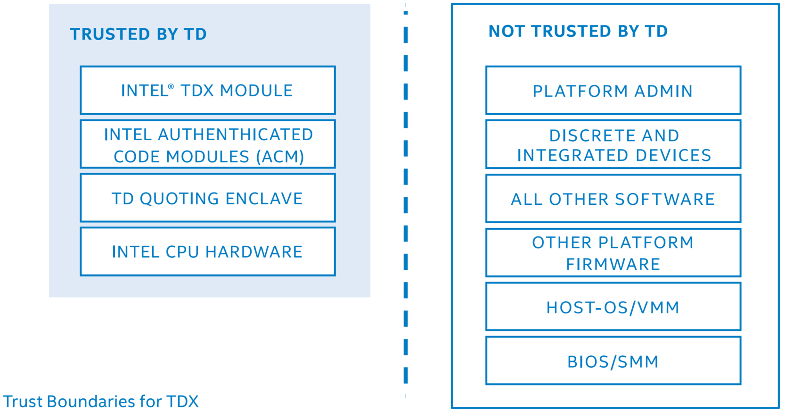
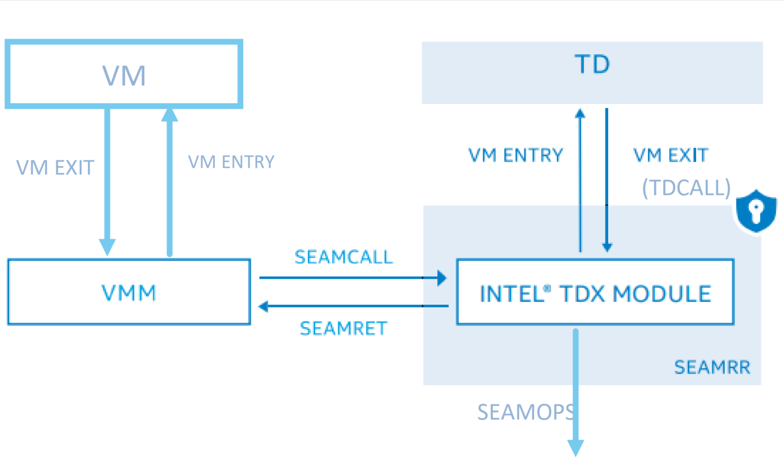
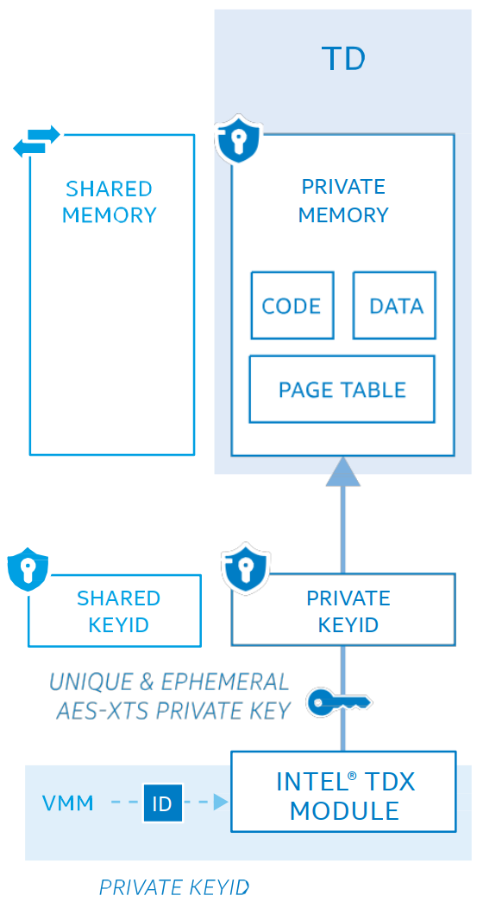
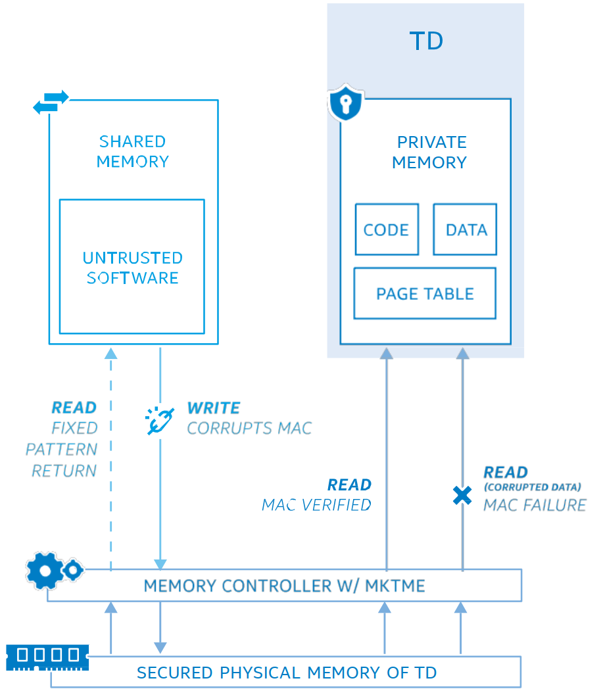
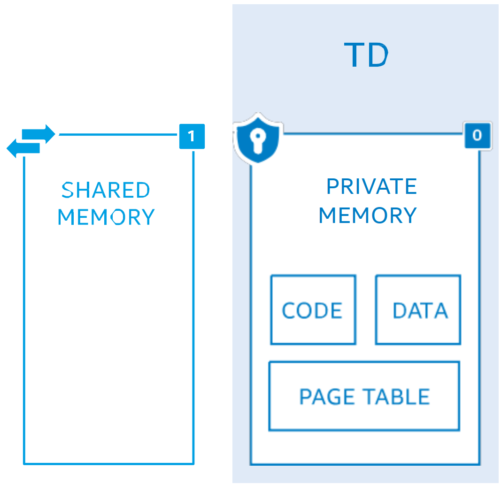
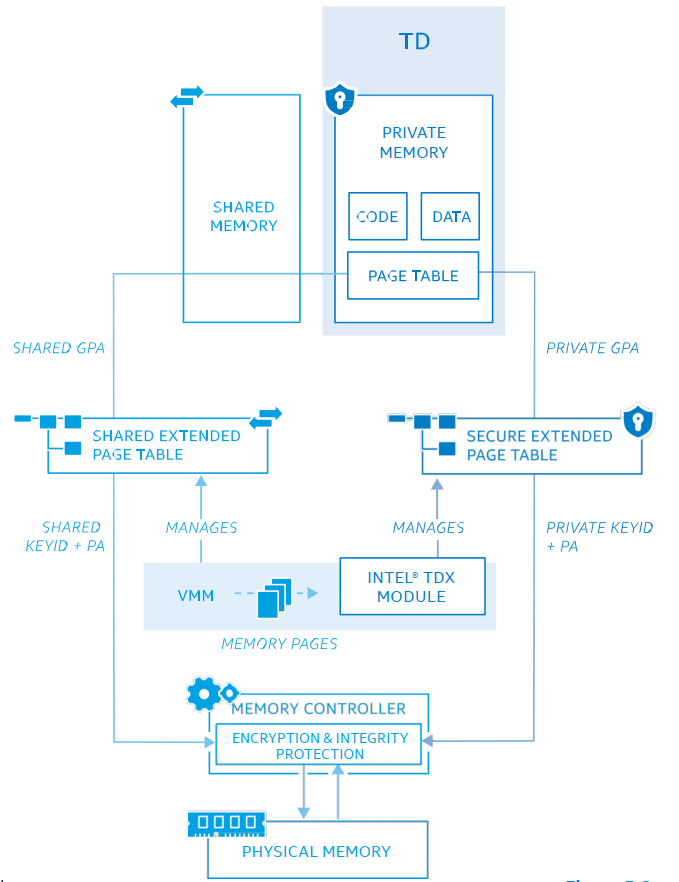
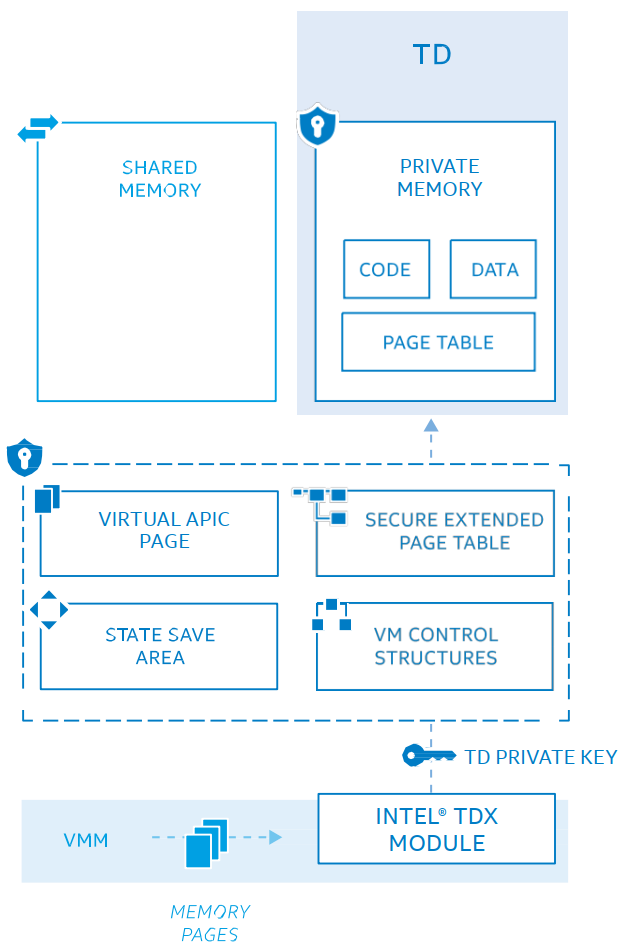
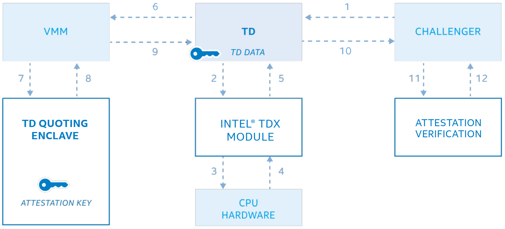
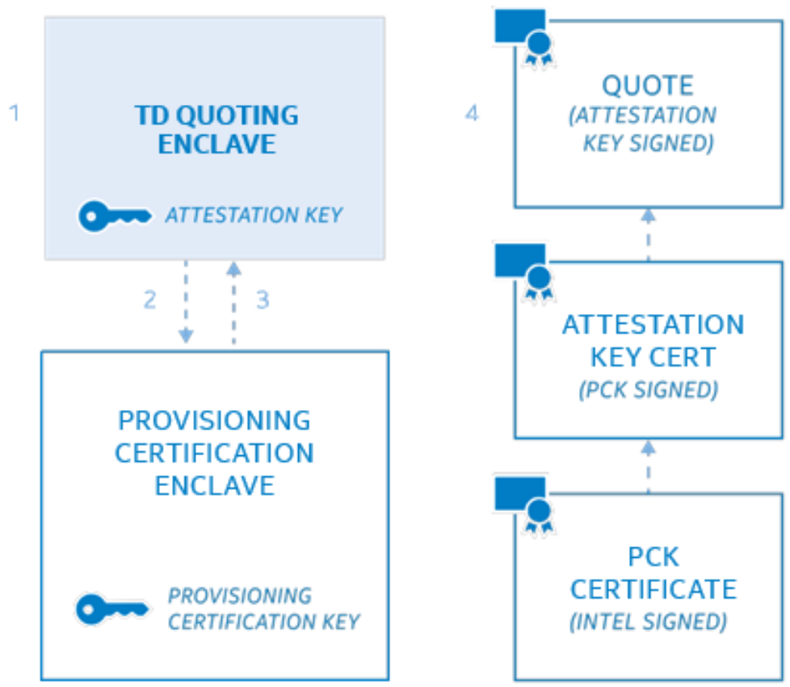

# TDX

## 介绍

* Intel® Trust Domain Extensions（Intel® TDX）正在引入新的架构元素来部署称为 **信任域（Trust Domains，TD）** 的硬件隔离的虚拟机（VM）
* TDX 旨在将 TD VM 与 *虚拟机管理器（VMM）*、*hypervisor* 和 *主机平台上的其他非 TD 软件* 隔离开
* TDX 通过帮助保护 TD 免受广泛的软件攻击，来增强机密计算，并有助于减少 TD 可信计算基（Trusted Computing Base，TCB）
* TDX 增强云租户对数据安全和 IP 保护的控制
* TDX 还可以增强云服务提供商（CSP）提供托管云服务的能力，而无需将租户数据暴露给竞争对手

## 技术阐释

* TDX 方案由以下软件模块组合构建而成：
  * Intel VMX 指令集（ISA）扩展
  * 多密钥全内存加密（Multi-Key, Total Memory-Encryption, MKTME）
  * CPU 认证的软件模块
* TDX 方案给 TD 提供以下功能：
  * 内存和 CPU 状态机密性和完整性，保护敏感 IP 和工作负载数据免受大多数软件攻击和许多硬件攻击
    * 为工作负载提供工具，将云平台固件、软件、设备和运营商都排除在 TCB 之外
    * 并使用此工具促进对 CPU 指令、安全性、调试和其他技术的安全访问
    * 无论用于部署工作负载的云基础架构如何，工作负载现在都可以拥有这种能力
  * 远程证明使依赖方（工作负载的所有者或使用工作负载所提供的服务的用户）能够在提供工作负载数据之前，确认负载将会运行在 Intel TDX 平台的 TD 内部
    * 远程证明旨在让所有者和服务的消费者以数字方式，确定他们所依赖的帮助其保护数据的 TCB 版本
* TDX 还增强了对 TD 的防御，以抵御使用物理访问平台内存的有限几种形式的攻击，如
  * 离线 的 DRAM 分析（如冷启动）
  * DRAM 接口的主动攻击，包括捕获、修改、重定位、拼接和别名内存
* TDX 不能防御的攻击方式：
  * TDX 不能防御通过物理攻击进行的内存重放
  * VMM 仍然是平台的资源管理者，Intel TDX 无法保护来自 VMM 的 DoS 攻击，这不是 TDX 的安全目标
* TDX 的信任边界
  
* 为了帮助增强 TD 的安全策略，引入 **安全仲裁模式（Secure-Arbitration Mode, SEAM）**，承载一个 Intel 提供的、经过数字签名但未加密的安全服务 module
* Intel TDX module 位于由 **SEAM-范围寄存器（SEAM-range register，SEAMRR）** 指定的保留内存空间中
* CPU 只允许在 SEAM 内存范围内执行的软件对该内存进行访问，而来自所有其他软件访问和设备的直接内存访问（DMA）对该内存范围的都将被中止
* SEAM 对平台中其他受保护的区域，如 System-Management Mode（SMM）和 Software Guard Extension（SGX）保护的内存没有访问权限

* SEAM 内存范围提供机密性和完整性保护
  * 用带有临时的 128 位的内存加密密钥，处于 XTS 模式的 AES
  * 可以在内存完整性保护的两种可用模式之一下运行（以启用各种内存配置）
* **内存完整性** 可以通过以下方案来实施:
  * **加密完整性方案**（默认），使用基于 SHA-3 的 **消息验证码（message-authentication code，MAC，28 位）**，有助于防止
    * 主机/系统软件访问，
    * 以及检测来自软件的状态篡改（例如，rowhammer）
    * 和一些硬件攻击
  * 或者逻辑完整性保护方案
    * 该方案旨在仅防止主机/系统软件访问

### SEAM 加载程序（SEAMLDR）

* 为了安装 Intel TDX module，提供了一个新的 Intel 可信执行技术（Trusted Execution Technology，TXT）认证代码模块（authenticated-code module，ACM），称为 **SEAM 加载程序（SEAM Loader，SEAMLDR）**，以帮助
  * 验证 Intel TDX module 上的数字签名
  * 并将其加载到 SEAM 内存范围中
* 根据设计，module 的 *度量* 和 *安全版本号（security-version number，SVN）* 由 SEAMLDR 记录到 *硬件度量寄存器* 中，然后被加载到 *SEAM 内存范围* 中，以响应 VMM 调用 SEAMLDR ACM 以加载 module（不具有持久性）
* 云服务提供商还可以在其服务器上加载 Intel TDX 的可接受版本，并在上面应用其自己的安全策略

### VMM 与 TDX module

* VMM 可以使用`SEAMCALL`指令将 CPU 置于 **SEAM-VMX-root operation**，而后调用 TDX module
* TDX module 提供了一个创建、删除和调度 TD 执行的接口
* TDX module 充当可信中介，帮助为 TD 实施安全策略、操作和必要的缓解措施
* 作为 TD 创建的一部分，VMM 提供以下内存页面：
  * TD 代码
  * TD 数据
  * TD 相关元数据结构，例如 *虚拟机控制结构（virtual-machine-control structure，VMCS）*
  * 当 TD 不执行时，用于保存 TD 状态的状态保存区域
* TDX 使用 Intel 64 架构，包括 VMX 架构来帮助管理 TD
  * TDX module 执行`VM entry`进入 **SEAM-VMX**
  * TDX module 使用 non-root 操作`VMRESUME`和`VMLAUNCH-VMX`指令执行 TD
* TDX module 确保 TD 的执行控制不允许 VMM 或其他不可信实体拦截 TD 对其资源的访问，如
  * 控制寄存器
  * MSR
  * 调试寄存器
  * PMU
  * TSC 等
* TDX module 旨在为 TD 实施安全策略
  * 这种策略的一个示例是，当切换 TD 时，模块会使用 *间接分支预测屏障（ Indirect-BranchPrediction Barrier，IBPB）*，以帮助 TD 间接分支预测免受到先前执行的 TD 中的代码的影响
* 如果 TD 要使用调试和性能监控功能，需要在创建时授权，否则这些功能会被禁用
  * TD 的调试和性能监控属性包含在 TD attestation report 中
* TDX 允许 VMM 出于各种原因（例如虚拟化硬件功能）限制提供给 TD 的功能
* TDX 也可以限制 VMM 隐藏或允许 TD 使用该功能的能力
* TDX 试图阻止 VMM 修改，在 TD 访问时 *由 CPUID、capability MSR 和控制寄存器等指令提供的* 枚举和信息
* TD 旨在可靠地使用这些硬件指令，而无需特殊的操作系统修改，但具有与传统 VM 类似的性能
* TDX 要控制 TD 的执行，让特定的指令，如`IN/OUT`、`HLT`、`RD/WRMSR`等，执行时触发虚拟化异常（`#VE`），由 TD OS 以安全的方式为软件模拟这些指令
  * 目的是在 *SEAM-VMX-non-root operation* 执行的某些指令或事件会触发`VM exit`进入 *SEAM-VMX-root operation*
  * TD 可以用`TDCALL`指令调用让 VM 退出到 module 的服务
* 当 TD 退出到 module 时，module 负责保存寄存器（例如，通用寄存器、控制寄存器、MSR、调试寄存器、PMU 计数器、扩展状态寄存器和其他与 TD 相关的 CPU 状态）到为该 TD 分配的 **状态保存区域**
  * 然后，module 在将执行控制权返回给 VMM 之前清理这些寄存器，以防止 TD 状态泄漏
  * 随后当 TD 恢复时，TD 的 CPU 状态将由 module 从该状态保存区恢复

### 创建报告和返回控制权到 VMM

* `SEAMREPORT`指令可以帮助创建证据结构（evidence structure，报告），以加密形式绑定到有 MAC 的硬件平台，报告结构有助于后续生成远程证明 quote（remote-attestation quote）
* `SEAMRET`指令将执行控制权返回到 VMM

## TDX 为 TD 提供的功能

* 内存机密性和完整性
* 地址转换完整性
* CPU 状态机密性和完整性
* 安全中断和异常传递
* 远程认证

## 内存机密性和完整性

### 加密

* TDX 使用 MKTME 引擎启用内存加密，并通过添加完整性保护模式来增强它。
* 除了 AES-XTS 128 bit 内存加密之外，TDX 还可以通过在每个缓存行上使用基于 SHA-3 的 MAC（`28b`）的加密完整性保护模式。
  * 在此模式下，SHA-3-256 (KECCAK [512]) 用作 MAC 生成的底层函数，将`256b`输出截断为`28b`用于存储和验证。
  * 为防止密文泄露，每个高速缓存行都维护一个 1 位 TD-ownership tag，以识别该行是否与一个分配给 TD 的内存页面关联。
  * 在这种模式下，TD-ownership-bit 包含在 MAC 中。
* 可选地，可以使用逻辑完整性模式，该模式维护 1 位 TD-ownership tag，但是在逻辑完整性模式中，每个高速缓存行没有维护加密 MAC。
* MKTME 的每个密钥都对应一个 KeyID。
* TDX 模块可以使用`PCONFIG`指令将一个 CPU 生成的、唯一且临时的 AES-XTS 128-bit 密钥编程到每个 KeyID 中，无法被软件或 SoC 外部接口访问。

### KeyID 共享

* MKTME 支持两组 KeyID
  * 私有
  * 共享
* 从 SEAM 模式（即，由 TDX-SEAM 模块）调用时，`PCONFIG`仅允许使用密钥对私有 KeyID 进行编程。

#### TD 获取 KeyID

* 创建 TD 时，TDX module 要给每个 TD 分配一个唯一的私有 KeyID。
  

#### 对私有 KeyID 的访问控制

* CPU 禁止 TDX module 和 TD 以外的软件使用私有 KeyID 访存
* 在 SEAM 模式之外尝试通过软件访问私有 KeyID 会触发缺页异常
* 设备使用私有 KeyID 进行 DMA 也会被中断

### 使用私有 KeyID 对内存加密

* 与内存行关联的 TD-ownership bit 用于检测软件或设备 *使用共享 KeyID* 尝试 *读取私有 KeyID 加密的内存* 以获取密文。
  * 对此类无效的访问，MKTME 返回一个固定模式以防止密文分析。
* 启用加密完整性保护后，MAC 有助于确保 TD 读回的数据与上次写入其私有内存的数据相同。
* 如果由于攻击模型而违反了内存完整性，那么 TD 对损坏的内存的后续访问将导致 MAC 验证失败。
* 对于基于访问控制的软件攻击，通过 TD-ownership bit 获得了逻辑完整性类似的属性。
* MAC 验证或 TD ownership 检查失败对 TD 来说是致命的并导致其终止，但其他 TD 和平台软件不会受到影响。
* TD 私有内存的加密有助于防御某些类型的内存物理攻击（例如冷启动攻击）。
* 加密完整性模式增加了加密防御，以抵御软件篡改攻击（例如，rowhammer）和一些基于硬件的 corruption 攻击。
* 相比之下，逻辑完整性模式旨在防止软件访问 TD 密文。
* TDX 的当前一代内存保护方案无法检测或保护复杂的攻击，例如通过物理访问内存的重放。
  

## 地址转换完整性

* TD 可以访问两类内存：
  * 保存 TD 机密数据的私有内存
    * TD 的私有内存使用 *分配给该 TD 的唯一、临时内存加密密钥* 来改进密码机密性和完整性保护。
  * 用于与 TD 外部不受信任的实体通信的共享内存
    * 共享内存用于与 TD 外部的 agent 进行通信，以执行 I/O 操作，例如网络访问、存储服务、调用 hypervisor 服务等。
* Guest-physical address（GPA）的最高位被指定为“Shared”位：
  * 当“共享”位为 0 时，该 GPA 是映射私有内存
  * 当“共享”位为 1 时，是映射共享内存
* TD 分配的私钥有助于加密和完整性保护所有 *使用 GPA 且“Shared”位设置为 0 的* 内存访问。
* 所有 *使用 GPA 且“Shared”位设置为 1 的* 共享内存访问，都可以通过 hypervisor 管理的共享密钥的方式进行加密和完整性保护。

* VMM 使用 *提供 GPA 到物理地址（PA）转换的扩展页表（EPT）* 帮助分配 TD 使用的内存，并将其映射到 TD 的 GPA。
* 当 TD 正在执行时，会为 TD 激活两个 EPT：
  * 一个用于提供私有 GPA 到 PA 转换的 *安全 EPT*
  * 一个用于提供共享 GPA 到 PA 转换的 *共享 EPT*
    
* TDX module 为 VMM 提供安全 EPT 管理功能，在安全 EPT 中添加或删除映射，并围绕这些操作实施安全策略，以保持内存布局的完整性。
* 用于构建安全 EPT 的内存使用每个 TD 唯一的内存加密密钥进行加密和完整性保护。
* CPU 禁止 TD 将页表和可执行代码放在共享内存中。如果从共享内存中 code fetch 或页表访问，将触发 page fault。
* TDX module 维护称为 Physical-Address-Metadata Table（PAMT）的跟踪数据结构，以确保映射到 TD 的安全 EPT 的页面不能映射到任何其他 TD 的安全 EPT。
* TDX module 还使用 PAMT 只将页面映射到安全 EPT 中的一个 GPA，并为 VMM 提供将 4K、2M 或 1G 转换添加到安全 EPT 的功能。
* 然后，该模块被设计为跟踪 PAMT 中的页面大小和页面类型，
  * 以跟踪安全 EPT 操作的正确性
  * 以及当页面从安全 EPT unmap 时让 TLB 条目失效
* PAMT 确保分配给 TD 的所有内存在首次访问之前都初始化为已知状态。
* 使用安全 EPT 或共享 EPT 转换为物理地址的虚拟地址将缓存在 CPU TLB 中。TLB 关联一个 tag 到翻译条目，以识别创建翻译条目的 TD。
* 基于安全 EPT 的地址转换架构能够将大/巨页映射到安全/共享 EPT，并在适当时将大/巨页的地址翻译缓存。
* TD 的地址转换与传统 VM 类似，涉及两级的页面遍历。因此，与传统 VM 中的软件的地址转换开销相比，TD 中的软件产生的开销类似

## CPU 状态机密性和完整性

* 创建 TD 时，TDX module 将要求 VMM 提供一组内存页面，用于存放虚拟机控制结构（virtual-machine-control structures，VMCS）、TD 的状态保存区等。
* 该 module 的目标是使用其页面分配跟踪器来强制这些页面没有被 VMM 同时分配给其他 TD。
* 然后，TDX module 将使用分配给该 TD 的私钥初始化和配置这些结构，为 TD-CPU 状态的加密机密性和完整性提供保护帮助。
  

## 安全中断和异常传递

* 使用 VMX-APIC 虚拟化和虚拟中断架构向 TD 发送中断和异常
* APIC-虚拟化架构旨在为 APIC 的许多寄存器提供 CPU 仿真，跟踪虚拟 APIC 的状态，并提供虚拟中断。
* CPU 将在 VMX-non-root 操作中执行上述所有操作，而不需要 VM exit 从 TD 退出。
* 使用 VMX-APIC 虚拟化和虚拟中断架构将有效地将中断传递到 TD，并避免修改 TD 中的操作系统以模拟 APIC。
* CPU 的目标是使用虚拟 APIC 页面和该 TD 的 VMCS 中的相关状态来跟踪虚拟 APIC 的状态。
* 虚拟 APIC 页面和 VMCS 将由 TDX module 在 TD 创建时使用 TD 私钥初始化。
* VMX-posted-interrupts-processing 架构允许 VMM 或设备通过 *CPU 硬件响应通知中断处理的 posted-interrupt descriptor* 将虚拟中断直接传递给 TD。
* Posted-interrupt descriptor 中的虚拟中断通过 APIC 传给 TD。
* VMX 体系结构得到了增强，以阻止将异常向量作为虚拟中断传递给 TD 的任何尝试。
* TD 中断虚拟化架构可以在不违反 TD 假设（如中断优先级和屏蔽）的情况下将中断传递到 TD。
* 按 VMX 架构的设计，禁止将异常注入到 TD。
* TDX module 向 VMM 提供了将虚拟的、不可屏蔽的中断传递到 TD，而不违反 x86 NMI 架构的功能。

## 远程认证

* **远程证明** 可以帮助远程提供商（也称为依赖方）确认软件在 TD 内部、真正的 Intel TDX 系统以及给定的安全级别（TCB 版本）上运行。
* 认证结果包括：
  * 与 TD 自身相关的数据
    * 目标是在请求证明时由 TD 中的软件提供此信息。例如，TD 软件可能包含它想用来与依赖方通信的公钥，作为证明的一部分。
  * TDX module 提供的 TD 度量
    * 创建 TD 时，
      * TDX module 初始化 TD 的度量寄存器，
      * VMM 请求模块为 TD 分配一组页面，
      * 然后，该模块将扩展一个称为 **TD 度量寄存器（TD-measurement register，TDMR）** 的静态测量寄存器，其中包含添加到 TD 的初始页面的测量值以及与这些页面关联的元数据。
      * 它还寻求为 TD 提供一组 **运行时可扩展度量寄存器（runtime-extendable-measurement registers，RTMR）**，这些寄存器将由 TD 中的代码扩展，并在运行时度量附加代码和数据。
      * 证明的目标是包括所有度量寄存器。
  * TDX module 提供的其他未度量状态的详细信息
    * TD 的某些状态，例如 TD 的属性、TD 所有者（MROWNER）的身份等，不会被度量，但会包含在 TD 的证明结果中。
  * CPU 硬件提供的 TDX TCB 元素的 *安全版本号（SVN）*
    * TDX TCB 中的每个元素都分配了一个 SVN
    * 如果 TCB 的所有组件的 SVN 大于或等于组件作者发布的阈值，则认为 TCB 是最新的。
    * 对于硬件，这些 SVN 统称为 **CPUSVN**，包括 SEAMLDR SVN。
    * 按照设计 module 在 TD 的 TCB 中，模块的 SVN 也要在证明中体现。
* TDX 的一个目标是使用基于椭圆曲线数字签名算法（Elliptic-Curve-DigitalSignature-Algorithm，ECDSA）的 asymmetric-attestation key 来表示 Intel TDX-TCB 版本的 ，以便使用上面列出的信息对证明（a Quote）进行签名。
* TDX 的设计目的是，如果一个漏洞通过平台更新得到缓解或以其他方式解决，依赖方可以验证是否已安装更新。
  * 更新平台证明以反映更新的过程称为 **TCB Recovery**。
  * 一个新的证明密钥将被创建以反映平台证明的更新。
  * 新的 TCB 将反映在替换证明密钥后发生的证明中。
* TDX 架构利用称为 TD-quoting enclave 的 Intel SGX enclave 为 TD 生成远程证明。
* CPU 将提供一条新指令`SEAMREPORT`，仅由 Intel-TDX module 调用，并创建一个以加密形式绑定到平台硬件的证据结构，供 TD-quoting enclave 使用。
* `SEAMREPORT`指令将 TD 软件提供的证明信息、TD 度量以及 TDX module 提供的附加信息作为输入，并生成包含 TDX-TCB 元素的 SVN 的“Report”结构。
  * 此“Report”结构旨在使用 MAC 进行完整性保护。
  * 然后，CPU 将提供一条`EVERIFYREPORT2`指令，供 enclave 使用以验证报告结构上的 MAC，以确保 report 结构执行的平台和创建的平台是相同的。

* TD-quoting enclave 使用非对称证明密钥为 report 生成 Quote。
  1. 当 TD 收到来自平台外 challenger（1）的证明请求时，TD 将请求 module 向 TD 提供 report（2），其中包括证明信息以及 TD 提供的数据。
  2. TDX module 还将调用`SEAMREPORT`指令（3）以请求 CPU 生成一个“Report”结构（4），其中包括 TD 提供的数据、module 维护的 TD 度量值以及所有 TDX TCB 中的元素。
  3. report 结构交给 TD（5），然后 TD 将请求 VMM（6）通过 TD-quoting enclave 将 report 转换为远程证明（Quote）（7、8 和 9）。
  4. 然后，TD-quoting enclave 将使用`EVERIFYREPORT2`验证报告上的 MAC，如果验证通过，则使用 TD 的非对称证明密钥签名 report，将 report 转换为 Quote。
  5. Quote 接下来将返回给 challenger（10）。
  6. 最后，challenger 使用 attestation-verification 服务（11 和 12）来执行 quote verification。

1. 为了支持 TDX 的 attestation infrastructure，Intel 构建了一个通用认证基础设施，该基础设施基于 Intel® Software Guard Extensions Data Center Attestation Primitives（Intel® SGX DCAP），以帮助认证 TD-quoting Enclave，其证书链根源于 Intel 颁发的证书。
   * 该基础设施的基础是 Intel 提供的称为 Provisioning Certification Enclave（PCE）的 enclave，旨在充当本地 TD-quoting Enclaves（即，彼此在同一平台上运行）的本地证书颁发机构（Certificate Authority，CA）。
2. 然后，TD-quoting Enclave(s) 将使用其首选方法和算法（1）生成自己的 Attestation Keys。
3. TD-quoting Enclave 旨在为 PCE 提供证明公钥（2）。
4. PCE 验证请求并签发一个类似证书的结构，以识别 TD-quoting enclave 和 Attestation Key（3）。
5. 然后，此结构将由设备和特定的 TCB 的签名密钥（Provisioning-Certification Key，PCK）进行签名。
6. Intel 为所有平台中的 PCK 发布证书和证书撤销列表，从而产生一条从 Quotes 到 Intel-certification authority（CA）（4）的完整签名链。
7. 任何拥有完整证书链和 CRL 的人都会验证生成的 Quote。

* 平台配置差异，例如是否启用了加密或逻辑完整性模式，通过 Provisioning Certificates 反映。

## 总结

* Intel TDX 引入新的架构元素以部署称为 trust domains（TD）的硬件隔离 VM
* 安全仲裁模式（SEAM）—— 一种新的 CPU 模式，旨在托管 Intel 提供的数字签名安全服务模块，称为 Intel-TDX module。
* GPA 的最高位作为共享标志位帮助 TD 管理内存。
* 安全 EPT 转换私有 GPA 以提供地址转换完整性，并防止从共享内存中提取 TD 代码。目标是使用 TD 私钥对私有内存访问进行加密和完整性保护。
* Physical-address-metadata table（PAMT）跟踪页分配、页初始化和 TLB 一致性。
* Multi-key, total-memory-encryption（MKTME）引擎提供使用 AES-128-XTS 和完整性模式的内存加密（使用 28 位 MAC 的加密完整性，还包括 TD ownership bit；而逻辑完整性只有 TD ownership bit）。
* 远程认证提供 TD 在真正的 Intel TDX 平台上运行和 TCB 版本的证据。

## References
* [Intel Trust Domain Extensions - caijiqhx notes](https://notes.caijiqhx.top/ucas/tee/intel_tdx/intel_tdx/)