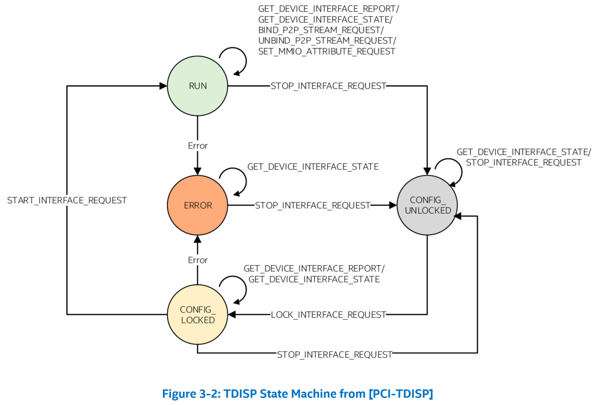

# Software Enabling for Intel® TDX in Support of TEE-I/O

# 概览
* 本白皮书旨在讨论 software touch points 或软件中所需的新功能，以使 Intel TDX 技术能够支持 TEE-I/O，并介绍软件开发人员需要了解的关键特性。
* 第一代基于虚拟化的可信执行环境（Trusted Execution Environment，TEE）VM（虚拟机），例如 Intel® Trusted Domain Extensions（TDX）guest，不将设备和加速器纳入 TVM（TEE VM）的信任边界。设备不得读取/写入 TVM 机密内存。由于这些限制，当前用于 TVM 的技术会产生显著的性能开销，尤其是对于高性能 I/O。
* **TEE 设备接口安全协议（TEE Device Interface Security Protocol，TDISP）** 定义了可信 I/O 虚拟化的架构，以便实现可以解决这些限制 [PCI-TDISP]。
  * TDISP 建立在标准消息传递协议和方法的基础之上，例如
    * 组件度量和身份验证（The Component Measurement and Authentication，CMA）
    * 安全协议和数据模型（Security Protocol and Data Model，SPDM）
    * 完整性和数据加密（Integrity & Data Encryption，IDE）
  * SPDM 和 IDE 是操作系统的通用功能，它们可能已经存在
* 为了支持 TEE-I/O，Intel TDX 旨在实现 TDISP 架构，并扩展当前的 Intel TDX 或 TDX 1.0 [INTEL-TDX]。
* 在本文档中，我们使用 Intel TDX 来表示包含此类扩展的 Intel TDX。支持 Intel TDX 的软件应利用这种通用架构，定义支持 TDISP 支持的通用层和接口。
* 我们以支持 Intel TDX 的 VMM（虚拟机监视器）为例，描述了一个概念结构，以帮助阐明启用 TDISP 架构所需的通用元素或子系统以及特定于 Intel TDX 的元素或子系统。
* 本白皮书的结构如下：
  * 第 1 章将回顾现有的虚拟机 I/O 虚拟化技术和实现。
  * 第 2 章将解释当前 I/O 虚拟化用于 TVM 时的局限性。
  * 第 3 章将总结 TDISP 架构和要求。并将介绍支持 TEE-I/O 的 TDX 架构，这是 Intel 的实现，有助于在 TDISP 兼容设备托管的 TD 和 TDI 之间直接分配和建立信任。
  * 第 4 章将描述基本操作的高级软件流程。并将展示 software touch points 或启用 Intel TDX 支持 TEE-I/O 的新功能，描述支持 Intel TDX 的 VMM 的概念结构。

# 1 I/O 虚拟化
* 为了实现将设备直接分配给虚拟机的功能，VMM 需要使用硬件特性实现某些功能，我们重新审视这些功能的实现方式，以讨论 TVM 的要求，而 TVM 可能不将 VMM 纳入信任边界。
* **I/O 虚拟化** 是指跨多个虚拟机或容器实例去 *虚拟化* 和 *共享* I/O 设备。现有的 I/O 虚拟化方法有多种，大致可分为基于软件的方法和硬件辅助方法。

## 现有虚拟机的 I/O 虚拟化
* 通过基于软件的 I/O 虚拟化，VMM 向 VM 暴露一个虚拟设备，例如，网络接口控制器（NIC）。一个 VMM 或 host 操作系统中的软件设备模型模拟虚拟设备的行为。该设备模型将虚拟设备命令转换为物理设备命令，然后再转发到物理设备。
* 现代处理器提供了减少虚拟化开销的功能，VMM 可以利用这些功能让 VM 直接访问硬件 I/O 设备。

## 直接访问硬件 I/O 设备
* 这些功能包括直接内存访问（DMA）和中断重新映射与隔离功能，可用于最大限度地减少 IO 虚拟化 [INTELDIRECTIO] 的开销。
* 具体来说，Intel 支持以下硬件辅助 I/O 虚拟化方案，用于直接移动数据，而无需软件协助：
  1. 直接设备分配 - 将整个设备分配给虚拟机
  2. Single Root I/O 虚拟化（SR-IOV）- 分配设备虚拟化功能。
  3. Scalable I/O 虚拟化（S-IOV）- 分配由 VMM 组成的低级设备接口虚拟化设备
* 这些方案确定了 **设备接口**，即一个具有 I/O 虚拟化功能的设备的分配单元。

## 通过 MMIO 访问设备
* 当设备接口分配给虚拟机时，设备接口的 MMIO 范围由处理器级（内存）虚拟化映射，例如 Intel® 虚拟化技术 (VT) 中的扩展页表（Extended Page Table，EPT）。
  * 当使用 EPT 时，此类 MMIO 范围被视为 guest 物理地址（**GPA**），而不是用于直接访问范围。
  * 相反，GPA 通过遍历一组 EPT 分页结构进行转换，以生成用于访问设备接口的 host 物理地址（**HPA**s）。
  * 如今，EPT 分页结构由 VMM 为虚拟机构建。
* 由于 TVM 可能不信任 VMM 本身，我们还需要一个利用内存虚拟化的受信任实体，以便 TVM 直接访问 MMIO。
  * 例如，VMM 需要使用 TDX module API 将此类受信任的 MMIO 空间映射到 TVM，作为 TVM 的 Secure-EPT [INTEL-TDX] 中的私有内存。

## VMs 的 DMA 重映射
* 为了允许 VM 使用 IO 设备的直接分配，VMM 还必须强制隔离 VM 的 DMA 请求，并且可以使用 DMA 重映射硬件​​将 DMA 从一个设备接口限制到其 VM 当前拥有的物理内存。
  * 地址翻译硬件将设备接口发出的 DMA 请求中的地址转换为其相应的 HPA。此功能也称为 *IOMMU（IO 内存管理单元，IO Memory Management Unit）*。
* 正如 [INTEL-DIRECTIO] 中的第 3 章所述，重映射硬件​​使用输入地址的上部（例如，VM 中的设备接口发出的 DMA 请求中的地址）来识别一系列分页结构条目。
  * 这些条目中的最后一个标识出输入的地址翻译到哪个 region 的物理地址（称为 *页帧，page frame*）。
* 分页结构（以下称为 **VT-d** 分页结构）的格式与 CPU 端使用的 EPT 分页结构（上文）不同，但 VT-d 分页结构的格式旨在与 EPT 共享相同的分页结构。
  * 这允许 VMM 构建一组分页结构，用于 VM 中 CPU 和 I/O 设备之间的一致地址翻译，并且当今一些现有的 VMM 使用了此技术。
* 由于 TVM 可能不信任 VMM 本身，因此我们还需要一个利用 DMA 重映射硬件​​的可信实体。
  * 当 VMM 使用 VM 的其余 DMA 重映射硬件​​时，它还需要隔离和保护 DMA 重映射硬件​（IOMMU）的设置。

# 2 TVMs 和 I/O 虚拟化
## 现有的TVMs 和 I/O 虚拟化
* 本章介绍了 TVM 的当前 I/O 虚拟化，并解释了性能开销的限制和原因。
* 第一代 TVM（例如 Intel® TDX guest）未将（物理）设备和加速器纳入 TVM 的可信计算基。设备不得读取/写入 TVM 机密内存。
* 由于存在限制，如今 VMM 向 TVM 暴露了 synthetic 设备接口以实现 I/O 虚拟化。
  * synthetic 设备接口被定义为 virtualization-friendly，与 I/O 模拟相关的开销相比，可实现高效的虚拟化。
* 然而，这要求 TVM 将需要从设备发送（或“copy-out”）或接收（“copy-in”）的数据暂存在共享内存中，该内存旨在保存 TVM 和 VMM 可访问的内容。
  * 为了进一步保护此类数据的机密性和完整性，TVM 预计将对 I/O 数据使用加密保护（见下图 2-1）。
* 对于某些 synthetic I/O 设备（如网络和存储），TVM 可能采用 *基于软件* 的加密技术来保护数据。
  * 例如，对于网络，TVM 可能使用 TLS（传输层安全性）或此类机制来保护发送到 NIC（网络接口卡）的数据，而对于存储，TVM 可能采用文件系统加密方案。
  * 译注：nVidia 显卡的 CC-mode 用的就是这种技术。
  * 但是，此类技术会带来显著的性能开销，尤其是对于高性能设备而言。
* 即使 TVM 使用自己的安全策略将特定设备（例如 GPU 或 FPGA 加速器）纳入其 TCB，加密数据保护也不允许 TVM 将计算直接 offload 到此类 GPU 或 FPGA 加速器上。

## MKTME 和 DMA 重映射

* 对于需要将 VMM 包含在其 TCB 中的 legacy Intel VMX-base 的虚拟机，可以使用 *多密钥全内存加密（MKTME）* 技术来启用内存加密并通过添加对加密完整性保护的支持来增强它。
  * 对于第 1 章中提到的定向 I/O 用例，VMM 需要将 KeyID 设置为 VT-d 分页结构中物理地址的一部分，该结构对应于用于 CPU 端的 EPT 中物理地址的一部分的 KeyID。
    * 一个 KeyID 标识 一个 MKTME 使用的密钥。
  * 这将允许 DMA 能够访问内存，而无需更改 legacy 虚拟机中的 I/O 设备和/或 I/O 驱动程序。
* 对于可能不将 VMM 包含在 TCB 中的 TVM，上述实现不可用，因为 KeyID 对 VMM 可见，并且它们需要由 VMM 进行编程。
* 对于 Intel TDX，MKTME 支持的 KeyID 集可以分为两组 KeyID - 一组 *私有 KeyID* 和一组 *共享 KeyID*。
  * Intel TDX 使用一组私有 KeyID，并且私有 KeyID 只能在从 Intel TDX module 调用时使用密钥进行编程。
  * 这意味着需要扩展 Intel TDX module 以帮助向 VMM 提供安全的 DMA 重新映射或 IOMMU 管理功能，以添加或删除 VT-d 分页结构的映射。
* 此外，如果 TVM 和受信任设备之间的数据链路（下图 2-2）由于中间交换超出信任计算边界而不在 TVM 的 TCB 中，则 TVM 仍然需要使用共享内存结合加密数据保护。
* 此外，此类 GPU 或 FPGA 加速器需要进行 DMA 操作，并与 CPU 端共享密钥进行加密/解密。
* 如上所述，我们需要扩展各个领域，包括硬件，以实现可信 I/O 虚拟化。
* TEE 设备接口安全协议（TDISP）定义了可信 I/O 虚拟化的架构，我们将在下一章中概述 TDISP，介绍 Intel 对 TDSIP 定义的功能的实现。

# 3 TDISP 和 Intel TDX
## TEE Device Interface Security Protocol（TDISP）
* TDISP 定义了一种可信 I/O 虚拟化 [PCI-TDISP] 架构，其中包括：
1. 在 TVM 和符合 TDISP 或 TEE-I/O 的设备之间建立信任关系。
   * 一个 **TEE-I/O 设备接口（TEE-I/O device interface，TDI）** 是具有 IO 虚拟化功能的设备的分配单元。例如，TDI 可以是整个（物理）设备、non-IOV Function 或 virtual function （VF）。
2. 保护 host 和设备之间的数据路径 PCIe 互连。
   * 物理访问可用于篡改 host 和设备之间传输的数据。传输必须经过加密保护，以提供 TVM 数据的机密性、完整性和重放保护。此类方案还必须防止违反生产者-消费者顺序。
3. 以一种可信的方式支持 TDISP 分配和移除生命周期。
* TDISP 建立在以下基础之上：
  * CMA/SPDM
    * *SPDM（安全协议和数据模型，Security Protocol and Data Model，SPMD）* 规范 [DMTF-0274] 定义了用于在设备之间执行消息交换的标准消息、数据对象和序列。消息交换包括硬件身份的身份验证和配置、固件身份的度量、会话密钥交换协议，以实现机密性和完整性保护的数据通信以及其他相关功能。
    * *组件度量和身份验证（Component Measurement and Authentication，CMA）* 根据 SPDM 中定义的数据对象和底层协议的适配来定义可选的安全功能。<稍后将显示示例>
  * *IDE（完整性和数据加密，Integrity & Data Encryption）*
    * IDE 为 *事务层数据包（Transaction Layer Packets，TLP）* [PCIe 6.0] 提供机密性、完整性和重放保护。这为上面的 2 提供了实现。
* 图 3-1 显示了 TDISP Host/设备参考架构。
* **TEE 安全管理器（TEE security manager，TSM）** 是 host 中的一个逻辑实体，它位于 TVM 的 TCB 中，并在 host 上执行安全策略。
  * 换句话说，TSM 需要通过特定的技术来实现。在 Intel TDX 架构中实现 TSM 时，Intel TDX module 被扩展具有 TSM 的功能。

* 如下所示，我们还使用 **TPA（TDX Provision Agent）** 来实现部分 TSM。TPA 是扩展 Intel TDX module 的架构 TD。
* TSM 跟踪上图中 TDI 的 TDISP 状态，图 3-2 显示了状态机。
* 一些转换由 TDI 被分配到的 TVM 触发。例如，TVM 通过 **间接** 发送 `TDISP START_INTERFACE_REQUEST` 请求 TSM 将 TDI 移至 `RUN` 状态；
* 正如我们在第 4 章中解释的那样，VMM 与设备（DSM）通信并发送/接收实际的 TDISP 消息，无论消息的发起者是谁，都会从 Intel TDX module 获取安全的有效负载。
* 由于 TVM 在 Intel TDX 上作为 TD（可信域）虚拟机实现，因此下面我们使用“TD”来表示。

## 支持 TEE I/O 的 Intel TDX
* Intel TDX 旨在实现 TDISP 定义的功能，并扩展第一代 Intel TDX 或 Intel TDX 1.0 [INTEL-TDX]，解决第 2 章中讨论的将设备和加速器纳入 TD 的限制。因此，被纳入 TD 信任边界的此类设备可以访问 TD 机密内存，并可以计算 TD 提供的数据。
* 具体来说，Intel TDX 的框架定义了以下元素，图 3-3 中带圈的数字与以下元素相对应：

1. **符合 TDISP 标准的（TEE-I/O）设备**。例如，该图显示一个（物理）TEE-I/O 设备有两个 TDIs（TDI1 和 TDI2）和设备安全管理器（DSM），下面将对此进行解释。
   * 它还有一个 legacy VF（Virtual Function）和 physical function 设备。
   * TDI1 分配给 TVM1，TDI2 分配给 TVM2。
   * 系统中可能存在多个 TEE-I/O 设备，并且它们的配置可能不同。
2. **PCIe/CXL 链路上的完整性和数据加密（IDE）**。IDE 由 [PCI-IDE] 定义，旨在为事务层数据包（Transaction Layer Packets，TLP）提供机密性、完整性和重放保护。
3. **可信的 MMIO 和 DMA 访问控制**。
4. **Intel TDX module（和 TPA）扩展**。扩展提供了由 TDISP 定义的 TEE 安全管理器（TSM）的功能，它是 host 中的逻辑实体，位于 TVM 的 TCB 中，并在 host 上执行安全策略 [TDISP]。
   * **TPA（TDX Provision Agent）** 是一种架构 TD，它扩展了 Intel TDX module，负责在 Intel TDX module 和设备之间建立 SPDM 会话。
* 请注意，与图 3-1 相比，图 3-3 中 TEE-IO Device 从底部移到了右侧，但 Intel TDX 架构与 TDISP 参考架构是一致的。

## TDISP 兼容设备
* **设备安全管理器（Device Security Manager，DSM）** 是一个逻辑实体，它提供以下功能：
  * 设备身份认证和度量报告。
  * 配置设备中的 *IDE 加密密钥*。Intel TDX module 使用 *IDE 密钥管理协议* 提供初始配置的密钥和后续刷新到 DSM 的密钥。
  * 锁定 TDI 配置、报告 TDI 配置、将 TDI  attaching 到 TD 以及将其 detaching。
  * 实施访问控制和安全机制，将 TD 数据与 TD 的 TCB 中不存在的实体隔离。
* 符合 TDISP 标准的设备必须满足 TEE-I/O 设备安全要求的 TDISP 规范，并具有以下功能的 DSM 实现：
1. Device function 0 必须实现 *DOE（数据对象交换，Data Object Exchange）*[PCI-OED] mailbox 并支持 CMA/SPDM 1.2 协议进行设备身份验证。
2. *至少一个 Selective IDE Stream* 并实现 *IDE 密钥管理（IDE_KM）协议* 作为响应者。
3. 每个 TDI 实现 *TDISP 状态机管理*，支持锁定 TDI 配置、报告 TDI 配置以及将 TDI 移入和移出运行状态。
4. 实现访问控制和安全机制，以将 TVM 提供的数据与不在 TD 的 TCB 中的实体隔离。
* Host CPU 和设备必须使用 1 中已建立的安全 SPDM 会话作为安全传输，用于传递针对 2 和 3 实现的协议的 host 请求和设备响应消息。

## PCIe/CXL 链路上的 IDE
* 根据 TDISP 的定义，Intel TDX 需要与设备建立安全连接，以便：
  * 在 TD 和受信任设备之间流动的数据必须使用上述步骤中派生的密钥保持机密性、完整性和重放保护。
  * 与传输相关的元数据（例如 TD 地址空间中 DMA 传输的逻辑地址）必须是完整性和重放保护的。
* 使用 IDE 定义的机制建立的端口到端口连接，用于保护两个端口之间的 TLP 流量。
  * 连接可以采用 **选择性 IDE 流（selective IDE stream）** 的形式，在这种情况下，**IDE TLP 可以流经 switches 而不会影响其安全性**，
  * 也可以采用 **链路 IDE 流（link IDE stream）** 的形式，在这种情况下，**两个端口必须在没有中间 switches 的情况下连接**。
    * 当端口之间没有 switches 时，可以保护链路上的所有或仅选定的 TLP 流量。
* Intel TDX 安全架构将 switches 排除在 TD 的 TCB 和参与 Intel TDX 框架的设备之外。
  * 为此，Intel TDX 架构专门使用 **selective IDE stream** 来保护在 SOC root complex 和支持 Intel TDX 的端点设备之间流动的 TLP。

## 可信的 MMIO 和 DMA 访问控制
### 可信 MMIO 访问控制
* 正如我们在第 2 章中讨论的那样，VMM 需要使用 Intel-TDX module API 将 TDI 可信 MMIO 空间映射到 TD，作为 TD 的 Secure-EPT 中的私有内存。
  * 当 TD 使用私有 guest 物理地址（GPA）访问 MMIO 页面时，翻译后的 host 物理地址（HPA）将获取 TD 私有（Host KeyID）HKID。
  * 基本 Intel TDX 已经强制规定其他任何上下文（例如 VMM 或其他 TD）都不得使用 TD HKID。
* 仅当 TD 接受 GPA 作为 MMIO 页面并且 *它与设备所有者匹配* 并且 *与 TD 指示的 MMIO 基地址偏移量匹配* 时，MMIO 页面才能映射到 TD。
* 根据 TDISP 规范，TDI 强制执行：
1. 当 TDI 未处于 `RUN` 状态时，必须拒绝受信任的 MMIO 访问（设置了 TLP `T` bit 的 IDE）
2. 当 TDI 处于 `CONFIG_LOCKED` 状态时，TDI 必须从 `INTERFACE_LOCK_REQUEST` 消息中捕获 IDE stream ID，并在稍后使用它来确保受信任的 IO 事务仅使用此 IDE stream。
3. 当 TDI 处于 `RUN` 状态时，必须拒绝不受信任的 MMIO 访问（清除了 TLP `T` bit 的 IDE）或具有错误 IDE stream ID 的访问，并且当 TDI 处于 TDISP `RUN` 状态时。

### 可信 DMA 访问控制
* Intel TDX 强制实施安全 DMA 访问控制，以帮助确保 TDI 只能在以下情况下访问 TD 私有内存：
1. TD 已将设备接受到其 TCB
2. TDI 处于 `TDISP CONFIG_LOCKED` 或 `RUN` 状态（当 TDI 未处于 TDISP `RUN` 状态时，TDI 负责不访问或接受 TD 内存访问）
3. TD 已验证 TDI 报告并 *明确接受 TDI MMIO 页面* 以及 *TDI 与 TD 私有内存之间的可信 DMA 映射*。

### Secure IOTLB Invalidation
* IOMMU 具有 caches，用于节省重复 DMA 访问的 DMA 重映射表翻译的开销。
* 例如，在 legacy VT-d 上，VMM 负责阻止和使相关 IOTLB（I/O Translation Lookaside Buffer）caches 失效，然后再更改或删除可能已 cached 的映射结构。
* Intel TDX module 负责使 IOTLB caches 失效，以帮助确保一旦从 TD 中删除 TDI 绑定，陈旧（stable）的条目就不能用于执行 DMA 攻击和访问受信任的 TD 内存资产（assets）。
  * 这是通过将当前的 *Intel TDX TLB 跟踪* 扩展为 *IOTLB 跟踪* 来强制执行的，这由 Intel TDX module 按照 TLB 跟踪顺序依次完成：`BLOCK`、`TRACK`、`INVALIATE` 和 `REMOVE` [INTEL-TDX]

# 4 支持 Intel TDX 的软件

* 在本章中，我们假设
  1. VMM 已经支持 [INTEL TDX] 指定的 Intel TDX 1.0，
  2. Guest 操作系统也针对 Intel TDX 1.0（也称为“TDX enlightenments”）进行了更改，以便作为 TD 运行。
* 首先，我们描述了基本操作的高层次软件流程，以识别组件并基于具有 Intel TDX 功能的 TDISP 架构展示它们之间的交互。
* 其次，我们讨论了在 VMM 和 TD 中实现 Intel TDX 支持的 software touch points，利用实现 TDISP 框架所需的软件子系统。

## 高层次软件流程
* 以下（步骤 `A – D`）显示了将一个 TDI 分配给一个 TD 时使用 Intel TDX 进行基本操作的高层次软件流程。TDI 由下面的一个 TEE-I/O 设备拥有。这些步骤对应于图 4-1 中圈出的 `A - C` 和图 4-2 中的 `D`。

### A. 为 Intel TDX 初始化 host 机器。
1. TEE-I/O 的 Intel TDX module 扩展需要可靠的机制来枚举底层 Intel TDX 硬件。
   * 模拟以全局“IO 系统信息表”的形式提供给 Intel TDX module，该表描述了（经 MCHECK 验证的）IO 配置信息（每个插槽和 IOMMU）。有关 MCHECK，请参阅 [INTEL-TDX]。
2. VMM 加载 Intel TDX module（如果尚未完成）并完成 Intel TDX module 的初始化，检查是否存在 TEE-I/O 支持功能（`A1`）。
3. 配置 Trusted IOMMU 和 PCI express root ports（`A2`）。
4. 启动 TPA TD（`A3`）。
* 此步骤对系统来说是全局的。

### B. 启动与设备的 SPDM 会话以进行安全通信。
1. VMM 通过读取设备 PCI *DOE 功能（capability）* 和 *IDE 功能* 来检查设备功能（`B1`）。
   * 如第 3 章所述，作为符合 TDISP 的设备的要求之一，*device function 0* 必须实现 DOE mailbox。
2. 为 Intel TDX module 创建 SPDM 元数据（`B2`）。
3. 调用 TPA 启动与物理设备的 SPDM 会话，并注入中断事件（`B3`）。
4. TPA 使用 SPDM 收集设备证书和度量值，并返回 VMM 以供稍后进行设备认证（`B4`）。
5. TPA 将 SPDM 会话密钥传递给 Intel TDX module。
   * 该参数还包括设备信息的哈希值，稍后将使用该哈希值确保 TD 从 VMM 获取未修改的设备信息。
   * Intel TDX module 提供只能由 TPA TD 调用的函数，以将密钥、功能和设备标识绑定到 SPDM 会话元数据（`B5`）。
6. TPA 将设备证书和度量值返回给 VMM。
* 此步骤按设备执行。

### C. 设置 IDE stream 进行链接加密。
1. VMM 通过调用 Intel TDX module 创建 IDE stream。
2. 查询并配置设备 IDE 扩展功能。
3. 为所有 IDE sub stream（接收和发送方向）编程密钥。
   * Intel TDX module 为 VMM 提供生成 IDE_KM 消息（`KEY_PROG`）和处理响应的功能。
   * 收到 `KEY_PROG` 请求后，Intel TDX module 生成一个临时密钥并将其编程到 **root-port 密钥编程寄存器** 中。
4. 启动所有 IDE sub stream（接收和发送方向）。
   * Intel TDX module 为 VMM 提供生成 IDE 消息（`K_SET_GO`）和处理响应的功能。
   * 如果 Intel TDX module 收到 `K_SET_GO` 请求的 `K_GOSTOP_ACK` 响应，则 Intel TDX module 将触发 Root Port 的 IDE stream。
* 完成此步骤后，设备和 host SOC 就拥有两个通信安全会话。
  * SPDM 会话是软件会话，用于软件配置，例如 IDE_KM 和 TDISP。
  * IDE 会话是硬件会话，用于保护 PCI express TLP。
* 此步骤也是针对每个设备的。

* 如图 3-2 所示，TDISP 状态机 [PCI-TDISP] 和每个 TDI 都与之相关联。步骤 `D` 的目标是将 TDI 移至 TDISP `RUN` 状态。
* 一般来说，VMM 会通过 TD 来启动步骤，
  * TD 负责使用来自 Intel TDX module（包括 TPA）和 DSM 的可信信息来检查 VMM 提供的信息或进行的操作。
  * TD 还负责在验证成功后接受配置并进入下一步。
* 无论消息的发起者是谁（VMM 或 TD），TDISP 消息是受完整性保护的，VMM 与设备（DSM）通信并发送/接收实际的 TDISP 消息。
  * 但 VMM 需要调用 Intel TDX module 来准备（加密和保护）所需的 TDISP 消息，Intel TDX module 返回 VMM 可以发送到设备的安全有效负载。
* 如果 TD 启动这些步骤，则与 VMM 的交互需要使用如下结构：
1. TD 提前通知 Intel TDX module 发送 TDISP 消息的意图。此步骤是必需的，以便 Intel TDX module 稍后可以检查 VMM 是否未篡改请求（下面的步骤 3）。
2. TD 使用 hypercall（`TDG.VP.VMCALL`）请求 VMM 将 TDISP 消息发送到设备（DSM）。
3. 如上所述，VMM 需要调用 Intel TDX module，因为 TDISP 消息需要安全的有效负载，而该有效负载只能由 Intel TDX module 准备。
   * Intel TDX module 检查该消息是否是设备想要发送的消息（上面的步骤 1），并将安全的有效负载返回给 VMM。
4. VMM 将 TDISP 消息发送到设备。
* 例如，以上适用于下面的步骤 `D-6`。

### D. 启动 TDI
1. VMM 创建设备接口的数据结构并配置 TDI（`D1`）。
   * TDI 的状态为 TDISP `CONFIG_UNLOCKED` 状态。它还准备 MMIO 元数据结构并将 TDI MMIO 页面与数据结构关联起来。
2. VMM 调用 Intel TDX module 将其移至 TDISP `CONFIG_LOCKED` 状态（`D2`），方法是生成 TDISP 消息 – `LOCK_INTERFACE_REQUEST`。
3. VMM 创建 TD 并将 TDI 分配给 TD，方法是在 PCIe 枚举中通告（advertising）TDI。
4. TD 从 VMM 获取设备证书和度量值，然后 TD 根据 TD 特定策略验证设备。
   * 例如，设备证书必须具有受信任的 root CA（认证机构），并且设备度量值必须与设备供应商发布的最新参考清单（reference manifest）相匹配。
5. 如果验证通过，TD 可以接受 TDI 到 Intel TDX module。
6. TD 使用 TDISP 协议发送 TDISP 消息 – `GET_DEVICE_INTERFACE_REPORT`，从 DSM 获取（报告）。
   * 请注意，Intel-TDX IO 提供了 TD 可用于发送 TDISP 消息（`D6`）的功能。
7. TD 通过 Intel TDX module 提供的 functions 接受报告中的 MMIO 和 DMA 映射。
8. TD 请求 Intel TDX module 和 VMM 将 TDI 移至 TDISP `RUN` 状态（`D8`）。它从 VMM 接收 TDISP 消息 – `START_INTERFACE_REQUEST`。
9. TD 在 DMA 分配/释放过程中固定/取消固定私有 GPA 页面。现在 TD 可以启动 TDI 并使用受信任的 DMA 直接与 TDI 通信（`D9`）。
* 此步骤针对每个设备接口。

* VMM 可以重复上述过程，将另一个 TDI 分配给另一个 TD。
* **注意**，一个 TD 可以接受多个 TDI，但一个 TDI 不能分配给多个 TD。
* 如果不再需要 TDI，则 TD 或 VMM 可以停止 TDI。
* 如果设备中的所有 TDI 都被移除，则 VMM 可以移除 IDE stream 并终止该设备的 SPDM 会话。
* 如果 IOMMU 管理的所有设备都断开连接，则 VMM 可以重新初始化 IOMMU。

## 支持 TEE-I/O 的 Intel TDX VMM 概念结构
* 在以下部分中，我们将讨论 software touch points 或新功能，以启用 Intel TDX 来支持 TEE-I/O。
* 正如我们上面所示，支持 Intel TDX 的软件可以利用标准和通用安全操作系统（OS）功能，这些功能不一定与虚拟化相关：
  * 通用操作系统功能 - PCI-SIG DOE、SPDM、IDE 子系统
  * 虚拟化功能 - PCI I/O 虚拟化子系统和 IOMMU
  * TEE-I/O 支持 - TDISP 支持（host 和 guest 侧）
  * 基于硬件的 TEE 支持，例如 Intel TDX 支持
* 由于通用功能，上述某些功能可能已经存在或正在开发中
* 下图 4-3 概念性地显示了 VMM 子系统中带有 TD 的 touch points，或者需要修改/添加的代码，我们将它们分为以下几类：
  * **TDISP 支持所需** – 通用操作系统功能。代码可能已经存在或正在开发中。
  * **TDISP 支持** – 支持 TDISP TEE-I/O 的一般功能。由于 Intel TDX 是 TDISP 功能的实现，因此它依赖于通用代码。
  * **Intel TDX 支持** – 专门利用 Intel TDX 的功能。它们通常位于通用层或抽象层下。
  * **I/O 虚拟化支持** – 将 I/O 设备直接分配给（传统）虚拟机所需的一般功能。
    * 这包括 CPU、内存、中断虚拟化（包括 Intel TDX 支持）和 PCI 虚拟 I/O 子系统。图中仅显示相关区域

* 接下来我们来更详细地描述图中圈出的数字对应的子系统和 touch points，TD（④）的变更将在后面详细描述。

## Host/VMM 修改
* 正如我们所展示的，VMM 不需要成为 TD 的 TCB，但它仍会像当前 Intel TDX 支持一样执行资源分配。在本文中，我们重点关注 PCIe 设备，并将 TEE-I/O 设备枚举为 PCIe 设备。

### PCI 虚拟 I/O 子系统
* 由于 TEE-I/O 设备在设备功能寄存器（Device Capabilities Register）中将具有“支持 TEE-I/O”，因此 PCI 子系统应该能够识别 TEE-I/O 设备。
  * 对于此类 TEE-I/O 设备，VMM 需要进行额外的初始化，以便将它们分配给 TD。
  * 如果设备被标识为“支持 TEE-I/O”，则 TDSP 子系统应该管理该设备（①）。

### TDISP 子系统
* TDISP 子系统支持 TEE-I/O 用例，并实现以下功能：
  * 根据 TDISP 要求初始化设备，管理 TDI 的 TDISP 状态机：`CONFIG_UNLOCKED`、`CONFIG_LOCKED`、`CONFIG_RUN` 和 `CONFIG_ERROR`。
  * 请求 SPDM 会话。正如我们在 TDISP 架构中看到的，TSM（TEE 安全管理器、TDX module 和 TDX 中的 TPA）和 DSM（设备安全管理器）之间的安全通信需要 SPDM 会话。
  * 请求 IDE selective streams。
  * 将 TDI 绑定到目标 TVM。
* 如前所述，来自 VMM 或 TD 的请求首先发送到 Intel TDX module（②）以准备安全的有效载荷，然后由 SPDM 处理。这些请求包括：
  * 锁定（`TDISP CONFIG_LOCKED`）或停止（`TDISP CONFIG_UNLOCKED`）TDI
  * 获取设备接口报告（`TDISP GET_DEVICE_INTERFACE_REPORT`）

### IDE 子系统
* 如上文步骤 `C` 所示，IDE 子系统实现了以下功能：
  * 在两个 ports 之间设置 IDE selective streams。
  * 通过 PCIe 驱动程序为目标设备配置 IDE 扩展功能。
* 以下内容与 Intel TDX 支持（②）相关：
  * 通过请求 Intel TDX module 为 Root Port 配置 IDE 扩展功能。IDE 需要使用 Intel TDX module 提供的功能。
  * 如上文所示，对 Root Port 的 IDE Key Programming 由 TDX module 完成（步骤 `C-3`），IDE 需要使用 Intel TDX module 提供的功能。
  * 通过 Intel TDX module（`IDE_KM_KEY_PROG`）为目标设备进行 IDE Key Programming。
    * 它请求 Intel TDX module 生成 IDE_KM 请求并通过 SPDM 会话/DOE mailbox 发送它们。

### IOMMU 子系统
* 这个子系统需要存在于现有的 I/O 虚拟化中，特别是支持直接分配 I/O 设备，正如我们在第 1 章中讨论的那样。因此，我们重点介绍 Intel TDX（③）所需的附加功能。
* IOMMU 子系统实现了以下功能：
  * 在初始化期间将 Trusted IOMMU 配置为 Intel TDX 模式（步骤 `A`）。
  * 使用 Intel TDX module 提供的功能访问 Trusted IOMMU 寄存器。
* 正如我们在第 1 章中讨论的那样，VT-d（IOMMU）分页结构的格式旨在与 EPT 共享相同的分页结构。
  * 这也适用于 Intel TDX，也就是说，IOMMU 分页结构可以与 Secure-EPT（S-EPT）共享，这是 Intel TDX module 用于 Intel TDX 的实现，可以有效且高效地添加受信任的 IOMMU 功能。
* 由于 CPU 侧已经管理 S-EPT，因此选项之一是：
  * IOMMU 子系统请求 S-EPT 管理组件 **提前构建 SEPT**。这是因为大多数 I/O 设备不能容忍缺页，而不像 CPU 侧那样在处理 S-EPT violation 后重新启动 faulted 的指令。

### MMIO 子系统
* 如第 1 章所述，VMM 使用 EPT 映射分配给 VM 的设备接口的 MMIO 范围。然而，与通常的内存映射不同，通常设备接口的 EPT 内存类型被设置为 `UC`（uncachabled）。
* 这也适用于 Intel TDX，当前的 Intel TDX module 不允许 VMM 为 S-EPT 内存类型设置 `UC`。
* 对于 Intel TDX，Intel TDX module 为 VMM 提供了映射 TDI MMIO 页面的函数，VMM 需要使用这些函数（③）。

### 中断处理
* VMM 或 IOMMU 可以通过 posted-interrupt 机制 [INTEL-TDX] 将 Non-NMI 中断注入 TD。

## TVM（TD）修改
* 一般而言，TVM（TD）负责在接受或使用 TDI 之前检查设备、SPDM 会话、IDE 密钥和使用可信信息的 TDI。

### TDISP 设备的枚举
* 可以通过像 host 一样检查设备功能寄存器（Device Capabilities Register）中的“TEE-I/O 支持”来完成 TDSP 设备的一级枚举。并且 PCI 子系统应该能够识别 TEE-I/O 设备。

### 接受 TDI 之前的检查
* 一个 TD 必须在将一个 TDI 接受到其 TCB 之前询问以下问题：
1. 设备的身份和持有 TDI 的设备报告的度量值是否可以接受？
2. TSM 和 DSM 之间是否建立了 SPDM 安全会话，并且 Intel TDX module 验证的身份是否与报告给 TD 的身份相匹配？
3. 所有由 TDI 所使用的 IDE stream 的 IDE 密钥是否是 Intel TDX module 建立的？
4. VMM 是否已按预期配置 TDI 并将 TDI 映射到 TD 地址空间？
* TD 从 VMM 获取设备证书和度量值，以确定问题 1 的答案。TPA 应该已将信息报告给 VMM（步骤 `B-4`）。
* TD 计算数据结构的哈希值，并请求 TDX module 验证该哈希值是否与 TPA 计算的哈希值匹配（步骤 `B-5`）。
* TD 查询 TDX module 以确定问题 2 和 3 的答案。
  * TD 使用来自 DSM 的 TDI 配置报告（指定 TDISP - `GET_DEVICE_INTERFACE_REPORT`）。
  * 然后，TD 可以使用该报告并与 TDX module 通信，以确定问题 4（④）的答案。
* 如果每个问题的答案都是肯定的，则 TD 可以将 TDI 接受到其 TCB 中。

### DMA 子系统
* 目前，由于第 2 章中描述的限制，DMA buffers 是从 TD 中的共享内存分配的，而 TDI 的 DMA buffers 需要从私有内存分配。
* 此外，TD 需要使用 Intel TDX module 提供的功能明确接受或删除 VMM 完成的映射。
  * 将 TDI 分配给 TD 需要 VMM 在 IOMMU 中为 DMA 重新映射设置可信的翻译。
  * 一旦 TD 接受映射，映射就会生效。

### MMIO 子系统
* 同样，TD 需要接受来自 TDISP 消息 - `GET_DEVICE_INTERFACE_REPORT` 的报告中的所有 `MMIO_RANGE` 中描述的所有设备 MMIO 页面。

## Attestation
* 认证实施不在本白皮书的讨论范围内。
* 对于设备认证，白皮书“Device Attestation in Confidential Computing Environment”涵盖了 TEE-I/O 设备 [DEV-ATTEST] 所需的详细信息。
* 对于 TVM（TD），在使用设备接口之前，还需要验证 TDI 的设备驱动程序，除非设备驱动程序已包含在操作系统（内核等）的认证中。
  * 实际更改将取决于 TVM 的当前认证实施。