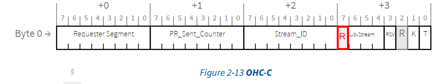
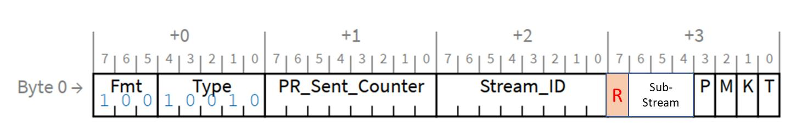
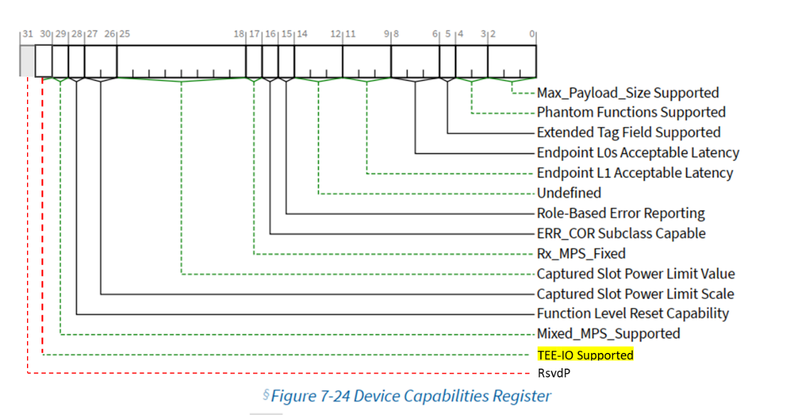
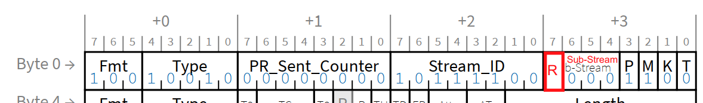
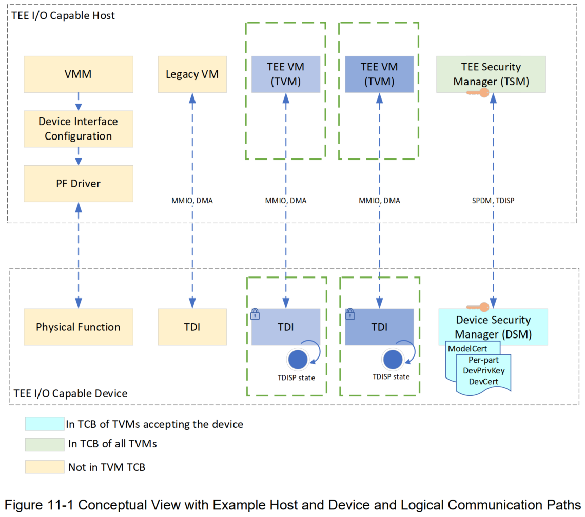
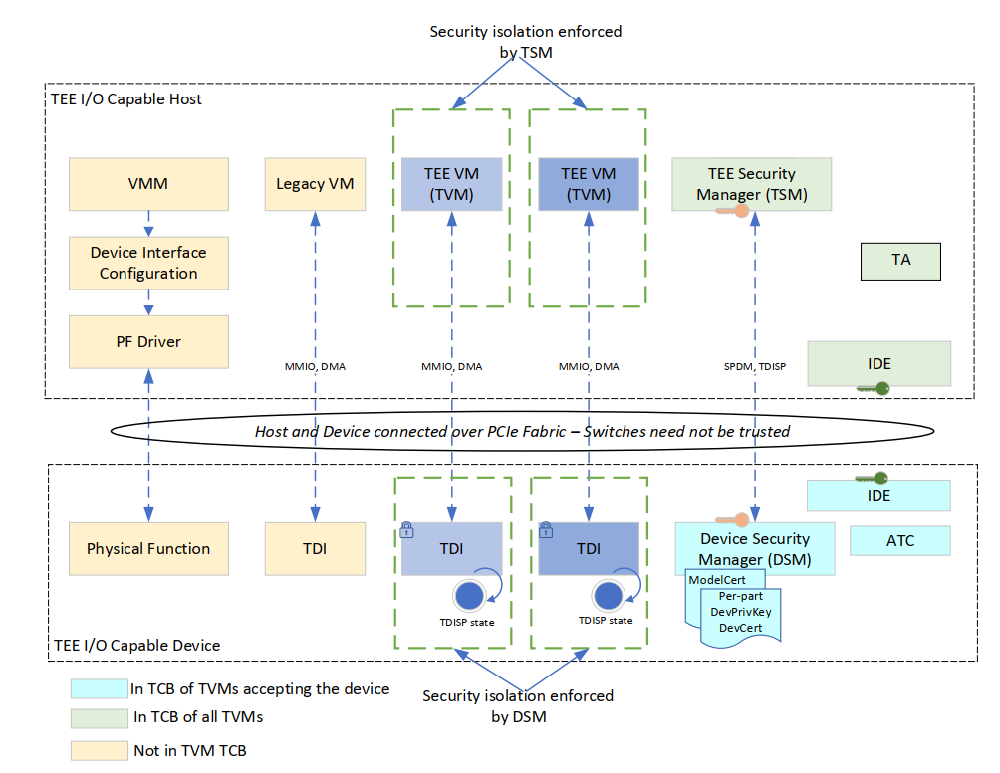
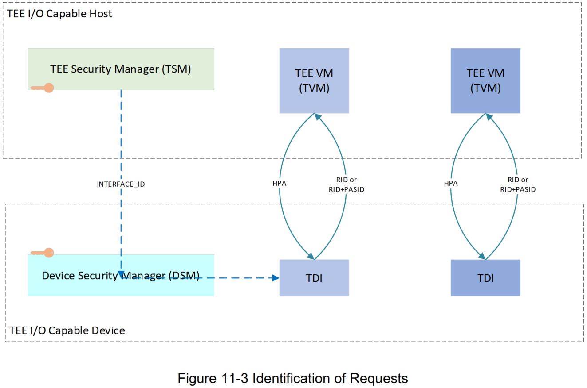
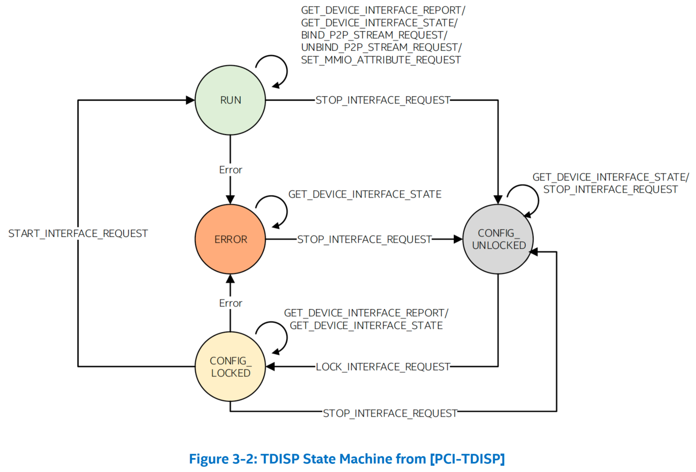
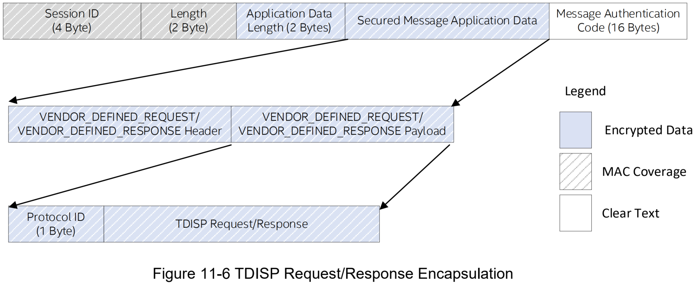
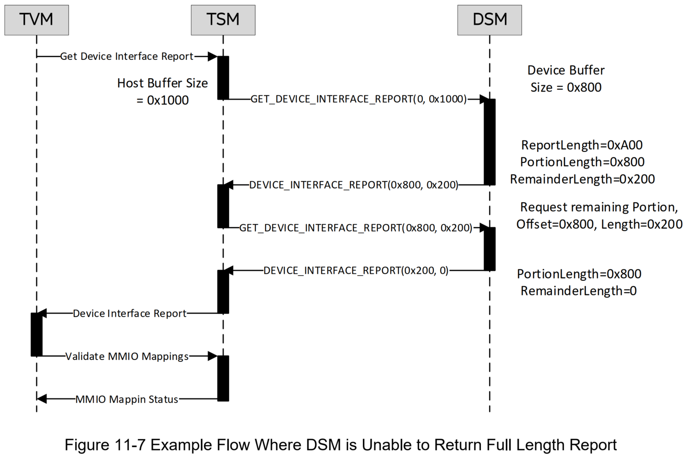

# TEE Device Interface Security Protocol (TDISP)

## Part I
1. 功能变化摘要
* 基于虚拟化的可信执行环境 (TEE) 用于托管可能与托管环境隔离的机密计算工作负载，即 VMM 不需要受信任。
* 此后，此类 TEE 被称为可信执行环境 VM（TVM），以将其与传统虚拟机区分开来。
* 当将设备的一部分（一个“TEE 设备接口”（TDI）- 直接分配的单位，例如使用 SR-IOV 时的虚拟功能）分配给 TVM 时，需要为该组合建立和维护可信执行环境。
* 本文档定义了 TEE 设备接口安全协议（TEE Device Interface Security Protocol，TDISP）- 一种可信 I/O 虚拟化架构，提供以下功能：
  1. 在 TVM 和设备之间建立信任关系。
  2. 保护 host 和设备之间的互连。
  3. 以可信方式将 TDI 附加到 TVM 和从 TVM 分离。
* 建立在 CMA/SPDM 和 IDE 提供的基础之上。
2. 变更带来的好处
* 系统将能够建立和维护包含一个或多个设备的组合 TEE，从而能够在虚拟化系统环境中有效地保护工作负载。
3. 影响评估
* 需要新的硬件和软件来实现和操作此可选功能。
4. 硬件影响分析
* 定义数据对象协议和相关机制。除了这些机制之外，运行安全工作负载的硬件也需要安全地实现并以安全的方式运行。
5. 软件影响分析
* 需要新软件来实现此功能。
6. C&I 测试影响分析
* 需要更新 C&I 测试以处理现有寄存器中新定义的字段。

## Part II
* 变更的详细描述
### 添加到术语和缩略词：
* **TEE 设备接口（TEE Device Interface，TDI）**：支持 IO 虚拟化的设备的分配单元。例如，TDI 可能是整个设备、非 IOV 功能、PF（可能还有其下属 VF）或 VF。
* **TEE-I/O**：用于建立和管理可信执行环境（Trusted Execution Environments，TEE）的概念框架，其中包括来自一个或多个设备的资源组合（参见第 11 章 - TEE 设备接口安全协议（TDISP））。
* **Trusted Computing Base（TCB）**：硬件、固件和软件的组合，负责执行安全策略。TCB 内部发生的错误或漏洞可能会危及整个系统的安全属性。相比之下，TCB 之外的计算机系统部分不得创建允许比根据安全策略授予的权限更多的权限的条件。
* **TVM**：可信执行环境虚拟机，定义在 TEE 设备接口安全协议（TDISP）参考架构中（参见第 11 章）。

### 在参考文档中，编辑：

* **SPDM**
* DMTF Security Protocol & Data Model (SPDM) Specification - https://www.dmtf.org/dsp/DSP0274. IDE requires version 1.1 or above, TDISP requires version 1.2 or above.
* 编辑如下图所示：
* 2.2.1.2 Common Packet Header Fields for Flit Mode

* 对于具有 OHC-C 且不是 IDE TLP 的 TLP，`Sub-Stream [2:0]` field 必须为 `111b`，并且 `Stream ID`、`PR_Sent_Counter`、`K` 和 `T` fields/bits 为保留。
* 在此规范的早期版本中，`Sub-Stream` 在 Symbol `3` 中为 `4` bits，即 bit `7:4`。现在 bit `7` 为 `Reserved`。
  * 如果 *设置* 了 TEE-IO Supported，则组件必须将 bit `7` 实现为保留。
  * 如果 *清除* 了 TEE-IO Supported，则允许组件将 bit `7` 视为 `Sub-Stream` 的一部分
* 在第 6.33 节的实施说明：IDE 的威胁模型和相关注意事项中，编辑如下：
  * 此类 TEE 的实现和管理细节超出了 IDE 的范围。`T` bit 用于 TEE 管理机制（请参阅第 11 章 TDISP）。IDE 机制确保 `T` bit（与其他 TLP 内容一样）在传输过程中的安全。
* 编辑如下所示：
* 6.33.4 IDE TLPs

* IDE 前缀包括：
  * `T` bit —— 设置时，表示 TLP 源自受信任的执行环境（参见第 6.33.1 节）。
    * 如果 Device Capabilities Register 中的 *TEE-IO 支持位* 被 *清除*：
      * 允许 IDE TLP 源自受信任和不受信任的执行环境，并且 `T` bit 的值不会修改 IDE 本身内 TLP 的处理；本文档未定义受信任执行环境的规则。
      * 除非 TEE 管理机制已明确定义 `T` bit 的使用，`T` bit 必须被清除，超出本文档范围。
    * 如果 Device Capabilities Register 中的 *TEE-IO 支持位* 被 *设置*，则必须将此 bit 用于第 11 章 TDISP 中定义的 TEE 管理机制。
* 每个 Sub-Stream 都有一个 Sub-Stream 标识符：
  * `000b` – Posted Requests
  * `001b` – Non-Posted Requests
  * `010b` – Completions
  * `011b-110b` 为保留值
  * `111b` - 在 NFM 中，保留；在 FM 中，表示包含 OHC-C 但不是 IDE TLP 的 TLP。
* 在本规范的早期版本中，`Sub-Stream` 在 Symbol `3` 中为 `4` bit，即 bit `7:4`。
  * 现在 bit `7` 为保留。
  * 如果 Device Capabilities Register 中的 *TEE-IO 支持位*已设置，则组件必须将 bit `7` 实现为保留。
  * 如果 TEE-IO 支持已清除，则允许组件将 bit `7` 视为 `Sub-Stream` 的一部分
* 要使一个 TLP 与一个特定 Selective IDE Stream 相关联，必须满足以下条件：
  * …
  * 对于一个 Completion，Stream ID 必须与相应的 Non-Posted Request 中的 Stream ID 匹配。
  * …
  * 通过特定于实现的方式选择或排除 TLP。例如，发送器可以将一个或多个内部功能发起的所有 Memory Requests 与特定 Selective IDE Stream 相关联，特别是当已知 Partner Port 是 Root Port，并且该内部功能发起的所有请求都以系统内存为目标时。
  * 如果 TLP 不满足上述特定 Selective IDE Stream 的所有适用条件，或者如果 TLP 通过特定于实现的方式被排除，则 TLP 不得与任何 Selective IDE Stream 相关联。
  * 如果 Selective IDE Stream 控制寄存器中的 `TEE-Limited Stream` bit 被设置，则只有设置了 `T` bit 的 TLP 才允许与此 Selective IDE Stream 相关联。
    * 如果未启用 Link IDE，则必须将与此 Selective IDE Stream 相关联且 `T` bit 清除的 TLP 作为 *非 IDE TLP* 传输；如果启用了 Link IDE，则必须将 TLP 作为 Link IDE TLP 传输。
  * 如果支持，则必须在启用 Selective IDE Stream 之前在两个 Partner Ports 中配置 `TEE-Limited Stream` bit。
    * 允许 Partner Ports 对 `TEE-Limited Stream` bit 具有不同的值。
* 软件必须配置 Selective IDE，以便 Partner Ports 之间整个路径上的所有 Links 都在 FM 或 NFM 中运行。
* 如果设置了 **TEE-IO Supported**，则对于 Endpoint Upstream Port：
  * 如果一个请求的 `Requester ID` 字段小于 Stream 的 Selective IDE RID Association Register block 中的 `RID Base` 或大于 `RID Limit`，则必须将默认 Stream 以外的 Selective IDE Stream 上收到的请求作为一个 *不支持的请求* 来处理。
    * 在 Flit 模式下，如果设置了 **Segment Captured** *[脚注：Segment Captured 的值表示正在应用 Segment values - 捕获的 Segment values 不用于此处定义的测试]*，则请求必须包含 OHC-C 和设置了 `Requester Segment Valid（RSV）` bit，并且请求者 Segment value 还必须与 Selective IDE RID Association Register block 中的 **Segment Base** 值匹配。
  * 如果 Completion 的 `Completion ID` 字段小于 Stream 的 Selective IDE RID Association Register block 中的 `RID Base` 或大于 `RID Limit`，则在默认 Stream 以外的 Selective IDE Stream 上收到的 Completion 必须作为一个 *Unexpected Completion* 处理。
    * 在 Flit 模式下，如果设置了 **Segment Captured**，则 Completion 必须包含 OHCA5，并且 `Completer Segment` 的值也必须与 Selective IDE RID Association Register block 中的 **Segment Base** 值匹配。
* 如果设置了 **TEE-IO Supported**，对于 Root Port：
  * 如果请求的 `Requester ID` 字段小于 Stream 的 Selective IDE RID Association Register block 中的 `RID Base` 或大于 `RID Limit`，则在 Root Port 为 IDE Terminus 的 Selective IDE Stream 上收到的请求必须作为一个 *不支持的请求* 来处理。
    * 在 Flit 模式下，如果设置了 `Requester Segment Valid（RSV）` bit，则请求者 Segment value 还必须与 Selective IDE RID Association Register block 中的 **Segment Base** 匹配。
  * 如果完成的 `Completion ID` 字段小于 Stream 的 Selective IDE RID Association Register block 中的 `RID Base` 或大于 `RID Limit`，则在 Root Port 为 IDE Terminus 的 Selective IDE Stream 上收到的 Completion 必须作为一个 *Unexpected Completion* 处理。
    * 在 Flit 模式下，如果 Completion 包括 OHC-A5，则 `Completer Segment` 的值还必须与 Selective IDE RID Association Register block 中的 `Segment Base` 的值匹配。
* 将多播（参见第 6.14 节）与 Selective IDE Streams 一起使用超出了本规范的范围。
* 编辑如下所示：
* 6.33.6 其他 IDE 规则
* Non-Posted IDE 请求规则：
  * 如果 Device Capabilities Register 中的 `TEE-IO Supported` bit 为清除，Non-Posted Requests 的请求者必须检查相应的接收 Completion(s) 是否使用与 Non-Posted Request 相关联的相同 Stream ID 和相同 `T` bit 值返回 - 违规为 IDE Check Failed 错误。
    * 请求者必须将相关 IDE Stream 转换为不安全（Insecure）状态。
  * 如果 Device Capabilities Register 中的 `TEE-IO Supported` bit 为设置，Non-Posted Requests 的请求者必须检查相应的接收 Completion(s) 是否使用与 Non-Posted Request 相关联的相同 Stream ID 返回 - 违规为 IDE Check Failed 错误。
    * 请求者必须将相关 IDE Stream 转换为不安全（Insecure）状态。
* 编辑如下所示：
* 7.9.26.2 IDE Capability Register (Offset `04h`)

Bit 位置 | 寄存器描述 | 属性
--------|------------|--------
24      | **TEE-Limited Stream Supported** - 当设置时，表示支持 TEE-Limited Stream 控制机制。 如果 `Selective IDE Streams Supported` 被清除，该 bit 为保留 | HwInit / RsvdP

* 7.9.26.5.2: Selective IDE Stream Control Register

Bit 位置 | 寄存器描述 | 属性
--------|------------|--------
23      | **TEE-Limited Stream** - 当“设置”时，要求对于 Requests，只有那些设置了 `T` bit 的请求才允许与此 Stream 相关联。 必须在“Selective IDE Stream Enable”为“Clear”时进行配置，在此期间此 bit 为 `RW`。当“Selective IDE Stream Enable”设置为 `1` 时，将对设置进行采样，并且此字段bit 变为 `RO`，在“Selective IDE Stream Enable”保持设置期间，读取将返回采样值。 如果“**TEE-Limited Stream Supported**”为“清除”，则保留。 默认值为 `0b`。 | RW / RO / RsvdP

* 编辑如下所示：
* 7.5.3.3 Device Capabilities Register (Offset `04h`)

Bit 位置 | 寄存器描述 | 属性
--------|------------|--------
30      | **TEE-IO Supported** – 设置时，此位表示该功能实现了 TEE 设备接口安全协议 (TDISP) 描述的 TEE-IO 功能。请参阅第 11 章。| HwInit

* 编辑如下所示，Appendix L: Example IDE TLP, figure L-2:

* 添加如下章节

# 11 TEE Device Interface Security Protocol（TDISP）
* 可信执行环境（Trusted Execution Environments，TEE）包括来自一个或多个设备和 host 的资源组合，需要建立和管理信任关系的机制。
  * 在这里，我们将使用术语 **TEE-I/O** 来指代执行此类操作的概念框架。本章定义了 host 和设备参与 TEE-I/O 的特定架构（见图 11-1）。
* TEE-I/O 以现有的将设备直接分配给 VM 的功能为基础，例如 SR-IOV（第 9 章）和 ATS（第 10 章），以建立可信执行环境 VM（TVM）。
  * 所有不是 TVM 的 VM 都称为 legacy VM。
  * 在 TEE-I/O 中，VMM 本身可能不受 TVM 信任，并且提供了机制使 TVM 能够根据其正在使用的底层硬件做出信任决策。
  * 尽管 TVM 无需信任 VMM，但它仍会继续执行资源分配和系统管理功能，就像在非 TEE-I/O 使用模型中一样，但可以测试结果。
  * 可以阻止 VMM 绕过受影响 TVM 的安全性。
  * 隐式信任 VMM 的 legacy VM 可以与系统中的 TVM 共存。

* **TEE 安全管理器（TEE security manager，TSM）** 是 host 中的一个逻辑实体，位于 TVM 的 TCB 中，并在主机上执行安全策略。
* **设备安全管理器（Device Security Manager，DSM）** 是设备中的一个逻辑实体，可被 TSM 允许进入 TVM 的 TCB，并在设备上执行安全策略。
* **TEE 设备接口（TEE Device Interface，TDI）安全协议（TDISP）** 为支持 TEE-I/O 虚拟化的设备定义了一种架构，提供以下功能：
1. 在 TVM 和设备之间建立信任关系。
2. 保护 host 和设备之间的互连。
3. 以可信的方式将 TDI 连接到 TVM 和从 TVM 上断开连接。
* 尽管 TDISP 已针对上述 TEE-I/O 进行了定义，但 TDISP 是设备规范的独立部分，此类设备可以在使用除 TEE-I/O 之外的安全架构的系统中运行，前提是系统以适当的方式支持 TDISP 所需的 host 功能。
* TDISP 专门定义了对 TDI 的要求，也定义了对实现 TDI 的整个设备的要求，在特定情况下，TDI 可以是整个设备、非 IOV 功能、PF（以及可能的下属 VF）或 VF。
* 尽管允许（并且通常预期）实现 TDI 以便将其分配给 Legacy VM，但这种用途并不是 TDISP 的重点。
* **实施说明：未来的 TEE 扩展**
  * 本规范的未来修订版将涵盖 sub-function I/O 虚拟化技术的 TEE 扩展。

## 11.1 与设备相关的 TEE-I/O 安全模型概述
* TEE-I/O 安全模型主要适用于使用直接分配给 VM 的设备资源的系统，本章通常假设这种用例。但是，符合 TDISP 的设备可能以其他方式使用，并且这种使用并不被禁止，尽管它超出了本规范的范围。
* TEE-I/O 将所有资源（包括所有类型的内存、host 处理器、TDI 以及在某些情况下的内部状态）视为以下两个类别之一：
  * “**TEE-assignable**”资源具有分配给 TEE 所需的信任/安全功能。一旦分配给 TEE，这些资源就变为“TEE-Owned”。
  * “**Non-TEE-assignable**”资源要么不具备分配给 TEE 所需的信任/安全功能，要么已被某些特定于实现的机制排除。
    * 这些资源可能（并且通常确实）在系统功能中发挥着关键作用，因此通常需要适当地保护它们，尽管如何做到这一点超出了本规范的范围。
* TEE-I/O 安全模型不要求 TVM 信任 VMM。
  * 因此，支持硬件辅助 I/O 虚拟化（例如 SR-IOV）的设备需要安全扩展，以确保设备的虚拟化模型不允许或要求 TVM 信任边界之外的软件干预，以执行影响设备中传输或静止 TVM 数据的机密性和/或完整性的操作。
  * TDISP 的主要重点是定义符合 TDISP 的设备的要求以及支持 TDISP 架构所需的此类设备之外的必要元素。
  * 所需的其他系统功能超出了 TDISP 的范围。
* 存储在指定设备中的 TVM 数据、代码和执行状态必须受到保护，以防止：
  * 机密性泄露（Confidentiality breaches）：TVM 的 TCB 之外的实体（固件、软件或硬件）的读取访问（例如其他 TVM、VMM 等）
  * 完整性：由不在 TVM 的 TCB 中的实体（例如其他 TVM、VMM 等）进行的修改（固件、软件或硬件）。
* 这种安全模型通常不需要保护 TVM 免受拒绝服务攻击。但是，系统可能会要求 TVM 不具备导致其他 TVM、VMM 或平台上执行的其他 VM 拒绝服务的能力。TSM 本身可能不具备保护平台免受拒绝服务攻击所需的所有功能。执行此属性是 TSM、VMM、设备和 DSM 的共同责任，超出了本规范的范围。
* 从 TVM 到设备的直接 I/O 的硬件辅助 I/O 虚拟化方案必须解决以下问题，以保护 TVM 以及在 TVM 和设备之间移动的数据的机密性和完整性：
1. 验证设备身份和度量报告
   * 设备身份（如 `Vendor ID` 和 `Device ID`）可能被恶意伪造。
   * 设备上执行的固件可能存在安全漏洞，或者已被篡改。
   * 设备调试接口可用于获取对设备硬件的低级访问权限，从而影响设备的安全属性。
   * TVM 必须能够以加密方式检查设备的身份、设备上运行的固件组件的身份以及设备的安全状态（例如，调试活动）。
   * CMA/SPDM 用于支持这些要求。
2. 设备到 host 通信安全
   * 物理访问可用于篡改 host 和设备之间传输的数据。
   * 传输必须受到加密保护，以便为 TVM 数据提供机密性、完整性和重放保护，并且此类方案还必须防止违反生产者-消费者顺序。
   * IDE 用于支持这些要求。
   * 在某些情况下，例如对于 RCiEP，可以通过构造确保通信不易被篡改，因此可能不需要使用 IDE。
   * TSM 和 DSM 都负责确保设备/host（以及当使用 peer-to-peer 时，设备/设备）通信由 IDE 或满足使用模型要求的其他方式保护。
3. TEE 设备接口（TDI）管理
   * VMM 设置的 DMA 和中断重映射表可能会被 VMM 篡改。
   * VMM 对这些表的管理（例如，IOMMU TLB 管理、设备 TLB 管理、页面请求处理等）还可能被 VMM 篡改，从而影响 TVM 与设备交互的安全性。
   * 设备必须支持锁定 TDI 的配置、以可信的方式报告配置、安全地将 TDI 置于运行状态，以及随后在 TDI 与 TVM 分离时将其拆除。
   * 本章定义了用于管理 TDI 安全状态的机制。
4. 设备安全架构
   * 管理接口（例如 PF）可用于影响 TVM 使用的 TDI 的安全属性。
   * 设备的安全架构必须为设备中的 TVM 数据提供隔离和访问控制，以保护其免受不在 TVM 信任边界内的实体的攻击。
   * 本章定义了一些设备安全架构要求，但对于超出本规范范围的特定实现，可能存在其他要求。
* 本章定义了 host 和设备需要实现的有线协议和安全目标，以兼容 TEE-I/O 框架，以及实现指定安全目标需要实现的功能。此类功能的实现和逻辑实体的物理表现（manifestation）不在本规范的范围内。

* Figure 11-2 TDISP Host/Device Reference Architecture

* 图 11-2 说明了 TDISP 参考架构的关键元素。
* 通常，PF 是 TDI 的资源管理实体，由 VMM 中的 PF 驱动程序管理。
  * VMM 和 PF 驱动程序不需要位于 TVM 的 TCB 中。
  * VMM 使用 PF 配置 TDI 以分配给 TVM。
* TEE-I/O 要求设备组织其硬件/软件接口，以使 PF 不能用于影响 TVM 使用 TDI 时的安全性。
  * 设备必须支持在 TSM 请求时锁定 TDI 配置的机制，以便在 TVM 接受并开始使用 TDI 后，对 TDI 配置的任何修改都将被检测为恶意操作。
  * 设备需要实施安全架构，以保护 TVM 数据的机密性和完整性，防止 PF 或分配给其他 TVM 或 VM 的其他 TDI 篡改。
  * 为确保能够适当管理错误情况，设备应实现高级错误报告（Advanced Error Reporting，AER）。
* 参考架构有各种其他元素。在 host CPU 上运行的软件必须通过特定于实现的方式与 TEE 相关联。
* 内存可以是系统级资源，也可以与 TDI 相关联，并定义为 TEE 内存或非 TEE 内存。
  * TEE 内存必须具有确保 TVM 数据机密性的机制，并且还可以提供 TVM 数据的完整性属性。
  * 非 TEE 内存不具有任何此类机制。
* 必须管理 Memory Address 路由机制的系统配置，以确保系统正常运行，因为 TLP 的错误路由在许多情况下会导致与攻击难以区分的情况，进而导致错误情况。
  * 除非在两个 TDI 之间建立了 peer-to-peer 连接，否则所有请求都必须路由到 Root Complex，在某些情况下，此结果是通过修改 TLP 路由的访问控制服务（参见第 6.12 节Access Control Services（ACS））机制实现的。
* 当使用可能受到物理攻击的 Links 时，必须支持和启用 **完整性和数据加密（Integrity and Data Encryption，IDE）**。
  * 使用 Selective IDE Streams 可将中间 Switches 排除在 TCB 之外，从而最大限度地减少 TCB 和攻击面。
  * 对于直接连接到 Root Ports 的 Endpoint Upstream Ports，Link IDE 满足最小化 TCB 和攻击面的既定要求，并且在这种配置中使用 Link IDE 而不是 Selective IDE 是可以接受的，前提是 TSM 和 DSM 能够在这种配置中提供可接受的安全性。
  * 允许使用 TSM 建立的 IDE stream 来承载与 legacy VM 关联的 TLP。
  * 在相同的两个端口之间，每个 TDI 的单独 IDE stream 无法提供针对对 Link 进行物理攻击的对手的额外保护，因此只需要一个 IDE stream。
  * 一旦在设备或 Root Port 解密和验证 TLP，它们就会以明文形式呈现，并且 host 上的 TSM 和设备上的 DSM 设置的访问控制机制必须针对 TVM 的 TCB 中没有的实体为 TLP 内容提供机密性和完整性。如何做到这一点超出了本规范的范围。
* 集成到 Root Complex 中的 RCiEP 或其他 TDI 可能不需要使用 IDE 来保护 TLP，因此不需要实现 IDE。
  * 此类设备可以使用 Root Complex 特定指示，该指示相当于 IDE 前缀（NFM）/OHC-C（FM）中的 `T` bit，以指示 TLP 与 TVM 相关联。
  * 为简单起见，此类 Root Complex 特定指示也称为 `T` bit，尽管这并不意味着实现要求。
  * 对于未实现 IDE 的 RCiEP，不需要在后面部分中定义的 IDE stream 特定检查和操作。
  * 如果可以通过其他方式确保通信安全，则 RCiEP 可能不需要使用 [Secured SPDM] 来保护 TSM 和 DSM 之间的通信。
* 一般来说，不假设与 TEE-I/O 操作相关的系统配置可以防止不当修改，在某些情况下甚至不可能这样做。
  * 相反，与 TEE-I/O 一起使用的系统元素（包括符合 TDISP 的设备）会在可能的情况下检测不适当的修改，并进一步保护自己免受安全策略违规的影响，而无需依赖系统的其他元素来提供帮助，例如在需要 IDE 的情况下检测非 IDE TLP，以及检查收到的请求中的内存地址。
  * 一个系统元素检测到错误情况会导致该元素进入“fail safe”错误状态，但并非在所有情况下都能够直接将此信息传达给其他系统元素，例如因为攻击者可能会阻止尝试通知，因此在这种情况下必须推断错误情况，例如通过 TDI 缺乏响应。
* 本章指定了 TSM 和 DSM 用来关联 TDI 使用的 IDE Stream ID 的协议。
  * `T` bit 允许 TLP 的发起者指示 TLP 与 TVM 相关联。
  * 设备和 host 转换代理（translation agent，TA）使用 `T` bit 来提供对 TVM 分配的内存和内存映射 I/O 寄存器的访问控制。
* `T` bit 必须仅按照 TDISP 的定义使用。
* DSM 提供以下功能：
1. 设备 **身份认证** 和 **度量报告**。
2. **配置** 设备中的 IDE 加密 **密钥**。
3. 设备接口 **管理**，用于锁定 TDI 配置、报告 TDI 配置、连接和从 TVM 分离 TDI。
4. 实施访问控制和安全机制，将 TVM 提供的数据与 TVM 的 TCB 中不存在的实体 **隔离**。
* TSM 提供以下功能：
1. 提供 VMM 接口，以便将内存、CPU 和 TDI 资源分配给 TVM。
2. 实现安全机制和访问控制（例如 IOMMU 翻译表等），以保护 TVM 数据和 host 中的执行状态的机密性和完整性，防止 TVM 的 TCB 之外的实体访问。
3. 使用 TDISP 协议管理 TVM 要使用的 TDI 的安全状态。
4. 为 host 建立/管理 IDE 加密密钥，并在需要时安排密钥刷新。
* TSM 和 DSM 使用第 [6.31] 节中指定的安全消息来安全地传递 TDISP 消息。TSM 使用安全会话建立来验证 DSM（如果系统设计需要，可以选择将 DSM 配置为验证 TSM）、协商加密参数并建立共享密钥材料。
* 一旦建立了 SPDM 安全会话，会话就会进入应用阶段，在此阶段，TSM 和 DSM 之间的所有应用数据都使用 SPDM 安全会话内的安全消息进行通信。
* TEE-I/O 使用两种类型的应用数据：
  * IDE 密钥编程 – 需要 IDE 时，IDE_KM 协议用于密钥编程。还可以在两个设备之间建立 IDE stream 以进行对等通信。
  * TDI 管理 – TSM 使用 TDISP 协议来管理 TDI 与 TVM 的连接和分离。TSM 将 TDI 引导至 TDISP 状态，作为 TDI 生命周期管理过程的一部分，例如：
    * 锁定 TDI 配置以将 TDI 分配给 TVM
    * 如果 TVM 批准该设备，则使 TDI 运行
    * 从 TVM 分离先前分配的 TDI。
* DSM 必须跟踪用于为 IDE stream 建立 IDE 密钥的 SPDM 会话。
  * 为了使 IDE stream 可用于承载 TVM 数据，分配给 TVM 的 TDI 将使用的 IDE stream 的所有 IDE 密钥都必须由 TSM 编程。
* 设备中的多个 TDI（例如 SR-IOV VF）可以通过 TSM 和 DSM 建立的 IDE stream 生成或接收事务，以保护 host 和设备之间的通信链路。
  * 这些 TDI 中的一个或多个可以分配给 TVM，这些 TDI 中的一个或多个可以分配给 legacy VM。
  * TSM 管理和跟踪与分配给 TVM 的 TDI 关联的 TDISP 状态。

## 11.2 TDISP 规则

* 如图 11-3 所示，TDI 由特定 DSM 管理，并且在该 DSM 的域内，每个 TDI 都必须具有一个唯一标识符，称为 `INTERFACE_ID`，该标识符用于所有 TSM/DSM 消息以指示适用的 TDI。
  * Host 会转换源自 TVM 的 MMIO 请求，并根据 `HPA` 将其定向到适当的 TDI。
  * TDI 生成的请求包含托管 TDI 的功能的 `Requester ID（RID）`，也可能具有 `PASID`。
* `INTERFACE_ID` 由 `FUNCTION_ID` 字段组成，该字段标识托管 TDI 的设备的功能，以及为将来扩展提供的保留字段（参见图 11-4 TDI identifier – INTERFACE_ID 和表 1 INTERFACE_ID Definition）。在 `FUNCTION_ID` 中，
  * Function Number 和 Device Number 由设备/DSM 分配。
  * Bus Number 和 Segment Number 是在系统枚举期间分配的，对于 `CONFIG_LOCKED` 和 `RUN` 中的 TDI，不得更改（见下文）。
  * 如果设备知道 Segment Number，并且设置了 `Requester Segment Valid`，则 Requester Segment 值必须与设备的 Segment Number 匹配。
  * DSM 必须确保仅寻址有效的 TDI。

* Table 1 INTERFACE_ID Definition

偏移 | 域             | 大小（字节）| 描述
-----|---------------|------------|----------------
0    | `FUNCTION_ID` | 4 | 识别承载 TDI 的设备的功能： `15:0` – Requester ID `23:16` – Requester Segment（如果 `Requester Segment Valid` 清除，保留） `24` – Requester Segment Valid `31:25` – 保留
4    | 保留          | 8 | 保留

* 设备中的每个 TDI 都与一个 TDISP 状态机相关联（见图 11-5）。
* Figure 11-5 TDISP State Machine

* TSM 会在 TDI 安全生命周期管理过程中逐步引导 TDI 完成这些安全状态，例如，锁定 TDI 配置以准备将 TDI 分配给 TVM、将 TDI 转换为操作状态以及将 TDI 从 TVM 分离。
  * TDI 在 `CONFIG_LOCKED` 和 `RUN` 中被视为“locked”。
  * TDI 在 `ERROR` 和 `CONFIG_UNLOCKED` 中被视为“unlocked”。
* 对于支持分配给 Legacy VM 的 TDI，如果将 TDI 分配给 legacy VM，VMM 会在 `CONFIG_UNLOCKED` 中分配 TDI，并且 TSM 必须确保 TDI 保持该状态，除非且直到将 TDI 从legacy VM 中移除并准备重新分配给 TDI。
* TDISP 要求拒绝某些 TLP，这意味着首先根据适用于所有其他 TLP 的相同规则处理 TLP，然后才应用 TDISP 特定的规则。
  * 如果结果确定必须拒绝 TLP，则关联的 TDI 必须在指示的地方转换为 `ERROR`，但不需要对该 TLP 执行进一步的错误报告或记录，尽管可以根据具体情况选择将请求（Request）处理为不支持的请求（Unsupported Request），和/或将 Completion 处理为 *意外完成（Unexpected Completion）*，或者丢弃 TLP。
* 与 TDISP 绑定使用的 IDE Streams 也允许用于非 TDISP TLP，但是：
  * 对于此类 TLP，在已发送的 TLP 中 `T` bit 必须被 *清除*，在已接收的 TLP 中必须忽略（如 6.33.4 中定义）
  * DSM 必须确保此类 TLP 不得访问 TVM 机密数据。
* 每个状态和转换规则的安全属性如下：
* **CONFIG_UNLOCKED**
  * 这是默认状态。在 `CONFIG_UNLOCKED` 中，VMM 将 TDI 配置为分配给 TVM。
  * 在此状态下，TDI 无需保护放入其中的机密数据；TVM 不应在此状态下将机密数据放入 TDI。
  * 在此状态下，必须拒绝源自 TVM 的内存请求（Memory Requests，由 `T` bit 设置指示）（请参阅第 11.2.1 节）
  * 必须从任何其他状态进入此状态以响应 `STOP_INTERFACE_REQUEST` 消息。
    * 当 TDI 转换为 `CONFIG_UNLOCKED` 时，DSM 必须确保设备在该 TDI 上下文中持有的所有 TVM 机密数据不能以明文形式暴露在设备外部，并且尽可能地，与 TVM 数据相关的密文不得暴露在设备外部。
* **CONFIG_LOCKED**
  * 一旦 VMM 最终确定了 TDI 配置，VMM 就会请求 TSM 通过将 TDI 转换为 `CONFIG_LOCKED` 来锁定 TDI 配置。
  * DSM 必须仅在响应 `LOCK_INTERFACE_REQUEST` 消息时将 TDI 转换为 `CONFIG_LOCKED`。
  * 在此状态下，必须拒绝源自 TVM 的内存请求（由 `T` bit 设置指示）（请参阅第 11.2.1 节）
  * 如果需要 IDE 来保护往返设备的传输，`LOCK_INTERFACE_REQUEST` 必须指示要绑定到 TDI 的 IDE Stream 的 stream ID。
  * 进入此状态后，DSM 必须执行所有必要的操作来锁定 TDI 配置，然后必须开始跟踪 TDI 以查找影响 TDI 配置或安全性的更改。
    * 检测到的更改必须被视为错误，并将 TDI 转换为 `ERROR`。
    * 应锁定和跟踪的架构配置寄存器的示例列表在第 11.2.6 节“Locked Device Configuration”中指定。
    * 通常需要 DSM 跟踪其他设备特定配置，例如工作队列的配置、设备特定配置（例如 MAC 地址、存储卷等）。
  * TVM 可以从 DSM 获取托管 TDI 的设备的身份和度量值，并且如果适用，还可以验证 TSM 是否已在 host 和设备之间建立 IDE stream。
    * TVM 可以使用来自 DSM 的 `GET_DEVICE_INTERFACE_REPORT` request 请求 TSM 获取 TDI 配置。
    * 然后，除了 TDI 报告之外，TVM 还可以评估设备身份和度量值，以确定设备是否满足 TVM 的安全要求。
  * 如果 TVM 批准该设备，则 TVM 可以请求 TSM 将 TDI 转换为 `RUN`。
* **RUN**
  * TDI 资源处于运行状态，并允许 TVM 访问和管理。
  * 进入此状态后，DSM 必须继续跟踪 TDI，以查找影响 TDI 配置或安全性的更改。检测到的更改必须视为错误，并且 TDI 将转换为 `ERROR`。
* **ERROR**
  * TDI 不得泄露 TVM 机密数据。
  * 在此状态下，必须拒绝源自 TVM 的内存请求（由 `T` bit 设置指示）（请参阅第 11.2.1 节）。
  * TDI 必须限制 TLP 操作，如第 11.2.1 节 TLP 规则中定义。
  * 在 `ERROR` 中，TDI 可能仍具有 TVM 机密数据，并且允许将清除这些数据推迟到收到 `STOP_INTERFACE_REQUEST` 以将 TDI 转换为 `CONFIG_UNLOCKED`。
    * 当且仅当 TDI 首先清除所有 TVM 机密数据时，允许（但不要求）TDI 自动从 `ERROR` 转换为 `CONFIG_UNLOCKED`。
* 在 `CONFIG_LOCKED` 和 `RUN` 中，以下情况必须视为错误，并导致 TDI 进入 `ERROR` 状态：
  * 对 TDI 配置的更改会影响 TDI 的配置或安全性。
    * 修改 TDI 配置的 `Configuration Writes` 的 `Completion Status` 不得受到影响。
    * 另请参阅第 11.2.6 节 DSM 跟踪和锁定 TDI 配置的处理（参考）
  * 对 `Requester ID` 的更改
  * 使用 `Function Level Reset` 重置 TDI。PF 重置会影响所有下属 VF TDI，而 VF 重置仅影响该 TDI。
  * 任何与 TDI 绑定的 IDE stream 都会转换为不安全状态（Insecure state）。
  * 收到中毒的 TLP 或检测到设备中与该 TDI 关联的数据的数据完整性错误，其中错误无法恢复。
  * 影响信任属性的其他设备特定条件或配置更改。
* `STOP_INTERFACE_REQUEST` 消息可用于将 TDI 转换为 `CONFIG_UNLOCKED`。
  * 当 TDI 转换回 `CONFIG_UNLOCKED` 时，它必须确保设备持有的所有 TVM 机密数据不能以明文形式暴露在设备外部。
  * 在最大程度上，与 TVM 机密数据相关的密文不得暴露在设备外部。
* TSM 可以在 `CONFIG_LOCKED` 和 `RUN` 中发出 `GET_DEVICE_INTERFACE_REPORT`。
* TSM 可以在所有状态下发出 `GET_DEVICE_INTERFACE_STATE` 请求。
* 某些 TDI 可能支持与其他设备的 peer-to-peer 通信。
  * 用于此通信的 IDE stream 的 Stream ID 使用 `BIND_P2P_STREAM_REQUEST` 消息配置到设备中。
  * 只有当 TDI 处于 `RUN` 状态时，DSM 才能接受此消息。
  * 设备必须具备 ATS 功能，并且必须启用 ATS，才能支持 TVM 分配的 TDI 之间的 peer-to-peer 通信。
  * TSM 和 VMM 必须协调使用 ACS 机制将设备 peer-to-peer 流量重定向到 Root Complex，并且 TSM 必须仅在与该 Selective IDE Stream 关联的 TLP 实际上将在两个 peer-to-peer 设备之间传输，而不是往返于 Root Complex 时，才发出 `BIND_P2P_STREAM_REQUEST`。
* 某些配置要求将源自 TDI 的所有请求发送到 Root Complex，即使设备拥有的一个已转换地址似乎引用 TDI 内或设备内其他地方的资源。
  * 强烈建议设备实现重定向功能，将所有此类请求发送到 Root Comlex。
  * DSM 必须宣传此类功能的可用性，以便 TSM 可以为 TDI 和系统的其余部分建立正确的配置。
* 某些 TDI 可能支持使用 `SET_MMIO_ATTRIBUTE_REQUEST` 更新与 TDI 关联的一个或多个 MMIO 范围的属性。
* 一个 TDI 不得依赖 I/O 资源和 I/O 请求来为一个 TVM 提供功能。I/O 资源不得损害 TVM 数据的机密性或完整性。
* 无需确保对 TDI 的 Configuration Requests 的安全。

### 11.2.1 TLP 规则

* 本节定义了与 TVM 关联的 TLP 的规则。在可以确保通信不被篡改的情况下，可以避免使用 IDE，但可能仍需要一些与 *IDE 定义的构造* 等效的构造（constructs），特别是 `T` bit，而如何做到这一点超出了本规范的范围。
  * 在任何情况下，设备都必须确保具有 `IS_NON_TEE_MEM` 属性为 `Clear` 的设备内存只能在授权 TVM 的上下文中读取/写入（当使用 IDE 时，通过设置 `T` bit 来指示）。
  * 在所有情况下，TDISP 不要求 *没有安全要求* 的流量通过 IDE 或其他方式进行保护，尽管在特定平台中可能存在额外的安全要求，例如将 IDE 应用于 host 和特定设备之间的所有 TLP。
* 以下规则适用于充当请求者的 TDI：
  * 在需要 IDE 的系统中，处于 `CONFIG_LOCKED` 或 `RUN` 状态的 TDI 必须仅在绑定到 TDI 的 IDE stream 上传输 `T` bit 已设置的 TLP。
    * 所有与 peer-to-peer IDE Stream 无关的 TLP 都必须使用默认 IDE Stream（如果已配置）。
  * `Memory Reads` 只能在 `RUN` 中发出，并且必须设置 `T` bit。
  * 对于 TDI 在 `RUN` 中发出的 `Memory Reads`，当且仅当 TDI 仍处于 `RUN` 中时，相应的 `Completion(s)` 必须正常处理，否则必须拒绝。
    * `RUN` 中的 TDI 必须忽略 `Received Completions` 中的 `T` bit 的值。
  * 除 MSI/MSI-X 中断之外的 `Memory Writes` 只能在 `RUN` 中发出，并且必须设置 `T` bit。
* 托管 TDI 的功能的配置空间中的 MSI 功能不需要具有可信配置。借助 MSI-X，TVM 可以以可信方式对 MSI-X 表和 MSI-X PBA 进行编程。
* 仅当 `T` bit 被清除时，`CONFIG_LOCKED` 中的 TDI 才允许发出 MSI/MSI-X。
* `RUN` 中的 TDI 必须遵守以下生成内存写入请求的规则，以使用 MSI 去请求服务：
  * 使用从函数的 MSI 功能获得的地址/数据对生成的 MSI 必须以 `T` bit 清除的方式生成。
  * 如果 MSI-X 表不是 `DEVICE_INTERFACE_REPORT` 中锁定和报告的 MMIO 范围的一部分，则必须以 `T` bit 清除的方式生成 *使用从 TDI 的 MSI-X 功能获得的地址/数据对的 MSI*，否则必须使用 `T` bit 设置生成 MSI。
* 如果支持 TEE-I/O 的设备支持 MSI-X 表的锁定和报告，则必须分配 MSI-X 表和 PBA，以便将整个 MSI-X 表和 PBA 映射到单独的隔离处理器页面上。
  * MSI-X 表和 PBA 基地址必须分别与受支持平台上的最小处理器页面大小对齐。
  * 建议对齐 `64 KB`，以提供跨各种处理器架构的兼容性。
* 如果支持 ST 操作模式，支持 TEE-I/O 的设备必须将 ST 表（如果支持）定位在 MSI-X 表中
* 以下规则适用于充当一个 Completer 的 TDI：
  * 接收的内存请求以 *设备内存* 为目标，且 `IS_NON_TEE_MEM`（参见第 11.3.22 节 `SET_MMIO_ATTRIBUTE_REQUEST`）属性清除必须正常处理，当且仅当满足以下所有条件时：
    * 请求的 `T` bit 已设置
    * TDI 处于运行状态
    * 如果需要 IDE，则在绑定到 TDI 的 Stream ID 上接收请求；
    * 在所有其他情况下，必须拒绝 TLP。
  * 在除 `RUN` 之外的任何状态下接收的针对设备内存的请求，且 `T` bit 已设置，必须被拒绝。
  * TDISP 状态对于接收的内存请求（Received Memory Requests），且 `IS_NON_TEE_MEM` 已设置的 MMIO，不会修改 TDI 的处理。
  * TDI 返回的 `Completion(s)` 中的 `T` bit 的值必须与相应请求中的 `T` bit 的值匹配。
* 对于 ATS 无效请求、无效 Completions、页面请求消息和 PRG 响应，有特定要求，定义在第 11.4.10 节中。
* PCI-SIG 未定义的 VDM 必须由供应商指定为 TDI 特定或非 TDI 特定。
* 当且仅当 `T` bit 被设置时，TDI 才允许在 `CONFIG_LOCKED`、`RUN` 和 `ERROR` 中 *传输* 和处理正常接收到的 TDI 特定消息。

### 11.2.2 TDISP 消息传输
* 所有 TDISP 消息都必须使用由安全 CMA/SPDM 指定的安全消息在 TSM 和 DSM 之间传输（请参阅第 6.31.4 节安全 CMA/SPDM），该消息在 TSM 和 DSM 之间建立的安全会话中使用，如 [SPDM] 所指定。
* TDISP 要求 TSM 和 DSM 支持 AES-256-GCM 作为带关联数据的认证加密（Authenticated Encryption with Associated Data，AEAD）算法，以保护使用安全消息传输的数据。
  * 安全消息的 *随机数据字段* 不得用于 TDISP 消息或 IDE 密钥管理协议消息，并且此字段的长度必须为零。
* 设备的 Function 0 必须支持 DOE 扩展功能，以建立 SPDM 会话并传输安全消息。
* [SPDM] 请求者角色由 host 中的 TSM 承担，响应者角色由 DSM 承担。TSM 可以使用不受信任的通道（例如，通过 VMM 的代理）来访问传输机制。
* TDISP 消息的传输方式如下：
  * 请求者（TSM）必须使用 [SPDM] `VENDOR_DEFINED_REQUEST` 格式
  * 响应者（DSM）必须使用 [SPDM] `VENDOR_DEFINED_RESPONSE` 格式
  * `VENDOR_DEFINED_REQUEST` 和 `VENDOR_DEFINED_RESPONSE` 消息的 `StandardID` 字段必须包含 [SPDM] 中指定的值以标识 PCI-SIG。
  * `VENDOR_DEFINED_REQUEST` 和 `VENDOR_DEFINED_RESPONSE` 消息的 `VendorID` 字段必须包含指定的值以标识 PCISIG。
  * `VendorDefinedReqPayload/VendorDefinedRespPayload` 的第一个字节是 `Protocol ID`，必须包含值 `0x01` 以指示 TDISP。
  * TDISP 消息分别构成 `VendorDefinedReqPayload` 或 `VendorDefinedRespPayload` 中的请求或响应有效负载。
  * `VENDOR_DEFINED_REQUEST/VENDOR_DEFINED_RESPONSE` 必须依次构成每个 [Secured SPDM] 的安全消息的 `Application Data` 字段。
* Encapsulation 如图 11-6 所示：

* 如果收到未按照 [Secured  SPDM] 安全传输的 TDISP 消息，则不得使用收到的 TDISP 消息，并且不得产生响应。

### 11.2.3 请求者的要求（TSM）
* 请求者对特定 DSM 的未完成（outstanding）请求数不得超过 `NUM_REQ_ALL` 所指示的允许数量，对特定 TDI 的未完成请求数不得超过 `NUM_REQ_THIS` 所指示的允许数量（参见表 9 TDISP_CAPABILITIES）。
* 如果请求者已向响应者发送请求，并希望向同一响应者发送后续请求，则请求者必须等待完成以下操作之一后才能发送后续请求：
1. 收到响应者对未完成请求的响应。
2. 等待响应超时。
3. 收到来自传输层的指示，指示请求消息传输失败。
* 请求者可以同时向不同的响应者发送请求消息。

### 11.2.4 响应者的要求（DSM）
* 响应者不需要一次处理超过 `NUM_REQ_THIS` 个请求。
  * 尚未准备好接受新请求消息的响应者必须使用带有 `ERROR_CODE=BUSY` 的 `TDISP_ERROR` 响应消息进行响应，或者默默丢弃请求消息。
* 如果响应者正在处理来自请求者的请求消息，则允许响应者使用 `ERROR_CODE=BUSY` 进行响应。
* 如果响应者允许同时与多个请求者进行通信，则响应者应使用安全消息中的 `Session ID` 来区分请求者。

### 11.2.5 Timing 要求
* TDISP 从用于 encapsulate 消息的 SPDM 协议继承了时间要求。

### 11.2.6 DSM 跟踪和锁定 TDI 配置的处理（Informative）
* DSM 必须跟踪修改寄存器或其他可更改设备配置控制的尝试，这些尝试会影响任何 Physical Function、Virtual Function 或托管处于 `CONFIG_LOCKED` 或 `RUN` 状态的 TDI 的 non-IOV Function。
  * 必须跟踪的内容是特定于实现的，并且由于设备的安全属性取决于这些机制的正确实现，因此强烈建议熟悉构建和验证安全硬件的人员深入参与所有实现的设计和验证。
* 表 3 提供了一些有关架构定义的寄存器的一般指导。设备供应商必须评估设备特定的寄存器，以确定是否允许对其进行修改。
* 设备供应商还必须评估映射到设备内存空间或配置空间的其他设备特定寄存器，以确定是否必须锁定和跟踪它们以进行修改。
* 只读寄存器、硬件初始化寄存器和用作读取数据选择器的寄存器（例如，Power Budgeting Data Select register）不在此表中。
* DSM 必须确保修改这些寄存器的尝试不会影响 TDI 的安全性。
* Table 2: Example DSM Tracking and Handling for Architected Registers

Register / Capability / Extended Capability  | 寄存器修改响应示例 | 描述
---------------------------------------------|------------------|--------
Cache Line Size Latency Timer Interrupt Line | 允许 |
Command                                      | 见描述 | 清除以下任何位都会导致 Function 托管的 TDI 转换为 `ERROR`： * Memory Space Enable * Bus Master Enable 允许修改其他位。
Status                                       | 允许 |
BIST Register, Base Address Registers, Expansion ROM Base Address |  错误 | 将托管的 TDI 转换为 `ERROR`
Power Management Capability                  | 见描述  | 如果电源转换导致功能失去其状态，则设备会将该功能托管的 TDI 转换为 `ERROR`
Device Control, Device Control 2, Device Control 3 | 见描述 | 修改以下任何位的状态都会导致该功能托管的 TDI 转换为 `ERROR`： * Extended Tag Field Enable * Phantom Functions Enable * Initiate Function Level Reset * Enable No Snoop * `10-bit` Tag Requester Enable * `14-bit` Tag Requester Enable 允许修改其他位
Device Status, Device Status 2, Device Status 3 | 允许 |
Link Control, Link Control 2, Link Control 3, 16.0 GT/s Control, 32.0 GT/s Control, 64.0 GT/s Control | 允许 | 如果对这些寄存器的修改导致了 Link Down 情况，则设备中配置的 IDE streams 将转变为不安全状态，并且与这些 stream 绑定的 TDI 将转变为 `ERROR`
Link Status, Link Status 2, 16.0 GT/s Status, 32.0 GT/s Status, 64.0 GT/s Status | 允许 |
MSI                                          | 允许 |
MSI-X                                        | 见描述 | 如果 MSI-X 表被锁定并报告，则任何修改都会导致转换为 `ERROR`。否则允许修改
Secondary PCIe, Physical Layer 16.0 GT/s, Physical Layer 32.0 GT/s, Physical Layer 64.0 GT/s, Lane Margining at the Receiver, Flit Error Injection | 允许 | 如果对这些寄存器的修改导致了 Link Down 情况，则设备中配置的 IDE stream 将转变为不安全状态，并且与这些 streams 绑定的 TDI 将转变为 `ERROR`
ACS, Latency Tolerance Reporting             | 允许 |
L1 PM Substates                              | 允许 | 如果对这些寄存器的修改导致了 Link Down 情况，则设备中配置的 IDE stream 将转变为不安全状态，并且与这些 streams 绑定的 TDI 将转变为 `ERROR`
Advanced Error Reporting | 允许 | 如第 6.2.3.2.2 节所述，错误屏蔽寄存器设置控制检测到的错误的报告，但不会阻止错误检测
Enhanced Allocation, Resizable BAR, VF Resizable BAR, ARI, PASID | 错误 | 将 TDI 转换为 `ERROR`
Virtual Channel, Multi-Function Virtual Channel | 允许 - 见描述 | 当 TC/VC 映射发生改变或者仲裁表更新时，设备必须强制执行事务排序
Vendor Specific, Vendor Specific Extended, Designated Vendor Specific | 见描述 | 由 vendor 根据 TDISP 提供的安全原则进行分析
Multicast | 错误 | 支持 TEEI/O 的设备不支持启用多播机制。将托管的 TDI 转换为 `ERROR`
Dynamic Power Allocation | 允许 | 设备必须防止部件被放置在其规范之外。如果设备无法通过 throttling、频率控制等机制在功率分配范围内可靠运行，则设备会将托管的 TDI 转换为 `ERROR`
TPH Requester | 见描述 | 由 vendor 根据 TDISP 提供的安全原则进行分析
Precision Time Management, Hierarchy ID, Native PCIe Enclosure Management, Alternate Protocol | 允许 | 
Protocol Multiplexing | 允许 | 支持 PMUX 的 TEE-I/O 设备不得使用 PMUX 数据包传输或接收 `CONFIG_LOCKED` 或 `RUN` 中的 TDI 事务。如果对此寄存器的修改导致Link Down 情况，则设备中配置的 IDE streams 将转换为不安全状态，因此绑定到这些 streams 的 TDI 将转换为 `ERROR`
Shadow Functions | 不适用 | 不允许在 TEE-I/O 用途中使用 Shadow Functions
Data Object Exchange | 允许 |
Integrity and Data Encryption | 见描述 | 修改与锁定 TDI 绑定的 streams 的 stream 控制寄存器、selective  IDE RID 关联寄存器或 selective IDE 地址关联寄存器会出现错误，并且设备会将与此类 stream 绑定的 TDI 转换为 `ERROR`
Address Translation Services | 允许 |
Page Request, SR-IOV | 错误 | 将托管的 TDI 转换为 `ERROR`
VPD | 允许 |

### 11.2.7 TVM 接受一个 TDI
* TVM 在将 TDI 接受到其 TCB 之前必须询问以下问题：
1. 设备的身份和托管 TDI 的设备报告的度量值是否可接受？
2. TSM 和 DSM 之间是否建立了 SPDM 安全会话，TSM 为设置 SPDM 安全会话而验证的身份是否与报告给 TVM 的身份相匹配？
3. 需要 IDE 时，TSM 是否已建立或验证 TDI 使用的 IDE stream 的所有 IDE 密钥？
4. VMM 是否已按预期配置 TDI 并将 TDI 映射到 TVM 地址空间？
* TVM 使用 TSM 提供的接口查询 TSM，以确定问题 1、2 和 3 的答案。
* 然后，TVM 向 DSM 请求 TDI 配置报告（参见第 11.3.10 节 – GET_DEVICE_INTERFACE_REPORT），并可在 TSM 的支持下使用该报告来确定问题 4 的答案。
* 如果所有这些问题的答案都是肯定的，则 TVM 可能会将 TDI 接受到其 TCB 中。

## 11.3 TDISP 消息格式和处理
### 11.3.1. TDISP Request Codes

* TDISP 请求代码表定义了 TDISP request codes。
* 所有兼容 TDISP 的实现都必须使用以下 TDISP request codes。
* 不支持的 request codes 必须返回 `TDISP_ERROR` 响应消息，其中 `ERROR_CODE=UNSUPPORTED_REQUEST`。
* Table 3 TDISP Request Codes

消息           | Code 值 | 设备需要/可选 | 合法的 TDISP 状态 | 描述
---------------|---------|-------------|-------------------|----------------------------------
GET_TDISP_VERSION | 81h  | Required    | N/A               | 此请求消息必须检索设备的 TDISP 版本
GET_TDISP_CAPABILITIES | 82h | Required | N/A              | 检索设备的 protocol capabilities
LOCK_INTERFACE_REQUEST | 83h | Required | `CONFIG_UNLOCKED` | 移动 TDI 到 `CONFIG_LOCKED`
GET_DEVICE_INTERFACE_REPORT | 84h | Required | `CONFIG_LOCKED`, `RUN` | 获取一个 TDI 的 report
GET_DEVICE_INTERFACE_STATE | 85h | Required | `CONFIG_UNLOCKED`, `CONFIG_LOCKED`, `RUN`, `ERROR` | 获取一个 TDI 的状态
START_INTERFACE_REQUEST | 86h | Required | `CONFIG_LOCKED` | 启动一个 TDI
STOP_INTERFACE_REQUEST | 87h | Required | `CONFIG_UNLOCKED`, `CONFIG_LOCKED`, `RUN`, `ERROR` | 停止并将 TDI 移至 `CONFIG_UNLOCKED`（如果尚未处于 `CONFIG_UNLOCKED`）
BIND_P2P_STREAM_REQUEST | 88h | Optional | `RUN` | 绑定一个 P2P stream
UNBIND_P2P_STREAM_REQUEST | 89h | Optional | `RUN` | 解绑一个 P2P stream
SET_MMIO_ATTRIBUTE_REQUEST |8Ah | Optional | `RUN` | 更新指定 MMIO 范围的属性
VDM_REQUEST | 8Bh | Optional | N/A | Vendor-defined 的消息请求

### 11.3.2. TDISP Response Codes
* 响应消息中的 `Request Response Code` 字段必须为请求指定适当的 response code（参见表 4 TDISP Response Code）。
  * 如果操作成功完成，则必须返回指定的响应消息。
  * 如果操作未成功完成，则必须返回 `TDISP_ERROR` 响应消息。
  * 未定义/不支持的响应代码必须被视为 `TDISP_ERROR`。
* Table 4 TDISP Response Codes

消息           | Code 值（h） | 设备需要/可选 |  描述
---------------|-------------|-------------|----------------------------------
TDISP_VERSION           | 01 | Required    | 设备支持的版本
TDISP_CAPABILITIES      | 02 | Required    | 设备的 protocol capabilities
LOCK_INTERFACE_RESPONSE | 03 | Required    | 对 `LOCK_INTERFACE_REQUEST` 的响应
DEVICE_INTERFACE_REPORT | 04 | Required    | 一个 TDI 的 report
DEVICE_INTERFACE_STATE  | 05 | Required    | 返回 TDI 的状态
START_INTERFACE_RESPONSE | 06 | Required | 响应将 TDI 移至 `RUN` 的请求
STOP_INTERFACE_RESPONSE  | 07 | Required | 对一个 `STOP_INTERFACE_REQUEST` 的响应
BIND_P2P_STREAM_RESPONSE | 08 | Optional | 绑定 P2P stream 请求的响应
UNBIND_P2P_STREAM_RESPONSE  | 09 | Optional | 解绑 P2P stream 请求的响应
SET_MMIO_ATTRIBUTE_RESPONSE | 0A | Optional | 响应更新 MMIO 范围属性
VDM_RESPONSE            | 0B | Optional | Vendor-defined 的消息请求
TDISP_ERROR             | 7F | Required | 处理请求时出错

### 11.3.3. TDISP 消息格式和协议版本
* 表 5 TDISP Request Format 定义了所有 TDISP 消息中包含的字段。除非另有规定，否则以下规则应适用于 TDISP 中的所有请求和响应消息：
  * 枚举或其他数字范围中的 *保留*、*未指定* 或 *未分配* 的值将保留用于 TDISP 规范的未来定义。保留的 *数字* 和 *位域* 必须写入 **零（`0`）** 并在读取时忽略。
  * *多字节数字域* 或 *多字节位域* 的 *字节序* 为“**小端**”（即，最低字节偏移量保存最低有效字节，而较高偏移量保存较高有效字节）。
  * 所有消息字段，无论大小或字节序如何，都将 *最高数字位* 以 **单调递减** 的顺序映射到 *最高数字指派字节*，直到该字段的 *最小数字指派字节*。
* 所有 TDISP 消息都包含 **一个字节** 的 `TDISPVersion` 域，该域分为两个子域：
  * Bits `7:4` - Major Version
    * TDISP 规范的主版本。
    * 设备不得使用不兼容的 TDISP 版本值进行通信。
    * 当协议修改破坏向后兼容性时，主版本会递增。
  * Bits `3:0` - Minor Version
    * TDISP 规范的次版本。
    * 如果给定次版本的规范与具有较低次版本的规范共享主版本，则该规范将扩展该规范。
    * 当协议修改保持向后兼容性时，次版本会递增。
* 此 TDISP 版本为 `V1.0`，表示为 `10h`。
* 有关兼容版本协商的详细信息，请参见第 11.3.5 节“GET_TDISP_VERSION”。
* Table 5 TDISP Message Format

偏移 | 域 | 大小（字节）| 描述
----|----|------------|-------
0   | TDISPVersion | 1 | `TDISPVersion` 域表示规范的版本，其编码如下： Bits `7:4` - Major Version Bits `3:0` - Minor Version
1   | MessageType  | 1 | 标识消息类型的代码（参见表 3 TDISP Request Codes 和表 4 TDISP Response Codes）。
2   | 保留         | 2 | 保留
4   | INTERFACE_ID | 12 | TDI 的 ID，定义见第 11.2 节 TDISP 规则
16  | TDISP message payload | 可变 | 零个或多个特定于 `MessageType` 的字节

* 如果检测到表 6 中定义的任何错误情况，设备必须拒绝请求并返回指示的 response code：
* Table 6 Generic Error Response Codes

错误码            | 描述
------------------|-----------------------
INVALID_REQUEST   | 请求中的一个或多个字段无效
VERSION_MISMATCH  | 协议版本不受支持或不是约定的版本
BUSY              | 设备因繁忙无法处理请求
UNSPECIFIED       | 由于未指定原因而导致的错误
VENDOR_SPECIFIC_ERROR | 由于 vendor specific 原因导致的错误
INVALID_INTERFACE | 指示的 `INTERFACE_ID` 不在 DSM 的域内

### 11.3.4 GET_TDISP_VERSION
* 此请求消息必须检索设备的 TDISP 版本。在所有未来的 TDISP 版本中，`TDISP_GET_VERSION` 和 `TDISP_VERSION` 响应消息将向后兼容所有以前的版本。
* 请求者必须通过发送主版本为 `1h` 的 `TDISP_GET_VERSION` 请求消息来开始发现过程。
* 所有响应者必须始终支持主版本为 `1h` 的 `TDISP_GET_VERSION` 请求消息，并提供包含所有支持版本的 `TDISP_VERSION` 响应，如 `TDISP_GET_VERSION` 请求消息表所述。
* 请求者必须查阅 `TDISP_VERSION` 响应以选择支持的通用版本（通常是最高版本）。
  * 请求者必须在所有其他请求的未来通信中使用所选版本。
  * 请求者在收到成功的 `TDISP_VERSION` 响应并确定双方支持的通用版本之前，不得发出其他请求。
* 响应者不得使用 `ERROR_CODE=RESPONSE_NOT_READY` 来响应 `TDISP_GET_VERSION` 请求消息。
* Host 系统可以使用 `GET_TDISP_VERSION` 来确定设备是否支持 TDISP。

### 11.3.5 TDISP_VERSION
* Table 7 TDISP_VERSION
* Payload（所有域均采用小端格式）

偏移 | 域 | 大小（字节）| 描述
----|----|------------|-------
16  | VERSION_NUM_COUNT (N)  | 1 | 版本号条目数。允许的最小值为 `1`。
17  | VERSION_NUM_ENTRY[1-N] | 1 x N | 8-bit 版本条目，其中每个条目的格式如下： Bits `7:4` - Major Version Bits `3:0` - Minor Version

### 11.3.6 GET_TDISP_CAPABILITIES
* 用于检索响应方的 TDISP capabilities。
* TDISP 协议继承了 SPDM timing 规范，包括用于确定响应方必须响应需要加密处理的消息的时间的定时参数 CT。
* Table 8 GET_TDISP_CAPABILITIES

偏移 | 域 | 大小（字节）| 描述
----|----|------------|-------
16  | TSM_CAPS | 4 | TSM Capability Flags  Bits `31:0` – 保留

### 11.3.7. TDISP_CAPABILITIES
* Responder 支持的 Capabilities。
* Table 9 TDISP_CAPABILITIES

偏移 | 域 | 大小（字节）| 描述
----|----|------------|-------
16 | DSM_CAPS | 4 | DSM Capability Flags  Bits `31:0` – 保留
20 | REQ_MSGS_SUPPORTED | 16 | Bitmask 指示设备支持的每种请求消息类型，其中 bit index 对应于表 3 中定义的 message code 减 `80h`。
36 | LOCK_INTERFACE_FLAGS_SUPPORTED | 2 | Bitmask 指示设备支持的锁定接口标志，其中 bit index 对应于表 10 中的 `FLAGS` 域定义。 不支持特定标志表示软件不得假设与相关 capability 有关的任何特定设备行为，除非它通过其他方式拥有特定于设备的知识。
38 | - | 3 | 保留
41 | DEV_ADDR_WIDTH | 1 | 设备报告其支持的地址位数。例如，此域中的值为 `52` 表示支持 Bits `51:0`。
42 | NUM_REQ_THIS | 1 | DSM 允许的此 TDI 的未完成（outstanding ）请求的数量
43 | NUM_REQ_ALL | 1 | 对于该 DSM 管理的所有 TDI，DSM 允许的未完成（outstanding ）请求数。

### 11.3.8. LOCK_INTERFACE_REQUEST
* `LOCK_INTERFACE_REQUEST` 用于将 TDI 移至 `CONFIG_LOCKED`，前提是 DSM 确认设备（包括 `Function 0` 的元素和 TDI 本身）已可接受地配置并处于可接受的状态。
* 如果检测到以下任何错误，设备必须拒绝该请求：
  * 请求中指定的 `Interface ID` 不由设备托管。
  * TDI 不处于 `CONFIG_UNLOCKED`。
  * 对于需要 IDE 的 TDI：
    * 默认 stream 与指示的 Stream ID 不匹配
    * 默认 stream 没有为所有 sub-streams 编程 IDE 密钥
    * 默认 stream 的所有 IDE 密钥未在收到 `LOCK_INTERFACE_REQUEST` 的 SPDM 会话上配置
    * 设备中的多个 *IDE 配置寄存器* 已配置为默认 stream
    * 默认 stream 与 `TC0` 以外的 TC 相关联
  * 启用 Phantom Functions
  * 设备 PF BAR 配置有重叠地址
  * 扩展 ROM 基址（如果支持）配置为与 BAR 重叠
  * 可调整大小的 BAR 控制寄存器编程了不受支持的 BAR 大小
  * VF BAR 配置有与另一个 VF BAR、PF BAR 或扩展 ROM BAR 重叠的地址
  * 在 SR-IOV capability 的系统页面大小寄存器中配置了不受支持的系统页面大小
  * 为 LN 请求者 capability 配置的 Cache Line Size（在 PCIe 修订版 6.0 中已弃用），如果支持并启用，则与 `LOCK_INTERFACE_REQUEST` 中指定的系统 cache line 大小不匹配，或配置为设备不支持的值。
  * TPH Requester Extended Capability 中选择的 ST 模式（如果支持并启用）与托管 TDI 的功能支持的模式不对应。
  * 其他设备确定设备或 TDI 配置中的错误
* `LOCK_INTERFACE_REQUEST` 将以下参数绑定并配置到 TDI 中：
  * `MMIO_REPORTING_OFFSET` – 为避免将物理地址泄露给 TVM，TSM 指定 `MMIO_REPORTING_OFFSET` 以应用于此 TDI 生成的所有未来 `DEVICE_INTERFACE_REPORT`。
    * `MMIO_REPORTING_OFFSET` 是一个有符号（2 的补码）`64-bit` 值，必须将其添加到 TDI 报告的所有 MMIO 物理地址。
    * 为了保持 host 特定的页面对齐，允许 TSM 将 `MMIO_REPORTING_OFFSET` 的相应低位设置为 *零*。
    * TSM 必须提供不会导致上溢/下溢的偏移量。
  * `NO_FW_UPDATE` 当设置表示当此 TDI 处于 `CONFIG_LOCKED` 或 `RUN` 状态时，设备不得接受固件更新。
    * 一旦 TVM 开始使用 TDI，此选项允许某些 TVM 选择退出对设备的进一步固件更新。
    * 要执行固件更新，VMM 必须从 TEE 中 detach TVM 中所有使用 `NO_FW_UPDATE=1` 锁定的 TDI，并将其移至 `CONFIG_UNLOCKED`。
  * 系统 cache line 大小。
  * 托管 TDI 的 function 中的 MSI-X 表和 PBA 是否必须锁定。
    * 即使没有指示，TDI 也可以锁定 MSI-X 表和 PBA。
    * 如果 MSI-X 表和 PBA 未锁定，则不得在 `DEVICE_INTERFACE_REPORT` 中报告它们。
    * 如果 MSI-X 表和 PBA 已锁定，则必须拒绝未设置 `T` bit 而访问 MSI-X 表和 PBA 的事务。
  * `BIND_P2P`，当设置指示是否可以稍后通过 `BIND_P2P_STREAM_REQUEST` 消息启用 Direct-P2P（设备/设备对等）支持，并且请求中指定了有效的 P2P 地址掩码时。
  * `ALL_REQUEST_REDIRECT` 设置为“Set”时，表示 TDI 必须将所有 ATS 翻译请求重定向 upstream 到 Root Complex，使用默认的 Selective IDE Stream（如果已配置）来执行访问检查。
    * 这包括 TDI 对 TDI 内的本地资源或基于 Translated Address 的设备的其他资源的访问。
* 成功处理请求后，设备将使用 `LOCK_INTERFACE_RESPONSE` 消息进行响应。
* Table 10 LOCK_INTERFACE_REQUEST

偏移 | 域 | 大小（字节）| 描述
----|----|------------|-------
16 | FLAGS | 2 | Bit `0` – `NO_FW_UPDATE` – 为 `1` 时，表示在 `CONFIG_LOCKED` 或 `RUN` 状态下不允许更新设备固件。为 `0` 时，表示在这些状态下允许更新固件。 Bit `1` – 系统 Cache Line 大小 – 为 `0` 时表示系统 CLS 为 `64` 字节，为 `Set` 时表示系统 CLS 为 `128` 字节。 Bit `2` – `LOCK_MSIX` – 锁定 MSI-X 表和 PBA。 Bit `3` – `BIND_P2P` – 为 `1` 时，表示稍后可以通过 `BIND_P2P_STREAM_REQUEST` 消息启用 `Direct-P2P` 支持，并且在此请求中指定了有效的 P2P 地址掩码。为 `0` 时，表示不允许或不允许此 TDI 进行 `Direct-P2P`。 Bit `4` – `ALL_REQUEST_REDIRECT` – TDI 必须将所有 ATS 转换请求重定向 upstream 到 Root Complex 以执行访问检查。 Bit `15:5` – 保留
18 | Stream ID for Default Stream | 1 | 指示配置为 IDE 默认 stream 的 Stream 的 `Stream ID`。
19 | - | 1 | 保留
20 | MMIO_REPORTING_OFFSET | 8 | 所有 `DEVICE_INTERFACE_REPORT` 中报告的 MMIO 范围均会将此偏移量添加到物理地址中
28 | BIND_P2P_ADDRESS_MASK | 8 | 应用于 TDI 使用 `BIND_P2P_STREAM_REQUEST` stream 发出的 peer-to-peer 事务的目标地址的掩码（以清除嵌入在地址中的任何元数据信息）。必须在使用 Selective IDE 地址关联机制之前应用此掩码。此掩码不适用于或不适用于绑定到 Root Complex 的请求。

### 11.3.9 LOCK_INTERFACE_RESPONSE
* 成功处理 `LOCK_INTERFACE_REQUEST` 且设备已将 TDI 移至 `CONFIG_LOCKED` 时，将提供 `LOCK_INTERFACE_RESPONSE`。
  * 响应消息还提供在 TDI 锁定时生成的 `START_INTERFACE_NONCE`。
    * 设备应在将 TDI 移至 `CONFIG_LOCKED` 时生成此随机数。
    * 当 TDI 移至 `CONFIG_UNLOCKED` 或从 `CONFIG_LOCKED` 移至 `ERROR` 时，必须销毁此随机数。
    * 有关此随机数的其他规则，请参阅第 11.3.14 节。
* 生成 `LOCK_INTERFACE_RESPONSE` 意味着设备已成功完成以下操作：
  * 在收到锁定请求之前，TDI 的所有正在进行和已接受的工作均已中止
  * 在收到锁定请求之前，TDI 的所有 DMA 均已完成或中止
  * 如果托管 TDI 的 function 能够使用地址翻译服务（Address Translation Service，ATS），则在收到锁定请求之前生成的所有 TDI ATS 请求均已完成或中止。
    * 设备必须使托管 TDI 的 function 的 `Requester ID` 在 ATC 中 cached 的翻译无效。
  * 如果托管 TDI 的 function 能够使用页面请求接口服务（Page Request Interface Service，PRI），则在收到锁定请求之前生成的 TDI 页面请求已收到响应，否则 TDI 将丢弃未完成页面请求的页面响应。
  * 在锁定 TDI 时需要由 DSM 分配给 TDI 的其他私有资源已成功分配和指派。
  * DSM 已在设备端执行了必要的操作，以锁定默认 stream 的 TDI 配置和 IDE 配置寄存器。
    * DSM 已启用机制来跟踪默认 stream 的 TDI 配置和 IDE 配置寄存器的更改。
* 出于特定于实现的原因，允许 TDI 在响应 `LOCK_INTERFACE_REQUEST` 时返回 `INVALID_DEVICE_CONFIGURATION`。
* Table 11 LOCK_INTERFACE_RESPONSE

偏移 | 域 | 大小（字节）| 描述
----|----|------------|-------
16 | START_INTERFACE_NONCE | 32 | 设备生成随机数以包含在 `START_INTERFACE_REQUEST` 消息中

* 下表定义了错误代码和条件：
* Table 12 LOCK_INTERFACE_REQUEST Error Response Codes

错误码            | 描述
------------------|-----------------------
INVALID_REQUEST              | 设备支持 IDE 功能，并且 - 尚未为默认 stream 的所有 sub-streams 配置密钥 - 未使用接收 `LOCK_INTERFACE_REQUEST` 的 SPDM 会话配置默认 stream 的密钥
INSUFFICIENT_ENTROPY         | 设备无法生成 nonce
INVALID_INTERFACE_STATE      | 如果 TDI 不在 `CONFIG_UNLOCKED` 状态
INVALID_DEVICE_CONFIGURATION | 由于设备配置无效/不受支持，锁定 TDI 失败

### 11.3.10 GET_DEVICE_INTERFACE_REPORT
* `GET_DEVICE_INTERFACE_REPORT` 用于从设备请求 `DEVICE_INTERFACE_REPORT`。
* 在某些情况下，`DEVICE_INTERFACE_REPORT` 可能大于请求者在单个响应中可以使用的大小，因此请求者可以使用某种方法来请求将整个 `DEVICE_INTERFACE_REPORT` 的特定部分与给定的响应一起发送。
* 如果检测到以下任何错误，设备必须拒绝该请求：
  * 请求中的 `Interface ID` 不由设备托管
  * TDI 不在 `CONFIG_LOCKED` 或 `RUN` 中
  * 指定的偏移量无效
* Table 13 GET_DEVICE_INTERFACE_REPORT

偏移 | 域 | 大小（字节）| 描述
----|----|------------|-------
16 | OFFSET | 2 | 从报告开头到读取请求消息开始位置的偏移量（以字节为单位）。响应者必须从此偏移量开始发送其报告。 对于第一个 `GET_DEVICE_INTERFACE_REPORT` 请求，请求者必须将此域设置为 `0`。 对于非第一个请求，偏移量是所有先前 `DEVICE_INTERFACE_REPORT` 响应中的 `PORTION_LENGTH` 值的总和。
18 | LENGTH | 2 | 报告的长度（以字节为单位），将在相应的响应中返回。长度是一个无符号的 `16-bit` 整数。 此值是以下值中较小的一个： * 请求方用于接收响应方报告的内部缓冲区的容量。 * 前一个 `DEVICE_INTERFACE_REPORT` 响应的 `REMAINDER_LENGTH`。 对于第一个 `GET_DEVICE_INTERFACE_REPORT` 请求，请求方必须使用请求方接收缓冲区的容量。如果 `offset = 0` 且 `length = FFFFh`，则请求方请求整个报告。 如果响应方的缓冲区长度有限，则允许响应方提供小于请求长度的内容。

### 11.3.11 DEVICE_INTERFACE_REPORT
* Table 14 DEVICE_INTERFACE_REPORT

偏移 | 域 | 大小（字节）| 描述
----|----|------------|-------
16 | PORTION_LENGTH | 2 | TDI 报告此部分的字节数。此值必须小于或等于作为请求的一部分收到的 `LENGTH`。例如，由于响应方的内部缓冲区存在限制，因此允许响应方将此域设置为小于作为请求的一部分收到的 `LENGTH` 的值。
18 | REMAINDER_LENGTH | 2 | 当前响应后尚未发送的 TDI 报告的字节数。对于最后一个响应，此域必须为 `0`，以向请求者指示已发送整个 TDI 报告。
20 | REPORT_BYTES | PORTION_LENGTH | TDI 报告要求的内容

* TDI 报告的结构如下：
* Table 15 TDI Report Structure

偏移 | 域 | 大小（字节）| 描述
----|----|------------|-------
0 | INTERFACE_INFO | 2 | Bit `0` – 为 `1` 时，表示在 `CONFIG_LOCKED` 或 `RUN` 状态下不允许更新设备固件。为 `0` 时，表示在这些状态下允许更新固件 Bit `1` – TDI 生成不带 PASID 的 DMA 请求 Bit `2` – TDI 生成带 PASID 的 DMA 请求 Bit `3` – TDI 支持并启用 ATS Bit `4` – TDI 支持并启用 PRS Bit `15:5` – 保留
2 | - | 2 | 保留以供将来使用
4 | MSI_X_MESSAGE_CONTROL | 2 | MSI-X 功能消息控制寄存器状态。如果 a) 不支持 capability 或 b) MSI-X 表未锁定，则必须清除。
6 | LNR_CONTROL | 2 | 来自 LN 请求器扩展功能的 LNR 控制寄存器。如果不支持 LNR 功能，则必须清除。PCIe 修订版 6.0 中已弃用 LN。
8 | TPH_CONTROL | 4 | TPH 请求者扩展功能中的 TPH 请求者控制寄存器。如果 a) 不支持 TPH 功能或 b) MSI-X 表未锁定，则必须清除。
12 | MMIO_RANGE_COUNT (N) | 4 | 报告中的 MMIO 范围
16 | MMIO_RANGE | N * 16 | TDI 的每个 MMIO 范围均报告添加了 MMIO 报告偏移量。基址和大小以 `4K` 页为单位 - `8` 字节 – 添加了偏移量的第一个 4K 页 - `4` 字节 - 此范围内的 4K 页数 - `4` 字节 – 范围属性   * Bit `0` – MSI-X 表 – 如果范围映射 MSI-X 表。仅当被 `LOCK_INTERFACE_REQUEST` 锁定时才必须报告。   * Bit `1` – MSI-X PBA – 如果范围映射 MSI-X PBA。仅当被 `LOCK_INTERFACE_REQUEST` 锁定时才必须报告。   * Bit `2` – `IS_NON_TEE_MEM` – 如果范围为非 TEE 内存，则必须为 `1b`。对于属性可更新范围（见下文），此域必须指示锁定 TDI 时范围的属性   * Bti `3` – `IS_MEM_ATTR_UPDATABLE` – 如果此范围的属性可使用 `SET_MMIO_ATTRIBUTE_REQUEST` 更新，则必须为 `1b`   * Bti `15:4` – 保留   * Bti `31:16` – 范围 ID – 指定范围的设备特定标识符。范围 ID 可用于将一个或多个 MMIO 范围逻辑分组为更大的范围
16 + N * 16 | DEVICE_SPECIFIC_INFO_LEN (L) | 4 | 设备特定信息的字节数
16 + N * 16 + 4 | DEVICE_SPECIFIC_INFO | L | 设备特定信息

* TDI 可能会生成
  1. 所有不带 PASID 的 DMA 请求，
  2. 所有带 PASID 的 DMA 请求，或 
  3. 部分带 PASID 的 DMA 请求，部分不带 PASID。
* `Range ID` 用于将报告中报告的范围逻辑分组为逻辑组。
* 通过 BAR 分配的 MMIO 范围必须按 **升序** 报告，从编号 **最低的 BAR 开始**，以便第一个范围对应于第一个 BAR，依此类推。
  * `Range ID` 报告 BAR equivalent Indicator（BEI）。
  * `Range ID` 的值 `0-7` 保留以指示 BEI。
  * 设备必须报告与 PCIe BAR 关联的范围的 BAR equivalent Indicator（BEI）。
* 报告 TDI 的 MMIO 范围时，必须按照 TDI MMIO 范围配置的逻辑顺序报告 MMIO 范围，以便报告的第一个范围对应于 TDI 中的第一个页面范围，依此类推。
* 允许设备在报告中向 TVM 包含其他设备特定信息。设备特定信息可用于报告 TDI 的配置和/或枚举 TDI 的功能。此类设备特定信息的示例包括：
  * 网络设备可能包括 *接收方扩展（receive-side scaling，RSS）* 相关信息，例如 RSS 哈希和到 *virtual station interface（VSI）队列* 的映射等。
  * NVMe 设备可能包括有关关联名称空间、名称空间到命令队列对映射的映射等的信息。
  * 加速器可以报告支持的算法、队列深度等功能。
* 以下序列图显示了响应方响应无法在第一个响应中返回请求方请求的全部数据时的高层次的请求-响应消息流。

* 下表定义了错误码和条件：
* Table 16 GET_DEVICE_INTERFACE_REPORT Error Response Codes

错误码            | 描述
------------------|-----------------------
INVALID_REQUEST         | `OFFSET` 无效
INVALID_INTERFACE_STATE | TDI 不处于 `CONFIG_LOCKED`

### 11.3.12 GET_DEVICE_INTERFACE_STATE
* `GET_DEVICE_INTERFACE_STATE` 用于从设备请求 `DEVICE_INTERFACE_STATE`。
* 如果检测到以下错误，设备必须拒绝该请求：
  * 请求中的 `Interface ID` 不由设备托管。

### 11.3.13 DEVICE_INTERFACE_STATE
* Table 17 DEVICE_INTERFACE_STATE

偏移 | 域 | 大小（字节）| 描述
----|----|------------|-------
16 | TDI_STATE | 1 | TDI 状态 `0` – `CONFIG_UNLOCKED` `1` – `CONFIG_LOCKED` `2` – `RUN` `3` – `ERROR` 其他所有值保留

### 11.3.14 START_INTERFACE_REQUEST
* `START_INTERFACE_REQUEST` 携带 TDI 的 `Interface ID`。
  * 此请求用于将 TDI 转换为 `RUN`，由 TVM 管理和操作。
  * 此请求应由 TSM 根据 TVM 的请求生成。
* 如果检测到以下任何错误，设备必须拒绝该请求：
  * 如果请求中的 `interface ID` 不是由设备托管的。
  * 请求中的 `START_INTERFACE_NONCE` 无效，即与设备在 `LOCK_INTERFACE_RESPONSE` 中生成的 nonce 不匹配。
  * TDI 不在 `CONFIG_LOCKED` 中。
* 如果没有遇到任何错误，设备将准备将引用的 TDI 转换为 `RUN`。
  * 将 TDI 移动到 `RUN` 可能涉及设备端操作，例如启用设备端内存加密等。
  * 在将 TDI 移动到 `RUN` 之前，TDI 还必须使 `START_INTERFACE_NONCE` 无效，以便无法再次使用此 nonce。
* Table 18 START_INTERFACE_REQUEST

偏移 | 域 | 大小（字节）| 描述
----|----|------------|-------
16 | START_INTERFACE_NONCE | 32 | 设备为消息生成 nonce（来自 `LOCK_INTERFACE_RESPONSE`）

### 11.3.15 START_INTERFACE_RESPONSE
* 下表定义了错误码和条件：
* Table 19 START_INTERFACE_REQUEST Error Response Codes

错误码            | 描述
------------------|-----------------------
INVALID_NONCE    | `START_INTERFACE_NONCE` 不匹配
INVALID_INTERFACE_STATE | TDI 不处于 `CONFIG_LOCKED`

### 11.3.16 STOP_INTERFACE_REQUEST

* `STOP_INTERFACE_REQUEST` 带有 TDI 的 `interface ID`。
* 设备必须使请求失败，否则会检测到以下错误：
  * 如果请求中的 `interface ID` 不由设备托管。
* 响应 `STOP_INTERFACE_REQUEST`，必须执行以下操作：
  * 中止 TDI 正在执行的所有正在进行和已接受的操作
  * 等待中止操作的未完成响应
  * TDI 的所有 DMA 读写操作均已中止或完成
  * 已生成来自 TDI 的所有中断
  * 如果托管 TDI 的 function 能够提供地址翻译服务（Address Translation ServicATS），则 TDI 的所有 ATS 请求均已完成或中止。
    * 设备中 cached 的此 TDI 生成的 ATS 请求的所有 cached 均已失效。
  * 如果托管 TDI 的 function 能够提供页面请求接口服务（Page Request Interface Service，PRI），则 TDI 将不再生成页面请求。
    * 此外，要么已经收到 TDI 生成的所有页面请求的页面响应，要么 TDI 将丢弃未完成页面请求的页面响应。
  * 清除（Scrub）设备的内部状态以删除与 TDI 关联的机密，以使这些机密无法访问。
  * 回收并清除（Scrub）分配给 TDI 的私有资源（例如，设备 attached 的内存的内存加密密钥等）。
* 一旦完成这些操作，设备必须生成 `STOP_INTERFACE_RESPONSE`。

### 11.3.17 STOP_INTERFACE_RESPONSE
* 没有定义特定于请求的响应。

### 11.3.18 BIND_P2P_STREAM_REQUEST
* TDI 可以支持两台设备从端到端之间 peer-to-peer 的事务安全。
  * 此类设备必须支持配置一个或多个 selective IDE Stream(s)，以便 selective IDE stream 配置寄存器为对等设备提供地址和 `Requester ID` 范围。
  * 只有当设备支持地址转换服务（Address TranslationServices）并且设备启用了该功能时，设备才必须使用此类 peer-to-peer IDE streams。
* `BIND_P2P_STREAM_REQUEST` 将此类 peer-to-peer stream ID 绑定到 TDI。如果出现以下任一情况，设备必须拒绝该请求：
  * 请求中的 `Interface ID` 不由设备托管
  * TDI 不支持绑定 peer-to-peer streams
  * TDI 未处于 `RUN` 状态
  * 指定的 Stream ID 没有为所有 sub streams 编程 IDE 密钥
  * 未在收到 `LOCK_INTERFACE_REQUEST` 的 SPDM 会话上配置 *由 Stream ID 标识的 stream 的所有 IDE 密钥*
  * 已使用相同的 stream ID 编程多个 IDE 配置寄存器
  * 此 stream 的 IDE 配置寄存器配置为默认 stream
  * 此 streams 的地址和/或 RID 关联寄存器的 IDE 配置寄存器与其他 IDE 配置寄存器重叠
* 响应请求，DSM 在设备端执行必要的操作以锁定指定 stream ID 的 IDE 配置，并启用机制来跟踪 IDE 配置寄存器的更改。
* 通过设备特定的机制，DSM 可确保事务排序的正确性（例如，如果事务先前通过 `LOCK_INTERFACE_REQUEST` 指定的默认 stream ID 路由，则 TDI 在开始使用此请求指定的 peer-to-peer stream ID 之前已实施隔离或其他机制）。
* 处理请求后，设备会生成 `BIND_P2P_STREAM_RESPONSE`。
* 当 TDI 生成事务时，如果事务的地址或 `Requester ID`（如适用）与 IDE 配置寄存器匹配，并且配置的 stream ID 是绑定到 TDI 的 P2P stream 之一，则设备会使用该 P2P stream 进行事务。
  * 如果事务与其中任何一个 P2P IDE stream 都不匹配，则事务将使用由使用 `LOCK_INTERFACE_REQUEST` 绑定的 stream ID 标识的默认 stream。
* 所有 ATS 请求和其地址之前未从 Root Complex 中的 Translation Agent 获得翻译的请求都必须使用在锁定 TDI 时绑定的 stream ID 所标识的默认 stream。
* Table 20 BIND_P2P_STREAM_REQUEST

偏移 | 域 | 大小（字节）| 描述
----|----|------------|-------
16 | P2P_STREAM_ID | 1 | 绑定到此 TDI 的 P2P stream 的 ID

### 11.3.19 BIND_P2P_STREAM_RESPONSE
* 下表定义了错误码和条件：
* Table 21 BIND_P2P_STREAM_REQUEST Error Response Codes

错误码            | 描述
------------------|-----------------------
INVALID_REQUEST | - TDI 不支持绑定 P2P streams - `P2P_STREAM_ID` 无效 - 尚未为 P2P stream 的所有 sub-streams 配置密钥 - 接收 `LOCK_INTERFACE_REQUEST` 的 SPDM 会话未配置由 `P2P_STREAM_ID` 标识的 stream 的密钥 - 具有 `P2P_STREAM_ID` 配置的 IDE 寄存器被标记为默认 stream - 使用 `P2P_STREAM_ID` 配置了多个 IDE 寄存器 - 为此 `P2P_STREAM_ID` 配置的 IDE 寄存器与其他有效 IDE 寄存器有重叠
INVALID_INTERFACE_STATE | TDI 未处于 `RUN` 状态

### 11.3.20 UNBIND_P2P_STREAM_REQUEST
* `UNBIND_P2P_STREAM_REQUEST` 解除先前绑定的 peer-to-peer stream IDs 与 TDI 的绑定。如果出现以下任一情况，设备必须拒绝该请求：
  * 请求中的 `Interface ID` 不由设备托管
  * TDI 不支持绑定 peer-to-peer streams
  * TDI 未处于 `RUN` 状态
  * 指定的 Stream ID 先前未绑定到此 TDI
* 处理请求后，设备会生成 `UNBIND_P2P_STREAM_RESPONSE`。
* 一个 `UNBIND_P2P_STREAM_RESPONSE` 表示设备已成功完成以下操作：
  * TDI 使用指定 P2P stream 执行的所有 DMA 读写操作均已中止或完成
  * 删除此 stream 的 IDE 配置寄存器上激活的锁定，以便可以对 IDE 寄存器进行重新编程而不影响 TDI 的安全性
* 如果设备支持在解除绑定后继续进行 peer-to-peer 操作，则通过设备特定的机制，设备可确保事务排序的正确性（例如，如果事务先前已通过此 p2p stream 路由，则 TDI 在开始使用默认 stream ID 之前已实施隔离（fences）或其他机制）。
* Table 22 UNBIND_P2P_STREAM_REQUEST

偏移 | 域 | 大小（字节）| 描述
----|----|------------|-------
16 | P2P_STREAM_ID | 1 | 欲从此 TDI 解除绑定的 P2P stream 的 ID

### 11.3.21 UNBIND_P2P_STREAM_RESPONSE
* 下表定义了错误码和条件：
* Table 23 UNBIND_P2P_STREAM_REQUEST Error Response Codes

错误码            | 描述
------------------|-----------------------
INVALID_REQUEST | - TDI 不支持绑定 P2P stream - `P2P_STREAM_ID` 无效 - `P2P_STREAM_ID` 之前未绑定到此 TDI。
INVALID_INTERFACE_STATE | TDI 未处于 `RUN` 状态

### 11.3.22 SET_MMIO_ATTRIBUTE_REQUEST
* `SET_MMIO_ATTRIBUTE_REQUEST` 使 TVM 能够更新 `DEVICE_INTERFACE_REPORT` 中报告的一个或多个 MMIO 范围的属性。
  * TDI 中支持可更新属性的 MMIO 范围是设备特定的。
* 如果出现以下任何情况，设备必须使请求失败：
  * 请求中的 `Interface ID` 不由设备托管
  * TDI 不支持可更新的 MMIO 属性
  * TDI 不支持请求的 MMIO 范围的可更新 MMIO 属性
  * TDI 不支持请求的 MMIO 范围的指定属性
  * TDI 不支持为属性指定的值
  * TDI 未处于运行状态
  * 请求中指定的 MMIO 范围与 TDI 无关
* 响应失败不会对 TDI 造成致命影响，也不会导致 TDI 状态发生变化。
* 处理请求后，设备会生成 `SET_MMIO_ATTRIBUTE_RESPONSE`。
* `IS_NON_TEE_MEM` 属性可以更新为 `1`，以允许与 TVM 信任边界之外的实体共享请求的 MMIO 范围。
  * 成功将属性更新为 `1` 后，可以使用 `T` bit 设置为 `0` 或 `1` 的请求或使用非 IDE 请求来访问指定的 MMIO 范围。
  * 在请求处理未完成期间，设备可能会继续拒绝访问正在更新的 MMIO 范围的 *`T` bit 被清除* 的请求。
* `IS_NON_TEE_MEM` 属性可以更新为 `0`，以禁止与 TVM 信任边界之外的实体共享 MMIO 范围。
  * 成功将属性更新为 `0` 后，只能使用 `T` bit 设置的请求来访问指定的 MMIO 范围，并且必须拒绝 *`T` bit 被清除* 的请求。
  * 在请求处理未完成期间，允许设备继续通过 *`T` bit 被清除* 的请求进行访问。
* 一个 `SET_MMIO_ATTRIBUTE_RESPONSE` 表示设备已成功完成更新指定 MMIO 范围的属性，并且更新后的属性对于此 MMIO 范围的所有后续访问均有效。
* Table 24 SET_MMIO_ATTRIBUTE_REQUEST

偏移 | 域 | 大小（字节）| 描述
----|----|------------|-------
16 | MMIO_RANGE | 16 | 用于更新属性的 MMIO 范围的基数和大小。 - `8` 字节 – 添加了偏移量的第一个 `4K` 页面 - `4` 字节 – 此范围内的 `4K` 页面数量 - `4` 字节 – 范围属性   * Bits `2:0` – 保留 – 必须为零。   * Bits `2` – `IS_NON_TEE_MEM` – 如果范围为非 TEE 内存，则设置为 `1b`。   * Bits `15:3` – 保留   * Bits `31:16` – 范围 ID – 指定范围的设备特定标识符。

### 11.3.23 SET_MMIO_ATTRIBUTE_RESPONSE
* 下表定义了错误码和条件：
* Table 25 SET_MMIO_ATTRIBUTE_REQUEST Error Response Codes

错误码            | 描述
------------------|-----------------------
INVALID_REQUEST | - TDI 不支持可更新的 MMIO 属性 - TDI 不支持请求的 MMIO 范围的可更新属性 TDI 不支持请求的 MMIO 范围的指定属性 TDI 不支持为该属性指定的值 请求中指定的范围与 TDI 无关
INVALID_INTERFACE_STATE | TDI 未处于 `RUN` 状态

### 11.3.24 TDISP_ERROR
* 允许设备使用 `TDISP_ERROR` 来完成向设备发出的任何请求。
* Table 26 TDISP_ERROR

偏移 | 域        | 大小（字节）| 描述
----|--------------------|---|-------
16 | ERROR_CODE          | 4 | 错误码
20 | ERROR_DATA          | 4 | 错误数据
24 | EXTENDED_ERROR_DATA | 可变 | 扩展错误数据

* Table 27 Error Code and Error Data

错误码          | 值（h）| 描述                    | 错误数据 | 扩展错误数据
----------------|--------|------------------------|---------|-------------
保留            | `0000` | 保留                       | 保留 | None
INVALID_REQUEST | `0001` | 一个或多个请求域是无效的    | 保留 | None
BUSY | `0003` | 响应方收到了该请求消息，并且响应方决定忽略该请求消息，但是如果以后再次发送该请求消息，响应方可能能够处理该请求消息。| 保留 | None
INVALID_INTERFACE_STATE | `0004` | 响应者在错误状态下接收请求，或收到意外请求。例如，`LOCK_INTERFACE_REQUEST` 之前的 `GET_DEVICE_INTERFACE_REPORT`，或多个 `GET_DEVICE_INTERFACE_REPORT` 之间的任何命令 | 保留 | None
UNSPECIFIED | `0005` | 发生未指定的错误 | 保留 | None
UNSUPPORTED_REQUEST | `0007` | 请求代码不受支持 | 请求码 | None
VERSION_MISMATCH | `0041` | 不支持该版本 | 保留 | None
VENDOR_SPECIFIC_ERROR | `00FF` | Vendor 定义 | 扩展数据错误的长度 | 请参阅供应商定义错误的扩展错误数据所需格式
INVALID_INTERFACE | `0101` | `INTERFACE_ID` 不存在 | 保留 | None
INVALID_NONCE | `0102` | 收到的 nonce 与预期不匹配 | 保留 | None
INSUFFICIENT_ENTROPY | `0103` | 响应方未能生成 nonce | 保留 | None
INVALID_DEVICE_CONFIGURATION | `0104` | 设备配置无效/不受支持 | 保留 | None

* 下表定义了 vender 定义的 `TDISP_ERROR` 响应消息的 `EXTENDED_ERROR_DATA` 格式：
* Table 28 EXTENDED_ERROR_DATA

偏移 | 域        | 大小（字节）| 描述
----|--------------------|---|-------
0 | REGISTRY_ID          | 1 | 分配 `VENDOR_ID` 的 registry 的 ID `00h` – PCI-SIG 指派的 vendor ID `01h` – CXL 指派的 vendor ID
1 | VENDOR_ID_LEN        | 1 | `VENDOR_ID` 域的长度
2 | VENDOR_ID | VENDOR_ID_LEN | `VENDOR_ID` 由 `REGISTRY_ID` 标识的 registry 分配
2 + VENDOR_ID_LEN | VENDOR_ERR_DATA | 可变 | Vendor 定义的错误数据

### 11.3.25 VDM_REQUEST
* 下表定义了 `VDM_REQUEST` 格式：
* Table 29 VDM_REQUEST

偏移 | 域        | 大小（字节）| 描述
----|--------------------|---|-------
0 | REGISTRY_ID          | 1 | 分配 `VENDOR_ID` 的 registry 的 ID `00h` – PCI-SIG 指派的 vendor ID `01h` – CXL 指派的 vendor ID
1 | VENDOR_ID_LEN        | 1 | `VENDOR_ID` 域的长度
2 | VENDOR_ID | VENDOR_ID_LEN | `VENDOR_ID` 由 `REGISTRY_ID` 标识的 registry 分配
2 + VENDOR_ID_LEN | VENDOR_DATA | 可变 | Vendor 定义的错误数据

### 11.3.26 VDM_RESPONSE
* 下表定义了 `VDM_RESPONSE` 格式：
* Table 30 VDM_RESPONSE

偏移 | 域        | 大小（字节）| 描述
----|--------------------|---|-------
0 | REGISTRY_ID          | 1 | 分配 `VENDOR_ID` 的 registry 的 ID `00h` – PCI-SIG 指派的 vendor ID `01h` – CXL 指派的 vendor ID
1 | VENDOR_ID_LEN        | 1 | `VENDOR_ID` 域的长度
2 | VENDOR_ID | VENDOR_ID_LEN | `VENDOR_ID` 由 `REGISTRY_ID` 标识的 registry 分配
2 + VENDOR_ID_LEN | VENDOR_DATA | 可变 | Vendor 定义的错误数据

## 11.4 设备安全要求
### 11.4.1 设备身份和身份验证
* 支持 TEE-I/O 的设备必须实现 [SPDM] 作为与 host 之间的设备安全通信协议。
  * 设备必须使用 SPDM 协议报告设备身份并支持身份验证。
  * 必须满足 SPDM 规范中定义的安全属性。
* 建议设备实现可信计算组（Trusted Computing Group，TCG）指定的 *设备标识符组合引擎（Device Identifier Composition Engine，DICE）* 架构。
  * 在这种情况下，必须在 SPDM 协议中返回 DICE 证书，并用于提供设备身份并支持身份验证。

### 11.4.2 固件和配置度量
* 支持 TEE-I/O 的设备必须实现 [SPDM] 才能将设备度量值返回给 TSM。
  * TEEI/O 设备可以向 host 报告 *基于哈希的度量值* 和/或 *安全版本号（SVN）*。
* 建议设备实现 TCG DICE。
  * 在这种情况下，基于设备哈希的度量值和/或 SVN 也必须包含在 DICE TCB 信息结构中。
  * SPDM 度量响应和 DICE TCB 信息中报告的信息必须一致。
* 允许设备支持可变固件更新。
  * 在这种情况下，建议设备遵循既定的行业固件弹性（resilience）指南，例如 NIST SP 800-193，以确保新固件提供相同或更好的安全性。
* 允许设备支持无需重置的运行时更新。
  * 必须通过 `INTERFACE_INFO` 报告此类功能，并可通过 `NO_FW_UPDATE` 阻止。
  * 如果要维护活动 TDI，则运行时更新映像必须具有相等或更高的 SVN。
  * 设备必须报告 `SPDM MEAS_FRESH_CAP`，以表明设备是否有能力报告最新度量值或上次设备重置期间计算的旧度量值。
  * 如果 DICE 设备支持运行时更新，则仍必须满足 DICE 规范中定义的安全属性，例如 DICE 证书创建。
  * 如果 `CONFIG_LOCKED` 或 `RUN` 中有活跃的 TDI，则设备必须拒绝降低 SVN 的尝试。
  * 或者，如果设备有能力在降级之前以可信的方式保护和清理所有 TVM 数据，则允许设备将 `CONFIG_LOCKED` 或 `RUN` 中的接口转换为 `ERROR`，终止用于 TEE-I/O 的 IDE stream，并在固件降级之前终止与 TSM 的 SPDM 会话。
* 当 TDI 处于 `CONFIG_LOCKED` 或 `RUN` 状态时，不支持运行时更新的设备必须通过终止用于 TEE-I/O 的 IDE streams 以及 TSM 与 DSM 之间的 SPDM 会话并将相关的 TDI 转换为 `ERROR` 来处理强制更新。

### 11.4.3 安全互连
* 支持 TEE-I/O 的设备必须支持完整性和数据加密（Integrity and Data Encryption，IDE），以保护设备和 Root Complex 之间互连上的事务。
  * 设备必须支持 Root Complex 和设备之间的 selective IDE Stream。
  * RCiEP 可能不需要使用 IDE 来保护事务。
* 必须保护设备之间的 Peer-to-peer links，以避免机密性和完整性的损失。
  * ==Peer-to-peer 必须使用 IDE 来保护通信==。
  * 必须使用互连特定扩展来保护其他类型的互连，以便它们提供等效安全性来解决 IDE 中概述的威胁模型。
* 每个 IDE Sub-Stream 的对称的 stream 加密密钥和 IV 都是秘密的，泄露这些密钥会破坏解决方案的安全性。
  * 设备必须实施足够的安全措施，以防止泄漏静态和使用中的加密密钥。
  * Stream 加密密钥不得以纯文本形式在设备外部泄露。
  * 设备不得允许通过不受信任的机制修改 stream 加密密钥或 IV。
* 当绑定到这些接口的 IDE stream(s) 转换为不安全状态时，支持 TEE-I/O 的设备必须将接口 `CONFIG_LOCKED`、`RUN` 转换为 `ERROR`。
  * 设备必须实施适当的机制来控制在转换为不安全状态后的数据传播。
* 对于设备在 `CONFIG_LOCKED`、`RUN` 接口上发起的请求，如果收到带 UR/CA 的 Completion 或 Completion 超时（在恢复重试之后），则表示在处理未发布的请求时发生了无法纠正的错误（例如，IOMMU 翻译表损坏等）。
  * 如果错误无法恢复，设备必须将收到 UR/CA 的接口转换为 `ERROR`，以停止使用和传播错误。

### 11.4.4 设备 Attached 的内存
* 某些设备会实现设备 attached 内存，设备中的逻辑会使用此类内存来托管 TVM 数据。
  * 设备必须确保存储在此类内存设备中的 TVM 数据的机密性，以便 TVM 数据不会以明文形式泄露给设备外部或 TVM TCB 之外的实体。
  * 尽可能不要将与 TVM 数据相关的密文暴露在设备外部。
  * 设备还可以额外地为 TVM 数据提供完整性属性。
> * **实现注意**：设备 Attached 内存的安全
>   * 某些设备可能会实施内存加密作为一种机制，以保证存储在这些内存设备中的 TVM 数据的机密性。此类设备还可能提供内存内容的完整性属性。
>   * 内存加密的配置以及与此类设备中设备 attach 内存相关的其他配置由 DSM 管理。TSM 依靠 DSM 来保护此类配置。
>   * 内存配置的保护、内存加密的建立以及所有相关的安全检查必须在 DSM 收到设备托管的设备接口的第一个 `LOCK_INTERFACE_REQUEST` 响应后执行。
>   * 如果内存配置不符合 TVM 安全要求，则不得将设备接口转换为 `CONFIG_LOCKED`。

### 11.4.5 TDI 安全
* 支持 TEE-I/O 的设备必须支持 [Secure SPDM]，以便在 TSM 和 DSM 之间建立安全通信会话。
  * 设备必须支持 TDI 状态和 TDISP 中的设备接口管理协议，以便在分配给 TVM 和与 TVM 分离时管理设备安全状态。
* 必须通过用于锁定接口的相同 SPDM 会话对绑定到 TDI 的 IDE stream 的所有 sub-streams 进行编程。
  * 尝试使用不同的 SPDM 会话将 IDE 密钥配置到 sub-stream 中是错误的，必须予以拒绝。
  * IDE 密钥刷新必须仅在用于建立初始 IDE 密钥的 SPDM 会话上接受。
* 如果设备模型支持此类通信，则处于 `RUN` 状态的 TDI 可以通过 peer-to-peer 的 selective IDE stream 与 peer-to-peer TDI 传输/接收事务。
  * 如果此类 stream 的 IDE 密钥也使用与 *用于将 TDI 转换为 `CONFIG_LOCKED` 的 SPDM 会话* 相同的 SPDM 会话进行配置，则可以使用 peer-to-peer 的 selective IDE stream 进行通信。
* 当用于对 IDE stream 密钥进行编程的 SPDM 会话进入会话终止阶段时，所有通过该 SPDM 会话配置密钥的 IDE stream 都必须转换为不安全状态，并且所有通过该 SPDM 会话转换为 `CONFIG_LOCKED` 的 TDI 都必须转换为 `ERROR`。
* 当 IDE stream 转换为不安全状态时，与该 IDE stream 绑定的 `CONFIG_LOCKED/RUN` 中的所有 TDI 都必须转换为 `ERROR`。
* 支持 TEE-I/O 的设备必须确保与 TVM 分配的 TDI 相关的配置和数据的机密性和完整性。
  * 设备必须实施适当的机制，以防止从其他 TDI（包括设备的物理功能）泄露和篡改此类配置和数据。
* 设备可能会将通过 physical function 或设备的管理队列提供的 administration functions 视为不受信任。
  * 通常，由 VMM 管理的此类管理接口受到 TDI（例如 virtual function 或 TDI）的信任，这些虚拟机包括信任边界内的 VMM。
  * 由于 TVM 可能不将 VMM 包含在信任边界内，因此 VMM 执行的管理操作可能需要由 DSM 进行调解（mediated），以确保管理操作不会损害 TVM 数据、链路加密密钥、SPDM 会话密钥和其他对解决方案的安全性至关重要的机密的机密性或完整性。
  * 当 TDI 处于 `CONFIG_LOCKED`、`RUN` 状态时，可以允许使用无害的、只有在滥用时才会导致拒绝服务的管理功能（例如 QOS 配置等）。
* 支持 TEE-I/O 的设备应设计为避免或尽量减少 host 驱动程序对 TDI 特定配置或控制操作的干预，因为如果恶意执行此类操作，可能会导致 TVM 数据的机密性或完整性受到损害。
  * 某些操作仅影响 TDI 的服务质量或性能特征，但对接口的功能正确性和安全性无害，可以由 host 驱动程序代表 TVM 执行。
  * Host 驱动程序可能不在 TVM 分配的 TDI 的信任边界内，并且可能不值得信任以提供 TVM 操作的软件模拟。
* 更改设备配置，例如重新编程 physical function 或 virtual function 的 BAR、更改 TDI 的配置等，可用于暂时放弃由 TVM 发起的事务或导致 TVM 机密数据暴露（例如，将其重定向到与其绑定的不同 virtual function 的寄存器等）。
  * 此类配置元素可能位于 physical function 的配置空间、virtual function 的配置空间、physical function 或 virtual function 的 BAR 映射的 MMIO 寄存器等中。
  * 此类配置更改应被视为敌对（hostile）行为，并且 TDI 必须从 `CONFIG_LOCKED/RUN` 转换为 `ERROR`。
* DSM 或设备中其他逻辑部分遇到的错误或故障无法恢复，或导致 DSM 丢失 TDI 的状态，必须导致设备转换到安全故障状态，其中 `CONFIG_LOCKED/RUN` 中的 TDI 转换为 `ERROR`。

### 11.4.6 数据完整性错误
* 在 `RUN` 中的接口上收到一个 poisoned 的 TLP 表示发生了无法纠正的数据完整性错误。
  * 收到此类 TLP 必须将接口从 `RUN` 转换为 `ERROR`，以防止不良数据的消费和传播。
  * 设备应在其内部数据 buffers 和 caches 上实施适当的保护方案（如奇偶校验或 ECC），以检测数据完整性错误。
  * 如果检测到无法纠正的数据完整性错误，则受影响的接口必须从 `CONFIG_LOCKED/RUN` 转换为 `ERROR`，并根据需要向请求者发出 poison signal。
  * 设备可以提供一种机制来报告和记录此类错误的发生情况。
  * 设备必须清理（scrub）和清除此类日志和报告寄存器（例如 syndrome）中可能泄露机密数据的信息。

### 11.4.7 调试模式
* 设备可能支持多种调试模式或调试功能。
  * 一些调试功能可能允许软件调试器收集统计数据、错误日志等。
  * 此类调试功能不得影响设备的安全性，也不得损害提供给设备的 TVM 数据的机密性或完整性。
* 例如，可以在 SPDM 度量中报告调试配置，例如非侵入式（non-invasive）调试模式或侵入式（invasive）调试模式。
  * DICE 设备可以在 DICE TCB 信息中报告操作标志，例如调试模式。
* 其他调试模式可能允许调试器通过提供机制来影响设备的安全性，例如绕过签名验证、跟踪流经设备总线的数据、影响度量过程本身等。
  * 设备可以支持并使用调试模式身份证书来识别此类调试模式是否处于激活状态。
    * 这使 TVM（和远程验证器）能够确定 TVM 是否可以向设备提供机密。
  * 支持 TEE-I/O 的设备可能会将此类调试模式的授权限制在冷复位后的早期窗口（即，在 *将机密提供给设备* 或 *设备本身中的机密解锁* 之前进行调试授权）。
  * 当调试授权窗口处于活动状态时，设备不得参与 SPDM 会话设置。
  * 或者，支持 TEE-I/O 的设备可以允许始终进行调试授权，但响应调试授权请求，将 IDE stream 状态转换为不安全，终止与 TSM 的 SPDM 会话，并在启用调试接口之前将所有 TDI 转换为 `CONFIG_LOCKED`、`RUN` 状态。
  * 此类设备可确保 TVM 已提供给设备的机密无法被调试器访问。

### 11.4.8 常规复位
* 常规重置（冷重置、暖重置或热重置）会导致设备将其所有 Port 寄存器和状态机更改为其初始化值，并且所有 TDI 的 TDISP 状态转换为 `CONFIG_UNLOCKED`。
* 设备重置架构必须确保清除所有 TVM 数据、IDE 密钥、其他加密密钥（例如 P2P 链接、设备内互连等）和 SPDM 会话密钥，以便在退出重置后不会通过任何机制以明文形式暴露它们。
* 设备可以在重置后授权调试，如果 stream 加密密钥未被清理（scrubbed）和清除，则调试器可以使用调试工具访问它们。
  * 除了 stream 加密密钥之外，设备中以明文形式保存的 TVM 数据（例如，在设备的 coherent caches、寄存器文件、SRAM 等中）也可以使用调试工具供调试器访问。
  * 支持 TEE-I/O 的设备必须实施适当的机制，在重置后授权调试访问之前从设备内部结构中清除残留机密。
* 设备可能会在常规重置过程中断电，并且可能没有重置后的状态来确定设备是否被 TVM 使用。
  * 支持 TEE-I/O 的设备应假设在常规重置之前可能存在与 TVM 关联的 TDI，因此应实施适当的机制以确保在此类重置后残留数据和机密不会以明文形式泄露。
* 设备度量寄存器必须重置为默认值，因为作为重置的一部分需要重新加载固件。
  * 某些设备可能会在热重置时重新加载固件，而其他设备可能需要冷重置或 D3 状态转换。

### 11.4.9 功能级复位
* VF 或非 IOV 功能的功能级别重置必须影响该功能托管的 TDI。
  * PF 的功能级重置必须影响所有下属 VF TDI。
  * 功能级重置必须将所有受影响的 TDI 从 `CONFIG_LOCKED`、`RUN` 状态转换为 `ERROR` 状态，以便在受影响的 TDI 转换为 `CONFIG_UNLOCKED` 状态之前，需要 `STOP_INTERFACE_REQUEST` 请求来清理 TDI 状态并清除 TVM 数据/机密。
* 功能级重置不会影响活动的 SPDM 会话或 IDE streams。

### 11.4.10 Address Translation Services（ATS）和 Access Control Services（ACS）
* 支持 ATS 并启用 ATS 的 TEE-I/O 设备必须为处于 `RUN` 状态且 `T` bit 已设置的 TDI 生成翻译请求和页面请求。
* 如果设备支持 IDE，则这些请求必须通过由 `LOCK_INTERFACE_REQUEST` 绑定到 TDI 的 IDE stream 生成。
* 未使用默认 IDE stream 发送的 ATS 请求不能被假定为准确反映该 TDI 的权限，因此，如果设备正在 caching host-memory，则不得允许 TEE TDI 和非 TEE TDI 共享该被 cached 的值。
* TDI 在 `RUN` 中发出的 ATS Translation 请求必须设置 `T` bit，并且必须在设置 `T` bit 的情况下接收 Translation Completion(s)。
  * 在清除 `T` bit 的情况下接收的 Translation Completion(s) 必须将 TDI 转换为 `ERROR`。
* ATS Translated Read 或 Write 请求只能由 TDI 在 `RUN` 中 **发出**，并且必须设置 `T` bit。
  * 允许在 `RUN` 时通过 TDI 发出的 ATS Translated Read 请求的 Completions 通过 `T` bit 设置或清除来 **接收**。
* ATS Invalidation 请求和 Invalidation Completion 消息可以使用或不使用 IDE。
  * 如果使用 IDE，则允许将适用于处于 `RUN` 状态的 TDI 的转换的 Invalidation 请求的 `T` bit 设置为或清除。
  * 如果 Invalidation 请求使用 IDE，则 Invalidation Completion 必须使用与 Invalidation 请求相同的 IDE stream，并且必须与 Invalidation 请求的 `T` bit 值匹配。
* 页面请求消息（Page Request Message）只能在 `RUN` 中发出，并且必须设置 `T` bit。
  * 允许将来自 `RUN` 中多个接口的页面请求分组到 **页面请求组（Page Request Group）** 中。
  * PRG 响应必须使用与相应页面请求相同的 IDE Stream，并且必须设置 `T` bit。
  * 违反此规则必须导致 TDI 转换为 `ERROR`。
* 当接口转换为 `CONFIG_LOCKED` 状态时，由处于 `RUN` 状态的 TDI 生成的 *未转换的 P2P 请求* 必须通过 *绑定到 TDI 的默认 IDE stream* 向上游重定向到 Root Complex。
* 当没有 P2P streams 绑定到接口时，TDI 生成的所有 *转换后的 P2P 请求* 都必须通过 *绑定到接口的默认 IDE stream*（当 TDI 转换为 `CONFIG_LOCKED` 状态时）向上游重定向到 Root Complex。
* 当有 P2P stream 绑定到 TDI 时，TDI 生成的 *转换后的 P2P 请求* 可以通过 *使用 `BIND_P2P_STREAM_REQUEST` 绑定到 TDI 的 P2P stream* 发送。
* 支持 TEE-I/O 的设备必须强制 Address Translation Cache（ATC）的完整性，以便 Root Complex 提供的转换不能通过不受信任的访问进行修改。
* 对设备的 PASID/ATS 功能的要求：
  * 必须清除 Execute Permission Supported
  * 必须清除 Global Invalidate Supported
* 设备必须在所有 Translation Completions 中将 `G` bit 视为零。
* 使用访问控制服务（Access Control Services，ACS）机制进行重定向必须与设备配置相协调，以确保使用正确的 Selective IDE Stream。具体来说：
  * ACS Translation Blocking
  * ACS P2P Request Redirect
  * ACS P2P Completion Redirect
  * ACS Upstream Forwarding
  * ACS P2P Egress Control
  * ACS Direct Translated P2P

## 11.5 由于 TDI 要求而对 Host 安全提出的要求
### 11.5.1 地址翻译
* 内存是 TEE 内存还是非 TEE 内存的属性，在 host 上执行的 TVM 观察到的，必须与分配给该 TVM 的 TDI 观察到的内存视图相匹配。
  * 翻译代理（Translation agent，TA）可以使用 `T` bit 为 `1` 来识别由处于运行状态的 TDI 发起的请求。
  * TVM 依靠 TSM 和 TA 来翻译来自 TVM 分配的 TDI 的请求，以便：
1. 不受信任的 VMM 不能损害 Guest Physical Address 或 Guest Virtual Address 到物理地址的翻译的完整性。
2. 翻译代理（TA）确保根据该 TDI 的访问权限检查由 TDI 传输的未翻译请求（Untranslated Requests）。
3. 如果启用了 TDI 中的地址转换缓存（Address Translation Cache，ATC），则该 cache 与 TVM 关联的地址翻译和保护表（Address Translationand Protection Tables ，ATPT）一致，并且 CPU TLB、IOMMU TLB 以及 ATC 都会观察到对 ATPT 的更改。
4. 用于 ATPT 查找的标识符，例如 Requester ID（和 PASID）会经过完整性验证，以防止试图伪造这些标识符。
5. 用于处理 invalidation 完成的标识符，例如 Requester ID 和 ITAG 会经过完整性验证，以防止试图伪造这些标识符。

### 11.5.2 MMIO 访问控制
* TSM 必须对 TVM 分配的 MMIO 资源提供以下访问控制：
1. 验证设备通过 `DEVICE_INTERFACE_REPORT` 报告的所有 MMIO 资源是否已可供 TVM 访问，以及这些资源映射到 TVM 地址空间的顺序是否与预期的映射顺序相匹配。
2. 限制 TVM 和 TVM 分配的 TDI 仅访问已分配给该 TVM 的 MMIO 资源。
3. 仅由该 TVM 或该 TVM 的 TCB 中的组件，例如分配给该 TVM 且处于 `RUN` 状态的其他 TDI，发起的访问，才可以为 TVM 的 MMIO 资源生成带 `T` bit 的 TLP。

### 11.5.3 DMA 访问控制
* TSM 必须为 TVM 分配的内存和 MMIO 资源提供以下访问控制：
1. 必须仅允许 TVM 在其 TCB 中接受的 TDI 通过未翻译或已翻译的请求对 TVM 内存进行 DMA。此类 DMA 可能是 TVM 的机密内存或 TVM 可访问的非机密内存。
   * 当 TVM 在其 TCB 中接受 TDI 时，它会在其 TCB 中接受整个设备。
   * 一个设备在 *接受该设备的 TDI 在他们的 TCB 中* 的所有 TVM 的 TCB 中。
   * 将设备接受到其 TCB 中的 TVM 相信该设备不会伪造用于 DMA 访问控制的标识符，例如源 Requester ID（和 PASID）。
   * 不接受设备 TDI 的 TVM 不得在其 TCB 中拥有该设备，并且此类设备不得使用未翻译或已翻译的请求访问 TVM 内存或 MMIO 资源。

### 11.5.4 设备绑定
* TVM 使用 [SPDM] 指定的身份验证和度量报告协议来确定托管 TDI 的设备报告的身份和度量是否可接受，然后再将设备纳入其 TCB。
* TVM 需要进一步确定经过身份验证的设备当前是否使用 IDE stream（如果适用）和 TSM 建立的 SPDM 会话绑定到 host。
* TSM 必须提供可信机制来确定：
1. TVM 经过身份验证的设备中的 TSM 和 DSM 之间的 SPDM 会话是否处于活动状态。
2. TSM 已为该 TDI 使用的 IDE stream 建立了 IDE 密钥。

### 11.5.5 安全内连（Interconnects）
* 每个 IDE Sub-Stream 的对称 stream 加密密钥和 IV 都是秘密的，泄露这些密钥和 IV 会破坏解决方案的安全性。
* Host 必须实施足够的安全措施，以防止泄漏静态和使用中的加密密钥。
  * Stream 加密密钥和 IV 不得在 TSM 和 TSM TCB 之外泄露。
  * Host 不得允许通过不受信任的机制修改 stream 加密密钥或 IV。
* 这些保护适用于所有有助于维护 IDE stream 机密性和完整性的 host-specific 机制，例如 Key Set 更改机制或密钥刷新计时器。
* Host 必须为每个 IDE sub-stream 编程一个唯一的加密密钥，并且在刷新 IDE sub-stream 密钥时不得重复使用加密密钥。

### 11.5.6 数据完整性错误
* Host 必须提供数据遏制（containment）机制，以防止 TVM 或 TVM TCB 中的组件使用和进一步传播 poisoned TLP 中的数据。
* 强烈建议 host 在其内部数据 buffers 和 caches 上实施适当的保护方案（例如奇偶校验或 ECC），以检测数据完整性错误。
* 如果检测到无法纠正的数据完整性错误，则 host 必须对数据进行 poision，以防止 TVM、TVM 分配的 TDI 或 TVM TCB 中的其他组件使用和传播数据。
* Host 必须清理（scrub ）记录错误信息寄存器，例如 syndrome，因为这些信息可能会泄露机密数据。

### 11.5.7 TSM 跟踪和处理锁定 Root Port 配置（Informative）
* TSM 必须跟踪修改寄存器或其他可更改配置控制的尝试，这些尝试会影响连接到 `CONFIG_LOCKED` 或 `RUN` 设备的 Root Ports。
* 必须跟踪的内容是特定于实现的，并且由于设备的安全属性取决于这些机制的正确实现，因此强烈建议精通构建和验证安全硬件的人员深入参与所有实现的设计和验证。
* Table 31 提供了有关架构定义的寄存器的一些一般指导。
* 必须评估 Root Complex 实现特定的寄存器，以确定是否允许修改这些寄存器。
* 只读寄存器、硬件初始化寄存器和用作读出数据选择器的寄存器（例如，功率预算数据选择寄存器）不在此表中。
* TSM 必须确保修改这些寄存器的尝试不会影响相关 TDI 的安全性。
* Table 31 Example TSM Tracking and Handling for Root Port Configurations

Register / Capability / Extended Capability  | 寄存器修改响应示例 | 描述
---------------------------------------------|------------------|--------
Cache Line Size Latency Timer Interrupt Line | 允许 |
Command                                      | 见描述 | 清除以下任何 bits 都会导致托管的 IDE streams 转换为不安全状态： * Memory Space Enable * Bus Master Enable 允许修改其他 bits。
Status                                       | 允许 |
BIST Register, Base Address Registers,  Expansion ROM Base Address,  Primary Bus Number,  Secondary Bus Number,  Subordinate Bus Number,  Root Port Segment Number | 错误 | 将托管的 IDE streams 转换为不安全状态
I/O base/I/O Limit        | 允许 |
Secondary Status Register | 允许 |
Memory Base/Memory Limit  | 错误 | 将托管的 IDE streams 转换为不安全状态
Prefetchable Memory Base/Prefetchable Memory Limit | 错误 | 将托管的 IDE streams 转换为不安全状态
I/O Base Upper 16 Bits/I/O Limit Upper 16 Bits | 允许 |
Bridge Control | 允许 |
Power Management Capability | 允许 | 如果电源转换导致端口失去其状态，则该端口承载的 IDE streams 将转换为不安全状态
Device Control | 见描述 | 修改 Extended Tag Field Enable 必须导致端口托管的 streams 转换为不安全状态
Device Status | 允许 |
Link Control | 见描述 | 禁用或重新训练链接会导致 Root Port 中配置的 IDE streams 转换为不安全状态
Link Status, Link Status 2 | 允许 |
Slot Status | 允许 | 
Root Control |  允许 |
Root Status | 允许 |
Device Control 2 | 见描述 | 修改 10-bit Tag Requester Enable 状态会导致端口托管的 streams 转换为不安全状态。允许修改其他位。
Device Control 3 | 见描述 | 修改 14-bit Tag Requester Enable 状态会导致端口托管的 stream 转换为不安全状态。允许修改其他位。
Link Control 2, Link Control 3 | 见描述 | 允许修改这些寄存器。如果修改导致链接失败，则端口中配置的 IDE streams 将转换为不安全状态。
MSI, MSI-X | 允许 |
Secondary PCIe, Physical Layer 16.0 GT/s, Physical Layer 32.0 GT/s | 见描述 | Modifications to these registers are allowed. If the modifications lead to a link failure, the IDE streams configured in the port transition to Insecure state.
Lane Margining at the Receiver | 见描述 | Modifications to these registers are allowed. If the modifications lead to a link failure, the IDE streams configured in the port transition to Insecure state.
ACS | 允许 |
Latency Tolerance Reporting | 允许 |
L1 PM Substates | 见描述 | Modifications to these registers are allowed. If the modifications lead to a link failure, the IDE streams configured in the port transition to Insecure state.
Advanced Error Reporting | 允许 | As specified in Section 6.2.3.2.2, error mask register settings control reporting of detected errors, but do not block error detection.
Enhanced Allocation | 错误 | Transitions hosted IDE streams to Insecure State.
Resizable BAR | 错误 | Transitions hosted IDE streams to Insecure State.
FRS Queueing | 允许 |
Flattening Port Bridge | 错误 | Transitions hosted IDE streams to Insecure State.
Virtual Channel | 允许 – 见描述 | Root Port enforces transaction ordering when TC/VC mapping is changed, or arbitration tables are updated.
Vendor Specific | 见描述 | To be analyzed by the vendor based on the security principles provided by TDISP.
Vendor Specific Extended | 见描述 | To be analyzed by the vendor based on the security principles provided by TDISP.
Designated Vendor Specific | 见描述 | To be analyzed by the vendor based on the security principles provided by TDISP.
RCRB Header | 允许 |
Root Complex Internal Link Control | 见描述 | Modifications to this register is allowed. If the modifications lead to a link failure, the IDE streams configured in the port transition to Insecure state.
Multicast | 错误 | Enabling multicast mechanism is not supported for TEE-I/O operation. Transitions hosted IDE streams to Insecure State.
Dynamic Power Allocation | 允许 | A Root Port must guard against the part being placed outside of its specification. If the Root Port cannot reliably operate within the power allocation through mechanisms like throttling, frequency control, etc. then the Root Port must transition hosted IDE streams to Insecure state.
TPH Requester | 允许 |
DPC | 允许 |
Precision Time Management | 允许 |
Native PCIe Enclosure Management | 允许 |
Alternate Protocol | 允许 |
System Firmware Intermediary (SFI) | 允许 |
Protocol Multiplexing | 允许 | A Root Port that supports PMUX must not transmit or receive IDE TLPs using PMUX packets. If the modifications lead to a link failure, the IDE streams configured in the port transition to Insecure state.
Data Object Exchange | 允许 |
Integrity and Data Encryption | 见描述 | Modifying the stream control register, selective IDE RID association registers, or selective IDE address
association registers of streams that are bound to TVM assigned TDIs is an error, and the stream transitions to the Insecure state.
Flit Error Injection | 见描述 | Modifications to this register is allowed. If the modifications lead to a link failure, the IDE streams configured in the port transition to Insecure state.

### 11.5.8 IDE Extended Capability registers
* Host 必须强制执行 Root Ports 的 IDE Extended Capability registers 的完整性，这些寄存器用于配置 Root Port 中用于 TEE-I/O 的 streams。可以使用以下机制来提供这种完整性保护：
1. 将对此类寄存器的写访问限制在 TSM 或 TSM TCB 中的组件。
2. 如果 TSM 或 TSM TCB 中的组件以外的实体试图修改相应的 IDE stream，则将相应的 IDE stream 转换为不安全状态。
* TSM 可以为 VMM 提供一个接口来管理用于 TEE-I/O 的 IDE streams 的生命周期。
  * VMM 可以使用 TSM 提供的此接口来配置、启用、禁用和回收（包括非正常关闭/回收）stream 控制寄存器。
  * TSM 可能向 VMM 提供的此类接口的详细信息超出了 TDISP 的范围。

## 11.6 威胁模型和缓解措施概述
* 本节提供了非常简短的概述。强烈建议由有能力的安全专家对所有实施进行彻底的威胁模型分析。

### 11.6.1 互连安全
* 用于将设备连接到 host 的互连需要确保安全，以抵御来自链路上的物理攻击的威胁。
  * 攻击者应该能够使用实验室设备、interposers、自定义设备、Switch 固件修改、Switch 路由表修改、Switches 和重定时器中的调试 hooks 等来捕获数据、重新排序数据或丢弃通过链路传输的数据。
  * 攻击者应该能够对互连协议不允许的事务进行重新排序。
* 攻击者可能会尝试重新编程与链路保护方案相关的加密密钥和重放保护计数器，以破坏链路上事务的机密性或完整性，或在链路上重放事务。
* 攻击者应该能够制作自定义设备或利用真实（authentic）设备中的漏洞来尝试伪造互连协议使用的身份（例如 RID、PASID），以绕过基于这些身份的访问控制。
* 通过使用 IDE 保护携带 TVM 数据的 TLP，可以解决这些威胁。
* TLP headers 上的完整性保护有助于检测身份（例如 RID 和 PASID）的篡改。
  * 使用 selective IDE streams 可以检测到请求者尝试使用 RID 关联寄存器定义的范围之外的 RID。
  * 设备和 host 保护 IDE 密钥和 SPDM 安全会话密钥免受 TVM TCB 中实体的影响。
  * 设备将对 IDE 配置的修改检测为错误，并将所有关联的 TDI 转换为 `ERROR` 状态。
  * 如果 SPDM 会话转换为会话终止阶段，则在该会话中建立密钥的所有 IDE streams 都将转换为不安全状态，并且在该 SPDM 会话中转换为 `CONFIG_LOCKED` 状态的所有 TDI 都将转换为 `ERROR`。
  * Host 可以阻止对 IDE 配置的修改，也可以将其视为错误并将 IDE streams 转换为不安全状态。
* 仅当 IDE stream 使用与 `LOCK_INTERFACE_REQUEST` 相同的 SPDM 安全会话进行密钥保护时，TDI 才可以与 IDE stream 关联。
* 仅当 P2P IDE stream 使用与 `BIND_P2P_STREAM_REQUEST` 相同的 SPDM 安全会话进行密钥保护时，TDI 才可以与 P2P IDE streams 关联。
* IDE stream 转换为不安全状态会导致关联的 TDI 变为 `ERROR`。
* Host 应使用特定于实现的机制来防范以下额外威胁，以确保 IDE 和 TEE-I/O 的安全：
  * 应保护 host 用于将地址路由到 Root Ports 的配置，以防止将事务重新路由到非预期目的地：
    * TVM 发起的到设备内存的事务
    * 通过 host 路由的 P2P 请求
    * 设备发起的到 host 内存的事务
  * 重置 host 的 Root Ports 和其他逻辑块以将其置于 HwInit 状态
  * 影响 IDE 密钥、IV、路由配置和 host 其他功能的机密性和完整性的调试模式，这些功能会影响 TEE-I/O 安全目标。

### 11.6.2 身份和度量报告
* 攻击者（adversary）可能有能力构建模仿（mimic）合法（legitimate）设备的自定义设备，但这些设备可能被恶意设计，以破坏（compromise）提供给设备的 TVM 机密数据的机密性和/或完整性。
* 攻击者可能控制在真实设备中加载的设备固件版本，并能够利用固件特定版本中可能存在的漏洞。
* 设备可能支持攻击者可以调用的调试功能，以影响设备中的机密性和/或完整性数据或设备的功能操作。
* 攻击者可能使用物理访问和/或对本地/远程调试接口的访问等，试图破坏设备的信任根，包括设备信任根为度量、报告、身份、授权或更新提供的服务。
* 攻击者可能拥有允许在 TVM 验证度量值后降级设备固件的控制权，并可能利用此功能利用降级版本中的漏洞。
* 攻击者可以控制在 TVM 信任边界内的 host 中加载的固件/软件组件的版本，并能够利用特定版本的固件/软件中可能存在的漏洞。
* 攻击者可以物理访问主机和/或访问本地/远程调试接口等，以试图破坏（subvert）host 中的 TVM 信任根。
* 通过使用 [SPDM] 进行身份和度量报告，可以缓解这些威胁。
* 设备实施安全机制来保护设备中的信任根。
  * 设备实施安全机制来配置（provision）设备信任根。
  * 设备实施安全的度量信任根并保护度量寄存器的完整性。
  * 设备保护信任根（RoT）和度量信任根（Root of Trust for Measurement，RTM）免受调试模式的影响。
  * TSM 向 TVM 提供设备绑定信息，以便 TVM 可以回答第 11.2.7 节中概述的问题，以确定设备是否接受处于安全状态的设备进入其 TCB。

### 11.6.3 TDI Assignment 和 Detach
* 将 TDI 分配给 TVM 包括提供对 TDI 的 MMIO 资源的访问，以及建立从 TDI 到 TVM 内存的 DMA 访问控制。
* 攻击者可能是 TVM 信任边界之外的软件，包括其他 TVM、不受 TVM 信任的设备，或使用调试接口等的攻击者，以影响分配给 TVM 的 MMIO 资源的正确性和/或完整性以及 DMA 翻译表的正确性和/或完整性。
* 攻击者，例如不受信任的 VMM，或由 TVM 信任边界之外的软件控制的 TDI（包括不相关/不受信任的 TVM）可能会尝试恶意访问分配给 TVM 的 MMIO 资源，以影响设备中寄存器和 MMIO 映射资源的机密性和/或完整性。
* 攻击者，例如不受信任的 VMM，可能会尝试以错误的顺序映射分配给 TVM 的 MMIO 资源，从而试图诱使 TVM 访问 TDI 中的错误寄存器和/或资源集。
* 对手可能会尝试利用地址解码优先级等属性，从而通过将重叠的 MMIO 资源分配给两个或多个 TDI 来重定向事务。
* 对手可能会尝试重新编程 TVM 正在使用的 TDI，以影响 TDI 的功能，从而影响链路上事务或 TDI 中机密数据的机密性和/或完整性。
  * 此类重新编程的示例可能包括修改设备的 MMIO BAR 以尝试放弃事务。
* 对手可能会尝试通过向设备发出重置来异步更改设备状态，从而使设备在 TVM 正在主动使用设备时放弃已建立的保护。
* 攻击者可能有能力启动恶意制作的 TVM，并与攻击者合作破坏 TVM 数据的机密性和完整性。
* 这些威胁可以通过使用 TDISP 来缓解。
* TDISP 提供协议和安全要求，
  * 以使用 `LOCK_INTERFACE_REQUEST` 锁定 TDI 配置，
  * 使用 `GET_DEVICE_INTERFACE_REPORT` 获取锁定的 TDI 报告，
  * 使用 `START_INTERFACE_REQUEST` 安全地启用内存空间和 DMA 以进行 TVM 访问。
  * 当 TDI 转换为 `CONFIG_LOCKED` 时由设备生成的 nonce，并在请求转换为 `RUN` 时进行验证，该 nonce 提供了以下属性：
    * 所有通过 TDISP 状态机的转换都是由于在同一 SPDM 安全会话中生成的 TDISP 请求而发生的。
* `DEVICE_INTERFACE_REPORT` 提供 TDI 配置的可信报告、与 TDI 关联的 MMIO 资源列表以及必须将它们映射到 TVM 地址空间的顺序。
  * TVM 和 TSM 使用 `DEVICE_INTERFACE_REPORT` 来强制将 TDI 的所有 MMIO 资源分配给分配了 TDI 的 TVM，并将 MMIO 资源按预期顺序映射到 TVM 地址空间。
  * 第 11.5.1 节指定了对 TSM 的要求，以强制执行地址转换完整性。
  * 第 11.5.2 节指定了对 TSM 的要求，以强制执行 MMIO 访问控制。
  * TSM 通过这些访问控制机制确保只有已分配这些资源的 TVM 才能对 MMIO 寄存器生成 `T` bit 被设置的访问。
  * 运行中的设备在请求的 `T` bit 被设置时，必须仅允许请求访问 `IS_NON_TEE_MEM` 被清除的内存。
  * 如果设备支持 IDE 功能，在绑定到 TDI 的 IDE stream 上，只能必须接受 *以 `IS_NON_TEE_MEM` 被清除的内存为目标* 的访问。
* TSM 使用特定于 host 的机制来强制执行 DMA 访问控制。
  * TSM 使用 `STOP_INTERFACE_REQUEST` 来确保在分配给 TVM 的资源可以被回收之前，排队到 TDI 中的所有工作都已被耗尽并停止。
* 除非 host 支持 ATS 翻译，否则 TSM 不应使用 `BIND_P2P_STREAM_REQUEST` 消息绑定任何 P2P stream，并且 Root Complex 在发出 ATS 翻译请求时执行正确的 TEE 访问检查。
  * 在收到解析为 P2P stream 描述的地址的 Translation Completion 后，接收 Translation Completion 的设备将确保它具有请求访问指定资源的完全权限。
  * 同样，任何配置了 P2P stream 并接收该 stream 上的请求且 `T` bit 已设置的设备都将确保发送方具有请求访问指定资源的完全权限。
  * 接收方不需要或不应执行任何额外的访问检查。
* 如果请求的 MMIO 范围内的页面已分配给发出请求的 TVM，则 TSM 允许 TVM 使用 `SET_MMIO_ATTRIBUTE_REQUEST` 更新 TDI 的 MMIO 属性。
* 设备跟踪 `CONFIG_LOCKED` 中 TDI 的配置以检测重新配置 TDI 的尝试。
  * Function 级的重置将 TDI 转换为 `ERROR`。
  * 常规重置要求设备清除残留的 TVM 机密、IDE 机密和 SPDM 会话机密，以使 TVM 信任边界之外的实体无法访问它们。