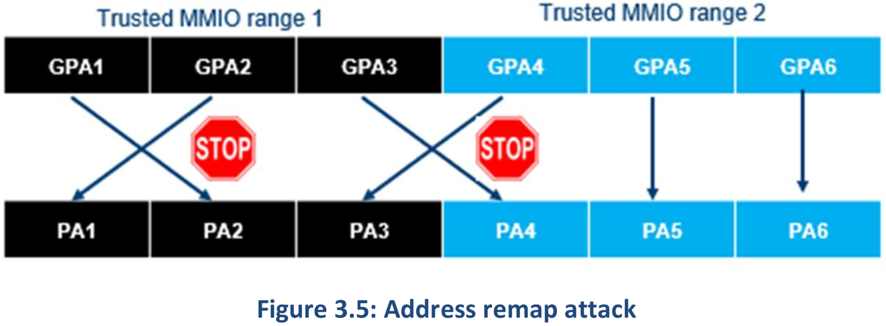
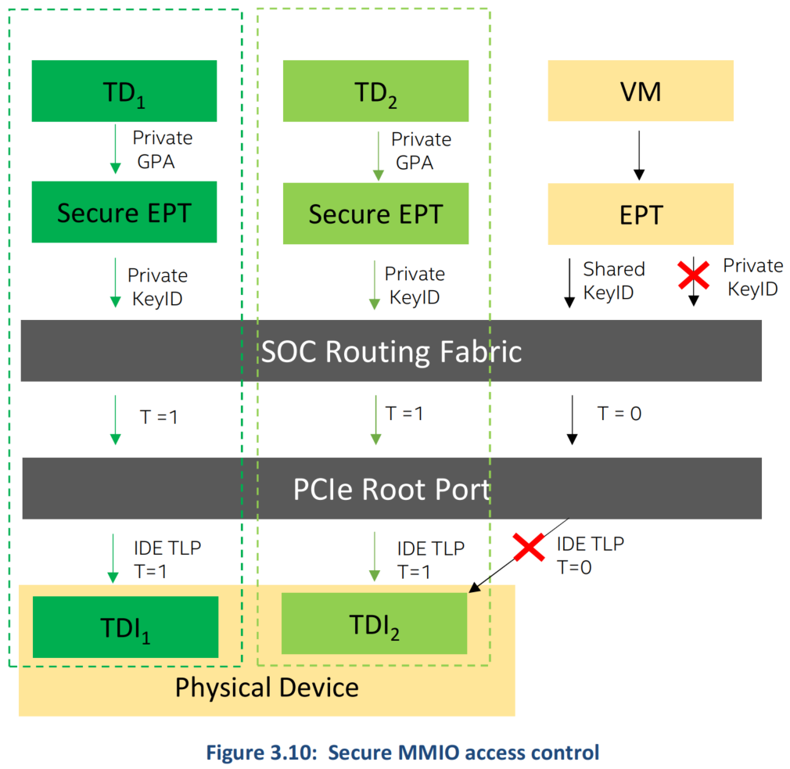

# TDX Connect Architecture Specification

# 1 关于本文档

## 1.1 本文档的范围
* 本文档介绍了 Intel® TDX Connect 架构在 CPU host 端如何实现 TDISP 1.0（PCI-SIG）标准，作为 Intel VTd 和 Intel TDX 架构的扩展。
* Intel TDX Connect 架构支持使用 SR-IOV（Single Root I/O 虚拟化）和 Direct Device（DDA）模型对外部 PCIe 设备进行 TDI 分配。
  * 这是第一代 Intel TDX Connect 架构，其范围不包括对高级 VTd、PCIe 或 CXL 功能的支持。

## 1.3 词汇表 Glossary

缩写      | 全称                    | 描述
----------|------------------------|--------------
**ACS**    | Access Control Service | PCIe ACS 在 PCI Express 拓扑中定义一组控制点，以确定 TLP 是否需要正常路由、阻止或重定向。ACS 适用于 RC、Switches 和多功能设备
**ATS**    | Address Translation Service | ATS 是 PCIe 的一项扩展功能，它使用设备和 root complex（RC）之间的请求完成协议来提供转换服务。此外，在内存读取和内存写入 TLP 中定义了一个新的 `AT` 字段，以使 RC 能够通过 ATS 协议确定给定请求是否已转换
**CMA/SPDM** | Component Measurement and Authentication | 组件度量和认证/SPDM（CMA/SPDM）根据 [SPDM] 中定义的数据对象和底层协议的适配来定义可选的安全特性。这些特性提供了与组件、设备/功能执行安全交换的机制（该术语通常用于指代 [SPDM] 中定义的所有功能）
**CPL**    | Completion | Completion PCIe TLP。所有读取、non-posted 写入、DMWR 和 AtomicOp 请求都需要 Completion。Completion 包括一个 Completion header，对于某些类型的 Completion，后面会跟着一定数量的数据的 DWs
**DOE**    | Data Object Exchange | 数据对象交换（DOE）是 PCIe 的可选机制，用于系统固件/软件用一个 function 或 RCRB 执行数据对象交换。软件通过数据对象交换 （DOE）扩展功能结构发现 DOE 支持
**DSM**    | Device Security Manager | 设备安全管理器（DSM）是设备中的一个逻辑实体，可被 TSM 纳入 TVM 的 TCB，并在设备上执行安全策略
**FLR**    | Function Level Reset | FLR 是一种 PCIe 可选机制，它使软件能够以功能级粒度静止（quiesce）和重置 endpoint 硬件
**IDE**    | Integrity & Data Encryption | 扩展 PCIe 完整性和数据加密（IDE）功能，以实现 PCIe 传输层数据包的机密性、完整性和重放保护
**IDE_KM** | IDE Key Management | IDE 密钥管理（IDE_KM）协议基于 [SPDM] 和 [Secured-SPDM]，可在多种传输中使用
**IOMMU**  | Input–Output Memory Management Unit | CPU-RC 输入输出内存管理单元（IOMMU），用于将设备虚拟地址转换为物理地址
**KCBAR**  | Key Config Bar| Intel CPU 实现 PCIe IDE Key 配置接口
**RC**     | Root Complex | I/O 层次结构的 PCIe root，用于将 CPU/内存子系统连接到 I/O。RC 可能支持一个或多个 PCI Express 端口。每个接口定义一个单独的层次结构域
**EP**     | End Point | 可以作为 PCI Express 的请求者或完成者的功能。Endpoints 分为传统端点、PCI Express 端点或 root complex Integrated Endpoints（RCiEP）
**SPDM**   | Secure Protocol and Data Model | 安全协议和数据模型（SPDM）规范定义了通过各种传输和物理介质在设备之间执行消息交换的消息、数据对象和序列
**TCB**    | Trusted Computing Base | 可信计算基（TCB）是计算系统中为操作提供安全环境的所有内容。这包括硬件、固件、软件、操作系统、物理位置、内置安全控制以及规定的安全程序
**TDI**    | TEE Device Interface | 支持 IO 虚拟化的设备的分配单元。例如，TDI 可以是整个设备、一个 non-IOV Function 或 一个 VF
**TEE**    | Trusted Execution Environment | 主处理器的一个安全区域。它保证加载其中的代码和数据在机密性和完整性方面受到保护
**TEE-IO** | Trusted Execution Environment for IO devices | 一个用于建立和管理可信执行环境（TEE）的概念性的框架，其中包括来自一个或多个设备的资源组合
**TSM**    | TEE Security Manager | TEE 安全管理器（TSM）是 host 中的一个逻辑实体，位于 TVM 的 TCB 中，并在 host 上执行安全策略
**TVM**    | TEE Virtual Machine | TEE 设备接口安全协议（TEE Device Interface Security Protocol，TDISP）参考架构中定义的可信执行环境虚拟机

# 2 介绍

## 2.0 IO 虚拟化
* *IO 虚拟化* 是指跨多个 VM 或容器实例虚拟化和共享 I/O 设备。IO 虚拟化有多种现有方法，可大致分为 *基于软件* 或 *硬件辅助* 的方法。
  * 通过基于软件的 I/O 虚拟化，虚拟机管理程序向 VM 公开虚拟设备，例如网络接口控制器（NIC）。虚拟机管理程序或 host 操作系统中的软件设备模型模拟虚拟设备的行为。设备模型将虚拟设备命令转换为物理设备命令，然后再转发到物理设备。
* 现代处理器提供减少虚拟化开销的功能，VMM 可利用这些功能允许 VM 直接访问硬件资源。
  * 这包括直接内存访问（DMA）和中断重新映射和隔离功能，可用于最大限度地减少 IO 虚拟化的开销。
* 具体来说，Intel 支持以下硬件辅助 IO 虚拟化方案，无需软件协助即可直接移动数据：
  * 直接设备分配：将整个设备分配给虚拟机。
  * Single Root I/O virtualization（SR-IOV）：分配一个设备的虚拟化功能。
  * Scalable I/O virtualization（S-IOV）：分配由 VMM 组成的低级设备接口虚拟化一个设备。

## 2.1 使用 TDX 实现 IO 虚拟化 vs. TD Connect
* 基本 Intel® TDX 硬件禁止设备直接访问 TD 私有内存。因此，仅支持基于软件的 IO 虚拟化。不受信任的虚拟机管理程序使用由 VMM 管理的共享（不受信任）合成（synthetic）IO 和半虚拟化设备接口将虚拟设备，例如网络接口控制器（NIC）暴露给 TD（请参阅 [TDX 模块基本规范]“I/O 支持”部分）。
* 基于软件的 IO 模型很慢，因为 TD 和设备之间的通信是通过共享内存 bounce-buffers 完成的，这需要 TD guest 在 TD 内运行的应用程序的私有内存 buffers 和设备使用的共享 IO buffer 之间来回复制和加密数据。
* 对于某些 IO 用例，例如网络和存储，TD 可能采用基于软件的加密技术来保护数据，但与 VT-d 直接 IO 虚拟化的低延迟和高吞吐量相比，这种方法存在性能开销问题。
  * 除了性能开销之外，加密数据保护不允许 TD 将计算 offload 到传统的 GPU 或 FPGA 加速器上，而要求它们位于 TD 的 TCB 中并妥善保护其秘密数据。

* Intel® TDX Connect 旨在从两个方面改善 TD TEE 的 IO 虚拟化：
  * **功能**：TD 和设备无需使用共享 buffer 来存储私有数据，包括与设备建立安全传输级会话（通常使用专有协议来调整特定设备的数据处理和转换需求）。
  * **性能**：消除在共享 TD 设备 buffer 和私有 TD 内存之间来回复制加密或复制解密数据所需的额外资源和工作，从而大大提高工作负载性能（就带宽和延迟而言）。
* Intel TDX Connect 架构为 TD 引入了可信设备分配，扩展了其 TD 可信计算基（TCB）和 TEE-IO 设备接口（TDI），同时保护了其数据：
  * **CPU**：使用 *私有* MMIO 和 DMA 访问控制和数据隔离扩展了 Intel TDX 硬件
  * **传输**：使用 PCIe selective IDE streams 进行端到端数据保护
  * **设备**：使用 SPDM、IDE 和 TDISP 支持扩展了 TDX module，允许 TD 仅将其 TEE 和 TCB 扩展到他们选择信任的 TEE-IO 设备

## 2.2 系统概述

* Host 平台硬件可能包括一个或多个 sockets，每个 socket 都有多个 cores、内存控制器和 I/O hubs。
* Cores 和 I/O hubs 共享一个 *一致的（coherent）系统 cache 和 fabric*，该 cache 和 fabric 通过 *实现 Intel® Multi-Key TME（TME-MK）加密引擎的内存控制器* 连接到系统内存。
* 每个 I/O hub 都包括一个 IOMMU 和相关逻辑，用于将设备连接到 SOC 内的 coherent fabric。
  * I/O hubs 的一个子集可能包括 PCIe root-complexes 和用于连接分立（discrete）PCIe 设备，而其他 IO hubs 可能仅支持封装内（within-package）的集成设备。
* 集成设备不包含在 Intel TDX Connect 范围内，而有支持 Intel TDX Connect 的分立的 PCIe root-complex I/O hubs（的一个子集），其分叉（bifurcated）RP 可能支持 PCIe IDE 扩展功能。

* 每个 PCIe root complex 可以使用分叉 PCIe 链路的 downstream root port *直接* 或 *通过任何拓扑的 bridges 和 switches* 连接到 endpoint 设备。
* PCIe root complex 下的设备可以包括符合 TDISP 和/或常规 PCIe 设备。
* 符合 TDISP 的设备可以托管一个或多个 TEE-IO 设备接口（TDI），这些接口可以在任何时间点
  * 分配给单个 TD，
  * 或者作为常规设备接口（例如 VF），可以分配给 TD（通过共享内存）或常规 VM。
* 平台系统软件类似于支持 TDX 的平台。它包括一个可以托管一个或多个 VM 的虚拟机管理程序，并且可能包含一个已安装的支持 Intel TDX Connect 的 TDX module。

## 2.3 安全模型

* Intel TDX Connect 安全模型包含以下关键概念：
1. 只有 TD 所有者才能决定哪个 TEE-IO 设备接口（TDI）是值得信赖的
2. TDI 可以使用 DMA 访问 TD 私有内存，但前提是 TD 明确允许，并且仅当其专门分配给该 TD 时才允许
3. TD 仅当 *TD 是该 TDI 的当前所有者时* 才可以使用受信任访问（TEE-TLP）访问 TDI MMIO 空间
* Intel TDX Connect 信任模型要求每个 TD 明确接受设备进入其信任边界。被一个 TD（A）信任的设备并不意味着它处于 *其他未接受该设备进入其信任边界的 TD（B）* 的信任边界内。
* 根据 TDISP，这样的设备处于已将其接受到其信任边界的所有 TD 的信任边界内，并且它必须保持每个 TDI （例如，VF）隔离给每个 TD。
* 单个 TDI 不能在 TD 之间共享，但是，多功能设备（支持多个 TDI）可以被多个 TD-VM 信任，并使用单个 IDE selective stream 来保护 CPU host 和 TEE-IO endpoint 设备之间的数据路径。
* Intel TDX Connect TCB 不包括 switches 和 bridges，因此 host VMM 需要设置 selective IDE stream，以保证在 host CPU 上运行的 TD-VM 和在 TEE-IO 设备上运行的 TDI 之间端到端的 IDE 保护。
* 下图说明了 Intel TDX Connect 信任关系，其中：
  - TDX Connect host 平台和 TSM 受到所有 TD-VM 的信任
  - 设备 1 受到两个 TD-VM 的信任，因为 `TDI-VF1` 和 `TDI-VF2` 分别分配给 `TD-VM1` 和 `TD-VM2`
  - 设备 2 不受任何 TD-VM 信任，因为 `VF3` 未分配给任何 TDI-VM
  - 设备 3 仅受 `TD-VM1` 信任，因为 `TDI-VF4` 分配给 `TD-VM1`
  - Selective IDE stream 用于保护 host CPU 和设备之间的互连，bridges 和 switches 使用 IDE 直通模式，不被任何 TD-VM 信任

## 2.4 功能和特性
* 下表描述了 Intel TDX Connect 架构范围内的功能和特性。
* Table 2-1: Intel TDX Connect Supported Capabilities and Features

焦点区域       | 特性或功能            | TDX Connect 支持 | 细节
--------------|----------------------|------------------|--------------------------------
PCIe IDE      | Link IDE stream      | 否 | legacy 设备可以使用 Link IDE stream，但 TEE-IO 设备则不行
...           | Selective IDE stream | 是 | 每个 root complex 最多有 4 个 IDE stream，每个 RP 的 IDE stream 寄存器块数量取决于每个 RP 的分叉。
Trusted MMIO | TD 到 TEE-IO 设备     | 受限 | 限制为 MMIO 高（4GB 以上）地址
...          | Peer-to-Peer         | 受限 | 仅通过 host IOMMU 和 root complex。通过 bridges 和 switches 的直接访问取决于 Intel TDX Connect ATS 支持（见下文）
Trusted DMA | TEE-IO 设备到 TD 内存 | 是 | 设备可以访问 TD 私有或共享内存
ATS         | 可信地址转换和转换请求 | 否 | Intel TDX Connect 威胁模型需要 Secure-ATS 来确保翻译后的请求只能访问接受它们进入其 TCB 的 TD 的系统内存。这是 Intel TDX Connect 的未来扩展
Nested IOMMU Translations | 支持 TD 设置第一级页表以启用 DMA 访问控制或 SVM | 否 |
PF,FV Assignment | PF 和 VF（SR-IOV）的分配 | 否
SVM         | 受信任的 PRS 支持 | 否
Scalable IOV Support | 可扩展 IOV R2 设备支持的分配 | 否
CXL Type 1,2 | 支持参与 host 内存一致性的 CXL 设备 | 否 | TEE-IO 标准和对 CXL Type 1 和 2 设备的要求尚不成熟。这可能是未来的 Intel TDX Connect 扩展。
CXL Type 3 | 支持 CXL 内存 buffer 设备 | N/A | 此功能超出了 Intel TDX Connect 规范的范围，将在其他 TDX 未来的规范中描述。

### 2.4.0 TEE-IO 事务和需求
* 下表涉及关于 TEE-IO 的事务和配置要求：
  * 从 TD 和到 TDI 私有 MMIO
  * 从 TDI 到其 TD 所有者私有内存
  * P2P 的从 TDI 到 *另一个 TDI* 或 *分配给 TD 的非 TD 设备* 之间
* Table 2-2: Trusted Transactions and Requirements

...      | 需求        | 需求细节
---------|-------------|--------------------------
[TXN-1]  | TEE-IO 启用 | Intel TDX Connect 架构必须确保仅当为 Intel TDX Connect 启用 IOMMU 时才允许 TEE-IO 事务。
[TXN-2]  | TEE-IO MMIO 解码一致性 | 在每个 PCIe root complex（和 IOMMU）启用 Intel TDX Connect 之前，Intel TDX Connect 架构必须检查 MMIO 解码的不可信平台软件配置是否已锁定（无法修改）且一致（在所有 SOC 寄存器中配置了 *源* 到 *目标* 路由，以防止 TEE-IO 事务的错误路由）。
[TXN-3]  | TEE-IO DMA 解码一致性 | 在每个 PCIe root complex（和 IOMMU）启用 Intel TDX Connect 之前，Intel TDX Connect 架构必须检查系统内存解码的不可信平台软件配置是否已锁定（无法修改）且一致（在所有 SOC 寄存器中配置了 *源* 到 *目标* 路由，以防止 TEE-IO 事务的错误路由）。
[TXN-4]  | TEE-IO 和 SPDM | Intel TDX Connect 架构必须确保 TEE-IO 事务仅通过 root complex 进行，并且通过由 Intel TDX Connect TSM（TDX module 和 TPA）与 TEE-IO 设备建立的 SPDM 会话，root ports 被启用并配置了在此会话上使用了 IDE_KM 的 IDE selective streams。
[TXN-5]  | TEE-IO MMIO 源 | Intel TDX Connect 可能仅允许使用 TD Secure-EPT 中映射的私有 GPA 从 TD 或 TDI（P2P）向 MMIO 进行 TEE-IO 事务。
[TXN-6]  | TEE-IO 范围 | Host 平台软件只能使用 Intel TDX Connect ABI 通过 selective IDE stream 配置 TEE-IO MMIO 路由。这些 IDE streams 只能配置包含相关 RP 可预取内存范围的地址关联寄存器，并且只能选择 `4GB` 以上的地址范围。
[TXN-7]  | TEE-IO 目标 | TDSIP 针对设备 TEE/非 TEE 内存访问定义了 DSM 规则。Intel TDX Connect 可能不会强制执行任何设备 TEE 与非 TEE 内存访问控制。
[TXN-8]  | TEE-IO DMA 源 | 当且仅当 TD 明确接受 TDI 进入其 TCB（使用 TDISP 协议）时，Intel TDX Connect 架构才允许 TEE-IO 事务进入 TD 私有内存。TDI 不得访问任何其他 TD 私有内存空间，除非正确停止并从其之前的 TD 所有者处回收。
[TXN-9]  | TEE-IO DMA 范围和目标 | IOMMU 将 TDI 的 `GPA` 映射到 TD 私有内存空间必须与 TD `GPA` 到 `HPA` 的映射和权限一致。Intel TDX Connect 可能不支持在当前架构上 TDI 对 TD 的访问权限进行更精细的控制（例如，通过允许 TD 配置 `IOVA` 到 `GVA` 翻译表）。
[TXN-10] | TEE-IO MSI/X | Intel TDX Connect 可能不支持 MSI/X TEE-IO 事务
[TXN-11] | 通过 root complex 的 TEE-IO P2P | Intel TDX Connect 架构必须仅允许通过 root complex 进行 P2P TEE-IO 事务，并且仅允许使用未翻译的 TLP。
[TXN-12] | 直接 TEE-IO P2P | Intel TDX Connect 架构可能不支持 TEE-IO 设备之间的直接 P2P，也可能不允许 TD 生成 TDISP P2P 配置消息。
[TXN-13] | TEE-IO ATS | Intel TDX Connect 可能不支持与 PCIe ATS 相关的 TEE-IO 事务： - 翻译和设备 TLB 请求和 Completions - 翻译后的 TEE-IO 请求
[TXN-14] | 非 TEE-IO 事务 | Intel TDX Connect 支持必须支持非 TEE 事务，并且必须保证此类事务永远不会成为 TEE-IO 事务或具有 TDX 私有内存语义的系统内存。
[TXN-15] | 隐式的 非 TEE-IO 事务 | Intel TDX Connect 架构必须保证任何具有共享语义的访问（不使用 TDX private key ID 的 `HPA` 访问）都将导致非 TEE 事务。
[TXN-16] | 设备 P2P TEE-IO 访问 | 仅当请求未经翻译、请求者和响应者都是 TDI 分配并被接受到同一个 TD 所有者的 TCB 中并且目标 TDI 上的地址是私有 `HPA`（使用 TDX private KeyID）时，Intel TDX Connect 架构才允许 TEE-IO 设备执行可信的 P2P 访问。

### 2.4.1 标准和设备互操作性
* 下面的 DOE 支持指的是 TDX module/TPA 生成的消息的消息传输格式（即 SPDM、IDE_KM 和 TDISP 协议）。
* Intel TDX Connect host 平台不暴露一个 DOE mailbox（一个 TEE-IO 设备需要它，但 TEE host 平台不需要）。
* Table 2-3: DOE Support and Requirements

...     | 需求        | 需求细节
--------|-------------|--------------------------
[DOE-1] | 支持的 DOE 版本      | Intel TDX Connect 架构支持 DOE 1.0，并对 DOE 1.1 中添加的数据对象类型进行了额外的增强。
[DOE-2] | 支持的 DOE 对象类型   | 
[DOE-3] | 不支持的 DOE 对象类型 | 

* Table 2-4: SPDM Support and Requirements

...      | 需求        | 需求细节
---------|-------------|--------------------------
[SPDM-1] | 支持的 SPDM 版本 | Intel TDX Connect 支持 SPDM 版本 1.2
[SPDM-2] | 支持使用 TDISP 兼容设备建立、管理和拆除 SPDM 会话 | 必须能够与支持 TDISP 的设备建立、使用和拆除 SPDM 会话以供 TD 使用。
[SPDM-3] | 支持的 TDI SPDM 会话建立粒度 | SPDM 不强制要求会话建立的特定设备粒度。例如，根据设备对 DOE mailbox 的支持，允许以下所有配置： 1 device -> N function -> 1 DOE (仅在 function 0) -> 1 SPDM. 1 device -> N function -> N DOE -> N SPDM 1 device -> N function -> N DOE -> 1 SPDM (其他 N-1 DOE 被用于其他目的) 1 device -> N function -> N*M DOE (每个 function 有 M 个 DOE) -> N SPDM
[SPDM-4] | 每个 TDISP 兼容设备/设备接口的 SPDM 会话数 | 这不是规范强制要求的，取决于设备。例如，允许以下内容： 1 DOE -> 1 SPDM 1 DOE -> N SPDM (在 DOE 1.1 中支持 DOE connection ID)
[SPDM-5] | 每个 SoC 的 SPDM 会话数量 | 每个 IO stack `256` 个
[SPDM-6] | 未完成的 SPDM 请求数 | Intel TDX Connect 架构应支持无限数量的未完成安全 SPDM 消息请求（每个 SPDM 会话）。
[SPDM-7] | 支持的 SPDM 消息列表 | Intel TDX Connect 支持以下 SPDM 协议请求和响应消息：
[SPDM-8] | SPDM 算法 | Intel TDX Connect 支持 CMA 1.0 和 CMA 1.1 中定义的 SPDM 算法
[SPDM-9] | 不支持的 SPDM 消息列表 | Intel TDX Connect 不需要 SPDM 规范中定义的任何其他消息。

* Table 2-5: IDE Support and Requirements

...      | 需求        | 需求细节
---------|-------------|--------------------------
[IDE-1]  | IDE 版本的支持 | Intel TDX Connect 支持 PCI-SIG、IDE Rev A
[IDE-2]  | IDE Host 枚举 | 平台软件必须枚举 host 和 endpoint 设备上的 IDE 支持，以确定 Intel TDX Connect 平台和 TDISP 设备的通用 IDE 支持功能。 Intel RC IDE 与 TEE-IO 兼容，但不支持通过 IDE-ECAP 进行 TEE-IO 枚举。相反，TDX Connect（和 host TEE-IO 支持）应使用 root complex 和 IDE 发现机制（参见 [Intel RC IDE 指南]）和 TDX module 扩展功能枚举（参见 [TDX Module ABI 规范]）进行枚举。
[IDE-3]  | 支持 Selective 和 Link IDE streams | Intel TDX Connect CPU 在每个 x16 PCIe 层次结构上实现 4 个 IDE streams。每个 RP 的 Link 和 selective IDE stream 寄存器数量取决于每个 RP 分叉： 1x16 – 1 个 Link IDE，每个端口有 4 个 Selective IDE 配置寄存器 2x8 – 1 个 Link IDE，每个端口有 3 个 Selective IDE 配置寄存器 4x4 – 1 个 Link IDE，每个端口有 1 个 Selective IDE 配置寄存器 8x2 – 无 Link IDE stream，无 Selective IDE 配置寄存器（不适用于 Intel TDX Connect）
[IDE-4]  | IDE selective stream | 对于每个 IDE selective stream，每个 IDE stream 都有 *一个地址* 和 *一个 RID 关联寄存器集*。为了在 host 和 endpoint 设备之间正确绑定 selective IDE stream，平台软件在设置 IDE 启用控制之前，必须对具有相等 RID 和地址关联范围和对称密钥的相同 stream ID 编程，这需要使用 IDE KM 协议为所有的 sub stream 编程。
[IDE-5]  | Intel TDX Connect 启用/禁用和 Host IDE 寄存器保护 | 要启用 Intel TDX Connect，host 平台必须首先使用 Intel TDX Connect ABI 为每个 PCIe 层次结构启用 TDX 模式，并为每个启用的 RP 启用 TDX 模式。启用 Intel TDX Connect 后，IDE-ECAP 和 key 编程寄存器必须阻止对平台软件的 *写访问*，并且只能允许对 TDX module（SEAM root mode）的 *写访问*。此保护只能通过平台重置或使用 Intel TDX Connect ABI 的平台软件禁用（参见 [Intel TDX Connect Module 规范]）
[IDE-6]  | IDE 管理和与 SPDM 会话的绑定 | 一旦启用 Intel TDX Connect，host 平台软件必须使用 Intel TDX Connect ABI 设置 Link 或 selective IDE stream 并使用 IDE KM 协议配置其密钥。在使用 Intel TDX Connect ABI 创建和管理 IDE stream 之前，平台软件必须使用 Intel TDX Connect ABI 与 IDE 设备建立 SPDM 会话（参见 [Intel TDX Connect module 规范]）
[IDE-7]  | TDISP 与非 TDISP 设备的 IDE stream 设置 | Host 平台必须对 TDISP 设备使用 selective IDE，对非 TDISP 设备可以使用 Link 或 selective IDE stream
[IDE-8]  | IDE_KM 协议支持 | IDE_KM 的 Intel TDX Connect ABI 接口支持以下响应消息：
[IDE-9]  | Selective IDE stream 控制 | Selective IDE stream 控制地址关联寄存器不得编程为包含低于 `4GB` 的地址（MMIOL）
[IDE-10] | IDE TLP 保留位检查 | RP-IDE 硬件可以不实现对 IDE TLP 前面的 7 bit 的保留位的检查

* Table 2-6: TDISP Support and Requirements

...      | 需求        | 需求细节
---------|-------------|--------------------------
[DISP-1] | 支持的 TDISP 版本 | Intel TDX Connect 支持 TDISP v1.0
[DISP-2] | 支持的 TDISP 设备接口模式 | Intel TDX Connect 架构支持将完整设备 (PF) 和/或虚拟功能 (VF) 分配给 TD
[DISP-3] | TEE-IO 设备接口分配的生命周期管理 | 平台软件必须使用 Intel TDX Connect ABI 启用 TEE-IO 设备接口（TDI）分配到 TD 信任边界。TDISP 设备首先分配给处于 `PENDING` 状态的 TD。这意味着，TD 和设备无法生成受信任的 TLP 事务，直到 TD 明确调用 TDX-guest ABI 使此分配成为 `PRESENT`。有关更多详细信息，请参阅 [Intel TDX Connect Module Spec]。
[DISP-4] | Host 平台移除 TEE-IO 设备接口（优雅）| 要从 TD 中移除 TDI 并将其分配给另一个 TD，平台软件必须使用 Intel TDX Connect ABI 禁用与 TDI 设备关联的 selective IDE stream 或将其 TDISP 状态转换为 `CONFIG_UNLOCKED`。有关更多详细信息，请参阅 [Intel TDX Connect Module Spec]。
[DISP-5] | 支持的 TDISP 协议消息列表 | Intel TDX Connect 支持以下 TDISP 请求和响应消息，目前不支持其他消息类型：
[DISP-6] | TEE-IO 枚举 | 在使用 Intel TDX Connect ABI 之前，平台软件必须使用 TDX ABI 来枚举 Intel TDX Connect 支持。有关更多详细信息，请参阅 [Intel TDX Connect Module 规范]。

### 2.4.2 设备（DSM）和 Host（TSM）需求
* Intel TDX Connect 设备需求
* Table 2-7: DSM and TEE-IO Device Requirements

...     | 需求        | 需求细节
--------|-------------|--------------------------
[DMS-1] | TEE MMIO 范围 | Intel TDX Connect 架构不支持 TEE-IO 事务到 MMIO 低端（< `4GB`）或配置空间。设备必须使用 `64` BAR 暴露所有 TEE MMIO 资源。与 TDI 和 TDI TEE MMIO 范围绑定的 IDE selective stream 必须配置为 MMIO 高端范围。
[DMS-2] | 设备地址宽度 | 设备地址宽度（也由 TDISP 功能报告）必须至少为 `52` 位
[DMS-3] | TEE-IO P2P  | 设备只能通过 root complex IOMMU 发送和处理受信任的 P2P TLP。Intel TDX Connect CPU host 不支持设置通过 switches（以及通过 root complex）进行直接 P2P 所需的 P2P IDE selective streams。
[DMS-4] | TEE-IO PASID | 设备不得使用 PASID 进行 TEE-IO 事务。在 TDI 配置期间，建议禁用 PASID。
[DMS-5] | TEE-IO ATS | 设备不得使用 ATS 请求进行 TEE-IO 事务。在 TDI 配置期间，建议禁用 ATS。
[DMS-6] | TEE-IO PRS | 设备不得使用 PRS 请求进行 TEE-IO 事务。在 TDI 配置期间，建议禁用 PRS。
[DMS-7] | TEE-IO CXL.mem/cache | 设备不得使用 CXL.mem/cache 进行 TEE-IO 事务。在启用 TEE-IO 或配置 TDI 期间，设备建议将设备降级以使用 CXL.io TEE-IO 事务或支持仅 PCIe 模式。
[DMS-8] | TEE-IO MSI/X | 设备不得使用 MSI/X 请求进行 TEE-IO 事务。设备配置逻辑不得将 MSI/X 锁定标志设置为设备接口 TDISP 锁定请求的一部分。

* Table 2-8: TSM (TDX Module and TPA Requirements)

...      | 需求        | 需求细节
---------|-------------|--------------------------
[TSM-1]  | Intel TDX Connect 枚举 | TDX module 必须根据整个平台和每个特定的 IOMMU（PCIe 层次结构）暴露平台 Intel TDX Connect 功能支持
[TSM-2]  | Intel TDX Connect 模式 | TDX module 必须在每个具有 Intel TDX Connect 支持且由 BIOS 配置为启用 Intel TDX Connect 的 root complex 实例上，启用 VMM 动态启用/禁用 Intel TDX Connect 模式
[TSM-3]  | IOMMU，PCIe 配置锁 | 当启用 Intel TDX Connect 模式时，TDX module 还必须启用硬件访问控制，以确保与 Intel TDX Connect 安全相关的 IOMMU 和 PCIe 寄存器不会被不受信任的软件、固件和硬件（例如设备）篡改。
[TSM-4]  | SPDM 设置 | TPA TD 和 TDX Module 必须支持 SPDM 会话的建立、维护和拆除。
[TSM-5]  | Attestation | TPA TD 和 TDX Module 必须支持 SPDM 收集设备证书、度量和策略信息。设备信息可以通过不受信任的通道传输到 TVM，但是，TDX module 和 TPA 必须为 TVM 提供验证此类设备信息完整性和新鲜度的方法。
[TSM-6]  | IDE 设置 | TDX module 必须支持 VMM 使用 IDE_KM 和安全 SPDM 传输与设备建立 selective streams（或非 TIDSP 的 Link，仅限 IDE 情况）的能力。安全 SPDM 传输必须使用 TPA TD 建立的 SPDM 会话。
[TSM-7]  | TDI（FUNCTION_ID）分配 | TDX module 必须支持 TDI 分配给 TD，确保每个 `FUNCTION_ID` 一次只能分配给一个 TD。TDX module 必须确保此类 TDI 必须与 selective IDE 相关联。
[TSM-8]  | TDISP 生命周期支持 | TDX module 必须提供 VMM 和 TD 接口，以便根据 TDISP 协议管理 TDI 分配。TDX module 必须限制 VMM 仅生成 TDI *锁定*、*停止* 和 *获取接口状态* 消息。 TDX module 必须提供 TD 接口，以便根据 TDISP 协议管理 TDI 分配。TDX module 必须限制 TD 仅生成 TDI *获取接口报告*、*获取接口状态* 和 *启动接口* 消息。 TDX module 可能不支持任何非强制性的 TDISP 协议消息类型。
[TSM-9]  | 私有 MMIO 管理 | TDX module 必须跟踪每个私有 MMIO，最多可分配给一个 TDI（`FUNCTION_ID`），并且必须提供 VMM API 以将私有 MMIO 页面分配给 TDI 并将其映射到 TD（处于 `PENDING` 状态）。TDX module 必须提供 TD 接口来验证和启用此类 MMIO 映射（TVM 必须调用 TDX module API 来接受设备 TDISP 报告中显示为 TEE MMIO 范围的每个 MMIO 页面）。
[TSM-10] | 私有 DMA 管理 | TDX module 必须向 VMM 提供可信的 DMA 映射管理接口，以管理 TEE-IO DMA 翻译到 TD 私有内存。此类 VMM 接口必须被映射为 `PENDING`。TDX module 必须提供 TD 接口来验证和启用此类 DMA 映射（TVM 必须调用 TDX module API 来接受 TDISP 报告消息中出现的每个 `FUNCTION_ID` 的每个 DMA 映射）。
[TSM-11] | TDI 拆除 | TDX module 必须启用 VMM 发起的从 TD 拆除 TDI 绑定的操作。TDX module 必须支持优雅拆除，即首先停止 TDI，然后从 TD 中移除。为了确保生存能力，如果 TD 或设备无法运行，TDX module 必须提供从 TD 拆除 TDI 资源（例如 MMIO、DMA 映射）的机制，方法是首先禁用 TDISP 绑定的 IDE selective stream，然后使用用于优雅拆除的相同接口回收所有 TDI 资源。
[TSM-12] | TD `GPA.S` bit 位置 | Intel TDX Connect 可能不允许 VMM 将 `GPA.S` bit 位置配置为 `52`（`MAX_PA`）以外的值。
[TSM-13] | 支持 TD Live Migration | 只要在 TD 热迁移开始之前删除 TDI 并且在 TD 热迁移期间无法分配 TDI，Intel TDX Connect 就支持热 TD 迁移共存。
[TSM-14] | 支持 TDX Module 无缝更新 | Intel TDX Connect 支持无缝（影响较小）TDX module 更新。在 TDX module 更新期间，TD 可能无法运行，但设备 DMA 到 TD 私有内存是可行的。
[TSM-15] | 支持 TD Partitioning | Intel TDX Connect 支持 TD partitioning，这样从 VMM 角度来看，TDI 分配就交给 L1 VMM。Intel TDX Connect 必须支持 L1 TD 能力，以便接受将其自身上下文的 TDI 分配到其中一个 L2 VM 的上下文。

# 3 架构概览
* Intel TDX Connect 框架是 Intel 的 TDISP 实现，允许通过在 TD 和由 TDISP 兼容设备托管（hosted）的 TDI 之间建立信任来实现直接分配。
* Intel TDX Connect 框架的目标是实现以下目标：
  - 在 TD 和 TDISP 设备之间建立信任关系。
  - 保护 host 和设备之间的数据路径 PCIe 互连。
  - 以可信的方式支持 TDISP 分配和移除生命周期。
* 具体来说，该框架定义了以下要素：
1. 支持 TEE-IO 的设备和 DSM（参见 [TDISP 规范]）
2. PCIe 完整性和数据加密（参见 [IDE 规范]）
3. CPU 硬件访问控制，用于保护和隔离 host SOC 内的 TEE-IO 事务
4. TDX module 扩展，用于支持安全的 TEE-IO 设备设置和将 TDI 直接分配给 TD

## 3.1 TEE-IO 功能设备和 DSM
* 根据 *TEE 设备接口安全协议（TDISP）* 规范的定义，支持 TEE-IO 的设备必须提供以下功能：
1. **身份验证（Authentication）、证明（Attestation）和密钥协商（Key Negotiation）**：实施 DMTF SPDM 1.2 规范，用于运行时身份验证、固件和配置度量报告以及会话密钥协商。
2. **完整性和数据加密（Integrity and Data Encryption，IDE）**：支持 Intel TDX Connect 的设备支持 PCIe/CXL IDE 扩展 PCIe，以提供传入或传出设备的数据的机密性、完整性和重放保护。
3. **安全生命周期管理（Secure Life-Cycle Management）**：实现 TDISP 状态机，用于跟踪和执行设备接口安全生命周期的配置、锁定、报告和运行，从而根据 TEE 设备接口安全协议（TDISP）规范实现安全的 TDI 到 TD 分配和移除。
4. **数据安全（Data Security）**：支持设备内资源访问控制，对于 TD 提供给设备的数据，具有与 host 相同的隔离质量和安全属性。
* 设备的真实性由使用基于公钥加密的成熟技术的数字签名确定。
  * 设备通过使用私钥生成数字签名来证明其身份。
  * TD 可以使用与该私钥关联的公钥以加密地（cryptographically）方式验证签名。
  * 设备用来证明其身份和真实性的私钥由其供应商在硬件制造期间或之后提供给设备。
* 受信任的 *根证书颁发机构（CA）* 会生成提供给 TD 的 *根证书（Root-Cert）*。
  * 这允许 TD 在运行时身份验证期间验证设备生成的数字签名的有效性。
  * 根 CA 还会通过证书链间接认可每个部分的公钥/私钥对，其中私钥由设备提供或生成。
  * 设备携带证书链，其中根是 *Root-Cert*，叶子是 *设备证书（Device-Cert）*，其中包含与其私钥相对应的 *公钥*。
* 在运行时，TD 可以从设备检索证书链，并向设备发送唯一的 challenge。
  * 然后，设备使用私钥对 challenge 进行签名。
  * TD 使用设备的公钥以及证书链中的任何中间公钥来验证签名，并使用根证书作为受信任的 anchor。
* 支持 TEE-IO 的设备还实现了 *度量寄存器*，用于保存设备的固件/软件或配置数据的加密哈希值。
  * 在响应 TD 的请求时，设备提供用私钥签名的度量值。这允许 TD 确定设备固件/软件/配置的身份和度量值。
* 有关更多详细信息，请参阅 [TDISP 规范]

## 3.2 完整性和数据加密
* Intel TDX Connect 需要与设备建立安全连接，以便：
1. 在 TD 和受信任设备之间流动的数据必须保持机密性、完整性，并使用 TSM 派生的密钥进行重放保护。
2. 与传输相关的元数据（例如，TD 地址空间中 DMA 传输的逻辑地址）必须具有完整性和重放保护。
* PCIe *完整性和数据加密（IDE）* 规范为两个端口之间传输和接收的 TLP 提供机密性、完整性和重放保护。它灵活地支持各种使用模型，同时提供广泛的互操作性。
  * IDE 使用的加密机制符合行业最佳实践，并且可以随着安全要求的发展而扩展。
  * 安全模型考虑了来自对链路的物理攻击的威胁，包括攻击者可以使用实验室设备、专用插入器或恶意扩展设备检查本应保密的数据、修改 TLP 内容、重新排序和/或删除 TLP 的情况。
  * TLP 在经过 switches 时可以受到保护，从而扩展安全模型以应对通过重新编程 switch 的路由机制或使用恶意 switches 发起的攻击。
* IDE 在两个端口之间建立 IDE stream。
  * 当端口之间没有 switch 时，可以保护链路上的所有或仅选定的 TLP 流量。
  * 对于端口之间有或没有 switches 的情况，都可以保护选定的 TLP 流量。
  * **译注：** Selective IDE Stream 可以经过 switch，Link IDE Stream 不能经过 switch，只能是端到端。

* Intel TDX Connect 安全架构将 switches 排除在 TD 的 TCB 和参与 Intel TDX Connect 框架的设备之外。为此，Intel TDX Connect 架构专门使用 selective IDE stream 来保护在 SOC root complex 和支持 Intel TDX Connect 的端点设备之间流动的 TLP。
* 受 IDE 保护的 TLP 称为 **IDE TLP**。所有 IDE TLP 都必须使用 **IDE TLP 前缀**，该前缀必须位于所有其他 end-end TLP 前缀之前。

* IDE 在 Galois/Counter 模式（GCM）中使用 AES。对于 IDE TLP，
  * TLP 数据有效负载内容构成“明文”，也称为 `P`，如 [AES-GCM] 中定义，
  * 而 TLP Header 和某些其他元素构成“附加认证数据（Additional Authenticated Data）”，也称为 `A`，如 [AES-GCM] 中定义。
  * MAC 大小，也称为 `t`，如 [AES-GCM] 中定义，必须为 `96b`。
* 当启用 selective IDE stream 时，匹配其 stream *Control Register* 中的 `TC` 值可确定传输的 TLP 与其相关联。此外：
  - 对于 ID-Routed Messages 和 Completions，*目的* 位于 selective IDE *RID Association Register* 块中 `RID Base` 和 `RID Limit` 之间的范围内
  - 对于内存请求、请求，*地址* 位于 selective IDE *Address Association Register* 块中 `Memory Base` 和 `Memory Limit` 之间的范围内
* 必须根据 IDE TLP 前缀中指示的 ID 处理接收到的 TLP。
* 设备分配给 TD 的单位是 **TEE 设备接口（TDI）**。
  * TDI 可以是 physical function（直接设备分配）或 SR-IOV virtual function（VF）。
  * 要将设备接口分配给 TD，首先要与设备建立 selective IDE stream 并将其设置为 *默认 IDE stream*。
  * 在 host root port 上，使用 *被设备解码的地址范围* 来设置 selective IDE address association register，并使用 *被设备解码的请求者 ID 范围* 来设置 RID association register。
* 当设备生成 TLP 时，用于这些 TLP 的 stream 以设备特定的方式确定。
  * 对于 Intel TDX Connect 用法，TDISP *lock interface 消息* 用于将默认 stream ID 配置到设备中，以便设备为 TDI 生成的所有 TLP 都使用默认 stream ID 作为 IDE TLP 发送。
  * 同样，一旦将 stream ID 配置到 TDI 中，设备将仅接受 *IDE TLP 前缀中的 stream ID* 与 *默认 stream ID* 匹配的 IDE TLP。
* 注意，根据 [TDISP 规范]，TEE-IO 设备托管的 **所有 TDI** 都必须 *锁定* 并 *绑定* 到 **相同的 stream ID**，即 *默认 stream*。
* 当 TDI 被分配给 TD 并处于 TDISP `RUN` 状态时，它会使用默认 stream 生成 TLP，并将 `T` bit 设置为 `1`。
  * 同样，访问 TDI 私有 MMIO 空间（TEE-MMIO）时，必须使用默认 IDE stream ID 并设置 `T` bit，并且仅当 TDI 处于 TDISP `RUN` 状态时才可以访问。
* 其他设备接口或当 TDI 未处于 `RUN` 状态时，必须将 `T` bit 设置为 `0`，并且不得允许访问 TD 私有资源（例如 TEE-MMIO 或 TD 私有内存）。
* 总之，Intel TDX Connect 架构使用 PCIe IDE 扩展如下：
  * Selective IDE stream 用于保护在 SOC 和具有 TD-assigned 接口的设备之间流动的 TLP。
    * 此类设备可能将一些接口分配给 TD，将其他接口分配给非 TD 软件。
  * 源自 TD 的事务设置了 IDE TLP 前缀中的 `T` bit，并且仅当 `T` bit 为 `1` 时，设备才接受访问 TD-assigned 接口的 TLP。
    * `T` bit 可帮助设备区分 TD 和非 TD 访问。
    * TD Secure EPT 用于允许访问分配给该 TD 的设备接口的 MMIO 地址范围。这样，它可以防止一个 TD 访问分配给其他 TD 的其他设备接口的 MMIO 地址范围。
    * **译注**：这只能交给位于 TCB 中的 TDX module 来管理了，VMM 不在 TCB 中不能交给它管理
  * 设备为分配给 TD 的设备接口生成 `T` bit 设置为 `1` 的 IDE TLP。
    * IOMMU 使用 *受信任的 DMA 转换表*（稍后讨论）转换 `T` bit 设置为 `1` 的 DMA TLP，从而允许设备接口访问其分配的 TD 的私有内存。
    * 受信任的 DMA 转换表可防止 TD 分配的设备对其他 TD 的内存执行 DMA。
    * **译注**：显然，这需要 RC 也支持 TDX Connect 并被纳入 TCB 中，猜测受信任的 DMA 转换表也由 TDX module 管理

## 3.3 受信任的 IO 访问控制
* IDE 在 PCIe 链路上以及 TD 与其分配的 TDI 之间的数据传输边缘提供端到端的保护。
  * TEE-IO 设备 DSM 确保源自 TDI 的 DMA 访问将使用默认 IDE stream，并将在 IDE 前缀上设置 `T` bit。
  * TDX Connect CPU 和 TSM 访问控制为 TD 与其分配的 TDI 之间的私有 DMA 和 MMIO 访问在 CPU 的内部提供了隔离。

### 3.3.1 受信 MMIO 安全目标
* Intel TDX Connect 架构实现从 TD 到 TDI 的可信 MMIO 访问必须解决以下问题：

#### 3.3.1.1 恶意干扰
* 非 TD 软件、不受 TD 信任的其他设备或另一个 TD 恶意访问 TD 分配接口的 MMIO 范围。恶意干扰问题解决如下：
* TDX module 必须维护 MMIO 页面分配跟踪器，以确保 **每个 MMIO 页面只能通过其 Secure-EPT 映射到单个 TD**。
  * VMM 调用 TDX module API 将分配的设备接口的 MMIO 空间在 TD Secure-EPT 中映射到 的 TD 所有者。
  * 为确保正确且排他地完成 MMIO 空间映射（即，没有其他 TD 可以访问分配的设备 MMIO 空间），TD 使用 TDX module API **接受** 专门分配给它的 MMIO 页面，以确保没有其他 TD 可以对 TD 分配的 MMIO 空间生成受信任的 MMIO 访问（使用 TDX KeyID）。
* **仅当 MMIO 访问通过 TD Secure-EPT 转换时，即使用 TDX KeyID 进行访问时，root complex 才会生成设置了 `T` bit 的 TLP**。
  * 不受信任的软件（例如 Legacy VM、VMM、SMM、BIOS 等）无法使用 TDX KeyID 生成 MMIO 访问。
  * 对于使用共享 KeyID 进行的此类 MMIO 访问，root complex 将清除 IDE TLP 中的 `T` bit。
  * 如果有访问分配给 TD 的接口寄存器的 IDE TLP，遵循 TDISP 的设备接口必须拒绝任何将 `T` bit 设置为 `0` 的 TLP，因为它们是不受支持的 TLP。
* 分配给 TD 的设备接口已锁定并绑定到 IDE stream。
  * 此类设备接口仅接受将 `T` bit 设置为 `1` 并在其绑定到的 stream 上接收的 IDE TLP。
  * 所有其他 TLP 均被视为不受支持的 TLP 而拒绝。
  * 使用 TEE 设备接口安全协议消息（参见：[PCI-SIG,TDISP] 规范）绑定 stream ID 并将接口锁定到 TD。
  * 未经授权的设备无法生成 TLP 来访问分配给 TD 的接口的寄存器，因为这些未经授权的设备没有 IDE 加密密钥。

#### 3.3.1.2 地址重映射攻击
* VMM 可能会尝试在将两个不同设备的 MMIO 范围映射到 secure-EPT 时交叉连接它们。
  * 这种攻击的一种变体包括将 MMIO GPA 范围映射到 DRAM、其他设备接口 MMIO 页面或交换连续 MMIO `HPA` 范围页面的顺序。
* 例如，如下图所示，恶意 host VMM 可以将 `GPA3` 映射到属于另一个设备的点 `PA4`，或将 `GPA1` 和 `GPA2` 的映射分别交换到 `PA2` 和 `PA1`。

* TDX Connect 可按如下方式解决重新映射攻击：
  * MCEHCK 和 TDX module 锁定并验证分配给外部 PCIe 设备的 BIOS 配置 MMIO 在整个平台上是否一致且确定。
  * TDX module 维护对 TDI 跟踪器的 MMIO 页面分配。
    * 用于 MMIO 映射的 TDX module host VMM API 强制 MMIO 页面只能映射为私有页面一次，并且只能映射到当前拥有 TDI 的 TD。
  * 作为 TDISP 生命周期的一部分，TD 接收设备接口配置报告。
    * 此报告包含私有 MMIO 范围和偏移量（顺序），必须按照这些范围和偏移量将它们映射到 TD 的私有 GPA 空间中。
  * TDX module 暴露 API，供 TD guest 接受 MMIO 范围设备接口配置报告。
    * TDX module 的 accept API 通过将 `HPA` 偏移量转换为特定 `HPA` 并检查其是否与 VMM 映射匹配，来验证 MMIO 页面是否按预期映射。

#### 3.3.1.3 重叠攻击
* VMM 可能会尝试将 MMIO 范围分配给两个设备以利用任何优先级解码 bugs。
  * Root complex 中的地址解码器可能被 BIOS 错误地配置，以设置多个 root ports 来解码给定的 MMIO 范围。
  * VMM 可能会在 root complex 的 downstream 的 swithes 中设置解码器以导致此类重叠。
* 重叠攻击的解决方式如下：
  * MCHECK 和 TDX module 锁定并验证 Core、SOC fabric、root complex 和 root port 之间的 MMIO 地址解码是否一致且具有确定性，以便不会出现由于与 MMCFG、DRAM 或其他范围重叠的解码规则而导致的 MMIO 路由别名或丢弃。
  * TEE-IO 设备必须确保其 BAR 不重叠，并在其 TDI 或 IDE stream 处于锁定状态时将任何 BAR 重新编程视为错误（有关详细信息，请参阅 [PCI-SIG、TDISP 和 IDE]）。
  * Intel TDX Connect 架构不包括信任边界中的 switches，并且为 switches 设置了透传的 selective IDE stream。
    * 这样就避免了必须将 switches 中的任何配置视为错误编程，包括创建导致加密和完整性保护流量重定向的重叠，从而避免损害数据的机密性。
    * 注意，拒绝服务不是安全目标。
  * 这种攻击的另一种形式涉及减少 MMIO 解码窗口以悄悄地放弃一些受信任的事务。
    * 这种攻击由 TDX module 锁定 root complex 和 root port 的 MMIO 路由配置范围来解决，确保只能在这些范围内对 selective IDE streams 和 MMIO 页面进行编程。

#### 3.3.1.4 重定向攻击

* VMM 配置 switches 以重定向或丢弃 MMIO 访问。重定向攻击的解决方式如下：
  * Intel TDX Connect 架构在信任边界中不包含 switches，并且设置了 switches 通过的 selective IDE streams。
    * 这样就避免了必须信任 switches 中的任何配置，因为编程错误，包括创建导致加密和完整性保护流量重定向的重叠，从而避免危及数据的机密性。
    * 注意，拒绝服务不是安全目标。
  * 进行此类重定向的一种特别的方法是 VMM 篡改 selective IDE stream 地址和 ID association registers 的 selective IDE stream。
    * Host 端 IDE 访问控制机制可解决此攻击，从而 **确保只有 TDX module 能够对 IDE stream 寄存器进行编程**。

#### 3.3.1.5 Man-in-the-middle（MITM）
* 攻击者窃听、修改、重放或注入 MMIO 请求或完成。
* MITM 攻击的应对方法如下：
  * Intel TDX Connect 架构在信任边界中不包含 switches，并且为设置了 switches 透传的 selective IDE streames。
    * 这样就避免了必须信任 switches 中的任何配置或 switches 中观察接口（例如调试端口）周围的安全机制。
    * SOC RC 和 TEE-IO 设备之间的 PCIe 事务受到 selective IDE stream 加密的保护，从而保证了机密性、完整性和重放保护。

#### 3.3.1.6 恶意设备接口编程
* 此攻击向量包含 VMM 以恶意方式预先配置分配给 TD 的设备接口。在设备接口投入运行并允许访问 TD 私有内存之前，不允许 TD 检查设备接口寄存器配置，这是有问题的。
* 恶意设备接口编程攻击的解决方法如下：
  * TDISP 管理协议强制 TDI 以 non-operational 形式启动，在该形式下它不接受任何 MMIO 访问或生成 DMA。
    * 设备接口的 TD 所有者是唯一能够生成安全 SPDM 消息以指示设备进入 TDISP `RUN` 状态的实体。
    * TDX module 暴露 API 以获取建立信任和验证设备配置所需的 TDISP 消息有效负载和度量值（即 `DEVICE_INTERFACE_REPORT`），因此，TD 可以首先证明和验证设备配置，然后才发起 TDISP 请求以将设备移至操作（TDISP `RUN`）状态。

#### 3.3.1.7 未经授权的 TD 访问
* 攻击者 VMM 将 MMIO 页面映射到攻击者（aggressor）TD。随后，VMM 将相同的 MMIO 页面映射到受害者 TD，却没有先从攻击者 TD 中删除 MMIO 页面或使 IOTLB 无效。攻击者 TD 可以使用映射的 MMIO 或陈旧的 IOTLB caches 来访问当前分配给受害者 TD 的 TEE-IO MMIO 空间。
* 未经授权的 TD 访问设备 MMIO 的处理方式如下：
  * TDX module 在 TDX 保护的内存中维护 MMIO 分配和映射跟踪表
  * TDX MMIO 管理 API 确保 MMIO 页面被分配并映射到单个 TD。
  * TDX 暴露公开 API 供 TD“接受”并验证 MMIO 范围是否专门映射到其私有 GPA 空间。
    * TD 必须接受 TDISP 报告中出现的所有私有 MMIO 页面，以确保它们专门分配并映射到 TDI 和 TD 私有内存。
  * 在将 TDI 分配给 TD 时，TDX module 不允许删除 MMIO 映射。
  * 在删除前一个 TDI 分配的所有 MMIO 页面且其关联的 IOTLB 被 invalidated 之前，TDX module 不允许将 MMIO 空间分配给另一个 TDI。

### 3.3.1 安全 MMIO 管理

* 为了解决可信 MMIO 安全目标，TDX module 扩展了安全 MMIO 管理支持，以提供以下安全属性：
1. TDI MMIO 页面只能作为私有页面映射到作为 TDI 所有者的 TD
2. TDI MMIO 页面对一个 TD 来说，不能有超过一个的 GPA 地址的别名
   * **译注**：即 GPA 到 TDI MMIO 页面必须是一对一映射
3. 只有在正确的 TLB invalidation 并且设备处于 TDISP `CONFGI_UNLOCKED` 状态后，才能取消 TDI MMIO 页面的映射
4. MMIO 页面不能分配给另一个 TDI 和 TD，除非它已正确且安全地从其先前的 TD 中移除
* 此外，TDX module 必须为 TD 提供一种机制，以确保来自 TDISP 报告的 MMIO 范围在 TD Secure-EPT 中映射为私有的 GPA 和 HPA。
* 当使用私有 `GPA` 和 `HPA` 以及私有 TD KeyID 进行 MMIO 的 TD 访问时，CPU core 被扩展为携带设置为 `1` 的 `T` bit。
  * 此 `T` bit 被传送到 RP 和 *IDE 引擎*，以区分受信任和不受信任的 MMIO 访问。
  * 对于设置了 `T` bit 的私有 MMIO 访问，**RP IDE 引擎** 确保请求或完成（completion）落入处于安全状态的 IDE selective stream 中，并仅作为加密的 IDE TLP 离开 SOC，且在 IDE 前缀中设置了 `T` bit。
* 从高层次来看，以下访问控制机制和规则旨在强制执行从 TD 到 TDI 私有 MMIO 的可信 MMIO 访问：
1. 在接受 TDI 并请求其转换为 TDISP `RUN` 状态之前，TD 必须使用 TDX module API 来确保 VMM 在 TD Secure-EPT 中正确映射 TDI MMIO 范围
2. TD 对私有（`GPA`）MMIO 页面的访问通过 TD 私有 KeyID 转换为 `HPA`
3. SOC routing fabric 将私有 KeyID 作为 `T bit = 1` 转换给 RP
4. 当设置 `T` bit 时，RP IDE 引擎将事务标识为可信，确保被 IDE selective stream 选择的 TLP 处于安全状态。IDE 在 TLP IDE 前缀中设置 `T` bit
5. TEE-IO 设备和 TDI 必须确保仅当 TDI 处于 TDISP `RUN` 状态时才可以访问 TEE-MMIO 空间，仅使用默认 IDE stream 并设置 IDE 前缀 `T` bit。

### 3.3.2 可信 DMA 安全目标
* Intel TDX Connect 强制实施安全 DMA 访问控制，以确保 TDI 只能在以下情况下访问 TD 私有内存：
1. TD 已将设备接受到其 TCB
2. TDI 处于 TDISP `CONFIG_LOCKED` 或 `RUN` 状态（当 TDI 未处于 TDISP `RUN` 状态时，TDI 负责不访问或接受 TD 内存访问）
3. TD 已验证 TDI 报告并明确接受 TDI MMIO 页面以及 TDI（RID + 默认 PASID）与 TD 私有内存之间的可信 DMA 映射。
4. TD guest 看到的内存视图必须与 TD guest 编程的设备接口看到的内存视图相匹配。
5. 用于执行 `GPA/GPA` 到 `PA` 转换的 DMA 翻译表必须具有完整性，以使其不会被不受信任的软件篡改。
* 与 CPU 发起的 load/store（其中 CPU 在一个时间实例中只有一个正在执行的 TD）不同，设备发起的 load/store 可以随时发生，即使其 TD 未在执行。因此，用于执行翻译的正确的翻译表是从设备接口本身生成的 TLP 中携带的标识中获得的。
* Intel TDX Connect 架构支持对 TD 私有内存进行可信 DMA 访问，必须解决以下问题：

#### 3.3.2.1 身份欺骗（ID spoofing）
* 使用恶意设备的攻击会伪造 RID 和/或 PASID 以访问 TD 私有内存。TLP 中的 `RID` 用于确定上下文表条目，`PASID` 用于确定相应的 PASID 表条目。
* 这些 ID 伪造攻击的解决方法如下：
  * Intel TDX Connect 架构将 TD 私有内存访问限制为仅对 `T` bit 设置为 `1` 的 IDE TLP 且 IDE TLP 前缀中的 `stream-id` 是 selective IDE stream 的 `stream-id`。
    * 任何不是 IDE TLP 的 TLP、未设置 `T` bit 的 TLP 或接收它的 stream 不是 selective IDE stream 的 TLP 都不会获得对 TD 私有内存的访问权限。
  * 当 SOC root port 接收到 IDE TLP 前缀时，前缀中的 stream ID 用于解密和验证 TLP。
    * 一旦 TLP 经过身份验证，如果 IDE TLP 前缀中的 `T` bit 已设置，但接收它的 stream ID 不是 selective IDE stream，则 TLP 将被拒绝为不受支持的 TLP。
    * 如果 stream ID 是 selective IDE stream 的 stream ID，但 TLP 的 *源 RID* 与该 stream 的 RID association register 不匹配，则 TLP 将被拒绝为不受支持的 TLP。
    * 这可确保只有已建立 selective IDE stream 的设备才能生成 `T` bit 设置为 `1` 的 TLP，并且此类设备无法伪造 *用于设置该 stream 的 RID association register 中* 不存在的 RID。

#### 3.3.2.2 重映射攻击
* 此攻击涉及将 `GPA` 重新映射到 `PA`，或创建 TD 看到的与分配给 TD 的设备接口看到的映射不同的映射。
* 重映射攻击的处理方式如下：
  * TDX module 强制要求 CPU 用于翻译 `GPA` 的 EPT 也链接到 TD 分配的设备接口的 PASID 表条目。
  * TDX module 强制要求任何 `GPA` 到 `PA` 的翻译更改都伴随着 CPU TLB、IOMMU TLB 和设备 TLB invalidates，以解决此类重映射攻击是由这些 TLB 中的任何一个中的陈旧翻译引起的。
  * TDX module 强制要求 IOMMU 中的翻译 caches 和 TLBs 用一个唯一的 per TD domain-ID 进行标记（tag），并且 TD 分配的 domain-ID 不能分配给为不受信任的 legacy VM 或其他不受信任的软件设置的翻译表。
  * 在 TD 分配的 domain-ID 可以被回收并用于其他 TD 之前，TDX module 强制使 CPU、IOMMU 以及设备 TLB 和 translation caches 失效。

#### 3.3.2.3 Man-In-The-Middle（MITM）
* 窃听（Eavesdropping）、重放、篡改（tampering）设备到内存的事务。
* MITM 攻击的应对方法如下：
  * Intel TDX Connect 架构在信任边界中不包含 switches，并且设置了 switches 的 selective IDE stream。
    * 这样就避免了必须信任 switches 中的任何配置或 switches 中观察（observation）接口（例如调试端口）周围的安全机制。
    * IDE TLP 在 SOC root port 和支持 Intel TDX Connect 的设备之间端到端地受到机密性、完整性和重放保护。
* IDE 扩展实施了一种机制来检测 PCIe 生产者-消费者排序规则的违规行为。

#### 3.3.2.4 Confused deputy access 攻击
* 由两个 TD 共享的一个可信设备，一个 TD 指示该设备访问映射到另一个 TD 的内存。
* 混淆代理（Confused deputy）攻击的解决方式如下：
  * 安全模型假设由两个 TD 信任的设备位于两个 TD 的信任边界内，并且 TD 依赖设备在生成 DMA 事务时不使用错误的源 ID。
  * TDX module 确保由 RID（`BDF`）标识的每个设备都互斥地分配给单个 TD，并且可以被映射在可信 DMA 表可扩展模式上下文条目（scalable-mode context entry）中，而且还可以被映射到一个单独的 VMM 指派的 PASID 表条目中，仅映射到被指派设备的 TD 所有者。
  * TDX module 实现设备分配，以确保在从 TD 回收并重新分配 TDI 之前，TDI（由 Function ID 标识的 `BDF`）的所有 DMA 映射都被删除，并且 VMM 已正确完成所需的 IOTLB invalidations。

### 3.3.3 可信的 DMA 翻译
* 为了满足可信 DMA 访问控制安全目标，可信 IOMMU 硬件扩展提供以下功能：
1. 可信 DMA translation root table – 仅限于 SEAM SAI 的第二个 root table 地址寄存器。
   * TDX module 使用 TDX module 管理的 TD 指定设备的 DMA 翻译表的 root 对此 *root table address 寄存器* 进行编程。
   * 这允许 TDX module 强制执行 TD 指定设备的 DMA 翻译的完整性。
2. 可信失效队列 – 仅限于 SEAM SAI 的第二个失效队列地址寄存器以及第二个头和尾寄存器。
   * TDX module 使用 TDX module 管理的 *失效队列的地址* 对此 *失效队列地址寄存器* 进行编程。
   * 这允许 TDX module 以可信的方式管理 IOMMU 和设备 TLB invalidations。
3. IOTLB、PASID cache 和上下文条目 cache 被标记（tagged）以识别它们是否已从被 TDX module 编程的可信 DMA 翻译表中被 cached。
4. 强制执行 domain ID 分区，当启用 TDX module 时，其中 domain ID 的最高一半分区被限制为仅在受信任的 DMA 翻译表中使用。
   * 因此，从受信任的 DMA 翻译表创建的一级和二级分页结构 cache 条目与来自 VMM 管理的不受信任的 DMA 翻译表的一级和二级分页结构 cache 条目有所区别。

* TDX module 独立管理 DMA 可信页表，而 VMM 管理共享（legacy）DMA 页表。可信页表和共享页表通过分离的 root table address 寄存器（`RTADDR_REG`/`T_RTADDR_REG`）相互隔离。
* 第一阶段表必须位于 *TDX 私有内存* 中（右下的的两个框的中左边的框），而第二阶段表（EPT，GPA->HPA）可以位于 *TD 私有内存*（右下框中下面的小框）或 *TD 共享内存*（右上框中下面的小框）中。
  * Secure EPT 由 TD 私有内存中的 TDX module 管理，而共享 EPT 由 TD 共享内存中的 VMM 管理。
  * Secure EPT 通过私有 `GPA` 访问，而共享 EPT 通过共享 `GPA` 访问。
* 对于嵌套翻译，`FS`（First-stage）表条目必须存储私有 `GPA`，并且必须将 `GPA` 翻译分配给 secure EPT 中的 `SS`（Second-stage）表条目（右下框中上面的小框）。

* 从高层次来看，以下访问控制机制和规则旨在强制从 TDI 到其所有者 TD 私有内存的可信 DMA 访问：
1. TDX module 暴露用于可信 DMA 管理的新 API
2. TD 必须接受设备进入其 TCB 并接受到其 Secure-EPT 的 DMA 映射
3. TEE-IO 强制 TDI DMA 访问仅在运行状态下允许，使用默认 selective IDE stream，`T bit = 1`
4. Host RP IDE 引擎解密并验证 TLP，将 `T` bit 传递给 IOMMU
5. `T` bit 在请求中设置，IOMMU 使用可信 DMA 翻译遍历由 TDX module 管理的 DMA 表
6. SOC 路由逻辑携带 `T` bit，使用它来确保仅在设置 `T` bit 时才允许使用 TD 私有 KeyID 访问内存

* 注意，当前的 Intel TDX Connect 规范和硬件不支持以下功能，但未来的 Intel TDX Connect 扩展可能会支持这些功能：
1. Address Translation Caching（ATC）– 不支持 Device-TLBs 和将翻译 caching 到 device TLBs。
2. 嵌套翻译：受信任的 DMA 访问可能仅使用第二级翻译指针。嵌套翻译（第一级和第二级）可能作为未来 Intel TDX Connect 扩展的一部分得到支持。
3. 共享虚拟内存（Shared Virtual Memory，SVM）– 不支持受信任的页面请求队列。

## 3.4 用于 TDX Connect 和 TEE-IO 支持的 TDX Module 扩展
* TDX Connect 和 TEE-IO 支持的 TDX module 扩展主要分为三类：
1. 在 TDX host 平台上发现和启用 TDX Connect
2. SPDM 会话的 TEE-IO 设备管理以及 IDE 的设置和拆除
3. TEE-IO 设备接口（TDI）生命周期管理，包括 TDI 到 TD 的直接分配和移除
* 本文档概述了支持 TDX Connect 和 TEE-IO 所需的以下 TDX 组件扩展：
  * TDX Connect 平台配置的 BIOS 和 MCHECK 扩展
  * TDX module 架构和 ABI 扩展（有关详细信息，请参阅 [TDX Module TDX Connect Spec]）
  * TDX Connect TEE-IO Provisioning Agent（有关详细信息，请参阅 [TPA Spec]）

### 3.4.1 在 TDX host 平台上发现并启用 TDX Connect

* 下图和序列描述了平台 BIOS 和 host VMM 如何使用 TDX module（和 MCHECK）扩展发现和启用 TDX Connect：
1. BIOS 使用 Intel root complex 和 IDE 枚举来发现 [Intel RC-IDE Guide] 定义的 TDX Connect。
   * 使用 BIOS-MCHECK 接口，BIOS 可以决定（per IO Hub）哪些 Root Ports 应启用 TDX Connect
2. MCHECK 将检查平台配置是否受支持，是否可以在启用 TDX Connect 的情况下进行保护，并将有关 TDX Connect 启用的信息传递给 SEAM range 保护内存中的 TDX module
3. VMM 使用 Intel root complex 和 IDE 枚举来发现 [Intel RC-IDE Guide] 定义的 TDX Connect。
   * VMM 安装 TDX module 并使用 TDX module 扩展功能枚举来发现 TDX module 对 [TDX Module ABI 规范] 定义的 TDX Connect 的支持
4. VMM 使用 [TDX Module TDX Connect 规范] 和 [TDX Module ABI 规范] 中定义的 TDX module IOMMU 配置 API 为每个 IO Hub（IOMMU 和 Root Ports）启用 TDX Connect。
   * 此操作将 VTd、IDE 和 RP Type 1 寄存器移至 TDX 控制和管理之下，并在 IO Hub 中启用 TDX 模式。

### 3.4.2 SPDM 管理和 TDX Connect TEE-IO 配置代理 (TPA) TD

* Intel TDX Connect 架构需要与 TEE-IO 设备建立 SPDM 会话，并使用 SPDM 安全消息（作为安全传输）来保护用于管理设备接口的 IDE_KM 消息（参见 [PCI-SIG, IDE]）和 TDISP 消息（参见 [PCI-SIG, TDISP]）。TDISP 受 *安全协议和数据模型（Secure Protocol and Data Model，SPDM）* 安全会话保护。
* SPDM 1.2 密钥交换是一项计算密集型功能，使用基于 RSA 或 ECDSA 的 SIGMA 协议来协商管理会话密钥。
  * TDX module 在设计上不可重入且不会中断。因此，在 TDX module 中执行这种长延迟操作是不可取的。
* 为了避免执行这些长延迟操作，TDX module 将此功能委托给专用 TD，即 **Intel TDX Connect TEE-IO 配置代理（TEE-IO provisioning agent，TPA）**。
  * TPA TD 与其他 TD 的区别在于，创建此类 TD 时会设置一个 `TPA attribute` bit，并且会度量其构建时间。
  * TPA TD 与其他 TD 一样由 VMM 启动，该过程没有区别。
* TDX module 携带 TPA TD 的 `TDINFO` 结构的 `SHA-384` 哈希，并验证 TPA TD 的 `TDINFO` 是否与预期的 `TDINFO` 匹配，这是允许 TPA TD 配置 SPDM 会话密钥的一部分。
  * 因此，TPA TD 位于所有使用 Intel TDX Connect 的 TD 的 TCB 中，但未在其 TCB 中明确报告。
  * 由于 TPA TD 度量由 TDX module 进行身份验证，因此它隐式地位于 TCB 中。
* TPA TD 使用 SPDM 1.2 协议与设备进行密钥交换，以与设备协商 SPDM 1.2 会话密钥。
  * 完成 SPDM 会话设置后，TPA TD 将 *SPDM 会话密钥* 和 *上下文* 以及 *设备的 TDISP 版本和功能* 交给 TDX module。
* TPA TD 还记录与其进行密钥交换的设备的一个设备的 `TEE info` 结构的 `SHA384` 哈希值。
  * TPA 将 `TEE info` 结构传递给 VMM，然后 VMM 将其传递给 TD 以认证 TEE-IO 设备。
  * 由于 VMM 不在 TCB 中，因此 TD 需要通过计算哈希值来验证设备的 `TEE info`，然后调用 TDX module API 函数来验证哈希值是否与关联的设备接口上下文结构匹配。
* 下图和顺序描述了 VMM 如何使用 TPA TD 与 TEE-IO 设备建立 SPDM 会话：
1. VMM 调用 TDX module API 创建 SPDM 会话上下文结构
2. VMM 调用 TPA TD 请求其启动 SPDM 和 TDISP 协商过程
3. TPA TD 协商步骤包括：
   * SPDM 协商
   * SPDM 标识
   * 安全 SPDM 会话建立和密钥交换
   * TDISP 协商
* 在每个步骤中，SPDM 或 TDISP 协议消息按如下方式生成和传递：
  * TPA TD 生成协议请求并使用 TD-VMCALL exit 将其传递给 VMM
  * VMM 使用 DOE mailbox 将消息传递给 DSM
  * VMM 接收 DSM 响应并将其传递回 TPA TD
4. TPA 在 TDX module SPDM 上下文结构中记录 SPDM 会话上下文、信息哈希以及 TDISP 协商版本和功能

### 3.4.3 IDE 配置

* 下图和序列描述了 VMM 使用 TDX module 扩展完成的初始 IDE stream 设置，该扩展遵循 IDE_KM 协议来启用和设置 TEE-IO 设备 EP IDE stream：
1. VMM 调用 TDX module API 来配置 host 的 RP IDE stream 控制寄存器（尚未启用 IDE）
2. 根据 IDE stream Tx/Rx 方向的 sub-streams（PR、NPR、CPL），VMM 调用 TDX module IDE_KM 请求 API 来生成和编程 host 的 RP IDE 密钥，返回相应的 IDE_KM `KEY_PROG` 消息。
   * VMM 使用 DOE mailbox 将 `KEY_PROG` 消息传送到设备，然后使用 IDE_KM 响应 API 将设备中的 `KP_ACK` 消息返回到 TDX module
3. 根据 IDE stream Tx/Rx 方向的 sub-streams（PR、NPR、CPL），VMM 调用 TDX module IDE_KM 请求 API 来激活 host 的 RP IDE 密钥，并返回相应的 IDE_KM `KEY_SET_GO` 消息。
   * VMM 使用 DOE mailbox 将 `KEY_SET_GO` 消息传送给设备，然后使用 IDE_KM 响应 API 将来自设备的 `K_GOSTOP_ACK` 消息返回给 TDX module
4. 当 VMM 收到来自设备的最后一条 `K_GOSTOP_ACK` 消息时，它需要在 **设备** 上设置 IDE-ECAP 控制，设置 IDE stream 的 `Enable` bit 并检查状态位
5. 当 VMM 按照步骤 3 所述从设备提供（feeds）最后一条 `K_GOSTOP_ACK` 时，TDX module 将隐式设置 **RP** IDE stream 的 `Enable` bit

### 3.4.4 分配给 TD 的 TDI
下图和序列描述了 VMM 使用 TDX module 扩展将 TDI 分配给 TD 并由 TD 接受的顺序：
1. VMM 在 TEE-IO 设备上配置 TDI
2. VMM 调用 TDX module API 将 TDI `FUNCTION_ID` 分配给为 TDI 上下文结构而分配的 TD 内存
3. VMM 调用 TDX module API 构建可信 DMA 页表并将其映射到 TD Secure-EPT
4. VMM 调用 TDX module API 使用私有 GPA 空间和私有 HPA（TD Private KeyID）以 `PENDING` 的方式将 TDI MMIO 范围映射到 TD Secure-EPT 中
5. VMM 调用 TDX module API 生成 TDISP `LOCK_INTERFACE_REQUEST`。
   * VMM 使用 DOE mailbox 将请求传递给设备，并使用 TDX API 将设备 `LOCK_INTERFACE_REQUEST` 反馈给设备，以处理和验证 TDISP 响应。
6. VMM 将 TPA 设备信息传递给 TD
7. TD 检查 *设备信息* 以确定设备是否值得信任。
   * 然后，如果它选择信任该设备，TD 将计算（VMM 提供的）*设备信息* 的哈希值。
   * 然后，TD 调用 TDX module API 来验证根据 *设备信息* 计算出的哈希值是否与 TPA TD 在与 TEE-IO 设备建立 SPDM 会话期间记录的哈希值相匹配。
8. TD 发起 `DEVICE_INTERFACE_REPORT` 的 TDISP 请求，该请求由 VMM 调用 TDX module API 来生成 TD 发起的 TDISP 请求来满足。
   * VMM 使用 DOE mailbox 将请求传递给设备，并使用 TDX module API 反馈设备 `LOCK_INTERFACE_REPORT` 消息以处理和验证 TDISP 响应。
   * 最后，TD 使用 TDX module TDISP 响应 API 读取报告并验证设备报告是否与预期配置相匹配。
9. TD 从报告中读取 MMIO range 并调用 TDX module API 来验证和接受 VMM 在步骤 4 中创建的私有 MMIO 映射。
10. TD 接受 VMM 在步骤 3 中创建的 `PENDING` 可信 DMA 映射。
11. TD 发起 TDISP `START_INTERFACE_REQUEST`（使用步骤 8 中描述的相同 API 和顺序。）

