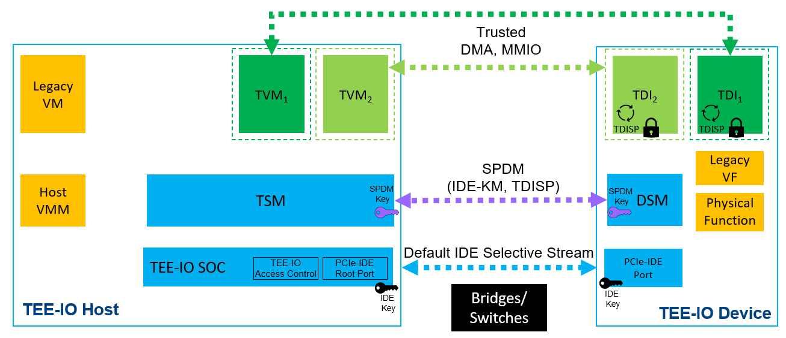
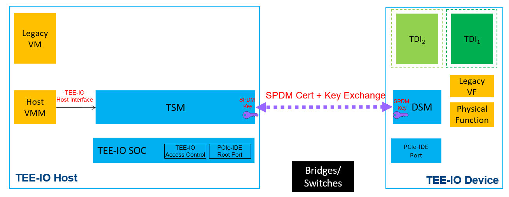
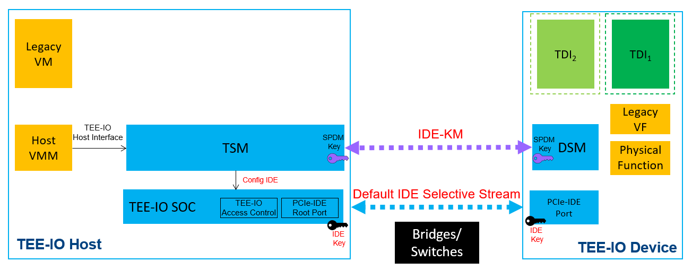
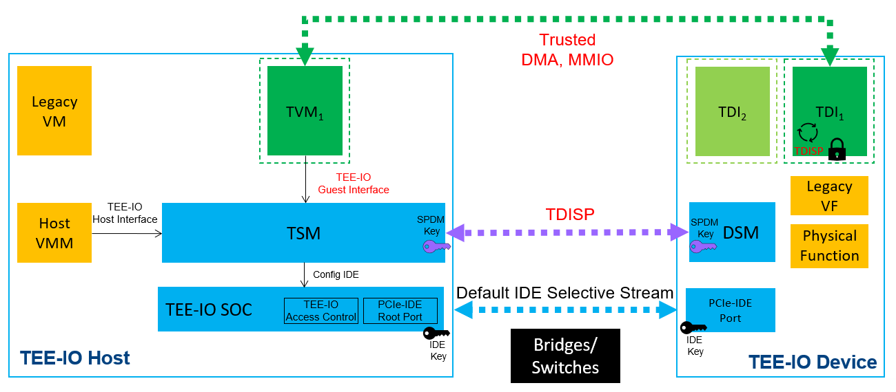
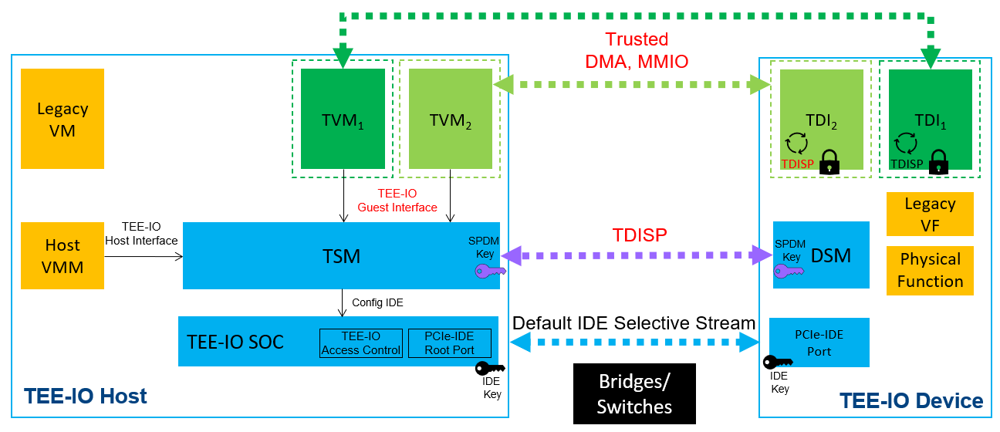
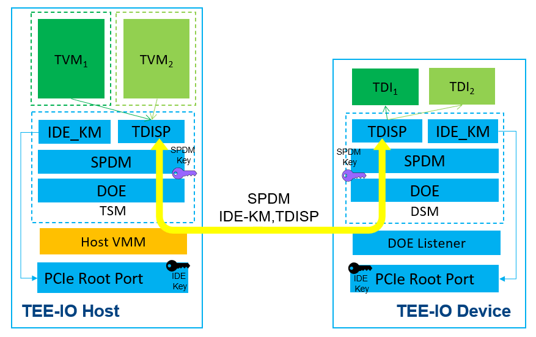
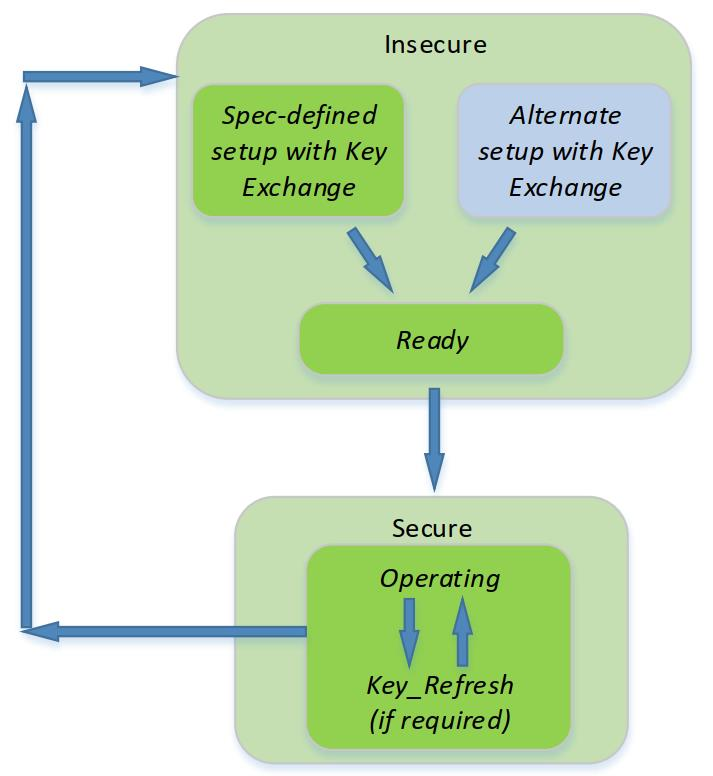
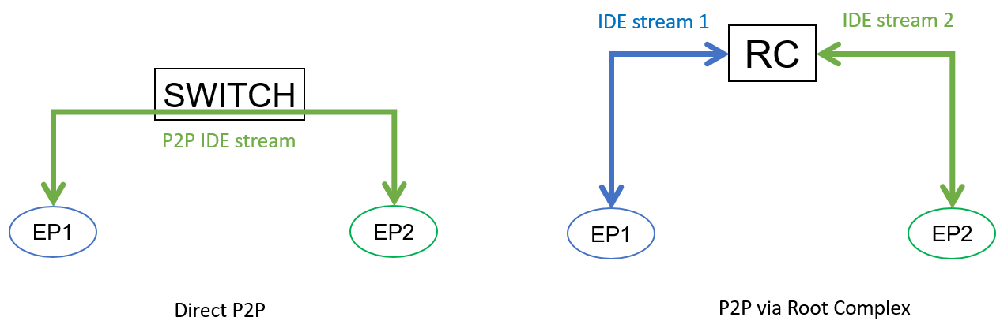
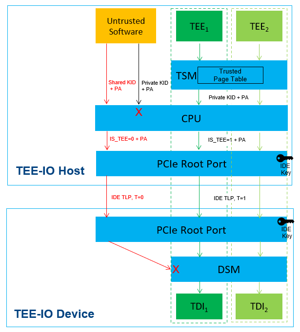
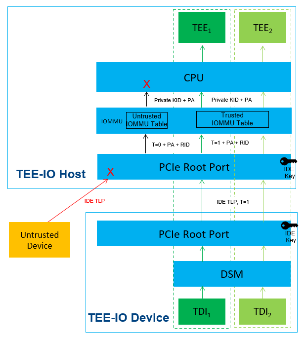

# Intel® TDX Connect TEE-IO Device Guide

## 介绍和范围
* 在计算机行业中，基于硬件的 *可信执行环境（trusted execution environments，TEE）* 用于提供机密计算环境。
  * 在本文中，此类 TEE 被称为 *可信执行环境虚拟机（Trusted Execution Environment VMs，TVM）*，以区别于传统虚拟机（VM）。
  * 如今，Intel、AMD、ARM 和 RISC-V 等多家 CPU 供应商已经发布了基于 host CPU 新功能的解决方案来满足这一需求。
* 为了在数据中心实现高性能，host CPU 可能会将一些工作负载卸载到设备上，例如用于加密加速的硬件安全模块（Hardware Security Module，HSM）、用于 AI 处理的图形处理单元（GPU）和用于网络处理的智能网络接口卡（NIC）。在这种情况下，机密计算环境从 TVM 扩展到设备的一部分（TEE Device Interface，也称为 TDI）。
* TDI 可以是 Physical function（PF）、Virtual function（VF） 或可分配设备接口（Assignable Device Interface，ADI）。
  * 为了支持此类功能，行业标准组织（如 PCI-SIG 和 Compute Express Link（CXL）联盟）定义了支持该用例的新标准，包括完整性和数据加密（Integrity and Data Encryption，IDE）和 TEE 设备接口安全协议（TEE Device Interface Security Protocol，TDISP）。
* 在 host 环境中，我们使用 **TEE 安全管理器（TEE security manager，TSM）** 来指示逻辑可信计算基（Trust Computing Base，TCB）组件以执行安全策略。
  * TSM 可以位于 TVM 内部，也可以是 TVM 外部的组件并受 TVM 信任。
* 在设备内部，我们使用 **设备安全管理器（Device Security Manager，DSM）** 来指示执行安全策略的逻辑 TCB 组件。
  * TSM 应与 DSM 建立安全管理通道以获取设备信息并管理设备接口。
  * TSM 和 DSM 还可以协商加密密钥以进行安全通信。


* Figure 0-1: TEE-IO Component Conceptual View (Source: [PCIe TDISP 1.0])

## 词汇表
* Table 0-1: Glossary

缩写      | 全称
----------|------------------------
ACS       | Access Control Service
ATS       | Address Translation Service
CA        | Completer Abort
CMA       | Component Measurement and Authentication
CPL       | Completion
DOE       | Data Object Exchange
DSM       | Device Security Manager
EP        | Endpoint
FLR       | Function Level Reset
IDE       | Integrity and Data Encryption
IDE_KM    | IDE Key Management
LN        | Lightweight Notification
LNR       | LN Request
MSI       | Message Signal Interrupt
NPR       | Non-Posted Request
P2P       | Peer to Peer
PASID     | Process Address Space ID
PR        | Posted Request
PRS       | Page Request Service
RP        | Root Port
SPDM      | Security Protocol and Data Model
TDI       | TEE Device Interface
TDISP     | TEE Device Interface Security Protocol
TEE       | Trusted Execution Environment
TLP       | Transaction Layer Packet
TPH       | TLP Processing Hint
TSM       | TEE Security Manager
TVM       | TEE Virtual Machine
UC        | Unexpected Completion
UR        | Unsupported Request

# 1 TEE-IO 设备体系概述
* 本章概述了 TEE-IO 设备架构。

## TEE-IO 安全模型
* 根据 [PCIe TDISP 1.0]，TEE-I/O 安全模型主要适用于使用直接分配给 VM 的设备资源的系统。
  * 设备资源可以分配为 TEE-IO 设备接口（TDI）。
  * 在 TVM 接受 TDI 之前，只有 TSM 和 host CPU 位于 TVM 的 TEE TCB 中。
  * 一旦 TVM 接受了 TDI，TVM 就会将其 TEE TCB 扩展到整个 TEE-IO 设备 DSM，即使 TVM 只接受了来自该设备的一个 TDI。
* 表 1-1 提供了 TDISP 共享安全责任模型的摘要：
* Table 1-1: Component in TEE-IO Security Model

组件 | 角色                                   | 责任
----|----------------------------------------|-------------------------
TSM | 是 TVM 的 TEE TCB，是 host 中的逻辑实体| 在 host 上实施安全策略
DSM | 是 TVM 的 TEE TCB，是设备中的逻辑实体   | 在设备上实施安全策略
TVM | host 上的 TEE 虚拟机                   | 允许 DSM 进入 TEE TCB。接受 TDI
TDI | 分配给 TVM 的设备部分                  | 向 TVM 提供设备功能
VMM | 资源管理器                             | Attach 和 detach TDIs 到一个 TVM



* Figure 1-1: Component in TEE-IO

## 设备安全模型
* 根据 [PCIe TDISP 1.0]（11.1 与设备相关的 TEE-I/O 安全模型概述，第 11 页），TEE-IO 设备的安全目标是保护 TVM 数据、代码和执行状态，具体如下：
  * **机密性**：防止泄露给 TVM 的 TEE TCB 之外的实体（例如其他 TVM、VMM 等），例如固件、软件或硬件。
  * **完整性**：防止被 TVM 的 TEE TCB 之外的实体（例如其他 TVM、VMM 等）修改，例如固件、软件或硬件。TVM 数据的重放保护也在其范围内。
* 无需保护 TVM 免受拒绝服务攻击。
* 为实现这些安全目标，设备应支持：
1. **设备身份验证和度量报告**。
   * 为了保护 TVM 免受 TEE-IO 设备身份欺骗，设备应实现用于度量（RTM）、存储（RTS）和报告（RTR）的信任根（ROT），以支持身份认证和度量报告。
   * 设备调试接口不得影响设备安全属性。详情请参阅第 4 章。
2. **经过身份验证的安全通信**。
   * 设备应使用安全通信通道在 host 和设备之间传输可信数据。
   * 安全通道应提供机密性、完整性、重放保护和消息排序保护。
   * 有关管理通信通道，请参阅第 2 章安全协议和数据模型（SPDM），有关数据通信通道，请参阅第 3 章完整性和数据加密（IDE）stream。
3. **TEE 设备接口（TDI）管理**。
   * 设备应支持锁定 TDI 的配置、以可信方式报告配置、安全地将 TDI 置于运行状态以及在检测到 TDI 时安全地将其拆除。
   * 请参阅第 2 章 TEE 设备接口安全协议（TDISP）和第 3 章 PCI Express 事务层数据包（TLP）规则中的 TDI。
4. **设备安全架构**。
   * 设备应为设备中的 TVM 数据提供隔离和访问控制，以保护其免受 TVM 信任边界之外的实体（例如 VMM、其他 TVM、不受信任的设备组件、其他 TDI）的侵害。
   * 设备应实现高级错误报告（AER）以根据 [PCIe TDISP 1.0] 第 13 页报告错误。详情请参阅第 4 章。

## 实现 TEE-IO 设备栈
* 根据[PCIe TDISP 1.0]第 13 页，设备内存可以是系统级内存（定义为非 TEE 内存），也可以是 TDI 专用内存（定义为 TEE 内存）。
  * TEE 内存应具有确保 TVM 数据机密性和可选完整性的机制。
* 支持 TEE-IO 的设备实现可以分为 *软件栈* 和 *硬件栈*。
* 通常，**TEE-IO 软件栈** 用于传输管理信息，例如设备标识、设备度量、数据加密密钥、TDI 锁定、TDI 报告、TDI attachment、TDI detachment 等。
* **TEE-IO 硬件栈** 提供链路加密以确保链路的机密性和完整性，下游访问控制逻辑以防止不受信任的 MMIO 访问 TEE 内存，上游逻辑确保设备 DMA TEE 数据使用加密的 IDE TLP发送。

## 安全设备接口生命周期示例
* 下图显示了 TEE-IO 架构的高级软件流程，这是一个典型示例。



* Figure 1-2: Device SPDM Session Setup for Secure Communication
* Step 1（SPDM 设置）。参见图 1-2。
  * VMM 调用 TSM 与设备建立 SPDM 会话。
  * 然后 TSM 将拥有 SPDM 会话。
  * TSM 还将收集设备证书和度量值，并稍后返回 VMM 进行设备认证。
  * 此步骤是针对每个设备的。



* Figure 1-3: Device IDE Setup for Link Encryption
* Step 2（IDE Stream 设置）。参见图 1-3。
  * VMM 调用 TSM 使用 IDE_KM 与设备设置默认 IDE selective stream。
  * IDE_KM 是 SPDM 会话中发送的 SPDM vendor 定义协议。
  * TSM 还将配置 SOC IDE 密钥编程寄存器，以确保 SOC 和设备之间的 IDE selective stream 建立。
  * 在此步骤之后，设备和 host SOC 具有两个安全通信会话。
    * **SPDM 会话是软件会话**，用于软件配置，例如 IDE_KM 和 TDISP。
    * **IDE stream 是硬件会话**，用于保护 PCI Express TLP。
  * 此步骤也是针对每个设备的。



* Figure 1-4: TVM Launch and TDI Start
* Step 3（TDI 分配）。参见图 1-4。
  * VMM 锁定 TDI 并启动 TVM，然后将 TDI 分配给 TVM。
  * TVM 将从 TSM 获取设备证书和度量值，然后 TVM 将根据 TVM 特定策略验证设备。
    * 例如，设备证书必须具有受信任的根证书颁发机构（CA），并且设备度量值必须与设备 vendor 发布的最新参考清单相匹配。
    * 如果验证通过，TVM 可以接受 TDI 并使用 TDISP 协议来管理 TDI。
    * 如果验证失败，TVM 将拒绝该设备。
  * TVM 批准设备后，VMM 为 TDI 设置 DMA 和 MMIO，并让 TVM 接受配置。
  * 现在 TVM 可以启动 TDI 并使用受信任的 DMA 和 MMIO 与 TDI 通信。
  * 此步骤是针对每个设备接口的。



* Figure 1-5: Another TVM Launch and TDI Start
* VMM 可以重复上述相同的过程，将另一个 TDI 分配给另一个 TVM。参见图 1-5。
* 注意：一个 TVM 可以接受多个 TDI。但一个 TDI 不能分配给多个 TVM。
* 如果不再需要某个 TDI，则 TVM 或 VMM 可以停止该 TDI。
* 如果设备中的所有 TDI 都被移除，则 VMM 可以移除 IDE stream 并终止该设备的 SPDM 会话。
* 附录 B 提供了有关 SPDM 管理、IDE stream 管理和 TDI 生命周期管理的更多详细信息。

# 2 TEE-IO 软件栈
* 本章介绍了设备的 TEE-IO 软件栈要求。设备 TEEIO 软件栈实现安全设备管理协议（即 SPDM、IDE_KM 和 TDISP）的响应者角色。

## 软件栈概述
* 图 2-1 显示了在设备中实现 TEE-IO 软件栈的一个示例。
* TEE 设备接口安全协议（TDISP）协议的目的是管理 TDI。
* 完整性和数据加密密钥管理（IDE_KM）协议的目的是为 PCIe Root Port 配置 IDE 密钥。
* IDE_KM 和 TDISP 都是应用程序级协议，它们在安全协议和数据模型（SPDM）安全会话中传输，以实现传输级保护。
* SPDM 消息通过 **PCI 数据对象交换（PCI Data Object Exchange，DOE）** 接口发送和接收。



* Figure 2-1: Device DSM Software Stack
* 在 host 侧，VMM 管理 DOE mailbox 以发送或接收 SPDM 消息。
  * TSM 充当安全策略实施者，对 SPDM 安全消息（包括 IDE_KM 消息和 TDISP 消息）进行加密和解密。
  * 在运行时，VMM 或 TVM 请求 TSM 生成协议消息请求。
  * 然后 VMM 将请求发送到设备 DOE mailbox。
  * 稍后，VMM 接收来自 DOE mailbox 的响应并发送回 TSM 进行处理。
* 在设备端，应该有一个监听器等待 SPDM 消息。
  * 然后 DSM 中的 SPDM 栈将解密 SPDM 安全消息并分派到 TDISP 或 IDE_KM 回调以处理 TDISP 或 IDE_KM 请求消息。
  * 稍后，DSM 将加密 TDISP 或 IDE_KM 响应消息并发送到设备上的 DOE mailbox。

## 设备通信（Device Communication，DOE）
* PCI Express **数据对象交换（Data Object Exchange，DOE）** ECN 定义了一种 mailbox 机制，供 host 软件与设备执行数据对象交换，例如 SPDM 消息或安全 SPDM 消息。
  * Host 使用 DOE 与设备交换消息。一个设备可能支持多个 DOE mailboxes。
* **要求**：
1. 设备应支持 PCI DOE 上的 SPDM。
2. 设备应暴露 DOE Extended Capability 寄存器以进行功能检测和控制。[PCIe DOE 1.0] 7.9.xx 数据对象交换 (DOE) 扩展功能。
3. 设备应支持 DOE 1.0 协议，包括 DOE 发现（数据对象 0）、CMA/SPDM（数据对象 1）、安全 CMA/SPDM（数据对象 2）。[PCIe DOE 1.0] 6.xx 数据对象交换（DOE）和 [PCIe IDE 1.0] 6.xx 数据对象交换（DOE）。
4. 设备应在 function 0 内提供 DOE Extended Capability，以支持建立 SPDM 会话并传输安全消息。[PCIe TDISP 1.0] 11.2.2 TDISP 消息传输。
* 有关 TDX Connect 兼容性，请参阅附录 A“DOE”部分。

## 设备认证（SPDM）
* TVM 需要将机密工作负载 offload 到设备 TDI。因此，TVM 需要验证设备。
* PCI Express **组件度量和认证（Component Measurement and Authentication，CMA）** ECN 定义了基于安全协议和数据模型（SPDM）的机制。DSM 通过 SPDM 提供设备证书、认证和度量报告。
* **要求**：
1. 设备应支持 SPDM 版本 1.2。
2. 设备应支持 SPDM 功能：CERT_CAP 和 MEAS_CAP，并支持 GET_DIGEST、GET_CERTIFICATE 和 GET_MEASUREMENTS。
3. 设备应支持 CMA ECN 中列出的 BaseAsymAlgo 中的至少一个：TPM_ALG_RSASSA_3072、TPM_ALG_ECDSA_ECC_NIST_P256、TPM_ALG_ECDSA_ECC_NIST_P384。
4. 设备应支持 CMA ECN 中列出的 BaseHashAlgo 中的至少一个：TPM_ALG_SHA_256、TPM_ALG_SHA_384。
5. 设备应支持 CMA ECN 中列出的 MeasurementHashAlgo 中的至少一个：TPM_ALG_SHA_256、TPM_ALG_SHA_384。
6. 设备应支持 MeasurementSpecification：DMTF（bit `0`）。
7. 设备证书应遵循 DSP0274 要求。
   * X.509 证书应遵循 SPDM 1.2.1 表 33 - 必填字段。
   * X.509 证书 OID 应遵循 SPDM 1.2.1、10.8.2、SPDM 证书要求和建议，包括 10.8.2.1 扩展密钥使用身份验证 OID、10.8.2.2 SPDM 非关键证书扩展 OID。
8. 设备应仅返回 SPDM 1.2.1 中定义的 DMTFSpecMeasurementValueType。表 45 – DMTF 度量规范格式。
9. DICE 设备应支持 ALIAS_CERT_CAP 并返回 DICE 别名证书。
10. DICE 别名证书应包括 DiceTcbInfo OID。DiceTcbInfo 应包括固件信息，例如摘要和/或安全版本号 (SVN)。
* 有关 TDX Connect 兼容性，请参阅附录 A“SPDM”部分。

## 软件安全通信（SPDM）
* TSM 需要与设备建立经过身份验证的安全会话，以确保完整性和机密性。
* 此软件安全会话用于交换硬件加密密钥（例如 IDE_KM 协议）或 TDI 管理（例如 TDISP 协议）。
* DMTF **安全协议和数据模型（Secure Protocol and Data Model，SPDM）** 在 host TSM 和设备 DSM 之间提供经过身份验证的安全会话。
* PCI Express 完整性和数据加密（Integrity and Data Encryption，IDE）ECN 和 TEE 设备接口安全协议（TEE Device Interface Security Protocol，TDISP）ECN 依靠 SPDM 进行安全管理数据通信。
* **要求**：
1. 设备应支持 SPDM 功能：ENCRYPT_CAP、MAC_CAP、KEY_EX_CAP，支持 KEY_EXCHANGE、FINISH、END_SESSION。
2. 设备应支持至少一个 DHE 组：secp256r1、secp384r1。
3. 设备应支持至少一个 AEAD 密码套件：AES-256-GCM。
4. 设备应支持密钥调度算法：DMTF。
5. 设备应支持 DSP0274 OtherParamsSupport.OpaqueDataFmt1。
6. 设备应使用 DSP0277 版本 1.1 作为安全消息不透明数据中的安全消息传输绑定版本。
7. 设备应支持 KEY_UPD_CAP。如果设备支持 KEY_UPD_CAP，则设备应支持使用 UpdateAllKeys 双向更新密钥。
8. 设备可能支持 HBEAT_CAP。如果支持，则设备会话应在两次 HeartbeatPeriod 后终止。
9. 如果触发了固件更新，并且 SPDM 1.2 SessionPolicy.TerminationPolicy = 0，则 DSM 应断开会话。
10. DSM 应保持 SPDM 会话密钥的机密性。
11. DSM 可以在 SPDM 会话建立期间根据 TSM 功能执行相互身份验证，或者 DSM 可以在已建立的 SPDM 会话中执行 TVM 身份验证。这取决于用例。
* **注意**：TSM 可能以软件形式实现，因此很难在会话创建时提供公共证书和私钥来签署 SPDM 消息。
  * TSM 可以使用非标准化的基于 TEE-Quote 的证书，如远程证明 TLS（RATLS）中所述，来支持 quote-based 的相互证明（mutual attestation）。
  * 或者，TSM/DSM 可以使用两阶段身份验证：
    * 在第 1 阶段，TSM 按照 SPDM 规范中所述证明设备；
    * 在第 2 阶段，DSM 使用特定实现机制对 host 环境进行身份验证，包括 host TEE TCB（CPU 和 TSM）、host TVM 等。
* 有关 TDX Connect 兼容性，请参阅附录 A“SPDM”部分。

## 链路加密密钥管理（IDE_KM）
* TSM 需要与设备设置链路加密，以减轻 host 和设备之间路径中可能出现的攻击。
* PCI Express **完整性和数据加密（Integrity and Data Encryption，IDE）** ECN 为两个 PCI Express 端口之间传输和接收的 *事务层数据包（Transaction Layer Packet，TLP）* 提供机密性、完整性和重放保护。
* TSM 使用 **IDE 密钥管理（IDE key management，IDE_KM）协议** 与 DSM 一起管理 IDE 密钥，例如编程 IDE 密钥、启动或停止 IDE strem。
* DSM 在设备中配置 IDE 加密密钥。
* 有关如何设置 IDE stream、停止 IDE stream 等的示例，请参阅第 3 章“IDE Stream”部分。
* **要求**：
1. DSM 应支持 SPDM vendor 定义消息中的 IDE_KM 有效负载。[PCIe IDE 1.0] 6.99.3 IDE 密钥管理 (IDE_KM)，第 19 页。
2. 设备应在 Function 0 中公开 IDE 的 DOE。[PCIe IDE 1.0] 6.99.3 IDE 密钥管理 (IDE_KM)，第 20 页。
3. DSM 应支持 IDE_KM 消息 `QUERY`。[PCIe IDE 1.0] 6.99.3 IDE 密钥管理 (IDE_KM)，第 21 页。
4. DSM 应支持 IDE_KM 消息 `KEY_PROG`。[PCIe IDE 1.0] 6.99.3 IDE 密钥管理 (IDE_KM)，第 22 页。
5. DSM 应支持 IDE_KM 消息 `SET_K_GO`。 [PCIe IDE 1.0] 6.99.3 IDE 密钥管理 (IDE_KM)，第 23 页。
6. DSM 应支持 IDE_KM 消息 `SET_K_STOP`。 [PCIe IDE 1.0] 6.99.3 IDE 密钥管理 (IDE_KM)，第 24 页。
7. 根据 [PCIe IDE 1.0] 6.99.3 IDE 密钥管理 (IDE_KM)，第 24 页，DSM 应在 IDE Stream Enable bit 中处理 IDE 启用/禁用。
8. 根据 [PCIe IDE 1.0] 6.99.3 IDE 密钥管理 (IDE_KM)，第 24 页，DSM 应在 SPDM 安全会话中正确管理安全/不安全状态。
9. 根据 [PCIe IDE 1.0] 6.99.3 IDE 密钥管理 (IDE_KM)，第 26 页，DSM 应正确处理密钥。密钥设置位应用于密钥更新。
* 有关 TDX Connect 兼容性，请参阅附录 A“IDE_KM”部分。

## 设备接口管理（TDISP）
* 一个设备可能被多个 TVM 使用。
  * VMM 需要将设备中的 TDI 分配给 TVM。
  * 此外，TVM 需要决定启动或停止 TDI。
* PCI Express **TEE 设备接口安全协议（TEE Device Interface Security Protocol，TDISP）** ECN 定义了此类机制。
* TVM 和 VMM 可以使用 TDISP 协议来管理设备 TDI。
* DSM 提供接口管理，例如使用策略（例如 `NO_FW_UPDATE`）和报告的 TDI 配置锁定，以及 TDI attach 和 detach。
* **要求**：
1. DSM 应确保 IDE_KM（用于 IDE 密钥建立）和 TDISP（用于 TDI 管理）使用相同的 SPDM 会话。[PCIe TDISP 1.0] 11.1 与设备相关的 TEE-I/O 安全模型概述，第 15 页。
2. 如果实施，DSM 应遵循点对点（peer-to-peer，P2P）通信规则来设置 P2P stream，根据 [PCIe TDISP 1.0] 11.2 TDISP 规则，第 19 页。
3. DSM 应支持 SPDM vendor 定义消息中的 TDISP 有效负载，根据 [PCIe TDISP 1.0] 11.2.2 TDISP 消息传输，第 21 页。
4. DSM 应遵循响应器 (DSM) 要求，根据 [PCIe TDISP 1.0] 11.2.4 响应器要求 (DSM)，第 22 页。
5. DSM 应遵循 DSM 跟踪和锁定 TDI 配置处理，根据 [PCIe TDISP 1.0] 11.2.6 DSM 跟踪和处理锁定的 TDI 配置，第 23 页。
6. DSM 应支持 TDISP 所需的消息：`TDISP_VERSION`、`TDISP_CAPABILITIES`、`LOCK_INTERFACE_RESPONSE`、`DEVICE_INTERFACE_REPORT`、`DEVICE_INTERFACE_STATE`、`START_INTERFACE_RESPONSE`、`STOP_INTERFACE_RESPONSE`。
7. 根据 [PCIe TDISP 1.0] 11.3.3 TDISP 消息格式和协议版本控制（第 28 页），DSM 应遵循 TDISP 消息格式和协议版本控制。
8. 根据 [PCIe TDISP 1.0] 11.3.4 GET_TDISP_VERSION（第 30 页）和 11.3.5 TDISP_VERSION（第 30 页），DSM 应支持 `GET_TDISP_VERSION`。
9. 根据 [PCIe TDISP 1.0] 11.3.6 GET_TDISP_CAPABILITIES（第 30 页）和 11.3.7 TDISP_CAPABILITIES（第 31 页），DSM 应支持 `GET_TDISP_CAPABILITIES`。
DSM 应支持等于或大于主机地址宽度的 DEV_ADDR_WIDTH，以防止地址别名攻击。
10. 根据 [PCIe TDISP 1.0] 11.3.8 LOCK_INTERFACE_REQUEST（第 31 页）和 11.3.9 LOCK_INTERFACE_RESPONSE（第 34 页），DSM 应支持 `LOCK_INTERFACE_REQUEST`。
11. 根据 [PCIe TDISP 1.0] 11.3.10 GET_DEVICE_INTERFACE_REPORT（第 35 页）和 11.3.11 DEVICE_INTERFACE_REPORT（第 36 页），DSM 应支持 `GET_DEVICE_INTERFACE_REPORT`。DSM 应根据 [PCIe TDISP 1.0] 表 15 TDI 报告结构（第 37 页）生成 TDI 报告。
12. 根据 [PCIe TDISP 1.0] 11.3.12，GET_DEVICE_INTERFACE_STATE（第 40 页）和 11.3.13 DEVICE_INTERFACE_STATE（第 40 页），DSM 应支持 `GET_DEVICE_INTERFACE_STATE`。
13. DSM 应根据 [PCIe TDISP 1.0] 11.3.14 LOCK_INTERFACE_REQUEST（第 40 页）和 11.3.15 START_INTERFACE_RESPONSE（第 41 页）支持 `START_INTERFACE_REQUEST`。
14. DSM 应根据 [PCIe TDISP 1.0] 11.3.16 LOCK_INTERFACE_REQUEST（第 41 页）和 11.3.17 STOP_INTERFACE_RESPONSE（第 42 页）支持 `STOP_INTERFACE_REQUEST`。
15. 如果实施，DSM 应根据 [PCIe TDISP 1.0] 11.3.18 BIND_P2P_STREAM_REQUEST（第 42 页）和 11.3.19 BIND_P2P_STREAM_RESPONSE（第 43 页）支持 `BIND_P2P_STREAM_REQUEST`。
16. 如果实施，DSM 应根据 [PCIe TDISP 1.0] 11.3.20 UNBIND_P2P_STREAM_REQUEST（第 43 页）和11.3.21 UNBIND_P2P_STREAM_RESPONSE，第 44 页，支持 `UNBIND_P2P_STREAM_REQUEST`。
17. 如果实施，DSM 应根据 [PCIe TDISP 1.0] 11.3.22 SET_MMIO_ATTRIBUTE_REQUEST，第 44 页和 11.3.23 SET_MMIO_ATTRIBUTE_RESPONSE，第 45 页支持 `SET_MMIO_ATTRIBUTE_REQUEST`。
18. DSM 应根据 [PCIe TDISP 1.0] 11.3.24 TDISP_ERROR，第 46 页支持 `TDISP_ERROR`。
19. 如果实施，DSM 应根据 [PCIe TDISP 1.0] 11.3.25 VDM_REQUEST，第 48 页和 11.3.26 VDM_RESPONSE，第 49 页支持 `VDM_REQUEST`.
* 有关 TDX Connect 兼容性，请参阅附录 A“TDISP”部分。

## 实现参考
### SPDM 软件栈
* DMTF 开源 SPDM 示例实现位于 https://github.com/DMTF/libspdm
* Table 2-1: SPDM software Stack Reference

### IDE_KM 软件栈
* DMTF 开源 SPDM 示例实现包括一个 IDE_KM 软件示例。
* Table 2-2: IDE_KM software Stack Reference

### TDISP 软件栈
* DMTF 开源 SPDM 示例实现包括 TDISP 软件示例。

# 3 TEE-IO 硬件栈
* 本章主要介绍设备端的 TEE-IO 硬件栈需求，TEE-IO 硬件栈是支持可信 MMIO 和可信 DMA 的数据加密引擎，以及数据加密密钥、TDI 状态等硬件寄存器。

## IDE Stream
* IDE 保护从一个端口到另一个端口的 TLP traffic。
  * IDE TLP 前缀包含一个“**T bit**”，表示 TLP 源自受信任的执行环境。
  * “`T` bit”提供了一种区分与 TVM 关联的 TLP 的机制。
  * IDE 机制确保 `T` bit（与其他 TLP 内容一样）在传输过程中得到保护。
* IDE Stream 状态机包括不安全或安全状态。参见图 3-1。
* **安全状态（Secure State）**：设备 IDE Stream 仅在完成所有必要步骤（包括密钥已编程，IDE stream 已启用）后才进入安全状态。
* **不安全状态（Insecure State）**：如果未满足任何必要步骤，设备 IDE stream 将进入不安全状态。例如，IDE stream 被禁用，或者发生 IDE 检查失败错误。
* **就绪子状态（Ready sub-state）**：这是不安全状态的子状态。设备已编程所有密钥。
* 唯一的剩下步骤是触发 IDE Stream。触发动作需要 `K_SET_GO` 消息和 *在 IDE Extended Capability Register 中设置 IDE Stream Enable bit*。
* Figure 3-1: IDE Stream State Machine (Source: [PCIe IDE 1.0])



* **要求**：
1. 设备应根据 [PCIe IDE 1.0] 6.99.1 IDE 流和 TEE 状态机（第 16 页）维护 IDE Stream 安全状态和不安全状态。
2. 设备应在 function 0 中实现 IDE Extended Capability。[PCIe IDE 1.0] 6.99.2 IDE Stream 建立（第 18 页）。
3. 设备应根据 [PCIe IDE 1.0] 6.99.4 IDE TLP（第 29 页）遵循 IDE TLP 规则。设备应对所有 IDE TLP 使用 IDE TLP 前缀。
4. 设备应遵循 selective IDE stream 规则，根据 [PCIe IDE 1.0] 6.99.4 IDE TLP，第 33 页。设备应遵循“Table XX – TLP Types for Selective IDE Streams”，仅允许 MRd、MRdLk、MWr、CfgRd1、CfgWr1、DMWr、Msg*、MsgD*、Cpl、CplD、CplLk、CplDLk、FetchAdd、Swap 和 CAS。IORd、IOWr、CfgRd0 和 CfgWr0 未加密。
5. 设备应遵循 IDE TLP sub-stream 规则，根据 [PCIe IDE 1.0] 6.99.5 IDE TLP Sub-streams，第 38 页。
6. 设备应遵循 IDE TLP 聚合（如果受支持），根据 [PCIe IDE 1.0] 6.99.6 IDE TLP Aggregation，第 40 页。
7. 设备应遵循其他 IDE 非发布 IDE 请求规则，根据 [PCIe IDE 1.0] 6.99.8 其他 IDE 规则，第 44 页。
8. 设备应遵循其他 IDE 重置规则，根据 [PCIe IDE 1.0] 6.99.8 其他 IDE 规则，第 44 页。对具有 IDE 的功能的常规重置或功能级别重置（Function Level Reset，FLR）应更改为不安全状态。对不具有 IDE 的功能的 FLR 不得影响 IDE 操作。
9. 设备应遵循其他 IDE 访问控制服务（Access Control Services，ACS）规则，根据 [PCIe IDE 1.0] 6.99.8 其他 IDE 规则，第 44 页。
10. 设备应遵循其他 IDE 错误处理规则，根据 [PCIe IDE 1.0] 6.99.8 其他 IDE 规则，第 45 页。检测到 IDE 检查失败错误、MAC 检查失败、TLP 计数器下溢或上溢时应更改为不安全状态。
11. 设备应遵循其他 IDE 电源管理规则，根据 [PCIe IDE 1.0] 6.99.8 其他 IDE 规则，第 46 页。应设置 `No_Soft_Reset` bit。与密钥和计数器相关的所有状态应保持在 `D0`、`D1`、`D2` 和 `D3hot` 中。它们可能保持在 `D3cold` 中。
12. 设备应遵循其他 IDE 规则以确保本地环境安全，具体请参见 [PCIe IDE 1.0] 6.99.8 其他 IDE 规则，第 46 页。应检测试图修改 IDE 寄存器、BAR 和其他可能影响安全性或 IDE stream 的结构的行为，并使其进入不安全状态。
13. 设备应实现 IDE Extended Capability，具体请参见 [PCIe IDE 1.0] 7.9.99 IDE Extended Capability，第 48 页。
14. 设备应在 Device Capability Register 中暴露“TEE-IO Supported”。[PCIe TDISP 1.0] 6.33.4 IDE TLP，第 5 页。
15. 设备应将 `Sub-Stream` 域的第 bit `7` 实现为保留。[PCIe TDISP 1.0] 6.33.4 IDE TLP，第 5 页。
16. 根据 [PCIe TDISP 1.0] 6.33.4 IDE TLP，第 6 页，当设置 TEE-IO 支持时，设备应遵循规则。
17. 根据 [PCIe TDISP 1.0] 6.33.8 其他 IDE 规则，第 7 页，设备应遵循基于 TEE-IO Supported bit 的 Non-Posted IDE 请求规则。

### IDE Stream 优先级
* 设备应遵循 IDE Stream 优先级规则，根据 [PCIe IDE 1.0] 6.99.4 IDE TLP，第 37 页。该规则总结如下：
1. 对于发送者：
   ```c
   if (IAAR and IRAR rule hit) {
       Stream ID := corresponding Stream ID
   } else if (default Selective IDE Stream is configured) {
       Stream ID := default Selective IDE Stream ID
   } else if (Link IDE Stream is enabled) {
       Stream ID := Link IDE Stream ID
   } else {
       Stream ID := invalid // Not use IDE-TLP
   }
   ```
   * 其中 `IAAR == IDE Address Association Register`，`IRAR = IDE RID Association Register`
2. 对于接收者：
   ```c
   Stream ID := Stream ID in the received IDE TLP Prefix
   ```

### TEE 限制流
* TEE 限制流是可选的。它表示只有那些设置了 `T` bit 的 TLP 才允许与此 Stream 相 **关联**。这是为了优化目的，因为 TVM 中并非所有数据都需要保护。
* **注意**：此 IDE 功能需要在 host 的 Root Port 上支持和配置相同的功能才能正常运行。有关更多详细信息，请参阅 [PCIe IDE 1.0]。
* **如果实施，要求：**
1. 如果实施，设备应遵循 TEE 限制流的描述，根据 [PCIe TDISP 1.0] 7.9.26.5.2：Selective IDE Stream Control Register，第 8 页。

### 部分 Header 加密
* [PCIe 6.0] 中增加了部分 header 加密作为可选功能。
  * 它通过加密 IDE 内存请求 Header 的某些部分，同时保持 TLP 路由和低级 TLP 处理所需的信息清晰，从而能够减少潜在的侧信道攻击风险。
* **注意**：此 IDE 功能需要在 host Root Port 上支持和配置相同的功能才能正常运行。有关更多详细信息，请参阅 [PCIe IDE 1.0]。
* **如果实施，要求：**
1. 如果实施，设备应遵循部分 header 加密的描述，根据 [PCIe 6.0] 7.9.26.2 IDE Capability Register, 7.9.26.4.1 Link IDE Stream Control
Register, 7.9.26.5.2 Selective IDE Stream Control Register。
* 有关 TDX Connect 兼容性，请参阅附录 A“IDE Stream”部分。

## TDI TLP 规则
* 设备功能单元可能具有：
  * **TDI**：可信设备接口。
    * 它可以是整个设备、物理功能 (PF) 或虚拟功能 (VF)。
    * 它可能处于 `CONFIG_UNLOCK`、`CONFIG_LOCK`、`RUN` 或 `ERROR` 状态。
    * DSM 应将 TDI 与 *non-TDI 和其他 TDI* 隔离开来。
  * **Non-TDI**：传统设备功能单元，根据定义不能指定为 TDI。它可能是一个物理功能 (PF) 或虚拟功能 (VF)。
  * **DSM**：设备安全管理器，是所有 TDI 的 TEE TCB。
* TDI 状态机包括 4 个状态（见图 3-2）：
  * **CONFIG_UNLOCKED**：这是 TDI 的初始默认状态。
    * TDI 不需要向 TVM 数据提供任何安全属性（机密性和可选完整性）。
    * DSM 不允许启动接口。
  * **CONFIG_LOCKED**：这是从默认状态到 `RUN` 的中间过渡状态。
    * 要进入此状态，VMM 应完成配置，TSM 应明确发送 `LOCK_INTERFACE`。
    * DSM 或 TDI 应进行清理并准备提供安全属性。例如，应丢弃所有先前的 MMIO 请求或 DMA 请求。
  * **RUN**：这是实际的功能状态。
    * TVM 可以发送 `START_INTERFACE` 来明确请求 TDI 进入此状态。
    * TDI 可以执行受信任的 MMIO 或 DMA 事务来与 TVM 通信。
  * **ERROR**：这是错误状态。
    * 当 DSM 或 TDI 在 `CONFIG_LOCKED` 或 `RUN` 状态下检测到任何影响设备配置或安全性的更改时，TDI 应更改为 `ERROR` 状态。
    * TDI 不得泄露任何机密的 TVM 数据。
    * TDI 可以开始清理 TVM 数据。

* Figure 3-2: TDI State Machine (Source: [PCIe TDISP 1.0])


* Host function 单元可以具有
  * **TEE VM（TVM）**：需要 TEE capability 的 VM。TVM 应被 TSM 与 VMM、legacy VM 和其他 TVM 隔离。
  * **Legacy VM**：不需要 TEE capability 的 VM。
  * **VMM**：TVM 和 legacy VM 的系统资源管理器。
  * **TSM**：TEE 安全管理器，是所有 TVM 的 TCB。
* 设备与 host 之间的连接：
  * **TVM <-> TDI**：遵循 MMIO、DMA、ATS 等的 TLP 规则。
  * **Legacy VM <-> TDI**：不是 TDISP 规范的重点。
  * **Legacy VM/VMM <-> Non-TDI**：Legacy 行为。超出范围。
  * **TSM <-> DSM**：遵循 SPDM、IDE_KM、TDISP 协议。
* **注意**：对于 Legacy VM <-> TDI，允许使用 TSM 建立的 IDE streams 来承载与 legacy VM 关联的 TLP。[PCIe TDISP 1.0] 11.1 第 14 页。
  * 对于支持分配给 legacy VM 的 TDI，如果将 TDI 分配给 legacy VM，VMM 将在 `CONFIG_UNLOCKED` 中分配 TDI，并且 **TSM 必须确保 TDI 保持在该状态**，除非且直到将 TDI 从 legacy VM 中移除并准备重新分配给 TDI。[PCIe TDISP 1.0] 11.1 第 18 页。
* 根据 [PCIe TDISP 1.0]，设备实现可以支持 legacy VM <> TDI。
  * 如果将 TDI 分配给 legacy VM，则允许 TDI 在 `CONFIG_UNLOCK` 状态下以 Non-IDE Stream 形式发送或接收消息（例如 MMIO 或 DMA）。
  * 一旦要求 TDI 转换到 `CONFIG_LOCK` 状态，TDI 应在 `CONFIG_UNLOCK` 状态下排空所有待处理的请求和收到的数据。
* 为了便于讨论 TLP 规则，我们定义了以下术语：
  * **Bound IDE stream**：绑定到 TDI 的 IDE stream。在正常情况下，它是 `LOCK_INTERFACE_REQUEST` [PCIe TDISP 1.0] 11.3.8 中的 **default stream**。
    * IDE 规范在 [PCIe IDE 1.0] 7.9.99.5.2 Selective IDE Stream Control Register 中定义了“default stream”。
    * **如果设备包含多个 TDI，则这些 TDI 可能共享相同的 default stream**。
    * 在直接 peer to peer（P2P）情况下，Bound IDE stream 是 `BIND_P2P_STREAM_REQUEST` [PCIe TDISP 1.0] 11.3.18 中的 **P2P stream**。
  * **Non-Bound IDE Stream**：未绑定到此 TDI 的 IDE stream。
  * **Non-IDE Stream**：明文 TLP（未加密）。
  * **TEE-TLP**：TLP 绑定 IDE stream，`T=1`。
  * **Non-TEE-TLP**：所有其他非 TEE-TLP，例如 `T=0` 的 TLP 绑定 IDE stream、`T=0` 或 `T=1` 的非绑定 IDE Stream 或非 IDE Stream。
* **注意**：“`T` bit”表示 TLP **源自** 可信执行环境（TEE）内。但是，没有 bit 可以指示 **目标** 是否在 TEE 内或非 TEE 内。这是迄今为止已知的限制。
  * 因此，设备不应使用通用共享 cache 来存储数据，除非设备 cache 具有用于标识 cache-entry 是私有（TEE）还是共享（非 TEE）的属性。
* **注意**：以下规则仅适用于 TDI，不适用于非 TDI。

### TDI 作为 Completer
* 资源定义：
  * **TEE MMIO（T-MMIO）**：设备中的 TEE 内存，从 host 读取/写入，必须具有确保 TVM 数据机密性和完整性（可选）的机制。[PCIe TDISP 1.0] 11.1. 第 13 页。在 TDI 报告结构中，它是 `NON_TEE_MEM=0`。
    * 仅当 TDI 处于 `CONFIG_LOCK`、`RUN` 或 `ERROR` 状态时，TEE MMIO 才会出现。
    * 当 TDI 处于 `CONFIG_UNLOCK` 状态时，TEE MMIO 不存在。
  * **Non-TEE MMIO（NT-MMIO）**：设备中的 Non-TEE 内存，从 host 读取/写入，没有上述保护机制。在 TDI 报告结构中，它是 `NON_TEE_MEM=1`。
  * **CFG**：从 host 读取/写入的设备配置空间。不需要保护对 TDI 的配置请求。[PCIe TDISP 1.0] 11.2。第 20 页。
* 规则定义：
  * **Success（V）**：设备应为 NPR 处理并返回 success completion（SC）的 TLP。
  * **Reject（X）**：设备应返回 Unsupported Request（UR）TLP 或丢弃接收到的 TLP。
* **注意**:
1. “如果结果确定必须拒绝 TLP，**则相关 TDI 必须在指示的位置转换为 `ERROR`，但不需要对该 TLP 执行进一步的错误报告或记录，**”[PCIe TDISP 1.0] 11.2。
   * TDISP 规则第 18 页。这里的“拒绝”是指“IDE 检查失败”而不是访问控制规则。
   * “不需要进一步的错误报告”是因为没有可靠的方法来保证设备错误消息被传递给 TVM。
   * 中间人攻击者可以阻止或延迟错误报告，无论是硬件机制还是软件机制。请参阅第 4 章，错误处理部分。
2. “如果结果确定 **必须拒绝 TLP**，...可以 **根据具体情况** 选择将请求处理为 **Unsupported Request**，和/或将完成处理为 **Unexpected Completion**，或者 **丢弃** TLP。” [PCIe TDISP 1.0] 11.2。
   * TDISP 规则第 18 页。如果遭到拒绝，TLP 可以用 `UR/UC` 进行响应或丢弃。
* 表 3-4、表 3-5 和表 3-6 是 TDI 作为 Completer 的规则摘要，根据 [PCIe TDISP 1.0] 11.2.1 TLP 规则，第 21 页。
* Table 3-4: TEE-MMIO Rule Summary for TDI as Completer

范围控制     | `CONFIG_UNLOCK` | `CONFIG_LOCK`                     | `RUN`                               | `ERROR`
------------|-----------------|-----------------------------------|-------------------------------------|----------------------------------
TEE-TLP     | N/A*            | <font color=red>T-MMIO (X)</font> | <font color=green>T-MMIO (V)</font> | <font color=red>T-MMIO (X)</font>
Non-TEE-TLP | N/A**           | <font color=red>T-MMIO (X)</font> | <font color=red>T-MMIO (X)</font>   | <font color=red>T-MMIO (X)</font>

* \* 根据定义，只有在发送 `LOCK_INTERFACE_REQUEST` 后才能知道绑定的 IDE stream。因此，`CONFIG_UNLOCK` 中没有 TEE-TLP。`CONFIG_UNLOCK` 中的所有 TLP 都是 non-TEE-TLP。
* \** 根据定义，如果 TDI 分配给 legacy 虚拟机，则 TDI 不会在 `CONFIG_UNLOCK` 中提供 TVM 数据的机密性或可选完整性。因此，TDI 没有任何 TEE-MMIO，因为在此状态下，TDI 不需要保护放入其中的机密数据。

* Table 3-5: NON-TEE-MMIO Rule Summary for TDI as Completer

范围控制     | `CONFIG_UNLOCK` | `CONFIG_LOCK`                        | `RUN`                                | `ERROR`
------------|-----------------|--------------------------------------|--------------------------------------|----------------------------------
TEE-TLP     | N/A             | <font color=green>NT-MMIO (V)</font> | <font color=green>NT-MMIO (V)</font> | <font color=green>NT-MMIO (V)</font>
Non-TEE-TLP | <font color=green>NT-MMIO (V)</font> | <font color=green>NT-MMIO (V)</font> | <font color=green>NT-MMIO (V)</font> | <font color=green>NT-MMIO (V)</font>

* Table 3-6: CFG Rule Summary for TDI as Completer

范围控制     | `CONFIG_UNLOCK` | `CONFIG_LOCK`                        | `RUN`                                | `ERROR`
------------|-----------------|--------------------------------------|--------------------------------------|----------------------------------
TEE-TLP     | N/A             | <font color=green>CFG (V)</font>     | <font color=green>CFG (V)</font>     | <font color=green>CFG (V)</font>
Non-TEE-TLP | <font color=green>CFG (V)</font> | <font color=green>CFG (V)</font> | <font color=green>CFG (V)</font> | <font color=green>CFG (V)</font>

* **注意**：
1. **TEE MMIO**：TEE MMIO 仅允许在 `RUN` 中绑定 IDE stream、`T=1` 和 TDI。
   ```c
   if ((TDI.STATE != RUN) ||
       (TLP.T == 0) ||
       (STREAM_TYPE != IDE_TLP) ||
       (IDE_STREAM_ID != TDISP_BOUND_STREAM_ID) ||
       (TLP.ADDRESS NOT IN STREAM-ASSOCIATION-RANGES[N])) {
       Access = Deny;
   } else {
       Access = Allow;
   }
   ```
2. **Non-TEE MMIO**：[PCIe TDISP 1.0] 提到了 TDI 作为 Completer 的规则：“*在除 `RUN` 之外的任何状态下，必须拒绝接收目的是设备内存的并且 `T` bit 为设置的请求*”。该规则已被“*对于接收的目标是 MMIO 内存的请求，如果设置了 `IS_NON_TEE_MEM`，则 TDISP 状态不会修改 TDI 的处理方式。*”取代（superseded）。
3. **CPL** 规则：TDI 返回的 Completion(s) 中的 `T` bit 的值与相应请求中的 `T` bit 的值 **必须匹配**。[PCIe TDISP 1.0]。
4. **CFG** 规则：无需确保对 TDI 的 Configuration Requests 的安全。[PCIe TDISP 1.0] 11.2. 第 20 页。[PCIe IDE 1.0] 表 XX–Types for Selective IDE Streams 提到不允许使用 `Type0` 进行 selective IDE streams，因为我们不希望发生这种情况。
   * 适当的请求者应始终使用 `Type1`。不适当的请求者可以使用 `Type0`。设备可以选择接受或拒绝，但这不会影响安全性。

### TDI 作为 Requester
* 资源定义：
  * **DMA**：从设备读取/写入 host 内存。根据[PCIe TDISP 1.0]，设备不知道 host 内存是 TEE 内存还是 non-TEE 内存。
  * **MSI**：该消息发出从设备到 host 的中断信号。
  * **Trusted-MSI（T-MSI）**：`LOCK_INTERFACE_REQUEST` 中的 `LOCK_MSIX` 标志为 `1`，并且 *MSIX 表* 是锁定的 `MMIO_RANGE` 的一部分。
* 规则定义：
  * **Allowed（V）**: 该设备可以发送 TLP。
  * **Not allowed（X）**: 该设备不该发送 TLP。这是 DMS/TDI 的责任。
* 根据[PCIe TDISP 1.0] 11.2.1 TLP 规则，第 20 页，表 3-7、表 3-8 和表 3-9 是 TDI 作为请求者的规则摘要。
* Table 3-7: DMA Rule Summary for TDI as Requester

范围控制     | `CONFIG_UNLOCK` | `CONFIG_LOCK`                        | `RUN`                                | `ERROR`
------------|-----------------|--------------------------------------|--------------------------------------|----------------------------------
TEE-TLP     | N/A             | <font color=red>DMA (X)</font>       | <font color=green>DMA (V)</font>     | <font color=red>DMA (V)</font>
Non-TEE-TLP | <font color=green>DMA (V)**</font> | <font color=red>DMA (X)</font> | <font color=red>DMA (X)</font> | <font color=red>DMA (X)</font>

* \** 如果 TDI 设计为 Legacy VM，则在 `CONFIG_UNLOCK` 中允许 DMA。

* Table 3-8: MSI Rule Summary for TDI as Requester

范围控制     | `CONFIG_UNLOCK` | `CONFIG_LOCK`                        | `RUN`                                | `ERROR`
------------|-----------------|--------------------------------------|--------------------------------------|----------------------------------
TEE-TLP     | N/A             | <font color=red>MSI (X)</font>     | <font color=red>MSI (X)</font>     | <font color=red>MSI (X)</font>
Non-TEE-TLP | <font color=green>MSI (V)</font> | <font color=green>MSI (V)</font> | <font color=green>MSI (V)</font> | <font color=green>MSI (V)</font>

* Table 3-9: Trusted-MSI Rule Summary for TDI as Requester

范围控制     | `CONFIG_UNLOCK` | `CONFIG_LOCK`                        | `RUN`                                | `ERROR`
------------|-----------------|--------------------------------------|--------------------------------------|----------------------------------
TEE-TLP     | N/A             | <font color=red>T-MSI (X)</font>     | <font color=green>T-MSI (V)</font>   | <font color=red>T-MSI (V)</font>
Non-TEE-TLP | N/A**           | <font color=red>T-MSI (X)</font> | <font color=red>T-MSI (X)</font> | <font color=red>T-MSI (X)</font>

* \** Trusted-MSI 不适用，只允许使用 Non-trusted MSI。

* **注意**：
1. **DMA** 规则：仅当绑定的 IDE stream、`T=1` 并且 TDI 处于 `RUN` 状态时才允许 DMA。
   ```c
   if (TDI.STATE != RUN) {
       Operation = Deny;
   } else {
       Operation = Allow;
       TLP.T = 1;
       STREAM_TYPE = IDE_TLP;
       IDE_STREAM_ID = TDISP_BOUND_STREAM_ID;
   }
   ```
2. **CPL** 规则：对于 TDI 在 `RUN` 中发出的 Memory Reads，当且仅当 TDI 仍处于 `RUN` 状态时，相应的 Completion(s) 必须正常处理，否则必须拒绝。[PCIe TDISP 1.0]。“仍处于 `RUN`”表示 TDI 不得更改为 `ERROR` 状态然后再次返回 `RUN` 状态。
   * `RUN` 中的 TDI **必须忽略** 在 Received Completions 中的 `T` bit 的值。[PCIe TDISP 1.0]。原因是 host SOC 实现可能会为 non-TEE 拥有的共享内存设置 `T=0`。
   * 对于由 `CONFIG_LOCK`、`RUN（T=1）` 中的 TDI 发起的请求，收到带有 `UR/CA` 或 Completion 超时（恢复重试后）的 Completion 表示发生了无法纠正的错误，TDI 必须转换为 `ERROR`。[PCIe TDISP 1.0] 11.4.3. Securing Interconnects。
3. **MSI** 规则：如果 TDI 处于 `RUN` 状态，则必须根据 `LOCK_INTERFACE_REQUEST` 中的 `LOCK_MSIX` 标志设置 `T-bit`，并且 MSIX table 是锁定的 `MMIO_RANGE` 的一部分。
   ```c
   if ((TDI.STATE == RUN) &&
      (LOCK_MSIX flag == 1) &&
      (MSIX table is part of locked MMIO_RANGE)) {
      TLP.T = 1;
   } else {
      TLP.T = 0;
   }
   ```
   * 尽管 TDISP 规范中没有明确说明，但始终允许在 `CONFIG_UNLOCK` 或 `ERROR` 状态下使用具有 `T-bit` 清除的 MSI，因为不需要安全属性。
  
### ATS 规则
* Host 系统中存在 DMA 地址转换会对 DMA 访问产生某些性能影响。为了减轻这些影响，设备可能包含 **地址转换缓存（address translation cache，ATC）**，也称为 **设备转换后备缓冲区（device translation look-aside buffer，Device TLB）**。
* *地址转换服务（Address translation service，ATS）* 使用设备和 Root Complex（RC）之间的 request-completion 协议来提供转换服务。
* 此外，在 Memory Read 和 Memory Write 的 TLP 中定义了一个新的 `Address Type（AT）` 域。
  * 新的 `AT` 域可以是 *未转换（Untranslated）*、*转换请求（Translation Request）*、*已转换（Translated）*。
* ATS 改进了基于 DMA 的数据移动行为。
  * 相关的 *页面请求服务（Page Request service，PRS）* 提供了额外的优势，它允许启动 DMA 操作，而无需将所有要移入或移出系统内存的数据固定。
  * 允许设备更独立地运行（当它需要 *不存在（not present）* 的内存资源时发生缺页）提供了设备和 host 之间更高级别的耦合。
* ATS TLP 类型定义：
  * **Translated read/write**：遵循与 DMA/MMIO 的内存读/写相同的规则。
  * **Translation Request (TRANS)**：从设备地址转换缓存（ATC）到 host 的 Translation Agent（TA）的转换请求。
  * **Translation Completion (TRANS-CPL)**：从 host TA 到设备 ATC 的 translation completion。
  * **Invalidate Request (INVAL)**：从 host TA 到设备 ATC 的 invalidate request。
  * **Invalidate Completion (INVAL-CPL)**：从设备 ATC 到 host TA 的 invalidate completion。
  * **Page Request (PAGE)**：从设备 ATC 到 host TA 的 page request 。
  * **PRG Response (PGR-RSP)**：从 host TA 到设备 ATC 的 PRG 响应。
* 表 3-10、表 3-11 和表 3-12 是 ATS TLP 的规则摘要，根据[PCIe TDISP 1.0] 11.4.10，第 53 页。
* Table 3-10: ATS Invalidate Request Rule Summary for TDI as Completer

范围控制     | `CONFIG_UNLOCK` | `CONFIG_LOCK`                        | `RUN`                                | `ERROR`
------------|-----------------|--------------------------------------|--------------------------------------|----------------------------------
TEE-TLP     | N/A             | <font color=green>INVAL (V)</font>     | <font color=green>INVAL (V)</font>     | <font color=green>INVAL (V)</font>
Non-TEE-TLP | <font color=green>INVAL (V)</font> | <font color=green>INVAL (V)</font> | <font color=green>INVAL (V)</font> | <font color=green>INVAL (V)</font>

1. **INVAL** 规则：TEE-TLP 或 Non-TEE-TLP 中都允许 Invalidation Request。
2. **INVAL-CPL** 规则：Invalidation Completion 必须使用与 Invalidation Request 相同的 IDE Stream，并且与 Invalidation Request 中的 `T` bit 值 **必须匹配**。

范围控制     | `CONFIG_UNLOCK` | `CONFIG_LOCK`                       | `RUN`                                | `ERROR`
------------|-----------------|--------------------------------------|--------------------------------------|----------------------------------
TEE-TLP     | N/A             | <font color=red>TRANS (X)</font>     | <font color=green>TRANS (V)</font>   | <font color=red>TRANS (V)</font>
Non-TEE-TLP | <font color=green>TRANS (V)**</font> | <font color=red>TRANS (X)</font> | <font color=red>TRANS (X)</font> | <font color=red>TRANS (X)</font>

* \** 如果 TDI 指定给 legacy VM，则允许在 `CONFIG_UNLOCK` 中使用 `TRANS`。
* Table 3-12: ATS Page Request Rule Summary for TDI as Requester

范围控制     | `CONFIG_UNLOCK` | `CONFIG_LOCK`                       | `RUN`                                | `ERROR`
------------|-----------------|--------------------------------------|--------------------------------------|----------------------------------
TEE-TLP     | N/A             | <font color=red>PAGE (X)</font>     | <font color=green>PAGE (V)</font>   | <font color=red>PAGE (V)</font>
Non-TEE-TLP | <font color=green>PAGE (V)**</font> | <font color=red>PAGE (X)</font> | <font color=red>PAGE (X)</font> | <font color=red>PAGE (X)</font>

* \** 如果 TDI 指定给 Legacy VM，则允许在 `CONFIG_UNLOCK` 中使用 `PAGE`。
1. **TRANS** 规则：Translation Request 仅在 `T` bit 设置且处于 `RUN` 状态时才允许。尽管 TDISP 规范中没有明确说明，但 Translation Request 不允许处于其他状态（`CONFIG_UNLOCK` 或 `ERROR`）或未设置 `T-bit`。
2. **TRANS-CPL** 规则：在 `T` bit 清除的情况下收到的 Translation Completion(s) 必须将 TDI 转换 **为 `ERROR`**。
3. **PAGE** 规则：Page Request 仅在 `T-bit` 设置且处于 `RUN` 状态时才允许。
4. **PGR-RSP** 规则：PRG 响应必须使用与相应 Page Request 相同的 IDE Stream，并且必须设置 `T` bit。违反此规则必须导致 TDI 转换 **为 `ERROR`**。

### Peer to Peer（P2P）
* PCIe peer to peer（P2P）使两个 PCIe 设备端点（EP）能够在 **不使用 host 内存作为临时存储** 的情况下相互传输数据。P2P 有两种类型。参见图 3-3。
  * **Direct P2P**：两个端点使用 TDISP `BIND_P2P_STREAM` 消息设置专用的 P2P IDE stream。此功能需要设备支持并启用 ATS。
  * **P2P via Root Complex**：两个端点使用 Root Complex 设置两个不同的 IDE streams。如果 `EP1` 需要将 TLP 发送到 `EP2`，Root Complex 将解密 IDE stream 1 中的 TLP 并在 IDE stream 2 中对其进行加密。



* Figure 3-3: P2P types
* “P2P via Root Complex” 的 TLP 规则与 TEE-MMIO（表 3-4）、非 TEE-MMIO（表 3-5）、DMA（表 3-7）的 TLP 规则相同。
* 有关 TDX Connect 兼容性，请参阅附录 A“TDX Connect 中的访问控制”部分。

## TDISP 与 PCIe 功能的互操作性

### MSI-X
* TDISP 为 TDI 提供可选支持，以锁定 MSI-X 表 **Pending Bit Array（PBA）**，以便启用 *对使用 IDE-TLP 发送 MSI-X 请求的 TVM* 的可信中断。
* **实施要求**：

1. 设备应向 host 暴露 MSI-X Capability 寄存器。
2. 如果 `LOCK_INTERFACE_REQUEST` FLAGS（`Bit 2 - LOCK_MSIX`）指示，DSM 应锁定 MSI-X 表和 PBA。
3. DSM 应根据 [PCIe TDISP 1.0] 表 15 TDI 报告结构（第 37 页）在 TDI 报告的 `MSI_X_MESSAGE_CONTROL` 中报告 MSI-X capability message control 寄存器的状态。

### ATS

* ATS 是一项可选功能，本文档不涵盖启用 ATS 的 TDISP 设备。有关更多详细信息，请参阅 [PCIe TDISP 1.0]。

### Direct P2P

* TDISP 提供了一种可选机制来配置 direct TDI P2P，而不是使用“P2P via Root Complex”。本文档不涵盖具有 direct P2P 启用设备的 TDISP。有关更多详细信息，请参阅 [PCIe TDISP 1.0]。

### PASID

* PASID 是一项可选功能，可在多个进程之间共享单个端点设备，同时为每个进程提供完整的虚拟地址空间。本文档不涵盖具有 ATS 启用设备的 TDISP。有关更多详细信息，请参阅 [PCIe TDISP 1.0]。

### LNR

* LNR 在 PCRE 6.0 中已弃用，本文档不涵盖具有 LNR 启用设备的 TDISP。有关更多详细信息，请参阅 [PCIe TDISP 1.0]。

### TPH

* TLP Processing Hints（TPH）是一项可选功能，它在 Request TLP headers 中提供提示，以方便对目标内存空间的请求的优化处理。本文档不涵盖启用 TPH 的设备的 TDISP。有关更多详细信息，请参阅 [PCIe TDISP 1.0]。
* 有关 TDX Connect 兼容性，请参阅附录 A“TDISP”部分。

# 4 设备安全架构

* 本章描述了设备安全架构要求。

## 资源隔离和保护

* DSM 应实施访问控制和隔离机制：
* **要求**：

1. 设备应将 TDI 的数据与 non-TDI 的数据隔离。
2. 设备应将一个 TDI 的数据与其他 TDI 的数据隔离。
3. 设备应根据 [PCIe TDISP 1.0] 11.3.16. STOP_INTERFACE_REQUEST、11.5.6. 数据完整性错误、11.4.8. 常规重置、11.4.9. 功能级重置，在出现 TDISP `STOP_INTERFACE`、数据完整性错误、常规重置、功能级重置时清除机密信息。
4. 设备应遵循良好做法，包括：
   * 通过使用本地加密、访问控制和/或其他机制保护机密信息；
   * 确保安全数据不会因错误、电源管理或其他操作而“泄露”；
   * 确保密钥永远不会暴露或存储在非安全 buffers 中；
   * 根据[PCIe IDE 1.0] 6.99 实施说明，确保 TEE 的建立和管理本身是安全的。

## 地址翻译

* 设备可以实现 ATS。
* **要求**：

1. 支持 TEE-I/O 的设备必须强制执行地址转换缓存（ATC）的完整性，以便 Root Complex 提供的翻译不能通过不受信任的访问进行修改。[PCIe TDISP 1.0] 11.4.10，第 54 页。

## 设备资源

1. 根据 [PCIe TDISP 1.0] 11.2 TDISP 规则，第 20 页，DSM 不得支持 TVM 的 I/O 资源。

## 设备身份和度量报告

* DSM 应为设备认证实现信任根（root of trust，ROT）。
* **要求**：

1. 设备应支持设备身份和身份验证，如 [PCIe TDISP 1.0] 11.4.1 设备身份和身份验证，第 49 页所述。
2. 设备应支持固件和配置度量，如 [PCIe TDISP 1.0] 11.4.2 固件和配置度量，第 49 页所述。
3. DSM 应提供用于存储的 ROT（RTS），以确保设备私钥的机密性。
4. DSM 应提供用于度量的 ROT（RTM），以在运行时记录度量数据。
5. DSM 应提供用于报告的 ROT（RTR），以报告度量数据。
6. 设备应在制造时提供设备证书。DICE 设备应在启动时生成别名证书。
7. 设备供应商应发布参考完整性清单（reference integrity manifest，RIM）以供认证。RIM 可能遵循 IETF CoRIM 规范。

### 设备固件弹性（Resilience）

* 通常，设备支持固件更新。DSM 应实施 ROT 以实现弹性。
* **要求**：

1. 根据 [NIST SP 800-193]，DSM 应提供用于安全固件更新的 ROT（RTU），包括更新映像完整性保护和回滚保护。
2. 根据 [NIST SP 800-193]，DSM 应提供用于安全启动的检测 ROT（RTD），包括启动映像完整性验证和安全版本号（SVN）验证。
3. 根据 [NIST SP 800-193]，DSM 应提供用于恢复的 ROT（RTRec），以便在验证失败的情况下恢复设备固件。

### 运行时固件更新
* 设备可以可选地支持运行时更新而无需重置。该功能由以下域控制：
  * **SPDM 1.2 SessionPolicy.TerminationPolicy**：确定运行时更新是否会保持会话处于活动状态。
  * **TDISP LOCK_INTERFACE_REQUEST.NO_FW_UPDATE**：确定在 TDISP `CONFIG_LOCKED` 状态下是否允许更新。
* 参见表 4-1。
* Table 4-1: Runtime Firmware Update Summary

SPDM: TerminationPolicy | TDISP: NO_FW_UPDATE                              | 结果
------------------------|--------------------------------------------------|--------------
0（无运行时更新）        | 0（如果 TDISP 在 `CONFIG_LOCKED` 状态允许固件更新） | 无运行时更新。更新将导致 SPDM 会话终止。更新后，设备将期望下一条 SPDM 消息为 `GET_VERSION`，并将为所有其他消息返回 `ERROR(RequestResynch)`。
0（无运行时更新）        | 1（如果 TDISP 在 `CONFIG_LOCKED` 状态不允许固件更新）| 无运行时更新。如果 TDISP 处于 `CONFIG_LOCKED` 状态，则不允许任何更新。如果 TDISP 未处于 `CONFIG_LOCKED` 状态，则允许更新，并且更新将导致 SPDM 会话终止。
1（可以支持运行时更新）  | 0（如果 TDISP 在 `CONFIG_LOCKED` 状态允许固件更新）  | 无论 TDISP 状态如何，设备都可以选择允许运行时更新。更新可能会使会话保持活动状态或终止。这是设备根据更新的影响做出的选择。
1（可以支持运行时更新）  | 1（如果 TDISP 在 `CONFIG_LOCKED` 状态不允许固件更新）| 如果 TDISP 未处于 `CONFIG_LOCKED` 状态，设备可以选择允许运行时更新。如果 TDISP 处于 `CONFIG_LOCKED` 状态，则不允许任何更新。

* **要求**：
1. 设备应支持 SPDM 1.2 `SessionPolicy.TerminationPolicy = 1`，以便在运行时更新期间保持 SPDM 会话处于活动状态。
2. 设备应在运行时更新期间保持 IDE stream 处于活动状态。
3. 设备应支持 TDISP `LOCK_INTERFACE_REQUEST.NO_FW_UPDATE = 0`，以便在运行时更新期间保持 TDISP 处于活动状态。
4. 设备应在会话中支持 `SPDM_DIGESTS` 和 `SPDM_CERTIFICATE` 命令。
5. 设备应支持 SPDM 1.2 `MEAS_FRESH_CAP`，以便在运行时更新后报告最新度量值。
6. 设备应支持 SPDM 1.2、`MEASUREMENTS.Param2.content_change` 检测，以报告度量报告的原子性。
7. 设备应支持 SPDM 1.2、`DMTFSpecMeasurementValueType` 可变固件安全版本号（SVN）。
8. DICE 设备应报告包含 `DiceTcbInfo` 中的新固件信息的证书，例如固件摘要和/或 SVN。

## 安全互连
* 设备应支持基于 IDE 的 TSM 安全通信。
* **要求**：
1. 设备必须支持 selective IDE。[PCIe TDISP 1.0] 11.4.3 安全互连，第 50 页。
2. 根据 [PCIe TDISP 1.0] 11.4.3 安全互连，第 50 页，设备必须实施足够的安全措施，以防止静态和使用中的加密密钥泄露。

## 设备 Attached 的内存
* 设备可以实施设备 attached 的内存，用于托管 TVM 数据。
* **要求**：
1. 如果支持设备 attached 内存，则设备应确保存储在设备 attached 内存中的 TVM 数据的机密性和（可选）完整性，根据 [PCIe TDISP 1.0] 11.4.4 Device Attached Memory，第 50 页。

## TDI 安全
* 设备应支持 TDISP 协议来管理 TDI 状态。
* **要求**：
1. 设备应遵循 TDI 安全要求，根据 [PCIe TDISP 1.0] 11.4.5 TDI 安全，第 51 页。
   * 设备应支持 TDI 状态（`CONFIG_UNLOCK`、`CONFIG_LOCK`、`RUN`、`ERROR`）和 IDE Stream 状态（不安全、安全）转换。
   * 任何影响 TDI 安全属性的配置更改都会导致 TDI `ERROR` 状态和 IDE Stream 的不安全状态。
## 数据完整性错误
* 设备可能会在 `RUN` 中的接口上收到中毒的（poisoned）TLP。
* **要求**：
1. 设备应根据 [PCIe TDISP 1.0] 11.4.6 数据完整性错误（第 52 页）处理数据完整性错误。如果收到中毒的 TLP，设备应将接口从 `RUN` 更改为 `ERROR`，以防止不良数据消耗和传播。设备应清除可能泄露机密数据的日志和报告寄存器（例如 syndrome）中的信息。

## 调试模式
* 设备可能支持多种调试模式或调试功能。
* **要求**：
1. 设备应根据 [PCIe TDISP 1.0] 11.4.7 调试模式（第 52 页）处理调试模式。调试功能不得影响设备的安全性，也不得导致提供给设备的 TVM 数据的机密性或完整性受到损害。

### 设备调试接口
* 设备可以提供调试接口来访问低级数据。
* **要求**：
1. 设备应在不影响安全属性的情况下实现调试接口。
2. 如果启用了调试模式或附加了调试器，设备应向 host 报告调试状态。该机制可能位于 SPDM 度量 `DeviceModeCapabilties` 或 `DiceTcbInfo` 标志中。

## 设备重置
### 常规重置
* 常规重置（冷、暖或热）会导致设备将其所有端口寄存器和状态机更改为其初始化值，并且所有 TDI 的 TDISP 状态转换为 `CONFIG_UNLOCKED`。
* **要求**：
1. 设备应根据 [PCIe TDISP 1.0] 11.4.8 常规重置（第 53 页）处理常规重置。
   * 设备应确保所有 TVM 数据、IDE 密钥、其他加密密钥（例如 P2P 链接、设备内互连等）和 SPDM 会话密钥均已清除且不会在常规重置中暴露。
   * 设备应在常规重置中将设备度量寄存器重置为其默认值。
2. 设备应根据 [PCIe IDE 1.0] 6.99.8 其他 IDE 规则处理常规重置。对 Upstream Port 或下 Downstream Port 的桥接功能的任何常规重置都必须导致与该功能相关的所有 IDE stream 转换为不安全状态，并且所有密钥都必须失效且无法读取。

### 功能级别重置（FLR）
* 设备可以支持功能级别重置。
* **要求**：
1. 设备应根据 [PCIe TDISP 1.0] 11.4.9 功能级重置（第 53 页）处理功能级重置（Function Level Reset，FLR）。
   * 设备应确保在功能级重置中所有受影响的 TDI 从 `CONFIG_LOCKED`、`RUN` 状态变为 `ERROR` 状态。因此，host 需要发出 `STOP_INTERFACE_REQUEST` 请求来清除 TDI 状态并清除 TVM 数据/机密。
2. 设备应根据 [PCIe IDE 1.0] 6.99.8 其他 IDE 规则处理功能级重置（FLR）。
   * 任何包含 IDE Extended Capabilit 的 Function 的 FLR 都必须导致与该功能相关的所有 IDE stream 转换为不安全状态，并且所有密钥都必须无效并呈现为不可读。
   * 不包含 IDE Extended Capabilit 的功能的 FLR 不得影响 IDE 操作。
* 表 4-2 显示了不同重置的影响的示例，假设 Physical Function FLR（PF-FLR）发生在包含 IDE Extended Capability 的 function 上，而 Virtual Function FLR（VF-FLR）发生在不包含 IDE Extended Capability 的 function 上。
* Table 4-2: Examples of the Impact of Reset

重置类型                | VF 特定 TDI                  | 其他 subordinate VF TDI       | IDE Stream                     | SPDM Session
-----------------------|------------------------------|------------------------------|---------------------------------|--------------------
Conventional Reset     | <font color=red>ERROR</font> | <font color=red>ERROR</font> | <font color=red>Insecure</font> | <font color=red>Termination</font>
PF-FLR (with IDE ECAP) | <font color=red>ERROR</font> | <font color=red>ERROR</font> | <font color=red>Insecure</font> | <font color=green>No impact</font>
VF-FLR (no IDE ECAP)   | <font color=red>ERROR</font> | <font color=green>No impact</font> | <font color=green>No impact</font> | <font color=green>No impact</font>

## Timing
* 设备需遵循标准中定义的时序要求，见表 4-3。
* Table 4-3: Timing requirement summary

协议    | 描述
--------|----------
PCI DOE | 设备应根据[PCIe DOE 1.0] 6.xx.1 操作在 **1 秒** 内返回 DOE 响应。
SPDM    | 设备应遵循“**Timing specification table**”，并且 `CTExponent` 应通过 SPDM CAPABILITIES 返回。
IDE     | 1. 设备端口应能够在收到 `IDE_KM K_SET_GO`（启用或刷新）后 **10ms** 内处理 IDE TLP，具体参见 [PCIe IDE 1.0]。<br/>2. 设备端口应在收到 `IDE_KM K_SET_STOP` 后 **10ms** 内使密钥集无效并使其不可读，具体参见 [PCIe IDE 1.0]。<br/>3. 聚合 TLP 时，Transmitter 必须将 TLP 视为聚合单元的最后一个 TLP，除非 Transmitter 能够保证在 **1µs** 内传输聚合单元内的另一个 TLP。
TDISP   | 设备应从 SPDM 继承时序要求。
TLP     | 设备应遵循[PCIe 6.0] 2.8 Completion Timeout Mechanism

## 错误处理
* 设备应遵循标准中定义的错误处理要求。

### 错误触发
* 表 4-4 显示了触发错误的可能来源。
* Table 4-4: Error Trigger

来源        | IDE 不安全                          | TDISP ERROR
------------|-------------------------------------|----------------------
DOE Mailbox | 如果 **DOE mailbox 错误导致不可恢复的错误和 SPDM 会话终止**，则 IDE 状态应更改为不安全。| 如果 **DOE mailbox 错误导致不可恢复的错误和 SPDM 会话终止**，则 TDI 状态应更改为 `ERROR`。
SPDM 会话   | **SPDM 会话终止** 将导致 IDE 状态不安全。[PCIe TDISP 1.0] 11.4.5. TDI 安全。如果用于 **初始密钥编程的安全 SPDM 会话已关闭，则通过不同的安全 SPDM 会话接收的任何后续 `QUERY` 和/或 `KEY_PROG` 请求** 必须首先导致响应者使 IDE stream 的所有密钥无效并使其不可读，然后将该 IDE stream 转换为不安全状态。[PCIe IDE 1.0] 6.99.3. IDE KM。第 24 页。| **SPDM 会话终止** 将导致 TDI 状态为 `ERROR`。[PCIe TDISP 1.0] 11.4.5. TDI 安全。
TLP / Configuration | 1. 任何 **常规重置** 或 **对包含 IDE extended capability 的 function 的任何 FLR** 都会导致 IDE stream 进入不安全状态。[PCIe IDE 1.0] 6.99.8 其他 IDE 规则。*注意：**不包含 IDE Extended Capability** 的 Function 的 FLR **不得** 影响 IDE 操作。*<br/>2. 在任何 ACS 服务（或任何其他机制）**阻止** 或以其他方式 **终止 IDE TLP** 的用例下使用 Selective IDE 将导致相关的 Selective IDE Stream 进入不安全状态。[PCIe IDE 1.0] 6.99.8 其他 IDE 规则。<br/>3. 使用以下做法。[PCIe IDE 1.0] 6.99 Integrity & Data Encryption (IDE) implementation note。<br/>3.1. **检测重新配置 IDE 的不当尝试** 和/或其他可能危及安全数据的内部条件，从而迫使端口进入不安全状态。<br/>3.2. **调试配置中的任何变化** 都可能暴露原本需要保护的数据，从而导致数据转换为不安全状态。| 1. 根据 [PCIe TDISP 1.0] 11.2 TDISP 规则第 19 页，以下情况必须视为错误。<br/>1.1. 对 TDI 配置的更改会 **影响 TDI 的配置或安全性**。[PCIe TDISP 1.0] 11.2.6. **锁定 TDI 的 DSM 跟踪和处理**，11.4.5. TDI 安全性。请参阅表 2：架构寄存器的示例 DSM 跟踪和处理。<br/>1.2. **请求者 ID 的更改**<br/>1.3. 使用 **功能级重置** 重置 TDI。<br/>1.4. 任何绑定到 TDI 的 IDE stream 都会转换为 **不安全状态**。[PCIe TDISP 1.0] 11.4.5. TDI 安全性。<br/>1.5.收到 **中毒的 TLP**（[PCIE Base] 6.2.3.3 错误转发）或检测到与该 TDI 关联的数据在设备中存在数据完整性错误，且该错误不可恢复。<br/>1.6. 其他设备特定条件或 **影响信任属性的配置更改**。<br/><br/>2. 对于由 **CONFIG_LOCK、RUN**（`T=1`）中的 TDI 发起的请求，收到带有 **UR/CA** 或 **Completion 超时**（恢复重试后）的 **Completion**，表示发生了无法纠正的错误。[PCIe TDISP 1.0] 11.4.3. 保护互连。<br/><br/>3. ATS 错误 [PCIe TDISP 1.0] 11.4.10<br/>3.1. 如果请求设置了 `T` bit，则收到 **Translation Completion**，**`T` bit 清零**。<br/>3.2. 如果请求设置了 `T` bit，则收到 **PRG 响应**，**`T` bit 清零**。

* 表 4-5 显示了 IDE TLP 错误。
  * “IDE Check Failed”是致命错误，会导致 IDE 状态为 Insecure。
  * “Misrouted IDE TLP”和“PCRC Check Failed”是非致命错误，不会导致 IDE 状态改变。
* Table 4-5: IDE TLP Error

IDE 错误          | 错误条件
----------------- |-----------------
IDE Check Failed  | 1. 导致 IDE 检查失败错误的 Selective IDE Stream 规则。[PCIe IDE 1.0] 6.99.4 IDE TLP<br/>1.1. 收到与 **非允许 TLP 类型** 的 Selective IDE Stream 关联的 IDE TLP。<br/><br/>2. 导致 IDE 检查失败错误的聚合 TLP 规则。[PCIe IDE 1.0] 6.99.6 IDE TLP 聚合<br/>2.1. 如果要切换 `K` bit，则必须仅针对 **聚合单元的第一个 TLP** 进行切换。<br/>2.2. 如果在 **不支持聚合** 的接收者处接收到 **M bit 为清除** 的 IDE TLP，或者在 Sub-Stream 中接收到九个或更多连续的 `M` bit 为清除的 TLP。<br/><br/>3. 导致 IDE 检查失败的其他规则。[PCIe IDE 1.0] 6.99.8 其他 IDE 规则。<br/>3.1. Received Completion 应使用与 NPR **相同的 Stream ID 和相同的 T bit**。<br/>3.2. 导致 TLP 阻塞或终止的机制的使用必须与 Selective IDE Streams 的使用仔细协调。**丢弃 Selective IDE TLP**。<br/>3.3. 检测以下条件：<br/>3.3.1 **MAC 检查失败**<br/>3.3.2 **underflow** of PR-received-counter-NPR/CPL<br/>3.3.3 **overflow** of PR-received-counter-NPR/CPL<br/>3.3.4. sub-stream 标识符中的 **`unsupported` 域**。[PCIE 基础] 6.33.8 其他 IDE 规则。
Misrouted IDE TLP | 1. 导致错误路由 IDE TLP 的 Flow-Through selective ID stream 规则。[PCIe TDISP 1.0] 6.99.7 Flow-Through Selective IDE Streams<br/>1.1 如果 IDE TLP 路由到 Egress Port，且 `Flow-Through IDE Stream Enabled` bit 清除。<br/>2. 导致错误路由 IDE TLP 的其他 IDE 规则。[PCIe TDISP 1.0] 6.99.8 其他 IDE 规则<br/>2.1. 接收没有关联 IDE Stream 的 Link IDE TLP 或 Selective IDE TLP<br/>2.2. Switch 接收 Link IDE TLP，该 Switch 以 Egress Port 为目标，但该 Egress Port 没有与同一 TC 关联的 Link IDE Stream，并且处于安全状态
PCRC Check Failed | 1. 导致 PCRC 检查失败的 IDE TLP 规则。[PCIe TDISP 1.0] 6.99.4 IDE TLP<br/>1.1. 当为 IDE Stream 启用 PCRC 时，PCRC 不存在。<br/>1.2. PCRC 必须仅由包括 PCRC 在内的 IDE TLP 的最终接收者检查。PCRC 检查失败表示数据有效负载的一个或多个 bits 已损坏。

### 错误通知
* 表 4-5 显示了通过软件协议进行的错误通知。
* Table 4-6: Error Notification via Protocol

来源        | 协议错误
------------|-----------------
DOE Message | N/A
SPDM        | SPDM 响应可能通过 `SPDM_ERROR` 返回错误。
IDE_KM      | 根据 [PCIe IDE 1.0] 6.99.3 IDE 密钥管理（IDE_KM），`IDE_KM` 响应可能通过 `IDE_KM KP_ACK` 中的 **`Status` 域返回错误**。尝试使用不同的 SPDM 会话将 IDE 密钥配置到 sub-stream 中是错误的，必须予以拒绝。[PCIe TDISP 1.0] 11.4.5. TDI Security。
TDISP       | 根据 [PCIe TDISP 1.0] 11.3.8. LOCK_INTERFACE_REQUEST、11.3.10. GET_DEVICE_INTERFACE_REPORT、11.3.12. GET_DEVICE_INTERFACE_STATE、11.3.14. START_INTERFACE_REQUEST、11.3.16. STOP_INTERFACE_REQUEST、11.3.18. BIND_P2P_STREAM_REQUEST、11.3.20. UNBIND_P2P_STREAM_REQUEST、11.3.22. SET_MMIO_ATTRIBUTE_REQUEST，TDISP 响应可能通过 `TDISP_ERROR` 返回错误。
TLP         | 根据 [PCIE Base] 6.33.8 其他 IDE 规则，TLP 可能会返回 Unsupported Request（UR）或 Unexpected Completion（UC）。转换 **`Complete Status` 域** 在 [PCIE Base] 表 10-2 无数据状态代码的转换完成中定义。事务层错误列在 [PCIE Base] 表 6-5 事务层错误列表中。

* 表 4-7 显示了通过错误寄存器的错误通知（error notification）。
* Table 4-7: Error Notification via Register

来源        | 寄存器
------------|-----------------
DOE Error   | **DOE 错误**（bit `2`）位于 [PCIe DOE 1.0] 7.9.24.4 DOE Status Register 中。
IDE Error   | Link IDE **Integrity Check Fail**（bit `31`）位于 [PCIe IDE 1.0] 7.9.99.4.2 Link IDE Stream Status Register 中。<br/>Selective IDE **Integrity Check Fail**（bit `31`）位于 [PCIe IDE 1.0] 7.9.99.5.3 Selective IDE Stream Status Register 中。<br/>**完整性检查失败** 等于 **IDE 检查失败**。<br/>**错误路由的 IDE TLP** 或 **PCRC 检查失败** 错误不应导致 **完整性检查失败** 错误位设置。
Advanced Error（可选）| Unrecoverable Error Status Register 在[PCIe IDE 1.0] 7.8.4 高级错误报告扩展功能中定义，包括 **IDE Check Failed**（bit `28`）、**Misrouted IDE TLP**（bit `29`）、**PCRC Check Failed**（bit `30`）。

* **注意**：没有通过硬件或软件机制主动发出 TDISP 错误通知。
  * 原因是无法保证在发生错误时将此类主动通知传递给 TVM，例如 MSI-X 中断或 TDISP 错误事件消息。
  * 即使设备选择实施此类通知机制，也不安全，因为中间人攻击者可能会阻止或延迟错误通知。在 TVM 收到此类通知之前，它可能已经使用了无效数据。
  * 因此，当发生错误时，设备端的唯一要求是立即停止工作。
* 当 TVM 执行 `MMIO_READ` 操作时，如果设备处于 `ERROR` 状态，它通常会获得 `All-1`（例如 `8bit` 寄存器为 `0xFF`、`16bit` 寄存器为 `0xFFFF` 或 `32bit` 寄存器为 `0xFFFFFFFF`）。
* 最佳实践是让设备设计 MMIO 寄存器，使 `All-1` 可以被视为错误。因此，当 TVM 获得 `All-1` 时，它就知道设备处于 `ERROR` 状态。
* 此外，TVM 可以使用 `GET_DEVICE_INTERFACE_STATE` 轮询 TDI 状态，以确认何时怀疑 TDI 处于 `ERROR` 状态。

### 错误恢复
* 表 4-8 显示了可能的错误恢复机制。
* Table 4-8: Error Recovery

来源  | 恢复
------|---------------------------------------------------------
DOE   | 如果设置了 DOE Status Register 中的 `DOE Error`（bit `2`），则设备应等待 host 软件设置 DOE Control Register 中的 `DOE Abort`（bit `0`）以清除错误。
SPDM  | 如果 SPDM 会话发生错误或者心跳超时，设备应该终止该会话并等待新的 **KEY_EXCHANGE** 消息来建立新的 SPDM 会话，或者终止 SPDM 连接并等待 **GET_VERSION** 消息来建立新的 SPDM 连接。
IDE   | 1. 一旦检测到 **IDE 检查失败** 错误，根据 [PCIe IDE 1.0] 6.99.8 其他 IDE 规则，第 45 页，触发错误的 TLP 和与同一 IDE Stream 相关的所有后续 IDE TLP 都必须丢弃。<br/>1.1. 对于 **Link IDE** (TC0/VC0)，在重置设备之前无法与设备通信，例如使用 Secondary Bus Reset（PCIe 热重置），因为设备必须拒绝所有后续到来的 TLP。<br/>1.2. 对于 **Selective IDE**，如果配置请求与 stream 没有关联，则可以 **通过拆除受影响的 TDI、禁用然后重新启用 Selective IDE stream，然后重新启动 TDI 来恢复设备。**<br/>2. **Misrouted IDE TLP** 不是致命错误。设备应允许继续运行。 [PCIe IDE 1.0] 表 605。<br/>3. **PCRC 检查失败** 不是致命错误。设备应允许继续运行。[PCIe IDE 1.0] 表 605。
TDISP | 1. 对于 TDI `ERROR`，host 可以 **发送 `STOP_INTERFACE_REQUEST`** 以将 TDI 更改为 `CONFIG_UNLOCKED`。<br/>2. **当且仅当设置了 `T` bit 时**，才允许 TDI **在 `ERROR` 状态下传输 TLP 消息**，例如 ATS 无效。[PCIe TDISP 1.0] 11.2.1 TLP 规则，第 21 页。<br/>3. 直到收到 `STOP_INTERFACE_REQUEST` 以将 TDI 转换为 `CONFIG_UNLOCKED`，**才允许 TDI 以便延迟清除此数据**。[PCIe TDISP 1.0] 11.2.1 TLP 规则，第 19 页。<br/>4. 当且仅当 TDI 首先清除所有 TVM 机密数据时，才允许 **TDI 自动从 `ERROR` 转换为 `CONFIG_UNLOCKED`**。[PCIe TDISP 1.0] 11.2.1 TLP 规则，第 19 页。

* **注意**：一旦 TDI 处于 `ERROR` 状态，TDI 应清除所有与安全相关的上下文。
  * 必须注意，没有 CPL 的 NPR 中的 Tag 不得处于上下文中。TDI 应继续跟踪 CPL Tag，并确保在 TDI 脱离 `ERROR` 状态时永远不会重复使用相同的 Tag，以避免 Tag 重用攻击。
  * 或者，在 TDI 收到相应的 CPL TLP 或 CPL 超时之前，TDI 可以禁止从 `ERROR` 更改为其他状态。
  * 或者 TDI 可以执行重置，例如功能级别重置（FLR）或常规重置。

# 5 摘要
* 本白皮书介绍了如何构建支持机密计算的设备。首先，我们概述了安全设备接口生命周期。然后，我们详细介绍了软件通信（DOE、SPDM、IDE_KM、TDISP）和硬件通信（链路加密），以及设备安全实现。

# 附录 A：Intel® TDX Connect 互操作性
* 本节介绍 Intel® TDX Connect host 架构支持的功能以及本文档主要部分中描述的通用设备架构的限制。
* 表 A-1 显示了 Intel® TDX Connect 的通用术语映射。
* Table A-1: Terminology Mapping for Intel TDX

术语                       | Intel® TDX Connect
---------------------------|---------------------------
TEE Security Manager (TSM) | Intel® TDX Module<br/>Intel® TDX Connect TEE-IO provisioning agent (TPA)
TEE Virtual Machine (TVM)  | Tenant Trust Domain (TD)

* 在以下章节中，我们将使用术语“Intel TSM”来表示 Intel TDX Connect 中的 TSM，包括 Intel® TDX Module 和 Intel® TDX Connect TEE-IO provisioning agent（TPA）。

## TDX Connect 软件互操作性
* 本节介绍设备与 TDX Connect host 互操作性的软件栈要求。

### DOE
* TDX Connect 设备需要支持的 DOE 功能包括：
  * DOE Discovery
  * CMA/SPDM
  * Secure CMA/SPDM
* TDX host 不支持以下 DOE 功能，并且设备不得将它们用于任何 TDX Connect 用途。
  * 带 Connection ID 的 CMA/SPDM
  * 带 Connection ID 的 Secure CMA/SPDM
  * 异步消息

#### 配置
* 根据设备的架构和功能，设备应实现一个或多个 DOE mailboxes。Mailboxes 可能采用以下配置：
  * 1 device -> N functions -> 1 DOE (in function 0 only)
  * 1 device -> N functions -> N DOEs
  * 1 device -> N functions -> N*M DOEs (each function has M DOEs)
* TDX host 对 DOE mailboxes 的数量以及它们与除整体平台容量之外的功能的关联方式没有任何限制。

### SPDM
* TDX Connect host 支持 SPDM 版本 1.2。
* 设备应支持 SPDM 版本 1.2 或更高版本。
  * 如果设备支持高于 1.2 的版本，则应能够通过 SPDM 获取功能机制恢复使用版本 1.2 进行 TDX Connect 使用。
* 设备应支持表 A-2 中的 SPDM 请求和响应消息。
  * “Optional”表示如果设备支持该功能，TDX Connect host 可以发送消息。
  * “In session”表示 TDX Connect host 需要在 SPDM 会话中发送消息。
  * “In/out of session”表示 TDX Connect host 需要在 SPDM 会话中和 SPDM 会话外发送消息。
* Table A-2: Supported SPDM Messages

请求信息                            | 响应信息
------------------------------------|---------------------------
GET_VERSION                         | VERSION
GET_CAPABILITIES                    | CAPABILITIES
NEGOTIATE_ALGORITHMS                | ALGORITHMES
GET_DIGESTS (in/out of session)     | DIGESTS (in/out of session)
GET_CERTIFICATE (in/out of session) | CERTIFICATE (in/out of session)
GET_MEASUREMENTS (in session)       | MEASUREMENTS (in session)
KEY_EXCHANGE                        | KEY_EXCHANGE_RSP
FINISH                              | FINISH_RSP
HEARTBEAT (optional)                | HEARTBEAT_ACK (optional)
KEY_UPDATE (optional)               | KEY_UPDATE_ACK (optional)
END_SESSION                         | END_SESSION_ACK
\-                                  | ERROR

#### DOE 映射
* SPDM 可以通过以下方式映射到设备/功能和 DOE。
  * 1 device -> N functions -> 1 DOE (in function 0 only) -> 1 SPDM.
  * 1 device -> N functions -> N DOEs -> N SPDMs
  * 1 device -> N functions -> N DOEs -> 1 SPDM (other N-1 DOE is used for other purpose)
  * 1 device -> N functions -> N*M DOEs (each function has M DOE) -> N SPDMs
* VMM 将发现并选择支持 IDE_KM 和 TDISP 的正确 DOE mailbox。
* 然后，VMM 将要求 TPA 设置 SPDM 会话。

#### 加密算法
* TDX Connect host 支持 CMA ECN 中定义的 SPDM 加密算法。
* 设备可以实现受这些规范约束的任何算法子集。

#### 双向认证
* TDX Connect host 不支持双向认证。
  * Host 不会设置 `MUT_AUTH_CAP`。
  * DSM 不得请求双向认证。
* 设备可以选择实现第 2 章中提到的非标准化相互认证证明方法，例如 RATLS。

#### 证书
* Intel TSM 是 host 组件，它将从设备接收证书链，使用与响应者的叶证书关联的公钥验证签名，并使用根证书作为受信任的锚点验证证书链内的所有中间公钥。
* 它将使用与叶证书关联的公钥来设置 SPDM 会话。
* Intel TSM 提供了一种安全机制，将所有 slots 中的整个证书链传递给 TVM，以便 TVM 可以验证其内容并决定使用 TVM 自己的策略接受设备。

#### 度量
* Intel TSM 将在 SPDM 会话中接收来自设备的设备度量值。
* Intel TSM 提供一种安全机制，将从设备收到的所有度量值传递到 TVM，以便 TVM 可以根据 TVM 的策略验证设备度量值。

#### SPDM 连接和会话
* 设备可能支持多个 SPDM 连接和一个 SPDM 连接中的多个 SPDM 会话。
  * 1 DOE mailbox -> 1 Connection -> 1 Session
  * 1 DOE mailbox -> X Connections -> X Sessions
  * 1 DOE mailbox -> X Connections -> X*Y Sessions
* Intel TSM 将仅选择 1 个 SPDM 连接并设置 1 个 SPDM 会话。

### IDE_KM
* TDX Connect 设备应支持 [PCIe IDE 1.0] 中定义的 `IDE_KM`。
* 设备应支持表 A-3 中的 `IDE_KM` 请求和响应消息。
* Table A-3: Supported IDE_KM Messages

请求信息    | 响应信息
-----------|--------------
QUERY      | QUERY_RESP
KEY_PROG   | KP_ACK
K_SET_GO   | K_GOSTOP_ACK
K_SET_STOP | K_GOSTOP_ACK

#### Selective IDE Stream 序列
* TDX Connect host 支持以下 IDE 密钥管理序列。
  * 初始 IDE Stream 设置。TDX Connect host SOC 仅支持在将 IDE 密钥和 IDE 密钥集编程到 SOC Root Port 和设备 **后** 设置 SOC 的 `IDE Stream Enable` bit 的序列。
  * IDE Stream 停止。TDX Connect host SOC 仅支持在向设备发送 `IDE_KM` 消息之前先禁用设备的 `IDE stream Enable` bit，然后再禁用 SOC 的 `IDE stream Enable` bit 的序列。
  * IDE Stream 密钥刷新。
* 有关如何将密钥编程到设备并启动 IDE Stream 的示例，请参阅附录 B，IDE stream 部分。

### TDISP
* TDX Connect 设备应支持 [PCIe TDISP 1.0]。这是 TDX Connect host 支持的唯一 TDISP 版本。
* 设备应支持表 A-4 中的 TDISP 请求和响应消息。
* Table A-4: Supported TDISP Messages

请求信息                     | 响应信息
----------------------------|---------------------------
GET_TDISP_VERSION           | TDISP_VERSION
GET_TDISP_CAPABILITIES      | TDISP_CAPABILITIES
LOCK_INTERFACE_REQUEST      | LOCK_INTERFACE_RESPONSE
GET_DEVICE_INTERFACE_REPORT | INTERFACE_REPORT
GET_DEVICE_INTERFACE_STATE  | GET_DEVICE_INTERFACE_STATE
START_INTERFACE_REQUEST     | START_INTERFACE_RESPONSE
STOP_INTERFACE_REQUEST      | STOP_INTERFACE_RESPONSE
\-                          | TDISP_ERROR

* Intel TSM 仅支持表 A-4 中的 TDISP 强制消息。

#### 设备地址宽度
* TDX Connect 兼容设备的地址宽度必须至少为 `52` bits。
* 设备通过 TDISP `GET_TDISP_CAPABILITIES` 交换报告地址宽度。
* Intel TSM 将拒绝不支持至少 `52` bit 的设备。

#### TDI 报告结构
* 一旦设备将 TDI 报告结构返回给 host。Host 软件应检查 TDI 报告以确定设备配置是否可接受。
* Intel TSM 将对 TD 报告结构执行基本的 **TSM capability check**。参见表 A-5。
* Table A-5: Intel TSM Capability Check for TDI Report

TDI Report Structure 域                                       | Intel TSM Capability
--------------------------------------------------------------|---------------------
INTERFACE_INFO:BIT0（`CONFIG_LOCKED` 或 `RUN` 下不允许固件更新）| 忽略
INTERFACE_INFO:BIT1（TDI 生成不带 PASID 的 DMA 请求）           | 必须是 1
INTERFACE_INFO:BIT2（TDI 生成带 PASID 的 DMA 请求）             | 必须是 0
INTERFACE_INFO:BIT3（支持并启用 TDI 的 ATS）                    | 必须是 0
INTERFACE_INFO:BIT4（PRS 支持并启用 TDI）                       | 必须是 0
MSI_X_MESSAGE_CONTROL                                          | 必须是 0
LNR_CONTROL                                                    | 必须是 0
TPH_CONTROL                                                    | 必须是 0
MMIO_RANGE_COUNT                                               | 忽略
MMIO_RANGE                                                     | 忽略
DEVICE_SPECIFIC_INFO_LEN                                       | 忽略
DEVICE_SPECIFIC_INFO                                           | 忽略

* TVM 应执行 **策略检查（policy check）**。例如，是否允许在 `CONFIG_LOCKED` 或 `RUN` 状态下更新固件。
* 符合 TDX Connect 的设备应遵循 TSM 功能来返回 TDI 报告结构。

## TDX Connect 硬件互操作性
* 本节介绍设备与 TDX Connect host 互操作性的硬件栈要求。

### IDE Stream
* TDX Connect 兼容 host SOC 仅支持 PCI Express IDE，不支持 CXL IDE。
* TDX Connect 兼容设备应遵循 IDE 的 PCI Express 设备要求。

#### Selective IDE Stream 支持
* TDX Connect host SOC 仅支持 selective IDE streams。SOC 不支持 Configuration Requests Enable 的 Selective IDE。
* TDX Connect 设备应仅使用 selective IDE streams 与 Configuration Requests Enable 的 TDX Connect host 进行通信。

#### 支持的 Selective IDE Streams 数量
* TDX Connect host 支持每个 Root-Complex 总共最多 `4` 个 IDE streams。
  * *每个 Root Port（RP）的 IDE stream register blocks* 的实际数量取决于下表中定义的每个 RP bifurcation。
* 设备可以支持 `1~4` 个 Selective IDE streams，具体取决于表 A-6 中定义的接口。
* Table A-6: number of IDE stream register blocks per Root Port

Bifurcation | Selective IDE Register Blocks | Link IDE Register Blocks
------------|-------------------------------|--------------------------
1x16        | 4                             | 1
2x8         | 3                             | 1
4x4         | 1                             | 1
8x2         | N/A                           | N/A
16x1        | N/A                           | N/A

* TDX Connect host 仅支持每个 selective IDE stream 有 1 个 IDE Address Association Register block 和 1 个 IDE RID Association Register block。

#### TLP MAC 聚合
* TDX Connect host SOC 不支持 TLP MAC 聚合。Intel TSM 将始终选择无聚合模式。
* TDX Connect 设备不得在 IDE Extended capability 寄存器中指示 IDE TLP 聚合功能。

#### IDE 对 TEE-IO 的支持
* TDX Connect host SOC Root Port IDE 具有 TEE-IO 功能。但是，它不会在 [PCIe TDISP 1.0] 中的 IDE Device Capability 寄存器中暴露 TEE-IO 支持 Bit。
* Intel TSM 要求软件枚举 TEE-IO 支持并使用 Intel TSM host VMM 接口启用它。

#### TEE Limited Stream
* TDX Connect host SOC 不支持 TEE Limited Stream。
* TDX Connect 设备不得在 IDE Extended capability 寄存器中指示对 TEE Limited Stream capability 的支持。
* 设置了 `T` bit 的 TLP 和未设置 `T` bit 的 TLP 都可以与 selective ID stream 相关联。

#### 部分 Header 加密
* TDX Connect host SOC 不支持部分 Header 加密。
* TDX Connect 设备不得启用部分 Header 加密。

### TDISP

* TDX Connect 设备应支持 [PCIe TDISP 1.0]。这是 TDX Connect host 支持的唯一 TDISP 版本。

#### TDX Connect 中的访问控制

* Intel TSM 不了解设备的 TDI 状态，因为 Intel TSM 无法保证 DSM 如何进行转换。
* 如果 DSM 检测到安全违规或功能级别重置（FLR），TDI 可能会直接转换为 `ERROR` 状态。
* 如果发生常规重置，TDI 可能会转换为 `CONFIG_UNLOCKED`。
* 根据 [PCIe TDISP 1.0] 第 19 页，如果 TDI 清除所有 TVM 机密数据，TDI 可能会自动从 `ERROR` 转换为 `CONFIG_UNLOCKED`。

##### MMIO 访问控制
* Intel TSM 不了解哪个设备的 MMIO 区域是 TEE-MMIO 还是 Non-TEE-MMIO。
  * 设备将通过 `INTERFACE_REPORT` 返回 TEE-MMIO 信息。
  * Intel TSM 不会解析信息，而是直接将其传递给 TVM。
  * 因此，我们需要在 TDX Connect host 中以不同的方式定义 MMIO 资源。
* MMIO 资源定义：
  * **Private MMIO**：`GPA.S = 0` 且 `HPA` 的 TDX HKID 为 *TD 私有 HKID* 的 MMIO 范围。
    * **在 Intel TDX Connect 架构中，private MMIO 只能是地址高于 `4GB（MMIO-H）` 且不能是 PCI Express 配置空间（CFG）的高（地址）的 MMIO。**
    * 地址低于 `4GB（MMIO-L）` 或 CFG 的低 MMIO 范围不能是 private MMIO。Private MMIO 访问仅允许在 TEE-TLP 中。
  * **Shared MMIO**：所有其他非私有 MMIO 的 MMIO，包括 PCI Express 配置空间。共享 MMIO 访问仅允许在 Non-TEE-TLP 中。
* 角色和职责：
  * **VMM 是资源管理器**。VMM 应分配 MMIO 区域并将其分配给设备。
  * **TVM 是政策制定者**。TVM 应该从 `INTERFACE_REPORT` 解析 TEE-MMIO 范围，并充分了解哪些 MMIO 是 TEE-MMIO，哪些是 Non-TEE-MMIO。
    * TVM 应根据报告的 TEE-MMIO 范围接受来自 VMM 的私有 `GPA` 映射。
  * **Intel TSM 是策略执行者**。Intel TSM 为 TVM 提供 API（`TDG.MMIO.ACCEPT`），让 TVM 接受 VMM 映射的 TEE-MMIO 作为私有 `GPA`。
    * Intel TSM 将确保私有 `GPA` 访问使用 TEE-TLP，而共享 GPA 访问使用 NonTEE-TLP。
    * Intel TSM 确保 TEE-MMIO 被映射为私有 `GPA`，然后才允许 DSM 转换到 `RUN` 状态。
    * 由于只有 `MMIO-H` 可以是私有内存，因此 Intel TSM 将拒绝 `MMIO-L` 或 CFG 的私有 MMIO 映射请求。
* 下表 A-7 显示了 TDX Connect host 作为请求者的 MMIO 访问规则。
* 对于 TEE-TLP，Intel TSM 将确保只有 TVM（作为 TDI 所有者）可以生成此类访问。
* Table A-7: MMIO Rule for TDX Connect host as Requester

Operation    | TEE-TLP（私有 `GPA` 访问）                    | Non-TEE-TLP（共享 `GPA` 访问）
-------------|----------------------------------------------|-------------------------------
TEE-MMIO     | <font color=green>TEE-MMIO (V)</font>        | <font color=red>TEE-MMIO (X)</font> *
Non-TEE-MMIO | <font color=green>Non-TEE-MMIO (V)</font> ** | <font color=green>Non-TEE-MMIO (V)</font>

* \* DSM 拒绝了该请求。参见表 3-4。
* \** TVM 可以选择使用 TEE-TLP 进行 Non-TEE-MMIO 访问。
  * 在这种情况下，TVM 所有者应注意，**使用 TEE-TLP 的私有 `GPA` 无法保证数据安全，因为 DSM 没有责任保护 Non-TEE-MMIO 中的数据**。
  * 即使 Non-TEE-MMIO 已映射到私有 `GPA`，TVM 所有者仍应将来自设备的 Non-TEE-MMIO 数据视为不受信任的数据，并且不得将任何机密数据存储到 Non-TEE-MMIO 区域。
* **注意**：
1. 设备应使用 **64-bit BAR** 暴露所有 TEE MMIO 资源。
2. 设备应强制将绑定到 TDI 的 IDE Selective Stream 和 TDI TEE MMIO 范围配置为 **MMIO-H**。
   * 注意，此限制不适用于 Non-TEE-MMIO。
3. 当 TDI 处于 `CONFIG_LOCKED` 状态时，设备应将任何 TEE-MMIO BAR 重新编程视为错误。
* 图 A-1 显示了从 host TEE 到设备发起的可信 MMIO flow。有关更多详细信息，请参阅 [Intel TDX Connect]。



* Figure A-1: Trusted MMIO Flow

##### DMA 访问控制
* TDX Connect host 中的内存资源定义如下：
  * **Private Memory**：具有私有 HKID 的 `GPA.S = 0` 的物理内存范围。它是 TDX Connect host 中的 TEE 内存。
  * **Shared Memory**：所有其他非私有内存的内存。它是 TDX Connect host 中的 Non-TEE 内存。
* **注意**：根据 [PCIe TDISP 1.0]，设备不知道 host 内存是 *私有内存* 还是 *共享内存*。
* 角色和职责：
  * **TVM 是策略制定者**。TVM 可以选择更改共享内存区域。
    * TVM 应在将私有内存传输到共享内存之前清除其中的机密。
    * TVM 应接受来自 VMM 的内存配置和 IOMMU 配置。
  * **Intel TSM 是策略执行者**。Intel TSM 为 TVM 提供 API（`TDG.DMAR.ACCEPT`），让 TVM 接受 Intel IOMMU（VT-d）配置。
    * 当 TDI 处于 `RUN` 状态时，**TSM 必须固定 DMA 页面并确保 DMA 不会被 VMM 阻止**。否则，VMM 可能会阻止 TDI 访问 DMA 页面。
    * DSM 或 TDI 无法知道 DMA 写入 TPL 已被丢弃，因为 DMA 写入 TPL 是没有 CPL 的 PR。
* 下表 A-8 显示了 TDX Connect host 作为 Completer 的 DMA 规则。

访问控制        | TEE-TLP                                     | Non-TEE-TLP
---------------|---------------------------------------------|-------------------------------
Private Memory | <font color=green>Private Memory (V)</font> | <font color=red>Private Memory (X)</font> *
Shared Memory  | <font color=green>Shared Memory (V)</font>  | <font color=green>Shared Memory (V)</font>

* \* 它被 TDX Connect host SOC 拒绝。TVM 定义私有内存范围。Intel TSM 使用 Intel IOMMU 强制执行 TDX Connect host SOC 中的配置。
* **注意**：Intel TDX Connect SOC 支持“P2P via Root Complex”。其中 Private Memory 指的是目标设备上的 TEE-MMIO。Shared Memory 指的是目标设备上的Non-TEE-MMIO。
* 图 A-2 显示了从设备到 host 发起的可信 DMA 流程。更多详细信息请参考 [Intel TDX Connect]。


* Figure A-2: Trusted DMA Flow

#### MSI-X
* TDX Connect host 不支持受信任的 MSI。
* 设备不得使用 MSI/X 请求进行 TEE-IO 事务。
* 设备不得将 MSI/X 锁定标志设置为设备接口 TDISP 锁定请求的一部分。
* 设备应清除 TDI 报告结构中的 `MSI_X_MESSAGE_CONTROL`。

#### ATS
* TDX Connect host 不支持 ATS。
* 设备不得使用 ATS 请求进行 TEE-IO 事务。
  * 设备不得在 TDI 上生成转换请求、已翻译请求或页面请求。
  * 在 TDI 配置期间，设备可以禁用特定 TDI 的 ATS，也可以全局关闭整个设备的 ATS。
* 设备应在 TDI 报告结构中指示不支持 ATS 并启用。

#### PRS
* TDX Connect host 不支持 PRS。
* 设备不得使用 PRS 请求进行 TEE-IO 事务。在 TDI 配置期间，建议禁用 PRS。
* 设备应在 TDI 报告结构中指示不支持且不启用 PRS 。

#### Peer to Peer（P2P）
##### Direct P2P
* TDX Connect host SOC 不支持 Direct P2P，因为不支持 ATS，并且 host SOC 不支持设置 Direct P2P 所需的 P2P IDE Selective Stream。
* TDX Connect 设备不得生成任何 direct P2P 消息。

##### 通过 Root Complex 实现 P2P
* TDX Connect host SOC 支持通过 Root Complex 实现 P2P。
* 设备只能通过 TDX Connect CPU host 中的 Root-Complex IOMMU 发送和处理可信 TLP。

#### PASID
* TDX Connect host 不支持 PASID。设备不得配置为在 TDI 上启用 PASID。
* 设备及其托管的 TDI 不得生成或期望带有 PASID 的 TLP，用于设置 `T` bit 的 IDE TLP。
* 设备应在 TDI 报告结构中指示不支持和启用 PASID。

#### 共享虚拟内存（SVM）
* TDX Connect host 不支持共享虚拟内存（SVM），也称为共享虚拟寻址。
  * SVM 需要 PRS 和 PASID 支持。
  * PRS 和 PASID 不能与 TDX Connect host 一起使用。
* TDX Connect host 的可信 IOMMU 引擎，Intel VT-d，不支持 SVM 所需的第一阶段转换。
* 不应为 TDX Connect 用途启用 SVM。

#### LNR
* TDX Connect host SOC 不支持轻量级通知（Lightweight Notification，LN）协议。LN 已从 [PCIe 6.0] 弃用
* 设备不应实施弃用的轻量级通知（LN）协议，即发出 LN 读取、LN 完成和 LN 写入或生成 LN 元数据。
* 设备应清除 TDI 报告结构中的 `LNR_CONTROL` 以表明不支持。

#### TPH
* TDX Connect host SOC 不支持 TPH。
  * TDX host 不支持 MSI-X 表锁定，这是 [PCIe TDISP 1.0] 中 TPH 支持的要求。
* 设备应将“Device Capabilities 2 register”中的“`TPH Completer Supported`”域设置为“`TPH and Extended TPH Completer not supported`”。
  * 设备应清除 TDI 报告结构中的 `TPH_CONTROL`。

# 附录 B：安全设备接口生命周期示例
* 本节提供了更详细的 SPDM 管理、IDE stream 管理和 TDI 生命周期管理流程作为示例。

## SPDM 管理

### SPDM 会话设置
* 为了使用该设备，VMM 需要调用 TSM 与设备建立 SPDM 会话。
* Table B-1: SPDM Session Setup Example

步骤 | 动作                       | 描述
----|----------------------------|-------------------
1   | VMM 检查设备能力。           | VMM 读取设备 PCI DOE capability 和 IDE capability。VMM 使用 **DOE 消息** *`DISCOVERY`* 来获取 DOE 能力。
2   | VMM 调用 TSM 建立 SPDM 连接。| TSM 发送包括 `GET_VERSION`、`GET_CAPABILITIES`、`NEGOTIATE_ALGORITHMS` 在内的 **SPDM 消息**，并处理响应。
3   | VMM 调用 TSM 建立 SPDM 会话。| TSM 发送 **SPDM 消息**（包括 `GET_CERTIFICATE（slot=0）`、`KEY_EXCHANGE`、`FINISH`），并处理响应。
4   | VMM 调用 TSM 从设备收集设备证书和度量数据。| TSM 在 SPDM 会话中发送包括 `GET_CERTIFICATE（slot=1~7）`、`GET_MEASURMEMENT` 在内的 **SPDM 消息** 并处理响应。

### SPDM 会话终止
* 如果设备中的所有 TDI 都停止，则 VMM 可以终止与该设备的 SPDM 会话。
* Table B-2: SPDM Session Termination Example

步骤 | 动作                       | 描述
----|----------------------------|-------------------
1   | VMM 可能会要求 TSM 终止 SPDM 会话。| VMM 调用 TSM 发送 **SPDM 消息** - `END_SESSION` 并处理响应。

### SPDM 会话心跳
* VMM 应该计算 SPDM 会话的时间，并在会话超时之前调用 TSM 发送心跳。
* Table B-3: SPDM Session Heartbeat Example

步骤 | 动作                       | 描述
----|----------------------------|-------------------
1   | VMM 可能会要求 TSM 在运行时通过心跳来维护 SPDM 会话。| TSM 发送 **SPDM 消息**（例如 `HEARTBEAT`）以保持 SPDM 会话处于活动状态。

### SPDM 会话密钥更新
* VMM 应在会话序列号溢出之前调用 TSM 执行密钥更新。
* TSM 应检测序列号溢出，并在任一方向发生溢出时立即停止会话
* Table B-4: SPDM Session Key Update Example

步骤 | 动作                       | 描述
----|----------------------------|-------------------
1   | VMM 可能会要求 TSM 在运行时维护 SPDM 会话，并进行密钥更新。| TSM 发送 **SPDM 消息**（例如 `KEY_UPDATE`）以保持 SPDM 会话处于活动状态。

### 设备信息重新收集
* 如果设备支持运行时更新，TVM 可能需重新收集（recollect）设备证书和度量信息，以了解设备是否保持最新状态。

步骤 | 动作                       | 描述
----|----------------------------|-------------------
1   | TVM 可能会要求 TSM 重新收集设备证书和度量数据 | TSM 在 SPDM 会话中再次发送 **SPDM 消息** - `GET_CERTIFICATE` 和 `GET_MESUREMENT`，并将信息返回给 TVM。<br/>TVM 可以根据设备认证策略再次验证证书和度量值。

## IDE Stream 管理

### IDE Stream 设置

* Host 软件可以使用表 1-7 中的以下顺序来启动设备的 IDE stream。对于 host SOC，我们使用 Intel Root Complex 作为示例 [Intel RC IDE]。
* 如果某个步骤包括 host SOC 和设备的操作，则 host SOC 和设备的操作可以按任意顺序进行。
* **注意**：这不是启动 IDE stream 的唯一顺序。这是一种支持 link IDE stream 和 selective IDE stream 的可能顺序。
* Table B-6: IDE Stream Setup Example

步骤 | 到 host SOC                  | 到设备                           | 评论
----|------------------------------|----------------------------------|-------------------------
1  | 探测 IDE capability           | 探测 IDE capability               | 如果没有该 capability 则停止
2  | 确保 IDE 已禁用               | 确保 IDE 已禁用                    | 这是为了避免与 IDE Stream Key Refresh 混淆。
3  |                              | 如果需要，启用设备的中断            | 为了 DOE 消息
4  |                              | 建立 SPDM 会话                     | 为了后面的 IDE_KM 消息和 TDISP 消息
5  | 将 IDE key 编程到密钥编程寄存器 | 发送 IDE_KM 消息 - `KEY_PROG` 并处理 `KP_ACK` 响应 | `KEY_PROG` 针对 (PR、NPR、CPL) 中的每个 IDE sub-stream 和 (Rx、Tx) 中的方向。
.  |  | 现在 IDE stream 处于就绪子状态。 |
6  | 在 Rx 和 Tx 中为 SOC 编程 IDE key set | 发送 IDE_KM 消息 - `K_SET_GO` 并在 Rx 和 Tx 中处理 `K_GOSTOP_ACK` 响应。| `K_SET_GO` 针对 (PR、NPR、CPL) 中的每个 IDE sub-stream 和 (Rx、Tx) 中的每个方向。
7  |  | 采取必要的措施确保设备不会在 host SOC 准备好之前启动 IDE TLP。* | 例如：禁用设备生成异步 TLP 的 capability。例如 `BusMasterEnable`（BME）、`InterruptEnable`。
8  |  | 为设备设置 `IDE Stream Enable` bit 并检查状态位。| 端口必须将 configuration completion 作为 Non-IDE TLP 返回，然后触发 IDE 的启动。[PCIe IDE 1.0] 6.99.3 IDE 密钥管理 (IDE_KM) 第 24 页。
.  | | 现在设备端口已准备好接收 IDE TLP。设备端口将继续接受 Non-IDE TLP，直到它接收到 IDE TLP。[PCIe IDE 1.0] 6.99.4 IDE TLP 第 36 页。 |
9  | 为 SOC 设置 `IDE Stream Enable` bit |   |
.  | | 现在双方都可以使用 IDE-TLP 进行发送和接收。IDE stream 处于安全状态。|
10 | | 如果已禁用，重新启用设备启动 IDE TLP 的 capability 。| 例如，`BME`、`InterruptEnable`。

* **注意**：
1. 在 link IDE stream 用例中，步骤 8 必须先于步骤 9。如果我们将步骤 9 放在步骤 8 之前，host SOC 会在设备准备好接收 IDE-TLP 之前向设备发送 PCI CFG cycle 的 IDE-TLP 以设置 `IDE Stream Enable` bit。结果是设备将拒绝此 IDE-TLP，并且无法启用 link IDE stream。
   * 如果清除了 Selective IDE 的 `Configuration Requests Enable` bit，则这不适用于 selective IDE。
2. 根据 [PCIe IDE 1.0] 6.99.3 IDE 密钥管理 (IDE_KM) 第 24 页引入步骤 7。“*系统软件必须确保 Partner 端口以适当的顺序启动 IDE TLP，以便端口在设置 `Enable` bit 之前不会收到 IDE TLP。*”
   * 否则，设备可能会在 host SOC 准备好接收 IDE-TLP 之前向 host SOC 发送中断的 IDE-TLP。结果是 host SOC 将拒绝此 IDETLP 并丢失中断。
   * 软件不得在步骤 9 之后启用设备 Tx 方向（在步骤 6 中），因为设备将为 *来自 host 的 IDE-TLP 的 Non-Posted Request* 返回 IDE-TLP Completion 。
   * 否则，将导致 IDE 检查失败错误。[PCIe IDE 1.0] 6.99.8 其他 IDE 规则第 46 页。
3. 在步骤 8 之后，设备仍可能接收 Non-IDE TLP，直到第一个 IDE TLP。
   * 但是，如果 IDE TLP 是 Non-Posted Request，则 Completion 应使用相同的 stream ID 和相同的 `T` bit 值。[PCIe IDE 1.0] 6.99.8 其他 IDE 规则第 46 页。
   * 如果设备使用 IDE-TLP 返回 Completion，则 host 尚未准备好并将拒绝此类 TLP。

### IDE Stream 停止
* Host 软件可以使用表 1-8 中的顺序来停止与设备的 IDE stream。
* Table B-7: IDE Stream Stop Example

步骤 | 到 host SOC                  | 到设备                           | 评论
----|------------------------------|----------------------------------|-------------------------
1 |                                | 清除设备的 `IDE Stream Enable` bit 并检查状态位。| 端口必须将 configuration completion 作为 IDE TLP 返回，然后停止 IDE。[PCIe IDE 1.0] 6.99.3 IDE 密钥管理 (IDE_KM) 第 24 页。
. | | 现在设备只能使用 Non-IDE-TLP 来传输或接收 TLP。IDE stream 处于不安全状态。host SOC 仍启用 IDE。如果 host 使用 IDE-TLP 与设备通信，设备将拒绝。|
2 | 清除 SOC 的 `IDE Stream Enable` bit | |
. | | 此时双方都应该使用 Non-IDE-TLP 来发送或者接收 |
3 | | （可选）发送 IDE_KM 消息 - `K_SET_STOP` 并处理 `K_GOSTOP_ACK` 响应。| `K_SET_STOP` 针对 (PR、NPR、CPL) 中的每个 IDE sub-stream 和 (Rx、Tx) 中的每个方向。

* **注意**：
1. 在 link IDE stream 用例中，步骤 1 必须先于步骤 2。
   * 如果我们将步骤 2 放在步骤 1 之前，host SOC 将向设备发送用于 PCI CFG cycle 的 Non-IDE-TLP 以清除 `IDE Stream Enable` bit，但设备只能接受 IDE-TLP。结果是设备将拒绝此 Non-IDE-TLP，并且无法正常禁用 link IDE stream。
2. 一旦在步骤 1 中禁用了 IDE stream，设备就只能发送 Non-IDE-TLP。如果设备需要在步骤 2 之前生成中断，则在 link IDE stream 用例中中断将丢失。

### IDE Stream 密钥刷新
* Host 软件可以使用表 1-9 中的以下顺序与设备一起刷新 IDE 密钥。

步骤 | 到 host SOC                  | 到设备                           | 评论
----|------------------------------|----------------------------------|-------------------------
1 | 确保 IDE 已启用                 | 确保 IDE 已启用                  | 这是为了避免与 IDE Stream Start 混淆。
2 | 使用新的 key set 将新的 IDE 密钥编程到 SOC 密钥编程寄存器中。| 发送 IDE_KM 消息 - `KEY_PROG` 并使用 key set 处理 `KP_ACK` 响应。| `KEY_PROG` 针对 (PR、NPR、CPL) 中的每个 IDE sub-stream 和 (Rx、Tx) 中的方向。
3 | 在 Rx 方向为 SOC 触发新的 IDE key 设置。 | 发送 IDE_KM 消息 - `K_SET_GO` 并使用在 Rx 方向设置的新密钥处理 `K_GOSTOP_ACK` 响应。| `K_SET_GO` 针对 (PR、NPR、CPL) 中的每个 IDE sub-stream 和 (Rx) 中的每个方向。
. | | 现在 SOC 和设备仍然使用旧密钥进行发送和接收，因为端口应继续使用已建立的 key set 接受 IDE TLP，直到它接收到使用新 key set的 IDE TLP。[PCIe IDE 1.0] 6.99.3 IDE 密钥管理 (IDE_KM) 第 23 页。|
4 | 在 Tx 方向为 SOC 触发新的 IDE key 设置。| 发送 IDE_KM 消息 - `K_SET_GO` 并使用在 Tx 方向设置的新密钥处理 `K_GOSTOP_ACK` 响应。| `K_SET_GO` 针对 (PR、NPR、CPL) 中的每个 IDE sub-stream 和 (Tx) 中的每个方向。
. | | 现在 SOC 和设备将使用新密钥进行发送和接收。端口应在收到 `K_SET_GO` 后 `10ms` 内准备好使用新 key set。如果端口收到带有新密钥的 IDE TLP，则旧密钥将失效且永远不会使用。[PCIe IDE 1.0] 6.99.3 IDE 密钥管理 (IDE_KM) 第 23 页。|

* 注意：
* 根据 [PCIe IDE 1.0] 6.99.3 IDE 密钥管理 (IDE_KM) 第 23 页，“*为 IDE_KM 实现请求者角色的 agent 必须发送 `K_SET_GO` 命令以启用两个 IDE Partner Ports 上的接收者，然后发送 `K_SET_GO` 命令以启用两个 IDE Partner Ports 上的发送者。*”

## TDI 生命周期管理

### TDI 分配

* VMM 按照上述软件流程初始化设备资源并分配给 TEE。资源配置模型有两种：
  * **Static Configuration Model**：VMM 在初始化 TDI 时分配资源，并希望 TEE 稍后能够接受该资源。
  * **Lazy Configuration Model**：VMM 直到 TEE 开始接受配置时才为 TDI 分配资源。
* Table B-9: TDI Assignment Example

步骤 | 动作                         | 描述
----|------------------------------|------------------------------------------------------------
1  | VMM 调用 TSM 与 DSM 进行协商。  | TSM 发送 TDISP 消息（包括 `TDISP_GET_VERSION`、`TDISP_GET_CAPABILITIES`）并处理响应。
2  | VMM 创建设备接口上下文并配置 TDI | VMM 在 `TDISP CONFIG_UNLOCKED` 状态下为 TDI 创建设备接口上下文。<br/>VMM 为设备分配 MMIO 资源。<br/>在 **Static Configuration Model** 中，VMM 在 TDI 和 TVM 私有内存之间建立可信 DMA 表。
3  | VMM 调用 TSM 将其移至 TDISP **CONFIG_LOCKED** 状态。| TSM 发送 **TDISP 消息** – `LOCK_INTERFACE_REQUEST` 并处理响应。
4  | VMM 将 TDI 分配给 TVM。        | VMM 将设备接口暴露给 TVM，例如 PCI Express 枚举。<br/>TVM 从 VMM 获取 TDI 关联的设备接口 handle。
5  | TVM 获取设备证书和度量值，然后 TVM 验证信息。| TVM 获取设备 SPDM 证书和 SPDM 度量值。<br/>TVM 设备验证器应根据设备证明策略验证证书和度量值（策略定义超出了本文档的范围）。<br/>最后，TVM 调用 TSM 来接受设备。
4  | TVM 获取设备接口报告并验证。  | TVM 调用 TSM 发送 **TDISP 消息** - `GET_DEVICE_INTERFACE_REPORT`，然后获取响应。TVM 验证设备接口报告中的域，例如是否允许固件更新，TDI 是否生成带有或不带有 PASID 的 DMA 请求等。
5  | TVM 接受报告中的 MMIO 和 DMA 映射。| TVM 接受报告中所有 MMIO_RANGE 中描述的所有设备 MMIO 页面。TVM 接受 DMAR 信息。<br/>在 **lazy configuration model** 中，当 TVM 执行接受时，VMM 将收到异常，然后 VMM 可以添加这些资源，并且它们可以被 TVM 接受。
6  | TVM 调用 TSM 和 VMM 将 TDI 移至 TDISP **`RUN`** 状态。| TVM 调用 TSM 发送和接收 **TDISP 消息** - `START_INTERFACE_REQUEST`，并得到响应。
7  | TVM 在 DMA 分配/释放过程中 pins/unpins 私有 GPA 页面。| 如果之前没有请求过 paging，TVM 可能会调用 VMM 来请求 DMA paging。<br/>然后 TVM 可以接受 DMA paging。完成此步骤后，TVM 可以直接对 TDI 执行受信任的 DMA 和 MMIO 访问。

### TDI Teardown
* 如果不再需要 TDI 或设备，VMM 可能需要停止 TDI 或停止设备。
* 有两种可能的拆除模型：
  * **TVM initiated teardown model**：TVM 可以主动拆卸 TDI。例如，在 TVM 执行设备信息 recollection 后，TVM 不再信任 TDI，因为其版本低于预期。或者 TVM 希望让编排器启动设备运行时更新。在此模式下，TVM 需要通知 VMM 停止 TDI。
  * **VMM initiated teardown model**：如果 TVM 不拆卸 TDI，VMM 需要确保在 TVM 本身进入拆除模式后正常停止 TDI。
* Table B-10: TDI Teardown Example

步骤 | 动作                         | 描述
----|------------------------------|------------------------------------------------------------
1 | TVM 要求 VMM 停止 TDI。（可选，仅在 **TVM initiated teardown model** 中）| TVM 可以通知 VMM 停止 TDI。<br/>VMM 返回 VMCALL 后，TVM 可以检查 TDI 状态以查看其是否更改为 TDISP `CONFIG_UNLOCKED`。<br/>以下步骤对于 TVM 发起的和 VMM 发起的 TDI 停止都是通用的。
2 | VMM 将 TDI 移至 **`CONFIG_UNLOCKED`** 状态。| VMM 调用 TSM 生成 **TDISP 消息** – `STOP_INTERFACE_REQUEST` 并处理响应。
3 | VMM 删除 DMA 页面和 MMIO 页面。| VMM 删除 IOMMU 的 DMA 重映射结构中的条目。<br/>VMM 阻止 MMIO 页面、invalidates IOTLB 并从 TVM unmaps MMIO 页面。