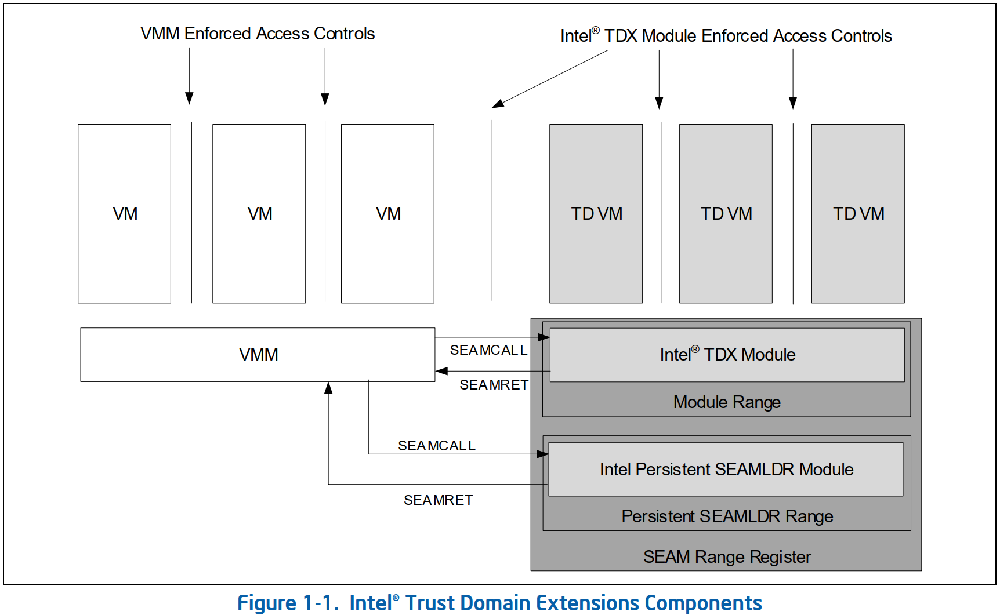
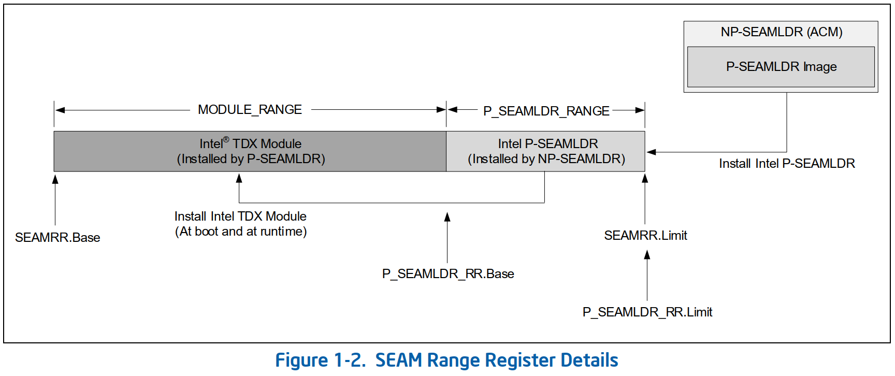
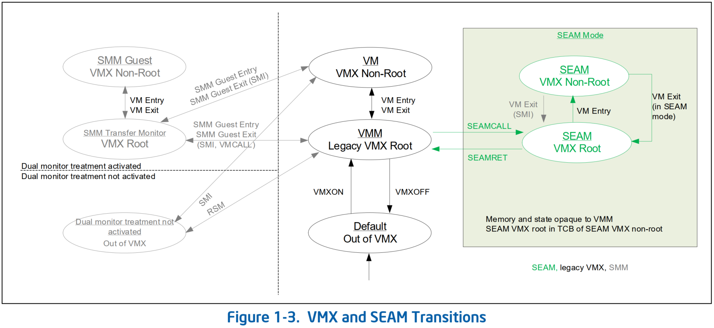

# Trust Domain CPU 架构扩展

## 安全仲裁模式（SEAM）
### 概览
* **安全仲裁模式（Secure Arbitration Mode，SEAM）** 是虚拟机扩展（VMX）体系结构的扩展，用于定义
  * 称为 **SEAM VMX root** 的新 VMX root 模式（operation），
  * 和称为 **SEAM VMX non-root** 的新 VMX non-root 模式（operation）。
* SEAM VMX root 和 SEAM VMX non-root 执行模式统称为 **operation in SEAM**。
* **Intel Trust Domain Extensions（Intel TDX）module** 是 SEAM VMX root 模式托管一个经过 CPU 认证的 *软件模块*，用于管理称为 **Trust Domains（TD）** 的虚拟机（VM）Guest。
  * TDX module 实现了构建、拆除和开始执行 TD VM 的功能。
  * VMM 提供内存资源来构建 TD，而 Virtual Machine Monitor（VMM）使用 TDX module 提供的 API 调度 TD 执行。
* **Intel Persistent SEAMLDR（Intel P-SEAMLDR）module** 是 SEAM VMX root 模式额外托管一个经过 CPU 认证的 *软件模块*，以加载和更新 Intel TDX module。
* 从 SEAM VMX root 模式启动/恢复的 VM 是 TD，而从 legacy VMX root 模式启动/恢复的 VM 是 legacy VM。
* TDX module 使用 **SEAM 指令集扩展** 来帮助保护 TD 内存内容和 CPU 状态的机密性和完整性，不受包括托管 VMM 在内的所有其他软件的影响，除非 TD 自己显示地要共享这些信息。



* TDX module 和 P-SEAMLDR module
  * 在 SEAM VMX root 模式中执行，
  * 在由 SEAM range register（SEAMRR）定义的内存之外执行。
* 内存的保留范围
  * 用 SEAMRR 来指定
  * 由平台所有者配置
  * 并由 BIOS 编程
* 处理器将 SEAMRR 范围划分为两个子范围：
  * MODULE_RANGE
  * P_SEAMLDR_RANGE
* **MODULE_RANGE** 用于安装 TDX module，TDX module 提供构建和管理 TD VM 的功能。
* **P_SEAMLDR_RANGE** 用于安装 Persistent SEAM loader（P-SEAMLDR）module，该 module 用于度量、验证 TDX module 并将其安装到 MODULE_RANGE 中。
  * 根据设计，对 P-SEAMLDR range 的访问仅限于 P-SEAMLDR module。
* Intel 提供了一个 **non-persistent SEAMLDR（NP-SEAMLDR）authenticated-code module（ACM）** 在 SEAMRR 的 P_SEAMLDR_RANGE 中安装 P-SEAMLDR module。
* TDX module 由 P-SEAMLDR 加载到 MODULE_RANGE 中



* `RAX`寄存器是`SEAMCALL`指令的输入参数。该指令使用`RAX`寄存器的 **第 63 位** 来确定`SEAMCALL`应该转换到哪个 range 中去执行软件：
  * 第 63 位为`0`，在 MODULE_RANGE
  * 第 63 位为`1`，在 P_SEAMLDR_RANGE
* 处理器响应 VMM 调用的指令：
  * `SEAMCALL`指令，从 legacy VMX root 模式转换到 SEAM VMX root 模式
  * `SEAMRET`指令，从 SEAM VMX root 模式转换到 legacy VMX root 模式
* 平台中同一时间只有一个逻辑处理器可以从 P_SEAMLDR_RANGE 执行，这是由`SEAMCALL`指令强制执行的
  * 执行`SEAMCALL`指令实施了一个变换，让 P_SEAMLDR 可以访问该逻辑处理器上的 P_SEAMLDR_RANGE
  * P_SEAMLDR 调用`SEAMRET`指令，关闭对 P_SEAMLDR_RANGE 的访问，并转换到 legacy VMX root 模式
* `VMRESUME`/`VMLAUNCH`指令用于从 SEAM VMX root 模式过渡到 SEAM VMX non-root 模式
* `VM Exit` 旨在随后从 SEAM VMX non-root 转换退出到 SEAM VMX root 模式



### TDX Module 和 P-SEAMLDR Module
#### SEAM range registers
* TDX module 和 P-SEAMLDR module 在使用 SEAM range register（SEAMRR）接口定义的内存范围之外执行
  * 按照设计，对该范围的访问仅限于 SEAM VMX root 模式
  * 当处于 SEAM VMX root 模式时，在 SEAMRR 之外获取代码是不允许的，并且会导致无法避免的关闭
* 如果设置了`IA32_MTRRCAP` MSR 的`SEAMRR`位（第`15`位），则在 SEAM VMX root 模式中执行时，处理器支持用 SEAMRR 接口限制对 TDX module 使用的指定内存地址范围的访问
* SEAM range registers 由一对 MSR 组成：
  * `IA32_SEAMRR_PHYS_BASE` MSR 旨在为 SEAM 内存范围定义`32 MB`对齐的基地址
  * `IA32_SEAMRR_PHYS_MASK` MSR 包含一个掩码，用于确定受 SEAMRR 接口保护的地址范围
* SEAM range registers 应指定的最小地址范围为`32 MB`
  * 目的是 MSR 只能由引导 BIOS 写入，并且在 *锁定位* 被设置之前；
  * 尝试 *在引导 BIOS 之外* 或 *在设置锁定位之后* 写入它们，会导致 general-protection 异常（#GP）
* 从 SEAMRR 基址偏移`4K`处开始，每个可寻址逻辑处理器 ID 的一个 4K 页被用于托管 SEAM 传输的 VMCS 结构
  * 该结构由`SEAMCALL`指令在`RAX[63]`设置为`0`的情况下使用，以帮助从 legacy VMX root 模式转换到 SEAM VMX-root 模式，即从一个 VM 退出到 TDX module
  * `SEAMRET`指令使用此 VMCS 来帮助从 SEAM VMX-root 模式转换回 legacy VMX-root 模式，即进入到一个 VM
  * 对于给定的逻辑处理器，SEAM 传输 VMCS 的地址是`IA32_SEAMRR_PHYS_BASE + 4096 + CPUID.B.0.EDX [31:0] * 4096`
* 在 P_SEAMLDR_RANGE 中，一个 4K 页面用于托管 P-SEAMLDR 传输 VMCS，
  * 该 VMCS 由`SEAMCALL`指令在`RAX[63]`设置为`1`的情况下使用，以帮助从 legacy VMX root 模式转换到 SEAM VMX root 模式，即从一个 VM 退出到 P-SEAMLDR module
  * 将`RAX[63]`设置为`1`的`SEAMCALL`旨在仅允许一个逻辑处理器从 VM 退出到 P-SEAMLDR module
  * P-SEAMLDR module 使用`SEAMRET`指令转换到 legacy VMX root module，使用 P-SEAMLDR 来传输 VMCS，进入到一个 VM

#### NP-SEAMLDR
* Intel 提供了一个 **非持久性安全仲裁模式加载器（non-persistent Secure Arbitration Mode Loader，NP-SEAMLDR）ACM** 来帮助
  * 初始化 SEAM 范围，
  * 设置 P-SEAMLDR 传输 VMCS 结构，
  * 并将 P-SEAMLDR module 加载到内存的 P_SEAMLDR_RANGE 范围中
* 如果`IA32_SEAMRR_PHYS_MASK` MSR 的 SEAMRR range 使能位（第`11`位）为`1`，则操作系统可以使用`GETSEC[ENTERACCS]`指令启动 NP-SEAMLDR ACM

#### P-SEAMLDR module
* VMM 可以调用 P-SEAMLDR module 来加载/更新 SEAMRR 的 MODULE_RANGE 中的 TDX module
  * P-SEAMLDR module 初始化用于传输到 TDX module 的 SEAM 传输 VMCS 结构，
  * 并在 SEAMRR 的 MODULE_RANGE 中加载/更新 TDX module
* P-SEAMLDR 旨在
  * 根据其签名结构度量和验证 TDX module，
  * 并将其安全版本号（security version number，SVN）、度量值和身份记录到 CPU 寄存器中，
    * 这些寄存器只能由 P-SEAMLDR module 访问
* 如果在 TDX module 未准备好执行时，在`RAX[63]`设置为`0`时调用`SEAMCALL`指令，则返回`VMFailInvalid`，这可能是由于
  1. 尚未调用 P-SEAMLDR 以成功初始化和加载 TDX module
  2. TDX module 正在更新
  3. 由于在 SEAM 中进入关闭状态，TDX module 未准备好
* 如果在 P-SEAMLDR module 未准备好执行时，在`RAX[63]`设置为`1`时调用`SEAMCALL`指令，则返回`VMFailInvalid`，这可能是由于
  1. 尚未调用 NP-SEAMLDR 以成功初始化和加载 P-SEAMLDR module
  2. P-SEAMLDR 本身正在更新
  3. 由于在 SEAM 中进入关闭状态，P-SEAMLDR module 未准备好

#### ACM 的启动
* NP-SEAMLDR ACM 自身的 SVN 在`IA32_SGX_SVN_STATUS` MSR 中报告
* OS/VMM 启动 ACM，如`SINIT`或`SEAMLDR`，应读取`IA32_SGX_SVN_STATUS` MSR 以确定
  * 是否可以启动 ACM 
  * 或是否需要一个新的 ACM
* OS/VMM 可以启动 ACM
  * 如果 ACM 的 header 中的 ACM 值的 Intel Software-Guard-Extensions（Intel SGX）SVN 大于`IA32_SGX_SVN_STATUS`报告的值
  * 或`IA32_SGX_SVN_STATUS`中的 *锁定位* 未设置
* 满足以下条件时，OS/VMM 不会启动该版本的 ACM，它将从 BIOS 或从外部资源获取 ACM 的更新版本
  * 如果`IA32_SGX_SVN_STATUS` MSR 的相应组件中报告的 SGX SVN 值，大于 ACM 的 header 中的 SGX SVN 值，
  * 并且如果`IA32_SGX_SVN_STATUS` MSR 的第`0`位为`1` 
* 但是，强烈建议 OSV/VMM 在检测到 OS/VMM 承载的 ACM 的 SGX SVN 低于`IA32_SGX_SVN_STATUS` MSR 报告的值时，更新其 ACM 版本，无论 *锁定位* 的设置如何

##### IA32_SGX_SVN_STATUS MSR 锁定位
* 如果为`1`，则表示已执行 non-faulting SGX 指令或`SEAMOPS`指令
  * 因此，启动一个正确签名但 SGX SVN 值小于 BIOS 指定的 SGX SVN 阈值的 ACM，将导致 Intel TXT（Trusted Execution Technology）关闭
* 如果为`0`，则表示不管 ACM 的 SGX SVN 值如何，处理器允许启动正确签名的 ACM

### SEAM VMX Root 模式
* TDX module 使用 SEAM VMX root 模式来帮助对 TD VM 的资源分配进行仲裁，并过渡到 SEAM VMX non-root 模式以执行 TD VM
* TDX module 使用 *多密钥全内存加密（Multi-Key，Total Memory-Encryption，MKTME）* 技术来保护 TD VM 私有内存的机密性和完整性
* 不支持使用`VMXOFF`离开 VMX 模式或使用`VMCALL`指令调用 SMM-monitor，这会导致 SEAM VMX root 模式中出现 General-Protection fault（`#GP(0)`）
* 如果逻辑处理器在 SEAM VMX root 或 non-root 模式时进入关闭状态，则处理器在进入关闭之前，将 TDX module 和 P-SEAMLDR module 的状态标记为未加载，以便所有后续 `SEAMCALL`调用在任何逻辑处理器上返回`VMFailInvalid`
#### TDX Private KeyID
* 使用 MKTME 技术，通过将每个 TD VM 与不同的 MKTME 密钥标识符（KeyID）相关联，对 TD VM 私有内存内容提供加密和完整性保护
  * 保护 TD 内存的机密性和完整性要求，与分配给某个 TD 的 KeyID 相关联的 key，不能被不受信任的软件篡改
  * 同样，不应该允许不受信任的软件，使用分配给 TD 的 KeyID，读取或写入内存
* Intel Trust Domain Extensions 支持将某个可配置的数字保留作为 KeyID，作为只能在 SEAM 中使用的 private KeyID
* 在一个支持 SEAM 的 SOC 上的 MKTME，可能支持完整性保护的内存加密模式
  * 当使用启用完整性的 keys 时，MKTME 将 message authentication code（MAC）与每个缓存行相关联
  * 根据设计，当使用 *启用完整性 KeyID* 读取缓存行时，如果存储在元数据中的 MAC 与 MKTME 重新生成的 MAC 不匹配，则将缓存行标记为 *poisoned*，以防止数据被消耗
  * 完整性保护内存必须在读取之前进行初始化，并且必须使用`MOVDIR64B`指令，使用具有`64 bytes`写入原子性的`64 bytes`直接存储，来执行此类初始化
* `IA32_TME_CAPABILITY`：MKTME 支持的 *KeyID 的最大数量* 和 *可配置为用作 KeyID 的最高物理地址位的最大数量* 由`IA32_TME_CAPABILITY` MSR 列举
* `IA32_TME_ACTIVATE`：
  * 作为激活 MKTME 的一部分，BIOS 旨在使用`IA32_TME_ACTIVATE` MSR 来配置用作 KeyID 的高位物理地址位的数量，从而激活在该平台上可用的 KeyID 的数量
  * 启动 BIOS 也可以使用`IA32_TME_ACTIVATE` MSR 将这个激活的 KeyID 数量划分为 *共享 KeyID* 和 *TDX 私有 KeyID*
* `IA32_MKTME_KEYID_PARTITIONING`：该 MSR 允许读取由 BIOS 完成的 KeyID 分区
* MKTME KeyID 的 keys 使用`PCONFIG`指令进行编程
  * `PCONFIG`指令仅允许在 SEAM 中对 TDX private KeyID 进行密钥编程
* 当 MKTME 被激活时，按计划会将平台物理地址的高位（从 CPUID 的 MAXPA 信息枚举得到的可用最高位开始）重用，作为 KeyID
* 当 KeyID 空间被分区时，从物理地址的最高位开始的，由`TDX_RESERVED_KEYID_BITS`指定的位数，对 TDX private KeyID 进行编码，
  * 如果这些位中的任何一个被设置，则指定的 KeyID 将作为一个 TDX private KeyID
* 用于 TD 内存保护的 MKTME
  * 可能需要 TDX module 为某些维护操作，回写和使缓存无效
  * 对于某些维护操作，TDX module 可能需要回写缓存，但不需要使缓存内容失效
  * TDX module 可以使用`WBINVD/WBNOINVD`指令来执行这些操作
* 处理器可以通过`MSR_WBINVDP`和`MSR_WBNOINVDP`为 SEAM VMX root 模式提供一个备用的缓存管理接口
  * `WRMSR`到`MSR_WBINVDP`和`MSR_WBNOINVDP`可以写回软件通过`EDX:EAX`指定的一个缓存子块
  * 此外，`WRMSR`到`MSR_WBINVDP`还可以使指定的缓存子块无效
* 软件使用`RDMSR`读取`MSR_WBINVDP`或`MSR_WBNOINVDP`缓存子块的最大值（`NUM_CACHE_SUB_BLOCKS`）
  * 软件应使用`EDX: EAX`调用`MSR_WBINVDP/MSR_WBNOINVDP`至少一次，其中子块编号介于`0`和`(MAX_CACHE_SUB_BLOCKS - 1)`之间，以对整个缓存进行操作
  * 指定一个无效的缓存子块编号，即大于或等于`MAX_CACHE_SUB_BLOCKS`的数字，可能会导致 General-Protection fault（`#GP(0)`）
* `RDMSR`和`WRMSR`操作`MSR_WBINVDP`和`MSR_WBNOINVDP`的伪代码如下：
  ```vb
  IF RDMSR
    IF inSEAM==0 THEN #GP(0);
    IF invoked from VMX load/store list THEN #GP(0);
    EDX:EAX = MAX_CACHE_SUB_BLOCKS;
  ENDIF

  IF WRMSR
    IF inSEAM==0 THEN #GP(0);
    IF invoked from VMX load/store list THEN #GP(0);
    IF EDX:EAX >= MAX_CACHE_SUB_BLOCKS THEN #GP(0);
    Flush cache sub-block indexed by EDX:EAX
    IF ECX == MSR_WBINVDP THEN Invalidate cache sub-block indexed by EDX:EAX;
  ENDIF
  ```

##### 一点思考
* 了解一些内存 ECC 方面的知识

> ECC 的生成和检查顺序如下：
> 1. ECC 代码由控制器基于实际 WR（WRITE）数据生成。存储器同时存储 WR 数据和 ECC 代码。
> 2. 在 RD（读取）操作期间，控制器从存储器读取数据和相应的 ECC 代码。控制器从接收到的数据中重新生成 ECC 代码，并将其与接收到的 ECC 代码进行比较。
> 3. 如果存在匹配项，则不会发生任何错误。如果存在不匹配，则 ECC SECDED 机制允许控制器纠正任何一位错误并检测到两位错误。

* 除了 AES-XTS 128 bit 内存加密之外，TDX 还可以通过在每个缓存行上使用基于 SHA-3 的 MAC（`28b`）的加密完整性保护模式。
  * 在此模式下，SHA-3-256 (KECCAK [512]) 用作 MAC 生成的底层函数，将 `256b` 输出截断为 `28b` 用于存储和验证。
  * 为防止密文泄露，每个高速缓存行都维护一个 1 位 TD-ownership tag，以识别该行是否与一个分配给 TD 的内存页面关联。
  * 在这种模式下，TD-ownership-bit 包含在 MAC 中。
* MAC 存储在 DRAM 的 ECC-bit 之内，提供完整性保护
  * 通过软件改，肯定是不行的，属于某个 TD 的私有页面的内容只有该 TD 能改，这是 TDX module 能保障的
  * 通过物理方式直接改，则会造成 ECC 错误
* 如果 host kernel 是恶意的，通过修改页表让 PA 的 keyID 部分去匹配 TD 的 HPA 的 keyID 的手段去读某个页的内容呢？
  * iMC 从接收到的数据中重新生成 ECC 代码，MKTME 重新生成的 MAC
  * 这时，由于 TD-ownership tag 是 MAC 计算的一部分，而 host 不是 TD，该 tag 为 `0`，这会导致和接收到的 ECC 不匹配，从而引发 MCE

#### 内存类型
* 在 SEAM VMX root 模式中，对一次访问的内存类型的裁定如下：
  * 如果`CR0.CD`是`1`，则有效内存类型是`UC`
  * 如果`CR0.CD`为`0`，则有效内存类型取决于 *访问的物理地址* 和 *用于访问的 KeyID*
    * 如果访问的是 SEAMRR，则 MTRR 不会影响内存类型，并且访问的有效内存类型仅由 PAT 确定
    * 如果访问 SEAMRR 之外的物理内存，并且访问使用了 TDX private KeyID，则 MTRR 不会影响内存类型，内存类型仅由 PAT 决定
    * 如果访问 SEAMRR 之外的物理内存，并且访问未使用 TDX private KeyID，则访问的内存类型是根据与物理地址和 PAT 匹配的 MTRR 确定的
* 显式强制使用内存类型的特殊操作（例如，fast strings、`MOVDIR64`等）继续使用这些指令定义的特殊内存类型进行操作

#### Caching Translation 信息
* 地址转换缓存体系结构增加了一个 in-SEAM 状态以支持 SEAM
  * 在 SEAM VMX root 模式中，in-SEAM 为`1`
  * 在 SEAM VMX root 模式中，逻辑处理器可能会为派生自分页结构的线性地址缓存和使用缓存映射，该分页结构被`CR3`的当前值（直接或间接）引用，并将它们与：
    * 当前`VPID`
    * 当前`PCID`（非全局翻译）或任何`PCID`（全局翻译）
    * 当前 In-SEAM

#### 事件处理
* 在转换到 SEAM VMX root 模式时，处理器可以禁止 NMI 和 SMI
  * 在被禁止的情况下，如果有这些事件发生，那么它们将被定制为保持挂起，并在禁止状态被移除时被传递
  * NMI 和外部中断可以在 SEAM VMX-root 模式中不受限制
  * 在 SEAM VMX-root 模式中，可以读取`MSR_INTR_PENDING`以确定任何未决事件的状态
* 在使用 VM entry 转换到 SEAM VMX non-root 模式时，根据设计，NMI 和 INTR 禁止状态会根据用于执行 VM entry 的 TD VMCS 的配置进行更新
* *与 SEAM VMX non-root 模式有关* 或 *在转换到 SEAM VMX non-root 模式之前挂起* 的 SMI 可能会导致 VM exit 到 SEAM root 模式，退出原因设置为“IO SMI”或“Other SMI”
  * 如果 SMI 是 machine check initated SMI（MSMI），则 exit qualification 的第 **0** 位设置为`1`
  * 然后，SMI 将在 VM exit 后保持挂起状态
* 在使用`SEAMRET`转换到 legacy VMX root 模式时，
  * 可以将 NMI 和 SMI 禁止状态恢复到上一次`SEAMCALL`时的禁止状态
  * 如果未禁止，则将传递任何未决的 NMI/SMI
* `MSR_INTR_PENDING`中这些未决事件的报告不受以下因素影响：
  * EFLAGS.IF.
  * NMI blocking.
  * SEAM blocking of SMI, or NMI.
  * SMI inhibited by `SENTER`.
  * MOV-SS/POP-SS blocking.
  * STI blocking.

### SEAM VMX NON-ROOT 模式
* TD VM 是在 SEAM VMX NON-ROOT 模式中执行的
#### SEAM VMX Non-Root 执行控制
* 每个 TD VM 都与一个 VMCS 相关联，该 VMCS 管理：
  * 进入和退出 SEAM VMX non-root 模式（VM entries 和 VM exits）
  * 以及 SEAM VMX non-root 模式中的处理器行为
* 在 SEAM non-root 模式中，处理器使用以下附加控制来帮助实现其目标：
  1. Shared EPT Pointer（Shared-EPTP）：一个`64`位的执行控制字段（编码对`203CH/203DH`），用于指定 Shared-EPTP 指针
     * 在 SEAM VMX non-root 模式中，计划规定两个 EPT 处于活动状态：
       * 使用 VMCS 的 *EPTP 字段* 指定的 *私有 EPT*
       * 使用 VMCS 的 *Shared-EPTP 字段* 指定的 *共享 EPT*
     * Bits `11:0` 保留
     * Bits `(MAXPHYADDR - 1):12` 包含 4 KB 对齐的 EPT PML4/PML5 级页表的物理地址的第`(MAXPHYADDR - 1):12`位
     * Bits `63:MAXPHYADDR` 保留
  2. TD Key identifier（TD-KeyID）（编码`4026H`）：一个`32`位执行控制字段，用于帮助指定 TD 分配的 MKTME KeyID
     * 处理器使用此 TD-KeyID 访问 EPTP 引用的 EPT 分页结构，*通过 EPTP 所引用的 EPT 进行转换* 可以获得的物理地址
  3. Guest Physical Address Width（GPAW，Guest 物理地址宽度）：
     * 通过以下因素一起用于帮助确定 GPA 宽度以及 GPA 中的`SHARED`位的位置
       * processor-based execution controls（编码`2034H`）的第三级中的 GPAW 执行控制（第`5`位）
       * EPT walk levels（4 或 5 级）
     * TD 的 GPA 空间分为两部分：
       * 共享 GPA 范围
       * 私有 GPA 范围
     * `SHARED`位为`0`的 GPA 范围是 **TD 私有内存**，由 **EPTP** 确定的 EPT 用于将 GPA 转换为物理地址
       * 加载到`CR3`、`PDPTR`和 HLAT root 指针的 GPA 始终使用 EPTP 进行转换
     * `SHARED`位为`1`的 GPA 范围是 **TD 共享内存**，由 **Shared-EPTP** 确定的 EPT 用于将 GPA 转换为物理地址
       * 处理器使用从 *共享 EPT* 确定的 KeyID 来访问物理地址，作为共享 GPA 转换的结果
     * 当 4 级 EPT 处于活动状态时，`SHARED`位的位置将始终为第`47`位
     * 当 5 级 EPT 处于活动状态时，
       * 如果 GPAW 为`0`，`SHARED`位的位置将为第`47`位
       * 否则，它将为第`51`位
* 基于处理器的第三级执行控制，被设计为由基于处理器的主要执行控制的第`17`位激活，
  * 然后`IA32_VMX_PROCBASED_CTLS3 MSR`（索引`492H`）将指明在 VMCS 的基于处理器的第三级的执行控制字段中可以被设置为`1`的位
* `IA32_VMX_PROCBASED_CTLS3`MSR 的第`5`位旨在报告是否可以将 VMCS 的基于处理器的第三级执行控制字段中的 GPAW 执行控制设置为`1`
  * 当 GPAW 执行控制可以设置为`1`时，处理器还支持在 VMCS 中对 Shared-EPTP 和 TD-KeyID 执行控制进行编程
* 当不在 SEAM VMX root 模式中时，VM entry 将忽略这些 VMCS 字段
#### Guest 物理地址翻译
* 到 SEAM VMX non-root 模式的转换被格式化为需要启用扩展页表（Extended Page Tables，EPT）
* 在 SEAM VMX non-root 模式中，应该有两个 EPT 处于活动状态：
  * 使用 VMCS 的 **EPTP** 字段指定的 **私有 EPT**
  * 使用 VMCS 的 **Shared-EPTP** 字段指定的 **共享 EPT**
* 使用共享 EPT 转换一个 GPA 时，如果条目存在，并且设置了`(MAXPHYADDR-1)`到`(MAXPHYADDR-TDX_RESERVED_KEYID_BITS)`范围内的物理地址位，即配置了 TDX private KeyID，则可能发生 EPT 错误配置
* 如果 CPU 的最大物理地址宽度（maximum physical-address，MAXPA）为`52`，而 guest 物理地址宽度配置为`48`，则 GPA `51:48`的位并非全部为`0`的访问，可能会导致 EPT-violation
  * 而即使“EPT-violations #VE”执行控制为`1`，此类 EPT-violation 不会突变为`#VE`
* 如果 CPU 的最大物理地址宽度（MAXPA）小于`48`，并且`SHARED`位被配置在第`47`位，则 GPA 第`47`位将被保留，而 GPA `46:MAXPA`的位也被保留
  * 在此类 CPU 上，在任何分页结构中设置`51:48`位或`46:MAXPA`位都可能导致访问时出现一个保留位 page fault

#### 线性地址翻译
* 在 SEAM VMX non-root 模式中，用于将线性地址转换为 GPA 的所有分页结构都应位于 *私有 GPA 空间* 中
* 在`CR3`中将 SHARED 位设置为 `1`，或引用另一个分页结构的分页结构，会导致保留位缺页异常
* 在 SEAM VMX non-root 模式中，尝试在 TD 共享内存中的一个 page 外执行，例如，将`SHARED`位设置为`1`的页面映射，可能会导致缺页异常

#### 内存分类
* 对于已翻译的 guest 物理内存访问，内存类型通常应根据以下方面来确定
  * `CR0.CD`
  * PAT 内存类型
  * EPT 内存类型
* EPT 提供的 EPT 内存类型（共享或私有）有助于执行翻译
* 显式强制使用内存类型的特殊操作（例如，fast strings、`MOVDIR64`等）继续使用这些指令各自的特殊内存类型进行操作
* 如果`CR0.CD`为`1`，则使用 TDX private KeyID（MSR bitmaps、VAPIC page 等）访问 VMCS linked 数据结构的内存类型将为 UC，否则，它将为 WB
#### Caching 翻译信息
* 在 SEAM VMX non-root 模式中，EPT 始终处于使用状态
* 地址转换缓存架构增加了一个额外的 **in-SEAM 状态** 以支持 SEAM
* 当在 SEAM VMX root 或 VMX non-root 模式时，in-SEAM 将为`1`（否则为`0`）并按如下方式扩充缓存体系结构：
  * 对于使用线性地址的访问，处理器可以创建组合映射
    * 组合映射将从 *当前 EP4TA（当 4 级 EPT 处于活动状态时）* 或 *当前 EP5TA（当 5 级 EPT 处于活动状态时）* 引用（直接或间接）的 EPT 分页结构中派生
    * EPT4TA/EP5TA 来自 VMCS 的 EPTP 字段
    * 如果`CR0.PG = 1`，则组合映射也可以从`CR3`的当前值（直接或间接）引用的分页结构中派生
    * 如果`CR0.PG = 0`，则不会创建组合的 paging-structure-cache 条目
    * 组合映射与以下信息关联：
      * 当前 VPID
      * 当前 PCID（non-global 翻译）或 任何 PCID（global 翻译）
      * 来自 VMCS 的 EPTP 字段的当前 EP4TA（当 4 级 EPT 处于活动状态时）或 当前 EP5TA（当 5 级 EPT 处于活动状态时）
      * 当前 In-SEAM
  * 对于 guest 物理地址访问，处理器可以使用 *从当前 EPTP 或当前 Shared-EPTP 的`51:12`位引用（直接或间接）的 EPT 分页结构派生的* guest 物理映射，具体取决于用于执行翻译的 EPT
    * 新创建的 guest 物理映射与来自 VMCS 的 EPTP 字段的 *当前 EP4TA* 或 *当前 EP5TA* 关联
* 通过共享 EPTP 引用的 EPT 获得的 *组合映射* 和 *guest 物理映射*，也与来自 VMCS 的 EPTP 字段的 EP4TA/EP5TA 关联
  * 为了使在 SEAM 中创建的 *guest 物理映射* 或 *组合映射* 无效，软件（包括在 SEAM 模式之外执行的 VMM）将使用 *地址的 KeyID 字段设置为`0`的* EPTP（而非 Shared-EPTP）
* 仅当在 SEAM 中调用时，`INVVPID`或`INVPCID`才使在 SEAM 中创建的组合映射无效

#### 虚拟中断传递
* SEAM VMX non-root 模式中的虚拟中断传递，旨在在计算请求虚拟中断（RVI）时，忽略 virtual-APIC page 里的虚拟中断请求寄存器（VIRR）中与向量 0 到 30 相对应的位
* 这些向量被格式化成不被当作虚拟中断传递（通过虚拟中断传递）

### SEAM 以外的模式
* 当不在 SEAM 模式中时，为编码 TDX private KeyID 而保留的物理地址位被视为保留位
* 当翻译一个在 SEAM 外的 *线性地址（HVA）* 时，如果任何分页结构条目在物理地址集合中有为 TDX private KeyID 编码保留的位，则处理器会生成 *保留位缺页异常*
* 当翻译一个在 SEAM 外的 *guest 物理地址（GPA）* 时，如果任何 EPT 结构条目在物理地址集合中有为 TDX private KeyID 编码保留的位，则处理器会生成一个 *EPT 错误配置*
* 当可以接受物理地址作为操作数的指令被 *为了编码 TDX private KeyID 而设置了保留位的物理地址作为操作数* 调用时，会生成失败或异常，如表 1-6 中所述
* 通过在`IA32_RTIT_CTL` MSR 中将`TraceEn`设置为`1`来启用 Intel Processor Trace，如果`IA32_RTIT_OUTPUT_BASE` MSR 为以下情况时会引起一个可选的 ToPA 错误：
  1. 使用带有 TDX private KeyID 的物理地址进行编程
  2. 或者使用一个其翻译结果会是具有 TDX private KeyID 的物理地址的 GPA 进行编程
* 如果 KeyID 操作数是一个 private KeyID，则在 SEAM 外调用的`PCONFIG`会失败，并出现错误代码`INVALID_KEYID`（编码为`3`，KeyID 无效）

## VMX 指令集扩展

### VM 指令集错误号

### 指令集参考

#### SEAMCALL
* `SEAMCALL`：Call to SEAM VMX Root Operation

Opcode/Instruction       | Op/En | Description
-------------------------|-------|-------------
66 0F 01 CF / `seamcall` |  ZO   | 调用 SEAM VMX root 模式

* Instruction Operand Encoding

Op/En | Operand 1 | Operand 2 | Operand 3 | Operand 4
------|-----------|-----------|-----------|-----------
ZO    | NA        | NA        | NA        | NA

##### 描述
* `SEAMCALL`指令使用`RAX`寄存器的第`63`位来确定请求
  * 是转换到 Intel PSEAMLDR module（如果`bit 63`为`1`）
  * 还是 Intel TDX module（如果`bit 63`为`0`）
* 当在`RAX`第`63`位设置为`0`的 legacy VMX root 模式中调用时，此指令会导致 VM 退出（退出原因 `4CH` - `SEAMCALL`）到 SEAM VMX root 模式中的 TDX module，在该指令被调用的逻辑处理器上使用 SEAM 传输 VMCS
  * 这些 SEAM 传输的 VMCS 在 SEAMRR 的模块范围内
  * 在此类 VM 退出时，退出原因的第`29`位（VM 从 VMX root 模式退出）将设置为`1`
* 当在`RAX`第`63`位设置为`1`的 legacy VMX root 模式中调用时，此指令会导致 VM 退出（退出原因 `4CH` - `SEAMCALL`）到 SEAM VMX root 模式中的 P-SEAMLDR module，使用 P-SEAMLDR range 中的 SEAM 传输 VMCS
  * 系统中一次只有一个逻辑处理器可以退出到 PSEAMLDR module，并且`SEAMCALL`指令通过称为`P_SEAMLDR_MUTEX`的互斥锁强制执行此属性
* 当在 SEAM VMX non-root 模式或 legacy VMX non-root 模式中调用时，该指令可能导致 VM 退出（退出原因 `4CH` - `SEAMCALL`）
  * 在此类 VM 退出时，退出原因的第`29`位（VM 从 VMX root 模式退出）将设置为`0`
* `SEAMCALL`调用间接分支控制机制建立一个屏障，防止在同一逻辑处理器上，软件在`SEAMCALL`之前执行在`SEAMCALL`之后的间接分支的预测目标
* 操作伪代码
```vb
IF not in VMX operation or inSMM or inSEAM or ((IA32_EFER.LMA & CS.L) == 0)
   THEN #UD;
ELSIF in VMX non-root operation
   THEN VMexit("basic reason" = SEAMCALL,
               "VM exit from VMX root operation" (bit 29) = 0);
ELSIF CPL > 0 or IA32_SEAMRR_MASK.VALID == 0 or "events blocking by MOV-SS"
   THEN #GP(0);
SEAM_CVP = (SEAMRR.BASE + 4K) + CPUID.B.0.EDX[31:0] * 4K
// Certain events/conditions that could affect security of SEAM could disable SEAM execution
IF
   If RAX[63] == 0 AND "Intel TDX module not loaded or disabled"
      THEN VMfailInvalid
   If RAX[63] == 1
      THEN
          Acquire P_SEAMLDR_MUTEX
          IF P_SEAMLDR_MUTEX acquisition failed
             THEN VMFailInvalid
          IF "Intel Persistent SEAMLDR module not loaded/or disabled"
             THEN
                 Release P_SEAMLDR_MUTEX
                 VMFailInvalid
          FI;
          inP_SEAMLDR = 1
          SEAM_CVP = P_SEAMLDR_CVP
FI;

RFLAGS.{CF, OF, SF, PF, AF, ZF} = 0

// Exiting from legacy VMX root operation
inSEAM = 1
SEAM_CVP.VMCS_link_pointer = current-VMCS
current-VMCS = SEAM_CVP
Save VMM state in current-VMCS based on its VM-exit controls
Save event inhibits in VMM interruptibility status - SMI inhibit, NMI inhibit
Load/force SEAM state based on VM-exit controls and host-state area
// Further details of the operation of the VM-exit appear in Chapter 27 “VM Exits” of Intel® 64 and IA-32 Architectures Software
// Developer's Manual Volume 3, System Programming Guide
Inhibit SMI and NMI
current-VMCS.exit_reason.basic_reason = SEAMCALL
current-VMCS.exit_reason."VM exit from VMX root operation" (bit 29) = 1
current-VMCS.exit_qualification = 0
```
#### SEAMOPS
* `SEAMOPS`：Invoke SEAM Operations

Opcode/Instruction       | Op/En | Description
-------------------------|-------|-------------
66 0F 01 CE / `seamops`  |  ZO   | 调用特定于 SEAM 的操作

* Instruction Operand Encoding

Op/En | Operand 1 | Operand 2 | Operand 3 | Operand 4
------|-----------|-----------|-----------|-----------
ZO    | NA        | NA        | NA        | NA

##### 描述
* `SEAMOPS`指令用于在 SEAM VMX root 模式中执行特定于 SEAM 的操作
* `SEAMOPS`指令设计为 **仅由在 SEAM VMX root 模式中运行的特权软件执行**，并调用 leaf functions 来执行请求的功能
  * 软件将通过在寄存器`RAX`中设置适当的值来选择 leaf functions
  * 其他寄存器可能具有 leaf-specifc 的用途
  * 该指令只能在 64 位模式下使用
* 当前定义了两个 leaf functions：
  * **CAPABILITIES**（`RAX == 0`）：返回支持的`SEAMOPS` leaves 的 bitmap
  * **SEAMREPORT** （`RAX == 1`）：生成`SEAMREPORT`结构
* 该指令被格式化在`RAX`寄存器中返回 leaf-specific function 的执行结果
* leaf-specific function 可能会在其他的通用寄存器（GPR）中返回信息
* 如果`CRPL_CPUSVN`尚未锁定，且`SEAMREPORT` leaf 已启用，`SEAMOPS`旨在锁定`CRPL_CPUSVN`和`BIOS_SE_SVN`
  * 一旦锁定，CPU 有助于防止对这些寄存器进行任何进一步的修改
  * 因此，`CRPL_CPUSVN`可能被
    * 第一条 non-faulting 的 SGX 指令锁定
    * 或使用`SEAMREPORT_ENABLED`执行的第一条`SEAMOPS`指令锁定，即`CAPABILITIES` leaf 报告支持`SEAMREPORT` leaf
* 操作伪代码
```vb
IF inSEAM==0 or ((IA32_EFER.LMA & CS.L) == 0) or in VMX non-root operation or lock-prefix-used
   THEN #UD;
ELSIF CPL > 0
   THEN #GP(0);
IF SEAMREPORT_ENABLED == 1 and CRPL_CPUSVN not locked
   Lock CRPL_CPUSVN and BIOS_SE_SVN
ENDIF
SWITCH RAX
CASE 0: RAX = SEAMREPORT_ENABLED ? 0x3 : 0x1;
        break; // SEAMREPORT (leaf 1) is supported if only if SEAMREPORT enabled
DEFAULT: #GP(0);
        break;
ENDSWITCH
```
##### SEAMOPS 数据结构

* TEE_TCB_SVN

Name | Offset (Bytes) | Size (Bytes) | Description
-----|----------------|--------------|-------------
SEAM | 0              | 2            | TDX module SVN
RESERVED | 2          | 14           | 必须为零

* TEE_TCB_INFO 结构

Name        | Offset (Bytes) | Size (Bytes) | Description
------------|----------------|--------------|-------------
VALID       | 0              | 8            | 指示有效的`TEE_TCB_INFO`字段<br> - 第`i`个有效位为`1`表示从偏移量`(8 * i)`开始的`8`个字节是有效的<br> - 第 `i`个有效位为`0`反映从偏移量`(8 * i)`开始的`8`个字节未填充或保留，并设置为零
TEE_TCB_SVN | 8              | 16           | TEE_TCB_SVN 数组
MRSEAM      | 24             | 48           | TDX module 的度量
MRSIGNERSEAM| 72             | 48           | 如果有效，则是 TDX module 签名者的度量
ATTRIBUTES  | 120            | 8            | 如果有效，则是额外配置的`ATTRIBUTES`
RESERVED    | 128            | 111          | 必须为零

* REPORTTYPE

Name        | Offset (Bytes) | Size (Bytes) | Description
------------|----------------|--------------|-------------
TYPE        | 0              | 1            | TEE 类型<br> - `0x00`: SGX<br> - `0x7F - 0x01`: 保留<br> - `0xFF - 0x80`: SEAM 定义<br> Note：第`7`位定义了硬件实现（0）还是 TDX module 实现（1）
SUBTYPE     | 1              | 1            | TYPE-specific 的子类型
VERSION     | 2              | 1            | TYPE-specific 的版本。对于 SGX 必须为`0`
RESERVED    | 3              | 1            | 必须为零

* REPORTMACSTRUCT

Name        | Offset (Bytes) | Size (Bytes) | Description                                 | MAC
------------|----------------|--------------|---------------------------------------------|-----
REPORTTYPE  | 0              | 4            | Header 结构类型                              | Y
RESERVED    | 4              | 12           | 必须为零                                     | Y
CPUSVN      | 16             | 16           | CPUSVN                                      | Y
TEE_TCB_INFO_HASH | 32       | 48           | `TEE_TCB_INFO`的 SHA384                     | Y
TEE_INFO_HASH | 80           |48            | `TEE_INFO`的 SHA384（或`0x00`，如果没有 TEE）| Y
REPORTDATA  | 128            | 64           | 用于调用者和目标之间通信的数据的集合           | Y
RESERVED    | 192            | 32           | 必须为零                                     | Y
MAC         | 224            | 32           | 在带有 report-type 指定 MAC key 的 `REPORTMACSTRUCT`之上的 MAC | N

* SEAMREPORT

Name         | Offset (Bytes) | Size (Bytes) | Description
-------------|----------------|--------------|-------------
REPORTMACSTRUCT | 0           | 256          | 给`REPORT`的`REPORTMAC`结构
TEE_TCB_INFO | 256            | 239          | HASH 可以在`REPORTMACSTRUCT`中找到的`TEE_TCB_INFO`

##### SEAMOPS Leaf Functions

###### SEAMREPORT Leaf
* 帮助创建一个包含 SEAM 的度量/配置信息的`SEAMREPORT`结构，当代表一个 TEE 被调用时，它包还括 TEE 度量
* SEAMREPORT Operands

Operand | In/Out | Description
--------|--------|---------------
RAX     | In     | 1 （`SEAMOPS` 指令 leaf 号）
RAX     | Out    | Leaf-specific 返回码
RCX     | In     | 新创建的`SEAMREPORT`结构的`1024 B` 对齐线性地址
RDX     | In     | 在字节序的低`32 bits`的报告类型 Header，高`32 bits`必须为零
R8      | In     | 要签名的`REPORTDATA`的`64 B`对齐的线性地址
R9      | In     | 要签名的`TEE_INFO_HASH`的`64 B`对齐的线性地址
###### SEAMREPORT Leaf 描述
* 该指令由 TDX module 使用，并帮助创建 TDX module 或由 TDX module 托管的 TEE（例如 TD）的报告，即`SEAMREPORT`
  * `SEAMREPORT`结构可以包含 TEE、TDX module 和 TEE TCB 中的任何附加组件的度量/配置信息
  * `SEAMREPORT`有一个`REPORTMACSTRUCT`，它被一个 MAC 进行完整性保护，该 MAC 涵盖`TEE_TCB_INFO_HASH`、`TEE_INFO_HASH`（如果提供）和`REPORTDATA`
  * `TEE_TCB_INFO_HASH`表示`TEE_TCB_INFO`结构的 SHA384 哈希，它反映了 SEAM 的度量/配置以及 SEAM 托管的所有 TEE 实例的 TCB 中的其他元素
  * `VALID`字段包含一个标志的数组，可以指示已填充哪些字段，因为并非所有字段都适用于所有报告
  * 当 TDX module 用于创建 TEE 报告时，`TEE_INFO_HASH`预计是所报告 TEE 的度量和配置的 SHA384 hash
  * 当仅用于报告 TDX module 时，`TEE_INFO_HASH`可能是一串零
* TDX module 可以选择报告类型的值，但是，`REPORTTYPE`的所有有效值
  * `TYPE`应将高位设置为`1`，未能设置此位将导致`SEAM_INVALID_REPORT_TYPE`错误
  * TDX module 还有助于提供`REPORTDATA`，这是一个`64`字节的值，将包含在`SEAMREPORT`中，并最终包含在 quote 中
  * 这有助于指令调用者将数据与 TDX module 或它报告的 TEE 相关联
  * 为了帮助验证`SEAMREPORT`的完整性，软件应帮助验证报告中存在的任何哈希值
  * `REPORTMACSTRUCT.TEE_TCB_INFO_HASH`应该和`SEAMREPORT.TEE_TCB_INFO`的 hash 匹配
  * 如果`REPORTMACSTRUCT.TEE_INFO_HASH`不为零，它应该与单独的`TEE_INFO`结构的哈希匹配
  * 根据设计，如果任一值不匹配，则报告已被篡改
  * 软件使用`ENCLU[EVERIFYREPORT2]`来帮助验证`REPORTMACSTRUCT`本身的完整性。
* SEAMREPORT Memory Operands

显式/隐式 | 线性地址 | 名称           | 访问权限 | 对齐 | 并发限制
---------|---------|----------------|---------|------|----------
显式     | RCX      | SEAMREPORT    | RW      | 1024B | None
显式     | R8       | REPORTDATA    | R       | 64B   | None
显式     | R9       | TEE_INFO_HASH | R       | 64B   | None

* SEAMREPORT Leaf 操作伪代码
```vb
// Temporary Variables setup with input register operands
SEAMREPORT    *tmp_seamreport_la = RCX;   // Linear address of SEAMREPORT
uint64_t      tmp_report_type = RDX;      // Report type
void          *tmp_reportdata_la = R8;    // Linear address of REPORTDATA
SHA384_HASH_t *tmp_tee_info_hash_la = R9; // Linear address of TEE_INFO_HASH
KEY256_t      tmp_report_key;             // 256b report key

RAX = SEAM_SUCCESS;
RFLAGS.{ZF, CF, PF, AF, OF, SF} = 0;

// Ensure SEAMREPORT pointer is 1024B aligned and read/write accessible
IF ( tmp_seamreport_la is not 1024B aligned) #GP(0);
<< tmp_seamreport_la must be read/write accessible>>

// Ensure TEE_INFO_HASH pointer is 64B aligned and read accessible
IF ( tmp_tee_info_hash_la is not 64B aligned) #GP(0);
<< tmp_tee_info_hash_la must be read accessible>>

// Ensure REPORTDATA pointer is 64B aligned and read accessible
IF ( tmp_reportdata_la is not 64B aligned) #GP(0);
<< tmp_reportdata_la must be read accessible>>

// Check reserved bit in REPORT TYPE and that TYPE reflects SEAM implementation
IF ((tmp_report_type & 0xFFFFFFFFFF000000) != 0) || (tmp_report_type & 0x0000000000000080) == 0))
{
    RAX = SEAM_INVALID_REPORT_TYPE;
    RFLAGS.ZF = 1;
    GOTO END;
}

// Create SEAMREPORT in a temporary buffer
tmp_seamreport = 0;
tmp_seamreport.REPORTMACSTRUCT.REPORTTYPE = tmp_report_type[31:0];
tmp_seamreport.REPORTMACSTRUCT.RESERVED = 0x00;
tmp_seamreport.REPORTMACSTRUCT.CPUSVN = CRPL_CPUSVN;

// Populate TEE_TCB_INFO depending on the Intel TDX module type
tmp_seamreport.TEE_TCB_INFO.TEE_TCB_SVN = CRPL_TEE_TCB_INFO.TEE_TCB_SVN;
tmp_seamreport.TEE_TCB_INFO.MRSEAM = CRPL_TEE_TCB_INFO.MRSEAM;

IF (<Intel SEAM>)
{
    tmp_seamreport.TEE_TCB_INFO.VALID = 111111111b;
}
ELSE
{
    tmp_seamreport.TEE_TCB_INFO.VALID = 1111111111111111b;
    tmp_seamreport.TEE_TCB_INFO.MRSIGNERSEAM = CRPL_TEE_TCB_INFO.MRSIGNERSEAM;
    tmp_seamreport.TEE_TCB_INFO.ATTRIBUTES = CRPL_TEE_TCB_INFO.ATTRIBUTES;
}
tmp_seamreport.REPORTMACSTRUCT.TEE_TCB_INFO_HASH = SHA384(tmp_seamreport.TEE_TCB_INFO);

// Copy TEE_INFO_HASH and REPORTDATA from memory
tmp_seamreport.REPORTMACSTRUCT.TEE_INFO_HASH = *tmp_tee_info_hash_la;
tmp_seamreport.REPORTMACSTRUCT.REPORTDATA = *tmp_reportdata_la;

// Compute MAC on the first 224B of REPORTMACSTRUCT
tmp_report_key = CR_REPORT_KEY2;
tmp_seamreport.REPORTMACSTRUCT.MAC = HMAC-SHA256(tmp_report_key, &tmp_seamreport.REPORTMACSTRUCT, 224);

// Copy out report to memory
*tmp_seamreport_la = tmp_seamreport;

END:
```
#### SEAMRET
* `SEAMRET`：Return to Legacy VMX Root Operation

Opcode/Instruction       | Op/En | Description
-------------------------|-------|-------------
66 0F 01 CD / `seamret`  |  ZO   | 从 SEAM VMX root 模式返回到 legacy VMX root 模式

* Instruction Operand Encoding

Op/En | Operand 1 | Operand 2 | Operand 3 | Operand 4
------|-----------|-----------|-----------|-----------
ZO    | NA        | NA        | NA        | NA

##### 描述
* 该指令帮助 SEAM VMX root 软件退出 SEAM VMX root 模式并在传统 VMX root 模式中恢复 VMM 软件的执行
* 从 P-SEAMLDR 返回的`SEAMRET`清除当前 VMCS 指针指向的当前 VMCS 结构
* 如果需要，使用`SEAMCALL`调用 P-SEAMLDR 的 VMM，必须使用`VMPTRLD`指令重新加载当前 VMCS
* 操作伪代码
```vb
IF inSEAM==0 or ((IA32_EFER.LMA & CS.L) == 0) or in VMX non-root operation
   THEN #UD;
ELSIF CPL > 0
   THEN #GP(0);
ELSIF current-VMCS pointer is not valid
   THEN VMfailInvalid;

Check settings of VMX controls and host-state area;
IF invalid settings
   THEN
       VMfailValid(VM entry with invalid VMX-control field(s)) or
       VMfailValid(VM entry with invalid host-state field(s)) as appropriate;
   ELSE
       Attempt to load guest state including event inhibits (NMI, SMI, etc.)
       and PDPTRs as appropriate based on entry controls;
       Clear address-range monitoring;

       IF failure in checking guest state or PDPTRs
           THEN VM entry fails // see Section 26.8 of the Intel® 64 and IA-32 Architectures Software Developer’s Manual Volume 3C
       ELSE
          Attempt to load MSRs from VM-entry MSR-load area;
          IF failure
              THEN VM entry fails // see Section 26.8 of the Intel® 64 and IA-32 Architectures Software Developer’s Manual Volume 3C
          ELSE
              current-VMCS = current-VMCS.VMCS-link-pointer
              IF inP_SEAMLDR == 1
                 THEN
                     If current-VMCS != FFFFFFFF_FFFFFFFFH
                        THEN
                            Ensure data for VMCS referenced by current-VMC is in memory
                            Initialize implementation-specific data in all VMCS referenced by current-VMCS
                            Set launch state of VMCS referenced by current-VMCS to “clear”
                            current-VMCS = FFFFFFFF_FFFFFFFFH
                     FI;
                     inP_SEAMLDR = 0
                     Release P_SEAMLDR_MUTEX
              FI;
              inSEAM = 0 // Closes SEAMRR access
              VM entry succeeds;
          FI;
       FI;
FI;
```
#### TDCALL
* `TDCALL`：Call to VM Monitor from TD Guest

Opcode/Instruction       | Op/En | Description
-------------------------|-------|-------------
66 0F 01 CC / `tdcall`   |  ZO   | 通过 VM exit 来调用 VM monitor

* Instruction Operand Encoding

Op/En | Operand 1 | Operand 2 | Operand 3 | Operand 4
------|-----------|-----------|-----------|-----------
ZO    | NA        | NA        | NA        | NA

##### 描述
* 该指令允许 guest 特权软件向 VM monitor 发出服务调用
* 此类调用的编程接口细节是 TDX module 特定的；
  * 该指令可以导致 VM exit，注册适当的退出原因
* 在 VMX non-root 模式之外使用此指令会导致 #UD 错误
* 操作伪代码
```vb
IF not in VMX non-root operation THEN #UD;
ELSIF CPL > 0 THEN #GP(0);
ELSE VM exit with exit reason TDCALL (4DH) and zero exit qualification
```
#### VMRESUME/VMLAUNCH
`VMRESUME/VMLAUNCH`：Resume/Launch Virtual Machine
* `VMRESUME/VMLAUNCH` 可以在 SEAM VMX root 模式中执行以下附加操作：
  1. 如果“enable EPT” VM-execution control 为`0`，则由于无效的控制字段导致 VM entry 失败。
  2. Shared-EPTP 执行控制不能设置任何保留位。

## SGX 指令集扩展

* `ENCLU`指令定义了一个新的 leaf，`EVERIFYREPORT2`，可用于帮助验证 *使用`SEAMOPS[SEAMREPORT]`生成的报告* 的 MAC
* `CPUID` leaf`12`，sub-leaf `0`，`EAX` 第`7`位设置为`1`，以帮助枚举对`ENCLU`的`EVERIFYREPORT2` leaf 的支持
* `EVERIFYREPORT2`指令的布局

Instruction    | EAX | RBX                     | RCX | RDX
---------------|-----|-------------------------|-----|-----
EVERIFYREPORT2 | 08H | REPORTMACSTRUCT 有效地址 |     |

### EVERIFYREPORT2 LEAF 描述

Opcode / Instruction              | Description
----------------------------------|------------
EAX = 08H / ENCLU[EVERIFYREPORT2] | 验证 TD 的加密报告。`RBX`持有`REPORTMACSTRUCT`的地址

* 该 enclave 模式指令能够验证 *描述 TD 内容的* 加密`REPORTMACSTRUCT`，并且`REPORTMACSTRUCT`可用于确定`TDREPORT`中描述的 TEE 是否在同一平台上运行

* `EVERIFYREPORT2`内存参数信息

Memory Parameter     | Permissions | Semantics
---------------------|-------------|------------
[RBX]REPORTMACSTRUCT | R           | Enclave 访问

指令流程设计如下：
1. 验证操作数的对齐要求
2. 验证操作数（`RBX`）在 enclave 内
3. 通过`REPORTMACSTRUCT`结构计算 MAC
4. 确定 *计算出的 MAC* 是否与 *附加到`REPORTMACSTRUCT`结构的 MAC* 匹配

* `EVERIFYREPORT2`操作流程中的临时变量

变量名               | 类型             | 大小        | 描述
--------------------|------------------|-------------|------
TMP_CURRENTSECS     | 有效地址          | 32/64 Bytes | 当前执行的 enclave 的 SECS 的地址
TMP_REPORTMACSTRUCT | `REPORTMACSTRUCT`| 256 Bytes   | TEE 的加密报告
TMP_MAC             | MAC              | 32 Bytes    | 由指令计算 REPORT 出得到的 MAC

* 操作伪代码
```vb
// check alignment of REPORTMACSTRUCT
IF (DS:RBX is not 256 Byte aligned) #GP(0);

// check to see if REPORTMACSTRUCT is inside the current enclave
IF (DS:RBX is not within CR_ELRANGE) #GP(0);

// make sure DS:RBX is read accessible
<< DS:RBX should be read accessible >>

// read EPCM VALID, PENDING, MODIFIED, BLOCKED, PT, R, W, X, and ENCLAVESECS
// fields atomically check that DS:RBX is a valid and accessible EPC page
IF ((DS:RBX does not resolve to an EPC address) OR
    (EPCM(DS:RBX).VALID = 0) OR
    (EPCM(DS:RBX).PENDING = 1) OR
    (EPCM(DS:RBX).MODIFIED = 1) OR
    (EPCM(DS:RBX).BLOCKED = 1) OR
    (EPCM(DS:RBX).R is 0) OR
    (EPCM(DS:RBX).PT != PT_REG) OR
    (EPCM(DS:RBX).ENCLAVESECS != CR_ACTIVE_SECS) OR
    (EPCM(DS:RBX).ENCLAVEADDRESS != (DS:RBX & ~0xFFF)))
{
    #PF(DS:RBX);
}

// Create local/protected copy of REPORTMACSTRUCT
TMP_REPORTMACSTRUCT[255:0B] = DS:RBX[255:0B];

// Verify REPORTMACSTRUCT header
IF ((TMP_REPORTMACSTRUCT.TYPE != 0x81) OR // TDX implemented by Intel TDX module
    (TMP_REPORTMACSTRUCT.REPORTTYPE.SUBTYPE != 0x00) OR
    (TMP_REPORTMACSTRUCT.REPORTTYPE.VERSION != 0x00) OR
    (TMP_REPORTMACSTRUCT.RESERVED != 0))
{
    RFLAGS.ZF = 1;
    RAX = SGX_INVALID_REPORTMACSTRUCT;
    goto EXIT;
}

// Verify CPUSVN is a valid value
IF (TMP_REPORTMACSTRUCT.CPUSVN is unsupported by the CPU) {
   RFLAGS.ZF = 1;
   RAX = SGX_INVALID_CPUSVN;
   goto EXIT
}

// Verify MAC on REPORTMACSTRUCT
TMP_MAC = MAC(CR_REPORT_KEY2, TMP_REPORTMACSTRUCT[223:0B], 224);
IF (TMP_MAC != TMP_REPORTMACSTRUCT.MAC)
{
   RFLAGS.ZF = 1;
   RAX = SGX_INVALID_REPORTMACSTRUCT;
   goto EXIT
}
RAX=0
RFLAGS.ZF=0;

EXIT:
  RFLAGS.CF=0;
  RFLAGS.PF=0;
  RFLAGS.AF=0;
  RFLAGS.OF=0;
  RFLAGS.SF=0
```

## References
* [DDR存储器ECC机制](https://blog.csdn.net/weixin_42238387/article/details/116502206)