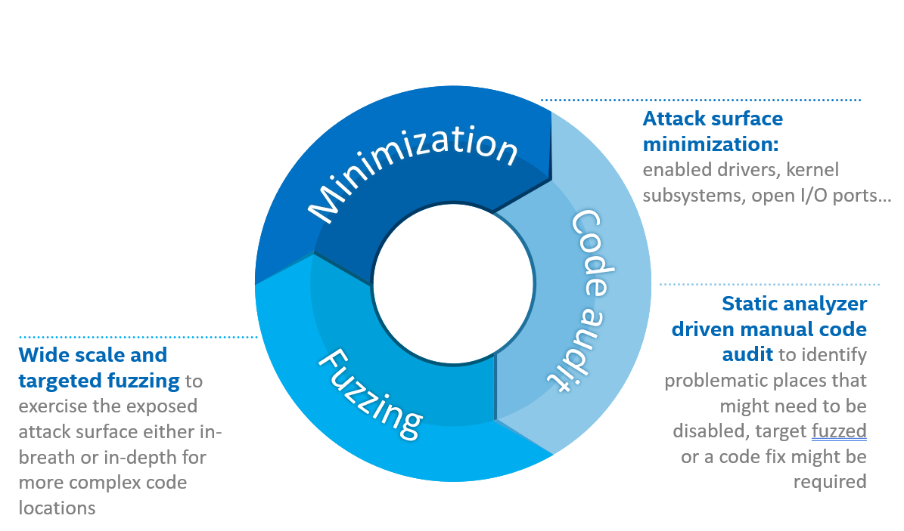

# Intel® Trust Domain Extension Guest Linux Kernel Hardening Strategy

## 目的和范围
* Intel® Trust Domain Extension (Intel® TDX) 技术的主要安全目标是消除 guest 虚拟机对 host 和虚拟机管理器 (VMM) 的信任需求。
* 但是，它本身无法保护 guest 虚拟机免受 host/VMM 攻击，这些攻击利用 host/VMM 和 guest 之间现有的基于类虚拟化（paravirt-based）的通信接口，例如 MMIO、Port IO 等。
* 为了实现对此类攻击的保护，需要加固 guest 虚拟机软件栈，以安全地处理通过上述接口来自 host/VMM 的不受信任且可能恶意的输入。
* 这种加固工作应应用于客户软件栈中使用的一组具体软件组件（虚拟 BIOS、引导加载程序、Linux* 内核和用户空间），这些组件特定于具体的部署场景。
* 为了促进这一过程，我们开发了一种加固方法和工具，如下所述。
* 本文档中介绍的加固方法绝不是针对上述攻击 100% 安全的最终保证，而只是一种根据我们的最佳知识和资源限制构建的方法。
* 在我们的环境中，我们已成功将其应用于 Linux TDX MVP 软件栈 (https://github.com/intel/tdx-tools) 和信任域 (TD) guest Linux 内核，并强化了许多相关内核子系统。
* 本指南是针对 Linux 内核编写的，但概述的原则可应用于任何软件组件。
* TD guest 内核的整体威胁模型和安全架构在 [Intel® Trust Domain Extension Linux Guest Kernel Security Specification](tdx_guest_security_spec.md) 中进行了描述，建议与本文档一起阅读。

## 加固策略概述
* 图 1 所示的整体加固策略包含三个并行执行的活动：攻击面最小化、手动代码审计和代码模糊测试。
* 所有这些活动都紧密相连，每个活动的结果都会作为其他活动的输入。
  * 例如，手动代码审计的结果可用于决定何时应禁用某个功能（攻击面最小化）或应将其作为详细模糊测试活动的目标。
  * 同样，模糊测试结果可能会影响禁用某个功能的决定，或指出需要进行手动代码审计但被静态代码分析器遗漏的地方。

##### Figure 1. Linux Guest kernel hardening strategy

* 以下部分详细描述了每一项活动。需要考虑的一个关键方面是“definition of done”，即何时完成加固工作的标准以及如何定义此类工作的成功。
* 理想的“definition of done”标准可以概述如下：
1. 在给定选定的部署方案的情况下，guest 内核功能和 VMM/host 公开的接口被限制在其成功操作所需的最低限度。
   * 这意味着仅启用最少的一组所需驱动程序、内核子系统和单个功能。
2. 必须手动审核 guest 内核中启用并可以从 VMM/host 获取不受信任的输入的所有代码路径，以防止使用格式错误的数据的潜在后果。
   * 每当手动代码审核发现存在安全问题的问题时，都必须通过错误修复或禁用所涉及的代码路径（如果可能）来解决。
3. 在 guest 内核中启用并可以从 VMM/host 获取不受信任的输入的所有代码路径都必须使用适当的模糊测试技术进行模糊测试。
   * 模糊测试技术必须提供覆盖信息，以识别模糊测试器已达到所需的代码路径并充分运用它们。
   * 每当模糊测试活动发现存在安全问题的问题时，就必须通过错误修复或禁用所涉及的代码路径来解决。
* 整体加固工作的成功程度明显更难以衡量。
  * 手动代码审核或模糊测试活动识别出的安全问题总数是一个自然的量词，但它既不能保证已成功实现安全 guest 内核的最终目标，也不一定表明所选的加固方法是成功的。
  * 尽管是事后指标（albeit a post-factum indicator），但 guest 内核在 Linux TD 软件栈中的成功运行以及在其部署生命周期中没有发现或报告的问题是一个更强有力的指标。

## 攻击面最小化

## Reference

- [Intel® Trust Domain Extension Guest Linux Kernel Hardening Strategy](https://intel.github.io/ccc-linux-guest-hardening-docs/tdx-guest-hardening.html)