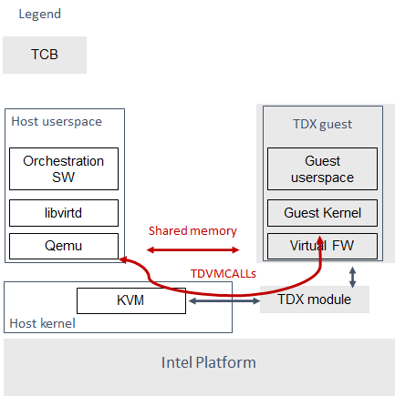

# Intel® Trust Domain Extension Linux Guest Kernel Security Specification

## 目的和范围

* 本文档描述了 TDX guest 内部运行的 Linux guest 内核的安全架构。
* Intel® Trust Domain Extension（Intel® TDX）技术的主要安全目标是消除 TDX guest 信任 host 和虚拟机管理器（VMM）的需要。
  * 值得注意的是，此安全目标并非 TDX 架构所独有，而是在所有机密云计算解决方案（confidential cloud computing，CCC）（例如 TDX、AMD SEV 等）中都很常见，因此下面描述的许多方面将适用于其他 CCC 技术。

## 威胁模型

* 图 1 所示的 Linux TDX 软件栈的可信计算基础（TCB）包括 Intel 平台、TDX module 以及在 TDX guest 内部运行的软件栈。
##### Figure 1. Linux TDX 1.0 SW stack


* TDX guest 内核安全架构的主要安全目标是帮助防止不受信任的 VMM 造成的权限提升以及内核数据机密性/完整性违规。针对 TDX guest 内核的拒绝服务（DoS）攻击超出了本文的范围，因为 TDX guest 资源完全受 VMM 控制，并且默认情况下能够对 TDX guest 执行 DoS。
* TDX module 和 Intel 平台有助于确保 TDX guest 内存和寄存器的保护。但是，它们无法保护 TDX guest 免受利用 host/VMM 与 guest 之间现有通信接口的 host/VMM 攻击：
  * TDVMCALL hypercalls（通过 TDX-module）
  * 用于 IO 的共享内存
* 下面描述的安全架构的主要目标是帮助保护 TDX Linux guest 内核免受 hypervisor 通过这些通信接口的攻击。
* 此外，不应从 TDX guest 用户空间（ring 3）向 TDX Linux guest 内核（ring 0）引入任何新的额外攻击向量。
  * 此威胁模型的范围省略了 TDX guest 用户空间。
  * 该威胁模型不解决由 TDX guest 用户空间直接使用上述暴露给不受信任的 host/VMM 的接口造成的任何威胁。
    * 例如，如果 TDX guest 用户空间自行启用了执行 MMIO 或 PCI 配置空间读取的调试或测试工具，但没有仔细验证来自不受信任的 host/VMM 的输入，则可能会发生许多其他攻击。
  * 该威胁模型还假设 KVM/Qemu 是运行受保护 TDX guest 的 hypervisor。因此，其他 hypervisor 及其加固（hardening ）也不在本文档的讨论范围之内。
  * 此威胁模型未涵盖的另一个潜在攻击媒介是滥用 Linux 内核打印输出和调试例程，这些例程现在可以直接从不受信任的 host/VMM 获取参数。
* 总体威胁缓解矩阵如下表所示。
##### TDX guest Linux kernel threat mitigation matrix

威胁名称                          | 威胁描述 | 缓解机制 | 详细描述的链接
---------------------------------|----------|---------|------------------
(NRDD) Non-robust 设备驱动 | 非强化设备驱动程序从 host/VMM 消耗恶意输入（`MSR`、`CPUID`、PCI 配置空间、PortIO、MMIO、Shared Memory/DMA、KVM Hypercall），从而导致 host/VMM -> guest 内核权限提升 | 1. 使用驱动程序过滤器禁用大多数驱动程序。限制：不阻止驱动程序 `__init` 函数执行。某些驱动程序可能会使用旧版注册并避免过滤。</br>2. 通过限制一组允许的 ACPI 表来禁用 ACPI 驱动程序（这通常还会导致 `__init` 函数在第一个 ACPI 表存在检查之外运行）</br>3. 对已启用的驱动程序进行强化 | 1. 见 [设备过滤机制](#设备过滤机制)</br>2. 见 [BIOS 提供的 ACPI 表和映射](#bios-提供的-acpi-表和映射)</br>3. 见 [Intel® Trust Domain Extension Guest Linux Kernel Hardening Strategy](tdx_guest_kenel_hardening.md)
(NRDDI/L) Non-robust 设备驱动的 `__init` 函数或 legacy non-robust 设备驱动 | device filter 不会阻止驱动程序初始化函数的执行。对于 5.15 内核，有 198 个独特的 `__init` 函数，具有 5198 个独特的代码位置，可以消耗来自 host/VMM 的恶意输入（`MSR`、`CPUID`、PCI 配置空间、Port IO、MMIO、KVM hypercalls），从而导致 host/VMM -> guest 内核权限升级。| 1. 对于 PCI 配置空间：PCI 配置空间访问限制</br>2. 对于 MMIO：选择加入 MMIO 共享</br>3. 对于 Port IO：PortIO filter</br>4. 对于 KVM hypercalls：限制为最小允许集</br>5. 对于 MSR：TDX module 限制 host 提供的 MSR + 代码 audit</br>6. 对于 `CPUID`：仅允许软件范围 `0x40000000 - 0x400000FF` | 1. 见 [PCI 配置空间](#pci-配置空间)</br>2. 见 [MMIO](#mmio)</br>3. 见 [IO Ports](#io-端口)</br>4. [KVM Hypercalls](#kvm-cpuid-特性和-hypercalls)
(NRCKC) Non-robust 核心内核代码 | Linux 核心代码从 host/VMM 消耗恶意输入（`MSR`、`CPUID`、PCI 配置空间、Port IO、MMIO、Shared Memory/DMA、KVM Hypercall），从而导致 host/VMM -> guest 内核权限提升 | 1. 禁用 TDX guest 内核不需要且可能消耗来自 VMM/host 的输入的复杂功能。限制：禁用某些功能并不简单。</br>2. 作为深度防御，依赖于（NRDDI/L）的缓解措施来最大限度地减少开放攻击面（尤其是 MMIO、PortIO、`CPUID` 和 `MSR`）。</br>3. 对启用的代码进行强化 | 1. 见 tbd</br>2. 见来自 NRDDI/L 的链接</br>3. 见 [Intel® Trust Domain Extension Guest Linux Kernel Hardening Strategy](tdx_guest_kenel_hardening.md)
(NRAA) Non-robust AML 解析器或 ACPI 代码 | 通过 ACPI 表（由 host/VMM 通过 TDVF 虚拟固件提供）从 host/VMM 消耗恶意输入，从而导致 host/VMM -> guest 内核权限提升 | 1. ACPI 表根据 TDX attestation 寄存器进行度量，并且它们的度量结果包含在远程证明中。限制：即使看起来良性的 ACPI 表也可能会利用 AML 解释器或 ACPI 代码中的一些未知错误。有超过 55 个 ACPI 表，其中一些包含大量功能/代码。</br>2. 通过 ACPI 过滤器禁用大多数不需要的 ACPI 表| 1. TDX guest 虚拟固件（TDVF）实施。见 [TDX guest virtual firmware](TDVF.md)</br>2. 见 [BIOS 提供的 ACPI 表和映射](#bios-提供的-acpi-表和映射)
(HCR) host/VMM 控制的随机性 | host/VMM 可以观察或影响 Linux RNG guest 内核的状态（由于中断是主要的默认熵源）并破坏使用 RNG 输出的所有 guest 机制的加密安全性 | 使用 `RDRAND/RDSEED` 强制添加熵并避免回退到不安全的 `jiffies` | 见 [TDX Guest 内部的随机性](#tdx-guest-内部的随机性)
(HCT) host/VMM 控制时间 | host/VMM 可以修改/影响 TDX guest 内部可见的时间，并根据安全时间（rollback prevention 等）破坏所有 guest 机制的安全性 | 禁用 host/VMM 影响 guest 时间的所有机制。只依赖 TSC 定时器，由 TDX module 保证 | 见 [TSC 和定时器](#tsc-和定时器)
注入的中断 | host/VMM 可以通过恶意输入向 guest 注入中断 | 异常向量 `0-30` 不允许注入中断（通过 posted-interrupt 机制）。在 TDX module 的帮助下可以进行 NMI 注入 | 见 [中断处理和 APIC](#中断处理和-apic)
(LIPC/P) 丢失的 IPIs/可靠的 panic | host/VMM 可以删除 guest 虚拟机上的 vcpu 之间的 IPI，从而尝试在 guest 虚拟机中导致一些意外行为 | 对丢失 IPI 的结果进行代码审计（到目前为止尚未发现任何结果）。Panic 似乎是安全的。| N/A

## TDX Linux Guest 内核整体加固方法
* 文档 [Intel® Trust Domain Extension Guest Linux Kernel Hardening Strategy](tdx_guest_kenel_hardening.md) 描述了用于对暴露于恶意 hypervisor 的通信接口执行系统审核和模糊测试的加固方法。
* 本文档涵盖了与所描述的威胁模型相关的内核子系统，并提供了有关其强化原理的详细信息。
* 总体安全原则是，如果发生任何损坏事件，最安全的默认选项是引发内核 panic。

## 设备过滤机制
* 如上所述，本文档中描述的安全架构的主要目标是帮助保护 TDX Linux guest 内核免受通过 TDVMCALL 或共享内存通信接口进行的 hypervisor 攻击。
* 关于何时在 TDX guest 内核中使用这些接口的详细描述可以在下面的 [基于 TDVMCALL-hypercall 的通信接口](#基于-tdvmcall-hypercall-的通信接口) 部分中找到，但是我们对内核代码的分析表明，此类接口的最大用户是设备驱动程序（超过 95%）。
* 每次驱动程序执行 port IO 或 MMIO 读取、访问 PCI 配置空间或从 MSR 或 `CPUID` 读取值时，恶意 hypervisor 都有可能注入 malformed 的值。
* 幸运的是，TDX guest 操作只需要一小部分设备驱动程序（对于 Linux TDX SW 参考堆栈，它是 [VirtIO 和共享内存](#virtio-和共享内存) 中描述的 virtio 驱动程序的子集），因此绝大部分攻击面可以通过创建一个允许的设备驱动程序的小列表来禁止。
  * 这是 guest 运行时设备过滤器的主要目标。它允许为设备驱动程序定义允许或拒绝列表，并防止未经授权的设备驱动程序的 `probe` 函数运行（注意：驱动程序的 `init` 函数能够执行）。 
  * 如果已授权设备驱动程序的 MSI mailbox 和 MMIO mappings 是使用 `pci_iomap_*` 或 `devm_ioremap*` 接口创建的，它还会自动设置为“shared”。
  * 对于使用普通 `ioremap_*` 样式接口创建的 MMIO mappings，需要修改驱动程序代码以使用上述 `pci_iomap_*/devm_ioremap*` 接口或手动将映射设置为“shared”的新 `ioremap_driver_hardened` 接口。
* 此外，当启用设备过滤器时（请参阅“[内核命令行](#内核命令行)”部分，了解如何从命令行禁用它以进行调试），还有其他安全机制为 TDX guest Linux 内核启用，即
  * Port IO 过滤器处于活动状态（请参阅“[IO 端口](#io-端口)”部分了解详情），
  * 强制执行 ACPI 表允许列表（请参阅“[BIOS 提供的 ACPI 表和映射](#bios-提供的-acpi-表和映射)”部分了解详情），
  * 并且限制来自未经授权的设备驱动程序的 PCI 配置空间访问（请参阅“[PCI 配置空间](#pci-配置空间)”部分了解详情）。
* 如果出于调试目的需要禁用设备过滤器或相关机制，请参阅“[内核命令行](#内核命令行)”部分，了解如何使用命令行更改这些机制的配置，即修改设备过滤器的允许/拒绝列表、修改允许的 ACPI 表列表等

### 设备透传
* 在某些部署模型中，可能需要为 TDX guest 启用设备透传。在当前的 TDX 1.0 模型中，只能通过使用共享内存来实现，即无法让设备访问 TDX guest 私有内存。
* 因此，当为 TDX guest 启用新的透传设备时，TDX guest 中相应的设备驱动程序必须由设备过滤机制授权运行，并且其 MMIO 页面必须映射为共享才能进行通信。
* 这可以使用以下内核命令属性来完成：`authorize_allow_devs=pci:<ven_id:dev_id>`。
* 但是，根据设备驱动程序用于创建 MMIO 映射的接口类型，可能无法自动与 host 共享这些页面：
  * 如果设备驱动程序使用 `devm_ioremap*()` 或 `pci_iomap*()` 样式的接口，则共享可以正常工作
  * 如果设备驱动程序使用 legacy 的 `ioremap*()` 样式的接口，则共享将不起作用，
    * 并且必须将相应的设备驱动程序更改为使用上述接口，
    * 或者使用专用的 `ioremap_driver_hardening()` 接口，该接口明确指示必须与 host 共享 MMIO 映射
* 与非透传的情况类似，使用上述机制在 TDX guest 中启用的任何设备驱动程序都必须加强，以抵御（withstand）来自 hypervisor 通过 TDVMCALL 或共享内存通信接口的攻击。
  * 此外，由于 TDX 1.0 的设备透传使用共享内存，因此放置在此内存中的任何数据都可能被 host/hypervisor 操纵，并且必须尽可能使用应用程序级安全机制（例如加密和身份验证）进行保护。

## 基于 TDVMCALL-hypercall 的通信接口
* TDVMCALL 用于在 TDX guest 和 host/VMM 之间进行通信。Host/VMM 可以尝试通过提供恶意制作的输入作为对 TDVMCALL 的响应来攻击 TDX guest 内核。
* 虽然 TDVMCALL 通过 TDX module 进行代理，但只有一小部分（主要是一些 `CPUID` 和 `MSR`）由 TDX module 控制和执行。大多数 TDVMCALL 都传递给 host/VMM，并且其值由 host/VMM 控制。
* `#VE` handler 用作主要的集中式 TDVMCALL 调用位置，而不是将 TDVMCALL 直接插入 guest 内核中的许多代码路径中。
* 但是，在某些情况下，也可以直接调用 TDVMCALL 来提高某个热点代码路径的性能。
* TDX module 会调用 `#VE` handler 来执行它无法处理的操作。
  * `#VE` handler 要么解码执行的指令（使用标准 Linux x86 指令解码器），并将其转换为 TDVMCALL，要么拒绝它（panic）。
  * `#VE` handler 的实现很简单，不需要深入的安全审计或模糊测试，因为它不是 host/VMM 提供的不可信数据的实际使用者。
    * 但是，它确实为 port IO 过滤实现了一个简单的允许列表（请参阅 [IO 端口](#io-端口)）。

### MMIO
* MMIO 由不受信任的 host 控制，大多数情况下通过 `#VE` 处理，对于性能至关重要的情况，则通过 PCI iomap 的特殊快速路径处理。
* 内核中的指令是受信任的。`#VE` handler 将使用 Linux 指令解码器解码一部分指令。
* 我们只关心从 MMIO 读取的用户。

#### 内核 MMIO
* 默认情况下，所有 MMIO 区域都位于 TDX guest 私有内存中，host/VMM 无法访问。
* 要明确共享 MMIO 区域，必须通过设备过滤器框架授权设备，从而启用 MMIO 操作。
* 必须加固对来自不受信任的 host/VMM 的 MMIO 输入的处理（有关更多信息，请参阅 [Intel® Trust Domain Extension Guest Linux Kernel Hardening Strategy](tdx_guest_kenel_hardening.md)）。
* 静态代码分析工具应根据标准 io.h 宏的使用情况生成所有 MMIO 用户的列表。
  * 所有可移植代码都应使用这些宏。
  * 唯一已知的例外是 legacy MMIO APIC 直接访问，它已被禁用（请参阅 [中断处理和 APIC](#中断处理和-apic)）。
* 开放问题：可能还有其他非可移植（x86 特定）代码不使用 io.h 宏，但直接访问 IO 映射。Sparse 应该能够找到使用 `__iomem` 注释的代码

#### 用户 MMIO
* 在当前的 Linux 实现中，不支持用户 MMIO，会导致 `SIGSEGV`。因此，它不能用于攻击内核（DoS 除外）。

### 中断处理和 APIC
* TDX guest 必须使用 **虚拟化 x2APIC 模式**。Legacy xAPIC（使用 MMIO）被 guest 内核 APIC 代码中的特殊检查禁用了，并由 TDX module 强制执行。
* x2APIC MSR 要么通过 TDVMCALL hypercall 进行代理（并由不受信任的 hypervisor 处理），要么作为对 VAPIC 页面的访问进行处理。
  * 后者被认为是可信的，但第一组需要加固，类似于通过 [TDVMCALL 代理并由 host 控制的 MSR](#msr-通过-tdvmcall-代理并由-host-控制) 中描述的不可信 MSR 访问。
  * 有关特定 x2APIC MSR 行为的详细说明，请参阅 [Intel TDX module architecture specification](tdx_module_spec.md) 中的第 10.9 节。
* 不受信任的 VMM 可以注入非 NMI 中断（通过 posted-interrupt 机制）或 NMI 中断。
  * 然而，TDX module 不允许 VMM 通过 posted-interrupt 机制注入 `0-30` 范围内的中断向量，这大大减少了针对不受信任的 VMM 的暴露攻击面。
  * 上述其余中断被认为是由 host 控制的，因此处理它们的 guest 内核代码必须像接收恶意 host 输入的任何其他代码一样进行审计（audited）和模糊（fuzzed）测试。
* IPI 通过触发 x2APIC `ICR` MSR 上的 TDVMCALL 来启动。
  * Host 控制 IPI 的传送，因此 IPI 可能会丢失。我们需要确保所有丢失的 IPI 都会导致 panics 或 stop 操作（如果超时由 host 控制）。
  * 这应该已经由 `smp_call_function*()` 中的正常超时处理。

### PCI 配置空间
* Host 控制 PCI 配置空间，因此一般来说，任何 PCI 配置空间读取都是不可信的。
* 除了加固通用 PCI 代码外，还有一个特殊的 PCI 配置空间过滤器，可防止随机 `initcalls` 访问设备过滤器不允许的未经授权设备的 PCI 配置空间。
* 配置空间过滤器是通过 *将未经授权的设备设置为“错误”状态* 来实现的，这可防止任何配置空间访问。

### 为 PCI 子系统探测驱动
* PCI 子系统通过 PCI 配置空间枚举所有 PCI 设备。Host 拥有配置空间，这是不可信的。
* 我们仅支持通过 `0xCF8` 进行探测，并通过 ACPI 表允许列表禁用 `MCFG` 配置空间。这意味着目前仅支持前 `256` 个字节。
* 核心 PCI 子系统代码已通过 [Intel® Trust Domain Extension Guest Linux Kernel Hardening Strategy](tdx_guest_kenel_hardening.md) 中描述的代码审计和模糊测试进行了强化。

### 分配资源
* 内核可以根据来自 host/VMM 提供的不受信任的 PCI 配置空间的信息，为 PCI 桥或驱动程序分配资源（例如 MMIO）。因此，需要验证此分配过程以抵御潜在的恶意输入。
  * 因此，核心 PCI 子系统中的代码以及启用的 virtio 驱动程序已使用 [Intel® Trust Domain Extension Guest Linux Kernel Hardening Strategy](tdx_guest_kenel_hardening.md) 中描述的技术进行了审核和模糊测试。
  * 具体来说，我们注意确保分配的资源区域不会相互重叠或与 TD guest 内存的其余部分重叠。

### 驱动
* 所有列入允许列表的驱动程序都需要进行审核和模糊测试，以了解它们与 host 的所有 PCI 配置空间交互。
* 最初，这只是一个非常小的 virtio 设备列表（请参阅 [VirtIO 和共享内存](#virtio-和共享内存)）。

### 用户程序访问 PCI 配置空间
* 用户程序可以直接通过 `sysfs` 或 `/dev/mem` 访问 PCI 设备。如果用户程序在解析 PCI 配置空间或 MMIO 时存在可利用的漏洞，则这可能是一个攻击媒介（vector ）。
* 如果用户程序使用 Linux 提供的 PCI 枚举（`/sys/bus/pci`），则 PCI 设备允许列表将在一定程度上保护用户程序。但它不会保护试图直接访问允许列表中的设备（如 virtio 设备）的程序。
* 用户空间程序也可以使用 `/dev/port` 上的 `operm/iopl()` 或 `direct read()` 通过 `0xCF8` port IO 直接访问 PCI 配置空间。
  * 前一种情况将在 TDX guest 内核 `#VE` handler 中被过滤，因为如果请求来自用户空间，handler 不会将 port IO 请求转发到不受信任的 VMM。
  * 但是，后一种情况（直接读取 `/dev/port`）不会受到 `#VE` handler 的限制，执行此操作的用户空间程序应准备好安全地处理来自 VMM 的不受信任的输入。
* 由于 TDX guest 的 PCIe `MCFG` 配置空间被禁用，并且正常的 PCI 配置空间未映射到 MMIO 地址空间，因此用户空间程序无法在 TDX guest 内通过 MMIO 访问 PCI 配置空间。

### MSRs
* 几乎所有 x86 内核使用的 MSR 都列在 arch/x86/include/asm/msr-index.h 中，但可能有别名和范围。
* 一些额外的 MSR 位于 arch/x86/include/asm/perf_event.h、arch/x86/kernel/cpu/resctrl/internal.h 和 arch/x86/kernel/cpu/intel.c

### 由 TDX module 控制的 MSRs
* 有两种类型的 MSR 由 TDX module 控制：
  * Passthrough MSR（从 CPU 直接读/写，例如与侧信道相关的 MSR，如 `ARCH_CAPABILITIES`）
  * 尝试读/写此类 MSR 时会导致 `#GP` 的不允许的 MSR（例如，所有 `IA32_VMX_* KVM MSR`）
* 所有这些 MSR 都由平台控制，是可信的，不需要任何加固。有关确切列表，请参阅 [Intel TDX module architecture specification](tdx_module_spec.md) 中的第 18.1 节。

### MSR 通过 TDVMCALL 代理并由 host 控制
* 对这些 MSR 的访问通常会导致 TDX module 将 `#VE` 事件注入回 TDX guest，并且 TDX guest 内核 `#VE` handler 调用对不受信任的 VMM 的 TDVMCALL hypercall 来获取/设置这些 MSR 值。
  * 在某些情况下，出于性能原因，直接从 TDX guest 内核调用 TDVMCALL hypercall，以避免额外的上下文切换到 TDX module。
  * 所有这些 MSR 均被视为不可信，并且必须加固它们在 TDX guest 内核中的处理，即使用 [Intel® Trust Domain Extension Guest Linux Kernel Hardening Strategy](tdx_guest_kenel_hardening.md) 中描述的方法进行审核（audited ）和模糊测试（fuzzed）。
* 根据我们的模糊测试和审计活动，基于 MSR 值的内存安全问题的风险被认为很低，因为大多数 MSR 都是通过屏蔽（masking）各个 MSR bits 来处理的，例如，保存和恢复 MSR bits 的值。
  * 然而，一些 MSR 控制相当复杂的功能，例如 `IA32_MC*`、`IA32_MTRR_*`、`IA32_TME_*`。
    * 我们已禁用大部分此类功能，通过在 TDX guest 早期初始化期间清除以下 feature bits 来最大程度地减少暴露的攻击面：`X86_FEATURE_MCE`、`X86_FEATURE_MTRR`、`X86_FEATURE_TME`。
  * 有关完整的最新列表，请检查 `tdx_early_init()` 函数。
  * 如果需要启用这些功能，则必须使用详细的代码审核和模糊测试方法来确保相应的代码得到加固。

### IO 端口
* IO port 由 host 控制，可能成为攻击媒介。
* 所有 IO port 访问都通过 `#VE` 或直接 TDVMCALL。
* 我们将使用一个受信任端口的小型允许列表。这有助于防止 host 尝试注入使用 port 探测且可能存在处理 port 数据的漏洞的旧 ISA 驱动程序。
* 虽然通常无法自动加载这些驱动程序，但它们可能会被静态编译到内核中并执行标准 port 探测。
* 最突出的用户是串行端口驱动程序。使用串行端口（例如，用于 early console）需要禁用安全性。
* 在安全模式下，我们只有 virtio 控制台。
* 下表显示了当前 TDX guest 内核中的允许 ports 列表：

端口范围           | 目标用户      | 注释
------------------|---------------|----------
`0x70 ... 0x71`   | MC146818 RTC |
`0xcf8 ... 0xcff` | PCI 配置空间  | 理想情况下，这个范围应该进一步限制，因为可能不需要全部
`0x600 ... 0x62f` | ACPI ports   | `0600-0603`: ACPI PM1a_EVT_BLK</br> `0604-0605`: ACPI PM1a_CNT_BLK</br> `0608-060b`: ACPI PM_TMR</br> `0620-062f`: ACPI GPE0_BLK
`0x3f8, 0x3f9,0x3fa, 0x3fd` | COM1 serial | 仅在调试模式

* TDX guest 用户空间（ring 3）的 IO port 访问不受支持，导致 `SIGSEGV`。

### KVM `CPUID` 特性和 Hypercalls
* 为了提高各种性能，KVM 为其 guest 提供了许多 PV 功能，这些功能通过 KVM `CPUID` 枚举。
  * 其中一些功能定义了受重视的 KVM hypercalls，一些功能使用其他通信方式：MSR、内存结构等。
  * 这些功能中的每一个都完全受 host 控制，应被视为不受信任。
  * 在 TDX 情况下，KVM hypercalls 通过 TDVMCALL 代理。
* 有关 KVM 功能和 hypercalls 的完整列表，请参阅 [KVM CPUID](https://www.kernel.org/doc/Documentation/virt/kvm/cpuid.rst) 和 [KVM hypercalls 说明](https://www.kernel.org/doc/Documentation/virt/kvm/hypercalls.rst)。
* 根据我们的安全分析（有关更多信息，请参阅 [Security implications from KVM PV features](https://github.com/intel/ccc-linux-guest-hardening/issues/152)），
  * 只有 `KVM_FEATURE_CLOCKSOURCE(2) CPUIDs` 应该在 guest 内核中明确禁用，因为它允许 guest 依赖 host 控制的 kvmclock 来提供计时信息。
    * 可以通过“`no-kvmclock`” guest 内核命令行选项进行禁用。
  * 其余功能不需要明确禁用，因为它们要么被认为对 TDX guest 没有任何安全隐患（除了 DoS），要么已经间接禁用（`KVM_FEATURE_ASYNC_PF`、`KVM_FEATURE_PV_EOI`、`KVM_FEATURE_STEAL_TIME`），因为所需的内存结构不在 host 和 guest 之间共享。

### CPUID
* 读取不受信任的 `CPUID` 可用于让 guest 内核执行非加固代码路径。
* TDX module 确保大多数 `CPUID` 值是可信的（请参阅 [Intel TDX module architecture specification](tdx_module_spec.md) 中的第 18.2 节），但有些值可通过 `TD_PARAMS` 结构配置，或由不受信任的 host/VMM 通过 `#VE` handler 中实现的逻辑提供。
* 由于 `TD_PARAMS` 结构被度量到 TDX 度量寄存器中并且可以在以后进行验证，因此使用此结构配置的 `CPUID` bit 可被视为可信的。
* 下表列出了导致 TDX module 插入 `#VE` 的 `CPUID` leaves。

CPUID Leaf   | 目的               | 注释
-------------|--------------------|--------------------------------------------
`0x2`        | Cache & TLB 信息   | 过时的 leaf，代码将优先使用受信任的 `CPUID 0x4`
`0x5`        | `Monitor/Mwait`    |
`0x6`        | 温度和电源管理      |
`0x9`        | cache 直接访问信息  |
`0xb`        | 扩展拓扑枚举        |
`0xc`        | 保留               | 在 Linux 中不使用
`0xf`        | 平台 QoS 监控      | 通过清除 `X86_FEATURE_CQM_LLC` 功能位在 TDX guest 中明确禁用
`0x10`       | 平台 QoS Enforcement | 通过清除 `X86_FEATURE_MBA` 功能位在 TDX guest 中明确禁用
`0x16`       | 处理器频率         | TDX guest 中此 `cpuid` 的唯一用户是 `cpu_khz_from_cpuid`，但 TDX guest 代码已更改为首先使用由 TDX module 保证的 `cpuid` leaf `0x15`
`0x17`       |SoC Identification |
`0x18`       | TLB 确定性参数     |
`0x1a`       | Hybrid 信息       |
`0x1b`       | MK TME            | 通过清除 `X86_FEATURE_TME` 功能位在 TDX guest 中明确禁用
`0x1f`       | V2 扩展拓扑枚举    |
`0x80000002-4` | 处理器品牌字符串 |
`0x80000005` | 保留              |
`0x80000006` | Cache 参数        |
`0x80000007` | AMD 高级电源管理   |
`0x40000000- 0x400000FF` | 保留给软件使用 |

* 上述大多数 `CPUID` leaves 会产生不同的功能位，因此是无害的。具有较大字段的 leaves 已以与来自 hypervisor 的其他不受信任的输入相同的方式进行了审计和模糊测试。
* 此外，还可以针对给定平台的预期边界对多位的 `CPUID` 进行清理（sanitize）。
* 但是，为了进一步增强安全性，TDX guest 内核中的 `#VE` handler 最近进行了修改，仅允许从不受信任的 host/VMM 请求 `0x40000000 - 0x400000FF` 范围内的 leaves。
* 如果 TDX guest 内的 SW 尝试从上表中读取任何其他 leaf，则返回值 `0`。

### Perfmon
* 对于 `CPUID` 见上面 [KVM CPUID](#kvm-cpuid-特性和-hypercalls)
* 对于 MSR，见 [MSRs](#msrs)
* Uncore 驱动程序已通过 hypervisor 检查明确禁用，因为它们通常无法在任何类型的虚拟化中工作。这包括使用 MMIO 工作的架构 Chassis perfmon 发现。

## IOMMU
* 由于 `DMAR` ACPI 表未包含在 TDX guest 允许的 ACPI table 列表中，因此 IOMMU 已为 TDX guest 禁用。
* AMD IOMMU 的情况类似。
* 其他 IOMMU 驱动程序不应在 x86 上处于活动状态。

## TDX Guest 内部的随机性

### Linux RNG
* Linux RNG 使用中断计时作为默认熵源（entropy source）；这对 TDX guest 来说可能是一个问题，因为中断计时由不受信任的 host/VMM 控制。
* 然而，在 x86 平台上，还有另一个不在 host/VMM 控制范围内的熵源：`RDRAND/RDSEED` 指令。
* commit [x86/coco: Require seeding RNG with RDRAND on CoCo systems](https://git.kernel.org/pub/scm/linux/kernel/git/torvalds/linux.git/commit/arch/x86/coco/core.c?h=v6.9-rc5&id=99485c4c026f024e7cb82da84c7951dbe3deb584) 可确保，除非在启动过程早期将 256 位 `RDRAND` 输出混入熵池，否则 TDX guest 无法启动。

## TSC 和定时器
* 使用 TSC 计时器的 TDX 有一个有限的安全时间。TD 内的 TSC 保证同步且单调，但不一定与实时匹配。
  * Guest 可以使用远程认证时间服务器将其转换为真正安全的挂钟时间。这是在 TDX guest 内获取安全时间的推荐方法。
  * 在没有远程认证服务器的情况下，TDX guest 从 Linux RTC 获取时间。但是，Linux RTC 尚未得到强化，其使用存在潜在的安全威胁。
* 默认情况下，对于 KVM hypervisor，kvmclock 具有优先级，它不再安全，因为它使用来自 host 的不受信任的输入。
  * 为避免这种情况，必须使用“`no-kvmclock`”命令行选项禁用 kvmclock（命令行经过度量并且可以证明）。
* 此外，TSC 看门狗也被禁用（通过强制 `X86_FEATURE_TSC_RELIABLE` 位），以避免可能回退到 `jiffy` 时间，这可能会受到 host 通过更改计时器中断频率的影响。
* TDX guest 内的 TSC deadline timer 并不安全，并且完全受 host/VMM 的控制。
  * TDX guest 内的 TSC 截止时间功能枚举（`CPUID(1).ECX[24]`）报告平台原生的值，但 TDX guest 内核读取或写入 `MSR_IA32_TSC_DEADLINE` 将导致将 `#VE` 插入 guest，并随后向 VMM 发出 TDVMCALL。
  * 在这样的调用中，VMM 启动 LAPIC timer 来模拟 TSC deadline timer，并在计时器到期时向 TDX guest 注入 posted interrupt。

## 向用户空间宣告不安全
* 本文档中描述的许多安全措施都可以通过命令行参数禁用，尤其是任何类型的过滤。虽然这种配置更改可以通过认证检测到，但有些用例不使用完整认证，即使认证失败也可能继续运行。
* 为此，当使用任何为了锁定的命令行覆盖时，都会设置 taint flag `TAINT_CONF_NO_LOCKDOWN`。
  * 用户代理可以使用 `/proc/sys/kernel/taint` 进行检查。此外，还会打印警告以指示设备过滤器何时被禁用、通过命令行覆盖等。
* 密钥服务器通过认证帮助确保 guest 在安全模式下运行。
  * 它通过认证内核命令行以及内核二进制文件来实现这一点。
  * 内核配置应包括模块签名，这可以通过命令行和二进制文件强制执行。

## BIOS 提供的 ACPI 表和映射
* ACPI 表映射和类似的表映射使用 `ioremap_cache` 接口，该表永远不会被设置为“shared”与不受信任的 host/VMM 共享。
* 但是，为了能够共享 ACPI 表中声明的操作区域，引入了新的接口 `ioremap_cache_shared`。
  * 此接口将页面设置为 *共享*，目前仅由 ACPI 系统内存地址空间处理程序（`acpi_ex_system_memory_space_handler`）使用。
  * 注意，这意味着 TDX guest 内核 ACPI 表允许列表中声明的任何操作区域都将自动设置为“shared”。
  * 这进一步促使将 TDX guest 中允许的 ACPI 表列表保持在最低要求数量，并审核允许表的内容。
  * 理想情况下，仅共享设备过滤器授权的驱动程序的操作区域会更安全。但是，由于 ACPI 核心没有 *操作区域地址* 与 *请求它的驱动程序* 之间的映射，因此事实证明这种更改过于干扰（intrusive）。
* ACPI 表（大部分）由 host 控制，并且仅通过 TDVF 传递（有关详细信息，请参阅 [TDX guest virtual firmware](TDVF.md)）。
  * 它们被度量到 TDX 证明寄存器中，因此可以进行远程证明，因此可以被视为可信的。
  * 但是，我们不能指望证明实体完全了解导致 Linux 内核基于某些特定 AML 打开安全漏洞的原因。
  * 然后恶意 hypervisor 可能能够根据非恶意且已证明的 ACPI 表暴露的攻击面攻击 guest。
  * 这里主要关注的是配置内核中某些功能（例如，初始化驱动程序）的表和方法。
* 作为最小化上述攻击面的第一步，TDX guest 内核为 ACPI 表定义了一个允许列表。
  * 当前，该列表包括以下表：`XSDT`、`FACP`、`DSDT`、`FACS`、`APIC` 和 `SVKL`。
  * 但是，它仍然包括包含大量功能的大型表（如 `DSDT`）。
  * 理想情况下，需要定义此类表需要支持的最小方法集，然后对这些方法执行代码审计和模糊测试。
  * 应禁用所有不需要的功能（例如 CPPC 节流）以最小化攻击面。
* 尚未为 TDX guest 执行此强化活动，这仍是未来的任务。或者，对于更通用的深入强化方法，可以对整个 ACPI 解释器进行模糊测试和强化，但这是一项相当大的工作，也留待将来完成。
  * 例如，一种可能的未来强化是在 ACPI 中添加一些范围检查，以免从 AML 写入 MMIO 之外的内存。

## TDX Guest 私有内存页面管理
* 所有 TDX guest 私有内存页面均由 host 分配，必须使用 `TDG.MEM.PAGE.ACCEPT` 命令明确“accepted”到 guest 中。
* TDX guest 内核需要确保已接受的页面不会再次被接受，因为这样做会将 guest 私有页面的内容更改为零页面，并可能产生安全隐患（将密钥、机密等清零）。
* 此外，根据 TDX module 的当前设计，某些事件（如 TDX guest 内存访问未接受的页面）可能导致 TDX guest module 插入 `#VE` 事件。
  * 译注：以上说法不准确，TDX guest 内存访问未接受的页面导致的 `#VE` 必然是 CPU 注入的，TDX module 没这样的实现，见 TDX module spec。事实上 Linux kernel 并没有采纳 accept-on-demand 的策略，而是把 TD 的 `ATTRIBUTES.SEPT_VE_DISABLE` 属性设为 `1`，访问未接受的页面导致 TD-Exit 和 EPT violation
  * 有关更多详细信息，请参阅 [Intel TDX module architecture specification](tdx_module_spec.md) 中的第 16.3.3 节。
* Guest 内核必须始终检查 `#VE` 事件的原因，如果发现由访问 TDX guest 私有页面引起的 `#VE` 事件，则会出现 panic。
  * 如果没有实施此检查，TDX guest 将面临许多针对 TDX guest 私有内存内容的攻击。
* 对于 Linux guest 内核而言，在某些 TDX guest 关键代码路径期间不发生此类 `#VE` 通知也非常重要。
  * 译注：因此 Linux kernel 当前的策略是，把 TD 的 `ATTRIBUTES.SEPT_VE_DISABLE` 属性设为 `1`，压根不让这类 `#VE` 产生
* 内核代码中 [针对 `#VE` 的安全性部分](#针对内核代码中-ve-的安全性) 提供了更多详细信息，并描述了 Linux guest 内核如何完全避免 `#VE` 事件。

### TDVF 转换
* TDX guest 的大部分初始内存由 TDVF 转换，TDX guest 内核可以通过常规 UEFI 内存映射使用所有这些内存。
* 但是，由于性能影响，不可能预先接受 guest 运行所需的所有内存，因此使用下一节中描述的 lazy memory accept 逻辑。

### Lazy 转换
* 为了解决预先接受所有页面所带来的重大性能影响，页面将根据需要在运行时接受。
* 一旦 VMM 将私有内存页面添加到 TDX guest，其 secure EPT 条目将处于 `PENDING` 状态，然后 TDX guest 才能使用 `TDG.MEM.PAGE.ACCEPT` 指令明确接受此页面（secure EPT 条目将移至 `PRESENT` 状态）。
* 根据 [Intel TDX module architecture specification](tdx_module_spec.md)，如果 TDX guest 尝试接受已经处于 `PRESENT` 状态的页面（本质上是偶然进行双重接受），则 TDX module 有办法检测到这种情况并提供警告，因此接受已经接受的页面是可以的。
* 但是，恶意 host/VMM 可能会在任何现有私有页面上执行 `TDH.MEM.RANGE.BLOCK`、`TDH.MEM.TRACK` 和 `TDH.MEM.PAGE.REMOVE` 调用序列。
  * 然后它可以使用 `TDH.MEM.PAGE.AUG` 快速将其添加回来，并进入 `PENDING` 状态。
    * 如果 guest 未验证其之前是否接受过此页面并再次接受它，它最终将使用零页面而不是之前拥有的数据。
  * 因此，如果 TDX guest 内部没有跟踪哪些页面之前已被接受，则可能会发生重新接受。
    * 为此，TDX guest 内核在 decompressor 中分配的 `2MB` 粒度位图中跟踪已接受的页面。
    * 反过来，页面分配器会根据需要接受 `2MB` 块（chunk）。
* 译注：所以想利用 TDX guest 内存访问未接受的页面导致的 `#VE` 来实现 lazy accept 是一个 bad idea。会被恶意 host/VMM 将存有密钥、机密等信息的页面置换，导致其进入 `PENDING` 状态，如果支持重复接受页面，这些存有 guest 关键信息的页面会在被接受时清零。

### 针对内核代码中 `#VE` 的安全性
* TDX guest Linux 内核需要确保它不会在某些关键部分获得 `#VE`。
  * 此类部分的一个例子是系统调用间隙：在 `SYSCALL/SYSRET` 上。有一个小的指令窗口，内核在其中使用用户栈指针运行。
  * 如果在该窗口中发生 `#VE` 事件（例如由于恶意 hypervisor 删除内存页面，如上一节所述），它将允许 guest 中的恶意用户空间（ring 3）进程接管 guest 内核。
  * 译注：我能想到的攻击方法如下：
    * `SYSCALL` 指令期间，会将 `CPL` 设置为 `0` 就完成了 ring 切换，即变为内核态。
    * 在这个指令窗口，host 发起攻击，制造一个 `#VE`（感觉注入其他比如 NMI 类型的 IPI 是不是也可以？但不能是中断，因为这个期间是关中断的）。
    * 回忆异常发生在内核态时是不需要切换到 `cpu_tss_rw.x86_tss.sp0` 指向的 trampoline stack 的，而是使用 *当前栈*。而那在这个间隙期间，`%rsp` 就是用户程序在 userspace 的栈。
    * 用户程序可以是多线程的，运行在 vCPU 上的其他线程可以同时篡改发起 `SYSCALL` 的线程的栈，修改存在栈上的函数返回地址。
    * 如果是恶意用户空间进程修改了异常返回或者异常处理期间的函数调用返回的地址，引导到设定的例程上，这样就可以以 ring 0 的权限运行，完成攻击。
    * 只要阻止其运行到 `SYSRET`，就无法恢复 `CPL = 3`。
  * 因此，必须确保在包含内核代码或数据的页面上不可能获得 `#VE` 事件。
* 目前，在两种情况下 **可能** 发生此类 `#VE` 事件：
1. TD guest 访问私有 GPA，其 Secure EPT 条目处于 `PENDING` 状态，且未设置 `ATTRIBUTES.SEPT_VE_DISABLE` TD guest 属性。
2. 当 TDX module 检测到由相同 TD 指令引发的过多 Secure EPT violations（TDX module 检测到零步攻击）时，它可以引发 `#VE` 作为通知机制。
   * 仅当设置了 `TDCS.NOTIFY_ENABLES` 字段的 `bit 0` 时才会执行此操作。
* 为了确保不会发生上述情况，TD Linux guest 内核在内核初始化期间执行以下操作：
1. 检查是否设置了 `ATTRIBUTES.SEPT_VE_DISABLE`，否则会 panic。
2. 无论其状态如何，都强制清除 `TDCS.NOTIFY_ENABLES` 的 `bit 0`。
* 虽然后面的检查会禁用 TDX module 对过多数量的 Secure EPT violation 的通知，但 TDX module 提供的针对零步的基本防御措施仍然有效。
* 有关详细信息，请参阅 [Intel TDX module architecture specification](tdx_module_spec.md) 第 16.3 节。

## 可靠的 panic
* 在各种情况下，当 TDX guest 内核检测到潜在的安全问题时，它需要可靠地停止。标准 panic 会执行许多复杂的操作：
1. IPI 到其他 CPU 以停止它们。这并不安全，因为 IPI 由 host 控制，host 可以选择不执行它们。
2. 可以有通知程序到其他驱动程序和子系统，这些驱动程序和子系统可以执行复杂的操作，包括一些会导致 panic 等待一个 host 动作的操作。
* 因此，无法保证任何其他 VCPU 都可靠地通过标准 panic 停止，因此需要可靠的 panic。
* 有一种潜在的途径可以使 panic 更加原子化（防止重入），但不是完全原子化（由于 TDX module 的限制）。这仍然是未来工作的方向。

## 内核和 initrd 加载
* 在简单的参考配置中，TDVF 通过 virtio 从 guest 存储区域中未加密的 UEFI VFAT volumn 加载内核、initrd 和启动脚本。
  * 启动脚本包含内核命令行。
  * 内核通过 Linux UEFI stub 启动。
  * 在启动之前，TDVF 会对内核映像/initrd/启动脚本运行哈希，并通过 TDX 度量寄存器将这些哈希证明给密钥服务器。

## 内核命令行
* 内核命令行将允许通过禁用各种安全功能或注入不安全的代码来运行不安全的内核。
* 但是，我们假设内核命令行是可信的，这是通过 TDVF 将其内容度量到 TDX 认证寄存器中来确保的。
* TD guest 内核目前支持以下命令选项：
1. `tdx_disable_filter`。（译注：现在的 `noccfilter`？）此选项完全关闭 TDX 设备过滤器：
   * Geust 内核将允许在此模式下加载任意设备驱动程序。
   * 此外，许多明确禁用的功能（如 pci quirks、增强的 pci 功能、pci 桥接支持等）将不再被禁用，并且倍受关注的未加固的 linux guest 代码将变得可以与不受信任的 host/VMM 进行交互。
   * 有关 TDX 设备过滤器保护哪些功能的更多详细信息，请参阅内核源代码中的条件检查 `cc_platform_has(CC_ATTR_GUEST_DEVICE_FILTER)`。
   * 请注意，Port IO 过滤器在此模式下也被禁用。因此，通过 TD guest 命令行传递 `tdx_disable_filter` 选项会在不受信任的 host/VMM 和 TDX Linux guest 内核之间的攻击面中启用大量未加固的代码。
   * 远程证明者必须始终验证此选项未用于通过 TDX attestation quote 启动 TDX guest 内核。
2. `authorize_allow_devs=`。此选项允许在 TDX 过滤器指定的明确列表之外指定允许的设备列表。
   * 但是，此选项仅用于调试目的，不应在生产中使用，因为以这种方式启用尚未加固以抵御潜在恶意 host 输入的设备存在很高的风险。
   * 相反，当需要将新设备添加到 TDX 过滤器默认允许列表中时，必须遵循启用其他内核驱动程序中的步骤。
3. `tdx_allow_acpi=`。此选项允许将其他允许的 acpi 表传递到 TDX 过滤器中指定的默认列表。
   * 与上述选项类似，它应该仅用于调试目的。
   * 如果需要在 TDX guest 中使用其他 acpi 表，则应在安全审计和风险评估后将其包含在默认 TDX 过滤器列表中。
* 此外，为了最大限度地减少攻击面，强烈建议 TDX guest 使用以下命令行选项：

##### 命令行选项

命令行选项            | 目的
---------------------|------------
`mce=off`            | 禁用不需要的、尚未强化的 MCE/MCA 子系统
`oops=panic`         | 启用 panic on oops，常规的加固内核的安全机制
`pci=noearly`        | 禁用不需要的早期 pci 子系统，该子系统尚未得到加固
`pci=nommconf`       | 禁用内存映射 pci 配置空间，该空间目前在 TDX guest 中尚未使用
`no-kvmclock`        | 禁用 kvm-clock 作为不受信任的时间源
`random.trust_cpu=y` | 可信架构提供的 DRNG（Intel 平台上的 `RDRAND/RDSEED`）在早期启动期间提供足够的熵
`random.trust_bootloader=n` | 禁用通过 `add_bootloader_randomness` 从引导加载程序获取的熵。

## 存储保护
* TD guest 磁盘卷的机密性和真实性需要受到保护，以免被处理它的 host/VMM 窥探。
* 确切的保护方法由 TD 租户决定，但我们提供了默认的参考设置。我们使用带有 LUKS 以及 dm integrity 的 dmcrypt 为存储卷提供加密和身份验证。
* 为了在 TD 启动过程中检索解密密钥，TD guest initrd 包含一个 agent，该 agent 执行对远程密钥服务器的 TD 认证。
  * Attestation quote 将包含来自 TDVF、引导加载程序、内核、其命令行和 initrd 本身的度量值。
  * 远程密钥服务器和 initrd 认证 agent 之间的实际通信协议将是（云）客户指派的。
  * Intel 提供的参考 initrd 认证 agent 实现了 Intel 参考协议。
* 认证成功后，initrd 认证 agent 将获取密钥，并由 initrd 用来挂载 TD guest 文件系统。
* 用户可以使用其他加密方案进行存储，例如不使用 LUKS，而是使用其他加密存储格式。
* 或者，他们也可以不使用本地存储，而是在向网络服务器证明自己后，依靠从网络挂载的卷。但是，目前对此类远程存储的支持超出了本文档的范围。
* 注意：常用的读/写 Linux 存储保护方法（包括 dmcrypt 和 dm integrity）不提供回滚保护。
  * 如果担心回滚攻击，建议使用不受攻击者控制的基于网络的存储。
  * 如果在 guest 内核中启用了与文件系统的内存 swap，则没有回滚保护也会对 guest 私有内存回滚攻击产生影响。
  * 由于此限制，我们建议禁用 guest 内存 swap。

## VirtIO 和共享内存
* virtIO 子系统由不受信任的 host/VMM 控制。
* 对于通过 virtIO 通信通道传输的应用程序数据，其机密性和完整性（以及在需要时回滚）必须由应用程序级机制保证。
* 例如，可以使用 dmcrypt 或其他类似机制对 virtio block IO 进行加密和身份验证，virtio 网络通信可以使用 TLS 或类似机制来传输数据。
* 还请注意，对于 host 可见的控制台（如 virtio-console），由于控制台的功能性质，没有现有的方法来保护应用程序数据。
  * 对于生产系统，我们仅建议通过 ssh 或类似方式启用网络控制台。
* 从 host/VMM 收到的所有其他 virtio 输入必须被视为不受信任。
  * 我们需要确保核心 virtio 代码和启用的 virtio 驱动程序能够抵御通过已暴露的接口（例如 pci 配置空间和共享内存）从 host/VMM 收到的恶意的输入。
* virtIO 子系统也具有高度可配置性，可为虚拟队列的类型、传输等提供不同的选项。
  * 对于虚拟队列，目前唯一经过加固的模式（通过执行 [Intel® Trust Domain Extension Guest Linux Kernel Hardening Strategy](tdx_guest_kenel_hardening.md) 中概述的代码审计和模糊测试活动）是没有间接描述符支持的分割 virtqueue，因此此模式是安全 virtio 通信的唯一推荐模式。
  * 对于 virtio 传输，Linux TDX guest 内核使用加固的 PCI 上的 virtio 传输并禁用 MMIO 上的 virtio。
    * 如果需要 MMIO 上的 virtio 支持，则可以在执行此模式的加固后启用它。
    * 对于 PCI 上的 virtio，我们还禁用了 virtio-pci-legacy 模式，只加固了 virtio-pci-modern 模式。
    * 对于上面描述的某些 virtio 配置（例如禁用 virtio-pci-legacy 模式），TDX guest 用户空间可以覆盖安全默认值（只要有足够的权限）。但这样做会打开未加固的代码，因此强烈不建议这么做。
* VirtIO 驱动程序是围绕 virtio ring 构建的。
  * Ring 包含描述符，这些描述符组织在一个空闲列表中。
  * 空闲列表处理最近已通过将其从共享内存移出到 guest 私有内存中而得到加固。
* 我们假设主要攻击点是 ring，但我们也加固了启用更高级别的驱动程序，例如 virtio-block、virtio-net、virtio-console、virtio-9p 和 virtio-vsock。
* 所有其他 virtio 驱动程序均被 TDX guest 驱动程序过滤器禁用，并且未得到加固。
* VirtIO 使用 virtio 特定的 PCI 配置空间访问函数来访问 PCI 配置空间，这些函数是代码审计和模糊测试活动的一部分。
  * 大多数 virtio 共享内存访问都通过 `virtio_to_cpu` 宏及其更高级别的 wrappers，它们也用于审计和注入模糊测试输入。
  * 但是，仍然可以对共享内存进行其他访问，必须手动审核和检测模糊测试。

## Transient Execution 攻击及其缓解措施
* 在 TDX Guest 中运行的软件（包括 TDX Guest Linux 内核和启用的内核驱动程序）需要了解哪些潜在的 Transient Execution 攻击适用，并在需要时采取适当的缓解措施。
* 有关这方面的更多信息，请参阅 [Trusted Domain Security Guidance for Developers](https://www.intel.com/content/www/us/en/developer/articles/technical/software-security-guidance/best-practices/trusted-domain-security-guidance-for-developers.html)。

### Bounds Check Bypass (Spectre V1)
* [Bounds Check Bypass](https://www.intel.com/content/www/us/en/developer/articles/technical/software-security-guidance/technical-documentation/analyzing-bounds-check-bypass-vulnerabilities.html) 是一类 Transient Execution 攻击（也称为 Spectre V1），通常需要攻击者能够控制推测性读取或写入期间使用的偏移量。
* 对于用户空间和操作系统内核（ring 3 <-> ring 0）之间的经典攻击面，攻击者有几种方法可以向操作系统内核提供必要的受控输入，例如通过系统调用参数、在用户空间和操作系统内核之间复制数据的例程等。
* 虽然 TDX guest 虚拟机在保护此用户空间 <-> 操作系统内核边界方面与 legacy guest 虚拟机没有区别，但控制（不受信任的）host/VMM 的攻击者可以通过更广泛的接口向 TDX guest 内核提供输入。
  * 此类接口的示例包括共享内存以及上述 [基于 TDVMCALL hypercall 的通信接口](#基于-tdvmcall-hypercall-的通信接口)。
  * 在 TDX guest 内运行的 Linux 内核应采取额外措施来缓解涉及此类接口的任何潜在 Spectre v1 gadgets。
* 为了便于识别不受信任的 host/VMM <-> TDX guest Linux 内核之间新攻击面中的潜在 Spectre v1 gadgets，可以使用 [Smatch](http://smatch.sourceforge.net/) 静态分析器。
  * 它有一个现有的[ check_spectre.c](https://repo.or.cz/smatch.git/blob/HEAD:/check_spectre.c) 模式，最近已得到增强，可以在数据上查找潜在 Spectre v1 gadgets。该数据可能受到使用了基于 TDVMCALL-hypercall 的通信接口接口（例如 MSR、CPUID、PortIO、MMIO 和 PCI 配置空间读取函数以及基于 virtio 的共享内存读取函数）的 *不受信任的 host/VMM* 的影响。
* 为了配置模式对 host 数据执行 Spectre v1 gadget 分析，必须在运行 `smatch` 分析之前设置以下环境变量：
```sh
export ANALYZE_HOST_DATA=""
```
* 要恢复到模式的原始行为，即从用户空间引起的输入中识别 Spectre v1 gadgets，需要取消设置相同的变量：
```sh
unset ANALYZE_HOST_DATA
```
* 有关如何设置 `smatch` 并使用它来执行 Linux 内核分析的更多信息，请参阅 [Smatch 文档](https://repo.or.cz/smatch.git/blob/HEAD:/Documentation/smatch.txt)。

* Smatch `check_spectre.c` 模式的输出是适用于所分析的 Linux 内核源代码的潜在 Spectre v1 gadgets 列表。
* 当对整个内核源代码树运行该模式时（使用 `test_kernel.sh` 脚本并设置如上所述的 `ANALYZE_HOST_DATA` 变量），它将在 `smatch_warns.txt` 文件中生成警告，该文件包含以下格式的潜在 Spectre v1 gadgets 列表：
```c
arch/x86/kernel/tsc_msr.c:191 cpu_khz_from_msr() warn: potential spectre issue 'freq_desc->muldiv' [r]
arch/x86/kernel/tsc_msr.c:206 cpu_khz_from_msr() warn: potential spectre issue 'freq_desc->freqs' [r]
arch/x86/kernel/tsc_msr.c:207 cpu_khz_from_msr() warn: possible spectre second half.  'freq'
arch/x86/kernel/tsc_msr.c:210 cpu_khz_from_msr() warn: possible spectre second half.  'freq'
```
* 需要手动分析每个报告的项目，以确定它是潜在的 Spectre v1 gadget 还是误报。
* 为了尽量减少手动分析的条目数，应根据 TDX guest 内核允许的驱动程序列表过滤 `smatch_warns.txt` 中的列表，因为大多数潜在的报告 Spectre v1 gadget 将与各种 x86 Linux 内核驱动程序相关。
* `process_smatch_output.py` 脚本可用于自动过滤结果，但其允许的驱动程序列表需要调整以反映正在分析的 TDX guest 内核。
* 对于在手动分析阶段确定为潜在 Spectre v1 gadget 的项目，应遵循 [ Analyzing Potential Bounds Check Bypass Vulnerabilities](https://www.intel.com/content/www/us/en/developer/articles/technical/software-security-guidance/technical-documentation/analyzing-bounds-check-bypass-vulnerabilities.html) 中列出的建议缓解措施。

## 摘要
* 本文档中描述的 TDX guest 内核安全架构是构建用于机密云计算 (CCC) 的安全 Linux guest 内核的第一步。
* 本文档中描述的安全强化技术并非特定于 Intel TDX 技术，而是适用于旨在帮助从 TCB 中移除 host/VMM 的任何 CCC 技术。
* 虽然上面概述的一些强化方法仍在进行中或留待将来完成，但它为行业和 Linux 社区继续开展这项工作提供了坚实的基础。

## References
- [Intel® Trust Domain Extension Linux Guest Kernel Security Specification](https://intel.github.io/ccc-linux-guest-hardening-docs/security-spec.html)