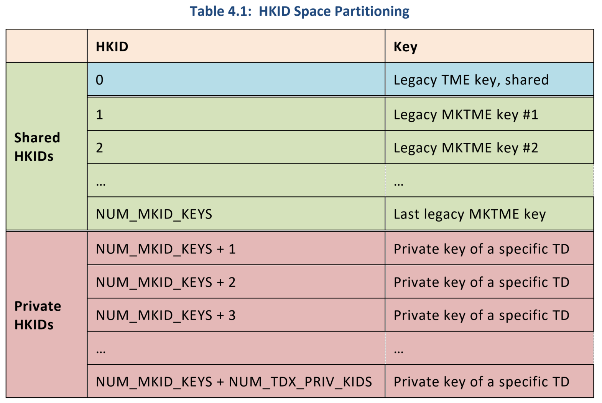

# TDX Host Kernel Support (v15)

## [PATCH 01/23] x86/virt/tdx: Detect TDX during kernel boot

* TDX 可保护 guest 虚拟机免受恶意主机和某些物理攻击。一个经过 CPU 认证的软件模块（称为“TDX module”）在新的隔离内存范围内运行，作为受信任的 hypervisor 来管理和运行受保护的虚拟机。
* TDX 之前的 Intel 硬件支持名为 MKTME 的内存加密架构。支持 MKTME 的内存加密硬件也用于 Intel TDX。
  * TDX 最终从 MKTME 架构中“窃取”一些物理地址空间，用于对虚拟机进行加密保护。
  * BIOS 负责在传统 MKTME 和 TDX 之间划分“KeyID”空间。
  * 为 TDX 保留的 KeyID 被称为“TDX private KeyID”或简称为“TDX KeyID”。
* 在机器启动期间，TDX 微码会验证 BIOS 编程的 TDX private KeyID 是否在所有 CPU package 中一致且正确地编程。验证后，MSR 被锁定在该状态。
  * 这就是为什么 `MSR_IA32_MKTME_KEYID_PARTITIONING` 用于 TDX 枚举：它不仅表明硬件支持 TDX，而且表明所有启动时安全检查都已通过。
* TDX module 期望会在启用 TDX 时由 BIOS 加载，但内核需要正确初始化它，然后才能使用它来创建和运行任何 TDX guest。
  * 当 KVM 想要使用 TDX 时，TDX module 将由 KVM 子系统初始化。
* 添加新的 `early_initcall(tdx_init)` 以通过检测 TDX private KeyIDs 来检测 TDX。还添加了报告 BIOS 是否启用 TDX 的功能。与 AMD SME 类似，`kexec()` 将使用它来确定是否需要缓存刷新。
* TDX module 本身需要一个 TDX KeyID 作为“TDX global KeyID”来保护其元数据。
  * 每个 TDX guest 还需要一个 TDX KeyID 来保护自己。
  * 只需使用第一个 TDX KeyID 作为全局 KeyID，其余的留给 TDX guest。
  * 如果没有为 TDX guest 留下 TDX KeyID 则禁用 TDX，因为单独初始化 TDX module 是无用的。
---
* 新增函数 `record_keyid_partitioning()` 记录 KeyID 的分区
* 按照设计，加密 keys 和它们关联的 HKIDs 被分为三个范围。
  * `NUM_MKID_KEYS` 和 `NUM_TDX_PRIV_KEYS` 的值从 `IA32_MKTME_KEYID_PARTITIONING` MSR（`0x87`）读出。
  * Bit `[31:0]`：MKTME 的 KeyID 数目
  * Bit `[63:32]`：TDX 的 private KeyID 数目



```cpp
/* KeyID partitioning between MKTME and TDX */
#define MSR_IA32_MKTME_KEYID_PARTITIONING   0x00000087

static int __init record_keyid_partitioning(u32 *tdx_keyid_start,
                        u32 *nr_tdx_keyids)
{
    u32 _nr_mktme_keyids, _tdx_keyid_start, _nr_tdx_keyids;
    int ret;

    /*
     * IA32_MKTME_KEYID_PARTIONING:
     *   Bit [31:0]:    Number of MKTME KeyIDs.
     *   Bit [63:32]:   Number of TDX private KeyIDs.
     */
    ret = rdmsr_safe(MSR_IA32_MKTME_KEYID_PARTITIONING, &_nr_mktme_keyids,
            &_nr_tdx_keyids);
    if (ret)
        return -ENODEV;

    if (!_nr_tdx_keyids)
        return -ENODEV;
    //TDX KeyIDs 从最后一个 MKTME KeyID 开始
    /* TDX KeyIDs start after the last MKTME KeyID. */
    _tdx_keyid_start = _nr_mktme_keyids + 1;
    //得到 TDX KeyIDs 的开始 ID 和 ID 数目
    *tdx_keyid_start = _tdx_keyid_start;
    *nr_tdx_keyids = _nr_tdx_keyids;

    return 0;
}
```
* 新增函数 `tdx_init()` 通过检测 TDX private KeyIDs 来检测 TDX
* 启用 `CONFIG_INTEL_TDX_HOST` 才会增加 arch/x86/virt/vmx/tdx 目录的支持，因此 guest kernel 不会通过 `early_initcall()` 调用 `tdx_init()`
* 从代码实现可见，将第一个 TDX KeyID 作为“全局 KeyID” `tdx_global_keyid = tdx_keyid_start`，是软件上的选择
* arch/x86/virt/vmx/tdx/tdx.c
```cpp
static int __init tdx_init(void)
{
    u32 tdx_keyid_start, nr_tdx_keyids;
    int err;

    err = record_keyid_partitioning(&tdx_keyid_start, &nr_tdx_keyids);
    if (err)
        return err;
    //Host kernel 的 dmesg 中会看到 TDX private KeyID 的范围
    pr_info("BIOS enabled: private KeyID range [%u, %u)\n",
            tdx_keyid_start, tdx_keyid_start + nr_tdx_keyids);
    //TDX module 本身需要一个 TDX KeyID 作为“TDX global KeyID”来保护其元数据。如果只有一个 TDX private KeyID 的话，其他 TDX guest 就没得用了。
    /*
     * The TDX module itself requires one 'global KeyID' to protect
     * its metadata.  If there's only one TDX KeyID, there won't be
     * any left for TDX guests thus there's no point to enable TDX
     * at all.
     */
    if (nr_tdx_keyids < 2) {
        pr_err("initialization failed: too few private KeyIDs available.\n");
        return -ENODEV;
    }

    /*
     * At this point, hibernation_available() indicates whether or
     * not hibernation support has been permanently disabled.
     */
    if (hibernation_available()) {
        pr_err("initialization failed: Hibernation support is enabled\n");
        return -ENODEV;
    }

    err = register_memory_notifier(&tdx_memory_nb);
    if (err) {
        pr_err("initialization failed: register_memory_notifier() failed (%d)\n",
                err);
        return -ENODEV;
    }

    err = register_reboot_notifier(&tdx_reboot_nb);
    if (err) {
        pr_err("initialization failed: register_reboot_notifier() failed (%d)\n",
                err);
        unregister_memory_notifier(&tdx_memory_nb);
        return -ENODEV;
    }

#if defined(CONFIG_ACPI) && defined(CONFIG_SUSPEND)
    pr_info("Disable ACPI S3. Turn off TDX in the BIOS to use ACPI S3.\n");
    acpi_suspend_lowlevel = NULL;
#endif
    //只用第一个 TDX KeyID 作为“全局 KeyID” 并将余下的留给 TDX guests
    /*
     * Just use the first TDX KeyID as the 'global KeyID' and
     * leave the rest for TDX guests.
     */
    tdx_global_keyid = tdx_keyid_start;
    tdx_guest_keyid_start = tdx_keyid_start + 1;
    tdx_nr_guest_keyids = nr_tdx_keyids - 1;

    return 0;
}
early_initcall(tdx_init);
```

* 增加新函数 `platform_tdx_enabled()`返回平台是否使能 TDX。
  * 判断的方法是 BIOS 是否配置了 TDX module 需要的作为“TDX global KeyID” 的 TDX KeyID。
  * `tdx_global_keyid` 的初始值是零。由以上实现可见，如果成功配置了 TDX global KeyID，`tdx_global_keyid` 的值必然不是零。
```cpp
/* Return whether the BIOS has enabled TDX */
bool platform_tdx_enabled(void)
{
    return !!tdx_global_keyid;
}
```

## [PATCH 02/23] x86/tdx: Define TDX supported page sizes as macros

* TDX 支持 4K、2M 和 1G 页面大小。相应的值由 TDX module spec 定义并用作 TDX module ABI。
* 目前，当 TDX guest 尝试接受页面时，它们在 `try_accept_one()` 中使用。然而，目前 `try_accept_one()` 使用 hard-coded 的 magic values。
* 将 TDX 支持的页面大小定义为宏，并摆脱 `try_accept_one()` 中的 hard-coded 的值。TDX host 支持也需要使用它们。
---
* 新增以下宏，以代表 TDX 支持 4K、2M 和 1G 页面大小相应的值
```diff
diff --git a/arch/x86/include/asm/shared/tdx.h b/arch/x86/include/asm/shared/tdx.h
index ccce7ebd8677..a4036149c484 100644
--- a/arch/x86/include/asm/shared/tdx.h
+++ b/arch/x86/include/asm/shared/tdx.h
@@ -55,6 +55,11 @@
    (TDX_RDX | TDX_RBX | TDX_RSI | TDX_RDI | TDX_R8  | TDX_R9  | \
     TDX_R10 | TDX_R11 | TDX_R12 | TDX_R13 | TDX_R14 | TDX_R15)

+/* TDX supported page sizes from the TDX module ABI. */
+#define TDX_PS_4K  0
+#define TDX_PS_2M  1
+#define TDX_PS_1G  2
+
 #ifndef __ASSEMBLY__

 #include <linux/compiler_attributes.h>
```
* 以下改动是针对 guest 的，但这几个宏是 TDX host 也会用到的
```diff
diff --git a/arch/x86/coco/tdx/tdx-shared.c b/arch/x86/coco/tdx/tdx-shared.c
index 78e413269791..1655aa56a0a5 100644
--- a/arch/x86/coco/tdx/tdx-shared.c
+++ b/arch/x86/coco/tdx/tdx-shared.c
@@ -22,13 +22,13 @@ static unsigned long try_accept_one(phys_addr_t start, unsigned long len,
     */
    switch (pg_level) {
    case PG_LEVEL_4K:
-       page_size = 0;
+       page_size = TDX_PS_4K;
        break;
    case PG_LEVEL_2M:
-       page_size = 1;
+       page_size = TDX_PS_2M;
        break;
    case PG_LEVEL_1G:
-       page_size = 2;
+       page_size = TDX_PS_1G;
        break;
    default:
        return 0;
```

## [PATCH 03/23] x86/virt/tdx: Make INTEL_TDX_HOST depend on X86_X2APIC
* 支持 TDX 的平台被锁定到 X2APIC 模式，并且在 BIOS 启用 TDX 时无法回退到 legacy xAPIC 模式。
* TDX host 支持需要 x2APIC。因此，使 `INTEL_TDX_HOST` 依赖于 `X86_X2APIC`。
* Link: https://lore.kernel.org/lkml/ba80b303-31bf-d44a-b05d-5c0f83038798@intel.com/
```diff
diff --git a/arch/x86/Kconfig b/arch/x86/Kconfig
index 3762f41bb092..eb6e63956d51 100644
--- a/arch/x86/Kconfig
+++ b/arch/x86/Kconfig
@@ -1970,6 +1970,7 @@ config INTEL_TDX_HOST
    depends on CPU_SUP_INTEL
    depends on X86_64
    depends on KVM_INTEL
+   depends on X86_X2APIC
    help
      Intel Trust Domain Extensions (TDX) protects guest VMs from malicious
      host and certain physical attacks.  This option enables necessary TDX
```

## [PATCH 04/23] x86/cpu: Detect TDX partial write machine check erratum
* TDX 内存具有完整性和机密性保护。违反这种完整性保护只会影响 TDX 操作，而不会影响 host kernel 本身。换句话说，host kernel 本身不应该看到由 TDX 完整性硬件引起的 machine checks。
* 遗憾的是，前几代 TDX 硬件有一个 erratum。对 TDX private 的 memory cacheline 的部分写入会默默地“poison”该行。后续的读取操作将消费该 poison 并生成 machine check。根据 TDX 硬件规范，这两件事都不应该发生。
* 事实上，所有内核内存访问操作都发生在完整的 cacheline 中。实际上，写入一个“字节”内存通常会读取内存的 `64` 字节 cacheline，对其进行修改，然后将整行写回。这些操作不会触发此问题。
* 此问题是由“部分”写入触发的，此处一个小于 cacheline 的写入事务到达内存控制器。CPU 通过 non-temporal 写指令（如 `MOVNTI`）或通过 `UC/WC` 内存映射来完成这些操作。通过 DMA 进行部分写入的设备也可能触发该问题，而不是来自 CPU。
* 因为有这个 erratum，还需要做一些额外的事情。为了准备这些更改，添加一个 CPU bug bit 来指示此 erratum。
* 请注意，此错误反映了硬件，因此无论内核是否构建有 TDX 支持，都会检测到该错误。
---
```diff
diff --git a/arch/x86/include/asm/cpufeatures.h b/arch/x86/include/asm/cpufeatures.h
index 4af140cf5719..d097e558e079 100644
--- a/arch/x86/include/asm/cpufeatures.h
+++ b/arch/x86/include/asm/cpufeatures.h
@@ -495,6 +495,7 @@
 #define X86_BUG_EIBRS_PBRSB        X86_BUG(28) /* EIBRS is vulnerable to Post Barrier RSB Predictions */
 #define X86_BUG_SMT_RSB            X86_BUG(29) /* CPU is vulnerable to Cross-Thread Return Address Predictions */
 #define X86_BUG_GDS            X86_BUG(30) /* CPU is affected by Gather Data Sampling */
+#define X86_BUG_TDX_PW_MCE     X86_BUG(31) /* CPU may incur #MC if non-TD software does partial write to TDX private memory */

 /* BUG word 2 */
 #define X86_BUG_SRSO           X86_BUG(1*32 + 0) /* AMD SRSO bug */
```
* 新增函数 `check_tdx_erratum()`，对于 SPR 和 EMR 的 Intel CPU 设置 CPU bug bit `X86_BUG_TDX_PW_MCE`
* 对于这些 CPU，来自 **非 TD 软件** 对与 TDX private 内存处于同一 cacheline 的 *部分写*，会导致 `#MC`
```cpp
static void check_tdx_erratum(struct cpuinfo_x86 *c)
{
    /*
     * These CPUs have an erratum.  A partial write from non-TD
     * software (e.g. via MOVNTI variants or UC/WC mapping) to TDX
     * private memory poisons that memory, and a subsequent read of
     * that memory triggers #MC.
     */
    switch (c->x86_model) {
    case INTEL_FAM6_SAPPHIRERAPIDS_X:
    case INTEL_FAM6_EMERALDRAPIDS_X:
        setup_force_cpu_bug(X86_BUG_TDX_PW_MCE);
    }
}
```
* 在 `early_init_intel()` 的时候引入该检查
```diff
@@ -322,6 +337,8 @@ static void early_init_intel(struct cpuinfo_x86 *c)
     */
    if (detect_extended_topology_early(c) < 0)
        detect_ht_early(c);
+
+   check_tdx_erratum(c);
 }

 static void bsp_init_intel(struct cpuinfo_x86 *c)
```

## [PATCH 05/23] x86/virt/tdx: Handle SEAMCALL no entropy error in common code
* 某些 SEAMCALL 使用 `RDRAND` 硬件，并且可能会因与 `RDRAND` 相同的原因而失败。对它们使用内核 `RDRAND` 重试逻辑。
* `__seamcall*()` 共有三种变体。在通用代码中执行 SEAMCALL 重试，并为它们添加一个 wrapper。
---
* SEAMCALL 如果是因为读取随机数时熵耗尽而出错，进行 10 次重试
```cpp
#define TDX_RND_NO_ENTROPY  0x8000020300000000ULL //读取随机数时熵耗尽错误码

#include <asm/archrandom.h> //定义 #define RDRAND_RETRY_LOOPS 10 来自这里

typedef u64 (*sc_func_t)(u64 fn, struct tdx_module_args *args);

static inline u64 sc_retry(sc_func_t func, u64 fn,
               struct tdx_module_args *args)
{
    int retry = RDRAND_RETRY_LOOPS;
    u64 ret;

    do {
        ret = func(fn, args);
    } while (ret == TDX_RND_NO_ENTROPY && --retry);

    return ret;
}

#define seamcall(_fn, _args)        sc_retry(__seamcall, (_fn), (_args))
#define seamcall_ret(_fn, _args)    sc_retry(__seamcall_ret, (_fn), (_args))
#define seamcall_saved_ret(_fn, _args)  sc_retry(__seamcall_saved_ret, (_fn), (_args))
```

## [PATCH 06/23] x86/virt/tdx: Add SEAMCALL error printing for module initialization
* TDX module 初始化期间涉及的 SEAMCALL 预计不会失败。事实上，它们不会返回任何非零代码（“熵耗尽错误”除外，该错误已经可以在内部处理）。
* 添加另一组 SEAMCALL wrappers，它将所有非零返回代码视为错误，以支持在模块初始化失败时打印 SEAMCALL 错误。
  * 请注意，TDX module 初始化不使用 `_saved_ret()` 变体，因此没有为其添加 wrapper。
* 对于三种特殊情况，SEAMCALL 汇编代码还可以返回内核定义的错误代码：
  1. BIOS 未启用 TDX；
  2. TDX module 未加载；
  3. CPU 未处于 VMX operation 中。
* 它们是否合法发生取决于调用者，因此留给调用者在需要时打印错误消息。
* 并且，将 SEAMCALL 错误代码转换为新 wrapper 中的内核错误代码，以便每个 SEAMCALL 调用方不必重复转换。
---
* 新增统一的 retry、错误码转换、错误打印函数 `sc_retry_prerr()`
```cpp
#define TDX_SUCCESS        0ULL

typedef void (*sc_err_func_t)(u64 fn, u64 err, struct tdx_module_args *args);

static inline void seamcall_err(u64 fn, u64 err, struct tdx_module_args *args)
{
    pr_err("SEAMCALL (0x%llx) failed: 0x%llx\n", fn, err);
}

static inline void seamcall_err_ret(u64 fn, u64 err,
                    struct tdx_module_args *args)
{
    seamcall_err(fn, err, args);
    pr_err("RCX 0x%llx RDX 0x%llx R8 0x%llx R9 0x%llx R10 0x%llx R11 0x%llx\n",
            args->rcx, args->rdx, args->r8, args->r9,
            args->r10, args->r11);
}

static inline int sc_retry_prerr(sc_func_t func, sc_err_func_t err_func,
                 u64 fn, struct tdx_module_args *args)
{
    u64 sret = sc_retry(func, fn, args);

    if (sret == TDX_SUCCESS)
        return 0;

    if (sret == TDX_SEAMCALL_VMFAILINVALID)
        return -ENODEV;

    if (sret == TDX_SEAMCALL_GP)
        return -EOPNOTSUPP;

    if (sret == TDX_SEAMCALL_UD)
        return -EACCES;

    err_func(fn, sret, args);
    return -EIO;
}

#define seamcall_prerr(__fn, __args)                        \
    sc_retry_prerr(__seamcall, seamcall_err, (__fn), (__args))

#define seamcall_prerr_ret(__fn, __args)                    \
    sc_retry_prerr(__seamcall_ret, seamcall_err_ret, (__fn), (__args))
```

## [PATCH 07/23] x86/virt/tdx: Add skeleton to enable TDX on demand
* 为了启用 TDX，内核需要从两个角度初始化 TDX：
  1. 执行一组 SEAMCALL 来初始化 TDX module，使其准备好创建和运行 TDX guest；
  2. 在内核想要在该 CPU 上进行任何其他 SEAMCALL 之前（包括在 module 初始化和运行 TDX guest 期间涉及的那些 SEAMCALL），在每一个逻辑 CPU 上执行 per-cpu 初始化 SEAMCALL。

* TDX module 在其生命周期内只能初始化一次。该实现不是总是在启动时初始化它，而是选择“按需”方法来初始化 TDX，直到有真正的需要（例如，当 KVM 请求时）。这种方法有以下优点：
  1. 避免消耗必须由内核分配并作为元数据提供给 TDX module 的内存（约 TDX 可用内存的 `1/256`），并且还节省了当根本不使用 TDX 时初始化 TDX module（和元数据）的 CPU 周期。
  2. TDX module 设计允许在系统运行时进行更新。更新过程与这种“按需”初始化机制共享相当多的步骤。希望“按需”机制的大部分内容可以与未来的“更新”机制共享。启动时 TDX module 实现无法与更新机制共享太多代码。
  3. 进行 SEAMCALL 需要启用 VMX。目前，只有 KVM 代码与 VMX 启用有关。如果 TDX module 与 KVM 分开初始化（例如在启动时），则需要教导引导代码如何使用 VMX 启用，并且需要教导 KVM 如何处理该问题。让 KVM 本身负责 TDX 初始化，可以让内核的其余部分完全不知道 VMX。

* 与 module 初始化类似，还可以“按需”进行 per-CPU 的初始化，因为它也取决于启用的 VMX。
* 添加两个函数 `tdx_enable()` 和 `tdx_cpu_enable()`，分别启用 TDX module 和在 local CPU 上启用 TDX。目前 `tdx_enable()` 是一个占位符。随着功能的添加，待办事项列表将被缩减。
* 导出 `tdx_cpu_enable()` 和 `tdx_enable()` 以供 KVM 使用。
* 在 `tdx_enable()` 中，使用受 mutex 保护的状态机来确保初始化只会完成一次，因为 `tdx_enable()` 可以被多次调用（即 KVM 模块可以重新加载），并且将来可以被内核中的其他内核组件并发调用。
* 在 module 的生命周期内，每个 CPU 上的 per-cpu 初始化只能完成一次。使用一个 per-cpu 变量来跟踪其状态，以确保它仅在 `tdx_cpu_enable()` 中完成一次。
* 此外，在任何 per-cpu 初始化 SEAMCALL 之前，必须在任何逻辑 CPU 上执行一次用于执行 TDX module 全局初始化的 SEAMCALL。也在 `tdx_cpu_enable()` 内部执行此操作（如果尚未执行）。
* `tdx_enable()` 可能会在任何 online CPU 上调用 SEAMCALL。Per-cpu 的初始化必须在某些 CPU 上调用这些 SEAMCALL 之前完成。为了简单起见，
  * 在 `tdx_cpu_enable()` 中，无论 TDX module 是否已初始化，始终执行 per-CPU 的初始化。
  * 在 `tdx_enable()` 中，不要调用 `tdx_cpu_enable()`，但假设调用者已禁用 CPU 热插拔，在调用 `tdx_enable()` 之前在所有 online CPU 上完成 `VMXON` 和 `tdx_cpu_enable()`。
---

### `tdx_cpu_enable()`
* 新增函数 `try_init_module_global()` 在任何逻辑 CPU 上执行一次用于执行 TDX module 全局初始化的 SEAMCALL，必须任何 per-cpu 初始化 SEAMCALL 之前执行此步骤
  * 它可以在任何 CPU 上完成
  * 总是在中断禁用的情况下调用该函数
```cpp
//arch/x86/virt/vmx/tdx/tdx.h
#define TDH_SYS_INIT       33

/*
 * Do the module global initialization once and return its result.
 * It can be done on any cpu.  It's always called with interrupts
 * disabled.
 */
static int try_init_module_global(void)
{
    struct tdx_module_args args = {};
    static DEFINE_RAW_SPINLOCK(sysinit_lock);
    static bool sysinit_done; //本地静态变量记录 module 已全局初始化过了
    static int sysinit_ret;   //本地静态变量记录 module 全局初始化的返回值

    lockdep_assert_irqs_disabled();

    raw_spin_lock(&sysinit_lock);
    //module 是否已全局初始化过了？
    if (sysinit_done)
        goto out;

    /* RCX is module attributes and all bits are reserved */
    args.rcx = 0;
    sysinit_ret = seamcall_prerr(TDH_SYS_INIT, &args);
    //第一个 SEAMCALL 还会检测 TDX module，因此可能会因未加载 TDX module 而失败。Dump 消息以让用户知道
    /*
     * The first SEAMCALL also detects the TDX module, thus
     * it can fail due to the TDX module is not loaded.
     * Dump message to let the user know.
     */
    if (sysinit_ret == -ENODEV)
        pr_err("module not loaded\n");

    sysinit_done = true;
out:
    raw_spin_unlock(&sysinit_lock);
    return sysinit_ret;
}
```
* `tdx_cpu_enable()` 在 local CPU 上启用 TDX
  * 在 local CPU 上执行一次 TDX module per-cpu 初始化 SEAMCALL（如果未完成 TDX module 全局初始化，则执行相应的 SEAMCALL），以使该 CPU 准备好运行任何其他 SEAMCALL
  * 始终通过 IPI 函数调用来调用此函数
  * 总是在中断禁用的情况下调用该函数
* 在 module 的生命周期内，每个 CPU 上的 per-cpu 初始化只能完成一次。使用一个 per-cpu 变量 `tdx_lp_initialized` 来跟踪其状态，以确保它仅在 `tdx_cpu_enable()` 中完成一次。
```cpp
#define TDH_SYS_LP_INIT     35

static DEFINE_PER_CPU(bool, tdx_lp_initialized);

/**
 * tdx_cpu_enable - Enable TDX on local cpu
 *
 * Do one-time TDX module per-cpu initialization SEAMCALL (and TDX module
 * global initialization SEAMCALL if not done) on local cpu to make this
 * cpu be ready to run any other SEAMCALLs.
 *
 * Always call this function via IPI function calls.
 *
 * Return 0 on success, otherwise errors.
 */
int tdx_cpu_enable(void)
{
    struct tdx_module_args args = {};
    int ret;
    //BIOS 未正确设置平台的 TDX 配置
    if (!platform_tdx_enabled())
        return -ENODEV;
    //总是在中断禁用的情况下调用该函数
    lockdep_assert_irqs_disabled();

    if (__this_cpu_read(tdx_lp_initialized))
        return 0;
    //TDX module 全局初始化是启用 TDX 的第一步。在每个 CPU 初始化之前需要先执行此操作（如果尚未执行）
    /*
     * The TDX module global initialization is the very first step
     * to enable TDX.  Need to do it first (if hasn't been done)
     * before the per-cpu initialization.
     */
    ret = try_init_module_global();
    if (ret)
        return ret;
    //在 local CPU 上启用 TDX
    ret = seamcall_prerr(TDH_SYS_LP_INIT, &args);
    if (ret)
        return ret;
    //记录在 per-cpu 变量，确保 per-cpu 的 TDX 初始化仅执行一次
    __this_cpu_write(tdx_lp_initialized, true);

    return 0;
}
EXPORT_SYMBOL_GPL(tdx_cpu_enable);
```

### `tdx_enable()`
* 新增 `tdx_enable()` 启用 TDX module 以使其准备好运行 TDX guest。该函数假设调用者已经：
  1. 持有 CPU 热插拔锁的读锁，以防止任何新的 cpu online；
  2. 在所有 online cpu 上完成 `VMXON` 和 `tdx_cpu_enable()`。
* 该函数要求每个 CPU package 至少有一个 online CPU 才能成功。
* 该函数可以由多个调用者并行调用。
```cpp
//arch/x86/virt/vmx/tdx/tdx.h
/* Kernel defined TDX module status during module initialization. */
enum tdx_module_status_t {
    TDX_MODULE_UNINITIALIZED,
    TDX_MODULE_INITIALIZED,
    TDX_MODULE_ERROR
};

static enum tdx_module_status_t tdx_module_status;
static DEFINE_MUTEX(tdx_module_lock);
...
static int __tdx_enable(void)
{
    int ret;
    //正在重启，由 tdx_init() 时注册 struct notifier_block tdx_reboot_nb 的回调设置
    if (tdx_rebooting)
        return -EAGAIN;

    ret = init_tdx_module();
    if (ret) {
        pr_err("module initialization failed (%d)\n", ret);
        tdx_module_status = TDX_MODULE_ERROR;
        return ret;
    }

    pr_info("module initialized\n");
    tdx_module_status = TDX_MODULE_INITIALIZED;

    return 0;
}

/**
 * tdx_enable - Enable TDX module to make it ready to run TDX guests
 *
 * This function assumes the caller has: 1) held read lock of CPU hotplug
 * lock to prevent any new cpu from becoming online; 2) done both VMXON
 * and tdx_cpu_enable() on all online cpus.
 *
 * This function requires there's at least one online cpu for each CPU
 * package to succeed.
 *
 * This function can be called in parallel by multiple callers.
 *
 * Return 0 if TDX is enabled successfully, otherwise error.
 */
int tdx_enable(void)
{
    int ret;

    if (!platform_tdx_enabled())
        return -ENODEV;

    lockdep_assert_cpus_held();

    mutex_lock(&tdx_module_lock);

    switch (tdx_module_status) {
    case TDX_MODULE_UNINITIALIZED:
        ret = __tdx_enable();
        break;
    case TDX_MODULE_INITIALIZED:
        /* Already initialized, great, tell the caller. */
        ret = 0;
        break;
    default:
        /* Failed to initialize in the previous attempts */
        ret = -EINVAL;
        break;
    }

    mutex_unlock(&tdx_module_lock);

    return ret;
}
EXPORT_SYMBOL_GPL(tdx_enable);
```
* 将来会有 patchset 调用 `tdx_enable()`，调用处如下：
```cpp
1 arch/x86/kvm/vmx/tdx.c|4906| <<tdx_module_setup>> ret = tdx_enable();
2 arch/x86/virt/vmx/tdx/tdx.c|1556| <<tdx_init_early>> ret = tdx_enable();
```
* 在该 patch 中引入的 `init_tdx_module()` 仅是个占位符，
```cpp
static int init_tdx_module(void)
{
   /*
    * TODO:
    *
    *  - Build the list of TDX-usable memory regions.
    *  - Get TDX module "TD Memory Region" (TDMR) global metadata.
    *  - Construct a list of TDMRs to cover all TDX-usable memory
    *    regions.
    *  - Configure the TDMRs and the global KeyID to the TDX module.
    *  - Configure the global KeyID on all packages.
    *  - Initialize all TDMRs.
    *
    *  Return error before all steps are done.
    */
   return -EINVAL;
}
```

## [PATCH 08/23] x86/virt/tdx: Use all system memory when initializing TDX module as TDX memory
* 作为初始化 TDX module 的步骤，内核需要告诉 TDX module 哪些内存区域可以被 TDX module 用作 TDX guest 内存。
* TDX 报告“可转换内存区域”（Convertible Memory Region，CMR）列表，以告诉内核哪些内存与 TDX 兼容。
  * 内核需要构建一个内存区域列表（CMR 之外）作为“TDX 可用”内存，并将它们传递给 TDX module。
  * 完成此操作后，那些“TDX 可用”内存区域将在 module 的生命周期内固定。
* 为了简单起见，假设所有 TDX 保护的内存都来自页面分配器。确保页面分配器中的所有页面都 **是** TDX 可用的内存。
* 由于 TDX 可用内存是固定配置，因此在 module 初始化时从 memblocks 中获取内存配置的快照（memblocks 在内存热插拔时进行修改）。
  * 此快照仅用于启用 *此* 内存配置的 TDX 支持。
  * 使用内存热插拔 notifier 来确保在此配置之外无法添加其他 RAM。
* 此方法要求 module 初始化时的所有 memblock 内存区域都是 TDX 可转换内存才能工作，否则在稍后的 SEAMCALL 中将这些区域传递给 module 时，module 初始化将失败。
  * 当所有启动时“系统 RAM”都是 TDX 可转换内存，并且在 module 初始化之前没有将非 TDX 可转换内存 hot-added 到 core-mm 时，此方法有效。
* 例如，在第一代 TDX 机器上，CXL 内存和 NVDIMM 都不是 TDX 可转换内存。在 module 初始化之前使用 kmem 驱动程序将任何 CXL 内存或 NVDIMM hot-added 到 core-mm 将导致 module 初始化失败。SEAMCALL 错误码将在 dmesg 中提供，以帮助用户了解故障。
---
```diff
diff --git a/arch/x86/Kconfig b/arch/x86/Kconfig
index eb6e63956d51..2c69ef844805 100644
--- a/arch/x86/Kconfig
+++ b/arch/x86/Kconfig
@@ -1971,6 +1971,7 @@ config INTEL_TDX_HOST
    depends on X86_64
    depends on KVM_INTEL
    depends on X86_X2APIC
+   select ARCH_KEEP_MEMBLOCK
    help
      Intel Trust Domain Extensions (TDX) protects guest VMs from malicious
      host and certain physical attacks.  This option enables necessary TDX
diff --git a/arch/x86/kernel/setup.c b/arch/x86/kernel/setup.c
index 1526747bedf2..9597c002b3c4 100644
--- a/arch/x86/kernel/setup.c
+++ b/arch/x86/kernel/setup.c
@@ -1033,6 +1033,8 @@ void __init setup_arch(char **cmdline_p)
     *
     * Moreover, on machines with SandyBridge graphics or in setups that use
     * crashkernel the entire 1M is reserved anyway.
+    *
+    * Note the host kernel TDX also requires the first 1MB being reserved.
     */
    x86_platform.realmode_reserve();
```
### TDX 可用内存区域相关的一些操作函数
* 引入结构体 `struct tdx_memblock` 描述 TDX 所用的 memblock
* arch/x86/virt/vmx/tdx/tdx.h
```cpp
struct tdx_memblock {
    struct list_head list;   //链表节点
    unsigned long start_pfn;
    unsigned long end_pfn;
    int nid;
};
```
* 引入全局链表 `tdx_memlist` 把 TDX 可用内存区域链起来，需要内存热插入锁 `mem_hotplug_lock` 的保护
* 新增函数 `add_tdx_memblock()` 添加内存区域作为 TDX memory block。调用者必须确保所有内存区域都 **按地址升序添加** 并且 **不重叠**
* 新增函数 `free_tdx_memlist()` 释放 TDX memory block 内存区域
```cpp
/* All TDX-usable memory regions.  Protected by mem_hotplug_lock. */
static LIST_HEAD(tdx_memlist);

/*
 * Add a memory region as a TDX memory block.  The caller must make sure
 * all memory regions are added in address ascending order and don't
 * overlap.
 */
static int add_tdx_memblock(struct list_head *tmb_list, unsigned long start_pfn,
                unsigned long end_pfn, int nid)
{
    struct tdx_memblock *tmb;

    tmb = kmalloc(sizeof(*tmb), GFP_KERNEL);
    if (!tmb)
        return -ENOMEM;

    INIT_LIST_HEAD(&tmb->list);
    tmb->start_pfn = start_pfn;
    tmb->end_pfn = end_pfn;
    tmb->nid = nid;

    /* @tmb_list is protected by mem_hotplug_lock */
    list_add_tail(&tmb->list, tmb_list);
    return 0;
}

static void free_tdx_memlist(struct list_head *tmb_list)
{
    /* @tmb_list is protected by mem_hotplug_lock */
    while (!list_empty(tmb_list)) {
        struct tdx_memblock *tmb = list_first_entry(tmb_list,
                struct tdx_memblock, list);

        list_del(&tmb->list);
        kfree(tmb);
    }
}
```
* 新增函数 `build_tdx_memlist()` 构建 TDX memblock 链表
  * 确保所有 memblock 内存区域均可转换为 TDX 内存。一旦建立，将 memblock 范围存储在二级结构中，因为 memblock 在内存热插拔中被修改，而 TDX 内存区域是固定的。
  * `for_each_mem_pfn_range(i, MAX_NUMNODES, ...)` 遍历所有的 NUMA nodes 上的 memblock 来取得这个范围
* 第一个 `1MB` 未报告为 TDX 可转换内存。尽管第一个 `1MB` 始终被保留并且不会最终到达页面分配器，但它仍然位于 memblock 的内存区域中。手动跳过它们以将它们排除为 TDX 内存。
```cpp
/*
 * Ensure that all memblock memory regions are convertible to TDX
 * memory.  Once this has been established, stash the memblock
 * ranges off in a secondary structure because memblock is modified
 * in memory hotplug while TDX memory regions are fixed.
 */
static int build_tdx_memlist(struct list_head *tmb_list)
{
    unsigned long start_pfn, end_pfn;
    int i, nid, ret;

    for_each_mem_pfn_range(i, MAX_NUMNODES, &start_pfn, &end_pfn, &nid) {
        /*
         * The first 1MB is not reported as TDX convertible memory.
         * Although the first 1MB is always reserved and won't end up
         * to the page allocator, it is still in memblock's memory
         * regions.  Skip them manually to exclude them as TDX memory.
         */
        start_pfn = max(start_pfn, PHYS_PFN(SZ_1M));
        if (start_pfn >= end_pfn)
            continue;
        //将内存区域添加为 TDX 内存。memblock 中的区域已经保证它们按地址升序排列并且不重叠。
        /*
         * Add the memory regions as TDX memory.  The regions in
         * memblock has already guaranteed they are in address
         * ascending order and don't overlap.
         */
        ret = add_tdx_memblock(tmb_list, start_pfn, end_pfn, nid);
        if (ret)
            goto err;
    }

    return 0;
err:
    free_tdx_memlist(tmb_list);
    return ret;
}
```

### 修改 `init_tdx_module()`，构建 TDX 可用内存区域链表
* 为了简单起见，假设所有 TDX 保护的内存都来自页面分配器。确保页面分配器中的所有页面都是 TDX 可用的内存。
* 构建“TDX可用”内存区域列表，该列表覆盖页面分配器中的所有页面以保证这一点。
  * 调用 `get_online_mems()` 在持有 `mem_hotplug_lock` 读锁的同时执行此操作，因为内存热插拔代码路径读取 `tdx_memlist` 以拒绝任何新内存。
  * 调用 `put_online_mems()` `tdx_memlist` 在内存热插拔时读取并在此处写入。在构建内存热插拔代码时锁定它。
```diff
 static int init_tdx_module(void)
 {
+   int ret;
+
+   /*
+    * To keep things simple, assume that all TDX-protected memory
+    * will come from the page allocator.  Make sure all pages in the
+    * page allocator are TDX-usable memory.
+    *
+    * Build the list of "TDX-usable" memory regions which cover all
+    * pages in the page allocator to guarantee that.  Do it while
+    * holding mem_hotplug_lock read-lock as the memory hotplug code
+    * path reads the @tdx_memlist to reject any new memory.
+    */
+   get_online_mems();
+
+   ret = build_tdx_memlist(&tdx_memlist);
+   if (ret)
+       goto out_put_tdxmem;
+
    /*
     * TODO:
     *
-    *  - Build the list of TDX-usable memory regions.
     *  - Get TDX module "TD Memory Region" (TDMR) global metadata.
     *  - Construct a list of TDMRs to cover all TDX-usable memory
     *    regions.
@@ -168,7 +267,14 @@ static int init_tdx_module(void)
     *
     *  Return error before all steps are done.
     */
-   return -EINVAL;
+   ret = -EINVAL;
+out_put_tdxmem:
+   /*
+    * @tdx_memlist is written here and read at memory hotplug time.
+    * Lock out memory hotplug code while building it.
+    */
+   put_online_mems();
+   return ret;
 }
```

### 引入 `is_tdx_memory()`
* `is_tdx_memory()` 判断给定 PFN 是否属于 TDX 内存范围
* 此检查假设 `start_pfn<->end_pfn` 范围不跨越多个 `tdx_memlist` 条目。
  * 跨多个 memblock（在 module 初始化时从中派生 `tdx_memlist` 条目）的单个内存 online 事件是不可能的。
  * 这是因为内存 offline/online 是在 `struct memory_block` 的粒度上完成的，并且可热插拔内存区域（一个 memblock）必须是 memory_block 的倍数。
```cpp
static bool is_tdx_memory(unsigned long start_pfn, unsigned long end_pfn)
{
    struct tdx_memblock *tmb;

    /*
     * This check assumes that the start_pfn<->end_pfn range does not
     * cross multiple @tdx_memlist entries.  A single memory online
     * event across multiple memblocks (from which @tdx_memlist
     * entries are derived at the time of module initialization) is
     * not possible.  This is because memory offline/online is done
     * on granularity of 'struct memory_block', and the hotpluggable
     * memory region (one memblock) must be multiple of memory_block.
     */
    list_for_each_entry(tmb, &tdx_memlist, list) {
        if (start_pfn >= tmb->start_pfn && end_pfn <= tmb->end_pfn)
            return true;
    }
    return false;
}
```

### TDX Memory Notifier
* TDX 注册的内存热插拔事件的监听者为 `struct notifier_block tdx_memory_nb`
* TDX 内存配置是静态的，无法更改。拒绝 online 任何静态配置之外的内存，无论其是否支持 TDX。
```cpp
static int tdx_memory_notifier(struct notifier_block *nb, unsigned long action,
                   void *v)
{
    struct memory_notify *mn = v;

    if (action != MEM_GOING_ONLINE)
        return NOTIFY_OK;
    //tdx_memlist 链表为空表示 TDX 未启用。允许任何内存 online
    /*
     * Empty list means TDX isn't enabled.  Allow any memory
     * to go online.
     */
    if (list_empty(&tdx_memlist))
        return NOTIFY_OK;
    //TDX 内存配置是静态的，无法更改。拒绝 online 任何静态配置之外的内存，无论其是否支持 TDX。
    /*
     * The TDX memory configuration is static and can not be
     * changed.  Reject onlining any memory which is outside of
     * the static configuration whether it supports TDX or not.
     */
    if (is_tdx_memory(mn->start_pfn, mn->start_pfn + mn->nr_pages))
        return NOTIFY_OK;

    return NOTIFY_BAD;
}

static struct notifier_block tdx_memory_nb = {
    .notifier_call = tdx_memory_notifier,
};
```
* 在 `tdx_init()` 中注册内存变动的 TDX 观察者 `tdx_memory_nb`
```diff
@@ -281,6 +437,13 @@ static int __init tdx_init(void)
        return -ENODEV;
    }

+   err = register_memory_notifier(&tdx_memory_nb);
+   if (err) {
+       pr_err("initialization failed: register_memory_notifier() failed (%d)\n",
+               err);
+       return -ENODEV;
+   }
+
    /*
     * Just use the first TDX KeyID as the 'global KeyID' and
     * leave the rest for TDX guests.
```
* 内存热插拔的通知链为 `memory_chain`，注册监听者和通知监听者的接口如下：
```cpp
static BLOCKING_NOTIFIER_HEAD(memory_chain);

int register_memory_notifier(struct notifier_block *nb)
{
    return blocking_notifier_chain_register(&memory_chain, nb);
}

int memory_notify(unsigned long val, void *v)
{
    return blocking_notifier_call_chain(&memory_chain, val, v);
}
```
* 在内存热插拔时产生通知事件，调用 `memory_chain` 通知链上注册的回调函数
```cpp
1 mm/memory_hotplug.c|1161| <<online_pages>> ret = memory_notify(MEM_GOING_ONLINE, &arg);
2 mm/memory_hotplug.c|1210| <<online_pages>> memory_notify(MEM_ONLINE, &arg);
3 mm/memory_hotplug.c|1218| <<online_pages>> memory_notify(MEM_CANCEL_ONLINE, &arg);
4 mm/memory_hotplug.c|1939| <<offline_pages>> ret = memory_notify(MEM_GOING_OFFLINE, &arg);
5 mm/memory_hotplug.c|2032| <<offline_pages>> memory_notify(MEM_OFFLINE, &arg);
6 mm/memory_hotplug.c|2040| <<offline_pages>> memory_notify(MEM_CANCEL_OFFLINE, &arg);
```

## [PATCH v15 09/23] x86/virt/tdx: Get module global metadata for module initialization
* TDX module 全局元数据提供有关 module 的系统范围信息。TDX module 提供 SEAMCALLs 以允许内核查询一个特定的全局元数据字段（条目）或所有字段。
* TL;DR:
  * 使用 `TDH.SYS.RD` SEAMCALL 读取 module 初始化所需的全局元数据，同时仅初始化 1.5 及更高版本的 TDX module。
* 长版：
1. 仅使用 1.5 版及更高版本初始化 TDX module，TDX module 1.0 与更高版本的 module 存在一些兼容性问题，如“Intel TDX module ABI incompatibilities between TDX1.0 and TDX1.5”规范中所述。
   * 基本上，当 TDX module 1.5 及更高版本已经可用时，使用 TDX module 1.0 没有任何价值。
   * 为了简单起见，只支持初始化 TDX module 1.5 及更高版本。
2. 获取 module 初始化所需的全局元数据 TDX 报告“可转换内存区域”（Convertible Memory Region，CMR）列表，以告诉内核哪些内存与 TDX 兼容。
   * 内核需要构建一个内存区域列表（在 CMR 之外）作为“TDX 可用”内存，并将它们传递给 TDX module。内核通过构建“TD 内存区域”（TD Memory Regions，TDMR）列表来覆盖所有这些内存区域并将它们传递给 TDX module 来实现此目的。

* 每个 TDMR 都是一个 TDX 架构数据结构，包含 TDMR 覆盖的内存区域以及要跟踪的信息（在此 TDMR 内）：
  1. “物理地址元数据表”（Physical Address Metadata Table，PAMT），用于跟踪每个 TDX 内存页面的状态（例如哪个 TDX guest “拥有”给定页面），以及 
  2. “保留区域”，用于告知不能用作 TDX 内存的内存空洞。

* 内核需要从 TDX module 获取以下元数据来构建 TDMR 列表：
  1. 支持的 TDMR 的最大数量，
  2. 每个 TDMR 支持的保留区域的最大数量，以及
  3. 为每个 TDX 所支持的页面大小的 PAMT 条目大小。

* **注意**，TDX module 内部检查 *通过 TDMR 传递的“TDX 可用”内存区域* 是否真正可转换。只需跳过读取 CMR 和手动检查它们的内存区域，而是让 TDX module 进行检查。

### 实现

* TDX module 1.0 使用 `TDH.SYS.INFO` SEAMCALL 以固定大小（`1024` 字节）结构“`TDSYSINFO_STRUCT`”报告全局元数据。
* TDX module 1.5 添加了更多元数据域，并引入了新的 `TDH.SYS.{RD|RDALL}` SEAMCALL 用于读取元数据。
  * 新的元数据机制消除了结构“`TDSYSINFO_STRUCT`”的固定大小限制，并允许 TDX module 支持无限数量的元数据域。
* TDX module 1.5 及更高版本仍然支持 `TDH.SYS.INFO` 以与 TDX module 1.0 兼容，但它可能仅通过“`TDSYSINFO_STRUCT`”报告部分元数据。
  * 对于任何新的元数据，内核必须使用 `TDH.SYS.{RD|RDALL}` 来读取。
* 要实现上述 1）和 2）中提到的两个目标，只需使用 `TDH.SYS.RD` 读取与 TDMR 相关的基本元数据域即可。
* `TDH.SYS.RD` 根据给定的“Metadata Field ID”返回指定的 **一个** 元数据域。
  * 获取这几个域来进行 module 初始化就足够了。
  * 另一方面，`TDH.SYS.RDALL` 将所有元数据域报告到内核提供的 `4KB` 缓冲区，这在这里有点过大了。
* 在这里一次获取所有元数据域可能会有好处，这样它们也可以被 KVM 使用（有些对于创建基本 TDX guest 至关重要），但从技术上讲，不知道需要多少 `4K` 页面来填充所有元数据。因此，最好在需要时读取元数据。
---
* 新增 TDX 页面大小数宏定义 `TDX_PS_NR`
```diff
diff --git a/arch/x86/include/asm/shared/tdx.h b/arch/x86/include/asm/shared/tdx.h
index a4036149c484..fdfd41511b02 100644
--- a/arch/x86/include/asm/shared/tdx.h
+++ b/arch/x86/include/asm/shared/tdx.h
@@ -59,6 +59,7 @@
 #define TDX_PS_4K  0
 #define TDX_PS_2M  1
 #define TDX_PS_1G  2
+#define TDX_PS_NR  (TDX_PS_1G + 1)
```
* 新增全局域元数据（Global scope metadata）中用到的一些域 ID（Field ID）的定义，见 TDX module 1.5 ABI spec
```cpp
/*
 * Global scope metadata field ID.
 *
 * See Table "Global Scope Metadata", TDX module 1.5 ABI spec.
 */
#define MD_FIELD_ID_MAX_TDMRS           0x9100000100000008ULL
#define MD_FIELD_ID_MAX_RESERVED_PER_TDMR   0x9100000100000009ULL
#define MD_FIELD_ID_PAMT_4K_ENTRY_SIZE      0x9100000100000010ULL
#define MD_FIELD_ID_PAMT_2M_ENTRY_SIZE      0x9100000100000011ULL
#define MD_FIELD_ID_PAMT_1G_ENTRY_SIZE      0x9100000100000012ULL
```
* `MD_FIELD_ID` 用于两个目的：
  **Metadata Field Identifier**：用于指定一个元数据域中的单独的元素
  **Metadata Sequence Header**：用做一个元数据域序列的头部
* 用于 Metadata Field Identifier 的 global-scope metadata、TD-scope metadata 和 VCPU-scope 的元数据的列表在第 4 章提供。
* 元数据表提供了一个 **base identifier**。`MD_FIELD_ID` 来自 base identifier；其他组件需要按需指定。
  * 见 TDX module 1.5 ABI spec，表 MD_FIELD_ID (Metadata Field Identifier / Sequence Header) Definition
* 代码中新增 Metadata Field ID 的子域 *元素大小代码* `ELEMENT_SIZE_CODE` 的宏定义
  * 取第 `33:32` 的 `2` 个 bits，当代码为 `1` 时表示一个元数据域的一个单独元素的大小为 `16 bits`
```cpp
/*
 * Sub-field definition of metadata field ID.
 *
 * See Table "MD_FIELD_ID (Metadata Field Identifier / Sequence Header)
 * Definition", TDX module 1.5 ABI spec.
 */
#define MD_FIELD_ID_ELE_SIZE_CODE(_field_id)    \
        ((_field_id) & GENMASK_ULL(33, 32) >> 32)

#define MD_FIELD_ID_ELE_SIZE_16BIT  1
```
* 引入结构体 `struct tdx_tdmr_sysinfo`
  * `max_tdmrs`：支持的 TDMR 的最大数量
  * `max_reserved_per_tdmr`：每个 TDMR 支持的保留区域的最大数量
  * `pamt_entry_size`：每个 TDX 所支持的页面大小的 PAMT 条目的大小
```cpp
struct tdx_tdmr_sysinfo {
    u16 max_tdmrs;
    u16 max_reserved_per_tdmr;
    u16 pamt_entry_size[TDX_PS_NR];
};
```
* 新增 SEAMCALL `TDH.SYS.RD` Sub function ID
* arch/x86/virt/vmx/tdx/tdx.h
```cpp
#define TDH_SYS_RD     34
```
* 新增 `read_sys_metadata_field()` 用 SEAMCALL `TDH.SYS.RD` 根据给定的“Metadata Field ID” `field_id` 返回 **一个** 元数据域
```cpp
static int read_sys_metadata_field(u64 field_id, u64 *data)
{
    struct tdx_module_args args = {};
    int ret;

    /*
     * TDH.SYS.RD -- reads one global metadata field
     *  - RDX (in): the field to read
     *  - R8 (out): the field data
     */
    args.rdx = field_id;
    ret = seamcall_prerr_ret(TDH_SYS_RD, &args);
    if (ret)
        return ret;

    *data = args.r8;

    return 0;
}
```
* 新增 `read_sys_metadata_field16()` 是对 `read_sys_metadata_field()` 的封装，增加了 Metadata Field ID 的子域 *元素大小* 需为 `1b`，即元素大小为 `16` bits 的检查
```cpp
static int read_sys_metadata_field16(u64 field_id, u16 *data)
{
    u64 _data;
    int ret;

    if (WARN_ON_ONCE(MD_FIELD_ID_ELE_SIZE_CODE(field_id) !=
            MD_FIELD_ID_ELE_SIZE_16BIT))
        return -EINVAL;

    ret = read_sys_metadata_field(field_id, &_data);
    if (ret)
        return ret;

    *data = (u16)_data;

    return 0;
}
```
* 新增 `get_tdx_tdmr_sysinfo()` 用于获取 TDX 全局的 TDMR 相关的信息，放入指定的 `struct tdx_tdmr_sysinfo *tdmr_sysinfo` 位置
```cpp
static int get_tdx_tdmr_sysinfo(struct tdx_tdmr_sysinfo *tdmr_sysinfo)
{
    int ret;

    ret = read_sys_metadata_field16(MD_FIELD_ID_MAX_TDMRS,
            &tdmr_sysinfo->max_tdmrs);
    if (ret)
        return ret;

    ret = read_sys_metadata_field16(MD_FIELD_ID_MAX_RESERVED_PER_TDMR,
            &tdmr_sysinfo->max_reserved_per_tdmr);
    if (ret)
        return ret;

    ret = read_sys_metadata_field16(MD_FIELD_ID_PAMT_4K_ENTRY_SIZE,
            &tdmr_sysinfo->pamt_entry_size[TDX_PS_4K]);
    if (ret)
        return ret;

    ret = read_sys_metadata_field16(MD_FIELD_ID_PAMT_2M_ENTRY_SIZE,
            &tdmr_sysinfo->pamt_entry_size[TDX_PS_2M]);
    if (ret)
        return ret;

    return read_sys_metadata_field16(MD_FIELD_ID_PAMT_1G_ENTRY_SIZE,
            &tdmr_sysinfo->pamt_entry_size[TDX_PS_1G]);
}
```
* 最后，在 `init_tdx_module()` 中调用新增的 `get_tdx_tdmr_sysinfo()` 读取 TDX module TDMR 的全局元数据
```diff
 static int init_tdx_module(void)
 {
+   struct tdx_tdmr_sysinfo tdmr_sysinfo;
    int ret;

    /*
@@ -255,10 +322,13 @@ static int init_tdx_module(void)
    if (ret)
        goto out_put_tdxmem;

+   ret = get_tdx_tdmr_sysinfo(&tdmr_sysinfo);
+   if (ret)
+       goto out_free_tdxmem;
+
    /*
     * TODO:
     *
-    *  - Get TDX module "TD Memory Region" (TDMR) global metadata.
     *  - Construct a list of TDMRs to cover all TDX-usable memory
     *    regions.
     *  - Configure the TDMRs and the global KeyID to the TDX module.
@@ -268,6 +338,9 @@ static int init_tdx_module(void)
     *  Return error before all steps are done.
     */
    ret = -EINVAL;
+out_free_tdxmem:
+   if (ret)
+       free_tdx_memlist(&tdx_memlist);
 out_put_tdxmem:
    /*
     * @tdx_memlist is written here and read at memory hotplug time.
```

## [PATCH 10/23] x86/virt/tdx: Add placeholder to construct TDMRs to cover all TDX memory regions
* 内核选择所有 TDX 可用的内存区域后，内核需要通过数据结构“TD Memory Region”（TDMR）将这些区域传递给 TDX module。
* 添加占位符以构建 TDMR 列表（分多个步骤）以覆盖所有 TDX 可用内存区域。
* TDX 提供更高级别的内存机密性和完整性。这需要特殊的硬件支持内存加密和内存完整性校验和存储等功能。并非所有内存都满足这些要求。
* 因此，TDX 引入了“Convertible Memory Region”（CMR） 的概念。
  * 在启动过程中，固件会构建可以提供 TDX 安全保证的所有内存范围的列表。
  * 内核可以通过查询 TDX module 来获取这些范围的列表。
* TDX 架构需要额外的元数据来记录诸如哪个 TD guest “拥有”给定内存页之类的信息。
  * 该元数据本质上充当 TDX module 的“`struct page`”。
  * 该元数据的空间不是由硬件预先保留的，而是必须由内核分配并提供给 TDX module。
* 由于此元数据消耗空间，因此 VMM 可以选择是否将其分配给给定的可转换内存区域。如果选择不这样做，内存将无法受到 TDX 保护，并且不能被 TDX guest 用作私有内存。
* 对于 VMM 想要用作 TDX 内存的每个内存区域，它都会设置一个“TD Memory Region”（TDMR）。
  * 每个 TDMR 代表一个物理上连续的可转换范围，并且还必须具有自己的物理上连续的元数据表（称为 Physical Address Metadata Table（PAMT）），以跟踪 TDMR 范围中每个页面的状态。
* 与 CMR 不同，每个 TDMR 需要 `1G` 粒度和对齐。
  * 为了支持不满足这些严格要求的物理 RAM 区域，每个 TDMR 允许多个内部“保留区域”（reserved areas），这些区域可以放置在内存空洞上。
  * 如果 PAMT 元数据放置在 TDMR 中，则它必须被这些保留区域之一覆盖。
* 让我们总结一下这些概念：
  * **CMR** - 支持 TDX 的固件枚举物理范围。CMR 是 `4K` 对齐的。
  * **TDMR** - 内核选择支持 TDX 的物理地址范围。需要 `1G` 粒度和对齐。每个 TDMR 都有可以表示 TDX 内存空洞和与 PAMT 重叠的保留区域。
  * **PAMT** - 物理上连续的 TDX 元数据。为每个 TDMR 的每个页面大小准备的一个表。大小约为 TDMR 的 `1/256`。`256G TDMR = ~1G PAMT`。
* 作为初始化 TDX module 的一个步骤，内核通过将 TDMR 列表传递给 TDX module 来配置 TDX 可用内存区域。
* 构建 TDMR 列表包括以下步骤：
  1. 填写 TDMR 以覆盖 TDX module 将用于 TD 内存的所有内存区域。
  2. 为每个 TDMR 分配并设置 PAMT。
  3. 为每个 TDMR 指定保留区域。
* 添加占位符来构造 TDMR 以执行上述步骤。为了简单起见，
  * 只需预先分配足够的空间来容纳最大数量的 TDMR。
  * 始终释放 TDMR 的缓冲区，因为它们仅在 TDX module 初始化期间使用。
---
### 引入的新数据结构
* TDMR 保留区数据结构 `struct tdmr_reserved_area` 描述 TDMR 中的一个保留区
```cpp
  struct tdmr_reserved_area {
    u64 offset;
    u64 size;
} __packed;
```
* TDMR 信息数据结构 `struct tdmr_info` 描述一个 TDMR，该数据结构对齐到 `512` 字节
```cpp
#define TDMR_INFO_ALIGNMENT 512

struct tdmr_info {
    u64 base;
    u64 size;
    u64 pamt_1g_base;
    u64 pamt_1g_size;
    u64 pamt_2m_base;
    u64 pamt_2m_size;
    u64 pamt_4k_base;
    u64 pamt_4k_size;
    /*
     * The actual number of reserved areas depends on the value of
     * field MD_FIELD_ID_MAX_RESERVED_PER_TDMR in the TDX module
     * global metadata.
     */
    DECLARE_FLEX_ARRAY(struct tdmr_reserved_area, reserved_areas);
} __packed __aligned(TDMR_INFO_ALIGNMENT);
```
* 最后一个域是变长数组`.reserved_areas[]`
  * 保留区的实际数目取决于 TDX module 全局元数据中的 `MD_FIELD_ID_MAX_RESERVED_PER_TDMR` 的值
* TDMR 信息数据列表结构 `struct tdmr_info_list`
```cpp
struct tdmr_info_list {
    void *tdmrs;    /* Flexible array to hold 'tdmr_info's */
    int nr_consumed_tdmrs;  /* How many 'tdmr_info's are in use */

    /* Metadata for finding target 'tdmr_info' and freeing @tdmrs */
    int tdmr_sz;    /* Size of one 'tdmr_info' */
    int max_tdmrs;  /* How many 'tdmr_info's are allocated */
};
```
* `tdmrs`：持有 `tdmr_info` 结构的可变数组
* `nr_consumed_tdmrs`：在使用中的 `tdmr_info` 结构的数目
* `tdmr_sz`：一个 `tdmr_info` 结构的（实际）大小
* `max_tdmrs`：已分配的 `tdmr_info` 结构的数目

### 引入的新函数
* `tdmr_size_single()` 返回一个 TDMR 信息结构的实际大小，将可变长的保留区也计算在内
  * 虽说是可变长的，但这里传的是每个 TDMR 可以有的保留区的最大数目
```cpp
/* Calculate the actual TDMR size */
static int tdmr_size_single(u16 max_reserved_per_tdmr)
{
    int tdmr_sz;

    /*
     * The actual size of TDMR depends on the maximum
     * number of reserved areas.
     */
    tdmr_sz = sizeof(struct tdmr_info);
    tdmr_sz += sizeof(struct tdmr_reserved_area) * max_reserved_per_tdmr;

    return ALIGN(tdmr_sz, TDMR_INFO_ALIGNMENT);
}
```
* TDMR 信息列表的分配和释放
  * 分配 `alloc_tdmr_list()`
  * 释放 `free_tdmr_list()`
* **注意**，所有的 TDMR 信息一起分配。TDMR 信息数组所用的缓冲区物理上连续
```cpp
static int alloc_tdmr_list(struct tdmr_info_list *tdmr_list,
               struct tdx_tdmr_sysinfo *tdmr_sysinfo)
{
    size_t tdmr_sz, tdmr_array_sz;
    void *tdmr_array;
    //得到单个 TDMR 信息结构的实际大小
    tdmr_sz = tdmr_size_single(tdmr_sysinfo->max_reserved_per_tdmr);
    tdmr_array_sz = tdmr_sz * tdmr_sysinfo->max_tdmrs; //得到 TDMR 信息数组的大小
    //所有的 TDMR 信息一起分配。TDMR 信息数组所用的缓冲区物理上连续
    /*
     * To keep things simple, allocate all TDMRs together.
     * The buffer needs to be physically contiguous to make
     * sure each TDMR is physically contiguous.
     */
    tdmr_array = alloc_pages_exact(tdmr_array_sz,
            GFP_KERNEL | __GFP_ZERO);
    if (!tdmr_array)
        return -ENOMEM;
    //设置 TDMR 信息列表指向数组的指针
    tdmr_list->tdmrs = tdmr_array;
    //设置 TDMR 信息列表的其他域
    /*
     * Keep the size of TDMR to find the target TDMR
     * at a given index in the TDMR list.
     */
    tdmr_list->tdmr_sz = tdmr_sz;
    tdmr_list->max_tdmrs = tdmr_sysinfo->max_tdmrs;
    tdmr_list->nr_consumed_tdmrs = 0;

    return 0;
}

static void free_tdmr_list(struct tdmr_info_list *tdmr_list)
{
    free_pages_exact(tdmr_list->tdmrs,
            tdmr_list->max_tdmrs * tdmr_list->tdmr_sz);
}
```
* 在预分配的 `tdmr_list` 信息列表上构建 TDMR 信息列表，基于在 TDX module 中的 TDMR 的全局域信息 `tdmr_sysinfo`，覆盖所有 TDX memblock 链表 `tmb_list` 中的 TDX 内存区域
  * 此 patch 引入的只是个占位符
```cpp
/*
 * Construct a list of TDMRs on the preallocated space in @tdmr_list
 * to cover all TDX memory regions in @tmb_list based on the TDX module
 * TDMR global information in @tdmr_sysinfo.
 */
static int construct_tdmrs(struct list_head *tmb_list,
               struct tdmr_info_list *tdmr_list,
               struct tdx_tdmr_sysinfo *tdmr_sysinfo)
{
   /*
    * TODO:
    *
    *  - Fill out TDMRs to cover all TDX memory regions.
    *  - Allocate and set up PAMTs for each TDMR.
    *  - Designate reserved areas for each TDMR.
    *
    * Return -EINVAL until constructing TDMRs is done
    */
   return -EINVAL;
}
```
* 修改 `init_tdx_module()` 函数，构建一个 TDMR 信息列表，覆盖所有的 TDX 可用内存区域
  * 此 patch 引入的 `construct_tdmrs()` 只是占位符
```diff
diff --git a/arch/x86/virt/vmx/tdx/tdx.c b/arch/x86/virt/vmx/tdx/tdx.c
index d24027993983..99f3b3958681 100644
--- a/arch/x86/virt/vmx/tdx/tdx.c
+++ b/arch/x86/virt/vmx/tdx/tdx.c
 static int init_tdx_module(void)
 {
    struct tdx_tdmr_sysinfo tdmr_sysinfo;
+   struct tdmr_info_list tdmr_list;
    int ret;

    /*
@@ -326,11 +402,19 @@ static int init_tdx_module(void)
    if (ret)
        goto out_free_tdxmem;

+   /* Allocate enough space for constructing TDMRs */
+   ret = alloc_tdmr_list(&tdmr_list, &tdmr_sysinfo);
+   if (ret)
+       goto out_free_tdxmem;
+
+   /* Cover all TDX-usable memory regions in TDMRs */
+   ret = construct_tdmrs(&tdx_memlist, &tdmr_list, &tdmr_sysinfo);
+   if (ret)
+       goto out_free_tdmrs;
+
    /*
     * TODO:
     *
-    *  - Construct a list of TDMRs to cover all TDX-usable memory
-    *    regions.
     *  - Configure the TDMRs and the global KeyID to the TDX module.
     *  - Configure the global KeyID on all packages.
     *  - Initialize all TDMRs.
@@ -338,6 +422,12 @@ static int init_tdx_module(void)
     *  Return error before all steps are done.
     */
    ret = -EINVAL;
+out_free_tdmrs:
+   /*
+    * Always free the buffer of TDMRs as they are only used during
+    * module initialization.
+    */
+   free_tdmr_list(&tdmr_list);
 out_free_tdxmem:
    if (ret)
        free_tdx_memlist(&tdx_memlist);
```

## [PATCH 11/23] x86/virt/tdx: Fill out TDMRs to cover all TDX memory regions
* 开始转出“多步骤”构建“TD Memory Regions”（TDMR）列表，以覆盖所有 TDX 可用的内存区域。
* 内核通过将 TDMR“TD Memory Regions”（TDMR）列表传递给 TDX module 来配置 TDX 可用内存区域。每个 TDMR 包含
  * 内存区域的基址/大小
  * 关联的物理地址元数据表（Physical Address Metadata Table，PAMT）的基址/大小
  * 以及该区域中保留区域的列表的信息
* 执行第一步，填写多个 TDMR 以覆盖所有 TDX 内存区域。
  * 为了简单起见，请始终尝试为每个内存区域使用一个 TDMR。
  * 第一步仅设置每个 TDMR 的基础/大小。
* 每个 TDMR 必须是 `1G` 对齐的，并且大小必须是 `1G` 粒度。这意味着一个 TDMR 可以覆盖多个内存区域。
  * 如果内存区域跨越 `1GB` 边界，并且前一部分已被之前的 TDMR 覆盖，则只需对剩余部分使用新的 TDMR。
* TDX 仅支持有限数量的 TDMR。如果所有 TDMR 均已消耗但还有更多内存区域需要覆盖，则禁用 TDX。
* 可以做一些更奇特的事情，例如尝试合并相邻的 TDMR。这将允许支持更多病态的内存布局。但是，当前的系统在实践中还没有接近耗尽现有的 TDMR 资源。现在，保持简单。
---
* 函数 `tdmr_entry()` 根据指定的索引 `idx` 从 TDMR 列表 `tdmr_list` 中返回指定的 TDMR 信息
```cpp
/* Get the TDMR from the list at the given index. */
static struct tdmr_info *tdmr_entry(struct tdmr_info_list *tdmr_list,
                    int idx)
{
    int tdmr_info_offset = tdmr_list->tdmr_sz * idx;

    return (void *)tdmr_list->tdmrs + tdmr_info_offset;
}
```
* 函数 `tdmr_end()` 返回给定 TDMR 信息的结束地址
```cpp
static inline u64 tdmr_end(struct tdmr_info *tdmr)
{
    return tdmr->base + tdmr->size;
}
```
* TDMR 必须是 `SI_1G` 对齐，还有两个将地址按 TDMR 对齐要求分别向上或向下对齐的宏
```cpp
#define TDMR_ALIGNMENT      SZ_1G
#define TDMR_ALIGN_DOWN(_addr)  ALIGN_DOWN((_addr), TDMR_ALIGNMENT)
#define TDMR_ALIGN_UP(_addr)    ALIGN((_addr), TDMR_ALIGNMENT)
```
* 函数 `fill_out_tdmrs()` 以 TDX memblock 链表 `tmb_list` 为参考，填充预分配的 TDMR 信息列表 `tdmr_list`，遵循所有 TDMR 的特定的对齐要求和大小规则
  * 循环 TDX 内存区域并填写 TDMR 以覆盖它们。为了简单起见，始终尝试使用一个 TDMR 来覆盖一个内存区域。
  * 实际上 TDX 支持至少 `64` 个 TDMR。 一个 2-socket 的系统通常只消耗不到 `10` 个。该代码既愚蠢又简单，并且可能使用比严格要求的更多的 TMDR。
* 内核在 TDMR 快要用完（剩余 TDMR 数量小于 4 个）时，提前警告
  * 这表明 TDMR 分配必须重新设计，变得更加智能，以免遇到问题。
```cpp
/* Warn if kernel has less than TDMR_NR_WARN TDMRs after allocation */
#define TDMR_NR_WARN 4
...
/*
 * Take the memory referenced in @tmb_list and populate the
 * preallocated @tdmr_list, following all the special alignment
 * and size rules for TDMR.
 */
static int fill_out_tdmrs(struct list_head *tmb_list,
              struct tdmr_info_list *tdmr_list)
{
    struct tdx_memblock *tmb;
    int tdmr_idx = 0;

    /*
     * Loop over TDX memory regions and fill out TDMRs to cover them.
     * To keep it simple, always try to use one TDMR to cover one
     * memory region.
     *
     * In practice TDX supports at least 64 TDMRs.  A 2-socket system
     * typically only consumes less than 10 of those.  This code is
     * dumb and simple and may use more TMDRs than is strictly
     * required.
     */
    list_for_each_entry(tmb, tmb_list, list) {
        struct tdmr_info *tdmr = tdmr_entry(tdmr_list, tdmr_idx);
        u64 start, end;

        start = TDMR_ALIGN_DOWN(PFN_PHYS(tmb->start_pfn));
        end   = TDMR_ALIGN_UP(PFN_PHYS(tmb->end_pfn));
        //有效 TDMR 大小表示当前 TDMR 已被填充以覆盖先前的存储区域
        /*
         * A valid size indicates the current TDMR has already
         * been filled out to cover the previous memory region(s).
         */
        if (tdmr->size) {
            /*
             * Loop to the next if the current memory region
             * has already been fully covered.
             */
            if (end <= tdmr_end(tdmr)) //如果当前内存区已被当前 TDMR 完全覆盖，迭代下一个
                continue;
            //否则，跳过已覆盖的部分
            /* Otherwise, skip the already covered part. */
            if (start < tdmr_end(tdmr))
                start = tdmr_end(tdmr);
            //创建一个新的 TDMR 来覆盖当前的内存区域或者它剩余的部分
            /*
             * Create a new TDMR to cover the current memory
             * region, or the remaining part of it.
             */
            tdmr_idx++;
            if (tdmr_idx >= tdmr_list->max_tdmrs) {
                pr_warn("initialization failed: TDMRs exhausted.\n");
                return -ENOSPC;
            }

            tdmr = tdmr_entry(tdmr_list, tdmr_idx);
        }

        tdmr->base = start;       //start 对齐到 1G，base 必然也对齐到 1G
        tdmr->size = end - start; //start 和 end 对齐到 1G，size 必然也对齐到 1G
    }
    //tdmr_idx 总是最后一个有效 TDMR 的索引
    /* @tdmr_idx is always the index of the last valid TDMR. */
    tdmr_list->nr_consumed_tdmrs = tdmr_idx + 1;

    /*
     * Warn early that kernel is about to run out of TDMRs.
     *
     * This is an indication that TDMR allocation has to be
     * reworked to be smarter to not run into an issue.
     */
    if (tdmr_list->max_tdmrs - tdmr_list->nr_consumed_tdmrs < TDMR_NR_WARN)
        pr_warn("consumed TDMRs reaching limit: %d used out of %d\n",
                tdmr_list->nr_consumed_tdmrs,
                tdmr_list->max_tdmrs);

    return 0;
}
```
* 虽然 TDX spec 上没有 TDMR 需要覆盖 CMR 的要求，但 `fill_out_tdmrs()` 中对齐的方式使得在实际运行过程中 TDMR 覆盖了 CMR 的范围
* 在 `construct_tdmrs()` 中调用 `fill_out_tdmrs()`
```diff
diff --git a/arch/x86/virt/vmx/tdx/tdx.c b/arch/x86/virt/vmx/tdx/tdx.c
index 99f3b3958681..569822da8685 100644
--- a/arch/x86/virt/vmx/tdx/tdx.c
+++ b/arch/x86/virt/vmx/tdx/tdx.c
@@ -364,10 +460,15 @@ static int construct_tdmrs(struct list_head *tmb_list,
               struct tdmr_info_list *tdmr_list,
               struct tdx_tdmr_sysinfo *tdmr_sysinfo)
 {
+   int ret;
+
+   ret = fill_out_tdmrs(tmb_list, tdmr_list);
+   if (ret)
+       return ret;
+
    /*
     * TODO:
     *
-    *  - Fill out TDMRs to cover all TDX memory regions.
     *  - Allocate and set up PAMTs for each TDMR.
     *  - Designate reserved areas for each TDMR.
     *
```

## [PATCH 12/23] x86/virt/tdx: Allocate and set up PAMTs for TDMRs
* TDX module 使用额外的元数据来记录诸如哪个 guest “拥有”给定内存页之类的信息。该元数据称为 **物理地址元数据表（Physical Address Metadata Table，PAMT）**，本质上充当 TDX module 的“`struct page`”。
  * PAMT 不是由硬件预先保留的。它们必须由内核分配，然后在模块初始化期间提供给 TDX module。
* TDX 支持 3 种页面大小：`4K`、`2M` 和 `1G`。
  * 每个“TD Memory Region”（TDMR）有 3 个 PAMTs 来跟踪 3 个支持的页面大小。
  * 每个 PAMT 必须是可转换内存区域（Convertible Memory Region，CMR）中的 **物理连续** 区域。
* 然而，跟踪一个 TDMR 中页面的 PAMT 不需要驻留在该 TDMR 内，而是可以位于 CMR 中的任何位置。
* 如果一个 PAMT 与任何 TDMR 重叠，则必须将重叠部分报告为该特定 TDMR 中的保留区域。
* 使用 `alloc_contig_pages()` 因为 PAMT 必须是物理上连续的区域，并且它可能很大（大约是给定 TDMR 大小的 `1/256`）。
* 缺点是 `alloc_contig_pages()` 可能在运行时失败。
  * 一种（不好的）缓解措施是在系统启动期间尽早启动 TDX guest，以便尽早分配这些 PAMTs，
  * 但唯一的解决方法是添加启动选项以在内核启动期间分配或保留 PAMTs。
  * 虽然还不完善，但以后会继续完善。
* TDX 仅支持每个 TDMR 的有限数量的保留区域，以覆盖给定 TDMR 内的 PAMT 和内存空洞。
  * 如果在单个 TDMR 内分配许多 PAMTs，则保留区域可能不足以覆盖所有 PAMTs。
* 为给定 TDMR 分配 PAMT 时采用以下策略：
  - 在一个连续块中分配 TDMR 的三个 PAMTs，以最大限度地减少 PAMT 消耗的保留区域总数。
  - 尝试首先从 TDMR 的 local node 分配 PAMT，以获得更好的 NUMA 局部性。
* 当 TDX module 成功初始化时，还 dump out 为 PAMTs 分配了多少页面。这有助于回答永恒的“我所有的内存都去了哪里？” 问题。
---
* 因为每个 PAMT 必须是可转换内存区域（Convertible Memory Region，CMR）中的物理连续区域，为 `INTEL_TDX_HOST` 添加 `CONTIG_ALLOC` 依赖
```diff
diff --git a/arch/x86/Kconfig b/arch/x86/Kconfig
index 2c69ef844805..e255d8ae5e77 100644
--- a/arch/x86/Kconfig
+++ b/arch/x86/Kconfig
@@ -1972,6 +1972,7 @@ config INTEL_TDX_HOST
    depends on KVM_INTEL
    depends on X86_X2APIC
    select ARCH_KEEP_MEMBLOCK
+   depends on CONTIG_ALLOC
    help
      Intel Trust Domain Extensions (TDX) protects guest VMs from malicious
      host and certain physical attacks.  This option enables necessary TDX
```
* 函数 `tdmr_get_pamt_sz()` 根据提供的 TDMR 信息和指定的页大小，返回该粒度所需的 PAMT 的大小
  * 返回结果对齐到 `4K` 页边界
  * `pamt_entry_size` 是对应粒度 PAMT 条目的大小，源头是从 TDX 全局的 TDMR 相关的信息域中读出
```cpp
/*
 * Calculate PAMT size given a TDMR and a page size.  The returned
 * PAMT size is always aligned up to 4K page boundary.
 */
static unsigned long tdmr_get_pamt_sz(struct tdmr_info *tdmr, int pgsz,
                      u16 pamt_entry_size)
{
    unsigned long pamt_sz, nr_pamt_entries;

    switch (pgsz) {
    case TDX_PS_4K:
        nr_pamt_entries = tdmr->size >> PAGE_SHIFT;
        break;
    case TDX_PS_2M:
        nr_pamt_entries = tdmr->size >> PMD_SHIFT;
        break;
    case TDX_PS_1G:
        nr_pamt_entries = tdmr->size >> PUD_SHIFT;
        break;
    default:
        WARN_ON_ONCE(1);
        return 0;
    }

    pamt_sz = nr_pamt_entries * pamt_entry_size;
    /* TDX requires PAMT size must be 4K aligned */
    pamt_sz = ALIGN(pamt_sz, PAGE_SIZE);

    return pamt_sz;
}
```
* 新增函数 `tdmr_get_nid()` 根据给定的 TDMR 信息 `tdmr` 和 TDX memblock 链表 `tmb_list`，定位应该在上面分配对应 PAMT 的 NUMA node
  * 该 node 将有一些内存被 TDMR 覆盖
  * 不考虑所覆盖的内存的相对量
* TDMR 必须至少覆盖一个 TDX memblock 的一部分。
  * 该 TDX memblock 的结束（地址）将在 TDMR 起始（地址）之后。
  * 但是，TDX memblock 可能早于 TDMR 的起始（地址）。这种情况，找到 *结束（地址）* 在此 *TDMR 起始（地址）* 之后的下一个“`tmb`”。
  * 忽略“`tmb`”的起始地址。它们是无关紧要的。
* 如果以上步骤找不到 TDX memblock 时，回退到从 node 0 分配 TDMR 的元数据。这种情况永远不应该发生，因为 TDMR 源自 TDX memblock。
```cpp
/*
 * Locate a NUMA node which should hold the allocation of the @tdmr
 * PAMT.  This node will have some memory covered by the TDMR.  The
 * relative amount of memory covered is not considered.
 */
static int tdmr_get_nid(struct tdmr_info *tdmr, struct list_head *tmb_list)
{
    struct tdx_memblock *tmb;

    /*
     * A TDMR must cover at least part of one TMB.  That TMB will end
     * after the TDMR begins.  But, that TMB may have started before
     * the TDMR.  Find the next 'tmb' that _ends_ after this TDMR
     * begins.  Ignore 'tmb' start addresses.  They are irrelevant.
     */
    list_for_each_entry(tmb, tmb_list, list) {
        if (tmb->end_pfn > PHYS_PFN(tdmr->base))
            return tmb->nid;
    }

    /*
     * Fall back to allocating the TDMR's metadata from node 0 when
     * no TDX memory block can be found.  This should never happen
     * since TDMRs originate from TDX memory blocks.
     */
    pr_warn("TDMR [0x%llx, 0x%llx): unable to find local NUMA node for PAMT allocation, fallback to use node 0.\n",
            tdmr->base, tdmr_end(tdmr));
    return 0;
}
```
* 新增函数 `tdmr_set_up_pamt()` 根据给定的 TDMR `tdmr` 所属的 TDX memblock `tmb_list`，从 local NUMA node 中分配一些内存 PAMTs，并为给定的 TDMR 信息 `tdmr` 设置 PAMTs
```cpp
/*
 * Allocate PAMTs from the local NUMA node of some memory in @tmb_list
 * within @tdmr, and set up PAMTs for @tdmr.
 */
static int tdmr_set_up_pamt(struct tdmr_info *tdmr,
                struct list_head *tmb_list,
                u16 pamt_entry_size[])
{
    unsigned long pamt_base[TDX_PS_NR];
    unsigned long pamt_size[TDX_PS_NR];
    unsigned long tdmr_pamt_base;
    unsigned long tdmr_pamt_size;
    struct page *pamt;
    int pgsz, nid;
    //得到对应该 TDMR 应在哪个 NUMA node 上分配 PAMT 内存
    nid = tdmr_get_nid(tdmr, tmb_list);
    //对应该 TDMR，计算 TDX 所支持的不同页大小所需的各级 PAMT 的大小以及所需 PAMT 的总大小
    /*
     * Calculate the PAMT size for each TDX supported page size
     * and the total PAMT size.
     */
    tdmr_pamt_size = 0;
    for (pgsz = TDX_PS_4K; pgsz < TDX_PS_NR; pgsz++) { //按 4K，2M，1G 顺序计算
        pamt_size[pgsz] = tdmr_get_pamt_sz(tdmr, pgsz,
                    pamt_entry_size[pgsz]);
        tdmr_pamt_size += pamt_size[pgsz];
    }
    //为所有 PAMT 分配一个连续的物理内存块。这有助于最小化在 TDMR 中重叠的保留区的使用
    /*
     * Allocate one chunk of physically contiguous memory for all
     * PAMTs.  This helps minimize the PAMT's use of reserved areas
     * in overlapped TDMRs.
     */
    pamt = alloc_contig_pages(tdmr_pamt_size >> PAGE_SHIFT, GFP_KERNEL,
            nid, &node_online_map);
    if (!pamt)
        return -ENOMEM;
    //将分配的物理连续的 PAMT 内存块按照不同 PAMT 的页粒度拆分
    /*
     * Break the contiguous allocation back up into the
     * individual PAMTs for each page size.
     */
    tdmr_pamt_base = page_to_pfn(pamt) << PAGE_SHIFT;
    for (pgsz = TDX_PS_4K; pgsz < TDX_PS_NR; pgsz++) { //按 4K，2M，1G 顺序拆分
        pamt_base[pgsz] = tdmr_pamt_base;
        tdmr_pamt_base += pamt_size[pgsz];
    }
    //将信息更新到 TDMR 中相应的域
    tdmr->pamt_4k_base = pamt_base[TDX_PS_4K];
    tdmr->pamt_4k_size = pamt_size[TDX_PS_4K];
    tdmr->pamt_2m_base = pamt_base[TDX_PS_2M];
    tdmr->pamt_2m_size = pamt_size[TDX_PS_2M];
    tdmr->pamt_1g_base = pamt_base[TDX_PS_1G];
    tdmr->pamt_1g_size = pamt_size[TDX_PS_1G];

    return 0;
}
```
* 新增函数 `tdmr_get_pamt()` 根据给定的 TDMR 信息 `tdmr`，返回它对应的 PAMT 基址 `pamt_base` 和大小 `pamt_size`
```cpp
static void tdmr_get_pamt(struct tdmr_info *tdmr, unsigned long *pamt_base,
              unsigned long *pamt_size)
{
    unsigned long pamt_bs, pamt_sz;
    //PAMT 在一个连续的单元分配。4K PAMT 应该总是指向分配的起始地址
    /*
     * The PAMT was allocated in one contiguous unit.  The 4K PAMT
     * should always point to the beginning of that allocation.
     */
    pamt_bs = tdmr->pamt_4k_base;
    pamt_sz = tdmr->pamt_4k_size + tdmr->pamt_2m_size + tdmr->pamt_1g_size;
    //PAMT 的基址和大小不是 4K 对齐，发出一次性的警告
    WARN_ON_ONCE((pamt_bs & ~PAGE_MASK) || (pamt_sz & ~PAGE_MASK));

    *pamt_base = pamt_bs;
    *pamt_size = pamt_sz;
}
```
* 新增函数 `tdmr_do_pamt_func()` 根据给定的 TDMR 信息 `tdmr`，调用回调函数 `pamt_func()`
```cpp
static void tdmr_do_pamt_func(struct tdmr_info *tdmr,
        void (*pamt_func)(unsigned long base, unsigned long size))
{
    unsigned long pamt_base, pamt_size;

    tdmr_get_pamt(tdmr, &pamt_base, &pamt_size);

    /* Do nothing if PAMT hasn't been allocated for this TDMR */
    if (!pamt_size)
        return;

    if (WARN_ON_ONCE(!pamt_base))
        return;

    (*pamt_func)(pamt_base, pamt_size);
}
```
* 函数 `tdmr_free_pamt()` 根据给定的 TDMR 信息 `tdmr`，释放 PAMT 所用的内存
  * 其中释放内存是通过传入的回调函数 `free_pamt()`
```cpp
static void free_pamt(unsigned long pamt_base, unsigned long pamt_size)
{
    free_contig_range(pamt_base >> PAGE_SHIFT, pamt_size >> PAGE_SHIFT);
}

static void tdmr_free_pamt(struct tdmr_info *tdmr)
{
    tdmr_do_pamt_func(tdmr, free_pamt);
}
```
* 新增函数 `tdmrs_free_pamt_all()` 释放所有的 PAMT 所用的内存
```cpp
static void tdmrs_free_pamt_all(struct tdmr_info_list *tdmr_list)
{
    int i;

    for (i = 0; i < tdmr_list->nr_consumed_tdmrs; i++)
        tdmr_free_pamt(tdmr_entry(tdmr_list, i));
}
```
* 新增函数 `tdmrs_set_up_pamt_all()` 根据 TDMR 列表中的 TDMR 信息分配并配置所有的 PAMT 内存
```cpp
/* Allocate and set up PAMTs for all TDMRs */
static int tdmrs_set_up_pamt_all(struct tdmr_info_list *tdmr_list,
                 struct list_head *tmb_list,
                 u16 pamt_entry_size[])
{
    int i, ret = 0;

    for (i = 0; i < tdmr_list->nr_consumed_tdmrs; i++) {
        ret = tdmr_set_up_pamt(tdmr_entry(tdmr_list, i), tmb_list,
                pamt_entry_size);
        if (ret)
            goto err;
    }

    return 0;
err:
    tdmrs_free_pamt_all(tdmr_list);
    return ret;
}
```
* 新增函数 `tdmrs_count_pamt_kb()` 计算所有 PAMT 所占用的内存大小，以 `kB` 为单位
```cpp
static unsigned long tdmrs_count_pamt_kb(struct tdmr_info_list *tdmr_list)
{
    unsigned long pamt_size = 0;
    int i;

    for (i = 0; i < tdmr_list->nr_consumed_tdmrs; i++) {
        unsigned long base, size;

        tdmr_get_pamt(tdmr_entry(tdmr_list, i), &base, &size);
        pamt_size += size;
    }

    return pamt_size / 1024;
}
```
* 修改 `construct_tdmrs()` 调用 `tdmrs_set_up_pamt_all()` 分配并配置所有 PAMT，入参是全局域的
  * `tdmr_list`：TDMR 信息结构列表
  * `tmb_list`：TDX memblock 链表
  * `tdmr_sysinfo->pamt_entry_size`：PAMT 各级条目大小的数组
```diff
@@ -466,10 +663,13 @@ static int construct_tdmrs(struct list_head *tmb_list,
    if (ret)
        return ret;

+   ret = tdmrs_set_up_pamt_all(tdmr_list, tmb_list,
+           tdmr_sysinfo->pamt_entry_size);
+   if (ret)
+       return ret;
    /*
     * TODO:
     *
-    *  - Allocate and set up PAMTs for each TDMR.
     *  - Designate reserved areas for each TDMR.
     *
     * Return -EINVAL until constructing TDMRs is done
```
* 修改 `init_tdx_module()`，如果遇到失败，释放所有已分配的 PAMT 内存；如果成功，打印 PAMT 所用的内存信息
```diff
@@ -523,6 +723,11 @@ static int init_tdx_module(void)
     *  Return error before all steps are done.
     */
    ret = -EINVAL;
+   if (ret)
+       tdmrs_free_pamt_all(&tdmr_list);
+   else
+       pr_info("%lu KBs allocated for PAMT\n",
+               tdmrs_count_pamt_kb(&tdmr_list));
 out_free_tdmrs:
    /*
     * Always free the buffer of TDMRs as they are only used during
```

## [PATCH 13/23] x86/virt/tdx: Designate reserved areas for all TDMRs
* 作为构建 TDMR 的最后一步，填充所有 TDMR 的保留区域。
* 对于每个 TDMR，将该 TDMR 内的所有内存空洞放入保留区域。
* 对于与该 TDMR 重叠的所有 PAMT，也将所有重叠部分放入保留区域。
---
* 函数 `tdmr_add_rsvd_area()` 每次调用往给定的 TDMR 信息结构的实例填充一个保留区条目
```cpp
static int tdmr_add_rsvd_area(struct tdmr_info *tdmr, int *p_idx, u64 addr,
                  u64 size, u16 max_reserved_per_tdmr)
{
    struct tdmr_reserved_area *rsvd_areas = tdmr->reserved_areas;
    int idx = *p_idx;
    //保留区的偏移和大小都必须是 4K 对齐
    /* Reserved area must be 4K aligned in offset and size */
    if (WARN_ON(addr & ~PAGE_MASK || size & ~PAGE_MASK))
        return -EINVAL;
    //保留区的索引不能大于每个 TDMR 所支持的最大保留区数目
    if (idx >= max_reserved_per_tdmr) {
        pr_warn("initialization failed: TDMR [0x%llx, 0x%llx): reserved areas exhausted.\n",
                tdmr->base, tdmr_end(tdmr));
        return -ENOSPC;
    }
    //每次调用消耗一个保留区域。例如，不要努力优化或减少被连续保留区域消耗的保留区域的数量。
    /*
     * Consume one reserved area per call.  Make no effort to
     * optimize or reduce the number of reserved areas which are
     * consumed by contiguous reserved areas, for instance.
     */
    rsvd_areas[idx].offset = addr - tdmr->base;
    rsvd_areas[idx].size = size;

    *p_idx = idx + 1;

    return 0;
}
```
* 函数 `tdmr_populate_rsvd_holes()`，给定一个 TDMR，遍历 TDX memblock `tmb_list` 找到 memory areas 间的空洞。如果有任何空洞落入 TDMR 的范围 `tdmr`，设置一个 TDMR 保留区以覆盖该空洞
  * 该函数要处理四种情况
```cpp
/*
 * Go through @tmb_list to find holes between memory areas.  If any of
 * those holes fall within @tdmr, set up a TDMR reserved area to cover
 * the hole.
 */
static int tdmr_populate_rsvd_holes(struct list_head *tmb_list,
                    struct tdmr_info *tdmr,
                    int *rsvd_idx,
                    u16 max_reserved_per_tdmr)
{
    struct tdx_memblock *tmb;
    u64 prev_end;
    int ret;
    //从 TDMR 的起始地址开始寻找保留的内存块
    /*
     * Start looking for reserved blocks at the
     * beginning of the TDMR.
     */
    prev_end = tdmr->base;
    list_for_each_entry(tmb, tmb_list, list) {
        u64 start, end;

        start = PFN_PHYS(tmb->start_pfn);
        end   = PFN_PHYS(tmb->end_pfn);
        //情况 1：region 的起始地址在当前 TDMR 结束地址之后，意味着后面的 region 更不在当前 TDMR 范围内了，对该 TDMR 保留区的搜索完毕，跳出循环
        /* Break if this region is after the TDMR */
        if (start >= tdmr_end(tdmr))
            break;
        //情况 2：region 的起始和结束地址都在当前 TDMR 结束地址之前，跳过该 region
        /* Exclude regions before this TDMR */
        if (end < tdmr->base)
            continue;
        //情况 3：跳过一个 region 中已处理的部分，将前一次处理的结束地址更新到这个 region 的结束地址
        /*
         * Skip over memory areas that
         * have already been dealt with.
         */
        if (start <= prev_end) {
            prev_end = end;
            continue;
        }
        //情况 4：如果 region 的起始地址大于前一次处理的结束地址，将这之间的空洞加入当前 TDMR 的保留区
        /* Add the hole before this region */
        ret = tdmr_add_rsvd_area(tdmr, rsvd_idx, prev_end,
                start - prev_end,
                max_reserved_per_tdmr);
        if (ret) //添加保留区是否成功？
            return ret; //添加失败，返回错误码
        //添加成功，将前一次处理的结束地址标记递进到这个 region 的结束地址
        prev_end = end;
    }
    //如果最后一个 region 之后存在空洞，也把它加到当前 TDMR 的保留区
    /* Add the hole after the last region if it exists. */
    if (prev_end < tdmr_end(tdmr)) {
        ret = tdmr_add_rsvd_area(tdmr, rsvd_idx, prev_end,
                tdmr_end(tdmr) - prev_end,
                max_reserved_per_tdmr);
        if (ret)
            return ret;
    }

    return 0;
}
```
* 函数 `tdmr_populate_rsvd_pamts()` 给定一个 TDMR，遍历 TDMR 列表 `tdmr_list` 找到所有的 PAMTs。如果那些 PAMTs 中有任何与 TDMR `tdmr` 重叠的，设置一个 TDMR 保留区以覆盖重叠的部分
  * 按照 spec 要求 PAMT 所在区域必须是 CMR，可以在 TDMR 内（此时其作为保留区），也可以不在 TDMR 内
  * 实际实现上，TDMR 覆盖了所有 CMR，因此 PAMT 必然在某个 TDMR 范围内
  * 但是，PAMT 不一定和它描述的 TDMR 覆盖的（1G 对齐的）范围内，spec 没这样的要求，`tdmr` 里有记录就行
```cpp
/*
 * Go through @tdmr_list to find all PAMTs.  If any of those PAMTs
 * overlaps with @tdmr, set up a TDMR reserved area to cover the
 * overlapping part.
 */
static int tdmr_populate_rsvd_pamts(struct tdmr_info_list *tdmr_list,
                    struct tdmr_info *tdmr,
                    int *rsvd_idx,
                    u16 max_reserved_per_tdmr)
{
    int i, ret;
    //遍历 PAMT 表
    for (i = 0; i < tdmr_list->nr_consumed_tdmrs; i++) {
        struct tdmr_info *tmp = tdmr_entry(tdmr_list, i);
        unsigned long pamt_base, pamt_size, pamt_end;
        //得到 TDMR tmp 的 PAMT 表的基址和大小（回忆当时分的时候是物理连续的）
        tdmr_get_pamt(tmp, &pamt_base, &pamt_size);
        /* Each TDMR must already have PAMT allocated */
        WARN_ON_ONCE(!pamt_size || !pamt_base);
        //跳过所占空间不在当前 TDMR 范围内的 PAMT 表
        pamt_end = pamt_base + pamt_size;
        /* Skip PAMTs outside of the given TDMR */
        if ((pamt_end <= tdmr->base) ||
                (pamt_base >= tdmr_end(tdmr)))
            continue;
        //只将在 TDMR 范围内的部分标识为保留
        /* Only mark the part within the TDMR as reserved */
        if (pamt_base < tdmr->base)
            pamt_base = tdmr->base;
        if (pamt_end > tdmr_end(tdmr))
            pamt_end = tdmr_end(tdmr);
        //添加 PAMT 与当前 TDMR 范围内重叠的部分到当前 TDMR 的保留区域
        ret = tdmr_add_rsvd_area(tdmr, rsvd_idx, pamt_base,
                pamt_end - pamt_base,
                max_reserved_per_tdmr);
        if (ret)
            return ret;
    }

    return 0;
}
```
* 保留区排序函数 `rsvd_area_cmp_func()`，PAMTs 在 CMR 内，而空洞形成的保留区必然不是 CMR，因此保留区地址必然不重叠，判断条件只有两个
```cpp
/* Compare function called by sort() for TDMR reserved areas */
static int rsvd_area_cmp_func(const void *a, const void *b)
{
    struct tdmr_reserved_area *r1 = (struct tdmr_reserved_area *)a;
    struct tdmr_reserved_area *r2 = (struct tdmr_reserved_area *)b;

    if (r1->offset + r1->size <= r2->offset)
        return -1;
    if (r1->offset >= r2->offset + r2->size)
        return 1;

    /* Reserved areas cannot overlap.  The caller must guarantee. */
    WARN_ON_ONCE(1);
    return -1;
}
```
* 函数 `tdmr_populate_rsvd_areas()` 为给定的 TDMR `tdmr` 填充它范围内的保留区，包括空洞 `tmb_list` 和 PAMTs `tdmr_list` 造成的
  * 由于两种类型是分不同批次进行添加，而 TDX 要求保留区列表按地址降序排列，因此需要重新排序
```cpp
/*
 * Populate reserved areas for the given @tdmr, including memory holes
 * (via @tmb_list) and PAMTs (via @tdmr_list).
 */
static int tdmr_populate_rsvd_areas(struct tdmr_info *tdmr,
                    struct list_head *tmb_list,
                    struct tdmr_info_list *tdmr_list,
                    u16 max_reserved_per_tdmr)
{
    int ret, rsvd_idx = 0;
    //先处理空洞造成的保留区
    ret = tdmr_populate_rsvd_holes(tmb_list, tdmr, &rsvd_idx,
            max_reserved_per_tdmr);
    if (ret)
        return ret;
    //再处理 PAMTs 重叠形成的保留区
    ret = tdmr_populate_rsvd_pamts(tdmr_list, tdmr, &rsvd_idx,
            max_reserved_per_tdmr);
    if (ret)
        return ret;
    //TDX 要求保留区列表按地址降序排列
    /* TDX requires reserved areas listed in address ascending order */
    sort(tdmr->reserved_areas, rsvd_idx, sizeof(struct tdmr_reserved_area),
            rsvd_area_cmp_func, NULL);

    return 0;
}
```
* 函数 `tdmrs_populate_rsvd_areas_all()` 遍历 `tdmr_list` 上所有的 TDMR，填充保留区，包括内存空洞（通过 `tmb_list`）和 PAMTs
  * `tdmr_populate_rsvd_holes()` 和 `tdmr_populate_rsvd_pamts()` 都是针对单个 TDMR 的处理
  * 这个函数是个发起保留区填充操作的总入口
```cpp
/*
 * Populate reserved areas for all TDMRs in @tdmr_list, including memory
 * holes (via @tmb_list) and PAMTs.
 */
static int tdmrs_populate_rsvd_areas_all(struct tdmr_info_list *tdmr_list,
                     struct list_head *tmb_list,
                     u16 max_reserved_per_tdmr)
{
    int i;

    for (i = 0; i < tdmr_list->nr_consumed_tdmrs; i++) {
        int ret;

        ret = tdmr_populate_rsvd_areas(tdmr_entry(tdmr_list, i),
                tmb_list, tdmr_list, max_reserved_per_tdmr);
        if (ret)
            return ret;
    }

    return 0;
}
```
* 在 `construct_tdmrs()` 调用填充 TDMR 保留区的总入口 `tdmrs_populate_rsvd_areas_all()`
```diff
@@ -667,14 +869,13 @@ static int construct_tdmrs(struct list_head *tmb_list,
            tdmr_sysinfo->pamt_entry_size);
    if (ret)
        return ret;
-   /*
-    * TODO:
-    *
-    *  - Designate reserved areas for each TDMR.
-    *
-    * Return -EINVAL until constructing TDMRs is done
-    */
-   return -EINVAL;
+
+   ret = tdmrs_populate_rsvd_areas_all(tdmr_list, tmb_list,
+           tdmr_sysinfo->max_reserved_per_tdmr);
+   if (ret)
+       tdmrs_free_pamt_all(tdmr_list);
+
+   return ret;
 }
```

## [PATCH 14/23] x86/virt/tdx: Configure TDX module with the TDMRs and global KeyID
* TDX module 使用私有 KeyID 作为“全局 KeyID”来映射 PAMT 和其他 TDX 元数据等内容。
  * 在内核早期启动期间检测 TDX 时，该 KeyID 已被保留。
* 在构建“TD Memory Regions”（TDMR）列表以覆盖所有 TDX 可用内存区域后，下一步是将它们与全局 KeyID 一起传递到 TDX modules。
---
* 新增两个宏定义
* arch/x86/virt/vmx/tdx/tdx.h
```cpp
#define TDH_SYS_CONFIG     45
#define TDMR_INFO_PA_ARRAY_ALIGNMENT   512
```
* 新增函数 `config_tdx_module()` 根据 TDMR 列表构造信息，将 TDMRs 传给 TDX module
  1. 根据 TDMR 列表中已消耗的 TDMR 数计算数组的大小 `array_sz`
  2. 根据数组大小 `array_sz` 分配数组空间 `tdmr_pa_array[]`
  3. 初始化数组元素的值为每个 TDMR 的物理地址
  4. 构造 SEAMCALL `TDH_SYS_CONFIG` 所需的参数，其中还需要传入 global private key ID，即 `tdx_global_keyid`
  5. 调用 SEAMCALL `TDH_SYS_CONFIG` 将 TDMR 信息配置到 TDX module
  6. 信息传递给 TDX module 后就可以释放 TDMR 物理地址数组 `tdmr_pa_array[]` 了
* arch/x86/virt/vmx/tdx/tdx.c
```cpp
static int config_tdx_module(struct tdmr_info_list *tdmr_list, u64 global_keyid)
{
    struct tdx_module_args args = {};
    u64 *tdmr_pa_array;
    size_t array_sz;
    int i, ret;
    //TDMR 通过将每个 TDMR 的物理地址组成数组传递到 TDX module。数组本身也有一定的对齐要求。
    /*
     * TDMRs are passed to the TDX module via an array of physical
     * addresses of each TDMR.  The array itself also has certain
     * alignment requirement.
     */
    array_sz = tdmr_list->nr_consumed_tdmrs * sizeof(u64);
    array_sz = roundup_pow_of_two(array_sz);
    if (array_sz < TDMR_INFO_PA_ARRAY_ALIGNMENT)
        array_sz = TDMR_INFO_PA_ARRAY_ALIGNMENT;

    tdmr_pa_array = kzalloc(array_sz, GFP_KERNEL);
    if (!tdmr_pa_array)
        return -ENOMEM;

    for (i = 0; i < tdmr_list->nr_consumed_tdmrs; i++)
        tdmr_pa_array[i] = __pa(tdmr_entry(tdmr_list, i));

    args.rcx = __pa(tdmr_pa_array);
    args.rdx = tdmr_list->nr_consumed_tdmrs;
    args.r8 = global_keyid;
    ret = seamcall_prerr(TDH_SYS_CONFIG, &args);

    /* Free the array as it is not required anymore. */
    kfree(tdmr_pa_array);

    return ret;
}
```
* 修改 `init_tdx_module()`，传入 TDMR 信息和 global KeyID 给 TDX module
```diff
@@ -914,16 +951,21 @@ static int init_tdx_module(void)
    if (ret)
        goto out_free_tdmrs;

+   /* Pass the TDMRs and the global KeyID to the TDX module */
+   ret = config_tdx_module(&tdmr_list, tdx_global_keyid);
+   if (ret)
+       goto out_free_pamts;
+
    /*
     * TODO:
     *
-    *  - Configure the TDMRs and the global KeyID to the TDX module.
     *  - Configure the global KeyID on all packages.
     *  - Initialize all TDMRs.
     *
     *  Return error before all steps are done.
     */
    ret = -EINVAL;
+out_free_pamts:
    if (ret)
        tdmrs_free_pamt_all(&tdmr_list);
    else
```

## [PATCH 15/23] x86/virt/tdx: Configure global KeyID on all packages
* 将 TDMR 列表和全局 KeyID 配置到 TDX module 后，内核需要使用 `TDH.SYS.KEY.CONFIG` 在所有 package 上配置全局 KeyID 的 key。
* 此 SEAMCALL 无法在不同的 CPU 上并行运行。循环所有 online cpu，并使用 `smp_call_on_cpu()` 在每个 package 的第一个 CPU 上调用此 SEAMCALL。
* 为简单起见，此实现不对 online CPU 采取肯定（affirmative）步骤来确保每个 package 至少有一个 CPU。调用者（即为 KVM）可以通过确保有足够的 CPU 在线来确保成功。
* Intel 硬件不保证不同 KeyID 之间的缓存一致性。PAMT 正在从内核映射（KeyId 0）使用转换为 TDX module 的“全局 KeyID”映射。
* 这意味着在 TDX module 使用全局 KeyID 访问 PAMT 之前，内核必须刷新所有脏 KeyID-0 PAMT cacheline。
  * 否则，如果那些脏 cacheline 被写回，它们将损坏 TDX module 的元数据。
  * 旁白：下次使用全局 KeyID 读取内存时，内存完整性硬件将检测到这种损坏。结果可能对系统是致命的，但不会影响 TDX 安全性。
* 遵循 TDX module 规范，在所有 package 上配置全局 KeyID 之前刷新 cache。
  * 鉴于 PAMT 大小可能很大（约系统 RAM 的 `1/256`），只需在所有 CPU 上使用 `WBINVD` 进行刷新即可。
* 如果 `TDH.SYS.KEY.CONFIG` 失败，TDX module 可能已使用全局 KeyID 来写入 PAMT。
  * 因此，在将 PAMT 返回到内核之前，使用 `WBINVD` 刷新 cache。
  * 还可以按照 TDX module 规范的建议，使用 `MOVDIR64B` 将所有 PAMT 转换回正常状态，尽管在没有“partial write machine check” erratum 的平台上，可以将 PAMT 保留原样。
---
* 函数 `reset_tdx_pages()` 根据传入的基址和大小，用 `MOVDIR64B` 将 TDX 私有页面转为正常页面。
  * 注意，该函数不刷新这些 TDX 私有页面的 cache。调用者需要保证这一点。
* `MOVDIR64B` 使用 `WC`（write combination）协议。使用内存屏障来保证任何在此之后的使用者看到的是最新的数据
```cpp
/*
 * Convert TDX private pages back to normal by using MOVDIR64B to
 * clear these pages.  Note this function doesn't flush cache of
 * these TDX private pages.  The caller should make sure of that.
 */
static void reset_tdx_pages(unsigned long base, unsigned long size)
{
    const void *zero_page = (const void *)page_address(ZERO_PAGE(0));
    unsigned long phys, end;

    end = base + size;
    for (phys = base; phys < end; phys += 64)
        movdir64b(__va(phys), zero_page);

    /*
     * MOVDIR64B uses WC protocol.  Use memory barrier to
     * make sure any later user of these pages sees the
     * updated data.
     */
    mb();
}
```
* 入口函数 `tdmrs_reset_pamt_all()` 将 `reset_tdx_pages()` 作为回调，调用之前说过的 `tdmr_do_pamt_func()`，重置所有的 PAMT 用到的内存页
```cpp
static void tdmr_reset_pamt(struct tdmr_info *tdmr)
{
    tdmr_do_pamt_func(tdmr, reset_tdx_pages);
}

static void tdmrs_reset_pamt_all(struct tdmr_info_list *tdmr_list)
{
    int i;

    for (i = 0; i < tdmr_list->nr_consumed_tdmrs; i++)
        tdmr_reset_pamt(tdmr_entry(tdmr_list, i));
}
```
* Helper 函数 `do_global_key_config()` 调用 SEAMCALL `TDH_SYS_KEY_CONFIG` 配置全局 Private key
```cpp
#define TDH_SYS_KEY_CONFIG  31

static int do_global_key_config(void *data)
{
    struct tdx_module_args args = {};

    return seamcall_prerr(TDH_SYS_KEY_CONFIG, &args);
}
```
* 函数 `config_global_keyid()` 尝试在所有物理 package 上配置全局 Private KeyID
  * 这需要在每个 package 中至少一个 CPU 上运行代码。如果 package 没有 online CPU，则该代码将不会运行，并且 TDX module 初始化（TDMR 初始化）将失败。
  * 此代码不对在线 CPU 采取肯定步骤。调用者（即 KVM）可以通过确保有足够的 CPU 在线来确保成功。
* `smp_call_on_cpu()` 用的刚才的 helper 函数 `do_global_key_config()` 来在 package 的某个 CPU 上配置全局 Private key
```cpp
/*
 * Attempt to configure the global KeyID on all physical packages.
 *
 * This requires running code on at least one CPU in each package.  If a
 * package has no online CPUs, that code will not run and TDX module
 * initialization (TDMR initialization) will fail.
 *
 * This code takes no affirmative steps to online CPUs.  Callers (aka.
 * KVM) can ensure success by ensuring sufficient CPUs are online for
 * this to succeed.
 */
static int config_global_keyid(void)
{
    cpumask_var_t packages;
    int cpu, ret = -EINVAL;
    //分配 packages mask 指向的内存
    if (!zalloc_cpumask_var(&packages, GFP_KERNEL))
        return -ENOMEM;

    for_each_online_cpu(cpu) {
        if (cpumask_test_and_set_cpu(topology_physical_package_id(cpu), //得到 cpu 对应的 package ID
                    packages))
            continue; //test 返回 1，表明已经配置过的 CPU 就跳过
        //test 返回 0，未配置过的就逐个配置，不允许并行
        /*
         * TDH.SYS.KEY.CONFIG cannot run concurrently on
         * different cpus, so just do it one by one.
         */
        ret = smp_call_on_cpu(cpu, do_global_key_config, NULL, true);
        if (ret)
            break;
    }
    //释放 packagemask 指向的内存
    free_cpumask_var(packages);
    return ret;
}
```
* 修改 `init_tdx_module()` 调用 `config_global_keyid()` 尝试在所有物理 package 上配置全局 Private KeyID
* 注释内容见 commit message，不再赘述
```diff
@@ -956,15 +1047,47 @@ static int init_tdx_module(void)
    if (ret)
        goto out_free_pamts;

+   /*
+    * Hardware doesn't guarantee cache coherency across different
+    * KeyIDs.  The kernel needs to flush PAMT's dirty cachelines
+    * (associated with KeyID 0) before the TDX module can use the
+    * global KeyID to access the PAMT.  Given PAMTs are potentially
+    * large (~1/256th of system RAM), just use WBINVD on all cpus
+    * to flush the cache.
+    */
+   wbinvd_on_all_cpus();
+
+   /* Config the key of global KeyID on all packages */
+   ret = config_global_keyid();
+   if (ret)
+       goto out_reset_pamts;
+
    /*
     * TODO:
     *
-    *  - Configure the global KeyID on all packages.
     *  - Initialize all TDMRs.
     *
     *  Return error before all steps are done.
     */
    ret = -EINVAL;
+out_reset_pamts:
+   if (ret) {
+       /*
+        * Part of PAMTs may already have been initialized by the
+        * TDX module.  Flush cache before returning PAMTs back
+        * to the kernel.
+        */
+       wbinvd_on_all_cpus();
+       /*
+        * According to the TDX hardware spec, if the platform
+        * doesn't have the "partial write machine check"
+        * erratum, any kernel read/write will never cause #MC
+        * in kernel space, thus it's OK to not convert PAMTs
+        * back to normal.  But do the conversion anyway here
+        * as suggested by the TDX spec.
+        */
+       tdmrs_reset_pamt_all(&tdmr_list);
+   }
 out_free_pamts:
    if (ret)
        tdmrs_free_pamt_all(&tdmr_list);
```

## [PATCH 16/23] x86/virt/tdx: Initialize all TDMRs
* 在所有 package 上配置全局 KeyID 后，初始化所有 TDMR，以使传递到 TDX module 的所有 TDX 可用内存区域变得可用。
* 这是初始化 TDX module 的最后一步。
* 在大型内存系统上初始化 TDMR 可能非常耗时，因为它涉及初始化 TDX guest 可以使用的所有页面的所有元数据条目。
  * 初始化不同的 TDMR 可以并行。
  * 现在为了简单起见，只需一一初始化所有 TDMR。未来可以对其进行增强。
---
* 增加函数 `init_tdmr()` 调用 SEAMCALL `TDH_SYS_TDMR_INIT` 初始化 TDMR 和关联的 PAMT 表
* 初始化 TDMR 可能会很耗时。为了避免长时间的 SEAMCALLs，TDX module 可以在每次调用中只初始化 TDMR 的一部分
  * 在这种情况下，如果 `TDH.SYS.TDMR.INIT` 没有全部完成且需要重试，`RDX` 包含“下一次初始化”的地址
* 个人感觉，耗时的很大一部分原因就是因为要初始化 PAMT 表条目
```cpp
#define TDH_SYS_TDMR_INIT  36
...
static int init_tdmr(struct tdmr_info *tdmr)
{
    u64 next;

    /*
     * Initializing a TDMR can be time consuming.  To avoid long
     * SEAMCALLs, the TDX module may only initialize a part of the
     * TDMR in each call.
     */
    do {
        struct tdx_module_args args = {
            .rcx = tdmr->base,
        };
        int ret;

        ret = seamcall_prerr_ret(TDH_SYS_TDMR_INIT, &args);
        if (ret)
            return ret;
        /*
         * RDX contains 'next-to-initialize' address if
         * TDH.SYS.TDMR.INIT did not fully complete and
         * should be retried.
         */
        next = args.rdx;
        cond_resched();
        /* Keep making SEAMCALLs until the TDMR is done */
    } while (next < tdmr->base + tdmr->size);

    return 0;
}
```
* 新增函数 `init_tdmrs()` 为初始化 TDMR 的总入口
```cpp
static int init_tdmrs(struct tdmr_info_list *tdmr_list)
{
    int i;

    /*
     * This operation is costly.  It can be parallelized,
     * but keep it simple for now.
     */
    for (i = 0; i < tdmr_list->nr_consumed_tdmrs; i++) {
        int ret;

        ret = init_tdmr(tdmr_entry(tdmr_list, i));
        if (ret)
            return ret;
    }

    return 0;
}
```
* 修改 `init_tdx_module()`，调用初始化 TDMR 的总入口函数 `init_tdmrs()`
```diff
@@ -1062,14 +1112,8 @@ static int init_tdx_module(void)
    if (ret)
        goto out_reset_pamts;

-   /*
-    * TODO:
-    *
-    *  - Initialize all TDMRs.
-    *
-    *  Return error before all steps are done.
-    */
-   ret = -EINVAL;
+   /* Initialize TDMRs to complete the TDX module initialization */
+   ret = init_tdmrs(&tdmr_list);
 out_reset_pamts:
    if (ret) {
        /*
```

## [PATCH 17/23] x86/kexec: Flush cache of TDX private memory
* 当旧内核启用了 TDX 时，使用 `kexec()` 引导到新内核存在两个问题：
  1. 部分内存页面仍然是 TDX 私有页面；
  2. 可能存在与 TDX private 页面关联的脏 cacheline。
* 第一个问题在没有“partial write machine check” erratum 的平台上并不重要。
  * KeyID 0 没有完整性检查。
  * 如果新内核想要使用任何 *非零 KeyID*，它需要将内存转换为该 KeyID，并且这种转换可以从任何 KeyID 进行。
* 然而，旧内核需要保证在启动到新内核之前不会留下脏 cacheline，以避免稍后 cacheline 写回造成的静默损坏（silent corruption）（Intel 硬件不保证不同 KeyID 之间的 cache 一致性）。
* 旧内核需要做两件事来实现这一目标：
  1. 停止访问 TDX 私有内存映射：
     1. 停止进行 TDX module SEAMCALL（TDX 全局 KeyID）；
     2. 停止 TDX guest 运行（per-guest TDX KeyID）。
  2. 刷新之前 TDX 私有 KeyID 写入的所有 cachelines。
* 对于 ii，使用 `wbinvd()` 刷新 `stop_this_cpu()` 中的 cache，遵循 SME 支持。
  * 通过这种方式，i 是自然发生的，因为 `wbinvd()` 和 `native_halt()` 之间没有 TDX 活动。
* `stop_this_cpu()` 中的刷新 cache 仅刷新远程 CPU 上的 cache。
  * 与在 `relocate_kernel()` 中执行 cache 刷新的 SME 不同，在执行 `kexec()` 的重新启动的 CPU 会在 `machine_shutdown()` 中停止远程 CPU 后立即刷新 cache。
* 这样做有两个原因：
  1. 对于 TDX，无需将 cache 刷新推迟到 `relocate_kernel()`，因为所有 TDX 活动都已停止。
  2. 在具有上述 erratum 的平台上，内核必须在 `kexec()` 中启动到新内核之前将所有 TDX private 页面转换回正常状态，并且尽早刷新 cache 会允许内核尽早转换内存，而不必汇集到 `relocate_kernel()` 的淤泥中 。
* 理论上，只有在 TDX module 初始化后才需要进行 cache 刷新。
  * 然而，初始化 TDX module 是在运行时按需完成的，并且需要 mutex 来读取 module 状态。
  * 只需检查 BIOS 是否启用 TDX 即可，而不是刷新 cache。
---
* `stop_this_cpu()` 会在 `kexec -e` 停止远程 CPU 的路径上被调用
```diff
diff --git a/arch/x86/kernel/process.c b/arch/x86/kernel/process.c
index b6f4e8399fca..8e3cf0f8d7f9 100644
--- a/arch/x86/kernel/process.c
+++ b/arch/x86/kernel/process.c
@@ -823,8 +823,14 @@ void __noreturn stop_this_cpu(void *dummy)
     *
     * Test the CPUID bit directly because the machine might've cleared
     * X86_FEATURE_SME due to cmdline options.
+    *
+    * The TDX module or guests might have left dirty cachelines
+    * behind.  Flush them to avoid corruption from later writeback.
+    * Note that this flushes on all systems where TDX is possible,
+    * but does not actually check that TDX was in use.
     */
-   if (c->extended_cpuid_level >= 0x8000001f && (cpuid_eax(0x8000001f) & BIT(0)))
+   if ((c->extended_cpuid_level >= 0x8000001f && (cpuid_eax(0x8000001f) & BIT(0)))
+           || platform_tdx_enabled())
        native_wbinvd();
```
* `native_machine_shutdown()` 会在 `kexec -e` 调用 `kernel_kexec() -> machine_kexec()` 之前调用，是它调用的 `stop_other_cpus()` 去停止远程 CPU
```diff
diff --git a/arch/x86/kernel/reboot.c b/arch/x86/kernel/reboot.c
index 830425e6d38e..e1a4fa8de11d 100644
--- a/arch/x86/kernel/reboot.c
+++ b/arch/x86/kernel/reboot.c
@@ -741,6 +742,20 @@ void native_machine_shutdown(void)
    local_irq_disable();
    stop_other_cpus();
 #endif
+   /*
+    * stop_other_cpus() has flushed all dirty cachelines of TDX
+    * private memory on remote cpus.  Unlike SME, which does the
+    * cache flush on _this_ cpu in the relocate_kernel(), flush
+    * the cache for _this_ cpu here.  This is because on the
+    * platforms with "partial write machine check" erratum the
+    * kernel needs to convert all TDX private pages back to normal
+    * before booting to the new kernel in kexec(), and the cache
+    * flush must be done before that.  If the kernel took SME's way,
+    * it would have to muck with the relocate_kernel() assembly to
+    * do memory conversion.
+    */
+   if (platform_tdx_enabled())
+       native_wbinvd();

    lapic_shutdown();
    restore_boot_irq_mode();
```
* 因此，对 `WBINVD` 的调用的修改就在这两个函数。关于函数调用的路径，见 kexec_x86.md 的详解

## [PATCH 18/23] x86/virt/tdx: Keep TDMRs when module initialization is successful
* 在具有“partial write machine check” erratum 的平台上，`kexec()` 需要在引导到新内核之前将所有 TDX 私有页面转换回正常状态。否则，新内核可能会受到意外的 machine check。
* 没有现有的基础设施来跟踪 TDX 私有页面。当 module 初始化成功时保留 TDMR，以便它们可用于查找 PAMT。
* 个人认为，对于需要精确知道 TDX 用了哪些页面的场景，这没什么用！这仅仅记录了 TDMR/PAMT 的初始范围，真正的 TDX 页面使用状态由 TDX module 来维护，还是不能通过这个途径得知实际中使用了哪些页。
---
* 引入全局变量 `static struct tdmr_info_list tdx_tdmr_list`
* 在以下函数中作为参数调用：
  - `alloc_tdmr_list(&tdx_tdmr_list, &tdmr_sysinfo)`
  - `construct_tdmrs(&tdx_memlist, &tdx_tdmr_list, &tdmr_sysinfo)`
  - `config_tdx_module(&tdx_tdmr_list, tdx_global_keyid)`
  - `init_tdmrs(&tdx_tdmr_list)`
  - `tdmrs_reset_pamt_all(&tdx_tdmr_list)`
  - `tdmrs_free_pamt_all(&tdx_tdmr_list)`
  - `tdmrs_count_pamt_kb(&tdx_tdmr_list))`
  - `free_tdmr_list(&tdx_tdmr_list)`

## [PATCH 19/23] x86/virt/tdx: Improve readability of module initialization error handling
* 通过在成功 TDX module 初始化后保留 TDMR，现在即使 module 初始化成功，也只需执行 `put_online_mems()` 即可。另一方面，它们之前的所有其他四个“`out_*`”标签显式检查返回值，并且仅在 module 初始化失败时进行清理。
* 这并不理想。使所有其他四个“`out_*`”标签仅在 module 初始化失败时才可访问，以提高错误处理的可读性。将它们从“`out_*`”重命名为“`err_*`”以反映事实。
---
* 该 patch 将 `init_tdx_module()` 中 `goto` 的大部分出错时的目的 label 的前缀由“`out_*`”重命名为“`err_*`”
* 哈哈，还 `goto` 往回跳

## [PATCH 20/23] x86/kexec(): Reset TDX private memory on platforms with TDX erratum
* 前几代 TDX 硬件有一个 erratum。对 TDX 私有内存 cacheline 的部分写入会默默地“poison”该行。后续读取将消耗 poison 并生成 machine check。根据 TDX 硬件规范，这两件事都不应该发生。

### 背景
* 事实上，所有内核内存访问操作都发生在完整的 cacheline 中。实际上，写入一个“字节”内存通常会读取内存的 `64` 字节 cacheline，对其进行修改，然后将整行写回。这些操作不会触发此问题。
* 此问题是由“部分”写入触发的，其中少于 cacheline 的写入事务到达内存控制器。
  * CPU 通过非临时（non-temporal）写指令（如 `MOVNTI`）或通过 `UC/WC` 内存映射来完成这些操作。
  * 通过 DMA 进行部分写入的设备也可能从 CPU 触发该问题。

### 问题
* 一次 fast warm reset 不会重置 TDX 私有内存。此外 `Kexec()` 还可以直接引导到新内核。
* 因此，如果旧内核在具有此 erratum 的平台上启用了 TDX，则新内核可能会收到意外的 machine check。
* 请注意，如果没有此 erratum，任何内核在 TDX 私有内存上读/写都不会导致 machine check，因此旧内核可以按原样保留 TDX 私有页面。
  * 译注：我觉得 *内核在 TDX 私有内存上读/写* 这个前提是在 *一次 fast warm reset 后*

### 解决方案
* 简而言之，如果有这个 erratum，内核需要显式地将所有 TDX 私有页面转换回正常状态，以便在 `kexec()` 之后为新内核提供干净的状态。
* BIOS 还应禁用 fast warm reset 作为此 erratum 的解决方法，因此，此实现不会尝试在内核中重新引导情况下重置 TDX 私有内存，而是依赖 BIOS 来启用该解决方法。
* 在所有远程 CPU 停止并且在所有 CPU 上完成 cache 刷新后，当不再发生更多 TDX 活动时，将 TDX 私有页面恢复正常。
  * 在 `machine_kexec()` 中执行此操作以避免正常重新启动/关闭的额外开销，因为还有内核依赖于 BIOS 来禁用重新启动情况下的 fast warm reset 这个方案。
* 目前 TDX 私有内存只能是 PAMT 页。在这里涵盖所有类型的 TDX 私有内存是理想的选择，但这样做存在一些实际问题：
  1. 没有现有的基础设施来跟踪 TDX 私有页面；
  2. 向 TDX module 查询页面类型是不可行的，因为当 KVM 收到重启通知时 VMX 已经停止，而且 TDX module 的结果可能不准确（例如，远程 CPU 可能在 `MOVDIR64B` 之前停止） 。
* 一种临时解决方案是盲目地转换所有内存页面，但这样做也有问题，因为在直接映射中并非所有页面都映射为可写。
  * 可以通过切换到为 `kexec()` 创建的相同映射或新页表来完成，但复杂性看起来有些过大。
* 因此，与其做一些戏剧性的事情，不如在这里重置 PAMT 页面。其他使用 TDX 的内核组件需要通过拦截 rebooting/shutdown notifier 自行进行转换（KVM 已经这样做了）。
* 注意 `kexec()` 可以随时发生，包括初始化 TDX module 时。
  * 注册 TDX reboot notifier 回调以停止进一步的 TDX module 初始化。
  * 如果有任何正在进行的 module 初始化，请等待其完成。这可以确保 TDX module 状态在 reboot notifier 回调后保持稳定，并且后面的 `kexec()` 代码可以读取 module 状态来确定 PAMT 是否稳定且可用。
* 还可以在机器关闭和暂停（halt）的情况下停止进一步的 TDX module 初始化，但不限于 `kexec()`，因为在这些情况下也没有理由这样做。
---

### TDX 监听 reboot 事件
* 定义 TDX reboot 事件监听者为 `tdx_reboot_nb`
* 监听到 reboot 事件后的动作为设置全局变量 `tdx_rebooting` 为 `true`
* 注意，它会获取 `tdx_module_lock` mutex，效果是如果有任何正在进行的 module 初始化，监听者会等待其完成
```cpp
static bool tdx_rebooting;
...
static int tdx_reboot_notifier(struct notifier_block *nb, unsigned long mode,
                   void *unused)
{
    /* Wait ongoing TDX initialization to finish */
    mutex_lock(&tdx_module_lock);
    tdx_rebooting = true;
    mutex_unlock(&tdx_module_lock);

    return NOTIFY_OK;
}

static struct notifier_block tdx_reboot_nb = {
    .notifier_call = tdx_reboot_notifier,
};
```
* 修改 `tdx_init()` 注册 reboot 事件监听者
```diff
@@ -1325,6 +1409,14 @@ static int __init tdx_init(void)
        return -ENODEV;
    }

+   err = register_reboot_notifier(&tdx_reboot_nb);
+   if (err) {
+       pr_err("initialization failed: register_reboot_notifier() failed (%d)\n",
+               err);
+       unregister_memory_notifier(&tdx_memory_nb);
+       return -ENODEV;
+   }
+
    /*
     * Just use the first TDX KeyID as the 'global KeyID' and
     * leave the rest for TDX guests.
```
* 修改 `__tdx_enable()`，如果收到 reboot 事件的通知，在调用 `init_tdx_module()` 前检查 `tdx_rebooting` 变量，阻止进一步的 TDX module 初始化
```diff
@@ -1159,6 +1162,9 @@ static int __tdx_enable(void)
 {
    int ret;

+   if (tdx_rebooting)
+       return -EAGAIN;
+
    ret = init_tdx_module();
    if (ret) {
        pr_err("module initialization failed (%d)\n", ret);
```

### 重置 TDX 内存
* 新增 `tdx_reset_memory()` 函数，在有“部分写 machine check” 的平台上，将 TDX 私有页面转回正常页面。由 `machine_kexec()` 在启动到新内核前调用
* `tdx_reboot_notifier()` 会等待正在进行的 TDX module 初始化完成，之后模块初始化将被拒绝。因此 `tdx_module_status` 在这里是稳定的并且可以在不持有锁的情况下读取。
* 函数的最后将 PAMT 转换回正常状态。所有其他 CPU 都已失效，并且 TDMR/PAMT 稳定。剩下的在 commit message 中已经写过了。
```cpp
/*
 * Convert TDX private pages back to normal on platforms with
 * "partial write machine check" erratum.
 *
 * Called from machine_kexec() before booting to the new kernel.
 */
void tdx_reset_memory(void)
{   //如果平台未启用 TDX，直接返回
    if (!platform_tdx_enabled())
        return;
    //在无此 erratum 的平台上，kexec 重启到新内核后，内核读/写 TDX 私有内存不会导致 machine check
    /*
     * Kernel read/write to TDX private memory doesn't
     * cause machine check on hardware w/o this erratum.
     */
    if (!boot_cpu_has_bug(X86_BUG_TDX_PW_MCE))
        return;
    //仅当重新启动的 CPU 处于活动状态时从 kexec() 调用
    /* Called from kexec() when only rebooting cpu is alive */
    WARN_ON_ONCE(num_online_cpus() != 1);
    //只有对初始化完成的 TDX module 再往下走才是有意义的，否则返回
    /*
     * tdx_reboot_notifier() waits until ongoing TDX module
     * initialization to finish, and module initialization is
     * rejected after that.  Therefore @tdx_module_status is
     * stable here and can be read w/o holding lock.
     */
    if (tdx_module_status != TDX_MODULE_INITIALIZED)
        return;
    //目前能重置的 TDX 私有内存只能是 PAMT 页
    /*
     * Convert PAMTs back to normal.  All other cpus are already
     * dead and TDMRs/PAMTs are stable.
     *
     * Ideally it's better to cover all types of TDX private pages
     * here, but it's impractical:
     *
     *  - There's no existing infrastructure to tell whether a page
     *    is TDX private memory or not.
     *
     *  - Using SEAMCALL to query TDX module isn't feasible either:
     *    - VMX has been turned off by reaching here so SEAMCALL
     *      cannot be made;
     *    - Even SEAMCALL can be made the result from TDX module may
     *      not be accurate (e.g., remote CPU can be stopped while
     *      the kernel is in the middle of reclaiming TDX private
     *      page and doing MOVDIR64B).
     *
     * One temporary solution could be just converting all memory
     * pages, but it's problematic too, because not all pages are
     * mapped as writable in direct mapping.  It can be done by
     * switching to the identical mapping for kexec() or a new page
     * table which maps all pages as writable, but the complexity is
     * overkill.
     *
     * Thus instead of doing something dramatic to convert all pages,
     * only convert PAMTs here.  Other kernel components which use
     * TDX need to do the conversion on their own by intercepting the
     * rebooting/shutdown notifier (KVM already does that).
     */
    tdmrs_reset_pamt_all(&tdx_tdmr_list);
}
```
* 对于具有 TDX“部分写入 machine check” erratum 的平台，在引导到新内核之前，需要将所有 TDX 私用页面转换回正常状态，否则新内核可能会受到意外的 machine check。
* 但是当 `preserve_context` 打开时跳过这个。无论如何，第二个内核不应写入第一个内核的内存。跳过此步骤还可以避免在第一个内核中杀死 TDX，这将需要更复杂的处理。
```diff
diff --git a/arch/x86/kernel/machine_kexec_64.c b/arch/x86/kernel/machine_kexec_64.c
index 1a3e2c05a8a5..d55522902aa1 100644
--- a/arch/x86/kernel/machine_kexec_64.c
+++ b/arch/x86/kernel/machine_kexec_64.c
@@ -301,9 +302,24 @@ void machine_kexec(struct kimage *image)
    void *control_page;
    int save_ftrace_enabled;

+   /*
+    * For platforms with TDX "partial write machine check" erratum,
+    * all TDX private pages need to be converted back to normal
+    * before booting to the new kernel, otherwise the new kernel
+    * may get unexpected machine check.
+    *
+    * But skip this when preserve_context is on.  The second kernel
+    * shouldn't write to the first kernel's memory anyway.  Skipping
+    * this also avoids killing TDX in the first kernel, which would
+    * require more complicated handling.
+    */
 #ifdef CONFIG_KEXEC_JUMP
    if (image->preserve_context)
        save_processor_state();
+   else
+       tdx_reset_memory();
+#else
+   tdx_reset_memory();
 #endif

    save_ftrace_enabled = __ftrace_enabled_save();
```

## [PATCH 21/23] x86/virt/tdx: Handle TDX interaction with ACPI S3 and deeper states
* TDX 无法从 S3 和更深的状态中幸存下来。当平台进入 S3 及更深层次时，硬件会完全重置并禁用 TDX。TDX guest 和 TDX module 都会被永久毁坏（destroyed）。
* 内核使用 S3 来支持挂起到 RAM，并使用 S4 或更深的状态来支持休眠。内核还维护 TDX 状态来跟踪它是否已初始化及其元数据资源等。从 S3 或休眠状态恢复后，这些 TDX 状态将不再正确。
* 理论上，内核可以做更复杂的事情，例如在进入 S3 或更深入之前重置 TDX 内部状态和 TDX module 元数据，以及在恢复后重新初始化 TDX module 等，但目前无法保存/恢复 TDX guest。
* 在 TDX 支持 TDX guest 的完全保存和恢复之前，单独处理处于挂起和休眠状态的 TDX module 没有太大价值。为了简单起见，只需选择使 TDX 与 S3 和休眠互斥即可。
* 请注意，TDX module 在运行时初始化。为了避免在运行时确定 TDX 状态的麻烦，只需在内核早期启动时选择 TDX 与 S3 和休眠即可。
  * 无论如何，如果 TDX 和 S3/休眠的选择是在运行时完成的，则用户体验会很差，即，用户可能会体验到能够执行 S3/休眠，但后来由于启用了 TDX 而变得无法执行。
* 当休眠支持可用时，在内核早期启动中禁用 TDX。目前，休眠代码没有公开暴露机制来允许其他内核代码一次性禁用休眠。
* 当 BIOS 启用 TDX 时禁用 ACPI S3。
  * 从现在起，用户需要在 BIOS 中禁用 TDX 才能使用 ACPI S3。
  * 如果需要让用户通过内核命令行禁用 TDX host，将来可以添加新的内核命令行。
* 或者，当支持 ACPI S3 时，内核可以禁用 TDX，并请求用户禁用 S3 以使用 TDX。但现有的内核命令行不可以做到这一点，而且 BIOS 并不总是有禁用 S3 的选项。
---
* 修改 `tdx_init()`
  1. 第一段改动，当休眠支持可用时，在内核早期启动中禁用 TDX。
  2. 第二段改动，当 BIOS 启用 TDX 时禁用 ACPI S3。
```diff
@@ -1402,6 +1404,15 @@ static int __init tdx_init(void)
        return -ENODEV;
    }

+   /*
+    * At this point, hibernation_available() indicates whether or
+    * not hibernation support has been permanently disabled.
+    */
+   if (hibernation_available()) {
+       pr_err("initialization failed: Hibernation support is enabled\n");
+       return -ENODEV;
+   }
+
    err = register_memory_notifier(&tdx_memory_nb);
    if (err) {
        pr_err("initialization failed: register_memory_notifier() failed (%d)\n",
@@ -1417,6 +1428,11 @@ static int __init tdx_init(void)
        return -ENODEV;
    }

+#if defined(CONFIG_ACPI) && defined(CONFIG_SUSPEND)
+   pr_info("Disable ACPI S3. Turn off TDX in the BIOS to use ACPI S3.\n");
+   acpi_suspend_lowlevel = NULL;
+#endif
+
    /*
     * Just use the first TDX KeyID as the 'global KeyID' and
     * leave the rest for TDX guests.
```

## [PATCH 22/23] x86/mce: Improve error log of kernel space TDX #MC due to erratum
* 前几代 TDX 硬件有一个 erratum。在 Linux 中触发它需要某种内核错误，涉及相当奇异（exotic）的内存写入 TDX 私有内存，并且在读取受影响的内存时会通过看似虚假的（spurious-looking）machine check 来显现（manifest ）。

### 背景
* 事实上，所有内核内存访问操作都发生在完整的 cacheline 中。实际上，写入一个“字节”内存通常会读取内存的 `64` 字节 cacheline，对其进行修改，然后将整行写回。这些操作不会触发此问题。
* 此问题是由“部分”写入触发的，其中少于 cacheline 的写入事务到达内存控制器。
  * CPU 通过非临时（non-temporal）写指令（如 `MOVNTI`）或通过 `UC/WC` 内存映射来完成这些操作。
  * 通过 DMA 进行部分写入的设备也可能从 CPU 触发该问题。

### 问题
* 对 TDX 私有内存 cacheline 的部分写入会默默地“poison”该行。后续读取将消耗 poison 并生成 machine check。根据 TDX 硬件规范，这两件事都不应该发生。
* 雪上加霜的是，Linux machine check 代码会将这些问题显示为字面上的“Hardware Error”，而实际上它们是软件触发的问题。

### 解决方案
* 最终这个问题很难触发。不要做一些鲁莽（且不完整）的事情，例如从直接映射中取消映射 TDX 私有内存，而是改进 machine check handler。
* 目前，`#MC` handler 不区分内存是否是 TDX 私有内存，而只是 dump，例如，下面的消息：
```cpp
 [...] mce: [Hardware Error]: CPU 147: Machine Check Exception: f Bank 1: bd80000000100134
 [...] mce: [Hardware Error]: RIP 10:<ffffffffadb69870> {__tlb_remove_page_size+0x10/0xa0}
    ...
 [...] mce: [Hardware Error]: Run the above through 'mcelog --ascii'
 [...] mce: [Hardware Error]: Machine check: Data load in unrecoverable area of kernel
 [...] Kernel panic - not syncing: Fatal local machine check
```
* 其中表示“Hardware Error”和“Data load in unrecoverable area of kernel”。
* 理想情况下，日志最好显示“software bug around TDX private memory”而不是“Hardware Error”。但实际上，真正的硬件内存错误可能会发生，遗憾的是这种软件触发的`#MC` 无法与真正的硬件错误区分开来。
* 此外，错误消息由用户空间工具“`mcelog`”进行解析，因此更改输出可能会破坏用户空间。
* 所以保留“Hardware Error”。 “Data load in unrecoverable area of kernel”也很有帮助，所以也保留它。
* 不要修改上述错误日志，而是通过打印附加 TDX 相关消息来改进错误日志，使日志如下：
```cpp
  ...
 [...] mce: [Hardware Error]: Machine check: Data load in unrecoverable area of kernel
 [...] mce: [Hardware Error]: Machine Check: TDX private memory error. Possible kernel bug.
```
* 添加此附加消息需要确定内存页面是否是 TDX 私有内存。没有现有的基础设施可以做到这一点。添加查询 TDX module 的接口来填补这个空白。

### 影响
* 此问题需要某种内核错误才能触发。
* TDX 私有内存永远不应该映射到 `UC/WC`。源自这些映射的部分写入将需要“两个”错误，
  * 首先映射错误的页面，
  * 然后写入错误的内存。
* 使用传统的 memory corruption 技术（例如 `DEBUG_PAGEALLOC`）也可以检测到它。
* `MOVNTI`（和 friends）可能会导致这个问题，比如简单的缓冲区溢出（buffer overrun）或直接映射上的释放后使用（use-after-free）。它也应该可以用正常的调试技术检测到。
* 如果 CPU 读取数据然后写回相同的数据，情况可能会变得很糟糕。
  * 这会触发这个问题，但不会引发诸如 slab redzoning 之类的机制，因为它实际上不会 corrupt 数据。
* 至少对于 IOMMU，DMA exposure 与 `UC/WC` 问题类似。
* TDX 私有内存首先需要被错误地映射到 I/O 空间，然后对该映射的后续 DMA 实际上会导致 poisoning 事件。
---
* 新增函数 `is_pamt_page()` 判断物理地址 `phys` 是不是属于 PAMT 所用的内存页内
```cpp
static bool is_pamt_page(unsigned long phys)
{
    struct tdmr_info_list *tdmr_list = &tdx_tdmr_list;
    int i;

    /*
     * This function is called from #MC handler, and theoretically
     * it could run in parallel with the TDX module initialization
     * on other logical cpus.  But it's not OK to hold mutex here
     * so just blindly check module status to make sure PAMTs/TDMRs
     * are stable to access.
     *
     * This may return inaccurate result in rare cases, e.g., when
     * #MC happens on a PAMT page during module initialization, but
     * this is fine as #MC handler doesn't need a 100% accurate
     * result.
     */
    if (tdx_module_status != TDX_MODULE_INITIALIZED)
        return false;
    //遍历 TDMR 列表
    for (i = 0; i < tdmr_list->nr_consumed_tdmrs; i++) {
        unsigned long base, size;
        //得到 TDMR 对应的 PAMT 数组，回忆这个数组是物理地址连续的
        tdmr_get_pamt(tdmr_entry(tdmr_list, i), &base, &size);
        //如果输入物理地址在 PAMT 数组所用的内存范围，返回 true
        if (phys >= base && phys < (base + size))
            return true;
    }

    return false;
}
```
* 新增函数 `tdx_is_private_mem()` 判断给定的物理地址 `phys` 所在页面是否是 TDX 私有内存。由 `#MC` handler `do_machine_check()` 调用
* **注意**，在极少数情况下，此函数可能无法返回准确的结果。这样也好，因为 `#MC` handler 不需要 100% 准确的结果，因为它无论如何都无法区分软件错误和实际硬件错误之间的 `#MC`。
* 该函数调用 SEAMCALL `TDH_PHYMEM_PAGE_RDMD` 根据传入的物理地址（HKID bit 必须为 `0`）读取在 TDMR 中的一个页的元数据（或包含的大页的元数据）
  * TDX module 会做 PAMT walk，找到包含该物理地址的页面和它的大小，如果成功，读取 PAMT 条目
  * 输入：`RCX` 为物理地址（HKID bit 必须为 `0`）
  * 返回如下：
    * `RAX`：SEAMCALL 指令的返回码
    * `RCX`：页面的类型；如果错误，为 `0`
    * `RDX`：页面的所有者，TD 的 TDR control structure page 的 HPA（如果可用）；如果错误，为 `0`
    * `R8`： 包含 4KB、2MB 或 1GB 页的大小；如果错误，为 `0`
    * `R9`： BEPOCH；如果错误，为 `0`
* 该函数需处理 CPU 不处于 VMX operation 的情况，即 SEAMCALL 返回值 `if (sret == TDX_SEAMCALL_UD)`。
  * 当任何 online CPU 未处于 VMX operation 中时，KVM 保证没有 VM 正在运行（因此没有 TDX guest）。
  * 这意味着将不会有 TDX guest 私有内存和 Secure-EPT 页面。然而，TDX module 可能已初始化，并且内存页可能是 PAMT。
* 如果 SEAMCALL 返回失败，但又不是 `TDX_SEAMCALL_UD` 的任何其他失败意味着：
  1. TDX module 未加载； 或者
  2. 内存页不由 TDX module 管理。
  * 在任何一种情况下，内存页面都不能是 TDX 私有页面。因此返回 `false`
* 如果 SEAMCALL 返回成功，通过 `RCX` 读取页面的类型
  - `PT_NDA`：TDX module 未使用页面
  - `PT_RSVD`：保留供非 TDX 使用
  - 其他：页面由 TDX module 使用，至于是不是大页这里并不重要，因此返回 `true`
* **注意**，PAMT 页标记为 `PT_RSVD`，但它们也是 TDX 私有内存。因此 case `PT_RSVD` 需要调用 `is_pamt_page(phys)` 进一步判断保留页是不是 PAMT 页。
* **注意**：即使页面类型为 `PT_NDA`，如果内核未显式使用 `MOVDIR64B` 清除页面，内存页面仍可能与 TDX 私有 KeyID 关联。假设 KVM 在从 TDX gusets 回收任何私有页面后始终执行此操作。
```cpp
#define TDH_PHYMEM_PAGE_RDMD   24
...
/* TDX page types */
#define    PT_NDA      0x0
#define    PT_RSVD     0x1
...
/*
 * Return whether the memory page at the given physical address is TDX
 * private memory or not.  Called from #MC handler do_machine_check().
 *
 * Note this function may not return an accurate result in rare cases.
 * This is fine as the #MC handler doesn't need a 100% accurate result,
 * because it cannot distinguish #MC between software bug and real
 * hardware error anyway.
 */
bool tdx_is_private_mem(unsigned long phys)
{
    struct tdx_module_args args = {
        .rcx = phys & PAGE_MASK,
    };
    u64 sret;
    //如果平台未启用 TDX 则必然不是 TD 私有内存
    if (!platform_tdx_enabled())
        return false;

    /* Get page type from the TDX module */
    sret = __seamcall_ret(TDH_PHYMEM_PAGE_RDMD, &args);
    /*
     * Handle the case that CPU isn't in VMX operation.
     *
     * KVM guarantees no VM is running (thus no TDX guest)
     * when there's any online CPU isn't in VMX operation.
     * This means there will be no TDX guest private memory
     * and Secure-EPT pages.  However the TDX module may have
     * been initialized and the memory page could be PAMT.
     */
    if (sret == TDX_SEAMCALL_UD)
        return is_pamt_page(phys);

    /*
     * Any other failure means:
     *
     * 1) TDX module not loaded; or
     * 2) Memory page isn't managed by the TDX module.
     *
     * In either case, the memory page cannot be a TDX
     * private page.
     */
    if (sret)
        return false;

    /*
     * SEAMCALL was successful -- read page type (via RCX):
     *
     *  - PT_NDA:   Page is not used by the TDX module
     *  - PT_RSVD:  Reserved for Non-TDX use
     *  - Others:   Page is used by the TDX module
     *
     * Note PAMT pages are marked as PT_RSVD but they are also TDX
     * private memory.
     *
     * Note: Even page type is PT_NDA, the memory page could still
     * be associated with TDX private KeyID if the kernel hasn't
     * explicitly used MOVDIR64B to clear the page.  Assume KVM
     * always does that after reclaiming any private page from TDX
     * gusets.
     */
    switch (args.rcx) {
    case PT_NDA:
        return false;
    case PT_RSVD: //PAMT 页标记为 PT_RSVD，但它们也是 TDX 私有内存
        return is_pamt_page(phys); //因此需要调用进一步判断保留页是不是 PAMT 页
    default:
        return true;
    }
}
```
* 新增函数 `mce_memory_info()`，对有“部分写” erratum 的 CPU 报告额外的 MCE 日志消息
```cpp
static const char *mce_memory_info(struct mce *m)
{   //MCE 不是内存错误或者不是可用地址的不报告错误
    if (!m || !mce_is_memory_error(m) || !mce_usable_address(m))
        return NULL;
    //没有该 erratum 的 CPU 不报告错误
    /*
     * Certain initial generations of TDX-capable CPUs have an
     * erratum.  A kernel non-temporal partial write to TDX private
     * memory poisons that memory, and a subsequent read of that
     * memory triggers #MC.
     *
     * However such #MC caused by software cannot be distinguished
     * from the real hardware #MC.  Just print additional message
     * to show such #MC may be result of the CPU erratum.
     */
    if (!boot_cpu_has_bug(X86_BUG_TDX_PW_MCE))
        return NULL;
    //MCE 报告的地址不属于 TDX 私有内存的不报告错误
    return !tdx_is_private_mem(m->addr) ? NULL :
        "TDX private memory error. Possible kernel bug.";
}
```
* 修改 `mce_panic()` 调用 `mce_memory_info()` 检测并打印可能的 TDX 私有内存错误
```diff
@@ -283,6 +307,15 @@ static noinstr void mce_panic(const char *msg, struct mce *final, char *exp)
    }
    if (exp)
        pr_emerg(HW_ERR "Machine check: %s\n", exp);
+   /*
+    * Confidential computing platforms such as TDX platforms
+    * may occur MCE due to incorrect access to confidential
+    * memory.  Print additional information for such error.
+    */
+   memmsg = mce_memory_info(final);
+   if (memmsg)
+       pr_emerg(HW_ERR "Machine check: %s\n", memmsg);
+
    if (!fake_panic) {
        if (panic_timeout == 0)
            panic_timeout = mca_cfg.panic_timeout;
```

## [PATCH 23/23] Documentation/x86: Add documentation for TDX host support

# TDX host: metadata reading tweaks, bug fix and info dump (v3)
* https://lore.kernel.org/kvm/cover.1724741926.git.kai.huang@intel.com/
* 本系列对 TDX host “global metadata”读取代码进行了必要的调整，以修复 TDX module 初始化代码中的一些紧急问题，同时还旨在提供灵活的代码库，以支持将全局元数据共享给 KVM（和其他内核组件），以满足未来的需求。
* 本系列以及用于在加载 KVM 模块时初始化 TDX 和读取 KVM TDX 的基本元数据字段的其他补丁可在 [1] 中找到。
---
* TDX 模块提供了一组“global metadata fields”供软件查询。它们报告 TDX module 版本、创建 TDX guest 所需的支持功能字段等信息。
* 如今，TDX host 代码已经读取“TD Memory Region”（TDMR）相关元数据字段以进行模块初始化。有迫切需求需要 TDX host 代码读取更多元数据字段：
  - Dump 基本 TDX module 信息；
  - 拒绝不支持 `NO_RBP_MOD` 功能的模块；
  - 读取 CMR 信息以修复模块初始化失败错误。
* 此外，“不久的将来” KVM TDX 支持需要读取更多全局元数据字段。从长远来看，TDX Connect（支持将受信任的 IO 设备分配给 TDX guest）可能还需要其他内核组件（例如 pci/vt-d）来访​​问更多元数据。
* 为了满足所有这些要求，TDX host core-kernel 的想法是提供一个集中的、规范的和只读的结构，以包含来自 TDX module 的所有全局元数据，供所有内核组件使用。
* 另一种方法是公开元数据读取 API 供 in-kernel TDX 用户使用，但选择提供中心结构的原因引自 Dan：

> x86 可以随着时间的推移审查此结构的增长，这对于可维护性和监督下游消费者（如 KVM 和 TSM（用于 TDX Connect））正在发生的事情来说是一项资产。
>
> 动态检索 API 消除了 `tip.git` 中数据结构补丁的自然审计。
>
> 是的，它需要比让用例随意使用新的元数据字段更多的接触，但这对内核的维护和 TDX module 的反馈循环来说是净积极因素。

* 本系列开始将所有全局元数据字段跟踪到单个“`struct tdx_sys_info`”中，并将更多元数据字段读取到该结构中以满足上述迫切需求。
* 将添加更多字段以支持 KVM TDX。对于初始支持，所有元数据字段都填充在此单个结构中，并通过指向该结构的一个“const pointer”与 KVM 共享（请参阅 [1] 中的最后一个补丁）。

## [PATCH v3 1/8] x86/virt/tdx: Rename 'struct tdx_tdmr_sysinfo' to reflect the spec better
* TDX module 提供了一组“global metadata fields”。它们报告 TDX module 版本、支持的功能以及与创建/运行 TDX host 相关的字段等信息。
* TDX 根据这些字段的含义按“Class”组织这些元数据字段。例如，目前内核仅读取“TD Memory Region”（TDMR）相关字段以进行模块初始化。这些字段在 class “TDMR Info”下定义。
* 既有立即需要读取更多元数据字段以进行 module 初始化的需求，也有近期需要其他内核组件（如 KVM）来运行 TDX guest 的需求。为了满足所有这些要求，我们的想法是 TDX host core-kernel 为来自 TDX module 的全局元数据提供一个集中、规范和只读的结构，供所有内核组件使用。
* 更具体地说，目标是最终得到类似以下内容：
```cpp
struct tdx_sys_info {
	       struct tdx_sys_info_classA a;
	       struct tdx_sys_info_classB b;
	       ...
       };
```
* 目前，内核将“TDMR Info” class 下的所有字段组织在“`struct tdx_tdmr_sysinfo`”中。为了准备实现上述目标，将结构重命名为“`struct tdx_sys_info_tdmr`”，以更好地遵循类名。
* 无意进行功能更改。
---
* 结构体 `struct tdx_tdmr_sysinfo` 重命名为 `struct tdx_sys_info_tdmr`
```diff
diff --git a/arch/x86/virt/vmx/tdx/tdx.h b/arch/x86/virt/vmx/tdx/tdx.h
index b701f69485d3..148f9b4d1140 100644
--- a/arch/x86/virt/vmx/tdx/tdx.h
+++ b/arch/x86/virt/vmx/tdx/tdx.h
@@ -100,7 +100,7 @@ struct tdx_memblock {
 };

 /* "TDMR info" part of "Global Scope Metadata" for constructing TDMRs */
-struct tdx_tdmr_sysinfo {
+struct tdx_sys_info_tdmr {
    u16 max_tdmrs;
    u16 max_reserved_per_tdmr;
    u16 pamt_entry_size[TDX_PS_NR];
```
* 相关引用之处需要修改，其中函数 `get_tdx_tdmr_sysinfo()` 改名为 `get_tdx_sys_info_tdmr()`
```diff
diff --git a/arch/x86/virt/vmx/tdx/tdx.c b/arch/x86/virt/vmx/tdx/tdx.c
index 4e2b2e2ac9f9..e979bf442929 100644
--- a/arch/x86/virt/vmx/tdx/tdx.c
+++ b/arch/x86/virt/vmx/tdx/tdx.c
@@ -272,7 +272,7 @@ static int read_sys_metadata_field(u64 field_id, u64 *data)

 static int read_sys_metadata_field16(u64 field_id,
                     int offset,
-                    struct tdx_tdmr_sysinfo *ts)
+                    struct tdx_sys_info_tdmr *ts)
 {
    u16 *ts_member = ((void *)ts) + offset;
    u64 tmp;
@@ -298,9 +298,9 @@ struct field_mapping {

 #define TD_SYSINFO_MAP(_field_id, _offset) \
    { .field_id = MD_FIELD_ID_##_field_id,     \
-     .offset   = offsetof(struct tdx_tdmr_sysinfo, _offset) }
+     .offset   = offsetof(struct tdx_sys_info_tdmr, _offset) }

-/* Map TD_SYSINFO fields into 'struct tdx_tdmr_sysinfo': */
+/* Map TD_SYSINFO fields into 'struct tdx_sys_info_tdmr': */
 static const struct field_mapping fields[] = {
    TD_SYSINFO_MAP(MAX_TDMRS,         max_tdmrs),
    TD_SYSINFO_MAP(MAX_RESERVED_PER_TDMR, max_reserved_per_tdmr),
@@ -309,16 +309,16 @@ static const struct field_mapping fields[] = {
    TD_SYSINFO_MAP(PAMT_1G_ENTRY_SIZE,    pamt_entry_size[TDX_PS_1G]),
 };

-static int get_tdx_tdmr_sysinfo(struct tdx_tdmr_sysinfo *tdmr_sysinfo)
+static int get_tdx_sys_info_tdmr(struct tdx_sys_info_tdmr *sysinfo_tdmr)
 {
    int ret;
    int i;

-   /* Populate 'tdmr_sysinfo' fields using the mapping structure above: */
+   /* Populate 'sysinfo_tdmr' fields using the mapping structure above: */
    for (i = 0; i < ARRAY_SIZE(fields); i++) {
        ret = read_sys_metadata_field16(fields[i].field_id,
                        fields[i].offset,
-                       tdmr_sysinfo);
+                       sysinfo_tdmr);
        if (ret)
            return ret;
    }
@@ -342,13 +342,13 @@ static int tdmr_size_single(u16 max_reserved_per_tdmr)
 }

 static int alloc_tdmr_list(struct tdmr_info_list *tdmr_list,
-              struct tdx_tdmr_sysinfo *tdmr_sysinfo)
+              struct tdx_sys_info_tdmr *sysinfo_tdmr)
 {
    size_t tdmr_sz, tdmr_array_sz;
    void *tdmr_array;

-   tdmr_sz = tdmr_size_single(tdmr_sysinfo->max_reserved_per_tdmr);
-   tdmr_array_sz = tdmr_sz * tdmr_sysinfo->max_tdmrs;
+   tdmr_sz = tdmr_size_single(sysinfo_tdmr->max_reserved_per_tdmr);
+   tdmr_array_sz = tdmr_sz * sysinfo_tdmr->max_tdmrs;

    /*
     * To keep things simple, allocate all TDMRs together.
@@ -367,7 +367,7 @@ static int alloc_tdmr_list(struct tdmr_info_list *tdmr_list,
     * at a given index in the TDMR list.
     */
    tdmr_list->tdmr_sz = tdmr_sz;
-   tdmr_list->max_tdmrs = tdmr_sysinfo->max_tdmrs;
+   tdmr_list->max_tdmrs = sysinfo_tdmr->max_tdmrs;
    tdmr_list->nr_consumed_tdmrs = 0;

    return 0;
@@ -921,11 +921,11 @@ static int tdmrs_populate_rsvd_areas_all(struct tdmr_info_list *tdmr_list,
 /*
  * Construct a list of TDMRs on the preallocated space in @tdmr_list
  * to cover all TDX memory regions in @tmb_list based on the TDX module
- * TDMR global information in @tdmr_sysinfo.
+ * TDMR global information in @sysinfo_tdmr.
  */
 static int construct_tdmrs(struct list_head *tmb_list,
               struct tdmr_info_list *tdmr_list,
-              struct tdx_tdmr_sysinfo *tdmr_sysinfo)
+              struct tdx_sys_info_tdmr *sysinfo_tdmr)
 {
    int ret;

@@ -934,12 +934,12 @@ static int construct_tdmrs(struct list_head *tmb_list,
        return ret;

    ret = tdmrs_set_up_pamt_all(tdmr_list, tmb_list,
-           tdmr_sysinfo->pamt_entry_size);
+           sysinfo_tdmr->pamt_entry_size);
    if (ret)
        return ret;

    ret = tdmrs_populate_rsvd_areas_all(tdmr_list, tmb_list,
-           tdmr_sysinfo->max_reserved_per_tdmr);
+           sysinfo_tdmr->max_reserved_per_tdmr);
    if (ret)
        tdmrs_free_pamt_all(tdmr_list);

@@ -1098,7 +1098,7 @@ static int init_tdmrs(struct tdmr_info_list *tdmr_list)

 static int init_tdx_module(void)
 {
-   struct tdx_tdmr_sysinfo tdmr_sysinfo;
+   struct tdx_sys_info_tdmr sysinfo_tdmr;
    int ret;

    /*
@@ -1117,17 +1117,17 @@ static int init_tdx_module(void)
    if (ret)
        goto out_put_tdxmem;

-   ret = get_tdx_tdmr_sysinfo(&tdmr_sysinfo);
+   ret = get_tdx_sys_info_tdmr(&sysinfo_tdmr);
    if (ret)
        goto err_free_tdxmem;

    /* Allocate enough space for constructing TDMRs */
-   ret = alloc_tdmr_list(&tdx_tdmr_list, &tdmr_sysinfo);
+   ret = alloc_tdmr_list(&tdx_tdmr_list, &sysinfo_tdmr);
    if (ret)
        goto err_free_tdxmem;

    /* Cover all TDX-usable memory regions in TDMRs */
-   ret = construct_tdmrs(&tdx_memlist, &tdx_tdmr_list, &tdmr_sysinfo);
+   ret = construct_tdmrs(&tdx_memlist, &tdx_tdmr_list, &sysinfo_tdmr);
    if (ret)
        goto err_free_tdmrs;
```

## [PATCH v3 2/8] x86/virt/tdx: Remove 'struct field_mapping' and implement TD_SYSINFO_MAP() macro
* TL;DR：删除“`struct field_mapping`”结构并使用另一种方式实现 `TD_SYSINFO_MAP()` 宏以改进当前元数据读取代码，
  * 例如，切换到使用 *构建时* 检查元数据字段大小而不是现有的 *运行时* 检查。
* TDX module 提供了一组“global metadata fields”。它们报告 TDX module 版本、支持的功能以及与创建/运行 TDX guest 相关的字段等内容。
* 目前，内核仅读取“TD Memory Region”(TDMR) 相关的全局元数据字段，所有这些字段都组织在一个结构中。
* 内核当前使用“`struct field_mapping`”来方便将多个元数据字段读入一个结构。
  * “`struct field_mapping`”记录 *域 ID* 与要填写的 *结构偏移量* 之间的映射。
  * 内核为每个结构成员初始化一个“`struct field_mapping`”数组（使用 `TD_SYSINFO_MAP()` 宏），然后使用该数组循环读取所有元数据字段。
* 当前内核仅将 TDMR 相关的元数据字段读入一个结构中，读取一个元数据字段的函数采用该结构的指针和偏移量：
  ```cpp
  static int read_sys_metadata_field16(u64 field_id,
                                    int offset,
                                    struct tdx_sys_info_tdmr *ts)
  {...}
  ```
* 未来的变化将需要将更多元数据字段读入不同的结构。为了支持这一点，上述函数需要更改为采用“`void *`”：
  ```cpp
  static int read_sys_metadata_field16(u64 field_id,
                                    int offset,
                                    void *stbuf)
  {...}
  ```
* 这种方法失去了类型安全性，正如 Dan 所建议的那样。更好的方法是让它成为
  ```cpp
  static int read_sys_metadata_field16(u64 field_id, u16 *val) {...}
  ```
  并让调用者以类型安全的方式计算 buffer。
* 此外，由于 field ID 被“间接”初始化为“`struct field_mapping`”并传递给要读取的函数，因此使用“`struct field_mapping`”会失去对元数据字段大小（编码在 field ID 中）进行构建时检查的能力。因此，当前代码改用运行时检查。
* Dan 建议删除“`struct field_mapping`”，展开循环，跳过数组，并直接使用构建时检查调用 `read_sys_metadata_field16()`。
  * 为了提高可读性，重新实现 `TD_SYSINFO_MAP()`。
* 新的 `TD_SYSINFO_MAP()` 并不完美。
  * 它要求使用它的函数定义一个局部变量 `@ret` 来携带错误代码并将初始值设置为 `0`。
  * 它还对函数中使用的结构指针的变量名进行硬编码。
  * 但总的来说，这种方法的优点胜过缺点。
---
* 首先，`struct field_mapping fields[]` 数组被干掉了
* 其次，宏 `TD_SYSINFO_MAP` 被替换为新的实现，
  * 新的实现要求定义一个本地变量 `ret` 和 `sysinfo_tdmr`，用来传递返回码和一个实例化的 `struct tdx_sys_info_tdmr`，实例被填充读到的数据
```diff
diff --git a/arch/x86/virt/vmx/tdx/tdx.c b/arch/x86/virt/vmx/tdx/tdx.c
index e979bf442929..7e75c1b10838 100644
--- a/arch/x86/virt/vmx/tdx/tdx.c
+++ b/arch/x86/virt/vmx/tdx/tdx.c
-struct field_mapping {
-   u64 field_id;
-   int offset;
-};
-
-#define TD_SYSINFO_MAP(_field_id, _offset) \
-   { .field_id = MD_FIELD_ID_##_field_id,     \
-     .offset   = offsetof(struct tdx_sys_info_tdmr, _offset) }
-
-/* Map TD_SYSINFO fields into 'struct tdx_sys_info_tdmr': */
-static const struct field_mapping fields[] = {
-   TD_SYSINFO_MAP(MAX_TDMRS,         max_tdmrs),
-   TD_SYSINFO_MAP(MAX_RESERVED_PER_TDMR, max_reserved_per_tdmr),
-   TD_SYSINFO_MAP(PAMT_4K_ENTRY_SIZE,    pamt_entry_size[TDX_PS_4K]),
-   TD_SYSINFO_MAP(PAMT_2M_ENTRY_SIZE,    pamt_entry_size[TDX_PS_2M]),
-   TD_SYSINFO_MAP(PAMT_1G_ENTRY_SIZE,    pamt_entry_size[TDX_PS_1G]),
-};
+/*
+ * Assumes locally defined @ret and @sysinfo_tdmr to convey the error
+ * code and the 'struct tdx_sys_info_tdmr' instance to fill out.
+ */
+#define TD_SYSINFO_MAP(_field_id, _member)                     \
+   ({                                      \
+       if (!ret)                               \
+           ret = read_sys_metadata_field16(MD_FIELD_ID_##_field_id,    \
+                   &sysinfo_tdmr->_member);            \
+   })
```
* 使用的时候，原来的 `for` 循环被展开，用新的宏 `TD_SYSINFO_MAP` 实现去获取 `struct tdx_sys_info_tdmr` 实例的值
```diff
 static int get_tdx_sys_info_tdmr(struct tdx_sys_info_tdmr *sysinfo_tdmr)
 {
-   int ret;
-   int i;
+   int ret = 0;

-   /* Populate 'sysinfo_tdmr' fields using the mapping structure above: */
-   for (i = 0; i < ARRAY_SIZE(fields); i++) {
-       ret = read_sys_metadata_field16(fields[i].field_id,
-                       fields[i].offset,
-                       sysinfo_tdmr);
-       if (ret)
-           return ret;
-   }
+   TD_SYSINFO_MAP(MAX_TDMRS,         max_tdmrs);
+   TD_SYSINFO_MAP(MAX_RESERVED_PER_TDMR, max_reserved_per_tdmr);
+   TD_SYSINFO_MAP(PAMT_4K_ENTRY_SIZE,    pamt_entry_size[TDX_PS_4K]);
+   TD_SYSINFO_MAP(PAMT_2M_ENTRY_SIZE,    pamt_entry_size[TDX_PS_2M]);
+   TD_SYSINFO_MAP(PAMT_1G_ENTRY_SIZE,    pamt_entry_size[TDX_PS_1G]);

-   return 0;
+   return ret;
 }
```
* 函数 `read_sys_metadata_field16()` 的参数也做了相应的调整，此外放置的位置（偏移）在调用者已经算好了，这里不再计算偏移
* 此外，由于 field ID 被“间接”初始化为“`struct field_mapping`”并传递给要读取的函数，因此使用“`struct field_mapping`”会失去对元数据字段大小（编码在 field ID 中）进行构建时检查的能力。因此，修改前的代码用运行时检查。
* 修改后直接使用构建时检查调用 `read_sys_metadata_field16()`。
  * 通过展开循环，跳过数组后，`MD_FIELD_ID_MAX_TDMRS` 类似的值会在编译时确定为参数 `u64 field_id` 的值，使得编译器可以在函数 `read_sys_metadata_field16()` 中进行构建时检查。
```diff
-static int read_sys_metadata_field16(u64 field_id,
-                    int offset,
-                    struct tdx_sys_info_tdmr *ts)
+static int read_sys_metadata_field16(u64 field_id, u16 *val)
 {
-   u16 *ts_member = ((void *)ts) + offset;
    u64 tmp;
    int ret;

-   if (WARN_ON_ONCE(MD_FIELD_ID_ELE_SIZE_CODE(field_id) !=
-           MD_FIELD_ID_ELE_SIZE_16BIT))
-       return -EINVAL;
+   BUILD_BUG_ON(MD_FIELD_ID_ELE_SIZE_CODE(field_id) !=
+           MD_FIELD_ID_ELE_SIZE_16BIT);

    ret = read_sys_metadata_field(field_id, &tmp);
    if (ret)
        return ret;

-   *ts_member = tmp;
+   *val = tmp;

    return 0;
 }
```

## [PATCH v3 3/8] x86/virt/tdx: Prepare to support reading other global metadata fields
* TDX module 提供了一组“global metadata fields”。它们报告 TDX module 版本、支持的功能以及与创建/运行 TDX guest 相关的字段等内容。
* 目前，内核仅读取“TD Memory Region”（TDMR）相关字段以进行 module 初始化。既有立即需要读取更多字段以进行 module 初始化的需求，也有近期需要其他内核组件（如 KVM）运行 TDX guest 的需求。将根据其含义组织成不同的结构。
* 目前，内核仅读取 TDMR 相关字段。`TD_SYSINFO_MAP()` 宏对“`struct tdx_sys_info_tdmr`”实例名称进行硬编码。要使其与不同结构的不同实例一起工作，请对其进行扩展以将结构实例名称作为参数。
  * 这也意味着使用 `TD_SYSINFO_MAP()` 的当前代码必须在每次使用时明确键入“`struct tdx_sys_info_tdmr`”实例名称。为了使代码更易于阅读，添加一个 wrapper `TD_SYSINFO_MAP_TDMR_INFO()`，以隐藏实例名称。
  * TDX 还支持 `8/16/32/64` 位元数据字段元素大小。目前，所有与 TDMR 相关的字段都是 16 位长度，因此内核只有一个 helper：
  ```cpp
  static int read_sys_metadata_field16(u64 field_id, u16 *val) {}
  ```
  * 未来的更改将需要读取更多具有不同元素大小的元数据字段。为了使代码简短，扩展 helper 以采用“`void *`” buffer 和 buffer 大小，以便它可以处理所有元素大小。
  * 注意，这样一来，helper 就会失去类型安全性，并且 helper 内部的构建时检查将无法再工作，因为编译器无法确定 buffer 大小的确切值。
* 为了解决这些问题，添加一个仅直接与 `u8/u16/u32/u64` 一起使用的 helper 的 wrapper 并进行构建时检查，其中编译器可以在调用 helper 之前轻松知道元素大小（从 filed ID）和 buffer 大小（使用 `sizeof()`）。
* 另一种选择是为每个元素大小提供一个 helper：
  ```cpp
  static int read_sys_metadata_field8(u64 field_id, u8 *val) {}
  static int read_sys_metadata_field16(u64 field_id, u16 *val) {}
  ...
  ```
* 但这会导致代码重复，因为这些 helpers 除了 buffer 指针的类型之外看起来完全相同。为 helper 的主体定义一个宏并为每个元素大小定义一个条目以减少代码是可行的，但这有点过度设计。
---
* 新增宏 `MD_FIELD_ELE_SIZE` 从 field ID 中提取域大小后，转为字节大小
```diff
diff --git a/arch/x86/virt/vmx/tdx/tdx.h b/arch/x86/virt/vmx/tdx/tdx.h
index 148f9b4d1140..7458f6717873 100644
--- a/arch/x86/virt/vmx/tdx/tdx.h
+++ b/arch/x86/virt/vmx/tdx/tdx.h
@@ -53,7 +53,8 @@
 #define MD_FIELD_ID_ELE_SIZE_CODE(_field_id)   \
        (((_field_id) & GENMASK_ULL(33, 32)) >> 32)

-#define MD_FIELD_ID_ELE_SIZE_16BIT 1
+#define MD_FIELD_ELE_SIZE(_field_id)   \
+   (1 << MD_FIELD_ID_ELE_SIZE_CODE(_field_id))

 struct tdmr_reserved_area {
    u64 offset;
```
* 原来的 `read_sys_metadata_field()` 函数变为宏，
  * 它利用新增宏 `MD_FIELD_ELE_SIZE` 得到域大小，与传入的值做比较，这些都是在编译时确定的，所以是构建时检查
  * 随后调用新函数 `__read_sys_metadata_field()`
```cpp
/* Wrapper to read one global metadata to u8/u16/u32/u64 */
#define read_sys_metadata_field(_field_id, _val)                   \
   ({                                      \
       BUILD_BUG_ON(MD_FIELD_ELE_SIZE(_field_id) != sizeof(typeof(*(_val))));  \
       __read_sys_metadata_field(_field_id, _val, sizeof(typeof(*(_val))));    \
   })
```
* 新函数 `__read_sys_metadata_field()` 是从旧函数 `read_sys_metadata_field16()` 修改而来的
  * 构建时检查被移到了外面的 `read_sys_metadata_field` 宏
```diff
-static int read_sys_metadata_field16(u64 field_id, u16 *val)
+static int __read_sys_metadata_field(u64 field_id, void *val, int size)
 {
    u64 tmp;
    int ret;

-   BUILD_BUG_ON(MD_FIELD_ID_ELE_SIZE_CODE(field_id) !=
-           MD_FIELD_ID_ELE_SIZE_16BIT);
-
-   ret = read_sys_metadata_field(field_id, &tmp);
+   ret = tdh_sys_rd(field_id, &tmp);
    if (ret)
        return ret;

-   *val = tmp;
+   memcpy(val, &tmp, size);

    return 0;
 }
```
* 调用 seamcall 的 `read_sys_metadata_field()` 被改名成了 `tdh_sys_rd()`
```diff
diff --git a/arch/x86/virt/vmx/tdx/tdx.c b/arch/x86/virt/vmx/tdx/tdx.c
index 7e75c1b10838..1cd9035c783f 100644
--- a/arch/x86/virt/vmx/tdx/tdx.c
+++ b/arch/x86/virt/vmx/tdx/tdx.c
@@ -250,7 +250,7 @@ static int build_tdx_memlist(struct list_head *tmb_list)
    return ret;
 }

-static int read_sys_metadata_field(u64 field_id, u64 *data)
+static int tdh_sys_rd(u64 field_id, u64 *data)
 {
    struct tdx_module_args args = {};
    int ret;
@@ -270,43 +270,50 @@ static int read_sys_metadata_field(u64 field_id, u64 *data)
    return 0;
 }
```
* 宏 `TD_SYSINFO_MAP` 新增了一个参数 `_stbuff`，需传入指向结构体实例的指针的名称
```diff
 /*
- * Assumes locally defined @ret and @sysinfo_tdmr to convey the error
- * code and the 'struct tdx_sys_info_tdmr' instance to fill out.
+ * Read one global metadata field to a member of a structure instance,
+ * assuming locally defined @ret to convey the error code.
  */
-#define TD_SYSINFO_MAP(_field_id, _member)                     \
-   ({                                      \
-       if (!ret)                               \
-           ret = read_sys_metadata_field16(MD_FIELD_ID_##_field_id,    \
-                   &sysinfo_tdmr->_member);            \
+#define TD_SYSINFO_MAP(_field_id, _stbuf, _member)             \
+   ({                                  \
+       if (!ret)                           \
+           ret = read_sys_metadata_field(MD_FIELD_ID_##_field_id,  \
+                   &_stbuf->_member);          \
    })
```
* 最后修改 `get_tdx_sys_info_tdmr()`，新增宏 `TD_SYSINFO_MAP_TDMR_INFO` 将指向结构体 `struct tdx_sys_info_tdmr` 的实例的指针名称 `sysinfo_tdmr` 作为参数传给修改过后的宏 `TD_SYSINFO_MAP`
```diff
 static int get_tdx_sys_info_tdmr(struct tdx_sys_info_tdmr *sysinfo_tdmr)
 {
    int ret = 0;

-   TD_SYSINFO_MAP(MAX_TDMRS,         max_tdmrs);
-   TD_SYSINFO_MAP(MAX_RESERVED_PER_TDMR, max_reserved_per_tdmr);
-   TD_SYSINFO_MAP(PAMT_4K_ENTRY_SIZE,    pamt_entry_size[TDX_PS_4K]);
-   TD_SYSINFO_MAP(PAMT_2M_ENTRY_SIZE,    pamt_entry_size[TDX_PS_2M]);
-   TD_SYSINFO_MAP(PAMT_1G_ENTRY_SIZE,    pamt_entry_size[TDX_PS_1G]);
+#define TD_SYSINFO_MAP_TDMR_INFO(_field_id, _member)   \
+   TD_SYSINFO_MAP(_field_id, sysinfo_tdmr, _member)
+
+   TD_SYSINFO_MAP_TDMR_INFO(MAX_TDMRS,         max_tdmrs);
+   TD_SYSINFO_MAP_TDMR_INFO(MAX_RESERVED_PER_TDMR, max_reserved_per_tdmr);
+   TD_SYSINFO_MAP_TDMR_INFO(PAMT_4K_ENTRY_SIZE,    pamt_entry_size[TDX_PS_4K]);
+   TD_SYSINFO_MAP_TDMR_INFO(PAMT_2M_ENTRY_SIZE,    pamt_entry_size[TDX_PS_2M]);
+   TD_SYSINFO_MAP_TDMR_INFO(PAMT_1G_ENTRY_SIZE,    pamt_entry_size[TDX_PS_1G]);

    return ret;
 }
```

## [PATCH v3 4/8] x86/virt/tdx: Refine a comment to reflect the latest TDX spec
* 旧版本的“Intel TDX module v1.5 ABI 规范”将所有全局元数据域 ID 的定义直接包含在表中。
* 但是，最新规范将这些定义移至专用的“`global_metadata.json`”文件，作为新的（单独的）“Intel TDX module v1.5 ABI 定义” 的一部分。
  * https://cdrdv2.intel.com/v1/dl/getContent/795381
* 更新注释以反映这一点。
---
```diff
diff --git a/arch/x86/virt/vmx/tdx/tdx.h b/arch/x86/virt/vmx/tdx/tdx.h
index 7458f6717873..8aabd03d8bf5 100644
--- a/arch/x86/virt/vmx/tdx/tdx.h
+++ b/arch/x86/virt/vmx/tdx/tdx.h
@@ -29,7 +29,7 @@
 /*
  * Global scope metadata field ID.
  *
- * See Table "Global Scope Metadata", TDX module 1.5 ABI spec.
+ * See the "global_metadata.json" in the "TDX 1.5 ABI definitions".
  */
 #define MD_FIELD_ID_MAX_TDMRS          0x9100000100000008ULL
 #define MD_FIELD_ID_MAX_RESERVED_PER_TDMR  0x9100000100000009ULL
```

## [PATCH v3 5/8] x86/virt/tdx: Start to track all global metadata in one structure
* TDX module 提供了一组“global metadata fields”。它们报告 TDX module 版本、支持的功能以及与创建/运行 TDX guest 相关的字段等信息。
* 目前，内核仅读取“TD Memory Region”（TDMR）相关字段以进行模块初始化。有一些迫切需求需要 TDX module 初始化来读取更多全局元数据，包括模块版本、支持的功能和“Convertible Memory Regions”（CMR）。
* 此外，KVM 需要读取更多元数据字段来支持 baseline TDX guest。从长远来看，其他 TDX 功能（如 TDX Connect（支持将受信任的 IO 设备分配给 TDX guest））可能还需要其他内核组件（如 pci/vt-d）来访​​问全局元数据。
* 为了满足所有这些要求，想法是 TDX hostcore-kernel 为来自 TDX module 的全局元数据提供一个集中、规范和只读的结构，供所有内核组件使用。
* 作为第一步，引入一个新的“`struct tdx_sys_info`”来跟踪所有全局元数据字段。
* TDX 将全局元数据字段分类为不同的“Class”。例如，TDMR 相关字段位于“`TDMR Info`” class 下。
  * 不要将“`struct tdx_sys_info`”设置为包含所有元数据字段的简单结构，而是根据“Class”将它们组织成较小的结构。
* 这样可以更精细地使用这些元数据字段，从而使代码更清晰。例如，`construct_tdmr()` 可以只采用包含“`TDMR Info`”元数据字段的结构。
* 添加一个新函数 `get_tdx_sys_info()` 作为占位符来读取所有元数据字段，并在 `init_tdx_module()` 的开头调用它。
  * 目前它只调用 `get_tdx_sys_info_tdmr()` 来读取 TDMR 相关字段。
* 请注意，有一个功能变化：`get_tdx_sys_info_tdmr()` 从 `build_tdx_memlist()` 之后移到之前，但这样做是可以的。
---
* 新增函数 `get_tdx_sys_info()`，目前它只调用 `get_tdx_sys_info_tdmr()` 来读取 TDMR 相关字段
```cpp
static int get_tdx_sys_info(struct tdx_sys_info *sysinfo)
{
    return get_tdx_sys_info_tdmr(&sysinfo->tdmr);
}
```
* 新增 TDX global metadata fields 描述数据结构 `struct tdx_sys_info`，它有多个子类
* 目前只包含一个描述 TDMR info 类的 `struct tdx_sys_info_tdmr tdmr` 成员
```cpp
/*
 * Kernel-defined structures to contain "Global Scope Metadata".
 *
 * TDX global metadata fields are categorized by "Class"es.  See the
 * "global_metadata.json" in the "TDX 1.5 ABI Definitions".
 *
 * 'struct tdx_sys_info' is the main structure to contain all metadata
 * used by the kernel.  It contains sub-structures with each reflecting
 * the "Class" in the 'global_metadata.json'.
 *
 * Note the structure name may not exactly follow the name of the
 * "Class" in the TDX spec, but the comment of that structure always
 * reflect that.
 *
 * Also note not all metadata fields in each class are defined, only
 * those used by the kernel are.
 */

/* Class "TDMR info" */
struct tdx_sys_info_tdmr {
    u16 max_tdmrs;
    u16 max_reserved_per_tdmr;
    u16 pamt_entry_size[TDX_PS_NR];
};

struct tdx_sys_info {
    struct tdx_sys_info_tdmr tdmr;
};
```
* 旧的孤立的 `struct tdx_sys_info_tdmr` 被换了个位置
```diff
diff --git a/arch/x86/virt/vmx/tdx/tdx.h b/arch/x86/virt/vmx/tdx/tdx.h
index 8aabd03d8bf5..4cddbb035b9f 100644
--- a/arch/x86/virt/vmx/tdx/tdx.h
+++ b/arch/x86/virt/vmx/tdx/tdx.h
@@ -100,13 +100,6 @@ struct tdx_memblock {
    int nid;
 };

-/* "TDMR info" part of "Global Scope Metadata" for constructing TDMRs */
-struct tdx_sys_info_tdmr {
-   u16 max_tdmrs;
-   u16 max_reserved_per_tdmr;
-   u16 pamt_entry_size[TDX_PS_NR];
-};
-
 /* Warn if kernel has less than TDMR_NR_WARN TDMRs after allocation */
 #define TDMR_NR_WARN 4
```
* 引用的地方需要做适配，还调整了获取 `get_tdx_sys_info()` 的位置
```diff
@@ -1090,9 +1095,13 @@ static int init_tdmrs(struct tdmr_info_list *tdmr_list)

 static int init_tdx_module(void)
 {
-   struct tdx_sys_info_tdmr sysinfo_tdmr;
+   struct tdx_sys_info sysinfo;
    int ret;

+   ret = get_tdx_sys_info(&sysinfo);
+   if (ret)
+       return ret;
+
    /*
     * To keep things simple, assume that all TDX-protected memory
     * will come from the page allocator.  Make sure all pages in the
@@ -1109,17 +1118,13 @@ static int init_tdx_module(void)
    if (ret)
        goto out_put_tdxmem;

-   ret = get_tdx_sys_info_tdmr(&sysinfo_tdmr);
-   if (ret)
-       goto err_free_tdxmem;
-
    /* Allocate enough space for constructing TDMRs */
-   ret = alloc_tdmr_list(&tdx_tdmr_list, &sysinfo_tdmr);
+   ret = alloc_tdmr_list(&tdx_tdmr_list, &sysinfo.tdmr);
    if (ret)
        goto err_free_tdxmem;

    /* Cover all TDX-usable memory regions in TDMRs */
-   ret = construct_tdmrs(&tdx_memlist, &tdx_tdmr_list, &sysinfo_tdmr);
+   ret = construct_tdmrs(&tdx_memlist, &tdx_tdmr_list, &sysinfo.tdmr);
    if (ret)
        goto err_free_tdmrs;
```

## [PATCH v3 6/8] x86/virt/tdx: Print TDX module basic information
* 目前，内核不会打印任何有关 TDX module 本身的信息，例如 module 版本。实际上，这些信息很有用，尤其是对开发人员而言。
* 例如，dumping 模块基本信息有几个用例：
  1. 当使用 TDX 出现问题时，TDX module 版本、支持的功能等信息可能会有所帮助 [1][2]。
  2. 对于 Linux，当用户想要更新 TDX module 模块时，需要用新 module 替换 EFI 分区中特定位置的旧 module，以便 BIOS 在重新启动后可以加载它。但是，在内核启动后，目前用户无法验证它确实是加载和初始化的新 module（例如，替换旧 module 时可能会发生错误）。dumped 模块版本后，用户可以轻松验证这一点。
* 因此，dump 基本 TDX module 信息：
  - TDX module 版本和构建日期。
  - TDX_FEATURES0：支持的 TDX 功能。
* 并在读取全局元数据后立即 dump 信息，这样无论模块初始化是否失败，都会打印此信息。
* 实际的 dmesg 将如下所示：
  ```c
  virt/tdx: Initializing TDX module: 1.5.00.00.0481 (build_date 20230323), TDX_FEATURES0 0xfbf
  ```
---
* 新增以下 Global Metadata Field 的宏定义
  * arch/x86/virt/vmx/tdx/tdx.h
```cpp
#define MD_FIELD_ID_SYS_ATTRIBUTES      0x0A00000200000000ULL
#define MD_FIELD_ID_TDX_FEATURES0       0x0A00000300000008ULL
#define MD_FIELD_ID_BUILD_DATE          0x8800000200000001ULL
#define MD_FIELD_ID_BUILD_NUM           0x8800000100000002ULL
#define MD_FIELD_ID_MINOR_VERSION       0x0800000100000003ULL
#define MD_FIELD_ID_MAJOR_VERSION       0x0800000100000004ULL
#define MD_FIELD_ID_UPDATE_VERSION      0x0800000100000005ULL
#define MD_FIELD_ID_INTERNAL_VERSION    0x0800000100000006ULL
```
* 新增 Class "TDX Module Info" 和 Class "TDX Module Version" 的描述结构体
```cpp
/*
 * Class "TDX Module Info".
 *
 * This class also contains other fields like SYS_ATTRIBUTES and the
 * NUM_TDX_FEATURES.  For now only TDX_FEATURES0 is needed, but still
 * keep the structure to follow the spec (and for future extension).
 */
struct tdx_sys_info_features {
    u64 tdx_features0;
};

/* Class "TDX Module Version" */
struct tdx_sys_info_version {
    u16 major;
    u16 minor;
    u16 update;
    u16 internal;
    u16 build_num;
    u32 build_date;
};
```
* 在总的 Class 里增加新的两个 Classes
```diff
@@ -138,7 +168,9 @@ struct tdx_sys_info_tdmr {
 };

 struct tdx_sys_info {
-   struct tdx_sys_info_tdmr tdmr;
+   struct tdx_sys_info_features    features;
+   struct tdx_sys_info_version version;
+   struct tdx_sys_info_tdmr    tdmr;
 };
```
* 新增对应的两个 get 函数，把以上信息从 TDX module 读出来
  * 对应地，增加 `TD_SYSINFO_MAP_*` 宏
```cpp
static int get_tdx_sys_info_features(struct tdx_sys_info_features *sysinfo_features)
{
    int ret = 0;

#define TD_SYSINFO_MAP_MOD_FEATURES(_field_id, _member) \
    TD_SYSINFO_MAP(_field_id, sysinfo_features, _member)

    TD_SYSINFO_MAP_MOD_FEATURES(TDX_FEATURES0, tdx_features0);

    return ret;
}

static int get_tdx_sys_info_version(struct tdx_sys_info_version *sysinfo_version)
{
    int ret = 0;

#define TD_SYSINFO_MAP_MOD_VERSION(_field_id, _member)  \
    TD_SYSINFO_MAP(_field_id, sysinfo_version, _member)

    TD_SYSINFO_MAP_MOD_VERSION(MAJOR_VERSION,    major);
    TD_SYSINFO_MAP_MOD_VERSION(MINOR_VERSION,    minor);
    TD_SYSINFO_MAP_MOD_VERSION(UPDATE_VERSION,   update);
    TD_SYSINFO_MAP_MOD_VERSION(INTERNAL_VERSION, internal);
    TD_SYSINFO_MAP_MOD_VERSION(BUILD_NUM,        build_num);
    TD_SYSINFO_MAP_MOD_VERSION(BUILD_DATE,       build_date);

    return ret;
}
```
* `get_tdx_sys_info()` 函数中把新增的两个函数用起来
```diff
 static int get_tdx_sys_info(struct tdx_sys_info *sysinfo)
 {
+   int ret;
+
+   ret = get_tdx_sys_info_features(&sysinfo->features);
+   if (ret)
+       return ret;
+
+   ret = get_tdx_sys_info_version(&sysinfo->version);
+   if (ret)
+       return ret;
+
    return get_tdx_sys_info_tdmr(&sysinfo->tdmr);
 }
```
* 新增打印函数，打印获取到的 sys info
```cpp
static void print_basic_sys_info(struct tdx_sys_info *sysinfo)
{
    struct tdx_sys_info_features *features = &sysinfo->features;
    struct tdx_sys_info_version *version = &sysinfo->version;

    /*
     * TDX module version encoding:
     *
     *   <major>.<minor>.<update>.<internal>.<build_num>
     *
     * When printed as text, <major> and <minor> are 1-digit,
     * <update> and <internal> are 2-digits and <build_num>
     * is 4-digits.
     */
    pr_info("Initializing TDX module: %u.%u.%02u.%02u.%04u (build_date %u), TDX_FEATURES0 0x%llx\n",
            version->major, version->minor, version->update,
            version->internal, version->build_num,
            version->build_date, features->tdx_features0);
}
```
* 在初始化 TDX module 的时候打印获取到的 sys info
```diff
@@ -1102,6 +1161,8 @@ static int init_tdx_module(void)
    if (ret)
        return ret;

+   print_basic_sys_info(&sysinfo);
+
    /*
     * To keep things simple, assume that all TDX-protected memory
     * will come from the page allocator.  Make sure all pages in the
```

## [PATCH v3 7/8] x86/virt/tdx: Reduce TDMR's reserved areas by using CMRs to find memory holes
* Emerald Rapids 平台上报告了 TDX module 初始化失败：
  ```cpp
  virt/tdx: initialization failed: TDMR [0x0, 0x80000000): reserved areas exhausted.
  virt/tdx: module initialization failed (-28)
  ```
* 作为初始化 TDX module 的一部分，内核使用 TDX 定义的结构“TD Memory Region”（TDMR）数组将所有“TDX-usable memory regions”通知给 TDX module。
  * 每个 TDMR 必须以 `1GB` 对齐并以 `1GB` 粒度排列，并且给定 TDMR 内的所有“non-TDX-usable memory holes”都必须标记为“保留区域”。
  * TDX module 报告每个 TDMR 可支持的最大保留区域数量。
* 目前，内核通过遍历“TDX-usable memory regions”列表来查找给定 TDMR 内的那些“non-TDX-usable memory holes”，这基本上反映了 e820 表中的“usable”区域（准确地说，没有内存热插拔操作，但这与此无关）。
* 如上所示，此失败的根本原因是当内核尝试构造 TDMR 以覆盖地址范围 `[0x0, 0x80000000)` 时，该范围内存在太多内存空洞，并且内存空洞数量超出了最大保留区域数量。
* 该平台的 E820 表（见下文 [1]）反映了这一点：e820“可用”条目中的内存空洞数量超过了 `16`，这是 TDX module 实际支持的最大保留区域数量。
### 修正
* 有两种方法可以解决这个问题：
  1. 减少构建 TDMR 时内存空洞的数量以节省“保留区域”；
  2. 减少 TDMR 的大小以覆盖更少的内存区域，从而减少内存空洞。
* 选项 1）是可行的，而且实际上更简单、更可取：
  * TDX 实际上有一个“Convertible Memory Regions”（CMR）的概念。TDX 报告了符合 TDX 对内存安全要求的 CMR 列表。
  * TDX 要求内核通过 TDMR 传递给 module 的所有“TDX-usable memory regions”，即所有“TDMR 中的 non-reserved regions”，必须是可转换内存（CMR）。
* 换句话说，如果内存空洞确实是 CMR，那么内核就不必将其添加到保留区域。
  * 通过这样做，可以减少消耗的保留区域的数量，而不会产生任何功能影响。内核仍然从页面分配器分配 TDX 内存。
  * 如果内核告诉 TDX module 某些内存区域是“TDX 可以用”的，但它们却又永远不会被内核分配为 TDX 内存，则不会造成任何损害。
* 注意，这也不会对安全产生任何影响，因为内核无论如何都在 TDX 的 TCB 之外。
* 这是可行的，因为在实践中，CMR 仅反映了 RAM 是否确实可以由 TDX 使用的性质，因此每个 CMR 往往是一个大范围的不间断内存，即与 e820 表不同，后者在前 2G 范围内包含大量“ACPI *”条目。请参阅 [2] 了解使用 off-tree TDX 代码的问题平台上报告的 CMR。
* 因此，对于这个特定的 module 初始化失败，`[0x0, 0x80000000)` 内的内存空洞实际上大多是 CMR。通过不将它们添加到保留区域，可以大大减少 TDMR `[0x0, 0x80000000)` 所消耗的保留区域的数量。
* **译注**：这个方案得以实施的点在于，CMR 的范围比较大块，以它为基础寻找得到的保留区会比较少。
  * 基于 memory block 寻找到的保留区会比较精准，但这些零碎的空间可能过于零散（见给出的例子），且对于 buddy 是不可用的，自然不会分配给 TD 作私有页面，因此没必要分别加入保留区。
  * 如果 PAMT 处于 CMR 和 TDMR 的交集中，`tdmr_populate_rsvd_pamts()` 会把它们加入保留区。用做 PAMT 的空间 kernel 没释放，自然也不会分配给 TD 作私有页面。这是原有的逻辑。
  * 计算保留区的逻辑是一样的，只是分别把 memory block 去和 TDMR 作比较改为分别用 CMR 去和 TDMR 作比较。
* 选项 2）在理论上也是可行的，但并非理想情况：
  * 需要更复杂的逻辑来处理将 TDMR 拆分成更小的 TDMR，这并非易事。
  * 拆分 TDMR 也存在限制，因此可能并非总是有效：
    1. 最小的 TDMR 为 1GB，无法进一步拆分；
    2. 这也会增加 TDMR 的总数，其最大值也受 TDX module 限制。
* 因此，使用选项 1）修复此问题：
  1. 从 TDX module 全局元数据中读取 CMR，以及
  2. 更改为根据 CMR 而不是基于“TDX-usable memory regions”列表查找给定 TDMR 的内存空洞。
* 还将 CMR dump 到 dmesg 中。当“构建 TDMR 并使用它们配置 TDX module”出现问题时，它们会很有帮助。
* 注意，没有现有的用户空间工具可以让用户获取 CMR，因为它们只能通过 `SEAMCALL` 读取（没有 `CPUID`、`MSR` 等）。

[1] BIOS-E820 table of the problematic platform:
  ```c
  BIOS-e820: [mem 0x0000000000000000-0x000000000009efff] usable
  BIOS-e820: [mem 0x000000000009f000-0x00000000000fffff] reserved
  BIOS-e820: [mem 0x0000000000100000-0x000000005d168fff] usable
  BIOS-e820: [mem 0x000000005d169000-0x000000005d22afff] ACPI data
  BIOS-e820: [mem 0x000000005d22b000-0x000000005d3cefff] usable
  BIOS-e820: [mem 0x000000005d3cf000-0x000000005d469fff] reserved
  BIOS-e820: [mem 0x000000005d46a000-0x000000005e5b2fff] usable
  BIOS-e820: [mem 0x000000005e5b3000-0x000000005e5c2fff] reserved
  BIOS-e820: [mem 0x000000005e5c3000-0x000000005e5d2fff] usable
  BIOS-e820: [mem 0x000000005e5d3000-0x000000005e5e4fff] reserved
  BIOS-e820: [mem 0x000000005e5e5000-0x000000005eb57fff] usable
  BIOS-e820: [mem 0x000000005eb58000-0x0000000061357fff] ACPI NVS
  BIOS-e820: [mem 0x0000000061358000-0x000000006172afff] usable
  BIOS-e820: [mem 0x000000006172b000-0x0000000061794fff] ACPI data
  BIOS-e820: [mem 0x0000000061795000-0x00000000617fefff] usable
  BIOS-e820: [mem 0x00000000617ff000-0x0000000061912fff] ACPI data
  BIOS-e820: [mem 0x0000000061913000-0x0000000061998fff] usable
  BIOS-e820: [mem 0x0000000061999000-0x00000000619dffff] ACPI data
  BIOS-e820: [mem 0x00000000619e0000-0x00000000619e1fff] usable
  BIOS-e820: [mem 0x00000000619e2000-0x00000000619e9fff] reserved
  BIOS-e820: [mem 0x00000000619ea000-0x0000000061a26fff] usable
  BIOS-e820: [mem 0x0000000061a27000-0x0000000061baefff] ACPI data
  BIOS-e820: [mem 0x0000000061baf000-0x00000000623c2fff] usable
  BIOS-e820: [mem 0x00000000623c3000-0x0000000062471fff] reserved
  BIOS-e820: [mem 0x0000000062472000-0x0000000062823fff] usable
  BIOS-e820: [mem 0x0000000062824000-0x0000000063a24fff] reserved
  BIOS-e820: [mem 0x0000000063a25000-0x0000000063d57fff] usable
  BIOS-e820: [mem 0x0000000063d58000-0x0000000064157fff] reserved
  BIOS-e820: [mem 0x0000000064158000-0x0000000064158fff] usable
  BIOS-e820: [mem 0x0000000064159000-0x0000000064194fff] reserved
  BIOS-e820: [mem 0x0000000064195000-0x000000006e9cefff] usable
  BIOS-e820: [mem 0x000000006e9cf000-0x000000006eccefff] reserved
  BIOS-e820: [mem 0x000000006eccf000-0x000000006f6fefff] ACPI NVS
  BIOS-e820: [mem 0x000000006f6ff000-0x000000006f7fefff] ACPI data
  BIOS-e820: [mem 0x000000006f7ff000-0x000000006f7fffff] usable
  BIOS-e820: [mem 0x000000006f800000-0x000000008fffffff] reserved
  ......
  ```

[2] Convertible Memory Regions of the problematic platform:
  ```c
  virt/tdx: CMR: [0x100000, 0x6f800000)
  virt/tdx: CMR: [0x100000000, 0x107a000000)
  virt/tdx: CMR: [0x1080000000, 0x207c000000)
  virt/tdx: CMR: [0x2080000000, 0x307c000000)
  virt/tdx: CMR: [0x3080000000, 0x407c000000)
  ```
---
* 增加三个 CMR 相关的 Global Metadata Feild 宏
* arch/x86/virt/vmx/tdx/tdx.h
```cpp
#define MD_FIELD_ID_NUM_CMRS            0x9000000100000000ULL
#define MD_FIELD_ID_CMR_BASE(_i)        (0x9000000300000080ULL + (u16)_i)
#define MD_FIELD_ID_CMR_SIZE(_i)        (0x9000000300000100ULL + (u16)_i)
```
* 增加描述 Class CMR Info 的结构体和最大 CMR 数的宏
```cpp
/* Class "CMR Info" */
#define TDX_MAX_CMRS    32  /* architectural */
struct tdx_sys_info_cmr {
    u16 num_cmrs;
    u64 cmr_base[TDX_MAX_CMRS];
    u64 cmr_size[TDX_MAX_CMRS];
};
```
* 在总的 `struct tdx_sys_info` Class 中新增 `struct tdx_sys_info_cmr cmr` 成员
```diff
@@ -170,6 +182,7 @@ struct tdx_sys_info_tdmr {
 struct tdx_sys_info {
    struct tdx_sys_info_features    features;
    struct tdx_sys_info_version version;
+   struct tdx_sys_info_cmr     cmr;
    struct tdx_sys_info_tdmr    tdmr;
 };
```
* 新增函数 `get_tdx_sys_info_cmr()` 和 `TD_SYSINFO_MAP_CMR_INFO` 宏，利用 seamcall 从 TDX module 中得到 CMR 相关的信息
  * 先获得 CMR 的数目
  * 再根据 CMR 的数目，循环取出 CMR 的基址和大小信息，填入 `sysinfo_cmr` 指向的实例
  * 调用新增的 `trim_empty_tail_cmrs()` 将尾部的空 CMR 都修剪掉
```cpp
static int get_tdx_sys_info_cmr(struct tdx_sys_info_cmr *sysinfo_cmr)
{
    int i, ret = 0;

#define TD_SYSINFO_MAP_CMR_INFO(_field_id, _member) \
    TD_SYSINFO_MAP(_field_id, sysinfo_cmr, _member)

    TD_SYSINFO_MAP_CMR_INFO(NUM_CMRS, num_cmrs);

    if (ret)
        return ret;

    for (i = 0; i < sysinfo_cmr->num_cmrs; i++) {
        TD_SYSINFO_MAP_CMR_INFO(CMR_BASE(i), cmr_base[i]);
        TD_SYSINFO_MAP_CMR_INFO(CMR_SIZE(i), cmr_size[i]);
    }

    if (ret)
        return ret;

    /*
     * The TDX module may just report the maximum number of CMRs that
     * TDX architecturally supports as the actual number of CMRs,
     * despite the latter is smaller.  In this case all the tail
     * CMRs will be empty.  Trim them away.
     */
    trim_empty_tail_cmrs(sysinfo_cmr);

    return 0;
}
```
* 新增函数 `trim_empty_tail_cmrs()`，TDX module 可能只是将 TDX 架构支持的最大 CMR 数量报告为实际的 CMR 数量，尽管后者较少。在这种情况下，所有尾部 CMR 都将为空。将它们修剪掉。
```cpp
/* Update the @sysinfo_cmr->num_cmrs to trim tail empty CMRs */
static void trim_empty_tail_cmrs(struct tdx_sys_info_cmr *sysinfo_cmr)
{
    int i;
    //遍历 CMR
    for (i = 0; i < sysinfo_cmr->num_cmrs; i++) {
        u64 cmr_base = sysinfo_cmr->cmr_base[i];
        u64 cmr_size = sysinfo_cmr->cmr_size[i];
        //如果 CMR 的大小为空，警告并结束循环
        if (!cmr_size) {
            WARN_ON_ONCE(cmr_base);
            break;
        }

        /* TDX architecture: CMR must be 4KB aligned */
        WARN_ON_ONCE(!PAGE_ALIGNED(cmr_base) ||
                !PAGE_ALIGNED(cmr_size));
    }
    //在内核看来，尾部的空 CMR 都修剪掉
    sysinfo_cmr->num_cmrs = i;
}
```
* 新增函数 `print_sys_info_cmr()` 打印 sys info 中记录的 CMR 信息
```cpp
static void print_sys_info_cmr(struct tdx_sys_info_cmr *sysinfo_cmr)
{
    int i;

    for (i = 0; i < sysinfo_cmr->num_cmrs; i++) {
        u64 cmr_base = sysinfo_cmr->cmr_base[i];
        u64 cmr_size = sysinfo_cmr->cmr_size[i];

        pr_info("CMR[%d]: [0x%llx, 0x%llx)\n", i, cmr_base,
                cmr_base + cmr_size);
    }
}
```
* 函数 `print_basic_sys_info()` 打印基本 sys info 时顺带打印 CMRs 信息
```diff
@@ -349,6 +415,8 @@ static void print_basic_sys_info(struct tdx_sys_info *sysinfo)
            version->major, version->minor, version->update,
            version->internal, version->build_num,
            version->build_date, features->tdx_features0);
+
+   print_sys_info_cmr(&sysinfo->cmr);
 }
```
* 函数 `get_tdx_sys_info()` 获取 sys info 时也获取 CMRs 信息
```diff
@@ -379,6 +447,10 @@ static int get_tdx_sys_info(struct tdx_sys_info *sysinfo)
    if (ret)
        return ret;

+   ret = get_tdx_sys_info_cmr(&sysinfo->cmr);
+   if (ret)
+       return ret;
+
    return get_tdx_sys_info_tdmr(&sysinfo->tdmr);
 }
```
* 修改函数 `tdmr_populate_rsvd_holes()`，给定一个 TDMR，遍历 TDX CMRs `sysinfo_cmr` 找到 memory areas 间的空洞。如果有任何空洞落入 TDMR 的范围 `tdmr`，设置一个 TDMR 保留区以覆盖该空洞
* 修改注释，原来是遍历根据 e820 得到的 `tmb_list` 找到空洞，现在是根据 sys info 中的 CMR 信息来寻找空洞
  * `start` 和 `end` 是根据 `cmr_base` 和 `cmr_size` 计算出来的
```diff
@@ -803,29 +875,28 @@ static int tdmr_add_rsvd_area(struct tdmr_info *tdmr, int *p_idx, u64 addr,
 }

 /*
- * Go through @tmb_list to find holes between memory areas.  If any of
+ * Go through all CMRs in @sysinfo_cmr to find memory holes.  If any of
  * those holes fall within @tdmr, set up a TDMR reserved area to cover
  * the hole.
  */
-static int tdmr_populate_rsvd_holes(struct list_head *tmb_list,
+static int tdmr_populate_rsvd_holes(struct tdx_sys_info_cmr *sysinfo_cmr,
                    struct tdmr_info *tdmr,
                    int *rsvd_idx,
                    u16 max_reserved_per_tdmr)
 {
-   struct tdx_memblock *tmb;
    u64 prev_end;
-   int ret;
+   int i, ret;

    /*
     * Start looking for reserved blocks at the
     * beginning of the TDMR.
     */
    prev_end = tdmr->base;
-   list_for_each_entry(tmb, tmb_list, list) {
+   for (i = 0; i < sysinfo_cmr->num_cmrs; i++) {
        u64 start, end;

-       start = PFN_PHYS(tmb->start_pfn);
-       end   = PFN_PHYS(tmb->end_pfn);
+       start = sysinfo_cmr->cmr_base[i];
+       end   = start + sysinfo_cmr->cmr_size[i];

        /* Break if this region is after the TDMR */
        if (start >= tdmr_end(tdmr))
```
* 填充保留区的高层函数 `tdmr_populate_rsvd_areas()` 将调用 `tdmr_populate_rsvd_holes()` 的参数从 `tmb_list` 改为承载 CMR 信息的 `sysinfo_cmr`
```diff
 /*
  * Populate reserved areas for the given @tdmr, including memory holes
- * (via @tmb_list) and PAMTs (via @tdmr_list).
+ * (via @sysinfo_cmr) and PAMTs (via @tdmr_list).
  */
 static int tdmr_populate_rsvd_areas(struct tdmr_info *tdmr,
-                   struct list_head *tmb_list,
+                   struct tdx_sys_info_cmr *sysinfo_cmr,
                    struct tdmr_info_list *tdmr_list,
                    u16 max_reserved_per_tdmr)
 {
    int ret, rsvd_idx = 0;

-   ret = tdmr_populate_rsvd_holes(tmb_list, tdmr, &rsvd_idx,
+   ret = tdmr_populate_rsvd_holes(sysinfo_cmr, tdmr, &rsvd_idx,
            max_reserved_per_tdmr);
    if (ret)
```
* 同样，调用 `tdmr_populate_rsvd_areas()` 的 `tdmrs_populate_rsvd_areas_all()` 将参数从 `tmb_list` 改为承载 CMR 信息的 `sysinfo_cmr`
```diff
 /*
  * Populate reserved areas for all TDMRs in @tdmr_list, including memory
- * holes (via @tmb_list) and PAMTs.
+ * holes (via @sysinfo_cmr) and PAMTs.
  */
 static int tdmrs_populate_rsvd_areas_all(struct tdmr_info_list *tdmr_list,
-                    struct list_head *tmb_list,
+                    struct tdx_sys_info_cmr *sysinfo_cmr,
                     u16 max_reserved_per_tdmr)
 {
    int i;
@@ -966,7 +1037,7 @@ static int tdmrs_populate_rsvd_areas_all(struct tdmr_info_list *tdmr_list,
        int ret;

        ret = tdmr_populate_rsvd_areas(tdmr_entry(tdmr_list, i),
-               tmb_list, tdmr_list, max_reserved_per_tdmr);
+               sysinfo_cmr, tdmr_list, max_reserved_per_tdmr);
        if (ret)
            return ret;
    }
```
* 更高两层的 `construct_tdmrs()` 和 `init_tdx_module()` 也做出类似的改动
```diff
 static int construct_tdmrs(struct list_head *tmb_list,
               struct tdmr_info_list *tdmr_list,
-              struct tdx_sys_info_tdmr *sysinfo_tdmr)
+              struct tdx_sys_info_tdmr *sysinfo_tdmr,
+              struct tdx_sys_info_cmr *sysinfo_cmr)
 {
    int ret;

@@ -994,7 +1066,7 @@ static int construct_tdmrs(struct list_head *tmb_list,
    if (ret)
        return ret;

-   ret = tdmrs_populate_rsvd_areas_all(tdmr_list, tmb_list,
+   ret = tdmrs_populate_rsvd_areas_all(tdmr_list, sysinfo_cmr,
            sysinfo_tdmr->max_reserved_per_tdmr);
    if (ret)
        tdmrs_free_pamt_all(tdmr_list);
@@ -1185,7 +1257,8 @@ static int init_tdx_module(void)
        goto err_free_tdxmem;

    /* Cover all TDX-usable memory regions in TDMRs */
-   ret = construct_tdmrs(&tdx_memlist, &tdx_tdmr_list, &sysinfo.tdmr);
+   ret = construct_tdmrs(&tdx_memlist, &tdx_tdmr_list, &sysinfo.tdmr,
+           &sysinfo.cmr);
    if (ret)
        goto err_free_tdmrs;
```
## [PATCH v3 8/8] x86/virt/tdx: Don't initialize module that doesn't support NO_RBP_MOD feature
* 旧 TDX module 可以在 `TDH.VP.ENTER` SEAMCALL 中破坏 `RBP`。但是，`RBP` 在 x86_64 调用约定中用作帧指针，破坏 `RBP` 可能会导致一些不好的事情，例如，如果在该间隙中发生任何不可屏蔽的异常（NMI、`#MC` 等），则无法 unwind 栈。
* 较新的 TDX module 引入了新的“NO_RBP_MOD”功能，以免破坏 `RBP`。此功能通过 `bit 18` 在 `TDX_FEATURES0` 全局元数据字段中报告。
* 如果不支持此功能，请不要初始化 TDX module。
  * https://lore.kernel.org/all/c0067319-2653-4cbd-8fee-1ccf21b1e646@suse.com/T/#mef98469c51e2382ead2c537ea189752360bd2bef
---
* 新增宏 `TDX_FEATURES0_NO_RBP_MOD` 在 `bit 18` 位为 `1`
  * arch/x86/virt/vmx/tdx/tdx.h
```cpp
/* Architectural bit definitions of TDX_FEATURES0 metadata field */
#define TDX_FEATURES0_NO_RBP_MOD   _BITULL(18)
```
* 新增函数 `check_features()` 检查 sys info 的 `features0` 域，如果不支持 `TDX_FEATURES0_NO_RBP_MOD` 特性，返回错误码 `-EINVAL`
```cpp
static int check_features(struct tdx_sys_info *sysinfo)
{
    u64 tdx_features0 = sysinfo->features.tdx_features0;

    if (!(tdx_features0 & TDX_FEATURES0_NO_RBP_MOD)) {
        pr_err("frame pointer (RBP) clobber bug present, upgrade TDX module\n");
        return -EINVAL;
    }

    return 0;
}
```
* 在 `init_tdx_module()` 中调用 `check_features()` 检查特性，过返回错误则停止初始化 TDX module
```diff
@@ -1235,6 +1247,11 @@ static int init_tdx_module(void)

    print_basic_sys_info(&sysinfo);

+   /* Check whether the kernel can support this module */
+   ret = check_features(&sysinfo);
+   if (ret)
+       return ret;
+
    /*
     * To keep things simple, assume that all TDX-protected memory
     * will come from the page allocator.  Make sure all pages in the
```