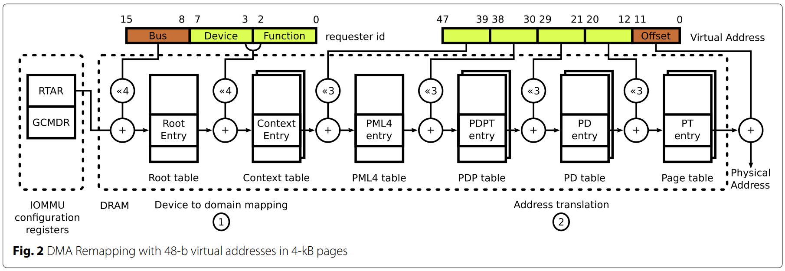
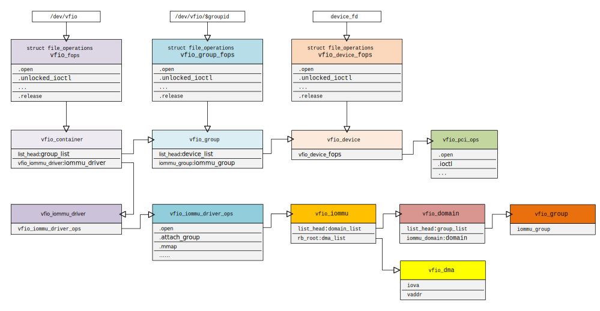

# TDX IO

## IOMMU


## MMIO

### Legacy EPT Violation 处理流程
```c
handle_ept_violation()
-> __vmx_handle_ept_violation()
   -> kvm_mmu_page_fault()
      -> handle_mmio_page_fault()
      -> kvm_mmu_do_page_fault()
         -> kvm_tdp_page_fault()
            -> direct_page_fault()
               -> fast_page_fault()
               -> mmu_topup_memory_caches()
               -> kvm_faultin_pfn()
               -> handle_abnormal_pfn()
               -> kvm_tdp_mmu_map()
               -> __direct_map()
```

### Legacy VM MMIO
* 对于 legacy MMIO，需要将 guest 所要访问的 GPA 对应的 EPT 的 SPTE 配置成 EPT misconfiguration
  * 即将 SPTE 的 `RWX=011` 以触发 EPT misconfiguration
* 当 guest 访问 MMIO 地址时，由于 EPT misconfiguration，将导致 VM-exit
* VMM 截获该 VM-exit 后发现 exit 原因是 EPT misconfiguration，会将该处理转交给 Qemu
  * VMM 需要解析 guest 的代码以了解 MMIO 所要访问的长度等信息
  * 这些信息需要一并转交给 Qemu
* Qemu 继续处理该 exit，从其模拟的设备模型中找到该设备，并模拟内存访问
* KVM module 初始化时设置 KVM 全局的 `shadow_mmio_value`，`shadow_mmio_mask` 和 `shadow_mmio_access_mask`
```c
#define VMX_EPT_SUPPRESS_VE_BIT         (1ull << 63)
#define VMX_EPT_RWX_MASK                        (VMX_EPT_READABLE_MASK |       \
                         VMX_EPT_WRITABLE_MASK |       \
                         VMX_EPT_EXECUTABLE_MASK)

/* The mask to use to trigger an EPT Misconfiguration in order to track MMIO */
#define VMX_EPT_MISCONFIG_WX_VALUE      (VMX_EPT_WRITABLE_MASK |       \
                         VMX_EPT_EXECUTABLE_MASK)

vt_init()
-> kvm_x86_vendor_init()
   -> __kvm_x86_vendor_init()
      -> ops->hardware_setup()
      => vt_hardware_setup()
         -> kvm_mmu_set_ept_masks(enable_ept_ad_bits, cpu_has_vmx_ept_execute_only())
            -> kvm_mmu_set_mmio_spte_mask(VMX_EPT_MISCONFIG_WX_VALUE, VMX_EPT_RWX_MASK | VMX_EPT_SUPPRESS_VE_BIT, 0)

module_init(vt_init)

void kvm_mmu_set_ept_masks(bool has_ad_bits, bool has_exec_only)
{
    shadow_user_mask    = VMX_EPT_READABLE_MASK;
    shadow_accessed_mask    = has_ad_bits ? VMX_EPT_ACCESS_BIT : 0ull;
    shadow_dirty_mask   = has_ad_bits ? VMX_EPT_DIRTY_BIT : 0ull;
    shadow_nx_mask      = 0ull;
    shadow_x_mask       = VMX_EPT_EXECUTABLE_MASK;
    /* VMX_EPT_SUPPRESS_VE_BIT is needed for W or X violation. */
    shadow_present_mask =
        (has_exec_only ? 0ull : VMX_EPT_READABLE_MASK) | VMX_EPT_SUPPRESS_VE_BIT;
    /*
     * EPT overrides the host MTRRs, and so KVM must program the desired
     * memtype directly into the SPTEs.  Note, this mask is just the mask
     * of all bits that factor into the memtype, the actual memtype must be
     * dynamically calculated, e.g. to ensure host MMIO is mapped UC.
     */
    shadow_memtype_mask = VMX_EPT_MT_MASK | VMX_EPT_IPAT_BIT;
    shadow_acc_track_mask   = VMX_EPT_RWX_MASK;
    shadow_host_writable_mask = EPT_SPTE_HOST_WRITABLE;
    shadow_mmu_writable_mask  = EPT_SPTE_MMU_WRITABLE;

    /*
     * EPT Misconfigurations are generated if the value of bits 2:0
     * of an EPT paging-structure entry is 110b (write/execute).
     */
    kvm_mmu_set_mmio_spte_mask(VMX_EPT_MISCONFIG_WX_VALUE,
                   VMX_EPT_RWX_MASK | VMX_EPT_SUPPRESS_VE_BIT, 0);
}
```
* arch/x86/kvm/mmu/spte.c
```c
void kvm_mmu_set_mmio_spte_mask(u64 mmio_value, u64 mmio_mask, u64 access_mask)
{
    ...
    shadow_mmio_value = mmio_value; //全局 MMIO value 设为 RWX = 011b，即产生 EPT misconfiguration
    shadow_mmio_mask  = mmio_mask;  //全局 MMIO mask 设为 SVE_RWX = 1...111b
    shadow_mmio_access_mask = access_mask;
}
```
* KVM 创建虚拟机时设置 per VM 的 `kvm->arch.shadow_mmio_value` 的值设为全局的 `VMX_EPT_MISCONFIG_WX_VALUE`
```c
kvm_dev_ioctl()
   case KVM_CREATE_VM:
        kvm_dev_ioctl_create_vm(arg)
        -> kvm_dev_ioctl_create_vm()
           -> kvm_create_vm()
              -> kvm_arch_init_vm()
                 -> kvm_mmu_init_vm()
                       kvm->arch.shadow_mmio_value = shadow_mmio_value;
                 -> static_call(kvm_x86_vm_init)(kvm)
                 => vt_vm_init() //如果不是 TDVM，不会调用 tdx_vm_init()
```
* 例如一次 MMIO 写访问的 trace
```c
notdxvm-533084  [088] ..... 14915.616719: kvm_mmio: mmio write len 4 gpa 0xc0004014 val 0x0
notdxvm-533084  [088] ...1. 14915.616720: <stack trace>
=> trace_event_raw_event_kvm_mmio
=> write_mmio
=> emulator_read_write_onepage
=> emulator_read_write.isra.163
=> emulator_write_emulated
=> segmented_write
=> writeback
=> x86_emulate_insn
=> x86_emulate_instruction
=> kvm_mmu_page_fault
=> vmx_handle_exit
=> vcpu_enter_guest
=> kvm_arch_vcpu_ioctl_run
=> kvm_vcpu_ioctl
=> __x64_sys_ioctl
=> do_syscall_64
=> entry_SYSCALL_64_after_hwframe
```
### TD VM MMIO
* 因为 Guest TD 被保护了，所以 VMM 无法解析 TD 中的指令。取而代之的是 Guest 使用 hypercall 来完成 MMIO
* 为此，TDX module 始终在 VMCS control 中启用“EPT-violation #VE”，使某些 EPT 违规可能会被转换为 `#VE`
* 对于未修改的设备驱动程序，需要为 MMIO 注入 `#VE`，由 TD kernel 中的 `#VE` 处理程序将 MMIO 指令转换为 MMIO tdvmcall
* 需要设置 MMIO 的 SPTE 的值，以便将 `#VE` 注入 TD 而不是触发 EPT misconfiguration
  * `RWX=0` 以便触发 EPT 违规，让 VMM 得以更新 SPTE 的值
  * 清除 *抑制 #VE 位* 以注入`#VE`
* 对于 MMIO SPTE，spte 值变化如下：
0. Per VM 的 MMIO 初始值设置为 `0`（*抑制 #VE 位* 不需要被置位）
1. Guest 进行 MMIO，由于从未被映射过，触发 EPT 违规，VM exit 到 KVM
2. KVM 逐级建立 EPT 页表条目，最后一级的 SPTE 值更新为 per VM 的 MMIO 值（*抑制 VE 位* 为零），重新进入 Guest
3. Guest 恢复到 MMIO 现场，再次 MMIO 访问，由于 *抑制 VE 位* 没被置位，将触发 `#VE`（由微码将 EPT 违规转化 `#VE`，这是原本就有的功能，不是 TDX module 注入的）
4. 处理器根据 IDT 找到 `#VE` 的入口执行 Guest `#VE` 处理程序，发出 `TDG.VP.VMCALL<#VE.RequestMMIO>`
5. KVM 通过 tdvmcall 的 handler 处理 MMIO（有可能是 kernel 模拟也有可能需要 Qemu 的设备模拟）后返回 Guest
6. Guest `#VE` 处理程序把现场构造好（填入返回的寄存器的值，跳到 MMIO 指令的下一条指令等），通过异常返回的方式回 MMIO 指令下一条指令，恢复执行
* 设置 Per VM 的 `shadow_mmio_value`，覆盖全局的 `VMX_EPT_MISCONFIG_WX_VALUE`。设置为 `0` 以便触发 EPT 违规
```c
kvm_arch_init_vm()
-> kvm_mmu_init_vm()
-> static_call(kvm_x86_vm_init)(kvm)
=> vt_vm_init()
   -> tdx_vm_init() //如果是 TDVM，则会调用该函数
      -> kvm_mmu_set_mmio_spte_value(kvm, 0)
            kvm->arch.shadow_mmio_value = mmio_value; //设置为 0
```
* 来看看 MMIO 最后一级的 SPTE 是如何构造的
```c
u64 make_mmio_spte(struct kvm_vcpu *vcpu, u64 gfn, unsigned int access)
{   //先将 generation bit 提取出来
    u64 gen = kvm_vcpu_memslots(vcpu)->generation & MMIO_SPTE_GEN_MASK;
    u64 spte = generation_mmio_spte_mask(gen);//将 generation bit 编码进 SPTE
    u64 gpa = gfn << PAGE_SHIFT;

    WARN_ON_ONCE(!vcpu->kvm->arch.shadow_mmio_value &&
             !kvm_gfn_shared_mask(vcpu->kvm));

    access &= shadow_mmio_access_mask;
    spte |= vcpu->kvm->arch.shadow_mmio_value | access; //per VM 的 MMIO value 就是在这填入的
    spte |= gpa | shadow_nonpresent_or_rsvd_mask; //MMIO 的 HPA 和 GPA 基址部分是相同的
    spte |= (gpa & shadow_nonpresent_or_rsvd_mask)
        << SHADOW_NONPRESENT_OR_RSVD_MASK_LEN;

    return spte;
}
```
* MMIO 的 HPA 和 GPA 基址部分是相同的，其实是无所谓的，因为是 Qemu 模拟这次内存访问，而不是真的靠 EPT 翻译的结果去访问内存，所以基址位部分填什么并不影响模拟的结果

### TD VM VFIO

* 对于透传至 TD VM 的 VF 内存，则无需通过 `#VE` 来让 guest 收集 MMIO 的信息以便让 Qemu 进行 MMIO 模拟
* 例如，先通过以配置将某 PCI 设备配成 VFIO
```sh
modprobe vfio
modprobe vfio_pci
echo 0000:38:00.0 > /sys/bus/pci/devices/0000:38:00.0/driver/unbind
#lspci -nvv -s 0000:03:00.1
echo 8086 1533 > /sys/bus/pci/drivers/vfio-pci/new_id
```
* 这样将生成一个 `/dev/vfio/18` 字符设备
* Qemu 配置添加参数 `-device vfio-pci,host=0000:38:00.0`，打开 `/dev/vfio/18` 字符设备，并将该字符设备的 `fd` 绑定到一个 memory slot
* 再往后其实走的是映射普通 guest 内存访问的步骤，只是该 memory slot 必须是共享的，而不能是加密的
* 因为无需 `#VE` 来让 guest 收集 MMIO 的信息，因此 *抑制 #VE 位* 无需被设置，走的是普通页的创建 SPTE 分支
* arch/x86/kvm/mmu/tdp_mmu.c
```c
static int tdp_mmu_map_handle_target_level(struct kvm_vcpu *vcpu,
                      struct kvm_page_fault *fault,
                      struct tdp_iter *iter)
{
...
    if (unlikely(!fault->slot))
        new_spte = make_mmio_spte(vcpu, iter->gfn, ACC_ALL);
    else {
        unsigned long pte_access = ACC_ALL;

        /* TDX shared GPAs are no executable, enforce this for the SDV. */
        if (kvm_gfn_shared_mask(vcpu->kvm) && !fault->is_private)
            pte_access &= ~ACC_EXEC_MASK;

        wrprot = make_spte(vcpu, sp, fault->slot, pte_access,
                   gpa_to_gfn(fault->addr)/* include shared bit */,
                   fault->pfn, iter->old_spte,
                   fault->prefetch, true, fault->map_writable,
                   &new_spte);
    }
...
    /* If a MMIO SPTE is installed, the MMIO will need to be emulated. */
    if (unlikely(is_mmio_spte(vcpu->kvm, new_spte))) {
        vcpu->stat.pf_mmio_spte_created++;
        trace_mark_mmio_spte(rcu_dereference(iter->sptep), iter->gfn,
                     new_spte);
        ret = RET_PF_EMULATE;
    } else {
        trace_kvm_mmu_set_spte(iter->level, iter->gfn,
                       rcu_dereference(iter->sptep));
    }

    return ret;

}
```
* `shadow_present_mask` 在 `kvm_mmu_set_ept_masks()` 赋的值，是带 `VMX_EPT_SUPPRESS_VE_BIT` 的，即用该 SPTE 翻译时无需产生 `#VE`
* arch/x86/kvm/mmu/spte.c
```c
bool make_spte(struct kvm_vcpu *vcpu, struct kvm_mmu_page *sp,
           const struct kvm_memory_slot *slot,
           unsigned int pte_access, gfn_t gfn_including_shared, kvm_pfn_t pfn,
           u64 old_spte, bool prefetch, bool can_unsync,
           bool host_writable, u64 *new_spte)
{
...
    /*
     * For the EPT case, shadow_present_mask is 0 if hardware
     * supports exec-only page table entries.  In that case,
     * ACC_USER_MASK and shadow_user_mask are used to represent
     * read access.  See FNAME(gpte_access) in paging_tmpl.h.
     */
    spte |= shadow_present_mask;
...
    spte |= (u64)pfn << PAGE_SHIFT;
...
    *new_spte = spte;
    return wrprot;
}
```

### Qemu 对 VFIO 透传设备 BAR 的映射
```c
//qemu/hw/vfio/pci.c
vfio_realize()
-> vfio_bars_register(vdev)
      for (i = 0; i < PCI_ROM_SLOT; i++)
      -> vfio_bar_register(vdev, i)
         -> memory_region_init_io(bar->mr, OBJECT(vdev), NULL, NULL, name, bar->size)
         -> memory_region_add_subregion(bar->mr, 0, bar->region.mem)
         -> vfio_region_mmap(&bar->region)
               for (i = 0; i < region->nr_mmaps; i++) {
               -> region->mmaps[i].mmap = mmap(NULL, region->mmaps[i].size, prot, MAP_SHARED, region->vbasedev->fd,
                                               region->fd_offset + region->mmaps[i].offset);
               -> memory_region_init_ram_device_ptr()
               -> memory_region_add_subregion()
               -> trace_vfio_region_mmap()
               }
         -> pci_register_bar(&vdev->pdev, nr, bar->type, bar->mr)
```

## TD VM DMA
* 对于 DMA 的内存，在支持 TDX IO 前必须是共享的，否则设备无法解密 TD VM 加密过的内容；并且如果设备写了 TD VM 的私有内存也会引起 MCE。
* 为了解决这个问题，当前的解决方案是：
1. 对于 coherent/direct DMA，在分配的最后，需要将页从私有的转为共享的，
   * 对于透传到 guest 的设备，Qemu 的 VFIO MemoryListener 必须监听以上内存转换事件，
     * 当该区域转为共享时，`vfio_dma_map(VFIOContainer *container, hwaddr iova, ram_addr_t size, void *vaddr, bool readonly) -> ioctl(container->fd, VFIO_IOMMU_MAP_DMA, &map)`
     * 当该区域取消共享时，`vfio_dma_unmap() -> ioctl(container->fd, VFIO_IOMMU_UNMAP_DMA, &unmap)`
   * Qemu VFIO 的 MemoryListener 动态操作 restricted memory region 的映射，与静态映射/取消映射整个范围和 pin 所有页面的实现不兼容。因此，在 VFIO 中添加静态 IOMMU 映射时需跳过 restricted memory region。
* `ioctl(VFIO_IOMMU_MAP_DMA)` 传入了 IOVA 和 HVA，其中 IOVA 即 GPA，HVA 与 GPA 是对应的；根据其 HVA 得到 HPA，然后填充 IOVA 到 HPA 的映射关系到 IOMMU 的页表。
* 如果采用的 VFIO IOMMU type1 类型的 fd
```cpp
//drivers/vfio/vfio_iommu_type1.c
vfio_iommu_type1_ioctl()
case VFIO_IOMMU_MAP_DMA:
-> vfio_iommu_type1_map_dma(iommu, arg)
   -> vfio_dma_do_map(iommu, &map)
      -> vfio_pin_map_dma(iommu, dma, size)
         -> vfio_iommu_map(iommu, iova + dma->size, pfn, npage, dma->prot)
               //drivers/iommu/iommu.c
            -> iommu_map(d->domain, iova, (phys_addr_t)pfn << PAGE_SHIFT, npage << PAGE_SHIFT, prot | IOMMU_CACHE)
```
* 如果采用的 VFIO IOMMUFD 类型的 fd
```cpp
//drivers/iommu/iommufd/vfio_compat.c
iommufd_vfio_ioctl()
case VFIO_IOMMU_MAP_DMA:
-> iommufd_vfio_map_dma(ictx, cmd, uarg)
   //drivers/iommu/iommufd/io_pagetable.c
   -> iopt_map_pages()
      -> iopt_fill_domains_pages()
         -> iopt_area_fill_domains()
            //drivers/iommu/iommufd/pages.c
            -> batch_to_domain()
                  //drivers/iommu/iommu.c
               -> iommu_map()
```
* 下面是公用的部分，对于 Intel 的 IOMMU 走的是如下路径
```cpp
//drivers/iommu/iommu.c
iommu_map()
-> _iommu_map()
   -> __iommu_map()
      -> __iommu_map_pages()
      -> ops->map_pages()
         //drivers/iommu/intel/iommu.c
      => intel_iommu_map_pages()
         -> intel_iommu_map()
            -> __domain_mapping()
```
2. 对于 stream DMA 一律采用 SWIOTLB 的 bounce buffer 来传输 DMA 数据
   * bounce buffer 是静态分配的，因此共享内存的区域会是固定的
   * 这块内存来自 TD VM 的普通私有内存，启动时时由 guest 在调用 SWIOTLB 初始化时候调用 `swiotlb_update_mem_attributes() -> set_memory_decrypted() -> ... -> tdx_enc_status_changed() -> _tdx_hypercall(TDVMCALL_MAP_GPA, ...)` 转换
3. 对于 VFIO 透传到 guest 的设备内存，如果 vCPU 通过 `ioremap()` 的方式访问内存，比如说某些 PCI 设备的 BAR 空间，则无法通过上述方案解决，
  * 因此，需要将设备使用 `ioremap()` 创建映射的区域也转换为共享的，为此创建了 `ioremap_driver_hardened()` 系列接口供设备使用：
```cpp
drivers/pci/msi/msi.c|503| <<msix_map_region>> return ioremap_driver_hardened(phys_addr, nr_entries * PCI_MSIX_ENTRY_SIZE);
lib/devres.c|39| <<__devm_ioremap>> addr = ioremap_driver_hardened(offset, size);
lib/pci_iomap.c|47| <<pci_iomap_range>> return ioremap_driver_hardened(start, len);
```

## NVMe 透传的例子
* 例如，NVMe 用于 *DMA 的 SQ 和 CQ*：
  * 在 Guest 侧就是用 `dma_alloc_coherent() -> dma_alloc_attrs() -> dma_direct_alloc() -> dma_set_decrypted()` 分配并转换为共享内存的
  * 在 Host 侧，这块内存来自 restricted memory region 分配而来的私有内存
* NVMe 用于 *配置 SQ 和 CQ 的 BAR* 是通过上面讲过的 `ioremap()` 的方式来访问的
  * Host 先将 BAR（HPA）与将要提供给 Guest 的设备的 GPA 的映射关系建立好
```c
ioctl(16<anon_inode:kvm-vm>, KVM_SET_USER_MEMORY_REGION, {slot=2, flags=0, guest_phys_addr=0x100010000, memory_size=8192, userspace_addr=0x7fee973f5000}) = 0 <0.000060>
 > /usr/lib64/libc-2.28.so(ioctl+0xb) [0x397cb]
 > /qemu-system-x86_64(kvm_vm_ioctl+0x63) [0x6baea3]
 > /qemu-system-x86_64(kvm_set_user_memory_region+0xcb) [0x6bc5bb]
 > /qemu-system-x86_64(kvm_set_phys_mem+0x354) [0x6bcc84]
 > /qemu-system-x86_64(address_space_update_topology_pass+0x330) [0x6377e0]
 > /qemu-system-x86_64(address_space_set_flatview+0x124) [0x637b04]
 > /qemu-system-x86_64(memory_region_transaction_commit+0x11f) [0x63b35f]
 > /qemu-system-x86_64(pci_update_mappings+0x21f) [0x409cef]
 > /qemu-system-x86_64(pci_default_write_config+0x178) [0x40a448]
 > /qemu-system-x86_64(vfio_pci_write_config+0x165) [0x604385]
 > /qemu-system-x86_64(pci_host_config_write_common+0x151) [0x40dd51]
 > /qemu-system-x86_64(memory_region_write_accessor+0xf7) [0x639d07]
 > /qemu-system-x86_64(access_with_adjusted_size+0x9d) [0x635ccd]
 > /qemu-system-x86_64(memory_region_dispatch_write+0xe8) [0x639278]
 > /qemu-system-x86_64(flatview_write_continue+0xfb) [0x64392b]
 > /qemu-system-x86_64(flatview_write+0x82) [0x643a82]
 > /qemu-system-x86_64(address_space_write+0x55) [0x6446d5]
 > /qemu-system-x86_64(kvm_cpu_exec+0x49f) [0x6bf05f]
 > /qemu-system-x86_64(kvm_vcpu_thread_fn+0x9c) [0x6c01fc]
 > /qemu-system-x86_64(qemu_thread_start+0x89) [0x82d439]
 > /usr/lib64/libpthread-2.28.so(start_thread+0xe9) [0x81c9]
 > /usr/lib64/libc-2.28.so(__clone+0x42) [0x39e72]
```
  * Guest 通过 `ioremap()` 将 GVA 与它看到的 BAR（GPA）的映射关系建立好
  * Guest 访问 BAR 的 GVA 的时候引发 EPT violation，因为有对应的 memory slot，所以会将 GPA 映射到设备的 BAR 对应的 host 侧的内存地址空间（HPA）
* 而有的 BAR 则是通过 Host 代为处理 Guest 的 MMIO 请求来配置的
  * 当 Guest 读写 BAR（GPA）的过程即 MMIO，host 会通过 EPT Violation 引发 `#VE`，让 guest 通过弹射回来的 `#VE` 发出 TDVMCALL 来请求 MMIO

## TDVF IO Memory
* TDVF 里把 Private 转 shared 的有三处：
1. 根据 Hob 里的 MMIO 资源描述转：
```cpp
//OvmfPkg/TdxDxe/TdxDxe.c
TdxDxeEntryPoint()
-> SetMmioSharedBit()
      //OvmfPkg/Library/BaseMemEncryptTdxLib/MemoryEncryption.c
   -> MemEncryptTdxSetPageSharedBit(0, Hob.ResourceDescriptor->PhysicalStart, EFI_SIZE_TO_PAGES (Hob.ResourceDescriptor->ResourceLength))
```

2. 初始化保留共享内存时转换：
```cpp
//OvmfPkg/IoMmuDxe/IoMmuDxe.c
IoMmuDxeEntryPoint()
   //OvmfPkg/IoMmuDxe/CcIoMmu.c
-> InstallIoMmuProtocol()
      //OvmfPkg/IoMmuDxe/IoMmuBuffer.c
   -> IoMmuInitReservedSharedMem()
         //OvmfPkg/Library/BaseMemEncryptTdxLib/MemoryEncryption.c
      -> MemEncryptTdxSetPageSharedBit(0, SharedAddress, EFI_SIZE_TO_PAGES (MemRange->DataSize))
```

3. 保留共享内存用尽时，把 private 内存拷入 StashBuffer 后，之后将原 Buffer 转为 shared：
   * Stash buffer 总是在加密内存一侧
   * Map() 时临时将加密数据暂存到 stash buffer，之后将原来的 buffer 转为 *共享*，然后将 *要解密* 的数据拷贝到原来的位置
   * Ummap() 时临时将明文暂存到 stash buffer，之后将原来的 buffer 转为 *私有*，然后将 *要加密* 的数据拷贝到原来的位置
```cpp
//MdeModulePkg/Bus/Pci/NvmExpressDxe/NvmExpress.c
NvmExpressDriverBindingStart()
-> PciIo->AllocateBuffer (PciIo, AllocateAnyPages, EfiBootServicesData, 6, (VOID **)&Private->Buffer, 0); //分配 6 个 pages
   //MdeModulePkg/Bus/Pci/PciHostBridgeDxe/PciRootBridgeIo.c
=> RootBridgeIoAllocateBuffer()
   -> mIoMmu->AllocateBuffer(mIoMmu, Type, MemoryType, Pages, HostAddress, Attributes); //mIoMmu 如果不为 NULL
      //OvmfPkg/IoMmuDxe/CcIoMmu.c
   => IoMmuAllocateBuffer()
      -> StashBuffer = AllocatePages(Pages)
         //OvmfPkg/IoMmuDxe/IoMmuBuffer.c
      -> IoMmuAllocateCommonBuffer()
         -> InternalAllocateBuffer()
         CommonBufferHeader->StashBuffer = StashBuffer;
         *HostAddress = (VOID *)(UINTN)PhysicalAddress;
-> PciIo->Map(PciIo, EfiPciIoOperationBusMasterCommonBuffer, Private->Buffer, &Bytes, &MappedAddr, &Private->Mapping);
   //OvmfPkg/IoMmuDxe/CcIoMmu.c
=> IoMmuMap()
   -> CopyMem (CommonBufferHeader->StashBuffer, (VOID *)(UINTN)MapInfo->CryptedAddress, MapInfo->NumberOfBytes)
      MapInfo->PlainTextAddress = MapInfo->CryptedAddress;
      //OvmfPkg/Library/BaseMemEncryptTdxLib/MemoryEncryption.c
   -> MemEncryptTdxSetPageSharedBit (0, MapInfo->PlainTextAddress, MapInfo->NumberOfPages);
```
* 最后调用 `TDVMCALL<MAPGPA>` 转换如下：
```cpp
//OvmfPkg/Library/BaseMemEncryptTdxLib/MemoryEncryption.c
MemEncryptTdxSetPageSharedBit()
-> SetMemorySharedOrPrivate()
   -> SetOrClearSharedBit()
      -> TdVmCall (TDVMCALL_MAPGPA, PhysicalAddress, Length, 0, 0, NULL)
```

### TDVF 保留共享内存
* 驱动用作 DMA 的内存可以从用 `mReservedMemRanges` 描述的一组不同粒度的保留内存中分配的，这块内存初始化的时候统一都转成 shared 的了。如果保留内存不够用了会用到 StashBuffer 在 mapping 的时候动态去 MapGPA
* `mReservedMemRanges` 描述了保留内存的布局。保留内存由不同大小的内存区域组成。
  * 相同大小的内存块由 `mReservedMemRanges` 中的一个条目管理。
  * 所有内存片段均由 `UINT32 mReservedMemBitmap` 管理。这意味着它最多可以管理 `32` 块内存。
  * 由于 CommonBuffer 的布局（1-page header + n-page data），一块保留的内存由 2 部分组成：Header + Data。
* 因此，将所有这些放在一起，`mReservedMemRanges` 和 `mReservedMemBitmap` 旨在管理保留内存。
* 以 `mReservedMemRanges` 的第二个条目为例：`{ RESERVED_MEM_BITMAP_32K_MASK, 4, 8, SIZE_32KB, SIZE_4KB, 0 }`，
  - `RESERVED_MEM_BITMAP_32K_MASK` 为 `0xff0`。这意味着 `mReservedMemBitmap` 中的 `bit 4-11` 是为 `32K` 大小的内存保留的。
  - `4` 是 `mReservedMemBitmap` 的移位。
  - `8` 表示有 `8` 块 `32K` 大小的内存。
  - `SIZE_32KB` 表示数据部分的大小。
  - `SIZE_4KB` 是头部的大小。
  - `0` 是该内存范围的起始地址，在初始化保留内存时将填充该内存范围。
* 内存区域的大小和数量是根据经验得出的。
  * 对于典型的 grub 引导，大约有 `5100` 个 IoMmu/DMA 操作。
  * 大多数 DMA 操作需要的内存大小小于 `32K`（`~5080`）。
  * 但我们发现 grub 启动时可能有 2 个 DMA 操作，需要内存大于 `1M`。并且这 2 个 DMA 操作同时发生。所以我们预留 2 块大小为 `SIZE_2MB` 的内存。这是为了获得最佳启动性能。
* 如果所有保留内存都耗尽，那么它将回退到以前的旧内存分配。
* OvmfPkg/IoMmuDxe/IoMmuBuffer.c
```cpp
#define RESERVED_MEM_BITMAP_4K_MASK    0xf
#define RESERVED_MEM_BITMAP_32K_MASK   0xff0
#define RESERVED_MEM_BITMAP_128K_MASK  0x3000
#define RESERVED_MEM_BITMAP_1M_MASK    0x40000
#define RESERVED_MEM_BITMAP_2M_MASK    0x180000
#define RESERVED_MEM_BITMAP_MASK       0x1fffff

/**
 * mReservedMemRanges describes the layout of the reserved memory.
 * The reserved memory consists of disfferent size of memory region.
 * The pieces of memory with the same size are managed by one entry
 * in the mReservedMemRanges. All the pieces of memories are managed by
 * mReservedMemBitmap which is a UINT32. It means it can manage at most
 * 32 pieces of memory. Because of the layout of CommonBuffer
 * (1-page header + n-page data), a piece of reserved memory consists of
 * 2 parts: Header + Data.
 *
 * So put all these together, mReservedMemRanges and mReservedMemBitmap
 * are designed to manage the reserved memory.
 *
 * Use the second entry of mReservedMemRanges as an example.
 * { RESERVED_MEM_BITMAP_32K_MASK,  4,  8, SIZE_32KB,  SIZE_4KB, 0 },
 * - RESERVED_MEM_BITMAP_32K_MASK is 0xff0. It means bit4-11 in mReservedMemBitmap
 *   is reserved for 32K size memory.
 * - 4 is the shift of mReservedMemBitmap.
 * - 8 means there are 8 pieces of 32K size memory.
 * - SIZE_32KB indicates the size of Data part.
 * - SIZE_4KB is the size of Header part.
 * - 0 is the start address of this memory range which will be populated when
 *   the reserved memory is initialized.
 *
 * The size and count of the memory region are derived from the experience. For
 * a typical grub boot, there are about 5100 IoMmu/DMA operation. Most of these
 * DMA operation require the memory with size less than 32K (~5080). But we find
 * in grub boot there may be 2 DMA operation which require for the memory larger
 * than 1M. And these 2 DMA operation occur concurrently. So we reserve 2 pieces
 * of memory with size of SIZE_2MB. This is for the best boot performance.
 *
 * If all the reserved memory are exausted, then it will fall back to the legacy
 * memory allocation as before.
 */
STATIC IOMMU_RESERVED_MEM_RANGE  mReservedMemRanges[] = {
  { RESERVED_MEM_BITMAP_4K_MASK,   0,  4, SIZE_4KB,   SIZE_4KB, 0 },
  { RESERVED_MEM_BITMAP_32K_MASK,  4,  8, SIZE_32KB,  SIZE_4KB, 0 },
  { RESERVED_MEM_BITMAP_128K_MASK, 12, 2, SIZE_128KB, SIZE_4KB, 0 },
  { RESERVED_MEM_BITMAP_1M_MASK,   14, 1, SIZE_1MB,   SIZE_4KB, 0 },
  { RESERVED_MEM_BITMAP_2M_MASK,   15, 2, SIZE_2MB,   SIZE_4KB, 0 },
};
```

### TDVF NVMe 驱动初始化
```cpp
//MdeModulePkg/Bus/Pci/NvmExpressDxe/NvmExpress.c
NvmExpressDriverBindingStart()
-> NvmeControllerInit()
   -> ReadNvmeControllerCapabilities()
      -> PciIo->Mem.Read()
         //MdeModulePkg/Bus/Pci/PciBusDxe/PciIo.c
      => PciIoMemRead()
         -> PciIoDevice->PciRootBridgeIo->Mem.Read()
            //MdeModulePkg/Bus/Pci/PciHostBridgeDxe/PciRootBridgeIo.c
         => RootBridgeIoMemRead()
            -> RootBridgeIoGetMemTranslationByAddress(RootBridge, Address, &Translation)
            -> mCpuIo->Mem.Read(..., TO_HOST_ADDRESS(Address, Translation), ...)
               //UefiCpuPkg/CpuIo2Dxe/CpuIo2Dxe.c
            => CpuMemoryServiceRead()
                  //MdePkg/Library/BaseIoLibIntrinsic/IoLib.c
               -> MmioRead32((UINTN)Address)
                     //MdePkg/Library/BaseIoLibIntrinsic/IoLibInternalTdx.c
                  -> TdMmioRead32(Address)
                     -> Status = TdVmCall(TDVMCALL_MMIO, TDVMCALL_ACCESS_SIZE_4, TDVMCALL_ACCESS_READ, Address | TdSharedPageMask (), 0, &Value);
                           //MdePkg/Library/TdxLib/TdInfo.c
                        -> TdSharedPageMask()
                           -> GetTdInfo()
                                 //MdePkg/Library/BaseLib/X64/TdCall.nasm
                              -> tdcall
                           //MdePkg/Library/BaseLib/X64/TdVmcall.nasm
                        -> tdcall_regs_preamble TDVMCALL, TDVMCALL_EXPOSE_REGS_MASK
                        -> tdcall
                     -> Value = *(volatile UINT64 *)Address; // <---- Dragon is here
```

### TDVF 初始化 PCI MMIO64 区域
* 如果 Qemu 传给 TDVF 的 TD Hob 中不包含 MMIO 资源描述信息时，默认的 PCD PCI MMIO64 的基址是 `0x38000000000`，大小是 `0x800_0000_0000`（`8TB`）
  * 这两个默认值是根据 `cpuid(0x80000008)` 的值计算出来的
  * 怎么到 `SecCoreStartupWithStack()` 这步的见 [TDVF](TDVF.md)
```c
//edk2/OvmfPkg/IntelTdx/Sec/SecMain.c
SecCoreStartupWithStack()
   //edk2/OvmfPkg/Library/PeilessStartupLib/PeilessStartup.c
-> PeilessStartup (&SecCoreData)
      //edk2/OvmfPkg/Library/PeilessStartupLib/PeilessStartup.c
   -> InitializePlatform (&PlatformInfoHob)
      -> DEBUG ((DEBUG_INFO, "InitializePlatform in Pei-less boot\n")); //可以找到这行打印
      -> PlatformDebugDumpCmos ();
         PlatformInfoHob->PcdPciMmio64Size = 0x800000000;
         //edk2/OvmfPkg/Library/PlatformInitLib/MemDetect.c
      -> PlatformAddressWidthInitialization (PlatformInfoHob);
         -> Status = PlatformScanHostProvided64BitPciMmioEnd (&PlatformInfoHob->FirstNonAddress)
            if (EFI_ERROR (Status))
            -> PlatformGetFirstNonAddress (PlatformInfoHob)
               -> Status = PlatformScanE820 (PlatformGetFirstNonAddressCB, PlatformInfoHob)
                  -> Callback (&E820Entry, PlatformInfoHob)
                  => PlatformGetFirstNonAddressCB()
                        Candidate = E820Entry->BaseAddr + E820Entry->Length;
                     -> DEBUG ((DEBUG_INFO, "%a: FirstNonAddress=0x%Lx\n", __func__, Candidate))
         -> PlatformAddressWidthFromCpuid (PlatformInfoHob, TRUE)
            -> AsmCpuid (0x80000000, &RegEax, &RegEbx, &RegEcx, &RegEdx) // cpuid 0x80000000
                Max = RegEax; //最大 cpuid 通过 $rax 返回，这台机器的值是 0x80000008
                if (Max >= 0x80000008) {
                -> AsmCpuid (0x80000008, &RegEax, NULL, NULL, NULL);
                   PhysBits = (UINT8)RegEax; //我们走进的是这个分支，由下面的打印的 log 可知 $rax 的值是 52
                } else {
                  PhysBits = 36;
                }
            -> DEBUG ((DEBUG_INFO, "%a: Signature: '%a', PhysBits: %d, QemuQuirk: %a, Valid: %a\n",
                       __func__, Signature, PhysBits, QemuQuirk ? "On" : "Off", Valid ? "Yes" : "No"));
               if (Valid) {
                 if (PhysBits > 46) {
                   /*
                    * Avoid 5-level paging altogether for now, which limits
                    * PhysBits to 48.  Also avoid using address bit 48, due to sign
                    * extension we can't identity-map these addresses (and lots of
                    * places in edk2 assume we have everything identity-mapped).
                    * So the actual limit is 47.
                    *
                    * Also some older linux kernels apparently have problems handling
                    * phys-bits > 46 correctly, so use that as limit.
                    */
                 -> DEBUG ((DEBUG_INFO, "%a: limit PhysBits to 46 (avoid 5-level paging)\n", __func__));
                    PhysBits = 46; //结合 log 可以知道我们走进了这个分支，这里把物理地址最高 bit 改为 46
                 }
               }
               PlatformInfoHob->PhysMemAddressWidth = PhysBits;
               PlatformInfoHob->FirstNonAddress     = LShiftU64 (1, PlatformInfoHob->PhysMemAddressWidth);
            if (PlatformInfoHob->PhysMemAddressWidth != 0) {
               // physical address width is known
            -> PlatformDynamicMmioWindow (PlatformInfoHob);
                  AddrSpace = LShiftU64 (1, PlatformInfoHob->PhysMemAddressWidth); //地址空间为 1<<46 = 0x400000000000
                  MmioSpace = LShiftU64 (1, PlatformInfoHob->PhysMemAddressWidth - 3); //MMIO 空间为 1<<43 = 0x80000000000
                  if ((PlatformInfoHob->PcdPciMmio64Size < MmioSpace) &&
                      (PlatformInfoHob->PcdPciMmio64Base + MmioSpace < AddrSpace))
                  {
                    DEBUG ((DEBUG_INFO, "%a: using dynamic mmio window\n", __func__));
                    DEBUG ((DEBUG_INFO, "%a:   Addr Space 0x%Lx (%Ld GB)\n", __func__, AddrSpace, RShiftU64 (AddrSpace, 30)));
                    DEBUG ((DEBUG_INFO, "%a:   MMIO Space 0x%Lx (%Ld GB)\n", __func__, MmioSpace, RShiftU64 (MmioSpace, 30)));
                    PlatformInfoHob->PcdPciMmio64Size = MmioSpace; //0x80000000000
                    PlatformInfoHob->PcdPciMmio64Base = AddrSpace - MmioSpace; //0x400000000000 - 0x80000000000 = 0x380000000000
                    PlatformScanE820 (PlatformReservationConflictCB, PlatformInfoHob);
                  } else {
                    DEBUG ((DEBUG_INFO, "%a: using classic mmio window\n", __func__));
                  }
                  DEBUG ((DEBUG_INFO, "%a:   Pci64 Base 0x%Lx\n", __func__, PlatformInfoHob->PcdPciMmio64Base));
                  DEBUG ((DEBUG_INFO, "%a:   Pci64 Size 0x%Lx\n", __func__, PlatformInfoHob->PcdPciMmio64Size));
               return;
            }
      -> DEBUG ((DEBUG_INFO, "PhysMemAddressWidth=0x%x, Pci64Base=0x%llx, Pci64Size=0x%llx\n",
           PlatformInfoHob->PhysMemAddressWidth, PlatformInfoHob->PcdPciMmio64Base, PlatformInfoHob->PcdPciMmio64Size));
```
* 反之，如果 Qemu 构造了一个含有 `EFI_RESOURCE_MEMORY_MAPPED_IO (0x1)` 资源描述信息放入 TD Hob 时，比如将以下范围的默认值放入 TD Hob：
  ```c
  #define PCI_HOST_PROP_PCI_HOLE64_START "pci-hole64-start"
  #define PCI_HOST_PROP_PCI_HOLE64_END   "pci-hole64-end"
  #define PCI_HOST_PROP_PCI_HOLE64_SIZE  "pci-hole64-size"
  ```
* 此时，PCD PCI MMIO64 的基址会根据 Qemu 指定的值配置：
```diff
diff --git a/OvmfPkg/TdxDxe/TdxDxe.c b/OvmfPkg/TdxDxe/TdxDxe.c
index 30732f421b..c08335cf74 100644
--- a/OvmfPkg/TdxDxe/TdxDxe.c
+++ b/OvmfPkg/TdxDxe/TdxDxe.c
@@ -424,14 +424,14 @@ TdxDxeEntryPoint (
   PcdStatus = PcdSet64S (NAME##Size, (RES)->ResourceLength); \
   ASSERT_RETURN_ERROR (PcdStatus); \
 } while(0)
-
+  DEBUG ((DEBUG_INFO, "%a:%d: PcdPciMmio64Base=0x%llx PcdPciMmio64Size=0x%llx\n", __func__, __LINE__, PcdGet64 (PcdPciMmio64Base), PcdGet64 (PcdPciMmio64Size)));
   if (PlatformInfo) {
     PcdSet16S (PcdOvmfHostBridgePciDevId, PlatformInfo->HostBridgeDevId);

     if ((Res = GetResourceDescriptor (EFI_RESOURCE_MEMORY_MAPPED_IO, (EFI_PHYSICAL_ADDRESS)0x100000000, (EFI_PHYSICAL_ADDRESS)-1)) != NULL) {
       INIT_PCDSET (PcdPciMmio64, Res);
     }
-
+    DEBUG ((DEBUG_INFO, "%a:%d: PcdPciMmio64Base=0x%llx PcdPciMmio64Size=0x%llx\n", __func__, __LINE__, PcdGet64 (PcdPciMmio64Base), PcdGet64 (PcdPciMmio64Size)));
     if ((Res = GetResourceDescriptor (EFI_RESOURCE_IO, 0, 0x10001)) != NULL) {
       INIT_PCDSET (PcdPciIo, Res);
     }
```
* 例如，我的版本看到的是 `0x280000000`，大小是 `0x8_0000_0000`（`32GB`）
```c
tdvf_hob_add_mmio_resources:104: start=0x80000000 end=0xfee00000
tdvf_hob_add_mmio_resources:123: start=0x280000000 end=0xa80000000
...
InitializePlatform in Pei-less boot
CMOS:
00: 04 00 36 00 01 00 03 11 03 25 26 02 00 80 00 00
10: 00 00 00 00 06 80 02 FF FF 00 00 00 00 00 00 00
20: 00 00 00 00 00 00 00 00 00 00 00 00 00 00 00 00
30: FF FF 20 00 00 7F 00 20 30 00 00 00 00 12 00 00
40: 00 00 00 00 00 00 00 00 00 00 00 00 00 00 00 00
50: 00 00 00 00 00 00 00 00 00 00 00 00 80 01 00 07
60: 00 00 00 00 00 00 00 00 00 00 00 00 00 00 00 00
70: 00 00 00 00 00 00 00 00 00 00 00 00 00 00 00 00
...
PlatformGetFirstNonAddressCB: FirstNonAddress=0x280000000
...
PlatformAddressWidthFromCpuid: Signature: '', PhysBits: 52, QemuQuirk: On, Valid: Yes
PlatformAddressWidthFromCpuid: limit PhysBits to 46 (avoid 5-level paging)
PlatformDynamicMmioWindow: using dynamic mmio window
PlatformDynamicMmioWindow:   Addr Space 0x400000000000 (65536 GB)
PlatformDynamicMmioWindow:   MMIO Space 0x80000000000 (8192 GB)
Select Item: 0x19
Select Item: 0x25
PlatformDynamicMmioWindow:   Pci64 Base 0x380000000000
PlatformDynamicMmioWindow:   Pci64 Size 0x80000000000
PhysMemAddressWidth=0x2E, Pci64Base=0x380000000000, Pci64Size=0x80000000000
...
TdxDxeEntryPoint:427: PcdPciMmio64Base=0x380000000000 PcdPciMmio64Size=0x80000000000
GetResourceDescriptor:205: resource type 0x0 0 800000
GetResourceDescriptor:205: resource type 0x0 800000 6000
GetResourceDescriptor:205: resource type 0x0 806000 3000
GetResourceDescriptor:205: resource type 0x0 809000 2000
GetResourceDescriptor:205: resource type 0x0 80B000 2000
GetResourceDescriptor:205: resource type 0x0 80D000 3000
GetResourceDescriptor:205: resource type 0x0 810000 10000
GetResourceDescriptor:205: resource type 0x0 820000 7F7E0000
GetResourceDescriptor:205: resource type 0x7 100000000 180000000
GetResourceDescriptor:205: resource type 0x1 80000000 7EE00000
GetResourceDescriptor:205: resource type 0x1 280000000 80000000000
TdxDxeEntryPoint:434: PcdPciMmio64Base=0x280000000 PcdPciMmio64Size=0x800000000
```
* 有的版本这个范围可能才 `2GB`，这会造成透传 GPU 时，由于 GPU 某些 BAR 需要的 MMIO 地址空间比较大导致无法成功分配 BAR 空间的问题
  * 此时，可以通过给 Qemu 增加参数调整 PCI MMIO64 的地址空间范围 `-global q35-pcihost.pci-hole64-size=8T`
  * 调整过后最后一条打印如下：
```c
TdxDxeEntryPoint:434: PcdPciMmio64Base=0x280000000 PcdPciMmio64Size=0x80000000000
```