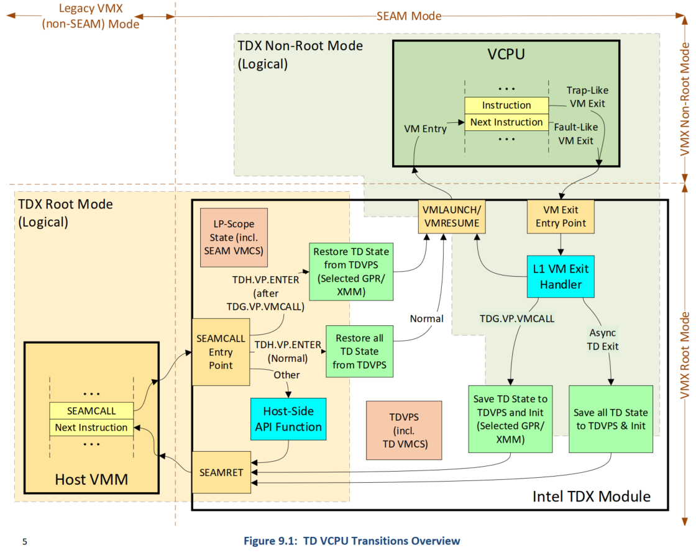
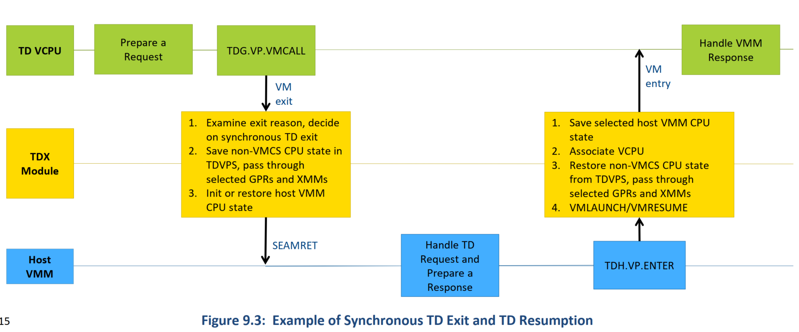

# TDX Kernel

## TD VM Run

* TD VM vCPU Run 与 legacy VM vCPU Run 的本质是不同的
  * 将 TD run 起来是 KVM 运行的 `SEAMCALL[TDH.VP.ENTER]` 而不是 `VMLAUNCH` 或 `VMRESUME` 指令
  * 由 TDX module 负责最终将 TD VM run 起来，真正的 `VMLAUNCH` 或 `VMRESUME` 在这里
* 同理，TD VM exit 的第一站是 TDX module，并且 guest state 保存在 SEAM VMX root operation 中
  * 因此 TDX module 可以有选择性地将 guest 的 GPRs 信息返回给 KVM，因为 KVM/host kernel 不在 TCB 中
### KVM 侧 VM Run
```cpp
//virt/kvm/kvm_main.c
kvm_vcpu_ioctl()
case KVM_RUN:
   //arch/x86/kvm/x86.c
-> kvm_arch_vcpu_ioctl_run()
   -> vcpu_run()
      for (;;) {
      -> vcpu_enter_guest()
         -> preempt_disable()
         -> local_irq_disable() //这意味着调用 seamcall 之前是关抢占的
         for (;;) {
         -> exit_fastpath = static_call(kvm_x86_vcpu_run)(vcpu);
            //arch/x86/kvm/vmx/main.c
         => vt_vcpu_run()
               //arch/x86/kvm/vmx/tdx.c
            -> tdx_vcpu_run()
               -> tdx_vcpu_enter_exit()
                     //arch/x86/kvm/vmx/vmenter.S
                  -> tdx->exit_reason.full = __tdx_vcpu_run(tdx->tdvpr_pa, vcpu->arch.regs, tdx->tdvmcall.regs_mask);
         }
         -> static_call(kvm_x86_handle_exit_irqoff)(vcpu);
            //arch/x86/kvm/vmx/main.c
         => vt_handle_exit_irqoff() //处理外部中断退出
               //arch/x86/kvm/vmx/tdx.c
            -> tdx_handle_exit_irqoff()
         -> local_irq_enable() //处理外部中断退出期间也是关抢占的，需要在这里打开
         -> preempt_enable()
         -> static_call(kvm_x86_handle_exit)(vcpu, exit_fastpath);
            //arch/x86/kvm/vmx/main.c
         => vt_handle_exit()
               //arch/x86/kvm/vmx/tdx.c
            -> tdx_handle_exit()
      }
```

#### `__tdx_vcpu_run` 例程
* arch/x86/kvm/vmx/vmenter.S
```cpp
#ifdef CONFIG_INTEL_TDX_HOST

.pushsection .noinstr.text, "ax"

/**
 * __tdx_vcpu_run - Call SEAMCALL(TDH_VP_ENTER) to run a TD vcpu
 * @tdvpr:  physical address of TDVPR
 * @regs:   void * (to registers of TDVCPU)
 * @gpr_mask:   non-zero if guest registers need to be loaded prior to TDH_VP_ENTER
 *
 * Returns:
 *  TD-Exit Reason
 *
 * Note: KVM doesn't support using XMM in its hypercalls, it's the HyperV
 *   code's responsibility to save/restore XMM registers on TDVMCALL.
 */
SYM_FUNC_START(__tdx_vcpu_run)
    push %rbp
    mov  %rsp, %rbp

    push %r15
    push %r14
    push %r13
    push %r12
    push %rbx

    /* Save @regs, which is needed after TDH_VP_ENTER to capture output. */
    push %rsi

    /* Load @tdvpr to RCX */
    mov %rdi, %rcx

    /* No need to load guest GPRs if the last exit wasn't a TDVMCALL. */
    test %dx, %dx
    je 1f

    /* Load @regs to RAX, which will be clobbered with $TDH_VP_ENTER anyways. */
    mov %rsi, %rax

    mov VCPU_RBX(%rax), %rbx
    mov VCPU_RDX(%rax), %rdx
    mov VCPU_RBP(%rax), %rbp
    mov VCPU_RSI(%rax), %rsi
    mov VCPU_RDI(%rax), %rdi

    mov VCPU_R8 (%rax),  %r8
    mov VCPU_R9 (%rax),  %r9
    mov VCPU_R10(%rax), %r10
    mov VCPU_R11(%rax), %r11
    mov VCPU_R12(%rax), %r12
    mov VCPU_R13(%rax), %r13
    mov VCPU_R14(%rax), %r14
    mov VCPU_R15(%rax), %r15

    /*  Load TDH_VP_ENTER to RAX.  This kills the @regs pointer! */
1:  mov $TDH_VP_ENTER, %rax

2:  seamcall

    /*
     * Use same return value convention to tdxcall.S.
     * TDX_SEAMCALL_VMFAILINVALID doesn't conflict with any TDX status code.
     */
    jnc 3f
    mov $TDX_SEAMCALL_VMFAILINVALID, %rax
    jmp 5f
3:

    /* Skip to the exit path if TDH_VP_ENTER failed. */
    bt $TDX_ERROR_BIT, %rax
    jc 5f

    /* Temporarily save the TD-Exit reason. */
    push %rax

    /* check if TD-exit due to TDVMCALL */
    cmp $EXIT_REASON_TDCALL, %ax

    /* Reload @regs to RAX. */
    mov 8(%rsp), %rax

    /* Jump on non-TDVMCALL */
    jne 4f

    /* Save all output from SEAMCALL(TDH_VP_ENTER) */
    mov %rbx, VCPU_RBX(%rax)
    mov %rbp, VCPU_RBP(%rax)
    mov %rsi, VCPU_RSI(%rax)
    mov %rdi, VCPU_RDI(%rax)
    mov %r10, VCPU_R10(%rax)
    mov %r11, VCPU_R11(%rax)
    mov %r12, VCPU_R12(%rax)
    mov %r13, VCPU_R13(%rax)
    mov %r14, VCPU_R14(%rax)
    mov %r15, VCPU_R15(%rax)

4:  mov %rcx, VCPU_RCX(%rax)
    mov %rdx, VCPU_RDX(%rax)
    mov %r8,  VCPU_R8 (%rax)
    mov %r9,  VCPU_R9 (%rax)

    /*
     * Clear all general purpose registers except RSP and RAX to prevent
     * speculative use of the guest's values.
     */
    xor %rbx, %rbx
    xor %rcx, %rcx
    xor %rdx, %rdx
    xor %rsi, %rsi
    xor %rdi, %rdi
    xor %rbp, %rbp
    xor %r8,  %r8
    xor %r9,  %r9
    xor %r10, %r10
    xor %r11, %r11
    xor %r12, %r12
    xor %r13, %r13
    xor %r14, %r14
    xor %r15, %r15

    /* Restore the TD-Exit reason to RAX for return. */
    pop %rax

    /* "POP" @regs. */
5:  add $8, %rsp
    pop %rbx
    pop %r12
    pop %r13
    pop %r14
    pop %r15

    pop %rbp
    RET

6:  cmpb $0, kvm_rebooting
    je 1f
    mov $TDX_SW_ERROR, %r12
    orq %r12, %rax
    jmp 5b
1:  ud2
    /* Use FAULT version to know what fault happened. */
    _ASM_EXTABLE_FAULT(2b, 6b)

SYM_FUNC_END(__tdx_vcpu_run)

.popsection

#endif
```
* `seamcall` 指令执行后，从 VMX root operation “退出” 到 SEAM VMX root operation，进入到 TDX Module 的 `tdx_seamcall_entry_point` 例程开始执行

### P-SEAMLOADER 设置 per LCPU 的 TDX module SEAMCALL 的入口点
* 在 TDX module 看来，每个 LCPU 是作为 guest 在运行的。因此，它需要为每个 LCPU 设置对应的 VMCS 结构，尤其是 `VMX_HOST_RIP` 域，作为 VMM `seamcall` VM exit 到 SEAM VMX root operation 的入口点
* 代码见 seam-loader-main-1.5/p-saem-loader
```cpp
//src/pseamldr_dispatcher/pseamldr_entry_point.S
pseamldr_entry_point
   call pseamldr_dispatcher
   //src/pseamldr_dispatcher/pseamldr_dispatcher.c
-> pseamldr_dispatcher()
   switch (leaf_opcode)
   case SEAMLDR_INSTALL_LEAF:
   -> seamldr_install(pseamldr_data->vmm_regs.rcx)
         //src/pseamldr_dispatcher/api_calls/seamldr_install.c
         // Image load and verify
      -> seam_module_load_and_verify()
         -> relocate_elf_image(code_region_start_la, module_size, mem_consts->code_region_linbase)
      -> setup_seam_vmcs(p_sysinfo_table->module_region_base + _4KB, &mem_consts, pseamldr_data->seam_sigstruct_snapshot.rip_offset)
         -> wr_host_rip(vmcs_la_base, mem_consts->code_region_linbase + rip_offset)
```
* `mem_consts->code_region_linbase` 就是 TDX module binary 被 P-SEAMLOADER 加载到内存后重定位的基地址
* `rip_offset` 就是 TDX module binary 的 `Entry Point` 条目

#### 设置 LP 的 VMCS
* 函数 `setup_seam_vmcs()` 设置好第一个 LP 的 VMCS 数据后，将该数据的不同部分做差异化修改，然后拷贝到其他 LP 的 VMCS
  * seam-loader-main-1.5/p-saem-loader/src/common/data_structures/seam_vmcs_setup.c
```cpp
void setup_seam_vmcs(uint64_t vmcs_la_base, memory_constants_t* mem_consts, uint64_t rip_offset)
{
...
    //设置 LP 共用的 SEAMCALL 入口地址和 sysinfo 表地址
    wr_host_rip(vmcs_la_base, mem_consts->code_region_linbase + rip_offset);
    wr_host_fs_base(vmcs_la_base, mem_consts->sysinfo_table_linbase);
    //设置 LP 共用的 IDTR 和 GDTR 基址
    wr_host_idtr_base(vmcs_la_base, mem_consts->idt_linbase);
    wr_host_gdtr_base(vmcs_la_base, mem_consts->gdt_linbase);

    uint64_t host_rsp_first_lp = mem_consts->stack_region_linbase + mem_consts->data_stack_size - 8;
    uint64_t host_ssp_first_lp = mem_consts->stack_region_linbase + mem_consts->lp_stack_size - 8;
    uint64_t host_gsbase_first_lp = mem_consts->data_region_linbase;

    host_gsbase_first_lp += mem_consts->handoff_data_size;
    //设置第一个 LP 的 RSP、SS、GS 地址
    wr_host_rsp(vmcs_la_base, host_rsp_first_lp);
    wr_host_ssp(vmcs_la_base, host_ssp_first_lp);
    wr_host_gs_base(vmcs_la_base, host_gsbase_first_lp);
    wr_vmcs_revision_id(vmcs_la_base, vmx_basic.vmcs_revision_id);

    uint64_t vmcs_size = vmx_basic.vmcs_region_size;
    //根据第一个 LP 的 VMCS，将该数据的不同部分做差异化修改，然后拷贝到其他 LP 的 VMCS
    for (uint64_t i = 1; i < mem_consts->num_addressable_lps; i++)
    {
        uint64_t current_vmcs_la = vmcs_la_base + (i * PAGE_SIZE_IN_BYTES);
        pseamldr_memcpy((void*)current_vmcs_la, vmcs_size, (void*)vmcs_la_base, vmcs_size);
        wr_host_rsp(current_vmcs_la, host_rsp_first_lp + (i * mem_consts->lp_stack_size));
        wr_host_ssp(current_vmcs_la, host_ssp_first_lp + (i * mem_consts->lp_stack_size));
        wr_host_gs_base(current_vmcs_la, host_gsbase_first_lp + (i* mem_consts->local_data_size));
    }
}
```
* TDX module 代码中 `calculate_local_data()` 用 `rdgsbase` 指令读到的 `GS` 寄存器里保存的基址就是在这设置的
* 使用时，用 `get_local_data()` 的 `movq %gs:offset, local_data_addr` 指令快速得到各个 LP 关联的 SEAM module 本地数据的基址
  * tdx-module/src/common/accessors/data_accessors.h
```cpp
//****************************************************************************************
// Optimized accessors to SEAM module data structures - always use those in the code
//****************************************************************************************
// Explanation on the syntax below:
// The "i" constraint creates a constant integer immediate input constraint with a symbolic name, "local_data".
// The square brackets are the syntax to reference the immediate.
// And the '%c' syntax is necessary to get the formatting correct for using the constant as a memory operand.
// More info:
// https://gcc.gnu.org/onlinedocs/gcc/Simple-Constraints.html#Simple-Constraints,
// https://gcc.gnu.org/onlinedocs/gcc/Extended-Asm.html#InputOperands
// https://gcc.gnu.org/onlinedocs/gccint/Output-Template.html#Output-Template.

_STATIC_INLINE_ tdx_module_local_t* get_local_data(void)
{
    uint64_t local_data_addr;

    _ASM_ ("movq %%gs:%c[local_data], %0\n\t"
             :"=r"(local_data_addr)
             :[local_data]"i"(offsetof(tdx_module_local_t, local_data_fast_ref_ptr)));

    return (tdx_module_local_t*)local_data_addr;
}
...
// In SEAM TDX module, GSBASE holds a pointer to the local data of current thread
// We are reading GSBASE by loading effective address of 0 with GS prefix
_STATIC_INLINE_ tdx_module_local_t* calculate_local_data(void)
{
    void* local_data_addr;
    _ASM_VOLATILE_ ("rdgsbase %0"
                    :"=r"(local_data_addr)
                    :
                    :"cc");

    return (tdx_module_local_t*)local_data_addr;
}

// Must be first thing to do before accessing local/global data or sysinfo table
_STATIC_INLINE_ tdx_module_local_t* init_data_fast_ref_ptrs(void)
{
    tdx_module_local_t* local_data = calculate_local_data();

    IF_RARE (!local_data->local_data_fast_ref_ptr)
    {
        local_data->local_data_fast_ref_ptr  = local_data;
        local_data->sysinfo_fast_ref_ptr     = calculate_sysinfo_table();
        local_data->global_data_fast_ref_ptr = calculate_global_data((sysinfo_table_t*)
                                                    local_data->sysinfo_fast_ref_ptr);
    }

    return local_data;
}
```

### TDX Module 侧 `TDH_VP_ENTER`
* `tdx_seamcall_entry_point` 作为 TDX module SEAMCALL 的入口点
* tdx-module/compiler_defs.mk
```makefile
...
# Entry pointer for the linker
MODULE_ENTRY_POINT = tdx_seamcall_entry_point

# Linker flags
LDFLAGS = -Wl,-shared -Wl,-pie -Wl,-e,$(MODULE_ENTRY_POINT) -Wl,-z,relro -Wl,-z,now -Wl,--wrap=__stack_chk_fail \
          -disable-red-zone -nostartfiles
```
* TDX Module 从这里开始处理 SEAMCALL
```cpp
//src/vmm_dispatcher/tdx_seamcall_entry_point.S
tdx_seamcall_entry_point
   call tdx_vmm_dispatcher
      //src/vmm_dispatcher/tdx_vmm_dispatcher.c
   -> tdx_vmm_dispatcher()
      case TDH_VP_ENTER_LEAF:
      -> tdh_vp_enter(local_data->vmm_regs.rcx)
            //src/td_transitions/tdh_vp_enter.c
         -> tdx_return_to_td()
               //src/td_dispatcher/tdx_td_dispatcher.c
            -> tdx_tdentry_to_td(launch_state, &local_data_ptr->vp_ctx.tdvps->guest_state)
```
#### 从 TDX Module 进入 TD `tdx_tdentry_to_td`
* tdx-module/src/td_dispatcher/tdx_td_transitions.S
```cpp
tdx_tdentry_to_td:

    /**
     * Restore all TD GPRs on module entry from a TDVPS GPR area ptr passed in RSI
     */
    movq (%rsi),     %rax
    movq 8(%rsi),    %rcx
    movq 16(%rsi),   %rdx
    movq 24(%rsi),   %rbx
    // movq 32(%rsi),   %rsp - keep the RSP of the TDX module for debug purposes.
    // Actual RSP of the TD will be loaded during the VMENTRY from the TDCS (TD VMCS)
    movq 40(%rsi),   %rbp

    // RSI and RDI will be restored later - we are still using them

    movq 64(%rsi),   %r8
    movq 72(%rsi),   %r9
    movq 80(%rsi),   %r10
    movq 88(%rsi),   %r11
    movq 96(%rsi),   %r12
    movq 104(%rsi),  %r13
    movq 112(%rsi),  %r14
    movq 120(%rsi),  %r15

    // Launch state is being passed as a parameter
    test %edi, %edi
    jz vmlaunch_lbl

    movq 56(%rsi),   %rdi
    movq 48(%rsi),   %rsi

    vmresume

#ifdef DEBUGFEATURE_TDX_DBG_TRACE
    call tdx_failed_vmentry
#endif

    /**
    * Unreachable code.  panic.
    */
    ud2

vmlaunch_lbl:

    movq 56(%rsi),   %rdi
    movq 48(%rsi),   %rsi

    vmlaunch

#ifdef DEBUGFEATURE_TDX_DBG_TRACE
    call tdx_failed_vmentry
#endif

    /**
     * Unreachable code.  panic.
     */
    ud2
```
### TD Exit 到 TDX Module

#### Legacy VM exit
* 对比一下 legacy VM，在 VMCS 的 Host State Area 先设定好 VM exit 的 `HOST_RIP` 域为 `vmx_vmexit`
* arch/x86/kvm/vmx/vmx.c
```cpp
/*
 * Set up the vmcs's constant host-state fields, i.e., host-state fields that
 * will not change in the lifetime of the guest.
 * Note that host-state that does change is set elsewhere. E.g., host-state
 * that is set differently for each CPU is set in vmx_vcpu_load(), not here.
 */
void vmx_set_constant_host_state(struct vcpu_vmx *vmx)
{
...
    vmcs_writel(HOST_IDTR_BASE, vmx_host_idt_base);   /* 22.2.4 */

    vmcs_writel(HOST_RIP, (unsigned long)vmx_vmexit); /* 22.2.5 */
...
}
```
* `vmx_vmexit` 就在 `vmlaunch` 或 `vmresume` 之后，legacy VM exit 后就从这里开始执行
* arch/x86/kvm/vmx/vmenter.S
```c
SYM_FUNC_START(__vmx_vcpu_run)
...
/*
 * If VMRESUME/VMLAUNCH and corresponding vmexit succeed, execution resumes at
 * the 'vmx_vmexit' label below.
 */
.Lvmresume:
    vmresume
    jmp .Lvmfail

.Lvmlaunch:
    vmlaunch
    jmp .Lvmfail

    _ASM_EXTABLE(.Lvmresume, .Lfixup)
    _ASM_EXTABLE(.Lvmlaunch, .Lfixup)

SYM_INNER_LABEL(vmx_vmexit, SYM_L_GLOBAL)

    /* Restore unwind state from before the VMRESUME/VMLAUNCH. */
    UNWIND_HINT_RESTORE
    ENDBR
...
SYM_FUNC_END(__vmx_vcpu_run)
```
#### TD VM exit 到 TDX module 的入口 `tdx_tdexit_entry_point`
* 对于 TD VM，TDX module 在 VMCS 的 Host State Area 先设定好 VM exit 的 `HOST_RIP` 域为 `tdx_tdexit_entry_point`
* tdx-module/src/common/data_structures/td_vmcs_init.c
```c
void init_td_vmcs(tdr_t* tdr_ptr, tdcs_t* tdcs_ptr, tdvps_t* tdvps_ptr, bool_t init_on_import, uint16_t vm_id)
{
...
    /**
     *  Initialize TD VMCS host fields
     */
    init_td_vmcs_host_fields(host_fields_ptr);
...
}

void init_module_host_state_in_td_vmcs(void)
{
...
    void (*td_entry_func_ptr)(void) = tdx_tdexit_entry_point;
    ia32_vmwrite(VMX_HOST_RIP_ENCODE, (uint64_t)td_entry_func_ptr);
}
```
* TD VM exit 后从 `tdx_tdexit_entry_point` 例程开始执行，而不是紧接着 `tdx_tdentry_to_td` 例程的 `vmlaunch` 或 `vmresume` 之后
* tdx-module/src/td_dispatcher/tdx_td_transitions.S
```cpp
/**
 * @file tdx_td_transitions.S
 * @brief TD entry and exit points
 */

#include "data_structures/tdx_local_data_offsets.h"

.section .text
.globl tdx_tdexit_entry_point
.globl tdx_tdentry_to_td

tdx_tdexit_entry_point:

    /**
     * Save all TD GPRs on module entry to LP local data
     * Local data is located at GSBASE
     */
    movq %rax,  %gs:TDX_LOCAL_DATA_TD_GPRS_STATE_OFFSET
    movq %rcx,  %gs:TDX_LOCAL_DATA_TD_GPRS_STATE_OFFSET+8
    movq %rdx,  %gs:TDX_LOCAL_DATA_TD_GPRS_STATE_OFFSET+16
    movq %rbx,  %gs:TDX_LOCAL_DATA_TD_GPRS_STATE_OFFSET+24
    movq %rsp,  %gs:TDX_LOCAL_DATA_TD_GPRS_STATE_OFFSET+32
    movq %rbp,  %gs:TDX_LOCAL_DATA_TD_GPRS_STATE_OFFSET+40
    movq %rsi,  %gs:TDX_LOCAL_DATA_TD_GPRS_STATE_OFFSET+48
    movq %rdi,  %gs:TDX_LOCAL_DATA_TD_GPRS_STATE_OFFSET+56
    movq %r8,   %gs:TDX_LOCAL_DATA_TD_GPRS_STATE_OFFSET+64
    movq %r9,   %gs:TDX_LOCAL_DATA_TD_GPRS_STATE_OFFSET+72
    movq %r10,  %gs:TDX_LOCAL_DATA_TD_GPRS_STATE_OFFSET+80
    movq %r11,  %gs:TDX_LOCAL_DATA_TD_GPRS_STATE_OFFSET+88
    movq %r12,  %gs:TDX_LOCAL_DATA_TD_GPRS_STATE_OFFSET+96
    movq %r13,  %gs:TDX_LOCAL_DATA_TD_GPRS_STATE_OFFSET+104
    movq %r14,  %gs:TDX_LOCAL_DATA_TD_GPRS_STATE_OFFSET+112
    movq %r15,  %gs:TDX_LOCAL_DATA_TD_GPRS_STATE_OFFSET+120

    /*
     * clear TD GPRs on entry to the TDX module
     */
    xor %rax, %rax
    xor %rcx, %rcx
    xor %rdx, %rdx
    xor %rbx, %rbx
    xor %rbp, %rbp
    xor %rsi, %rsi
    xor %rdi, %rdi
    xor %r8, %r8
    xor %r9, %r9
    xor %r10, %r10
    xor %r11, %r11
    xor %r12, %r12
    xor %r13, %r13
    xor %r14, %r14
    xor %r15, %r15

    // Protection against speculative attacks on GPRs
    lfence

    /**
     * Call the VMM API dispatcher
     */
    callq tdx_td_dispatcher

    /**
     * Unreachable code.  panic.
     */
    ud2
```

### TDX Module 返回 VMM

#### L1 VM Exit Handler `tdx_td_dispatcher()`
* TD VM exit 后进入被称为 **L1 VM Exit Handler** 的 `tdx_td_dispatcher()`，它需要根据退出的原因分三种情况进行处理：
1. `vmlaunch` 或 `vmresume` 又回到 TD VM
2. 异步退出（Async TD Exit），也需要调用 `seamret` 回到 VMM 去处理
3. 同步退出，TD vmcall 即 `tdcall(TDG.VP.VMCALL)`，需要最终调用 `seamret` 回到 VMM 去处理
* **注意**：如果是回到 VMM 是需要有个切换 VMCS 的步骤的，VMCS 需切换成给 VMM/host 的专属的；如果是回到 TD VM 则不需要切换，还用 TD VM 的 vcpu 的专属 VMCS。
```cpp
//src/td_dispatcher/tdx_td_dispatcher.c
tdx_td_dispatcher()
   case VMEXIT_REASON_TDCALL: //同步退出
   -> td_call(tdx_local_data_ptr, &interrupt_occurred);
      case TDG_VP_VMCALL_LEAF:
         //src/td_dispatcher/vm_exits/tdg_vp_vmcall.c
         //Special case.  will (or may) not return to the TD but to go to VMM.
      -> tdg_vp_vmcall(tdx_local_data_ptr->td_regs.rcx);
         -> td_vmexit_to_vmm(VCPU_READY_TDVMCALL, scrub_mask, control.xmm_select, false)
   case VMEXIT_REASON_EPT_VIOLATION: //比如 guest EPT violation 就会导致异步退出
         //src/td_dispatcher/vm_exits/td_ept_violation.c
      -> td_ept_violation_exit()
         -> tdx_ept_violation_exit_to_vmm(gpa, vm_exit_reason, exit_qualification.raw, 0)
               //src/td_dispatcher/vm_exits/td_other_exits.c
            -> async_tdexit_to_vmm(TDX_SUCCESS, vm_exit_reason, exit_qualification.raw, ext_exit_qual, gpa.raw, 0)
   default:
      //src/td_transitions/td_exit.c
   -> async_tdexit_to_vmm()
      -> td_vmexit_to_vmm(vcpu_state, scrub_mask, 0, (tdexit_case == TDX_NON_RECOVERABLE_TD_FATAL))
            //src/common/helpers/helpers.h
            // Load host VMM state:
         -> set_seam_vmcs_as_active() //切换成给 VMM/host 的专属 VMCS
            -> ia32_vmptrld((vmcs_ptr_t*)seam_vmcs_pa)
            //src/td_transitions/td_exit.c
            // 6.  Restore host VMM CPU state from the TDX-SEAM LP-scope state save area.
            //     At this point, any flow that needed to update the host VMM state, e.g.,
            //     write to RDX as an output operand, has done so by updating the state save area.
         -> load_vmm_state_before_td_exit(tdx_local_data_ptr)
            //src/vmm_dispatcher/tdx_vmm_dispatcher.c
         -> tdx_vmm_post_dispatching()
            -> advance_guest_rip() //跳过 VMM 进入 TDX module 的 seamcall 指令
            -> TDX_LOG("tdx_vmm_post_dispatching - preparing to do SEAMRET\n")
            -> tdx_seamret_to_vmm(); // Restore GPRs and SEAMRET
   //Return to TD，如果不需要返回 VMM，则又回到 TD VM
   // Make sure the active VMCS is set to the current VM's VMCS.
   tdvps_t* tdvps_p = tdx_local_data_ptr->vp_ctx.tdvps;
-> set_vm_vmcs_as_active(tdvps_p, tdvps_p->management.curr_vm)
-> tdx_return_to_td(true)
```

#### TDVM 异步退出


#### TDVM 同步退出



#### TDX Module 通过 `SEAMRET` 返回 VMM

* tdx-module/src/vmm_dispatcher/tdx_seamret_to_vmm.S
```c
/**
 * @file tdx_exit_to_vmm.S
 * @brief Module's VMM exit point - restores GPRs from local data and call SEAMRET
 */

#include "data_structures/tdx_local_data_offsets.h"

.section .text
.globl tdx_seamret_to_vmm
.type  tdx_seamret_to_vmm,@function
tdx_seamret_to_vmm:

    /**
     * Restore all VMM GPRs on module entry from LP local data
     * Local data is located at GSBASE
     */
    movq %gs:TDX_LOCAL_DATA_VMM_GPRS_STATE_OFFSET,     %rax
    movq %gs:TDX_LOCAL_DATA_VMM_GPRS_STATE_OFFSET+8,   %rcx
    movq %gs:TDX_LOCAL_DATA_VMM_GPRS_STATE_OFFSET+16,  %rdx
    movq %gs:TDX_LOCAL_DATA_VMM_GPRS_STATE_OFFSET+24,  %rbx
    movq %gs:TDX_LOCAL_DATA_VMM_GPRS_STATE_OFFSET+32,  %rsp // not actually needed
    movq %gs:TDX_LOCAL_DATA_VMM_GPRS_STATE_OFFSET+40,  %rbp
    movq %gs:TDX_LOCAL_DATA_VMM_GPRS_STATE_OFFSET+48,  %rsi
    movq %gs:TDX_LOCAL_DATA_VMM_GPRS_STATE_OFFSET+56,  %rdi
    movq %gs:TDX_LOCAL_DATA_VMM_GPRS_STATE_OFFSET+64,  %r8
    movq %gs:TDX_LOCAL_DATA_VMM_GPRS_STATE_OFFSET+72,  %r9
    movq %gs:TDX_LOCAL_DATA_VMM_GPRS_STATE_OFFSET+80,  %r10
    movq %gs:TDX_LOCAL_DATA_VMM_GPRS_STATE_OFFSET+88,  %r11
    movq %gs:TDX_LOCAL_DATA_VMM_GPRS_STATE_OFFSET+96,  %r12
    movq %gs:TDX_LOCAL_DATA_VMM_GPRS_STATE_OFFSET+104, %r13
    movq %gs:TDX_LOCAL_DATA_VMM_GPRS_STATE_OFFSET+112, %r14
    movq %gs:TDX_LOCAL_DATA_VMM_GPRS_STATE_OFFSET+120, %r15

    /**
     * Call SEAMRET
     */
#ifdef SEAM_INSTRUCTIONS_SUPPORTED_IN_COMPILER
    seamret
#else
    .byte 0x66, 0x0F, 0x01, 0xCD
#endif

    /**
     * No accesible code from this point
     * Panic with UD2 if reached
     */
    ud2
```
* `seamret` 指令执行后，从 SEAM VMX root operation “进入” VMX root operation，返回到 VMM 的 `__tdx_vcpu_run` 例程调用 `seamcall` 的下一条指令开始执行

## set_hkid_to_hpa()

```cpp
//arch/x86/kernel/cpu/common.c
identify_boot_cpu(void)
-> identify_cpu(&boot_cpu_data)
   -> this_cpu->c_init(c)
      //arch/x86/kernel/cpu/intel.c
   => init_intel()
      -> detect_tme(c)
             rdmsrl(MSR_IA32_TME_ACTIVATE, tme_activate);
             keyid_bits = TME_ACTIVATE_KEYID_BITS(tme_activate);
             c->x86_phys_bits -= keyid_bits;
```
* `keyid_bits` 为 MSR `IA32_TME_ACTIVATE` 的第 `35:32` 位，`MK_TME_KEYID_BITS`，分配给 MKTME 使用的 KeyID 位数
* 紧接着，把 `boot_cpu_data.x86_phys_bits` 的可使用物理地址的位数减小 `keyid_bits`
```c
static __always_inline hpa_t set_hkid_to_hpa(hpa_t pa, u16 hkid)
{
    return pa | ((hpa_t)hkid << boot_cpu_data.x86_phys_bits);
}
```
* 所以 TDX 使用 `set_hkid_to_hpa()` 将 *PA* 转成 *带 HKID 的 PA* 时，将 HKID 左移 `boot_cpu_data.x86_phys_bits` 位即可

## 初始化 TD VM
```c
tdx_vm_ioctl()
   case KVM_TDX_INIT_VM:
   -> tdx_td_init(kvm, &tdx_cmd)
      -> setup_tdparams(kvm, td_params, init_vm)
      -> __tdx_td_init(kvm, td_params)
```

## TLB shoot down
* TLB shoot down 过程：
* 有一个全局 epoch counter，每个 vcpu 都有本地 epoch counter
1. 一个 vcpu 上的 `TDH.MEM.RANGE.BLOCK(TDR. level, range)`
   * 这会阻止随后在该范围内创建 TLB 转换
   * 这对应于清除 EPT 条目中的 `present` 位（所有 `RXW`）
2. `TDH.MEM.TRACK(TDR)`：增加全局的 epoch counter
   * 因此只需要在一个 vcpu 上执行 `tdh_mem_track()` 即可
3. IPI 到远程 vcpus
4. TD-Exit 并在远程 vcpus 上使用 `TDH.VP.ENTER` 重新进入
5. `TDH.VP.ENTER()` 重新进入时，TDX 模块将本地 epoch counter 与全局 epoch counter 进行比较
   * 如果本地 epoch counter 比全局 epoch counter 旧，则更新本地 epoch counter 并刷新 TLB

## VCPU Run
```c
vcpu_run(vcpu)
-> vcpu_enter_guest()
   -> static_call(kvm_x86_vcpu_run)(vcpu)
   => vt_vcpu_run()
      -> tdx_vcpu_run()
         -> tdx_vcpu_enter_exit(vcpu, tdx)
            -> __tdx_vcpu_run(tdx->tdvpr_pa, vcpu->arch.regs, tdx->tdvmcall.regs_mask)
```

## TD-Exit 时恢复几个用户态恒定的 MSR
* KVM: x86: Allow to update cached values in kvm_user_return_msrs w/o wrmsr
* 创建 VM 的时候 `kvm_user_return_msr_cpu_online()` 通过 `rdmsr()` 记录下 `kvm_uret_msrs_list[]` 初始值到 per-CPU 的 `user_return_msrs` 的 `.host`
* 对于 legacy VM，进入到 Guest 前，`vmx_prepare_switch_to_guest()` 通过 `kvm_set_user_return_msr()` 把 `vmx->guest_uret_msrs` 写入到 MSR
  * Guest 的 MSR 通过 `wrmsr()` 写入，这样 VM 看到的 MSR 就是为 VM 定制的值
  * 记录值到 `.value`
  * `kvm_user_return_register_notifier()` 注册回调 `kvm_on_user_return()`，这个回调会在 VMM 返回用户态时才调用
    * 如果 `.value` 和 `.host` 不同，则把 `.host` 的值 `wrmsr()`，并用 `.host` 恢复 `.value`
* 对于 TD 则在 `tdx_hardware_setup()` 用 `tdx_uret_msrs[]` 记录这些 MSR 的 slot
* 在 TD 退出的时候，由于 TDX module 破坏了这些 MSR，则需要恢复，`tdx_vcpu_enter_exit()` 之后调 `tdx_user_return_update_cache()`
  * 它会调用 `kvm_user_return_update_cache()` 把缺省值 `defval` 赋给 `.value`
  * `tdx_user_return_update_cache()` 并不 `wrmsr()`，所以从 `kvm_set_user_return_msr()` 提出共用的逻辑成独立函数 `kvm_user_return_register_notifier()`
  * 调用 `kvm_user_return_register_notifier()` 注册回调 `kvm_on_user_return()`
    * 同样在 VMM 返回用户态时，如果 `.value` 和 `.host` 不同，则会 `wrmsr()` 并用 `.host` 恢复 `.value`
    * 问题：`defval` 没有地方给它赋值？是否意味着它用的是缺省值 `0`，这样返回用户态时必然会用 `.host` 恢复 `.value`
* `arch_exit_to_user_mode_prepare()` 时触发 `fire_user_return_notifiers()` 来调用 `urn->on_user_return(urn)`。`kvm_on_user_return()` 也在链表上，所以会被调到

## struct vcpu_tdx
```c
struct vcpu_tdx {}
```
* `interrupt_disabled_hlt`：TD guest 禁止中断的状态下 `hlt`，这样 `tdx_protected_apic_has_interrupt()` 在处于 `KVM_MP_STATE_HALTED` 状态的时候会判断这个域的值，如果是禁止中断的，则返回 `false` 表示没有中断需要处理

* `kvm_io_bus_write(vcpu, KVM_FAST_MMIO_BUS, gpa, ...)` 是什么 MMIO 方式？

## UPM v10

### restrictedmem 文件系统
* restrictedmem 文件系统 root inode 的创建
```cpp
fs_initcall(restrictedmem_init) => do_one_initcall()
-> restrictedmem_init()
   -> restrictedmem_mnt = kern_mount(&restrictedmem_fs)
      -> vfs_kern_mount(type, SB_KERNMOUNT, type->name, NULL)
         -> fc = fs_context_for_mount(type, flags)
         -> mnt = fc_mount(fc)
            -> vfs_get_tree(fc)
               -> fc->ops->get_tree(fc)
               => pseudo_fs_get_tree(struct fs_context *fc)
                  -> get_tree_nodev(fc, pseudo_fs_fill_super)
                     -> vfs_get_super(fc, false, NULL, fill_super)
                        -> fill_super(sb, fc)
                        => pseudo_fs_fill_super()
                           -> root = new_inode(s)
                              -> inode = new_inode_pseudo(sb)
                                 -> struct inode *inode = alloc_inode(sb);
                                    -> inode = alloc_inode_sb(sb, inode_cachep, GFP_KERNEL);
                                    -> inode_init_always(sb, inode)
                                          struct address_space *const mapping = &inode->i_data;
                                       -> atomic_set(&inode->i_count, 1);
                                          mapping->host = inode;
                                          mapping->private_data = NULL;
                                          inode->i_private = NULL;
                                          inode->i_mapping = mapping;
                                    inode->i_state = 0;
                              -> inode_sb_list_add(inode)
                                 -> list_add(&inode->i_sb_list, &inode->i_sb->s_inodes)
                           -> s->s_root = d_make_root(root);
                              -> res = d_alloc_anon(root_inode->i_sb);
                              -> d_instantiate(res, root_inode)
                                 -> __d_instantiate(entry, inode)
                                    -> __d_set_inode_and_type(dentry, inode, add_flags)
                                          dentry->d_inode = inode; //这里把 s->s_root->d_inode = root
            -> vfs_create_mount(fc)
```
### restrictedmem 文件的关闭
* 先调 `restrictedmem_release()` 释放 `memfd`
```cpp
(gdb) bt
#0  restrictedmem_release (inode=0xff1100010e50c610, file=0xff1100010f2bf140) at linux/mm/restrictedmem.c:55
    file->f_op->release(inode, file)
#1  0xffffffff81420bcf in __fput (file=0xff1100010f2bf140) at linux/fs/file_table.c:320
#2  0xffffffff81166744 in task_work_run () at linux/kernel/task_work.c:179
#3  0xffffffff811e6ea0 in resume_user_mode_work (regs=0xffa0000000b73f58) at linux/include/linux/resume_user_mode.h:49
#4  exit_to_user_mode_loop (ti_work=<optimized out>, regs=<optimized out>) at linux/kernel/entry/common.c:171
#5  exit_to_user_mode_prepare (regs=regs@entry=0xffa0000000b73f58) at linux/kernel/entry/common.c:203
#6  0xffffffff8241cfa9 in __syscall_exit_to_user_mode_work (regs=0xffa0000000b73f58) at linux/kernel/entry/common.c:285
#7  syscall_exit_to_user_mode (regs=regs@entry=0xffa0000000b73f58) at linux/kernel/entry/common.c:296
#8  0xffffffff8241876e in do_syscall_64 (regs=0xffa0000000b73f58, nr=<optimized out>) at linux/arch/x86/entry/common.c:86
#9  0xffffffff826000aa in entry_SYSCALL_64 () at linux/arch/x86/entry/entry_64.S:123
#10 0x0000000000000000 in ?? ()
(gdb)
```
* 再通过 `inode_sb_list_del()` 将自己从 restrictedmem 文件系统根节点链表上移除
```cpp
(gdb) bt
#0  inode_sb_list_del (inode=0xff1100010e50c610) at linux/fs/inode.c:504
#1  evict.cold () at linux/fs/inode.c:655
    iput_final(inode)
    iput(inode)
    dentry_unlink_inode(dentry)
#2  0xffffffff8143f073 in __dentry_kill (dentry=0xff11000108130ca8) at linux/fs/dcache.c:607
#3  0xffffffff8143fdc5 in dentry_kill (dentry=<optimized out>) at linux/fs/dcache.c:733
#4  dput (dentry=<optimized out>) at linux/fs/dcache.c:913
#5  0xffffffff8143ff2a in dput (dentry=<optimized out>) at linux/fs/dcache.c:896
#6  0xffffffff81420c26 in __fput (file=0xff1100010f2bf140) at linux/fs/file_table.c:328
#7  0xffffffff81166744 in task_work_run () at linux/kernel/task_work.c:179
#8  0xffffffff811e6ea0 in resume_user_mode_work (regs=0xffa0000000b73f58) at linux/include/linux/resume_user_mode.h:49
#9  exit_to_user_mode_loop (ti_work=<optimized out>, regs=<optimized out>) at linux/kernel/entry/common.c:171
#10 exit_to_user_mode_prepare (regs=regs@entry=0xffa0000000b73f58) at linux/kernel/entry/common.c:203
#11 0xffffffff8241cfa9 in __syscall_exit_to_user_mode_work (regs=0xffa0000000b73f58) at linux/kernel/entry/common.c:285
#12 syscall_exit_to_user_mode (regs=regs@entry=0xffa0000000b73f58) at linux/kernel/entry/common.c:296
#13 0xffffffff8241876e in do_syscall_64 (regs=0xffa0000000b73f58, nr=<optimized out>) at linux/arch/x86/entry/common.c:86
#14 0xffffffff826000aa in entry_SYSCALL_64 () at linux/arch/x86/entry/entry_64.S:123
#15 0x0000000000000000 in ?? ()
(gdb)
```

### restrictedmem 文件的绑定
* 对于把 restrictedmem_fd 用做 backend 的 memory slot，在创建时会将 `struct kvm_memory_slot` 的 `restrictedmem` 域中的子域与一些信息进行绑定
* virt/kvm/kvm_main.c
```cpp
static struct restrictedmem_notifier_ops kvm_restrictedmem_notifier_ops = {
    .invalidate_start = kvm_restrictedmem_invalidate_begin,
    .invalidate_end = kvm_restrictedmem_invalidate_end,
    .error = kvm_restrictedmem_error,
};

static int kvm_restrictedmem_bind(struct kvm_memory_slot *slot,
                  unsigned int fd, loff_t offset)
{
    int r;

    BUILD_BUG_ON(sizeof(gfn_t) != sizeof(slot->restrictedmem.index));

    if (offset < 0)
        return -EINVAL;
    //记录下 slot 对应的 restrictedmem fd
    slot->restrictedmem.file = fget(fd);
    if (!slot->restrictedmem.file)
        return -EINVAL;

    if (!file_is_restrictedmem(slot->restrictedmem.file)) {
        r = -EINVAL;
        goto err;
    }
    //记录下 slot 在 restrictedmem fd 中的起始索引和通知操作符
    slot->restrictedmem.index = offset >> PAGE_SHIFT;
    slot->restrictedmem.notifier.ops = &kvm_restrictedmem_notifier_ops;
    //完成地址范围和通知操作符的绑定
    r = restrictedmem_bind(slot->restrictedmem.file,
                   slot->restrictedmem.index,
                   slot->restrictedmem.index + slot->npages,
                   &slot->restrictedmem.notifier, true);
    if (r)
        goto err;

    return 0;
err:
    fput(slot->restrictedmem.file);
    slot->restrictedmem.file = NULL;
    return r;
}
...
int __kvm_set_memory_region(struct kvm *kvm,
                const struct kvm_userspace_memory_region2 *mem)
{
...
    if (mem->flags & KVM_MEM_PRIVATE) {
        r = kvm_restrictedmem_bind(new, mem->restrictedmem_fd,
                       mem->restrictedmem_offset);
        if (r)
            goto out;
    }
...
}
```
* 数据结构 `struct restrictedmem`
```cpp
struct restrictedmem {
    struct rw_semaphore lock;
    struct file *memfd;
    struct xarray bindings;
    bool exclusive;
};
```
* `bindings`：绑定 xarray，其 **键** 为 restrctedmem 的范围，**值** 为通知操作符
* restrictedmem 地址范围和通知操作符的绑定绑定工作由 `restrictedmem_bind()` 完成
* mm/restrictedmem.c
```cpp
int restrictedmem_bind(struct file *file, pgoff_t start, pgoff_t end,
               struct restrictedmem_notifier *notifier, bool exclusive)
{
    struct restrictedmem *rm = file->f_mapping->private_data;
    int ret = -EINVAL;

    down_write(&rm->lock);
    //共享同一 restrictedmem 文件映射尚未实现
    /* Non-exclusive mappings are not yet implemented. */
    if (!exclusive)
        goto out_unlock;
    //如果已存在绑定关系
    if (!xa_empty(&rm->bindings)) {
        if (exclusive != rm->exclusive) //请求和已存在 restrictedmem 的互斥关系不一致
            goto out_unlock;
        //请求互斥，且范围在已存在的绑定 xarray 能找到，则不用做什么
        if (exclusive && xa_find(&rm->bindings, &start, end, XA_PRESENT))
            goto out_unlock;
    }
    //绑定 xarray 的“键”为 restrctedmem 的范围，“值”为通知操作符
    xa_store_range(&rm->bindings, start, end, notifier, GFP_KERNEL);
    rm->exclusive = exclusive;
    ret = 0;
out_unlock:
    up_write(&rm->lock);
    return ret;
}
```
### restrctedmem 页面出现 MCE 时的处理
* 绑定完之后，如果 restrctedmem 的范围的页发生变化时，比如 MCE，会通过 `struct address_space` page cache 的文件映射操作符的`mapping->a_ops->error_remove_page(mapping, p)` 回调得到通知
```cpp
memory_failure()
-> identify_page_state(pfn, p, page_flags) // 在 struct page_state error_states[] 中找到 ps
   -> page_action(ps, p, pfn)
      -> ps->action(ps, p) // ps->action 回调的定义在 struct page_state error_states[] 中
      => me_pagecache_dirty()
         -> me_pagecache_clean(ps, p)
            -> truncate_error_page(p, page_to_pfn(p), mapping)
               -> mapping->a_ops->error_remove_page(mapping, p)
               => restricted_error_remove_page()
```
* `restricted_aops` 在 syscall `memfd_restricted()` 时赋值 `file->f_mapping->a_ops = &restricted_aops`
```cpp
static struct address_space_operations restricted_aops = {
    .dirty_folio    = noop_dirty_folio,
    .error_remove_page = restricted_error_remove_page,
#ifdef CONFIG_MIGRATION
    .migrate_folio  = restricted_folio,
#endif
};
```
* `restricted_error_remove_page()` 先找到错误的页帧所在的 restrictedmem 文件，然后根据之前建立的 *范围* 与 *通知操作符* 的绑定关系，调用（通知）`notifier->ops->error()` 回调去处理错误
  1. 得到 restrictedmem 的挂载点的超级块
  2. 遍历超级块上的 inode
  3. 得到 inode 的 address_space 的 private_data，对于 restrictedmem 为 `struct restrictedmem *rm`
  4. 由 `rm->memfd` 得到 `struct file *memfd`
  * 以上关系是由 `Sys_memfd_restricted() -> restrictedmem_file_create()` 时建立的
  5. `memfd->f_mapping` 与发生 MCE 时传入的 `struct address_space *mapping` 一致表示找到要移除的页帧对应的 restrictedmem 文件了
  6. 根据之前建立的 *范围* 与 *通知操作符* 的绑定关系，调用（通知）`notifier->ops->error()` 回调去处理错误
  * mm/restrictedmem.c
```cpp
static int restricted_error_remove_page(struct address_space *mapping,
                    struct page *page)
{
    struct super_block *sb = restrictedmem_mnt->mnt_sb;
    struct inode *inode, *next;
    pgoff_t start, end;

    start = page->index;
    end = start + thp_nr_pages(page);

    spin_lock(&sb->s_inode_list_lock);
    list_for_each_entry_safe(inode, next, &sb->s_inodes, i_sb_list) {
        struct restrictedmem_notifier *notifier;
        struct restrictedmem *rm;
        unsigned long index;
        struct file *memfd;

        if (atomic_read(&inode->i_count))
            continue;

        spin_lock(&inode->i_lock);
        if (inode->i_state & (I_NEW | I_FREEING | I_WILL_FREE)) {
            spin_unlock(&inode->i_lock);
            continue;
        }

        rm = inode->i_mapping->private_data;
        memfd = rm->memfd;

        if (memfd->f_mapping != mapping) {
            spin_unlock(&inode->i_lock);
            continue;
        }
        spin_unlock(&inode->i_lock);
        //根据之前建立的“范围”与“通知操作符”的绑定关系，通知观察者去处理错误
        xa_for_each_range(&rm->bindings, index, notifier, start, end)
            notifier->ops->error(notifier, start, end);
        break;
    }
    spin_unlock(&sb->s_inode_list_lock);

    return 0;
}
```
* restrictedmem 对于错误页面的处理就是给当前进程发 `BUS_MCEERR_AR` 的 signal
  * mm/restrictedmem.c
```cpp
static void kvm_restrictedmem_error(struct restrictedmem_notifier *notifier,
                    pgoff_t start, pgoff_t end)
{
    struct kvm_memory_slot *slot = container_of(notifier,
                            struct kvm_memory_slot,
                            restrictedmem.notifier);
    gfn_t gfn = 0; /* needs to be calculated. */
    unsigned long hva = gfn_to_hva_memslot(slot, gfn);

    send_sig_mceerr(BUS_MCEERR_AR, (void __user *)hva, PAGE_SHIFT, current);
}
```
* 对于 Qemu，如果收到的信号类型是 `BUS_MCEERR_AR`，它根据携带的信息，如 `hva` 转换为 `gpa`，然后给 Guest 注入一个 MCE，让 Guest 用自身的 MCA 来处理这个错误
  * Guest kernel MC 处理可以只将遇到错误的进程杀死
* v9 patchset 新建一个 `KVM_REQ_MEMORY_MCE` KVM request，对此错误的处理是 `kvm_make_all_cpus_request(kvm, KVM_REQ_MEMORY_MCE)`，然后以此为理由 `KVM_EXIT_SHUTDOWN` 关闭整个 VM

### TD Private 页面的 MCE
* 对于 TD Private 页面出现 MCE 的情况
  * [TDX Guest 分析](tdx_guest.md) 中提到的 commit 8a01ec97dc0 ("x86/mce: Mask out non-address bits from machine check bank") 会将物理地址转为 PFN 传给 `memory_failure()` 前需要将 keyID bit 去掉
  * `kvm_tdp_mmu_unmap_gfn_range()` 在 `memory_failure() -> hwpoison_user_mappings() ---> kvm_mmu_unmap_gfn_range() -> kvm_unmap_gfn_range() -> kvm_tdp_mmu_unmap_gfn_range()` 路径上，它会去除 private EPT 中私有页面的映射的（当然也包括 secure EPT 中的映射）
  * 之后从 `memory_failure() -> identify_page_state() ---> kvm_restrictedmem_error()` 给 Qemu 发一个 `BUS_MCEERR_AR` 的 signal，那就要看 TD 是怎么处理 MCE 的了

### TDX module 对 TD `#MC` 的处理
* TD 对 MCE 的处理见 [TDX module spec](tdx_module_spec.md) 的详细的说明
* VMCS 的 VM 执行控制域的 `VMX_EXCEPTION_BITMAP_ENCODE` 字段是一个位图，控制着 guest 遇到哪些异常会 VM-Exit，TDX module 在这里就配了个 `BIT(18)` 即 `#MC`
  * tdx_module/src/common/data_structures/td_vmcs_init.c
```c
const vmcs_fields_info_t td_vmcs_non_migrated_state_init_map[] = {
...
        // VM-Execution Control
        {.encoding = VMX_EXCEPTION_BITMAP_ENCODE, .value = BIT(18)}, // Bit 18 (MCE) is set to 1
...
}
...
void init_td_vmcs(tdr_t* tdr_ptr, tdcs_t* tdcs_ptr, tdvps_t* tdvps_ptr, bool_t init_on_import, uint16_t vm_id)
{
...
    while (td_vmcs_non_migrated_state_init_map[index].encoding != (uint64_t)(-1))
    {
        if (td_vmcs_non_migrated_state_init_map[index].encoding != VMX_ENCLV_EXIT_CONTROL_FULL_ENCODE ||
            procbased_ctls2.en_enclv_exiting == 1)
        {
            ia32_vmwrite(td_vmcs_non_migrated_state_init_map[index].encoding, td_vmcs_non_migrated_state_init_map[index].value);
        }
        index++;
    }
...
}
```
* 在 VM exit 时，如果退出原因是异常或 NMI（0），TDX module 读取 TD VMCS 的 VM-exit interruption information 来决定 VM exit 是否是由于 `#MC`（18）引起的
  * tdx_module/src/td_dispatcher/tdx_td_dispatcher.c
```cpp
void tdx_td_dispatcher(void)
{
...
    switch (vm_exit_reason.basic_reason)
    {
...
        case VMEXIT_REASON_EXCEPTION_OR_NMI:
            td_exception_or_nmi_exit(vm_exit_reason, vm_exit_qualification, vm_exit_inter_info);
            break;
...
    }
...
}
```
* 如果是，TDX module 把 TD 置于 FATAL 状态，防止未来的 TD entry
  * TDX module 接着完成 TD exit 流程
  * `TDH.VP.ENTER` 输出指示状态为 `TDX_NON_RECOVERABLE_TD_FATAL` 并且提供 exit reason，exit qualification 和 exit interruption information
  * tdx_module/src/td_dispatcher/vm_exits/td_other_exits.c
```cpp
void td_exception_or_nmi_exit(vm_vmexit_exit_reason_t vm_exit_reason,
                              vmx_exit_qualification_t vm_exit_qualification,
                              vmx_exit_inter_info_t vm_exit_inter_info)
{
    if (vm_exit_inter_info.interruption_type == VMEXIT_INTER_INFO_TYPE_NMI)
    {
        // This exit was due to an NMI
        async_tdexit_to_vmm(TDX_SUCCESS, vm_exit_reason,
                            vm_exit_qualification.raw, 0, 0, vm_exit_inter_info.raw);
    }
    else if (vm_exit_inter_info.vector == E_MC)
    {
        // This exit was due to a #MC, disable the TD
        async_tdexit_to_vmm(TDX_NON_RECOVERABLE_TD_NON_ACCESSIBLE, vm_exit_reason,
                            vm_exit_qualification.raw, 0, 0, vm_exit_inter_info.raw);
    }
    else if (get_local_data()->vp_ctx.tdcs->executions_ctl_fields.attributes.debug)
    {
        // If the TD is debuggable, it may exit due to any exception
        async_tdexit_to_vmm(TDX_SUCCESS, vm_exit_reason,
                            vm_exit_qualification.raw, 0, 0, vm_exit_inter_info.raw);
    }
    else
    {
        // Currently we don't expect exits due to other exceptions
        // Fatal error
        FATAL_ERROR();
    }

}
```
## CPU idle - `mwait`
* Qemu 添加 `-overcommit cpu-pm=on` 选项可以让 host CPU 的 `mwait` 情况被 guest 感知
  * 比如 `cpuid -1 -l 0x1` 和 `0x5` 能返回 `mwait/monitor` 的支持情况
```c
(gdb) bt
#0  mwait_idle_with_hints (ecx=1, eax=32) at arch/x86/include/asm/mwait.h:121
#1  __intel_idle (index=3, drv=0xffffffff83b1ae40 <intel_idle_driver>, dev=<optimized out>)
    at drivers/idle/intel_idle.c:140
#2  intel_idle_xstate (dev=<optimized out>, drv=0xffffffff83b1ae40 <intel_idle_driver>, index=3)
    at drivers/idle/intel_idle.c:199
#3  0xffffffff823c7ada in cpuidle_enter_state (dev=dev@entry=0xff1100085fb39470, drv=drv@entry=0xffffffff83b1ae40 <intel_idle_driver>,
    index=index@entry=3) at drivers/cpuidle/cpuidle.c:267
#4  0xffffffff820c9899 in cpuidle_enter (drv=drv@entry=0xffffffff83b1ae40 <intel_idle_driver>, dev=dev@entry=0xff1100085fb39470,
    index=index@entry=3) at drivers/cpuidle/cpuidle.c:388
#5  0xffffffff8116dcef in call_cpuidle (drv=drv@entry=0xffffffff83b1ae40 <intel_idle_driver>, dev=dev@entry=0xff1100085fb39470,
    next_state=next_state@entry=3) at kernel/sched/idle.c:134
#6  0xffffffff8117339a in cpuidle_idle_call () at kernel/sched/idle.c:215
#7  0xffffffff8117349d in do_idle () at kernel/sched/idle.c:282
#8  0xffffffff81173706 in cpu_startup_entry (state=state@entry=CPUHP_AP_ONLINE_IDLE)
    at kernel/sched/idle.c:380
#9  0xffffffff81070cca in start_secondary (unused=<optimized out>)
    at arch/x86/kernel/smpboot.c:322
#10 0xffffffff810001dd in secondary_startup_64 () at arch/x86/kernel/head_64.S:433
#11 0x0000000000000000 in ?? ()
(gdb) c
```
* 可添加 kernel parameter `cpuidle_haltpoll.force=1` 强制使用 `cpuidle_haltpoll` 驱动，但仍有可能让 `intel_idle` 驱动抢了先

## References
- [VFIO Introduction · kernelgo](https://kernelgo.org/vfio-introduction.html)
- [IOMMU DMA VFIO 一站式分析](https://www.owalle.com/2021/11/01/iommu-code/)
- [深度剖析IOMMU与VFIO技术架构 - 知乎](https://zhuanlan.zhihu.com/p/550698319)