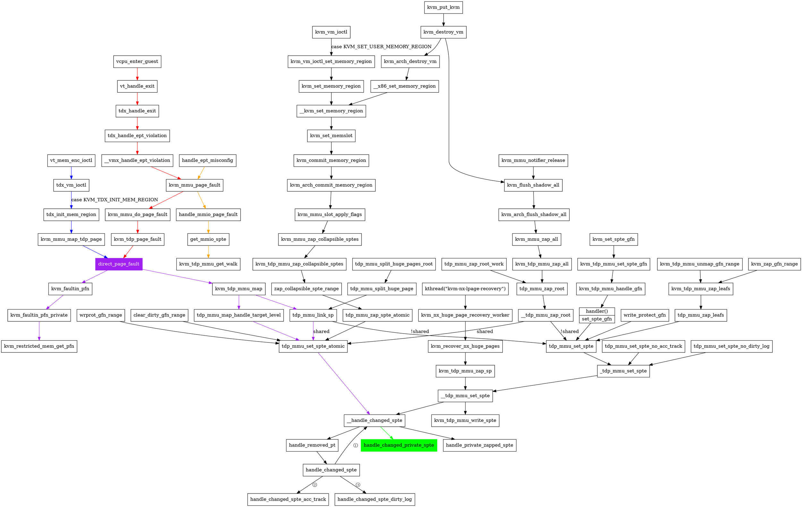

# [v11,000/113] KVM TDX basic feature support

* [[v11,000/113] KVM TDX basic feature support](https://patchwork.kernel.org/project/kvm/cover/cover.1673539699.git.isaku.yamahata@intel.com/)

## [v11,028/113] KVM: x86/mmu: Add address conversion functions for TDX shared bit of GPA
* 在 `struct kvm_arch` 中增加 `gfn_t gfn_shared_mask` 用于指明该 KVM module 的 `GPA.SHARED` 位在 GFN 中的掩码
* 新增方法

| 名称                      | 作用                            |
| --------------------------- | ---------------------------- |
| `kvm_gfn_shared_mask()`   | 返回`kvm->arch.gfn_shared_mask` |
| `kvm_gfn_shared(gfn)`     | 将 GFN 转为 shared              |
| `kvm_gfn_private(gfn)`    | 将 GFN 转为 private             |
| `kvm_gpa_private(gpa)`    | 将 GPA 转为 private             |
| `kvm_is_private_gpa(gpa)` | 判断 GPA 是否为私有地址         |

* 在 `tdx_td_init()` 初始化 `kvm.arch.gfn_shared_mask`，取决于 `TD_PARAMS` 的 `EXEC_CONTROLS` 域
  * `EXEC_CONTROLS` 域目前仅有一个域 `GPAW`，占 `1` bit，TD 作用域的 Guest Physical Address Width 执行控制：`TDH.VP.INIT` 时拷贝给每个 TD VMCS 的 `GPAW` 执行控制域
  * `0`：`GPA.SHARED` 位为 `GPA[47]`
  * `1`：`GPA.SHARED` 位为 `GPA[51]`
* **参考**：TDX Modules Spec, 20.2.4. TD_PARAMS，Table 20.5: TD_PARAMS_STRUCT.EXEC_CONTROLS Definition

## [v11,030/113] KVM: x86/mmu: Replace hardcoded value 0 for the initial value for SPTE
* 主要内容：将 *SPTE 的初始值* 从 hard coded 的 `0` 替换为 `SHADOW_NONPRESENT_VALUE`
* TDX 支持需要将“suppress #VE”位（bit `63`）设置为 SPTE 的初始值
  * 为了让 TD 对普通内存的首次访问时产生的 EPT violation 不产生 `#VE`，而是 VM-exit 到 VMM，由 VMM 来处理缺页
  * 为了减少代码更改大小，为影子页表条目 (SPTE) 的初始值引入一个新的宏 `SHADOW_NONPRESENT_VALUE` 并用它来替换原来 hard coded 的初始值 `0`
* 计划是无条件地为 AMD 和 Intel 设置“suppress #VE”位，对于已有的设计没有影响：
  1. AMD 硬件使用 bit `63` 作为 *已映射* 的 SPTE 的 `NX` 位，而对于 *未映射的* SPTE 则忽略该位
  2. 对于传统的 VMX guest，KVM 从不启用 VMCS 控制中的“EPT-violation #VE”，此时硬件忽略“suppress #VE”位
* 新增 `kvm_init_shadow_page()` 函数初始化页帧内容
  * `page` 指向页帧，而不是指向 `struct page` 结构体
  * 该函数将页帧中的 `512` 个条目都初始化为 `SHADOW_NONPRESENT_VALUE`

```cpp
static inline void kvm_init_shadow_page(void *page)
{
    memset64(page, SHADOW_NONPRESENT_VALUE, 4096 / 8);
}
```

* 新增 `mmu_topup_shadow_page_cache()` 函数填充以下两个 cache
  * `mmu_shadow_page_cache`：页表页 `struct kvm_mmu_page.spt` 的 caches
  * `mmu_private_spt_cache`：私有页表页的 cache。例如，TDX 模块使用的 Secure-EPT

```cpp
static int mmu_topup_shadow_page_cache(struct kvm_vcpu *vcpu)
{
    struct kvm_mmu_memory_cache *mc = &vcpu->arch.mmu_shadow_page_cache;
    int start, end, i, r;
    //如果 KVM 有 GFN 共享位掩码，填充私有页表页的 cache
    if (kvm_gfn_shared_mask(vcpu->kvm)) {
        r = kvm_mmu_topup_memory_cache(&vcpu->arch.mmu_private_spt_cache,
                           PT64_ROOT_MAX_LEVEL);
        if (r)
            return r;
    }
    //填充页表页的 cache
    start = kvm_mmu_memory_cache_nr_free_objects(mc);
    r = kvm_mmu_topup_memory_cache(mc, PT64_ROOT_MAX_LEVEL);
    //初始化新填充的页表页里每一个条目的内容，设置 SPTE 的初始值为 SHADOW_NONPRESENT_VALUE
    /*
     * Note, topup may have allocated objects even if it failed to allocate
     * the minimum number of objects required to make forward progress _at
     * this time_.  Initialize newly allocated objects even on failure, as
     * userspace can free memory and rerun the vCPU in response to -ENOMEM.
     */
    end = kvm_mmu_memory_cache_nr_free_objects(mc);
    for (i = start; i < end; i++)
        kvm_init_shadow_page(mc->objects[i]);
    return r;
}
```

* 原来填充 `mmu_shadow_page_cache` 的唯一地方是 KVM MMU memory cache 填充函数 `mmu_topup_memory_caches()`，现在把通用的 `kvm_mmu_topup_memory_cache(&vcpu->arch.mmu_shadow_page_cache, PT64_ROOT_MAX_LEVEL)`替换成了 x86 specific 的 `mmu_topup_shadow_page_cache()`，也就是说填充 `mmu_shadow_page_cache` 也会同时填充 `mmu_private_spt_cache`，因为它们的用途都是页表页的 caches

```diff
@@ -653,8 +686,7 @@ static int mmu_topup_memory_caches(struct kvm_vcpu *vcpu, bool maybe_indirect)
                       1 + PT64_ROOT_MAX_LEVEL + PTE_PREFETCH_NUM);
    if (r)
        return r;
-   r = kvm_mmu_topup_memory_cache(&vcpu->arch.mmu_shadow_page_cache,
-                      PT64_ROOT_MAX_LEVEL);
+   r = mmu_topup_shadow_page_cache(vcpu);
    if (r)
        return r;
    if (maybe_indirect) {
```

* x86-64 分配`mmu_shadow_page_cache`页表页的内存的时候不需要将其内容清零，避免重复工作，因为 `mmu_topup_shadow_page_cache()` 的最后调用的`kvm_init_shadow_page()` 除了设置 `SHADOW_NONPRESENT_VALUE` 还清除了其他字节，见 `kvm_init_shadow_page() -> memset64()`

```diff
@@ -5920,7 +5952,13 @@ int kvm_mmu_create(struct kvm_vcpu *vcpu)
    vcpu->arch.mmu_page_header_cache.kmem_cache = mmu_page_header_cache;
    vcpu->arch.mmu_page_header_cache.gfp_zero = __GFP_ZERO;

-   vcpu->arch.mmu_shadow_page_cache.gfp_zero = __GFP_ZERO;
+   /*
+    * When X86_64, initial SEPT entries are initialized with
+    * SHADOW_NONPRESENT_VALUE.  Otherwise zeroed.  See
+    * mmu_topup_shadow_page_cache().
+    */
+   if (!IS_ENABLED(CONFIG_X86_64))
+       vcpu->arch.mmu_shadow_page_cache.gfp_zero = __GFP_ZERO;

    vcpu->arch.mmu = &vcpu->arch.root_mmu;
    vcpu->arch.walk_mmu = &vcpu->arch.root_mmu;
```
* 初始化或清除 SPTE 的地方改用 `SHADOW_NONPRESENT_VALUE` 作为初值
  * `__update_clear_spte_fast()`
  * `__update_clear_spte_slow()`
  * `FNAME(sync_page)`
  * `tdp_mmu_zap_spte_atomic()`
  * `__tdp_mmu_zap_root()`
  * `tdp_mmu_zap_leafs()`
  * `set_spte_gfn()`

## [v11,031/113] KVM: x86/mmu: Allow non-zero value for non-present SPTE and removed SPTE
* 对于 x86-64 将第 `63` 位（“suppress #VE” bit）作为 `SHADOW_NONPRESENT_VALUE` 的值，然后分别对 SVM NPT，VMX EPT，TDX 对该位的解读解释了一通
* 把“suppress #VE” bit 也“或”入 `REMOVED_SPTE` 的值
* 因为 TDX module 总是使能 “EPT-violation #VE”，对于 TD 对普通内存的访问，必须设置 EPT 页表条目（SEPT）的 “suppress #VE” bit，避免产生 `#VE`
  * TD 对 MMIO 的内存的访问，则无需设置 EPT 的 “suppress #VE” bit，以便利用 `#VE` 弹射产生 TDVMCALL 来处理 MMIO
  * 对于透传给 TD 的设备的 MMIO 的内存访问与普通内存的处理相同，利用 EPT violation 填充 SEPT 建立映射

## [v11,032/113] KVM: x86/mmu: Add Suppress VE bit to shadow_mmio_mask
* 为了让 TDX 和 VMX 使用相同的 `shadow_mmio_mask` 值，将 “suppress #VE” bit 添加到 `shadow_mmio_mask`，使其对 VMX 和 TDX 通用
* `shadow_present_mask` 会被用于 `make_spte()` 以初始化普通内存访问（以及 VFIO）的 SEPT，
  * 对于 TD VM，SPTE **必须** 带上 “suppress #VE” bit，避免产生 `#VE`
  * 对于 legacy VM，KVM 从不启用 VMCS 控制中的“EPT-violation #VE”，此时硬件忽略“suppress #VE”位，因此这里设置上也没关系

```diff
--- a/arch/x86/kvm/mmu/spte.c
+++ b/arch/x86/kvm/mmu/spte.c
@@ -431,7 +431,9 @@ void kvm_mmu_set_ept_masks(bool has_ad_bits, bool has_exec_only)
    shadow_dirty_mask   = has_ad_bits ? VMX_EPT_DIRTY_BIT : 0ull;
    shadow_nx_mask      = 0ull;
    shadow_x_mask       = VMX_EPT_EXECUTABLE_MASK;
-   shadow_present_mask = has_exec_only ? 0ull : VMX_EPT_READABLE_MASK;
+   /* VMX_EPT_SUPPRESS_VE_BIT is needed for W or X violation. */
+   shadow_present_mask =
+       (has_exec_only ? 0ull : VMX_EPT_READABLE_MASK) | VMX_EPT_SUPPRESS_VE_BIT;
    /*
     * EPT overrides the host MTRRs, and so KVM must program the desired
     * memtype directly into the SPTEs.  Note, this mask is just the mask
```

## [v11,033/113] KVM: x86/mmu: Track shadow MMIO value on a per-VM basis
* 对于 MMIO，TDX 和 VMX 所用的 SPTE 条目是不同的
  * TDX MMIO 需要 `SEPT = 0`（第 `63` 位 “suppress #VE” bit 不为零）以产生 `#VE` 弹射后调用 TDVMCALL
  * VMX 需要触发 EPT misconfigration（`RWX=011`），然后将 IO 转交给 VMM 来处理
* 因此，在 `kvm_arch` 添加一个新成员 `shadow_mmio_value` 跟踪每个 VM 的 MMIO 值，而不是全局变量 `shadow_mmio_value`
  * 通过使用这样一个 MMIO 的每个 VM EPT 条目值，保持现有的 VMX 工作逻辑
  * 引入一个单独的 setter 函数 `kvm_mmu_set_mmio_spte_value()`，以便 TD guest 可以稍后覆盖 `kvm->arch.shadow_mmio_value`
* 还需要缓存 TDX 的 MMIO spte。实际上这是真实的情况，因为 TDX 需要 EPT，而 KVM EPT 允许缓存 MMIO spte
  * `enable_mmio_caching` 需要使能，缺省是使能的，可以通过 module 参数 `mmio_caching=0` 关闭
* `is_mmio_spte()` 增加入参 `kvm` 以得到 per-VM 的 `kvm->arch.shadow_mmio_value`

```diff
-static inline bool is_mmio_spte(u64 spte)
+static inline bool is_mmio_spte(struct kvm *kvm, u64 spte)
 {
-   return (spte & shadow_mmio_mask) == shadow_mmio_value &&
+   return (spte & shadow_mmio_mask) == kvm->arch.shadow_mmio_value &&
           likely(enable_mmio_caching);
 }
```
* 那么，用到 `is_mmio_spte()` 的地方都要改了
* 在 `kvm_mmu_init_vm()` 和 `make_mmio_spte()` 的改动是关键
  * `kvm_mmu_init_vm()` 让 per VM 的 `kvm->arch.shadow_mmio_value` 继承全局的 `shadow_mmio_value`
  * `make_mmio_spte()` 制作 MMIO SPTE 条目的时候改用 per VM 的 `kvm->arch.shadow_mmio_value`，而不再是全局的 `shadow_mmio_value`
  * 因为该 commit 还未引入 TD VM MMIO 的支持，所以还没有引入 `kvm_mmu_set_mmio_spte_value()` 覆盖 per VM 的 `kvm->arch.shadow_mmio_value` 的修改，而仅仅引入了 `kvm_mmu_set_mmio_spte_value()` 函数

## KVM: x86/mmu: Disallow fast page fault on private GPA
* TDX 需要 TDX SEAMCALL 来操作 Secure EPT，而不是直接内存访问，而 TDX SEAMCALL 是很重的操作，因此 Private GPA 上的快速缺页处理没有意义，将其禁用
* `fast_page_fault()` 函数判断能否对缺页进行快速处理，

  1. Access Tracking：SPTE 不存在，但已标记为进行 access tracking。这意味着我们需要恢复保存的 `R/X` 位
  2. Write-Protection：SEPT 页表存在，而缺页是由于写保护产生的

  * 如果缺页的 error code 的 present bit 被设置了，它表明 shadow page 在所有级别上都被填充了，这意味着我们所做的只是修改 SEPT 的 `W` access bit，这可以在 mmu-lock 之外完成
* 我们用来避免所有竞争是 SPTE 上的 Host-writable bit 和 MMU-writable bit：

  * **Host-writable** 意味着 GFN 在 host 内核页表和它的 KVM memslot 中是可写的
  * **MMU-writable** 表示 GFN 在 guest 的 mmu 中是可写的，并且不受影子页面写保护的保护
* 在快速缺页路径上，如果 `spte.HOST_WRITEABLE = 1` 和 `pte.WRITE_PROTECT = 1`，我们将使用 `cmpxchg` 自动设置 SPTE `W` 位；如果用于 access-traced 的 SPTE，或两者都恢复保存的 `R/X` 位。这是安全的，因为无论何时更改这些位都可以被 `cmpxchg` 检测到
* **参考**：

  * https://www.kernel.org/doc/html/latest/virt/kvm/locking.html#exception
  * [[PATCH v7 07/10] KVM: MMU: fast path of handling guest page fault](https://lore.kernel.org/all/4FE182D6.3020500@linux.vnet.ibm.com/)
  * [KVM: MMU: fast path of handling guest page fault](https://git.kernel.org/pub/scm/linux/kernel/git/torvalds/linux.git/commit/?id=c7ba5b48cc8ddc015a9e0463813ca1e60bc42c59)

## [v11,035/113] KVM: x86/mmu: Allow per-VM override of the TDP max page level
* TDX 需要特殊处理以支持私有大页。为简单起见，TD guest 暂时只支持 4K 页面
* 在 `struct kvm_arch` 添加域 `tdp_max_page_level` 表示 per-VM 最大页面级别支持，以支持 TD guest 和传统 VMX guest 的不同最大页面大小
* 对于传统的 VMX guest（以及 TD guest），在 `kvm_mmu_init_vm()` 将 `kvm->arch.tdp_max_page_level = KVM_MAX_HUGEPAGE_LEVEL`
  * 在随后的 commit，对于 TD guest，在 `tdx_vm_init()` 将 `kvm->arch.tdp_max_page_level = PG_LEVEL_4K` 覆盖初始的 `KVM_MAX_HUGEPAGE_LEVEL`
  * 在缺页处理的路径上 `kvm_mmu_do_page_fault()` 将 `fault.max_level = vcpu->kvm->arch.tdp_max_page_level` 实现特定化

## [v11,036/113] KVM: VMX: Introduce test mode related to EPT violation VE
* 为了支持 TDX，KVM 增加了对 `#VE` 的运用
  * 对于 TDX，KVM 程序有条件地注入 `#VE` 并在 EPT 条目中设置 *#VE 抑制位*
  * 对于 VMX 情况，不使用 `#VE`。如果 `#VE` 发生在 VMX 上，那就是一个 bug。
* 为了防御（测试 VMX 情况是否未损坏），引入选项 `ept_violation_ve_test`；当它被设置时，设为错误
* 增加宏定义 `#define SECONDARY_EXEC_EPT_VIOLATION_VE VMCS_CONTROL_BIT(EPT_VIOLATION_VE)`
  * **参考**：SDM Vol.3 24.6 VM-EXECUTION CONTROL FIELDS, Table 24-7. Definitions of Secondary Processor-Based VM-Execution Controls
* 在 `enum vmcs_field` 增加 `VE_INFORMATION_ADDRESS` 和 `VE_INFORMATION_ADDRESS_HIGH` 成员
* 为支持 “EPT-violation #VE” VM 执行控制，VM-execution control fields 包含以下域：
  * **Virtualization-exception information address**（64 位）：该字段包含 **virtualization-exception information area** 的物理地址。当逻辑处理器遇到虚拟化异常时，将虚拟化异常信息保存在虚拟化异常信息地址；
  * **EPTP index**（16 位）：当 EPT 违规导致虚拟化异常时，处理器将此域的值写入虚拟化异常信息区域。EPTP-switching VM function 更新此字段
  * **参考**：SDM Vol.3, 24.6.20 Controls for Virtualization Exceptions
* 新增 `struct vmx_ve_information` 对应到虚拟化异常信息
  * 包含的内容参考 SDM Vol.3, 25.5.7.2 Virtualization-Exception Information, Table 25-1. Format of the Virtualization-Exception Information Area
* 新增内联函数 `is_ve_fault(u32 intr_info)` 根据传入的异常向量判断是不是 `#VE`
* 新增 VMX module 参数 `ept_violation_ve_test`。如果该参数被设置为 `true`，在 `vmx_update_exception_bitmap()` 将 `#VE` 加入 exception bitmap 以便让 VMM 可以劫持 guest 发生的 `#VE`，针对 VMX 因为意外地修改而使用了 `#VE` 的情况进行测试和警告
* 为了测试，在 `struct vcpu_vmx` 中新增域 `struct vmx_ve_information *ve_info`
* 在 `init_vmcs()` 中新增 `ve_info` 域的空间分配和初始化，如失败则清除 VMCS 执行控制中的 `SECONDARY_EXEC_EPT_VIOLATION_VE` bit
* 在 `dump_vmcs()` 中新增 dump `ve_info` 域的信息的支持
* 修改 `handle_exception_nmi()`，如果 VM-exit 的原因是 `EXIT_REASON_EXCEPTION_NMI` 且中断向量是 `#VE`，则打印警告，因为 `#VE` 仅发生在 guest 中
  * 因为异常导致的退出和 NMI 的退出的 Basic Exit Reason 都是 `0`
  * **参考**：SDM Vol.3, APPENDIX C, VMX BASIC EXIT REASONS, Table C-1. Basic Exit Reasons

## [v11,038/113] KVM: x86/tdp_mmu: Init role member of struct kvm_mmu_page at allocation
* 主要工作：在分配 `struct kvm_mmu_page` 的时候就初始化 `role` 成员
* 重构 `tdp_mmu_alloc_sp()` 和 `tdp_mmu_init_sp()` 并消除 `tdp_mmu_init_child_sp()`
  * 当前 `tdp_mmu_init_sp()`（或 `tdp_mmu_init_child_sp()`）在 `tdp_mmu_alloc_sp()` 分配 `struct kvm_mmu_page` 及其页表页之后，设置 `kvm_mmu_page.role`
  * 此补丁使 `tdp_mmu_alloc_sp()` 初始化 `kvm_mmu_page.role`，而不是在 `tdp_mmu_init_sp()` 时，因此 `tdp_mmu_alloc_sp()` 需要传入 `role`
  * `tdp_mmu_init_child_sp()` 中关于 `role` 相关的操作移入新的 `tdp_iter` 函数 `tdp_iter_child_role()`
    * `tdp_iter_child_role()` 调用 `sptep_to_sp()`，根据迭代器当前迭代到的父页表页的 `iter->sptep` 得到父页表页对应的 `struct kvm_mmu_page` 结构的指针，从而得到父页表页的 `role`，在这个基础上加工出子页表页的 `child_role` 然后将之返回
    ```c
    static inline union kvm_mmu_page_role tdp_iter_child_role(struct tdp_iter *iter)
    {
        union kvm_mmu_page_role child_role;
        struct kvm_mmu_page *parent_sp;

        parent_sp = sptep_to_sp(rcu_dereference(iter->sptep));

        child_role = parent_sp->role;
        child_role.level--;
        return child_role;
    }
    ```
  * 此后，原来调 `tdp_mmu_init_child_sp()` 的地方都可以用 `tdp_mmu_init_sp()` 代替了
* 要处理 private 页表，需要传递 `is_private` 参数
  * 既然 page level 已经传下来了，再多加一个 shadow page 的参数就很累赘
  * 因此用 `union kvm_mmu_page_role` 替换 `level` 参数，这样参数的数量不会增加，并且可以传递更多关于 shadow page 的信息
* 对于 private shadow page，除了 `struct kvm_mmu_page` 和页表（`spt`成员）之外，还会分配 secure page table
  * 分配函数（`tdp_mmu_alloc_sp()` 和 `__tdp_mmu_alloc_sp_for_split()`）需要知道分配是针对常规页表还是私有页表
  * 将 `union kvm_mmu_role` 传递给这些函数并初始化 `struct kvm_mmu_page` 的 `role` 成员

## [v11,039/113] KVM: x86/mmu: Require TDP MMU for TDX
* Guest TD 需要 TDP MMU，所谓的“影子” MMU 不支持映射 guest 私有内存，即不支持 Secure-EPT
* 因此在为 VM 初始化 TDP MMU  `kvm_mmu_init_tdp_mmu()` 的时候，检查 VM 的类型如果是 `KVM_X86_TDX_VM` 又未使能 TDP MMU 的时候，返回 *不支持*（`-EOPNOTSUPP`）的错误码

## [v11,040/113] KVM: x86/mmu: Add a new is_private member for union kvm_mmu_page_role
* 因为 TDX 支持引入了私有映射，所以在 `union kvm_mmu_page_role` 中添加一个新的成员 `is_private`，并添加访问函数来检查该成员

| 名称                                  | 作用                                           |
| --------------------------------------- | ------------------------------------------- |
| `kvm_mmu_page_role_is_private(role)`  | 判断`role` 是否私有                            |
| `kvm_mmu_page_role_set_private(role)` | 设置`role` 为私有                              |
| `is_private_sp(sp)`                   | 判断`struct kvm_mmu_page` shadow page 是否私有 |
| `is_private_sptep(sptep)`             | 判断`sptep` 条目所属的 shadow page 是否私有    |

## [v11,041/113] KVM: x86/mmu: Add a private pointer to struct kvm_mmu_page
* 对于私有 GPA，CPU 引用一个内容被加密的私有页表，使用专门的 API 对其进行操作（例如更新/读取其 PTE 条目），并且它们的成本很高
* 当 KVM 解决 KVM 缺页时，它会遍历页表
  * 为了重用现有的 KVM MMU 代码并减轻直接遍历私有页表的沉重成本，多分配一页来复制 dummy 页表，供 KVM MMU 代码直接遍历
  * 使用现有代码解决 KVM 缺页，并对私有页表进行必要的额外操作
  * 为了区分这种情况，现有的 KVM 页表称为 **共享页表**（即不与私有页表关联），有私有页表的页表称为 **私有页表**
* 关系如下图所示：

```cpp
              KVM page fault                     |
                     |                           |
                     V                           |
        -------------+----------                 |
        |                      |                 |
        V                      V                 |
     shared GPA           private GPA            |
        |                      |                 |
        V                      V                 |
    shared PT root      dummy PT root            |    private PT root
        |                      |                 |           |
        V                      V                 |           V
     shared PT            dummy PT ----propagate---->   private PT
        |                      |                 |           |
        |                      \-----------------+------\    |
        |                                        |      |    |
        V                                        |      V    V
  shared guest page                              |    private guest page
                                                 |
                           non-encrypted memory  |    encrypted memory
                                                 |
```
* PT：页表
  - 共享 PT 对 KVM 可见，并由 CPU 使用
  - Private PT 被 CPU 使用，但对 KVM 不可见
  - Dummy PT 对 KVM 可见但不被 CPU 使用。它用于将 PT 更改传播到被 CPU 使用的实际的私有 PT
* 在 `struct kvm_mmu_page` 中添加指向私有页表的 private 指针 `void *private_spt`，并添加辅助函数以分配/初始化/释放私有页表页面

| 名称                                        | 作用                                                                  |
| --------------------------------------------- | ------------------------------------------------------------------ |
| `kvm_mmu_private_spt(sp)`                   | 传入指向管理结构`struct kvm_mmu_page`的指针，返回指向私有页表页的指针 |
| `kvm_mmu_init_private_spt(sp, private_spt)` | 设置`private_spt` 域                                                  |
| `kvm_mmu_alloc_private_spt()`               | 分配私有页表页                                                        |
| `kvm_mmu_free_private_spt()`                | 释放私有页表页                                                        |

* 在 `struct kvm_vcpu_arch` 中新增加了 `struct kvm_mmu_memory_cache mmu_private_spt_cache`，用于缓存私有页表
  * 在分析 [v11,030/113] KVM: x86/mmu: Replace hardcoded value 0 for the initial value for SPTE 的时候已经提前讲了 `mmu_topup_shadow_page_cache()` 的改动，见之前的分析
  * `mmu_free_memory_caches()` 的时候也增加了对私有页表页 cache `mmu_private_spt_cache` 的释放
* 分配私有页表页函数 `kvm_mmu_alloc_private_spt()`：
```cpp
static inline void kvm_mmu_alloc_private_spt(struct kvm_vcpu *vcpu, struct kvm_mmu_page *sp)
{   //传入的 sp 是不是根一级的页表页
    bool is_root = vcpu->arch.root_mmu.root_role.level == sp->role.level;
    // 因为 TDX module 在创建 TD vcpu 时分配根 Secure-EPT 页面并将其设置为 Secure-EPTP，因此不再需要其他的根 secure 页表
    KVM_BUG_ON(!kvm_mmu_page_role_is_private(sp->role), vcpu->kvm);
    if (is_root)
        /*
         * Because TDX module assigns root Secure-EPT page and set it to
         * Secure-EPTP when TD vcpu is created, secure page table for
         * root isn't needed.
         */
        sp->private_spt = NULL;
    else {
        /*
         * Because the TDX module doesn't trust VMM and initializes
         * the pages itself, KVM doesn't initialize them.  Allocate
         * pages with garbage and give them to the TDX module.
         */
        sp->private_spt = kvm_mmu_memory_cache_alloc(&vcpu->arch.mmu_private_spt_cache);
        /*
         * Because mmu_private_spt_cache is topped up before staring kvm
         * page fault resolving, the allocation above shouldn't fail.
         */
        WARN_ON_ONCE(!sp->private_spt);
    }
}
```

* 因为 TDX module 在创建 TD vcpu 时分配根 Secure-EPT 页面并将其设置为 Secure-EPTP，因此不再需要其他的根 secure 页表
* 因为 TDX module 不信任 VMM 并自行初始化页面，所以 KVM 不会初始化它们。分配带有垃圾的页面并将它们交给 TDX module
  * 注意：这里是从 `mmu_private_spt_cache` 分配得到的页帧

## [v11,042/113] KVM: Add flags to struct kvm_gfn_range
* 对于 TDX，`kvm_unmap_gfn_range()` 需要知道回调的原因，mmu notifier, 设置 memattr ioctl 或 restrictedmem notifier。基于以上原因，TDX 改变了行为：
  * mmu notifier，它是对共享内存槽的操作，以 zap 共享 PTE
  * set memattr，就是 private<->shared 转换的操作，zap 原来的 PTE
  * restrictedmem，就是打一个 range 的洞，zap 对应的 PTE
* 引入两个相关 flag 的定义
```c
#define KVM_GFN_RANGE_FLAGS_RESTRICTED_MEM BIT(0)
#define KVM_GFN_RANGE_FLAGS_SET_MEM_ATTR   BIT(1)
```
* `struct kvm_gfn_range` 增加域 `unsigned int flags` 和 `u64 attrs`
  * 其中域 `attrs` 与域 `pte_t pte` 构成 union，共用一段内存
* `kvm_restrictedmem_invalidate_begin()` 时设置 `gfn_range.flags = KVM_GFN_RANGE_FLAGS_SET_MEM_ATTR`
* `kvm_unmap_mem_range()` 时设置 `gfn_range.flags = KVM_GFN_RANGE_FLAGS_SET_MEM_ATTR`

## [v11,043/113] KVM: x86/tdp_mmu: Don't zap private pages for unsupported cases
* TDX 对于私有内存在架构上仅支持 *回写（WB）* 内存类型，因此（虚拟的）内存类型更改对私有内存没有意义
* 此外，目前，TDX 尚不支持页面迁移（TDX在架构上支持页面迁移。这是 KVM 和内核实现的问题）
1. 关于内存类型更改（MTRR 虚拟化和 LAPIC 页面映射更改），页面由 `kvm_zap_gfn_range()` 来清除
   * 在下一个 KVM 缺页时，为该页面填充具有新内存类型的 SPTE 条目
2. 关于页面迁移，页面由 MMU notifier 清除
   * 在下一次 KVM 缺页时，新迁移的页面将被填充
* 对于这两种情况，不要在取消映射时清除私有页面

* 删除/移动 KVM 内存插槽时，清除私有页面

* 通常 tearing down VM 时不要使私有页表无效。即，仅清除具有共享位掩码的 KVM mmu 的叶 SPTE
  * 现有的 `kvm_tdp_mmu_invalidate_all_roots()` 依赖于 `role.invalid` 和 `mmu_lock` 的 `read-lock` 以便其他 vcpu 可以同时操作 KVM MMU
    * 它将根页表标记为无效并清除根页表的 SPTE
  * TDX module 不允许从硬件中取消受保护的根页表，然后再为其分配一个新页表。即替换受保护的根页表。相反，仅清除使用共享位掩码集的 KVM MMU 的叶 SPTE

### 对 `tdp_mmu_zap_leafs()` 的修改

* `tdp_mmu_zap_leafs()` 增加了 `bool zap_private` 参数，它唯一的 caller `kvm_tdp_mmu_zap_leafs()` 需要传递这个参数
  * `zap_private = true` 清除私有/共享页面

```diff
@@ -974,6 +975,10 @@ static bool tdp_mmu_zap_leafs(struct kvm *kvm, struct kvm_mmu_page *root,

    lockdep_assert_held_write(&kvm->mmu_lock);

+   WARN_ON_ONCE(zap_private && !is_private_sp(root));
+   if (!zap_private && is_private_sp(root))
+       return false;
+
    rcu_read_lock();

    for_each_tdp_pte_min_level(iter, root, PG_LEVEL_4K, start, end) {
```
* 如果要求清除私有页面，但根页面又不是私有的，发出一次性的警告。因为这不是一个合理的组合
* 如果不要求清除私有页面，但根页面又是私有的，则没什么可做的，直接返回 `false`，不 flush
* 那么合理的能往下走的组合是：
  * 根页面是私有的，且要求清除私有页面
  * 根页面不是私有的，且不要求清除私有页面

### 对 `kvm_tdp_mmu_zap_leafs()` 的调用者的修改
* `kvm_tdp_mmu_zap_leafs()` 的 callers，也需传递 `zap_private` 这个参数
  1. `kvm_zap_gfn_range()`：用于修改 MTRR 或者 PAT 内存类型的时候。之后在下一次 KVM 缺页时，用更新后的 SPTE 条目填充。而私有页面在架构上仅支持 *回写（WB）* 内存类型，因此此处调用 `kvm_tdp_mmu_zap_leafs()` 时入参 `zap_private` 是 `false`
  2. `kvm_tdp_mmu_unmap_gfn_range()`：用于 MMU notifier，通过 `kvm_unmap_gfn_range()` 函数调用；增加入参 `zap_private`

#### 对 `kvm_tdp_mmu_unmap_gfn_range()` 及其调用者的修改
* `kvm_tdp_mmu_unmap_gfn_range()` 有两个 callers：
  1. `kvm_unmap_gfn_range()`：用于 MMU notifier 等
  2. `kvm_mmu_zap_memslot()`：本 patch 新增的函数

##### 对 `kvm_unmap_gfn_range()` 的修改
* 其调用者目前有三个，
  1. mmu notifier handler：`kvm_mmu_unmap_gfn_range()`
  2. restrictedmem：`kvm_restrictedmem_invalidate_begin()`
  3. set memattr：`kvm_unmap_mem_range()`
* 在 [v11,042/113] KVM: Add flags to struct kvm_gfn_range 已经修改过后两个了
* `kvm_unmap_gfn_range()` 则根据之前的修改，增加了对 `KVM_GFN_RANGE_FLAGS_RESTRICTED_MEM` 和 `KVM_GFN_RANGE_FLAGS_SET_MEM_ATTR` flags 的判断：
```cpp
kvm_unmap_gfn_range()
-> kvm_tdp_mmu_unmap_gfn_range(kvm, range, flush, zap_private)
   -> kvm_tdp_mmu_zap_leafs()
         for_each_tdp_mmu_root_yield_safe() //遍历 kvm->arch.tdp_mmu_roots
         -> tdp_mmu_zap_leafs(..., zap_private && is_private_sp(root))
               for_each_tdp_pte_min_level() //遍历指定范围的 SPTE
               -> tdp_mmu_set_spte(kvm, &iter, SHADOW_NONPRESENT_VALUE) //SPTE 内容设为不存在
                  -> _tdp_mmu_set_spte(kvm, iter, new_spte, true, true)
                     -> iter->old_spte = __tdp_mmu_set_spte()
                        -> old_spte = kvm_tdp_mmu_write_spte()
                           -> kvm_tdp_mmu_write_spte_atomic(sptep, new_spte)
                              -> xchg(rcu_dereference(sptep), new_spte)
                           //or
                           -> __kvm_tdp_mmu_write_spte(sptep, new_spte)
                              -> WRITE_ONCE(*rcu_dereference(sptep), new_spte)
                        -> __handle_changed_spte()
```

##### 新增的 `kvm_mmu_zap_memslot()`
* `kvm_mmu_zap_memslot()` 用于将指定的 **内存 slot** 的映射清除
  * 清除的 GFN range 来自于指定的 slot
  * 清除的动作通过调用 `kvm_tdp_mmu_unmap_gfn_range(kvm, &range, flush, true)` 进行
    * 该动作处理了私有和共享 GFN，所有的私有页面应该从内存 slot 上清除

### 对 `kvm_mmu_invalidate_zap_pages_in_memslot()` 的修改
* 在 `kvm_mmu_invalidate_zap_pages_in_memslot()` 新增条件，如果是 TDVM，`kvm_mmu_zap_memslot()`；否则才是 `kvm_mmu_zap_all_fast()` 分支
  * Secure-EPT 需要从叶子中释放页表，因此对带有子页表的 root 页表，先清除 root 页表的优化不起作用
* 如果是 fast 路径，`kvm_tdp_mmu_invalidate_all_roots()` 将每个 TDP MMU root 标记为无效，以防止 vCPU 重新使用即将被清除的 root，例如，响应内存槽更新
  * 调度 `tdp_mmu_zap_root_work` 去 invalidate 所有在 `kvm->arch.tdp_mmu_roots` list 上的 root sp
  * 本 patch 在 `kvm_tdp_mmu_invalidate_all_roots()` 中新增检查，如果是私有的 root sp，则跳过。因为私有页表只在 VM 被销毁时拆除（torn down）
```c
kvm_vm_ioctl()
case KVM_SET_USER_MEMORY_REGION:
-> kvm_vm_ioctl_set_memory_region()
   -> kvm_set_memory_region()
      -> __kvm_set_memory_region()
         -> kvm_set_memslot()
               if (change == KVM_MR_DELETE || change == KVM_MR_MOVE)
               -> kvm_invalidate_memslot()
                  -> kvm_arch_flush_shadow_memslot()
                     -> kvm_page_track_flush_slot()
                           hlist_for_each_entry_srcu(n, &head->track_notifier_list, ...)
                           -> n->track_flush_slot()
                           => kvm_mmu_invalidate_zap_pages_in_memslot()
                              if (kvm_gfn_shared_mask(kvm)) //新增了这个条件，如果是 TDVM
                                 kvm_mmu_zap_memslot(kvm, slot) //新增的函数
                                 -> kvm_tdp_mmu_unmap_gfn_range(kvm, &range, flush, true)
                              else
                                 kvm_mmu_zap_all_fast(kvm)
                                    if (is_tdp_mmu_enabled(kvm))
                                    -> kvm_tdp_mmu_invalidate_all_roots()
                                          list_for_each_entry(root, &kvm->arch.tdp_mmu_roots, ...)
                                             if (is_private_sp(root)) //新增了这个条件
                                                continue；
                                          -> tdp_mmu_schedule_zap_root(kvm, root)
                                             -> INIT_WORK(&root->tdp_mmu_async_work, tdp_mmu_zap_root_work)
                                             -> queue_work(kvm->arch.tdp_mmu_zap_wq, &root->tdp_mmu_async_work)
```
* 还有一个到 `__kvm_set_memory_region()` 的路径如下，应该是个销毁 VM 的路径：
```c
kvm_put_kvm()
-> kvm_destroy_vm()
   -> kvm_arch_destroy_vm()
      -> __x86_set_memory_region(kvm, APIC_ACCESS_PAGE_PRIVATE_MEMSLOT, 0, 0)
      -> __x86_set_memory_region(kvm, IDENTITY_PAGETABLE_PRIVATE_MEMSLOT, 0, 0)
      -> __x86_set_memory_region(kvm, TSS_PRIVATE_MEMSLOT, 0, 0)
         -> __kvm_set_memory_region()
```

## [v11,044/113] KVM: x86/tdp_mmu: Make handle_changed_spte() return value
* 当多个 vcpu 尝试在同一个 TDX 资源（如 Secure EPT）上操作时，TDX 操作可能会失败并提示 `TDX_OPERAND_BUSY`
  * 它不会 spin 并返回 busy 错误给 VMM，以便 VMM 必须采取行动，例如，重试或什么其他操作
* 因为 TDP MMU 使用 read spin lock 来实现可伸缩性，围绕 seam call 的自旋锁破坏了 TDP MMU 的努力
* 另一种选择是让 SEAMCALL 失败，缺页处理程序应该重试
  * 使 `handle_changed_spte()` 及其调用者将值返回，以便 kvm 缺页处理程序可以在这种情况下也能够返回
  * 这个 patch 让它只返回零
* `handle_changed_spte()` 和 `__handle_changed_spte()` 的返回值类型从 `void` 变为 `int __must_check`
  * 返回 `0` 表示成功，非零表示出错
  * 它们的调用者需要做相应的改变，必须检查返回值

## [v11,045/113] KVM: x86/mmu: Make make_spte() aware of shared GPA for MTRR
* `make_spte()` 会调用 `get_mt_mask()` 方法来构造 SPTE 中 MTRR 相关的位
* 对于共享 GPA 的 TDX MTRR 支持，`get_mt_mask()` 方法需要知道给定的 `gfn` 是共享的还是私有的，因此传给 `make_spte()` 的 GPA 是带 shared bit 的
* 为了让 `make_spte()` 意识到传给它的 GPA 有可能是共享 GPA，将它的参数 `gfn` 重命名为 `gfn_including_shared` 以使其含义明确
* `gfn_t gfn = gfn_including_shared & ~kvm_gfn_shared_mask(vcpu->kvm)` 把 shared bit 清掉，以使 `make_spte()` 的其他代码不用变

## [v11,046/113] KVM: x86/tdp_mmu: Support TDX private mapping for TDP MMU
* 为私有页表分配保护页表，并添加 hooks 对保护页表进行操作
  * 此 patch 添加了分配/释放受保护的页表及其 hooks
* 当调用 hooks 更新 SPTE 条目、冻结条目时，允许调用 hook 解冻条目对页表进行并发更新。这就是 TDP MMU 的优势
* 由于 `kvm_gfn_shared_mask()` 始终返回 `false`，因此此 patch 尚未调用这些 hooks
* 当缺页的 GPA 是 private 时，该 KVM 缺页称为 *私有的*
  * 解决私有 KVM 缺页时，分配保护页表，调用 hooks 对保护页表进行操作
  * 在更改私有 PTE 条目时，调用 `__handle_changed_spte()` 中的 `kvm_x86_ops` hook 以将更改传播到受保护的页表

```c
 private KVM page fault    |
      |                    |
      V                    |
 private GPA               |     CPU protected EPTP
      |                    |           |
      V                    |           V
 private PT root           |     protected PT root
      |                    |           |
      V                    |           V
   private PT --hook to propagate-->protected PT
      |                    |           |
      \--------------------+------\    |
                           |      |    |
                           |      V    V
                           |    private guest page
                           |
                           |
     non-encrypted memory  |    encrypted memory
```
* 现有的 KVM TDP MMU 代码原子地更新 SPTE
* 在填充 EPT 条目时，自动地设置条目。但是，它需要 TLB shootdown 才能 zap SPTE
  * 为了解决这个问题，条目以特殊 SPTE 值被冻结，且清除 present 位
  * 在 TLB shootdown 之后，条目被设置为最终值（解冻）
* 对于受保护的页表，除了直接访问私有 SPTE 之外，还会调用 hook 来更新受保护的页表
* 对于 zapping case，它可以冻结 SPTE。除了 TLB shootdown 之外，它还可以调用 hook
* 对于填充私有 SPTE 条目，没有进一步保护的话，存在以下竞争条件：
```c
  vcpu 1: populating 2M private SPTE
  vcpu 2: populating 4K private SPTE
  vcpu 2: TDX SEAMCALL to update 4K protected SPTE => error
  vcpu 1: TDX SEAMCALL to update 2M protected SPTE
```
* 为了避免竞争，使用了冻结的 SPTE。不是对私有条目进行原子地更新，而是冻结条目，调用更新受保护 SPTE 的 hook，将条目设置为最终值
* 现阶段仅支持 4K 页面。2M 页面支持可以在未来的 patch 中完成

### 新增 `struct kvm_x86_ops` Hooks
* `struct kvm_x86_ops` 增加了以下 hooks：
  * `link_private_spt`
  * `free_private_spt`：释放私有的 SEPT，`tdh_mem_sept_remove()`
  * `set_private_spte`
  * `remove_private_spte`：移除被取消映射的私有 secure 页面，`tdh_mem_page_remove()`
  * `zap_private_spte`：阻止映射给定范围的 SPTE，`tdh_mem_range_block()`

### 私有根页表
#### 新增 `private_root_hpa` 成员
* `struct kvm_mmu` 增加了成员 `hpa_t private_root_hpa`，保存 *私有的根页表的 HPA*
  * `__kvm_mmu_create()` 的时候将它的值初始化 `INVALID_PAGE`
  * 在 `mmu_alloc_direct_roots()` 的时候给它赋有效值：
```diff
--- a/arch/x86/kvm/mmu/mmu.c
+++ b/arch/x86/kvm/mmu/mmu.c
@@ -3674,7 +3674,12 @@ static int mmu_alloc_direct_roots(struct kvm_vcpu *vcpu)
        goto out_unlock;

    if (is_tdp_mmu_enabled(vcpu->kvm)) {
-       root = kvm_tdp_mmu_get_vcpu_root_hpa(vcpu);
+       if (kvm_gfn_shared_mask(vcpu->kvm) &&
+           !VALID_PAGE(mmu->private_root_hpa)) {
+           root = kvm_tdp_mmu_get_vcpu_root_hpa(vcpu, true);
+           mmu->private_root_hpa = root;
+       }
+       root = kvm_tdp_mmu_get_vcpu_root_hpa(vcpu, false);
        mmu->root.hpa = root;
    } else if (shadow_root_level >= PT64_ROOT_4LEVEL) {
        root = mmu_alloc_root(vcpu, 0, 0, shadow_root_level);
```
* 如果 KVM 支持共享掩码（目前仅 TDX 这么做），且 `mmu->private_root_hpa` 的值不是个有效的 page（无效值也就是`INVALID_PAGE`），那么就调`kvm_tdp_mmu_get_vcpu_root_hpa(vcpu, true)` 来得到私有根页表的 HPA
  * 注意：第二个参数是 `true` 表明想要一个 **私有的** 根页表的 HPA
* 即使没有满足以上条件，也会通过 `kvm_tdp_mmu_get_vcpu_root_hpa(vcpu, false)` 来得到共享根页表的 HPA，并赋值给 `mmu->root.hpa = root`
  * 注意：第二个参数是 `false` 表明想要一个 **共享的** 根页表的 HPA
* 所以说，分配直接映射根页表的时候，如果是 TDX 会将私有根页表会一起分配出来：
```c
kvm_mmu_reload()
-> kvm_mmu_load()
   -> mmu_alloc_direct_roots()
      -> root = kvm_tdp_mmu_get_vcpu_root_hpa(vcpu, true)
         mmu->private_root_hpa = root;
      -> root = kvm_tdp_mmu_get_vcpu_root_hpa(vcpu, false)
         mmu->root.hpa = root;
   -> kvm_mmu_load_pgd()
      -> static_call(kvm_x86_load_mmu_pgd)(vcpu, root_hpa, vcpu->arch.mmu->root_role.level)
      => vt_load_mmu_pgd() //root_hpa = vcpu->arch.mmu->root.hpa
         if (is_td_vcpu(vcpu))
         -> tdx_load_mmu_pgd(vcpu, root_hpa, pgd_level) //把 vcpu->arch.mmu->root.hpa 写到 TD VMCS 的 SHARED_EPT_POINTER 域
            -> td_vmcs_write64(to_tdx(vcpu), SHARED_EPT_POINTER, root_hpa & PAGE_MASK)
   -> static_call(kvm_x86_flush_tlb_current)(vcpu)
```
#### 分配私有根页表

* `kvm_tdp_mmu_get_vcpu_root_hpa()` 函数的大部分内容放入新函数 `kvm_tdp_mmu_get_vcpu_root()`，`kvm_tdp_mmu_get_vcpu_root_hpa()` 成为一个简单的 wrapper
   ```c
   hpa_t kvm_tdp_mmu_get_vcpu_root_hpa(struct kvm_vcpu *vcpu, bool private)
   {
       return __pa(kvm_tdp_mmu_get_vcpu_root(vcpu, private)->spt);
   }
   ```
   * 顾名思义，该函数根据新增的入参 `private`是私有的与否，返回 VCPU 的私有或共享的根页表页的 HPA，见之前 `mmu_alloc_direct_roots()` 对它的使用
* 而新函数 `kvm_tdp_mmu_get_vcpu_root()` 根据要求，即入参 `private` 返回 VCPU 私有或共享的根页表页的 `struct kvm_mmu_page sp` 管理结构
```c
static struct kvm_mmu_page *kvm_tdp_mmu_get_vcpu_root(struct kvm_vcpu *vcpu,
                              bool private)
{
    union kvm_mmu_page_role role = vcpu->arch.mmu->root_role;
    struct kvm *kvm = vcpu->kvm;
    struct kvm_mmu_page *root;

    lockdep_assert_held_write(&kvm->mmu_lock);

    /*
     * Check for an existing root before allocating a new one.  Note, the
     * role check prevents consuming an invalid root.
     */
    if (private) //作为被封装的函数，其实只有这个条件才是改 patch 新增的
        kvm_mmu_page_role_set_private(&role); //作为一个 get 函数，居然干了 set 的事情
    for_each_tdp_mmu_root(kvm, root, kvm_mmu_role_as_id(role)) { //目前就 smm 和 regular 两个 as
        if (root->role.word == role.word &&
            kvm_tdp_mmu_get_root(root)) //因为只有一个根页表，这里只是增加引用计数 
            goto out;
    }
    //在没有根页表的情况下才会新分配根页表页、私有页表页及其管理结构 sp
    root = tdp_mmu_alloc_sp(vcpu, role);
    tdp_mmu_init_sp(root, NULL, 0); //根页表的父页表是 NULL，GFN 从 0 开始
    //引用计数从 1 开始
    refcount_set(&root->tdp_mmu_root_count, 1);

    spin_lock(&kvm->arch.tdp_mmu_pages_lock);
    list_add_rcu(&root->link, &kvm->arch.tdp_mmu_roots); //又在 get 函数里修改东西
    spin_unlock(&kvm->arch.tdp_mmu_pages_lock);

out:
    return root;
}
```
#### 对 SP 分配函数 `tdp_mmu_alloc_sp()` 的修改
* 修改 `tdp_mmu_alloc_sp()`，如果申请分配的 `role` 是私有的，则在分配 `struct kvm_mmu_page sp` 管理结构和页表页时，还需分配私有页表页
  * `sp.spt` 指向常规页表页
  * `sp.private_spt` 指向私有页表页
```diff
--- a/arch/x86/kvm/mmu/tdp_mmu.c
+++ b/arch/x86/kvm/mmu/tdp_mmu.c
@@ -296,6 +296,9 @@ static struct kvm_mmu_page *tdp_mmu_alloc_sp(struct kvm_vcpu *vcpu,
    sp = kvm_mmu_memory_cache_alloc(&vcpu->arch.mmu_page_header_cache);
    sp->spt = kvm_mmu_memory_cache_alloc(&vcpu->arch.mmu_shadow_page_cache);
    sp->role = role;

+   if (kvm_mmu_page_role_is_private(role))
+       kvm_mmu_alloc_private_spt(vcpu, sp);
+
    return sp;
 }
```
#### 释放私有根页表
* `kvm_mmu_destroy()` 的时候会调用 `mmu_free_root_page(vcpu->kvm, &vcpu->arch.mmu->private_root_hpa, ...)` 将之释放
* 由 `kvm_mmu_free_roots()` 释放其他的根页表

### TDP MMU PTE 迭代宏 `tdp_mmu_for_each_pte()` 的修改
* TDP MMU PTE 迭代宏 `tdp_mmu_for_each_pte()` 增加了 `_private` 参数，用于指明遍历是从共享根页表还是从私有根页表开始
```diff
-#define tdp_mmu_for_each_pte(_iter, _mmu, _start, _end)        \
-   for_each_tdp_pte(_iter, to_shadow_page(_mmu->root.hpa), _start, _end)
+#define tdp_mmu_for_each_pte(_iter, _mmu, _private, _start, _end)  \
+   for_each_tdp_pte(_iter,                     \
+        to_shadow_page((_private) ? _mmu->private_root_hpa :   \
+               _mmu->root.hpa),            \
+       _start, _end)
```
* 其他两处该宏的调用者 `kvm_tdp_mmu_get_walk()` 和 `kvm_tdp_mmu_fast_pf_get_last_sptep()` 受其影响需要做相应的适配，`_private` 参数需要是 `false`
* `kvm_tdp_mmu_get_walk()` 在处理 MMIO 缺页的路径上 `handle_mmio_page_fault()`
  * MMIO 访问的肯定不能是私有页面，所以遍历的时候根页表必然不是私有页表
* `kvm_tdp_mmu_fast_pf_get_last_sptep()` 在快速缺页处理的路径上 `fast_page_fault()`
  * Private GPA 上的快速缺页处理没有意义（见之前的分析），因此遍历的时候根页表必然不是私有页表

### KVM 缺页路径上的修改
* `kvm_mmu_do_page_fault()` 构造 `struct kvm_page_fault fault` 实例时，`.is_private` 域根据输入 `cr2_or_gpa` 是不是私有 GPA 来赋值
```diff
    struct kvm_page_fault fault = {
        .addr = cr2_or_gpa,
        ...
+       .is_private = kvm_is_private_gpa(vcpu->kvm, cr2_or_gpa),
        ...
    };
```
#### 对 `direct_page_fault()` 的修改
* `direct_page_fault()` 把 `fault->gfn` 的 shared bit 给去掉：
```diff
@@ -4396,7 +4401,7 @@ static int direct_page_fault(struct kvm_vcpu *vcpu, struct kvm_page_fault *fault
    unsigned long mmu_seq;
    int r;

-   fault->gfn = fault->addr >> PAGE_SHIFT;
+   fault->gfn = gpa_to_gfn(fault->addr) & ~kvm_gfn_shared_mask(vcpu->kvm);
    fault->slot = kvm_vcpu_gfn_to_memslot(vcpu, fault->gfn);

    if (page_fault_handle_page_track(vcpu, fault))
```
* 使用 `kvm_vcpu_gfn_to_memslot()` 接口时用的 `gfn` 需要不带 shared bit

#### 对 `kvm_tdp_mmu_map()` 的修改
* 迭代 SPTE 时用的是 **原始 GFN**，即产生 KVM 缺页的 GFN，是带 shared bit 的 GFN
* `kvm_tdp_mmu_map()` 除了修改 `tdp_mmu_for_each_pte()` 迭代时的参数是原始缺页的 GFN 外还有其他改动几处：
1. `is_error_noslot_pfn()` 判断传入的 PFN/GFN 最高 `12` 位是不是全零
   * `62~52` bit 不为零：表示 *错误的 PFN*（`#define KVM_PFN_ERR_MASK    (0x7ffULL << 52)`）
   * `63` bit 不为零：表示 *无 slot 的 PFN*（`#define KVM_PFN_NOSLOT    (0x1ULL << 63)`）
2. `!kvm_pfn_to_refcounted_page()` 对 KVM 而言，该 `pfn` 无有效的 `page` 支持
   * `kvm_pfn_to_refcounted_page()`：如果 `pfn` 是“有效的”并且由引用计数的页面支持，则返回 `struct page *`，否则返回 `NULL`
* 满足以上两个条件，并且是私有地址的缺页，则返回 `-EFAULT`，无法处理该缺页
```diff
@@ -1213,6 +1371,8 @@ int kvm_tdp_mmu_map(struct kvm_vcpu *vcpu, struct kvm_page_fault *fault)
    struct kvm *kvm = vcpu->kvm;
    struct tdp_iter iter;
    struct kvm_mmu_page *sp;
+   gfn_t raw_gfn;
+   bool is_private = fault->is_private;
    int ret = RET_PF_RETRY;

    kvm_mmu_hugepage_adjust(vcpu, fault);
@@ -1221,7 +1381,17 @@ int kvm_tdp_mmu_map(struct kvm_vcpu *vcpu, struct kvm_page_fault *fault)

    rcu_read_lock();

-   tdp_mmu_for_each_pte(iter, mmu, fault->gfn, fault->gfn + 1) {
+   raw_gfn = gpa_to_gfn(fault->addr);
+
+   if (is_error_noslot_pfn(fault->pfn) ||
+       !kvm_pfn_to_refcounted_page(fault->pfn)) {
+       if (is_private) {
+           rcu_read_unlock();
+           return -EFAULT;
+       }
+   }
+
+   tdp_mmu_for_each_pte(iter, mmu, is_private, raw_gfn, raw_gfn + 1) {
        int r;

        if (fault->nx_huge_page_workaround_enabled)
@@ -1251,9 +1421,14 @@ int kvm_tdp_mmu_map(struct kvm_vcpu *vcpu, struct kvm_page_fault *fault)

        sp->nx_huge_page_disallowed = fault->huge_page_disallowed;

-       if (is_shadow_present_pte(iter.old_spte))
+       if (is_shadow_present_pte(iter.old_spte)) {
+           /*
+            * TODO: large page support.
+            * Doesn't support large page for TDX now
+            */
+           KVM_BUG_ON(is_private_sptep(iter.sptep), vcpu->kvm);
            r = tdp_mmu_split_huge_page(kvm, &iter, sp, true);
-       else
+       } else
            r = tdp_mmu_link_sp(kvm, &iter, sp, true);

        /*
```
* 目前 TDX 内核实现暂不支持大页，所以进入分割巨页的条件分支时打印警告信息
* 在拆分大页的路径上，也有分配中间子页表的操作：
```c
tdp_mmu_split_huge_pages_root()
-> tdp_mmu_alloc_sp_for_split()
   -> __tdp_mmu_alloc_sp_for_split()
```
* 同理，当分配意欲用作拆分大页过程中的子页表页是私有页面时，
  * 在`tdp_mmu_alloc_sp_for_split()` 触发 `KVM_BUG_ON()`
  * 在`__tdp_mmu_alloc_sp_for_split()` 触发 `WARN_ON_ONCE()`

### 参数改为 `role` 传递更多的信息
* `handle_changed_spte()` 的 `int level` 参数变为 `union kvm_mmu_page_role role` 以携带更多的信息
  * 相应地，它的 caller `handle_removed_pt()` 也要改
  * 而它调用的 `__handle_changed_spte()`，`handle_changed_spte_acc_track()` 和 `handle_changed_spte_dirty_log()` 都做了相应的更改
* `handle_changed_spte_dirty_log()` 要用 GFN 找 slot `__gfn_to_memslot()`，这个函数要求 GFN 是不带 shared bit 的，所以修改 `gfn = gfn & ~kvm_gfn_shared_mask(kvm)`
  * 传给 `handle_changed_spte_dirty_log()` 的参数 `gfn_t gfn` 是原始 GFN，即带 shared bit 的。比如说，缺页路径上的 GFN 就来自 `kvm_tdp_mmu_map()` 调 `tdp_iter` 迭代时的 `_start` 和 `_end`，这两个值来自缺页时获得的原始 GFN，见本 patch 中对 `kvm_tdp_mmu_map()` 进行的修改

### `tdp_mmu_map_handle_target_level()` 相关的修改
* TDX 共享页 *不可执行*，因为可执行的代码肯定是在 TD 里，共享页是为了共享一些信息，所以增加了一个判断条件：
  * 如果这次缺页的是一个共享页面，把执行控制位 `ACC_EXEC_MASK` 从 SPTE 中剔除
* 注意：传给 `mke_spte()` 的 GFN 是带 shared bit 的
```diff
@@ -1131,10 +1280,19 @@ static int tdp_mmu_map_handle_target_level(struct kvm_vcpu *vcpu,

    if (unlikely(!fault->slot))
        new_spte = make_mmio_spte(vcpu, iter->gfn, ACC_ALL);
-   else
-       wrprot = make_spte(vcpu, sp, fault->slot, ACC_ALL, iter->gfn,
-                    fault->pfn, iter->old_spte, fault->prefetch, true,
-                    fault->map_writable, &new_spte);
+   else {
+       unsigned long pte_access = ACC_ALL;
+
+       /* TDX shared GPAs are no executable, enforce this for the SDV. */
+       if (kvm_gfn_shared_mask(vcpu->kvm) && !fault->is_private)
+           pte_access &= ~ACC_EXEC_MASK;
+
+       wrprot = make_spte(vcpu, sp, fault->slot, pte_access,
+                  gpa_to_gfn(fault->addr)/* include shared bit */,
+                  fault->pfn, iter->old_spte,
+                  fault->prefetch, true, fault->map_writable,
+                  &new_spte);
+   }

    if (new_spte == iter->old_spte)
        ret = RET_PF_SPURIOUS;
```

### `tdp_mmu_set_spte_atomic()` 相关的修改
* 对于常规页表，更新流程为
  - 使用原子操作更新 STPE
  - 处理更改的 SPTE，`__handle_changed_spte()`
  * 注意：`__handle_changed_spte()`（和函数）必须能够安全地防止并发更新。
    * zap SPTE 是一个例外，参见 `tdp_mmu_zap_spte_atomic()`。它先原子地将 SPTE 设为 `REMOVED_SPTE`，flush TLB，然后再将SPTE 设为 `SHADOW_NONPRESENT_VALUE`
* 对于私有页表，需要回调将 SPTE 更改传播到受保护的页表。为了使用回调原子地更新 SPTE 和受保护的页表，使用了冻结 SPTE
  - 冻结 SPTE，将条目设置为 `REMOVED_SPTE`，`try_cmpxchg64(sptep, &iter->old_spte, tmp_spte = REMOVED_SPTE)`
  - 触发受保护页表的回调，`__handle_changed_spte()`
  - 解冻 SPTE，将条目设置为 `new_spte`
```diff
@@ -674,6 +781,24 @@ static inline int __must_check tdp_mmu_set_spte_atomic(struct kvm *kvm,
                               struct tdp_iter *iter,
                               u64 new_spte)
 {
+   /*
+    * For conventional page table, the update flow is
+    * - update STPE with atomic operation
+    * - handle changed SPTE. __handle_changed_spte()
+    * NOTE: __handle_changed_spte() (and functions) must be safe against
+    * concurrent update.  It is an exception to zap SPTE.  See
+    * tdp_mmu_zap_spte_atomic().
+    *
+    * For private page table, callbacks are needed to propagate SPTE
+    * change into the protected page table.  In order to atomically update
+    * both the SPTE and the protected page tables with callbacks, utilize
+    * freezing SPTE.
+    * - Freeze the SPTE. Set entry to REMOVED_SPTE.
+    * - Trigger callbacks for protected page tables. __handle_changed_spte()
+    * - Unfreeze the SPTE.  Set the entry to new_spte.
+    */
+   bool freeze_spte = is_private_sptep(iter->sptep) && !is_removed_spte(new_spte);
+   u64 tmp_spte = freeze_spte ? REMOVED_SPTE : new_spte;
    u64 *sptep = rcu_dereference(iter->sptep);
    int ret;

@@ -691,14 +816,24 @@ static inline int __must_check tdp_mmu_set_spte_atomic(struct kvm *kvm,
     * Note, fast_pf_fix_direct_spte() can also modify TDP MMU SPTEs and
     * does not hold the mmu_lock.
     */
-   if (!try_cmpxchg64(sptep, &iter->old_spte, new_spte))
+   if (!try_cmpxchg64(sptep, &iter->old_spte, tmp_spte))
        return -EBUSY;

    ret = __handle_changed_spte(kvm, iter->as_id, iter->gfn, iter->old_spte,
-                   new_spte, iter->level, true);
+                   new_spte, sptep_to_sp(sptep)->role, true);
    if (!ret)
        handle_changed_spte_acc_track(iter->old_spte, new_spte, iter->level);

+   if (ret) {
+       /*
+        * !freeze_spte means this fault isn't private.  No call to
+        * operation on Secure EPT.
+        */
+       WARN_ON_ONCE(!freeze_spte);
+       __kvm_tdp_mmu_write_spte(sptep, iter->old_spte);
+   } else if (freeze_spte)
+       __kvm_tdp_mmu_write_spte(sptep, new_spte);
+
    return ret;
 }

```
* 最下面的一段修改的语义是：
1. 如果 `__handle_changed_spte()` 返回的结果不为 `0`，表示修改失败：
   * 对于常规页表，目前是走不进这个条件的。因为 `__handle_changed_spte()` 只有在私有页表时才会调用 `handle_changed_private_spte()` 返回一个非零值。因此也不算改变原来的语义
   * 对于私有页表，这里要做的是恢复 `sptep` 指向的内容
     * 如果 `new_spte` 的值是 `REMOVED_SPTE`（比如，`tdp_mmu_zap_spte_atomic() -> tdp_mmu_set_spte_atomic(kvm, iter, REMOVED_SPTE)`），此时 `freeze_spte = false`。`handle_changed_private_spte()` 是有可能被调用到并返回失败的。此时警告一次并将 `sptep` 指向的内容恢复原值
     * 如果 `new_spte` 的值不是 `REMOVED_SPTE`，此时 `freeze_spte = true`。`handle_changed_private_spte()` 返回失败并不会触发警告，但会恢复 `sptep` 指向的内容
   * 注释写得不对，常规页表的修改压根就走不进来，`!freeze_spte` 也不意味着就是私有的
2. 如果 `__handle_changed_spte()` 返回的结果为 `0`，表示修改成功：
   * 对于常规 EPT 页表的修改，`freeze_spte = false`，走不进 `else if (freeze_spte)`，没改变原来的语义
   * 对于私有页表，
     * `freeze_spte = true` 的条件是私有页表条目修改成一个新的有效值，走进 `else if (freeze_spte)` 这个条件表明 secure EPT 的修改也是成功的，那么可以把私有页表条目 `sptep` 的内容更新成 `new_spte`
     * 如果 `new_spte` 的值是 `REMOVED_SPTE`，则 `freeze_spte = false` 走不进 `else if (freeze_spte)` 这个条件。这是合理的，因为之前的 `try_cmpxchg64()` 已经将 `sptep` 指向的内容改为 `REMOVED_SPTE`，没必要再次修改

### `__handle_changed_spte()` 相关的修改
* 为了适配接口，入参 `level` 改为了 `role` 以携带更多的信息
* 为了方便，增加一些本地变量
* 接下来一段的逻辑是判断能否调用 `handle_removed_pt()`，
  * 原来 SPTE 是页表页条目过去 *存在* 且 *不是最后一级页表*（`was_present && !was_leaf`），
  * 现在又满足以下条件之一：
    * 新 SPTE 是叶子（`is_leaf`）=> 非大页转为大页
    * 现在不是叶子 + 不存在（`!is_present`）=> 去除 SPTE
    * 现在不是叶子 + 存在 + 新 SPTE 内容要被换成另一个 PFN，即既不是转换大页也不是去除 SPTE，且新 PT 是存在的（嫁接子树？能走到这个判断条件是因为以上两种情况都为 `false`），警告一次。因为 shadow page 是内核分配的绝对不能被迁移
  * `handle_removed_pt()` 删除子树，递归处理子页表，将其从分页结构中移除
```diff
@@ -629,26 +720,42 @@ static int __must_check __handle_changed_spte(struct kvm *kvm, int as_id, gfn_t
     * pages are kernel allocations and should never be migrated.
     */
    if (was_present && !was_leaf &&
-       (is_leaf || !is_present || WARN_ON_ONCE(pfn_changed)))
+       (is_leaf || !is_present || WARN_ON_ONCE(pfn_changed))) {
+       KVM_BUG_ON(is_private != is_private_sptep(spte_to_child_pt(old_spte, level)),
+              kvm);
        handle_removed_pt(kvm, spte_to_child_pt(old_spte, level), shared);
```
* 添加 `KVM_BUG_ON()`，当新旧 SPTE 私有属性不一致时触发，两种类型的 SPTE 不能混用！
* 新增私有映射的特殊处理：
  * 我们要么在中间层页表或叶子页表中设置新映射，要么拆除现有映射
  * 这是在通过上面的 `handle_removed_pt()` 处理底层的页表之后。Secure-EPT 需要在删除子项后再删除 Secure-EPT 表
```c
    /*
     * Special handling for the private mapping.  We are either
     * setting up new mapping at middle level page table, or leaf,
     * or tearing down existing mapping.
     *
     * This is after handling lower page table by above
     * handle_remove_tdp_mmu_page().  Secure-EPT requires to remove
     * Secure-EPT tables after removing children.
     */
    if (is_private &&
        /* Ignore change of software only bits. e.g. host_writable */
        (was_leaf != is_leaf || was_present != is_present || pfn_changed))
        return handle_changed_private_spte(kvm, gfn, old_spte, new_spte, role.level);
```

### `handle_removed_pt()` 的相关修改
* `handle_removed_pt()` 除了接口适配外的另一处修改是在移除完该页表页的 SPTE 条目后，释放私有页表页以及 secure EPT 页
  * 调用 `kvm_x86_free_private_spt()` hook，后面的 patch 会实现该 hook `tdx_sept_free_private_spt()`
    * 该函数会调用 `tdx_reclaim_page()`。对于指派给 TD 的 HKID 已释放且 cache 已 flushed 的情况，发请求给 TDX module 去释放受保护的 Secure EPT 页
  * 如果释放失败会有警告信息
  * 取消链接 Secure EPT 页失败，不做进一步处理。故意泄露私有页表页以防止内核访问加密页面
    * 因此调用 `kvm_mmu_init_private_spt(sp, NULL)` 把 `sp->private_spt` 设置为 `NULL`
```diff
@@ -527,9 +542,81 @@ static void handle_removed_pt(struct kvm *kvm, tdp_ptep_t pt, bool shared)
        WARN_ON_ONCE(ret);
    }

+   if (is_private_sp(sp) &&
+       WARN_ON(static_call(kvm_x86_free_private_spt)(kvm, sp->gfn, sp->role.level,
+                             kvm_mmu_private_spt(sp)))) {
+       /*
+        * Failed to unlink Secure EPT page and there is nothing to do
+        * further.  Intentionally leak the page to prevent the kernel
+        * from accessing the encrypted page.
+        */
+       kvm_mmu_init_private_spt(sp, NULL);
+   }
+
    call_rcu(&sp->rcu_head, tdp_mmu_free_sp_rcu_callback);
 }
```
* 先通过 seamcall 让 TDX module 释放并返还 secure EPT 页到 VMM
```c
handle_removed_pt()
-> static_call(kvm_x86_free_private_spt)
=> tdx_sept_free_private_spt()
   -> tdx_reclaim_page()
      -> tdh_phymem_page_reclaim() //seamcall(TDH_PHYMEM_PAGE_RECLAIM)
      -> tdh_phymem_page_wbinvd() //saemcall(TDH_PHYMEM_PAGE_WBINVD)
-> call_rcu(&sp->rcu_head, tdp_mmu_free_sp_rcu_callback)
```
* VMM 再将返还的 secure EPT 页在 `tdp_mmu_free_sp_rcu_callback() -> tdp_mmu_free_sp() -> kvm_mmu_free_private_spt()` 调用路径上释放，紧接着释放对应的私有页表页以及 `struct kvm_mmu_page sp`
```c
static void tdp_mmu_free_sp(struct kvm_mmu_page *sp)
{
    kvm_mmu_free_private_spt(sp); //释放 TDX module 返回的 secure EPT 页（如果有，里面有判断）
    free_page((unsigned long)sp->spt); //释放私有页表页
    kmem_cache_free(mmu_page_header_cache, sp); //释放 sp
}
```

### 将修改传播到 TD
* `SPTE_MMU_PRESENT_MASK` 表明一个 SPTE 是否已建立好映射
  * 它在 `make_nonleaf_spte()` 和 `make_spte()` 时设置到 SPTE 的内容中
  * 用 `is_shadow_present_pte(pte)` 判断一条 SPTE 是否存着一条建立好的映射
```c
/*
 * A MMU present SPTE is backed by actual memory and may or may not be present
 * in hardware.  E.g. MMIO SPTEs are not considered present.  Use bit 11, as it
 * is ignored by all flavors of SPTEs and checking a low bit often generates
 * better code than for a high bit, e.g. 56+.  MMU present checks are pervasive
 * enough that the improved code generation is noticeable in KVM's footprint.
 */
#define SPTE_MMU_PRESENT_MASK       BIT_ULL(11)
```
#### 新增的函数 `get_private_spt()`
* 新增函数 `get_private_spt()` 根据 SPTE 的内容 `new_spte`，返回其所指向子私有页面的虚拟地址 `private_spt`
  * 参数 `gfn` 和 `level` 用于检查
  * `spte_to_pfn(new_spte)`：SPTE 的内容 `new_spte` (HPA) 转为 PFN
  * `pfn_to_hpa()`：PFN 转 HPA（哈，又转回来了？）
  * `to_shadow_page()`：HPA 转 sp
```c
static void *get_private_spt(gfn_t gfn, u64 new_spte, int level)
{   // 如果 SPTE 映射存在且不是最后一级页表页
    if (is_shadow_present_pte(new_spte) && !is_last_spte(new_spte, level)) {
        struct kvm_mmu_page *sp = to_shadow_page(pfn_to_hpa(spte_to_pfn(new_spte)));
        void *private_spt = kvm_mmu_private_spt(sp); //sp 管理的私有页面的虚拟地址

        WARN_ON_ONCE(!private_spt);
        WARN_ON_ONCE(sp->role.level + 1 != level);//SPTE 的内容得到的 sp，必然是往下走了一级
        WARN_ON_ONCE(sp->gfn != gfn);
        return private_spt; //返回 SPTE 指向的私有页面的虚拟地址
    }
    // 如果 SPTE 映射不存在或是最后一级页表页，返回 NULL
    return NULL;
}
```
#### 新增的函数 `handle_changed_private_spte()`

* 新增函数 `handle_changed_private_spte()` 处理新 SPTE 变化的情况，需要操作 TDX module
1. 如果新 SPTE 存在映射，添加新页面，可能是数据页，也可能是页表页
   * 如果新 SPTE 是最后一级条目，调用 `kvm_x86_set_private_spte()` hook，即 `tdx_sept_set_private_spte()` 调用接口发请求给 TDX module 添加 *数据页* 到 secure EPT
     * 对于已经 finailized 的 TD 调用 `tdh_mem_page_aug(kvm_tdx->tdr_pa, gpa, hpa, &out)`
     * 对于未 finailized 的 TD 调用 `tdh_mem_page_add(kvm_tdx->tdr_pa, gpa, hpa, source_pa, &out)`，还要更新度量
   * 如果新 SPTE 不是最后一级条目，调用 `kvm_x86_link_private_spt()` hook，即 `tdx_sept_link_private_spt()` 调用接口发请求给 TDX module 添加 *页表页* 到 secure EPT
     * 先调用`get_private_spt()`，根据新 SPTE 的内容 `new_spte`，返回其所指向子私有页面的虚拟地址 `private_spt`
     * 调用 `tdh_mem_sept_add(kvm_tdx->tdr_pa, gpa, tdx_level, hpa, &out)` 添加 secure PT 的 SEPT 条目，虚拟地址 `private_spt` 会转为物理地址 `hpa = __pa(private_spt)`
2. 如果新 SPTE 不存在映射，旧 SPTE 又是最后一级条目，这是要删除一条叶子 secure EPT 条目以及页面
   * 先调用 `kvm_x86_zap_private_spte()` hook，即 `tdx_sept_zap_private_spte()` 消除 secure EPT 的 SPTE 条目
     * `tdh_mem_range_block(kvm_tdx->tdr_pa, gpa, tdx_level, &out)` 阻止该 TD 私有 GPA 在任何级别上创建 GPA -> HPA 的地址翻译
   * 再调用 `kvm_x86_remove_private_spte()` hook，`tdx_sept_remove_private_spte() -> tdx_sept_drop_private_spte()` 移除被取消映射的旧 secure 页面
     * 对于指派给 TD 的 HKID 已释放且 cache 已 flushed 的情况，`tdx_reclaim_page(hpa, false, 0)` 回收该 secure 页面
     * 否则，`tdh_mem_page_remove(kvm_tdx->tdr_pa, gpa, tdx_level, &out)` 从 TD 移除该 secure 页面
       * `tdh_phymem_page_wbinvd(hpa_with_hkid)` 写回内容，使 TLB entry 无效
3. 如果新 SPTE 不存在映射，旧 SPTE 也不是最后一级条目，返回 `0`。但看它的 calller，这种情况应该不会调本函数
```c
static int __must_check handle_changed_private_spte(struct kvm *kvm, gfn_t gfn,
                            u64 old_spte, u64 new_spte,
                            int level)
{
    bool was_present = is_shadow_present_pte(old_spte); //旧 SPTE 存在映射
    bool is_present = is_shadow_present_pte(new_spte); //新 SPTE 存在映射
    bool was_leaf = was_present && is_last_spte(old_spte, level); //旧 SPTE 是最后一级条目
    bool is_leaf = is_present && is_last_spte(new_spte, level); //新 SPTE 是最后一级条目
    kvm_pfn_t old_pfn = spte_to_pfn(old_spte); //从旧 SPTE 得到旧 PFN
    kvm_pfn_t new_pfn = spte_to_pfn(new_spte); //从新 SPTE 得到新 PFN
    int ret = 0;

    lockdep_assert_held(&kvm->mmu_lock);
    if (is_present) { //如果新 SPTE 存在映射，添加新页面，可能是数据页，也可能是页表页
        /* TDP MMU doesn't change present -> present */
        KVM_BUG_ON(was_present, kvm); //TDP MMU 不会把一条已映射的条目改为另一条已映射的条目
        //旧 SPTE 不存在映射，也不存在是不是叶子的问题了
        /*
         * Use different call to either set up middle level
         * private page table, or leaf.
         */
        if (is_leaf) //如果新 SPTE 是最后一级条目，添加数据页到 secure EPT
            ret = static_call(kvm_x86_set_private_spte)(kvm, gfn, level, new_pfn);
        else { //如果新 SPTE 不是最后一级条目，添加页表页到 secure EPT
            void *private_spt = get_private_spt(gfn, new_spte, level);
            //private_spt 为根据新 SPTE 的内容 new_spte，返回其所指向子私有页面的虚拟地址
            KVM_BUG_ON(!private_spt, kvm);
            ret = static_call(kvm_x86_link_private_spt)(kvm, gfn, level, private_spt);
        }
    } else if (was_leaf) { //如果新 SPTE 不存在映射，旧 SPTE 又是最后一级条目，这是要删除一条叶子条目和页面
        /* non-present -> non-present doesn't make sense. */
        KVM_BUG_ON(!was_present, kvm); //由不存在变为不存在并不合理
        /*
         * Zap private leaf SPTE.  Zapping private table is done
         * below in handle_removed_tdp_mmu_page().
         */
        lockdep_assert_held_write(&kvm->mmu_lock);
        ret = static_call(kvm_x86_zap_private_spte)(kvm, gfn, level);//消除 secure EPT 的 SPTE 条目
        if (!ret) { //移除被取消映射的旧 secure 页面
            ret = static_call(kvm_x86_remove_private_spte)(kvm, gfn, level, old_pfn);
            WARN_ON_ONCE(ret);
        }
    }
    return ret;
}
```

### `tdp_mmu_zap_leafs()` 相关的修改
* 新增函数 `kvm_gfn_for_root(struct kvm *kvm, struct kvm_mmu_page *root, gfn_t gfn)`，根据传入的 `root` 是私有的或是共享的 sp，返回带或不带 shared bit 的 `gfn`
* `tdp_mmu_zap_leafs()` 的唯一 caller `kvm_tdp_mmu_zap_leafs()` 会遍历 `kvm->arch.tdp_mmu_roots` 链表上的 root sp，这上面既有常规的也有私有的
* 它的调用者通常是根据内存 slot 信息得到一个 GFN 的 range，这样来的 GFN 是不带 shared bit 的
* 再往下要操作 SPTE 了，这个时候就要根据 root sp 的 `role.is_private` 私有属性在 GFN 中把 shared bit 带上
```diff
@@ -1001,6 +1142,14 @@ static bool tdp_mmu_zap_leafs(struct kvm *kvm, struct kvm_mmu_page *root,
    if (!zap_private && is_private_sp(root))
        return false;

+   /*
+    * start and end doesn't have GFN shared bit.  This function zaps
+    * a region including alias.  Adjust shared bit of [start, end) if the
+    * root is shared.
+    */
+   start = kvm_gfn_for_root(kvm, root, start);
+   end = kvm_gfn_for_root(kvm, root, end);
+
    rcu_read_lock();

    for_each_tdp_pte_min_level(iter, root, PG_LEVEL_4K, start, end) {
```

----------

