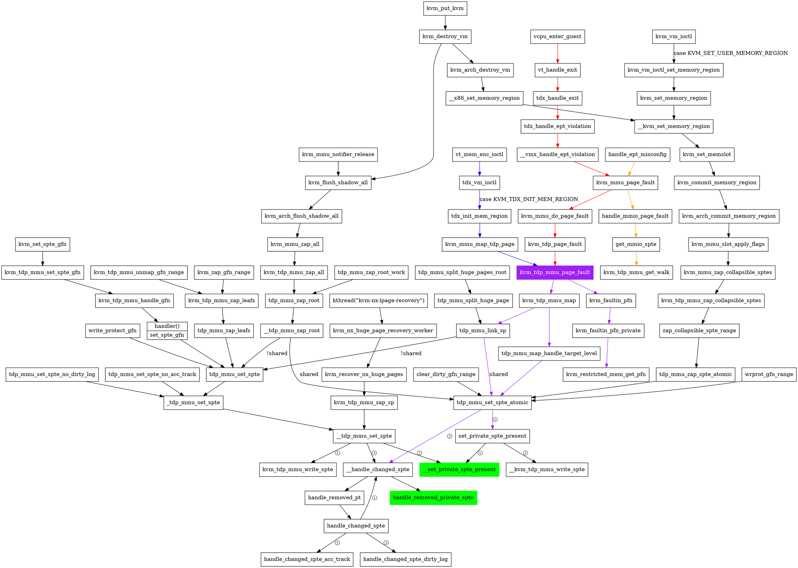

----------

```dot
// engine:dot
digraph v13 {
  node [shape="record"];
  kthread_kvm_nx_lpage_recovery[label="kthread(\"kvm-nx-lpage-recovery\")"];
  set_spte_gfn[label="{handler() | set_spte_gfn}"];
  __set_private_spte_present[color=green; style=filled;];
  handle_removed_private_spte[color=green; style=filled;];
  kvm_tdp_mmu_page_fault[color=purple; style=filled; fontcolor=white;];

  handle_removed_pt -> handle_changed_spte;
  tdp_mmu_set_spte_atomic -> __handle_changed_spte [color=purple; label="②"];
  __handle_changed_spte -> handle_removed_pt;
  __handle_changed_spte -> handle_removed_private_spte;

  handle_changed_spte -> __handle_changed_spte [label="①"];
  handle_changed_spte -> handle_changed_spte_acc_track [label="②"];
  handle_changed_spte -> handle_changed_spte_dirty_log [label="③"];

  tdp_mmu_set_spte_no_acc_track -> _tdp_mmu_set_spte;
  tdp_mmu_set_spte_no_dirty_log -> _tdp_mmu_set_spte;
  tdp_mmu_zap_root_work -> tdp_mmu_zap_root;
  kvm_destroy_vm -> kvm_flush_shadow_all;
  kvm_mmu_notifier_release-> kvm_flush_shadow_all -> kvm_arch_flush_shadow_all -> kvm_mmu_zap_all -> kvm_tdp_mmu_zap_all-> tdp_mmu_zap_root -> __tdp_mmu_zap_root;
  __tdp_mmu_zap_root -> tdp_mmu_set_spte [label="!shared"];
  kvm_set_spte_gfn -> kvm_tdp_mmu_set_spte_gfn -> kvm_tdp_mmu_handle_gfn -> set_spte_gfn -> tdp_mmu_set_spte;
  write_protect_gfn -> tdp_mmu_set_spte;
  tdp_mmu_link_sp -> tdp_mmu_set_spte [label="!shared"];
  kvm_zap_gfn_range -> kvm_tdp_mmu_zap_leafs;
  kvm_tdp_mmu_unmap_gfn_range -> kvm_tdp_mmu_zap_leafs -> tdp_mmu_zap_leafs -> tdp_mmu_set_spte;

  tdp_mmu_set_spte -> _tdp_mmu_set_spte -> __tdp_mmu_set_spte;
  kthread_kvm_nx_lpage_recovery -> kvm_nx_huge_page_recovery_worker -> kvm_recover_nx_huge_pages -> kvm_tdp_mmu_zap_sp -> __tdp_mmu_set_spte;
  __tdp_mmu_set_spte -> kvm_tdp_mmu_write_spte [label="①"];
  __tdp_mmu_set_spte -> __set_private_spte_present [label="②"];
  __tdp_mmu_set_spte -> __handle_changed_spte [label="③"];

  kvm_put_kvm -> kvm_destroy_vm -> kvm_arch_destroy_vm -> __x86_set_memory_region -> __kvm_set_memory_region;
  kvm_vm_ioctl -> kvm_vm_ioctl_set_memory_region[label="case KVM_SET_USER_MEMORY_REGION"];
  kvm_vm_ioctl_set_memory_region -> kvm_set_memory_region -> __kvm_set_memory_region;

  __kvm_set_memory_region -> kvm_set_memslot -> kvm_commit_memory_region -> kvm_arch_commit_memory_region -> kvm_mmu_slot_apply_flags -> kvm_mmu_zap_collapsible_sptes -> kvm_tdp_mmu_zap_collapsible_sptes -> zap_collapsible_spte_range -> tdp_mmu_zap_spte_atomic -> tdp_mmu_set_spte_atomic;
  set_private_spte_present -> __kvm_tdp_mmu_write_spte [label="②"];
  set_private_spte_present -> __set_private_spte_present [label="①"];
  __tdp_mmu_zap_root -> tdp_mmu_set_spte_atomic [label="shared"];
  vcpu_enter_guest -> vt_handle_exit-> tdx_handle_exit-> tdx_handle_ept_violation -> __vmx_handle_ept_violation -> kvm_mmu_page_fault -> kvm_mmu_do_page_fault -> kvm_tdp_page_fault -> kvm_tdp_mmu_page_fault [color=red;];
  kvm_tdp_mmu_page_fault -> kvm_tdp_mmu_map -> tdp_mmu_map_handle_target_level-> tdp_mmu_set_spte_atomic [color=purple;];
  tdp_mmu_link_sp -> tdp_mmu_set_spte_atomic [label="shared"; color=purple;];
  wrprot_gfn_range -> tdp_mmu_set_spte_atomic;
  clear_dirty_gfn_range -> tdp_mmu_set_spte_atomic;
  tdp_mmu_set_spte_atomic -> set_private_spte_present [color=purple; label="①"];
 
  vt_mem_enc_ioctl -> tdx_vm_ioctl [color=blue;];
  tdx_vm_ioctl -> tdx_init_mem_region[label="case KVM_TDX_INIT_MEM_REGION"; color=blue;];
  tdx_init_mem_region -> kvm_mmu_map_tdp_page -> kvm_tdp_mmu_page_fault [color=blue;];
  kvm_tdp_mmu_page_fault -> kvm_faultin_pfn -> kvm_faultin_pfn_private -> kvm_restricted_mem_get_pfn [color=purple;];

  handle_ept_misconfig -> kvm_mmu_page_fault -> handle_mmio_page_fault -> get_mmio_spte -> kvm_tdp_mmu_get_walk [color=orange];

  kvm_tdp_mmu_map -> tdp_mmu_link_sp [color=purple;];
  tdp_mmu_split_huge_pages_root -> tdp_mmu_split_huge_page -> tdp_mmu_link_sp;
}
```