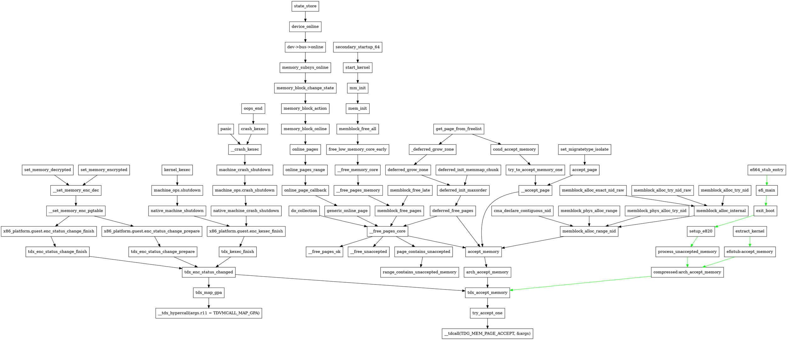

# TDX Lazy Accept

* UEFI Specification version 2.9 引入了 **memory acceptance** 的概念：某些虚拟机平台（例如 Intel TDX 或 AMD SEV-SNP）要求内存在被 guest 使用之前被接受。 接受是通过虚拟机平台特定的协议进行的。
* Accepting memory 的成本很高，并且它使 VMM 为接受的 guest 物理地址范围而分配内存。
  * 最好推迟 memory acceptance，直到需要内存为止。这样可以缩短启动时间并减少内存开销。
* 内核需要知道哪些内存已被接受。固件通过内存映射传达此信息：新的内存类型 - `EFI_UNACCEPTED_MEMORY` - 指示此类内存。
  * 基于范围的跟踪对于固件来说效果很好，但对于内核来说却变得很庞大：e820 必须在每次页面接受时进行修改。它会导致表碎片，但 e820 表中的条目数量有限。
  * 另一种选择是将此类内存标记为在 e820 中可用，并跟踪位图中是否已接受该范围。位图中的一位代表地址空间中的 `2 MiB`：一个 `4k` 页足以跟踪 `64 GiB` 或物理地址空间。
* 在最坏的情况下 —— 地址空间中间出现一个巨大的洞 —— 它需要 `256 MiB` 来处理 `4 PiB` 的地址空间。
* 任何未接受的未与 2M 对齐的内存都会被预先接受。
* 该方法大大缩短了启动时间。4G TDX VM 的启动到 shell 的速度快了约 2.5 倍，64G 的启动速度快了约 4 倍。
* TDX 特定代码与 unaccepted memory 支持的核心隔离。这应该有助于插入不可接受的内存的不同实现，例如 SEV-SNP。

## [PATCHv14 1/9] mm: Add support for unaccepted memory
* 内核可以通过多种方式处理未接受的内存：
1. 启动时接受所有内存。它易于实现，并且一旦系统启动就没有运行时成本。缺点是启动时间很长。
   * Accept 可以并行化到多个 CPU 以保持其可管理性（即通过 `DEFERRED_STRUCT_PAGE_INIT`），但它往往会使内存带宽饱和并且不会超出该点。
2. 第一次使用时接受一块内存。它需要更多的基础设施和页面分配器的更改才能使其工作，但它提供了良好的启动时间。
   * 按需内存接受意味着每次内核进入新内存块时延迟都会激增。一旦工作负载数据集大小稳定或所有内存都被接受，峰值就会消失。
3. 在后台接受所有内存。引入一个（或多个）线程来主动接受内存。它将最大限度地减少系统在内存分配时经历延迟峰值的时间，同时保持较低的启动时间。
   * 这种方法不能单独发挥作用。它是第 2 种方式的扩展：后台内存接受需要功能性的调度程序，但页面分配器可能需要在此之前利用未接受的内存。
   * 该方法的缺点是这些线程还会从用户的工作负载中窃取 CPU 周期和内存带宽，并可能损害用户体验。
* 现在实现方法 1 和方法 2。方法 2 是默认的。某些工作负载可能希望在内核命令行中 `accept_memory=eager` 使用方法 1。方法 3 可以根据用户的需求稍后实现。
* 支持 unaccepted memory 需要对 core-mm 代码进行一些更改：
  * memblock accepts memory 的分配。它提供早期启动内存分配，并且不将它们限制为预先接受的内存池。
  * 页面分配器在第一次分配页面时接受内存。
    * 当内核用完已接受的内存时，它会接受内存，直到达到高水位线。它有助于最大限度地减少碎片。
* 如果平台支持 unaccepted memory:，EFI 代码将提供两个帮助程序：
  * `accept_memory()` 接受一系列物理地址。
  * `range_contains_unaccepted_memory()` 检查物理地址范围内的任何内容是否需要接受。
* 在 `/sys/devices/system/node/nodeX/meminfo` 中新增一个 `Unaccepted` 的条目（drivers/base/node.c）
* 在 `/proc/meminfo` 中新增一个 `Unaccepted` 的条目（fs/proc/meminfo.c）
* 在 `/proc/vmstat` 中新增一个 `nr_unaccepted` 的条目
* 新增内核命令行 `accept_memory=lazy | eager`，缺省为 `lazy`
* 在 Zone 的统计项类型的枚举 `enum zone_stat_item` 中新增 `NR_UNACCEPTED` 的类型
```diff
diff --git a/include/linux/mmzone.h b/include/linux/mmzone.h
index a4889c9d4055..6c1c2fc13017 100644
--- a/include/linux/mmzone.h
+++ b/include/linux/mmzone.h
@@ -143,6 +143,9 @@ enum zone_stat_item {
    NR_ZSPAGES,     /* allocated in zsmalloc */
 #endif
    NR_FREE_CMA_PAGES,
+#ifdef CONFIG_UNACCEPTED_MEMORY
+   NR_UNACCEPTED,
+#endif
    NR_VM_ZONE_STAT_ITEMS };

 enum node_stat_item {
```
* 在 `struct zone` 结构中新增 `struct list_head unaccepted_pages` 的链表头，连接 *待接受的页面*
```diff
@@ -910,6 +913,11 @@ struct zone {
    /* free areas of different sizes */
    struct free_area    free_area[MAX_ORDER + 1];

+#ifdef CONFIG_UNACCEPTED_MEMORY
+   /* Pages to be accepted. All pages on the list are MAX_ORDER */
+   struct list_head    unaccepted_pages;
+#endif
+
    /* zone flags, see below */
    unsigned long       flags;

```
* Zone 初始化的时候调用 `zone_init_free_lists()` 时也初始化该链表头 `.unaccepted_pages`
* 在分配 memblock 时，`memblock_alloc_range_nid()` 找到要分配的 memblock 之后，调用 `accept_memory()` 接受这些内存
```diff
diff --git a/mm/memblock.c b/mm/memblock.c
index 3feafea06ab2..50b921119600 100644
--- a/mm/memblock.c
+++ b/mm/memblock.c
@@ -1436,6 +1436,15 @@ phys_addr_t __init memblock_alloc_range_nid(phys_addr_t size,
         */
        kmemleak_alloc_phys(found, size, 0);

+   /*
+    * Some Virtual Machine platforms, such as Intel TDX or AMD SEV-SNP,
+    * require memory to be accepted before it can be used by the
+    * guest.
+    *
+    * Accept the memory of the allocated buffer.
+    */
+   accept_memory(found, found + size);
+
    return found;
 }

```
* 对于延迟初始化的页面，在 `deferred_free_range()` 的时候也需要 `accept_memory()`，这个函数调用与 `CONFIG_DEFERRED_STRUCT_PAGE_INIT` 选项相关
  * 通常，所有 `struct page` 都会在早期引导期间在单个线程中初始化。在非常大的机器上，这可能需要相当长的时间。
  * 如果设置此选项，大型计算机将在启动时调出一个 `memmap` 的子集，然后并行初始化其余部分。
  * 这会对系统生命周期早期运行的任务（直到这些 kthread 完成初始化）产生潜在的性能影响。
  * 该 kthread 为 `kthread_run(deferred_init_memmap, NODE_DATA(nid), "pgdatinit%d", nid)`
```diff
diff --git a/mm/mm_init.c b/mm/mm_init.c
index 7f7f9c677854..1cfc08e25f93 100644
--- a/mm/mm_init.c
+++ b/mm/mm_init.c
@@ -1960,6 +1964,9 @@ static void __init deferred_free_range(unsigned long pfn,
        return;
    }

+   /* Accept chunks smaller than MAX_ORDER upfront */
+   accept_memory(PFN_PHYS(pfn), PFN_PHYS(pfn + nr_pages));
+
    for (i = 0; i < nr_pages; i++, page++, pfn++) {
        if (pageblock_aligned(pfn))
            set_pageblock_migratetype(page, MIGRATE_MOVABLE);
```
* 引入有 *待接受页面* 的 zone 的计数：`zones_with_unaccepted_pages`
  * `__free_unaccepted()` 时有可能增加该计数
  * `try_to_accept_memory_one()` 时有可能减小该计数
* `has_unaccepted_memory()` 用于判断是否有 *待接受页面*
  * mm/page_alloc.c
```cpp
/* Counts number of zones with unaccepted pages. */
static DEFINE_STATIC_KEY_FALSE(zones_with_unaccepted_pages);
...
static inline bool has_unaccepted_memory(void)
{
    return static_branch_unlikely(&zones_with_unaccepted_pages);
}
```
* 释放页面时 `__free_pages_core()`，如果页面含有未接受的页面，
  * 如果未接受的页面达到了 `MAX_ORDER`，需要调用 `__free_unaccepted()` 将他们挂入 zone 的 `.unaccepted_pages` 链表；如果失败（由于没开启 lazy accept），调用 `accept_page()` 接受它们，使其成为可用空闲页
  * 如果未接受的页面小于 `MAX_ORDER`，调用 `accept_page()` 让它们成为真正的可用空闲页
```diff
diff --git a/mm/page_alloc.c b/mm/page_alloc.c
index 47421bedc12b..d239fba3f31c 100644
--- a/mm/page_alloc.c
+++ b/mm/page_alloc.c
@@ -1481,6 +1487,13 @@ void __free_pages_core(struct page *page, unsigned int order)

    atomic_long_add(nr_pages, &page_zone(page)->managed_pages);

+   if (page_contains_unaccepted(page, order)) {
+       if (order == MAX_ORDER && __free_unaccepted(page))
+           return;
+
+       accept_page(page, order);
+   }
+
    /*
     * Bypass PCP and place fresh pages right to the tail, primarily
     * relevant for memory onlining.
```
* 注意，目前 `accept_page()` 的调用处只有两处，这里是其中一处；另一处 `try_to_accept_memory_one()` 调用它时传入的 `order` 是 `MAX_ORDER`。
```cpp
mm/page_alloc.c|1313| <<__free_pages_core>> accept_page(page, order);
mm/page_alloc.c|6627| <<try_to_accept_memory_one>> accept_page(page, MAX_ORDER);
```
* 因此，释放的待接受的页面数目达到了 `MAX_ORDER` 则无需调用 `accept_page()` 接受页面，仅需通过新增的 `__free_unaccepted()` 调整计数，等到真正需要接受它们时才由 `try_to_accept_memory_one()` 去接受
  * 这通常在 `mem_init() -> memblock_free_all()`，memblock 将空闲页释放给 buddy 分配器的时候，仅仅是增加计数，并不真正去接受内存
  * 这个分支在启动时会多次走到
```c
(gdb) bt
#0  __free_unaccepted (order=10, page=0xffd4000004000000) at mm/page_alloc.c:1600
#1  __free_pages_core (page=0xffd4000004000000, order=10) at mm/page_alloc.c:1661
#2  0xffffffff86cd1220 in memblock_free_pages (page=<optimized out>, pfn=<optimized out>, order=<optimized out>) at mm/page_alloc.c:1723
#3  0xffffffff86cd32a8 in __free_pages_memory (end=<optimized out>, start=<optimized out>) at mm/memblock.c:1911
#4  __free_memory_core (end=<optimized out>, start=<optimized out>) at mm/memblock.c:1927
#5  free_low_memory_core_early () at mm/memblock.c:1950
#6  memblock_free_all () at mm/memblock.c:1989
#7  0xffffffff86cbf93c in mem_init () at arch/x86/mm/init_64.c:1292
#8  0xffffffff86ca1e88 in mm_init () at init/main.c:830
#9  start_kernel () at init/main.c:904
#10 0xffffffff81000116 in secondary_startup_64 () at arch/x86/kernel/head_64.S:316
#11 0x0000000000000000 in ?? ()
```
* 当释放的待接受的页面数目小于 `MAX_ORDER` 时，则需立即接受。实际上很少会走入这个分支。

* 计算某个 zone 在指定 `order` 上的 *不可用空闲页* 时 `__zone_watermark_unusable_free()`，需将 `NR_UNACCEPTED` 的页计算在内
```diff
@@ -3159,6 +3172,9 @@ static inline long __zone_watermark_unusable_free(struct zone *z,
    if (!(alloc_flags & ALLOC_CMA))
        unusable_free += zone_page_state(z, NR_FREE_CMA_PAGES);
 #endif
+#ifdef CONFIG_UNACCEPTED_MEMORY
+   unusable_free += zone_page_state(z, NR_UNACCEPTED);
+#endif

    return unusable_free;
 }
```
* 分配页时 `get_page_from_freelist()`，如果有未接受的页面需要调用 `try_to_accept_memory()` 尝试接受它们
```diff
@@ -3458,6 +3474,11 @@ get_page_from_freelist(gfp_t gfp_mask, unsigned int order, int alloc_flags,
                       gfp_mask)) {
            int ret;

+           if (has_unaccepted_memory()) {
+               if (try_to_accept_memory(zone, order))
+                   goto try_this_zone;
+           }
+
 #ifdef CONFIG_DEFERRED_STRUCT_PAGE_INIT
            /*
             * Watermark failed for this zone, but see if we can
@@ -3510,6 +3531,11 @@ get_page_from_freelist(gfp_t gfp_mask, unsigned int order, int alloc_flags,

            return page;
        } else {
+           if (has_unaccepted_memory()) {
+               if (try_to_accept_memory(zone, order))
+                   goto try_this_zone;
+           }
+
 #ifdef CONFIG_DEFERRED_STRUCT_PAGE_INIT
            /* Try again if zone has deferred pages */
            if (deferred_pages_enabled()) {
```

### 新增 `page_contains_unaccepted()`
* `page_contains_unaccepted()` 根据传入的 `struct page` 指针得到起始物理地址，根据阶 `order` 得到大小，从而确定结束物理地址
* 调用 `range_contains_unaccepted_memory()`，传入起始和结束物理地址，返回该范围内是否有未接受页面
```cpp
static bool page_contains_unaccepted(struct page *page, unsigned int order)
{
    phys_addr_t start = page_to_phys(page);
    phys_addr_t end = start + (PAGE_SIZE << order);

    return range_contains_unaccepted_memory(start, end);
}
```

### 新增 `accept_page()`
* `accept_page()` 是对 `accept_memory()` 的封装，根据传入的 `struct page` 指针和阶 `order` 算出接受内存的范围并接受它们
```cpp
static void accept_page(struct page *page, unsigned int order)
{
    phys_addr_t start = page_to_phys(page);

    accept_memory(start, start + (PAGE_SIZE << order));
}
```

### 新增 `try_to_accept_memory()`
* `try_to_accept_memory_one()` 一次接受一个待接受页面链表头 `.unaccepted_pages` 上得到的 `MAX_ORDER` 个页面，接受完后释放该页，让它真正成为可用的空闲页
  * *等待接受的页面* 属于 *不可用的空闲页*，接受完之后才成为 *可用的空闲页*
  * 这个过程中会更新相应的计数，`__free_pages_ok() -> __free_one_page() -> __mod_zone_freepage_state()` 会把减去的 `NR_FREE_PAGES` 的页面计数加回来
```cpp
static bool try_to_accept_memory_one(struct zone *zone)
{
    unsigned long flags;
    struct page *page;
    bool last;
    //如果该 zone 没有待接受页面，返回 false
    if (list_empty(&zone->unaccepted_pages))
        return false;
    //得到待接受页面链表头上一个页面
    spin_lock_irqsave(&zone->lock, flags);
    page = list_first_entry_or_null(&zone->unaccepted_pages,
                    struct page, lru);
    if (!page) {
        spin_unlock_irqrestore(&zone->lock, flags);
        return false;
    }
    //把该页面从待接受页面链表上移除
    list_del(&page->lru);
    last = list_empty(&zone->unaccepted_pages);//last 标记着这是待接受页面链表上最后一个页面
    //减小该 zone 类型为 NR_FREE_PAGES 的页面计数，MIGRATE_MOVABLE 是帮助判断的
    __mod_zone_freepage_state(zone, -MAX_ORDER_NR_PAGES, MIGRATE_MOVABLE);
    __mod_zone_page_state(zone, NR_UNACCEPTED, -MAX_ORDER_NR_PAGES); //减小该 zone 类型为 NR_UNACCEPTED 的页面计数
    spin_unlock_irqrestore(&zone->lock, flags);
    //接受从该页面开始的 MAX_ORDER 个页面
    accept_page(page, MAX_ORDER);
    //接受完后释放该页，让它真正成为可用的空闲页
    __free_pages_ok(page, MAX_ORDER, FPI_TO_TAIL);
    //如果刚才接受的是待接受页面链表上最后一个页面，减小有待接受页面的 zone 的计数
    if (last)
        static_branch_dec(&zones_with_unaccepted_pages);

    return true;
}
```
* `try_to_accept_memory()` 函数通常出现内存回收的慢速路径上
  * 通常 zone 的空闲页达到高水位线时才会停止内存回收，而 *统计的总空闲页* 中除去 *不可用的空闲页* 剩下的就是 *实际可用的空闲页*
    * *不可用的空闲页* 可以包含 `( 1 << order) - 1` 个被请求的页、*保留页*，*CMA 页* 和 *等待接受的页面*，见 `__zone_watermark_unusable_free()` 的实现
  * *高水位线* 减去 *实际可用的空闲页* 得到的就是 *还应该接受的多少页面*，zone 的空闲页才能到达高水位线
```c
static bool try_to_accept_memory(struct zone *zone, unsigned int order)
{
    long to_accept;
    int ret = false;
    //计算还需要接受多少页面，zone 的空闲页才能到达高水位线
    /* How much to accept to get to high watermark? */
    to_accept = high_wmark_pages(zone) -
            (zone_page_state(zone, NR_FREE_PAGES) -
            __zone_watermark_unusable_free(zone, order, 0));
    //哪怕是负数，也要试一把
    /* Accept at least one page */
    do {
        if (!try_to_accept_memory_one(zone))
            break;
        ret = true;
        to_accept -= MAX_ORDER_NR_PAGES;
    } while (to_accept > 0);

    return ret;
}
```

### 新增 `__free_unaccepted()`
* `__free_unaccepted()` 将页面挂上 zone 待接受页面的链表 `.unaccepted_pages`，并增加相应的统计计数
* 可见 *待接受的页面* 计入 *空闲页*
* 它仅被 `__free_pages_core()` 调用，且前提条件是 `order == MAX_ORDER`，因此它增加的空闲页计数 `NR_FREE_PAGES` 是 `MAX_ORDER_NR_PAGES`
```cpp
static bool __free_unaccepted(struct page *page)
{
    struct zone *zone = page_zone(page);
    unsigned long flags;
    bool first = false;
    //如果没开启 lazy accept，所有的内存在开始时就已接受，因此不存在释放未接受页面的问题
    if (!lazy_accept)
        return false;

    spin_lock_irqsave(&zone->lock, flags);
    first = list_empty(&zone->unaccepted_pages); //该 zone 等待接受的页面的链表为空，该页就是第一个加入链表的页面
    list_add_tail(&page->lru, &zone->unaccepted_pages); //加入该页到所属 zone 的未接受页面链表
    __mod_zone_freepage_state(zone, MAX_ORDER_NR_PAGES, MIGRATE_MOVABLE); //增加该 zone 类型为 NR_FREE_PAGES 的页面计数，MIGRATE_MOVABLE 是帮助判断的
    __mod_zone_page_state(zone, NR_UNACCEPTED, MAX_ORDER_NR_PAGES); //增加该 zone 类型为 NR_UNACCEPTED 的页面计数
    spin_unlock_irqrestore(&zone->lock, flags);

    if (first)
        static_branch_inc(&zones_with_unaccepted_pages); //仅有第一次添加页面到该 zone 的等待接受页面链表时，增加含有未接受页面 zone 的计数

    return true;
}
```

## [PATCHv14 2/9] efi/x86: Get full memory map in allocate_e820()
* 目前 `allocate_e820()` 只对映射的大小和内存描述符的大小感兴趣，以确定内核需要多少个 e820 条目。
* UEFI Specification version 2.9 版引入了一种新的内存类型 —— unaccepted memory。
  * 动机：为了跟踪未接受的内存，内核需要分配一个位图，而位图的大小取决于系统中存在的最大物理地址。
  * 因此需要完整的内存映射才能找到最大地址。
* 所以修改 `allocate_e820()` 以获取完整的内存映射。
  * arch/x86/boot/compressed/mem.c
```cpp
static efi_status_t allocate_e820(struct boot_params *params,
                  struct setup_data **e820ext,
                  u32 *e820ext_size)
{
    struct efi_boot_memmap *map;
    efi_status_t status;
    __u32 nr_desc;
    //这是个带分配的函数，map 指向新分配的 memory map 数据；修改前调的 efi_bs_call(get_memory_map) 是不带分配的
    status = efi_get_memory_map(&map, false);
    if (status != EFI_SUCCESS)
        return status;
    //修改前 nr_desc 会加上 EFI_MMAP_NR_SLACK_SLOTS，修改后没加；但后面比较时又减去了，所以语义是一样的
    nr_desc = map->map_size / map->desc_size;
    if (nr_desc > ARRAY_SIZE(params->e820_table) - EFI_MMAP_NR_SLACK_SLOTS) {
        u32 nr_e820ext = nr_desc - ARRAY_SIZE(params->e820_table) +
            EFI_MMAP_NR_SLACK_SLOTS;
        //分配 e820 ext 表，和修改前一样
        status = alloc_e820ext(nr_e820ext, e820ext, e820ext_size);
    }
    //下面这两句是新增的，但不在这个 patch，后面再讲
    if (IS_ENABLED(CONFIG_UNACCEPTED_MEMORY) && status == EFI_SUCCESS)
        status = allocate_unaccepted_bitmap(nr_desc, map);
    //释放前面分配的 memory map 数据
    efi_bs_call(free_pool, map);
    return status;
}
```
## [PATCHv14 3/9] efi/libstub: Implement support for unaccepted memory
* UEFI Specification version 2.9 版引入了 memory acceptance 的概念：某些虚拟机平台（例如 Intel TDX 或 AMD SEV-SNP）要求内存在被 guest 使用之前被接受。Accepting 是通过虚拟机平台特定的协议进行的。
* 接受内存的成本很高，并且它使 VMM 为接受的 guest 物理地址范围分配内存。最好推迟内存接受，直到需要内存为止。它缩短了启动时间并减少了内存开销。
* 内核需要知道哪些内存已被接受。固件通过内存映射传达此信息：新的内存类型 - `EFI_UNACCEPTED_MEMORY` - 指示此类内存。
* 基于范围的跟踪对于固件来说工作得很好，但是对于内核来说它变得很庞大：e820（或者架构使用的任何东西）都必须在每个页面接受时进行修改。它会导致表碎片，并且 e820 表中的条目数量有限。
* 另一种选择是将此类内存标记为在 e820 中可用，并跟踪位图中是否已接受该范围。位图中的 *一位* 代表地址空间单元中自然对齐的 2 次方大小的区域。
  * 对于 x86，单元大小为 `2 MiB`：`4k` 的位图足以跟踪 `64 GiB` 或物理地址空间。
  * 在最坏的情况下 —— 地址空间中间出现一个巨大的空洞 —— 它需要 `256 MiB` 来处理 `4 PiB` 的地址空间。
* 任何未与 `unit_size` 对齐的未接受的内存都会被预先接受。
* 位图在 EFI stub 中分配和构造，并通过 EFI 配置表传递到内核。如果存在未接受的内存，则 `allocate_e820()` 根据未接受区域的大小分配位图。

### Bitmap 设置与清除
* 几个 bitmap 换算宏如下：
* `BIT_WORD(nr)` 将 `nr` 换算成有几个长度为 `long` 类型的数目
* `BITMAP_FIRST_WORD_MASK(start)`：`(start) & (BITS_PER_LONG - 1)` 其实和 `start % BITS_PER_LONG` 相等，全 1（`~0`）左移 *余数* 次剩下的结果就是求第一个 64 bit（qw）的掩码（被 mask 部分为 `1`）
* `BITMAP_LAST_WORD_MASK(nbits)`：我们不关系高位的 64 bit 部分，只关心最后 64 bit。
  * 我们需要知道一个数 `x` 代表 64 bit 中为 `0` 的位的个数，64 bit 中为 `1` 的位的个数就是 `nbits % BITS_PER_LONG`
  * 不考虑进位，显然 `nbits % BITS_PER_LONG + x = 0` 是成立的
  * 于是有 `x = -nbits % BITS_PER_LONG`，求余换出上面的等式得到 `x = -(nbits) & (BITS_PER_LONG - 1)`， 这就算出了最后一个 64 bit 中要位移的次数
  * 因此这个宏算的是最后一个 64 bit 的掩码（被 mask 部分为 `1`）
```cpp
#define BIT_WORD(nr)        ((nr) / BITS_PER_LONG)
...
#define BITMAP_FIRST_WORD_MASK(start) (~0UL << ((start) & (BITS_PER_LONG - 1)))
#define BITMAP_LAST_WORD_MASK(nbits) (~0UL >> (-(nbits) & (BITS_PER_LONG - 1)))
```
* drivers/firmware/efi/libstub/bitmap.c
```cpp
void __bitmap_set(unsigned long *map, unsigned int start, int len)
{
    unsigned long *p = map + BIT_WORD(start); //map 指向的映射是 unsigned long 类型，加上转换的 start 得到的 p 指向要设置的位的起点
    const unsigned int size = start + len;    //要设置的 bit 的长度，也就是终点，感觉叫 end 是不是更合理？
    int bits_to_set = BITS_PER_LONG - (start % BITS_PER_LONG); //bits_to_set 是要设置的位的前面未对齐到 64 bit 的部分的位数目
    unsigned long mask_to_set = BITMAP_FIRST_WORD_MASK(start); //mask_to_set 是要设置的 bit 的掩码，初始是第一个 64 bit 的掩码

    while (len - bits_to_set >= 0) { //还未设置的位数目必须大于此次迭代要设置的位数目
        *p |= mask_to_set;           //p 已定位到此次要设置的 64 bit，设置位
        len -= bits_to_set;          //减小还未设置的位数目
        bits_to_set = BITS_PER_LONG; //以 64 个位数为单位迭代
        mask_to_set = ~0UL;          //中间的位都设置的全 1
        p++;                         //步进到下一个 64 bit
    }
    if (len) {                       //还剩不足 64 bit 的位没设置
        mask_to_set &= BITMAP_LAST_WORD_MASK(size); //得到最后一个 64 bit 要设置的位掩码
        *p |= mask_to_set;           //设置最后一个 64 bit 的位
    }
}

void __bitmap_clear(unsigned long *map, unsigned int start, int len)
{
    unsigned long *p = map + BIT_WORD(start); //map 指向的映射是 unsigned long 类型，加上转换的 start 得到的 p 指向要清除的位的起点
    const unsigned int size = start + len;    //要清除的 bit 的长度，也就是终点，感觉叫 end 是不是更合理？
    int bits_to_clear = BITS_PER_LONG - (start % BITS_PER_LONG); //bits_to_set 是要清除的位的前面未对齐到 64 bit 的部分的位数目
    unsigned long mask_to_clear = BITMAP_FIRST_WORD_MASK(start); //mask_to_set 是要清除的 bit 的掩码，初始是第一个 64 bit 的掩码

    while (len - bits_to_clear >= 0) { //还未清除的位数目必须大于此次迭代要清除的位数目
        *p &= ~mask_to_clear;          //p 已定位到此次要清除的 64 bit，清除位
        len -= bits_to_clear;          //减小还未清除的位数目
        bits_to_clear = BITS_PER_LONG; //以 64 个位数为单位迭代
        mask_to_clear = ~0UL;          //中间的位都设置全 0，这里设置为 1，清除的时候取反
        p++;                           //步进到下一个 64 bit
    }
    if (len) {                         //还剩不足 64 bit 的位没清除
        mask_to_clear &= BITMAP_LAST_WORD_MASK(size); //得到最后一个 64 bit 要清除的位掩码
        *p &= ~mask_to_clear;          //清除最后一个 64 bit 的位
    }
}
```
* 由于是 bit 操作，所以字节序无关，比如说 `start = 311, len = 68` 的时候得到位图如下：
```c
      Hi                Lo
map[0]: 0000000000000000
map[1]: 0000000000000000
map[2]: 0000000000000000
map[3]: 0000000000000000
map[4]: ff80000000000000
map[5]: 07ffffffffffffff
map[6]: 0000000000000000
map[7]: 0000000000000000
```

### 按位查找 bitmap 中第一个设置的 bit
* `_find_next_bit()` 查找位图 `addr` 中从第 `start` 位开始第一个设置为 `1` 的 bit，查找的范围不超过第 `nbits` 位
* `_find_next_zero_bit()` 查找位图 `addr` 中从第 `start` 位开始第一个设置为 `0` 的 bit，查找的范围不超过第 `nbits` 位
  * drivers/firmware/efi/libstub/find.c
```cpp
/*
 * Common helper for find_next_bit() function family
 * @FETCH: The expression that fetches and pre-processes each word of bitmap(s)
 * @MUNGE: The expression that post-processes a word containing found bit (may be empty)
 * @size: The bitmap size in bits
 * @start: The bitnumber to start searching at
 */
#define FIND_NEXT_BIT(FETCH, MUNGE, size, start)                \
({                                      \
    unsigned long mask, idx, tmp, sz = (size), __start = (start);       \
    /*查找位置不可超过 bitmap 大小*/                      \
    if (unlikely(__start >= sz))                        \
        goto out;                           \
    /*mask 为查找起始位置在 bitmap 第一个 64 bit 的掩码*/      \
    mask = MUNGE(BITMAP_FIRST_WORD_MASK(__start));              \
    idx = __start / BITS_PER_LONG;                    \
    /*idx 为查找起始位置在 bitmap 第一个 64 bit 的索引，循环为了找到第一个不为 0 的 64 bit*/ \
    for (tmp = (FETCH) & mask; !tmp; tmp = (FETCH)) {           \
        if ((idx + 1) * BITS_PER_LONG >= sz)                \
            goto out;                       \
        idx++;                              \
    }                                   \
    /*在第一个不为 0 的 64 bit 里找到第一个为 1 的 bit，加上前面所有为 0 的 bit*/  \
    sz = min(idx * BITS_PER_LONG + __ffs(MUNGE(tmp)), sz);          \
out:                                        \
    sz; /*返回整个 bitmap 中第一个设置为 1 的 bit*/ \
})

unsigned long _find_next_bit(const unsigned long *addr, unsigned long nbits, unsigned long start)
{
    return FIND_NEXT_BIT(addr[idx], /* nop */, nbits, start);
}

unsigned long _find_next_zero_bit(const unsigned long *addr, unsigned long nbits,
                     unsigned long start)
{
    return FIND_NEXT_BIT(~addr[idx], /* nop */, nbits, start);
}
```

### 修改的主体
* 修改集中在文件 drivers/firmware/efi/libstub/unaccepted_memory.c
#### 新增 EFI 待接受内存描述结构
* 预定义 EFI 待接受内存的单位大小为 `2MB`
* arch/x86/include/asm/efi.h
```cpp
#define EFI_UNACCEPTED_UNIT_SIZE PMD_SIZE
```
* include/linux/efi.h
```cpp
struct efi_unaccepted_memory {
    u32 version;
    u32 unit_size;
    u64 phys_base;
    u64 size;
    unsigned long bitmap[];
};
```
* `version`：待接受内存结构的版本，目前为 `1`
* `unit_size`：EFI 待接受内存的单位大小（粒度），会被设为 `EFI_UNACCEPTED_UNIT_SIZE`
* `phys_base`：待接受内存的起始物理地址
* `size`：待接受内存配置表的大小，`Byte` 为单位
* `bitmap[]`：描述待接受内存的位图

#### 分配待接受内存位图 `allocate_unaccepted_bitmap()`
* bzImage 在被当作 EFI 程序加载时有以下路径
```c
efi64_stub_entry
-> efi_main()
   -> exit_boot()
      -> allocate_e820()
         -> allocate_unaccepted_bitmap()
      -> setup_e820()
   leaq  rva(startup_64)(%rax), %rax
   jmp *%rax //跳到自解压内核的 startup_64 例程
```
* `allocate_unaccepted_bitmap()` 用于分配待接受内存位图和安装待接受内存配置表
```cpp
struct efi_unaccepted_memory *unaccepted_table;

efi_status_t allocate_unaccepted_bitmap(__u32 nr_desc,
                    struct efi_boot_memmap *map)
{
    efi_guid_t unaccepted_table_guid = LINUX_EFI_UNACCEPTED_MEM_TABLE_GUID;
    u64 unaccepted_start = ULLONG_MAX, unaccepted_end = 0, bitmap_size;
    efi_status_t status;
    int i;
    //根据待接受内存的 GUID 获取其 UEFI 配置表
    /* Check if the table is already installed */
    unaccepted_table = get_efi_config_table(unaccepted_table_guid);
    if (unaccepted_table) {
        if (unaccepted_table->version != 1) {
            efi_err("Unknown version of unaccepted memory table\n");
            return EFI_UNSUPPORTED;
        }
        return EFI_SUCCESS;
    }
    //检查是否有待接受内存和查找最大地址
    /* Check if there's any unaccepted memory and find the max address */
    for (i = 0; i < nr_desc; i++) {
        efi_memory_desc_t *d;
        unsigned long m = (unsigned long)map->map;
        //根据 map->map 数组的索引获得数组元素，即描述符
        d = efi_early_memdesc_ptr(m, map->desc_size, i);
        if (d->type != EFI_UNACCEPTED_MEMORY)
            continue; //如果描述符类型不是待接受内存则跳过
        //unaccepted_start 开始被设得很大，如果描述符中有起始地址比它小的则减小，unaccepted_end 反之
        unaccepted_start = min(unaccepted_start, d->phys_addr);
        unaccepted_end = max(unaccepted_end,
                     d->phys_addr + d->num_pages * PAGE_SIZE);
    }
    //如果 unaccepted_start 还是 ULLONG_MAX，没有待接受内存，返回成功
    if (unaccepted_start == ULLONG_MAX)
        return EFI_SUCCESS;
    //unaccepted_start 向下取整到待接受内存单元的大小，目前定义是 PMD_SIZE（2M）
    unaccepted_start = round_down(unaccepted_start,
                      EFI_UNACCEPTED_UNIT_SIZE);
    unaccepted_end = round_up(unaccepted_end, EFI_UNACCEPTED_UNIT_SIZE);
    //unaccepted_end 向上取整到待接受内存单元的大小
    /*
     * If unaccepted memory is present, allocate a bitmap to track what
     * memory has to be accepted before access.
     *
     * One bit in the bitmap represents 2MiB in the address space:
     * A 4k bitmap can track 64GiB of physical address space.
     *
     * In the worst case scenario -- a huge hole in the middle of the
     * address space -- It needs 256MiB to handle 4PiB of the address
     * space.
     *
     * The bitmap will be populated in setup_e820() according to the memory
     * map after efi_exit_boot_services().
     */
    //bitmap_size 是以字节为单位的位图总大小，其中每个字节中的一个 bit 对应大小为 2MB 的未接受内存
    bitmap_size = DIV_ROUND_UP(unaccepted_end - unaccepted_start,
                   EFI_UNACCEPTED_UNIT_SIZE * BITS_PER_BYTE);
    //分配待接受内存配置表，大小为表头加上位图，全局变量 unaccepted_table 指向它
    status = efi_bs_call(allocate_pool, EFI_LOADER_DATA,
                 sizeof(*unaccepted_table) + bitmap_size,
                 (void **)&unaccepted_table);
    if (status != EFI_SUCCESS) {
        efi_err("Failed to allocate unaccepted memory config table\n");
        return status;
    }
    //根据上面的信息初始化待接受内存配置表，如版本、每位表示的单元大小、位图的大小、起始地址等
    unaccepted_table->version = 1;
    unaccepted_table->unit_size = EFI_UNACCEPTED_UNIT_SIZE;
    unaccepted_table->phys_base = unaccepted_start;
    unaccepted_table->size = bitmap_size;
    memset(unaccepted_table->bitmap, 0, bitmap_size); //清空位图
    //安装待接受内存配置表
    status = efi_bs_call(install_configuration_table,
                 &unaccepted_table_guid, unaccepted_table);
    if (status != EFI_SUCCESS) {
        efi_bs_call(free_pool, unaccepted_table);
        efi_err("Failed to install unaccepted memory config table!\n");
    }
    //分配待接受内存配置表成功
    return status;
}
```
* `bitmap_size` 可以理解为：以 **字节** 为单位的位图总大小，其中每个字节中的一个 bit 对应大小为 2MB 的未接受内存
  *  *地址范围* 内有几个 `EFI_UNACCEPTED_UNIT_SIZE（2 MB）` 单元
  * 由于 1 个 bit 对应到一个这样的单元，那么需要的 bit 个数用的字节来表示就是 **除以** `BITS_PER_BYTE`
* EFI firmware 提供的 EFI Boot Services Table 见 `edk2/MdeModulePkg/Core/Dxe/DxeMain/DxeMain.c::mBootServices[]`
  * `allocate_pool()` 的实现见 `edk2/MdeModulePkg/Core/Dxe/Mem/Pool.c::CoreAllocatePool()`
  * `install_configuration_table()` 的实现见 `edk2/MdeModulePkg/Core/Dxe/Misc/InstallConfigurationTable.c::CoreInstallConfigurationTable()`
  * `get_memory_map()` 的实现见 `edk2/MdeModulePkg/Core/Dxe/Mem/Page.c::CoreGetMemoryMap()`

#### 配置 e820 表时处理待接受内存
* 配置 e820 表 `setup_e820()` 的时候，会通过一个 `for` 循环遍历 EFI 内存描述符 `efi_early_memdesc_ptr(m, efi->efi_memdesc_size, i)`，遇到类型为 `EFI_UNACCEPTED_MEMORY` 的待接受内存描述符需要进行处理
```diff
diff --git a/drivers/firmware/efi/libstub/x86-stub.c b/drivers/firmware/efi/libstub/x86-stub.c
index fff81843169c..8d17cee8b98e 100644
--- a/drivers/firmware/efi/libstub/x86-stub.c
+++ b/drivers/firmware/efi/libstub/x86-stub.c
@@ -613,6 +613,16 @@ setup_e820(struct boot_params *params, struct setup_data *e820ext, u32 e820ext_s
            e820_type = E820_TYPE_PMEM;
            break;

+       case EFI_UNACCEPTED_MEMORY:
+           if (!IS_ENABLED(CONFIG_UNACCEPTED_MEMORY)) {
+               efi_warn_once(
+"The system has unaccepted memory,  but kernel does not support it\nConsider enabling CONFIG_UNACCEPTED_MEMORY\n");
+               continue;
+           }
+           e820_type = E820_TYPE_RAM;
+           process_unaccepted_memory(d->phys_addr,
+                         d->phys_addr + PAGE_SIZE * d->num_pages);
+           break;
        default:
            continue;
        }
```

#### 处理待接受内存 `process_unaccepted_memory()`
* 接受的内存位图仅适用于 `unit_size` 粒度。对于未对齐的起始/结束地址：
1. 立即完整地接受内存
2. 接受 *未对齐* 的部分，并将 *一些* 对齐的部分标记为 *未接受*
* 该函数永远不会需要设置零 bits 的 `bitmap_set()`
* 对于待接受内存少于 `2*unit_size` 的情况：
  * 通过立即接受 `2*unit_size` 以下的所有区域，确保位图中至少设置一位。这是不精确的，并且可能会立即接受一些可以在位图中表示的区域。但是，结果是下面更简单的代码
  * 考虑这样的情况（假设 `unit_size == 2MB`）：
```
| 4k | 2044k |    2048k   |
^ 0x0        ^ 2MB        ^ 4MB
```
  * 仅前 `4k` 已被接受了。`0MB->2MB` 区域无法在位图中表示。`2MB->4MB` 区域可以在位图中表示。但是，`0MB->4MB` 区域 `<2*unit_size`，将立即被全部接受。
  * drivers/firmware/efi/libstub/unaccepted_memory.c
```cpp
/*
 * The accepted memory bitmap only works at unit_size granularity.  Take
 * unaligned start/end addresses and either:
 *  1. Accepts the memory immediately and in its entirety
 *  2. Accepts unaligned parts, and marks *some* aligned part unaccepted
 *
 * The function will never reach the bitmap_set() with zero bits to set.
 */
void process_unaccepted_memory(u64 start, u64 end)
{
    u64 unit_size = unaccepted_table->unit_size;    //待接受内存的粒度
    u64 unit_mask = unaccepted_table->unit_size - 1;//粒度转为掩码形式
    u64 bitmap_size = unaccepted_table->size;       //位图的大小

    /*
     * Ensure that at least one bit will be set in the bitmap by
     * immediately accepting all regions under 2*unit_size.  This is
     * imprecise and may immediately accept some areas that could
     * have been represented in the bitmap.  But, results in simpler
     * code below
     *
     * Consider case like this (assuming unit_size == 2MB):
     *
     * | 4k | 2044k |    2048k   |
     * ^ 0x0        ^ 2MB        ^ 4MB
     *
     * Only the first 4k has been accepted. The 0MB->2MB region can not be
     * represented in the bitmap. The 2MB->4MB region can be represented in
     * the bitmap. But, the 0MB->4MB region is <2*unit_size and will be
     * immediately accepted in its entirety.
     */
    if (end - start < 2 * unit_size) {
        arch_accept_memory(start, end);
        return;
    }
    //如果范围大于 2*unit_size，无论开始和结束如何对齐，位图中至少会留下一个待接受的 unit_size 区域需要标记。
    /*
     * No matter how the start and end are aligned, at least one unaccepted
     * unit_size area will remain to be marked in the bitmap.
     */
    //立即接受起始的 <unit_size 块：
    /* Immediately accept a <unit_size piece at the start: */
    if (start & unit_mask) {
        arch_accept_memory(start, round_up(start, unit_size)); //接受起始地址到对齐至 2M 部分
        start = round_up(start, unit_size);                    //更新起始地址，向上对齐到 2M
    }
    //立即接受结束的 <unit_size 块：
    /* Immediately accept a <unit_size piece at the end: */
    if (end & unit_mask) {
        arch_accept_memory(round_down(end, unit_size), end);
        end = round_down(end, unit_size);                      //更新结束地址，向下对齐到 2M
    }
    //接受 phys_base 之前不能记录到位图中的部分范围。
    //unaccepted_table->phys_base 是之前 allocate_unaccepted_bitmap() 从多条记录中找到的最小的 d->phys_addr 向下取整 2M 得到的
    //start 是某条记录的 d->phys_addr 在上面向上取整 2M 得到的，怎么还会有 start 会小于 unaccepted_table->phys_base 的情况？？
    /*
     * Accept part of the range that before phys_base and cannot be recorded
     * into the bitmap.
     */
    if (start < unaccepted_table->phys_base) {
        arch_accept_memory(start,
                   min(unaccepted_table->phys_base, end));
        start = unaccepted_table->phys_base;
    }
    //这种情况没有需要被记录的了
    /* Nothing to record */
    if (end < unaccepted_table->phys_base)
        return;
    //将 start 和 end 转换为到位图开始的偏移
    /* Translate to offsets from the beginning of the bitmap */
    start -= unaccepted_table->phys_base;
    end -= unaccepted_table->phys_base;
    //结束的偏移（字节）比位图所能表示的内存范围（字节）还大
    /* Accept memory that doesn't fit into bitmap */
    if (end > bitmap_size * unit_size * BITS_PER_BYTE) {
        unsigned long phys_start, phys_end;
        //计算待接受内存超出位图所能表示的内存范围部分的起始和结束地址
        phys_start = bitmap_size * unit_size * BITS_PER_BYTE +
                 unaccepted_table->phys_base;
        phys_end = end + unaccepted_table->phys_base;

        arch_accept_memory(phys_start, phys_end);
        end = bitmap_size * unit_size * BITS_PER_BYTE; //更新结束偏移，看意思是变小了
    }
    //起始偏移“start”和结束偏移“end”（对应的内存地址）现在完全对齐到 unit_size 了，记录这个范围内的内存为待接受内存
    /*
     * 'start' and 'end' are now both unit_size-aligned.
     * Record the range as being unaccepted:
     */
    bitmap_set(unaccepted_table->bitmap,
           start / unit_size, (end - start) / unit_size);
}
```
* `accept_memory()` 就是 TDX guest 处理未接受内存的核心函数了，调用处如下：
```cpp
arch/x86/boot/compressed/misc.c|461| <<extract_kernel>> accept_memory(__pa(output), __pa(output) + needed_size);
mm/memblock.c|1446| <<memblock_alloc_range_nid>> accept_memory(found, found + size);
mm/mm_init.c|1968| <<deferred_free_range>> accept_memory(PFN_PHYS(pfn), PFN_PHYS(pfn + nr_pages));
mm/page_alloc.c|7278| <<accept_page>> accept_memory(start, start + (PAGE_SIZE << order));
```
* drivers/firmware/efi/libstub/unaccepted_memory.o 会被去掉调试符号后编进 drivers/firmware/efi/libstub/lib.a，最终被编进 arch/x86/boot/compressed/vmlinux，因此它是为 compressed kernel 服务的，工作在 decompress kernel 阶段
* 而后面实现的 drivers/firmware/efi/unaccepted_memory.o 则会被打包进 drivers/firmware/efi/built-in.a，一路向上被打包进编译根目录下的 built-in.a，并最终编进 vmlinux，因此它是为正常 kernel 服务的，工作在解压后的 kernel
* `accept_memory()` 实现比较好理解，注释代码如下：
* drivers/firmware/efi/libstub/unaccepted_memory.c
```cpp
void accept_memory(phys_addr_t start, phys_addr_t end)
{
    unsigned long range_start, range_end;
    unsigned long bitmap_size;
    u64 unit_size;
    //待接受内存描述结构表为空时不接受内存
    if (!unaccepted_table)
        return;
    //得到待接受内存的粒度
    unit_size = unaccepted_table->unit_size;
    //只关心位图中所表示的范围部分
    /*
     * Only care for the part of the range that is represented
     * in the bitmap.
     */
    if (start < unaccepted_table->phys_base)
        start = unaccepted_table->phys_base;
    if (end < unaccepted_table->phys_base)
        return;
    //将 start 和 end 转换为到位图所表示内存范围开始的偏移
    /* Translate to offsets from the beginning of the bitmap */
    start -= unaccepted_table->phys_base;
    end -= unaccepted_table->phys_base;
    //确保结束偏移不要跑出位图的范围
    /* Make sure not to overrun the bitmap */
    if (end > unaccepted_table->size * unit_size * BITS_PER_BYTE)
        end = unaccepted_table->size * unit_size * BITS_PER_BYTE;
    //range_start 为在位图中的起始范围，字节转为位图中的起始索引；bitmap_size 为在位图中的结束范围，字节转为位图中的结束索引
    range_start = start / unit_size;
    bitmap_size = DIV_ROUND_UP(end, unit_size);
    //迭代位图中的待接受内存段，从 range_start 到 bitmap_size，每次迭代更新 range_start 和 range_end
    for_each_set_bitrange_from(range_start, range_end,
                   unaccepted_table->bitmap, bitmap_size) {
        unsigned long phys_start, phys_end;
        //计算待接受内存段范围的起始和结束物理地址
        phys_start = range_start * unit_size + unaccepted_table->phys_base;
        phys_end = range_end * unit_size + unaccepted_table->phys_base;
        //TDX guest 接受了内存，清除位图中本次迭代涉及的位
        arch_accept_memory(phys_start, phys_end);
        bitmap_clear(unaccepted_table->bitmap,
                 range_start, range_end - range_start);
    }
}
```
* `for_each_set_bitrange_from(b, e, addr, size)` 的功能是在给定位图起始地址为 `addr`，大小为 `size` 范围内，从起始索引 `b` 开始迭代，每次迭代返回范围为 `[b; e)` 内的比特位。其中可能会有空洞造成的多段范围，`b` 和 `e` 当然也会跟着改变
* include/linux/find.h
```cpp
/**
 * for_each_set_bitrange_from - iterate over all set bit ranges [b; e)
 * @b: bit offset of start of current bitrange (first set bit); must be initialized
 * @e: bit offset of end of current bitrange (first unset bit)
 * @addr: bitmap address to base the search on
 * @size: bitmap size in number of bits
 */
#define for_each_set_bitrange_from(b, e, addr, size)        \
    for (;                          \
         (b) = find_next_bit((addr), (size), (b)),      \
         (e) = find_next_zero_bit((addr), (size), (b) + 1), \
         (b) < (size);                  \
         (b) = (e) + 1)
```

## [PATCH 4/9] x86/boot/compressed: Handle unaccepted memory
* 该 patch 改的都是 arch/x86/boot/compressed 目录下的文件
* 固件将预先接受用于运行 stub 的内存。但是，stub 负责接受将主内核解压到其中的内存。在解压开始之前接受内存
* Stub 还负责选择一个物理地址来放置解压后的内核映像。KASLR 机制会随机化这个物理地址。由于已接受的内存区域相对较小，如果仅使用预先接受的区域（`EFI_CONVENTIONAL_MEMORY`），KASLR 的效率会很低。通过也包含 `EFI_UNACCEPTED_MEMORY`，确保 KASLR 在整个物理地址空间中随机化
* `process_efi_entries()` 会调用新增的 `memory_type_is_free()`，因为 `EFI_UNACCEPTED_MEMORY` 类型的内存只要被接受了也是能用的
* 仅保证 `EFI_CONVENTIONAL_MEMORY` 和 `EFI_UNACCEPTED_MEMORY`（如果支持）是空闲的
* 选择比 EFI 规范允许的更保守的可用内存：根据规范，`EFI_BOOT_SERVICES_{CODE|DATA}` 也是可用内存，因此可用于放置内核映像
  * 但实际上，有些固件使用该内存会导致崩溃。有缺陷的供应商 EFI 代码注册了在 `SetVirtualAddressMap()` 上触发的事件。该处理程序假定加载程序尚未触及 `EFI_BOOT_SERVICES_DATA` 内存，这对于 Windows 来说可能是正确的
  * 保留 `EFI_BOOT_SERVICES_*` 区域直到 `SetVirtualAddressMap()` 之后
* arch/x86/boot/compressed/kaslr.c
```c
/*
 * Only EFI_CONVENTIONAL_MEMORY and EFI_UNACCEPTED_MEMORY (if supported) are
 * guaranteed to be free.
 *
 * Pick free memory more conservatively than the EFI spec allows: according to
 * the spec, EFI_BOOT_SERVICES_{CODE|DATA} are also free memory and thus
 * available to place the kernel image into, but in practice there's firmware
 * where using that memory leads to crashes. Buggy vendor EFI code registers
 * for an event that triggers on SetVirtualAddressMap(). The handler assumes
 * that EFI_BOOT_SERVICES_DATA memory has not been touched by loader yet, which
 * is probably true for Windows.
 *
 * Preserve EFI_BOOT_SERVICES_* regions until after SetVirtualAddressMap().
 */
static inline bool memory_type_is_free(efi_memory_desc_t *md)
{
    if (md->type == EFI_CONVENTIONAL_MEMORY)
        return true;

    if (IS_ENABLED(CONFIG_UNACCEPTED_MEMORY) &&
        md->type == EFI_UNACCEPTED_MEMORY)
            return true;

    return false;
}
```
* `extract_kernel()` 解压内核前会先初始化待接受内存，如果成功则接受内存
```diff
diff --git a/arch/x86/boot/compressed/misc.c b/arch/x86/boot/compressed/misc.c
index 014ff222bf4b..94b7abcf624b 100644
--- a/arch/x86/boot/compressed/misc.c
+++ b/arch/x86/boot/compressed/misc.c
@@ -455,6 +455,12 @@ asmlinkage __visible void *extract_kernel(void *rmode, memptr heap,
 #endif

    debug_putstr("\nDecompressing Linux... ");
+
+   if (init_unaccepted_memory()) {
+       debug_putstr("Accepting memory... ");
+       accept_memory(__pa(output), __pa(output) + needed_size);
+   }
+
    __decompress(input_data, input_len, NULL, NULL, output, output_len,
            NULL, error);
    entry_offset = parse_elf(output);
```
* arch/x86/boot/compressed/mem.c
```cpp
bool init_unaccepted_memory(void)
{
    guid_t guid = LINUX_EFI_UNACCEPTED_MEM_TABLE_GUID; //待接受内存表的 GUID
    struct efi_unaccepted_memory *table;
    unsigned long cfg_table_pa;
    unsigned int cfg_table_len;
    enum efi_type et;
    int ret;
    //获取 EFI 类型
    et = efi_get_type(boot_params);
    if (et == EFI_TYPE_NONE)
        return false;
    //给定一个指向 boot_params 的指针，定位并返回 EFI 配置表的物理地址
    ret = efi_get_conf_table(boot_params, &cfg_table_pa, &cfg_table_len);
    if (ret) {
        warn("EFI config table not found.");
        return false;
    }
    //给定 EFI 配置表，在其中搜索与 GUID 关联的 vendor 表的物理地址
    table = (void *)efi_find_vendor_table(boot_params, cfg_table_pa,
                          cfg_table_len, guid);
    if (!table)
        return false;
    //table 现在指向待接受内存表
    if (table->version != 1)
        error("Unknown version of unaccepted memory table\n");
    //在许多情况下，unaccepted_table 已由 EFI stub 设置，但必须再次初始化以覆盖表
    //未由 EFI stub 分配或 EFI stub 在设置变量之前使用 efi_relocate_kernel() 复制内核映像的情况
    //必须在第一次使用 accept_memory() 之前对其进行初始化
    /*
     * In many cases unaccepted_table is already set by EFI stub, but it
     * has to be initialized again to cover cases when the table is not
     * allocated by EFI stub or EFI stub copied the kernel image with
     * efi_relocate_kernel() before the variable is set.
     *
     * It must be initialized before the first usage of accept_memory().
     */
    unaccepted_table = table;

    return true;
}
```

## [PATCH 5/9] efi: Add unaccepted memory support
* 本 patch 主要提供 EFI 待接受内存的支持，主要修改集中在 drivers/firmware/efi
* `efi_config_parse_tables()` 保留保存 *待接受内存配置表* 的内存，因此页面分配器不会重用它。
* Core-mm 需要很少的 helpers 来支持待接受的内存：
  - `accept_memory()` 根据位图检查地址范围，并在需要时接受内存。
  - `range_contains_unaccepted_memory()` 检查范围内是否有任何内容需要接受。
* 体系结构的代码必须提供 `efi_get_unaccepted_table()`，返回指向待接受的内存配置表的指针。（在 patch 9 提供）
* `arch_accept_memory()` 处理内存接受的特定于架构的部分。
---
* 只有位图中明确标记为待接受的内存才需要执行操作。所有剩余的内存都已被隐含地接受了，并且不需要接受。
* 无需接受：
  - 如果系统没有待接受的表，则可以执行任何操作；
  - 低于 `phys_base` 的内存；
  - 位图可寻址内存之上的内存；
* `load_unaligned_zeropad()` 可能会导致跨页边界不必要的加载。不需要的加载通常是无害的。但是，它们可能会被制作成完全不相关甚至未映射的内存。
  * `load_unaligned_zeropad()` 依赖于异常修复（`#PF`、`#GP` 和现在的 `#VE`）来从这些不需要的负载中恢复。
* 但是，这种方法不适用于待接受的内存。对于 TDX，来自待接受的内存的加载不会导致 guest 内出现可恢复的异常。Guest 将退出到 VMM，唯一的办法是终止 guest。
* 有两个部分可以解决这个问题并全面避免访问待接受的内存。这些共同确保除了需要使用的内存之外还接受额外的“保护”页面：
  1. 如果 `end` 在 `unit_size` 边界上对齐，则隐式地将 `range_contains_unaccepted_memory(start, end)` 检查扩展到 `end + unit_size`。
  2. 如果 `end` 在 `unit_size` 边界上对齐，则隐式地将 `accept_memory(start, end)` 扩展为 `end + unit_size`。（紧随此评论之后）
* drivers/firmware/efi/unaccepted_memory.c
```cpp
/*
 * accept_memory() -- Consult bitmap and accept the memory if needed.
 *
 * Only memory that is explicitly marked as unaccepted in the bitmap requires
 * an action. All the remaining memory is implicitly accepted and doesn't need
 * acceptance.
 *
 * No need to accept:
 *  - anything if the system has no unaccepted table;
 *  - memory that is below phys_base;
 *  - memory that is above the memory that addressable by the bitmap;
 */
void accept_memory(phys_addr_t start, phys_addr_t end)
{
    struct efi_unaccepted_memory *unaccepted; //待接受内存描述符
    unsigned long range_start, range_end;
    unsigned long flags;
    u64 unit_size;
    //返回指向待接受的内存配置表的指针
    unaccepted = efi_get_unaccepted_table();
    if (!unaccepted)
        return;
    //待接受内存的粒度
    unit_size = unaccepted->unit_size;
    //只关心位图中所表示的范围部分
    /*
     * Only care for the part of the range that is represented
     * in the bitmap.
     */
    if (start < unaccepted->phys_base)
        start = unaccepted->phys_base;
    if (end < unaccepted->phys_base)
        return;
    //将 start 和 end 转换为到位图所表示内存范围开始的偏移
    /* Translate to offsets from the beginning of the bitmap */
    start -= unaccepted->phys_base;
    end -= unaccepted->phys_base;

    /*
     * load_unaligned_zeropad() can lead to unwanted loads across page
     * boundaries. The unwanted loads are typically harmless. But, they
     * might be made to totally unrelated or even unmapped memory.
     * load_unaligned_zeropad() relies on exception fixup (#PF, #GP and now
     * #VE) to recover from these unwanted loads.
     *
     * But, this approach does not work for unaccepted memory. For TDX, a
     * load from unaccepted memory will not lead to a recoverable exception
     * within the guest. The guest will exit to the VMM where the only
     * recourse is to terminate the guest.
     *
     * There are two parts to fix this issue and comprehensively avoid
     * access to unaccepted memory. Together these ensure that an extra
     * "guard" page is accepted in addition to the memory that needs to be
     * used:
     *
     * 1. Implicitly extend the range_contains_unaccepted_memory(start, end)
     *    checks up to end+unit_size if 'end' is aligned on a unit_size
     *    boundary.
     *
     * 2. Implicitly extend accept_memory(start, end) to end+unit_size if
     *    'end' is aligned on a unit_size boundary. (immediately following
     *    this comment)
     */
    if (!(end % unit_size)) //如果结束的偏移对齐到 2MB 的粒度
        end += unit_size;   //则加上粒度大小，解释见上面的翻译
    //确保结束偏移不要跑出位图的范围
    /* Make sure not to overrun the bitmap */
    if (end > unaccepted->size * unit_size * BITS_PER_BYTE)
        end = unaccepted->size * unit_size * BITS_PER_BYTE;
    //range_start 为在位图中的起始范围，字节转为位图中的起始索引；bitmap_size 为在位图中的结束范围，字节转为位图中的结束索引
    range_start = start / unit_size;
    //迭代位图中的待接受内存段，从 range_start 到 bitmap_size，每次迭代更新 range_start 和 range_end
    spin_lock_irqsave(&unaccepted_memory_lock, flags);
    for_each_set_bitrange_from(range_start, range_end, unaccepted->bitmap,
                   DIV_ROUND_UP(end, unit_size)) {
        unsigned long phys_start, phys_end;
        unsigned long len = range_end - range_start;
        //计算待接受内存段范围的起始和结束物理地址
        phys_start = range_start * unit_size + unaccepted->phys_base;
        phys_end = range_end * unit_size + unaccepted->phys_base;
        //TDX guest 接受了内存，清除位图中本次迭代涉及的位
        arch_accept_memory(phys_start, phys_end);
        bitmap_clear(unaccepted->bitmap, range_start, len);
    }
    spin_unlock_irqrestore(&unaccepted_memory_lock, flags);
}
```
* `range_contains_unaccepted_memory()` 检查范围内是否有任何内容需要接受
```cpp
bool range_contains_unaccepted_memory(phys_addr_t start, phys_addr_t end)
{
    struct efi_unaccepted_memory *unaccepted;
    unsigned long flags;
    bool ret = false;
    u64 unit_size;
    //返回指向待接受的内存配置表的指针
    unaccepted = efi_get_unaccepted_table();
    if (!unaccepted)
        return false;
    //待接受内存的粒度
    unit_size = unaccepted->unit_size;
    //只关心位图中所表示的范围部分
    /*
     * Only care for the part of the range that is represented
     * in the bitmap.
     */
    if (start < unaccepted->phys_base)
        start = unaccepted->phys_base;
    if (end < unaccepted->phys_base)
        return false;
    //将 start 和 end 转换为到位图所表示内存范围开始的偏移
    /* Translate to offsets from the beginning of the bitmap */
    start -= unaccepted->phys_base;
    end -= unaccepted->phys_base;
    //还要考虑 *下一页* 的待接受状态。参阅 accept_memory() 中 load_unaligned_zeropad() 注释中的修复 #1。
    /*
     * Also consider the unaccepted state of the *next* page. See fix #1 in
     * the comment on load_unaligned_zeropad() in accept_memory().
     */
    if (!(end % unit_size)) //如果结束的偏移对齐到 2MB 的粒度
        end += unit_size;
    //确保结束偏移不要跑出位图的范围
    /* Make sure not to overrun the bitmap */
    if (end > unaccepted->size * unit_size * BITS_PER_BYTE)
        end = unaccepted->size * unit_size * BITS_PER_BYTE;
    //挨个在位图中检查 start 对应的 bit 有没有被设置
    spin_lock_irqsave(&unaccepted_memory_lock, flags);
    while (start < end) {
        if (test_bit(start / unit_size, unaccepted->bitmap)) {
            ret = true; //只要有一个 bit（代表 2MB）被设置，返回 true
            break;
        }
        //未被设置，start 前进一个粒度的字节
        start += unit_size;
    }
    spin_unlock_irqrestore(&unaccepted_memory_lock, flags);

    return ret;
}
```
* `struct efi` 增加 `unaccepted` 域，指向 EFI 的待接收内存表
```diff
diff --git a/include/linux/efi.h b/include/linux/efi.h
index 29cc622910da..9864f9c00da2 100644
--- a/include/linux/efi.h
+++ b/include/linux/efi.h
@@ -646,6 +646,7 @@ extern struct efi {
    unsigned long           tpm_final_log;      /* TPM2 Final Events Log table */
    unsigned long           mokvar_table;       /* MOK variable config table */
    unsigned long           coco_secret;        /* Confidential computing secret table */
+   unsigned long           unaccepted;     /* Unaccepted memory table */

    efi_get_time_t          *get_time;
    efi_set_time_t          *set_time;
```
* EFI 表数组 `efi_tables[]` 增加 EFI 的待接收内存表的元素
```diff
diff --git a/arch/x86/platform/efi/efi.c b/arch/x86/platform/efi/efi.c
index f3f2d87cce1b..e9f99c56f3ce 100644
--- a/arch/x86/platform/efi/efi.c
+++ b/arch/x86/platform/efi/efi.c
@@ -96,6 +96,9 @@ static const unsigned long * const efi_tables[] = {
 #ifdef CONFIG_EFI_COCO_SECRET
    &efi.coco_secret,
 #endif
+#ifdef CONFIG_UNACCEPTED_MEMORY
+   &efi.unaccepted,
+#endif
 };
```
* 全局的 `struct efi efi` 结构的实例，`.unaccepted` 域初始值为非法的 `EFI_INVALID_TABLE_ADDR`
```diff
diff --git a/drivers/firmware/efi/efi.c b/drivers/firmware/efi/efi.c
index 7dce06e419c5..d817e7afd266 100644
--- a/drivers/firmware/efi/efi.c
+++ b/drivers/firmware/efi/efi.c
@@ -50,6 +50,9 @@ struct efi __read_mostly efi = {
 #ifdef CONFIG_EFI_COCO_SECRET
    .coco_secret        = EFI_INVALID_TABLE_ADDR,
 #endif
+#ifdef CONFIG_UNACCEPTED_MEMORY
+   .unaccepted     = EFI_INVALID_TABLE_ADDR,
+#endif
 };
 EXPORT_SYMBOL(efi);

@@ -605,6 +608,9 @@ static const efi_config_table_type_t common_tables[] __initconst = {
 #ifdef CONFIG_EFI_COCO_SECRET
    {LINUX_EFI_COCO_SECRET_AREA_GUID,   &efi.coco_secret,   "CocoSecret"    },
 #endif
+#ifdef CONFIG_UNACCEPTED_MEMORY
+   {LINUX_EFI_UNACCEPTED_MEM_TABLE_GUID,   &efi.unaccepted,    "Unaccepted"    },
+#endif
 #ifdef CONFIG_EFI_GENERIC_STUB
    {LINUX_EFI_SCREEN_INFO_TABLE_GUID,  &screen_info_table          },
 #endif
```
* 解析 EFI 配置表的时候，为 EFI 的待接收内存表保留内存 `reserve_unaccepted()`
  * drivers/firmware/efi/efi.c
```cpp
int __init efi_config_parse_tables(const efi_config_table_t *config_tables,
                   int count,
                   const efi_config_table_type_t *arch_tables)
{
...
    if (IS_ENABLED(CONFIG_UNACCEPTED_MEMORY) &&     //如果开启了 lazy accept
        efi.unaccepted != EFI_INVALID_TABLE_ADDR) { //且 EFI 待接收内存表未设置
        struct efi_unaccepted_memory *unaccepted;

        unaccepted = early_memremap(efi.unaccepted, sizeof(*unaccepted));
        if (unaccepted) {

            if (unaccepted->version == 1) {
                reserve_unaccepted(unaccepted);
            } else {
                efi.unaccepted = EFI_INVALID_TABLE_ADDR;
            }

            early_memunmap(unaccepted, sizeof(*unaccepted));
        }
    }

    return 0;
}
```
* `reserve_unaccepted()` 引自 commit `8dbe339 efi/unaccepted: Make sure unaccepted table is mapped`
* 待接受内存表现在从 `EFI_ACPI_RECLAIM_MEMORY` 分配。它转为 `E820_TYPE_ACPI`，该类型内存不会添加到 memblock，因此不会映射到直接映射中。
* 这会导致第一次触摸表时 panic。
* 使用 `memblock_add()` 确保该表以直接映射方式映射。
  * 在正常启动期间，它会自动发生，因为该表是从可用内存中分配的。但在 crashkernel 启动期间，仅映射专门为 crash 场景保留的内存。
  * `memblock_add()` 强制在 crashkernel 情况下映射该表。
* 将范围与最近的页面边界对齐。小于页面大小的范围不会被映射。
* Fixes: e7761d827e99 ("efi/unaccepted: Use ACPI reclaim memory for unaccepted memory table")
---
```cpp
/**
 * reserve_unaccepted - Map and reserve unaccepted configuration table
 * @unaccepted: Pointer to unaccepted memory table
 *
 * memblock_add() makes sure that the table is mapped in direct mapping. During
 * normal boot it happens automatically because the table is allocated from
 * usable memory. But during crashkernel boot only memory specifically reserved
 * for crash scenario is mapped. memblock_add() forces the table to be mapped
 * in crashkernel case.
 *
 * Align the range to the nearest page borders. Ranges smaller than page size
 * are not going to be mapped.
 *
 * memblock_reserve() makes sure that future allocations will not touch the
 * table.
 */

static __init void reserve_unaccepted(struct efi_unaccepted_memory *unaccepted)
{
    phys_addr_t start, size;

    start = PAGE_ALIGN_DOWN(efi.unaccepted);
    size = PAGE_ALIGN(sizeof(*unaccepted) + unaccepted->size);

    memblock_add(start, size);
    memblock_reserve(start, size);
}
```

## [PATCH 6/9] efi/unaccepted: Avoid load_unaligned_zeropad() stepping into unaccepted memory
* 这个 patch 主要就是在 drivers/firmware/efi/unaccepted_memory.c::`accept_memory()` 和 `range_contains_unaccepted_memory()` 加上上面那一大段翻译的注释和相关的代码修改
* 旁注：这会导致一些奇怪的事情。在启动时接受、由固件标记为已接受并且永远不会 *需要* 被接受的页面可能位于 `unaccepted_pages` 列表中。这是确保在使用“页面”之前接受下一页的提示。
* 这是 TDX 测试期间发现的一个实际的、现实世界的问题。

## [PATCH 7/9] x86/tdx: Make _tdx_hypercall() and __tdx_module_call() available in boot stub
* 内存接受需要一次 hypercall 和一个或多个 module calls。
* 为 boot stub 中的调用提供帮助程序。它必须接受放置内核映像和 initrd 的内存。
* 该 patch 把 `_tdx_hypercall()` 和 `__tdx_module_call()` 移到 arch/x86/include/asm/shared/tdx.h 文件，方便 boot stub 也能调用这些 helpers

## [PATCH 8/9] x86/tdx: Refactor try_accept_one()
* 修改 `try_accept_one()` 以返回接受的大小，而不是修改 helper 内的 “`start`”。它使 “`start`” 仅作为参数，并简化调用方的代码。

## [PATCH 9/9] x86/tdx: Add unaccepted memory support
* Hookup TDX 特定代码以接受内存。
* 接受内存是通过在范围内的每个页面上调用 `ACCEPT_PAGE` module call 来完成的。不需要 `MAP_GPA` hypercall，因为待接受的内存已被视为私有。
* 提取 `tdx_enc_status_changed()` 中在新 helper 中执行内存接受的部分。移至 helper tdx-shared.c。主内核和解压缩器都将使用它。
---
* `arch_accept_memory()` 和 `efi_get_unaccepted_table()` 的实现
* arch/x86/include/asm/unaccepted_memory.h
```c
static inline void arch_accept_memory(phys_addr_t start, phys_addr_t end)
{
    /* Platform-specific memory-acceptance call goes here */
    if (cpu_feature_enabled(X86_FEATURE_TDX_GUEST)) {
        if (!tdx_accept_memory(start, end))
            panic("TDX: Failed to accept memory\n");
    } else if (cc_platform_has(CC_ATTR_GUEST_SEV_SNP)) {
        snp_accept_memory(start, end);
    } else {
        panic("Cannot accept memory: unknown platform\n");
    }
}

static inline struct efi_unaccepted_memory *efi_get_unaccepted_table(void)
{
    if (efi.unaccepted == EFI_INVALID_TABLE_ADDR)
        return NULL;
    return __va(efi.unaccepted);
}
```
* 对于压缩内核的 `arch_accept_memory()` 实现
  * arch/x86/boot/compressed/mem.c
```c
/*
 * accept_memory() and process_unaccepted_memory() called from EFI stub which
 * runs before decompressor and its early_tdx_detect().
 *
 * Enumerate TDX directly from the early users.
 */
static bool early_is_tdx_guest(void)
{
    static bool once;   //表面只调用一次的静态变量
    static bool is_tdx; //表面是 TDX 的静态变量

    if (!IS_ENABLED(CONFIG_INTEL_TDX_GUEST))
        return false;

    if (!once) { //如果以前没有调 cpuid 确认过是不是 TDX 平台
        u32 eax, sig[3];

        cpuid_count(TDX_CPUID_LEAF_ID, 0, &eax,
                &sig[0], &sig[2],  &sig[1]);
        is_tdx = !memcmp(TDX_IDENT, sig, sizeof(sig));
        once = true; //以后不用再调 cpuid 了
    }

    return is_tdx;
}

void arch_accept_memory(phys_addr_t start, phys_addr_t end)
{
    /* Platform-specific memory-acceptance call goes here */
    if (early_is_tdx_guest()) {
        if (!tdx_accept_memory(start, end))
            panic("TDX: Failed to accept memory\n");
    } else if (sev_snp_enabled()) {
        snp_accept_memory(start, end);
    } else {
        error("Cannot accept memory: unknown platform\n");
    }
}
```

## mm: fix endless reclaim on machines with unaccepted memory
* https://git.kernel.org/pub/scm/linux/kernel/git/torvalds/linux.git/commit/?id=807174a93d24c456503692dc3f5af322ee0b640a
* *未接受的内存* 被视为 *不可用的空闲内存*，在 zone watermark 检查中不计为空闲内存。这会导致 `get_page_from_freelist()` 接受更多内存以达到 high watermark，但这会在回收路径中产生问题。
  * **译注**：这句话指修改前的情况，这里“不计为 *空闲内存*”是指“实际的空闲内存”，即 “*统计的总空闲页 - 不可用的空闲页*”
* 回收路径遇到失败的 zone watermark 检查并尝试回收内存。这通常会成功，但如果可回收内存很少或没有，则可能导致无休止的回收而进展甚微。这可能发生在启动过程的早期，在 init 进程启动后，此时唯一可回收的内存是 init 可执行文件及其库的 page cache。
  * **译注**：为什么此时 *未接受的内存* 不能被接受并转变为 *实际可用的空闲内存*？
* 从 watermark 检查的角度使 *未接受的内存* 空闲。这样，*未接受的内存* 就永远不会成为内存回收的触发器。如果需要，在 `get_page_from_freelist()` 中接受更多内存。
---
* 首先，将 *未接受的内存* 从 `__zone_watermark_unusable_free()` 中剔除，该函数返回某个 zone 在指定 `order` 上的 *不可用空闲页* 时不将 `NR_UNACCEPTED` 的页计算在内
  * 意义：从 watermark 检查的角度使 *未接受的内存* 也属于 *可用空闲内存* 而不是以前也属于 *不可用空闲内存*。这样，*未接受的内存* 就永远不会成为内存回收的触发器。
```diff
diff --git a/mm/page_alloc.c b/mm/page_alloc.c
index 875d76e8684a..8747087acee3 100644
--- a/mm/page_alloc.c
+++ b/mm/page_alloc.c
@@ -3072,9 +3072,6 @@ static inline long __zone_watermark_unusable_free(struct zone *z,
    if (!(alloc_flags & ALLOC_CMA))
        unusable_free += zone_page_state(z, NR_FREE_CMA_PAGES);
 #endif
-#ifdef CONFIG_UNACCEPTED_MEMORY
-   unusable_free += zone_page_state(z, NR_UNACCEPTED);
-#endif

    return unusable_free;
 }
```
* 其次，修改 `cond_accept_memory()` 代替 `try_to_accept_memory()`，修改所有的旧引用
  * 在 `get_page_from_freelist()` 中更早地方增加了一次接受页面的尝试 `cond_accept_memory()`，在其后面的实现中我们看到其运行条件是 **实际空闲内存达不到高水标且（总空闲内存中）还有待接受内存**
    * 这次尝试可以在 `get_page_from_freelist()` 出现内存紧缺时，如果还有 *待接受内存* 则优先使用它，而不是走入开销较大的内存回收和迁移的路径
    * 对应到 commit message 中那句：如果需要，在 `get_page_from_freelist()` 中接受更多内存。
  * 调用 `try_to_accept_memory()` 的前提条件 `has_unaccepted_memory()` 统一移动到新的 `cond_accept_memory()` 函数
```diff
@@ -287,7 +287,7 @@ EXPORT_SYMBOL(nr_online_nodes);
 static bool page_contains_unaccepted(struct page *page, unsigned int order);
 static void accept_page(struct page *page, unsigned int order);
-static bool try_to_accept_memory(struct zone *zone, unsigned int order);
+static bool cond_accept_memory(struct zone *zone, unsigned int order);
 static inline bool has_unaccepted_memory(void);
 static bool __free_unaccepted(struct page *page);
@@ -3368,6 +3365,8 @@ get_page_from_freelist(gfp_t gfp_mask, unsigned int order, int alloc_flags,
            }
        }

+       cond_accept_memory(zone, order);
+
        /*
         * Detect whether the number of free pages is below high
         * watermark.  If so, we will decrease pcp->high and free
@@ -3393,10 +3392,8 @@ get_page_from_freelist(gfp_t gfp_mask, unsigned int order, int alloc_flags,
                       gfp_mask)) {
            int ret;

-           if (has_unaccepted_memory()) {
-               if (try_to_accept_memory(zone, order))
-                   goto try_this_zone;
-           }
+           if (cond_accept_memory(zone, order))
+               goto try_this_zone;

 #ifdef CONFIG_DEFERRED_STRUCT_PAGE_INIT
            /*
@@ -3450,10 +3447,8 @@ get_page_from_freelist(gfp_t gfp_mask, unsigned int order, int alloc_flags,

            return page;
        } else {
-           if (has_unaccepted_memory()) {
-               if (try_to_accept_memory(zone, order))
-                   goto try_this_zone;
-           }
+           if (cond_accept_memory(zone, order))
+               goto try_this_zone;

 #ifdef CONFIG_DEFERRED_STRUCT_PAGE_INIT
            /* Try again if zone has deferred pages */
```
* 然后，`try_to_accept_memory_one()` 中如果 `zone->unaccepted_pages` 为空，留给 `list_first_entry_or_null()` 返回空的路径处理，不再做多余的前置检查
```diff
@@ -6950,9 +6945,6 @@ static bool try_to_accept_memory_one(struct zone *zone)
    struct page *page;
    bool last;

-   if (list_empty(&zone->unaccepted_pages))
-       return false;
-
    spin_lock_irqsave(&zone->lock, flags);
    page = list_first_entry_or_null(&zone->unaccepted_pages,
                    struct page, lru);
```
* 最后，在原来 `try_to_accept_memory()` 的基础上修改为 `cond_accept_memory()` 函数
  * 函数返回值类型是 `bool`，对齐 `ret` 类型为 `bool`
  * 之前调用 `try_to_accept_memory()` 的前提条件 `has_unaccepted_memory()` 统一移动到新的 `cond_accept_memory()` 函数
  * 提前判断 `zone->unaccepted_pages` 为空，如果该 zone 没有未接收页面，直接返回 `false`
  * `to_accept` 保留之前的语义，因为 `NR_UNACCEPTED` 被从 `__zone_watermark_unusable_free()` 中剔除了，所以在外面把它补回来（`- zone_page_state(zone, NR_UNACCEPTED)`）
    * 原因是 *未接受的页面数* 计入 *总的空闲内存数*（见 `__free_unaccepted()`），但现在不把它计入 *不可用空闲内存* 中了
    * 因为该函数仅被 `get_page_from_freelist()` 调用，且条件是 **实际空闲内存达不到高水标且（总空闲内存中）还有待接受内存** 的话，尝试接收未接受的页面
  * 实际空闲内存如果多于高水标，则 `to_accept` 小于等于零，此时无需去接受新的未接受内存
```diff
-static bool try_to_accept_memory(struct zone *zone, unsigned int order)
+static bool cond_accept_memory(struct zone *zone, unsigned int order)
 {
    long to_accept;
-   int ret = false;
+   bool ret = false;
+
+   if (!has_unaccepted_memory())
+       return false;
+
+   if (list_empty(&zone->unaccepted_pages))
+       return false;

    /* How much to accept to get to high watermark? */
    to_accept = high_wmark_pages(zone) -
            (zone_page_state(zone, NR_FREE_PAGES) -
-           __zone_watermark_unusable_free(zone, order, 0));
+           __zone_watermark_unusable_free(zone, order, 0) -
+           zone_page_state(zone, NR_UNACCEPTED));

-   /* Accept at least one page */
-   do {
+   while (to_accept > 0) {
        if (!try_to_accept_memory_one(zone))
            break;
        ret = true;
        to_accept -= MAX_ORDER_NR_PAGES;
-   } while (to_accept > 0);
+   }

    return ret;
 }
```
### 为什么回收路径上 *未接受的内存* 不能被接受并转变为 *实际可用的空闲内存*？

* 回收是指将已用的内存资源能释放的尽可能的释放，重新成为可用内存，比如 page cache、可回收的匿名页等，而不是申请空闲内存资源，例如 `get_page_from_freelist()`
* 而系统启动的早期，在 init 进程启动后，此时唯一可回收的内存是 init 可执行文件及其库的 page cache，导致不停地进行回收又收效甚微
* 修复前由于 `__zone_watermark_unusable_free()` 总是将 *未接受内存* 计算成 *不可用空闲内存*，导致 *实际可用的空闲内存* 特别少，因而总是触发回收，但又走不到 `get_page_from_freelist()`
  * 例如以下两个函数，`__zone_watermark_unusable_free()` 会因为将 *未接受内存* 计算成 *不可用空闲内存* 返回一个较小的数，导致函数返回 `false`
```c
bool __zone_watermark_ok(struct zone *z, unsigned int order, unsigned long mark,
             int highest_zoneidx, unsigned int alloc_flags,
             long free_pages)
{
    long min = mark;
    int o;

    /* free_pages may go negative - that's OK */
    free_pages -= __zone_watermark_unusable_free(z, order, alloc_flags);
...
    /*
     * Check watermarks for an order-0 allocation request. If these
     * are not met, then a high-order request also cannot go ahead
     * even if a suitable page happened to be free.
     */
    if (free_pages <= min + z->lowmem_reserve[highest_zoneidx])
        return false;

    /* If this is an order-0 request then the watermark is fine */
    if (!order)
        return true;
...
    return false;
}
...
static inline bool zone_watermark_fast(struct zone *z, unsigned int order,
                unsigned long mark, int highest_zoneidx,
                unsigned int alloc_flags, gfp_t gfp_mask)
{
    long free_pages;

    free_pages = zone_page_state(z, NR_FREE_PAGES);

    /*
     * Fast check for order-0 only. If this fails then the reserves
     * need to be calculated.
     */
    if (!order) {
        long usable_free;
        long reserved;

        usable_free = free_pages;
        reserved = __zone_watermark_unusable_free(z, 0, alloc_flags);

        /* reserved may over estimate high-atomic reserves. */
        usable_free -= min(usable_free, reserved);
        if (usable_free > mark + z->lowmem_reserve[highest_zoneidx])
            return true;
    }

    if (__zone_watermark_ok(z, order, mark, highest_zoneidx, alloc_flags,
                    free_pages))
        return true;

    /*
     * Ignore watermark boosting for __GFP_HIGH order-0 allocations
     * when checking the min watermark. The min watermark is the
     * when checking the min watermark. The min watermark is the
     * point where boosting is ignored so that kswapd is woken up
     * when below the low watermark.
     */
    if (unlikely(!order && (alloc_flags & ALLOC_MIN_RESERVE) && z->watermark_boost
        && ((alloc_flags & ALLOC_WMARK_MASK) == WMARK_MIN))) {
        mark = z->_watermark[WMARK_MIN];
        return __zone_watermark_ok(z, order, mark, highest_zoneidx,
                    alloc_flags, free_pages);
    }

    return false;
}
```

## mm/page_alloc: make deferred page init free pages in MAX_ORDER blocks
* https://git.kernel.org/pub/scm/linux/kernel/git/torvalds/linux.git/commit/?id=3f6dac0fd1b83178137e7b4e722d8f29612cbec1
* [[PATCHv2] mm/page_alloc: Make deferred page init free pages in MAX_ORDER blocks](https://lore.kernel.org/all/20230321002415.20843-1-kirill.shutemov@linux.intel.com/#t)
* 正常页面初始化路径在启动期间以 `MAX_ORDER` chunks 的形式释放页面，但延迟页面初始化路径以 pageblock blocks 的形式释放页面。
* 将延迟页面初始化路径更改为以 `MAX_ORDER` chunks 的形式工作。
* 对于 `MAX_ORDER` 大于 `pageblock` 的情况，将页面覆盖的所有 `pageblocks` 的迁移类型设置为 `MIGRATE_MOVABLE`。
---
* 这个 commit 可以 fix 5.10 上启动时长时间 pending 在以下路径的问题：
```cpp
(gdb) bt
    accept_memory(PFN_PHYS(pfn), PFN_PHYS(pfn + nr_pages))
#0  deferred_grow_zone (zone=zone@entry=0xff1100807ffd3c00, order=order@entry=0) at mm/mm_init.c:2321
#1  0xffffffff82bfa59e in _deferred_grow_zone (zone=zone@entry=0xff1100807ffd3c00, order=order@entry=0)
    at mm/page_alloc.c:334
#2  0xffffffff8143a838 in get_page_from_freelist (gfp_mask=gfp_mask@entry=256, order=order@entry=0, alloc_flags=257,
    ac=ac@entry=0xffffffff84403cf0) at mm/page_alloc.c:3325
#3  0xffffffff8143b83e in __alloc_pages (gfp=256, gfp@entry=3520, order=order@entry=0, preferred_nid=<optimized out>,
    nodemask=nodemask@entry=0x0 <fixed_percpu_data>) at mm/page_alloc.c:4564
#4  0xffffffff814734d1 in alloc_pages_mpol (gfp=gfp@entry=3520, order=order@entry=0, pol=0xffffffff8465cf40 <default_policy>,
    ilx=ilx@entry=18446744073709551615, nid=<optimized out>) at mm/mempolicy.c:2133
#5  0xffffffff8147396e in alloc_pages (gfp=3520, order=order@entry=0) at include/linux/topology.h:89
#6  0xffffffff81434c79 in __get_free_pages (order=0, gfp_mask=<optimized out>) at mm/page_alloc.c:4611
#7  get_zeroed_page (gfp_mask=<optimized out>) at mm/page_alloc.c:4620
#8  0xffffffff814099c1 in p4d_alloc_one (addr=addr@entry=18419722475945328640, mm=0xffffffff84656b40 <init_mm>)
    at arch/x86/include/asm/pgalloc.h:156
#9  __p4d_alloc (mm=0xffffffff84656b40 <init_mm>, pgd=pgd@entry=0xffffffff84454d00 <init_top_pgt+3328>,
    address=address@entry=18419722475945328640) at mm/memory.c:5670
#10 0xffffffff84a7f617 in p4d_alloc (mm=<optimized out>, address=18419722475945328640, pgd=0xffffffff84454d00 <init_top_pgt+3328>)
    at include/linux/mm.h:2794
#11 preallocate_vmalloc_pages () at arch/x86/mm/init_64.c:1297
#12 mem_init () at arch/x86/mm/init_64.c:1354
#13 0xffffffff84aa479a in mm_core_init () at mm/mm_init.c:2773
#14 0xffffffff84a40280 in start_kernel () at init/main.c:939
#15 0xffffffff84a54b48 in x86_64_start_reservations (
    real_mode_data=real_mode_data@entry=0x7959a000 <error: Cannot access memory at address 0x7959a000>)
    at arch/x86/kernel/head64.c:555
#16 0xffffffff84a54c90 in x86_64_start_kernel (real_mode_data=0x7959a000 <error: Cannot access memory at address 0x7959a000>)
    at arch/x86/kernel/head64.c:536
#17 0xffffffff81000279 in secondary_startup_64 () at arch/x86/kernel/head_64.S:461
#18 0x0000000000000000 in ?? ()
(gdb)
```
* 核心的修改内容在这
```diff
diff --git a/include/linux/mmzone.h b/include/linux/mmzone.h
index 2d3d78d01283..2d22e47dc1eb 100644
--- a/include/linux/mmzone.h
+++ b/include/linux/mmzone.h
@@ -32,6 +32,8 @@
 #endif
 #define MAX_ORDER_NR_PAGES (1 << MAX_ORDER)

+#define IS_MAX_ORDER_ALIGNED(pfn) IS_ALIGNED(pfn, MAX_ORDER_NR_PAGES)
+
 /*
  * PAGE_ALLOC_COSTLY_ORDER is the order at which allocations are deemed
  * costly to service.  That is between allocation orders which should
diff --git a/mm/mm_init.c b/mm/mm_init.c
index 53fb8e9d1e3b..c88fbe74137c 100644
--- a/mm/mm_init.c
+++ b/mm/mm_init.c
@@ -1951,9 +1951,10 @@ static void __init deferred_free_range(unsigned long pfn,
    page = pfn_to_page(pfn);

    /* Free a large naturally-aligned chunk if possible */
-   if (nr_pages == pageblock_nr_pages && pageblock_aligned(pfn)) {
-       set_pageblock_migratetype(page, MIGRATE_MOVABLE);
-       __free_pages_core(page, pageblock_order);
+   if (nr_pages == MAX_ORDER_NR_PAGES && IS_MAX_ORDER_ALIGNED(pfn)) {
+       for (i = 0; i < nr_pages; i += pageblock_nr_pages)
+           set_pageblock_migratetype(page + i, MIGRATE_MOVABLE);
+       __free_pages_core(page, MAX_ORDER);
        return;
    }
```
* 需要认清的一个事实是，对于延迟的页面初始化，
  * 见 `__free_pages_core()`
    * 如果 `order` 是 `MAX_ORDER`，也不需要立即接受，用 `__free_unaccepted(page)` 放入待接受链表即可
    * 如果 `order` 不是 `MAX_ORDER`，则 `accept_page(page, order)`，事实上，在这条路径走不到这
  * 对于不是 `MAX_ORDER_NR_PAGES` 的延迟的页面初始化，则立即接受 `deferred_free_range() -> accept_memory()`
* 整个设计思想就是 `order` 是 `MAX_ORDER` 延迟页面初始化并不立即接受，还是等将来从 `get_page_from_freelist()` 路径按需接受，而不按 `MAX_ORDER` 的边边角角的延迟页面初始化，则立即接受
* 问题就出在，5.10 `pageblock_nr_pages` 不是 `MAX_ORDER`，导致上面那个判断进不去，从而导致走进 `deferred_free_range() -> accept_memory()` 路径
  * 大规格 TD VM，超过 4G + 128M 的页面初始化请求都会走到这里，导致页面不管有没有需要都被接受了，而接受页面是个很耗时的操作，所以卡了很长时间

## 共享转回私有的内存的为什么不用重新设置 `PGTY_unaccepted`？

1. `unaccepted_table->bitmap` 仅在系统起来的时候由 `process_unaccepted_memory()` **set**
2. 在 compressed kernel 和正式的 kernel 的 `accept_memory()` 的时候会 **clear** `unaccepted_table->bitmap` 中的 bit
3. 之后不再有 **set** `unaccepted_table->bitmap` 的地方，也就是说，`unaccepted_table->bitmap` 中 bit 的 **set**，是 **有去无回的**

* 对于 buddy 里的 pages：
  * 要么是按 `MAX_ORDER` 对齐的方式加入 `zone.unaccepted_pages` 链表，并在首个 page 加上 `PGTY_unaccepted` page type，此时 `unaccepted_table->bitmap` 中的 bit 仍保持 **set** 状态
  * 没对齐 `1<<MAX_ORDER` 的 pages 就立即接受，将 `unaccepted_table->bitmap` 中对应的 bit **clear**

* 当空闲内存不足时，
  * 将首个 page 从 `zone.unaccepted_pages` 链表摘下来，清除 `PGTY_unaccepted` page type，
  * 以 `1<<MAX_ORDER` 为粒度转换 unaccepted pages，
  * 并 **clear** `unaccepted_table->bitmap` 中这 `4MB` pages 对应的 bit。
  * 也就是说，真正加入 buddy 的页面，其 `unaccepted_table->bitmap` 中对应的 bit 必然是 **clear** 的。

* 那么对于 private -> shared -> private 的 page 必然是曾经被 accepted 过，`unaccepted_table->bitmap` 中的 bit 是 **clear** 的
  * `tdx_enc_status_changed() -> tdx_map_gpa()` 转换 xarray 中的 `attrribute` 为 `private`，并 zap 掉 shared EPT 中的映射
  * `tdx_enc_status_changed()` 调的是更底层的 `tdx_accept_memory()` 来重新 accepted，而不是偏上层一点的 `accept_memory()`
  * 如果将来把它还给 buddy，会因 `unaccepted_table->bitmap` 中的 bit 是 **clear** 的，而无法走进 `__free_pages_core()` 中 `if (page_contains_unaccepted(page, order))` 这个条件，也就是说，即便对齐到 `MAX_ORDER` 也不会进入 `__free_unaccepted()` 去加入 `zone.unaccepted_pages` 链表
  * 这些 page 对应到 `MAX_ORDER` 的首个 page 不在 `zone.unaccepted_pages` 上，`PGTY_unaccepted` page type 是未设置的，这会导致它没正式还给 buddy 前，被 `makedumpfile` 记录下来，没关系，这里 dump 的原则是，可以滥，但不能缺，只有当它真正被还给 buddy 时才可以被排除掉
    * guest kexec 会在 dump 前将共享页面都转为私有，见 `x86_platform.guest.enc_kexec_finish() => tdx_kexec_finish()`，因此不用担心 kexec'ed kernel 会 touch 到这些没来得及 accepted 的私有页面
  * 不还给 buddy 也没关系，说明它正在被使用，是有效数据，更应该被 dump 出来

* TDX module 侧处理 `tdcall(TDG_MEM_PAGE_ACCEPT)`，这会触发一次 TD exit 到 host 侧的 EPT violation，host 侧需要 augment 一个 page 到 TD：
```c
//tdx-module/src/td_dispatcher/tdx_td_dispatcher.c
td_call()
   case TDG_MEM_PAGE_ACCEPT_LEAF:
   //tdx-module/src/td_dispatcher/vm_exits/tdg_mem_page_accept.c
-> tdg_mem_page_accept(tdx_local_data_ptr->td_regs.rcx, interrupt_occurred)
      page_info_api_input_t gpa_mappings = {.raw = page_to_accept_gpa}; // GPA and level
      pa_t page_gpa = {.raw = 0}; // Target page GPA
   -> page_gpa = page_info_to_pa(gpa_mappings);
   -> check_gpa_validity(page_gpa, tdcs_p->executions_ctl_fields.gpaw, PRIVATE_ONLY, tdcs_p->executions_ctl_fields.virt_maxpa)
   -> return_val = walk_private_gpa(tdcs_p, page_gpa, tdr_p->key_management_fields.hkid, &sept_entry_ptr, &ept_level, &sept_entry_copy);
   -> tdaccept_failure_type_t fail_type = check_tdaccept_failure((return_val != TDX_SUCCESS), ...); //Table 9.3: TDG.MEM.PAGE.ACCEPT SEPT Walk Cases
   -> IF_RARE (fail_type != TDACCEPT_SUCCESS) {
         else if (fail_type == TDACCEPT_VIOLATION)
         -> async_tdexit_ept_violation(page_gpa, req_accept_level, sept_entry_copy, ept_level, sept_entry_ptr, VMX_EEQ_ACCEPT);
      }
```

## 两个关于 Watermark 的 Fixes

### mm: accept to promo watermark

* [commit 59149bf8cea9e ("mm: accept to promo watermark")](https://lore.kernel.org/all/20240809114854.3745464-9-kirill.shutemov@linux.intel.com/T/#m36eeb4a611292e53fa7cfc4cae82573f8c14f850) 为适应 memory tiering 的 [commit c574bbe91703 ("NUMA balancing: optimize page placement for memory tiering system")](https://lore.kernel.org/all/20220301085329.3210428-1-ying.huang@intel.com/) 引入的新 `wateramrk[WMARK_PROMO]`，将 `cond_accept_memory()` 的 `wateramrk[WMARK_HIGH]` 替换了
* 接受页面时需要让空闲页面数恢复到 `WMARK_PROMO` watermark 以上
---
```diff
diff --git a/mm/page_alloc.c b/mm/page_alloc.c
index 927f4e111273..56a93805561a 100644
--- a/mm/page_alloc.c
+++ b/mm/page_alloc.c
@@ -7001,8 +7001,8 @@ static bool cond_accept_memory(struct zone *zone, unsigned int order)
    if (list_empty(&zone->unaccepted_pages))
        return false;

-   /* How much to accept to get to high watermark? */
-   to_accept = high_wmark_pages(zone) -
+   /* How much to accept to get to promo watermark? */
+   to_accept = promo_wmark_pages(zone) -
            (zone_page_state(zone, NR_FREE_PAGES) -
            __zone_watermark_unusable_free(zone, order, 0) -
            zone_page_state(zone, NR_UNACCEPTED));
```

### mm/page_alloc: fix memory accept before watermarks gets initialized

* [commit 800f1059c99e2 ("mm/page_alloc: fix memory accept before watermarks gets initialized")](https://lore.kernel.org/all/20250310082855.2587122-1-kirill.shutemov@linux.intel.com/T/#m54ad64affd3cd4b49e67aba37b434d8751b9f0ce)
* Watermarks 在 `postcore initcall` 期间初始化。在此之前，所有 Watermarks 都设置为零。这会导致 `cond_accept_memory()` 错误地跳过 memory acceptance，因为 watermark 为 `0` 会让跳过的条件始终满足。
* 这可能会导致启动时过早出现 OOM。
* 为确保进度，如果 watermark 为零，则接受一个 `MAX_ORDER` 页面。
---
```diff
diff --git a/mm/page_alloc.c b/mm/page_alloc.c
index 94917c729120..542d25f77be8 100644
--- a/mm/page_alloc.c
+++ b/mm/page_alloc.c
@@ -7004,7 +7004,7 @@ static inline bool has_unaccepted_memory(void)

 static bool cond_accept_memory(struct zone *zone, unsigned int order)
 {
-   long to_accept;
+   long to_accept, wmark;
    bool ret = false;

    if (!has_unaccepted_memory())
@@ -7013,8 +7013,18 @@ static bool cond_accept_memory(struct zone *zone, unsigned int order)
    if (list_empty(&zone->unaccepted_pages))
        return false;

+   wmark = promo_wmark_pages(zone);
+
+   /*
+    * Watermarks have not been initialized yet.
+    *
+    * Accepting one MAX_ORDER page to ensure progress.
+    */
+   if (!wmark)
+       return try_to_accept_memory_one(zone);
+
    /* How much to accept to get to promo watermark? */
-   to_accept = promo_wmark_pages(zone) -
+   to_accept = wmark -
            (zone_page_state(zone, NR_FREE_PAGES) -
            __zone_watermark_unusable_free(zone, order, 0) -
            zone_page_state(zone, NR_UNACCEPTED));
```

## 关注这个启动时接受页面死锁的问题
* [linux-next regression: SNP Guest boot hangs with certain cpu/mem config combination](https://lore.kernel.org/all/ydvzjdcauzyvv7hxtra6l2gh4diz7zp4wx46eqculr7azynjke@z4x6eryq3rqd/)
* [[PATCH] mm/page_alloc: fix deadlock on cpu_hotplug_lock in __accept_page()](https://lore.kernel.org/all/20250329171030.3942298-1-kirill.shutemov@linux.intel.com/)

## TDVF 接受页面
* `TdAcceptPages()` 是调用 `tdcall(TDCALL_TDACCEPTPAGE)` 的最底层接口，到这个接口大体上有三条路径

### 路径 1：TDVF 初始化
```c
//OvmfPkg/IntelTdx/Sec/SecMain.c
SecCoreStartupWithStack()
   //OvmfPkg/IntelTdx/TdxHelperLib/SecTdxHelper.c
-> TdxHelperProcessTdHob()
   -> DEBUG ((DEBUG_INFO, "Intel Tdx Started with (GPAW: %d, Cpus: %d)\n", TdReturnData.TdInfo.Gpaw, TdReturnData.TdInfo.NumVcpus));
   -> ProcessHobList(TdHob)
      -> AcceptMemoryForAPsStack(VmmHobList, APS_STACK_SIZE (CpusNum), &PhysicalEnd)
         -> DEBUG((DEBUG_INFO, "AcceptMemoryForAPsStack with APsStackSize=0x%x\n", APsStackSize))
            // Parse the HOB list until end of list or matching type is found.
         -> BspAcceptMemoryResourceRange(PhysicalAddress, PhysicalEnd)
               //MdePkg/Library/TdxLib/AcceptPages.c
               -> TdAcceptPages()
      -> AcceptMemory(VmmHobList, CpusNum, APsStackStartAddress, PhysicalEnd)
            AcceptMemoryEndAddress = BASE_4GB; //#define BASE_4GB  0x0000000100000000ULL
         -> DEBUG((DEBUG_INFO, "AcceptMemory under address of 4G\n"))
            while (!END_OF_HOB_LIST (Hob)) // 遍历 HOB
            // Parse the HOB list until end of list or matching type is found.
            if (PhysicalStart >= AcceptMemoryEndAddress) { //起始地址大于 4G，结束遍历
              // this memory region is not to be accepted. And we're done.
              break;
            }
            // then compare the PhysicalEnd with AcceptMemoryEndAddress
            if (PhysicalEnd >= AcceptMemoryEndAddress) {
              PhysicalEnd = AcceptMemoryEndAddress; //结束地址大于 4G，截断到 4G
            }
            if (CpusNum == 1)
            -> BspAcceptMemoryResourceRange(PhysicalStart, PhysicalEnd)
            else
            -> MpAcceptMemoryResourceRange(PhysicalStart, PhysicalEnd, APsStackStartAddress, CpusNum)
               -> DEBUG((DEBUG_INFO, "MpAccept : 0x%llx - 0x%llx (0x%llx)\n", PhysicalStart, PhysicalEnd, Length))
                  // The start address is not 2M aligned. BSP first accept the part which is not 2M aligned.
               -> BspAcceptMemoryResourceRange(PhysicalStart, PhysicalStart + Length)
                  // BSP will accept the memory by itself if the memory is not big enough compared with a chunk.
               -> BspAcceptMemoryResourceRange(PhysicalStart, PhysicalEnd)
                  // Now APs are asked to accept the memory together.
               -> MpSendWakeupCommand(MpProtectedModeWakeupCommandAcceptPages,
                     (UINT64)(UINTN)ApAcceptMemoryResourceRange,
                     PhysicalStart, PhysicalEnd, APsStackAddress, AP_STACK_SIZE);
               -> BspApAcceptMemoryResourceRange(0, CpusNum, PhysicalStart, PhysicalEnd)
                     //MdePkg/Library/TdxLib/AcceptPages.c
                  -> TdAcceptPages(PhysicalAddress, Pages, AcceptPageSize)
-> DEBUG ((DEBUG_INFO, "SecCoreStartupWithStack(0x%x, 0x%x)\n", (UINT32)(UINTN)BootFv, (UINT32)(UINTN)TopOfCurrentStack));
```
* 由此可见，TDVF 仅会接受 `4G` 以下的内存，不会接受 `4G` 以上的内存
* 起了一个 `8G` 内存的 TD，对应的 log 如下：
```c
kvm_set_user_memory AddrSpace#0 Slot#0 flags=0x4 gpa=0x0 size=0x80000000 ua=0x7fe827fff000 guest_memfd=16 guest_memfd_offset=0x0 ret=0
kvm_set_user_memory AddrSpace#0 Slot#1 flags=0x4 gpa=0x100000000 size=0x180000000 ua=0x7fe8a7fff000 guest_memfd=16 guest_memfd_offset=0x80000000 ret=0
kvm_set_user_memory AddrSpace#0 Slot#2 flags=0x4 gpa=0xffc00000 size=0x400000 ua=0x7fea34200000 guest_memfd=33 guest_memfd_offset=0x0 ret=0
tdx->ram_entries[0]: addr=0x0 len=0x800000 type=0        //由 TDVF 接受
tdx->ram_entries[1]: addr=0x800000 len=0x6000 type=1     //Temporary Memory, ioctl(KVM_MEMORY_MAPPING) 加入 TD
tdx->ram_entries[2]: addr=0x806000 len=0x3000 type=0     //由 TDVF 接受
tdx->ram_entries[3]: addr=0x809000 len=0x2000 type=1     //TD HOB, ioctl(KVM_MEMORY_MAPPING) 加入 TD
tdx->ram_entries[4]: addr=0x80b000 len=0x2000 type=1     //Temporary Memory, ioctl(KVM_MEMORY_MAPPING) 加入 TD
tdx->ram_entries[5]: addr=0x80d000 len=0x3000 type=0     //由 TDVF 接受
tdx->ram_entries[6]: addr=0x810000 len=0x10000 type=1    //Temporary Memory, ioctl(KVM_MEMORY_MAPPING) 加入 TD
tdx->ram_entries[7]: addr=0x820000 len=0x7f7e0000 type=0 //由 TDVF 接受
tdx->ram_entries[8]: addr=0x0 len=0x80000000 type=0
kvm_tdx_init_mem_region type=0x0 attributes=0x1 source=0x7fea34284000 gfn=0xffc84 nr_pages=0x37c //BFV，由 ioctl(KVM_MEMORY_MAPPING) 加入 TD
kvm_tdx_init_mem_region type=0x1 attributes=0x0 source=0x7fea34200000 gfn=0xffc00 nr_pages=0x84  //CFV，由 ioctl(KVM_MEMORY_MAPPING) 加入 TD
kvm_tdx_init_mem_region type=0x3 attributes=0x0 source=0x7fea37750000 gfn=0x810 nr_pages=0x10    //Temporary Memory
kvm_tdx_init_mem_region type=0x3 attributes=0x0 source=0x7fea3774d000 gfn=0x80b nr_pages=0x2     //Temporary Memory
kvm_tdx_init_mem_region type=0x2 attributes=0x0 source=0x7fea3774a000 gfn=0x809 nr_pages=0x2     //TD HOB
kvm_tdx_init_mem_region type=0x3 attributes=0x0 source=0x7fea37743000 gfn=0x800 nr_pages=0x6     //Temporary Memory
VNC server running on ::1:5900
Intel Tdx Started with (GPAW: 52, Cpus: 8)
AcceptMemoryForAPsStack with APsStackSize=0x200000

ResourceType: 0x7
ResourceAttribute: 0x7
PhysicalStart: 0x0
ResourceLength: 0x800000
Owner: 00000000-0000-0000-0000-000000000000

AcceptMemory under address of 4G
ResourceAttribute: 0x7
PhysicalStart: 0x806000
ResourceLength: 0x3000
Owner: 00000000-0000-0000-0000-000000000000

MpAccept : 0x806000 - 0x809000 (0x3000)
ResourceAttribute: 0x7
PhysicalStart: 0x80D000
ResourceLength: 0x3000
Owner: 00000000-0000-0000-0000-000000000000

MpAccept : 0x80D000 - 0x810000 (0x3000)
ResourceAttribute: 0x7
PhysicalStart: 0x820000
ResourceLength: 0x7F7E0000
Owner: 00000000-0000-0000-0000-000000000000

MpAccept : 0x820000 - 0x80000000 (0x7F7E0000)
SecCoreStartupWithStack(0xFFFCC000, 0x820000)
Tdx started with(Hob: 0x809000, Gpaw: 0x34, Cpus: 8)
LowMemory Start and End: 820000, 80000000
HobList: 820000
...
Loading driver at 0x0007E79B000 EntryPoint=0x0007E79D422 TdxDxe.efi
InstallProtocolInterface: BC62157E-3E33-4FEC-9920-2D3B36D750DF 7D4B6A98
ProtectUefiImageCommon - 0x7D4B64C0
  - 0x000000007E79B000 - 0x0000000000005CC0
HostBridgeDevId=0x29C0, CCAttr=0x200, SetNxForStack=1
MaxCpuCount=0x8, BootCpuCount=0x8
TdxSharedBitMask=0x8000000000000
InstallProtocolInterface: A9E7CEF1-5682-42CC-B123-9930973F4A9F 0
InstallProtocolInterface: 38C74800-5590-4DB4-A0F3-675D9B8E8026 7E7A0670
GetResourceDescriptor:205: resource type 0x0 0 800000
GetResourceDescriptor:205: resource type 0x0 800000 6000
GetResourceDescriptor:205: resource type 0x0 806000 3000
GetResourceDescriptor:205: resource type 0x0 809000 2000
GetResourceDescriptor:205: resource type 0x0 80B000 2000
GetResourceDescriptor:205: resource type 0x0 80D000 3000
GetResourceDescriptor:205: resource type 0x0 810000 10000
GetResourceDescriptor:205: resource type 0x0 820000 7F7E0000
GetResourceDescriptor:205: resource type 0x7 100000000 180000000 // #define BZ3937_EFI_RESOURCE_MEMORY_UNACCEPTED  0x00000007
GetResourceDescriptor:205: resource type 0x1 80000000 60000000
GetResourceDescriptor:205: resource type 0x1 FEC00000 1000
GetResourceDescriptor:205: resource type 0x1 FED00000 400
GetResourceDescriptor:205: resource type 0x1 FED1C000 4000
GetResourceDescriptor:205: resource type 0x5 E0000000 10000000
GetResourceDescriptor:205: resource type 0x1 FEE00000 100000
GetResourceDescriptor:205: resource type 0x2 6000 A000
GetResourceDescriptor:205: resource type 0x0 810000 10000
...
```
* 由此可见，`8G` guest memory 中：
  * `4G` 以下的 low memory（`0x0 - 0x1_0000_0000`）中 `2G` 以下大部分（`0x82_0000 - 0x8000_0000`）已经由 TDVF 接受过了
  * `4G` 以上的 `6G` guest memory（`0x1_0000_0000 - 0x2_8000_0000`）还未接受
* 有些内容，例如 TDVF BFV、CFV 是通过 `SEAMCALL[TDH.MEM.PAGE.ADD]` 添加到 TD 里去的，因此无需接受
* Qemu trace 参数
```sh
--trace "kvm_init_vcpu" --trace "kvm_set_user_memory" --trace "kvm_tdx_init_mem_region"
```
* GDB 打印参数
```c
(gdb) dprint ../hw/i386/tdvf-hob.c:80,"tdx->ram_entries[%d]: addr=0x%x len=0x%0x type=%d\n",i,e->address,e->length,e->type
```
* MdePkg/Include/Pi/PiHob.h
```c
//
// Value of ResourceType in EFI_HOB_RESOURCE_DESCRIPTOR.
//
#define EFI_RESOURCE_SYSTEM_MEMORY          0x00000000
#define EFI_RESOURCE_MEMORY_MAPPED_IO       0x00000001
#define EFI_RESOURCE_IO                     0x00000002
#define EFI_RESOURCE_FIRMWARE_DEVICE        0x00000003
#define EFI_RESOURCE_MEMORY_MAPPED_IO_PORT  0x00000004
#define EFI_RESOURCE_MEMORY_RESERVED        0x00000005
#define EFI_RESOURCE_IO_RESERVED            0x00000006
//
// BZ3937_EFI_RESOURCE_MEMORY_UNACCEPTED is defined for unaccepted memory.
// But this defitinion has not been officially in the PI spec. Base
// on the code-first we define BZ3937_EFI_RESOURCE_MEMORY_UNACCEPTED at
// MdeModulePkg/Include/Pi/PrePiHob.h and update EFI_RESOURCE_MAX_MEMORY_TYPE
// to 8. After BZ3937_EFI_RESOURCE_MEMORY_UNACCEPTED is officially published
// in PI spec, we will re-visit here.
//
// #define BZ3937_EFI_RESOURCE_MEMORY_UNACCEPTED      0x00000007
#define EFI_RESOURCE_MAX_MEMORY_TYPE  0x00000008
```

### 路径 2：AP 初始化
```c
//OvmfPkg/IntelTdx/Sec/X64/IntelTdxAPs.nasm
do_wait_loop:
...
.check_command:
...
   cmp  eax, MpProtectedModeWakeupCommandAcceptPages
   je   .do_accept_pages
.do_accept_pages:
...
.start_accept_pages:
   ; Read the function address which will be called
   mov  rax, [rsp + WakeupVectorOffset]
...
   call  rax //MpSendWakeupCommand(MpProtectedModeWakeupCommandAcceptPages, ApAcceptMemoryResourceRange, ...)
//OvmfPkg/IntelTdx/TdxHelperLib/SecTdxHelper.c
-> ApAcceptMemoryResourceRange()
   -> BspApAcceptMemoryResourceRange()
        //MdePkg/Library/TdxLib/AcceptPages.c
      -> TdAcceptPages(PhysicalAddress, Pages, AcceptPageSize)
```

### 路径 3：内存 shared -> private
```c
//OvmfPkg/TdxDxe/TdxDxe.c
EDKII_MEMORY_ACCEPT_PROTOCOL  mMemoryAcceptProtocol = {
  TdxMemoryAccept
};
//安装 gEdkiiMemoryAcceptProtocolGuid 内存接受的接口的协议 mMemoryAcceptProtocol
TdxDxeEntryPoint()
-> gBS->InstallProtocolInterface (&mTdxDxeHandle, &gEdkiiMemoryAcceptProtocolGuid,
                  EFI_NATIVE_INTERFACE, &mMemoryAcceptProtocol);
-> GetResourceDescriptor()

//使用内存接受的接口协议
//OvmfPkg/Library/BaseMemEncryptTdxLib/MemoryEncryption.c
SetMemorySharedOrPrivate()
-> SetOrClearSharedBit(&PageDirectory1GEntry->Uint64, Mode, PhysicalAddress, BIT30)
-> SetOrClearSharedBit(&PageDirectory2MEntry->Uint64, Mode, PhysicalAddress, BIT21)
-> SetOrClearSharedBit(&PageTableEntry->Uint64, Mode, PhysicalAddress, EFI_PAGE_SIZE)
      if (Mode == ClearSharedBit)
      -> gBS->LocateProtocol(&gEdkiiMemoryAcceptProtocolGuid, NULL, (VOID **)&MemoryAcceptProtocol)
      -> MemoryAcceptProtocol->AcceptMemory(MemoryAcceptProtocol, PhysicalAddress, Length)
       //OvmfPkg/TdxDxe/TdxDxe.c
      => TdxMemoryAccept()
            //MdePkg/Library/TdxLib/AcceptPages.c
         -> TdAcceptPages()
               //MdePkg/Library/BaseLib/X64/TdCall.nasm
            -> TdCall(TDCALL_TDACCEPTPAGE, Address | GpaPageLevel, ...)
```
### TDVF commit
* RFC: https://bugzilla.tianocore.org/show_bug.cgi?id=3937
```c
720c25ab4140 OvmfPkg: Call gEdkiiMemoryAcceptProtocolGuid to accept pages
7dcc2f387071 OvmfPkg: Realize EdkiiMemoryAcceptProtocol in TdxDxe
2af33db3651a MdePkg: The prototype definition of EdkiiMemoryAcceptProtocol
d1e41c620f28 OvmfPkg: Introduce lazy accept in PlatformInitLib and PlatformPei
6ca9f410d1ff ShellPkg: Update shell command memmap to show unaccepted memory
43e306806e3c MdeModulePkg: Update Dxe to handle unaccepted memory type
502c01c50280 MdePkg: Add UEFI Unaccepted memory definition
9b648112a51f OvmfPkg: Use BZ3937_EFI_RESOURCE_MEMORY_UNACCEPTED defined in MdeModulePkg
32c5a470ad75 MdePkg: Increase EFI_RESOURCE_MAX_MEMORY_TYPE
00bbb1e584ec MdeModulePkg: Add PrePiHob.h
```

## References
- [[PATCHv14 0/9] mm, x86/cc, efi: Implement support for unaccepted memory](https://lore.kernel.org/all/20230606142637.5171-1-kirill.shutemov@linux.intel.com/)
- [[PATCHv2 0/8] mm: Fix several issues with unaccepted memory](https://lore.kernel.org/all/20240809114854.3745464-2-kirill.shutemov@linux.intel.com/T/#m98aeac0e3ba1e3bb473e66548959aa2ae1b68263)
----------
