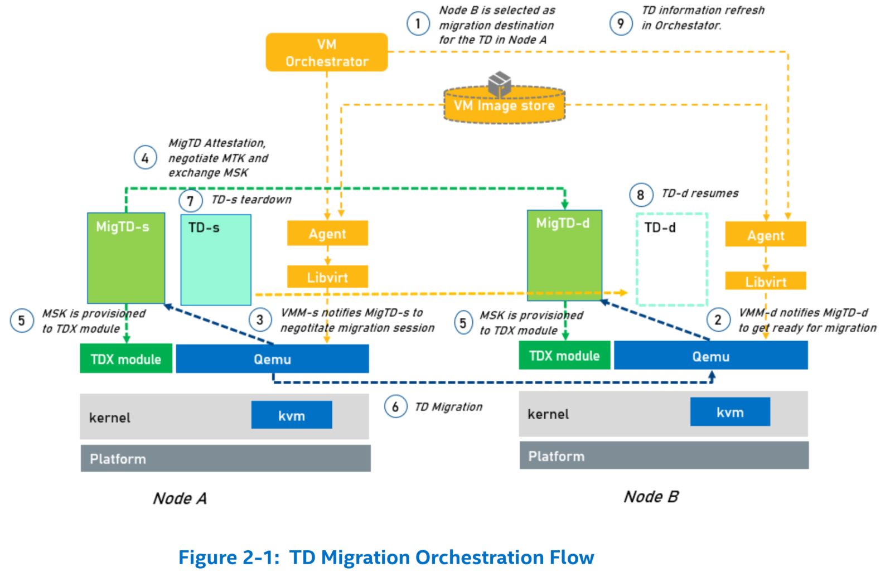

# TDX Migration TD Design Guide

# 1 介绍
## 1.1 背景
* 与 VM 迁移类似，云服务提供商可能希望将执行中的 Trust Domain（TD）从源 Trust Domain Extension（TDX）平台重新定位/迁移到云环境中的目标 TDX 平台。
  * 云提供商可以使用 TD 迁移来满足客户 Service Level Agreement（SLA），同时平衡云平台的可升级性、补丁和其他可维护性要求。
  * TD 在 CPU 模式下运行，可保护其内存内容及其 CPU 状态的机密性，免受任何其他平台软件（包括托管虚拟机监视器（VMM））的影响。在允许 TD 资源管理器（host VMM）跨兼容平台迁移 TD 的同时，必须维护这一主要安全目标。
  * 如下图所示，在选择迁移 TD 的目标平台上，TD 通常会被分配不同的 key（并且始终会分配不同的 ephemeral key）。

## 1.2 概览

* 在本规范中，被迁移的 TD 被称为 **source TD**，并且作为迁移结果而创建的 TD 被称为 **destination TD**。
* 可扩展的 **TD 迁移策略（TD Migration Policy）** 与 TD 相关联，用于维护 TD 的安全状况。
  * TD 迁移策略是使用 **Migration TD**（称为 **MigTD**）以 scalable 和 extensible 的方式实施的，该策略用于执行迁移 TD 的常见功能。
  * TD 迁移 **不** 依赖于与正在迁移的 TD 内运行的 TD guest 软件的任何交互。
* *TD 的内容* 主要由 TDX module 使用仅用于 TD 的唯一迁移会话的 **Migration Session Keys (MSK)** 进行保护和传输。
* **迁移 TD（MigTD）** 用于：
1. 评估潜在的迁移来源和目标，以确保遵守 TD 迁移策略。
2. 如果获得批准，将 Migration Session Key 从源平台安全地传输到目标平台，以迁移特定 TD 的资产。
* Host VMM 需要通过新的 SEAMCALL `[TDH.SERVTD.BIND]` 或 SEAMCALL `[TDH.SERVTD.PREBIND]` 将 MigTD 绑定到一个（或多个 TD）。
  * Host VMM 通过 TDX module 负责 TD 内容的导出/导入。
  * Host VMM 和现有的不可信软件堆栈负责迁移 *加密的 TD 内容*。
* 由于 MigTD 位于正在迁移的 TD 的 TCB 中，因此在目标 TD 度量完成之前，必须将 MigTD 预先绑定到正在迁移的目标 TD。
  * MigTD 生命周期不必与目标 TD 一致（coincidental）。
  * MigTD 可以在热迁移需要时实例化，并且必须在热迁移开始之前绑定到目标 TD。
  * MigTD 必须可运行，直到为要迁移的目标 TD 成功编程 MSK。

* 完整的 TD 迁移可以在 TDX TD 迁移规范中找到。 本文档仅描述 TD 迁移的软件架构。

# 2 迁移架构概览
## 2.1 TD 迁移编排

* TD 迁移编排流程

* 假设 VM orchestrator 管理 Node A 和 Node B。VM orchestrator 决定将 Node A 中的 TD 迁移到 Node B。
  * Node A 为迁移源，Node B 为迁移目的地。
  * Node A 中的组件被命名为 module-s，其中 `s` 表示源，Node B 中的组件被命名为 module-d，其中 `d` 表示目的地。
* 高层次上看 TD 迁移流程如下：
1. VM orchestrator 选择 node B 作为迁移目的地。
2. Node B 中的 VMM-d 通知 MigTD-d 准备迁移。
3. Node A 中的 VMM-s 通知 MigTD-s 协商迁移会话。
4. MigTD-s 从 TDX module 读取 migration session forward key 作为源平台中的 *迁移加密密钥*。MigTD-d 从 TDX module 读取 migration session backward key 作为目标平台中的 *迁移加密密钥*。
5. MigTD-s 和 MigTD-d 相互协商，包括相互证明、迁移策略评估、协商 Migration Transport Keys（MTK）和 Migration Session Keys（MSK）—— migration session forward key 和 migration session backward key。
6. MigTD-s 将 migration session backward key 写入 TDX module 为源平台中的 *迁移解密密钥*。MigTD-d 将 migration session forward key 写入 TDX module，作为目标平台中的 *迁移解密密钥*。
7. 在 VMM 和 QEMU 的帮助下，node A 中的 TD-s 迁移到 node B 中的 TD-d。
8. TD-s 由 VMM-s 拆除。TD-d 由 VMM-d 恢复。
9. 迁移完成。Orchestrator 刷新 TD 信息。

## 2.2 迁移中用到的 Keys
* 在 MigTD 中用到两种类型的 keys。
* **Migration Transport Keys (MTKs)**：它们是在源平台和目标平台之间的 MigTD 协商期间生成的一组密钥。
  * 我们将源平台上的 MigTD 称为 **MigTD-s**，将目标平台上的 MigTD 称为 **MigTD-d**。
  * 这些密钥用于保护 MigTD-s 和 MigTD-d 之间的通信消息。
  * 如果 MigTD-s 和 MigTD-d 使用网络传输层安全（Transport Layer Security，TLS）协议来建立安全会话，则 MTK 就是 TLS 会话密钥。
* **Migration Session Keys (MSKs)**：它们是由 TDX Module 生成并由 MigTD 交换的一组 AES-256-GCM 密钥。
  * MSK 在交换过程中受到 MTK 的保护。
  * 迁移中使用了两个 MSK。
    * 源平台上的 TDX module 生成 **migration session forward key**，用于由源 TDX module 加密迁移 bundles 并由目标 TDX module 解密它们。
    * 目标平台上的 TDX module 生成 **migration session backward key**，用于由目标 TDX module 加密迁移 bundles 并由源 TDX module 解密它们。
  * 源平台和目标平台上的每个 MigTD 从 TDX module 的目标 TD 元数据中读取在其一侧生成的 key，称为 **迁移加密密钥**，并将其安全地传输到迁移会话另一侧的对等 MigTD。
  * 然后，对等 MigTD 将用作 **迁移解密密钥** 的 key 写入 TDX module 的目标 TD 的元数据。
* 下图显示迁移设置中使用的 Migration Session Keys。

## 2.3 MigTD 常规流程
* 当 VMM 开始迁移时，VMM 可以随时启动 MigTD。一旦 MigTD 将 MSK 传输到 TDX module，就可以拆除 MigTD。
* 典型流程如下：
* [MigTD-s/MigTD-d] 在 VMM 开始迁移时由 VMM 启动。
* Host VMM 通过新的 SEAMCALL `[TDH.SERVTD.BIND]` 将 [MigTD-s/MigTD-d] 绑定到一个（或多个 TD）。它返回一个绑定句柄。绑定句柄将是迁移信息的输入参数的一部分。
* [MigTD-s/MigTD-d] 相互建立安全通道，例如，通过 remote attestation TLS（RATLS）协议。
  * [MigTD-s/MigTD-d] 通过网络接口（例如 vsock 接口）相互通信。
  * [MigTD-s/MigTD-d] 通过 `TDG.VP.VMCALL<GET_QUOTE>` 生成本地 QUOTE，并将 QUOTE 传递给 TLS 证书中的对等方。
  * [MigTD-s/MigTD-d] 通过对等 QUOTE 证明进行相互身份验证。
  * RA-TLS 身份验证完成后，[MigTD-s/MigTD-d] 可以派生一组 TLS 会话密钥作为 **Migration Transport Keys（MTK）**。然后安全通道就建立了。
* [MigTD-s/MigTD-d] 检查迁移策略。
  * 在安全会话中，[MigTD-s/MigTD-d] 可以检查迁移策略以查看是否允许对等方迁移。
* [MigTD-s/MigTD-d] 交换 **Migration Session Keys（MSK）**
  * [MigTD-s] 通过 `TDCALL<TDG.SERVTD.RD(MIG_ENC_KEY)>` 读取其自己的 migration session forward key。
  * [MigTD-d] 通过 `TDCALL<TDG.SERVTD.RD(MIG_ENC_KEY)>` 读取其自己的 migration session backward key。
  * [MigTD-s/MigTD-d] 通过受 MTK 保护的安全通道传输自己的密钥。
  * [MigTD-s] 通过 `TDCALL<TDG.SERVTD.WR(MIG_DEC_KEY)>` 写入对等方的 migration session backward key。
  * [MigTD-d] 通过 `TDCALL<TDG.SERVTD.WR(MIG_DEC_KEY)>` 写入对等方的 migration session forward key。
* [MigTD-s/MigTD-d] 可以拆除了。
* 下图显示常规的 Migration TD 流程。

* 必须注意，在 MigTD 与对等 MigTD 建立安全会话后，MigTD 应始终使用 `TDG.SERVTD.RD` 从 TDX module 读取一个新的 `MIG_ENC_KEY` 一次。该 `MIG_ENC_KEY` 在发送到对等 MigTD 后应立即删除，并且不得在任何迁移会话（包括当前会话或其他会话）中再次使用。此规则适用于源 MigTD 和目标 MigTD。
* 个人感觉，TDX module 里存了一份自己的 *迁移加密密钥*，因此留在之外的 MSK 需尽快删除，防止泄露到 TCB 之外。

# 3 MigTD 设计概览
## 3.1 设计概览
* Migration TD 是一个轻量级的 bare-metal 服务 TD。由于 MigTD 位于 TCB 中，因此 MigTD 中的代码应尽可能少。

### 3.1.1 MigTD design
* 下图显示 MigTD 的设计。它包含一个 shim layer 和一个 core。

* **TdShim** 是一个通用 shim 层，用于启动任何服务 TD，作为瞬态（transient）环境。
  * TdShim 包括一个 **Reset Vector**，它是 VMM 启动 TD 时的第一条指令。
  * 个人认为，TdShim 地位同等于 TDVF。
* **Core** 是 Migration TD 运行时执行环境。
  * **Crypto** 和 **TLS** 用于建立安全通信会话。它应该重用现有的已知良好的加密库和 TLS 配置，包括版本和密码套件。
  * **VSock** 是一种将 TLS 数据包传递给 VMM 并利用 VMM 网络栈与对等 MigTD 进行通信的方法。
  * **VMM communication** 应遵循 Guest-Host Communication Interface（GHCI）规范。
  * **Quote Attestation service** 用于远程证明 TLS 中的相互身份验证。
  * **Migration Policy** 用于根据预定义的策略对迁移 peer 进行评估。

### 3.1.2 MigTD 布局
* 下图显示构建时布局和运行时布局。

* 左侧显示构建时布局。Boot Firmware Volume（BFV）包括 TdShim 和迁移 core。
* 右侧 handle 显示运行时布局。
  * TdShim 应加载到 reset vector 所在的 4GB 内存的顶部。
  * 然后 TdShim 会将 MigTD core 重新定位到低内存空间并设置 x64 long mode 环境。
  * 强烈推荐这种方法，因为 4GB 的顶部通常映射到闪存设备。即使在虚拟化环境中，在闪存设备中执行代码也可能会带来一些特殊的限制。
  * Top of memory（TOM）以下的所有剩余附加内存都可以用作堆，并且可以从堆中分配栈。
  * 避免使用 1MB 以下的内存，因为 1MB 的顶部也映射到旧版闪存 ROM。

#### MigTD 启动流程
* 下图显示 Migration TD 启动流程。

1. **TdShim 中的 Reset Vector**。Reset vector 代码应将所有 application processors（APs）停放在已知位置，并且仅让 bootstrap processor（BSP）初始化环境。 BSP 应切换到长模式、设置栈并跳转到 TdShim initial program loader（IPL）。
2. **TdShim 中的 IPL**。当 TdShim 启动时，它应该在内部获取内存信息，例如元数据区域。然后它接受 TD 内存并设置所有必需的保护，例如 data execution prevention （DEP）。最后一步是找到 MigTD core，将其加载到低地址内存并跳转到 MigTD core。
3. **MigTD Core 的入口点**。MigTD 应该初始化最终的执行环境，包括堆和中断向量等。它还应该初始化 vsock 驱动程序以准备与 VMM 的通信。
4. **MigTD Core 运行时**。MigTD 应与对等 MigTD 建立安全通信会话。MigTD 应通过网络套接字接口，例如 vsock，发送和接收 TLS 数据包。建立安全会话后，MigTD-s 将生成 Migration Session Key 并传递给 MigTD-d。然后两个 MigTD 都可以将密钥传递给 TDX module。之后，MigTD 可以拆除。

#### 再现性
* 服务 TD 二进制文件应该是可重现的。请参阅“TDX Virtual Firmware Design Guide”以获得可重现的支持。

#### 安全考量
* MigTD 应采用“TDX Virtual Firmware Design Guide”中的安全考量。

#### 类型安全语言
* MigTD 应考虑使用类型安全语言，例如 Rust 编程语言来消除内存安全问题。

# 4 MigTD 双向认证
* 两个 MigTD 在构建安全通信通道时使用双向身份验证来相互验证。

## 4.1 远程证明 TLS
* 网络 TLS 协议是允许两个实体创建经过身份验证的安全会话的标准。TLS 中的典型双向身份验证需要提供 X.509 证书。然而，很难为 MigTD 提供私钥。解决此问题的一种方法是使用远程证明 TLS（RA-TLS）。
  * RA-TLS 不需要提供私钥或公共证书。MigTD 可以在运行时生成临时密钥对，并将公钥包含在 TD report data 和 TD quote data 中。
  * 然后，MigTD 在运行时生成 X.509 证书，将 TD Quote 包含在 X.509 证书中，并将此 TD 证书作为 TLS 证书发送给对等方。
  * 当对等 MigTD 收到证书时，它会获取 TD Quote，验证 Quote，然后就可以信任公钥。
  * 最后，对等 MigTD 可以使用公钥来验证其余 TLS 消息。
* 下图显示带 RA-TLS 的 Mig TD

* 更多 RA-TLS 的细节，参考 **[Intel RA-TLS]** 或 **[Open Enclave RA-TLS]**。

### 证明流程
* MigTD 证明流程与普通 TD 证明流程类似。
* 下图显示了 MigTD 中获取 TD Quote 的流程。

* 通过步骤 1~4，MigTD 为其自身获取 TDREPORT。TDREPORT 的完整性由 REPORTMACSTRUCT 保证，该 REPORTMACSTRUCT 通过具有唯一 MAC 密钥的 TDX CPU 进行 MACed 处理。 
* 在步骤 5~6 中，MigTD 使用 `TDG.VP.VMCALL<GetQuote>` 并尝试从 Quoting Enclave（QE）获取 Quote。
* 步骤 7~8 中，QE 与 TDX CPU 验证 TD report 的 MAC。需要进行此验证，因为 Quoting 是从 VMM 请求的并且不受信任。
* 步骤 9~10，如果验证通过，则 QE 用其证明密钥对 TDREPORT 进行签名，生成 TD QUOTE，并通过 VMM 返回给 MigTD。
* 现在，MigTD 可以将 TD Quote 包含在 TLS 证书中并发送给对等方。

* 下图显示了 TDREPORT 结构。

* 一旦 MigTD 从对等方收到 TLS 证书，它就会从 TLS 证书中提取 TD Quote，并验证 TD Quote 的完整性。上图显示了 TD Report 和 Quote。
* 有关 TD Report 结构的详细信息，请参阅 Intel TDX Module v1.5 ABI。
* 有关 TD Quote 结构的详细信息，请参阅 Intel TDX DCAP Generation Library 和 Quote Verification Library。

## 4.3 Trust Anchor

* Quote 由 Quoting Enclave（QE）通过 Attestation Key 进行签名。
* Attestation Key Certificate 由 Provision Certification Enclave（PCE）使用 Provision Certification Key（PCK）进行签名，
* PCK 证书使用 PCK CA 证书进行签名，
* PCK CA 证书使用 Intel 根 CA 证书进行签名。参见下图。
* 请参阅 Intel® SGX PCK Certificate and Certificate Revocation List Profile Specification 了解更多详细信息。

* MigTD 应注册 Intel 根 CA 证书。Intel 根 CA 证书应作为迁移策略的一部分进行度量。

## 4.4 证书吊销列表
* 除根 CA 证书外，验证过程还应包括对吊销证书的检查。

## 4.5 证书结构
* TD Quote Certificate 应生成为 DER 编码的 X.509 v3 格式证书。

## 4.6 TD Report Data
* 在 MigTD 证明期间，将生成一对非对称密钥。公钥哈希（**SHA384**） 被视为 TD report data 的 nonce。

## 4.7 基于 OID 的 TD Quote
* MigTD Quote report 是基于 X509 v3 扩展 OID 的数据。

## 4.8 证书样例

## 4.9 TD Quote API

### 4.9.1 获取 TD Quote
* 在 MigTD 双向认证中，RA-TLS 需要获取 TD Quote 并将其放入
* OID:MigTD_quote_report 并围绕它创建 RA-TLS 证书。

### 4.9.2 校验 TD Quote
* 在 MigTD 双向身份验证中，对等方将获取 RA-TLS 证书并验证 TD Quote 的完整性。如果完整性验证失败，TLS 将被终止。
* 注意：MigTD 策略验证与 TD Quote 证明无关。MigTD 策略验证将是 MigTD 双向身份验证之后的下一步。Migration session key（MSK）在 MigTD 策略验证后通过。

# 5 MigTD 迁移策略
* MigTD 需要一组迁移策略来确定是否允许将 TD 从源平台迁移到目标平台。

## 5.1 MigTD 策略类型
* 一般来说，可能有多种类型的策略：
* Table 5-1：MigTD 策略类型

## 5.2 MigTD 策略度量
* MigTD 应以可扩展的方式设计策略，以便 CSP/解决方案供应商可以添加自己的策略。该政策可以是：
  * 代码 —— 由通用策略引擎执行以评估
    * 代码（静态链接库或动态加载模块）可以是 MigTD Core 的一部分，它在 non-SecureBoot 模式下扩展为 `MRTD`，在 Secure Boot 模式下扩展为 `RTMR[1]`。有关这两种模式的更多详细信息，请参见第 10 章。
    * 如果 MigTD 检查“TDX Module Policy”以更早地检测到错误，则可以在代码中完成此检查，然后无需将其定义为策略数据。
  * 数据 —— 由公共策略模块使用。
    * 稍后可以在 MigTD 的 Configuration Firmware Volume（CFV）中配置数据，该卷已扩展到 `RTMR[2]`。
    * MigTD 在 CFV 中包含“MigTD 默认策略”，以便可以容易更新。例如，TCB SVN 或 QE 证书过期日期。Trust anchor“Intel 根 CA 证书”和证书吊销列表 (CRL) 也应包含在 CFV 中作为迁移策略的一部分。

## 5.3 MigTD 策略定义
* 典型的 MigTD 策略是 TCB 和硬件比 baseline 日期更新，可以使用 TDX Quote 证明进行评估。

### 5.3.1 MigTD 策略属性
* Table 5-2: MigTD Policy Property

### 5.3.2 MigTD 策略格式
* MigTD 应使用策略数据格式的行业标准 - **JSON**。

### 5.3.3 MigTD 策略
#### 5.3.3.1 non-SecureBoot 中的策略样本
* 在这种模式下，我们无法知道 MigTDCore 的 SVN。我们使用策略来指示 MigTD 必须相同。

#### 5.3.3.2 Secure Boot Mode 中的策略样本
* 在这种模式下，我们可以知道 MigTDCore 的 SVN。我们使用策略来指示一组 MigTD，使 SVN 处于固定范围内。

# 6 MigTD 网络通信
* 两个 MigTD 需要相互通信才能建立安全会话。由于 MigTD 位于 TCB 中，因此不建议在 MigTD 中包含完整的 TCP/IP 网络堆栈。
* 相反，MigTD 应在不受信任的 VMM 主机环境中使用网络栈。

## 6.1 TDVMCALL
* MigTD-s 可以使用 `TDG.VP.VMCALL<Service.MigTD.Send>` 和 `TDG.VP.VMCALL<Service.MigTD.Receive>` 来与 VMM 主机环境进行通信并传递 MigTD-to-MigTD 通信数据包（例如 TLS 数据包）。
* 源平台上的 VMM 需要将通信包传递给目标平台上的 VMM。然后目标平台上的 VMM 可以将数据包返回给 MigTD-d。
* 当 MigTD-d 完成对输入数据包的处理时，MigTD-d 可以使用相同的机制将响应返回给 MigTD-s。
* 下图显示流程

### 6.1.1 VSock 信息
* 在 MigTD 启动期间，VMM 可以将 `MIGTD_STREAM_SOCKET_INFO` HOB 传递到 MigTD，以允许 MigTD 与代理进行通信。
* VMM 的上下文 ID（CID）是 `2` - 主机的众所周知的 CID。可以从 `MIGTD_STREAM_SOCKET_INFO` HOB 检索 MigTD 的上下文 ID（CID）。
* VMM 或 MigTD 可以是客户端或服务器。
* 服务器侦听端口可以在 `MIGTD_STREAM_SOCKET_INFO` HOB 中找到。

### 6.1.2 VSock 数据负载
* MigTD 应将 TLS 数据包放入 VMCALL-vsock 数据负载。

# 7 MigTD 加密功能
* MigTD 需要使用加密技术进行密钥协商。

## 7.1 Cryptography
### 7.1.1 Cryptography Algorithm
### 7.1.2 TLS Configuration
### 随机数生成
* MigTD 应使用 Intel 指令 `RDSEED/RDRAND` 来获取随机数。

# 8 MigTD 二进制镜像
* MigTD 是一个定制化的微型 TDVF。

## 8.1 Boot Firmware Volume（BFV）
* MigTD 包括一个 Firmware Volumes（FV）- Boot Firmware Volume。FV 的格式在 PI 规范中定义。
* Boot Firmware Volume 包括引导期间所需的所有组件。
* 文件系统 GUID 必须是 `EFI_FIRMWARE_FILE_SYSTEM2_GUID` 或 `EFI_FIRMWARE_FILE_SYSTEM3_GUID`，这在 PI 规范中定义。
1. **TD Shim**
   1. **ResetVector** – 该组件提供 MigTD 的入口点、切换到长模式并跳转到 ShimIpl。FFS GUID 必须是 `EFI_FFS_VOLUME_TOP_FILE_GUID`，它在 PI 规范中定义。
   2. **ShimIpl** – 该组件为 MigTDCore 准备所需的参数并跳转到 MigTDCore。模块类型为 `EFI_FV_FILETYPE_SECURITY_CORE`，在 PI 规范中定义。
2. **MigTDCore** – 主要的 MigTD 模块，完成第 2 章中描述的所有工作，然后自行拆除。
   * MigTD 核心包括密钥交换加密功能和通过 VMM 接口的网络功能。
   * 文件类型为 `EFI_FV_FILETYPE_DXE_CORE`，在 PI 规范中定义。
* BFV 可以包括初始静态页表以协助 Reset Vector 从 32 位模式切换到 64 位模式。

## 8.2 Configuration Firmware Volume（CFV）
* MigTD 包括用于保存迁移策略数据的 Configuration Firmware Volume (CFV)。
* 文件系统 GUID 应为
  * 在 PI 规范中定义的 `EFI_FIRMWARE_FILE_SYSTEM2_GUID` 或 `EFI_FIRMWARE_FILE_SYSTEM3_GUID`，
  * 或 `EFI_SYSTEM_NV_DATA_FV_GUID`，在 https://github.com/tianocore/edk2/blob/master/MdeModulePkg/Include/Guid/SystemNvDataGuid.h 中定义。
* Table 8-1: MigTD Policy Data

项目                     | 描述                      | 度量
-------------------------|--------------------------|-------------
MigTD 策略               | JSON 文件                 | RTMR[2]
根 CA 证书（Trust Anchor）| 一个 X.509 证书           | RTMR[2]
证书吊销列表              | 一个证书吊销列表           | RTMR[2]
Secure Boot Key          | 一个安全启动公钥（仅适用于 SecureBootMode | RTMR[2]

# 9 MigTD 启动
* MigTD 启动与 TDVF 启动类似。

## 9.1 MigTD 初始化
* MigTD 初始化与 TDVF 初始化流程相同，从禁用分页的 32 位保护模式开始，然后切换到 64 位长模式。

## 9.2 MigTD Hand-Off Block（HOB）
* TD HOB 列表用于将信息从 VMM 传递到 TDVF。
  * HOB 格式在 PI 规范中定义。
  * 如果使用 TD HOB，则必须将其扩展到 RTMR 寄存器。
* MigTD 应忽略从 VMM 传递的 TD HOB。TD 内存信息应在元数据区域中由 MigTD 指示。
* 启动后，MigTD 应调用 `TDG.VP.VMCALL<Service.MigTD.WaitForRequest>` 来获取新的迁移信息。
* MigTD 可以是暂时的或持久的，在将 MSK 编程到 TDX module 后，MigTD 应使用 `TDG.VP.VMCALL<Service.MigTD.ReportStatus>` 来报告迁移状态。

## 9.3 MigTD 拆除
* 迁移完成后，MigTD 可以使用特殊的 `TDG.VP.VMCALL<Service.MigTD.Shutdown>` 自行拆卸。
* MigTD 仅在 VMM 开始迁移时启动。

## 9.4 MigTD AP 处理
* 为简单起见，MigTD 可以选择仅支持一个处理器。

# 10 MigTD 度量
* MigTD 的度量与正常 TDVF 是一样的。

## 10.1 Non-Secure Boot Mode
* 通常，TD-Shim 被视为固件代码并扩展为 `MRTD`。
  * MigTD core 被视为操作系统代码并扩展到 `RTMR[1]`。
  * MigTD 策略被视为应用程序代码/配置并扩展到 `RTMR[2]`。见 Table 10-1。
* 但是，如果我们选择这种方法，则无法知道 MigTD 的安全版本号（SVN）。如果我们想让 MigTD 支持使用 SVN 标识的不同对等 MigTD，那么我们需要一种不同的方式 – 安全启动模式（Secure Boot Mode）。
* Table 10-1: MigTD（Non-Secure Boot）的 TD 度量寄存器

典型使用      | 寄存器   | 事件日志 | 被扩展                                 | 内容
-------------|----------|--------|-----------------------------------------|----------
固件代码      | MRTD    | 否      | VMM: SEAMCALL`[TDH.MR.EXTEND]`          | TD-Shim
固件配置      | RTMR[0] | 是      | TD-Shim: TDCALL`[TDG.MR.RTMR.EXTEND]`   | N/A
OS 代码/配置  | RTMR[1] | 是      | TD-Shim: TDCALL`[TDG.MR.RTMR.EXTEND]`   | MigTD Core
APP 代码/配置 | RTMR[2] | 是      | MigTD Core: TDCALL`[TDG.MR.RTMR.EXTEND]`| MigTD 策略（包含 JSON 格式策略、根 CA 证书和 CRL）

## 10.2 Secure Boot Mode
* 在安全启动模式（Secure Boot Mode）下，仅 TD-Shim 扩展为 `MRTD`。TD-Shim 可以遵循安全启动策略来验证 MigTD 及其 SVN 的签名。
  * 安全启动密钥被视为固件配置并扩展到 `RTMR[0]`。
  * MigTD Core 及其 SVN 被视为操作系统代码和配置。它们被扩展到 `RTMR[1]`。
  * MigTD 策略仍然被视为 APP 配置并扩展到 `RTMR[2]`。见 Table 10-2。
* 通过这种方法，验证者可以获得 MigTD core SVN。如果 TD-Shim 和安全启动密钥相同并且 MigTD Core 和 SVN 已更新，则 MigTD 可以使用 SVN 验证对等点。
* Table 10-2: MigTD（Secure Boot）的 TD 度量寄存器

典型使用      | 寄存器   | 事件日志 | 被扩展                                 | 内容
-------------|----------|--------|-----------------------------------------|----------
固件代码      | MRTD    | 否      | VMM: SEAMCALL`[TDH.MR.EXTEND]`          | TD-Shim
固件配置      | RTMR[0] | 是      | TD-Shim: TDCALL`[TDG.MR.RTMR.EXTEND]`   | 安全启动密钥
OS 代码/配置  | RTMR[1] | 是      | TD-Shim: TDCALL`[TDG.MR.RTMR.EXTEND]`   | MigTD Core，MigTdCore SVN
APP 代码/配置 | RTMR[2] | 是      | MigTD Core: TDCALL`[TDG.MR.RTMR.EXTEND]`| MigTD 策略（包含 JSON 格式策略、根 CA 证书和 CRL）

## 10.3 MigTD 绑定
* MigTD 需要与待迁移的目标 TD 绑定。
* 如果 VMM 选择保持 MigTD 存活，则 VMM 可以首先启动 MigTD，然后使用 `SEAMCALL[TDH.SERVTD.BIND]` 绑定目标 TD。
  * 然后 VMM 获取 TargetTD_UUID 和 BindingHandle 并将它们传递给 `MIGTD_MIGRATION_INFORMATION` 中的 MigTD。
* 如果 VMM 在需要时选择启动 MigTD，则 VMM 可以使用 `SEAMCALL[TDH.SERVTD.PREBIND]` 来预绑定目标 TD。
  * VMM 应计算 MigTD 的 `TDINFO_STRUCT`，然后计算 `SERVTD_INFO_HASH`。
    * `SERVTD_INFO_HASH` 应在预绑定期间作为参数输入。

## 11 MigTD 元数据
* MigTD 使用与 TDVF 所需定义相同的元数据。需要 BFV 和 payload 来指示 MigTD 镜像。
* 如果支持基于 CFV 的策略，则可能需要 CFV。
* 需要临时内存（栈/堆）和永久内存来指示 MigTD 要使用的内存。
* MigTD 中不需要 TD HOB。
* VMM 应按照 TDVF 描述符中的条目创建 MigTD 内存。

# 12 多 TDs 迁移

## 12.1 多 TDs 迁移
* VMM 可能需要一次迁移多个 TD。如果一个源 MigTD 和一个目标 MigTD 建立了双向认证的 RA-TLS 连接，则该连接可用于迁移多个 TD。见图 12-1。
* 默认情况下应支持此模型，因为如果源 MigTD 和目标 MigTD 相同，则无需设置多个 RA-TLS 会话。

### 12.2 多 RA-TLS 连接
* 一个 migration TD 可能支持往返于不同 migration TD 的多个 RA-TLS 连接会话。

### 12.2.1 多目的 MigTDs
* 在某些情况下，VMM 可能需要将多个 TD 迁移到不同的平台。因此，一个源 MigTD 需要建立与多个目标 MigTD 的连接。见图 12-2。

### 12.2.2 多源 MigTDs
* 与上述情况类似，VMM 可能会从不同平台启动一个目标和 migration TD。因此，一个目标 MigTD 需要等待来自多个源 MigTD 的连接。见图 12-3。

