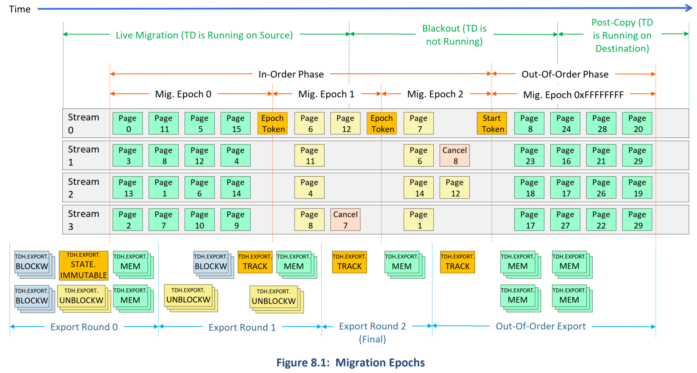
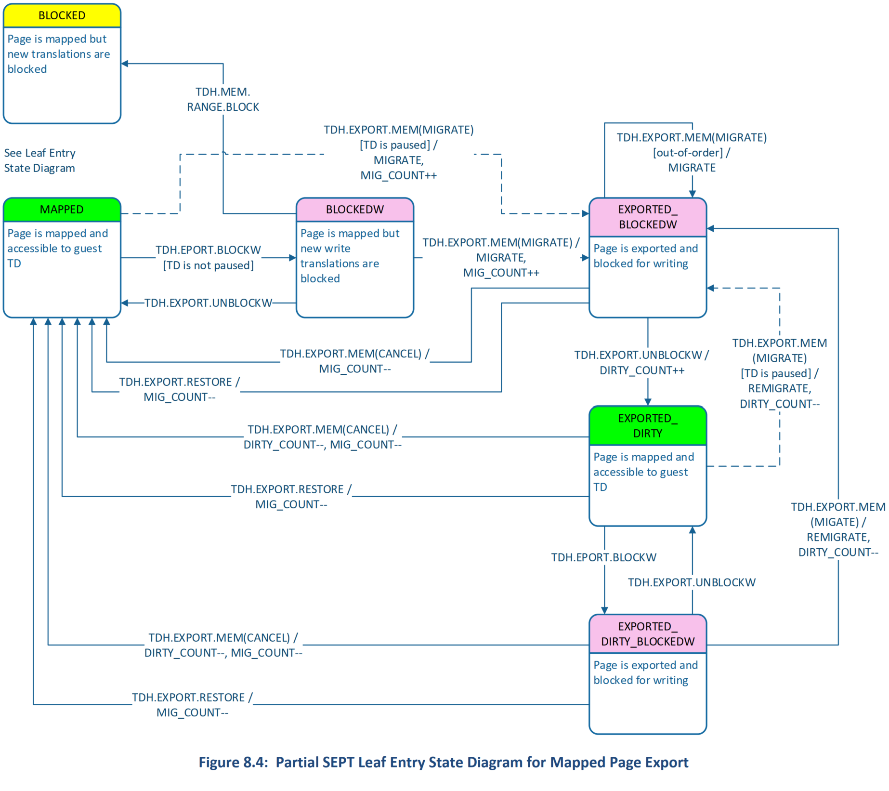
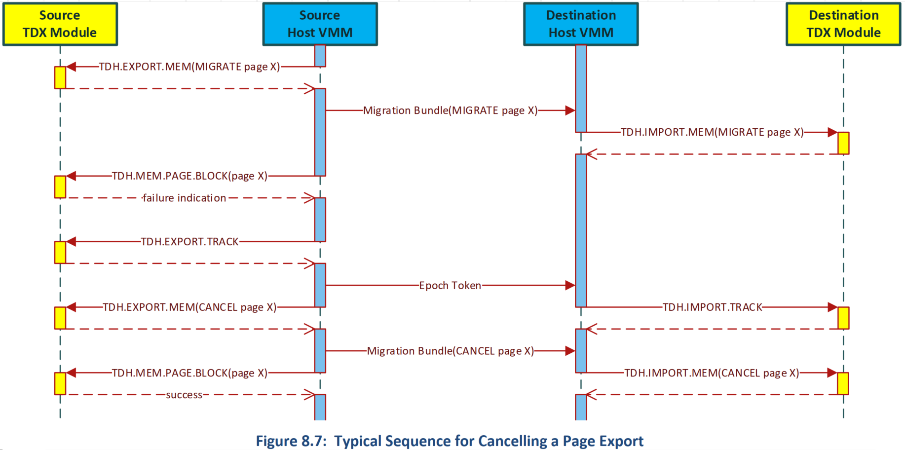
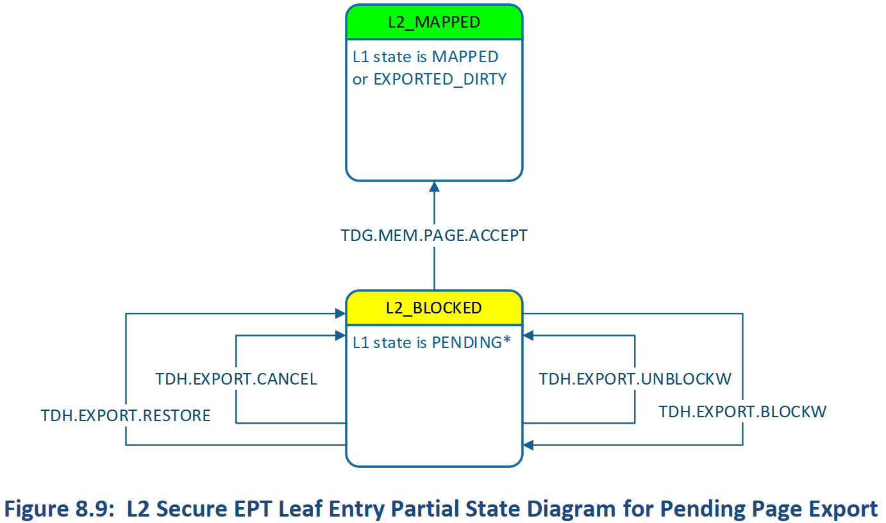

# Intel® TDX Module Architecture Specification: TD Migration

# SECTION 1: TD MIGRATION INTRODUCTION AND OVERVIEW

# 2 TD 迁移概览

## 2.1 介绍

* 与传统 VM 迁移类似，云服务提供商（CSP）可能希望将正在执行的 Trust Domain 从 **源 TDX 平台** 重新定位/迁移到云环境中的 **目标 TDX 平台**。
  * 云提供商可以使用 TD 迁移来满足客户 SLA，同时平衡云平台的可升级性、补丁和其他可服务性要求。
  * 由于 TD 在 CPU 模式下运行，这有助于保护其内存内容和 CPU 状态的机密性，免受任何其他平台软件，包括托管虚拟机监视器（VMM）的影响，因此必须维护这一主要安全目标，同时允许 TD 资源管理器 ，即跨兼容平台迁移 TD 的主机 VMM。
  * 通常可以在被选为迁移 TD 的目标平台上为 TD 分配不同的 HKID（并且始终分配不同的临时密钥）。
* 在本 spec 中，被迁移的 TD 被称为 **源 TD**，并且作为迁移结果而创建的 TD 被称为 **目标TD**。
  * 可扩展的 **TD 迁移策略** 与 TD 相关联，用于维护 TD 的安全状况。
  * TD 迁移策略是使用一种称为 **迁移 TD（又名 MigTD）**（在下面的图 2.2 中介绍）的特定类型的 **服务 TD** 以可扩展和可扩展的方式实施的，该服务用于为迁移 TD 提供服务。
* TD 热迁移过程（以及迁移 TD）不依赖于与正在迁移的 TD 内运行的 TD guest 软件的任何交互。

## 2.2 TD 迁移场景
* 本节描述本规范所解决的使用场景（以及明确超出范围的使用场景）。本规范从热迁移（如下所述的场景）角度记录了 TD 迁移功能。
* 下面描述的冷迁移和其他场景实际上是通过本规范中的 Intel TDX module 接口功能进行软件管理的子场景。

### 2.2.1 冷迁移
* 目的地已知并已恢复的冷迁移使得两端必须处于活动状态才能进行切换
  * TD 镜像在迁移过程中 *suspended*，并在持续时间 >> TCP 超时后恢复。
  * 对于滚动升级/补丁+ 重新启动服务器（无需迁移 TD 即可完成非重新启动补丁）、容量规划和负载均衡很有用。

### 2.2.2 热迁移
* 目的地已知并已恢复的热迁移使得两端必须处于活动状态才能进行切换
  * TD 在迁移期间 *执行* 并暂停持续时间 << TCP 超时
  * 客户 SLA、容量规划/负载平衡
* TD 可以使用多个会话多次热迁移。

### 2.2.3 Image Snapshot 和 Jumpstart
* 预构建的镜像/Jumpstart 目的地未知，并且 TD 镜像存储的时间不确定。
* 此用法具有本规范中未包含的额外平台安全要求。
  * 示例用例是保存 TD 的检查点，以便 TD 可以预先加载到内存中。
  * 满足这种用法的替代实现是可能的。例如，TD 可以自己 un-hibernate 镜像。
  * 此场景/用例超出了本规范的范围。

## 2.3 参与到 TD 迁移的组件
* TD 迁移涉及的主要组件有：
  * 正在迁移的 TD
  * 在源平台和目标平台上托管 VMM
  * 主机和目标平台上的 *迁移 TD*

* **迁移 TD（MigTD）** 用于评估潜在的迁移源和目标，以确保遵守 TD 迁移政策。
  * TD 迁移策略列举了 TDX 平台 TCB 要求以及可接受的目标迁移 TD TCB 级别。
* 如果 TCB 级别可接受，源平台和目标平台上的迁移 TD 会安全地交换唯一的 per-session 的 **Migration Session Keys（MSK）**，这些密钥用于迁移特定 TD 的资产。
  * 每一侧的 MigTD 读取 TDX module 生成的加密密钥作为 TD 元数据，并将其传输到另一侧的 MigTD。
  * MigTD 将密钥作为 TD 元数据写入其一侧的解密密钥。
* Host VMM 可以将 MigTD 绑定到一个或多个正在迁移的 TD。有关详细信息，请参阅 [TDX Module Base Spec] 的 Service TDs 章节。
  * 由于 MigTD 位于正在迁移的 TD 的 TCB 中，因此在目标 TD 度量完成之前，必须将 MigTD 预先绑定到正在迁移的目标 TD。
  * MigTD 生命周期不必与目标 TD 一致 – MigTD 可以在热迁移需要时实例化，但必须在热迁移开始之前绑定到目标 TD，并且在为正在迁移的目标 TD 进行 migration session keys 编程成功完成之前必须是可操作的。
  * MigTD 度量包含在目标 TD 的证明信息结构中。
* Host VMM 通过 TDX module 负责 TD 内容的导出/导入，以及将受保护的 TD 内容传输到目标平台。

## 2.4 迁移资产
* 下表显示了迁移的 TD 资产。
* 元数据包括 TD 范围和 VCPU 范围的非内存状态（例如控制状态、CPU 寄存器状态等）和内存属性（例如 GPA 和访问权限）。
* 元数据不会按原样迁移；它被序列化为迁移格式并在目标平台上重新创建。
* Table 2.1: Migrated TD Assets

TD 资产                   | 哪持有                    | 导出函数          | 导入函数
--------------------------|--------------------------------------|-----------------------------|--------------
不可变的非内存状态（元数据）| TDX module global  TDR  TDCS | `TDH.EXPORT.STATE.IMMUTABLE` | `TDH.IMPORT.STATE.IMMUTABLE`
可变的非内存状态（元数据）  | TDCS  TDVPS | `TDH.EXPORT.STATE.TD` `TDH.EXPORT.STATE.VP`   | `TDH.IMPORT.STATE.TD` `TDH.IMPORT.STATE.VP`
内存状态和元数据           | TD 私有页  Secure EPT | `TDH.EXPORT.MEM` | `TDH. IMPORT.MEM`

## 2.5 Guest TD 迁移生命周期概览

### 2.5.1 预迁移
#### 2.5.1.1 TDX Module 列举
* Host VMM 调用 `TDH.SYS.RD` 或 `TDH.SYS.RDALL` 接口函数来枚举 TDX module 功能，并从 `TDX_FEATURES` 获知 TDX module支持 TD 迁移。
* Host VMM 获悉 TD 迁移能力的详细信息和从其他字段获悉服务 TD 的能力。

### 2.5.2 Reservation and Session Setup

#### 2.5.2.1 源平台上的 Guest TD 构建、迁移 TD 绑定和 TD 执行
* [TDX Module Base Spec] 中描述了源 TD 构建和执行过程。为了可迁移，可以使用 `TDH.MNG.INIT` 函数将 TD 初始化，并将 `ATTRIBUTES.MIGRATABLE` 位设置为 `1`。
* 在迁移会话开始之前，源平台上的 host VMM 必须使用 `TDH.SERVTD.BIND` 将 *迁移 TD* 绑定到 *源 TD*。
* MigTD 可以读取源 TD 的选定元数据字段，例如其 `ATTRIBUTES` 和 `XFAM` 配置，以用于评估迁移策略。

#### 2.5.2.2 Guest TD 在目标平台上的初始构建
* 与传统 TD 构建过程相同，host VMM 通过使用 `TDH.MNG.CREATE` 接口函数创建新的 guest TD。
* 该目标 TD 被设置为“template”以接收源 guest TD 的状态。
* Host VMM 使用每个 package 上的 `TDH.MNG.KEY.CONFIG` 接口函数将 HKID 和分配给 TD 的硬件生成的加密密钥编程到 MKTME 加密引擎中。
* 然后，host VMM 可以通过使用 `TDH.MNG.ADDCX` 接口函数添加 TDCS 页面来继续构建 TDCS。

#### 2.5.2.3 Migration Session Key 协商
* 迁移会话密钥（Migration Session Key）是临时 AES-256-GCM 密钥，用于从源平台导出并在目标平台上导入的 TD 私有状态的机密性和完整性保护，以及迁移会话控制协议的完整性保护。
  * TD 共享内存状态由不受信任的 host VMM 按照传统方法进行迁移 - host VMM 可以对两者使用相同的网络传输。
  * Migration Session Key（MSK）由迁移 TD 建立，迁移 TD 负责评估正在迁移的 TD 的迁移策略。
* 在源平台和目标平台上执行的迁移 TD 使用 TD-quote-based 的双向身份验证协议在它们之间创建 VMM 传输不可知的会话。
  * 迁移 TD 协商受保护的传输会话（使用 Diffie-Hellman 交换）。
  * 使用此受保护的传输会话，迁移 TD 可以评估迁移策略。
* TDX module 支持的 Service TD 绑定机制允许迁移 TD 访问目标 TD 元数据，特别是 Migration Session Key。
  * MigTD 可以使用 `TDG.SERVTD.RD/WR*` guest-side 接口函数访问 TD 元数据。
* 源平台和目标平台上的 TDX module 都会生成临时 **migration session encryption keys**。
  * 每一侧的迁移 TD 使用 Service TD 接口读取该密钥并将其安全地传输到对等迁移 TD，后者使用 Service TD 接口将其写入作为 **migration session decryption key**。
* 此后，host VMM 可以调用 TDX module 功能，例如 `TDH.EXPORT.*` 以在源平台导出状态，以及 `TDH.IMPORT.*` 以在目标平台导入 TD 状态。

### 2.5.3 In-Order Memory Migration Phase

#### 2.5.3.1 TD 全局不可变元数据（非内存状态）迁移
* TDX module 可保护 guest TD 全局状态的机密性和完整性。
  * 任何软件（除了 TDX module）或设备都无法直接访问保存 guest TD 元数据的控制结构。
  * 这些结构通过 TD 私钥加密存储在内存中并受到完整性保护，并由 TDX module 接口功能进行管理。
* **不可变元数据** 是由 `TDH.MNG.INIT` 设置的 TD 状态变量集，可以在 TD 构建期间修改，但在使用 `TDH.MR.FINALIZE` 最终确定 TD 度量后永远不会修改。
  * 其中一些状态变量控制 TD 及其内存的迁移方式。因此，要在迁移任何 TD 内存状态之前，迁移不可变的 TD 控制状态。
* TD 不可变状态通过 `TDH.EXPORT.STATE.IMMUTABLE` 接口函数导出，并通过 `TDH.IMPORT.STATE.IMMUTABLE` 接口函数导入到目标平台。

#### 2.5.3.2 内存状态的迭代 Pre-Copy

##### 2.5.3.2.1 TD 私有内存的迁移注意事项
* TDX 使用 MKTME（内存加密和完整性保护）和 TDX module，帮助保护私有内存中的 guest TD 状态免受恶意 VMM 的侵害。
  * TDX module 执行临时密钥 ID 管理以实施 TDX 安全目标。内存加密由驻留在每个内存控制器上的加密引擎执行，软件无法访问（包括 TDX module）临时密钥。
  * 内存加密引擎在密钥加密表（Key Encryption Table，KET）中保存一个加密密钥表。为内存事务选择的加密密钥基于随访存事务提供的主机密钥标识符（HKID）。
* TDX module API 功能使 host VMM 能够管理 guest TD 的 HKID 分配、配置内存加密引擎等，同时确保正确操作以维护 TDX 的安全目标。Host VMM 也无权访问 TD 加密密钥。
* **TD 迁移不会迁移 HKID** —— 为目标平台上创建的 TD 分配一个空闲的 HKID，以从源平台接收该 TD 的可迁移资产。
  * 所有 TD 私有内存在从源平台传输到目标平台的过程中都受到保护，通过源平台和目标平台上的迁移 TD 协商的 MSK（使用 AES-GCM 256（AES-256-GCM））执行的中间加密。
  * 在目标平台上，当内存被导入到分配给目标 TD 的目标平台内存中时，内存会通过目标临时密钥进行加密。
  * 目标 TDX module 上的导入操作使用 MSK 验证并解密 TD 私有数据；它使用 MKTME 引擎进行加密（和完整性保护），同时使用目标 TD HKID 将其写入内存。
* 在热迁移期间，允许源 TD 修改私有内存（直到源 TD 被 host VMM 暂停以完成迁移的最后阶段）。
  * 为此，TD 私有内存会在一组 Migration Epochs 内进行迁移。
  * Migration epochs 实施 TD 热迁移安全属性 S4：CSP 不得在源 TD 的任何过时状态上操作目标 TD。
  * Host VMM 还可以实例化多个迁移流以进行内存状态传输（例如，利用多个主机硬件线程）—— 只要不违反 security invariants。
* 分配给 TD 的共享内存使用 host VMM 的传统机制进行迁移。
* 基于加密的内存保护在 [MKTME PAS] 中描述，ISA 在 [Intel TDX PAS] 中描述。当迁移 TD 使用独立的 HKID 时，TD 迁移不会改变 TD 密钥管理。

##### 2.5.3.2.2 EPT 结构的迁移注意事项
* Guest 物理地址（GPA）空间分为私有子空间和共享子空间，由 GPA 的 `SHARED` 位决定。
  * CPU 使用共享 EPT 转换共享 GPA，共享 EPT 驻留在 host VMM 内存中，并由 host VMM 直接管理，与传统 VMX 相同。
  * CPU 使用单独的 Secure EPT 转换私有 GPA。Secure EPT 页面使用 TD 的临时私钥进行加密和完整性保护。
* 由于无法保证为目标平台上正在迁移的 TD 分配相同的物理内存地址，因此 **用于 Secure EPT 结构的内存不会跨平台迁移**。
  * 因此，VMM 必须在目标平台上调用 TDX 模块的 `TDH.MEM.SEPT.*` 接口函数，以在目标平台上重新创建私有 GPA 映射（根据分配的 HPA）。
  * TDX module 使用受加密保护的导出元数据（通过 `TDH.EXPORT.MEM` 生成）来验证并实施（通过 `TDH.IMPORT.MEM`）来自源平台的 Secure EPT 安全属性是否已正确重新创建，如同 TD 私有内存内容被迁移那样，从而防止迁移过程中的重映射攻击。
* 即使 Secure EPT 结构未被迁移，当一个页面被导出并随后在 pre-copy 阶段由 TD OS 修改时，源 SEPT 结构也会跟踪其映射的状态。
  * 可以允许 TD OS 修改这样一个页面，并且由 TDX module 实施将该已修改的和先前导出的页面，由源 host VMM 重新导出，再由目的地 host VMM 重新导入。

#### 2.5.3.3 源 TD 停止和最终的非内存状态迁移
* 在 pre-copy TD 私有内存之后，host VMM 必须将源 TD 暂停（pause）一小段时间（也称为中断期，blackout period），以便 VMM 可以导出最终控制状态（对于所有 VCPU 和整个 TD）。 
* VMM 通过 `TDH.EXPORT.PAUSE` 启动此操作，检查安全前提条件并阻止 TD VCPU 继续执行。然后，它允许导出最终（可变）TD 非内存状态。

#### 2.5.3.4 In-Order Memory State Re-Migration Completion
* 当有序阶段（in-order phase）完成时，任何已迁移的内存状态都必须是最新的。如果内存页已被迁移并且其内容后来被运行的 TD 更新，则必须重新迁移。
* TDX module 使用下面 2.5.6 中描述的 commitment 协议实施此操作。

#### 2.5.3.5 TD-Scope 和 VCPU-Scope 的可变非内存状态迁移
* *TD 可变非内存状态* 是一组源 TD 状态变量，自从通过 `TDH.MR.FINALIZE` 最终确定以后，可能已发生更改。
* TD scope（作为 TDR 和 TDCS 控制结构的一部分）和 VCPU scope（作为 TDVPS 控制结构的一部分）存在不可变的非内存状态。
* 可变 TD 状态由 `TDH.EXPORT.STATE.TD`（per TD）和 `TDH.EXPORT.STATE.VP`（per VCPU）导出，并分别由 `TDH.IMPORT.STATE.TD` 和 `TDH.IMPORT.STATE.VP` 导入。

### 2.5.4 Out-Of-Order Memory Migration Phase

#### 2.5.4.1 内存状态的迁移和导入的 Commitment
* 在 in-order 阶段期间尚未迁移的内存页可以在 out-of-order 阶段期间被迁移。
  * 由于源平台上的内存状态在此阶段没有改变，因此迁移顺序不是强制的（enforced）。
* **目标平台上的 host VMM 通过调用 `TDH.IMPORT.COMMIT` 或 `TDH.IMPORT.END` 提交导入**。
  * 此时，TD 可以在目标平台上运行，而不能在源平台上运行。

#### 2.5.4.2 内存状态的 Post-Copy
* 在一些热迁移场景中，host VMM 可以在目标 TD 开始执行之后暂存一些内存状态传输以延迟发生。
  * 在这种情况下，当目标 TD 发生访问时，host VMM 将需要获取所需的页面 - 此访问顺序是不确定的，并且可能与 host VMM 排队要传输的内存状态的顺序不同。
* 为了支持该按需模型（on-demand model），TDX 不强制执行此 **post-copy 阶段** 的内存迁移顺序。
  * Host VMM 可以实现具有多个优先级的多个迁移队列以用于内存状态转移。
  * 例如，源平台上的 host VMM 可以保留每个加密的迁移页面的副本，直到它接收到 *来自目的地的该页面已被成功导入的确认* 为止。如果需要，可以在高优先级队列上重新发送该副本。
  * 另一种选择是，不保留导出页面的副本，而是根据需要再次调用 `TDH.EXPORT.MEM`。
* 此外，为了简化此模型的 host VMM 软件，用于此 post-copy 阶段内存导入的 TDX module 接口函数会返回附加信息错误代码，以指示 host VMM 尝试过时的（stale）导入，以解决以下情况：GPA 的低延迟导入操作取代了（superseded）来自较高延迟导入队列的导入。

### 2.5.5 中止私有内存迁移
* 在热迁移场景中，错误可能会导致 CSP 编排中止一次激活的 TD 热迁移会话。
  * 在这种情况下，源平台上的 host VMM 可以通过 `TDH.EXPORT.ABORT` 主动发起中止。
  * 它还可以响应从目标平台接收到的 abort token，它可以由 `TDH.IMPORT.ABORT` 生成，以用于 late abort（在 pre-copy 完成之后）。
* 在这两种情况下，host VMM 必须使用 `TDH.EXPORT.RESTORE` 重置源平台上导出页面的 SEPT 状态。

### 2.5.6 Commitment
* Commitment 协议由 TDX module 实施，以帮助确保 host VMM 不会违反 TD 热迁移的安全目标，例如，在源 TD 热迁移到目标 TD 后，目标和源 TD 都不得继续执行，即使错误导致 TD 迁移中止。
* 该协议通过以下 TDX module 接口函数实施：
* **在源平台上，`TDH.EXPORT.PAUSE` 开始 TD 热迁移的 blackout 阶段，`TDH.EXPORT.TRACK` 结束热迁移的 blackout 阶段**（并标记 TD 内存 pre-copy、可变 TD VP 和可变的 TD 全局控制状态的传输结束）。
  * `TDH.EXPORT.TRACK` 生成基于 MSK 的加密验证 start token，以允许目标 TD 变得可运行。
  * 在目标平台上，`TDH.IMPORT.TRACK` – 它消耗加密 start token，允许目标 TD un-paused。
* 在错误情况下，在生成 start token 之前，源平台上的 host 可能会通过 `TDH.EXPORT.ABORT` 主动中止迁移过程；
  * 如果已经生成了 start token（即 pre-copy 完成），则目标平台可以使用 `TDH.IMPORT.ABORT` 生成 abort token，该 abort token 可由源 TD 平台 TDX 的 `TDH.EXPORT.ABORT` 消耗，以中止迁移过程并再次允许源 TD 再次变得可运行。

## 2.6 迁移对测量和证明的影响
* TD 度量对绑定到正在迁移的 TD 的 MigTD 进行了扩展，并且 `ATTRIBUTES.MIGRATABLE` 位是 TD 证明的一部分。

## 2.7 受迁移影响的 TDX Module 管理控制结构
* TDX module 管理一组不受信任的 host 软件无法直接访问的控制结构。
  * 使用加密和完整性（使用 TDX 私钥）在内存中保护控制结构。
  * 大多数控制结构都位于 host VMM 分配给 TD 的内存中。
* 下表描述了迁移对 TD 控制结构的影响。
* Table 2.2: TDX-Managed Control Structures

范围    | 名称 | 含义                             | 迁移影响
--------|-----|----------------------------------|----------
平台     | KOT  | Key Ownership Table             | 无
平台     | PAMT | Physical Address Metadata Table | PAMT.BEPOCH 用于保存迁移 epoch 信息
Guest TD | TDR  | Trust Domain Root               | 无
Guest TD | TDCS | Trust Domain Control Structure  | `TD ATTRIBUTES` 字段具有新的 `MIGRATABLE` 安全属性，必须设置该属性才能使 TD 可迁移。  某些状态已初始化（与 legacy 相同），某些状态通过 `TDH.IMPORT.STATE.IMMUTABLE` 和 `TDH.IMPORT.STATE.TD` 导入。  TDCS 具有通过 `TDH.MIG.STREAM.CREATE` 与 TD 设置关联的新迁移流上下文结构。
Guest TD | SEPT | Secure EPT                     | SEPT 条目状态得到了很大的扩展，以支持 TDX module 对内存导出和导入的跟踪。
Guest TD | TDINFO_STRUCT | TD measurement        | 添加了新字段 `SERVTD_HASH`
Guest TD VCPU | TDVPS | Trust Domain Virtual Processor State | 某些状态已启动，某些状态通过 TDX module API `TDH.IMPORT.STATE.VP` 导入，用于迁移 VCPU 控制状态

* 为 TD 迁移引入了由 TDX module 生成（并由 VMM 管理）的新数据结构。
* Table 2.3: TDX-Generated Control Structures

名称                  | 含义                        | 迁移影响
----------------------|----------------------------|----------------------------------
MBMD                  | Migration Bundle Metadata  | 迁移信息的通用头部和类型信息
GPA_LIST              | GPA list of migrated pages | GPAs 和相关属性列表，用于内存迁移和相关内存操作
MIGRATION_BUFFER_LIST | Migration buffer list      | Host VMM 提供的用于保存迁移数据的迁移缓冲区列表

## 2.8 TDX Module TD Migration Interface Functions Overview

# 3 TD 迁移软件流程
* 本章总结了使用 TDX module 接口功能进行 TD 迁移的软件流程。

## 3.1 典型的 TD 迁移流程概述

## 3.2 成功的 TD 导出
* 以下序列通常用于从源平台导出 TD。
* Table 3.1: Typical TD Export Sequence

迁移阶段         | 步骤          | 描述                             | 复数 | TDX module 接口函数
----------------|---------------|----------------------------------|------|-------------------
In-Order 导出   | 导出会话的开始 | VMM 初始化 MigTD（作为不可迁移的 TD）并将其绑定到源 TD。| 一次 | `TDH.SERVTD.BIND`
.               | .             | VMM/编排器在源和目标 MigTD 之间建立传输会话。MigTD 设置自己的受保护通道。| 一次 | .
.               | .             | MigTD 从源 TD 读取会话加密密钥、版本信息和其他元数据，并将其发送到目标上的 MigTD。| 一次 | `TDG.SERVTD.RD`
.               | .             | MigTD 从目标上的 MigTD 接收会话加密密钥，并将其作为会话解密密钥写入源 TD。它还可能编写迁移版本。| 一次 | `TDG.SERVTD.WR`
.               | __            | VMM 启动导出会话并导出不可变状态，创建状态迁移 bundle。| 一次 | `TDH.EXPORT.STATE.IMMUTABLE`
.               | Live Memory 导出 | Host VMM 阻止一组页面进行写入。| 多次 | `TDH.EXPORT.BLOCKW`
.               | .             | Host VMM 递增 TD 的 TLB epoch | 每迁移 epoch 一次 | `TDH.MEM.TRACK`
.               | .             | Host VMM 启动迁移 epoch 并创建 epoch token 迁移 bundle；每个 epoch 可以导出一次页面。| 每迁移 epoch 一次 | `TDH.EXPORT.TRACK`（epoch token）
.               | .             | Host VMM 导出、重新导出或取消 TD 私有页面的导出并创建内存迁移 bundle。| 多次 | `TDH.EXPORT.MEM`
.               | __            | TD 写入尝试去写因写入而被阻止的页，会导致 EPT 违规。Host VMM 解除对该页面的 block；如果已经导出，则需要重新 block 并重新导出。| 多次 | `TDH.EXPORT.UNBLOCKW`
.               | 可变非内存状态导出 | VMM 停止源 TD | 一次 | `TDH.EXPORT.PAUSE`
.               | .             | VMM 导出可变的 TD-scope 状态并创建状态迁移 bundle。| 一次 | `TDH.EXPORT.STATE.TD`
__              | __            | VMM 导出可变的 VCPU-scope 状态并创建状态迁移 bundle。| Per VCPU | `TDH.EXPORT.STATE.VP`
Out-Of-Order 导出 | Cold Memory 导出 | Host VMM 启动 out-of-order 导出阶段并创建 start token 迁移 bundle。| 一次 | `TDH.EXPORT.TRACK`（start token）
__              | __            | Host VMM 导出 TD 私有页面并创建内存迁移 bundle。| 多次 | `TDH.EXPORT.MEM`
TD 拆除         | 结束           | Host VMM 从目标平台收到成功通知，终止导出会话并拆除源平台上的 TD | 一次 | `TDH.MNG.VPFLUSHDONE` `TDH.PHYMEM.CACHE.WB` `TDH.MNG.KEY.FREEID` `TDH.PHYMEM.PAGE.RECLAIM` `TDH.PHYMEM.PAGE.WBINVD`

## 3.3 成功 TD 导入
* 以下序列通常用于导入 TD 到目标平台。
* Table 3.2: Typical TD Import Sequence

迁移阶段         | 步骤          | 描述                             | 复数 | TDX module 接口函数
----------------|---------------|----------------------------------|------|-------------------
In-Order 导入   | 导入会话的开始 | VMM 创建目标 TD 的 skeleton       | 一次 | `TDH.MNG.CREATE` `TDH.MNG.KEY.CONFIG` `TDH.MNG.ADDCX`
.              | .             | VMM 初始化 MigTD（作为不可迁移的 TD）并将其绑定到目标 TD。| 一次 | `TDH.SERVTD.BIND`
.              | .             | VMM/编排器在源和目标 MigTD 之间建立传输会话。MigTD 设置自己的受保护通道。| 一次 | 
.              | .             | MigTD 从目标 TD 读取会话加密密钥、版本信息和其他元数据，并将其发送到源上的 MigTD。| 一次 | `TDG.SERVTD.RD`
.              | .             | MigTD 从源上的 MigTD 接收会话加密密钥，并将其作为会话解密密钥写入目标 TD。它还可能编写迁移版本。| 一次 | `TDG.SERVTD.WR`
.              | __            | VMM 启动导入会话并使用从源平台接收的状态迁移 bundle 导入不可变状态。| 一次 | `TDH.IMPORT.STATE.IMMUTABLE`
.              | Pre-Copy 内存导出 | Host VMM 通过分配物理页来构建 Secure EPT。| 多次 | `TDH.MEM.SEPT.ADD`
.              | .             | Host VMM 使用从源平台接收的内存迁移 bundle 导入 TD 私有页面。| 多次 | `TDH.IMPORT.MEM`
.              | __            | Host VMM 使用从源平台接收到的 epoch token 迁移 bundle 来启动迁移 epoch；每个 epoch 可以导入一次页面。| 每迁移 epoch 一次 | `TDH.IMPORT.TRACK`（epoch token）
.              | 可变 TD-scope 和 VCPU-scope 非内存状态导入 | VMM 使用从源平台接收的状态迁移 bundle 导入可变的 TD-scope 状态。| 一次 | `TDH.IMPORT.STATE.TD`
.              | .             | VMM 创建 VCPU | Per VCPU | `TDH.VP.CREATE`
.              | .             | VMM 为 VCPU 的 TDVPS 分配物理页。| 每个 VCPU 多次 | `TDH.VP.ADDCX`
__             | __            | VMM 使用从源平台接收的状态迁移 bundle 导入可变的 VCPU-scope 状态。| 每个 VCPU | `TDH.IMPORT.STATE.VP`
Out-Of-Order 导入 | Pre-Copy 内存导入 | Host VMM 使用从源平台接收的 start token 迁移 bundle 开始 out-of-order 导入阶段。| 一次 | `TDH.IMPORT.TRACK`（start token）
.              | .             | Host VMM 通过分配物理页来构建 Secure EPT。| 多次 | `TDH.MEM.SEPT.ADD`
.              | __            | Host VMM 使用从源平台接收的内存迁移 bundle 导入 TD 私有页面。| 多次 | `TDH.IMPORT.MEM`
.              | Post-Copy 内存导入 | Host VMM 提交导入会话，允许 TD 在目标平台上运行。| 一次 | `TDH.IMPORT.COMMIT`
.              | .             | Host VMM 可以照常执行 TD。内存可以按需导入。| Per VCPU | `TDH.VP.ENTER`
.              | .             | 当 EPT 违规时，host VMM 请求从源平台导入页面。| 多次 | N/A
.              | .             | Host VMM 通过分配物理页来构建 Secure EPT。| 多次 | `TDH.MEM.SEPT.ADD`
.              | __            | Host VMM 使用从源平台接收的内存迁移 bundle 导入 TD 私有页面。| 多次 | `TDH.IMPORT.MEM`
.              | 结束          | Host VMM 终止导入会话 | 一次 | `TDH.IMPORT.END`

## 3.4 TD 导入中止
* 如果检测到错误，以下序列通常用于中止 TD 到目标平台的导入。
### 3.4.1 In-Order 导入阶段期间 TD 导入中止
* Table 3.3: Typical TD Import Sequence Abort During In-Order Input

迁移阶段         | 步骤          | 描述                             | 复数 | TDX module 接口函数
----------------|---------------|----------------------------------|------|-------------------
In-Order 导入   | .             | Host VMM 通过分配物理页来构建 Secure EPT。| 多次 | `TDH.MEM.SEPT.ADD`
.               | Pre-Copy 内存导入（失败）| Host VMM 使用从源平台接收的内存迁移 bundle 导入 TD 私有页面。`TDH.IMPORT.MEM` 返回错误状态，指示导入会话失败 | 多次 | `TDH.IMPORT.MEM`
__              | Abort Token 传输（可选）| VMM 创建一个 abort token 并将其传输到源平台。| 一次 | `TDH.IMPORT.ABORT`
TD 拆除         | 结束           | Host VMM 终止导入会话并拆除目标平台上的 TD | 一次 | `TDH.MNG.VPFLUSHDONE` `TDH.PHYMEM.CACHE.WB` `TDH.MNG.KEY.FREEID` `TDH.PHYMEM.PAGE.RECLAIM` `TDH.PHYMEM.PAGE.WBINVD`

### 3.4.2 Out-Of-Order 导入阶段期间 TD 导入中止
* Table 3.4: Typical TD Import Sequence Abort During Out-of-Order Input

迁移阶段         | 步骤          | 描述                             | 复数 | TDX module 接口函数
----------------|---------------|----------------------------------|------|-------------------
In-Order 导入   | .             | .                                | .     | .
Out-Of-Order 导入 | 内存导入（失败）| Host VMM 使用从源平台接收的内存迁移 bundle 导入 TD 私有页面。`TDH.IMPORT.MEM` 返回错误状态，指示导入会话失败。| 多次 | `TDH.IMPORT.MEM`
.               | Abort Token 传输 | VMM 创建一个 abort token 并将其传输到源平台。| 一次 | `TDH.IMPORT.ABORT`
TD 拆除         | 结束           | Host VMM 终止导入会话并拆除目标平台上的 TD | 一次 | `TDH.MNG.VPFLUSHDONE` `TDH.PHYMEM.CACHE.WB` `TDH.MNG.KEY.FREEID` `TDH.PHYMEM.PAGE.RECLAIM` `TDH.PHYMEM.PAGE.WBINVD`

## 3.5 TD 导出中止
* 如果导出被中止，则通常使用以下序列从源平台导出 TD。
### 3.5.1 In-Order 导出阶段导出中止
* Table 3.5: Typical TD Export Sequence Abort During In-Order Export

迁移阶段         | 步骤          | 描述                             | 复数 | TDX module 接口函数
----------------|---------------|----------------------------------|------|-------------------
In-Order 导出   | 导出会话的开始 | VMM 启动导出会话并导出不可变状态，创建状态迁移 bundle。| 一次 | `TDH.EXPORT.STATE.IMMUTABLE`
.               | 导出中止      | Host VMM 中止导出会话。            | 一次 | `TDH.EXPORT.ABORT`
源 TD 运行和恢复 | .            | Host VMM 可以运行和管理源 TD        | 多次 | `TDH.VP.ENTER` 等
.               | .            | Host VMM 将 SEPT 条目恢复到正常的非导出状态 | 多次 | `TDH.EXPORT.UNBLOCKW` `TDH.EXPORT.RESTORE`

### 3.5.2 Out-Of-Order 导出阶段期间导出中止
* Table 3.6: Typical TD Export Sequence Abort During Out-Of-Order Export

迁移阶段         | 步骤          | 描述                             | 复数 | TDX module 接口函数
----------------|---------------|----------------------------------|------|-------------------
In-Order 导出   | .             | .                                | .     | .
Out-Of-Order 导出 | 导出中止     | Host VMM 从目标平台接收 abort token 并中止导出会话。| 一次 | `TDH.EXPORT.ABORT`
源 TD 运行和恢复 | .            | Host VMM 可以运行和管理源 TD        | 多次 | `TDH.VP.ENTER` 等
.               | .            | Host VMM 将 SEPT 条目恢复到正常的非导出状态 | 多次 | `TDH.EXPORT.UNBLOCKW` `TDH.EXPORT.RESTORE`

# SECTION 2: TD MIGRATION ARCHITECTURE SPECIFICATION

# 4 迁移 TD
* 本章简要介绍了迁移 TD 及其作用。

## 4.1 迁移策略
* 迁移 TD 实施迁移策略；详细信息超出了本文档的范围。迁移策略的评估的输入包括：
  * TDX module 证明信息，用 `TDG.MR.REPORT` 获取。
  * TDX module 功能枚举，包括使用 `TDG.SYS.RD/RDALL` 获得的迁移协议版本。

## 4.2 迁移 TD 的 TD 配置
* 注意：本节中的文本适用于 TDX module 的下一版本。
* 绑定到某个目标 TD 的迁移 TD 可以通过执行 `CPUID(1)` 来配置目标 TD 可以枚举的 CPU Family/Model/Stepping 的虚拟值。
  * 这样做的目的是在 Family/Model/Stepping 信息很重要的情况下实现不同平台之间的迁移（例如，如果 TD 软件使用它来枚举 *未以标准方式使用 `CPUID` 和 `RDMSR` 枚举的 CPU 功能*）。
* 配置 `CPUID(1).EAX` 的虚拟值：
  * 目标 TD 必须仍处于构建阶段，并且其度量不得由 `TDH.MR.FINALIZE` 最终确定。
  * MigTD 必须由 host VMM 绑定到目标 TD（使用 `TDH.SERVTD.BIND`）。
  * MigTD 可以使用 `TDG.SERVTD.WR` 写入虚拟 `CPUID(1).EAX` 的新值。它需要提供正确的字段 ID 来写入 `CPUID(0)` 的 `EBX/EAX` 值，以及 `0x00000000FFFFFFFF` 的写入掩码。有关元数据字段 ID 结构的详细信息，请参阅 [ABI Spec]
  * 如果配置的 Family 和 Model 值与底层 CPU 的相同，则配置的 stepping ID 不能高于底层 CPU 的 stepping ID。

## 4.3 迁移版本设置
* 在开始迁移会话之前，源和目标上的 MigTD 应就双方支持的迁移协议版本达成一致。为此，每个 MigTD 都可以使用 `TDG.SYS.RD` 读取以下字段：
  * MIN_EXPORT_VERSION
  * MAX_EXPORT_VERSION
  * MIN_IMPORT_VERSION
  * MAX_IMPORT_VERSION
* 然后，每一侧的 MigTD 应使用 `TDG.SERVD.WR` 将 `MIG_VERSION` 写入目标 TD。

## 4.4 迁移密钥交换
1. 每侧的 MigTD 使用 `TDG.SERVTD.RD` 读取由 TDX module 随机生成的迁移加密密钥（`MIG_ENC_KEY`）。
2. 每一侧的 MigTD 通过安全通道将密钥值发送到另一侧的对等 MigTD。
3. 每一方的 MigTD 使用 `TDG.SERVTD.WR` 写入接收到的密钥值作为迁移解密密钥（`MIG_DEC_KEY`）。

## 4.5 迁移会话建立的示例
* 目标是跨兼容平台在双方的 TDX module 和 Mig TD 之间建立安全传输通道，并为迁移会话预留资源。

1. 在平台 1 上，创建待迁移的 TD，并具有 `MIGRATABLE` 属性。TD-s 是使用 legacy 流程构建和执行的。
   1. VMM 可以使用 `TDH.SERVTD.PREBIND` 将 MigTD-s 预绑定到 TD-s。
2. 云编排器触发 TD 从平台 1 迁移到平台 2。
3. 平台 1 上的 host VMM 实例化 MigTD-s 并使用 `TDH.SERVTD.BIND` 通过 **主动提供的（unsolicited）** service TD 绑定将其绑定到 TD-s。
   1. MigTD-s 使用 `TDG.VP.VMCALL` 请求 host VMM 绑定到 TD-s。
   2. VMM 调用 `TDH.SERVTD.BIND` 将 TD0 绑定到 MigTD-s。
   3. VMM 将绑定 handle、目标 TD_UUID 和其他绑定参数传达给 MigTD-s。
4. MigTD-s 可以使用 `TDG.SERVTD.RD` 读取 TD-s 的选定元数据（例如，其 `ATTRIBUTES` 和 `XFAM`），以用作迁移策略评估的输入。[TDX 模块 ABI 规范] 中列出了可读元数据字段。
5. VMM 启动 TD-s 的迁移过程：
   1. VMM 创建与目标平台（TD 迁移的目标）的网络传输会话（nonce），并向目标平台上的 MigTD-d 请求 quote。
   2. VMM 通知 MigTD-s 有一个新会话，为 MigTD-d（来自目标平台）提供 quote；作为响应，MigTD-s 调用 `TDG.MR.REPORT` 并向 host VMM 请求 QUOTE（将发送到源平台）。
   3. MigTD-s 使用 MigTD-s 中的 Quote Verification Library 验证 MigTD-d 的 quote，并通过 Diffie-Helman 为与目标平台的会话建立传输密钥（反之亦然）。
6. MigTD-s 和 MigTD-d 可以使用 `TDG.SYS.RD/RDALL` 枚举其各自的 TDX module 属性（例如，支持什么迁移版本、支持什么 CPU 功能）。他们可以交换此信息以确保兼容性。
7. MigTD-s 对迁移策略进行验证，并根据指定热迁移会话的目标平台（通过 quote 了解）的功能（SVN 等）对其进行评估。
8. 在平台 2 上，通过 legacy 流程创建目标 TD-d skeleton。
   1. VMM 可以使用 `TDH.SERVTD.PREBIND` 将 MigTD-d 预绑定到 TD-d。
9. 迁移密钥交换：
   1. MigTD-s 使用 `TDG.SERVTD.RD` 从 TD-s 读取 Migration Forward Key（作为迁移加密密钥）。
   2. MigTD-s 将 Migration Forward Key 发送到 MigTD-d。
   3. 在目标平台上，MigTD-d 与 TD-d 绑定，并使用 `TDG.SERVTD.WR` 将 Migration Forward Key（作为迁移解密密钥）写入其中。
   4. MigTD-d 使用 `TDG.SERVTD.RD` 从 TD-d 读取 Migration Backward Key（作为迁移加密密钥）。
   5. MigTD-d 将 Migration Backward Key 发送到 MigTD-s。
   6. 在源平台上，MigTD-s 使用 `TDG.SERVTD.WR` 将 Migration Backward Key（作为迁移解密密钥）写入 TD-s。
10. 源平台上的 host VMM 现在可以通过 `TDH.EXPORT*` SEAMCALL 启动状态导出并通过 `TDH.IMPORT*` SEAMCALL 导入状态。

# 5 TD 迁移通用机制
* 本章介绍所有导入/导出 API 用于迁移 TD 私有内存和元数据的基础架构。

## 5.1 迁移 Bundles
* 本节描述通用迁移 bundle 结构。私有内存迁移使用增强格式，如 8.2.6 中所述。
### 5.1.1 概览
* TD 信息通过 **migration bundles** 从源平台传输到目标平台。一个 migration bundle 由 **migration data** 和 **migration data metadata（MBMD）** 组成，
  * 迁移数据可能跨越一个或多个 4KB 页面或一个 2MB 页面。
  * Migration bundle 传输是不受信任的软件的责任，超出了本规范的范围。

### 5.1.2 Migration Data
* 迁移数据包含 TD 私有内存内容或 TD 非内存状态。
  * 它使用 AES-GCM 的 TD 迁移密钥和正在运行的迁移会话计数器进行机密保护。
  * 迁移数据由其关联的 MBMD 进行完整性保护。
  * 有关加密详细信息，请参阅 5.3。
* 注意：共享内存页面的迁移是不受信任的软件的责任，超出了本规范的范围。
* 在内存中，迁移数据占用 1 个或多个 4KB 共享内存页，或 1 个 2MB 共享内存页，由 host VMM 管理。

### 5.1.3. Migration Bundle Metadata (MBMD)
* Migration bundle metadata（MBMD）结构提供相关联的迁移数据的元数据。
  * 在内存中，MBMD 驻留在共享页中，由 host VMM 管理，并且必须自然对齐。
  * MBMD 不受机密性保护，但它为自身及其关联的迁移数据提供完整性保护。
* MBMD 结构由固定头部和 per-type 可变部分组成。
* 头部包含以下字段：
  * **SIZE**：MBMD 结构的总体大小，以字节为单位
  * **MIG_VERSION**：迁移协议版本
  * **MB_TYPE**：正在迁移的信息类型
  * **MB_COUNTER**：per-stream 的 migration bundle 计数器
  * **MIG_EPOCH**：迁移 epoch 号
  * **MIGS_INDEX**：迁移流的索引
  * **IV_COUNTER**：单调递增计数器，用作 AES-GCM IV 中的组件
* 每个 MBMD 的最后一个字段是其他 MBMD 字段和其他相关迁移数据（迁移页面）之上的 AES-256-GCM MAC。

## 5.2 导出和导入功能接口
* 导出和导入功能一次对单个 migration bundle 进行操作，该 migration bundle 属于特定的迁移流。

### 5.2.1 内存中迁移数据格式概述
* 在内存中，迁移 bundle 始终包含单个 MBMD。可选的迁移数据可以存储在多个 4KB 迁移缓冲页中。

### 5.2.2 迁移一个多页面 Migration Bundle
* 为了导出一个多页 migration bundle，源平台上的 host VMM 在共享内存中准备 *一组迁移缓冲页* 和 *一个用于 MBMD 的 buffer*。
  * 每个 `TDH.EXPORT.*` 函数所需的迁移页数由 `TDH.SYS.INFO` 枚举。
  * Host VMM 提供 *MBMD 的 HPA* 和 *指向迁移页面的 HPA 指针列表*，作为 `TDH.EXPORT*` 函数的输入。
* 为了导入一个多页 migration bundle，目标平台上的 host VMM 在共享内存中准备从源平台接收到的迁移页集和 MBMD。
  * Host VMM 提供 *MBMD 的 HPA* 和 *指向迁移页面的 HPA 指针列表*，作为 `TDH.IMPORT*` 函数的输入。

### 5.2.3 迁移功能可中断性
* `TDH.EXPORT.*` 和 `TDH.IMPORT.*` 函数可能需要相对较长的时间来执行。对于 2MB 页面迁移和多个 4KB 页面迁移尤其如此。为了避免延迟问题，此类功能可能是 **可中断的** 和 **可重新启动的**。支持如下：
  * `TDH.EXPORT.*` 和 `TDH.IMPORT.*` 函数旨在通过读取 `MSR_INTR_PENDING` 同步检查待处理的外部事件（在每个预定周期数之后检查一次，选择小于最大允许周期延迟）。
  * 如果外部事件待处理，则函数将其上下文存储在正确的 `MIGSC` 中，并返回 `TDX_INTERRUPTED_RESUMABLE` 完成状态。
  * Host VMM 预计会使用同一组输入再次调用 `TDH.EXPORT.*` 或 `TDH.IMPORT.*` 函数，直到操作成功完成（完成状态为 `TDX_SUCCESS`）或发生某些错误（完成状态指示错误）。
  * 输入标志指示 `TDH.EXPORT.*` 或 `TDH.IMPORT.*` 函数的调用是否启动新操作（并且可能中止一个已被中断的操作）或恢复被中断的操作。

## 5.3 迁移数据的加密保护
### 5.3.1 加密算法
* TD 迁移使用 Galois/Counter Mode（GCM）中的 AES 在源平台和目标平台之间传输状态。
  * 根据 [AES-256-GCM] 定义，`TDH.EXPORT.*` 期间临时保存在 CPU 缓存中的 TD 数据私有内存或非内存状态形成“明文”，某些 MBMD 字段形成“附加验证数据” ”。
  * 使用迁移密钥（如下所述）对“明文”进行加密。
  * MAC 大小（也称为 `t`，如 [AES-256-GCM] 中定义）必须为 `128` 位。
* 初始化向量（IV）为 96 位。其构成如下。由于 64 位在实践中永远不会环绕，这有助于确保每个流都有唯一的计数器。
* Table 5.1: Components of the 96-bits IV

比特位 | 大小 | 名字     | 描述
-------|-----|----------|--------------------
`63:0` | 64 | IV_COUNTER | 从 `1` 开始，每次使用 AES-GCM 加密数据和/或为迁移 bundle 生成 MAC 时就加 `1`。即使数据被丢弃并且不用于迁移，计数器也会递增。
`79:64`| 16 | MIGS_INDEX | 流索引（见 5.3）
`95:80`| 16 | RESERVED   | 设为 `0`

### 5.3.2 Migration Session Keys
* 使用两个迁移会话密钥，每个方向一个：
  * 源平台上的 TDX module 生成 **migration session forward key**，用于由源 TDX module 加密迁移 bundle 并由目标 TDX module 解密它们。
  * 目标平台上的 TDX module 生成 **migration session backward key**，用于由目标 TDX module 加密迁移 bundle 并由源 TDX module 解密它们。
* 源平台和目标平台上的每个 MigTD 从 TDX module 的目标 TD 元数据中读取在其一侧生成的密钥（称为**迁移加密密钥**），并将其安全地传输到迁移会话另一侧的对等 MigTD。   
  * 然后，对等 MigTD 将用作迁移解密密钥的密钥写入 TDX mdoule 的目标 TD 的元数据。
  * TD元数据读写使用 Service TD 协议，如[TDX Module Base Spec]中所述。

* 迁移密钥属性如下：
  * 密钥强度为 `256` 位
  * 新的加密密钥由 TDX module 在创建 TD 时（`TDH.MNG.CREATE`）和每个迁移会话开始时（`TDH.*PORT.STATE.IMMUTABLE`）生成。
  * MigTD 使用 Service TD 元数据协议从迁移的 TD 元数据中读取加密密钥。
  * MigTD 通过这两个 MigTD 创建的安全通道将加密密钥传输到其对等 MigTD。
  * 这些密钥只能由 MigTD 和 TDX module 访问。
  * 在由 `TDH.*PORT.STATE.IMMUTABLE` 启动的迁移会话中，TDX module 将加密和解密密钥复制到在整个会话中使用的工作密钥中。
  * `TDH.EXPORT.*/TDH.IMPORT.*` 使用这些密钥来控制迁移会话并迁移 TD 内存和非内存。迁移流 AES-GCM 协议要求状态在源平台和目标平台之间按顺序迁移。这有助于保证每个迁移流内的顺序。
  * 当持有 key 的 TD 被拆除时，或者当新 key 被生成或编程时，key 就会被 **销毁**。

## 5.4 迁移流和迁移队列
* **迁移流** 是一个 **TDX 的概念**。多个流允许多线程、并发导出和导入，并使 **TDX module 能够在 in-order 阶段以贯彻迁移 bundle 的正确排序，这一点至关重要**。
* **迁移队列** 是一个 **host VMM 的概念**。多个队列允许 QoS 和优先级。
  * 例如，按需页面的 Post-copy（由目标平台上的 EPT 违规触发）可能比其他页面的 post-copy 具有更高的优先级。
  * 为了避免因与较低优先级页面在同一队列中等待而导致队头阻塞，host VMM 可以使用单独的高优先级队列。
* 从迁移流和迁移队列的角度来看，迁移会话分为两个主要阶段：
* **In-order**，在源 TD 可以运行的地方，其内存和非内存状态可能会改变。
  * **在 in-order 阶段，内存迁移的顺序至关重要。同一内存页面的较新导出（版本）必须在同一页面的较旧的导出（版本）之后导入。**
  * 此外，对于在 in-order 阶段期间已迁移的任何内存页面，必须在 in-order 阶段结束之前迁移该页面的最新版本。
  * **在 in-order 阶段，一个或多个迁移流被映射到每个迁移队列**。
* **Out-of-order**，源 TD 不运行，并且其内存和非内存状态可能不会改变。
  * 在 out-of-order 期间，内存迁移的顺序并不重要 —— 除了在 in-order 阶段导出的迁移 bundle 不能在 out-of-order 阶段导入。
  * 此外，host VMM 可以将导出页面（甚至同一导出页面的多个副本）分配给不同的优先级队列。例如，这用于目标 TD 开始运行后的按需迁移。
* **Start tokens** 由 `TDH.EXPORT.TRACK` 生成并由 `TDH.IMPORT.TRACK` 验证，用作指示 in-order 阶段结束和 out-of-order 阶段开始的标记。
  * 它们用于实现集合点（rendezvous point），强制在 out-of-order 阶段开始并且目标 TD 可以执行之前，导入所有 in-order 状态（跨所有流）。
* 5.3 节描述了如何使用源平台和目标平台持有的流上下文以及每个迁移 bundle 中包含的 MBMD 字段来构造非重复 AES-GCM IV。另请注意，相同的流队列可用于 in-order 和out-of-order。队列的语义使用取决于 host VMM。

* 迁移流具有以下特点：
* 在每个流中，状态按顺序迁移。这是由 MBMD 的 `MB_COUNTER` 字段强制执行的。
* 使用特定迁移流的导出或导入操作必须序列化。仅支持流之间的并发。
* Host VMM 应使用相同的流索引来导入目标 TD 上的内存（应处于 `MEMORY_IMPORT`、`STATE_IMPORT` 或 `RUNNABLE` 状态）。这是由 `TDH.IMPORT.MEM` 强制执行的。
* 非内存状态只能迁移一次；较新的非内存状态不会覆盖较旧的迁移非内存状态。**生命周期状态机强制执行排序要求**（例如，必须在 VCPU 非内存状态之前，导入 TD scope 非内存状态），如 6.2 中所述。
* Forward stream 的最大数量取决于实现：
  * 每个流都需要上下文空间分配。
  * 流 ID 需要 MBMD 标头中的一个字段。
* `TDH.SYS.RD*` 枚举了最大转发流数。
* 有一个 backward stream。

## 5.5 度量和证明
### 5.5.1 TD 度量寄存器迁移
* TD 有两种类型的度量寄存器：
  * **MRTD**：TD 构建过程和 TD 初始内容的静态度量。此状态作为 TD 全局不可变状态的一部分进行迁移（通过 `TDH.EXPORT.STATE.IMMUTABLE` 和 `TDH.IMPORT.STATE.IMMUTABLE`）。
  * **RTMR**：一组通用度量寄存器，可供 TD 软件度量运行时加载到 TD 中的附加逻辑和数据。由于此度量涵盖静态之外的动态状态，并且可以由 TD 软件通过 `TDG.MR.RTMR.EXTEND` 进行扩展，因此，此状态仅在 blackout period 期间迁移，作为 TD 可变状态的一部分（通过 `TDH.EXPORT.STATE.TD` 和 `TDH.IMPORT.STATE.TD`）。
* 所有 TD 度量都反映在 TD 证明中。

### 5.5.2 TD 度量报告的变化
* `TDINFO` 结构得到增强，包含 Service TD 的 `TDINFO` 的哈希值；对于 TD 迁移，适用的 Service TD 是迁移 TD。有关服务 TD 的讨论，请参阅 [TDX Module Base Spec]。

### 5.5.3 TD 度量 Quoting 的变化
* 要创建可远程验证的证明，`TDREPORT_STRUCT` 必须转换为由经过认证的 Quote signing key 签名的 Quote，如 [TDX Module Base Spec] 中所述。
* `TDREPORT_STRUCT` 使用每个平台唯一的 HMAC key 进行 `HMAC` 处理，并且只能由 CPU 访问。这可以保护结构的完整性，并且只能通过 SGX `ENCLU(EVERIFYREPORT2)` 指令在 *本地平台* 上进行验证。
  * `TDREPORT_STRUCT` 无法发送到平台之外进行验证；首先必须将其转换为签名 Quote。
* 如果报告是由源平台上的 `TDG.MR.REPORT` 生成的，但该报告已迁移到目标平台，则本地 HMAC 密钥不同，因此迁移的 `TDG.MR.REPORT` 上的 `EVERIFYREPORT2` 预计会失败。TD 软件通常不知道正在迁移。如果失败，期望重试 `TDG.MR.REPORT` 操作。

### 5.5.4 TCB 恢复和迁移
* TDX 架构有几个级别的 TCB：
  * CPU 硬件级别，包括微代码补丁、ACM 和 PFAT
  * TDX module
  * 证明 Enclaves，包括 TD Quote Enclave 和 Provisioning Certification Enclave
* 每个级别的 TCB 恢复故事都不同。
  * CPU SW 级别项目的现有 TCB 恢复模型与 TDX 和 SGX 类似，需要重新启动平台才能生效。
  * TDX module 可以卸载并重新加载，以反映升级后的 TDX module。
  * Enclave 可以在运行时升级，但如果升级 PCE，则必须下载新证书。

## 5.6 TDX 控制结构更新
* 本节讨论全局和 TD-scope 控制结构的更新和添加。

### 5.6.1 Per-TD：TDCS

* 如 6.2 中所述，当源 TD 和目标 TD 都已分配和配置其临时加密密钥并且已分配 TDCS 页面时，就会发生 TD 迁移。因此，所有与迁移相关的元数据都存储在 TDCS 中。
* TDR 没有变化。TDCS 详细信息在 [TDX Module ABI Spec] 中描述。

#### 5.6.1.1 现有 TDCS 字段的更新
* TDCS 已更新为以下与迁移相关的字段：
  * `ATTRIBUTES` 字段有一个新的 `MIGRATABLE` 位。
  * TD 状态变量得到增强，可支持更新的 TD 操作状态机和新的 TD 迁移状态机，如 6.2 中所述。
  * Service TD 上下文数组支持迁移 TD 等。

#### 5.6.1.2 TDCS 迁移相关字段
* 以下 TDCS 字段保存每个 TD 迁移上下文。
* Table 5.2: TDCS Migration Context High Level Definition

字段             | 描述
----------------|--------------------------------------------------
**MIG_KEY_SET**  | 当写入新的 `MIG_KEY` 时设置，当 `MIG_KEY` 复制到 `MIG_WORKING_KEY` 时清除
**EXPORT_COUNT** | 计算此 TD 已导出的次数，包括中止的导出会话。在每个导出会话开始时递增（`TDH.EPORT.STATE.IMMUTABLE`）。
**IMPORT_COUNT** | 计算此 TD 已导入的次数。由 `TDH.IMPORT.COMMIT` 递增。
**MIG_EPOCH**    | 迁移 epoch。在迁移会话开始时从 `0` 开始，在每个 epoch 标记上加 `1`。值 `0xFFFFFFFF` 表示 out-of-order 阶段。
**BW_EPOCH**     | Blocking-for-write epoch。保存上次 `TDH.EXPORT.BLOCKW` 阻止页面写入时 `TD_EPOCH` 的值。
**TOTAL_MB_COUNT** | 当前迁移会话期间导出或导入的迁移 bundle 总数
**MIG_KEY**      | 迁移密钥，由迁移 TD 写入
**MIG_WORKING_KEY** | Migration working key，在迁移会话开始时从 `MIG_KEY` 复制并在整个会话中使用
**MIG_VERSION**  | 迁移协议版本，由迁移 TD 写入
**MIG_WORKING_VERSION** | 迁移工作协议版本，在迁移会话开始时从 `MIG_VERSION` 复制并在整个会话中使用
**DIRTY_COUNT**  | 在生成 start token 之前，必须重新导出的页面数量的计数，因为它们的内容自导出以来已被修改
**MIG_COUNT**    | 计算中止迁移后需要清理的 SEPT 条目数
**NUM_MIGS**     | 已分配的迁移流上下文（Migration Stream Context，MIGSC）数目
**MIGSC_LINKS**  | MIGSC 页面的链接数组。每个条目包含以下信息：  **MIGSC_HPA**：MIGSC 页的物理地址（不带 HKID 位）  **INITIALIZED**：一个布尔标志，表示迁移流已经初始化。

### 5.6.2 Secure EPT

* Secure EPT 条目结构更新如下：
  * 多个 TDX 特定状态位，以支持 TD 私有内存迁移所需的许多新状态（请参阅第 8 章）。
  * Host 侧条目锁定位，支持对 Secure EPT 条目分别进行并发迁移操作，而无需专门锁定整个 Secure EPT 树。

### 5.6.3 MIGSC: Migration Stream Context
* MIGSC（Migration Stream Context）是一个不透明的控制结构，保存迁移流上下文。
* MIGSC 占用单个 4KB 物理页，并使用 `TDH.MIG.STREAM.CREATE` 函数创建。
* 仅当迁移会话未进行时才能创建 MIGSC。
* 大多数迁移流上下文在新迁移会话开始时由 `TDH.EXPORT.STATE.IMMUTABLE` 或 `TDH.IMPORT.STATE.IMMUTABLE` 初始化。
* Table 5.3: Migration Stream Context High Level Definition
* **IV_COUNTER**：初始值：`0`
  * 单调递增 `64b` 计数器，用作 AES-GCM IV 中的组件
  * `IV_COUNTER` 在用于组成 IV 之前，在创建迁移 bundle 的任何 TDX module 函数的开头附近递增。这样做是为了避免在发生故障时重复使用 IV 值。
* **NEXT_MB_COUNTER**：初始值：`0`
  * 传输的迁移 bundle 计数器（`64b`）
  * 导出时，每次成功生成 MBMD 后递增 `1`。
  * 通过 `TDH.EXPORT.TRACK` 转换到 out-of-order 阶段后，bit `63` 设置为 `1`。
* **EXPECTED_MB_COUNTER**：初始值：`0`
  * 期望收到的迁移 bundle 计数器（`64b`）
  * 仅适用于导入端，在此流上收到 start token 之前的 in-order 阶段。
    * 收到的 MBMD 的 `MB_COUNTER` 必须等于或高于 `EXPECTED_MB_COUNTER`。
    * 在 ourt-of-order 阶段，导入的 MBMD 的 `MB_COUNTER` 不会与 `EXPECTED_MB_COUNTER` 进行比较。相反，其第 `63` 位被检查为 `1`。
* **AES_GCM_CONTEXT**：初始值：N/A
  * 依赖于实现的 AES-GCM 上下文
* **INTERRUPTED_STATE**：初始值：N/A
  * 中断的 `TDH.EXPORT.*` 或 `TDH.IMPORT.*` 接口函数的状态。包括以下内容：
    * 有效标志
    * 中断函数的 leaf number
    * 中断函数的输入操作数
    * 中断功能的 MBMD
    * 其他需要在中断和恢复期间保存的状态。

# 6 迁移会话控制和状态机
* 本章讨论 TD 迁移会话控制、状态机和消息传递协议。

## 6.1 概览
### 6.1.1 Pre-Migration
* 在开始迁移会话之前，应该发生以下情况：
  * TD 已在目标平台上创建 skeleton（仅限控制结构页面）。
  * 迁移 TD 应在源平台和目标平台上绑定为 service TD。
  * 迁移 TD 必须已经交换迁移会话密钥并决定迁移版本。

### 6.1.2 成功的迁移会话
* 下图显示了成功迁移会话的概述。该图显示了以下内容：
  * 迁移会话控制 TDX module 接口函数（`TDH.EXPORT.PAUSE`、`TDX.EXPORT.TRACK` 等）
  * 还显示了 TD 操作状态机的状态（RUNNABLE、LIVE_EXPORT 等）。
  * 导出和导入会话的阶段

* 在源平台上，导出会话的 in-order 导出阶段从 host VMM 调用 `TDH.EXPORT.STATE.IMMUTABLE` 函数开始。此函数创建一个迁移 bundle，该迁移 bundler 由 host VMM 传输到目标平台，其中调用 `TDH.IMPORT.STATE.IMMUTABLE` 来启动导入会话的 in-order 导入阶段。
* `TDH.EXPORT.PAUSE` 暂停源平台上的 TD，并启动 TDX-imposed blackout period。
* `TDH.EXPORT.TRACK` 在源平台上调用时会验证是否正确 in-order 导出。TD 状态必须已导出，并且如果已导出任何 TD 私有页面，则必须已导出该页面的最新版本。
* `TDH.EXPORT.TRACK(done)` 结束该阶段并创建一个 **start token** 迁移 bundle，该 start token 迁移 bundle 由 host VMM 传输到目标平台，其中调用 `TDH.IMPORT.TRACK(done)` 来结束按顺序导入阶段。

* `TDH.IMPORT.COMMIT` 在目标平台上调用，提交迁移会话并使 TD 能够在其上运行，同时内存导入可以继续。
  * 这也有助于确保 TD 不会在源平台上运行，因为不会生成 abort token。
* 可选地，在目标平台上调用 `TDH.IMPORT.END`，提交迁移会话并允许 TD 在其上运行（如果 `TDH.IMPORT.COMMIT` 尚未完成）。
  * `TDH.IMPORT.END` 结束迁移会话；不再允许内存导入。

### 6.1.3 中止迁移会话
#### 6.1.3.1 In-Order 阶段期间中止
* 下图显示了迁移会话在 in-order 迁移阶段中止的情况。
* `TDH.EXPORT.ABORT` 由 host VMM 调用，终止导出会话并使 TD 能够在源平台上恢复运行。
* 按照设计，TD 不应该能够在目标平台上运行 - 由 host VMM 来释放在那里分配的任何资源。

#### 6.1.3.2 Out-Of-Order 阶段期间中止
* 下图显示了迁移会话在 out-of-order 迁移阶段中止的情况。
* `TDH.IMPORT.ABORT` 由目标平台上的 host VMM 调用。
  * 此函数终止导入会话，并将 TD 置于按设计不应运行的状态 – 由 host VMM 来释放在那里分配的任何资源。
  * `TDH.IMPORT.ABORT` 还创建一个 abort token，该 token 由 host VMM 传输回源平台。
* 在源平台上，host VMM 调用 `TDH.EXPORT.ABORT`，它检查 abort token 的有效性并使 TD 能够恢复运行。

### 6.1.4 Migration Epochs
* 为了帮助维护已迁移页面版本的正确顺序，in-order 迁移阶段被分为多个迁移 epochs。
  * 每个迁移 epoch 只能迁移一次某个特定的页面。8.5.1.3 中有详细说明。
  * `TDH.EXPORT.TRACK` 启动新的导出 epoch 并创建一个 **epoch token** 迁移 bundle，该迁移 bundle 由 host VMM 传输到目标平台，其中 `TDH.IMPORT.TRACK` 被调用到新的导入 epoch。
  * 最后一次调用 `TDX.EXPORT.TRACK` 和 `TDX.IMPORT.TRACK`，带有指示 in-order 阶段已完成的参数，分别启动 out-of-order 的导出和导入阶段。

## 6.2 TD 迁移状态机

### 6.2.1 概览

* 整个 TD 迁移过程发生在 TD 生命周期状态机的 `TD_KEYS_CONFIGURED` 状态内，其中 HKID 已分配给 TD，并且密钥已在硬件上配置。
* 提醒一下，TD 生命周期状态图如下图所示。

* 在 `TD_KEYS_CONFIGURED` 状态内，一个 secondary-level **TD 操作状态机** 控制整个 TD 操作，包括迁移。

### 6.2.2 OP_STATE: TD 操作状态机
* TD 操作状态机如下图所示。
  * 基线状态机通过新的迁移相关状态和转换进行了扩展，以红色文本和线条突出显示。
  * 导出状态以紫色突出显示，导入状态以蓝色突出显示。

### 6.2.3 迁移 TD 绑定和迁移密钥分配
* 迁移 TD 绑定（使用 `TDH.SERVTD.BIND`）必须在迁移会话开始之前进行。
  * 这可能会在 TD 构建期间、在度量最终确定（通过 `TDH.MR.FINALIZE`）之前发生。
  * 或者，可以在 TD 构建期间完成预绑定（使用 `TDH.SERVTD.PREBIND`），然后进行实际绑定。
* 在目标平台上，迁移 TD 绑定和 TD 导入必须在 TD 初始化（通过 `TDH.MNG.INIT`）之前进行。
* 由 `TDG.SERVTD.WR` 完成的迁移 key 分配可能在迁移 TD 绑定后的任何时间发生，除了 `PAUSED_EXPORT` 和 `POST_EXPORT` 状态期间。必须为任何迁移会话写入一个新的迁移密钥。

### 6.2.4 导出侧（源平台）
* 要开始导出会话，TD 的 `OP_STATE` 必须为 `RUNNABLE`，表示其度量已完成（通过 `TDH.MR.FINALIZE`），或者为 `LIVE_IMPORT`，表示该 TD 先前已导入。
* 导出会话以不可变的 TD 状态导出（使用 `TDH.EXPORT.STATE.IMMUTABLE`）开始。此函数将迁移密钥复制到工作迁移密钥。
  * 然后它开始 **in-order 导出阶段**。它将 `OP_STATE` 转换为 `LIVE_EXPORT`，允许源 TD 在导出私有内存时继续正常运行。
* `TDH.EXPORT.PAUSE` 将源 TD 的 `OP_STATE` 转换为 `PAUSED_EXPORT` 状态。
  * 在这种状态下，TD 私有内存和 TD 状态修改被阻止。
  * 任何 TD VCPU 都不能运行（即处于 TDX non-root mode），并且不允许 host 侧（SEAMCALL）功能更改要导出的任何 TD 非内存状态。
  * 内存导出（通过 `TDH.EXPORT.MEM` 等）可能仍会继续。
  * 每个 TD 和每个 VCPU 的可变控制状态分别使用 `TDH.EXPORT.STATE.TD` 和 `TDH.EXPORT.STATE.VP` 导出。
* Host VMM 可以随时使用 `TDH.EXPORT.ABORT` 中止导出，这会将源 TD 返回到 `RUNNABLE` 状态，从而可以继续正常运行。
  * 此阶段不需要 abort token，因为尚未生成 start token，并且根据设计，目标 TD 不应运行。
* **注意**：导出 host VMM 期望会在 `TDH.EXPORT.STATE.VP` 之前调用 `TDH.EXPORT.STATE.TD`，但这仅在导入端强制执行。
* `TDH.EXPORT.TRACK(done)` 生成 host VMM 发送到目标 VMM 的 **start token**。
  * 它将源 TD `OP_STATE` 转换为 `POST_EXPORT` 状态，开始 **out-of-order 导出阶段**。
  * 内存导出（`TDH.EXPORT.MEM`）可能会继续，以支持 TD 热迁移的 out-of-order 阶段。
* 在 TD 迁移会话 `POST_EXPORT` 状态下，如果从目标 VMM 接收到的具有有效 **abort token** 的 `TDH.EXPORT.ABORT`，则指示 TD 按设计不应能够在目标平台上运行。
  * 它终止导出会话并将源 TD 返回到 `RUNNABLE` 状态，在该状态下它可以继续正常运行。

### 6.2.5 导入侧（目的平台）
* 迁移 TD 绑定（使用 `TDH.SERVTD.BIND`）和迁移 key 分配（使用 `TDG.SERVTD.WR`）必须在 `UNINITIALIZED` 状态下进行，此时 TDCS 内存已分配，但目标 TD 尚未初始化。
  * 这是必需的，因为目标 TD 将通过从源 TD 导入不可变状态来初始化。
* `TDH.IMPORT.STATE.IMMUTABLE` 开始 **in-order 导入阶段**。
  * 它使用导入的不可变状态初始化目标 TD 的 TDCS，并将目标 TD 的 `OP_STATE` 转换为 `MEMORY_IMPORT`。
  * 在这种状态下，可以使用 `TDH.IMPORT.MEM` 等导入 TD 私有内存。
* `TDH.IMPORT.STATE.TD` 导入每个 TD 的可变状态并将目标 TD 的 `OP_STATE` 转换为 `STATE_IMPORT`。
  * 在此状态下，可以使用 `TDH.IMPORT.STATE.VP` 导入可变 VCPU 状态。TD 私有内存导入也在继续。
* 使用有效的 **start token** 作为操作数执行 `TDH.IMPORT.TRACK` 后，目标 TD 的 `OP_STATE` 转换为 `POST_IMPORT` 状态，开始 **out-of-order 导入阶段**。
  * 内存导入（也称为 **post-copy**）可以继续，但只有当页面的 GPA 空闲（即 Secure EPT 状态为 `FREE`）时才能导入页面。
* 到目前为止，导入失败，例如，页面导入与别名导入的顺序不正确，或者执行 `TDH.IMPORT.TRACK` 时从源平台收到的错误 start token，会将 TD 的 `OP_STATE` 转换为 `FAILED_IMPORT` 状态。
  * 此外，host VMM 可以使用 `TDH.IMPORT.ABORT` 显式中止导入。
  * 在 `FAILED_IMPORT` 状态下，TD 设计为不运行；它只能被拆掉。
  * `TDH.IMPORT.ABORT` 生成一个 **abort token**，可以将其传输到源平台。
* `TDH.IMPORT.COMMIT` 将目标 TD 的 `OP_STATE` 转换为 `LIVE_IMPORT` 状态。在这种状态下，目标 TD 可以正常运行。
  * 只要目标 TD 处于 `LIVE_IMPORT` 状态，out-of-order 内存导入就可以继续。
  * `LIVE_IMPORT` 中的输入失败会终止导入会话；它将 TD 的 `OP_STATE` 转换为 `RUNNABLE` 状态，此时 TD 可以继续正常运行。
  * 无法再生成 Abort token（译注：因为此时目的 TD 已经运行起来了，如果再生成 abort token 让源 TD 再投入运行会引起混乱）。
* `TDH.IMPORT.END` 结束导入会话并将目标 TD 的 `OP_STATE` 转换为 `RUNNABLE` 状态。
  * 如果 `TDH.IMPORT.COMMIT` 已经执行，则此转换是可选的；
  * 它消除了 out-of-order 导入阶段存在的 TD 内存管理的任何限制。
* 新的导出会话（`TDH.EXPORT.STATE.IMMUTABLE`）终止先前的 out-of-order 导入。
  * 译注：这里应该指的是 `LIVE_IMPORT -> LIVE_EXPORT` 的状态迁移的条件。

### 6.2.6 OP_STATE 并发注意事项
#### 6.2.6.1 导出侧
* 以下导出函数通常会导致 `OP_STATE` 转换。它们需要在源 TD 运行时运行，因此它们获取源 TD 上的 **共享** 锁（通过其 TDR 页）。为了避免与可能导致 `OP_STATE` 转换的其他导出函数并发执行，它们获取 `OP_STATE` 本身的 **互斥** 锁，并且必须由 host VMM 序列化：
  * `TDH.EXPORT.STATE.IMMUTABLE`
  * `TDH.EXPORT.ABORT`
* 以下导出函数通常会导致 `OP_STATE` 转换。执行时源 TD 不运行。它们获取源 TD 上的 **互斥** 锁（通过其 TDR 页）。这会隐式锁定 `OP_STATE` 本身。这些接口函数必须由 host VMM 序列化：
  * `TDH.EXPORT.PAUSE`
  * `TDH.EXPORT.TRACK`
* 以下导出函数不会导致 `OP_STATE` 转换，但它们依赖于 `OP_STATE` 在执行期间不发生更改。它们获取源 TD 上的 **共享** 锁（通过其 TDR 页）以及 `OP_STATE` 自身的 **共享** 锁。
  * `TDH.EXPORT.BLOCKW`
  * `TDH.EXPORT.UNBLOCKW`
  * `TDH.EXPORT.MEM`
  * `TDH.EXPORT.STATE.TD`
  * `TDH.EXPORT.STATE.VP`
  * `TDH.MIG.STREAM.CREATE`

#### 6.2.6.2 导入侧
* 以下导入函数通常会导致 `OP_STATE` 转换。它们获取目标 TD 上的 **互斥** 锁（通过其 TDR 页），并且必须由 host VMM 进行序列化：
  * `TDH.IMPORT.STATE.IMMUTABLE`
  * `TDH.IMPORT.STATE.TD`
  * `TDH.IMPORT.TRACK`
  * `TDH.IMPORT.COMMIT`
  * `TDH.IMPORT.END`
  * `TDH.IMPORT.ABORT`
* 以下导入函数通常不会导致 `OP_STATE` 转换，但它们可能依赖于 `OP_STATE` 在执行期间不发生更改。为了最大限度地提高导入性能，它们被设计为在多个 LP 上同时执行。这些接口函数获取目标 TD 上的 **共享** 锁（通过其 TDR 页）：
  * `TDH.IMPORT.MEM`
  * `TDH.IMPORT.STATE.VP`
* 但是，所有 `TDH.IMPORT.*` 函数都可能导致转换到 `FAILED_IMPORT` 状态。
  * 例如，一个 LP 上的 `TDH.IMPORT.MEM` 可能会转换为 `FAILED_IMPORT`，而另一 LP 上的并发 `TDH.IMPORT.MEM` 可能仍在进行中。该架构旨在无害地支持这种情况；
  * `FAILED_IMPORT` 状态没有直接输出转换 - 目标 TD 只能被拆除，从 `TDH.MNG.VPFLUSHDONE` 开始，它获取 TD 上的 **独占** 锁（通过其 TDR），从而有助于确保任何 `TDH.IMPORT.*` 没有进行中。
* 同样，如果出现导入错误，`TDH.IMPORT.MEM` 可能会导致转换到 `RUNNING` 状态。该架构旨在无害地支持这种情况；
  * 译注：这里应该指的是 `LIVE_IMPORT -> RUNNABLE` 的状态迁移的条件。
  * 退出 `RUNNING` 状态的转换要么获取 `OP_STATE` 上的互斥锁，要么获取 TD 上的互斥锁（通过其 TDR）。

### 6.2.7 摘要
* Table 6.1: OP_STATE Sub-States of TD_KEYS_CONFIGURED

子状态         | 源/目的 | 描述
--------------|--------|-------------------------------------------------
UNALLOCATED   | 二者   | 正在分配 TDCS 内存
UNINITIALIZED | 二者   | * TDCS 正在等待初始化。  * 在目标平台上，迁移 TD 绑定和迁移密钥分配必须在此状态下发生。
INITIALIZED   | 源    | * TD 正在构建中。添加并度量内存。VCPU 已创建。  * 迁移 TD 绑定可能会在此状态下发生。
RUNNABLE      | 二者   | TD 可以运行
LIVE_EXPORT   | 二者   | * TD 可以运行。  * 不可变的非内存状态（`TDH.EXPORT.STATE.IMMUTABLE`）已导出。  * 可以导出 live 内存（`TDH.EXPORT.MEM 等`）。
PAUSED_EXPORT | 源    | * TD VCPU 不能运行。  * TD 内存无法写入。  * 内存可以导出。  * 正在导出可变的非内存状态。
POST_EXPORT   | 源    | * 已在所有 active stream 上生成 start token。  * 可变控制状态已导出。  * TD VCPU 不能运行。  * TD 内存无法写入。  * 内存可以导出（post-copy）。
MEMORY_IMPORT | 目的   | TD 内存可以导入。
STATE_IMPORT  | 目的   | * TD 内存可以导入。  * TD VCPU 非内存状态可导入
POST_IMPORT   | 目的   | TD 内存可以导入（post-copy）。
LIVE_IMPORT   | 目的   | * TD VCPU 可以运行。  * TD内存可以导入（post-copy）。
FAILED_IMPORT | 目的   | 目的地 TD 将不会运行。

## 6.3 迁移 Tokens
* 迁移 token 的格式为 Migration Bundle，仅包含 MBMD。其格式在 [TDX Module ABI Spec] 中定义。

* **Epoch token** 由 `TDH.EXPORT.TRACK` 生成。它充当迁移 epochs 之间的分隔符。
* **Start token** 是 epoch 的特殊版本，它启动 out-of-order 阶段。
  * Start token 有助于确保源平台上不存在在 start token 之前导出的任何内存页面的较新版本。
* 如果导入因任何原因失败，则 **abort token** 由目标平台上的 `TDH.IMPORT.ABORT` 生成。
  * 它有助于确保 TD 不会在目标平台上运行，因此可以在源平台上恢复。

## 6.4 迁移协议版本控制
### 6.4.1 介绍

* 迁移协议版本号作为 MBMD 同步的一部分提供。迁移协议更改可能需要迁移版本递增，并且可能会影响源和目标兼容性。例如，发生这种情况的原因可能是：
  * 不兼容的 MBMD 格式更改
  * MBMD 字段的新值
  * 新的内存迁移变体（例如，支持虚拟机嵌套别名）
  * 不兼容的迁移会话状态机更改
* 非内存状态（元数据）迁移更改也可能需要迁移版本递增。例如，发生这种情况的原因可能是：
  * 新导出的元数据字段
  * 导出的元数据字段的新值或格式

### 6.4.2 支持的迁移版本的枚举

* TDX module 枚举版本支持使用可由 host VMM（`TDH.SYS.RD`）和 MigTD（`TDG.SYS.RD`）读取的全局元数据字段。
* 导出时，TDX module 可以在以下元数据字段指定的范围内使用 `MIG_VERSION`：
  * `MAX_EXPORT_VERSION`：支持导出的迁移版本的最大值
  * `MIN_EXPORT_VERSION`：支持导出的迁移版本的最小值
* 例如，可以更新 module 以支持版本 X，以实现 VM 嵌套的新内存迁移格式。但如果将非 VM-Nesting TD 导出到较旧的 module，则可以将其编写为使用版本 X-1 导出。导入时，TDX module 会识别以下指定范围内的 `MIG_VERSION`：
  * `MAX_IMPORT_VERSION`：支持导出的迁移版本的最大值
  * `MIN_IMPORT_VERSION`：支持导入的迁移版本的最小值
* 例如，如果 module 支持为支持 VM 嵌套的新内存迁移格式而创建的版本 X，则它仍然可以理解不使用新格式的版本 X-1。

### 6.4.3 设置迁移会话的迁移协议版本
* 用于迁移会话的迁移协议版本在会话开始之前设置 MigTD。
  * 源平台和目标平台上的 MigTD 分别枚举导出和导入版本支持，并决定平台之间兼容的版本，以用于迁移会话。
  * TD 范围元数据字段 `MIG_VERSION` 可由 MigTD 使用 `TDH.SERVTD.WR` 写入。
  * 在迁移会话开始时，TDX module 将 `MIG_VERSION` 复制到在整个会话中使用的内部 `WORKING_MIG_VERSION`。

## 6.5 导出会话控制功能
* 本节概述导出会话控制功能。[TDX Module ABI Spec] 中提供了详细描述。
### 6.5.1 TDH.EXPORT.STATE.IMMUTABLE（会话控制方面）
* `TDH.EXPORT.STATE.IMMUTABLE` 启动导出会话。它还导出 TD 的不可变状态 —— 该功能在 7.3.1 中讨论。
* 在调用 `TDH.EXPORT.STATE.IMMUTABLE` 之前，host VMM 预计会使用 `TDH.MIG.STREAM.CREATE` 创建足够的迁移流上下文。
#### 输入
* 源 TD 句柄：TDR 页 HPA
* MBMD HPA
* 迁移页面列表 HPA 和大小
* 迁移流索引
* 将在 in-order 阶段使用的迁移流的数量
#### 先决条件
* TD 可运行
* 已设置新的迁移密钥
#### 操作（仅限会话控制方面）
1. 启动导出 in-order 会话阶段。
2. 导出 TD 不可变状态 MBMD。MBMD 详细说明了 in-order 阶段将使用的迁移流的数量以及迁移流的最大数量。

### 6.5.2 TDH.EXPORT.PAUSE
* `TDH.EXPORT.PAUSE` 暂停源 TD，启动 TDX-enforced blackout period。此操作是源平台本地的，不会传送到目标平台。
#### 输入
* 源 TD 句柄：TDR 页 HPA
#### 输出
* 成功或失败状态
#### 先决条件
* TD 不可变状态已导出。
* 所有 TD VCPU 均已停止执行，并且没有其他特定于 TD 的 SEAMCALL 正在运行。
#### 操作
* 防止进一步的 TD 条目和可能修改 TD 状态的 host 侧的功能。

### 6.5.3 TDH.EXPORT.TRACK
* `TDH.EXPORT.TRACK` 开始一个新的迁移 epoch。它生成一个 epoch。如果有要求，它会启动 out-of-order 阶段并生成一个 start token。
#### 输入
* 源 TD 句柄：TDR 页 HPA
* 迁移流索引
#### 输出
* Epoch token 迁移 bundle
#### 先决条件
* 导出会话正在进行中，但其 out-of-order 阶段尚未开始。
* 如果要生成 start token：
  * 对于到目前为止已导出的任何页面，该页面的最新版本都已导出。
* **注意**：`TDH.EXPORT.TRACK` 不会检查所有非内存状态是否已导出。这是通过 `TDH.IMPORT.TRACK` 在目标平台上检查的。
#### 操作
1. 开始新的迁移 epoch。
2. 创建仅包含 MBMD 的 epoch token 迁移 bundle。

### 6.5.4 TDH.EXPORT.ABORT
* `TDH.EXPORT.ABORT` 中止导出会话。
  * 如果在 in-order 导出阶段调用，则在 TD 暂停后，它会重新启用 TD 以在源平台上运行。
  * 如果在 out-of-order 阶段调用，它会消耗从目标平台收到的 abort-token；如果该 token 正确，则 TD 可以在源平台上运行。
#### 输入
* 源 TD 句柄：TDR 页 HPA
* 可选：包含从目标平台接收的 abort token 的迁移 bundle。
#### 先决条件
* 导出会话正在进行中。
* `TDH.EXPORT.COMMIT` 尚未提交导出。
#### 操作
* 终止导出会话：使源 TD 的所有迁移上下文无效。
* 如果导出会话处于 in-order 阶段，重新启用 TD。
* 如果导出会话处于 out-of-order 阶段，请检查 abort token。如果有效，则重新启用 TD。

## 6.6 导入会话控制功能
* 本节概述导入会话控制功能。[TDX Module ABI Spec] 中提供了详细描述。

### 6.6.1 TDH.IMPORT.STATE.IMMUTABLE（会话控制方面）
* `TDH.IMPORT.STATE.IMMUTABLE` 使用 TD 不可变状态迁移 bundle 并 in-order 启动导入会话阶段。它还导入 TD 的不可变状态——该功能在 7.4.1 中讨论。
* 期望 host VMM 在调用 `TDH.IMPORT.STATE.IMMUTABLE` 之前解析接收到的 MBMD，确定所需的迁移流的数量并确保已使用 `TDH.MIG.STREAM.CREATE` 创建了足够的迁移流上下文。
#### 输入
* 目标 TD 句柄：TDR 页面 HPA
* MBMD HPA
* 迁移页面列表 HPA 和大小
#### 先决条件
* TDCS 已分配但未初始化。
* 已设置新的迁移密钥。
#### 操作（仅限会话控制方面）
* in-order 启动导入会话阶段。
* 任何失败都会中止操作并将 TD 标记为 `IMPORT_FAILED`；它不会运行。

### 6.6.2 TDH.IMPORT.TRACK
* `TDH.IMPORT.TRACK` 消耗从源平台接收的 epoch 并开始新的 epoch。
* 如果收到 start token，`TDH.IMPORT.TRACK` 将启动导入会话 out-of-order 阶段（译注：原文是 in-order，但显然 start token 是 out-of-order 阶段的开始）。
* 任何失败都会中止操作并将 TD 标记为 `IMPORT_FAILED`；它不会运行。
#### 输入
* 目标 TD 句柄：TDR 页面 HPA
* 迁移流索引
* 包含 epoch 的迁移 bundle
#### 输出
* 无
#### 先决条件
* 导入会话正在进行中，但其 out-of-order 阶段尚未开始。
* start token 迁移 bundle 已成功导入。
* 如果收到 start token，则必须已导入所有可变状态。
#### 操作
1. 开始新的迁移 epoch。
2. 如果收到 start token，则启动 out-of-order 导入阶段

### 6.6.3 TDH.IMPORT.COMMIT
* `TDH.IMPORT.COMMIT` 使 TD 能够运行。
#### 输入
* 目标 TD 句柄：TDR 页面 HPA
#### 输出
* 无
#### 先决条件
* 导入会话 out-of-order 阶段正在进行中。
#### 操作
* 将 TD 的 `OP_STATE` 设置为 `LIVE_IMPORT`，允许其运行。

### 6.6.4 TDH.IMPORT.END
* `TDH.IMPORT.END` 结束导入会话。
#### 输入
* 目标 TD 句柄：TDR 页面 HPA
#### 输出
* 无
#### 先决条件
* 导入会话 out-of-order 阶段正在进行中。
#### 操作
* 将 TD 的 `OP_STATE` 设置为 `RUNNABLE`，结束导入会话并允许 TD 运行。

### 6.6.5 TDH.IMPORT.ABORT
* `TDH.IMPORT.ABORT` 中止导入会话（如果尚未中止）并生成 abort token。TD 将不会运行。
#### 输入
* 目标 TD 句柄：TDR 页面 HPA
#### 输出
* 包含 abort token 的迁移 bundle 
#### 先决条件
* 导入会话正在进行中。
* TD 尚不允许运行（`OP_STATE` 不是 `LIVE_IMPORT`）。
#### 操作
* 生成 abort token MBMD。
* 将 `OP_STATE` 设置为 `FAILED_IMPORT`。在这种情况下，只能拆除。

# 7 TD 非内存状态迁移
* 本章讨论所有非内存状态迁移，不可变和可变。
* TD-scope 的非内存状态驻留在控制结构 TDR 和 TDCS 中。
* TD VCPU 状态驻留在 TDVPS 中（当 VCPU 未运行时），其中包括 TD VMCS。
* 本章讨论非内存状态迁移是如何迁移的。

## 7.1 TD 非内存状态迁移操作
### 7.1.1 非内存状态迁移数据
* 非内存状态迁移数据用于在迁移过程开始时通过 `TDH.EXPORT.STATE.IMMUTABLE` 和 `TDH.IMPORT.STATE.IMMUTABLE` 迁移 **不可变状态**，并在迁移结束时通过 `TDH.EXPORT.STATE.TD`、`TDH.IMPORT.STATE.TD`、`TDH.EXPORT.STATE.VP` 和 `TDH.IMPORT.STATE.VP` 迁移 **可变状态** 处理。
* 非内存状态以抽象实际 TD 控制结构格式的方式迁移，允许该格式保持实现独立（implementation-dependent ）并在源平台和目标平台之间变化。
  * 为了支持这一点，状态迁移数据的每个 4KB 页都包含一个由多个 **字段序列（field sequences）** 组成的 **TD 元数据列表（TD metadata list）**。
  * 每个字段序列包含一个 **序列头（sequence header）** 和一个或多个 **（field values）**。
* 元数据抽象在 [TDX Module Base Spec] 中讨论。

* 元数据字段按照其字段代码的顺序导出。这样可以轻松识别导入时缺少的必填字段。

### 7.1.2 非内存状态的 MBMD
* 每个非内存状态迁移 bundle 的 MBMD 包含以下特定于类型的字段：
  * **元数据类型**：不可变的 TD-scope 元数据或可变的 L1 VCPU-scope 元数据
  * VM 索引和 VCPU 索引（如果适用）
* 非内存状态 MBMD 的详细信息在 [TDX Module ABI Spec] 中定义。

### 7.1.3 Immutable vs. Mutable TD State
* 在 TD 迁移的范围内，**不可变** 状态被定义为在 TD 构建后，即在 TD 度量完成后（通过 `TDH.MR.FINALIZE`）可能不会更改的任何 TD 状态。
* **迁移的不可变状态** 包括以下内容：
  * 需要 platform-scope 的不可变状态，以便目标平台上的 TDX module 可以验证兼容性。即，它包含 **源 TDX module 的版本信息**。
  * 源 TD 的 TD-scope 的不可变状态
* **不可变的 TD 状态导出和导入** 函数（`TDH.EXPORT.STATE.IMMUTABLE`、`TDH.IMPORT.STATE.IMMUTABLE`）启动迁移会话。
* **迁移的可变状态** 包括以下内容：
  * TD-scope 的可变状态
  * VCPU-scope 的可变状态
* **可变 TD 状态导出** 是在 TD 暂停（通过 `TDH.EXPORT.PAUSE`）后完成的，有助于确保在 TD 导出完成之前状态不会再发生变化。
  * `TDH.EXPORT.STATE.TD` 导出 TD-scope 的可变状态，后跟多个导出 VCPU 可变状态的 per-VCPU `TDH.EXPORT.STATE.VP`。
* **可变 TD 状态导入** 必须以 TD-scope 状态导入（通过 `TDH.IMPORT.STATE.TD`）开始，然后是每个 VCPU 的多个 `TDH.IMPORT.STATE.VP`，用于导入 VCPU 状态。

## 7.2 状态机规则
### 7.2.1 一般状态导出规则
* 仅从源平台导出可用于在目标平台上导入的状态。不会导出从未导入的状态或基于 TD 配置（ATTRIBUTES、XFAM 和 CPUID 配置）未使用的状态。例如：
  * 如果 `ATTRIBUTES.KL` 未设置为 `1`，则不会导出 KeyLocker 状态。
  * 仅导出定义的 VAPIC 页面字段。
* 即使未显式导入状态，也可能存在导出状态的例外情况。这样做可能是为了将来可能的兼容性或为了简化导出。例如：
  * TDX module 版本信息 – 该信息被导出，以便将来的 TDX module 可以在导入时检查它，以便由于导出的 TDX module 可能存在不兼容或错误而采取一些操作。

### 7.2.2 一般状态导入规则
* 除了不可变或可变分类之外，非内存状态还可以被分类为已迁移和/或已初始化。
* 对于迁移的每个状态组件，导入可能是强制的或可选的。
  * 对于可选迁移状态，必须指定默认初始值。
* 每个导入函数都会验证是否已导入所有适用的强制状态，并初始化尚未导入的状态组件的默认值。

### 7.2.3 不可变状态导入规则
* TD 不可变状态由 `TDH.IMPORT.STATE.IMMUTABLE` 根据目标平台功能和 TDX module 版本、功能和配置进行验证。
* 这些检查与 `TDH.MNG.INIT` 在源平台上执行的 `TD_PARAMS` 检查类似，但不相同。例如：
  * `TD ATTRIBUTES` 位必须与目标平台和 TDX module 配置兼容。
  * 目标平台必须支持由 `TDH.MNG.INIT` 在源平台上设置的任何 `XFAM` 位。
  * 虚拟 CPUID 配置由 `TDH.MNG.INIT` 在源平台上计算。此配置将被导出并在导入时检查以与目标平台兼容。
    * 如果某个 CPUID leaf 或 sub-leaf 未在源平台上虚拟化（即，由 TD 执行它会导致 `#VE`），则它也不会在目标平台上虚拟化 – 如果 TD 是在那里创建的，即使它将在该平台上虚拟化 。
    * CPUID 虚拟化，包括子功能的细粒度虚拟化，在 [TDX Module Base Spec] 中进行了描述。
* 不导入可在目标平台上重新生成的不可变状态。例如：
  * TD 的 MSR 退出位图由 `TDH.IMPORT.STATE.IMMUTABLE` 生成，就像它们在源平台上由 `TDH.MNG.INIT` 生成的方式一样。

### 7.2.4 可变状态导入规则

#### 7.2.4.1 导入状态验证
* `TDH.IMPORT.STATE.TD` 和 `TDH.IMPORT.STATE.VP` 根据目标平台功能和 TDX module 配置来验证可变非内存状态。例如：
  * `CR0` 和 `CR4` 值分别使用与 `CR0` 和 `CR4` 虚拟化相同的规则进行验证。这是必需的，因为 `IA32_VMC_CR*_FIXED*` MSR 的值在平台之间可能不同。
  * CPUID 虚拟化状态最初是根据源 CPU 的配置和功能在 TD 初始化时计算出来的，并与目标 CPU 的功能进行验证。

#### 7.2.4.2 处理导入时未验证的状态
* 在某些情况下，在 `TDH.IMPORT.STATE.VP` 期间很难验证不可变的 VCPU 状态。例如，这可能包括：
  * Guest MSR 状态保存在 TDVPS 中
  * Guest 状态保存在 TD VMCS 中
* 在这些情况下，TDX module 会使用 CPU 兼容性检查报告 `TDH.VP.ENTER` 上的不兼容性，如下所示：
  * TDX module 可以妥善处理加载 guest MSR 值时 `TDH.VP.ENTER` 流程期间发生的 `WRMSR` 错误，即 `#GP(0)`。在这种情况下，TDX module 将 TD 标记为 `FATAL`，并且 `TDH.VP.ENTER` 以错误代码终止。
    * **注意**：这与当前的 TDX 1 行为不同，但由于需要支持 host VMM 写入 guest MSR 以进行调试 TD，因此可以在 TDX 1 中实现。
  * TDX module 可以妥善处理 VM 进入期间失败的 guest 状态检查。在这种情况下，CPU 行为类似于 VM exit，退出原因指示由于无效 guest 状态、MSR 加载或 machinecheck 事件导致 VM-entry 失败。在这种情况下，TDX module 将 TD 标记为 `FATAL`，并且 `TDH.VP.ENTER` 以错误代码终止。
    * **注意**：这与当前的 TDX 1 行为不同，但由于需要支持 host VMM 写入 guest MSR 以进行调试 TD，因此可以在 TDX 1 中实现。

#### 7.2.4.3 导入时初始化或计算的状态
* 许多控制 host VMM 与 guest TD 交互的 TD VMCS 执行控件在导入时都会重置为其初始状态。例如，这些包括：
  * Poested interrupt 执行控制域
  * 其他状态在导入时计算。 例如：
    * `TDH.EXPORT.STATE.TD` 采样和导出的虚拟 TSC 值由 `TDH.IMPORT.STATE.TD` 来计算新的 TSC 偏移量，以便虚拟 TSC 值将在目标上继续作为单调递增值平台。

## 7.3 非内存状态导出函数
### 7.3.1 TDH.EXPORT.STATE.IMMUTABLE（状态导出方面）
* `TDH.EXPORT.STATE.IMMUTABLE` 将 TD 的不可变状态导出为多页迁移 bundle。它还启动导出会话 —— 该功能在 6.5.1 中描述。
#### 输入
* 源 TD 句柄：TDR 页 HPA
* MBMD HPA
* 迁移页面列表 HPA 和大小
* 迁移流索引
* 将在 in-order 阶段使用的迁移流的数量
#### 先决条件
* TD 可运行
* 已设置新的迁移密钥
#### 操作（仅限状态导出方面）
1. 导出 TD 的不可变状态：
   1. 将 TD 导出的不可变状态序列化并加密到多页迁移数据缓冲区中。
   2. 使用 MB 类型、流索引、元数据类型和 MAC 来更新 MBMD。

### 7.3.2 TDH.EXPORT.STATE.TD
`TDH.EXPORT.STATE.TD` 将 TD-scope 的可变状态导出为多页迁移 bundle。
#### 输入
* 源 TD 句柄：TDR 页 HPA
* MBMD HPA
* 迁移页面列表 HPA 和大小
* 迁移流索引
#### 先决条件
* 导出会话处于 in-order 阶段并且 TD 已暂停
#### 操作
1. 导出 TD 的可变状态：
   1. 将 TD 导出的可变状态序列化并加密到多页迁移数据缓冲区中。
   2. 使用 MB 类型、流索引、元数据类型和 MAC 来更新 MBMD。

### 7.3.3 TDH.EXPORT.STATE.VP
`TDH.EXPORT.STATE.VP` 将 VCPU 范围的可变状态导出为多页迁移 bundle。
#### 输入
* 源 VCPU 句柄：TDVPR 页面 HPA
* MBMD HPA
* 迁移页面列表 HPA 和大小
* 迁移流索引
#### 先决条件
* 导出会话处于有序阶段并且 TD 已暂停
#### 操作
1. 导出 VCPU 的可变状态：
   1. 将 VCPU 导出的可变状态序列化并加密到多页迁移数据缓冲区中。
   2. 使用 MB 类型、流索引、元数据类型和 MAC 来更新 MBMD。

## 7.4 非内存状态导入功能
### 7.4.1 TDH.IMPORT.STATE.IMMUTABLE（状态导入方面）
* `TDH.IMPORT.STATE.IMMUTABLE` 将 TD 的不可变状态导入为多页迁移 bundle。它还启动导入会话 —— 该功能在 5.5 中描述。
#### 输入
* 目标 TD 句柄：TDR 页面 HPA
* MBMD HPA
* 迁移页面列表 HPA 和大小
#### 先决条件
* TD 尚未初始化
* 已设置新的迁移密钥
#### 操作（仅限状态导入方面）
1. 初始化 TDCS 默认值。
2. 将 MBMD 读入内部缓冲区。
3. 为了节省内部缓冲区空间，可以在例如一次一个导入数据页上执行以下步骤：
   1. 将多页迁移数据缓冲区中的TD不可变状态解密到临时缓冲区中。
   2. 对导入的字段进行反序列化，验证，然后根据导入的值设置 TDR 和 TDCS 字段。
4. 验证计算出的 MAC 与从 MBMD 读取的值。
5. 验证是否已导入所有必填字段。
* 任何验证失败都会中止操作并将 TD 标记为 `IMPORT_FAILED`；它不会运行。

### 7.4.2 TDH.IMPORT.STATE.TD
* `TDH.IMPORT.STATE.TD` 将 TD 的可变状态作为多页迁移 bundle 导入。
#### 输入
* 目标 TD 句柄：TDR 页面 HPA
* MBMD HPA
* 迁移页面列表 HPA 和大小
#### 先决条件
* TD 不可变状态已导入
#### 操作
1. 将 MBMD 读入内部缓冲区。
2. 为了节省内部缓冲区空间，可以在例如一次一个导入数据页上执行以下步骤：
   1. 将多页迁移数据缓冲区中的 TD 可变状态解密到临时缓冲区中。
   2. 对导入的字段进行反序列化，验证，然后根据导入的值设置 TDR 和 TDCS 字段。
3. 验证计算出的 MAC 与从 MBMD 读取的值。
4. 验证是否已导入所有必填字段。
5. 允许 VCPU 状态导入：将 `TDCS.OP_STATE` 设置为 `STATE_IMPORT`。
* 任何验证失败都会中止操作并将 TD 标记为 `IMPORT_FAILED`；它不会运行。

### 7.4.3 TDH.IMPORT.STATE.VP
* `TDH.IMPORT.STATE.VP` 将 VCPU 可变状态导入为多页迁移 bundle。
#### 输入
* 目标 VCPU 句柄：TDVPR 页面 HPA
  * MBMD HPA
  * 迁移页面列表 HPA 和大小
#### 先决条件
* TDVPS 页已由 host VMM 分配，但 VCPU 尚未初始化。
* TD 范围状态已导入
#### 操作
1. 初始化 TDVPS（包括 TD VMCS）默认值。
2. 将 MBMD 读入内部缓冲区。
3. 为了节省内部缓冲区空间，可以在例如一次一个导入数据页上执行以下步骤：
   1. 将 VCPU 可变状态从多页迁移数据缓冲区解密到临时缓冲区。
   2. 对导入的字段进行反序列化，验证，然后根据导入的值设置TDVPS（包括TD VMCS）字段。
4. 验证计算出的 MAC 与从 MBMD 读取的值。
5. 验证是否已导入所有必填字段。
* 任何验证失败都会中止操作并将 TD 标记为 `IMPORT_FAILED`；它不会运行。

# 8 TD 私有内存迁移
* 本章介绍了 TDX module 如何管理 TD 私有内存和 guest 物理（GPA）地址转换元数据迁移。
## 8.1 概览
* TD 私有内存迁移可以发生在 in-order 迁移阶段和 out-of-order 迁移阶段。
* 在 in-order 阶段，host VMM 可以通过在 TD 运行时（`TDCS.OP_STATE` 是 `LIVE_EXPORT`）导出存储器内容（使用 `TDH.EXPORT.MEM` 等）来实现 **热迁移 pre-copy**。
  * TDX 不强制执行此规定；host VMM 可以通过避免内存导出直到 TD 暂停来实现 **冷迁移**。
* 在 out-of-order 阶段，host VMM 可以通过允许 TD 在目标平台上运行（使用 `TDH.IMPORT.COMMIT`）来实现 **post-copy**。
  * TDX 不强制执行此规定；host VMM 可以在允许 TD 运行之前首先完成所有内存迁移，同时还能从 out-of-order 阶段支持的更简单且可能更高性能的操作中受益。

## 8.2 实现内存迁移安全目标

### 8.2.1 一般
* TD 私有内存迁移的关键安全设计目标是确保迁移后目标 TD 处的 TD 私有内存的完整性和新鲜度 - 这有助于确保恶意 VMM 无法在迁移后使用任何陈旧或修改的数据执行 TD。
* 内存完整性包括 *内存内容* 以及 *guest 物理到 host 物理映射* 以及 *控制 TD 对私有内存访问的属性*。
* 使用 PAMT 和 Secure EPT，TDX module 强制执行 TD 私有 GPA 访问的以下属性：
  * **唯一的 TD 关联**：一个用作 TD 私有页面、Secure EPT 页面或控制结构的物理页面只能分配给单个 guest TD（PAMT）。
  * **唯一的 GPA 映射**：一个 TD 私有页面或一个 Secure EPT 页面最多可以被映射到单个 guest TD GPA（SEPT）。
* 在迁移期间为 TD 维护这些安全属性，并提供一些附加功能以允许热迁移。
* 对于使用 `TDH.EXPORT.MEM` 迁移的页面，私有 TD 页面和 Secure EPT 条目（对于 partitioned TD，这包括 L2 Secure EPT 条目）在单个操作（通过 `TDH.IMPORT.MEM`）中初始化。与非迁移 `TDH.MEM.PAGE.ADD` 的前提条件一样，父 Secure EPT 条目必须空闲（未映射）。
* 在源平台上，私有页面可以映射为不可写（也称为阻止写入）以允许导出页面内容。对于 partitioned TD，页面的任何 L2 映射也被映射为不可写。
  * 根据之前的安全要求，此映射更新还需要 TLB 跟踪，以帮助确保要迁移的 GPA 范围不存在活动的可写缓存 GPA 地址转换。
* 对于 1GB 和 2MB 页面，需要 Secure EPT 映射降级（至 4KB 页面大小）作为导出页面内容进行迁移的先决条件。
* 用于导出重要的 TD 内存和 CPU 状态的迁移密钥与用于其他操作（例如分页）的密钥不同。

### 8.2.2 Migration Epochs：由于顺序错误而使用过时的内存副本
* 由于在较新的页面副本之后导入了较旧的页面副本，所以使用内存页面的过时副本运行目标 TD 会被 migration epochs mechanism 阻止。
* 在每个迁移流中，每个 MBMD 的迁移 bundle 计数器（`MB_COUNTER`）维护正确的顺序。然而，跨迁移流的排序并没有内在的（intrinsic）保证。

* 为了帮助确保整体有序，迁移会话被分为多个 **migration epochs**。
  * 每个 migration epochs 只能导入一次给定页面，或者可以取消其导入。
  * 一个 epoch token 充当一个 epoch 的分隔符。它提供了迄今为止导出的迁移 bundle 的总数。这有助于导入 epoch 的 `TDH.IMPORT.TRACK` 检查是否已收到前一个 epoch 的所有迁移包。
  * 不能导入旧 epoch 的迁移 bundle。
* 启动 out-of-order 阶段的 **start token** 是 epoch token 的特殊版本。Epoch 号 `0xFFFFFFFF` 表示 out-of-order 阶段。
* **注意**：migration epoch 是一个 TDX 概念。它大致对应于 **migration round**（或 **migration pass**），这是一个使用概念。

### 8.2.3 防止由于导入失败而使用过时的内存副本
* 由于目标 VMM 无法导入较新的页面副本，也必须防止使用内存页面的过时副本运行目标 TD，如下所示：
* 较新的页面状态只能在源 TD 暂停（通过 `TDH.EXPORT.PAUSE`）之前生成。例如，假设导出同一页面的两个版本（v1 和 v2），但目标平台的 VMM 仅导入旧版本（v1），较新的版本（v2）还在 holding。
* In-order 阶段 commitment protocol 旨在确保导出失败时目标 TD 不会运行。
* 带有 `in-order-done` 参数的 `TDH.EXPORT.TRACK` 会生成一个取决于确切导出顺序的 start token；
  * 它会检查之前导出的页面没有任何未导出的较新版本存在。
  * Start token 通过 `TDH.IMPORT.TRACK` 验证；out-of-order 迁移阶段可能会开始，并且仅当 start token 验证正确时，目标 TD 才可以运行。
  * 有关迁移会话控制的详细信息，请参阅第 6 章。

### 8.2.4 防止由于导出失败而使用过时的内存副本
* 由于源 VMM 无法导出较新的页面副本，也必须防止使用内存页面的过时副本运行目标 TD，如下所示：
* 例如，假设源 VMM 导出了页面的较旧版本（v1），但从未导出过该页面的较新版本（v2）。在这种情况下，将阻止通过 `TDH.EXPORT.TRACK` 生成 start token。脏页计数器（`TDCS.DIRTY_COUNT`）由源平台上的 TDX module 累积。如果该计数器的值不为 `0`，则 `TDH.EXPORT.TRACK` 失败。详情见8.4.7.3。

### 8.2.5 防止使用过时的内存 GPA 映射和属性
* 目标 TD 阻止使用具有过时的 GPA 映射、访问权限和其他属性（对于 partitioned TD，这包括 L2 映射）的内存页副本运行，如下所示：
  * GPA 映射和属性与其各自的页面一起迁移。
  * 对 GPA 映射或属性的任何更改都被视为对页面的更改，需要重新迁移。

### 8.2.6 Out-Of-Order 阶段和它对 Post Copy 的使用
* 在 in-order 导入阶段，VMM 可以导入空闲 GPA 地址的页面，并且它还可以将较新版本的页面重新加载到先前导入的和当前的 GPA 地址。
* 在 out-of-order 导入阶段，仅允许导入不存在的 GPA 地址。
  * 在这个阶段，源平台上的所有内存状态都被设计为不可变的，并且将导入迄今为止导出的所有页面的最新版本。因此，out-of-order 导入的顺序无关紧要 —— 除了在 in-order 阶段导出的内存内容不能在 out-of-order 阶段导入。
  * 这允许使用单独的迁移流进行高优先级、低延迟更新，例如，通过允许 TD 根据 EPT 违规以高优先级按需运行和迁移内存页面来实现 **post-copy**。

## 8.3 GPA 列表和私有内存迁移 Bundle

* 与 5.1 中描述的通用迁移 bundle 结构相反，私有内存迁移 bundle 由多个 MAC 保护组件组成：
  * 受 MAC 保护的 MBMD
  * 对于每个 4KB 页面：
    * 加密且受 MAC 保护的 4KB 迁移缓冲 buffer
    * MAC 保护的页面 GPA 和其他元数据
    * 可选地，对于 partitioned TD、加密和 MAC 保护的页面属性
* 此结构允许导出和导入函数分别处理 MBMD 和每个页面及其元数据，从而避免执行两次 SEPT 遍历并保持中间 SEPT 条目状态的需要。
* 迁移 bundle 的各个部分以加密方式绑定在一起，如下所示：
  * 每个流单调递增的 `IV_COUNTER` 和迁移流索引用于计算 AES-GCM IV 值，如 5.3 中所述。
  * 首先是针对迁移 bundle 的 MBMD MAC 完成此操作。
  * 对于每个页面，`IV_COUNTER` 递增 `1`，并计算新的 IV 值并将其用于页面元数据 MAC。
  * MBMD 指定迁移 bundle 迁移的页数。这有助于检查整个迁移 bundle 是否已导入到目标平台上。

### 8.3.1 GPA 列表
* GPA 列表用作私有内存迁移 bundle 的一部分。它还用作多个内存迁移接口函数的输入和输出：`TDH.EXPORT.BLOCKW`、`TDH.EXPORT.MEM`、`TDH.EXPORT.RESTORE` 和 `TDH.IMPORT.MEM`。
* GPA 列表最多包含 `512` 个条目，每个条目包含以下信息：
* Table 8.1: GPA List Entry Abstract Definition

字段       | 页迁移
-----------|---------------------
Type       | 4KB 页
GPA        | GPA 的 `51:12` 位
State      | MAPPED 或 PENDING
Opertation | NOP, MIGRATE, REMIGRATE 或 CANCEL

* 单个 GPA 列表条目、单独的页面 MAC 列表条目和可选的单独页面属性列表条目组成页面元数据。

### 8.3.2 可选的页面属性列表
* 如果迁移的 TD 已 partitioned（`TDCS.NUM_L2VMS` 大于 `0`），则使用页面属性列表来通过页面属性扩展 GPA 列表。
* 页面属性列表包含与 GPA 列表相同数量的条目。每个条目包含 3 个子条目，每个子条目对应一个 L2 VM，每个子条目包含以下信息：
  * 指示该 L2 VM 的页面属性有效的标志。
  * 可迁移的页面属性：`R`、`W`、`Xs`、`Xu`、`SSS`、`VGP`、`PWA`、`SVE`

### 8.3.3 私有内存迁移 Buffer
* 仅当页面元数据指示 `MIGRATE` 或 `REMIGRATE` 请求并且页面已映射时才包含迁移 buffer。它包含迁移页面的加密内容。

## 8.4 TD 私有内存导出
### 8.4.1 典型的导出回合
* 典型的期望的用法是将导出会话划分为 **export rounds**（或 **passes**）。一个 export round 可能有以下步骤：
1. 如果 TD 尚未被 `TDH.EXPORT.PAUSE` 暂停，请确保 TLB 关闭：
   1. 使用要导出的页面列表调用 `TDH.EXPORT.BLOCKW`。
   2. 调用 `TDH.MEM.TARCK`。
   3. 发出 IPI 以确保所有 VCPU 上的 TD 重新进入以及 TLB 失效。
2. 通过调用 `TDH.EXPORT.TRACK` 启动新的 **migration epoch**。
3. 使用页面列表调用 `TDH.EXPORT.MEM`。
   1. 如果正在导出页面，将其列表条目标记为 `MIGRATE`。
   2. 如果某个页面之前已导出但需要删除、promoted 或 demoted，通过将其列表条目标记为“`CANCEL`”来取消其迁移。
* **注意**：上例中，步骤 1 和 2 需要在步骤 3 之前执行，但步骤 2 与步骤 1 的顺序没有严格要求

### 8.4.2 对 TDH.EXPORT.BLOCKW 和 TDH.EXPORT.MEM 使用相同的 GPA 列表
* `TDH.EXPORT.BLOCKW` 和 `TDH.EXPORT.MEM` 使用具有兼容格式的 GPA 列表。这允许使用相同的列表来 blocking 和导出内存，如下所示：
1. 源平台上的 host VMM 可以使用 `MIGRATE` 和 `CANCEL` 命令准备 GPA 列表，并将其作为输入提供给 `TDH.EXPORT.BLOCKW`。
2. `TDH.EXPORT.BLOCKW` 将尝试阻止命令为 `MIGRATE` 的页面，并根据操作是否成功更新 GPA 列表。
3. 可以提供相同的 GPA 列表作为 `TDH.EXPORT.MEM` 的输入，然后根据操作的成功以及这是首次导出（`MIGRATE`）还是重新导出（`REMIGRATE`）来更新它，并添加页面属性信息。

* [TDX Module ABI Spec] 中提供了 GPA 列表的详细定义。

### 8.4.3 用于映射页面导出的 SEPT 叶子条目部分状态图
* 下图显示了导出映射页面的部分 SEPT 条目状态图。以下部分描述了详细信息。

### 8.4.4 用于映射页面导出的 L2 SEPT 叶子条目部分状态图

* 对于 partitioned TD，页面 L2 属性的迁移是与页面本身一起完成的；它由 L1 SEPT 进入状态控制。
  * 因此，L2 SEPT 入口状态机非常简单，并且被设计为控制 L2 VM 对页面的访问。具体来说，页面导出没有额外的状态和转换。
  * 当页面被阻止写入时（L1 SEPT 状态是 *BLOCKEW* 状态之一），L2 SEPT 条目状态变为 `L2_BLOCKED`。

* 译注：虚线表示 TD paused 过后的状态迁移，所以 `EXPORTED_DIRTY` 无需经过 `EXPORTED_DIRTY_BLOCKEDW` 就变成 `EXPORTED_BLOCKEDW` 状态。

### 8.4.5 Live Export：阻止写入、TLB 跟踪和导出页面
* 在 live export 阶段（当 `TDCS.OP_STATE` 为 `LIVE_EXPORT` 时），导出私有内存页面要求必须防止页面修改。这包括：
  * 页面内容
  * 页面属性
  * 对于 partitioned TD，L2 页面属性
* 为了实现这一点，必须通过 `TDH.EXPORT.BLOCKW` 阻止该页的 L1 SEPT 条目和任何 L2 SEPT 条目的写入。
* 如果 TD 尚未暂停，则 host VMM 必须执行下面的 TLB tracking 序列，这与 `TDH.EXPORT.MEM` 完成的检查一起有助于确保在阻止写入之前创建的缓存 TLB 条目不被留下。
  1. 在要导出的每个页面上执行 `TDH.EXPORT.BLOCKW`，阻止随后创建对该页面的可写 TLB 转换。注意，缓存的翻译在此阶段可能仍存在。
  2. 执行 `TDH.MEM.TRACK`，推进 TD 的 epoch 计数器。
  3. 向当前调度任何 TD VCPU 的每个 RLP（远程逻辑处理器）发送 IPI（处理器间中断）。
  4. 收到 IPI 后，每个 RLP 将 TD 退出到 host VMM。
* 此时，被阻止的页面将被视为 tracked 导出。尽管某些 LP 可能仍保留目标 GPA 范围内的可写 TLB 条目，但这些条目被设计为在下一个 TD 条目上刷新。
  * 通常，每个 RLP 上的 host VMM 会将 TD 退出视为 spurious，并将立即重新进入 TD。
  5. 使用 `TDH.EXPORT.MEM` 导出每个页面。

### 8.4.6 源 TD 暂停后导出页面
* 源 TD 暂停后，由于 TD 不再运行，因此不需要 blocking。这减少了 TD blackout period 期间 host VMM 需要完成的工作量。这如上图 8.4 中的虚线过渡所示。
* 如果导出会话被 `TDH.EXPORT.ABORT` 中止，则某些 LP 可能仍保留陈旧的 TLB 条目导出页面。为了帮助确保它们在下一个 TD 条目上刷新，`TDH.EXPORT.PAUSE` 会 advances（递增）TD 的 epoch 计数器，类似于 `TDH.MEM.TRACK`。

### 8.4.7 Unblocking 写入、跟踪脏页和重新导出

#### 8.4.7.1 概览
* 在 live export 阶段（当 `TDCS.OP_STATE` 为 `LIVE_EXPORT` 时），源 TD 可能会尝试写入已被阻止写入的页面，或修改页面属性（对于 partitioned TD，这包括 L2 属性）。TDX 迁移架构允许 host VMM unblock 页面。TDX module 将此类页面跟踪为“脏”页面。
* 为了完成 in-order 迁移阶段，host VMM 必须重新导出所有脏页。这可确保在源 TD 暂停时已导出页面的最新版本，或者根本未导出该页面。

#### 8.4.7.2 Unblocking 写入和重新导出页面
* 如果源 TD 尝试写入已因写入而被 blocked 的页面，则会发生 TD exit，表明由于尝试写入不可写页面而导致 EPT 违规。
* **注意**：不会直接向 host VMM 提供指示是否该页被 `TDH.EXPORT.BLOCKW` 阻止写入或写入是否由于某些其他原因而被禁用。（译注：啥意思？Qemu 需自行判断该页面是否因 `TDH.EXPORT.BLOCKW` 阻止写入而导致 EPT violation）

* 为了启用对页面的访问，host VMM 需要执行 `TDH.EXPORT.UNBLOCKW`。
  * 如果页面尚未导出，`TDH.EXPORT.UNBLOCKW` 将恢复其 SEPT 条目的原始 `MAPPED` 状态。
  * 如果页面已导出，`TDH.EXPORT.UNBLOCKW` 会将其 SEPT 状态更新为 `EXPORTED_DIRTY`。从 guest TD 的内存访问角度来看，此状态与 `MAPPED` 类似，但它表示该页已脏，需要重新导出。
  * 对于 partitioned TD，如果页面具有任何 L2 映射，`TDH.EXPORT.UNBLOCKW` 通过恢复其 `W` 位值来解锁其 L2 SEPT 条目。
* Host VMM 通过 `TDH.EXPORT.BLOCKW`、TLB 跟踪和 `TDH.EXPORT.MEM` 重新导出页面，如上面 `0` 中所述。

#### 8.4.7.3 TDCS.DIRTY_COUNT：TD-scope 脏页计数器

* `TDCS.DIRTY_COUNT` 是 TD-scope 的脏页计数器。
  * 当新的迁移会话开始时，`DIRTY_COUNT` 被清除（通过`TDH.EXPORT.STATE.IMMUTABLE`）。
  * 当先前在当前会话中导出的页面被 `TDH.EXPORT.UNBLOCKW` unblcoked 以进行写入时，`DIRTY_COUNT` 会增加。
  * 当先前已在当前会话中导出的页面的较新版本由 `TDH.EXPORT.MEM` 导出时，`DIRTY_COUNT` 会递减。
* 为了通过 `TDH.EXPORT.TRACK` 成功生成 start token，`DIRTY_COUNT` 的值必须为 `0`，表示到目前为止导出的所有页面都已导出其最新页面。
  * 此时，由于源 TD 已暂停，因此无法创建任何页面的更新的版本，并且目标 TD 可以开始执行。
  * 当前会话中尚未导出的私有页面可能仍保留用于 post copy 导出。
  * 注意，导出的页面可能尚未传输。
  * Start token MBMD 的 `TOTAL_MB` 字段验证强制所有导出状态已在目标上导入（in-order）- 有关详细信息，请参阅 [TDX Module ABI Spec]。

### 8.4.8 重新导出一个非脏页
* 在 out-of-order 阶段，不强制执行严格的迁移顺序，host VMM 可以重新导出先前导出的页面，即使该页面尚未被 unblocked 阻止写入且其内容未被修改。
* 这使得页面可以通过高优先级流重新导出并传输到目标平台。这有助于减少等待页面导入时的目标 TD 延迟。
* 在导出的 GPA 列表中，此类操作被标记为 `MIGRATE`，而不是 `REMIGRATE`。这是因为正在导出完全相同版本的页面。

### 8.4.9 可中断内存导出
* `TDH.EXPORT.MEM` 最多可以导出 512 个 4KB 页面。为了将其延迟保持在合理的范围内，该函数被设计为可中断的。`TDH.EXPORT.MEM` 只有在完成每个页面的导出后才能中断。
  * 如果 `TDH.EXPORT.MEM` 检测到中断正在挂起，它会保存其中间状态并返回正确的状态指示。
  * Host VMM 被期望会重新调用 `TDH.EXPORT.MEM` 以完成导出操作。
* 中间状态保存为已用于中断的 `TDH.EXPORT.MEM` 的迁移流上下文的一部分。
  * 调用时，`TDH.EXPORT.MEM` 检查是否已保存中间状态，如果已保存，则检查是否使用与上次中断时相同的输入参数来调用它。

### 8.4.10 导出页面禁止操作及取消导出
* 一旦页面在当前导出会话期间导出，就无法被 blocked、删除、promoted、demoted 或重新定位。这可以防止目标平台使用该页面的过时副本。
* 为了在导出页上执行此类内存管理操作，host VMM 必须首先执行 `TDH.EXPORT.MEM`，指示该页的 `CANCEL` 操作。此 GPA 列表条目不需要迁移 buffer。
* 当 GPA 列表在目标平台上通过 `TDH.IMPORT.MEM` 进行处理时，先前迁移的页面将从目标 TD 中删除。
* `TDH.EXPORT.MEM` 将页面 SEPT 条目恢复为其导出前的 `MAPPED` 或 `PENDING` 状态。

### 8.4.11 导出 Pending 页面
* Host VMM 无法直接知道页面是否处于 `PENDING` 状态；Guest TD 可以随时通过 `TDG.MEM.PAGE.ACCEPT` 接受页面。
  * 因此，`TDH.EXPORT.MEM` 可以导出 pending 的页面。这由 GPA 列表条目指示，并且由于不导出页面内容，因此不使用迁移 buffer。页面属性（包括可选的页面属性列表条目）也被导出。
  * 在目标平台上，`TDH.IMPORT.MEM` 创建处于 `PENDING` 状态的页面。

* 如果 guest TD 接受已导出的 pending 页面，则 `TDG.MEM.PAGE.ACCEPT` 会导致 EPT 违规。
  * Host VMM 预计会调用 `TDH.EXPORT.UNBLOCKW`，这会将页面标记为 `PENDING_EXPORT_DIRTY`，并恢复 guest TD。`TDH.MEM.PAGE.ACCEPT` 然后重新执行；
  * 它初始化该页面并更新 SEPT 状态以将该页面标记为 `EXPORTED_DIRTY`（其中该页面被映射并可由 guest TD 访问）。
  * 然后，host VMM 可以重新导出页面，如上面 8.4.7 中所述。

### 8.4.12 导出中止后的 SEPT 清理

* 导出会话中止（通过 `TDH.EXPORT.ABORT`）后，允许源 TD 运行。但是，在中止的导出会话期间修改的 SEPT 条目以及 partitioned TD 的 L2 SEPT 条目将保持其状态。
* 在允许对其进行内存管理操作之前和/或在尝试新的导出会话之前，host VMM 必须清除此类 SEPT 条目，如下所示：
  * 已被阻止写入的 SEPT 条目的清理由 `TDH.EXPORT.UNBLOCKW`（如果要写入该页）或 `TDH.RANGE.BLOCK`（如果该页将因某些内存管理操作而被阻止）完成。
  * 已导出的 SEPT 条目的清理由 `TDH.EXPORT.RESTORE` 完成。
* 为了跟踪和强制执行适当的清理，TDCS 中维护以下计数器：
  * `MIG_COUNT` 计算需要清理的 leaf SEPT 条目的数量。L2 SEPT 条目（如果有）不计算在内。
* 计数器初始化为 `0`。要启动新的迁移会话，其值必须为 `0`。
* `TDH.EXPORT.MEM` 为导出的页面增加 `MIG_COUNT`，为导出取消减少 `MIG_COUNT`。

## 8.5 TD 私有内存导入

### 8.5.1 In-Order 导入阶段

#### 8.5.1.1 In-order 导入概览

* 在 in-order 导入阶段，一个页面可能会被导入多次。此外，页面导入可能会被取消。
* 顺序由 MBMD 的 `MB_COUNTER` 维护，并要求每个迁移 epoch 只能导入一次页面。
* 一旦 out-of-order 导入阶段开始，任何已导入的页面都会被设计为最新的。

#### 8.5.1.2 In-Order 导入期间的内存管理

##### 8.5.1.2.1. In-Order 导入期间的 TLB Tracking
* 在 in-order 导入阶段，不需要 blocking，也不需要 TLB tracking，因为目标 TD 尚未运行。

##### 8.5.1.2.2. In-Order 导入期间的 Secure EPT 管理
* 在 in-order 阶段允许添加和删除 Secure EPT 页面 - 作为在目标平台上构建 TD 的一部分，它们是必需的。
* 仅当 SEPT 页面的所有条目均为 `FREE` 时才能删除；特别是，如果任何条目状态是 `REMOVED`，则无法删除它。

##### 8.5.1.2.3. In-Order 导入期间的页面管理
* 在 in-order 导入阶段禁止页面管理操作：
* 由 `TDH.MEM.PAGE.ADD` 和 `TDH.MEM.PAGE.AUG` 添加的页面
* 由 `TDH.MEM.PAGE.REMOVE` 删除的页面
* 由 `TDH.MEM.PAGE.PROMOTE` 和 `TDH.MEM.PAGE.DEMOTE` promotion 和 demotion 的页面
* 由 `TDH.MEM.PAGE.RELOCATE` 重定位的页面
* 由 `TDH.MEM.RANGE.BLOCK` 和 `TDH.MEM.RANGE.UNBLOCK` blocking 和 unblocking 的 GPA 范围

#### 8.5.1.3 Enforcing a Single Import Operation per Migration Epoch
* 当 in-order 导入页面时，当前迁移 epoch 将记录在页面的 `PAMT.BEPOCH` 字段中。
* **注意**：`TDH.MEM.RANGE.BLOCK` 是唯一写入 `PAMT.BEPOCH` 的其他接口函数，在 in-order 导入期间无法调用。
* 页面 *重新导入* 和 *导入取消* 操作会比较现有页面 PAMT 中记录的迁移 epoch。为了成功导入，现有的 epoch 应该早于当前的迁移 epoch。
* 当 in-order 取消页面导入时，物理页面将被删除，但其 SEPT 条目将进入 `REMOVED` 状态，并且当前迁移 epoch 将记录在 SEPT 条目的 HPA 字段中。
  * 对于 partitioned TD，映射页面的任何 L2 SEPT 条目都将变为 `L2_FREE`。
* 页面首次导入操作会比较现有页面的 SEPT 条目中记录的迁移 epoch。为了成功导入，现有的 epoch 应该早于当前的迁移 epoch。

#### 8.5.1.4 In-Order 导入期间的 L2 页面映射
* 对于 partitioned TD，L2 页面映射作为页面导入的一部分导入，并遵循以下规则：
  * 导入或重新导入页面时，将在 L2 SEPT 叶子条目中创建或更新其 L2 页面映射（如果有）。
  * 当重新导入页面并且新导入中不存在先前导入的页面映射时，L2 SEPT 叶子条目将设置为 `L2_FREE`。
  * 当取消页面导入时，其 L2 SEPT 叶子条目（如果有）将设置为 `L2_FREE`。

* 要导入具有 L2 页面映射的页面，目标平台上的 host VMM 必须使用 `TDH.MEM.SEPT.ADD` 为适用的 L2 VM 构建 L2 SEPT，直至正确的页面映射级别。

### 8.5.2 Out-of-Order 导入阶段

#### 8.5.2.1 Out-of-Order 导入阶段概览
* 当 out-of-order 导入阶段开始时，所有已导入的页面都被设计为最新的。
  * 仅当页面的 GPA 映射尚不存在时（SEPT 条目的状态为 `FREE`），才可以导入该页面。
  * 之前导入过的页面在 out-of-order 阶段的导入尝试将被丢弃，但不被视为错误；这通常是同一页面在高优先级队列上迁移的结果。
  * 源内存状态是不可变的，因此不需要排序。

##### 8.5.2.2.1 Out-of-Order 导入期间的 TLB Tracking
* 在 out-of-order 导入阶段，OP_STATE 为 `LIVE_IMPORT` 时需要 TLB tracking，因为 TD 可能正在目标平台上运行。

##### 8.5.2.2.2 Out-of-Order 导入期间的 Secure EPT 管理
* 在 out-of-order 阶段允许添加和删除 Secure EPT 页面 - 它们是在目标平台上构建 TD 的一部分所必需的。
* 仅当 SEPT 页面的所有条目均为 `FREE` 时才能删除；特别是，如果有任何一个条目状态是 `REMOVED`，则无法删除它

##### 8.5.2.2.3 Out-of-Order 导入期间的页面添加
* 在 OP_STATE 是 `LIVE_IMPORT` 时禁止 `TDH.MEM.PAGE.ADD`，但允许 `TDH.MEM.PAGE.AUG`。
* 如果本地添加页面（`TDH.MEM.PAGE.AUG`），则相当于 VMM 在未与 TD 协调的情况下删除页面，然后添加新页面。TD 不应该接受（`TDG.MEM.PAGE.ACCEPT`）这样的页面，因为从它的角度来看，这是一个已经存在于其 GPA 空间中的页面。
* 本地添加的页面的 Secure EPT 条目状态为 `PENDING`，如果将页面导入到同一 GPA，导入将失败。

##### 8.5.2.2.4 Out-of-Order 导入期间的 Pormotion 和 Demotion
* Out-of-Order 导入期间允许页面的 Pormotion 和 Demotion

##### 8.5.2.2.5 Out-of-Order 导入期间的页面移除
* 在 out-of-order 导入阶段允许页面删除（`TDH.MEM.PAGE.REMOVE`）。但是，当页面被删除时，该页面的 SEPT 条目不会被标记为 `FREE`。相反，SEPT 条目状态设置为 `REMOVED`。
* `REMOVED` 状态等同于 `FREE` 状态，除了以下限制，只要 TD 处于 `LIVE_IMPORT` OP_STATE，它们就适用：
  * 此 GPA 不允许页面导入。
  * 不允许删除父 SEPT 页面。
* 上述限制可防止以下攻击场景：
1. Host VMM 创建迁移 bundle 的副本并保存以供以后使用。
2. Host VMM 使用迁移 bundle 导入页面。
3. TD 运行并修改导入的页面内容。
4. Host VMM 删除页面。
5. Host VMM 尝试使用保存的迁移 bundle 副本重新导入页面。
* 如果 host VMM 成功重新导入页面，它将回滚页面内容。请记住，我们不会在 out-of-order 阶段强制执行导入顺序。但是，当页面被删除时，将 SEPT 条目状态设置为 `REMOVED` 可以防止这种攻击。

##### 8.5.2.2.6 Out-of-Order 导入期间的页面重定位
* 在任何阶段都支持页面重定位，无需任何更改。

#### 8.5.2.3 Out-of-Order 导入期间导入 L2 页面映射
* 在 out-of-order 导入期间，L2 页面映射可以作为页面导入的一部分创建。
* L2 SEPT 叶子条目不需要 `REMOVED` 状态；因此，L2 状态转换非常简单。

### 8.5.3 就地导入
* 就地（In-place）导入将 *保存导入数据的物理页* 重新用作 *保存解密数据的私有内存页*。
* 这使得目标平台上的 host VMM 无需为导入的数据分配内存，但代价是需要由 TDX module 保存一个小型固定大小的中间缓冲区，以及其他一些复杂情况。
* 可以为第一次导入的每个页面或先前 `CANCEL` 后的每个页面选择就地导入，但不能为重新导入先前导入的页面的新版本选择就地导入。

## 8.6 Secure SPET 并发注意事项
* 注意：OP_STATE相关的并发注意事项在6.2.6中有描述
* 为了支持高性能迁移，允许内存迁移接口函数在多个 LP 上同时运行。但是，任何单个 Secure EPT 条目都不允许并发操作。
* 作用于特定 Secure EPT 条目的接口函数获取该条目的互斥锁。

## 8.7 内存迁移接口函数
* 本节简要概述内存迁移接口函数。[TDX Module ABI Spec] 中提供了详细规范。
### 8.7.1 TDH.EXPORT.BLOCKW
* `TDH.EXPORT.BLOCKW` 阻止 4KB 页面列表进行写入，作为导出的准备。该函数将 `TD_EPOCH` 的当前值记录在 `TDCS.BW_EPOCH` 中。
#### 输入
* 源 TD 句柄：TDR 页 HPA
* GPA 列表
#### 先决条件
* 导出会话处于 in-order 阶段，并且 TD 尚未暂停
#### 操作
* 请参阅 [TDX Module ABI Spec]。

### 8.7.2 TDH.EXPORT.MEM
* `TDH.EXPORT.MEM` 导出、重新导出或发送 4KB 页面列表的导出取消请求。页面可能处于 `PENDING`（在这种情况下，不会导出任何数据）。
#### 输入
* 源 TD 句柄：TDR 页 HPA
* GPA 列表
* MBMD HPA
* 迁移缓冲区列表 HPA
* 对于 partitioned TD，页面属性列表 HPA
* 页面 MAC 列表 HPA
* 迁移流索引
#### 先决条件
* 导出会话正在进行中
#### 操作
* 请参阅 [TDX Module ABI Spec]

### 8.7.3 TDH.EXPORT.RESTORE
* `TDH.EXPORT.RESTORE` 在导出中止后恢复 4KB 页面的列表。
#### 输入
* 源 TD 句柄：TDR 页 HPA
* GPA 列表
#### 先决条件
* 导出会话未进行
#### 操作
* 请参阅 [TDX Module ABI Spec]。

### 8.7.4 TDH.EXPORT.UNBLOCKW
* `TDH.EXPORT.UNBLOCKW` unblock 已被阻止写入的 4KB 页。
#### 输入
* 源 TD 句柄：TDR 页 HPA
* 来源 GPA 和 level
#### 先决条件
* 导出会话正在进行中，但提交的导出阶段尚未开始，或者允许运行 TD
#### 操作
* 请参阅 [TDX Module ABI Spec]。

### 8.7.5 TDH.IMPORT.MEM
* `TDH.IMPORT.MEM` 导出、重新导入或取消先前导入的 4KB 页面列表。
#### 输入
* 目标 TD 句柄：TDR 页面 HPA
* GPA 列表 HPA
* 对于 partitioned TD，页面属性列出 HPA
* MBMD HPA
* 迁移缓冲区列表 HPA
* 页面 MAC 列表 HPA
* 迁移流索引
* 新的 TD 页面列出了 HPA
#### 先决条件
* 导入会话正在进行中
#### 操作
* 请参阅 [TDX Module ABI Spec]。