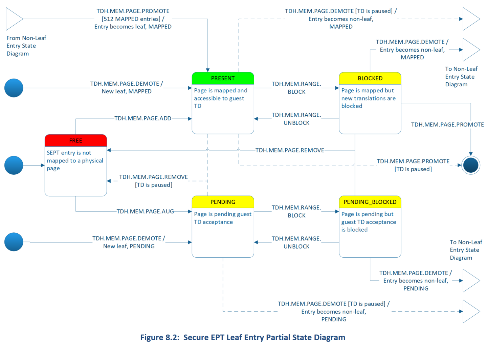
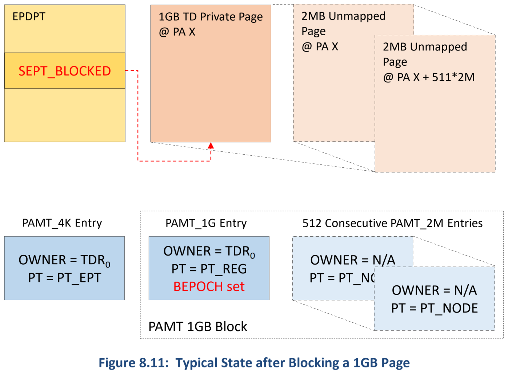
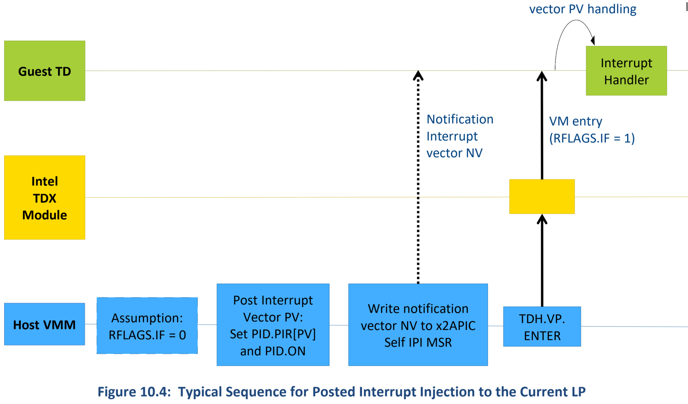

# TDX Module Spec

缩写 | 全称 | 描述
-----|----------------------------------|---------------------------
EPxE | Extended Paging Structures Cache | EPT 中间翻译结果的 CPU 的 cache（与 TLB 相对，缓存的是线性地址或 GPA 到 HPA 的翻译结果）
HKID | Host Key ID | 当 MKTME 激活时，HKID 是一个用于平台上的一个或多个内存控制器的加密 key 的标识符
KET  | Key Encryption Table | 每个 MKTME 加密引擎都持有一个表，表用 HKID 索引，存的是加密 key 的信息
KOT  | Key Ownership Table | TDX module 持有的一个内部的隐藏的表，用作控制 HKID 到 TDs 的指派
TDCS | Trust Domain Control Structure | 由多个页页面组成的一个 TD 控制结构
TDCX | Trust Domain Control Extension | 用于持有部分 TDCS 的 4KB 页面
TDR  | Trust Domain Root | 一个 TD 的 root 控制结构
TDVPS | Trust Domain Virtual Processor State | 由多个页面组成的持有一个 TD 虚拟 CPU（vCPU）状态的结构
TDVPR | Trust Domain Virtual Processor Root | 作为一个 TDVPS 的 root（第一个）page 的一个 4KB 物理页面
TDVPX | Trust Domain Virtual Processor Extension | 作为一个 TDVPS 的 non-root page 的 4KB 物理页面

## 2. Overview

### 2.1 Intel TDX Module Lifecycle

#### 2.1.1 启动时配置与 TDX Module 加载
1. BIOS 应该配置 SEAMRR 寄存器，并且准备一张 **Convertible Memory Regions (CMRs)** 表，CMRs 为存放 TD 私有内存页面的内存区域
2. BIOS 应该通过`WRMSR(0x79)`初始化`MCHECK`（作为微码 patch 加载的一部分）。`MCHECK`旨在检查 SEAMRR 和 CMRs 的正确配置，以及将信息保持在 SEAMRR 的一个众所周知的位置
3. Host VMM 能够使用 SEAMLDR ACM 加载 Intel TDX module

#### 2.1.2 TDX Module 初始化，枚举和配置
1. 在加载 TDX module 后，host VMM 应该调用 `TDH.SYS.INIT` 函数全局地初始化 module。
2. 接着，host VMM 应该在每个逻辑处理器上调用 `TDH.SYS.LP.INIT` 函数。`TDH.SYS.LP.INIT` 意图在逻辑处理器（LP）范围内初始化 module。
3. 然后，host VMM 调用 `TDH.SYS.INFO` 函数来枚举 TDX module 的功能与参数，并且获取信任平台拓扑和之前由 `MCHECK` 检查的 CMR 信息。
4. 基于以上内容，host VMM 应该决定一组 **Trust Domain Memory Regions (TDMRs)**。TDMR 是可以包含一些保留子域的可转换内存的区域。
5. 随后，host VMM 应该调用 `TDH.SYS.CONFIG` 函数并且传递 TDMR 信息以及其他配置信息。`TDH.SYS.CONFIG`意图检查配置信息 vs. TDX module 的信任的内部数据。
6. Host VMM 在每个 package 调用 `TDH.SYS.KEY.CONFIG` 函数。`TDH.SYS.KEY.CONFIG` 意图配置一个 CPU 生成的随机 key 用于 TDX module 的全局私钥。
7. Host VMM 使用 `TDH.SYS.TDMR.INIT` 函数初始化 TDMRs 和它们的关联控制结构。

### 2.2 Guest TD Life Cycle Overview

#### 2.2.1 Guest TD 构建
* Host VMM 可以创建一个新的 guest TD，通过 `TDH.MNG.CREATE` 函数分配和初始化一个 TD Root（TDR）控制结构。
  * 作为 `TDH.MNG.CREATE` 的输入，host VMM 指派给 TD 一个内存保护 key 标识符，即 **Host Key ID（HKID）**。
  * HKID 被 CPU 用于 tag 内存访问，由 TD 和 MKTME 选择加密/解密 keys 来做。
  * keys 本身设计为不暴露给 host VMM。
  * VMM 在每个 package 上用 `TDH.MNG.KEY.CONFIG` 函数编程 HKID 和 加密 key 到 MKTME 引擎。
* 一旦 TD 被分配了一个 key，host VMM 可以通过 `TDH.MNG.ADDCX` 函数添加控制结构页面来构建 TD Control Structure（TDCS），并且用 `TDH.MNG.INIT` 函数初始化。
  * 然后用 `TDH.MEM.SEPT.ADD` 函数构建 Secure EPT 树，用 `TDH.MEM.PAGE.ADD` 函数添加 TD 私有页面的初始集合。
  * 典型的这些页包含虚拟 BIOS 代码和一些干净的给栈和堆的页。
  * 绝大部分的 guest TD 代码和数据在迟些时候动态地加载进来。
  * Guest TD 可以对添加的内容用 `TDH.MR.EXTEND` 函数，扩展运行时度量寄存器，旨在由 TDX module 安全地维护。
* Host VMM 可以创建和初始化 TD Virtual CPU（VCPUs）。
  * 在用 `TDH.VP.CREATE` 函数创建每个 VCPU 后，VMM 用 `TDH.VP.ADDCX` 函数分配一组页面来存放 VCPU 状态（在一个叫做 TDVPS 的结构中）。
  * 随后 host VMM 用 `TDH.VP.INIT` 函数初始化 VCPU。
* 在添加和扩展初始化的页面集合后，VMM 可以用 `TDH.MR.FINALIZE` 结束 TD 度量。

### 2.3 TDX Operation Modes and Transitions


### 2.4 Guest TD Private Memory Protection

#### 2.4.1 内存加密
* TDX module 通过 CPU 的 MKTME 和 TDX ISA 特性，用内存加密和完整性保护 guest TD 私有内存。TDX module 增加 key 管理功能帮助它实施它的安全目标。
* 内存加密旨在通过在每个内存控制器里的加密引擎来执行。
  * 一个加密引擎持有一张加密 keys 的表，即 **Key Encryption Table（KET）**。
  * 基于应该提供给事务的 **Host Key Identifier（HKID）** 选择一个加密 key 参与每次内存事务。
* 第一代 MKTME，HKID 是从物理地址“偷取”的，通过从物理地址的顶部分配一个可配置数目的位。
  * TDX ISA 旨在进一步的区分 HKID 空间为 **共享 HKIDs** 给传统的 MKTME 访问和 **私有 HKID** 给 SEAM-mode-only 的访问。
  * 下一代可能选择表示不同地 HKID。

#### 2.4.2 地址翻译
* Guest Physical Address (GPA) 空间分为私有和共享两个子空间，由 GPA 的 `SHARED` 位决定
* CPU 用位于 host VMM 内存中的 Shared EPT 翻译共享 GPAs
  * Shared EPT 由 host VMM 直接管理，与传统 VMX 一样
* CPU 用一个独立的 Secure EPT 翻译私有 GPAs
  * Secure EPT 页面由 TD 的临时私有 key 提供加密和完整性保护
  * Secure EPT 无法被除 TDX module 外的任何其他软件直接访问，也不能被任何设备访问
  * Secure EPT 可以由 host VMM 用 TDX 功能间接管理
  * TDX module 帮助确保 Secure EPT 安全属性被保持
  * **在翻译的最后，CPU 设置 HPA 中的 HKID bit 为指派给该 TD 的 HKID**
    * **译注**：TDX module 的代码里是没有把 HKID 嵌入 SEPT 页表项里的操作的，这个动作是由硬件完成的


### 2.6 TDX I/O Model
* TD guest 可以使用以下 I/O 模型：
  * Paravirtualized devices
  * 带 MMIO emulation 的 paravirtualized devices
  * 直接指派设备给一个 TD
* TDX 体系结构不为受信任的 I/O 提供特定的机制
  * 任何提交给或者从物理或仿真设备接收到的数据的完整性或机密性保护，必须由 guest 软件加密

### 2.7 Measurement and Attestation


### 2.8 TDX Managed Control Structures

* TDX 管理控制结构一览

范畴 | 名称 | 含义 | 描述
-----|-----|------|--------------
平台 | PAMT | Physical Address Metadata Table | PAMT 旨在持有在 Trust Domain Memory Range（TDMR）内的每个页面的元数据。它控制指派给 guest TD 的物理页。
Guest TD | TDR | Trust Domain Root | 一个 guest TD 的 root 控制结构。控制 key 管理和构建/拆除过程。
Guest TD | TDCS | Trust Domain Control Structure | 作为控制一个 guest TD 的操作总体结构。
Guest TD VCPU | TDVPS | Trust Domain Virtual Processor State | 帮助控制操作和持有一个 guest TD 虚拟处理器的状态。持有 TD VMCS 和它的附加结构和其他 non-VMX 控制和状态域。

## 4 TDX Module 生命周期：Enumeration，Initialization 和 Shutdown

### 4.1 概览

#### 4.1.1 初始化和配置流程


* 典型 TDX Module Enumeration，Initialization 和 Shutdown 顺序

NO.| 步骤            | TDX 函数           | 描述
---|-----------------|-------------------|------------------------------
1  | CMR 配置和检查   | N/A               | BIOS 配置 convertible memory regions（CMRs）；<br>`MCHECK` 检查它们和安全地存储信息
2  | TDX Module 加载 | N/A               | OS/VMM launches SEAMLDR ACM 以加载 TDX module
3  | 全局初始化       |`TDH.SYS.INIT`     | Host VMM 调用一次 `TDH.SYS.INIT`，该函数执行 TDX module 的全局初始化
4  | LP 初始化       |`TDH.SYS.LP.INIT`（每个 LP）| Host VMM 在每个逻辑处理器上调用一次`TDH.SYS.LP.INIT`<br>该函数执行 LP 域，核域，package 域的初始化，以及检查平台和 TDX module 的配置
5  | Enumeration    |`TDH.SYS.INFO`      | Host VMM 调用一次 `TDH.SYS.INFO` 去获取 TDX module 的信息和可转换内存（CMR）的信息
6  | 全局配置        |`TDH.SYS.CONFIG`    | Host VMM 调用一次 `TDH.SYS.CONFIG`，提供一组包括 TDMRs 表的配置参数<br>该函数执行 TDX module 的全局配置
7  | Cache Flush    | N/A                | Host VMM flushes 所有 PAMT 范围可能存在的 `MODIFIED` cache lines，例如，在每个 package 上 `WBINVD`
8  | Key 配置        |`TDH.SYS.KEY.CONFIG`（每个 package）| Host VMM 在每个 package 上调一次 `TDH.SYS.KEY.CONFIG`。该函数在硬件配置 TDX 全局私钥
9  | TDX module 可用 | 任何               | 一旦 `TDH.SYS.KEY.CONFIG` 在所有 packages 上成功地执行，可以在所有 LP 上执行任何 TDX 函数
10 | TDMR 和 PAMT 初始化 |`TDH.SYS.TDMR.INIT`（多个）| Host VMM 循环调用 `TDH.SYS.TDMR.INIT`，逐步为每个 TDMR 初始化 PAMT 结构
11 | 内存可用        | 任何               | 一旦每个 TDMR 的`1GB`块被 `TDH.SYS.TDMR.INIT` 初始化了，它就可以被用来存放 TD 私有页面了

#### 4.1.1 TDX Module 生命周期状态机


##### 4.1.3.1 TDX ISA 背景：可转换内存范围（CMRs）
* 一个 4KB 内存页面如果可以被用来存放一个 TDX 私有内存页面或任何 TDX 控制结构页面，且保证 TDX 安全属性（例如，能从共享页面转为私有页面），则被定义为 **可转化（convertible）**
* **可转换内存范围（Convertible Memory Ranges，CMRs）** 被定义为只存放可转换内存页的物理地址范围，由 BIOS 声明，由 `MCHECK` 检查
* CMRs 有以下特性：
  * CMR 配置是“软”的 —— 没有硬件范围寄存器可以使用
  * 每个 CMR 定义一个单独连续的物理地址范围
  * 每个 CMR 内的所有内存都是可转化的，且必须遵循 `MCHECK` 检查的规则
  * 每个 CMR 有它自己的大小。CMR 大小是 4KB 的倍数，**不** 需要是 2 的幂
  * CMRs 互相之间不能重叠
  * CMRs 必须在平台的有效物理地址范围内（在考虑绝大部分有效 PA bits 被盗用于 Key IDs）
  * CMRs 在平台与内被配置（没有分离的 per package 配置）
  * CMRs 的最大数目是实现相关的。它不被显式地枚举；而是从 `CPUID` 提供的 Family/Module/Stepping 信息推导
    * CMRs 的最大数目是 `32`
  * CMRs 在 `IA32_MTRRCAP.SEAMRR` 枚举的有 TDX ISA 能力的系统上可用
  * CMRs 配置由 `MCHECK` 检查且在此之后不能被修改
* `MCHECK` 把 CMR 表存放在 SEAMRR 的 `SEAMCFG` 区域的预定义的位置，所以它后面可以被 TDX module 读取和信任

##### 4.1.3.2 TDMRs 和 PAMT 数组配置
###### 4.1.3.2.1 背景：TDMRs 中的保留区
* TDX module 物理地址是用 PAMT 块管理的 —— 每个块持有 1GB 的 TDMR 的元数据。
  * 这隐含着 TDMR 的粒度必须是 1GB。
* 然而，有 host VMM 可以分配小于 1GB 的内存的需求。对于有相对少量内存的系统特别重要。
* 为了满足以上两个需求，TDX module 的设计允许 TDMRs 中有保留区。
  * 保留区可以被 PAMT 覆盖
  * 然而在初始化期间它们对应的 PAMT 条目被表示为 `PT_RSVD` 页面类型，所以保留区中的页不被 TDX module 用于分配私有加密内存页面（但它们可以被用于 PAMT，我的理解相当于 dummy 页面）
  * 只有一个 TDMR 的非保留部分需要在 CMRs 内。

###### 4.1.3.2.2 背景：三个 PAMT 区
* 一个逻辑 **PAMT Block** 是由 1 个 `PAMT_1G` 条目、512 个 `PAMT_2M` 条目和 512<sup>2</sup> 个 `PAMT_4K` 条目组成的
  * `8 + 512 * 8 + 512 * 512 * 8 = 2101256`
  * 因此，一个 *PAMT Block* 的总大小，作为整个 PAMT 的大小总和，不是 2 的幂
* 然而，host VMM 可能只能为 PAMT 分配的内存的大小是 2 的幂
* 为了能使用它，为  `PAMT_1G` 条目，`PAMT_2M` 条目和 `PAMT_4K` 条目分配缓冲区是分别进行分配的
  * 结果是，如果 host VMM 分配一个 TDMR 的大小是 2 的幂，它的三个对应的 PAMT 区域的大小也是 2 的幂
* PAMT 区域需要在 CMRs 内，因为 PAMT 是被 TDX 全局的私有的 HKID 加密的


* TDMR 的粒度是 1GB，且分配时 1GB 对齐
* CMR 的粒度是 4KB
* 没有 TDMRs 覆盖所有的 CMRs 的要求，TDMR 无法被 CMR 覆盖部分为保留区，它们的交集为 TD 的可用部分
* PAMT 是跟踪 TD 中每个物理页的元数据，作为 TD 私有数据，必然在 CMR 内
* 之所以说是 PAMT 数组，是因为它是以一维的形式组织的

###### 4.1.3.2.3 配置规则
* 以下规则适用于 CMRs 相关的 TDMR 配置
  * TDMR 中非保留区的 4KB 页面必须是可转换的 —— 也必须在 CMR 内（它们的交集）
  * 一个 TDMR 的保留区不需要在 CMR 内
* 必须为每个 TDMR 配置三个 PAMT 区域 —— 每个 PAMT 控制的物理页面的大小一个
  * 为 `PAMT_4K` 条目的区域
  * 为 `PAMT_2M` 条目的区域
  * 为 `PAMT_1G` 条目的区域
* PAMT 区域有以下属性：
  * 一个 PAMT 区域的大小与和它关联的 TDMR 成直接比例关系，大小比率由 `TDH.SYS.INFO` 枚举
  * PAMT 区必然在可转换内存中 —— 例如，每个 PAMT 区域页面必须是一个 CMR 页面
  * PAMT 区域必然不和 TDMR 非保留区重叠（TDMR 非保留区存的是 TD 的数据，PAMT 区域存的是元数据，二者必然不能重叠）；然而，PAMT 区域可以在 TDMR 保留区（只要它们是可转换的，见上图，并非所有 TDMR 保留区都是不可转换的），当然也可以不在
  * PAMT 区域之间互相不重叠

### 4.2 TDX Module 初始化接口
#### 4.2.1 全局初始化：`TDH.SYS.INIT`
* `TDH.SYS.INIT` 意图是全局地初始化 TDX module。工作流如下：
1. 初始化 TDX module 全局数据
2. 采样和检查需要经过平台范围兼容检查的平台特性 —— 例如，TDX 虽然支持几个选项，但它们必须跨平台相同。这些随后会在每个 LP 上检查
3. 采样和检查当前 LP 上的平台配置。例如，`TDH.SYS.INIT` 采样 SMRR 和 SMRR2，检查它们被锁定且不和任何 CMR 重叠，以及存储它们的值，将来在每个 LP 上检查
4. 设置系统状态为 `SYSINIT_DONE`

#### 4.2.2 LP-Scope 初始化：`TDH.SYS.LP.INIT`
* `TDH.SYS.LP.INIT`意图是执行 TDX module 的 LP-scope，core-scope 和 package-scope
* 它只能在 `TDH.SYS.INIT` 成功完成后调用，可以在多个 LP 上并发地运行
* 从高层次上 `TDH.SYS.LP.INIT` 工作流如下：
1. 做一次全局 EPT flush（`INVEPT`类型 2）
2. 初始化 TDX module LP-scope 数据
3. 检查特性和配置兼容和一致性 —— 一旦每个 LP、核或 package，取决于被检查的特性或配置的范围：
   3.1 检查与 TDX module 特性的兼容
   3.2 检查配置的一致性

#### 4.2.3 Enumeration：`TDH.SYS.INFO`
* 一旦一个 LP 已经被初始化了，host VMM 能够在该 LP 上调用 `TDH.SYS.INFO` ，enumerate TDX module 的能力和平台配置
  * TDX module 能力被 enumerated 后在 `TDSYSINFO_STRUCT` 中返回
  * CMRs，之前由 BIOS 设置由 `MCHECK` 检查，被 enumerated 后在 `CMR_INFO` 表中返回

#### 4.2.4 全局配置：`TDH.SYS.CONFIG`
* 在执行全局和 LP-scope 的初始化之后，host VMM 能调用 `TDH.SYS.CONFIG` 全局地配置 TDX module，提供以下信息：
  * TDMR 和 PAMT 表，每个条目包含一个 TDMR 基址，大小和对应的 PAMT 保留区基地址和大小
  * TDX module 为它的全局私有 key 使用的 HKID ，用于加密 PAMT 和 TDRs

#### 4.2.4 Package-Scope Key 配置：`TDH.SYS.KEY.CONFIG`
* 在执行全局配置之后，host VMM 调用 `TDH.SYS.KEY.CONFIG` 执行 TDX module *在硬件上的全局私有 key* 的 package-scope 配置

### 4.3 TDMR 和 PAMT 初始化
* TDMR 和 PAMT 初始化过程旨在 VMM 启动后，**VMM 运行时** 执行
* Host VMM 应该能在初始化发生后正常工作，在任何时候使用已经被初始化的内存
* 在高层次上，TDMR 初始化有以下特质：
  * 初始化逐步执行
  * 初始化函数 `TDH.SYS.TDMR.INIT` 附着到大部分 TDX 函数的延迟规则 —— 例如，它们占用不多于一个预定数目的时钟周期
  * 如果每个并发流程初始化一个 **不同的 TDMR**，初始化函数 `TDH.SYS.TDMR.INIT` **能在多个 LPs 上并发执行**
  * 在一个 TDMR 的每个 1GB 页被初始化之后，1GB 页变得可被任何 TDX 函数所用，用来创建一个私有的 TD 页面或控制结构页面 —— 例如，`TDH.MEM.PAGE.ADD`，`TDH.VP.ADDCX` 等
* 对于每个 TDMR，VMM 应该循环执行 `TDH.SYS.TDMR.INIT`，提供 TDMR （1GB 粒度）的起始地址作为输入
  * `TDH.SYS.TDMR.INIT` 初始化一个（实现定义）数目的 PAMT 条目
  * 被初始化的 PAMT 条目的最大数目旨在避免延迟问题
  * 初始化使用直接写（`MOVDIR64B`）
* 一旦 PAMT 给 TDMR 的每个 1GB 块被完全初始化，`TDH.SYS.TDMR.INIT` 标识 1GB 块为可以使用
  * 那意味着在这 1GB 块中的 4KB 页可以被转换成私有页 —— 例如，通过 `TDH.MEM.PAGE.ADD`
  * 这可以被并发地去添加和初始化其他 TDMRs

### 4.4 TDX Module Shutdown
#### 4.4.1 由 Host VMM 发起的 shutdown（作为 Module Update 的一部分）
* Host VMM 可以在任何时候通过 `TDH.SYS.LP.SHUTDOWN` 函数发起 TDX module 关闭
  * 意图是作为不经过一个热或冷重置序列而重新加载 TDX module 的一部分来使用
* `TDH.SYS.LP.SHUTDOWN` 旨在设置状态变量来阻止当前 LP 上所有的 `SEAMCALLs` 和所有的 `SEAMCALL` leaf functions，除了在其他 LP 上 `TDH.SYS.LP.SHUTDOWN`
* 当指示为重新载入一个新的 TDX module 镜像的时候，`SEAMLDR` 可以检查 `TDH.SYS.SHUTDOWN` 已经在所有 LP 上执行

#### 4.4.2 由 Fatal Error 发起的 shutdown
* 按照设计，TDX module 执行期间的致命错误引起一个立即的 SEAM 关闭
  * 随后在任何 LP 上的 `SEAMCALLs` 失败有一个 `VMfailInvalid` 的指示（`RFLAGS.CF` 设置为 `1`）
  * 该情况只能通过平台重置来恢复

## 5 Key Management
### 5.1 目标
* TDX key 管理的主要目标是使 VMM 能执行以下动作：
  * 管理 HKID 空间作为一个有限的平台资源，指派 HKID 给 TD 和当需要的时候回收它们。
  * 使 TDX module 用全局暂时 key 来加密它的数据（例如，PAMT）。
  * 使每个 TD 使用它自己的临时 key。
* TDX 接口函数旨在提供需要的构建块和帮助确保软件不能执行不遵从 TDX 安全目标的操作，如下：
  1. 帮助确保只有 HKID 值才被配置为 TDX 私有内存加密 keys ，且这些 HKID 的值不能被 non-TD 软件或设备使用。
  2. 阻止指派同一个 HKID 给多于一个 TD。
  3. 当一个 HKID 指派给一个 TD 的时候，对于 HKID，必然没有已被修改的 cache lines -- 在任何一级，任何核，在任何 package 之上。所有这样的 cache lines，可能有修改的数据，则需把数据写到内存（如果需要）。注意，这个需求只适用于 TDX 私有 HKID 而不是传统 MKTME HKIDs。
  4. 只有符合以下条件时，TD 内存可以被访问，TD 可以运行：
     1. 一个 HKID 已经被指派给 TD 的临时 key。
     2. 在所有的 packages，所有的加密引擎上，加密 key 已经被配置给所有的 TD 的临时 HKID。

### 5.2 背景：HKID 空间分区
* 因为传统的 MKTME 操作和 TDX 操作使用相同的 MKTME 加密引擎和相同的加密 keys 集合，TDX ISA 在两种技术之间使能活跃的 HKID 空间的枚举和分区。
* 按照设计，加密 keys 和它们关联的 HKIDs 被分为三个范围。
  * `NUM_MKID_KEYS` 和 `NUM_TDX_PRIV_KEYS` 的值从 `IA32_MKTME_KEYID_PARTITIONING` MSR（`0x87`）读出。


### 5.3 Key 管理表
* CPU 和 TDX module 为 key 管理维护了几个表。
  * 这些表都不能被软件直接访问
  * 这些表由 TDX 函数使用。
  * 这些表帮助 TDX module 跟踪软件的合适的操作和帮助 TDX 实现安全目标。

#### Key 管理表

##### Key Encryption Table (KET)
* 范围：Package
* KET 是配置内存加密引擎的 CPU 微架构硬件表的抽象。
  * KET 由 HKID 索引。
  * 一个 package 上的所有加密引擎以相同的方式配置。
* KET 是传统 MKTME 架构的一部分。
  * TDX ISA 将 KET 分为共享和私有范围。
* 一个在私有 HKIDs 范围的 KET 条目由 host VMM 用每个 package 的 `SEAMCALL(TDH.MNG.KEY.CONFIG)` 函数配置。
* 一个在共享 HKID 范围的 KET 条目由软件用每个 package 的 `PCONFIG` 指令配置。

##### KeyID Ownership Table (KOT)
* 范围：Platform
* KOT 是一个 TDX module 管理 TDX HKIDs 库存的隐藏表。
  * 用于指派 HKIDs 给 TD，从 TDs 吊销 HKIDs，控制 cache flush。
  * KOT 由 HKID 索引。

#### TD Key Management Fields
* 范围：TD
* TDR 中的 TD-scope key 管理域。包含：
  * key 状态
  * 临时私有 HKID
  * key 信息
  * 跟踪 key 配置的位图


### 5.4 Combined Key Management State


## 6 TD Non-Memory State (Metadata) and Control Structures

### 6.1 Overview


* 所有的 guest TD 控制结构在内存中的页都是由 host VMM 从预配置的 TDMRs 中分配的。
* Guest TD 控制结构页可以被 host VMM 寻址。

#### 6.1.1 Opaque vs. Shared Control structures

* 控制结构分为以下两类：
  * **共享控制结构** 旨在由 host VMM 直接管理且被一个共享 HKID 加密。
    * TDX module 架构只描述那些可能直接影响它的操作的共享控制结构。
    * Host VMM 持有额外的共享控制结构。
  * **不透明控制结构** 并不打算被任何软件或 DMA 直接访问（除了 TDX module 以外）。
    * 通过 TDX module 函数管理。
    * 一般来说，host VMM 并不关注不透明控制结构的确切格式。
    * 不透明控制结构的内存页用一个私有 HKID 加密。

#### 6.1.2 Scope of Control Structures

* Guest TD 控制结构有两个可能的范围：
  * **TD-scope 控制结构** 作为一个整体应用于一个 guest TD。
  * **TD VCPU-scope 控制结构** 应用于一个 guest TD 的一个单独的虚拟 CPU。

### 6.3 TD VCPU-Scope Control Structures and Management Functions
#### 6.3.1 Trust Domain Virtual Processor State (TDVPS)


## 8 Physical Memory Management
### 8.1 Trust Domain Memory Regions (TDMRs) and Physical Address Metadata Tables (PAMTs)

* **Trust Domain Memory Regions (TDMRs)** 定义为一个可转换内存页面的范围。
  * TDMRs 由 host VMM 基于可转换内存范围（CMR）信息设置，该信息之前被 `MCHECK` 检查过。
* 每个 TDMR 由一个（逻辑上）单独的 **Physical Address Metadata Table (PAMT)** 来控制。
  * PAMT 表处于 VMM 分配的内存中，由 TDX 全局私有 HKID 加密。
  * PAMT 所需的内存大小，作为 TDMR 大小的一个功能，由 VMM 通过 `HDH.SYS.INFO` 枚举。
* 典型地，在 host VMM 初始化 TDX module（`TDH.SYS.INIT` 和 `TDH.SYS.LP.INIT`）后，用 `TDH.SYS.CONFIG` 配置 TDMRs 和它们对应的 PAMTs。
  * 然后用 `TDH.SYS.TDMR.INIT` 逐步地初始化 TDMRs。

### 8.2 TDMR 细节
* TDMR 配置是“软的” —— 没有使用硬件范围寄存器
* 每个 TDMR 定义一个单独的物理地址范围
* 每个 TDMR 有它自己的大小，这个大小必须是 1GB 的倍数。TDMR 的大小 **不** 需要是 2 的幂
* 一个 TDMR 必须对齐到 1GB
* TDMRs 不能互相重叠
* TDMRs 可以包含保留区域。这允许 host VMM 基于 VMM 自己的系统内存分配的考虑灵活地配置 TDMRs，不需要受 TDMR 1GB 粒度的影响
  * 一个保留区域必须对齐到 4KB，大小必须是 4KB 的倍数
  * 保留区数量可以被每 TDMR 地配置，用 `TDH.SYS.INFO` 枚举
* TDMR 内存除了保留区外必须是可转换的，由 `MCHECK` 检查（例如，每个 TDMR 页必须处于一个 CMR 内）
* 没有 TDMRs 覆盖所有的 CMRs 的要求
* TDMR 在平台域配置（没有每 package 的单独配置）
* TDMRs 的最大数量是 TDX module 实现相关的。由 host VMM 用 `SEAMCALL(TDH.SYS.INFO)` 函数枚举

### 8.3 PAMT 细节
* **Physical Address Metadata Table (PAMT)** 旨在跟踪 TDMR 中每个物理页的元数据。
  * 一个页的元数据包含页类型、页大小、指派的 TD 及其他属性。
* PAMT 被 TDX module 用来帮助实施以下属性：
  * **Page Attributes**：一个 TDMR 中的物理页有一组明确的属性集，比如页类型和页大小
  * **Single TD Assignment**：一个 TDMR 中的物理页最多只能分配给一个 TD
  * **Secure EPT Consistency**：任何在 Secure EPT 中映射的私有 TD 页大小与它在 PAMT 中的页大小属性一致

#### 8.3.1 PAMT Entry
* 一个 PAMT 条目持有一个单独的物理页的元数据。
* 页大小可能是 4KB、2MB 或 1GB，取决于 PAMT level。
* Table 8.1: High-Level View of a PAMT Entry

域     | 描述
-------|------------------------------------
PT     | `PT` 表示要与此 PAMT 条目关联的页面类型。详情请参阅下表 8.3。
OWNER  | `OWNER` 旨在包含 TD 的 TDR page 的物理地址的 bits `51:12`。当页面在此 PAMT 级别或更高级别分配给 TDX module 时，此域可适用于所有情况。有关详细信息，请参阅下面的表 8.3。
BEPOCH | 根据设计，`TDCS.TD_EPOCH` 的值由 `TDH.MEM.RANGE.BLOCK` 采样，此域仅在 `PT` 为 `PT_REG` 或 `PT_EPT` 时才适用。有关详细讨论，请参阅 9.7。

#### 8.3.2 PAMT Blocks 和 PAMT Arrays
* 对每个 1GB 的 TDMR 物理内存都有一个相应的 **PAMT Block**。
  * 一个 PAMT Block 逻辑上是由 PAMT 条目组成的一个三级树型结构。
  * 0 级到 2 级（`PAMT_4k`，`PAMT_2M` 和 `PAMT_1G`）分别对应到 4KB，2MB 和 1GB 物理 TDMR 页。
* 物理上，每个 TDMR 含有 3 个 PAMT 条目的数组，每个 PAMT 级别一个。
  * 目的是简化 VMM 内存分配
  * 一个逻辑 PAMT Block 有一个来自 `PAMT_1G` 数组的条目，512 个来自 `PAMT_2M` 数组的条目和 512<sup>2</sup> 个来自 `PAMT_4K` 数组的条目


* 1G = 2<sup>30</sup> = `0x4000_0000`
* 2M = 2<sup>21</sup> = `0x0020_0000`
* 4K = 2<sup>12</sup> = `0x1000`
* 图中的 `0x3FE0_0000`、`0x001F_F000`、`0x003F_F000` 是每个条目所管理的起始地址
* 每个条目管着下一级的 512 个条目

#### 8.3.3 PAMT 层次和页面类型

* PAMT 页面类型

页面类型 | PAMT 层级 | 关联的 TDX 页面 | 描述
---------|----------|----------------------|---------------
PT_NDA   | 任何     | 取决于高一级的 PAMT 层级类型 | 物理页未直接分配（Not Directly Assigned）给 TDX module，大小和 PAMT 级别
PT_RSVD  | PAMT_4K  | 无 | 该物理页保留给非-TDX 用途。TDX module 不允许转换该页为其他页面类型。该页可被 host VMM 用于其他任何目的。被用于实现 TDMRs 内的保留区
PT_REG   | 任何     | TD 私有页面 | 在 PAMT 级别中的物理页，持有 TD 私有内存，通过 Secure EPT 映射到 guest TD GPA 空间
PT_TDR   | PAMT_4K  | TDR        | TDR（root）控制结构页面
PT_TDCX  | PAMT_4K  | TDCX       | 多页的 TDCS 控制结构中的一个物理页
PT_TDVPR | PAMT_4K  | TDVPR      | 多页的 TDVPS 控制结构的根页面
PT_TDVPX | PAMT_4K  | TDVPX      | 多页的 TDVPS 控制结构中的非根页面
PT_EPT   | PAMT_4K  | Secure EPT | Secure EPT page

#### 8.3.4 PAMT Hierarchy

* 下面的表 8.3 显示了三个层次的 PAMT 条目的页面类型（PT），取决于页面是否分配给 TDX module 管理页面、页面是否映射到安全 EPT 中以及映射大小。


##### 注意
* 如果一个 4KB 页面的 PAMT.PT 在 PAMT 的所有三个层级上都是 `PT_NDA`，该页面被认为是 **空闲** 的。
  * 任何尝试分配一个 HPA 到 TDX 的函数都做该检查。
* 在所有的其他 cases 中，三个 PAMT 层级中的只有一个 PAMT.PT 与 `PT_NDA` 不同。
* 当一个页面被 Secure EPT 映射为 4KB、2MB 或 1GB GPA 映射大小时，它被 TDX module 当作一个相同大小的物理页管理。
* `PT_RSVD` 页无法被 TDX module 使用。 它们被用于实现 TDMRs 内的保留区。
* 一个 PAMT entry 的大小是 `16 bytes` 所以 `1 GB` memory 对应的 PAMT 开销是 `~1/256`
  * tdx-module/src/common/memory_handlers/pamt_manager.h
```c
#define PAMT_ENTRY_SIZE_IN_BYTES        16
...
/**
 * @struct pamt_entry_t
 *
 * @brief PAMT entry structure
 */
typedef struct pamt_entry_s
{
    struct
    {
        sharex_hp_lock_t entry_lock; // 2 byte (16 bit)
        page_type_t pt : 8;
        uint64_t owner : 40; // don't access this field directly, use accessors below
    }; // primary

    union
    {
        bepoch_t bepoch;
    }; // additional
} pamt_entry_t;
tdx_static_assert(sizeof(pamt_entry_t) == PAMT_ENTRY_SIZE_IN_BYTES, pamt_entry_t);
```

## 9 TD Private Memory Management

### 9.1 概览
* TDX ISA 引入了 *私有 GPA* 和 *共享 GPA* 的概念，取决于 `GPA.SHARED` 位。
* 在 SEAM non-root mode 下，控制 VMCS 有两个 EPT 指针域：
  * 传统的 EPT 指针用于翻译使用私有 GPA（例如，`GPA.SHARED == 0`） 的 guest TD 内存访问
  * 新的共享 EPT 指针用于翻译使用共享 GPA（例如，`GPA.SHARED == 1`）的 guest TD 的内存访问
* 一个新的 GPAW 执行控制决定 `SHARED` 位在 GPA 中的位置，还有一个新的 HKID 执行控制定义了访问 TD 私有内存使用的 HKID
* TDX module 为每个 TD 维护了一个单独的 Secure EPT 结构。
  * Secure EPT 页被设计为不透明的
  * 位于普通内存，被 TD 的临时私有 key 加密和提供完整性保护
  * Secure EPT 有效地不能由除了 TDX module 之外的任何软件访问，也不能由设备访问
    * 任何用共享 HKID 对 Secure EPT 的访问会导致数据污染，并触发完整性检查失败，导致一个 machine check fault
* Secure EPT 由 host VMM 用 TDX functions 间接地管理
  * TDX module 帮助确保 Secure EPT 被正确地管理
* CPU 用位于 host VMM 内存的共享 EPT 翻译共享 GPAs
  * 翻译使用一个由 host VMM 直接管理的共享 HKID，如同传统 VMX 一样

### 9.2 Secure EPT 条目
#### 9.2.1 概览
* 从 CPU 的角度，Secure EPT 和传统 VMX EPT 有着相同的结构。
  * 为了编码额外的条目状态，TDX module 用条目中的两个 bits 来定义当条目 non-present 时，对于软件可用（而不是给 CPU 使用）
* Secure EPT 条目是不透明的；host VMM 不可以直接访问
  * Host VMM 可以用 `TDH.MEM.SEPT.RD` 接口函数读一个 Secure EPT 条目信息
  * 此外，如果有和一个 Secure EPT 条目相关的错误，多个其他接口函数返回相同的信息
* Secure EPT 条目状态的高层次描述

Secure EPT 条目状态   | Present (RWX !=0 ) | Mappped (HPA 有效) | 描述
---------------------|--------------------|--------------------|--------------
SEPT_FREE            | No | No  | Secure EPT 条目未映射一个 GPA 范围
SEPT_PRESENT         | No | Yes | Secure EPT 条目映射了可以被 guest TD 访问的私有 GPA 范围
SEPT_BLOCKED         | No | Yes | Secure EPT 条目映射了一个私有 GPA 范围，但新的到这个地址的翻译被阻止
SEPT_PENDING         | No | Yes | Secure EPT 条目映射一个 4KB 或 2MB 的页，该页被用 `TDH.MEM.PAGE.AUG` 动态添加到 guest TD，正等待 guest TD 用 `TDG.MEM.PAGE.ACCEPT` 接受。该页面还无法被 guest TD 访问
SEPT_PENDING_BLOCKED | No | Yes | Secure EPT 条目既处于 pending 又被阻塞

#### 9.2.2 SEPT 条目状态图

* Secure EPT Leaf 条目部分状态图



* Secure EPT Non-Leaf 条目部分状态图


### 9.3 EPT Walk
* Host 侧（`SEAMCALL`）管理 TD 私有内存的 TDX 函数通常接受 GPA 和 Level 参数。
  * 它们执行一次 Secure EPT walk 定位目标 Secure EPT 条目。
* 如果 Secure EPT walk 成功地完成，TDX function 可以操作一个被定位的 Secure EPT 条目。
  * 否则，典型地，function 返回上一次访问的 EPT 条目和它到 host VMM 的 level。
* Guest 侧（`TDCALL`）TDX functions 典型地执行一次 EPT walk，和 CPU 做的 EPT walk 类似。
  * 只有 GPA 作为输入提供，function 可能 walk 共享 EPT 或 Secure EPT，取决于特定的 function 和 GPA 的 `SHARED` 位。

### 9.7 介绍 TLB Tracking


### 9.8 Secure EPT 构建和更新：TDH.MEM.SEPT.ADD
* Host VMM 可以使用 `TDH.MEM.SEPT.ADD` 函数添加一个 Secure EPT 页到 guest TD。
* `TDH.MEM.SEPT.ADD` 的输入是：
  * 目标 TD，以它的 TDR HPA 标识
  * 新 SEcure EPT 表的目的物理页
  * 映射信息：GPA 和 EPT 层级

* 在高层上看，`TDH.MEM.SEPT.ADD` 做的工作如下：
1. 检查 TD keys 已配置
2. 检查目的物理页在 PAMT 中被标识成空闲
3. 执行 Secure EPT walk 去定位将会变为映射的新 Secure EPT 页面的父条目的 Secure EPT non-leaf 条目
   * 为了防止重复映射，`TDH.MEM.SEPT.ADD` 检查映射还不存在，否则中止操作
4. 用目标 TD 的私有 HKID 初始化目标页为零，直接写入（`MOVDIR64B`）
5. 更新映射页面的父 Secure EPT 条目为 `SEPT_PRESENT`
6. 更新页面的 PAMT 条目，页面类型为 `PT_EPT`，`OWNER` 为 TDR 的 PA

* Secure EPT 的 **根页面（EPML4 或 EPML5，取决于 host VMM 是否使用 4 级或 5 级 EPT）不需要被显式添加**。
  * **TD 初始化（`TDH.MNG.INIT`）时会创建，并保持在 TDCS 中**（所以它的页面类型是`PT_TDCX`，而不是`PT_EPT`）。
  * 在每个 VCPU 初始化的时候，`TDH.VP.INIT` 拷贝 Secure EPT 根页面的地址到 VCPU 的 TD VMCS 的 `EPTP` 域，并清除 HKID 位为 `0`
    * CPU 在 EPT walk 时添加 TD 的私有 HKID。让 HKID 为 `0` 允许 host VMM 使用 `INVEPT`，以管理和 TD 的 Secure EPT 共享 ASID 的共享 EPT 的使用。


* 对于 Linux
  * PGD - PML4
  * PUD - PDPT
  * PMD - PD
  * PTE - PT

* 为了避免 cache line 别名引起的稳定性问题，VMM 应该确保在调用 `TDH.MEM.PAGE.AUG` 之前，与要添加的物理 SEPT 页关联的 cache lines 没有处于 `Modified` 状态。
  * 典型地需要调用 `TDH.PHYMEM.PAGE.WBINVD` 来完成

### 9.9 TD 构建时添加 TD 私有页面：TDH.MEM.PAGE.ADD
* 只允许在 TD 构建时（在 `TDH.MR.FINALIZE` 之前）添加任意内容的 TD 私有页。
* Host VMM 用 `HDH.MEM.PAGE.ADD` 添加和映射 4KB 的私有页面到 guest TD，输入如下：
  * 目标 TD，以它的 TDR 物理地址标识
  * 源页面物理地址
  * 目的页面物理地址
  * 目的页面 GPA

* 在高层上看，`TDH.MEM.PAGE.ADD` 做的工作如下：
1. 检查 TD 还未被初始化
2. 检查 TD keys 已配置
3. 检查目的物理页在 PAMT 中被标识成空闲
4. 执行一次伪 Secure EPT walk 来定位将要映射新 TD 私有页面的父 Secure EPT leaf 条目
   * 为了防止重复映射，`TDH.MEM.PAGE.ADD` 检查映射还不存在，否则中止操作
5. 用目标 TD 的私有 HKID 拷贝源页面到目标页面，直接写入（`MOVDIR64B`）
6. 更新之前定位的映射页面的父 Secure EPT 条目为 `SEPT_PRESENT`
7. 用新页面的 GPA 更新 TD 的度量
8. 更新页面的 PAMT 条目，页面类型为 `PT_REG`，`OWNER` 为 TDR 的 PA


### 9.10 动态添加 TD 私有页面

#### 9.10.1 概览
* 在 guest TD 被初始化之后动态添加 TD 私有页面典型地需要以下三步：
  * Host VMM 用 `TDH.MEM.SEPT.ADD` 和 `TDH.MEM.SEPT.REMOVE` 更新 Secure EPT
  * Host VMM 用 `TDH.MEM.PAGE.AUG` 添加和映射一个 4KB 或 2MB TD 私有页面
    * 该页面是未度量的
    * 添加页面的 Secure EPT 条目的状态是 `SEPT_PENDING`
  * Guest TD 在访问它前必须用 `TDG.MEM.PAGE.ACCEPT` 接受页面，页面内容清零
* 这个流程是为了防止 host VMM（用 `TDH.MEM.PAGE.REMOVE`）从 guest TD 的 GPA 空间中移除任意的页，并将它们替换成内容为零的页
* Guest TD 尝试访问一个用 `TDH.MEM.PAGE.AUG` 动态添加但还没有被 `TDG.MEM.PAGE.ACCEPT` 的页面会导致 `#VE`

#### 9.10.2 Page Addtion by the Host VMM: TDH.MEM.PAGE.AUG

* 注意：`TDH.MEM.PAGE.AUG` 不需要访问目的页面本身；该页随后被 `TDG.MEM.PAGE.ACCEPT` 初始化


#### 9.10.3 PENDING Page Acceptance by the Guest TD: TDG.MEM.PAGE.ACCEPT

##### 9.10.3.1 描述

* Guest TD 可以使用 `TDG.MEM.PAGE.ACCEPT` 和页面的 `GPA` 和 `size` 作为输入来接受动态添加的 `4KB` 或 `2MB` 的页面。
* 从高层次来看，`TDG.MEM.PAGE.ACCEPT` 的工作原理如下：
1. 执行 Secure EPT 遍历以找到映射 TD 私有页面的 *父 Secure EPT leaf entry*，并按照下表所述处理遍历结果。

* Table 9.3: `TDG.MEM.PAGE.ACCEPT` SEPT Walk Cases
SEPT 走表终止的条目

Level     | Leaf 或 Non-Leaf | 状态      | `TDG.MEM.PAGE.ACCEPT` 操作 | 典型的软件处理
----------|------------------|----------------------------------------------------------------|--------------------------|------------------
比请求的高 | Leaf | Guest 可访问，例如 `MAPPED` 或 `EXPORTED_DIRTY`（例如，请求 `4KB` 而 `2MB` 的 PTE 已存在）| 返回表示成功的状态码，并带有警告，表示该页面已存在并映射到高于请求的 level| 选项 1：这没问题，host VMM 没有使用 TD 释放的内存。<br/>选项 2：这是一个 guest bug；状态码有助于调试它。
.         | .    | 非 guest 可访问且非 `FREE`（例如，请求 `4KB` 而 `2MB` 的 PTE pending）| TD exit 并 EPT violation，指示错误 SEPT entry level 和状态以及 guest 请求的 accept level | Host VMM 将页面 demotes 以匹配请求的 accept 大小，然后重新进入 guest TD。重新调用 `TDG.MEM.PAGE.ACCEPT`。
.         | Non-Leaf | 非 guest 可访问（例如，请求 `4KB` 而 PDE 被 blocked） | TD exit 并 EPT violation，指示错误 SEPT entry level 和状态以及 guest 请求的 accept level | 这可以用作 guest TD 请求从 host VMM 添加一个页面。Host VMM 添加 SEPT 页面（`TDH.MEM.SEPT.ADD`）和请求的页面（`TDH.MEM.PAGE.AUG`）。然后恢复 guest。
与请求的相同 | Non-Leaf | 除 `FREE` 之外（例如，请求 `2MB` 的 entry 已被映射到一个 EPT 页面，而不是 leaf 页 | 返回表示 size mismatch 错误的状态码 | Guest 退回到使用 `4K` 大小的范围 accept。
.         | Leaf | Guest 可访问，例如 `MAPPED` 或 `EXPORTED_DIRTY` | 返回表示成功的状态码，并警告该页面已存在 | 选项 1：这没问题，host VMM 没有使用 TD 释放的内存。<br/>选项 2：这是一个 guest bug；状态码有助于调试它。
.         | .    | 既非 `PENDING` 也非 `PENDING_EXPORTED_DIRTY` | TD exit 并 EPT violation，指示错误 SEPT entry level 和状态以及 guest 请求的 accept level | Host VMM 解决 blocking（例如，完成需要 blocking 的内存管理操作）并恢复 guest。
.         | .    | `FREE` | TD exit 并 EPT violation，指示错误 SEPT entry level 和状态以及 guest 请求的 accept level | 这可以用作guest TD 请求从 host VMM 添加一个页面。Host VMM 添加请求的页面（`TDH.MEM.PAGE.AUG`）并恢复 guest。
.         | .    | `PENDING` | 按照如下所述完成操作。| 成功

* 如果通过：
* **注意**：由于初始化 `2MB` 页面可能需要很长时间，因此 `TDG.MEM.PAGE.ACCEPT` 是可中断和可恢复的。
2. 如果所有上述检查都通过，则循环直至完成或中断：
   1. 使用目标 TD 的 *私有 HKID* 和 **直接写入（`MOVDIR64B`）** 将页面的下一个 `4KB` chunk 初始化为 **零**。
   2. 如果整个页面已初始化，则更新父 Secure EPT 条目以将其状态设置为 `SEPT_PRESENT`。
   3. 否则，如果有待处理的中断，则恢复 guest TD，而不更新 `RIP` 和任何 GPR。CPU 可能会处理中断，从而导致 TD exit。当 TD 恢复时，将重新调用 `TDH.MEM.PAGE.ACCEPT`。


##### 9.10.3.2 TDG.MEM.PAGE.ACCEPT 并发
###### Guest-Side
* `TDG.MEM.PAGE.ACCEPT` 防止 guest TD 多个线程并发接受相同的页面
* `TDG.MEM.PAGE.ACCEPT` 也可能遇到一个并发的 host 侧操作，比如 `TDH.MEM.RANGE.BLOCK`，尝试更新相同的 Secure EPT 条目
  * 这种情况会返回给 guest TD 一个错误，指明 Secure EPT 条目正忙

###### Host-Side
* `TDG.MEM.PAGE.ACCEPT` 不阻止 host 侧的操作，比如 `TDH.MEM.RANGE.BLOCK`，并发修改 Secure EPT 条目
  * `TDG.MEM.PAGE.ACCEPT` 使用一个带锁的 compare and exchange 操作
  * 如果更新失败，会引起 TD Exit，并且带着 EPT Violation 的退出原因，指明 violation 是由于 `TDG.MEM.PAGE.ACCEPT`

### 9.11 页合并：TDH.MEM.PAGE.PROMOTE
* Host VMM 能够 512 个连续映射的 4KB 或 2MB 的页面相应地合并为一个单独的 2MB 或 1GB 的页面
  * 为了做到这一点，host VMM 需要首先在大的（2MB 或 1GB）GPA 范围执行 TLB tracking 协议
* Host VMM 应该首先在 EPT 页面上对大的范围（2MB 对于 EPT，1GB 对于 EPD）调用 `TDH.MEM.RANGE.BLOCK` 操作
  * `TDH.MEM.RANGE.BLOCK` 标识该 EPT 页面在父 EPT 条目为 `SEPT_BLOCKED` 并且将 TD epoch 记录在该页面对应的 PAMT 条目中


* 典型地，host VMM 会调用 `TDH.MEM.PAGE.TRACK` 执行一轮 IPI。在此之后，在大的 GPA（2MB 或 1GB）范围内应该没有活跃的地址翻译了
* 实际的合并是由 `TDH.MEM.PAGE.PROMOTE` 完成的，需要提供以下输入：
  * 大范围的 GPA
  * 大范围的层级（2MB 或 1GB）

* 高层次上，`TDH.MEM.PAGE.PROMOTE` 进行如下操作：
1. 检查对大范围 GPA（例如，对范围的 EPT 或 EPD 页）的 TLB 跟踪条件
2. 检查 EPT 或 EPD 页的所有 512 个条目在 `SEPT_PRESENT` 状态，以及指向的叶子页面在相同的 2MB 或 1GB 范围内的物理地址是连续的

* 如果所有的检查通过，`TDH.MEM.PAGE.PROMOTE` 进行如下操作：
1. 把所有（相应为 4KB 或 2MB）小叶子页的 `PAMT_4K` 或 `PAMT_2M` 的条目标识为 `PT_NDA`
2. 把合并的（相应为 2MB 或 1GB）大页的 `PAMT_2M` 或 `PAMT_1G` 的条目标识为 `PT_REG`
3. 设置父 EPT 条目指向合并的大页，把它标识成 present
4. 把原来的 EPT 或 EPD 页面的 PAMT 条目标识为 `PT_NDA`，有效地将此从 host VMM 的任何使用中移除

* 一旦完成，之前 EPT 或 EPD 物理页应该被释放给 host VMM 用于任何目的


### 9.12 页分割：TDH.MEM.PAGE.DEMOTE




### 9.13 重定位 TD 私有页面：TDH.MEM.PAGE.RELOCATE
* Host VMM 可以用 `TDH.MEM.PAGE.RELOCATE` 重定位一个 4 KB TD 私有页面到另一个 HPA
  * 这对于物理地址空间重新分片很有帮助

### 9.14 移除 TD 私有页面：TDH.MEM.PAGE.REMOVE

### 9.15 移除 Secure EPT 页面：TDH.MEM.SEPT.REMOVE

### 9.16 Unblocking a GPA Range: TDH.MEM.RANGE.UNBLOCK
* Host VMM 可以用 `TDH.MEM.RANGE.UNBLOCK` unblock 之前 blocked 的 TD 私有 GPA 范围，将它们返回它们原来的状态
  * 4KB，2MB 和 1MB GPA 范围能够被 unblocked

## 10 TD VCPU

### 10.1 VCPU Transitions


#### 10.1.1 初始 TD Entry，异步 TD Exit 和随后的 TD Entry


#### 10.1.2 同步 TD Exit 和随后的 TD Entry
* `TDG.VP.VMCALL` 提供了一个 guest TD 和 host VMM 通信的渠道
* Guest TD 可以通过 `TDG.VP.VMCALL` 发起一个同步 TD exit
  * 输入参数 `RCX` 选择 GPRs（从 `RBX`，`RDX`，`RBP`，`RDI`，`RSI` 和 `R8` 直到 `R15`）和 XMM 寄存器，这些值作为 `TDH.VP.ENTER` 的输出传递给 host VMM
  * `RCX` 自身也传递给 `TDH.VP.ENTER` 作为输出
  * 其他 CPU 状态组件，包括未被 `RCX` 选择的 GPRs 和 XMM 寄存器，保存在 TDVPS 并设置为固定的值
* 在随后的 `TDH.VP.ENTER`，之前被 `TDG.VP.VMCALL` 用来选择 GPRs（从 `RBX`，`RDX`，`RBP`，`RDI`，`RSI` 和 `R8` 直到 `R15`）和 XMM 寄存器的 `RCX` 的值会被传递给 guest TD。
  * 其他 CPU 状态组件，包括未被 `RCX` 选择的 GPRs 和 XMM 寄存器，从 `RCX` 恢复


#### 10.1.3 VCPU Activity State Machine
* VCPU activity 状态机由 `TDVPS.STATE` 控制
* 一个 VCPU 只能在它的由 TDVPR 和 TDVPX 页组成的逻辑 TDVPS 控制结构在内存中可用并且已被初始化的时候进入
* 一个 VCPU 只能在它的状态持续（没有不可恢复的 TD exit 发生时）的时候进入
* TD entry is done properly，取决于是否它的第一个 entry 或者在最后的 TD exit 类型


### 10.2 TD VCPU TLB Address Space Identifier (ASID)

* 非 root 模式缓存地址翻译由唯一的 Address Space Identifiers（ASIDs）标识
  * TD ASIDs 的目标是减少 TD Entry 和 TD Exit 时 flush TLB entries 的需要，可以减少 flushing 关联的性能开销
#### 10.2.1 TD ASID 的组成

* TD ASID

域    | 大小（Bits）| 描述
------|----|---------------
SEAM  | 1  | VPID 的隐式的第 `16` bit，对软件不可见。在 SEAM mode 下由 CPU 设为 `1`。该位防止和传统（非 TDX）ASIDs 重叠
VPID  | 16 | 由 TDX module 设置为 `VCPU_INDEX`，在 TD 中的一个 CPU 的唯一的索引，加上 `1`（因为 `VCPU_INDEX` 从 `0` 开始，`0` 不是一个非 root 模式的有效 VPID 号）
EPTP  | 40 | EPTP 的 bits `[51:21]`，对于一个 TD 来说指向 Secure EPT 的根 -- HKID bits 被清 `0`
PCID  | 16 | 与传统的 PCID 相同

#### 10.2.2 INVEPT by the Host VMM for Managing the Shared EPT
* 基于 TD 的 EPTP 的相同的 ASID 用于缓存 secure 和 共享的 EPT 二者的翻译（记得：EPTP 是 **secure** EPT root page 的 HPA）
* 因此，为了 flush 共享 EPT 翻译，host VMM 使用 `INVEPT` 指定 TD 的 EPTP，而不是它的共享 EPTP
* Host VMM 能够用 `TDH.VP.RD` 从 TD VMCSs 获取的 EPTP 的值

### 10.3 VCPU-to-LP 关联
#### 10.3.1 Non-Coherent Caching

* 一些 TD VCPU 状态被 non-coherently cached，包含：
  * 如果地址翻译（TLB/PxE 条目）可能被弄脏了，它们必须被显示地 flushed
  * TD VMCS 被 CPU cached
    * VMX 体系结构要求 `VMPTRLD` 一个当前的 VMCS，在把它用于绝大部分 VMX 指令之前
    * 然后用 `VMCLEAR` 把它成为非当前的，并且显式地将它写入内存，在 VMCS 内存镜像可以被处理之前（例如，将它在其他 LP 上成为 current）
* Non-coherent caching 隐含着一些显式的 和/或 隐式的操作需要去做，来保证正确性

#### 10.3.2 TDX Functions for VCPU-LP Association and Dis-Association


* 以下 TDX module 机制旨在确保正确和安全的操作：
  * TD VCPU 和 LP 的关联是多对一的
    * 在任何时候一个 TD VCPU 可以关联到最多一个 LP
    * 一个 LP 可以关联到多个 VCPUs
  * VCPU 到 LP 的关联隐式地由任何 VCPU-specific 的 `SEAMCALL` 流程完成，包括 `TDH.VP.ENTER`
    * 这些流程检查 VCPU 是否已经和当前 LP 关联还是还未与任何 LP 关联
  * 如果 host VMM 想把一个 VCPU 与另一个 LP 关联，它必须用 `TDH.VP.FLUSH` 显式地 flush 在当前与之关联的 LP 的 VCPU 的状态
    * 该函数执行 TD ASID，并且扩展分页结构（EPxE）缓存 TLB flush 和 `VMCLEAR`
  * 如果 VMM 想回收 TD 的私有 HKID，由此使 TDVPS 内存无法访问，它必须显式地在当前与之关联的 LP 上 flush VCPU 状态

#### 10.3.3 性能考虑
* 在 LP 之间迁移 VCPUs 是昂贵的
  * 如上所述，它涉及 flushing 地址翻译缓存，分页结构缓存和 VMCS 缓存
  * Host VMM 应该尽量最小化类似的操作来获得最佳的性能。
* 地址翻译和分页结构缓存当前 LP 上在 TD 范围内被 flushed
  * Flushing 影响与一个单独 LP 关联的相同 TD 的多个 VCPU（可能非典型）

## 11 CPU Virtualization (Non-Root Mode Operation)

### 11.1 Initial State
* 上电以后，控制寄存器 `CR0` 的状态是 `0x60000010`。此时处理器处于实模式和分页关闭状态。
* 硬件重置后执行的第一条指令位于物理地址 `0xFFFFFFF0` 处。
  * 该地址是 16 bytes，位于处理器的最高物理地址之下。
  * EPPROM 中包含的软件初始化代码必须被放置在该地址。
  * `CS` 寄存器包含两部分：可见的段选择符部分和不可见的段基址部分。
    * 在硬件重置的时候，段选择符被载入`0xF000`，段基址被载入`0xFFFF0000`，`EIP` 寄存器的值是 `0xFFF0`
    * 于是第一条指令的地址是 `0xFFFF0000 + 0xFFF0 = 0xFFFFFFF0`，忽略段选择符部分
* 为了确保 `CS` 寄存器的基址部分保持不变直到 EPROM 基于软件初始化代码完成，代码一定不能含有 far jump 或 far call 或允许中断发生（会导致 `CS` 段选择符的值改变）

#### 11.1.1 概览
* 按设计，绝大部分 TD VCPU 初始状态与 INIT 后处理器体系结构状态一样。然而有以下不同：
  * TD VCPU 开始它的生命于保护（32-bit）非分页模式，而不是实模式。
    * 它只允许切换到 64 bit 模式。
    * 这影响到段寄存器的初始状态，CRs 和 MSRs。
* `IA32_EFER` MSR 被初始化以支持 10.1 中描述的 CPU 模式
* 一些提供给 guest TD 的 GPRs 的初始值信息，vBIOS 根据这些信息设置页表并且尽快切换至 64 bit 模式，这样它可以用 `TDCALL` leaf functions。

### 11.2 Guest TD Run Time Environment Enumeration
* Guest 软件可以作为 TD、传统虚拟机、或者直接在 CPU 上 运行，基于它运行时环境的 enumeratation。


### 11.4 指令限制
* TDX module 旨在阻止在 TDX non-root mode 执行一些指令。
  * 执行这些指令会导致 VM exit 到 TDX module，然后 TDX module 再注入一个 `#UD` 或者 `#VE` 到 guest TD。
  * 执行其他指令可能会被有条件地阻止，取决于一些 feature 是否使能。

#### 11.4.1 导致无条件 `#UD` 的指令
* `ENCLS`,`ENCLV`
* 绝大部分 VMX 指令：`INVEPT`,`INVVPID`,`VMCLEAR`,`VMFUNC`,`VMLANUNCH`,`VMPTRLD`,`VMPTRST`,`VMREAD`,`VMRESUME`,`VMWRITE`,`VMXOFF`,`VMXON`
* `RSM`
* `GETSEC`
* `SEAMCALL`,`SEAMRET`

#### 11.4.2 导致无条件 `#VE` 的指令
* String I/O (`INS*`, `OUTS*`),`IN`,`OUT`
* `HLT`
* `MONITOR`,`MWAIT`
* `WBINVD`,`INVD`
* `VMCALL`
#### 11.4.3 取决于 Feature Enablling 的引起 `#UD` 或 `#VE` 的指令
* `PCONFIG`
#### 11.4.4 其他
* Guest TD 执行 `ENQCMD` 导致 `#GP(0)`
* 当 CPL 为 `0` 时，guest TD 执行 `ENQCMDS` 导致 `#UD`。否则导致 `#GP(0)`

### 11.7 MSR Handling

#### 11.7.1 概览

* 从 guest TD 的视角来看，MSRs 是由 TDX module 虚拟的，可以被分为以下几类：
  * TD entry 和 exit 时 MSRs 需随上下文切换 —— guest TD 访问这些 MSRs 可以是完全、部分或 none
  * MSRs 不进行上下文切换，但 guest TD 访问是只读的
  * MSRs 不进行上下文切换，但 guest TD 无法访问
* MSR 行为可以是固定的或者取决于通过 XFAM，ATTRIBUTES 和 CPUID 配置参数的 TD 配置
  * Host VMM 没有配置特定 MSR 的直接接口（例如，不能设置一个特定的 MSR 给 TD exit 可以写）
  * 取而代之的是，在绝大部分情况，被 TDX module 通过 `CPUID` 虚拟化枚举为不可访问的 MSRs，如果 guest TD 非法访问会导致 `#GP(0)`
  * 另一种情况，guest TD 非法访问 MSRs 会导致 `#VE`
* Guest TD 如果想访问 TDX module 不允许访问的 MSR 应该通过 `TDCALL(TDG.VP.VMCALL)` 显式的请求 host VMM

### 11.8 CPUID 虚拟化

#### 11.8.1 由 Host VMM 配置的 CPUID
* 对于某些 `CPUID` leaves 和 sub-leaves，`CPUID` 返回值的虚拟化位域（Bit fields，在 guest `EAX/EBX/ECX/EDX` 中）可由 host VMM 配置。对于此类情况，TDX 模块架构定义了两种虚拟化类型：
* Table 11.6: Host VMM 可配置 CPUID 域虚拟化

CPUID 域虚拟化  | 描述          | 注释
---------------|---------------|-------------------------------------------------
As Configured  | host VMM 配置 guest TD 看到的值的位域（Bit fields）。配置在 `TDH.MNG.INIT` 上完成。|
As Configured（if Native）| host VMM 配置位域（Bit fields）的值，以便 guest TD 可以看到 native 的值或 `0` 值。配置在 `TDH.MNG.INIT` 上完成。| 如果一个 `CPUID` bit 枚举了 CPU 功能，并且此功能是本机原生（natively）支持的，那么该功能可以被 host VMM 允许，或者将被 guest TD 有效弃用。

* 上述 `CPUID` 位域可由 host VMM 在 guest TD 初始化时 `TDH.MNG.INIT` 使用 `TDH.MNG.INIT` 的 `TD_PARAMS` 输入结构指定。
  * `TDH.MNG.INIT` 及其输入 `TD_PARAMS` 结构在 [TDX Module ABI Spec] 中描述。配置进一步分类如下：
* Table 11.7: CPUID Configuration by the `TD_PARAMS` Input of `TDH.MNG.INIT`

TD_PARAMS Section | 描述              | 注意
-------------------|-----------------|---------------
CPUID_CONFIG | 可根据配置表直接配置位域 | 一些位域可由 `CPUID_CONFIG` 和 `XFAM` 或 `ATTRIBUTES` 配置。请参阅下面的讨论。
XFAM         | 11.5 中描述了基于 guest TD 的 XFAM 对扩展功能虚拟化控制的可配置位域 |
ATTRIBUITES  | 根据 guest TD 的 `ATTRIBUTES` 可配置的位域 |
Other        | 根据 `TD_PARAMS` 的其他域配置的位域 | ---

* [TDX Module ABI Spec] 中提供了 `CPUID` 虚拟化的详细列表。**对于未列出的任何有效 `CPUID` leaf/sub-leaf 组合，TDX module 都会注入 `#VE`**。
* Host VMM 应始终查阅可直接配置的 `CPUID` leaf 和 sub-leaves 列表，如 4.1.2.4 中所述，由 `TDH.SYS.RD/RDALL` 或 `TDH.SYS.INFO` 枚举。

##### 11.8.1.1 CPU 扩展功能枚举的细粒度控制
* 某些 `CPUID` 位域可根据 `CPUID_CONFIG` 和 `TD_PARAMS` 的 `XFAM` 或 `ATTRIBUTES` sections 进行配置。这旨在支持扩展功能子功能的细粒度虚拟化。例如：
  * Host VMM 可以配置 TDX module 以将某些 AVX512 虚拟化为可用，但将其他 AVX512 指令虚拟化为不可用。
  * Host VMM 可以配置 TDX module 以虚拟化 Perfmon 架构事件支持。
* 这对于 TD 迁移非常有用，因为它允许 host VMM 配置受支持的子功能的通用子集。

##### 11.8.1.2 可配置的 Family/Model/Stepping `(CPUID(1).EAX)` 枚举

#### 11.8.2 Guest TD 对 CPUID 虚拟化的控制

##### 11.8.2.1 针对所有 CPUID Leaves 和 Sub-Leaves 的无条件 `#VE`
* Guest TD 可以针对 per VCPU 在所有 `CPUID` leaves 和 sub-leaves 上打开或关闭 `#VE` 的无条件注入。
  * 这可以在 supervisor mode（`CPL == 0`）和/或 user mode（`CPL > 0`）下完成。例如，这使 TD OS 可以控制驱动程序或用户级代码所见的 `CPUID`。
* Guest TD 可以通过使用 `TDG.VP.WR` 写入 VCPU-scope 元数据域 `CPUID_SUPERVISOR_VE` 和 `CPUID_USER_VE` 来执行此操作。
* 为了向后兼容，guest TD 可以使用 [TDX Module ABI Spec] 中描述的 `TDG.VP.CPUIDVE.SET`。

##### 11.8.2.2 CPUID Leaf/Sub-leaf 特定控制
* TDX module 虚拟化对每个 `CPUID` leaf 和 sub-leaf 都提供更细粒度的控制。Guest TD 可以针对每个 VCPU 配置以下内容：
  * `#VE` 注入（而不是正常的 `CPUID` 虚拟化）是 guest 在 supervisor mode  下执行的 `CPUID`（`CPL == 0`）。
  * `#VE` 注入（而不是正常的 `CPUID` 虚拟化）是 guest 在 user mode 下执行的 `CPUID`（`CPL > 0`）。
* Guest TD 可以通过使用 `TDG.VP.WR` 写入 VCPU-scope 元数据域数组 `CPUID_CONTROL` 来执行此操作。

#### 11.8.3 Guest TD 迁移时的 CPUID 配置和检查
* 存储在 TDCS 中的 `CPUID` 虚拟化配置由 `TDH.EXPORT.STATE.IMMUTABLE` 导出，并在导入到目标 TD 时由 `TDH.IMPORT.STATE.IMMUTABLE` 检查是否与目标平台兼容。
* 虚拟化为固定值（定义为“`FIXED`”）的 `CPUID` 域基于某些计算（定义为“`ASSIGNED`”）或其值取决于底层 CPU 功能（定义为“`ALLOWED`”或“`DIRECT`”），在迁移过程中必须保留相同的值。
* 虚拟化为直通（定义为“`NATIVE`”）的 `CPUID` 域在导出后被视为固定，并在导入时检查兼容性。

### 11.9 平台拓扑虚拟化
* TDX 向 guest TD 提供由 host VMM 配置的虚拟平台拓扑信息。

#### 11.9.1 枚举
* TDX module 对虚拟平台拓扑枚举的支持由 `TDX_FEATURES0.TOPOLOGY_ENUM` 枚举，host VMM 和 guest TD 分别使用 `TDH.SYS.RD` 或 `TDG.SYS.RD` 可读取。有关详细信息，请参阅 [ABI 规范]。

#### 11.9.2 由 Host VMM 配置
* 作为 TD 初始化（`TDH.MNG.INIT`）的输入，host VMM 可以配置 `CPUID` 扩展拓扑 leaf（`0x1F`）及其 sub-leaves 的值。
* 或者，host VMM 可以将 `CPUID(0x1F)` 值配置为全部 `0`；在这种情况下，虚拟值设置为 native `CPUID(0x1F)` 值。
* 必须满足以下条件：
  * `CPUID(0x1F)` sub-leaves 必须按升序指定级别类型（`CPUID(0x1F,*).ECX[15:8]`）。
  * Host VMM 必须提供 core 级别（2）的配置。
* 作为每个 VCPU 初始化 `(TDG.VP.INIT)` 的输入，host VMM 必须为该 VCPU 指定一个虚拟的 x2APIC ID。该值在当前 TD 的所有 VCPU 中必须是唯一的。

#### 11.9.3 由 Guest TD 启用
* 默认情况下，虚拟拓扑枚举被禁用。Guest TD 可以通过将 `TDCS.TD_CTLS.ENUM_TOPOLOGY`（bit `1`）设置为 `1` 来启用虚拟拓扑枚举。
* 这取决于以下条件：
  * TDX module 将此功能枚举为受支持，如上所述。
  * Host VMM 为每个 VCPU 正确配置了虚拟 x2APIC ID。这由 `TDCS.TOPOLOGY_ENUM_CONFIGURED` 指示，可以使用 `TDG.VM.RD` 读取。

#### 11.9.4 向 Guest TD 提供的虚拟拓扑信息
* 下表显示了虚拟拓扑信息，取决于 guest TD 的启用。
* 表 11.8：提供给客户 TD 的虚拟拓扑信息

`CPUID` 或 MSR | `TD_CTLS.ENUM_TOPOLOGY = 0` | `TD_CTLS.ENUM_TOPOLOGY = 1`
---------------|------------------------------|-----------------------------
`CPUID(0x1F)`（V2 Extended Topology Enumeration）| `#VE` | `EAX, EBX, ECX`：Host VMM 配置的平台拓扑值</br>`EDX`：当前 VCPU 的 host VMM 配置的 x2APIC ID
`CPUID(0xB)`（Extended Topology Enumeration）   | `#VE` | `EAX, EBX, ECX`：衍生自 `CPUID(0x1F)` 的值，见上</br>`EDX`：当前 VCPU 的 host VMM 配置的 x2APIC ID
`CPUID(1).EBX[31:24]`| VCPU 顺序索引的最低 8 位 | VCPU 的 x2APIC ID 的最低 8 位
MSR `0x802 (IA32_X2APIC_APICID)` | `#VE` | 当前 VCPU 的 host VMM 配置的 x2APIC ID

##### 从 `CPUID(0x1F)` 配置中导出 `CPUID(0xB)` 虚拟值
* `CPUID(0x1F)` 可以枚举多个 domain 级别（Logical Processor、Core、Module 等），而 `CPUID(0xB)` 只能枚举 Logical Processor 和 Core 级别。
* TDX module 从 `CPUID(0x1F)` 的配置虚拟值中派生出 `CPUID(0xB)` 的虚拟值，如下所示：
  * `CPUID(0xB)` 的 Logical Processor domain 值设置为 `CPUID(0x1F)` 的 Logical Processor domain 值。
  * `CPUID(0xB)` 的 Core domain 值设置为 `CPUID(0x1F)` 的最高被配置的 domain 的值。

### 11.10 中断处理和 APIC 虚拟化

#### 11.10.1 虚拟 APIC Mode
* Guest TDs 必须用虚拟的 x2APIC 模式。xAPIC 模式（使用内存映射的 APIC 访问）是不允许的。
* Guest TD 尝试 `RDMSR` 或 `WRMSR` `IA32_APIC_BASE` MSR 会导致 guest TD 的 `#VE`。Guest TD 不能禁止 APIC

#### 11.10.2 Guest TD 对虚拟 APIC 的访问
* Guest TD 允许访问虚拟 APIC 寄存器的一个子集，该子集是被 CPU 虚拟的
  * 访问其他的寄存器会导致 `#VE`
  * Guest TD 被期望通过 `TDG.VP.VMCALL` 之上的软件协议请求 host VMM 类似的操作


#### 11.10.4 Posted Interrupts
* Host VMM 或 IOMMU 可以通过 posted-interrupt 机制将非 NMI 中断注入 guest TD。
* 如果有 pending 的中断在 posted-interrupt descriptor（PID），VMM 能够在 TD entry 之前用 notify 向量给自己发送一个 IPI。
* Posted-interrupt descriptor（PID）位于一个共享的 page，可被 host VMM 直接访问。
  * VMM 必须（用 `TDH.VP.WR` 函数）设置 TD VMCS 的 “posted-interrupt descriptor address" 控制域为 posted-interrupt descriptor 的 PA `AND` shared HKID。
* 当一个 posted-interrupt notification 向量在 TDX non-root mode 被识别，CPU 处理器按 SDM 所描述的去处理 posted-interrupt descriptor。
* 如果需要，guest TD 可以用在 `TDCALL(TDG.VP.VMCALL)` 之上的软件协议去让 VMM 停止中断通过 PID 投递。



#### 11.10.5 Pending Virtual Interrupt Delivery Indication
* Host VMM 能够用 `TDH.VP.RD` 去读取 TDVPS 的 `VCPU_STATE_DETAILS` 域，探测是否有 pending 虚拟中断交付给 VCPU
* 典型的使用场景是，当 guest TD VCPU 用 `TDG.VP.VMCALL` 指示 host VMM，它没有工作可做，可以被 halted
  * Guest TD 期望传递一个 “interrupt blocked” 标志
  * Guest TD 期望设置该标志为 `0`，当且仅当 `RFLAGS.IF` 是 `1`，或者紧跟着 `STI` 指令后立即用 `TDCALL` 指令调用 `TDG.VP.VMCALL`
  * 如果 “interrupt blocked” 标志为 `0`，host VMM 能决定是否基于 `VCPU_STATE_DETAILS` 重新调度 guest TD VCPU

#### 11.10.6 Cross-TD-VCPU IPI
* 执行一次跨-VCPU IPI，guest TD ILP 应该用 `TDG.VP.VMCALL` 请求一个来自 host VMM 的操作
* VMM 可以用 posted interrupt 机制注入一个中断到 guest TD 的 RLP，如上面 10.9.3 所述。
* 这是一个不可信的操作；因此，TD 需要跟踪它的完成

#### 11.10.7 虚拟 NMI 注入
* Host VMM 能够用 `TDH.VP.WR` 函数请求 TDX module 注入一个 NMI 到一个 guest TD VCPU，通过设置 TDVPS 的 `PEND_NMI` 的域为 `1`
  * 这只能在 VCPU 不活跃的时候完成（一个 VCPU 能至少关联到最多一个 LP）
  * 在那之后，host VMM 能调用 `TDH.VP.ENTER` 去运行 VCPU；TDX module 会尝试尽快注入 NMI
* Host VMM 能使用 `TDH.VP.RD` 去读 `PEND_NMI` 和获取 NMI 注入的状态
  * `0` 表示 NMI 已经被注入到 guest TD VCPU
  * Host VMM 可以在 `PEND_NMI` 被注入之前选择清除它

### 11.11 虚拟化异常（`#VE`）

* TDX module 扩展了 VMX 体系结构 `#VE` 对 para-virtualize 内存地址转换的使用
* 在许多情况下，TDX 不允许注入 `#VE` 到 guest TD，但不适用于体系结构的异常（例如，`#GP(0)`）。这样的情况包括
  * 不允许的指令执行
  * 不允许的 MSR 访问
  * 许多 CPUID leaves 等
* 意图的使用方式是给 TDX-enlightened guest TD OS 一个 `#VE` 处理程序
  * 通过分析 `#VE` 信息，处理程序能够为 guest TD 的 non-enlightened 部分虚拟化请求的操作 —— 例如，驱动和应用程序

#### SDM 26.5.7 虚拟化异常
* **虚拟化异常** 是新的处理器异常。它使用向量 `20`，缩写为 `#VE`。
* 虚拟化异常只能发生在 VMX non-root 模式中。
* 虚拟化异常仅发生在某些 VM 执行控制的某些设置中。
  * 通常，这些设置意味着通常会导致 VM exit 的某些条件会导致虚拟化异常
* 特别是，“EPT-violation #VE” VM 执行控制是 `1` —— 该设置会导致一些 *EPT 违规* 产生虚拟化异常而不是 VM exit
* 当处理器遇到虚拟化异常时，将异常信息保存到虚拟化异常信息区
  * 保存虚拟化异常信息后，处理器会像处理任何其他异常一样提供虚拟化异常

##### SDM 26.5.7.1 Convertible EPT Violations
* 如果“EPT-violation #VE”VM 执行控制为 `0`（例如，在不支持此功能的处理器上），*EPT 违规* 总是会导致 VM exit。
* 如果控制改为 `1`，则某些 EPT 违规可能会被转换为导致虚拟化异常；此类 *EPT 违规* 行为是 **可转换的（convertible）**。
* 某些 EPT 分页结构条目的值决定了哪些 EPT 违规是可转换的。具体来说，某些 EPT 分页结构条目的第 `63` bit 可以定义为表示 **抑制 `#VE`（suppress #VE）**：
* 如果 EPT 分页结构条目的 `2:0` bits 全部为 `0`，则该条目 **不存在（not present）**
  * 如果“mode-based execute control for EPT”VM 执行控制为 `1`，则只要 bit `2:0` 或 bit `10` 中的任何一个为 `1`，就认为 EPT 分页结构条目 *present*。
  * 如果处理器在翻译 guest 物理地址时遇到这样（不存在）的条目，则会导致 EPT 违规
  * 当且仅当条目的第 `63` 位为 `0` 时，*EPT 违规* 是可转换的
* 如果是 **present** 的 EPT 分页结构条目，则适用以下情况：
  * 如果是 **不** 支持的 EPT 分页结构条目的值，则该条目 **配置错误（misconfiged）**
    * 如果处理器在翻译 guest 物理地址时遇到这样的条目，则会导致 *EPT 配置错误（EPT misconfiguration）*（而不是 *EPT 违规*）
    * *EPT 错误配置* 总是会导致 VM exits
  * 如果是支持的 EPT 分页结构条目的值，则适用以下情况：
    * 叶子条目：如果条目的第 `7` 位为 `1`（巨/大页），或者如果条目是 EPT PTE，则条目映射的是一个 page。如果处理器使用这样的条目来转换 guest 物理地址，并且如果对该地址的访问导致 EPT 违例，则当且仅当条目的第 `63` 位为 `0` 时，EPT 违例才可转换（成 `#VE`）
    * 非叶子条目：如果条目的第 `7` 位为 `0` 且条目不是 EPT PTE，则该条目引用另一个 EPT 分页结构。处理器不使用条目的第 `63` 位的值来确定任何后续 EPT 违规是否可转换
* 如果对 guest 物理地址的访问导致 EPT 违规，则用于转换该地址的 EPT 分页结构条目之一的第 `63` 位用于确定 EPT 违规是否可转换：
  * 要么是不存在的条目（如果 guest 物理地址还未翻译为物理地址）
  * 或者是映射 page 的条目（如果是）
* 如果满足以下所有条件，则可转换 EPT 违规会导致虚拟化异常：
  * `CR0.PE = 1`（保护模式）
  * 逻辑处理器不在通过 IDT 传递事件的过程中
  * EPT 违规不是处理器跟踪的输出过程导致的
  * 虚拟化异常信息区偏移量 `4` 的 `32` 位全部为 `0`
* 虚拟化异常的传递将值 `0xFFFFFFFF` 写入虚拟化异常信息区域中的偏移量 `4`
  * 因此，一旦发生虚拟化异常，只有在软件清除该字段时才会发生另一个异常

##### SDM 26.5.7.3 Delivery of Virtualization Exceptions
* 保存虚拟化异常信息后，处理器会像处理其他异常一样处理虚拟化异常：
  * 如果 VMCS 的异常位图中的位 `20` (`#VE`) 为 `1`，则虚拟化异常会导致 VM exit（见下文）。如果该位为 `0`，则使用 IDT 中的门描述符 `20` 传递虚拟化异常
  * 虚拟化异常不会产生错误代码。虚拟化异常的交付不会将错误代码推送到堆栈上
  * 对于双重错误，虚拟化异常与页面错误具有相同的严重性。如果虚拟化异常的传递遇到嵌套错误（contributory fault 或缺页），则会生成双重错误 (`#DF`)
* 在传递另一个异常时不可能遇到虚拟化异常
* 如果虚拟化异常直接导致 VM exit（因为异常位图中的第 `20` 位为 `1`），则有关异常的信息通常保存在 VMCS 的 *VM-exit 中断信息域* 中（参见第 27.2.2 节）
  * 具体来说，该事件被报告为带有向量 `20` 且没有错误代码的硬件异常
  * 通常该字段的第 `12` 位（由于 `IRET` 导致 NMI unblocking）被设置
* 如果虚拟化异常间接导致 VM exit（因为异常位图中的第 `20` 位为 `0`，并且异常的传递会生成导致 VM exit 的事件），则有关异常的信息通常保存在 VMCS 的 *IDT-vectoring 信息域*（参见第 27.2.4 节）
  * 具体来说，该事件被报告为带有向量 `20` 且没有错误代码的硬件异常

#### 11.11.1 虚拟化异常信息
* **虚拟化异常信息区**（`VE_INFO`）作为 TDVPS 的一部分来维护
  * 它意图不让 guest TD 直接访问
  * 取而代之的是，该信息能用 `TDG.VP.VEINFO.GET` 获取
  * 这是确保该区域可用和隐私的一种简单的方式
* `VE_INFO` 体系结构部分的格式如 SDM 定义，当注入一个 `#VE` 时由 CPU 直接使用
* `VE_INFO` 也能被 TDX module 用来注入 `#VE`
* 一些 `VE_INFO` 的域仅使用于一些退出的原因
* `VE_INFO.VALID` 初始化为 `0`，当一个 `#VE` 注入到 guest TD 时它被设置成为 `0xFFFFFFFF`
  * 当处理一个 `#VE`，guest TD 用 `TDG.VP.VEINFO.GET` 函数获取 `#VE` 信息
  * `TDG.VP.VEINFO.GET` 会检查 `VE_INFO.VALID` 是否为 `0xFFFFFFFF`
  * 读取完信息后，它再将 `VE_INFO.VALID` 设置为 `0`

#### 11.11.2 `#VE` Injection by the CPU due to EPT Violations
* `#VE` 在 TDX non-root 模式下被无条件地使能
  * TDX module 设置 TD VMCS `EPT-violation #VE` VM 执行控制为 `1`
* 对于共享内存访问（例如，当 `GPA.SHARED == 1`），和传统 VMX 类似，VMM 可以基于 Shared EPTE 的第 `63` bit 的值选择哪个页面有资格做 `#VE` 突变（mutation）
* 对于私有内存访问（`GPA.SHARED == 0`），在绝大多数情况下一次 EPT Violation 会引起一次 TD Exit，除非 EPT 条目的状态是 `SEPT_PENGDING`。
  * 如果 `ATTRIBUTES.SEPT_VE_DISABLE` 是 `0`，且 Secure EPT 条目的状态是 `SEPT_PENGDING`，TDX module 设置该条目的 *抑制 VE 位 （63）* 为 `0`
  * 对于所有其他条目，该 bit 设置为 `1`

#### 11.11.3 `#VE` Injected by the Intel TDX Module
* TDX module 会在以下几种情况注入 `#VE`：
  * 在 EPT violation 上对体系结构的 `#VE` 的注入的仿真，由 guest 侧执行一个 EPT walk 的 TDX module 流完成
  * Guest TD 执行一条不允许的指令、不允许的 MSR 访问、`CPUID` 导致的
  * 一个给 guest TD 的关于异常行为的通知（例如，太多的报告同一个 TD VCPU 指令的 EPT 违规没有取得进展）
    * 这种 `#VE` 只在 guest TD （用 `TDG.VM.WR` 写 `TDCS.NOTIFY_ENABLES` 域）使能某一通知且当一个 `#VE` 可以被注入的时候发起
* 如果，当尝试注入一个 `#VE` 的时候，TDX module 发现 guest TD 还没有获取前一个 `#VE` 的信息（例如，`VE_INFO.VALID` 不是 `0`），TDX module 注入 `#DF` 到 guest TD 来指示一个 `#VE` 已经 overrun 了

### 11.11 Secure and Shared Extended Page Tables (ETPs)
#### 11.11.1 GPAW 相关 EPT 违规
* GPA bits 比被认为是保留的且必须为 `0` 的 `SHARED` bit 还高
* 对任何把保留位设置为 `1` 的地址翻译会引起 `#PF`，PFEC（Page Fault Error Code）的 `RSVD` bit 被设置

## 13 CPU 虚拟化（Non-Root Mode Operation）

#### 13.10.2 由于 EPT Violations 而被 CPU 注入 `#VE`
* 对于 TDX non-root operation，EPT Violation 突变（mutation）成 `#VE` 被无条件地启用。
  * TDX module 设置 TD VMCS **EPT-violation #VE** VM 执行控制域为 `1`
* 对于共享内存的访问（例如，当 `GPA.SHARED == 1`），如同 legacy VMX，基于 Shared EPTE 的第 `63` bit 的值，VMM 可以选择哪些页面有资格做 `#VE` 突变（mutation）。
* 对于私有内存的访问（`GPA.SHARED == 0`），如果发生了一次 EPT Violation 在绝大部分情况下会引起 TD Exit，除非当 Secure EPT 条目的状态是 `SEPT_PENDING`（一个例外在下面的 13.11.1 节描述）
* 如果 TD 的 `ATTRIBUTES.SEPT_VE_DISABLE` 属性为 `0`，
  * Secure EPT 条目的状态是 `SEPT_PENDING`，TDX module 设置该条目的 Suppress VE bit（`63`）为 `0`。（译注：此时访问该页面，新一点的 TDX module 1.5 会注入 `#VE`）
  * Secure EPT 条目的是其他状态，TDX module 设置该条目的 Suppress VE bit（`63`）为 `1`。
* 如果 TD 的 `ATTRIBUTES.SEPT_VE_DISABLE` 属性为 `1`，
  * Secure EPT 条目的状态是 `SEPT_PENDING`，禁止将访问该页面时产生的 EPT violation 转化为 `#VE`。
  * 译注：此时，guest 直接访问该页面：
    * 如果 Buddy system 还没起来或者缺页处理还没设置好之前，比如，memblock 会对将要使用的内存 free 并 accept。如果在此之前访问未被 freed 的页面相当于访问未被 accepted 的内存，会直接造成 TD-exit 和 EPT violation。
      * TDX Module 会在 `tdx_td_dispatcher() case VMEXIT_REASON_EPT_VIOLATION` 调用 tdx_module/src/td_dispatcher/vm_exits/td_ept_violation.c::`td_ept_violation_exit() -> tdx_ept_violation_exit_to_vmm() -> async_tdexit_to_vmm()` 退出到 VMM
      * 因为即便 VMM 将新 page augment 到 TD，也不能代替 TD accept，而返回 TD 后由于设置该属性导致 `#VE` 被压制，CPU 继续产生 EPT violation。
      * 且不说 TD guest kernel 有没有实现 `#VE` 处理函数去 accept，即便实现了 TD 也没机会去 accept。
    * 如果 Buddy system 已经起来且缺页处理已设置好，TD 的缺页处理程序 fault in 的时候会从 buddy 得到一个空闲页面并主动发出 tdcall `TDG.MEM.PAGE.ACCEPT`。
      1. TDX module 会走表 `walk_private_gpa()`，并根据 Table 9.3: `TDG.MEM.PAGE.ACCEPT` SEPT Walk Cases 设置返回值，见 tdx_module/src/td_dispatcher/vm_exits/tdg_mem_page_accept.c::`tdg_mem_page_accept()`
      2. 如果还是 `SEPT_STATE_FREE_MASK`（`check_tdaccept_failure()` 返回 `TDACCEPT_VIOLATION`），TDX module 会制作一次 EPT violation 退出到 VMM `async_tdexit_ept_violation() -> tdx_ept_violation_exit_to_vmm() -> async_tdexit_to_vmm()`
      3. VMM 的 EPT 缺页处理程序 fault in 并 `seamcall<TDH.MEM.PAGE.AUG>` 一个真正的物理 page 到 TD，返回到 TDX module
      4. TDX module 处理 augment，将 SEPT 的状态改为 `SEPT_STATE_PEND_MASK`，返回 VMM
      5. VMM 再次 seamcall `TDH.VP.ENTER` 进入 TDX module，再由 TDX module 返回发起 tdcall 的地方
      6. TD 再次 tdcall `TDG.MEM.PAGE.ACCEPT` 到 TDX module，这次 SEPT 状态是 `SEPT_PENDING` 了，TDX module 会将该页面的内容清零，然后返回到 TD tdcall 的下一条指令（因为 `tdg_mem_page_accept()` 这次正常返回了）
      7. TD 接着返回到 TD guest 的缺页处理程序，最后返回到发生缺页异常的点继续执行。
    * 所以理论上（如果设置了该属性）就不应该让 TD guest 有机会 touch 到未被 accepted 的页面，否则就是 bug
    * Accept-on-demand 的策略 Linux kernel 没有采纳，见 [TDX Guest Kernel](tdx_guest.md)
```cpp
start_kernel()
-> setup_arch()
   -> init_mem_mapping()
      -> init_memory_mapping(0, ISA_END_ADDRESS, PAGE_KERNEL);
         if (memblock_bottom_up())
         -> memory_map_bottom_up(kernel_end, end)
            -> init_range_memory_mapping()
               -> init_memory_mapping()
                  -> kernel_physical_mapping_init()
                     -> __kernel_physical_mapping_init()
                        -> alloc_low_page()
                           -> alloc_low_pages(1)
                                 if (after_bootmem)
                                 -> __get_free_pages()
                              -> memblock_phys_alloc_range()
                              -> clear_page() //这里会清零（写）页面，如果此时页面还没被 accepted，TD guest 就完蛋了
         -> memory_map_bottom_up(ISA_END_ADDRESS, kernel_end)
   -> idt_setup_early_pf()
      -> idt_setup_from_table(idt_table, early_pf_idts, ARRAY_SIZE(early_pf_idts), true) //设置早期的缺页处理函数
-> mm_init()
   -> mem_init()
      -> memblock_free_all() //释放空闲页到 buddy 分配器
         -> free_low_memory_core_early()
            -> __free_memory_core()
               -> __free_pages_memory()
                  -> memblock_free_pages()
                     -> __free_pages_core()
                           if (page_contains_unaccepted(page, order))
                              if (order >= pageblock_order)
                                 return __free_unaccepted(page, order); //多得话就留给 ondemand 的 buddy free 来 accept 了
                              else
                              -> accept_page(page, order); //少得话这里会 accept
                        -> __free_pages_ok()
```

## 14. I/O 支持

### 14.5. IOMMU — DMA 重映射
* IOMMU 使用 VT-d 重映射表来将来自设备的 DMA 中的 GPA 翻译为一个 HPA。
  * VT-d 重映射表反映的是 guest TD 中由 I/O 设备使用的内存的映射关系。
  * TD-d 重映射表的编程和管理由 VMM 完成。
* 只有共享的 GPA 内存才应该在 VT-d 表中映射：
  * 如果翻译的结果是一个带有 TD private key ID 的物理地址，那么 IOMMU 将会中止（abort）事务并且报告一个 VT-d DMA 重映射失败。
  * 如果在事务中给 IOMMU 输入的 GPA 是 private 的（`SHARED` bit 为 `0`），那么 IOMMU 可以中止（abort）事务并且报告一个 VT-d DMA 重映射失败，即使被翻译出来的物理地址带有一个 non-private 的 HKID。
    * 意图是支持 TD 或 VMM 可以编程一个错误的 GPA 到设备时的调试。

## 15. Debug and Profiling Architecture

### 15.1. On-TD Debug
#### 15.1.1 概览
* On-TD debug 是调试 guest TD 软件的正常模式
  * 一个 debug agent 在 Guest TD 内，它可以与外部的实体（例如，调试器）通过标准 I/O 接口交互
  * TDX module 旨在把 TD 调试能力虚拟化，使之能与 host VMM 和其他 guest TD 或 legacy VMs 隔离开来
  * On-TD debug 可以被用于产品或调试 TD，例如，无论 guest TD 的 `ATTRIBUTES.DEBUG` 状态如何
* Guest TDs 允许使用处理器支持的绝大部分体系结构调试特性，例如：
  * 单步
  * 代码、数据和 I/O 断点
  * `INT3`
  * Bus lock 探测
  * `DR` 访问探测
  * TSX 调试
* 然而，TDX 架构不允许 guest TDs 开关 `IA32_DEBUGCTL` uncore PMI enabling bit（13）
* Guest TDs 允许使用绝大部分体系结构跟踪特性，例如：
  * LBR（如果 TD 的 XFAM 允许）
  * PT（如果 TD 的 XFAM 允许）
  * BTS
* 然而 TDX 体系结构不允许 guest TD 使用 BTM

#### 15.1.2. 通用调试处理

##### 15.1.2.1. 上下文切换
* 根据设计，TDX module 上下文切换 TD 允许使用的所有调试/跟踪状态
  * `DR0-3`、`DR6` 和 `IA32_DS_AREA` MSR 在 `TDH.VP.ENTER` 和 TD exit 流程中上下文切换
  * `RFLAGS`、`IA32_DEBUGCTL` MSR 和 `DR7` 在 *从 guest TD VM exit* 和 *VM entry 恢复到 guest TD* 时被保存和清除
  * 挂起的调试 traps 自然地在从 guest TD VM exit 时保存，且在 VM entry 时从 TD VMCS PDE 域恢复

##### 15.1.2.2. `IA32_DEBUGCTL` MSR 初始化
* 根据设计，对 `IA32_DEBUGCTL` 的访问限制如下：
  * Guest TD 尝试设置任何体系结构保留的 `63:15` 位和 `5:2` 位会导致 `#GP(0)`
  * Guest TD 尝试设置 TDX 不允许的值会导致 `#VE`。包含以下情况：
    * 通过设置 bit `13` 为 `1` 启用 Uncore PMI
    * 通过设置 bit `7:6` 为 `0x1` 启用 BTM
  * Uncore PMI 被虚拟化为禁用；读 bit `13` 为 `0`

#### 15.1.3 调试特性相关处理

* Table 15.1：Debug Feature-Specific Handling

调试特性 | 特性如何控制             | 处理
--------|-------------------------|-----------------------------
硬件断点 | `DR7`、`DR0-3` 和 `DR6` | 无特殊处理：`DR` 上下文切换
通用探测 | `DR7` bit `13`（GD）    | 无特殊处理：`DR7` 上下文切换
TSX 调试 | * `DR7` bit `11`（RTM）</br> * `IA32_DEBUGCTL` bit `15`（RTM）| 无特殊处理：`DR7` 和 `IA32_DEBUGCTL` 上下文切换
单步     | * `RFLAGS` bit `18`（Trap Flag）和 `16`（Resume Flag）</br> * `IA32_DEBUGCTL` bit `1`（BTF）| 无特殊处理：`RFLAGS` 和 `IA32_DEBUGCTL` 上下文切换
Bus-Lock 探测 | `IA32_DEBUGCTL` bit `2`（BUS_LOCK_DETECT）| 无特殊处理：`IA32_DEBUGCTL` 上下文切换
软件断点 `INT1`、`INT3` | 无       | 无特殊处理：软件断点无状态
Branch Trace Message（BTM）| `IA32_DEBUGCTL` bit `6`（TR）和 `7`（BTS）| 不允许：当 TD 尝试设置 `IA32_DEBUGCTL[7:6]` 为 `0x1`，TDX module 注入一个 `#VE` 拒绝。在调试模式（`ATTRIBUTES.DEBUG == 1`），host VMM 允许通过设置以上位为 `0x1` 以激活 BTM
Branch Trace Store（BTS）| `IA32_DEBUGCTL` bit `6`（TR）、`7`（BTS）、`8`（BTINT）、`9`（BTS_OFF_OS） 和 `10`（BTS_OFF_USER）| 无特殊处理：`IA32_DEBUGCTL` 和 `IA32_DS_AREA` 上下文切换</br> **注意**：</br> * guest TD 可以配置 BTS 在缓冲区溢出时发起 PMI（通过设置 `BTINT = 1`）。然而，因为 PMI 由 host VMM 虚拟化，guest TD 应该准备处理虚假、延迟和丢失的 PMI。见下面 16.2 的性能讨论 </br> * 如果 BTS 记录生成引起 `#PF` 或 `#GP(0)`，BTS 可以允许 guest TD 挂起机器，因为获取异常 handler 的动作可能递交其他 BTS。**强烈建议 host VMM 开启 notification TD exit**，如 13.12.4 所述
Processor Trace（PT）| * `IA32_RTIT_CONTROL`</br> * 在 TD 初始化时设置 `TD_PARAMS.XFAM[8]` 为 `1` 需要 VMM 的同意 | PT 状态处理作为扩展特性集状态的一部分在 13.5 中讨论
Architectural Last Branch Records（LBRs）| * `IA32_LBR_CONTROL`</br> * 在 TD 初始化时设置 `TD_PARAMS.XFAM[15]` 为 `1` 需要 VMM 的同意 | LBR 状态处理作为扩展特性集状态的一部分在 13.5 中讨论
Non-Architectural LBRs | `IA32_DEBUGCTL` bit `0`（LBR）| Guest TD 尝试设置 `IA32_DEBUGCTL[0]` 被 CPU 忽略

### 15.2. On-TD 性能监控

### 15.3. Off-TD 调试
* 如果一个 guest TD 的 `ATTRIBUTES.DEBUG` bit 是 `1`，该 TD 被定义为 **可调试的**
* 在该模式下，host VMM 可以使用 TDX functions 来读取和修改 TD VCPU 状态和 TD 私有内存，这在 TD 是不可调试时是不可访问的
* 可调试的 TD 自然是不可信的
  * 因为 TD 的 `ATTRIBUTES` 包含在 `TDREPORT_STRUCT` 内，所以 TD 的可调试状态对任何 TD 证明的第三方都是可见的
* 可应用的 TDX functions 在表 16.3 中列出
* 注意，有一些 function 可以访问非机密 guest TD 状态而不管 `DEBUG` 属性如何
* 可以在非调试和调试模式下被读或写的状态信息的列表的细节在参考引用的章节

* Table 15.3：Off-TD 调试接口

TDX Function          | `ATTRIBUTES.DEBUG = 0`                      | `ATTRIBUTES.DEBUG = 1`                             | 参考
----------------------|---------------------------------------------|----------------------------------------------------|---------
TDH.MNG.RD/TDH.MNG.WR | 访问在 TDR 和 TDCS 中的非秘密 TD-scope 的状态 | 访问在 TDR 和 TDCS 中的非秘密与秘密的 TD-scope 的状态 | 
TDH.MEM.SEPT.RD       | 读取 Secure EPT 条目                         | 读取 Secure EPT 条目                               | 
TDH.VP.RD/TDH.VP.WR   | 访问在 TDVPS（包含 TD VMCS）中的非秘密 TD VCPU 的状态 | 访问在 TDVPS（包含 TD VMCS）中的非秘密与秘密 TD VCPU 的状态 | 
TDH.MEM.WR/TDH.MEM.RD | N/A                                         | 访问 TD 私有内存                                    | 
TDH.PHYMEM.PAGE.RDMD  | 读取页面元数据（PAMT 信息）                   | 读取页面元数据（PAMT 信息）                          | 

#### 15.3.1 修改可调试的 TD 的状态、控制和内存
* 当 TD 是可调试的，off-TD 调试器可以：
  * 读取和修改包含 guest 状态的 TDVMCS 域，VM entry 加载控制、VM exit 保存控制和 VM 执行控制域
  * 读入和修改包含额外 TD VCPU 的状态的 TDVPS 域（例如，扩展寄存器状态）
  * 读取和修改 TD 的 extended feature mask（XFAM）的一个 per-VCPU 的拷贝，如此，更多的扩展寄存器状态可以在 TD exit 时被保存到 TDVPs，并且在 TD entry 时从 TDVPS 恢复
* 由于损坏的 guest 状态，可能引起下次 VM entry 到 TD VCPU 时失败。否则也有可能产生不应该发生的 VM exit（例如，由于 TD 里的 `#PF` 而 VM exit）
  * 在不可调试的 TD，类似 VM exit 是不被期望的，因此被作为 fatal TDX module 错误对待，并导致 shutdown
  * 然而，在可调试的 TD，类似 VM exit 是期望的，并引起 TD exit
* 特别地，TD VM exit 的 TDX module 处理 *扩展* 如下：
1. 如果 TD VM exit 可能发生在非调试 TD：
   1.1. 做“标准”处理（可能导致 TD exit）
   1.2. 如果一个异常正在挂起，要被注入到 TD：
        1.2.1. 如果 TD 是可调试的，它的异常位图被编程为劫持该异常：
               1.2.1.1. 假如异常在 TD 执行期间已被发起，TD exit 到 VMM
   1.3. 恢复 TD（可能注入一个异常）
2. 否则（一个不被期望的 VM exit 发生）
   2.1. 如果 TD 是可调试的，那么 TD exit
   2.2. 否则作为一个 fatal 错误处理
* 在任何情况，其他运行在产品模式的 guest TD 的安全不受影响

#### 15.3.2. 阻止 Guest TD DR 的污染
* Host 侧的调试器可能需要有对 guest DR 的完全的控制权限，以帮助阻止他们被 guest TD 污染
* 为了这么做，调试器能做以下事情：
  * 使用 `TDH.VP.WR` 去设置 TD VMCS `GUEST_DR7` 域的 *Global Detect* bit
  * 设置 TD VMCS 异常位图执行控制域来劫持调试异常

### 15.4. Uncore Performance Monitoring Interrupts (Uncore PMIs)
* 根据设计，TDX module 自身和 guest TD 不允许使用 Uncore PMI
* `IA32_DEBUGCTL` MSR bit 13（`ENABLE_UNCORE_PMI`）的状态得以保留，跨 SEAMCALL、SEAM root 和 non-root mode 以及 SEAMRET，除了在 SEAMCALL 和 VM exit 后非常短的时间段

## 16. 内存完整性保护和 Machine Check 处理
### 16.1. 概览
* TDX module 的内存完整性保护和 machine check 处理旨在回答定位以下安全目标：
  * TD 私有数据污染或 TDX module 内存在被解密的污染数据被 guest TD 或 TDX module 消耗前，必须是可探测的
  * 为帮助改善对暴力攻击的抵抗，软件必须不能在 TDX module 或 guest TD 操作期间 **重复地** 引起内存完整性违规
    * 当一次完整性违规被探测到时，受影响的 guest TD 和对应到它的受影响 HKID 的 key 必须变得对 TD 的正常操作不可用 —— 例如，TD 可能只能被拆除
  * 任何除 TD 或 TDX module 之外的软件一定不能投机或非投机地访问 TD 私有内存，以探测之前的一次污染尝试，是成功找到一次完整性冲突，还是失败并收到零数据
* 作为 **尽力而为**，TDX module 旨在在一个 guest TD 上下文中开启限制内存完整性违规对该 TD 的影响，例如，只需要拆除 guest TD
  * 然而，有内存完整性违规导致一次 LP 不可破坏地关闭的情况

### 16.2. TDX 内存完整性保护的背景

#### 16.2.1 Cryptographic Integrity（Ci）vs. Logical Integrity（Li），MAC 和 TD Owner
* TDX 架构目标是通过软件提供对机密性和完整性攻击的弹性。朝着该目标，TDX 架构帮助为所有私有 HKID 实施内存完整性的使能，它支持两种可以在平台上被配置的内存完整性模式：
  * **密码完整性 Cryptographic Integrity（Ci）**：内存内容是加密的，并且被一个 MAC 和一个 TD Owner bit 保护
  * **逻辑完整性 Logical Integrity（Li）**：内存内容是加密的，并且被一个 TD Owner bit 保护
* 在两种 Ci 和 Li 模式，内存控制器在每个 cache 存储 1 bit 的 **TD Owner** 元数据
  * 带有一个私有 HKID 写的时候，TD Owner bit 设为 `1` ，带有一个共享 HKID 写的时候该 bit 清为 `0`
  * TD Owner bit 被 ECC 覆盖
* 当 Ci 模式启用时，在写的时候，CPU 的内存控制器为数据（cache line）计算一个 28 bit 完整性检查的值（**MAC**），并且 MAC 作为元数据和内存一起存储
  * MAC 被 ECC 覆盖
* Table 16.1：MAC 计算的组件（Ci 模式）

组件              | 描述
-----------------|--------------------------
Ciphertext Data  | 被写入内存的数据的 512 bit
Encryption Tweak | 128 bit 加密 tweak，由用 128 bit per-HKID 临时 AES-XTS tweak key 加密的物理地址生成。Tweak key 由 key 配置（`TDH.SYS.KEY.CONFIG` 和 `TDH.MNG.KEY.CONFIG`）生成
TD Owner Bit     | 指示数据使用一个私有 HKID 写的
MAC Key          | 128-bit MAC key，当 BIOS 配置 `IA32_TME_ACTIVATE` MSR 时在平台初始化时由硬件生成

#### 16.2.2. 在内存写入时更新 MAC 和 TD Owner Bit
* MAC 和 TD Owner bit 在内存写入时，根据以下标准由内存控制器更新：
  * 如果对于带有一个私有 HKID 的内存写入，TD Owner bit 被设置，且完整性信息（MAC）被计算并作为元数据，与密文一起存储到内存
  * 否则（对于带有一个共享 HKID 写入），TD Owner bit 被清除，基于 key 配置，完整性信息（MAC）可以和密文一起被存储到内存
* 以下状态图显示由于内存状态改变而改变的 TD Owner bit 状态


#### 16.2.3. 内存读取：完整性和 TD Owner Bit 检查，Poison 生成和 Poison 消费
* 读内存的检查取决于在平台上是否启用了密码完整性（Ci）或逻辑完整性（Li）。如下表所示。
* 当用一个私有 HKID 去进行内存读事务时，TD Owner bit 不匹配和/或完整性检查失败（对于 Ci）导致一个新 poison 生成。返回一个带有 poison 指示的全零数据
* Poison 指示是 sticky 的；储存回内存。随后的读事务读到之前 poisoned 的内存行返回一个 posion 指示，不再管 TD Owner bit 或完整性检查
  * 当整个内存行被写时，sticky poison 指示被清除；这么做正确的方式是使用 `MOVDIR64B` 指令
* 在 SEAM 模式之外（例如，带有一个共享 HKID）对任何 TD 私有数据（TD Owner 为 `1`）的读都返回全零
  * 意图是防止 host VMM 进行恶意密文 MAC 碰撞测试，因为对于投机访问，VMM 会确定性地在 cache 中看到零数据，在随后非投机访问会导致一个 machine check 事件
  * 没有新 poison 指示返回；然而一个之前存储在内存中的 poison 指示可能被返回
* Table 17.2：在 Ci 模式下读的检查


* Table 16.3：在 Li 模式下读的检查


* 内存完整性错误导致的 poison 生成被内存控制器以 **UCNA**（uncorrected no action required）UCR 错误记录，通过 CMCI（如果 CMCI 已启用）或 CSMI（如果启用）来发出信号
* 在随后由软件读而消耗（读）poisoned 数据时，有两种可能情况：
1. **Machine Check**：在绝大部分情况，core 决定执行可以继续，以类似缺陷的语义对待 poison ，作为一个 **MCE**（Machine Check Exception）或 **MSMI**（Machine-check System Management Interrupt）
2. **Unbreakable Shutdown**：在一些情况下，core 决定执行无法继续（例如，长微码流），则进入 unbreakable shutdown
   * 一次 unbreakable shutdonw 在运行于 SEAM mode 时发生，可以在 guest TD 或 TDX module，全局地标识 TDX 为禁止 —— 在平台上的任何逻辑处理器上所有随后的 SEAMCALL 调用会导致一个 `VMfailInvalid` 错误

#### 16.2.4. 内存写入：无完整性也无 TD Owner Bit 检查
* 内存写入不检查 TD Owner bit。阻止写入分配给 TD 的私有内存是 host VMM 的职责
  * 如果失败了，会导致内存污染；当 guest TD 或 TDX module 尝试读该内存时，类似的污染会被探测到，如前所述
* Host VMM 应该总是初始化内存，该内存用一个私有 HKID 使用（例如，TD 私有内存和 TDX 控制结构），将要被一个共享 HKID 以一次 full line 写使用
  * 这么做正确的方式是使用 `MOVDIR64B` 指令。有助于确保 TD Owner bit 和任何存储的 poison 指示被清除

### 16.3. Machine Check 架构（MCA）背景
* **Machine-check architecture（MCA）** 为探测和报告硬件（机器）错误提供了一个机制。包含系统总线错误、ECC 错误、奇偶错误、cache 错误和 TLB 错误
* MCA 由一组 model specific registers（MSR）组成，用于设置机器检查，包含额外的 MSR 的 banks 用于记录探测到的错误

#### 16.3.1. Uncorrected Machine Check Error
* 当探测到一个 **uncorrected machine-check error** 时，处理器通过生成一个类似缺陷的 **machine-check exception（MCE）** 发出信号
* 一个 MCA 增强支持软件从一些 uncorrected recoverable machine check errors 中恢复
  * 被 guest TD 消费的 poisoned cache line 被认为类似的错误
* Machine-check exception handler 期望在 VMM 中实现

#### 16.3.2. Corrected Machine Check Interrupt（CMCI）
* 在支持 TDX 的处理器上，也可以报告在 corrected machine-check errors 的信息，并递交一个可编程中断，为软件反馈 MC 错误 —— 参考 **Corrected Machine Check Interrupt（CMCI）**
* CMCI 以普通中断递交
  * 如果在 guest TD 操作期间递交，该中断导致 VM exit，TDX module 执行 TD exit 到 host VMM
  * 如果在 TDX module 操作期间递交，该中断保持挂起直到 SEAMRET 到 host VMM 或 VM entry 到 guest TD

#### 16.3.3. Machine Check System Management Interrupt（MSMI）
* MSMI 是 Enhanced Machine Check Architecture，Gen. 2（EMCA2）的一部分
* EMCA2 使能，每个 machine check bank 可以被配置成 assert SMI 以取代 MCE 或 CMCI
  * 意图是当可能的时候允许 SMM handler 去修正错误。更多细节见 [Error Reporting through EMCA2]

#### 16.3.4. Local Machine Check Event（LMCE）
* 当系统软件启用 LMCE 时，硬件将会决定是否一个特定的错误可以只被递交给一个逻辑处理器，而不是广播到所有的逻辑处理器
  * 这是 TDX 的推荐配置

### 16.4. 推荐给 TDX 的 MCA 平台配置
* TDX 推荐平台的 MCA 配置如下：
  * LMCE 应该被启用，以便发生在某些逻辑处理器范围内 machine check 事件只被递交给那些处理器
  * EMCA2 应该在核心 MC banks（IFU 和 DCU）被禁用，以便 host VMM 可以通过拆除一个单独的 TD 来处理内存完整性错误，而不是关闭整个平台

### 16.5. 处理 Machine Check 事件

#### 16.5.1. Machine Check 事件作为 `#MC` 异常递交（推荐）

* 如果 MECA2 没有在 core MC banks（IFU 和 DCU）上启用，machine check 事件作为一个 `#MC` 异常递交
* LMCE 启用，MCE 只递交给消费 poisoned cache line 的逻辑处理器
* 当在 TD guest 中发生 MCE 事件时，TDX module 配置 MCE 事件引起 VM exit 到 TDX module。包含以下情形：
  * Guest TD 操作期间 MCE
  * 一次成功的 VM entry 到一个 guest TD 期间 MCE
  * 一次失败的 VM exit 期间 MCE，正常地执行仍然在 guest TD
* TDX module 实现如下：
  * TDX module 实施 guest TD `CR4.MCE` 为 `1`
  * TDX module 设置 TD VMCS Exception Bitmap 的 bit `18`（MC）为 `1`
* 在 VM exit 时，如果退出原因是异常或 NMI（0），TDX module 读取 TD VMCS 的 VM-exit interruption information 来决定 VM exit 是否是由于 `#MC`（18）引起的
  * 如果是，TDX module 把 TD 置于 FATAL 状态，防止未来的 TD entry
  * TDX module 接着完成 TD exit 流程
  * `TDH.VP.ENTER` 输出指示状态为 `TDX_NON_RECOVERABLE_TD_FATAL` 并且提供 exit reason，exit qualification 和 exit interruption information
* **注意**：TDX module 不分析 MCE 来决定它的来源 —— 是否是一次内存完整性违规或其他事件
* 基于 `TDH.VM.ENTER` 输出（exit reason 等），host VMM 期望去理解 Machine Check 事件发生了，并且 TD 应该被拆除
* Host VMM 可以用正常的 TD 拆除流程（`TDH.VP.FLUSH`、`TDH.MNG.VPFLUSHDONE`、`TDH.PHYMEM.CACHE.WB`、`TDH.MNG.KEY.FREEID` 和 `TDH.PHYMEM.PAGE.RECLAIM`）回收指派给在 FATAL 状态下的 TD 的内存
* Host VMM 不应该尝试读 poisoned 的内存位置。这么做可能会导致消费 poison 并且在 VMM 上下文的一次 MCE
* 在被回收（和可能 poisoned）的 TD 页面被重用之前，它们应该用 `MOVDIR64B` 初始化
  * 如果该页面分配给其他 TD，这就由 TDX module 来做
  * 如果这些页面被用于其他目的，host VMM 自己该用 `MOVDIR64B` 初始化这些页面


```cpp
//tdx-module/src/td_dispatcher/tdx_td_dispatcher.c
tdx_td_dispatcher()
case VMEXIT_REASON_EXCEPTION_OR_NMI:
   //tdx-module/src/td_dispatcher/vm_exits/td_other_exits.c
-> td_exception_or_nmi_exit(vm_exit_reason, vm_exit_qualification, vm_exit_inter_info)
      else if (vm_exit_inter_info.vector == E_MC)
         // This exit was due to a #MC, disable the TD
      -> async_tdexit_to_vmm(TDX_NON_RECOVERABLE_TD_NON_ACCESSIBLE, ...);
         //tdx-module/src/td_transitions/td_exit.c
         -> async_tdexit_internal()
            case TDX_NON_RECOVERABLE_TD_NON_ACCESSIBLE:
               // VCPU state and last TD-exit doesn't change - we will pass to td_vmexit_to_vmm
               // the current value written in the TDVPS
               tdr_ptr->management_fields.fatal = true;
               error_code.fatal = 1;
               break;
            -> td_vmexit_to_vmm(vcpu_state, last_td_exit, scrub_mask,
                  0, (tdexit_case == TDX_NON_RECOVERABLE_TD_NON_ACCESSIBLE),
                  error_code.host_recoverability_hint)
```

#### 16.5.2. Machine Check 事件作为 MSMI 递交

* 如果 EMCA2 在 core MC banks（IFU 和 DCU）上启用，machine check 事件作为一个 MSMI 递交
* LMCE 启用，MSMI 只递交给消费 poisoned cache line 的逻辑处理器
* 与非 TDX 操作相反，一个发生在 TD guest 的 SMI 不立即调用 SMM handler。相反，一个 SMI 引起 VM exit 到 TDX module 且保持挂起
* 在 VM exit 时，如果退出原因是其他 SMI（6），TDX module 读取 TD VMCS 的 exit qualification bit 0 来决定 VM exit 是否是由于 Machine Check 突变成的 SMI 引起的
  * 如果是，TDX module 把 TD 置于 FATAL 状态，防止未来的 TD entry
  * TDX module 接着完成 TD exit 流程
  * `TDH.VP.ENTER` 输出指示状态为 `TDX_NON_RECOVERABLE_TD_FATAL` 并且提供 exit reason 和 exit qualification
* **注意**：TDX module 不分析 MCE 来决定它的来源 —— 是否是一次内存完整性违规或其他事件
* 一旦 TD exit 完成且 CPU 不再处于 SEAM mode，挂起的 SMI 事件被 taken 且平台的 SMM handler 被调用
  * 在 RSM，SMM handler 注入一个 `#MC` 到 host VMM
* Host VMM 需要理解报告的在 TD 执行期间发生的 machine check 事件，可能要做拆除 TD 处理
  * 然而，这实现起来可能不简单
  * 因此，对于 TDX，不推荐在 core MC banks 上启用 EMCA2


##### 16.5.2.1 决定 CPU 支持
* 仅建议在 non-root SEAM 模式下支持 MCE 的 CPU 上启用 host VMM 的 EMCA2，具体启用方式为
  * `IA32_MCG_STATUS`（MSR `0x17A`）`SEAM_NR` bit（`12`）。
  * `IA32_MCG_CAP`（MSR `0x179`）bit `12` 可枚举此 bit 的支持情况。


#### 16.5.3. LMCE 禁用（不推荐）
* 如果 LMCE 是禁止的，那么一个 MCE 或 MSMI 会广播给平台上所有的逻辑处理器
* 任何正在发生 LMCE 的 TD 将会被置成 FATAL 状态
* **注意**：TDX module 不检查 MCE 细节。任何导致从 guest TD VM exit 的 MCE 被认为对该 TD 是 fatal

#### 16.5.4. Machine Check 事件作为 CMCI 递交
* CMCI 被认为是普通的中断，引起一个异步的 TD exit；没有特别的处理
* 在 VM exit 时，如果退出原因是异常或 NMI（0），TDX module 读取 TD VMCS 的 VM-exit interruption information 来决定 VM exit 是否是由于 `#MC`（18）引起的。如果不是，TDX module 接着完成 TD exit 流程
  * `TDH.VP.ENTER` 输出指示状态为 `TDX_SUCCESS` 并且提供 exit reason，exit qualification 和 exit interruption information
* Host VMM 被期望基于 `TDH.VP.ENTER` 的输出处理 CMCI 中断

### 16.6. 在 TDX Module 操作期间处理 MCE
* 在 TDX module（SEAM root mode）操作期间发生的任何 machine check 事件，在当前 LP 上强制 unbreakable shutdown
* Shutdown 也全局地标识 TDX 为禁用 —— 在平台上的任何逻辑处理器所有随后的 SEAMCALL 调用都会导致一个 `VMfailInvalid` 错误

### 实测的效果的一些理解
* 硬件允许 Host 写 TD 私有内存，**写操作** 本身并不会导致 poison，poison 的生成时机是在 **读操作** 时内存控制器的检查
  * **写操作** 以 cache line 的 TD owner bit 是 `0` 更新了 meta data，在 **TD 读** 的时候，由于 cache line 的 TD owner bit 是 `1`，而 meta data 中的 TD owner bit 是 `0` 已经足够做出判断，生成 poison（Li 的逻辑？）
  * 如果 TD 没去读，host 写完后自己去读，读到的是自己刚写入的数据，而不会生成 poison。因为 meta data 中 MAC 是以 TD owner bit 是 `0` 计算的，meta data 中的 TD owner bit 同样也是 `0`，所以 host 读出的数据（此时 cache line 的 TD owner bit 是 `0`）重新计算 MAC，与之前写入的 MAC 值是一样的，这是一次成功的读
* 如果 **写入操作的是其他 TD**，会以其他 private key 更新 MAC `A`，写不产生 poison，读的时候会产生。
  * 虽然可以过 TD owner bit 检查这一关，但解密 data 部分后，会重新计算出 MAC `B`，其值必然和从内存 meta data 中的 MAC `A` 不一样，因此会生成 poison（Ci 的逻辑？）
  * 猜测 Li 无法防备这种情况，但由于是 TDX module 通过 PAMT 管理的物理页，因此假设 TDX module 不被攻破，就不会出现这种情况
* **Host 不去写，而是直接读 TD 的私有内存**，此时返回的是 **零数据**，且不会生成 poison
  * 返回 **零数据** 是符合 spec 的，猜测微码层面是这么实现的：此时 cache line 的 TD owner bit 是 `0`，内存控制器并不会去解密 data 再计算 MAC 后与 meta data 中的 MAC 进行比对，而是先与 meta data 中的 TD owner bit 进行比对（此时这个 bit 应该为 `1`），它们不一致，因此直接返回全零，且不生成 poison
* 对于有 partial write erratum 的平台，host 的 NT write 或者对内存类型为 UC/WC 的内存写会直接导致 poison bit 被置位，而不需要 TD 去访问生成 `#MC`
  * 此时，host 写操作后读会直接触发 host 侧的 `#MC`

#### 相关 commits

##### 未 upstreamed 的解决方案
* x86/mce, KVM: TDX: Skip MC and let KVM invoke MC handler for mc in TD
  1. 添加了 `EX_TYPE_TDX_MC` 这种 exception type
  2. 在 arch/x86/virt/vmx/tdx/tdxcall.S 的 `seamcall` 后添加一条 `nop` 指令，作为 `EX_TYPE_TDX_MC` 类型异常的 fixup 处理
  3. SMM handler 注入的 `#MC` 首先是 host 的 `#MC` handler 处理，即 `do_machine_check()`
     * 在 `do_machine_check()` 劫持了 host `#MC` 的处理，fixup 后 host 跳到 `seamcall` 的下一条指令，即 `nop` 继续执行
     * 否则的话，host 会因为 kernel space 产生的 MCE 而走到 `mce_panic()` 路径
```diff
diff --git a/arch/x86/kernel/cpu/mce/core.c b/arch/x86/kernel/cpu/mce/core.c
index 5ed623e34a14..4a618ee605c8 100644
--- a/arch/x86/kernel/cpu/mce/core.c
+++ b/arch/x86/kernel/cpu/mce/core.c
@@ -1498,6 +1498,19 @@ noinstr void do_machine_check(struct pt_regs *regs)
     */
    lmce = 1;

+   /*
+    * If the machine check location has EX_TYPE_TDX_MC type fixup
+    * handler, it's a #MC from TD guest. Skip handling here because the
+    * context is not correct.
+    *
+    * KVM will call to here from tdx_handle_exit().
+    */
+   instrumentation_begin();
+   if (ex_get_fixup_type(regs->ip) == EX_TYPE_TDX_MC &&
+       fixup_exception(regs, X86_TRAP_MC, 0, 0))
+       return;
+   instrumentation_end();
+
    this_cpu_inc(mce_exception_count);

    mce_gather_info(&m, regs);
```
* KVM: TDX: Handle EXIT_REASON_OTHER_SMI with MSMI
  * host 跳到 `seamcall` 的下一条指令，即 `nop` 继续执行后会一直执行到 `tdx_handle_exit_irqoff()`
  * 这时需要根据 `tdx->exit_reason.basic == EXIT_REASON_OTHER_SMI` 和 `exit_qual & TD_EXIT_OTHER_SMI_IS_MSMI`，让 `#MC` 的处理回到 KVM 的 `#MC` 处理的上下文，即 `kvm_machine_check() -> reg.cs = 3`
  * 由于 `reg.cs = 3`，`do_machine_check()` 会按照用户态的 `#MC` 来处理，杀死 Qemu/TD 并隔离 poisoned 的页面
* KVM: TDX: Clear memory poisoned bit on memory failure

##### 已 upstreamed 的解决方案
* commit 7911f145de5fecbee1d67f27f73bec12f0fbc472 x86/mce: Implement recovery for errors in TDX/SEAM non-root mode 需要更新微码
  * `rdmsr 0x179` 的 bit `12`，即 `IA32_MCG_CAP`（MSR `0x179`）的 bit `12` 可以枚举是否已支持该功能
  * 支持该功能时，`mce_severity_intel()` 定损时会将该 MCE 严重级别定为 `MCE_AR_SEVERITY`
  * 理论上该严重级别在 `do_machine_check()` 不会走到 `mce_panic()`，直到新增的条件 `if (m->mcgstatus & MCG_STATUS_SEAM_NR)`
    * 在这里将页面 `SetPageHWPoison(p)` 就结束 `#MC` 的处理
  * 由于走不到 `mce_panic()` host kernel 自然也不会 panic
* 感觉还有后续 patch 来处理这种情况，这个方案仅让 host kernel 不 panic 而已。
* 用了未 upstreamed 的方案，这个新增的条件就走不到了，因为 `reg.cs = 3`

# 17. 侧信道攻击缓解机制 Side Channel Attack Migigation Mechanisms

## 17.1 CPU 侧信道保护机制枚举的检查和校验

### 17.1.1 `IA32_ARCH_CAPABILITIES` MSR

* 在 TDX module 初始化（`TDH.SYS.INIT` 和 `TDH.SYS.LP.INIT`）时，TDX module 读取 `IA32_ARCH_CAPABILITIES` MSR 去检查多个比特位的值，指明 CPU 是否容易受到一系列已知攻击的影响。
  * TDX module 虚拟化 `IA32_ARCH_CAPABILITIES` MSR，如 guest TD 所见。
  * 一些 bits 是可配置的，以允许 TD 在不同的平台迁移。更多的信息参考 11.7.2 和 [ABI Spec]。

### 17.1.2 CPUID
* 在 TDX module 初始化（`TDH.SYS.INIT` 和 `TDH.SYS.LP.INIT`）时，TDX module 读取一些 `CPUID` 字段以检查多个位的值，指示 CPU 是否容易受到一系列已知攻击的影响。
  * TDX module 虚拟化 `CPUID` 的值，如 guest TD 所见。
  * 有些位是可配置的，以允许不同平台之间的 TD 迁移。更多有关信息，请参阅 11.8 和 [ABI Spec]。

## 17.2 分支预测侧信道攻击缓解机制
* 在进入 guest TD 之前被 CPU 缓存（cached）的分支预测不应影响该 TD 的行为。TDX module 通过应用 CPU 机制来帮助确保将每个 guest TD 的分支预测与在其执行之外完成的分支预测隔离开来。
* 在一个 partitioned TD 中，L1 VMM 负责隔离 L1 VMM 和 L2 VMM 之间的间接分支预测器（indirect branch predictors，IBPs）。
  * L1 VMM 应在 L1→L2 VM 进入之前和 L2→L1 VM 退出之后立即向 CPU 发出间接分支预测屏障（indirect branch prediction barrier，IBPB）命令，方法是将 IBPB 位设置为 `IA32_PRED_CMD` MSR。

## 17.3 单步和零步攻击缓解机制
### 17.3.1 描述
* 单步攻击、零步攻击和 EPT fault 攻击是为对手提供一类强大、低噪声侧信道攻击的技术。他们通过利用对硬件的控制（例如高精度 APIC 定时器）和使用 TDX module 内存管理接口功能来实现这一点。
* **单步攻击（Single-Step Attacks）** 涉及对基于引脚的事件（例如中断、NMI、SMI 和 INIT）定时进行，以在 guest TD 中执行每条指令后中断 guest TD 的执行。这允许攻击者检查感兴趣的代码区域中每条指令执行后的机器状态，并使用侧信道来泄漏该代码区域使用的信息。
* **EPT fault 攻击（EPT Fault Attacks）** 涉及导致 EPT violations 或 EPT misconfigurations，以推断 guest TD 内的执行控制流。这种控制流推断与其他侧信道技术（例如 branch shadowing）相结合，可以用作从 guest TD 泄漏信息的侧信道。
* **零步攻击（Zero-Step Attacks）** 涉及在 guest TD 中的目标指令上使用 EPT fault，目的是从 fault 指令之后的推测执行中收集侧信道信息。此类指令被称为“重放锚（replay anchors）”，因为 TD 执行的每次恢复都会导致相同的 EPT fault，因此具有相同刺激（stimulus）的相同推测执行将被重复重放，从而该推测执行的侧信道观察中的噪声可以被减少。
* TDX module 提供了有助于缓解单步和零步攻击的机制：
* 对于 *单步攻击*，TDX module 会检测 TD VCPU 在进入后不久（~4K cycles）何时被中断；在将中断传递给 host VMM 之前，它会继续为 TD VCPU 提供少量随机指令的执行机会。
* 对于 *零步攻击*，TDX module 会计算导致 TD 退出的 Secure EPT fault。在同一指令上发生预定数量的此类 EPT violations 后，TDX module 开始跟踪导致 Secure EPT fault 的 GPA，并且 host VMM 进一步尝试进入 TD VCPU 时会失败，除非之前发生 fault 的 private GPAs 已正确映射到 Secure EPT 中。
* 注意：对于 partitioned TD，L2 VM 上下文中发生的 EPT violations 可能会导致 TD 退出或 L2→L1 退出。出于零步攻击检测的目的，仅计算 TD 退出案例。

### 17.3.2 Host VMM 预期行为
* Host VMM 的正常内存管理行为 **无需更改**：
* Host VMM 应 block（`TDH.MEM.RANGE.BLOCK`）TD private 页面，并仅在 guest TD 通过 VMM 与 TD 之间的软件协议明确放弃该页面的所有权后删除它们（`TDH.MEM.PAGE.REMOVE`）。
  * 这样的协议是由 guest Linux 内核使用的 balloon 驱动程序机制实现的，以允许 host VMM 超卖（overcommit）gutest VM 被分配的内存。
* Host VMM 可以 block TD private 页面并执行以下 GPA 到 HPA 映射更新，而无需与 guest TD 协调：
  * 物理页面重定位（`TDH.MEM.PAGE.RELOCATE`）
  * 映射合并或拆分（`TDH.MEM.PAGE.PROMOTE`，`TDH.MEM.PAGE.DEMOTE`）
  * Unblock（`TDH.MEM.RANGE.UNBLOCK`）
* Guest TD VCPU 在这些页面被 blocked 时尝试访问这些页面会导致 EPT violation TD exit。
  * 行为良好的 host VMM 在映射操作完成之前不应重新进入 TD。
  * 如果不这样做，将立即导致另一次 EPT violation，并且 TD VCPU 将不会取得任何进展。
* 作为 TD 迁移的一部分，host VMM 可以 block TD private 页面进行写入（`TDH.EXPORT.BLOCKW`）。当此类页面因写入而被 block 时，guest TD VCPU 会尝试写入这些页面，从而导致 EPT violation TD exit。
  * 行为良好的 host VMM 在 unblocking 页面（`TDH.EXPORT.UNBLOCKW`）之前不应重新进入 TD VCPU。
  * 如果不这样做，将立即导致另一次 EPT violation，并且 TD VCPU 将不会取得任何进展。

### 17.3.3 Guest TD 接口和预期的 Guest TD 操作
* TDX module 为 guest TD 提供通知工具，当同一 TD 指令引发过多的 Secure EPT 违规时，guest TD 可以通过该通知工具获得通知。该机制允许 guest TD 采用自己的策略。
* guest TD 通过使用 `TDG.VM.WR` 设置 `TDCS.NOTIFY_ENABLES` 字段的 bit `0` 来启用此通知。
* 如果设置该位，则当在同一指令上检测到超过预定数量的 Secure EPT violations 时，
  * 如果 EPT violation 发生在 L1 运行时（即 TD 未 partitioned，或 L1 VMM 正在运行），TDX module 会注入 `#VE` 异常，并包含 EPT violation 的详细信息。
  * 如果 TD 已 partitioned，并且 L2 VM 运行时发生 EPT violation，则 TDX module 会导致 L2→L1 退出。EPT violation 详细信息在 exit 信息中提供
* 作为其正常内存管理行为的一部分，guest TD 应跟踪其 GPA 空间分配，并且应仅接受（`TDG.MEM.PAGE.ACCEPT`）它期望由 host VMM 添加（`TDH.MEM.PAGE.AUG`）的 `PENDING` 页面。
  * 如果不这样做，TD 就会容易受到攻击，例如，host VMM 可以通过删除页面并以相同的 GPA 添加新页面来将页面清零。
* 因此，当 guest TD 尝试访问页面并引发 `#VE` 指示 EPT violation 时，预期 guest TD 的 `#VE` 处理程序行为如下：
  * 如果 guest TD 不知道该页面归其所有，即，它不是在 TD 构建时添加的（`TDH.MEM.PAGE.ADD`），也不是动态添加的（`TDH.MEM.PAGE.AUG`），并且接受（`TDG.MEM.PAGE.ACCEPT`），guest TD 可以正常接受此页面。
  * 否则，这可能表明存在攻击，并且 guest TD 可以采用自己的策略。
    * 例如，如果该页面是执行安全关键工作负载时预期驻留的页面之一，则 guest TD 可能会停止（halt）。
    * 或者，它可以向当前正在运行的应用程序发出信号，以便该应用程序将采用特定于应用程序的防御。
* Guest TD 的 `#VE` 处理程序及其虚拟 NMI 处理程序不应具有任何容易泄露的秘密。
* 访问 **共享** 页面时，TDX module 不提供针对攻击的保护。Guest TD 应将共享内存访问视为与潜在攻击者通信，并且在访问共享内存时不进行任何安全处理。

## References
- [Trust Domain Security Guidance for Developers](https://www.intel.com/content/www/us/en/developer/articles/technical/software-security-guidance/best-practices/trusted-domain-security-guidance-for-developers.html)
- [MKTME Side Channel Impact on Intel TDX](https://www.intel.com/content/www/us/en/developer/articles/technical/software-security-guidance/best-practices/mktme-side-channel-impact-on-intel-tdx.html)

## 20. ABI 参考：CPU 虚拟化表
### 20.2 CPUID 虚拟化

* Table 20.3：CPUID 虚拟化 notation 定义

CPUID 位域虚拟化          | 含义                         | 虚拟化细节
-------------------------|------------------------------|----------
As Configured            | 虚拟位域值反映 host VMM 配置   | 
As Configured(if Native) | 如果执行 `CPUID` 返回的 native 位域值为 `0`，那么虚拟位域的值为 `0`，否则虚拟位域的值反映 host VMM 的配置
Calculated               | 位域由 TDX module 计算        | 计算方法
Fixed                    | 虚拟位域的值是固定的           | 位域值
Native                   | 虚拟位域的值反映的是执行 `CPUID` 返回的 native 的值 | 

## 22. ABI Reference: Data Types
### 22.2 TD Parameters Types

#### 22.2.4. TD_PARAMS

* `TD_PARAMS` 作为 `TDH.MNG.INIT` 的输入提供，它的一些域包含在 TD report 里
* 该结构的格式对某个 TDX module 由 `TDH.SYS.INFO` 报告的 `MAJOR_VERSION` 有效
* `TD_PARAMS` 的大小是 `1024B`

## References
* Architecture Specification： Intel Trust Domain Extensions (Intel TDX) Module (344425-003US)
* [Intel VT-d（4）- Interrupt Posting](https://zhuanlan.zhihu.com/p/51018597)
* [VT-d Posted Interrupt 分析 · Kernelgo's KVM学习笔记](https://luohao-brian.gitbooks.io/interrupt-virtualization/content/vt-d-posted-interrupt-fen-xi.html)