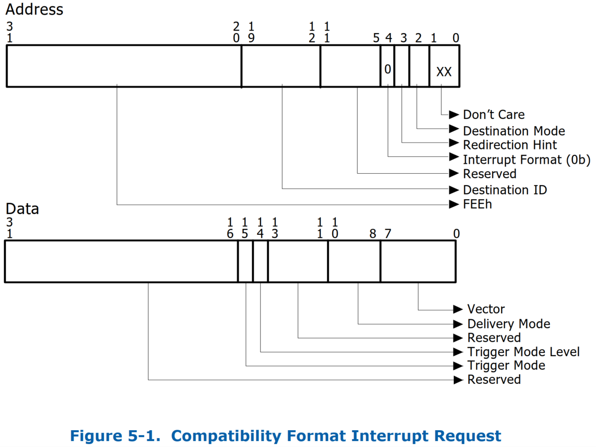
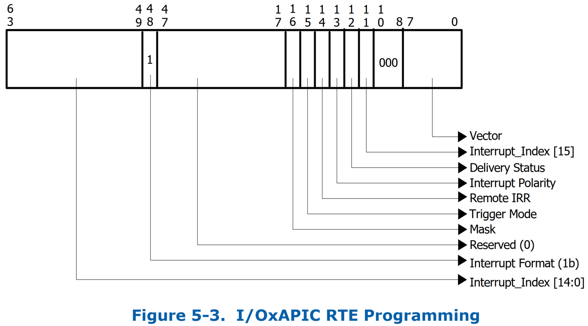
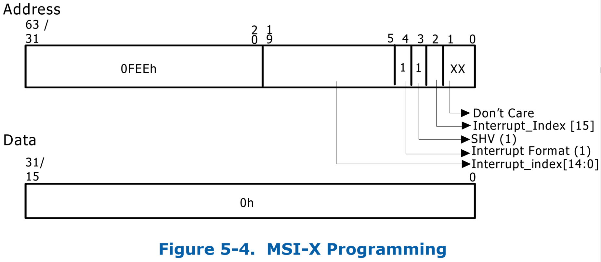
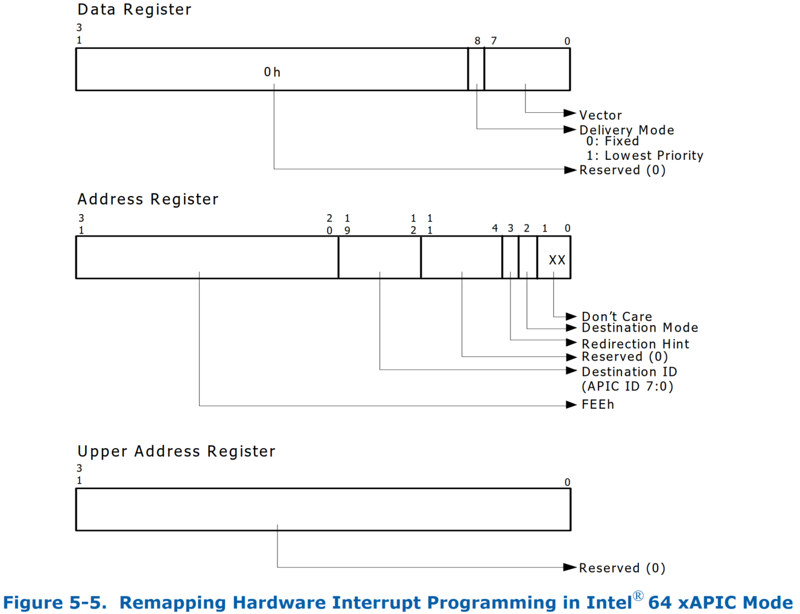
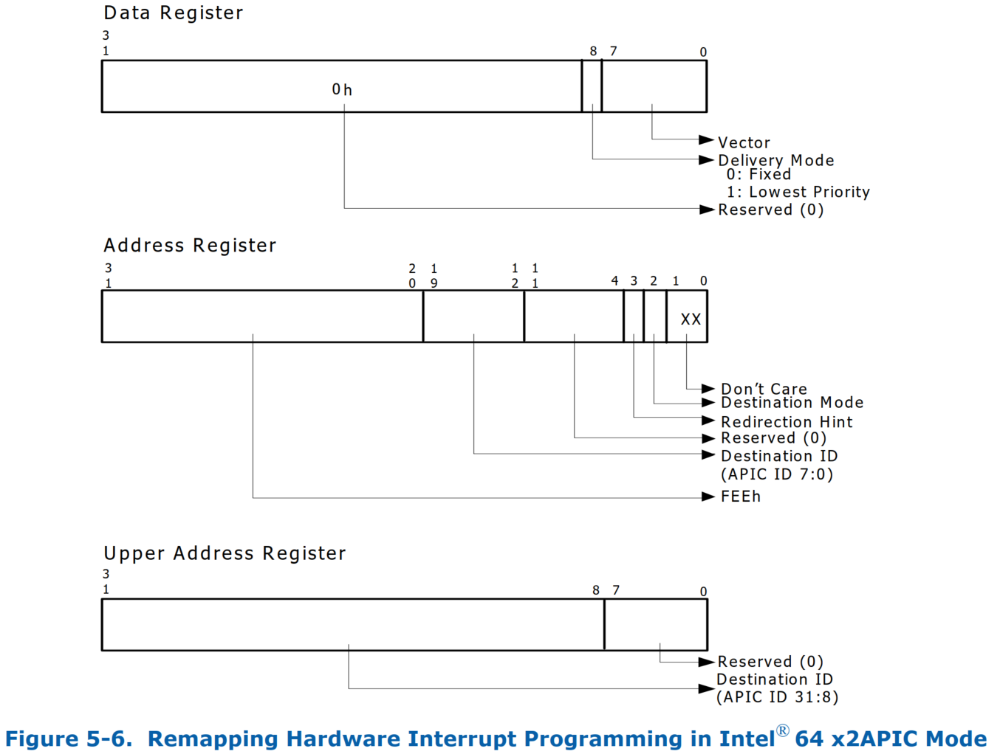
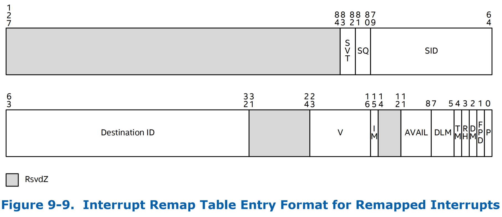
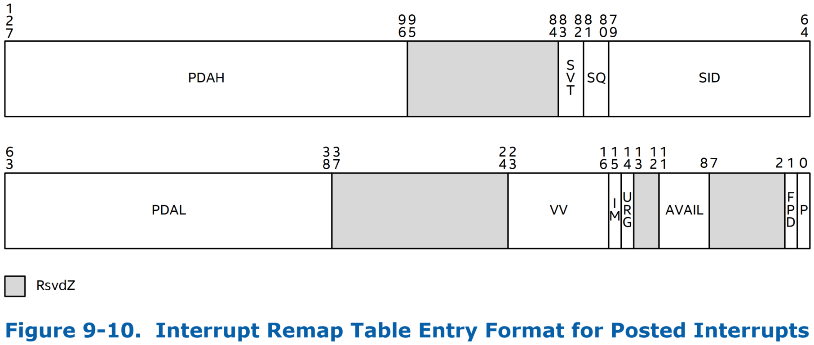
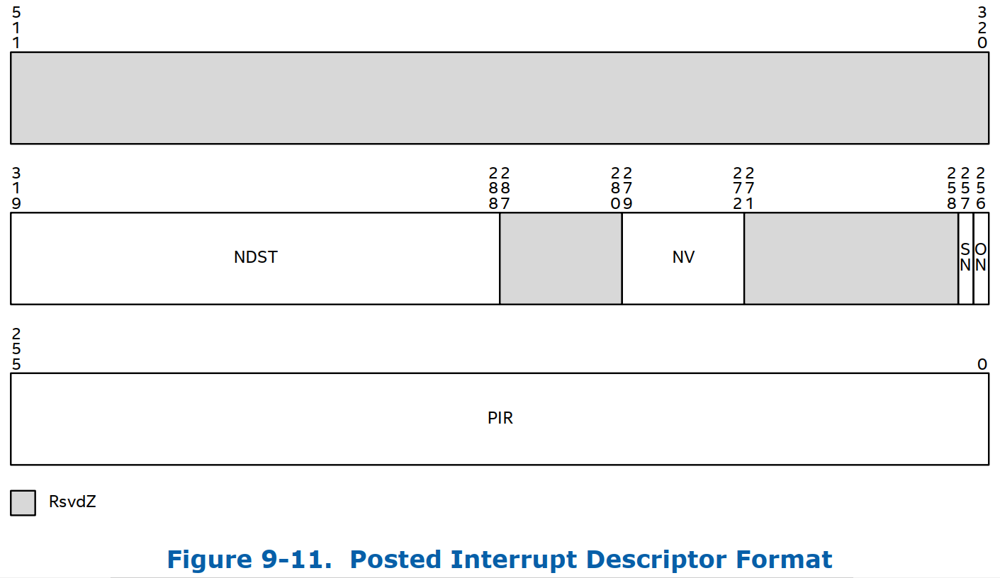

# 2 Overview

## 2.5 Intel Virtualization Technology For Directed I/O Overview

### 2.5.2 中断重映射的硬件支持
* 中断重映射为来自 I/O 设备的中断请求（直接生成或通过 I/O 中断控制器生成）的重映射和路由提供硬件支持。通过重新映射间接实现了跨分区（partitions）的中断隔离。

#### 2.5.2.1 中断隔离
* 在 Intel 架构平台上，中断请求由 Root-Complex 识别为针对架构地址范围（`0xFEEx_xxxx`）的 `DWORD` 大小的写入事务。
  * 中断请求是自描述的（即，中断请求的属性被编码在请求地址和数据中），允许任何 DMA 发起者生成具有任意属性的中断消息。
* 虚拟机监视器（VMM）可以利用中断重映射硬件来改进跨 domain 的外部中断请求的隔离。
  * 例如，VMM 可以利用中断重映射硬件来区分来自特定设备的中断请求，并将它们路由到相应设备被分配到的适当的 VM。
  * VMM 还可以利用中断重映射硬件来控制这些中断请求的属性（例如目标 CPU、中断向量、投递模式等）。
* 另一个示例用法是 VMM 使用中断重映射硬件来区分 *外部中断* 与 *VMM 拥有的处理器间中断（IPI）*。
  * 软件可以通过确保重映射的外部中断的属性（例如向量号）与 VMM IPI 的属性不匹配来实施此操作。

#### 2.5.2.2 中断迁移
* 当中断请求的目标从一个逻辑处理器迁移到另一逻辑处理器时，中断重映射架构可用于支持中断的动态重定向。
  * 如果没有中断重映射硬件支持，中断的重新平衡需要软件对中断源重新编程。然而，这些资源的重新编程是非原子的（需要重新编程多个寄存器），通常很复杂（可能需要临时屏蔽中断源），并且依赖于中断源特性（例如，某些中断源没有屏蔽能力；在某些源上屏蔽时，边沿中断可能会丢失，等等）。
* 中断重映射使软件能够有效地重定向中断，而无需在源处重新编程中断配置。
  * 操作系统软件可以使用中断迁移来平衡处理器之间的负载（例如，在运行 I/O 密集型工作负载时），
  * 或者当 VMM 跨物理处理器迁移一个带有被指派的设备的 partition 的虚拟 CPU 以提高 CPU 利用率时，可以使用中断迁移。

#### 2.5.2.3 x2APIC 支持
* Intel 64 x2APIC 架构将 APIC 寻址能力从 8 位扩展到 32 位。中断重映射使 x2APIC 能够支持外部中断的扩展 APIC 可寻址性，而无需对中断源（例如 I/OxAPIC 和 MSI/MSIX 设备）进行硬件更改。

### 2.5.3 Interrupt Posting 的硬件支持
* Interrupt posting 包括对来自直接分配给虚拟机的 I/O 设备（物理功能、SR-IOV 虚拟功能或 Intel 可扩展 IOV 可分配设备接口（Assignable Device
Interfaces，ADIs））的中断请求的优化处理的硬件支持。

#### 2.5.3.1 中断向量可扩展性
* 支持 I/O 虚拟化功能（例如 SR-IOV 和/或 Intel 可扩展 IOV）的设备，通过允许为 Physical Function（PF）启用多个 Virtual Functions（VF）或可分配设备接口（ADI），实际上增加了平台的 I/O fan-out。
  * 这些 PF、VF 或 ADI 中的任何一个都可以分配给虚拟机。
  * 来自此类分配的设备/资源的中断请求被称为 *虚拟中断*，因为它们以分配的 VM 的虚拟处理器为目标。
* 每个 VF 或 ADI 都需要自己独立的中断资源，从而导致需要比 *没有此类 I/O 虚拟化时所需的中断向量* 更多的中断向量。
  * 没有 interrupt-posting 硬件支持，平台中的所有中断源都映射到相同的物理中断向量空间（Intel 64 处理器上每个逻辑 CPU 8 位向量空间）。
  * 对于虚拟化用途，当虚拟处理器和逻辑处理器之间没有静态关联时，在动态环境中跨虚拟处理器划分物理向量空间具有挑战性。
* 对 interrupt posting 的硬件支持，通过允许来自分配给虚拟机的设备功能/资源的中断请求在虚拟向量空间中操作，来解决该向量可扩展性问题，从而随着虚拟机或虚拟处理器的数量自然地扩展。

#### 2.5.3.2 中断虚拟化效率
* 如果没有 interrupt posting 的硬件支持，分配给虚拟机的设备的中断将通过 VMM 软件进行处理。
  * 具体地，每当 CPU 接收到发往虚拟机的外部中断时，控制权就会转移到 VMM，要求 VMM 处理并向虚拟机注入相应的虚拟中断。
  * 与此类外部中断的 VMM 处理相关的控制传输会产生硬件和软件开销
* 通过对 interrupt posting 的硬件支持，分配给虚拟机的设备（PF、VF 或 ADI）的中断被 posted（记录）在 VMM 指定的内存描述符中，并根据中断所针对的虚拟处理器的运行状态进行处理。
* 例如，如果目标虚拟处理器运行在任何逻辑处理器上，则硬件可以直接向虚拟处理器传递外部中断，而无需任何 VMM 干预。
  * 当目标虚拟处理器被抢占（等待轮到其运行）时接收到的中断可以由硬件累积在存储器中，以便稍后调度虚拟处理器时传送。这可以避免因 *非运行状态的虚拟机的外部中断* 而中断当前正在运行的虚拟处理器的执行。
  * 如果目标虚拟处理器在中断到达时 halted（idle），或者如果中断符合要求实时处理的条件，则硬件可以将控制权转移给 VMM，从而使 VMM 能够调度虚拟处理器，并让硬件直接将挂起的中断传递给该虚拟处理器。
* 这种基于目标虚拟处理器状态的中断处理减少了虚拟机的总体中断延迟，并减少了 VMM 虚拟化中断所产生的开销。

#### 2.5.3.3 虚拟中断迁移
* 为了优化整体平台利用率，VMM 软件可能需要动态评估最佳逻辑处理器来调度虚拟处理器，并在此过程中跨 CPU 迁移虚拟处理器。
  * 对于具有被指派设备的虚拟机，跨逻辑处理器迁移虚拟处理器要么会产生软件中转发中断的开销（例如，通过 VMM 生成的 IPI），要么会导致将针对虚拟处理器的每个中断独立迁移到新逻辑处理器的复杂性。
  * 对 interrupt posting 的硬件支持使 VMM 软件能够在虚拟处理器被调度到另一个逻辑处理器时自动迁移针对该虚拟处理器的所有中断。

# 5 中断重映射
* 本章讨论中断重映射和 interrupt posting 的架构和硬件细节。这些功能统称为中断重映射架构。
## 5.1 中断重映射
* 中断重映射架构使系统软件能够控制和审查（censor）所有来源生成的外部中断请求，包括来自中断控制器 (I/OxAPIC)、支持 MSI/MSI-X 的设备（包括 endpoints、root-ports 和 Root-Complex 集成 end-points）的请求。
* 由重映射硬件本身生成的中断（Fault Event、Invalidation Completion Events 和 Page Request Events）不受中断重映射的影响。
* **中断请求** 对于 Root-Complex 来说是对中断地址范围 `0xFEEx_xxxx` 的 upstream 大小为 `DWORD` 的内存写入请求。
  * 由于中断请求作为写请求到达 Root-Complex，因此中断重映射与重映射硬件单元位于同一位置。
  * 中断重映射能力通过 Extended Capability Register 报告。

### 5.1.1 识别中断请求的来源
* 为了支持使用 domain-isolation，平台硬件必须能够唯一标识每个中断消息的请求者（Source-Id）。
* 平台中的中断源以及这些请求中 source-id 的使用可以分类如下：
* 来自 PCI Express 设备的消息信号中断
  * 对于来自 PCI Express 设备的消息信号中断请求，*source-id* 是 PCI Express transaction header 中的 *请求者标识符*。
  * 设备的 *requester-id* 由配置软件分配的 PCI Bus/Device/Function 编号组成，唯一标识发起 I/O 请求的硬件功能。
  * 3.4.1 节说明了 PCI Express 规范定义的 requester-id。 第 3.12.5 节描述了使用 phantom 功能的 PCI Express 设备对 source-id 字段的使用。
* 来自 Root-Complex 集成设备的消息信号中断
  * 对于来自 root-complex 集成 PCI 或 PCI Express 设备的消息信号中断请求，source-id 是其 PCI requester-id。
* 来自 PCI Express 到 PCI/PCI-X 桥后面的设备的消息信号中断
  * 对于来自 PCI Express 至 PCI/PCI-X 桥后面的设备的消息信号中断请求，这些中断请求中的请求者标识符可以是中断设备的请求者标识符，也可以是 bus number 字段等于桥接器辅助接口的 bus number 且 device 和 function number 字段值为零的 requester-id。
  * 第 3.12.1 节描述了这些桥接器的 legacy 行为。
  * 由于这种混叠（aliasing），中断重新映射硬件不会将中断与此类桥后面的各个设备隔离。
* 来自传统 PCI 桥后面的设备的消息信号中断
  * 对于来自传统 PCI 桥后面的设备的消息信号中断请求，这些中断请求中的 source-id 是 legacy 桥设备的 requester-id。第 3.12.2 节描述了这些桥的 legacy 行为。
  * 因此，中断重新映射硬件不会隔离来自此类桥后面的各个设备的消息信号中断请求。
* 传统引脚中断
  * 对于使用传统方法进行中断路由的设备（例如通过直接连线到 I/O xAPIC 输入引脚，或通过 INTx 消息），I/OxAPIC 硬件生成中断请求事务。
  * 为了识别 I/OxAPIC 生成的中断请求的来源，中断重映射硬件要求平台中的每个 I/OxAPIC（通过 ACPI Multiple APIC 描述符表（MADT）枚举）在其请求中包含唯一的 16 位 source-id。BIOS 通过 ACPI 结构向系统软件报告这些 I/OxAPIC 的 source-id。
  * 有关 I/O xAPIC identity reporting 的更多详细信息，请参阅第 8.3.1.1 节。
* 其他消息信号中断
  * 对于 PCI 不可发现但能够生成消息信号中断请求的任何其他平台设备（例如集成高精度事件定时器 - HPET 设备），平台必须分配不与平台上任何其他源 ID 冲突的唯一 soucrce-id。
  * BIOS 必须通过第 8.3.1.2 节中描述的 ACPI 结构报告这些的 16 位 source-id。

### 5.1.2 Intel 64 平台上的中断请求格式
* Intel 64 平台上的中断重映射支持两种中断请求格式。

#### 5.1.2.1 兼容格式的中断请求


* `Interrupt Format` 字段（Address bit `4`）在 *兼容性格式请求* 中被清除。
* 没有中断重映射功能的平台仅支持兼容性格式的中断。

#### 5.1.2.2 可重映射格式的中断请求


* `Interrupt Format` 字段（Address bit `4`）在 *可重映射格式中断请求* 中被设置。
* 可重映射中断请求仅适用于支持中断重映射的平台。

##### 可重映射中断请求格式中的 Address 字段
* Table 11 描述了可重映射中断请求格式中 Address 的各个字段。

Address Bits | 字段              | 描述
-------------|-------------------|----------------------------------------------------------------------
31: 20   | Interrupt Identifier  | 这些位中，值为 `0xFEE` 的 DWORD DMA 写请求会被 Root-Complex 解码为中断请求。
19: 5    | Handle[14:0]          | 该字段与 bit `2` 一起提供 `16 bit` 的 Handler。中断重映射硬件使用该 Handler 来识别中断请求。16 bit Handler 为每个中断重映射硬件单元提供 64K 个唯一的中断请求。
4        | Interrupt Format      | 对于可重映射格式中断，该字段的值必须为 bit `1`。
3        | SubHandle Valid (SHV) | 该字段指定中断请求有效负载（data）是否包含有效的 Subhandle。使用 Subhandle 可以使 MSI constructs 支持仅单个地址和多个数据值。
2        | Handle[15]            | 该字段携带 `16 bit` Handler 的最高有效位。
1:0      | 忽略                  | 这些位被中断重新映射硬件忽略。

##### 可重映射中断请求格式中的 Data 字段
* Table 12 描述了可重映射中断请求格式中 Data 的各个字段。

Data Bits | 字段      | 描述
----------|-----------|----------------------------------------------------------------------
31:16     | 保留      | 当中断请求 Address 中的 `SHV` 字段被置位时，该字段被硬件视为保留（`0`）。当中断请求 Address 中的 `SHV` 字段被清除时，该字段被硬件忽略。
15:0      | Subhandle | 当中断请求 Address 中的 `SHV` 字段被设置时，该字段包含 `16 bit` Subhandle。当中断请求 Address 中的 `SHV` 字段被清除时，该字段被硬件忽略。

### 5.1.3 中断重映射表
* 中断重映射硬件利用一个驻留在内存中的（memory-resident）的单级（single-level）表，称为 **中断重映射表**。
* 中断重映射表由系统软件设置，其基址和大小通过 **中断重映射表地址寄存器（Interrupt Remap Table Address Register）** 指定。
* 表中的每个条目大小为 `128` 位，称为 **中断重映射表条目（IRTE）**。第 9.9 节说明了 IRTE 格式。
* 对于可重映射格式的中断请求，中断重映射硬件计算 “`interrupt_index`”，如下所示：
  * `Handle`、`SHV` 和 `Subhandle` 是来自可重映射中断格式的中断 address 和 data 的相应字段。
  ```c
  if (address.SHV == 0) {
     interrupt_index = address.handle;
  } else {
     interrupt_index = (address.handle + data.subhandle);
  }
  ```
* 中断重映射表地址寄存器由软件编程来指定中断重映射表中 IRTE 的数量（中断重映射表中 IRTE 的最大数量为 `64K`）（那么总大小为 `1 MB`）。
* 平台中的重映射硬件单元可以被配置为 *共享中断重映射表* 或 *使用独立的表*。
* `interrupt_index` 用于在中断重映射表中索引适当的 IRTE。
* 如果计算出的 `interrupt_index` 值等于或大于重映射表中 IRTE 的数量，则硬件将中断请求视为错误。
* 与将所有中断属性都编码在中断请求 address/data 中的兼容性中断格式不同，可重映射中断格式仅指定计算 `interrupt_index` 所需的字段。
  * 重映射的中断请求的属性通过由 `interrupt_index` 引用的 IRTE 来指定。
* 中断重映射架构定义了对硬件的支持来缓存经常使用的 IRTE 以提高性能。对于软件可能需要动态更新 IRTE 的用途，架构定义了使 IEC 无效的命令。第 6 章描述了缓存结构和相关的失效命令。

### 5.1.4 中断重映射硬件操作
* 下面提供了中断重映射硬件操作的功能概述：
* 硬件将 *中断请求* 识别为对中断地址范围 `0xFEEx_xxxx` 的 DWORD 大小的写入请求。
* 当 **未启用** 中断重映射（Global Status Register 中的 `IRES` 字段清除）时，所有中断请求均按照第 5.1.2.1 节中描述的兼容性中断请求格式进行处理。
* 当中断重映射 **使能**（Global Status Register 中的 `IRES` 字段设置）时，中断请求按如下方式处理：
  * **兼容性格式的中断请求**（即 `Interrupt Format` 字段清除的请求）按如下方式处理：
    * 如果 Extended Interrupt Mode 使能（中断重映射表地址寄存器中的 `EIME` 字段被设置），或者如果兼容性格式中断被禁用（Global Status Register 中的 `CFIS` 字段被清除），则兼容性格式中断将被阻止。
    * 否则，兼容性格式中断将作为直通（pass-through）处理（绕过中断重映射）。
  * **可重映射格式的中断请求**（即 `Interrupt Format` 字段设置的请求）按如下方式处理：
    * 可重映射中断请求中的保留字段被检查为零。如果保留字段检查失败，则中断请求被阻止。否则，从中断请求中检索 `Source-id`、`Handle`、`SHV` 和 `Subhandle` 字段。
    * 硬件根据第 5.1.3 节中描述的算法计算 `interrupt_index`。计算出的 `interrupt_index` 经验证小于中断重映射表地址寄存器中配置的中断重映射表大小。如果边界检查失败，则中断请求被阻止。
    * 如果上述边界检查成功，则从 Interrupt Entry Cache 中检索与 `interrupt_index` 值相对应的 IRTE，或者从中断重映射表中获取。如果 Extended Capability Register 中的 `Coherent（C）` 字段报告为 `Clear`，则从内存中获取 IRTE，而不会监听（snoop）处理器缓存。硬件必须将整个 IRTE 作为单个操作读取，并且不能使用多次读取来获取 IRTE 的内容，因为软件可能会自动更改 IRTE 的内容。报告 Memory Type Support（`ECAP_REG` 中的 `MTS=1`）的硬件实现必须使用 *回写（WB）* 内存类型进行 IRTE 提取。如果 IRTE 中的 `Present（P）` 字段被清除，则中断请求被阻止并被视为故障。
    * 如果 IRTE 存在（`P=1`），则硬件根据 IRTE 中 `SVT`、`SID` 和 `SQ` 字段的编程执行中断请求程序验证，如第 9.9 节所述。如果 source-id 检查失败，则中断请求被阻止。
  * 如果 IRTE 已清除 `Mode` 字段（`IM=0`）:
    * 如果 `IM` 字段为 `1`，则硬件以 posted 格式解释 IRTE（如第 9.10 节所述）。有关中断发布硬件操作，请参阅第 5.2.3 节。
    * 硬件以可重映射格式解释 IRTE（如第 9.9 节所述）。如果检测到可重映射格式 IRTE 的无效编程，则中断请求被阻止。
    * 如果上述检查成功，则根据 IRTE 字段的编程生成重新映射的中断请求。
    * 当将重映射的中断请求转发到系统总线时，系统总线上的中断请求中的“`Trigger Mode Level`”字段始终设置为“有效（asserted）”（`1b`）。
* 任何导致中断请求被阻止的上述检查都被视为中断重映射故障条件。下一节列举了中断重映射故障条件。

#### 5.1.4.1 中断重映射故障条件
* 下表列举了处理中断请求时导致故障的各种情况（略）。
* 如果仅当用于处理故障中断请求的 IRTE 中的 `Fault Processing Disable（FPD）` 字段清除时，才将故障报告给软件，则该故障条件被视为“qualified”。
* 中断转换故障是不可恢复的，并且故障中断请求被重映射硬件视为不支持的请求（Unsupported Request）。

### 5.1.5 对中断源进行编程以生成可重映射中断
* 软件执行以下通用的步骤来配置中断源以生成可重映射中断：
1. 分配一个空闲的中断重映射表条目（IRTE），并根据第 9.9 节中描述的 IRTE 格式对重映射的中断属性进行编程。
2. 对中断源进行编程，以使用适当的 `handle`、`subhandle` 和 `SHV` 字段生成可重映射格式的中断，这些字段有效地将分配的 IRTE 的索引编码为第 5.1.3 节中定义的`interrupt_index`。可以通过以下方式之一使用 `handle`、`subhandle` 和 `SHV` 字段对 `interrupt_index` 进行编码：
   - SHV = 0; handle = interrupt_index;
   - SHV = 1; handle = interrupt_index; subhandle = 0;
   - SHV = 1; handle = 0; subhandle = interrupt_index;
   - SHV = 1; handle = interrupt_index - subhandle;
* 以下小节描述了 I/OxAPIC、MSI 和 MSI-X 中断源的示例编程，以根据可重映射中断请求格式生成中断。

#### 5.1.5.1 编程 I/OxAPIC
* 软件对 I/OxAPIC 中的重定向表条目（RTE）进行编程，如下图所示：



* `interrupt_index[14:0]` 在 I/OxAPIC RTE 的 bit `63:49` 中编程。`interrupt_index (interrupt_index[15])` 的最高有效位被编程在 I/OxAPIC RTE 的 bit `11` 中。
* I/OxAPIC RTE 中的 bit `48` 被置位以指示中断为可重映射格式。
* RTE bit `10:8` 被编程为 `000b`（Fixed），以强制生成的中断地址中的 `SHV（SubHandle Valid）` 字段为“清除”。
* I/OxAPIC RTE 中的 `Trigger Mode` 字段（bit `15`）必须与 I/OxAPIC RTE 引用的 IRTE 中的 `Trigger Mode` 匹配。这是电平触发中断正常运行所必需的。
* 对于使用 End-of-Interrupt（EOI）广播的平台，I/OxAPIC RTE 中用于电平触发中断的 `Vector` 字段（即 I/OxAPIC RTE 中的 `Trigger Mode` 字段被设置，且 I/OxAPIC RTE 引用的 IRTE 中的 `Trigger Mode` 字段也被设置），必须与引用的 IRTE 中编程的 `Vector` 字段匹配。这是正确处理 I/OxAPIC 广播的 End-of-Interrupt（EOI）所必需的。
* I/OxAPIC RTE 中所有其他字段的编程不受中断重映射的影响。

#### 5.1.5.2 编程 MSI and MSI-X Register
* 下图说明了 MSI/MSI-X address 和 data 寄存器的编程，以支持消息信号中断的重映射。



* 具体来说，每个地址和数据寄存器必须编程如下：
* Address 寄存器 bit `63/31:20` 必须使用中断地址标识符的值 `0x0FEE` 进行编程。
* Address 寄存器 bit `19:5` 使用 `interrupt_index[14:0]` 进行编程，address 寄存器 bit `2` 必须使用 `interrupt_index[15]` 进行编程。`interrupt_index` 是重映射相应中断请求的中断重新映射表条目（IRTE）的索引。
  * 支持 MSI 的设备允许软件启用（最多 `32` 个）`2` 次幂个数的多个向量。
  * 对于此类多向量 MSI 使用，软件必须分配 N 个连续的 IRTE 条目（其中 N 是 MSI 设备上启用的向量数量），并且编程到 `Handle` 字段的 `interrupt_index` 的值必须是 N 个连续分配的 IRTE 条目中第一个 IRTE 的索引。设备拥有 data 寄存器的最低有效 `log-N` 位，并在中断请求的负载中的这些 bits 里编码 *相对中断号（0 到 N-1）*。
* Address 寄存器第 `4` 位必须置位以指示中断采用可重映射格式。
* Address 寄存器第 `3` 位被设置，以便设置生成的中断请求中的 `SubHandle Valid（SHV）` 字段。
* Data 寄存器被编程为 `0x0`。

### 5.1.6 重映射硬件事件中断编程
* 由重映射硬件事件生成的中断不受中断重映射的影响。以下部分描述了 Intel 64 平台上 Fault Event、Invalidation Completion Event 和 Page Request Event 的 data/address 寄存器的编程。
* `Trigger Mode` 和 `Level` 的值固定为 `0`，用于重映射硬件事件中断。

#### 5.1.6.1 在 Intel 64 xAPIC Mode 中编程



#### 5.1.6.2 在 Intel 64 x2APIC Mode 中编程
* x2APIC 模式的硬件支持通过 Extended Capability Register 中的 `EIM` 字段报告。x2APIC 模式通过中断重映射表地址寄存器启用。



### 5.1.7 平台事件的处理
* 强烈建议支持中断重映射的平台使用 side-band 机制（例如芯片组/board-logic 和 CPU 之间的专用引脚）或 in-band 方法（例如平台/供应商定义的消息）来传递平台事件，例如 SMI/PMI/NMI/INIT/MCA。这是为了避免依赖系统软件来传递这些关键平台事件。
* 已知一些现有平台使用 I/OxAPIC RTE（重定向表条目）来传递 SMI、PMI 和 NMI 事件。对于通过 I/OxAPIC RTE 传递的此类平台事件，至少有两种现有的初始化方法。
  * 一些现有平台向系统软件报告通过 ACPI 连接到平台事件源的 I/OxAPIC RTE，从而使系统软件能够显式编程/启用这些 RTE。示例包括 ACPI MADT 中的 “NMI Source Reporting” 结构（用于报告 NMI source）。
  * 或者，一些现有平台在 BIOS 初始化期间对连接到特定平台事件源的 I/OxAPIC RTE 进行编程，并依赖系统软件将这些 RTE 显式保留在 BIOS 初始化状态。（例如，已知某些平台在将控制权交给系统软件之前通过 BIOS 对特定的 I/OxAPIC RTE 进行编程以生成 SMI，并且依赖于系统软件保留用 SMI delivery mode 预编程的 RTE）。
* 在支持中断重映射的平台上，通过 I/OxAPIC RTE 传送 SMI、PMI 和 NMI 事件需要系统软件对各个 RTE 进行编程，以便通过中断重映射表对 I/OxAPIC RTE 正确地重新映射。
  * 为了避免系统软件的管理负担，强烈建议支持中断重新映射的平台避免通过 I/OxAPIC RTE 传递平台事件，而是通过专用引脚（例如处理器的 xAPIC `LINTn` 输入）或通过替代的平台特定消息传递它们 。

## 5.2 Interrupt Posting
* Interrupt-posting 功能是中断重映射硬件的扩展，用于扩展处理可重映射格式中断请求。Interrupt-posting 使得可重映射格式的中断请求能够被 posted（记录）在一致的（coherent）主存储器驻留数据结构中，并且向 CPU complex 发送可选的通知事件，以发出有 pending posted interrupt 的信号。
* 通过 Capability 寄存器（`CAP_REG`）中的 `Posted Interrupt Support（PI）` 字段报告对 interrupt-posting 功能的重映射硬件支持。第 11.4.2 节描述了 interrupt-posting 能力报告。

### 5.2.1 中断重映射表对 Interrupt Posting 的支持
* 所有可重映射中断请求均通过中断重映射表进行处理，如第 5.1.3 节所述。中断重映射表条目 (IRTE) 中的 `IRTE Mode（IM）` 字段指定通过该 IRTE 处理的可重映射中断请求是否受 interrupt-remapping 或 interrupt-posting 影响。
  * 如果 IRTE 中的 `IM` 字段为 `0`，则 IRTE 被解释为 **可重映射格式**（第 9.9 节中描述），以重新映射通过它处理的中断请求。中断重映射硬件操作在第 5.1.4 节中描述。
  * 如果 IRTE 中的 `IM` 字段为 `1`，则 IRTE 将以 **posted 格式**（第 9.10 节中描述）进行解释，以通过它处理 post 中断请求。interrupt-posting 硬件操作在第 5.2.3 节中描述。
* Posted 格式的 IRTE 条目支持以下新字段：
  * 将中断 post（记录）到的 `Posted Interrupt Descriptor 数据结构的地址`。5.2.2 节描述 Posted Interrupt Descriptor。
  * `Urgent（URG）` qualification，指示通过该 IRTE 处理的中断请求是否需要实时处理。5.2.3 节描述了该字段的硬件操作。
  * `Vector` 字段指定在 posting 通过 IRTE 处理的中断时要使用的向量。与可重映射格式（其中在生成重映射中断请求时使用 `Vector` 字段）不同，Posted 格式 IRTE 的 `Vector` 字段用于确定在将中断 posting 到 IRTE 引用的 Posted Interrupt Descriptor 时要设置哪个位。
* 与中断重映射一样，由重映射硬件本身生成的中断不受 interrupt posting 的影响。

### 5.2.2 Posted Interrupt Descriptor
* Posted Interrupt Descriptor 是内存中的 `64` 字节大小且对齐到 `64` 字节和的结构，由 interrupt posting 硬件用来 post（记录）要 posting 的中断请求。第 9.11 节描述了 Posted Interrupt Descriptor 格式。系统软件必须在一致（回写）主存储器中分配 Posted Interrupt Descriptors。
* Posted Interrupt Descriptor 包含以下字段：
  * `Posted Interrupt Request（PIR）` 字段为 posting（记录）中断提供存储（每个向量一位，最多可容纳 `256` 个向量）。
  * `Outstanding Notification（ON）` 字段指示该 Posted Interrupt Descriptor 是否有 outstanding 的通知事件（尚未被处理器或软件处理）。当该字段为 `0` 时，硬件在生成通知事件时将其从 `0` 修改为 `1`，并且接收通知事件的实体（处理器或软件）将其重置，作为 posted interrupt 处理的一部分。
  * `Suppress Notification（SN）` 字段指示对于非紧急中断请求（通过 `URG=0` 的 IRTE 处理的中断）是否要抑制（不生成）通知事件。
  * `Notification Vector（NV）` 字段指定通知事件（中断）所用的向量。
  * `Notification Destination（NDST）` 字段指定通知事件的目标逻辑处理器的物理 APIC-ID。

### 5.2.3 Interrupt-Posting 硬件操作
* 可重映射格式的中断请求由硬件处理，如第 5.1.4 节所述。
* 当此类处理遇到 posted 格式（`IM=1`）的 IRTE 条目时，将通过 posting（而不是重映射）处理中断请求。下面提供了 interrupt-posting 硬件操作的功能概述：
* 如果检索到的 IRTE 已设置模式字段（`IM=1`）
  * 硬件以 posted 格式解释 IRTE（如第 9.10 节所述）。如果检测到无效的 posted 格式 IRTE 的编程，则中断请求被阻止。
  * 如果上述检查成功，IRTE 将提供指向 Posted Interrupt Descriptor（`PDA-L/PDA-H`）的指针、要 posted 的向量值（`Vector`），以及中断请求是否被限定为紧急（`URG`）等信息。
* 硬件对 posted-interrupt descriptor 执行一致性的原子的 *读-修改-写* 操作，如下所示：
  * 硬件实现报告 Memory Type Support（`ECAP_REG` 中的 `MTS=1`）的必须使用以原子操作的回写 (WB) 内存类型更新 posted-interrupt descriptor。
  * 无论 Extended Capability Register（`ECAP_REG`）中的 `Pagewalk Coherency（C）` 字段的值如何，此原子读-修改-写操作将始终监听处理器缓存。
  * 读取 Posted Interrupt Descriptor 的内容，声明其托管缓存行的独占所有权。如果检测到 Posted Interrupt Descriptor 的无效编程（例如，非零保留字段），则释高速缓存行的所有权，并阻止中断请求。
  * 如果上述检查成功，则检索 Posted Interrupt Descriptor 中的 `Posted Interrupt Requests`（`PIR` bit `255:0`）、`Outstanding Notification（ON）`、`Suppress Notification（SN）`、`Notification Vector（NV）` 和 `Notification Destination（NDST）` 字段的当前值 。
  * 以原子方式修改以下描述符字段值：
    * 设置 `PIR` 中与来自 IRTE 的 `Vector` 字段值相对应的位
    * 计算 `X = ((ON == 0) & (URG | (SN == 0)))`
    * 如果 `(X == 1)`，设置 `ON` 字段
    * 即 `ON == 1` 或 非紧急且 `SN == 1` 的情况下，不设置 `ON` 字段
  * 将缓存行提升为全局可观察的，以便其他缓存代理可以看到修改。在此步骤之后，硬件可以随时写回高速缓存行。
  * 如果上一步中 `(X == 1)`，则生成通知事件（中断），其属性如下：
    * `NSDT` 字段指定目标逻辑 CPU 的物理 APIC-ID。请参阅第 9.11 节了解如何针对 xAPIC 和 x2APIC 模式解释该字段。
    * `NV` 字段指定用于通知中断的向量，以向目标 CPU 发出有关挂起的 posted interrupt 的信号。
    * 通知中断的 `Delivery mode` 字段强制为 `Fixed（000b）`
    * 通知中断的 `Re-direction Hint` 字段被强制 `Clear（0b）`
    * 通知中断的 `Trigger Mode` 字段强制为 `Edge（0b）`
    * 通知中断的 `Trigger Mode Level` 字段被强制置为 `Asserted（1b）`
* 任何导致中断请求被阻止的上述检查都被视为中断重新映射 fault condition，如第 5.1.4.1 节中列举的那样。

### 5.2.4 对 Interrupt Posting 的顺序要求
* 本节总结了 interrupt-posting 硬件在 posting interrupts 时要满足的顺序要求。
* 中断请求是 posted 的事务并遵循中断排序规则。这确保了在所有先前的 inbound poseted 请求（写入）都提交到其目的地之前，软件不会观察到中断请求。
  * 即使发出了中断请求，也需要维持此要求。即，在将中断 posted（记录）到 posted-interrupt descriptor 中并使软件可见之前，必须完成所有先前 posted 的请求。
* 由于中断请求是 posted 事务，因此 upstream 读取完成必须推送前面的中断请求。
  * 即使 posted 了一个或多个之前的中断请求，也需要维持这一要求。即，upstream 读取完成必须等到所有先前的中断（无论它们是重新映射还是 posted）完成。在 posted 中断的情况下，中断的“完成”意味着已 posted interrupt descriptor 的原子更新和关联的通知事件均已完成。
* 在 interrupt-posting 操作中，硬件必须确保在 posted 该描述符的通知事件之前，软件可以观察到对 posted interrupt descriptor 的修改。

### 5.2.5 为 Virtual Interrupt Delivery 使用 Interrupt Posting
* 本节内容丰富，旨在说明虚拟机监视器 (VMM) 软件如何使用 interrupt-posting 硬件来支持从分配的设备到虚拟机的虚拟中断的高效传递的简化示例用法。
  * 这个简化的使用示例假设 VMM 软件通常在中断 masked 的情况下运行，除非将逻辑 CPU 置于低功耗状态。此处所示的示例可以扩展以涵盖其他使用场景。
* VMM 软件可以为虚拟机启用 interrupt-posting，如下所示：
* 对于虚拟机中的每个虚拟处理器，VMM 软件可以分配一个 Posted Interrupt Descriptor。每个这样的描述符用于 posting 要传递给相应虚拟处理器的所有中断。
  * 软件必须阻止设备访问 Posted Interrupt Descriptors 所在的内存。实现此目的的一种方法是设置重映射表，以便重映射硬件阻止从设备到 Posted InterruptDescriptors 的访问。
  * 如果设备能够写入 Posted Interrupt Descriptor，则无法保证发布中断操作的原子性。
* VMM 软件为通知事件分配两个物理中断向量（跨平台中的所有逻辑 CPU）。
  * 该物理向量之一可以用作 **“活动通知向量”（Active Notification Vector，ANV）**，当往处于活动状态（正在执行）的任何虚拟处理器 posting 一个中断时，用于向其 posted 中断通知。
  * 分配的其他物理向量可用作 **“唤醒通知向量”（Wake-up Notification Vector，WNV）**，当往处于被阻塞（halted）的任何虚拟处理器 posting 一个中断时，用于向其 posted 中断通知。
* 对于从任何分配（透传）给该虚拟机的设备的每个中断源，VMM 软件可以拦截并虚拟化相应中断资源（IOxAPIC 条目和/或 MSI/MSI-X 寄存器）的 guest 软件编程。通过这种虚拟化，VMM 软件探测到了 guest 软件分配的 **目标虚拟处理器** 和 **虚拟向量**。
* 对于每个这样的中断源，VMM 软件分配一个 posted 格式的 IRTE。
  * 每个此类 IRTE 中的 `vector` 字段均由 VMM 软件通过 guest 软件为中断源分配的相应 *虚拟向量值* 进行编程。
  * 每个这样的 IRTE 中的 `posted descriptor address` 字段由 VMM 软件编程，以引用为由 guest 软件为中断源分配的虚拟处理器而分配的 posted descriptor。
  * 如果相应的中断源被指定为需要立即（非延迟）处理，则 IRTE 中的 `urgent（URG）` 字段由 VMM 软件设置。
* VMM 软件配置处理器硬件以启用虚拟处理器的 APIC 虚拟化（包括“virtual-interrupt delivery”和“process posted interrupts”功能）。
  * 虚拟处理器的 “posted-interrupt notification vector” 使用本节前面所述的 “Active Notification Vector”（`ANV`）值进行配置。
  * 虚拟处理器的 “posted-interrupt descriptor” 是用为各个虚拟处理器分配的 Posted Interrupt Descriptor 的地址来配置的。
* VMM 软件调度器可以按如下方式管理虚拟处理器的调度状态：
  - 当选择虚拟处理器执行时，虚拟处理器状态在进入/恢复之前被指定为“active”。
    * 通过使用 `ANV` 向量值对其 `Notification Vector（NV）` 字段进行编程，可以在其 Posted Interrupt Descriptor 指定此状态。
      * VMM 软件可以采用不同的方法来管理通知向量。例如，替代方法可以是让 VMM 软件为每个虚拟处理器分配唯一的 `Activation Notification Vectors（ANV）`（而不是为所有虚拟处理器共享相同的 `ANV`）。
      * 该方法可以使得这样的 VMM 软件能够避免在虚拟处理器调度状态改变时在 Posted Interrupt Descriptor 中的 active 向量值和 wake-up 向量值之间进行切换，而是仅在跨逻辑处理器的虚拟处理器迁移时更新它们。
    * 这允许该虚拟处理器在其活动（运行）时接收到的所有中断均由处理器硬件处理，而无需将控制权转移给 VMM 软件。
    * 处理器硬件通过将 Posted Interrupt Descriptor 中的任何 posted 中断传输到虚拟处理器的 Virtual-APIC page 并将其直接传送（无需 VMM 软件干预）到虚拟处理器（以 `ANV` 向量值）来处理这些通知事件。
  - 当虚拟处理器被抢占时（例如，在 quantum expiry 时），虚拟处理器状态被指定为 “ready-to-run”。
    * 通过将 `Suppress Notification（SN）` 字段编程为 `1`，在其 Posted Interrupt Descriptor 中指定该状态。
    * 这允许该虚拟处理器在处于被抢占状态时接收到的所有非紧急中断被 posted 到其 Posted Interrupts Descriptor，而不生成通知中断（从而避免当前运行的虚拟处理器被打断）。
    * 如果存在被认定为针对该虚拟处理器的紧急中断源，则 VMM 软件还可以将 Posted Interrupt Descriptor 中的 `NV` 字段修改为 `WNV` 向量值。这使得 VMM 软件能够在虚拟处理器未运行时发出紧急中断时接收通知（用 `WNV` 向量值），从而允许适当的软件操作（例如，抢占当前正在运行的虚拟处理器并立即调度该虚拟处理器）。
  - 当虚拟处理器 halt 时（例如，在执行 `HLT` 指令时），VMM 软件可以获得控制权，阻止虚拟处理器的进一步执行，并将虚拟处理器状态指定为 “halted”。
    * 通过使用 `WNV` 向量值对其 `Notification Vector（NV）` 字段进行编程，可以在其 Posted Interrupt Descriptor 中指定此状态。
    * 这使得 VMM 软件能够在为此虚拟处理器 posted 任何中断（紧急或非紧急）时（以 `WNV` 向量值）接收通知，从而允许适当的软件操作（例如安排虚拟处理器以供将来或立即激活）。
* 当进入/恢复虚拟处理器时，VMM 软件可以处理其 posted descriptor 中的任何挂起的 posted 中断，如下所示：
  - VMM 首先通过将 Posted Interrupt Descriptor 中的通知向量编程为 `ANV` 向量值，将虚拟 CPU 转换为“active”状态。
  - VMM 可以检查所 posted descriptor 中是否存在挂起的中断（例如，通过扫描 `PIR` 字段的非零值）。
  - 如果存在挂起的 posted 中断，VMM 可以通过 Local xAPIC 生成具有 `ANV` 向量值的 self-IPI（同一逻辑 CPU 的处理器间中断）。
    * 本节中说明的用法假设 VMM 软件在中断禁用的情况下执行，并且作为 entering/resuming 虚拟处理器的一部分，处理器硬件启用中断。对于在 VMM 中启用中断的 VMM 软件实现，VMM 软件必须采取预防措施，在 *生成 self-IPI* 并 *恢复虚拟处理器* 之前，禁用逻辑处理器上的中断。
    * 一旦在虚拟处理器进入/恢复路径中启用中断，处理器就会识别该中断。
    * 由于虚拟处理器配置有 `ANV` 向量值作为 “posted-interrupt notification vector”，这导致处理器硬件处理它的方式与虚拟处理器处于活动状态时可能接收到的任何通知事件相同。
    * 当通过将硬件重新映射到 Posted Interrupt Descriptor 来 posted 中断时，这种方法使 VMM 软件能够将 posted 的中断处理（例如通过 Virtual-APIC 将中断传递给虚拟处理器）“off-load” 到处理器硬件，而不管中断发生时虚拟处理器的调度状态如何。
* VMM 软件还可以应用处理器的 “posted-interrupt processing” 能力来将 VMM 软件生成的虚拟中断注入到虚拟机（除了从直接分配的设备到虚拟机的中断之外）。
  * 这可以通过 VMM 软件原子地将虚拟中断 “posting” 到 Posted Interrupt Descriptor（使用原子/`LOCK` 指令实施高速缓存行更新的原子性），并生成一个通知事件（作为 IPI）到逻辑处理器来完成，这些逻辑处理器在 Posted interrupt Descriptor 中标识为 *通知的目的地（notify destination）*。
* VMM 软件可以通过将相应的 Posted Interrupt Descriptor 中的 `Notification Destination（NDST）` 字段原子地更新为 *虚拟处理器迁移到的逻辑处理器的物理 APIC-ID* 来处理跨逻辑处理器的虚拟处理器迁移。这使得来自该虚拟处理器的 posted descriptor 的所有新通知事件能够被路由到新逻辑处理器。

### 5.2.6 电平触发中断的 Interrupt Posting
* 通过 IOxAPIC 重定向表条目（如图 5-3 所示）生成的电平触发中断可以通过 Posted Interrupts 的中断重映射表条目（IRTE）进行处理（如第 9.10 节所示）。
* 然而，与中断重映射不同，由 posted interrupt 处理硬件处理的所有中断（包括电平中断）都被视为 *边沿触发中断*。
  * 因此，启用电平触发中断 posting 的 VMM 软件必须特别注意正确虚拟化虚拟处理器的 End of Interrupt（EOI）处理。
  * 例如，VMM 软件可以设置虚拟处理器执行控制，以通过 guest 软件获得对虚拟 APIC 控制器的 EOI 操作的控制，并且通过对生成电平触发中断的 IOxAPIC 执行 DirectedEOI 来虚拟化操作。
    * Directed-EOI 通过软件直接写入 IOxAPIC EOI 寄存器来执行。有关 IOxAPIC EOI 寄存器的详细信息，请参阅 IOxAPIC 规范。

## 5.3 内存类型和 snoop 行为摘要
* 下表总结了中断 translation 过程中内存访问的缓存 snooping 行为。该表还总结了在 coherent link 上进行访问时使用的存储器类型。on-coherent link 不使用硬件提供的存储器类型值。
  * 值 `1` 表示内存访问 snoops 处理器高速缓存。值 `0` 表示内存访问不会s noops 处理器缓存。
  * `ECAP.C` 是 Extended Capability Register（ECAP_REG）中的 `Page-walk Coherency` 字段。
  *  报告 Memory Type Support（ECAP_REG 中的 `MTS=1`）的硬件实现必须使用回写（WB）内存类型进行 IRTE 和 PID 访问。

* Table 14. 中断重映射结构的 Memory Type 和 snoop 行为

Interrupt Structure Access            | Snoop  | Memory Type
--------------------------------------|--------|---------------
读取中断重映射表条目                    | ECAP.C | WB
Posted Interrupt Descriptor 的原子更新 | 1      | WB

# 9 翻译结构格式

## 9.9 中断重映射的中断重映射表条目（IRTE）


## 9.10 Posted Interrupts 的中断重映射表条目（IRTE）


## 9.11 Posted Interrupt Descriptor（PID）
* 下图和下表描述了 `64` 字节对齐的 Posted Interrupt Descriptor 。软件必须为 Posted Interrupt Descriptors 分配 coherent（write-back）内存。



位        | 域                              | 描述
----------|---------------------------------|-------------------------------
`511:320` | R: 保留                         | 保留。软件必须将这些位编程为 `0`。
`319:288` | NDST: Notification Destination | 该字段指定通知事件的目标（逻辑 CPU 的物理 APIC-ID）。该字段的格式如下：</br> - Intel 64 xAPIC Mode (Physical):</br>   * 319:304 - Reserved (0)</br>   * 303:296 - APIC DestinationID[7:0]</br>   * 295:288 - Reserved (0)</br> - Intel 64 x2APIC Mode (Physical):</br>   * 319:288 - APIC DestinationID[31:0]
`287:280` | R: 保留                         | 保留。软件必须将这些位编程为 `0`。
`279:272` | NV: Notification Vector        | 该字段指定用于通知事件的物理向量。通知事件作为物理中断发出，触发模式为“边沿”，触发模式 level 为“Asserted”。
`271:258` | R: 保留                         | 保留。软件必须将这些位编程为 `0`。
`257`     | SN: Suppress Notification      | 该字段指示在向该描述符发布非紧急中断时是否必须抑制通知事件。</br> * `0`：不抑制通知事件。</br> * `1`：抑制通知事件。</br> *非紧急中断* 是通过 *设置* `IM` 字段和 *清除* `URG` 字段的 IRTE 条目处理的中断请求。</br> 如果在硬件向 `PIR` 字段发布非紧急中断时该字段中的值为 `1`b，则硬件将按照 `Outstanding Notification（ON）` 字段值为 `1`b 的方式运行（即，硬件不执行不生成通知事件，也不修改 `ON` 字段）。
`256`     | ON: Outstanding Notification   | 该字段指示该 posted interrupt descriptor 的通知事件是否 outstanding（等待 CPU 或软件的处理）。</br> * `0`：此描述符没有 outstanding 的通知事件。</br> * `1`：此描述符有一个通知事件 outstanding 。</br> 如果在硬件向 `PIR` 字段发出中断时该字段被清除，则硬件将设置它并生成通知事件。如果在硬件将中断发送到 `PIR` 字段时该字段已被设置，则不会生成通知事件。
`255:0`   | PIR: Posted Interrupt Requests | 该 `256` 位字段（每个向量一位）为发往特定虚拟处理器的 posted interrupts 提供存储。</br> 当与 IRTE 中的向量值相对应的 bit 在该字段中设置时，通过 IRTE 重新映射用于 posted interrupt（具有 `IM` 字段设置的 IRTE）的中断请求被视为由硬件 posted。


## References
- Intel® Virtualization Technology for Directed I/O - Architecture Specification - Revision 4.1