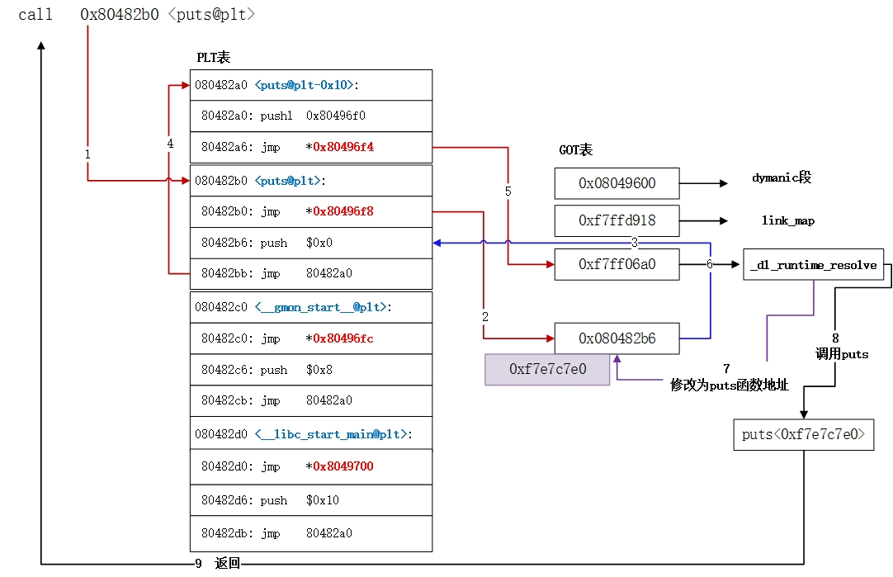
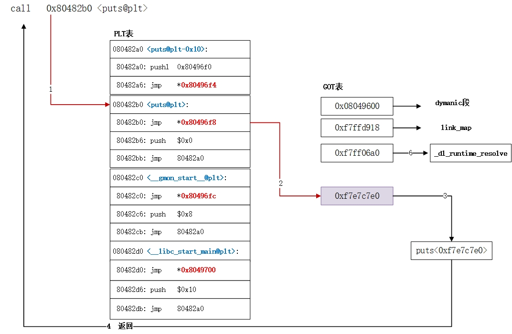

# 一个 PLT 的例子

* PLT 延迟绑定示意流程如下：



* PLT 延迟绑定后调用如下：



## 用于调试 PLT 的源代码
* 对于 Ubuntu 需要加 GCC `-z lazy` 编译选项，否则编出来的程序不采用 PLT
```cpp
/*
 * Build with PLT need to compile with:
 *     gcc -Wall -g -z lazy -o plt plt.c -lm
 *
 * Build by default will use full RELRO linker keyword
 * https://codeantenna.com/a/l2FxBmeZdA
 */

#include <stdio.h>
#include <math.h>

int main()
{
  double d = 9;

  d = sqrt(d);
  printf("d = %f\n", d);

  return 0;
}
```

## 调试 PLT 的过程
* 反汇编如下
```c
(gdb) b main
Breakpoint 1 at 0x1169: file plt.c, line 13.
(gdb) r
Starting program: /tmp/plt

Breakpoint 1, main () at plt.c:13
13      {
(gdb) disassemble main
Dump of assembler code for function main:
=> 0x0000555555555169 <+0>:     endbr64
   0x000055555555516d <+4>:     push   %rbp
   0x000055555555516e <+5>:     mov    %rsp,%rbp
   0x0000555555555171 <+8>:     sub    $0x10,%rsp
   0x0000555555555175 <+12>:    movsd  0xe93(%rip),%xmm0        # 0x555555556010
   0x000055555555517d <+20>:    movsd  %xmm0,-0x8(%rbp)
   0x0000555555555182 <+25>:    mov    -0x8(%rbp),%rax
   0x0000555555555186 <+29>:    movq   %rax,%xmm0
   0x000055555555518b <+34>:    callq  0x555555555070 <sqrt@plt>
   0x0000555555555190 <+39>:    movq   %xmm0,%rax
   0x0000555555555195 <+44>:    mov    %rax,-0x8(%rbp)
   0x0000555555555199 <+48>:    mov    -0x8(%rbp),%rax
   0x000055555555519d <+52>:    movq   %rax,%xmm0
   0x00005555555551a2 <+57>:    lea    0xe5f(%rip),%rdi        # 0x555555556008
   0x00005555555551a9 <+64>:    mov    $0x1,%eax
   0x00005555555551ae <+69>:    callq  0x555555555060 <printf@plt>
   0x00005555555551b3 <+74>:    mov    $0x0,%eax
   0x00005555555551b8 <+79>:    leaveq
   0x00005555555551b9 <+80>:    retq
End of assembler dump.
```
* 在调用 `sqrt()` 和 `printf()` 前加上断点
```c
(gdb) b *0x000055555555518b
Breakpoint 2 at 0x55555555518b: file plt.c, line 16.
(gdb) b *0x00005555555551ae
Breakpoint 3 at 0x5555555551ae: file plt.c, line 17.
```
* 继续执行至调用 `sqrt()`，步进到调用 `sqrt@plt` 的 PLT 条目处
```c
(gdb) c
Continuing.

Breakpoint 2, 0x000055555555518b in main () at plt.c:16
16        d = sqrt(d);
(gdb) si
0x0000555555555070 in sqrt@plt ()
```
* 反汇编 `sqrt@plt` 的 PLT 条目，可见它是要完成到 `.got` 节的 `sqrt@got.plt` 条目的内容的跳转
```c
(gdb) disassemble 0x0000555555555070
Dump of assembler code for function sqrt@plt:
=> 0x0000555555555070 <+0>:     endbr64
   0x0000555555555074 <+4>:     bnd jmpq *0x2fa5(%rip)        # 0x555555558020 <sqrt@got.plt>
   0x000055555555507b <+11>:    nopl   0x0(%rax,%rax,1)
End of assembler dump.
```
* 查看 `.got` 节的 `sqrt@got.plt` 条目的内容，上面的 `jmpq *0x2fa5(%rip)` 指令要跳转到的实际地址为 `0x0000555555555040`
```c
(gdb) x /8xg 0x555555558020
0x555555558020 <sqrt@got.plt>:  0x0000555555555040      0x0000000000000000
0x555555558030: 0x0000555555558030      0x0000000000000000
0x555555558040: 0x0000000000000000      0x0000000000000000
0x555555558050: 0x0000000000000000      0x0000000000000000
```
* 我们可以给它加个断点试试
```c
(gdb) b *0x0000555555555040
Breakpoint 4 at 0x555555555040
(gdb) c
Continuing.

Breakpoint 4, 0x0000555555555040 in ?? ()
```
* 现在停在 `sqrt@got.plt` 条目的内容指引的 `.plt` section 中给 `sqrt()` 专属的条目，它需要将索引 `0x1` 压入栈中，然后跳到公用的调用 `_dl_runtime_resolve_xsavec` 的部分
```c
(gdb) x /8i 0x0000555555555040
=> 0x555555555040:      endbr64
   0x555555555044:      pushq  $0x1
   0x555555555049:      bnd jmpq 0x555555555020
   0x55555555504f:      nop
   0x555555555050 <__cxa_finalize@plt>: endbr64
   0x555555555054 <__cxa_finalize@plt+4>:       bnd jmpq *0x2f9d(%rip)        # 0x555555557ff8
   0x55555555505b <__cxa_finalize@plt+11>:      nopl   0x0(%rax,%rax,1)
   0x555555555060 <printf@plt>: endbr64
```
* `0x555555555020` 这段汇编其实是 `.plt` section 的开头，它是一段共用的代码，会在 `0x555555555049` 处的跳转跳过来
```c
(gdb) x /8i 0x555555555020
   0x555555555020:      pushq  0x2fe2(%rip)        # 0x555555558008
   0x555555555026:      bnd jmpq *0x2fe3(%rip)        # 0x555555558010
   0x55555555502d:      nopl   (%rax)
   0x555555555030:      endbr64
   0x555555555034:      pushq  $0x0
   0x555555555039:      bnd jmpq 0x555555555020
   0x55555555503f:      nop
=> 0x555555555040:      endbr64
```
* 而它的目的地就是在 `0x555555555026` 处的指令跳转到解析动态链接符号的 `0x00007ffff7fe7bc0` 处
```c
(gdb) x /8xg 0x555555558010
0x555555558010: 0x00007ffff7fe7bc0      0x0000555555555030
0x555555558020 <sqrt@got.plt>:  0x0000555555555040      0x0000000000000000
0x555555558030: 0x0000555555558030      0x0000000000000000
0x555555558040: 0x0000000000000000      0x0000000000000000
```
* 反汇编 `0x00007ffff7fe7bc0` 可以看到动态链接符号解析例程
```c
(gdb) disassemble 0x00007ffff7fe7bc0
Dump of assembler code for function _dl_runtime_resolve_xsavec:
   0x00007ffff7fe7bc0 <+0>:     endbr64
   0x00007ffff7fe7bc4 <+4>:     push   %rbx
   0x00007ffff7fe7bc5 <+5>:     mov    %rsp,%rbx
   0x00007ffff7fe7bc8 <+8>:     and    $0xffffffffffffffc0,%rsp
   0x00007ffff7fe7bcc <+12>:    sub    0x14b35(%rip),%rsp        # 0x7ffff7ffc708 <_rtld_global_ro+232>
   0x00007ffff7fe7bd3 <+19>:    mov    %rax,(%rsp)
   0x00007ffff7fe7bd7 <+23>:    mov    %rcx,0x8(%rsp)
   0x00007ffff7fe7bdc <+28>:    mov    %rdx,0x10(%rsp)
   0x00007ffff7fe7be1 <+33>:    mov    %rsi,0x18(%rsp)
   0x00007ffff7fe7be6 <+38>:    mov    %rdi,0x20(%rsp)
   0x00007ffff7fe7beb <+43>:    mov    %r8,0x28(%rsp)
   0x00007ffff7fe7bf0 <+48>:    mov    %r9,0x30(%rsp)
   0x00007ffff7fe7bf5 <+53>:    mov    $0xee,%eax
   0x00007ffff7fe7bfa <+58>:    xor    %edx,%edx
   0x00007ffff7fe7bfc <+60>:    mov    %rdx,0x250(%rsp)
   0x00007ffff7fe7c04 <+68>:    mov    %rdx,0x258(%rsp)
   0x00007ffff7fe7c0c <+76>:    mov    %rdx,0x260(%rsp)
   0x00007ffff7fe7c14 <+84>:    mov    %rdx,0x268(%rsp)
   0x00007ffff7fe7c1c <+92>:    mov    %rdx,0x270(%rsp)
   0x00007ffff7fe7c24 <+100>:   mov    %rdx,0x278(%rsp)
   0x00007ffff7fe7c2c <+108>:   xsavec 0x40(%rsp)
   0x00007ffff7fe7c31 <+113>:   mov    0x10(%rbx),%rsi
   0x00007ffff7fe7c35 <+117>:   mov    0x8(%rbx),%rdi
   0x00007ffff7fe7c39 <+121>:   callq  0x7ffff7fe00c0 <_dl_fixup>
   0x00007ffff7fe7c3e <+126>:   mov    %rax,%r11
   0x00007ffff7fe7c41 <+129>:   mov    $0xee,%eax
   0x00007ffff7fe7c46 <+134>:   xor    %edx,%edx
   0x00007ffff7fe7c48 <+136>:   xrstor 0x40(%rsp)
   0x00007ffff7fe7c4d <+141>:   mov    0x30(%rsp),%r9
   0x00007ffff7fe7c52 <+146>:   mov    0x28(%rsp),%r8
   0x00007ffff7fe7c57 <+151>:   mov    0x20(%rsp),%rdi
   0x00007ffff7fe7c5c <+156>:   mov    0x18(%rsp),%rsi
   0x00007ffff7fe7c61 <+161>:   mov    0x10(%rsp),%rdx
   0x00007ffff7fe7c66 <+166>:   mov    0x8(%rsp),%rcx
   0x00007ffff7fe7c6b <+171>:   mov    (%rsp),%rax
   0x00007ffff7fe7c6f <+175>:   mov    %rbx,%rsp
   0x00007ffff7fe7c72 <+178>:   mov    (%rsp),%rbx
   0x00007ffff7fe7c76 <+182>:   add    $0x18,%rsp
   0x00007ffff7fe7c7a <+186>:   bnd jmpq *%r11
End of assembler dump.
```
* 我们可以在此处加断点，观察符号解析的过程的
```c
(gdb) b *0x00007ffff7fe7bc0
Breakpoint 5 at 0x7ffff7fe7bc0: file ../sysdeps/x86_64/dl-trampoline.h, line 67.
(gdb) c
Continuing.

Breakpoint 5, _dl_runtime_resolve_xsavec () at ../sysdeps/x86_64/dl-trampoline.h:67
67      ../sysdeps/x86_64/dl-trampoline.h: No such file or directory.
(gdb) disassemble 0x00007ffff7fe7bc0
Dump of assembler code for function _dl_runtime_resolve_xsavec:
=> 0x00007ffff7fe7bc0 <+0>:     endbr64
   0x00007ffff7fe7bc4 <+4>:     push   %rbx
   ...
```
* 符号解析完成后 `sqrt()` 也被顺带调用
* 可以再次查看 `.got` 表的 `sqrt@got.plt` 条目的内容
```c
(gdb) fin
Run till exit from #0  _dl_runtime_resolve_xsavec () at ../sysdeps/x86_64/dl-trampoline.h:67
0x0000555555555190 in main () at plt.c:16
16        d = sqrt(d);
(gdb) x /8xg 0x555555558020
0x555555558020 <sqrt@got.plt>:  0x00007ffff7e75780      0x0000000000000000
0x555555558030: 0x0000555555558030      0x0000000000000000
0x555555558040: 0x0000000000000000      0x0000000000000000
0x555555558050: 0x0000000000000000      0x0000000000000000
```
* 可以看见它已经被替换为真实的 libm 中 `sqrt()` 函数的地址了

## 小结
* PLT 延迟绑定需要四次跳转（最开始的 `call` 指令不算）
1. `sqrt@plt` 例程根据 `.got` 节中 `sqrt@got.plt` 的内容 **间接跳转到** `.plt` 节中给 `sqrt()` 准备一小段例程
2. `.plt` 节中给 `sqrt()` 准备一小段例程 **跳转到** `.plt` 节为动态链接准备的跳往 `_dl_runtime_resolve_xsavec` 的另一小段 *公用* 例程
3. `.plt` 节的 *公用* 例程 **间接跳转到** `_dl_runtime_resolve_xsavec`，完成符号的解析并修改 `.got` 节中 `sqrt@got.plt` 的内容
4. `_dl_runtime_resolve_xsavec` 的最后需要 **跳转到** 解析好的最终函数地址，等于 `.got` 节中 `sqrt@got.plt` 的内容
* PLT 之后下次调用函数仅需一次跳转，即直接跳到解析好后放在 `.got` 节中 `sqrt@got.plt` 的真实函数的地址

## References
* [[分享]Pwn 基础：PLT&GOT 表以及延迟绑定机制（笔记）-Pwn-看雪-安全社区](https://bbs.kanxue.com/thread-257545.htm)
* [plt表、got表与延迟绑定（Lazy Binding） - CodeAntenna](https://codeantenna.com/a/l2FxBmeZdA)
* [一文看懂ret2dlresolve](https://yuanbaoder.gitee.io/posts/e454.html)
* [动态链接GOT与PLT_「二进制安全pwn基础」 - 网安](https://www.wangan.com/docs/516)
* [理解 Linux 下动态链接库延迟绑定 · 乐 Coding](https://lecoding.com/post/2016/linux-dynamic-lib-lazy-load/)
* [解释重定位、PLT、GOT以及延迟绑定 - FreeBuf](https://m.freebuf.com/vuls/359658.html)
* [PLT延迟绑定技术_、moddemod的博客](https://blog.csdn.net/weixin_43833642/article/details/106460572)
* [Linux 延迟绑定机制 0x4C43's Blog](http://0x4c43.cn/2018/0429/linux-lazy-binding-mechanism/)
* [延迟绑定过程分析 yjy's Blog](https://yjy123123.github.io/2021/12/06/%E5%BB%B6%E8%BF%9F%E7%BB%91%E5%AE%9A%E8%BF%87%E7%A8%8B%E5%88%86%E6%9E%90/)