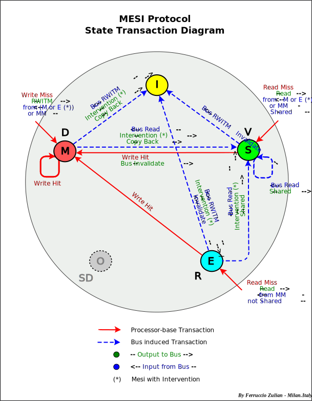
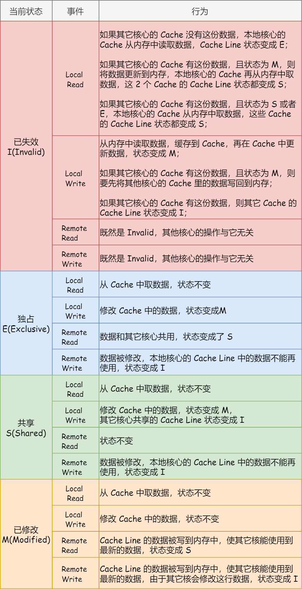

# MESI 协议

* MESI 协议是一个 cache line 4 种状态的单词的首字母，分别是：
  * Modified（已修改）：私有的脏数据
  * Exclusive（独占）：私有的干净数据
  * Shared（共享）：共享的干净数据
  * Invalidated（已失效）
* CPU load 缺失后初始进入的要么是 *独占（E）* 状态，要么是 *共享（S）* 状态
  * load 缺失会引发一次总线事务，确定状态该是 E 还是 S
* 对 S 状态的 cache line 写，需要先发出一次总线事务，使其他处理器上的副本无效（变成 I）
* 本 CPU *已修改（M）* 的 cache line 被其他 CPU 读到时，会将 cache line 的数据写到内存，使其他 CPU 也能看到最新的数据，状态也随之变为 *共享（S）*。其他 CPU 如果接着再写，就会使本 CPU 的 cache line 变为 invalidated；写完后其他 CPU 的 cache line 状态变为 modified（而不是 exclusive，因为还没有同步到内存）。
* 由此可见，*load 缺失* 和 *写 S 状态* 的开销相对比较大

* cache 颠簸问题：两个无关的全局数据在同一个 cache line，分别对它们写会照成不停地互相 *使无效*，该现象为伪共享（false sharing），例子见 [example/c/false-sharing.c](https://github.com/freelancer-leon/example/blob/master/c/false-sharing.c)

## References

* [wiki - Cache coherency protocols (examples)](https://en.wikipedia.org/wiki/Cache_coherency_protocols_(examples))
