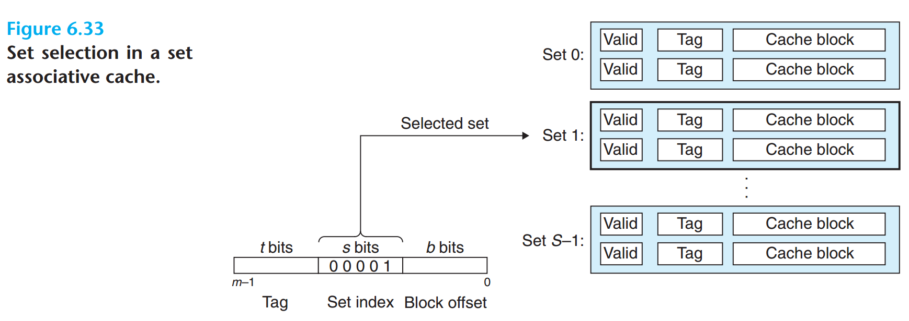
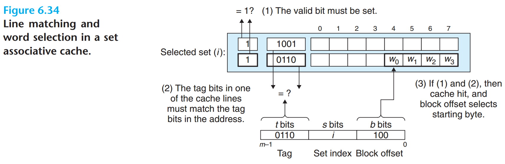

# Cache

## Cache的通用结构


* `m`位（虚拟或物理）地址
  * `s`位作为 *组索引（Set index）*
  * `b`位作为 *块偏移（Block offset）*
  * 剩下的`t = m-(b+s)`位作为 *标记（tag）*
* **抖动（thrash）** 高速缓存反复地加载和驱逐高速缓存块相同的组

## Cache的几种结构

### 直接映射高速缓存


* 直接映射高速缓存（direct-mapped cache）每组只有一行

### 组相联高速缓存




* 组相联高速缓存（set associative cache）每组有多个高速缓存行
* 组中的任何一行都可以包含任何映射到这个组的存储块
  * 所以，在组内搜索时必须并行搜索组中的每一行，而不是逐行依次匹配
  * 寻找一个有效的行，其标记与地址中的标记相匹配

#### 组相联高速缓存不命中时的行替换

* 随机选择策略
* **最不常使用（least-frequently-used, LFU）** 策略
  * 替换在过去某个时间窗口内引用次数最少的那一行
* **最近最少使用（leaset-recently-used，LRU）** 策略
  * 最后一次访问时间最久远的那一行

### 全相联高速缓存


* 全相联高速缓存（fully associative cache）所有的高速缓存行组成一个组
* 因为高速缓存电路必须并行地搜索许多相匹配的行，构造一个又大又快的相联的高速缓存很困难，而且很昂贵。因此，全相联高速缓存只适合做小的高速缓存，如 TLB

## 写策略

* **write policy** or **update policy**
* 表明数据是如何保存到高速缓存和主存的
* 大多数情况下，直写高速缓存都是非写分配的，写回高速缓存是写分配的

### 写命中

* 写命中（write hit）CPU 写一个已经缓存了的字
* **直写（write-through）** 来自 CPU 的数据既会写入高速缓存也会写入主存
  * 优点：主存始终保持在“最新”状态，与 cache 保持一致
  * 缺点：每条存储指令都会引起总线上的一个写事务，有可能会降低系统速度
* **写回（write-back）** 尽可能地推迟主存的更新，只有当替换算法要驱逐已更新的块时，才把它写到主存
  * 优点：显著地减少总线事务的数量
  * 缺点：增加复杂性，主存和高速缓存的数据有可能不一致。为了重获一致性，往往需要操作系统的介入
  * 必须为每个高速缓存行维护一个额外的 **修改位（dirty bit）**，表明这个高速缓存块是否被修改过

### 写不命中

* **写分配（write allocate）** 当要写入的字不在高速缓存中时，加载相应存储块到高速缓存中，然后更新这个高速缓存块
  * 优点：利用时间局部性和空间局部性
  * 缺点：每次不命中都会导致一个块从主存传送到高速缓存
* **非写分配（non-write allocate）** 不命中时，避开高速缓存，直接把这个字写到主存中，而高速缓存的内容不变

## 高速缓存参数的性能影响

* **不命中率（miss rate）** 不命中数量/引用数量
* **命中率（hit rate）** 1-不命中率
* **命中时间（hit time）** 从高速缓存传送一个字到 CPU 所需的时间，包括组选择、行确认和字选择的时间
* **不命中处罚（miss penalty）** 由于不命中所需要的额外时间。需要从下一级缓存中得到服务的处罚

### 高速缓存大小的影响

* 较大的缓存可能会提高命中率
* 使大存储器运行的更快总是要难一些的，结果，较大的高速缓存可能会增加命中时间

### 块大小的影响

* 较大的块能利用程序中可能存在的空间局部性，帮助提高命中率
* 对于给定的高速缓存大小，块越大意味着高速缓存行数越少，这会损害时间局部性比空间局部性更好的程序的命中率
* 较大的块对不命中处罚也有负面影响，因为块越大，传送时间就越长

### 相联度的影响

* 组中的行较多，降低了高速缓存由于冲突不命中出现抖动的可能性
* 较高的相联度的缺点
  * 会造成较高的成本。实现起来很昂贵，且很难使之速度变快
  * 每一行需要更多的标记位
  * 每一行需要额外的 LRU 状态位和额外的控制逻辑
  * 增加命中时间，因为复杂度增加了
* 相联度的选择最终变成了命中时间和不命中处罚之间的折中

### 写策略的影响

* 直写高速缓存比较容易实现
* 写回高速缓存引起的传送比较少，因此允许更多的到存储器的带宽用于执行 DMA 的 I/O 设备
* 层次结构越往下走，传送时间增加，减少传送的数量就变得更加重要
* 一般而言，高速缓存越往下层，越可能使用写回而不是回写

## 虚拟高速缓存

### 歧义（ambiguity）

### 别名（alias）

## 物理高速缓存

## 硬件高速缓存一致性

* 硬件高速缓存一致性不需要由软件显示地进行冲洗，就能保持 MP 系统上 cache 和主存储器间的数据一致性
* 因为总线上使用的物理地址，所以只有物理索引的 cache 才能使用硬件一致性机制
* **监听协议（snooping protocol）**：用在基于总线的系统上的协议，因为每个 cache 都要监视或者监听其他 cache 的总线活动
* 监听协议分为两大类
  * **写-使无效（write-invalidate）**:在一个处理器修改了已经由其他处理处理器高速缓存的数据时，向系统内的所有其他高速缓存广播一则 *使无效* 消息
  * **写-更新（write-update）**：在一个处理器修改数据的时候广播它的新值，以便系统内的所有其他 cache 正好缓存了受影响的行，就可以更新它们的值
* 在 MESI 协议中，每个 cache Line（x86 中是 64 bytes）都有 **MESI** 四种状态，cache line 实际上是加了几个 bits 来表示这些状态
* 在 Intel CPU 中引入 HA 和 CA 来管理这些状态以及同步各个 cache line 的副本
  * **Home Agent（HA）**，连接到 *内存控制器端*，
    * 持续跟踪 cache line 所有权
    * 从其他 CA 或内存中获取 cache line 数据
  * **Cache Agent（CA）**，连接到 *L3 Cache 端*，cache misses 的时候为 cache line 数据制作请求发送给 HA
* 他们都在 ring bus 上监听和发送 snoop 消息，这种模型叫做 **Bus snooping 模型**，与之相对的还有 **Directory 模型**
* Snoop 消息会在 QPI 总线上广播，会造成很大的带宽消耗，为了减小这种带宽消耗，如何 snoop 有很多讲究
* 在 [quick-path-interconnect-introduction-paper.pdf](https://www.intel.ca/content/dam/doc/white-paper/quick-path-interconnect-introduction-paper.pdf) 里面有介绍 Intel 的两种 snoop 的方式：Home Snoop 和 Source Snoop，它们的主要区别在于谁主导 snoop 消息的发送:
  * HA 主导叫做 **Home Snoop**
  * CA 主导叫做 **Source Snoop**


* Hashing scheme 映射物理地址到 LLC 分片（last-level cache slice）上，避免某个分片成为热点
* LLC 分片的数目和一个 CPU 里的 core 的数目一致
* 每个 LLC 分片和一个 core 共享一个 CBox
* CBox 实现 cache 一致性引擎，所以 CBox 作为它的 LLC 分片的 QPI cache agent

## Cache 的行为控制
* Intel 处理器的 cache 行为主要由
  * **内存类型范围寄存器（Memory Type Range Register，MTRR）** 和 **页属性表（Page Atrribute Table，PAT）** 配置
  * 控制寄存器 **Control Register 0（CR0）** 的 *Cache Disable（CD）* 和 *Not-Write through（NW）* 位
  * 页表条目中的同等位，即 *Page-level Cache Disable（PCD）* 和 *Page-level Write-Through（PWT）* 位
* PAT 意图是允许操作系统或 hypervisor 可以调整由计算机的固件在 MTRR 中指定的 cache 行为
  * PAT 有 8 个条目来指定 cache 的行为，它的实体存储在一个 MSR 里
  * 每个页表条目包含 3 bit 的索引，指向一个 PAT 条目，所以系统软件通过控制页表可以用一个非常细的粒度来指定 cache 的行为

## 查询 Cache 的信息
### x86 平台
* 在 x86 平台上可以用 `CPUID - 0x4` 来查询 cache 的信息
* 当 `CPUID` 执行时，`EAX` 设置为 `0x04`，`ECX` 包含索引值，处理器将返回编码数据，该数据描述一组确定性 cache 参数（针对与 `ECX` 中的输入关联的 cache 级别）。有效索引值从 `0` 开始。
* 软件可以从索引值 `0` 开始枚举 cache 层次结构中每个级别的确定性 cache 参数，直到参数报告与缓存类型字段关联的值为 `0`。
* cache 大小（以字节为单位）的计算公式为：
  ```c
  = (Ways + 1) * (Partitions + 1) * (Line_Size + 1) * (Sets + 1)
  = (EBX[31:22] + 1) * (EBX[21:12] + 1) * (EBX[11:0] + 1) * (ECX + 1)
  ```
  * `cpuid` 工具的返回结果会帮助 `+1`
* `CPUID - 0x4` 还报告可用于导出物理封装中处理器核心拓扑的数据。
  * 此信息对于所有有效索引值都是恒定的。
  * 软件可以通过执行 `EAX=0x4` 和 `ECX=0` 的 `CPUID` 来查询报告的原始数据，并将其用作 SDM vol.3A 第 9 章“多处理器管理”中描述的拓扑枚举算法的一部分。

#### 示例
* 在一台 2 个 packages，每个 package 64 个 cores，支持超线程的 CPU 的机器上枚举 cache 信息
  * 总共就是 256 个逻辑处理器，128 个物理 cores，2 个 sockets
```sh
# lscpu
...
CPU(s):                  256
  On-line CPU(s) list:   0-255
...
    Thread(s) per core:  2
    Core(s) per socket:  64
    Socket(s):           2
...
Caches (sum of all):
  L1d:                   6 MiB (128 instances)
  L1i:                   4 MiB (128 instances)
  L2:                    256 MiB (128 instances)
  L3:                    640 MiB (2 instances)
...
# lscpu -C
NAME ONE-SIZE ALL-SIZE WAYS TYPE        LEVEL   SETS PHY-LINE COHERENCY-SIZE
L1d       48K       6M   12 Data            1     64        1             64
L1i       32K       4M    8 Instruction     1     64        1             64
L2         2M     256M   16 Unified         2   2048        1             64
L3       320M     640M   20 Unified         3 262144        1             64
```

##### L1 dCache 为 `48KB`
* 枚举的索引值 `ECX = 0`
```sh
# cpuid -1 -l 0x4 -s 0
CPU:
   deterministic cache parameters (4):
      --- cache 0 ---
      cache type                         = data cache (1) # cache 类型是数据 cache
      cache level                        = 0x1 (1)        # L1 cache
      self-initializing cache level      = true           # 自初始化 cache 级别（不需要 SW 初始化）
      fully associative cache            = false          # 不是全相联
      maximum IDs for CPUs sharing cache = 0x1 (1)        # 共享此缓存的逻辑处理器的最大可寻址 ID 数量（2 threads/core）
      maximum IDs for cores in pkg       = 0x3f (63)      # 物理处理器核心的最大可寻址 ID 数量（64 cores/pkg）
      system coherency line size         = 0x40 (64)      # 一条 cache line 的大小是 64 Bytes
      physical line partitions           = 0x1 (1)        # cache line 的分区是 1
      ways of associativity              = 0xc (12)       # 12 路（way）
      number of sets                     = 0x40 (64)      # 64 组（set）
      WBINVD/INVD acts on lower caches   = false          # 共享此 cache 的线程的 WBINVD/INVD 作用于共享此 cache 的线程的低级 cache
      inclusive to lower caches          = false          # cache 不包括较低级别的 cache
      complex cache indexing             = false          # 直接映射 cache
      number of sets (s)                 = 64
      (size synth)                       = 49152 (48 KB)
```
* 那么 L1 数据 cache 为 `48KB`
  ```c
  L1_dCache_Size = (Ways + 1) * (Partitions + 1) * (Line_Size + 1) * (Sets + 1)
                 = 12 * 1 * 64 * 64 = 49152 ~= 48K
  ```

##### L1 iCache 为 `32KB`
* 枚举的索引值 `ECX = 1`
```sh
# cpuid -1 -l 0x4 -s 1
CPU:
      --- cache 1 ---
      cache type                         = instruction cache (2) # cache 类型是指令 cache
      cache level                        = 0x1 (1)               # L1 cache
      self-initializing cache level      = true                  # 自初始化 cache 级别（不需要 SW 初始化）
      fully associative cache            = false                 # 不是全相联
      maximum IDs for CPUs sharing cache = 0x1 (1)               # 共享此缓存的逻辑处理器的最大可寻址 ID 数量（2 threads/core）
      maximum IDs for cores in pkg       = 0x3f (63)             # 物理处理器核心的最大可寻址 ID 数量（64 cores/pkg）
      system coherency line size         = 0x40 (64)             # 一条 cache line 的大小是 64 Bytes
      physical line partitions           = 0x1 (1)               # cache line 的分区是 1
      ways of associativity              = 0x8 (8)               # 8 路（way）
      number of sets                     = 0x40 (64)             # 64 组（set）
      WBINVD/INVD acts on lower caches   = false                 # 共享此 cache 的线程的 WBINVD/INVD 作用于共享此 cache 的线程的低级 cache
      inclusive to lower caches          = false                 # cache 不包括较低级别的 cache
      complex cache indexing             = false                 # 直接映射 cache
      number of sets (s)                 = 64
      (size synth)                       = 32768 (32 KB)
```
* 那么 L1 指令 cache 为 `32KB`
  ```c
  L1_iCache_Size = (Ways + 1) * (Partitions + 1) * (Line_Size + 1) * (Sets + 1)
                 = 8 * 1 * 64 * 64 = 32768 ~= 32K
  ```

##### L2 Cache 为 `2048KB`
* L2 cache 为同一 core 上的所有 threads 共享
* 枚举的索引值 `ECX = 2`
```sh
# cpuid -1 -l 0x4 -s 2
CPU:
      --- cache 2 ---
      cache type                         = unified cache (3) # cache 类型是统一 cache
      cache level                        = 0x2 (2)           # L2 cache
      self-initializing cache level      = true              # 自初始化 cache 级别（不需要 SW 初始化）
      fully associative cache            = false             # 不是全相联
      maximum IDs for CPUs sharing cache = 0x1 (1)           # 共享此缓存的逻辑处理器的最大可寻址 ID 数量（2 threads/core）
      maximum IDs for cores in pkg       = 0x3f (63)         # 物理处理器核心的最大可寻址 ID 数量（64 cores/pkg）
      system coherency line size         = 0x40 (64)         # 一条 cache line 的大小是 64 Bytes
      physical line partitions           = 0x1 (1)           # cache line 的分区是 1
      ways of associativity              = 0x10 (16)         # 16 路（way）
      number of sets                     = 0x800 (2048)      # 2048 组（set）
      WBINVD/INVD acts on lower caches   = false             # 同上，不变
      inclusive to lower caches          = false             # 同上，不变
      complex cache indexing             = false             # 同上，不变
      number of sets (s)                 = 2048
      (size synth)                       = 2097152 (2 MB)
```
* 那么 L2 统一 cache 为 `2048KB`
  ```c
  L2_Cache_Size = (Ways + 1) * (Partitions + 1) * (Line_Size + 1) * (Sets + 1)
                 = 16 * 1 * 64 * 2048 = 2097152 ~= 2048K
  ```

##### L3 Cache 为 `320MB`
* L3 cache 为同一 package 上的所有 cores 共享，该 CPU 上的一个 package 上有 64 个 cores，支持超线程，因此 `maximum IDs for CPUs sharing cache` 的值是 `128`
* 枚举的索引值 `ECX = 3`
```sh
# cpuid -1 -l 0x4 -s 3
CPU:
      --- cache 3 ---
      cache type                         = unified cache (3) # cache 类型是统一 cache
      cache level                        = 0x3 (3)           # L3 cache
      self-initializing cache level      = true              # 自初始化 cache 级别（不需要 SW 初始化）
      fully associative cache            = false             # 不是全相联
      maximum IDs for CPUs sharing cache = 0x7f (127)        # 共享此缓存的逻辑处理器的最大可寻址 ID 数量（128 threads/pkg）
      maximum IDs for cores in pkg       = 0x3f (63)         # 物理处理器核心的最大可寻址 ID 数量（64 cores/pkg）
      system coherency line size         = 0x40 (64)         # 一条 cache line 的大小是 64 Bytes
      physical line partitions           = 0x1 (1)           # cache line 的分区是 1
      ways of associativity              = 0x14 (20)         # 20 路（way）
      number of sets                     = 0x40000 (262144)  # 262144 组（set）
      WBINVD/INVD acts on lower caches   = false             # 同上，不变
      inclusive to lower caches          = false             # 同上，不变
      complex cache indexing             = true              # 使用复杂的 function 来索引缓存，可能使用所有地址位
      number of sets (s)                 = 262144
      (size synth)                       = 335544320 (320 MB)
```
* 那么 L3 统一 cache 为 `320MB`
  ```c
  L3_Cache_Size = (Ways + 1) * (Partitions + 1) * (Line_Size + 1) * (Sets + 1)
                 = 20 * 1 * 64 * 262144 = 335544320 ~= 320M
  ```
* L3 cache 通常是最后一级 cache（LLC），再枚举的索引值 `ECX = 4` 返回 `cache type == 0`，没有下一级的 cache 了
```sh
# cpuid -1 -l 0x4 -s 4
CPU:
      --- cache 4 ---
      cache type                         = no more caches (0)
```

## References

- [quick-path-interconnect-introduction-paper.pdf](https://www.intel.ca/content/dam/doc/white-paper/quick-path-interconnect-introduction-paper.pdf)
- [高速缓存与一致性专栏索引](https://zhuanlan.zhihu.com/p/136300660)
- [memory ordering – Gavin's Blog](http://gavinchou.github.io/summary/c++/memory-ordering/)
- https://decodezp.github.io/tags/CPU/