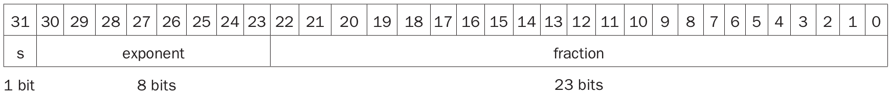
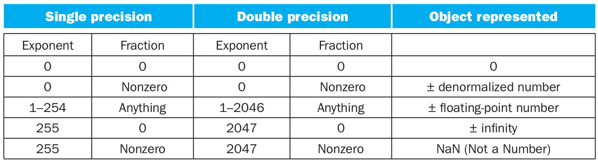

# 浮点数

## 概念
* **科学记数法（scientific notation）**：十进制小数点左边只有一位整数的记数法
  * 0.00000000110 的科学记数法为 1.010 x 10-9
  * 315576000010 的科学记数法为 3.1557610 x 109
* **规格化数（normalized number）**：一个采用科学记数法表示的数，若没有前导零且小数点左边只有一位整数，则称其为规格化数
  * 1.010 x 10-9 为规格化的科学记数
  * 0.110 x 10-8 和 10.010 x 10-10 则不是
* 用科学记数法表示二进制数如 0.12 表示为 1.02 x 2-1
  * 为了使二进制数规格化，需要定义一个基数，这个基数可以用来移位使小数点左边只保留一位非零数。
  * 只有基数 2 才能满足要求，此时的小数点称为为 *二进制小数点（binary point）*
* **浮点数（floating point）**：二进制小数点不固定的表达数的记数法

## 浮点表示
* 由于计算机中字的大小是固定的，浮点数表示的设计者需在精度和表示范围之间权衡
  * 增加小数部分会增加表示精度
  * 增加指数部分会增加表示范围
* **尾数（fraction）**：位于浮点数的尾数字段，其值在 0 和 1 之间
* **指数（exponent）**：位于浮点数的指数字段，表示小数点的位置
* 单精度（single precision）浮点数 32 bit 的位域如下：
  
* 表示为 (-1)s x F x 2E
  * F 为小数域的值
  * E 为指数域的值
* 双精度（double precision）浮点数用 64 bit表示，指数用 11 位，尾数用 52 位

### 隐藏的前导位 1
* 为了将更多的数据位打包到有效位数（significand）部分，IEEE 754 甚至隐藏了二进制数的前导位 1
  * 单精度下，有效位数有 24 位宽（隐含的 1 和 23 位尾数）
  * 双精度下，有效位数有 53 位宽（1 + 52）
* 因为 0 没有前导位 1，它的指数保留为 0，所以硬件就不会将前导位 1 加到尾数上。因此 00...002 代表 0
* 隐藏前导位 1 后，其他的浮点数表示为 **(-1)s x (1 + Fraction) x 2E**

### IEEE 754 浮点数的编码

### 浮点数的符号位和指数位
#### 为什么符号位放在最高位？
* 这样可以快速地测试出小于、大于、等于 0 的情况。
#### 为什么将指数放在有效数前面？
* 可以简化用整数比较指令来处理的浮点数分类，因为在有着相同符号的情况下，指数大的数其值就大。

### 带偏阶的记数法
* 当指数位负时，怎么很好地表示是个问题。如果还采用表示整数时的补码的形式，使负指数的高位为 1，那么会让一个负的指数显得是一个很大的数。
  * 例如，0.12 = 1.02 x 2-1 表示如下：

31|30|29|28|27|26|25|24|23|22|21|20|19|18|17|16|15|14|13|12|11|10|9|8|7|6|5|4|3|2|1|0
---|---|---|---|---|---|---|---|---|---|---|---|---|---|---|---|---|---|---|---|---|---|---|---|---|---|---|---|---|---|---|---|---
0|1|1|1|1|1|1|1|1|0|0|0|0|0|0|0|0|0|0|0|0|0|0|0|0|0|0|0|0|0|0|0|0

* 而 102 = 1.02 x 2+1 看起来似乎是一个比较小的二进制数：

31|30|29|28|27|26|25|24|23|22|21|20|19|18|17|16|15|14|13|12|11|10|9|8|7|6|5|4|3|2|1|0
---|---|---|---|---|---|---|---|---|---|---|---|---|---|---|---|---|---|---|---|---|---|---|---|---|---|---|---|---|---|---|---|---
0|0|0|0|0|0|0|0|1|0|0|0|0|0|0|0|0|0|0|0|0|0|0|0|0|0|0|0|0|0|0|0|0

* 为了将最小的 **负指数** 表示为 00...002，而最大的正指数表示为 11...112，引入 **带偏阶的记数法（biased notation）**
* 浮点数表示为 **(-1)s x (1 + Fraction) x 2Exponent - Bias**
  * **Exponent** 为指数域的值
  * Exponent - Bias = 指数的值
  * 由于 bias 的存在，即便指数是负的，指数域也不会出现用高位为零来表示负数的情况
  * bias 的取值需将指数位所能表示的数一分为二，一半用来表示正数，另一半来表示负数
* IEEE 754 规定单精度的偏阶（bias）为 127
  * 当指数为 -1 时，Exponent - Bias = 12610 - 12710 = -110，因此指数域的值为 12610 = 0111 11102
  * 当指数为 +1 时，Exponent - Bias = 12810 - 12710 = 110，因此指数域的值为 12810 = 1000 00002
* 双精度的偏阶（bias）为 1023
* 回忆上面 IEEE 754 浮点数的编码表，单精度浮点数指数的取值范围是 1~254，单精度数的表示范围为
  * +- 1.000 000 000 000 000 000 000 002 x 2 -126，小于 2.010 x 10 -38
  * +- 1.111 111 111 111 111 111 111 112 x 2 +127，大于 2.010 x 10 38
## 算术精确性
* 整数可以精确表示在最大数和最小数之间的所有数
* 浮点数通常（并不是绝对）是一个无法表示的数的近似。原因是，假定在 0 和 1 之间，实数就有无穷多个，而即便是双精度，最多也就可以精确表示 253 个。
