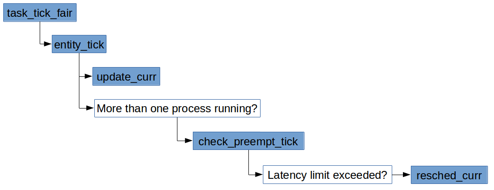

# 完全公平调度(Completely Fair Scheduler)
***

# 目录

- [CFS数据结构](#cfs数据结构)
	- [CFS调度实体 sched_entity](#cfs调度实体-schedentity)
	- [CFS调度运行队列 cfs_rq](#cfs调度运行队列-cfsrq)
	- [CFS调度器类fair_sched_class](#cfs调度器类fairschedclass)
- [创建进程](#创建进程)
	- [关联新进程与调度器](#关联新进程与调度器)
	- [新进程进入队列](#新进程进入队列)
	- [新进程能否抢占当前进程](#新进程能否抢占当前进程)
- [周期性调度](#周期性调度)
	- [周期性抢占检查check_preempt_tick](#周期性抢占检查check_preempt_tick)
- [进程唤醒](#进程唤醒)
- [选择下一个进程](#选择下一个进程)
	- [CFS的pick_next_task实现](#CFS的pick_next_task实现)
- [CFS调试接口](#CFS调试接口)
- [参考资料](#参考资料)


# CFS数据结构


## CFS调度实体 sched_entity
* include/linux/sched.h::sched_entity
```c
struct sched_entity {
    struct load_weight  load;       /*for load-balancing*/
    struct rb_node      run_node;
    struct list_head    group_node;
    unsigned int        on_rq;

    u64         exec_start;
    u64         sum_exec_runtime;
    u64         vruntime;
    u64         prev_sum_exec_runtime;
    ...
};
```
* `load` 权重，决定了各个实体占队列总负荷的比例。虚拟时钟的速度最终依赖于权重。
* `run_node` 树节点，将实体与红黑树关联起来，完成树相关的操作。
* `on_rq` 表示该实体是否在运行队列上接受调度。
	* 注意，当前正在运行的进程虽然不再红黑树上，但`on_rq`也为**1**。
* `exec_start` 主要在`update_curr()`时用当前时间减去`exec_start`得到`delta_exec`，并更新为当前时间。
* `sum_exec_runtime` 累计消耗的CPU时间，在`update_curr()`时会把`delta_exec`累加到`sum_exec_runtime`。检查能否抢占时需要用到该值。
* `vruntime` 记录进程执行期间虚拟时钟上流逝的时间。
* `prev_sum_exec_runtime` 进程上一次被撤销CPU时的累计运行时间。
	* 当进程被选中为下一次被调度的进程时，将`sum_exec_runtime`保存到`prev_sum_exec_runtime`。
	* 此后，在进程抢占时`sum_exec_runtime - prev_sum_exec_runtime`就是进程在CPU上执行花费的实际时间。
	* 注意，`sum_exec_runtime`并不会被重置，而是持续单调增长。

## CFS调度运行队列 cfs_rq
* kernel/sched/sched.h::cfs_rq
```c
/* CFS-related fields in a runqueue */
struct cfs_rq {
    struct load_weight load;
    unsigned int nr_running, h_nr_running;
    ...
    u64 min_vruntime;

    struct rb_root tasks_timeline;
    struct rb_node *rb_leftmost;

    /*   
     * 'curr' points to currently running entity on this cfs_rq.
     * It is set to NULL otherwise (i.e when none are currently running).
     */
    struct sched_entity *curr, *next, *last, *skip;
    ...
};
```
* `load` 该队列上的进程的累计权重。
* `nr_running` 队列上可运行进程的数目。
* `min_vruntime` 跟踪记录队列上所有进程的*最小虚拟运行时间*。
* `tasks_timeline` 红黑树的root节点。
* `rb_leftmost` 总设置为树的最左边的结点，即最需要被调度的进程。为减少搜索树花费时间的优化措施。
* `curr` 当前执行进程的可调度实体。
* `next` 指向下一个被调度的实体。
* `last` 指向最近被调度出去的实体。
* `skip` 指向调度时需要跳过的实体。

## CFS调度器类fair_sched_class
* kernel/sched/fair.c
```c
/*
 * All the scheduling class methods:
 */
const struct sched_class fair_sched_class = {
    .next           = &idle_sched_class,
    .enqueue_task       = enqueue_task_fair,
    .dequeue_task       = dequeue_task_fair,
    .yield_task     = yield_task_fair,
    .yield_to_task      = yield_to_task_fair,

    .check_preempt_curr = check_preempt_wakeup,

    .pick_next_task     = pick_next_task_fair,
    .put_prev_task      = put_prev_task_fair,

#ifdef CONFIG_SMP
    .select_task_rq     = select_task_rq_fair,
    .migrate_task_rq    = migrate_task_rq_fair,

    .rq_online      = rq_online_fair,
    .rq_offline     = rq_offline_fair,

    .task_waking        = task_waking_fair,
    .task_dead      = task_dead_fair,
    .set_cpus_allowed   = set_cpus_allowed_common,
#endif

    .set_curr_task          = set_curr_task_fair,
    .task_tick      = task_tick_fair,
    .task_fork      = task_fork_fair,

    .prio_changed       = prio_changed_fair,
    .switched_from      = switched_from_fair,
    .switched_to        = switched_to_fair,

    .get_rr_interval    = get_rr_interval_fair,

    .update_curr        = update_curr_fair,

#ifdef CONFIG_FAIR_GROUP_SCHED
    .task_move_group    = task_move_group_fair,
#endif
};
```

# 创建进程
* 核心调度器委托给 CFS 三个工作
	1. `task_fork`
	2. `enqueue_task`
	3. `check_preempt_curr`

## 关联新进程与调度器


* kernel/sched/fair.c::task_fork_fair
```c
/*
 * called on fork with the child task as argument from the parent's context
 *  - child not yet on the tasklist
 *  - preemption disabled
 */
static void task_fork_fair(struct task_struct *p)
{   
    struct cfs_rq *cfs_rq;
    struct sched_entity *se = &p->se, *curr;
    int this_cpu = smp_processor_id();
    struct rq *rq = this_rq();
    unsigned long flags;

    raw_spin_lock_irqsave(&rq->lock, flags);
    /*更新运行队列的时钟，这个值会在后面update_curr()用到*/
    update_rq_clock(rq);

    cfs_rq = task_cfs_rq(current);
    curr = cfs_rq->curr;

    /*  
     * Not only the cpu but also the task_group of the parent might have
     * been changed after parent->se.parent,cfs_rq were copied to
     * child->se.parent,cfs_rq. So call __set_task_cpu() to make those
     * of child point to valid ones.
     */
    rcu_read_lock();
    __set_task_cpu(p, this_cpu);
    rcu_read_unlock();
    /*更新当前进程的vruntime，该函数还会顺带更新当前队列的min_vruntime__*/
    update_curr(cfs_rq);
    /* 如果当前进程所在队列不为空，将所在队列当前进程的`vruntime`作为新进程`vruntime`的基础 */
    if (curr)
        se->vruntime = curr->vruntime;
    place_entity(cfs_rq, se, 1); /* 设置新进程的vruntime值, 1表示是新进程 */
    /* sysctl_sched_child_runs_first值表示是否设置了让子进程先运行 */
    if (sysctl_sched_child_runs_first && curr && entity_before(curr, se)) {
        /*
         * Upon rescheduling, sched_class::put_prev_task() will place
         * 'current' within the tree based on its new key value.
         */
        swap(curr->vruntime, se->vruntime); /*当子进程的vruntime值大于父进程的vruntime时, 交换两个进程的vruntime值*/
        resched_curr(rq); /*设置重新调度标志TIF_NEED_RESCHED*/
    }
    /* 为什么这里又要减cfs_rq->min_vruntime？
		 * 因为新进程有可能会在别的CPU上被运行，然而每个CPU的运行队列的min_vruntime是不同的。
     * 因此这里存的是已算出的vruntime与当前运行队列min_vruntime的差值。
     * 当该调度实体在加入其他运行队列时，需要再加上要加入队列的min_vruntime
		 * (可查看enqueue_entity()函数)。
		 * 同样，在进程从队列出来的时候(dequeue_entity())也需要类似的操作。
		 */
    se->vruntime -= cfs_rq->min_vruntime;

    raw_spin_unlock_irqrestore(&rq->lock, flags);
}
```
* `sysctl_sched_child_runs_first`的值可以通过`/proc/sys/kernel/sched_child_runs_first`修改，让子进程在`fork`之后总在父进程之前运行。
* **进程离开队列时，`vruntime`存的是与离开的队列`min_vruntime`的差值**，记住这点对于理解`vruntime`的计算很重要。

### 更新当前进程的时间
* 在`task_fork_fair()`函数中我们首次看到了`update_curr()`函数，这是个很重要的函数，所有与虚拟时钟相关的计算都在这个函数中执行。


* 调度实体的`exec_start`，`sum_exec_runtime`和`vruntime`都会在`update_curr()`中更新。
	* kernel/sched/fair.c::update_curr
```c
/*
 * Update the current task's runtime statistics.
 */
static void update_curr(struct cfs_rq *cfs_rq)
{
    struct sched_entity *curr = cfs_rq->curr;
		/*获取所在队列的时钟，该值刚在task_fork_fair调用update_rq_clock更新过*/
    u64 now = rq_clock_task(rq_of(cfs_rq));
    u64 delta_exec;
		/* 如果当前队列上没有进程在运行，什么都不做 */
    if (unlikely(!curr))
        return;
		/* exec_start记录的是上一次调用update_curr()的时间，我们用当前时间减去exec_start  
		 * 就得到了从上次计算vruntime到现在进程又运行的实际时间。
		 */
    delta_exec = now - curr->exec_start;
    if (unlikely((s64)delta_exec <= 0))
        return;
    /* 实际流逝的时间计算完了，更新exec_start以备下次使用 */
    curr->exec_start = now;

    ...
		/* sum_exec_runtime是进程累计使用的CPU时间，因此是物理时间。在此处更新*/
    curr->sum_exec_runtime += delta_exec;
    ...
    /* vruntime是进程累计使用的虚拟时间，需要将exec_start经过加权运算后得到 */
    curr->vruntime += calc_delta_fair(delta_exec, curr);
		/*因为有进程的vruntime变了，因此该队列的min_vruntime可能也发生了变化，更新它*/
    update_min_vruntime(cfs_rq);
    ...
}
```

#### 计算虚拟运行时间增量calc_delta_fair
* 函数`calc_delta_fair()`根据传入的物理时间增量以及进程的权重计算虚拟时间的增量
* 计算公式之前讨论过，计算的细节`__calc_delta()`后面在专门讨论
  * kernel/sched/fair.c
```c
/*
 * delta /= w
 */
static inline u64 calc_delta_fair(u64 delta, struct sched_entity *se)
{
    if (unlikely(se->load.weight != NICE_0_LOAD))
        delta = __calc_delta(delta, NICE_0_LOAD, &se->load);

    return delta;
}
```
* 根据CFS的设计，`nice`为**0**的进程的权重为`NICE_0_LOAD`，此时物理时间和虚拟时间是相等的。

#### 更新CFS运行队列的min_vruntime
* `update_min_vruntime`函数通常要从**当前进程**与**运行队列里的进程**中选出**最小**的`vruntime`作为CFS运行队列的`min_vruntime`
  * kernel/sched/fair.c
```c
static void update_min_vruntime(struct cfs_rq *cfs_rq)
{
    u64 vruntime = cfs_rq->min_vruntime;

    if (cfs_rq->curr)
        vruntime = cfs_rq->curr->vruntime;

    /* 如果红黑树上有进程在等待调度 */
    if (cfs_rq->rb_leftmost) {
        struct sched_entity *se = rb_entry(cfs_rq->rb_leftmost,
                           struct sched_entity,
                           run_node);

        if (!cfs_rq->curr)/*如果当前并没有进程在运行，则用树上最左结点的vruntime*/
            vruntime = se->vruntime;
        else              /*否则从当前运行进程与树的最左结点调度实体中选最小的vruntime*/
            vruntime = min_vruntime(vruntime, se->vruntime);
    }    
    /* 如果运行队列上没有进程，则用当前进程的vruntime */

    /* ensure we never gain time by being placed backwards. */
    /* 时间不能出现回退的现象，所以这里要选出最大值。
     * 也就是说，每个队列所记录的min_vruntime只有被超出时才能更新。
     */
    cfs_rq->min_vruntime = max_vruntime(cfs_rq->min_vruntime, vruntime);
    ...
}
```
* 设置运行队列的`min_vruntime`必须保证该值的**单调递增**。

### 创建新进程时的place_entity()
* `task_fork_fair()`是这么调用`place_entity()`的
  * kernel/sched/fair.c
```c
  if (curr)
      se->vruntime = curr->vruntime;
  place_entity(cfs_rq, se, 1);
```

* `place_entity()`函数我们在此只关心`initial = 1`的部分。
  * kernel/sched/fair.c
```c
static void
place_entity(struct cfs_rq *cfs_rq, struct sched_entity *se, int initial)
{
    u64 vruntime = cfs_rq->min_vruntime;

    /*   
     * The 'current' period is already promised to the current tasks,
     * however the extra weight of the new task will slow them down a
     * little, place the new task so that it fits in the slot that
     * stays open at the end.
     */
    if (initial && sched_feat(START_DEBIT))
        vruntime += sched_vslice(cfs_rq, se);
    ...
    /* ensure we never gain time by being placed backwards. */
		/*此处表明, 对于新进程而言, 新进程的vruntime值是大于等于父进程vruntime值的。
		  所以后面如果没有设置子进程先运行, 则只要父进程本次调度运行的实际时间没有超过
			调度周期分配的实际时间值, 父进程就会先运行, 否则, 父子进程的先后执行顺序不确定。*/
    se->vruntime = max_vruntime(se->vruntime, vruntime);
}
```
* 新进程的初始`vruntime`值就以它所在运行队列的`min_vruntime`以及父进程的`vruntime`为基础来设置，与旧进程保持在合理的差距范围内。

* `sched_features`是控制调度器特性的开关，每个bit表示调度器的一个特性。在`kernel/sched/features.h`文件中记录了全部的特性。见《Professional Linux Kernel Architecture》
> Note that the real kernel sources will execute portions of the code depending on outcomes of sched_feature queries. The CF
scheduler supports some ‘‘configurable’’ features, but they can only be turned on and off in debugging mode — otherwise, the set
of features is fixed.

* `START_DEBIT`是其中之一，如果打开这个特性，表示给新进程的`vruntime`初始值要设置得比默认值更大一些，这样会推迟它的运行时间，**以防进程通过不停的fork来获得CPU**。
  * kernel/sched/features.h
```c
/*
 * Place new tasks ahead so that they do not starve already running
 * tasks
 */
SCHED_FEAT(START_DEBIT, true)
```

* `sched_vslice()`用于计算将要插入队列的进程的**虚拟时间片**，仅在`place_entity()`被调用。
  * kernel/sched/fair.c::sched_vslice()
```c
/*
 * We calculate the vruntime slice of a to-be-inserted task.
 *
 * vs = s/w
 */
static u64 sched_vslice(struct cfs_rq *cfs_rq, struct sched_entity *se)
{
    return calc_delta_fair(sched_slice(cfs_rq, se), se);
}
```
* 如果`START_DEBIT`位被设置，则通过加上一个调度周期内的虚拟时间片将新进程推后执行。
* 否则新进程与父进程的`vruntime`一致，如果`sysctl_sched_child_runs_first`参数没有设成**1**，子进程与父进程谁先被执行还不确定。

## 新进程进入队列


### 创建新进程时的enqueue_entity
* `enqueue_task_fair()`完成核心调度器委托的将进程加入运行队列的工作
* 创建新进程时，核心调度器在函数`wake_up_new_task()`里调用`activate_task()`时，hard-coded了`flags`为**0**，所以此时参数`flags`的值为**0**
* kernel/sched/fair.c
```c
static void
enqueue_entity(struct cfs_rq *cfs_rq, struct sched_entity *se, int flags)
{
    /*   
     * Update the normalized vruntime before updating min_vruntime
     * through calling update_curr().
     */
		/* 此处将task_fork_fair()最后减去cfs_rq->min_vruntime补回来，
		 * 因为调度实体最后在哪个队列被执行并不一定，所以出队的时候vruntime里存的时差值。
		 */
    if (!(flags & ENQUEUE_WAKEUP) || (flags & ENQUEUE_WAKING))
        se->vruntime += cfs_rq->min_vruntime;

    /*   
     * Update run-time statistics of the 'current'.
     */
    update_curr(cfs_rq);
    ...
    /* 创建新进程时，之前已经place_entity了，因此这里无需在此place_entity */
    if (flags & ENQUEUE_WAKEUP) {
        place_entity(cfs_rq, se, 0);
        ...
    }    
    ...
		/* 进程如果恰好时队列的当前进程，无需再次入队；
		 * 否则新进程加入红黑树，并且on_rq标志置为 1。
		 */
    if (se != cfs_rq->curr)
        __enqueue_entity(cfs_rq, se);
    se->on_rq = 1;
    ...
}
```

## 新进程能否抢占当前进程
* `check_preempt_wakeup()`函数在新进程和唤醒两个情景都会用到，用于检查新进程/唤醒进程能否抢占当前进程
	* kernel/sched/fair.c
```c
/*
 * Preempt the current task with a newly woken task if needed:
 */
static void check_preempt_wakeup(struct rq *rq, struct task_struct *p, int wake_flags)
{
    struct task_struct *curr = rq->curr;
    struct sched_entity *se = &curr->se, *pse = &p->se;
    struct cfs_rq *cfs_rq = task_cfs_rq(curr);
    int scale = cfs_rq->nr_running >= sched_nr_latency;
    int next_buddy_marked = 0;
    /* 当前进程就是新进程，无需重新调度 */
    if (unlikely(se == pse))
        return;
...
    /* 设置sched_feat(NEXT_BUDDY)标志倾向于优先调度新唤醒的进程；
		   在fork场景，核心调度器调用check_preempt_curr()时wake_flags为WF_FORK。
		 */
    if (sched_feat(NEXT_BUDDY) && scale && !(wake_flags & WF_FORK)) {
        set_next_buddy(pse);
        next_buddy_marked = 1;
    }

    /*
     * We can come here with TIF_NEED_RESCHED already set from new task
     * wake up path.
     *
     * Note: this also catches the edge-case of curr being in a throttled
     * group (e.g. via set_curr_task), since update_curr() (in the
     * enqueue of curr) will have resulted in resched being set.  This
     * prevents us from potentially nominating it as a false LAST_BUDDY
     * below.
     */
		/* 新任务唤醒抢占路径上设置过TIF_NEED_RESCHED标志，无需下面的检查 */
    if (test_tsk_need_resched(curr))
        return;

    /* Idle tasks are by definition preempted by non-idle tasks. */
		/* 毫无疑问，idle tasks会被非idel tasks进程抢占 */
    if (unlikely(curr->policy == SCHED_IDLE) &&
        likely(p->policy != SCHED_IDLE))
        goto preempt;

    /*
     * Batch and idle tasks do not preempt non-idle tasks (their preemption
     * is driven by the tick):
     */
		/* 批处理和idle tasks无法抢占非idle tasks，直接返回；
       唤醒抢占标志sched_feat(WAKEUP_PREEMPTION)没有开启，也会直接返回
		 */
    if (unlikely(p->policy != SCHED_NORMAL) || !sched_feat(WAKEUP_PREEMPTION))
        return;
    /* 这里涉及到组调度，力求se和pse在相同的队列深度下进行比较 */
    find_matching_se(&se, &pse);
		/* 更新当前队列虚拟时间 */
    update_curr(cfs_rq_of(se));
    BUG_ON(!pse);
		/* 新进程能否抢占当前进程 */
    if (wakeup_preempt_entity(se, pse) == 1) {
        /*
         * Bias pick_next to pick the sched entity that is
         * triggering this preemption.
         */
        if (!next_buddy_marked)
            set_next_buddy(pse);
        goto preempt;
    }

    return;

preempt:
    resched_curr(rq);
    /*
     * Only set the backward buddy when the current task is still
     * on the rq. This can happen when a wakeup gets interleaved
     * with schedule on the ->pre_schedule() or idle_balance()
     * point, either of which can * drop the rq lock.
     *
     * Also, during early boot the idle thread is in the fair class,
     * for obvious reasons its a bad idea to schedule back to it.
     */
    if (unlikely(!se->on_rq || curr == rq->idle))
        return;
    /*设置sched_feat(LAST_BUDDY)标志倾向于优先调度被抢占的进程，所以这里参数是se*/
    if (sched_feat(LAST_BUDDY) && scale && entity_is_task(se))
        set_last_buddy(se);
}
```
* 这里只是检查，且没有返回值，如需调度则设置`TIF_NEED_RESCHED`标志，等待合适的时机发生抢占。
* `sched_feat(NEXT_BUDDY)`和`sched_feat(LAST_BUDDY)`只是一种倾向，是否能真的被调度还要在`pick_next_entity`阶段在做决定。

### wakeup_preempt_entity
* `wakeup_preempt_entity()`做最后的检查
	* kernel/sched/fair.c
```c
/*
 * Should 'se' preempt 'curr'.
 *
 *             |s1
 *        |s2
 *   |s3
 *         g
 *      |<--->|c
 *
 *  w(c, s1) = -1
 *  w(c, s2) =  0
 *  w(c, s3) =  1
 *
 */
static int
wakeup_preempt_entity(struct sched_entity *curr, struct sched_entity *se)
{
    s64 gran, vdiff = curr->vruntime - se->vruntime;

    if (vdiff <= 0)
        return -1;

    gran = wakeup_gran(curr, se);
    if (vdiff > gran)
        return 1;

    return 0;
}
```
* 当`wakeup_preempt_entity()`返回**1**时，`check_preempt_wakeup()`会设置`TIF_NEED_RESCHED`标志允许新进程抢占当前进程。
* 注释中的s1,s2,s3是新进程/调度实体的三种情况，横座标轴为`vruntime`。
* 为了让进程切换不会过于频繁，这里不会因为新进程的`vruntime`较小就立即切换，而是“缓冲”一下，与`wakeup_gran()`计算结果进行比较后再决定。

### 唤醒时粒度的计算wakeup_gran
* `wakeup_gran()`函数用于计算根据`sysctl_sched_wakeup_granularity`和**新进程的权重**转换得到的虚拟时间。
	* 该变量可以通过`sysctl`来调整
```
>sysctl kernel.sched_wakeup_granularity_ns
kernel.sched_wakeup_granularity_ns = 4000000
```
* CFS最初的实现并没有该函数，而是直接跟`sysctl_sched_wakeup_granularity`比较。
	* kernel/sched/fair.c
```c
static unsigned long
wakeup_gran(struct sched_entity *curr, struct sched_entity *se)
{
    unsigned long gran = sysctl_sched_wakeup_granularity;

    /*
     * Since its curr running now, convert the gran from real-time
     * to virtual-time in his units.
     *
     * By using 'se' instead of 'curr' we penalize light tasks, so
     * they get preempted easier. That is, if 'se' < 'curr' then
     * the resulting gran will be larger, therefore penalizing the
     * lighter, if otoh 'se' > 'curr' then the resulting gran will
     * be smaller, again penalizing the lighter task.
     *
     * This is especially important for buddies when the leftmost
     * task is higher priority than the buddy.
     */
    return calc_delta_fair(gran, se);
}
```
* 之所以用`se`而不是`curr`来计算虚拟时间，是因为该函数意图偏向于**惩罚权重较轻的进程**：
	* `se`权重较轻 --> `gran`值较大 --> 不等式`vdiff > gran`较难成立 --> `se`难于抢占`curr`
	* `se`权重较重 --> `gran`值较小 --> 不等式`vdiff > gran`较易成立 --> `se`易于抢占`curr`

# 周期性调度

* 每次时钟中断，`task_tick_fair()`会完成核心调度器的`scheduler_tick()`委托的任务
* `task_tick_fair()`会自下而上调用对同组调度实体调用`entity_tick()`
* `entity_tick()`需要处理一些负载均衡的情况，这里暂不详述
* 这过程中会一如既往地调用`update_curr()`更新当前进程的`vruntime`
* 对于会否发生抢占的检查工作由`check_preempt_tick()`完成

## 周期性抢占检查check_preempt_tick
* 在周期性调度过程中`check_preempt_tick()`用于检查当前进程会否被抢占
	* kernel/sched/fair.c
```c
/*
 * Preempt the current task with a newly woken task if needed:
 */
static void
check_preempt_tick(struct cfs_rq *cfs_rq, struct sched_entity *curr)
{
    unsigned long ideal_runtime, delta_exec;
    struct sched_entity *se;
    s64 delta;
    /*sched_slice()计算的是当前进程在一个调度周期内期望分得的实际运行时间*/
    ideal_runtime = sched_slice(cfs_rq, curr);
		/* sum_exec_runtime: 累计运行的时间，上一次调用update_curr()会更新
		   prev_sum_exec_runtime: 上一次撤销CPU时的累计运行时间
			 delta_exec: 以上两个数的差值，即在当前调度周期内的实际运行时间
		 */
    delta_exec = curr->sum_exec_runtime - curr->prev_sum_exec_runtime;
		/* 在一个调度周期内，实际运行时间超过了理想情况运行时间，毫无疑问需重新调度 */
    if (delta_exec > ideal_runtime) {
        resched_curr(rq_of(cfs_rq));
        /*
         * The current task ran long enough, ensure it doesn't get
         * re-elected due to buddy favours.
         */
				/*在这个条件下，buddy favours会被忽略*/
        clear_buddies(cfs_rq, curr);
        return;
    }

    /*
     * Ensure that a task that missed wakeup preemption by a
     * narrow margin doesn't have to wait for a full slice.
     * This also mitigates buddy induced latencies under load.
     */
		/* 实际运行时间没有超出理想运行时间，且小于最小调度粒度，则无需重新调度 */
    if (delta_exec < sysctl_sched_min_granularity)
        return;
    /* 取红黑树上的最小结点 */
    se = __pick_first_entity(cfs_rq);
    delta = curr->vruntime - se->vruntime;
    /* 实际运行时间没有超出理想运行时间，但大于最小调度粒度，
		   且虚拟运行时间相较运行队列里最左结点的虚拟运行时间要小，
			 则无需重新调度
		 */
    if (delta < 0)
        return;
		/* 实际运行时间没有超出理想运行时间，但大于最小调度粒度，
			 且虚拟运行时间与运行队列里最左结点的虚拟运行时间的差值比理想运行时间还大，
			 需重新调度
		 */
    if (delta > ideal_runtime)
        resched_curr(rq_of(cfs_rq));
}
```
* 这里有两组条件需重新调度，有两组条件无需重新调度
* `sysctl_sched_min_granularity`之前说过，可以通过`/proc/sys/kernel/sched_min_granularity_ns`配置
* 同样，这里只是检查，调度还需要等待适当的时机

### 调度实体在调度周期内分配的实际时间的计算sched_slice
* `sched_slice()`计算的是调度实体在调度周期内应分配的实际时间，这可能是唯一一处通过计算算出实际运行时间的地方
* `sched_nr_latency`是目标延迟与最小调度粒度的商，每当修改`/proc/sys/kernel/sched_latency_ns`或`/proc/sys/kernel/sched_min_granularity_ns`会影响它的值
* `__sched_period()`计算的是**实际调度周期**，这里体现出调度周期与目标延迟是不同的
* 实际的调度周期会因为运行队列上的进程数超出`sched_nr_latency`而扩展，保证队列上的实体都有机会被调度
	* kernel/sched/fair.c
```c
/*
 * is kept at sysctl_sched_latency / sysctl_sched_min_granularity
 */
static unsigned int sched_nr_latency = 8;
...
/*
 * The idea is to set a period in which each task runs once.
 *
 * When there are too many tasks (sched_nr_latency) we have to stretch
 * this period because otherwise the slices get too small.
 *
 * p = (nr <= nl) ? l : l*nr/nl
 */
static u64 __sched_period(unsigned long nr_running)
{
    if (unlikely(nr_running > sched_nr_latency))
        return nr_running * sysctl_sched_min_granularity;
    else
        return sysctl_sched_latency;
}

/*
 * We calculate the wall-time slice from the period by taking a part
 * proportional to the weight.
 *
 * s = p*P[w/rw]
 */
static u64 sched_slice(struct cfs_rq *cfs_rq, struct sched_entity *se)
{
	  /* slice得到的是该队列的实际调度周期 */
    u64 slice = __sched_period(cfs_rq->nr_running + !se->on_rq);

    for_each_sched_entity(se) {
        struct load_weight *load;
        struct load_weight lw;

        cfs_rq = cfs_rq_of(se);
				/* load是整个队列的权重 */
        load = &cfs_rq->load;
        /*如果当前进程不在队列里，在计算整个队列权重时需要把它也计算在内*/
        if (unlikely(!se->on_rq)) {
            lw = cfs_rq->load;

            update_load_add(&lw, se->load.weight);
            load = &lw;
        }
				/*调用__calc_delta()函数计算se在该调度周期内按比例应分得的实际运行时间*/
        slice = __calc_delta(slice, se->load.weight, load);
    }
    return slice;
}
```
* `__calc_delta()`之前在`calc_delta_fair()`被调用到，用于计算虚拟运行时间，为什么此处又可以用来计算实际运行时间？
	* 首先需知道`__calc_delta(delta_exec, weight, lw)`的计算公式是`delta_exec * weight / lw.weight`，它本身并不关心是用于计算虚拟运行时间还是实际运行时间的。
  * 当被`calc_delta_fair()`调用时，`__calc_delta(delta, NICE_0_LOAD, &se->load)`，用的是计算`vruntime`的公式`vruntime = 实际运行时间 * NICE_0_LOAD / 进程权重`，返回值是加权后的`vruntime`。
  * 当被`sched_slice()`调用时，`__calc_delta(队列的实际调度周期, 某个进程的权重, 整个队列的权重)`，因此这里返回值是进程在一个调度周期内**按比例应分得的**实际运行时间。

#### 避而不谈的\__calc_delta()

很多关于kernel的书籍和讲CFS的文章在讲到`__calc_delta()`函数的时候都选择了略过，可能是由于这一部分变动的比较大，但这里有多有趣的细节值得推敲，这里根据v4.6的代码讲一下。

* kernel/sched/fair.c
```c
#define WMULT_CONST (~0U)
#define WMULT_SHIFT 32

static void __update_inv_weight(struct load_weight *lw)
{
    unsigned long w;

    if (likely(lw->inv_weight))  /* 如果当前的inv_weight有预设值，则直接采用预设值 */
        return;

    w = scale_load_down(lw->weight); /* 否则以当前权重为基础重新计算 */

    if (BITS_PER_LONG > 32 && unlikely(w >= WMULT_CONST))
        lw->inv_weight = 1;           /* 当64位系统且权重超过2^32，inv_weight一律看作1 */
    else if (unlikely(!w))            /* 当权重值为0 */
        lw->inv_weight = WMULT_CONST; /* inv_weight值为2^32-1 */
    else /* inv_weight为(2^32-1)/权重，当32位系统，或64位系统但权重未超过2^32，且权重不为0 */
        lw->inv_weight = WMULT_CONST / w;
}

/*
 * delta_exec * weight / lw.weight
 *   OR
 * (delta_exec * (weight * lw->inv_weight)) >> WMULT_SHIFT
 *
 * Either weight := NICE_0_LOAD and lw \e prio_to_wmult[], in which case
 * we're guaranteed shift stays positive because inv_weight is guaranteed to
 * fit 32 bits, and NICE_0_LOAD gives another 10 bits; therefore shift >= 22.
 *
 * Or, weight =< lw.weight (because lw.weight is the runqueue weight), thus
 * weight/lw.weight <= 1, and therefore our shift will also be positive.
 */
static u64 __calc_delta(u64 delta_exec, unsigned long weight, struct load_weight *lw)
{
    u64 fact = scale_load_down(weight); /* 当前可以认为没有对权重weight进行比例伸缩 */
    int shift = WMULT_SHIFT;  /* WMULT_SHIFT为32 */

    __update_inv_weight(lw);  /* 给lw的inv_weight一个合理的值，且在 1 ~ 2^32-1 的范围内 */

    /* 当权重>=2^32时，尝试不断缩小权重(每次折半)，并用shift记录，直至权重小于2^32，
       即经过此步骤 0 < fact < 2^32-1 */
    if (unlikely(fact >> 32)) {
        while (fact >> 32) {
            fact >>= 1;
            shift--;
        }
    }

    /* hint to use a 32x32->64 mul */
    /* 之前的步骤已经确保fact和lw->inv_weight的值都不会超过2^32-1，
       因此它们的乘积也不会超过2^64。
       1) 当__calc_delta()用于计算当前进程消耗的vruntime时，
          即 weight := NICE_0_LOAD, lw := &se->load 时,
          其实就是在计算：
          fact = （2^32-1） * NICE_0_LOAD / se->load.weight
          这里先乘个2^32-1能保证fact的结果不会因为NICE_0_LOAD < se->load.weight
          而导致的整形除法商为0的情况。
      2) 当__calc_delta()用于计算按权重比例分得的调度周期内墙上时钟时间片时，
         即被sched_slice()调用，weight是调度实体的权重，而lw是cfs_rq队列上权重和。
         这里计算的就是当前调度实体的权重占所在队列的权重总和的比例，并放大2^32-1倍。
     */
    fact = (u64)(u32)fact * lw->inv_weight;

    /* 再次缩小上面的乘操作可能导致的fact > 2^32-1 */
    while (fact >> 32) {
        fact >>= 1;
        shift--;
    }

    /* vruntime = (delta_exec * 扩大后的权重比) >> shift
       之前__update_inv_weight(lw)放大的倍数会在这里通过右移shift位缩小回来。
     */
    return mul_u64_u32_shr(delta_exec, fact, shift);
}
```

* 这里可以考虑计算`vruntime`时（即`weight := NICE_0_LOAD`）的两种极限情况：
  1. 当`lw->weight`特别小，比如为1时，`__update_inv_weight(lw)`会把`lw->inv_weight`置为`WMULT_CONST`（即`0x ff ff ff ff`）, `NICE_0_LOAD`等于1024相当于将`0x ff ff ff ff`再右移10位。因此，第二个while循环后`shift`的值会变为22。`mul_u64_u32_shr(delta_exec, fact, shift)`相当于`delta_exec * (2^32-1) / 2^22`变换成`delta_exec * (2^10 - 1/2^22)`，算下来应该与`delta_exec * 1024`的值差不多。
  2. 当`lw->weight`特别大，甚至超过`WMULT_CONST`（即`0x ff ff ff ff`）时，`__update_inv_weight(lw)`会把`lw->inv_weight`置为**1**，两次while循环都不会产生`fact`右移的情况。`fact`仍然是`NICE_0_LOAD`，而`shift`还是32，故`mul_u64_u32_shr(delta_exec, fact, shift)`相当于`delta_exec >> 22`（`2^22 = 4,194,304`）。

* 当`__calc_delta()`用于计算时间片的时候（即被`sched_slice()`），`lw->weight`是就绪队列权重的总和，虽然`lw->weight`有可能会非常的大，但根据`sched_slice()`的实现，`delta_exec`是调度周期，当就绪队列里任务非常多时，调度周期也会相应地增大。


* include/asm-generic/bitsperlong.h
```c
#ifdef CONFIG_64BIT
#define BITS_PER_LONG 64
#else
#define BITS_PER_LONG 32
#endif /* CONFIG_64BIT */
```

* include/linux/math64.h
```c
#if defined(CONFIG_ARCH_SUPPORTS_INT128) && defined(__SIZEOF_INT128__)

#ifndef mul_u64_u32_shr
static inline u64 mul_u64_u32_shr(u64 a, u32 mul, unsigned int shift)
{
    return (u64)(((unsigned __int128)a * mul) >> shift);
}
#endif /* mul_u64_u32_shr */

#else

#ifndef mul_u64_u32_shr
static inline u64 mul_u64_u32_shr(u64 a, u32 mul, unsigned int shift)
{
    u32 ah, al;
    u64 ret;       /* u64在32位和64位平台上长度都是 8Byte */

    al = a;
    ah = a >> 32;  /* a的高32位右移用来计算，防止溢出u64 */

    ret = ((u64)al * mul) >> shift; /* cast成u64防止两个u32相乘上溢造成的截断 */
    /* 如果a的高32位不为空，则需拼接高32位的运算结果。由于低32位的结果右移了shift，
       所以在拼接时高32位的运算结果需要左移的位数是32与shift的差值。 */
    if (ah)
        ret += ((u64)ah * mul) << (32 - shift);

    return ret;
}
#endif /* mul_u64_u32_shr */

#endif
```

* [128-bit Integers (__int128)](https://gcc.gnu.org/onlinedocs/gcc-6.1.0/gcc/_005f_005fint128.html#g_t_005f_005fint128)

> As an extension the integer scalar type __int128 is supported for targets which have an integer mode wide enough to hold 128 bits. Simply write __int128 for a signed 128-bit integer, or unsigned __int128 for an unsigned 128-bit integer. There is no support in GCC for expressing an integer constant of type __int128 for targets with long long integer less than 128 bits wide.

* init/Kconfig
```sh
config ARCH
    string
    option env="ARCH"
...
#
# For architectures that know their GCC __int128 support is sound
#
config ARCH_SUPPORTS_INT128
    bool
...
```

* arch/x86/Kconfig
```sh
# Select 32 or 64 bit
config 64BIT
    bool "64-bit kernel" if ARCH = "x86"
    default ARCH != "i386"
    ---help---
      Say yes to build a 64-bit kernel - formerly known as x86_64
      Say no to build a 32-bit kernel - formerly known as i386

config X86_32
    def_bool y
    depends on !64BIT

config X86_64
    def_bool y
    depends on 64BIT

### Arch settings
config X86
    def_bool y
    ...
    select ARCH_SUPPORTS_INT128     if X86_64
    ...
```

* include/asm-generic/int-ll64.h
```c
#ifndef __ASSEMBLY__

typedef signed char s8;
typedef unsigned char u8;

typedef signed short s16;
typedef unsigned short u16;

typedef signed int s32;
typedef unsigned int u32;

typedef signed long long s64;
typedef unsigned long long u64;
...
#else /* __ASSEMBLY__ */
...
#endif /* __ASSEMBLY__ */
```
#### 结论
* `__calc_delta()`函数需要保证无论是32位平台还是64位平台，都能返回一个u64类型的值。且需要解决好潜在的上溢问题。
* 在用于计算`vruntime`时可能会由于调度实体的权重比`NICE_0_LOAD`大导致它们的商为 **0**，因为它们用的都是整数类型，故`__calc_delta()`需要解决这个问题。


# 进程唤醒
* 进程唤醒时，完成核心调度器委托的方法`enqueue_task_fair()`和`check_preempt_wakeup()`在之前讲fork情景的时候已经讲过了
	* 可以回顾[新进程进入队列](#新进程进入队列)查看`enqueue_entity()`的过程
	* 可以回顾[新进程能否抢占当前进程](#新进程能否抢占当前进程)查看`check_preempt_wakeup()`的过程
* 这里需要特别注意的时`enqueue_entity()`过程中的`place_entity()`的行为

### 进程唤醒时的place_entity

* `enqueue_entity()`是这么调用`place_entity()`的
  * kernel/sched/fair.c
```c
place_entity(cfs_rq, se, 0);
```

* `place_entity()`函数我们在此只关心`initial = 0`的部分。
  * kernel/sched/fair.c
```c
static void
place_entity(struct cfs_rq *cfs_rq, struct sched_entity *se, int initial)
{
    u64 vruntime = cfs_rq->min_vruntime;
...
    /* sleeps up to a single latency don't count. */
		/* 对于唤醒的进程走的是这个分支。
		   如果休眠进程的 vruntime 保持不变，而其他运行进程的 vruntime 一直在推进，那么等到休
			 眠进程终于唤醒的时候，它的vruntime比别人小很多，会使它获得长时间抢占CPU的优势，其他
			 进程就要饿死了。这显然是另一种形式的不公平。CFS是这样做的：在休眠进程被唤醒时重新设置
			 vruntime值，以min_vruntime值为基础，给予一定的补偿，但不能补偿太多。
		 */
    if (!initial) {
			  /* 当前补偿时间是一个调度周期，之前已说过sysctl_sched_latency是可配的目标延迟 */
        unsigned long thresh = sysctl_sched_latency;

        /*
         * Halve their sleep time's effect, to allow
         * for a gentler effect of sleepers:
         */
				/* 当开启sched_feat(GENTLE_FAIR_SLEEPERS)时，对唤醒进程的补偿会比较少，
				   这样被唤醒的进程会更快地被调度
				 */
        if (sched_feat(GENTLE_FAIR_SLEEPERS))
            thresh >>= 1;

        vruntime -= thresh;
    }

    /* ensure we never gain time by being placed backwards. */
		/* 这里还要取一下最大vruntime值是因为要考虑这样一种场景：
		   本来上面为了给因为长时间睡眠而vruntime远远小于min_vruntime的进程补偿的，但是有些
			 进程只睡眠很短时间，这样在它醒来后vruntime还是大于min_vruntime，不能让进程通过
			 睡眠获得额外的运行时间，所以最后选择计算出的补偿时间与进程原本vruntime中的较大者。
		 */
    se->vruntime = max_vruntime(se->vruntime, vruntime);
}
```

# 选择下一个进程

## CFS的pick_next_task实现
* `pick_next_task_fair()`需要完成核心调度器委托的选出下一个需要调度的进程的任务


* kernel/sched/fair.c::pick_next_task_fair
```c
static struct task_struct *
pick_next_task_fair(struct rq *rq, struct task_struct *prev)
{
	struct cfs_rq *cfs_rq = &rq->cfs;
	struct sched_entity *se;
	struct task_struct *p;
	int new_tasks;

again:
#ifdef CONFIG_FAIR_GROUP_SCHED
	if (!cfs_rq->nr_running)
		goto idle;
  /* 如果就当前进程不是CFS类型的进程，现在要选一个CFS类型的进程来执行，则跳到简单情况处理 */
	if (prev->sched_class != &fair_sched_class)
		goto simple;

	/*
	 * Because of the set_next_buddy() in dequeue_task_fair() it is rather
	 * likely that a next task is from the same cgroup as the current.
	 *
	 * Therefore attempt to avoid putting and setting the entire cgroup
	 * hierarchy, only change the part that actually changes.
	 */
  /* 对于CFS进程间的选取下一个进程的处理 */
	do {
		struct sched_entity *curr = cfs_rq->curr;

		/*
		 * Since we got here without doing put_prev_entity() we also
		 * have to consider cfs_rq->curr. If it is still a runnable
		 * entity, update_curr() will update its vruntime, otherwise
		 * forget we've ever seen it.
		 */
		/* 在旧版本的实现里，核心调度器会调用当前进程put_prev_task()方法把进程放回队列；
		   现在的实现核心调度器不会这么做了，因此此处要考虑cfs_rq->curr的情况。
		 */
		if (curr) {
			if (curr->on_rq)
				update_curr(cfs_rq);
			else
				curr = NULL;

			/*
			 * This call to check_cfs_rq_runtime() will do the
			 * throttle and dequeue its entity in the parent(s).
			 * Therefore the 'simple' nr_running test will indeed
			 * be correct.
			 */
			if (unlikely(check_cfs_rq_runtime(cfs_rq)))
				goto simple;
		}
    /*从当前进程和红黑树运行队列的进程中选出下一个进程*/
		se = pick_next_entity(cfs_rq, curr);
		cfs_rq = group_cfs_rq(se);
	} while (cfs_rq);

	p = task_of(se);

	/*
	 * Since we haven't yet done put_prev_entity and if the selected task
	 * is a different task than we started out with, try and touch the
	 * least amount of cfs_rqs.
	 */
	if (prev != p) {
		struct sched_entity *pse = &prev->se;
		/* 如果新选出来的进程不是当前运行的进程，在组调度的情景下，需要逐级而上执行如下操作
			 - put_prev_entity() 将旧调度实体放回队列
			 - set_next_entity() 设置新调度实体
		 */
		while (!(cfs_rq = is_same_group(se, pse))) {
			int se_depth = se->depth;
			int pse_depth = pse->depth;

			if (se_depth <= pse_depth) {
				put_prev_entity(cfs_rq_of(pse), pse);
				pse = parent_entity(pse);
			}
			if (se_depth >= pse_depth) {
				set_next_entity(cfs_rq_of(se), se);
				se = parent_entity(se);
			}
		}
    /*旧进程放回队列，设置新进程（包含将新进程移出红黑树）*/
		put_prev_entity(cfs_rq, pse);
		set_next_entity(cfs_rq, se);
	}

	if (hrtick_enabled(rq))
		hrtick_start_fair(rq, p);

	return p;
simple:
	cfs_rq = &rq->cfs;
#endif

	if (!cfs_rq->nr_running)
		goto idle;
  /*这是一个内联函数，调当前任务的调度器类的put_prev_task()方法，
	  把调度实体放回它所在的队列。当前任务不一定是CFS类型的进程*/
	put_prev_task(rq, prev);

	do {
		se = pick_next_entity(cfs_rq, NULL);/*因为当前进程不是CFS，所以这里参数传的NULL*/
		set_next_entity(cfs_rq, se);
		cfs_rq = group_cfs_rq(se);
	} while (cfs_rq);

	p = task_of(se);

	if (hrtick_enabled(rq))
		hrtick_start_fair(rq, p);

	return p;

idle:
	/*
	 * This is OK, because current is on_cpu, which avoids it being picked
	 * for load-balance and preemption/IRQs are still disabled avoiding
	 * further scheduler activity on it and we're being very careful to
	 * re-start the picking loop.
	 */
	lockdep_unpin_lock(&rq->lock);
	new_tasks = idle_balance(rq);
	lockdep_pin_lock(&rq->lock);
	/*
	 * Because idle_balance() releases (and re-acquires) rq->lock, it is
	 * possible for any higher priority task to appear. In that case we
	 * must re-start the pick_next_entity() loop.
	 */
	if (new_tasks < 0)
		return RETRY_TASK;

	if (new_tasks > 0)
		goto again;

	return NULL;
}
```
### CFS的put_prev_task -- put_prev_task_fair
* `put_prev_task_fair()`负责调用`put_prev_entity()`将调度实体放回运行队列


* 需要注意的是最后，当前队列的`curr`指针不再指向`prev`调度实体了，因为它已经被放回运行队列了

### 选择下一个进程的关键pick_next_entity
* `pick_next_entity()`是如何选出下一个需要调度的进程的关键函数
	* kernel/sched/fair.c::pick_next_entity
```c
/*
 * Pick the next process, keeping these things in mind, in this order:
 * 1) keep things fair between processes/task groups
 * 2) pick the "next" process, since someone really wants that to run
 * 3) pick the "last" process, for cache locality
 * 4) do not run the "skip" process, if something else is available
 */
static struct sched_entity *
pick_next_entity(struct cfs_rq *cfs_rq, struct sched_entity *curr)
{
    struct sched_entity *left = __pick_first_entity(cfs_rq); /*选出红黑树最左结点*/
    struct sched_entity *se;

    /*
     * If curr is set we have to see if its left of the leftmost entity
     * still in the tree, provided there was anything in the tree at all.
     */
		/* 如果运行队列上没有进程排队，或者当前进程的vruntime甚至比红黑树上最左结点的
		   vruntime还要小，则left指向当前进程。
		 */
    if (!left || (curr && entity_before(curr, left)))
        left = curr;
    /*初步选出了一个调度实体*/
    se = left; /* ideally we run the leftmost entity */

    /*
     * Avoid running the skip buddy, if running something else can
     * be done without getting too unfair.
     */
		/*如果刚选出的进程曾经被设置为skip，可能需要另选一个*/
    if (cfs_rq->skip == se) {
        struct sched_entity *second;

        if (se == curr) {
					  /*需要跳过的恰好是当前进程，则从红黑树里取最左结点*/
            second = __pick_first_entity(cfs_rq);
        } else {
					  /*需要跳过的恰好是刚从红黑树里取出的最左结点，则再取下一个结点*/
            second = __pick_next_entity(se);
						/*如果运行队列已经空了，或者当前进程vruntime比刚取上来的进程vruntime小，
						  second指回当前进程
						 */
            if (!second || (curr && entity_before(curr, second)))
                second = curr;
        }
        /* 如果left不能抢占second则second作为被选中的调度实体，left被跳过。
           如果second的vruntime实在比left的vruntime大得太多，则还是会调度left，
					 否则对left来说太不公平，尽管它已经被设为skip，所以之前要用“可能”。
				 */
        if (second && wakeup_preempt_entity(second, left) < 1)
            se = second;
    }

    /*
     * Prefer last buddy, try to return the CPU to a preempted task.
     */
		/*尝试把CPU还给被抢占的进程，条件是，last进程的vruntime和left进程的vruntime相差不大
		  （具体可以回去看wakeup_preempt_entity()的实现）。这是为了提高cache的利用。
			如果last进程的vruntime比left进程的vruntime大很多，说明left进程已经积累的较大的不
			公平，需要及时被调度。
		 */
    if (cfs_rq->last && wakeup_preempt_entity(cfs_rq->last, left) < 1)
        se = cfs_rq->last;

    /*
     * Someone really wants this to run. If it's not unfair, run it.
     */
		/*曾经要别的地方需要某个任务被立即调度，除非left的vruntime真的很小，否则调度next进程*/
    if (cfs_rq->next && wakeup_preempt_entity(cfs_rq->next, left) < 1)
        se = cfs_rq->next;
    /*cfs_rq的next,last,skip进程，一旦被命中一次就会被清除*/
    clear_buddies(cfs_rq, se);

    return se;
}
```
* `cfs_rq->rb_leftmost`会在`__enqueue_entity()`或者`__dequeue_entity()`操作时顺带缓存起来，再用到的时候就无需重新搜索红黑树了。
* `cfs_rq->skip`通常会在`yield_task_fair()`的时候被设置，表明该实体会失去一次被调度的机会。
* 在调用`wakeup_preempt_entity()`与`cfs_rq->next`和`cfs_rq->last`比较的时候传的是`left`，以及为什么这几个检查的顺序要这么排列，关系到次序问题，见该函数的注释。

### 标记选出的进程set_next_entity
* 进程选出来后还需要有一些与CFS运行队列相关的后续工作，由`set_next_entity()`完成
	* kernel/sched/fair.c::set_next_entity
```c
static void
set_next_entity(struct cfs_rq *cfs_rq, struct sched_entity *se)
{
    /* 'current' is not kept within the tree. */
    if (se->on_rq) {
...
        __dequeue_entity(cfs_rq, se);
...
    }
...
    cfs_rq->curr = se;
...
    se->prev_sum_exec_runtime = se->sum_exec_runtime;
}
```
* 红黑树是不保存”*当前*”进程的，因此需要`__dequeue_entity()`，之前`pick_next_task_fair()`提到过。
* 之前`put_prev_entity()`把旧进程放回队列时将`cfs_rq->curr`置为空，此时选出了新进程需要将`cfs_rq->curr`指向它，保持“当前”进程与运行队列的关联。
* 最后需要更新`prev_sum_exec_runtime`，我们在[周期性抢占检查check_preempt_tick](#周期性抢占检查check_preempt_tick)提到过它的作用。
* `se->on_rq`通常在`enqueue_entity()`时被设为**1**，在`dequeue_entity()`时被值为**0**。

# CFS调试接口
* CFS提供了调试接口，还提供了运行时统计信息，分别在 **kernel/sched_debug.c** 和 **kernel/sched_stats.h** 中实现。
* **/proc/sched_debug**: 显示运行时调度程序可调优选项的当前值、CFS 统计信息和所有可用 CPU 的运行队列信息。当读取这个 proc 文件时，将调用 `ched_debug_show()` 函数并在 *sched_debug.c* 中定义。
* **/proc/schedstat**: 为所有相关的 CPU 显示特定于运行队列的统计信息以及 SMP 系统中特定于域的统计信息。kernel/sched_stats.h 中定义的 `show_schedstat()` 函数将处理 proc 条目中的读操作。
* **/proc/[PID]/sched**: 显示与相关调度实体有关的信息。在读取这个文件时，将调用 *kernel/sched_debug.c* 中定义的 `proc_sched_show_task()` 函数。

# 参考资料
* https://www.ibm.com/developerworks/cn/linux/l-cfs
* http://www.ithao123.cn/content-8720784.html
* http://linuxperf.com/?p=42
