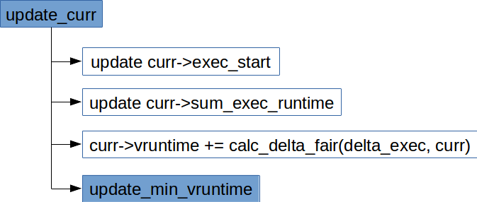

# 完全公平调度(Completely Fair Scheduler)
***

# 目录

- [CFS数据结构](#cfs数据结构)
	- [CFS调度实体 sched_entity](#cfs调度实体-schedentity)
	- [CFS调度运行队列 cfs_rq](#cfs调度运行队列-cfsrq)
	- [CFS调度器类fair_sched_class](#cfs调度器类fairschedclass)
- [创建进程](#创建进程)
	- [关联新进程与调度器](#关联新进程与调度器)
	- [新进程进入队列](#新进程进入队列)
	- [新进程能否抢占](#新进程能否抢占)
- [周期性调度](#周期性调度)
- [进程唤醒](#进程唤醒)
- [选择下一个进程](#选择下一个进程)
	- [避而不谈的\__calc_delta()](#避而不谈的calcdelta)
	- [调度器的一些features](#调度器的一些features)
- [CFS调试接口](#CFS调试接口)
- [参考资料](#参考资料)


# CFS数据结构


## CFS调度实体 sched_entity
* include/linux/sched.h::sched_entity
```c
struct sched_entity {
    struct load_weight  load;       /*for load-balancing*/
    struct rb_node      run_node;
    struct list_head    group_node;
    unsigned int        on_rq;

    u64         exec_start;
    u64         sum_exec_runtime;
    u64         vruntime;
    u64         prev_sum_exec_runtime;
    ...
};
```
* `load` 权重，决定了各个实体占队列总负荷的比例。虚拟时钟的速度最终依赖于权重。
* `run_node` 树节点，将实体与红黑树关联起来，完成树相关的操作。
* `on_rq` 表示该实体是否在运行队列上接受调度。
* `exec_start` 主要在`update_curr()`时用当前时间减去`exec_start`得到`delta_exec`，并更新为当前时间。
* `sum_exec_runtime` 累计消耗的CPU时间，在`update_curr()`时会把`delta_exec`累加到`sum_exec_runtime`。检查能否抢占时需要用到该值。
* `vruntime` 记录进程执行期间虚拟时钟上流逝的时间。
* `prev_sum_exec_runtime` 进程被撤销CPU时，将`sum_exec_runtime`保存到`prev_sum_exec_runtime`。此后，在进程抢占时又需要该数据。注意，`sum_exec_runtime`并不会被重置，而是持续单调增长。

## CFS调度运行队列 cfs_rq
* kernel/sched/sched.h::cfs_rq
```c
/* CFS-related fields in a runqueue */
struct cfs_rq {
    struct load_weight load;
    unsigned int nr_running, h_nr_running;
    ...
    u64 min_vruntime;

    struct rb_root tasks_timeline;
    struct rb_node *rb_leftmost;

    /*   
     * 'curr' points to currently running entity on this cfs_rq.
     * It is set to NULL otherwise (i.e when none are currently running).
     */
    struct sched_entity *curr;
    ...
};
```
* `load` 该队列上的进程的累计权重。
* `nr_running` 队列上可运行进程的数目。
* `min_vruntime` 跟踪记录队列上所有进程的*最小虚拟运行时间*。
* `tasks_timeline` 红黑树的root节点。
* `rb_leftmost` 总设置为树的最左边的结点，即最需要被调度的进程。为减少搜索树花费时间的优化措施。
* `curr` 当前执行进程的可调度实体。

## CFS调度器类fair_sched_class
* kernel/sched/fair.c
```c
/*
 * All the scheduling class methods:
 */
const struct sched_class fair_sched_class = {
    .next           = &idle_sched_class,
    .enqueue_task       = enqueue_task_fair,
    .dequeue_task       = dequeue_task_fair,
    .yield_task     = yield_task_fair,
    .yield_to_task      = yield_to_task_fair,

    .check_preempt_curr = check_preempt_wakeup,

    .pick_next_task     = pick_next_task_fair,
    .put_prev_task      = put_prev_task_fair,

#ifdef CONFIG_SMP
    .select_task_rq     = select_task_rq_fair,
    .migrate_task_rq    = migrate_task_rq_fair,

    .rq_online      = rq_online_fair,
    .rq_offline     = rq_offline_fair,

    .task_waking        = task_waking_fair,
    .task_dead      = task_dead_fair,
    .set_cpus_allowed   = set_cpus_allowed_common,
#endif

    .set_curr_task          = set_curr_task_fair,
    .task_tick      = task_tick_fair,
    .task_fork      = task_fork_fair,

    .prio_changed       = prio_changed_fair,
    .switched_from      = switched_from_fair,
    .switched_to        = switched_to_fair,

    .get_rr_interval    = get_rr_interval_fair,

    .update_curr        = update_curr_fair,

#ifdef CONFIG_FAIR_GROUP_SCHED
    .task_move_group    = task_move_group_fair,
#endif
};
```

# 创建进程
* 核心调度器委托给 CFS 三个工作
	1. `task_fork`
	2. `enqueue_task`
	3. `check_preempt_curr`

## 关联新进程与调度器


* kernel/sched/fair.c::task_fork_fair
```c
/*
 * called on fork with the child task as argument from the parent's context
 *  - child not yet on the tasklist
 *  - preemption disabled
 */
static void task_fork_fair(struct task_struct *p)
{   
    struct cfs_rq *cfs_rq;
    struct sched_entity *se = &p->se, *curr;
    int this_cpu = smp_processor_id();
    struct rq *rq = this_rq();
    unsigned long flags;

    raw_spin_lock_irqsave(&rq->lock, flags);
    /*更新运行队列的时钟，这个值会在后面update_curr()用到*/
    update_rq_clock(rq);

    cfs_rq = task_cfs_rq(current);
    curr = cfs_rq->curr;

    /*  
     * Not only the cpu but also the task_group of the parent might have
     * been changed after parent->se.parent,cfs_rq were copied to
     * child->se.parent,cfs_rq. So call __set_task_cpu() to make those
     * of child point to valid ones.
     */
    rcu_read_lock();
    __set_task_cpu(p, this_cpu);
    rcu_read_unlock();
    /*更新当前进程的vruntime，该函数还会顺带更新当前队列的min_vruntime__*/
    update_curr(cfs_rq);
    /* 如果当前进程所在队列不为空，将所在队列当前进程的`vruntime`作为新进程`vruntime`的基础 */
    if (curr)
        se->vruntime = curr->vruntime;
    place_entity(cfs_rq, se, 1); /* 设置新进程的vruntime值, 1表示是新进程 */
    /* sysctl_sched_child_runs_first值表示是否设置了让子进程先运行 */
    if (sysctl_sched_child_runs_first && curr && entity_before(curr, se)) {
        /*
         * Upon rescheduling, sched_class::put_prev_task() will place
         * 'current' within the tree based on its new key value.
         */
        swap(curr->vruntime, se->vruntime); /*当子进程的vruntime值大于父进程的vruntime时, 交换两个进程的vruntime值*/
        resched_curr(rq); /*设置重新调度标志TIF_NEED_RESCHED*/
    }
    /* 为什么这里又要减cfs_rq->min_vruntime？
		 * 因为新进程有可能会在别的CPU上被运行，然而每个CPU的运行队列的min_vruntime是不同的。
     * 因此这里存的是已算出的vruntime与当前运行队列min_vruntime的差值。
     * 当该调度实体在加入其他运行队列时，需要再加上要加入队列的min_vruntime
		 * (可查看enqueue_entity()函数)。
		 * 同样，在进程从队列出来的时候(dequeue_entity())也需要类似的操作。
		 */
    se->vruntime -= cfs_rq->min_vruntime;

    raw_spin_unlock_irqrestore(&rq->lock, flags);
}
```
* `sysctl_sched_child_runs_first`的值可以通过`/proc/sys/kernel/sched_child_runs_first`修改，让子进程在`fork`之后总在父进程之前运行。
* **进程离开队列时，`vruntime`存的是与离开的队列`min_vruntime`的差值**，记住这点对于理解`vruntime`的计算很重要。

### 更新当前进程的时间
* 在`task_fork_fair()`函数中我们首次看到了`update_curr()`函数，这是个很重要的函数，所有与虚拟时钟相关的计算都在这个函数中执行。



* 调度实体的`exec_start`，`sum_exec_runtime`和`vruntime`都会在`update_curr()`中更新。
	* kernel/sched/fair.c::update_curr
```c
/*
 * Update the current task's runtime statistics.
 */
static void update_curr(struct cfs_rq *cfs_rq)
{
    struct sched_entity *curr = cfs_rq->curr;
		/*获取所在队列的时钟，该值刚在task_fork_fair调用update_rq_clock更新过*/
    u64 now = rq_clock_task(rq_of(cfs_rq));
    u64 delta_exec;
		/* 如果当前队列上没有进程在运行，什么都不做 */
    if (unlikely(!curr))
        return;
		/* exec_start记录的是上一次调用update_curr()的时间，我们用当前时间减去exec_start  
		 * 就得到了从上次计算vruntime到现在进程又运行的实际时间。
		 */
    delta_exec = now - curr->exec_start;
    if (unlikely((s64)delta_exec <= 0))
        return;
    /* 实际流逝的时间计算完了，更新exec_start以备下次使用 */
    curr->exec_start = now;

    ...
		/* sum_exec_runtime是进程累计使用的CPU时间，因此是物理时间。在此处更新*/
    curr->sum_exec_runtime += delta_exec;
    ...
    /* vruntime是进程累计使用的虚拟时间，需要将exec_start经过加权运算后得到 */
    curr->vruntime += calc_delta_fair(delta_exec, curr);
		/*因为有进程的vruntime变了，因此该队列的min_vruntime可能也发生了变化，更新它*/
    update_min_vruntime(cfs_rq);
    ...
}
```

#### 计算虚拟运行时间增量calc_delta_fair

* 函数`calc_delta_fair()`根据传入的物理时间增量以及进程的权重计算虚拟时间的增量
* 计算公式之前讨论过，计算的细节`__calc_delta()`后面在专门讨论
  * kernel/sched/fair.c
```c
/*
 * delta /= w
 */
static inline u64 calc_delta_fair(u64 delta, struct sched_entity *se)
{
    if (unlikely(se->load.weight != NICE_0_LOAD))
        delta = __calc_delta(delta, NICE_0_LOAD, &se->load);

    return delta;
}
```
* 根据CFS的设计，`nice`为**0**的进程的权重为`NICE_0_LOAD`，此时物理时间和虚拟时间是相等的。

#### 更新CFS运行队列的min_vruntime
* `update_min_vruntime`函数通常要从**当前进程**与**运行队列里的进程**中选出**最小**的`vruntime`作为CFS运行队列的`min_vruntime`
  * kernel/sched/fair.c
```c
static void update_min_vruntime(struct cfs_rq *cfs_rq)
{
    u64 vruntime = cfs_rq->min_vruntime;

    if (cfs_rq->curr)
        vruntime = cfs_rq->curr->vruntime;

    /* 如果红黑树上有进程在等待调度 */
    if (cfs_rq->rb_leftmost) {
        struct sched_entity *se = rb_entry(cfs_rq->rb_leftmost,
                           struct sched_entity,
                           run_node);

        if (!cfs_rq->curr)/*如果当前并没有进程在运行，则用树上最左结点的vruntime*/
            vruntime = se->vruntime;
        else              /*否则从当前运行进程与树的最左结点调度实体中选最小的vruntime*/
            vruntime = min_vruntime(vruntime, se->vruntime);
    }    
    /* 如果运行队列上没有进程，则用当前进程的vruntime */

    /* ensure we never gain time by being placed backwards. */
    /* 时间不能出现回退的现象，所以这里要选出最大值。
     * 也就是说，每个队列所记录的min_vruntime只有被超出时才能更新。
     */
    cfs_rq->min_vruntime = max_vruntime(cfs_rq->min_vruntime, vruntime);
    ...
}
```
* 设置运行队列的`min_vruntime`必须保证该值的**单调递增**。

### 创建新进程时的place_entity()

* `task_fork_fair()`函数是这么调用的
  * kernel/sched/fair.c
```c
  if (curr)
      se->vruntime = curr->vruntime;
  place_entity(cfs_rq, se, 1);
```

* `place_entity()`函数我们在此只关心`initial = 1`的部分。
  * kernel/sched/fair.c
```c
static void
place_entity(struct cfs_rq *cfs_rq, struct sched_entity *se, int initial)
{
    u64 vruntime = cfs_rq->min_vruntime;

    /*   
     * The 'current' period is already promised to the current tasks,
     * however the extra weight of the new task will slow them down a
     * little, place the new task so that it fits in the slot that
     * stays open at the end.
     */
    if (initial && sched_feat(START_DEBIT))
        vruntime += sched_vslice(cfs_rq, se);
    ...
    /* ensure we never gain time by being placed backwards. */
		/*此处表明, 对于新进程而言, 新进程的vruntime值是大于等于父进程vruntime值的。
		  所以后面如果没有设置子进程先运行, 则只要父进程本次调度运行的实际时间没有超过
			调度周期分配的实际时间值, 父进程就会先运行, 否则, 父子进程的先后执行顺序不确定。*/
    se->vruntime = max_vruntime(se->vruntime, vruntime);
}
```
* 新进程的初始`vruntime`值就以它所在运行队列的`min_vruntime`为基础来设置，与老进程保持在合理的差距范围内。

* `sched_features`是控制调度器特性的开关，每个bit表示调度器的一个特性。在`kernel/sched/features.h`文件中记录了全部的特性。见《Professional Linux Kernel Architecture》
> Note that the real kernel sources will execute portions of the code depending on outcomes of sched_feature queries. The CF
scheduler supports some ‘‘configurable’’ features, but they can only be turned on and off in debugging mode — otherwise, the set
of features is fixed.

* `START_DEBIT`是其中之一，如果打开这个特性，表示给新进程的`vruntime`初始值要设置得比默认值更大一些，这样会推迟它的运行时间，**以防进程通过不停的fork来获得CPU**。
  * kernel/sched/features.h
```c
/*
 * Place new tasks ahead so that they do not starve already running
 * tasks
 */
SCHED_FEAT(START_DEBIT, true)
```

* `sched_vslice()`用于计算将要插入队列的进程的**虚拟时间片**，仅在`place_entity()`被调用。
  * kernel/sched/fair.c::sched_vslice()
```c
/*
 * We calculate the vruntime slice of a to-be-inserted task.
 *
 * vs = s/w
 */
static u64 sched_vslice(struct cfs_rq *cfs_rq, struct sched_entity *se)
{
    return calc_delta_fair(sched_slice(cfs_rq, se), se);
}
```
* 如果`START_DEBIT`位被设置，则通过加上一个调度周期内的虚拟时间片将新进程推后执行。
* 否则新进程与父进程的`vruntime`一致，如果`sysctl_sched_child_runs_first`参数没有设成**1**，子进程与父进程谁先被执行还不确定。

## 新进程进入队列


### 创建新进程时的enqueue_entity
* `enqueue_task_fair`完成核心调度器委托的将进程加入运行队列的工作
* 创建新进程时，核心调度器在函数`wake_up_new_task()`里调用`activate_task()`时，hard-coded了`flags`为**0**，所以此时参数`flags`的值为**0**
* kernel/sched/fair.c
```c
static void
enqueue_entity(struct cfs_rq *cfs_rq, struct sched_entity *se, int flags)
{
    /*   
     * Update the normalized vruntime before updating min_vruntime
     * through calling update_curr().
     */
		/* 此处将task_fork_fair()最后减去cfs_rq->min_vruntime补回来，
		 * 因为调度实体最后在哪个队列被执行并不一定，所以出队的时候vruntime里存的时差值。
		 */
    if (!(flags & ENQUEUE_WAKEUP) || (flags & ENQUEUE_WAKING))
        se->vruntime += cfs_rq->min_vruntime;

    /*   
     * Update run-time statistics of the 'current'.
     */
    update_curr(cfs_rq);
    ...
    /* 创建新进程时，之前已经place_entity了，因此这里无需在此place_entity */
    if (flags & ENQUEUE_WAKEUP) {
        place_entity(cfs_rq, se, 0);
        ...
    }    
    ...
		/* 进程如果恰好时队列的当前进程，无需再次入队；
		 * 否则新进程加入红黑树，并且on_rq标志置为 1。
		 */
    if (se != cfs_rq->curr)
        __enqueue_entity(cfs_rq, se);
    se->on_rq = 1;
    ...
}
```

## 新进程能否抢占


# 周期性调度


# 进程唤醒


# 选择下一个进程


#### 避而不谈的\__calc_delta()

很多关于kernel的书籍和讲CFS的文章在讲到`__calc_delta()`函数的时候都选择了略过，可能是由于这一部分变动的比较大，但这里有多有趣的细节值得推敲，这里根据v4.6的代码讲一下。

* kernel/sched/fair.c
```c
#define WMULT_CONST (~0U)
#define WMULT_SHIFT 32

static void __update_inv_weight(struct load_weight *lw)
{
    unsigned long w;

    if (likely(lw->inv_weight))  /* 如果当前的inv_weight有预设值，则直接采用预设值 */
        return;

    w = scale_load_down(lw->weight); /* 否则以当前权重为基础重新计算 */

    if (BITS_PER_LONG > 32 && unlikely(w >= WMULT_CONST))
        lw->inv_weight = 1;           /* 当64位系统且权重超过2^32，inv_weight一律看作1 */
    else if (unlikely(!w))            /* 当权重值为0 */
        lw->inv_weight = WMULT_CONST; /* inv_weight值为2^32-1 */
    else /* inv_weight为(2^32-1)/权重，当32位系统，或64位系统但权重未超过2^32，且权重不为0 */
        lw->inv_weight = WMULT_CONST / w;
}

/*
 * delta_exec * weight / lw.weight
 *   OR
 * (delta_exec * (weight * lw->inv_weight)) >> WMULT_SHIFT
 *
 * Either weight := NICE_0_LOAD and lw \e prio_to_wmult[], in which case
 * we're guaranteed shift stays positive because inv_weight is guaranteed to
 * fit 32 bits, and NICE_0_LOAD gives another 10 bits; therefore shift >= 22.
 *
 * Or, weight =< lw.weight (because lw.weight is the runqueue weight), thus
 * weight/lw.weight <= 1, and therefore our shift will also be positive.
 */
static u64 __calc_delta(u64 delta_exec, unsigned long weight, struct load_weight *lw)
{
    u64 fact = scale_load_down(weight); /* 当前可以认为没有对权重weight进行比例伸缩 */
    int shift = WMULT_SHIFT;  /* WMULT_SHIFT为32 */

    __update_inv_weight(lw);  /* 给lw的inv_weight一个合理的值，且在 1 ~ 2^32-1 的范围内 */

    /* 当权重>=2^32时，尝试不断缩小权重(每次折半)，并用shift记录，直至权重小于2^32，
       即经过此步骤 0 < fact < 2^32-1 */
    if (unlikely(fact >> 32)) {
        while (fact >> 32) {
            fact >>= 1;
            shift--;
        }
    }

    /* hint to use a 32x32->64 mul */
    /* 之前的步骤已经确保fact和lw->inv_weight的值都不会超过2^32-1，
       因此它们的乘积也不会超过2^64。
       1) 当__calc_delta()用于计算当前进程消耗的vruntime时，
          即 weight := NICE_0_LOAD, lw := &se->load 时,
          其实就是在计算：
          fact = （2^32-1） * NICE_0_LOAD / se->load.weight
          这里先乘个2^32-1能保证fact的结果不会因为NICE_0_LOAD < se->load.weight
          而导致的整形除法商为0的情况。
      2) 当__calc_delta()用于计算按权重比例分得的调度周期内墙上时钟时间片时，
         即被sched_slice()调用，weight是调度实体的权重，而lw是cfs_rq队列上权重和。
         这里计算的就是当前调度实体的权重占所在队列的权重总和的比例，并放大2^32-1倍。
     */
    fact = (u64)(u32)fact * lw->inv_weight;

    /* 再次缩小上面的乘操作可能导致的fact > 2^32-1 */
    while (fact >> 32) {
        fact >>= 1;
        shift--;
    }

    /* vruntime = (delta_exec * 扩大后的权重比) >> shift
       之前__update_inv_weight(lw)放大的倍数会在这里通过右移shift位缩小回来。
     */
    return mul_u64_u32_shr(delta_exec, fact, shift);
}
```

* 这里可以考虑计算`vruntime`时（即`weight := NICE_0_LOAD`）的两种极限情况：
  1. 当`lw->weight`特别小，比如为1时，`__update_inv_weight(lw)`会把`lw->inv_weight`置为`WMULT_CONST`（即`0x ff ff ff ff`）, `NICE_0_LOAD`等于1024相当于将`0x ff ff ff ff`再右移10位。因此，第二个while循环后`shift`的值会变为22。`mul_u64_u32_shr(delta_exec, fact, shift)`相当于`delta_exec * (2^32-1) / 2^22`变换成`delta_exec * (2^10 - 1/2^22)`，算下来应该与`delta_exec * 1024`的值差不多。
  2. 当`lw->weight`特别大，甚至超过`WMULT_CONST`（即`0x ff ff ff ff`）时，`__update_inv_weight(lw)`会把`lw->inv_weight`置为**1**，两次while循环都不会产生`fact`右移的情况。`fact`仍然是`NICE_0_LOAD`，而`shift`还是32，故`mul_u64_u32_shr(delta_exec, fact, shift)`相当与`delta_exec >> 22`。考虑`2^22 = 4,194,304`，最小调度粒度设为4ms（即4,000,000ns）也不是没有道理的。

* 在`__calc_delta()`于计算时间片的时候（即被sched_slice()），`lw->weight`是就绪队列权重的总和，虽然`lw->weight`有可能会非常的大，但根据`sched_slice()`的实现，`delta_exec`是调度周期，当就绪队列里任务非常多时，调度周期也会相应地增大。


* include/asm-generic/bitsperlong.h
```c
#ifdef CONFIG_64BIT
#define BITS_PER_LONG 64
#else
#define BITS_PER_LONG 32
#endif /* CONFIG_64BIT */
```

* include/linux/math64.h
```c
#if defined(CONFIG_ARCH_SUPPORTS_INT128) && defined(__SIZEOF_INT128__)

#ifndef mul_u64_u32_shr
static inline u64 mul_u64_u32_shr(u64 a, u32 mul, unsigned int shift)
{
    return (u64)(((unsigned __int128)a * mul) >> shift);
}
#endif /* mul_u64_u32_shr */

#else

#ifndef mul_u64_u32_shr
static inline u64 mul_u64_u32_shr(u64 a, u32 mul, unsigned int shift)
{
    u32 ah, al;
    u64 ret;       /* u64在32位和64位平台上长度都是 8Byte */

    al = a;
    ah = a >> 32;  /* a的高32位右移用来计算，防止溢出u64 */

    ret = ((u64)al * mul) >> shift; /* cast成u64防止两个u32相乘上溢造成的截断 */
    /* 如果a的高32位不为空，则需拼接高32位的运算结果。由于低32位的结果右移了shift，
       所以在拼接时高32位的运算结果需要左移的位数是32与shift的差值。 */
    if (ah)
        ret += ((u64)ah * mul) << (32 - shift);

    return ret;
}
#endif /* mul_u64_u32_shr */

#endif
```

* [128-bit Integers (__int128)](https://gcc.gnu.org/onlinedocs/gcc-6.1.0/gcc/_005f_005fint128.html#g_t_005f_005fint128)

> As an extension the integer scalar type __int128 is supported for targets which have an integer mode wide enough to hold 128 bits. Simply write __int128 for a signed 128-bit integer, or unsigned __int128 for an unsigned 128-bit integer. There is no support in GCC for expressing an integer constant of type __int128 for targets with long long integer less than 128 bits wide.

* init/Kconfig
```sh
config ARCH
    string
    option env="ARCH"
...
#
# For architectures that know their GCC __int128 support is sound
#
config ARCH_SUPPORTS_INT128
    bool
...
```

* arch/x86/Kconfig
```sh
# Select 32 or 64 bit
config 64BIT
    bool "64-bit kernel" if ARCH = "x86"
    default ARCH != "i386"
    ---help---
      Say yes to build a 64-bit kernel - formerly known as x86_64
      Say no to build a 32-bit kernel - formerly known as i386

config X86_32
    def_bool y
    depends on !64BIT

config X86_64
    def_bool y
    depends on 64BIT

### Arch settings
config X86
    def_bool y
    ...
    select ARCH_SUPPORTS_INT128     if X86_64
    ...
```

* include/asm-generic/int-ll64.h
```c
#ifndef __ASSEMBLY__

typedef signed char s8;
typedef unsigned char u8;

typedef signed short s16;
typedef unsigned short u16;

typedef signed int s32;
typedef unsigned int u32;

typedef signed long long s64;
typedef unsigned long long u64;
...
#else /* __ASSEMBLY__ */
...
#endif /* __ASSEMBLY__ */
```
#### 结论
* `__calc_delta()`函数需要保证无论是32位平台还是64位平台，都能返回一个u64类型的值。且需要解决好潜在的上溢问题。
* 在用于计算`vruntime`时可能会由于调度实体的权重比`NICE_0_LOAD`大导致它们的商为0，因为它们用的都是整数类型，故`__calc_delta()`需要解决这个问题。

### 调度器的一些features
* kernel/sched/features.h

# CFS调试接口
* CFS提供了调试接口，还提供了运行时统计信息，分别在 **kernel/sched_debug.c** 和 **kernel/sched_stats.h** 中实现。
* **/proc/sched_debug**: 显示运行时调度程序可调优选项的当前值、CFS 统计信息和所有可用 CPU 的运行队列信息。当读取这个 proc 文件时，将调用 `ched_debug_show()` 函数并在 sched_debug.c 中定义。
* **/proc/schedstat**: 为所有相关的 CPU 显示特定于运行队列的统计信息以及 SMP 系统中特定于域的统计信息。kernel/sched_stats.h 中定义的 `show_schedstat()` 函数将处理 proc 条目中的读操作。
* **/proc/[PID]/sched**: 显示与相关调度实体有关的信息。在读取这个文件时，将调用 kernel/sched_debug.c 中定义的 `proc_sched_show_task()` 函数。

# 参考资料
* https://www.ibm.com/developerworks/cn/linux/l-cfs
* http://www.ithao123.cn/content-8720784.html
* http://linuxperf.com/?p=42
