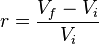
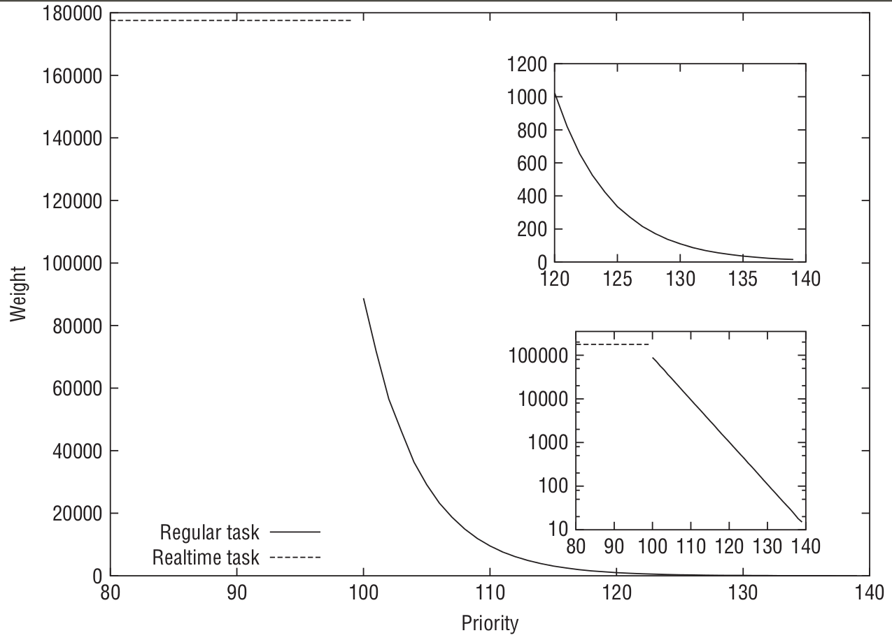
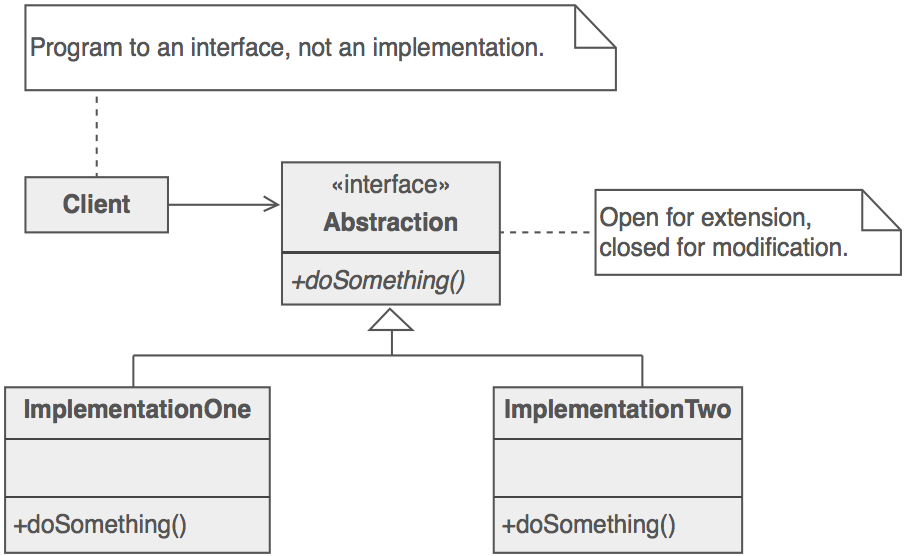
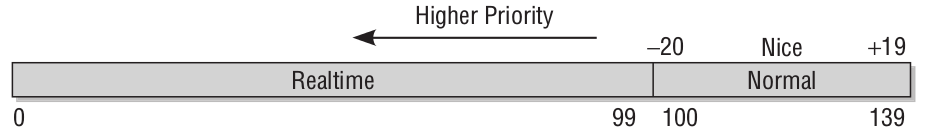

# Linux进程调度（Linux Process Scheduling)
***

# 目录
* [Linux缺省调度器](#linux%E7%BC%BA%E7%9C%81%E8%B0%83%E5%BA%A6%E5%99%A8)
* [O(1)调度](#o1%E8%B0%83%E5%BA%A6)
* [完全公平调度（Completely Fair Scheduler）](#%E5%AE%8C%E5%85%A8%E5%85%AC%E5%B9%B3%E8%B0%83%E5%BA%A6completely-fair-scheduler)
  * [调度的目标](#调度的目标)
  * [算术级数几何级数与增长率](#算术级数几何级数与增长率)
  * [基本原理](#基本原理)
  * [原理解析](#原理解析)
* [核心调度器](#核心调度器)
  * [调度器类](#调度器类)
  * [调度策略](#调度策略)
  * [调度相关的数据结构](#调度相关的数据结构)
  * [优先级](#优先级)
* [参考资料](#%E5%8F%82%E8%80%83%E8%B5%84%E6%96%99)

# Linux缺省调度器
Operating System | Algorithm
------------ | -------------
Linux kernel before 2.6.0 | [O(n) scheduler](https://en.wikipedia.org/wiki/O(1)%5fscheduler)
Linux kernel 2.6.0–2.6.23 | [O(1) scheduler](https://en.wikipedia.org/wiki/O(n)%5fscheduler)
Linux kernel after 2.6.23 | [Completely Fair Scheduler](https://en.wikipedia.org/wiki/Completely_Fair_Scheduler)

# O(1)调度
### 运行队列
```c
struct runqueue {
    spinlock_t lock; /* spin lock that protects this runqueue */
    unsigned long nr_running; /* number of runnable tasks */
    unsigned long nr_switches; /* context switch count */
    unsigned long expired_timestamp; /* time of last array swap */
    unsigned long nr_uninterruptible; /* uninterruptible tasks */
    unsigned long long timestamp_last_tick; /* last scheduler tick */
    struct task_struct *curr; /* currently running task */
    struct task_struct *idle; /* this processor's idle task */
    struct mm_struct *prev_mm; /* mm_struct of last ran task */
    struct prio_array *active; /* active priority array */
    struct prio_array *expired; /* the expired priority array */
    struct prio_array arrays[2]; /* the actual priority arrays */
    struct task_struct *migration_thread; /* migration thread */
    struct list_head migration_queue; /* migration queue */
    atomic_t nr_iowait; /* number of tasks waiting on I/O */
};
```

### 优先级数组
```c
struct prio_array {
    int nr_active; /* number of tasks in the queues */
    unsigned long bitmap[BITMAP_SIZE]; /* priority bitmap */
    struct list_head queue[MAX_PRIO]; /* priority queues */
};
```


### 优先级位图映射


### O(1)调度算法的问题
1. 将nice值映射到时间片，就必须将nice值对应到绝对的处理器时间，这会导致进程切换无法最优化进行。例如，两个高nice值（低优先级）的后台进程，往往是CPU密集型，分配到的时间片太短，导致频繁切换。
2. nice值变化的效果极大的取决于nice的初始值。
3. 时间片受定时器节拍的影响比较大。
4. 为提高交互进程性能的优化有可能被利用，打破公平原则，获得更多的处理器时间。

# 完全公平调度（Completely Fair Scheduler）

## 调度的目标
* 任何进程获得的处理器时间是由它自己和其他所有可运行进程nice值的相对差值决定的
* 任何nice值对应的时间不再是一个绝对值，而是处理器的使用比
* nice值对时间片的作用不再是算术级增加，而是几何级增加
* 公平调度，确保每个进程有公平的处理器使用比

## 算术级数、几何级数与增长率

### 增长率


_V<sub>f</sub>_：最终值

_V<sub>i</sub>_：初始值


### 算术级数
数列中每一个数跟前一个数的差额是固定的。每期增长率不一样。如增长幅度是正的，越往后增长率越小。

数列|2|4|6|8|10|12
---|---|---|---|---|---|---
增长率|-|100%|50%|33%|25%|16.67%

如果采用算术级数，比如相邻两个nice值之间差额是5ms，
* 进程A的nice值为0，进程B的nice值为1，则它们分别映射到时间片100ms和95ms，差别并不大
* 进程A的nice值为18，进程B的nice值为19，则它们分别映射到时间片10ms和5ms，前者比后者多了100%的处理器时间

### 几何级数
数列中的数按固定的增长率增长。如增长率是正的，越往后增长幅度越大。

数列|2|4|8|16|32|64
---|---|---|---|---|---|---
增长率|-|100%|100%|100%|100%|100%

如果采用几何级数，比如说，增长率约为-20%，目标延迟是20ms，
* 进程A的nice值为0，进程B的nice值为5，则它们分别获得的处理器时间15ms和5ms
* 进程A的nice值为10，进程B的nice值为15，它们分别获得的处理器时间仍然是15ms和5ms

> **目标延迟（targeted latency）**
> Each process then runs for a “timeslice” proportional to its weight divided by the total
> weight of all runnable threads. To calculate the actual timeslice, CFS sets a target for its
> approximation of the “infinitely small” scheduling duration in perfect multitasking. This
> target is called the **targeted latency**.
> Smaller targets yield better interactivity and a closer approximation to perfect
> multitasking, at the expense of higher switching costs and thus worse overall throughput.

> **时间片的最小粒度（minimum granularity）**
> Note as the number of runnable tasks approaches infinity, the proportion of allotted
> processor and the assigned timeslice approaches zero. As this will eventually result in
> unacceptable switching costs, CFS imposes a floor on the timeslice assigned to each
> process. This floor is called the minimum granularity. By default it is 1 millisecond. Thus,
> even as the number of runnable processes approaches infinity, each will run for at least 1
> millisecond, to ensure there is a ceiling on the incurred switching costs.

## 基本原理
* 设定一个调度周期（sched_latency_ns），目标是让每个进程在这个周期内至少有机会运行一次。换一种说法就是每个进程等待CPU的时间最长不超过这个调度周期。
* 根据进程的数量，大家平分这个调度周期内的CPU使用权，由于进程的优先级即nice值不同，分割调度周期的时候要加权。
* 每个进程的经过加权后的累计运行时间保存在自己的vruntime字段里。
* 哪个进程的vruntime最小就获得本轮运行的权利。

## 原理解析
* 将进程的nice值映射到对应的权重
  * 数组项之间的乘数因子为1.25，这样概念上可以使进程每降低一个nice值可以多获得10%的CPU时间，每升高一个nice值则放弃10%的CPU时间。
  * kernel/sched/core.c
```c
const int sched_prio_to_weight[40] = {
 /* -20 */     88761, 71755, 56483, 46273, 36291,
 /* -15 */     29154, 23254, 18705, 14949, 11916,
 /* -10 */      9548,  7620,  6100,  4904,  3906,
 /*  -5 */      3121,  2501,  1991,  1586,  1277,
 /*   0 */      1024,   820,   655,   526,   423,
 /*   5 */       335,   272,   215,   172,   137,
 /*  10 */       110,    87,    70,    56,    45,
 /*  15 */        36,    29,    23,    18,    15,
};
```

  由此可见，**nice值越小, 进程的权重越大**。

* 静态优先级与权重之间的关系，分普通和实时进程两种情况


* CFS调度器的调度周期由sysctl_sched_latency变量保存。
  * 该变量可以通过sysctl调整，见kernel/sysctl.c
```
       >sysctl kernel.sched_latency_ns
       kernel.sched_latency_ns = 24000000
       >sysctl kernel.sched_min_granularity_ns
       kernel.sched_min_granularity_ns = 3000000
```

  * 任务过多的时候调度周期会延长，见kernel/sched/fair.c
```c
/*
 * The idea is to set a period in which each task runs once.
 *
 * When there are too many tasks (sched_nr_latency) we have to stretch
 * this period because otherwise the slices get too small.
 *
 * p = (nr <= nl) ? l : l*nr/nl
 */
static u64 __sched_period(unsigned long nr_running)
{
    if (unlikely(nr_running > sched_nr_latency))
        return nr_running * sysctl_sched_min_granularity;
    else
        return sysctl_sched_latency;
}
```

* 一个进程在一个调度周期中的运行时间为:
```js
    分配给进程的运行时间 = 调度周期 * 进程权重 / 所有可运行进程权重之和
```

  可以看到, 进程的权重越大，分到的运行时间越多。

* 一个进程的实际运行时间和虚拟运行时间之间的关系为:
```js
    vruntime = 实际运行时间 * NICE_0_LOAD / 进程权重
             = 实际运行时间 * 1024 / 进程权重
             (NICE_0_LOAD = 1024, 表示nice值为0的进程权重)
```

  可以看到, **进程权重越大, 运行同样的实际时间, vruntime增长的越慢**。

* 一个进程在一个调度周期内的虚拟运行时间大小为:
```js
    vruntime = 进程在一个调度周期内的实际运行时间 * NICE_0_LOAD / 进程权重
             = (调度周期 * 进程权重 / 所有进程总权重) * NICE_0_LOAD / 进程权重
             = 调度周期 * NICE_0_LOAD / 所有可运行进程总权重
```
  可以看到，一个进程在一个调度周期内的vruntime值大小是不和该进程自己的权重相关的，所以所有进程的vruntime值大小都是一样的。

* 在非常短的时间内，也许看到的vruntime值并不相等。
  * vruntime值小，说明它以前占用cpu的时间较短，受到了“不公平”对待。
  * 但为了确保公平，我们**总是选出vruntime最小的进程来运行**，形成一种“追赶”的局面。
  * 这样既能公平选择进程，又能保证高优先级进程获得较多的运行时间。


* 理想情况下，由于vruntime与进程自身的权重是不相关的，所有进程的vruntime值是一样的。

* 怎么解释进程间的实际执行时间与它们的权重是成比例的？
  * 假设有进程A，其虚拟运行时间为`vruntime_A`，其实际运行的时间为`delta_exec_A`，权重为`weight_A`，于是`vruntime_A = delta_exec_A * NICE_0_LOAD / weight_A`
  * 假设有进程B，其虚拟运行时间为`vruntime_B`，其实际运行的时间为`delta_exec_B`，权重为`weight_B`，于是`vruntime_B = delta_exec_B * NICE_0_LOAD / weight_B`
  * 由于进程虚拟运行时间相同，即 `vruntime_A == vruntime_B`，
  * 则 `delta_exec_A * NICE_0_LOAD / weight_A == vruntime_B = delta_exec_B * NICE_0_LOAD / weight_B`
  * 也就是 `delta_exec_A : delta_exec_B == weight_A : weight_B`

  可见进程间的实际执行时间和它们的权重也是成比例的。

* 各个进程追求的公平时间vruntime其实就是一个nice值为0的进程在一个调度周期内应分得的时间，就像是一个基准。

# 核心调度器

## 调度器类

### 策略模式（Stragegy Pattern）


### 调度器类
* fair (Completely_Fair_Scheduler)
* real-time
* stop-task (sched_class_highest)
* Deadline Scheduling: Earliest Deadline First (EDF) + Constant Bandwidth Server (CBS)
* idle-task


### 调度器类的顺序
* stop-task --> deadline --> real-time --> fair --> idle
* 在各调度器类定义的时候通过`next`指针定义好了下一级调度器类
* `stop-task`是通过宏`#define sched_class_highest (&stop_sched_class)`指定的
* 编译时期就已决定，不能动态扩展

## 调度策略
* include/uapi/linux/sched.h
```c
/*
 * Scheduling policies
 */
#define SCHED_NORMAL        0
#define SCHED_FIFO      1
#define SCHED_RR        2
#define SCHED_BATCH     3
/* SCHED_ISO: reserved but not implemented yet */
#define SCHED_IDLE      5
#define SCHED_DEADLINE      6
```
* 调度策略与调度器类是多对一的映射关系

调度器类 | 调度策略 |
---|---
fair|SCHED_NORMAL
... |SCHED_BATCH
... |SCHED_IDLE
real-time|SCHED_FIFO
... |SCHED_RR
deadline|SCHED_DEADLINE


## 调度相关的数据结构

### 进程结构 task_struct
* include/linux/sched.h::task_struct
```c
struct task_struct {
...
 int prio, static_prio, normal_prio;
 unsigned int rt_priority;
 const struct sched_class *sched_class;
 struct sched_entity se;
 struct sched_rt_entity rt;
 struct sched_dl_entity dl;
...
 unsigned int policy;
 int nr_cpus_allowed;
 cpumask_t cpus_allowed;
...
}
```
* 优先级prio, static_prio, normal_prio
  * **静态优先级**`static_prio` 进程启动时的优先级，除非用`nice`或`sched_setscheduler`修改，否则进程运行期间一直保持恒定。
  * **普通优先级**`normal_prio` 基于进程静态优先级和调度策略计算出的优先级。进程fork时，子进程继承的是普通优先级。
  * **动态优先级**`prio` 暂时的，非持久的优先级，调度器考虑的是这个优先级。
* **实时进程优先级**`rt_priority` 值越大表示优先级越高（后面会看计算的时候用的是减法）。
* `sched_class` 指向抽象的调度器类。
* 调度实体`se`, `rt`, `dl`
  * 调度器调度的是*可调度实体*，而不限于进程
  * 一组进程可以构成一个*可调度实体*，实现*组调度*
  * 注意：这里用的都是实体而不是指针
* `SCHED_IDLE`进程**不负责**调度空闲进程。空闲进程由内核提供单独的机制来处理。

### 调度器类 sched_class
* kernel/sched/sched.h::sched_class
```c
struct sched_class {
    const struct sched_class *next;

    void (*enqueue_task) (struct rq *rq, struct task_struct *p, int flags);
    void (*dequeue_task) (struct rq *rq, struct task_struct *p, int flags);
    void (*yield_task) (struct rq *rq);
    bool (*yield_to_task) (struct rq *rq, struct task_struct *p, bool preempt);

    void (*check_preempt_curr) (struct rq *rq, struct task_struct *p, int flags);

    /*   
     * It is the responsibility of the pick_next_task() method that will
     * return the next task to call put_prev_task() on the @prev task or
     * something equivalent.
     *
     * May return RETRY_TASK when it finds a higher prio class has runnable
     * tasks.
     */
    struct task_struct * (*pick_next_task) (struct rq *rq,
                        struct task_struct *prev);
    void (*put_prev_task) (struct rq *rq, struct task_struct *p);

    void (*set_curr_task) (struct rq *rq);
    void (*task_tick) (struct rq *rq, struct task_struct *p, int queued);
    void (*task_fork) (struct task_struct *p);
    void (*task_dead) (struct task_struct *p);
#ifdef CONFIG_SMP
...
#endif
    /*   
     * The switched_from() call is allowed to drop rq->lock, therefore we
     * cannot assume the switched_from/switched_to pair is serliazed by
     * rq->lock. They are however serialized by p->pi_lock.
     */
    void (*switched_from) (struct rq *this_rq, struct task_struct *task);
    void (*switched_to) (struct rq *this_rq, struct task_struct *task);
    void (*prio_changed) (struct rq *this_rq, struct task_struct *task,
                 int oldprio);

    unsigned int (*get_rr_interval) (struct rq *rq,
                     struct task_struct *task);

    void (*update_curr) (struct rq *rq);
#ifdef CONFIG_FAIR_GROUP_SCHED
...
#endif
```
* `next` 指向下一个调度器类。
* `enqueue_task` 向运行队列添加新进程。
* `dequeue_task` 从运行队列删除进程。
* `yield_task` 进程自愿放弃对处理器的控制权，相应的系统调用为`sched_yield`。
* `yield_to_task` 让出处理器，并期望将控制权交给指定的进程。
* `pick_next_task` 选择下一个将要运行的进程。
* `put_prev_task` 用另外一个进程**替换当前进程之前**调用。
* `set_curr_task` 改变当前进程的调度策略时调用。
* `task_tick` 每次激活周期性调度器时，由周期性调度器调用。
* `task_fork` 用于建立`fork`系统调用和调度器之间的关联，在`sched_fork()`函数中被调用。
* `get_rr_interval` 返回进程的缺省时间片，对于CFS返回的是该调度周期内分配的实际时间片。相关系统调用为`sched_rr_get_interval`。
* `update_curr` 更新当前进程的运行时间统计。
* `check_preempt_curr` 检查当前进程是否需要重新调度。

#### check_preempt_curr()
```c
void check_preempt_curr(struct rq *rq, struct task_struct *p, int flags)
{
    const struct sched_class *class;
    /* 同一调度器类之间的进程是否需要被重新调度，交由该调度器类内部去决定 */
    if (p->sched_class == rq->curr->sched_class) {
        rq->curr->sched_class->check_preempt_curr(rq, p, flags);
    } else {
        /* 由高到低检查不同调度器类之间的进程是否需要重新调度 */
        for_each_class(class) {
            /* 低调度器类的进程无法抢占高调度器的进程，
               例如rq->curr->sched_class是实时调度器类，而p->sched_class是CFS */
            if (class == rq->curr->sched_class)
                break;            /* 无法抢占，故跳出循环 */
            /* 反之，高调度器类的进程可以抢占低调度器的进程，
               例如p->sched_class是实时调度器类，而rq->curr->sched_class是CFS */
            if (class == p->sched_class) {
                resched_curr(rq); /* 设置重新调度标志位 */
                break;
            }
        }
    }
...
}
```

### 运行队列 rq
* 每个CPU有各自的运行队列
* 各个活动进程只出现在一个运行队列中。在多个CPU上运行同一个进程是不可能的
* 发源于同一进程的线程可以在不同CPU上执行
* **注意**：特定于调度器类的子运行队列是实体，而不是指针
* kernel/sched/sched.h::rq
```c
/*
 * This is the main, per-CPU runqueue data structure.
   ...
 */
struct rq {
...
    unsigned int nr_running;
...
    /* capture load from *all* tasks on this cpu: */
    struct load_weight load;
    struct cfs_rq cfs;
    struct rt_rq rt;
    struct dl_rq dl;
...
    struct task_struct *curr, *idle, *stop;
...
    u64 clock;
}
```
* `nr_running` 队列上可运行进程的数目，**不考虑优先级或调度类**。
* `load` 运行队列当前的累计权重。
* `curr` 指向当前运行进程的`task_struct`实例。
* `idle` 指向空闲进程的`task_struct`实例。该进程在没有其他可运行进程时执行。
* `clock` 每个运行队列的时钟。每次周期性调度器被调用的时候会更新这个值。

#### runqueues
* 系统的所有运行队列都在`runqueues`数组中，该数组中的每一个元素对应于系统中的一个CPU
* kernel/sched/core.c
```c
DEFINE_PER_CPU_SHARED_ALIGNED(struct rq, runqueues);
```
在SMP开启的情况下该宏展开为：
```c
__percpu __attribute__((section(".data..percpu..shared_aligned"))) \
  __typeof__(struct rq) runqueues \
  ____cacheline_aligned_in_smp;
```
关于kernel的Per-CPU变量值得用一篇文章来详叙，这里不深入讲解。
Per-CPU相关代码见：
* include/linux/percpu-defs.h
* include/asm-generic/percpu.h
* include/linux/compiler-gcc.h
* arch/x86/kernel/setup_percpu.c
* include/asm-generic/vmlinux.lds.h

### 调度实体
不同的调度器类分别使用各自的调度实体，谈具体调度器类的时候再详细讨论。
* sched_entity
* sched_rt_entity
* sched_dl_entity

## 优先级


### 计算优先级
* `static_prio` 通常是优先级计算的起点
* `prio` 是调度器关心的优先级，通常由`effective_prio()`计算，计算时考虑当前的优先级的值
* `prio` 有可能会因为*非实时进程*要使用实时互斥量(RT-Mutex)而临时提高优先级至实时优先级
* `normal_prio` 通常由`normal_prio()`计算，计算时考虑调度策略的因素

```c
/*
 * __normal_prio - return the priority that is based on the static prio
 */
static inline int __normal_prio(struct task_struct *p)
{
    return p->static_prio;
}

/*
 * Calculate the expected normal priority: i.e. priority
 * without taking RT-inheritance into account. Might be
 * boosted by interactivity modifiers. Changes upon fork,
 * setprio syscalls, and whenever the interactivity
 * estimator recalculates.
 */
static inline int normal_prio(struct task_struct *p)
{
    int prio;

    if (task_has_dl_policy(p))
        prio = MAX_DL_PRIO-1;
    else if (task_has_rt_policy(p))
        prio = MAX_RT_PRIO-1 - p->rt_priority;
    else
        prio = __normal_prio(p);
    return prio;
}

/*
 * Calculate the current priority, i.e. the priority
 * taken into account by the scheduler. This value might
 * be boosted by RT tasks, or might be boosted by
 * interactivity modifiers. Will be RT if the task got
 * RT-boosted. If not then it returns p->normal_prio.
 */
static int effective_prio(struct task_struct *p)
{
    p->normal_prio = normal_prio(p);
    /*   
     * If we are RT tasks or we were boosted to RT priority,
     * keep the priority unchanged. Otherwise, update priority
     * to the normal priority:
     */
    if (!rt_prio(p->prio))
        return p->normal_prio;
    return p->prio;
}
```
* `fork`子进程时，子进程的静态优先级`static_prio`继承自父进程，动态优先级`prio`设置为父进程的普通优先级`normal_prio`。这是为了确保实时互斥量引起的优先级提高**不会**传递到子进程

### 计算负载权重

# 参考资料
* https://en.wikipedia.org/wiki/Scheduling_%28computing%29
* https://en.wikipedia.org/wiki/O(n)%5fscheduler
* https://en.wikipedia.org/wiki/O(1)%5fscheduler
* https://en.wikipedia.org/wiki/Completely_Fair_Scheduler
* https://en.wikipedia.org/wiki/Brain_Fuck_Scheduler
* https://en.wikipedia.org/wiki/Strategy_pattern
* https://sourcemaking.com/design_patterns/strategy
* http://www.ibm.com/developerworks/cn/linux/l-cn-scheduler/index.html
* http://linuxperf.com/?p=42
