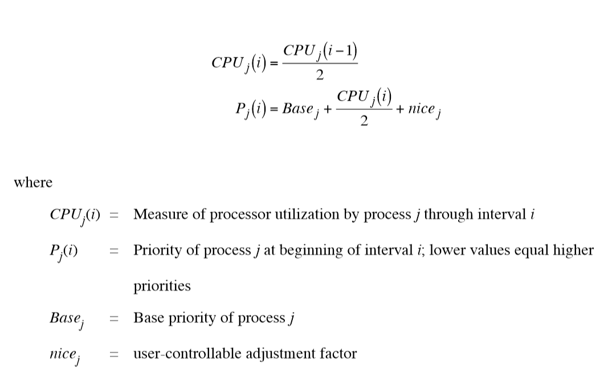

# 调度算法
### 多级反馈轮转调度（round robin with multiple feedback）
* 内核给进程分配一个CPU时间片，抢占一个超过其时间片的进程，并把它反馈到若干优先级队列中的某一个队列。
* 一个进程在它结束之前，可能需要多次通过“反馈轮转”。

* 每次重新计算优先级值的效果是，具有用户级优先级的进程在优先级队列之间移动
* 内核不改变核心态进程的优先级
* 时钟中断处理程序中，会改变处于用户态进程的优先级
* 不允许具有用户级优先级的进程跨越优先级阈值而获得核心级优先级，除非通过系统调用陷入内核
* 进程进入哪个核心态优先级队列的依据不是运行时的特性，而是根据睡眠原因而定的常量（hard-coded）
* 换句话说，核心态进程优先级值是常量

### System V的进程优先级计算公式

在下面例中Base = 60

* 不同版本的UNIX上的CPU衰减公式和优先级公式并不一样

# 公平共享调度（Fair Share Scheduling）
###公平共享调度的原则
* 将用户团体分为一些公平共享组
* 每组成员受到常规的进程调度的限制，即组内成员公平共享
* CPU时间按比例分配给每个组，不考虑组中成员有多少
  * 可以理解为，从组外来看，每个组作为一个单位与其他进程参与调度；组内则平均分配CPU时间。

# 参考资料
* https://en.wikipedia.org/wiki/Scheduling_%28computing%29
* https://en.wikipedia.org/wiki/Multilevel_feedback_queue
* https://en.wikipedia.org/wiki/Fair-share_scheduling
* https://en.wikipedia.org/wiki/Round-robin_scheduling
