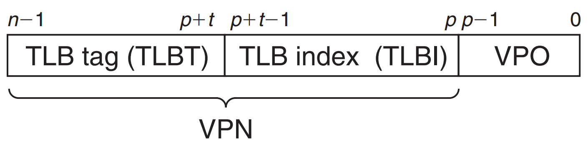
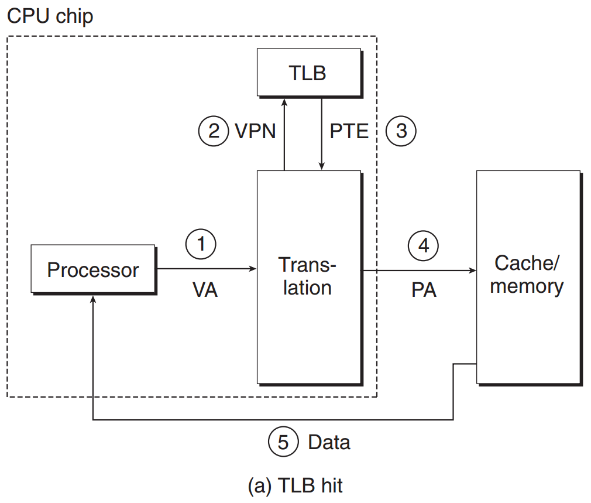
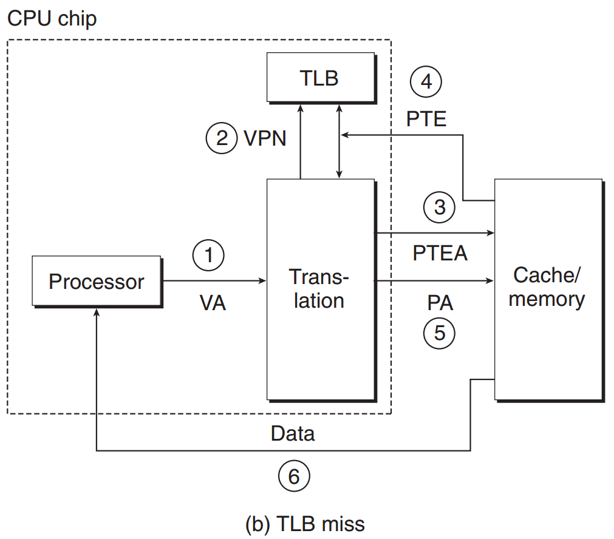
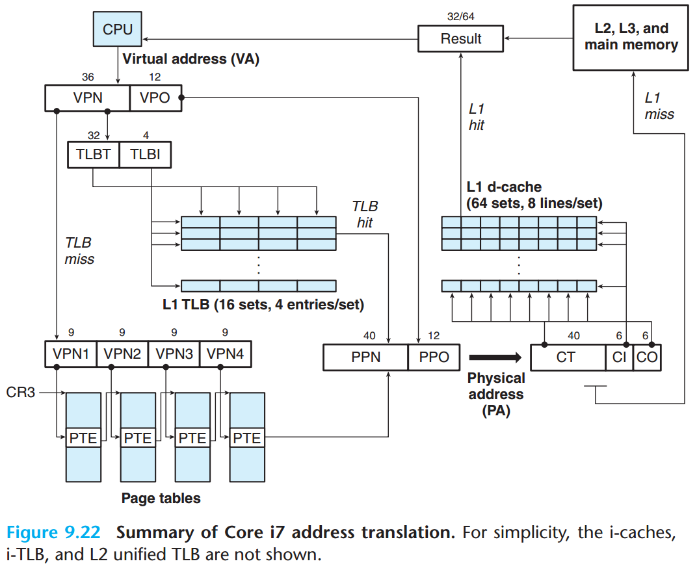

# TLB
* TLB (Translation Lookaside Buffer) 翻译后备缓冲器
### TLB 的组成部分

* VPN: virtual page number
* VPO: virtual page offset
### TLB 命中

### TLB 不命中

## 地址翻译的例子

* x86-64 用虚拟地址的 48 位进行寻址，其中高 36 位为虚拟页号（VPN），低 12 位为虚拟页中的偏移（VPO）
* L1 TLB 有 16 组，每组 4 个条目
* 虚拟地址的 36 位 VPN 用来查找 TLB，因为 TLB 有 16 组，所以用 4 位来索引 TLB，即 TLBI，剩下的 32 位作为 TLBT
  * 如果 TLB 命中，则得到 PTE 中的 40 位的物理页号（PPN），12 位的 VPO 对应到同样是 12 位的 PPO，组合起来得到物理地址
  * 如果 TLB 不命中，即 PTE 没被缓存，那么 MMU 会先在 paging-structure-cache 条目中寻找页目录
  * 如果还找不到，则只能从主存中取到 pagetable 并 walk，并最终形成物理地址
* x86-64 默认用的四级页表完成地址转换，虚拟地址段的划分是 **9-9-9-9-12**
  * VPN[1-4] 之所以用 9 位，是因为默认采用 4KB 的页，而一个页表条目为 64 bit，8 Byte，因此一个页能存下 512 个页表条目，故而用 9 位来索引
* 顶级页表 PGD 的物理地址存在 `CR3` 寄存器中，进程切换时需要加载换入进程的 PGD 到 `CR3`
* 通过查找页表最终得到对应的物理地址，否则 MMU 会触发一个缺页异常
* Core i7 的 Cache 在 MMU 之后，因此是 **物理高速缓存**，缓存的是物理地址中的内容
* L1 d-cache 有 64 组 8 路组相联
  * 有 64 组，故而高速缓存索引 CI 用了 6 位
  * CO 用了 6 位，说明一个 cache line 有 64 个块
  * 剩余的 40 位作为高速缓存标识 CT
* 高速缓存命中直接将物理地址的内容返回给 CPU
* 高速缓存不命中，则到下一级高速缓存中查找
* `PPO 12 位 = CI 6 位 + CO 6 位`不是偶然，包括 L1 d-cache 的组数和 cache line 的大小，都不是偶然，而是一种刻意的优化，CPU 需要翻译一个地址时，VPN 发给 MMU，VPO 发送给 L1 cache，这样查找 TLB 的同时可以进行 Cache 的查找
