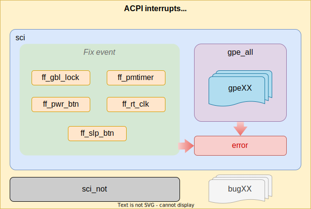

# ACPI 中断统计

## ACPI 中断
### ACPI 硬件规范
#### 电源按钮
* 首先来看电源按钮（Power Button）。在 ACPI 中，定义了两种 Power Button 的实现方法，第一种就是比较经典的硬件按钮 + 中断的模式，当按下按钮的时候，中断状态（`PWRBTN_STS`）拉高，如果此时中断使能（`PWRBTN_EN`）也为高，就触发中断。这时候操作系统就知道电源键被按下了，开始进行关机操作。
* 第二种实现方法则利用了 ACPI 的可编程性。具体来说，当按下电源键的时候，操作系统会收到一个 SCI（System Control Interrupt），此时操作系统会根据中断编号，去执行 ACPI 中的函数，函数去读取当前的电源键状态，然后调用 Notify 函数来通知操作系统，电源键被按下了。

### GPE
* 除了上面 PM1 中提到的一些中断来源，ACPI 还提供了通用的 General Purpose Event，硬件可以自定义一些中断编号，依然是通过 SCI 中断通知操作系统，操作系统根据 GPE 的 `STS` 寄存器来判断哪个 GPE 触发了中断，然后执行对应的 ACPI 函数。
* GPE 的地址也是在 FADT 中提供：
```
[050h 0080   4]           GPE0 Block Address : 0000AFE0
[05Ch 0092   1]           GPE0 Block Length : 04
```
* 在 DSDT 的 `\_GPE` 下面，可以定义函数，在 GPE 到达的时候，会被操作系统执行。
  * 格式是 `\_GPE._Exx` 或 `\_GPE._Lxx`，`E` 表示 Edge sensitive，`L` 表示 Level sensitive。
  * 例如操作系统判断收到了 GPE `4`，那可能会执行 `\_GPE._L04` 或 `\_GPE._E04` 函数。

## ACPI 中断号和中断线程

* 对应的 IRQ 号通常为 `9`
```sh
$ cat /proc/interrupts
           CPU0       CPU1       CPU2       CPU3
  1:          0          9          0          0   IO-APIC   1-edge      i8042
  4:          0          0          0        339   IO-APIC   4-edge      ttyS0
  8:          0          0          0          0   IO-APIC   8-edge      rtc0
  9:       1170          0          0          0   IO-APIC   9-fasteoi   acpi
...
```
* 这个计数是由中断处理框架统计的，在分发给对应的中断处理程序之前，因此应大于或等于 `/sys/firmware/acpi/interrupts/sci`
  * 代码见 `kstat_incr_irqs_this_cpu()` 和 kernel/irq/proc.c:`show_interrupts()`
* 对应的中断处理线程为 `[irq/9-acpi]`
```sh
$ ps aux | grep -i irq | grep -i acpi | grep -v grep
root          62  0.0  0.0      0     0 ?        S    03:18   0:00 [irq/9-acpi]
```

## `/sys/firmware/acpi/interrupts/`

* 所有 ACPI 中断都通过单个 IRQ（系统控制中断（System Control Interrupt，SCI））进行处理，它在 `/proc/interrupts` 中显示为“`acpi`”。
* 但是，ACPI 的主要功能之一是使平台无需特殊驱动程序支持即可理解随机硬件。
  * 因此，虽然 SCI 处理一些众所周知的（固定功能）中断源，例如电源按钮，但它也可以处理可变数量的“通用目的事件”（General Purpose Events，GPE）。
* GPE 指向 AML 中的指定处理程序，它可以执行 BIOS 编写者希望从 OS 上下文执行的任何操作。
  * 例如，GPE `0x12` 将指向名为 `_L12` 或 `_E12` 的 *水平* 或 *边缘* 处理程序。
    * 处理程序可以执行其任务并返回。
    * 或者，处理程序可以向在 ACPI 设备上注册的 Linux 设备驱动程序（例如电池或处理器）发送通知事件。
* 为了查明所有 SCI 的来源，`/sys/firmware/acpi/interrupts` 包含一个文件，列出了所有可能的来源以及触发的次数：

```sh
$ cd /sys/firmware/acpi/interrupts
$ grep . *
error:         0
ff_gbl_lock:   0   enable
ff_pmtimer:    0  invalid
ff_pwr_btn:    0   enable
ff_rt_clk:     2  disable
ff_slp_btn:    0  invalid
gpe00:         0  invalid
gpe01:         0   enable
gpe02:       108   enable
gpe03:         0  invalid
gpe04:         0  invalid
gpe05:         0  invalid
gpe06:         0   enable
gpe07:         0   enable
gpe08:         0  invalid
gpe09:         0  invalid
gpe0A:         0  invalid
gpe0B:         0  invalid
gpe0C:         0  invalid
gpe0D:         0  invalid
gpe0E:         0  invalid
gpe0F:         0  invalid
gpe10:         0  invalid
gpe11:         0  invalid
gpe12:         0  invalid
gpe13:         0  invalid
gpe14:         0  invalid
gpe15:         0  invalid
gpe16:         0  invalid
gpe17:      1084   enable
gpe18:         0   enable
gpe19:         0  invalid
gpe1A:         0  invalid
gpe1B:         0  invalid
gpe1C:         0  invalid
gpe1D:         0  invalid
gpe1E:         0  invalid
gpe1F:         0  invalid
gpe_all:    1192
sci:        1194
sci_not:       0
```

名词         | 解释
-------------|------------------------------------------
`sci`        | ACPI SCI 被调用并声明（claimed）中断的次数
`sci_not`    | ACPI SCI 被调用但 **未** 声明中断的次数
`gpe_all`    | GPE 导致的 SCI 数量
`gpeXX`      | 单个 GPE 源计数
`ff_gbl_lock`| 全局锁
`ff_pmtimer` | PM 定时器
`ff_pwr_btn` | 电源键 Power Button
`ff_rt_clk`  | 实时时钟 Real Time Clock
`ff_slp_btn` | 睡眠键 Sleep Button
`error`      | 一次上述无法解释的中断
`invalid`    | 它要么是 GPE，要么是没有事件处理程序的固定事件
`disable`    | GPE/Fixed 事件有效但已被禁用
`enable`     | GPE/Fixed 事件有效且已启用。

* Root 有权限清除任何这些计数器。例如：
```
# echo 0 > gpe11
```
* 可以通过清除总计“`sci`”来清除所有计数器：
```
# echo 0 > sci
```
* 这些计数器均不会影响系统的功能，它们只是统计数据。
* 除此之外，用户还可以将特定字符串写入这些文件以启用/禁用/清除用户空间中的 ACPI 中断，这可用于调试某些 ACPI 中断风暴问题。
* 请注意，只允许写入 VALID GPE/Fixed Event，即用户只能在安装了事件处理程序的情况下更改运行时 GPE 和 Fixed Event 的状态。
* 让我们以电源按钮固定事件为例，需终止 `acpid` 和其他用户空间应用程序，以便按下电源按钮时机器不会关闭：
```sh
# cat ff_pwr_btn
0     enabled
# press the power button for 3 times;
# cat ff_pwr_btn
3     enabled
# echo disable > ff_pwr_btn
# cat ff_pwr_btn
3     disabled
# press the power button for 3 times;
# cat ff_pwr_btn
3     disabled
# echo enable > ff_pwr_btn
# cat ff_pwr_btn
4     enabled
/*
 * 这是因为即使清除了启用位，状态位也会被设置，并且当再次设置启用位时，它会触发 ACPI 固定事件
 */
# press the power button for 3 times;
# cat ff_pwr_btn
7     enabled
# echo disable > ff_pwr_btn
# press the power button for 3 times;
# echo clear > ff_pwr_btn     /* clear the status bit */
# echo disable > ff_pwr_btn
# cat ff_pwr_btn
7     enabled
```
## 源码解析
### ACPI 中断设置
* ACPI 的中断处理函数通过以下路径设置：
```cpp
(gdb) bt
#0  acpi_os_install_interrupt_handler (gsi=9, handler=handler@entry=0xffffffff81aa77f0 <acpi_ev_sci_xrupt_handler>,
    context=0xff1100010090e760) at drivers/acpi/osl.c:559
#1  0xffffffff81aa78bf in acpi_ev_install_sci_handler ()
    at drivers/acpi/acpica/evsci.c:156
#2  0xffffffff81aa40be in acpi_ev_install_xrupt_handlers ()
    at drivers/acpi/acpica/evevent.c:94
#3  0xffffffff846e793c in acpi_enable_subsystem (flags=flags@entry=2)
    at drivers/acpi/acpica/utxfinit.c:184
#4  0xffffffff846e4fe6 in acpi_bus_init () at drivers/acpi/bus.c:1356
#5  0xffffffff846e519b in acpi_init () at drivers/acpi/bus.c:1447
#6  0xffffffff81000f31 in do_one_initcall (fn=0xffffffff846e5140 <acpi_init>)
    at init/main.c:1267
#7  0xffffffff8467c834 in do_initcall_level (command_line=0xff1100010037e000 "root", level=4)
    at init/main.c:1329
#8  do_initcalls () at init/main.c:1345
#9  0xffffffff8467cba8 in do_basic_setup () at init/main.c:1364
#10 kernel_init_freeable () at init/main.c:1578
#11 0xffffffff824c0c56 in kernel_init (unused=<optimized out>) at init/main.c:1467
#12 0xffffffff810465ed in ret_from_fork (prev=<optimized out>, regs=0xffa000000001bf58, fn=0xffffffff824c0c40 <kernel_init>,
    fn_arg=0x0 <fixed_percpu_data>) at arch/x86/kernel/process.c:144
#13 0xffffffff81002e4a in ret_from_fork_asm () at arch/x86/entry/entry_64.S:244
#14 0x0000000000000000 in ?? ()
```
* `acpi_os_install_interrupt_handler()` 安装 ACPI 的中断处理函数为 `acpi_ev_sci_xrupt_handler()`
  * 并且会调用 `acpi_irq_stats_init()` 注册 `/sys/firmware/acpi/interrupts/` 下的统计文件
  * drivers/acpi/osl.c
```cpp
acpi_os_install_interrupt_handler(u32 gsi, acpi_osd_handler handler,
                  void *context)
{
    unsigned int irq;
    //注册 /sys/firmware/acpi/interrupts/ 下的统计文件
    acpi_irq_stats_init();
    //我看到的值是 9，与 /proc/interrupt 里 acpi 的 IRQ number 一致
    /*
     * ACPI interrupts different from the SCI in our copy of the FADT are
     * not supported.
     */
    if (gsi != acpi_gbl_FADT.sci_interrupt)
        return AE_BAD_PARAMETER;
    //如果已安装过了，不再安装
    if (acpi_irq_handler)
        return AE_ALREADY_ACQUIRED;

    if (acpi_gsi_to_irq(gsi, &irq) < 0) {
        pr_err("SCI (ACPI GSI %d) not registered\n", gsi);
        return AE_OK;
    }
    //安装中断处理函数 acpi_ev_sci_xrupt_handler() 和上下文 acpi_gbl_gpe_xrupt_list_head
    acpi_irq_handler = handler;
    acpi_irq_context = context;
    if (request_threaded_irq(irq, NULL, acpi_irq, IRQF_SHARED | IRQF_ONESHOT,
                     "acpi", acpi_irq)) {
        pr_err("SCI (IRQ%d) allocation failed\n", irq);
        acpi_irq_handler = NULL;
        return AE_NOT_ACQUIRED;
    }
    acpi_sci_irq = irq; //全局变量记录中断号，不是向量号

    return AE_OK;
}
```
* 注册后，ACPI 中断产生时调用的处理函数入口是 `acpi_irq()`
  * 再由该函数去调用之前安装的 `acpi_ev_sci_xrupt_handler(acpi_gbl_gpe_xrupt_list_head)`，可见对进来的 ACPI 中断，
    * 处理了，导致 `acpi_irq_handled`（文件 `sci`）的增加
    * 未处理，导致 `acpi_irq_not_handled`（文件 `sci_not`）的增加
  * 文件 `sci` 与 `sci_not` 中的计数是正交的
  * drivers/acpi/osl.c
```cpp
static irqreturn_t acpi_irq(int irq, void *dev_id)
{
    if ((*acpi_irq_handler)(acpi_irq_context)) {
        acpi_irq_handled++;
        return IRQ_HANDLED;
    } else {
        acpi_irq_not_handled++;
        return IRQ_NONE;
    }
}
```
* ACPI 中断处理函数下一层的入口是 `acpi_ev_sci_xrupt_handler()`
  * 可见它是按 **固定事件 -> 通用目的事件 -> host 安装的 SCI 处理程序** 的顺序处理的
  * drivers/acpi/acpica/evsci.c
```cpp
static u32 ACPI_SYSTEM_XFACE acpi_ev_sci_xrupt_handler(void *context)
{
    struct acpi_gpe_xrupt_info *gpe_xrupt_list = context;
    u32 interrupt_handled = ACPI_INTERRUPT_NOT_HANDLED;

    ACPI_FUNCTION_TRACE(ev_sci_xrupt_handler);

    /*
     * We are guaranteed by the ACPICA initialization/shutdown code that
     * if this interrupt handler is installed, ACPI is enabled.
     */

    /*
     * Fixed Events:
     * Check for and dispatch any Fixed Events that have occurred
     */
    interrupt_handled |= acpi_ev_fixed_event_detect();

    /*
     * General Purpose Events:
     * Check for and dispatch any GPEs that have occurred
     */
    interrupt_handled |= acpi_ev_gpe_detect(gpe_xrupt_list);

    /* Invoke all host-installed SCI handlers */

    interrupt_handled |= acpi_ev_sci_dispatch();
    //这个是全局的 sci 统计计数，理论上与 acpi_irq_handled，即 “sci” 文件中的计数相等
    acpi_sci_count++;
    return_UINT32(interrupt_handled);
}
```
* `acpi_irq_stats_init()` 注册 `/sys/firmware/acpi/interrupts/` 下的统计文件
  * include/acpi/actypes.h
```cpp
//五个固定事件
/*
 * Fixed events
 */
#define ACPI_EVENT_PMTIMER              0
#define ACPI_EVENT_GLOBAL               1
#define ACPI_EVENT_POWER_BUTTON         2
#define ACPI_EVENT_SLEEP_BUTTON         3
#define ACPI_EVENT_RTC                  4
#define ACPI_EVENT_MAX                  4
#define ACPI_NUM_FIXED_EVENTS           ACPI_EVENT_MAX + 1
```
  * drivers/acpi/sysfs.c
```cpp
//前面提到的 sci 和 non_sci 两个统计对应的全局变量
u32 acpi_irq_handled;
u32 acpi_irq_not_handled;
//额外的四个统计计数
#define COUNT_GPE 0
#define COUNT_SCI 1     /* acpi_irq_handled */
#define COUNT_SCI_NOT 2     /* acpi_irq_not_handled */
#define COUNT_ERROR 3       /* other */
#define NUM_COUNTERS_EXTRA 4
...
static u32 acpi_gpe_count; //注意，这里用的是静态全局变量
//在 /sys/firmware/acpi 下添加的 interrupts 属性组
static struct attribute_group interrupt_stats_attr_group = {
    .name = "interrupts",
};

...
void acpi_irq_stats_init(void)
{
    acpi_status status;
    int i;

    if (all_counters)
        return;

    num_gpes = acpi_current_gpe_count;
    num_counters = num_gpes + ACPI_NUM_FIXED_EVENTS + NUM_COUNTERS_EXTRA;

    all_attrs = kcalloc(num_counters + 1, sizeof(*all_attrs), GFP_KERNEL);
    if (all_attrs == NULL)
        return;

    all_counters = kcalloc(num_counters, sizeof(*all_counters), GFP_KERNEL);
    if (all_counters == NULL)
        goto fail;
    //这里会将 acpi_gbl_global_event_handler 函数指针设置为 acpi_global_event_handler()
    status = acpi_install_global_event_handler(acpi_global_event_handler, NULL);
    if (ACPI_FAILURE(status))
        goto fail;

    counter_attrs = kcalloc(num_counters, sizeof(*counter_attrs), GFP_KERNEL);
    if (counter_attrs == NULL)
        goto fail;

    for (i = 0; i < num_counters; ++i) {
        char buffer[12];
        char *name;

        if (i < num_gpes)
            sprintf(buffer, "gpe%02X", i);
        else if (i == num_gpes + ACPI_EVENT_PMTIMER)
            sprintf(buffer, "ff_pmtimer");
        else if (i == num_gpes + ACPI_EVENT_GLOBAL)
            sprintf(buffer, "ff_gbl_lock");
        else if (i == num_gpes + ACPI_EVENT_POWER_BUTTON)
            sprintf(buffer, "ff_pwr_btn");
        else if (i == num_gpes + ACPI_EVENT_SLEEP_BUTTON)
            sprintf(buffer, "ff_slp_btn");
        else if (i == num_gpes + ACPI_EVENT_RTC)
            sprintf(buffer, "ff_rt_clk");
        else if (i == num_gpes + ACPI_NUM_FIXED_EVENTS + COUNT_GPE)
            sprintf(buffer, "gpe_all");
        else if (i == num_gpes + ACPI_NUM_FIXED_EVENTS + COUNT_SCI)
            sprintf(buffer, "sci");
        else if (i == num_gpes + ACPI_NUM_FIXED_EVENTS + COUNT_SCI_NOT)
            sprintf(buffer, "sci_not");
        else if (i == num_gpes + ACPI_NUM_FIXED_EVENTS + COUNT_ERROR)
            sprintf(buffer, "error");
        else
            sprintf(buffer, "bug%02X", i);

        name = kstrdup(buffer, GFP_KERNEL);
        if (name == NULL)
            goto fail;

        sysfs_attr_init(&counter_attrs[i].attr);
        counter_attrs[i].attr.name = name;
        counter_attrs[i].attr.mode = 0644;
        counter_attrs[i].show = counter_show;
        counter_attrs[i].store = counter_set;

        all_attrs[i] = &counter_attrs[i].attr;
    }

    interrupt_stats_attr_group.attrs = all_attrs;
    if (!sysfs_create_group(acpi_kobj, &interrupt_stats_attr_group))
        return;

fail:
    delete_gpe_attr_array();
}
```
* `acpi_install_global_event_handler(acpi_global_event_handler, NULL)` 将 `acpi_gbl_global_event_handler` 函数指针设置为 `acpi_global_event_handler()`
* ACPI 的 Fixed event 处理函数 `acpi_ev_fixed_event_detect()` 和 GPE 处理函数 `acpi_ev_gpe_detect()` 都会通过函数指针 `acpi_gbl_global_event_handler` 调用 `acpi_global_event_handler()`
* `acpi_global_event_handler()` 根据 `event_type` 决定调用 `gpe_count()` 还是 `fixed_event_count()`，而它们根据 `event_number` 增加相应子项的计数
  * `event_number` 不在对应范围内的事件会被计入 `error`
  * drivers/acpi/sysfs.c
```cpp
static void gpe_count(u32 gpe_number)
{   //这里增加的是 drivers/acpi/sysfs.c 中的静态全局变量，不要和 drivers/acpi/acpica/acglobal.h 中声明的全局变量搞混
    acpi_gpe_count++;

    if (!all_counters)
        return;
    //如果在 GPE 事件的范围内，增加 GPE 子项的计数；否则计入 error 计数
    if (gpe_number < num_gpes)
        all_counters[gpe_number].count++;
    else
        all_counters[num_gpes + ACPI_NUM_FIXED_EVENTS +
                 COUNT_ERROR].count++;
}

static void fixed_event_count(u32 event_number)
{
    if (!all_counters)
        return;
    //如果在 Fixed 事件的范围内，增加 Fixed event 子项的计数；否则计入 error 计数
    if (event_number < ACPI_NUM_FIXED_EVENTS)
        all_counters[num_gpes + event_number].count++;
    else
        all_counters[num_gpes + ACPI_NUM_FIXED_EVENTS +
                 COUNT_ERROR].count++;
}

static void acpi_global_event_handler(u32 event_type, acpi_handle device,
    u32 event_number, void *context)
{   //根据事件类型来决定要增加 GPE 还是 Fixed 事件的子项的计数
    if (event_type == ACPI_EVENT_TYPE_GPE) {
        gpe_count(event_number);
        pr_debug("GPE event 0x%02x\n", event_number);
    } else if (event_type == ACPI_EVENT_TYPE_FIXED) {
        fixed_event_count(event_number);
        pr_debug("Fixed event 0x%02x\n", event_number);
    } else {
        pr_debug("Other event 0x%02x\n", event_number);
    }
}
```

### 全局统计计数
* 另外还有几个全局的统计计数在 drivers/acpi/acpica/acglobal.h 中定义
```cpp
/* Event counters */

ACPI_GLOBAL(u32, acpi_method_count);                             //在 acpi_ds_begin_method_execution() 中增加
ACPI_GLOBAL(u32, acpi_gpe_count);                                //在 acpi_ev_detect_gpe() 中增加
ACPI_GLOBAL(u32, acpi_sci_count);                                //在 acpi_ev_sci_xrupt_handler() 中增加
ACPI_GLOBAL(u32, acpi_fixed_event_count[ACPI_NUM_FIXED_EVENTS]); //在 acpi_ev_fixed_event_detect() 中增加
```
* 注意：它们并不与 `/sys/firmware/acpi/interrupts` 下的文件的统计计数共用变量，而是自己独立统计，不要混淆
* drivers/acpi/acpica/utxface.c:`acpi_get_statistics()` 中会使用到这些变量

## References
- [Kernel doc - ABI testing symbols](https://docs.kernel.org/admin-guide/abi-testing.html#file-testing-sysfs-firmware-acpi)
- [ACPI 学习笔记](https://jia.je/hardware/2022/12/10/acpi-notes/)