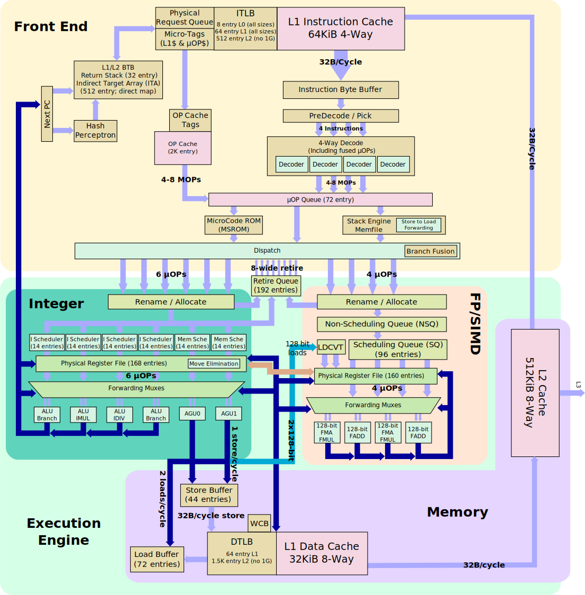

# 内存屏障

* 谈及内存屏障，不理解 Store Buffer 和 Write Combine Buffer 不行，这两个 buffer 涉及处理器微架构，搬出两张微架构块图镇楼
#### Intel Skylake

#### AMD ZEN 5


* **barrier**：可能重新排序和写的处理器提供了机器指令来确保顺序要求，这些确保顺序的指令称为 *屏障*。
* `volatile`关键字可以 **防止编译器的优化**，主要体现在以下三个方面：
  * 不会从寄存器中读取变量，而是重新从内存中取。
  * 不要对变量进行各种激进的优化，甚至将变量直接消除，保证程序员写在代码中的指令，一定会被执行。
  * `volatile`变量间的操作，不会被编译器交换顺序。
* `volatile`防止编译器优化的目的是确保数据能够被按顺序地无误地写入到内存，而不会因为编译器的原因产生偏差，设想某个变量其实对应的是通过`ioremap()`到内存的某个硬件寄存器，或者 x86 里变量要通过`in`或`out`指令访问的 I/O 空间。
* 即便是用`volatile`声明来防止编译器对变量操作的重新排序，仍然有可能会因为处理器优化 pipeline 的原因对指令重新排序，因此内存屏障仍然是很重要的。
* 对于 SMP，`smp_rmb()` , `smp_wmb()` , `smp_mb()` 和 `smp_read_barrier_depends()`是常用的 *内存屏障*（如 x86 的`mfence`指令）；对于 UP，则被定义为 *编译器屏障*，如 gcc 的`#define barrier() __asm__ __volatile__("": : :"memory")`。
* *内存屏障* 可以完成 *编译器屏障* 的功能，但编译器屏障要比处理器屏障 **轻量**（它实际上是轻快的）得多。
* 实际上，编译器屏障几乎是空闲的，因为它只防止编译器可能的重排指令。
* 不同体系架构，屏障的实际效果差别很大。如 x86 不会打乱存储，`wmb()`就什么也不做。
* 为最坏的情况（即排序能力最弱的处理器）使用恰当的内存屏障，代码才能在编译时执行针对体系结构的优化。

#### Memory and Compiler Barrier Methods

Barrier   | Description
----------|-------------
rmb()     | Prevents loads from being reordered across the barrier
read_barrier_depends() | Prevents data-dependent loads from being reordered across the barrier
wmb()     | Prevents stores from being reordered across thebarrier
mb()      | Prevents load or stores from being reordered across the barrier
smp_rmb() | Provides an rmb() on SMP, and on UP provides a barrier()
smp_read_barrier_depends() | Provides a read_barrier_depends() on SMP, and provides a barrier() on UP
smp_wmb() | Provides a wmb() on SMP, and provides a barrier() on UP
smp_mb()  | Provides an mb() on SMP, and provides a barrier() on UP
barrier() | Prevents the compiler from optimizing stores or loads across the barrier

## 编译器屏障
* `volatile`关键字
* `READ_ONCE()/WRITE_ONCE()`其实用的也是`volatile`关键字，但没有采用`lock`前缀，并不能保证原子性
* `barrier()`宏/编译器扩展
  * include/linux/compiler.h
  ```c
  /* Optimization barrier */
  #ifndef barrier
  /* The "volatile" is due to gcc bugs */
  # define barrier() __asm__ __volatile__("": : :"memory")
  #endif
  ```

## 处理器内存屏障
* 谈及乱序谈论的是 **顺序性**，一般会涉及 *不同的存储位置* 和 *多个处理器*
* 乱序的起因是因为处理器的 store buffer，而不是 cache，因为 *高速缓存一致性协议（cache consistency protocol）* 能保证同一地址里的数据在多核的 cache 之间保持一致
* 内存屏障保证的只是本 CPU 上的指令执行顺序，进而间接保证其他 CPU 观察到的数据变化顺序，而不保证其他 CPU 上的执行顺序
* 内存屏障的使用应该成对，例如`smp_wmb`必须配对`smp_rmb`或者`smp_mb`，单独使用`smp_wmb`是达不到顺序效果的。同样`smp_rmb`必须配对使用`smp_wmb`或者`smp_mb`。
* 考虑以下观点：

> * store buffer 的作用是为了解决`store`操作执行 invalid 操作需要等待其它 CPU 响应 invalidate response 造成的 cpu stall 问题。
> * 所有架构的 store buffer 都是 FIFO，但是 FIFO 并不能保证`store`操作的顺序。
>   * 如果 CPU 是某内存地址对应 cache line 的 owner（modified/exclusive 状态），CPU 在执行该地址的`store`操作时不需要 invalid 其它 CPU 的 cache line，因此不需要将该操作放入 store buffer 中直接更新 cache line 就行了，这样就导致了该 cache line 先于 store buffer 中的地址可见，可能会造成乱序。
>   * `wb` 的作用是不管当前 CPU 是否是 cache line 的 owner，在执行对应物理地址的`store`操作时将其排在 store buffer 中，由该 buffer 的 FIFO 性质来保证写入的顺序。


## 抽象内存访问模型
* 考虑以下系统抽象模型：
```
               :                :
               :                :
               :                :
   +-------+   :   +--------+   :   +-------+
   |       |   :   |        |   :   |       |
   |       |   :   |        |   :   |       |
   | CPU 1 |<----->| Memory |<----->| CPU 2 |
   |       |   :   |        |   :   |       |
   |       |   :   |        |   :   |       |
   +-------+   :   +--------+   :   +-------+
       ^       :       ^        :       ^
       |       :       |        :       |
       |       :       |        :       |
       |       :       v        :       |
       |       :   +--------+   :       |
       |       :   |        |   :       |
       |       :   |        |   :       |
       +---------->| Device |<----------+
               :   |        |   :
               :   |        |   :
               :   +--------+   :
               :                :
```
* 每个 CPU 都会执行一个生成内存访问操作的程序。
  * 在抽象的 CPU 中，内存操作顺序非常宽松，CPU 实际上可以按照它喜欢的任何顺序执行内存操作，只要程序因果关系看起来得到了维持。
  * 同样，编译器也可以按照它喜欢的任何顺序排列它发出的指令，只要它不影响程序的明显操作。
* 因此，在上图中，当操作跨越 CPU 与系统其余部分之间的接口（虚线）时，CPU 执行的内存操作的影响会被系统其余部分感知到。
* 例如，考虑以下事件序列：
  ```c
  CPU 1           CPU 2
  =============== ===============
  { A == 1; B == 2 }
  A = 3;          x = B;
  B = 4;          y = A;
  ```
* 中间的内存系统所看到的访问集可以排列成 24 种不同的组合：
  ```c
  STORE A=3,      STORE B=4,      y=LOAD A->3,    x=LOAD B->4
  STORE A=3,      STORE B=4,      x=LOAD B->4,    y=LOAD A->3
  STORE A=3,      y=LOAD A->3,    STORE B=4,      x=LOAD B->4
  STORE A=3,      y=LOAD A->3,    x=LOAD B->2,    STORE B=4
  STORE A=3,      x=LOAD B->2,    STORE B=4,      y=LOAD A->3
  STORE A=3,      x=LOAD B->2,    y=LOAD A->3,    STORE B=4
  STORE B=4,      STORE A=3,      y=LOAD A->3,    x=LOAD B->4
  STORE B=4, ...
  ...
  ```
* 因此可以得到四种不同的值组合：
  ```c
  x == 2, y == 1 //二者都读到旧值
  x == 2, y == 3 //x 旧 y 新
  x == 4, y == 1 //x 新 y 旧
  x == 4, y == 3 //二者都读到新值
  ```
* 此外，一个 CPU 提交给内存系统的 stores 可能无法被另一个 CPU 的 loads 感知其提交时 stores 的顺序。
* 再举一个例子，考虑以下事件序列：
  ```c
  CPU 1           CPU 2
  =============== ===============
  { A == 1, B == 2, C == 3, P == &A, Q == &C }
  B = 4;          Q = P;
  P = &B;         D = *Q;
  ```
* 这里存在明显的地址依赖性，因为加载到 `D` 中的值取决于 CPU 2 从 `P` 获取到的地址。在序列结束时，可能出现以下任何结果：
  ```c
  (Q == &A) and (D == 1) //CPU2 上的指令先于 CPU1 执行
  (Q == &B) and (D == 2) //CPU2 上观察到 CPU1 上的 stroe 是乱序的
  (Q == &B) and (D == 4) //CPU2 上观察到 CPU1 上的 store 是顺序的
  ```
* 注意，CPU 2 永远不会尝试将 `C` 加载到 `D` 中，因为 CPU 会在发出 `*Q` 的加载之前将 `P` 加载到 `Q` 中。
  * **译注**：对于可见的数据依赖，是不会产生乱序的。CPU1 上的 stores 在 CPU1 看来并不构成数据依赖，所以可能乱序。

### 设备操作
* 某些设备将其控制接口显示为内存位置的集合，但访问控制寄存器的顺序非常重要。
* 例如，假设有一张以太网卡，它有一组内部寄存器，可通过地址 port 寄存器（`A`）和数据 port 寄存器（`D`）进行访问。要读取内部寄存器 `5`，可以使用以下代码：
  ```c
  *A = 5;
  x = *D;
  ```
* 但这可能会显示为以下两个序列之一：
  ```c
  STORE *A = 5, x = LOAD *D //期望的顺序
  x = LOAD *D, STORE *A = 5 //不期望出现的乱序
  ```
* 第二种情况几乎肯定会导致故障，因为它在尝试读取寄存器 *之后* 设置了地址。

### 保障
#### 对一个 CPU 可以期望的最小保障
* 在任何给定的 CPU，对它自己的 *有依赖的* 内存访问将会按顺序发送，这意味着：
  ```c
  Q = READ_ONCE(P); D = READ_ONCE(*Q);
  ```
  CPU 将发出以下内存操作：
  ```c
  Q = LOAD P, D = LOAD *Q
  ```
  并且始终按照该顺序执行。
  * 然而，在 DEC Alpha 上，`READ_ONCE()` 还会发出内存屏障指令，因此 DEC Alpha CPU 将改为发出以下内存操作：
  ```c
  Q = LOAD P, MEMORY_BARRIER, D = LOAD *Q, MEMORY_BARRIER
  ```
  无论是否在 DEC Alpha 上，`READ_ONCE()` 也能防止编译器的恶作剧。
* 在同一 CPU 上，对同一位置的 load 和 store 的顺序在该 CPU 上是顺序的，这意味着：
  ```c
  a = READ_ONCE(*X); WRITE_ONCE(*X, b);
  ```
  CPU 只会发出以下一系列的内存操作：
  ```c
  a = LOAD *X, STORE *X = b
  ```
  以及：
  ```c
  WRITE_ONCE(*X, c); d = READ_ONCE(*X);
  ```
  CPU 只会发出：
  ```c
  STORE *X = c, d = LOAD *X
  ```
  （如果 load 和 store 的目标是同一内存位置，则它们会重叠）。

#### “一定”或“一定不要”假设的事情
* 对于未被`READ_ONCE()`和`WRITE_ONCE()`保护的内存引用，**一定不要** 假设编译器会帮你做保护。缺乏他们，编译器有权利做任何它认为“有创造性”的变换。
* **一定不要** 假设 **无关联的** load 和 store 会按给定的顺序发送。这意味着：
  ```c
  X = *A; Y = *B; *D = Z;
  ```
  我们可能会得到以下任意一个序列：
  ```c
  X = LOAD *A,  Y = LOAD *B,  STORE *D = Z //最直观的顺序
  X = LOAD *A,  STORE *D = Z, Y = LOAD *B
  Y = LOAD *B,  X = LOAD *A,  STORE *D = Z
  Y = LOAD *B,  STORE *D = Z, X = LOAD *A
  STORE *D = Z, X = LOAD *A,  Y = LOAD *B
  STORE *D = Z, Y = LOAD *B,  X = LOAD *A
  ```
* **一定要** 假设对同一位置的内存访问会被合并或丢弃。这意味着：
  ```c
  X = *A; Y = *(A + 4);
  ```
  可能会按以下次序之一运行（译注：load-load 乱序？）：
  ```c
  X = LOAD *A; Y = LOAD *(A + 4);
  Y = LOAD *(A + 4); X = LOAD *A;
  {X, Y} = LOAD {*A, *(A + 4) };
  ```
  以及：
  ```c
  *A = X; *(A + 4) = Y;
  ```
  可能会按以下次序之一运行（译注：store-store 乱序？）：
  ```c
  STORE *A = X; STORE *(A + 4) = Y;
  STORE *(A + 4) = Y; STORE *A = X;
  STORE {*A, *(A + 4) } = {X, Y};
  ```
#### 无保障的事情
* 这些保证不适用于位域，因为编译器经常生成 *非原子的读取-修改-写入序列* 的代码来修改他们，因此，不要尝试使用位域来同步并行算法。 
* 即使在位域受锁保护的情况下，给定位域中的所有字段也必须由一个锁保护。
  * 如果给定位域中的两个字段由不同的锁保护，编译器的 *非原子读-修改-写序列* 可能会导致对一个字段的更新破坏相邻字段的值。
* 这些保证仅适用于正确对齐和大小标准的变量。
  * “适当大小”目前是指与 `char`、`short`、`int` 和 `long` 大小相同的变量。
  * “正确对齐”是指自然对齐，因此 `char` 没有约束，`short` 是两字节对齐，`int` 是四字节对齐，`long` 在 32 位和 64 位系统上分别是四字节或八字节对齐。
  * 注意，这些保证已被引入 C11 标准，因此在使用旧的 C11 之前的编译器（例如 gcc 4.6）时要小心。包含此保证的标准部分是第 3.14 节，其中定义“内存位置”如下：
* **内存位置**：一个标量类型的对象或相邻位域的最大序列都有非零的宽度
  * **注意 1**: 两个执行线程可以分别更新和访问不同的内存位置，而不会相互干扰
  * **注意 2**: 一个位域和一个相邻的非位域成员位于不同的内存位置。
    * 如果两个位域，一个在嵌套结构声明中声明而另一个没有，或者如果两者由零长度位域声明分隔，或者如果它们由非位域成员声明，这同样适用。
    * 无论这些中间位域的大小恰好是什么，如果在它们之间声明的所有成员也是位域，则同时更新同一结构中的两个位域是不安全的。

## 什么是内存屏障？
* 如上所示，独立内存操作实际上是以随机顺序执行的，但这对于 CPU-CPU 交互和 I/O 来说可能是一个问题。需要某种干预方式来指示编译器和 CPU 来限制（访问内存的）顺序。
* 内存屏障就是这样的干预。它们对屏障两侧的内存操作施加可感知的部分排序。
* 这种强制执行很重要，因为系统中的 CPU 和其他设备可以使用各种技巧来提高性能，包括重新排序、延迟和组合内存操作；推测性加载；推测性分支预测和各种类型的缓存。
  * 内存屏障用于覆盖或抑制这些技巧，允许代码合理地控制多个 CPU 和/或设备的交互。

### 内存屏障的种类
* 内存屏障有四种基本类型：
1. 写（或 store）内存屏障
   * 写屏障保证了相对于系统的其他组件而言，屏障之前指定的所有 store 操作都发生在屏障之后指定的所有 store 操作之前。
   * 写屏障仅对 stores 进行部分排序；它不需要对 loads 产生任何影响。
   * 可以将 CPU 视为随着时间的推移将 stores 操作序列提交给内存系统。写屏障 *之前* 的所有 stores 都将发生在写屏障之后的所有 stores *之前*。
   * **注意**，写屏障通常应与 *读* 或 *地址依赖* 屏障配对；请参阅“SMP 屏障配对”小节。
2. 地址依赖屏障（历史）
   * 本节被标记为 *历史*：它涵盖了早已过时的 `smp_read_barrier_depends()` 宏，该宏的语义现在隐含在所有标记的访问中。有关更多最新信息，包括编译器转换有时如何破坏地址依赖关系，请参阅 Documentation/RCU/rcu_dereference.rst。
   * 地址依赖屏障是读屏障的较弱形式。如果执行两次 loads，而第二次 load 依赖于第一次 load 的结果（例如：第一次 load 获取第二次 load 将指向的地址），则需要使用地址依赖屏障来确保在访问第一次 load 获得的地址后更新第二次 load 的目标。
   * 地址依赖屏障仅对相互依赖的 loads 进行部分排序；它不需要对 stores、独立的 loads 或重叠 loads 产生任何影响。
   * 如（1）中所述，系统中的其他 CPU 可以被视为将 stores 序列提交给内存系统，然后所考虑的 CPU 可以感知这些 stores 序列。
     * 所考虑的 CPU 发出的地址依赖屏障保证，对于它之前的任何 loads，如果该 load 接触来自另一个 CPU 的 stores 序列之一，那么在屏障完成时，在 *地址依赖屏障之后发出的任何 loads* 都可以感知到该 loads 接触的 stores 之前的所有 stores 的影响。
   * 请参阅“内存屏障序列示例”小节，查看显示排序约束的图表。
   * **注意**，第一次 load 实际上必须具有 *地址* 依赖性，而不是控制依赖性。如果第二次 load 的地址依赖于第一次 load，但依赖性是通过条件而不是实际 load 地址本身，那么它就是 *控制* 依赖性，需要完全读屏障或更好的屏障。有关更多信息，请参阅“控制依赖性”小节。
   * **注意**，地址依赖屏障通常应与写屏障配对；请参阅“SMP 屏障配对”小节。
   * 内核版本 v5.9 删除了显式地址依赖屏障的内核 API。如今，用于标记来自共享变量的加载的 API（例如 `READ_ONCE()` 和 `rcu_dereference()`）提供了隐式地址依赖屏障。
3. 读（或 load）内存屏障
   * 读屏障是地址依赖屏障加上保证，即相对于系统的其他组件，屏障之前指定的所有 load 操作看起来都发生在屏障之后指定的所有 load 操作之前。
   * 读屏障仅对 loads 进行部分排序；它不需要对 stores 产生任何影响。
   * 读内存屏障意味着地址依赖屏障，因此可以替代它们。
   * **注意**，读屏障通常应与写屏障配对；请参阅“SMP 屏障配对”小节。
4. 通用内存屏障
   * 通用内存屏障保证了屏障之前指定的所有 load 和 store 操作相对于系统的其他组件而言，看起来都发生在屏障之后指定的所有 load 和 store 操作之前。
   * 通用内存屏障是对 load 和 store 的部分排序。
   * 通用内存屏障意味着读取和写入内存屏障，因此可以替代其中任何一个。
* 还有几种隐含的变体：
5. `ACQUIRE` 操作
   * 这充当了单向可渗透屏障。它保证了 `ACQUIRE` 操作 **之后** 的所有内存操作相对于系统的其他组件来说，看起来都发生在 `ACQUIRE` 操作 **之后**。
   * `ACQUIRE` 操作包括 `LOCK` 操作以及 `smp_load_acquire()` 和 `smp_cond_load_acquire()` 操作。
   * `ACQUIRE` 操作 **之前** 发生的内存操作可能看起来发生在 `ACQUIRE` 操作完成 **之后**。
   * `ACQUIRE` 操作几乎总是应该与 `RELEASE` 操作配对。
6. `RELEASE` 操作
   * 这也充当了单向可渗透屏障。它保证了 `RELEASE` 操作 **之前** 的所有内存操作相对于系统的其他组件来说，看起来都发生在 `RELEASE` 操作 **之前**。
   * `RELEASE` 操作包括 `UNLOCK` 操作和 `smp_store_release()` 操作。
   * `RELEASE` 操作 **之后** 发生的内存操作可能看起来发生在操作完成 **之前**。
   * 使用 `ACQUIRE` 和 `RELEASE` 操作通常可以避免使用其他类型的内存屏障。
     * 此外，`RELEASE+ACQUIRE` 对不能保证充当完整的内存屏障。
     * 但是，在对给定变量执行 `ACQUIRE` 之后，保证在对该变量执行任何先前的 `RELEASE` 之前的所有内存访问都是可见的。换句话说，在给定变量的临界区内，保证对该变量的所有先前临界区的所有访问都已完成。
   * 这意味着 `ACQUIRE` 充当最小的“获取”操作，而 `RELEASE` 充当最小的“释放”操作。
* atomic_t.txt 中描述的原子操作子集除了完全有序和宽松（无屏障语义）定义外，还具有 `ACQUIRE` 和 `RELEASE` 变体。
  * 对于执行 load 和 store 的复合 atomics，`ACQUIRE` 语义仅适用于 load，`RELEASE` 语义仅适用于操作的 store 部分。
* **仅在两个 CPU 之间或 CPU 与设备之间可能存在交互时才需要内存屏障**。如果可以保证在任何特定代码段中不会发生任何此类交互，则该代码段中不需要内存屏障。
* **注意**，这些是最低限度的保证。不同的架构可能会提供更实质性的保证，但在特定架构的代码之外，它们可能不被依赖。

### 关于内存屏障，哪些是不能假设的？
* Linux 内核内存屏障不能保证某些事情：
* 无法保证在内存屏障之前指定的任何内存访问在内存屏障指令完成时会 *完成*；可以认为屏障在该 CPU 的访问队列中划了一条线，相应类型的访问不得越过该线。
* 无法保证在一个 CPU 上发出内存屏障会对另一个 CPU 或系统中的任何其他硬件产生任何直接影响。间接影响将是第二个 CPU 看到第一个 CPU 访问发生的影响的顺序，但请参见下一点：
* 无法保证 CPU 会看到第二个 CPU 访问的正确影响顺序，即使 *如果* 第二个 CPU 使用内存屏障，除非第一个 CPU *也* 使用匹配的内存屏障（请参阅“SMP 屏障配对”小节）。
* 无法保证某些中间的 CPU 外硬件不会重新排序内存访问。CPU 缓存一致性机制应该在 CPU 之间传播内存屏障的间接影响，但可能不会按顺序传播。
  * 有关总线控制 DMA 和一致性的信息，请阅读：
    - Documentation/driver-api/pci/pci.rst
    - Documentation/core-api/dma-api-howto.rst
    - Documentation/core-api/dma-api.rst

### 地址依赖屏障（历史）
* 本节被标记为历史：它涵盖了早已过时的 `smp_read_barrier_depends()` 宏，其语义现在隐含在所有标记的访问中。有关更多最新信息，包括编译器转换有时如何破坏地址依赖关系，请参阅 Documentation/RCU/rcu_dereference.rst。
* 从 Linux 内核 v4.15 开始，`smp_mb()` 已添加到 DEC Alpha 的 `READ_ONCE()` 中，这意味着只有那些使用 DEC Alpha 架构特定代码的人和那些使用 `READ_ONCE()` 本身的人才需要关注本节。对于那些需要它的人，以及对历史感兴趣的人，这里是地址依赖屏障的故事。
* 虽然在 load-to-load 和 load-to-store 关系中都观察到地址依赖性，但地址依赖屏障对于 load-to-store 情况不是必需的。
* 地址依赖屏障的要求有点微妙，而且并不总是很明显。为了说明这一点，请考虑以下事件序列：
  ```c
  CPU 1                 CPU 2
  ===============       ===============
  { A == 1, B == 2, C == 3, P == &A, Q == &C }
  B = 4;
  <write barrier>
  WRITE_ONCE(P, &B);
                        Q = READ_ONCE_OLD(P);
                        D = *Q;
  ```
  `READ_ONCE_OLD()` 对应于 4.15 之前内核的 `READ_ONCE()`，它不暗示地址依赖性障碍。
  这里有明显的地址依赖性，并且似乎在序列结束时，`Q` 必须是 `&A` 或 `&B`，并且：
  ```c
  (Q == &A) implies (D == 1) //CPU2 上的指令先于 CPU1 的执行
  (Q == &B) implies (D == 4) //CPU1 上的指令先于 CPU2 的执行
  ```
  但是！CPU 2 对 `P` 的感知可能在对 `B` 的感知 *之前* 更新，从而导致以下情况：
  ```c
  (Q == &B) and (D == 2) ????
  ```
  虽然这看起来像是一致性或因果关系维护的失败，但事实并非如此，并且这种行为可以在某些真实 CPU（例如 DEC Alpha）上观察到。
* 为了解决这个问题，自内核版本 v4.15 以来，`READ_ONCE()` 提供了一个隐式地址依赖屏障：
  ```c
    CPU 1                 CPU 2
  ===============       ===============
  { A == 1, B == 2, C == 3, P == &A, Q == &C }
  B = 4;
  <write barrier>
  WRITE_ONCE(P, &B);
                        Q = READ_ONCE(P);
                        <implicit address-dependency barrier>
                        D = *Q;
  ```
  这会强制发生两种含义之一，并阻止第三种可能性的出现。
* **注意**，这种极其违反直觉的情况最容易出现在具有 split caches 的机器上，例如，一个 cache bank 处理偶数 cache lines，另一个 cache bank 处理奇数  cache lines。
  * 指针 `P` 可能存储在奇数 cache lines 中，变量 `B` 可能存储在偶数 cache lines 中。
  * 然后，如果读取 CPU 的 cache 的偶数组非常繁忙，而奇数组空闲，则可以看到指针 `P` 的新值（`&B`），但变量 `B` 的旧值（`2`）。
* 不需要地址依赖屏障来对依赖性写入进行排序，因为 Linux 内核支持的 CPU 只有在确定（1）写入确实会发生、（2）写入的位置和（3）要写入的值时，才会执行写入。
* 但请仔细阅读“控制依赖关系”部分和 Documentation/RCU/rcu_dereference.rst 文件：编译器可以并且确实会以许多极具创意的方式打破依赖关系。
  ```c
    CPU 1                 CPU 2
  ===============       ===============
  { A == 1, B == 2, C = 3, P == &A, Q == &C }
  B = 4;
  <write barrier>
  WRITE_ONCE(P, &B);
                        Q = READ_ONCE_OLD(P);
                        WRITE_ONCE(*Q, 5);
  ```
  因此，不需要地址依赖屏障来将读入 `Q` 与存储到 `*Q` 进行排序。换句话说，即使没有现代 `READ_ONCE()` 的隐式地址依赖屏障，这种结果是被禁止的：
  ```c
  (Q == &B) && (B == 4)
  ```
* 请注意，这种模式应该很少见。毕竟，依赖性排序的整个目的是 **防止** 写入数据结构，以及与这些写入相关的昂贵的 cache misses。
  * 此模式可用于记录罕见的错误情况等，而 CPU 自然发生的排序可防止此类记录丢失。
* **注意**，地址依赖性提供的顺序对于包含它的 CPU 来说是本地的。有关更多信息，请参阅“多副本原子性”部分。
* 例如，地址依赖性屏障对 RCU 系统非常重要。请参阅 include/linux/rcupdate.h 中的 `rcu_assign_pointer()` 和 `rcu_dereference()`。
  * 这允许将 RCU 指针的当前目标替换为新的修改目标，而不会使替换目标看起来未完全初始化。
* 另请参阅“Cache 一致性”小节以获取更详尽的示例。

### 控制依赖
* 控制依赖关系可能有点棘手，因为当前的编译器无法理解它们。本节的目的是帮助您防止编译器的无知破坏您的代码。
* load-load 控制依赖关系需要完整的读内存屏障，而不仅仅是（隐式）地址依赖屏障才能使其正常工作。
* 请考虑以下代码：
  ```c
  q = READ_ONCE(a);
  <implicit address-dependency barrier>
  if (q) {
          /* BUG: No address dependency!!! */
          p = READ_ONCE(b);
  }
  ```
  这不会产生预期的效果，因为没有实际的地址依赖关系，而是一种控制依赖关系，CPU 可能会通过尝试提前预测结果来短路，以至于其他 CPU 认为来自 `b` 的 load 发生在来自 `a` 的 load 之前。在这种情况下，实际需要的是：
  ```c
  q = READ_ONCE(a);
  if (q) {
          <read barrier>
          p = READ_ONCE(b);
  }
  ```
* 但是，stores 不是推测的。这意味着为 load-store 控制依赖关系提供了排序，如下例所示：
  ```c
  q = READ_ONCE(a);
  if (q) {
          WRITE_ONCE(b, 1);
  }
  ```
* 控制依赖关系通常与其他类型的屏障配对。也就是说，请注意 `READ_ONCE()` 和 `WRITE_ONCE()` 都不是可选的！
  * 如果没有 `READ_ONCE()`，编译器可能会将来自“`a`”的 load 与来自“`a`”的其他 loads 相结合。
  * 如果没有 `WRITE_ONCE()`，编译器可能会将对“`b`”的 store 与对“`b`”的其他 stores 相结合。
* 两者都会对排序产生非常违反直觉的影响。
* 更糟糕的是，如果编译器能够证明（比如说）变量“`a`”的值始终为非零，那么它完全有权通过消除“`if`”语句来优化原始示例，如下所示：
  ```c
  q = a;
  b = 1;  /* BUG: Compiler and CPU can both reorder!!! */
  ```
  所以不要忽略 `READ_ONCE()`。
* 尝试在“`if`”语句的两个分支上强制对相同的 stores 进行排序是很有吸引力的，如下所示：
  ```c
  q = READ_ONCE(a);
  if (q) {
          barrier();
          WRITE_ONCE(b, 1);
          do_something();
  } else {
          barrier();
          WRITE_ONCE(b, 1);
          do_something_else();
  }
  ```
  不幸的是，当前的编译器会在高优化级别下进行如下转换：
  ```c
  q = READ_ONCE(a);
  barrier();
  WRITE_ONCE(b, 1);  /* BUG: No ordering vs. load from a!!! */
  if (q) {
          /* WRITE_ONCE(b, 1); -- moved up, BUG!!! */
          do_something();
  } else {
          /* WRITE_ONCE(b, 1); -- moved up, BUG!!! */
          do_something_else();
  }
  ```
* 现在，从“`a`” load 和 store 到“`b`”之间没有条件，这意味着 CPU 有权对它们进行重新排序：条件是绝对必要的，并且即使在应用了所有编译器优化之后，也必须存在于汇编代码中。
* 因此，如果您需要在此示例中进行排序，则需要显式内存屏障，例如 `smp_store_release()`：
  ```c
  q = READ_ONCE(a);
  if (q) {
          smp_store_release(&b, 1);
          do_something();
  } else {
          smp_store_release(&b, 1);
          do_something_else();
  }
  ```
* 相反，如果没有显式的内存屏障，则仅当 stores *不同* 时才能保证仅有两个条件的 `if` 控制顺序，例如：
  ```c
  q = READ_ONCE(a);
  if (q) {
          WRITE_ONCE(b, 1);
          do_something();
  } else {
          WRITE_ONCE(b, 2);    //store 的值是 2，不是 1
          do_something_else();
  }
  ```
  初始的 `READ_ONCE()` 仍然是必需的，以防止编译器证明“`a`”的值。
* 此外，您需要小心处理局部变量“`q`”，否则编译器可能会猜测该值并再次删除所需的条件。例如：
  ```c
  q = READ_ONCE(a);
  if (q % MAX) {
          WRITE_ONCE(b, 1);
          do_something();
  } else {
          WRITE_ONCE(b, 2);
          do_something_else();
  }
  ```
  如果 `MAX` 定义为 `1`，则编译器知道 `(q % MAX)` 等于零，在这种情况下，编译器有权将上述代码转换为以下内容：
  ```c
  q = READ_ONCE(a);
  WRITE_ONCE(b, 2);
  do_something_else();
  ```
* 鉴于这种转换，CPU 无需遵守从变量“`a`” load 和 store 到变量“`b`”之间的顺序。添加一个 `barrier()` 很诱人，但这无济于事。条件消失了，屏障也无法将其恢复。
* 因此，如果您依赖此顺序，则应确保 `MAX` 大于 `1`，可能如下所示：
  ```c
  q = READ_ONCE(a);
  BUILD_BUG_ON(MAX <= 1); /* Order load from a with store to b. */
  if (q % MAX) {
          WRITE_ONCE(b, 1);
          do_something();
  } else {
          WRITE_ONCE(b, 2);
          do_something_else();
  }
  ```
* 请再次注意，对“`b`”的 store 有所不同。如果它们相同，如前所述，编译器可以将此 stores 拉出“`if`”语句之外。
* 你还必须小心，不要过分依赖布尔短路求值。考虑这个例子：
  ```c
  q = READ_ONCE(a);
  if (q || 1 > 0)
          WRITE_ONCE(b, 1);
  ```
  因为第一个条件不会出错（cannot fault）并且第二个条件始终为 `true`，所以编译器可以将此示例转换为如下所示，从而克服控制依赖性：
  ```c
  q = READ_ONCE(a);
  WRITE_ONCE(b, 1);
  ```
* 此示例强调了确保编译器无法猜透您的代码的必要性。更一般地说，尽管 `READ_ONCE()` 确实会强制编译器针对给定 load 实际发出代码，但它不会强制编译器使用结果。
  * **译注**：意思是这里编译器完全略过了对 `q` 的值的判断，因为它发现第二个条件总是为 `true`，对第一个条件的求值就可以被优化掉
* 此外，控制依赖关系仅适用于相关 `if` 语句的 `then` 子句和 `else` 子句。具体而言，它不一定适用于 `if` 语句后面的代码：
  ```c
  q = READ_ONCE(a);
  if (q) {
          WRITE_ONCE(b, 1);
  } else {
          WRITE_ONCE(b, 2);
  }
  WRITE_ONCE(c, 1);  /* BUG: No ordering against the read from 'a'. */
  ```
  人们很容易认为事实上是有序的，因为编译器无法对 `volatile` 访问进行重新排序，也无法根据条件对“`b`”的写入进行重新排序。不幸的是，对于这种推理，编译器可能会将对“`b`”的两次写入编译为条件移动（conditional-move）指令，就像这种假象的伪汇编语言一样：
  ```asm
  ld r1,a       ;变量 a 的值 load 到寄存器 r1
  cmp r1,$0     ;r1 的值和立即数 0 比较
  cmov,ne r4,$1 ;如果不相等，把立即数 1 的值存入寄存器 r4
  cmov,eq r4,$2 ;如果相等，把立即数 2 的值存入寄存器 r4
  st r4,b       ;将寄存器 r4 的值 store 到变量 b
  st $1,c       ;将立即数 1 的值 store 到变量 c，但 CPU 可能会将该指令与第一条指令调换
  ```
* 弱顺序 CPU 在从“`a`” load 和 store 到“`c`”之间没有任何依赖关系。控制依赖关系将仅扩展到 `cmov` 指令对和依赖于它们的 stores。
* 简而言之，控制依赖关系仅适用于相关 `if` 语句的 `then` 子句和 `else` 子句中的 stores（包括这两个子句调用的函数），而不适用于该 `if` 语句后面的代码。
* **注意**，控制依赖项提供的顺序对于包含它的 CPU 来说是本地的。有关更多信息，请参阅“多副本原子性”部分。

#### 小结
* 控制依赖关系可以对前面的 loads 和后面 stores 进行排序。但是，它 **不** 保证任何其他类型的顺序：
  * 既不保证前面 loads 和后续 loads 的顺序，也不保证前面是 stores 和后续任何内容的顺序。
  * 如果您需要这些其他形式的顺序，请使用 `smp_rmb()`、`smp_wmb()`，或者在前面 stores 和后面 loads 的情况下使用 `smp_mb()`。
* 如果“`if`”语句的 *两个分支* 都以对 *同一变量* 的 *相同 stores* 开始，则必须对这些 stores 进行排序，方法是在它们前面加上 `smp_mb()`，或者使用 `smp_store_release()` 来执行 stores。
  * 请注意，在“`if`”语句的每个分支的开头使用 `barrier()` 是不够的，因为如上例所示，优化编译器可以在遵守 `barrier()` 定律的同时破坏控制依赖关系。
* 控制依赖关系要求在先前 loads 和后续 stores 之间至少有一个运行时条件，并且该条件必须涉及先前 loads。
  * 如果编译器能够优化条件，那么它也会优化顺序。谨慎使用 `READ_ONCE()` 和 `WRITE_ONCE()` 有助于保留所需的条件。
* 控制依赖关系要求编译器避免将依赖关系重新排序为不存在。谨慎使用 `READ_ONCE()` 或 `atomic{,64}_read()` 有助于保留控制依赖关系。
  * 请参阅“编译器屏障”部分了解更多信息。
* 控制依赖关系仅适用于包含控制依赖关系的 `if` 语句的 `then` 子句和 `else` 子句，包括这两个子句调用的任何函数。
  * 控制依赖关系不适用于包含控制依赖关系的 `if` 语句后面的代码。
* 控制依赖关系通常与其他类型的屏障配对。
* 控制依赖关系不提供多副本原子性。如果您需要所有 CPU 同时查看给定的 stores，请使用 `smp_mb()`。
* 编译器不理解控制依赖关系。因此，您的工作是确保他们不会破坏您的代码。

### SMP 屏障配对
* 在处理 CPU-CPU 交互时，某些类型的内存屏障应始终成对出现。缺乏适当的配对几乎肯定是错误的。
* 通用屏障相互配对，但它们也与大多数其他类型的屏障配对，尽管没有多副本原子性。
* 一个 acquire 屏障与一个 release 屏障配对，但两者都可以与其他屏障配对，当然包括通用屏障。
* 一个写屏障与一个地址依赖屏障、一个控制依赖屏障、一个 acquire 屏障、一个 realease 屏障、一个读屏障或一个通用屏障配对。
* 类似地，一个读屏障、控制依赖屏障或一个地址依赖屏障与一个写屏障、一个 acquire 屏障、一个 release 屏障或一个通用屏障配对：
  ```c
  CPU 1                 CPU 2
  ===============       ===============
  WRITE_ONCE(a, 1);
  <write barrier>
  WRITE_ONCE(b, 2);     x = READ_ONCE(b);
                        <read barrier>
                        y = READ_ONCE(a);
  ```
  或
  ```c
  CPU 1                 CPU 2
  ===============       ===============================
  a = 1;
  <write barrier>
  WRITE_ONCE(b, &a);    x = READ_ONCE(b);
                        <implicit address-dependency barrier>
                        y = *x;
  ```
  甚至（译注：假设初始值 `x = y = 0`？）：
  ```c
  CPU 1                 CPU 2
  ===============       ===============================
  r1 = READ_ONCE(y);
  <general barrier>
  WRITE_ONCE(x, 1);     if (r2 = READ_ONCE(x)) {
                            <implicit control dependency>
                            WRITE_ONCE(y, 1);
                        }

  assert(r1 == 0 || r2 == 0);
  ```
* 基本上，读屏障始终必须存在，即使它可以是“较弱”的类型。
* **注意**，写屏障之前的 stores 通常应该与读屏障或地址依赖屏障之后的 loads 相匹配，反之亦然：
  ```c
  CPU 1                               CPU 2
  ===================                 ===================
  WRITE_ONCE(a, 1);    }----   --->{  v = READ_ONCE(c);
  WRITE_ONCE(b, 2);    }    \ /    {  w = READ_ONCE(d);
  <write barrier>            \        <read barrier>
  WRITE_ONCE(c, 3);    }    / \    {  x = READ_ONCE(a);
  WRITE_ONCE(d, 4);    }----   --->{  y = READ_ONCE(b);
  ```

### 内存屏障序列示例
* 首先，写屏障在 store 操作中充当部分排序。考虑以下事件序列：
  ```c
  CPU 1
  =======================
  STORE A = 1
  STORE B = 2
  STORE C = 3
  <write barrier>
  STORE D = 4
  STORE E = 5
  ```
* 这一系列事件被提交给内存一致性系统，其顺序是系统其余部分可能认为的无序集合 `{ STORE A, STORE B, STORE C }` 都发生在无序集合 `{ STORE D, STORE E}` 之前：
  ```c
  +-------+       :      :
  |       |       +------+
  |       |------>| C=3  |     }     /\
  |       |  :    +------+     }-----  \  -----> Events perceptible to
  |       |  :    | A=1  |     }        \/       the rest of the system
  |       |  :    +------+     }
  | CPU 1 |  :    | B=2  |     }
  |       |       +------+     }
  |       |   wwwwwwwwwwwwwwww }   <--- At this point the write barrier
  |       |       +------+     }        requires all stores prior to the
  |       |  :    | E=5  |     }        barrier to be committed before
  |       |  :    +------+     }        further stores may take place
  |       |------>| D=4  |     }
  |       |       +------+
  +-------+       :      :
                      |
                      | Sequence in which stores are committed to the
                      | memory system by CPU 1
                      V
  ```

## References
* [当我们在谈论cpu指令乱序的时候，究竟在谈论什么？](https://zhuanlan.zhihu.com/p/45808885)
* [Weak vs. Strong Memory Models](https://preshing.com/20120930/weak-vs-strong-memory-models/)
* [Memory Barriers Are Like Source Control Operations](https://preshing.com/20120710/memory-barriers-are-like-source-control-operations/)
* [x86 - Are memory barriers needed because of cpu out of order execution or because of cache consistency problem_ - Stack Overflow](https://stackoverflow.com/questions/63970362/are-memory-barriers-needed-because-of-cpu-out-of-order-execution-or-because-of-c)
* [multithreading - Does an x86 CPU reorder instructions_ - Stack Overflow](https://stackoverflow.com/questions/50307693/does-an-x86-cpu-reorder-instructions)
* [concurrency - x86 memory ordering_ Loads Reordered with Earlier Stores vs. Intra-Processor Forwarding - Stack Overflow](https://stackoverflow.com/questions/20907811/x86-memory-ordering-loads-reordered-with-earlier-stores-vs-intra-processor-for/20908626)
* [x86 - Globally Invisible load instructions - Stack Overflow](https://stackoverflow.com/questions/50609934/globally-invisible-load-instructions)
* [arm - How is load-_store reordering possible with in-order commit_ - Stack Overflow](https://stackoverflow.com/questions/52215031/how-is-load-store-reordering-possible-with-in-order-commit)
* [x86 - How do the store buffer and Line Fill Buffer interact with each other_ - Stack Overflow](https://stackoverflow.com/questions/61129773/how-do-the-store-buffer-and-line-fill-buffer-interact-with-each-other)
* [intel - Where is the Write-Combining Buffer located_ x86 - Stack Overflow](https://stackoverflow.com/questions/49959963/where-is-the-write-combining-buffer-located-x86/49961612#49961612)
* [MDS Attacks_ Microarchitectural Data Sampling](https://mdsattacks.com/)
