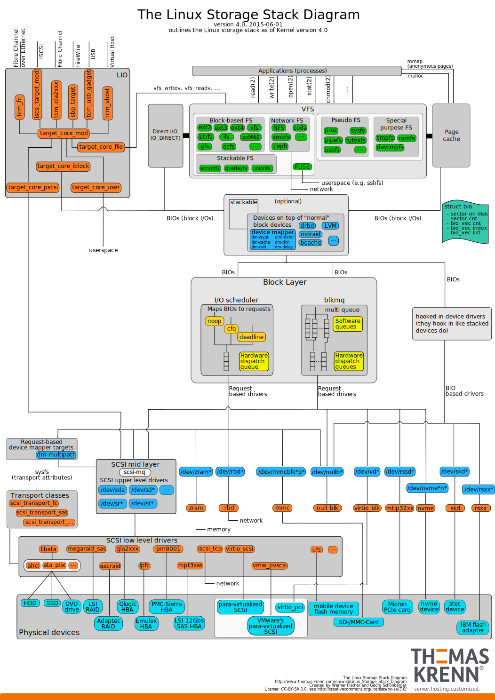
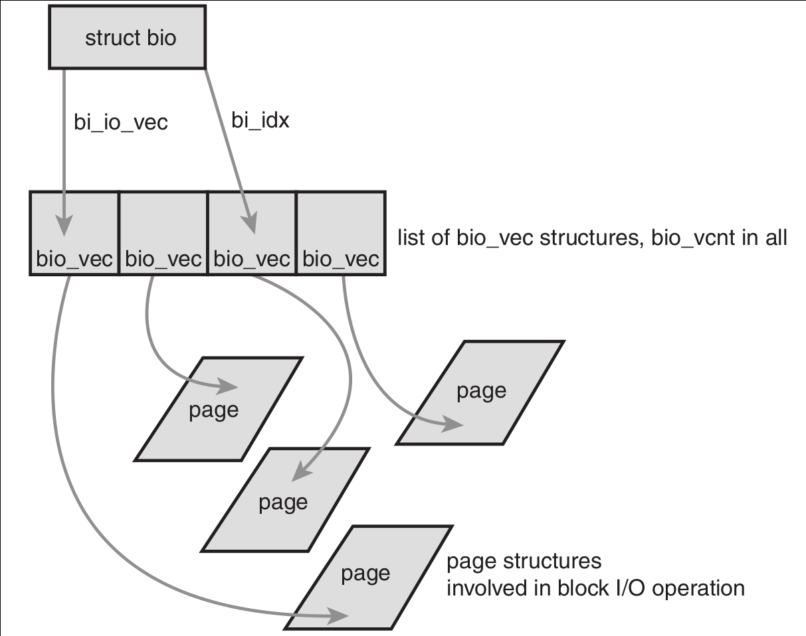
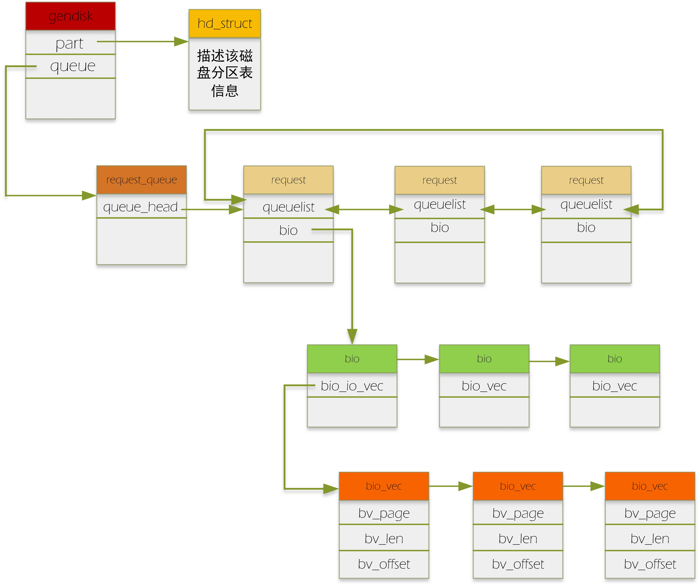
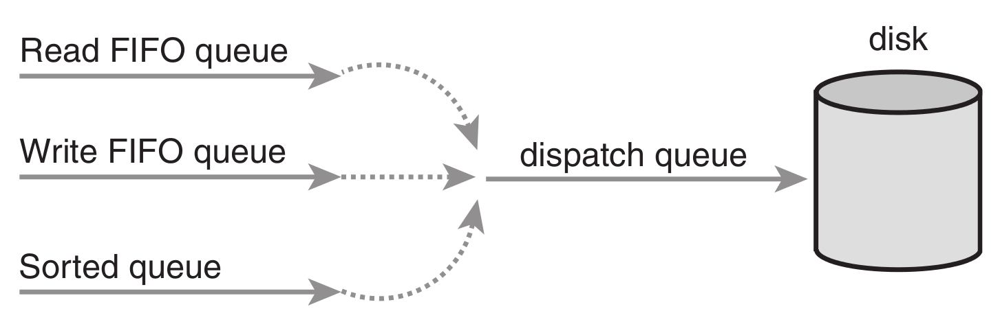

# Block I/O 层



# 基本概念

## 块设备
* **块设备**：系统中能够 *随机* （不需要按顺序）访问 *固定大小数据片*（chunks）的硬件设备，这些固定大小的数据片称作 *块（blocks）*。
* 块设备一般以挂载文件系统的方式访问。
* **字符设备**：按照字节流的方式被有序访问。
* 对于这两种设备类型，区别在于 **是否可以随机访问数据** —— 换句话说，就是能否在访问设备时随意地从一个位置跳转到另一个位置。

## 块和扇区
* 块设备中最小的可寻址单元是 **扇区（sector）**。
* 扇区的大小一般是2的整数倍，最常见的是512 Byte。很多CD-ROM盘的扇区大小是2KB。
* 扇区的大小是设备的物理属性（即不是软件方面的定义），是所有块设备的基本单元 —— 块设备无法对比它还小的单元进行寻址操作。
* **块**：文件系统的一种抽象，只能基于 *块* 来访问文件系统。
* 虽然物理磁盘寻址是按照 *扇区* 级进行的，但内核执行的所有磁盘操作都是按照 *块* 进行的。由于扇区是设备最小寻址单元，所以块不能比扇区还小，只能数倍于扇区大小。
* 内核（对有扇区的硬件）还要求块大小是2的整数倍，而且不能超过一个page的长度。所以，通常块的大小是512Byte，1KB或4KB。
* 内核所使用的“块”这一个高级概念是建立在扇区之上的。

# 缓冲区和缓冲头

* 当一个块被调入到内存时（即，读入后或等待写出时），它要存储在一个 **缓冲区（buffer）** 中。
* 每个缓冲区关联到一个块，相当于磁盘块在内存中的表示。
* *块* 包含一个或多个 *扇区*，一个 *页* 可以容纳一个或多个内存中的 *块*。
* **缓冲区头**：由于内核在处理数据时需要一些相关的控制信息（比如块属于哪一个块设备，块对应于哪个缓冲区），所以每一个缓冲区都有一个对应的描述符。该描述符用`struct buffer_head`表示。
* include/linux/buffer_head.h
```c
/*
 * Historically, a buffer_head was used to map a single block
 * within a page, and of course as the unit of I/O through the
 * filesystem and block layers.  Nowadays the basic I/O unit
 * is the bio, and buffer_heads are used for extracting block
 * mappings (via a get_block_t call), for tracking state within
 * a page (via a page_mapping) and for wrapping bio submission
 * for backward compatibility reasons (e.g. submit_bh).
 */
struct buffer_head {
    unsigned long b_state;      /* buffer state bitmap (see above) */
    struct buffer_head *b_this_page;/* circular list of page's buffers */
    struct page *b_page;        /* the page this bh is mapped to */

    sector_t b_blocknr;     /* start block number */
    size_t b_size;          /* size of mapping */
    char *b_data;           /* pointer to data within the page */

    struct block_device *b_bdev;
    bh_end_io_t *b_end_io;      /* I/O completion */
    void *b_private;        /* reserved for b_end_io */
    struct list_head b_assoc_buffers; /* associated with another mapping */
    struct address_space *b_assoc_map;  /* mapping this buffer is
                           associated with */
    atomic_t b_count;       /* users using this buffer_head */
};
```
* 如今的基本I/O单位是 *bio*，`struct buffer_head`被用于
  * 提取块映射（通过`get_block_t`调用）
  * 跟踪（通过一个页映射）一个页内的状态
  * 为了向后兼容，封装`bio`提交（例如，`submit_bh`）
* *缓冲区头* 的目的在于描述 *磁盘块* 和 *物理内存缓冲区*（在特定页面上的字节序列）之间的映射关系。说明从缓冲区到块的映射关系。


# bio结构体

* 目前内核中block I/O操作的基本容器由`struct bio`结构体表示。
* include/linux/blk_types.h
```c
/*
 * was unsigned short, but we might as well be ready for > 64kB I/O pages
 */
struct bio_vec {
    struct page    *bv_page;    /*指向这个缓冲区所驻留的物理页*/
    unsigned int    bv_len;     /*这个缓冲区以字节为单位的大小*/
    unsigned int    bv_offset;  /*缓冲区所驻留的页中以字节为单位的偏移量*/
};
...
struct bvec_iter {
    sector_t            bi_sector;  /* device address in 512 byte sectors */
    unsigned int        bi_size;    /* residual I/O count */
    unsigned int        bi_idx;     /* current index into bvl_vec */
    unsigned int        bi_bvec_done;   /* number of bytes completed in
                                           current bvec */
};

/*
 * main unit of I/O for the block layer and lower layers (ie drivers and
 * stacking drivers)
 */
 struct bio {
     struct bio      *bi_next;   /* request queue link */
     struct block_device *bi_bdev;   /* 相关的块设备 */
     unsigned int        bi_flags;   /* status, command, etc */
     int         bi_error;
     unsigned long       bi_rw;      /* bottom bits READ/WRITE,
                          * top bits priority
                          */

     struct bvec_iter    bi_iter;

     /* Number of segments in this BIO after
      * physical address coalescing is performed.
      */
     unsigned int        bi_phys_segments;

     /*
      * To keep track of the max segment size, we account for the
      * sizes of the first and last mergeable segments in this bio.
      */
     unsigned int        bi_seg_front_size;
     unsigned int        bi_seg_back_size;

     atomic_t        __bi_remaining;

     bio_end_io_t        *bi_end_io;

     void            *bi_private;
 #ifdef CONFIG_BLK_CGROUP
     /*
      * Optional ioc and css associated with this bio.  Put on bio
      * release.  Read comment on top of bio_associate_current().
      */
     struct io_context   *bi_ioc;
     struct cgroup_subsys_state *bi_css;
 #endif
     union {
 #if defined(CONFIG_BLK_DEV_INTEGRITY)
         struct bio_integrity_payload *bi_integrity; /* data integrity */
 #endif
     };

     unsigned short      bi_vcnt;    /* how many bio_vec's */

     /*
      * Everything starting with bi_max_vecs will be preserved by bio_reset()
      */

     unsigned short      bi_max_vecs;    /* max bvl_vecs we can hold */

     atomic_t        __bi_cnt;   /* pin count */
     struct bio_vec      *bi_io_vec; /* the actual vec list */

     struct bio_set      *bi_pool;

     /*
      * We can inline a number of vecs at the end of the bio, to avoid
      * double allocations for a small number of bio_vecs. This member
      * MUST obviously be kept at the very end of the bio.
      */
     struct bio_vec      bi_inline_vecs[0];
 };

```
* 使用`struct bio`的目的主要是 **代表正在现场（in-flight）执行的I/O操作**。



## I/O vectors

### bi_io_vec 和 bi_vcnt
* `struct bio`的`bio_io_vec`域指向一个`struct bio_vec`数组，该链表包含了一个特定I/O操作所需要使用到的所有片段。
* 整个`struct bio_vec`数组表示一个完整的缓冲区。
* 每一个block I/O请求都通过一个`struct bio`表示，每个请求包含一个或多个block，存储在`struct bio_vec`数组中。
* `struct bio_vec`描述了每个片段在物理页中的实际位置，并且像向量一样被组织在一起。
* I/O操作的第一个片段由`bi_io_vec`域指向，其他片段在其后依次放置，共有`bi_vcnt`个片段。

### bi_idx
* 当block I/O层开始执行请求、需要使用各个片断时，`bi_idx`域会不断更新，从而总指向当前片断。
* block I/O层可以通过`bi_idx`域跟踪block I/O操作的完成进度。
* `bi_idx`域更重要的作用在于分割`struct bio`。
  * 像 *Redundant Array of Inexpensive Disks*（RAID，出于可靠性和安全性的目的将单个磁盘的卷扩展到多个磁盘上）这样的驱动器可以单独的`struct bio`（原本是为了单个设备使用准备的），分割到RAID阵列的各个硬盘上去。
  * RAID设备驱动只需要拷贝这个`struct bio`，再把`bio_idx`域设置为每个独立硬盘操作时需要的位置就可以了。

### bi_cnt
* `__bi_cnt`域指向`struct bio`的引用计数，如果该值减为 0，就应该撤销该`struct bio`，并释放它占用的内存。
* 通过`bio_get()`和`bio_put()`管理引用计数。
* include/linux/bio.h
```c
/*
 * get a reference to a bio, so it won't disappear. the intended use is
 * something like:
 *
 * bio_get(bio);
 * submit_bio(rw, bio);
 * if (bio->bi_flags ...)
 *  do_something
 * bio_put(bio);
 *
 * without the bio_get(), it could potentially complete I/O before submit_bio
 * returns. and then bio would be freed memory when if (bio->bi_flags ...)
 * runs
 */
static inline void bio_get(struct bio *bio)
{
    bio->bi_flags |= (1 << BIO_REFFED);
    smp_mb__before_atomic();
    atomic_inc(&bio->__bi_cnt);
}
```

* block/bio.c
```c
/**
 * bio_put - release a reference to a bio
 * @bio:   bio to release reference to
 *
 * Description:
 *   Put a reference to a &struct bio, either one you have gotten with
 *   bio_alloc, bio_get or bio_clone. The last put of a bio will free it.
 **/
void bio_put(struct bio *bio)
{
    if (!bio_flagged(bio, BIO_REFFED)) /*该bio没有被引用*/
        bio_free(bio);                 /*释放该bio*/
    else {                             /*该bio被引用了*/
        BIO_BUG_ON(!atomic_read(&bio->__bi_cnt));

        /*
         * last put frees it
         */
        if (atomic_dec_and_test(&bio->__bi_cnt)) /*引用计数减1后测试，如果引用计数不为0，则什么都不做*/
            bio_free(bio);                       /*引用计数减为0，释放该bio*/
    }
}
EXPORT_SYMBOL(bio_put);
```
* 在操作正在活动的`struct bio`对象时，**一定要先增加它的引用计数**，以免操作过程中该对象被释放，反之亦然。

### bi_private
* `bi_private`域是一个属于拥有者（也就是创建者）的私有域。
* 只有创建了`struct bio`对象的拥有者可以读写该域。

## struct buffer_head VS struct bio
* `struct bio`代表的是I/O操作，它可以包括内存中的一个或多个page。
* `struct buffer_head`代表的是一个缓冲区，它描述的仅仅是磁盘中的一个block。
* 因为`buffer_head`关联的是单独页中的单独磁盘块，所以它可能会引起不必要的分割，将请求按block为单位划分，只能靠以后再重新组合。
* `struct bio`是轻量级的，它描述的block可以不需要连续存储区，并且不需要分割I/O操作。
* `struct bio`代替`struct buffer_head`的其他好处：
  * 更易处理高端内存，因为它处理的是物理页而不是直接指针。
  * 既可以代表普通页I/O，也可以代表直接I/O（那些页高速缓存的I/O操作）。
  * 便于执行分散——集中（矢量化的）block I/O操作，操作中的数据可取自多个物理页面。
  * 只需包含block I/O操作所需的信息就行了，不用包含与缓冲区本身相关的不必要信息。
* 内核通过这两种结构分别保存各自的信息，可以保证每种结构所含的信息量尽可能地少。

# 请求队列
* 块设备将它们pending的block I/O请求放到请求队列中，由`struct request_queue`表示。
* *文件系统* 将请求加到请求队列中。
* 只要请求队列不为空，队列对应的 *块设备驱动* 会从队列头获取 *请求*，然后将其送到对应的 *块设备* 去。
* 请求队列上每一项都是一个单独的请求，由`struct request`结构体表示。
* 一个请求可能操作多个连续的磁盘块，所有每个请求可以由多个`struct bio`对象组成。
  * 注意：虽然磁盘上的block必须连续，但内存中的块并不一定要连续（因为用的是`struct bio`）。



# I/O调度程序
* 简单地以内核产生请求的次序直接将请求发向块设备，性能让人难以接受，尽量缩短磁盘寻址时间是提高系统性能的关键。
* 为了优化寻址操作，内核在将请求提交给磁盘之前会执行名为 **合并（merging）** 和 **排序（sorting）** 的预操作。
* **I/O调度程序**：负责提交I/O请求的子系统。
* **I/O调度程序** 把 **磁盘I/O资源** 分配给系统中 **所有pengding的block I/O请求**。这种资源分配通过将请求队列中pengding的请求合并和排序来完成。
* **I/O调度程序** 虚拟块设备给多个磁盘请求，以降低磁盘寻址时间，确保磁盘性能的最优化。

## I/O调度程序的工作
* I/O调度程序的工作是管理块设备的请求队列，提高 **全局** 吞吐量，可能为了提高系统整体性能而对某些请求不公。
* **合并** 指将两个或多个请求结合成一个新请求。
  * 通过合并请求，I/O调度程序将多次请求的开销压缩成一次请求的开销。
  * 请求合并后只需传递给磁盘一条寻址命令，就可以访问到请求合并前必须多次寻址才能访问完的磁盘区域。
* 整个请求队列将按 *扇区* 增长方向 **有序排列**。其目的是：
  * 缩短单独一次请求的寻址时间。
  * 保持磁头以直线方向移动，缩短了所有请求的磁盘寻址时间。

## Linus电梯
* 当一个请求加入到队列中时，有可能发生四种操作，依次为：
1. 如果队列中已存在一个对相邻磁盘扇区的请求，那么新请求将和这个已经存在的请求合并成一个请求。
2. 如果队列中存在一个驻留时间过长的请求，那么新请求将被插入到队列尾部，以防止其他旧的请求发生饥饿。
3. 如果队列中以扇区的方向为序，存在合适的插入位置，那么新的请求将被插入到该位置，保证队列中的请求是以被访问磁盘物理位置为序进行排列的。
4. 如果队列中不存在合适的请求插入位置，请求将被插入到队列尾部。

## deadline I/O调度程序
* Linus电梯调度带来的饥饿问题：
  * 对某个磁盘区域上的繁重操作，会使得磁盘其他位置上的操作请求得不到运行机会。
  * writes-starving-reads问题。写请求时间对应用程序性能带来的影响不大，但应用程序却必须等待读请求完成后才能运行其他程序。
  * 读请求具有同步性，并且彼此之间往往相互依靠，所以读请求响应时间直接影响系统性能。
* 注意，减少请求饥饿必须以降低全局吞吐量为代价。



* **排队队列**：以磁盘物理位置为次序维护的请求队列。
* **读请求FIFO队列**：以时间为基准，将读请求插入的队列。
* **写请求FIFO队列**：以时间为基准，将写请求插入的队列。
* **dispatch队列**：将请求交给磁盘驱动。
* 在读或写请求FIFO队列的头有请求超时，则deadline I/O调度程序从FIFO队列中提取请求进行服务。
* 读请求的超时时间（例如500ms）要比写请求的超时时间（例如5s）短很多，照顾读请求，确保读响应时间尽可能短。

## 预测I/O调度程序（The Anticipatory I/O Scheduler）
* deadline I/O调度程序降低读操作响应时间，但降低了系统吞吐量。
* 预测I/O调度程序的目标：保持良好的读响应，同时提供良好的吞吐量。
* 预测I/O调度程序的基础是deadline I/O调度程序。实现了三个队列（加上一个dispatch队列），并为每个请求设置了超时时间。
* 最主要的改进是增加了 **预测启发（anticipation heuristic）** 的能力。
* 预测I/O调度程序的不同之处在于，请求提交后并不直接返回处理其他请求，而是会有意空闲片刻（实际空闲时间可以设置）。
  * 这几ms，对应用程序来说是个提交其他读请求的好机会——任何对相邻磁盘位置操作的请求都会立刻得到处理。
  * 在等待时间结束后，预测I/O调度程序重新返回原来的位置，继续执行以前剩下的请求。
* 如果没有I/O请求在等待期到来，那么预测I/O调度程序会给系统性能带来轻微的损失，浪费掉几ms。
* 对大多数workloads性能良好，对cirtical workloads（如数据挖掘服务器上）表现并不好。

## 完全公平排队I/O调度程序（The Complete Fair Queuing I/O Scheduler）
* 完全公平排队I/O调度程序（Complete Fair Queuing，CFQ）是为专有workloads设计的，不过在实践中对多种workloads也提供良好的性能。
* CFQ I/O调度程序把进入的I/O请求放入 **根据引起I/O请求的进程来组织** 的队列。
  * 每个队列中，刚进入的请求与相邻的请求合并，并进行插入分类。
  * 队列由此按扇区方式分类。CFQ I/O调度程序的差异在于每一个提交I/O的进程的都有自己的队列。
  * CFQ I/O调度程序以 *时间片* 轮转调度队列，从每个队列中选取请求数（可配），然后进行下一轮调度。
    * 这样是为了在进程级提供公平，确保每个进程收到公平的磁盘带宽片断。

## 空操作I/O调度程序（The Noop I/O Scheduler）
* 空操作（Noop）I/O调度程序基本上是一个空操作，不做多少事情。
  * 不排序，不预寻址。
  * 执行合并，新请求提交到队列与任意相邻请求合并。
  * 维护请求队列近乎FIFO的顺序排列。
* 对于类似Flash这样的随机访问设备，没有“寻道”的负担，空操作I/O调度程序是理想的选择。

# 相关内核命令行参数
```
elevator=   [IOSCHED]
        Format: {"cfq" | "deadline" | "noop"}
```
