# Kernel Config

## CONFIG_THREAD_INFO_IN_TASK

* init/Kconfig
```cpp
config THREAD_INFO_IN_TASK
    bool
    help
      Select this to move thread_info off the stack into task_struct.  To
      make this work, an arch will need to remove all thread_info fields
      except flags and fix any runtime bugs.

      One subtle change that will be needed is to use try_get_task_stack()
      and put_task_stack() in save_thread_stack_tsk() and get_wchan().
```

### 把`thread_info`移到`task_struct`的理由
* `struct thread_info`里的信息和`struct thread_struct`有很多冗余的
  * 二者都放在 arch 相关的代码里，增加一些额外的每个 task 都有的变量
  * `thread_struct`更干净：总是在`task_struct`里，且没有特别神奇的用法
* 一旦`thread_info`不再神奇，还有另一个好处：我们可以在任务死后立即释放线程堆栈（无需等待 RCU），然后，如果 vmapped stacks 正在使用，cache 整个 stack 以在同一个 CPU 上重用

### 定义

* include/linux/sched.h
```cpp
union thread_union {
#ifndef CONFIG_ARCH_TASK_STRUCT_ON_STACK
    struct task_struct task;
#endif
#ifndef CONFIG_THREAD_INFO_IN_TASK
    struct thread_info thread_info;
#endif
    unsigned long stack[THREAD_SIZE/sizeof(long)];
};
```

* arch/x86/include/asm/thread_info.h
```cpp
struct thread_info {
    unsigned long       flags;      /* low level flags */
    unsigned long       syscall_work;   /* SYSCALL_WORK_ flags */
    u32         status;     /* thread synchronous flags */
#ifdef CONFIG_SMP
    u32         cpu;        /* current CPU */
#endif
};
```

* include/linux/sched.h
```cpp
struct task_struct {
#ifdef CONFIG_THREAD_INFO_IN_TASK
    /*
     * For reasons of header soup (see current_thread_info()), this
     * must be the first element of task_struct.
     */
    struct thread_info      thread_info;
#endif
    ...
    /* CPU-specific state of this task: */
    struct thread_struct        thread;
    ...
};
```

### commits
```git
commit ac496bf48d97f2503eaa353996a4dd5e4383eaf0
Author: Andy Lutomirski <luto@kernel.org>
Date:   Thu Sep 15 22:45:49 2016 -0700

    fork: Optimize task creation by caching two thread stacks per CPU if CONFIG_VMAP_STACK=y

commit b9d989c7218ac922185d82ad46f3e58b27a4bea9
Author: Andy Lutomirski <luto@kernel.org>
Date:   Tue Sep 13 14:29:21 2016 -0700

    x86/asm: Move the thread_info::status field to thread_struct
```

### References
* [linux 进程内核栈 - 知乎](https://zhuanlan.zhihu.com/p/296750228)
* [[PATCH 00/12] thread_info cleanups and stack caching Andy Lutomirski](https://lore.kernel.org/all/a0898196f0476195ca02713691a5037a14f2aac5.1473801993.git.luto@kernel.org/T/#mb7436931b26bf12c7d350580a262fe91c44bdacb)

## CONFIG_VMAP_STACK

* arch/Kconfig
```c
config HAVE_ARCH_VMAP_STACK
    def_bool n
    help
      An arch should select this symbol if it can support kernel stacks
      in vmalloc space.  This means:

      - vmalloc space must be large enough to hold many kernel stacks.
        This may rule out many 32-bit architectures.

      - Stacks in vmalloc space need to work reliably.  For example, if
        vmap page tables are created on demand, either this mechanism
        needs to work while the stack points to a virtual address with
        unpopulated page tables or arch code (switch_to() and switch_mm(),
        most likely) needs to ensure that the stack's page table entries
        are populated before running on a possibly unpopulated stack.

      - If the stack overflows into a guard page, something reasonable
        should happen.  The definition of "reasonable" is flexible, but
        instantly rebooting without logging anything would be unfriendly.

config VMAP_STACK
    default y
    bool "Use a virtually-mapped stack"
    depends on HAVE_ARCH_VMAP_STACK
    depends on !KASAN || KASAN_HW_TAGS || KASAN_VMALLOC
    help
      Enable this if you want the use virtually-mapped kernel stacks
      with guard pages.  This causes kernel stack overflows to be
      caught immediately rather than causing difficult-to-diagnose
      corruption.

      To use this with software KASAN modes, the architecture must support
      backing virtual mappings with real shadow memory, and KASAN_VMALLOC
      must be enabled.
```
## CONFIG_STACKPROTECTOR 和 CONFIG_STACKPROTECTOR_STRONG
```c
config STACKPROTECTOR
    bool "Stack Protector buffer overflow detection"
    depends on HAVE_STACKPROTECTOR
    depends on $(cc-option,-fstack-protector)
    default y
    help
      This option turns on the "stack-protector" GCC feature. This
      feature puts, at the beginning of functions, a canary value on
      the stack just before the return address, and validates
      the value just before actually returning.  Stack based buffer
      overflows (that need to overwrite this return address) now also
      overwrite the canary, which gets detected and the attack is then
      neutralized via a kernel panic.

      Functions will have the stack-protector canary logic added if they
      have an 8-byte or larger character array on the stack.

      This feature requires gcc version 4.2 or above, or a distribution
      gcc with the feature backported ("-fstack-protector").

      On an x86 "defconfig" build, this feature adds canary checks to
      about 3% of all kernel functions, which increases kernel code size
      by about 0.3%.

config STACKPROTECTOR_STRONG
    bool "Strong Stack Protector"
    depends on STACKPROTECTOR
    depends on $(cc-option,-fstack-protector-strong)
    default y
    help
      Functions will have the stack-protector canary logic added in any
      of the following conditions:

      - local variable's address used as part of the right hand side of an
        assignment or function argument
      - local variable is an array (or union containing an array),
        regardless of array type or length
      - uses register local variables

      This feature requires gcc version 4.9 or above, or a distribution
      gcc with the feature backported ("-fstack-protector-strong").

      On an x86 "defconfig" build, this feature adds canary checks to
      about 20% of all kernel functions, which increases the kernel code
      size by about 2%.
```
### GCC 栈保护参数
* 在 GCC 中开启 canary 保护：
  * `-fstack-protector`：启用保护，在其栈上声明长度为 8 个或更多字节的字符数组的任何函数插入保护
  * `-fstack-protector-all`：启用保护，为所有函数插入保护
  * `-fstack-protector-strong`：见下面
  * `-fstack-protector-explicit`：只对有明确 stack_protect attribute 的函数开启保护
  * `-fno-stack-protector`：禁用保护
* `-fstack-protector-strong`
  * 任何声明任何类型或长度的本地数组的函数，即使是 struct 或 union 中的函数
  * *函数参数* 或 *赋值右侧* 使用 *局部变量地址* 的函数
  * 任何使用局部 register 变量的函数

> In addition to the protections offered by `-fstack-protector`, the new option will guard any function that declares any type or length of local array, even those in structs or unions. It will also protect functions that use a local variable's address in a function argument or on the right-hand side of an assignment. In addition, any function that uses local register variables will be protected.



### 代码实现的支持
* arch/x86/include/asm/stackprotector.h
  ```c
  /*
   * GCC stack protector support.
   *
   * Stack protector works by putting predefined pattern at the start of
   * the stack frame and verifying that it hasn't been overwritten when
   * returning from the function.  The pattern is called stack canary
   * and unfortunately gcc historically required it to be at a fixed offset
   * from the percpu segment base.  On x86_64, the offset is 40 bytes.
   *
   * The same segment is shared by percpu area and stack canary.  On
   * x86_64, percpu symbols are zero based and %gs (64-bit) points to the
   * base of percpu area.  The first occupant of the percpu area is always
   * fixed_percpu_data which contains stack_canary at the appropriate
   * offset.  On x86_32, the stack canary is just a regular percpu
   * variable.
   *
   * Putting percpu data in %fs on 32-bit is a minor optimization compared to
   * using %gs.  Since 32-bit userspace normally has %fs == 0, we are likely
   * to load 0 into %fs on exit to usermode, whereas with percpu data in
   * %gs, we are likely to load a non-null %gs on return to user mode.
   *
   * Once we are willing to require GCC 8.1 or better for 64-bit stackprotector
   * support, we can remove some of this complexity.
   */
  ...
  #ifdef CONFIG_STACKPROTECTOR
  /*
   * Initialize the stackprotector canary value.
   *
   * NOTE: this must only be called from functions that never return
   * and it must always be inlined.
   *
   * In addition, it should be called from a compilation unit for which
   * stack protector is disabled. Alternatively, the caller should not end
   * with a function call which gets tail-call optimized as that would
   * lead to checking a modified canary value.
   */
  static __always_inline void boot_init_stack_canary(void)
  {
      u64 canary;
      u64 tsc;
  
  #ifdef CONFIG_X86_64
      BUILD_BUG_ON(offsetof(struct fixed_percpu_data, stack_canary) != 40);
  #endif
      /*
       * We both use the random pool and the current TSC as a source
       * of randomness. The TSC only matters for very early init,
       * there it already has some randomness on most systems. Later
       * on during the bootup the random pool has true entropy too.
       */
      get_random_bytes(&canary, sizeof(canary));
      tsc = rdtsc();
      canary += tsc + (tsc << 32UL);
      canary &= CANARY_MASK;
  
      current->stack_canary = canary;
  #ifdef CONFIG_X86_64
      this_cpu_write(fixed_percpu_data.stack_canary, canary);
  #else
      this_cpu_write(__stack_chk_guard, canary);
  #endif
  }
  ...
  #endif  /* STACKPROTECTOR */
  ```
* GCC 由于历史原因需要把 stack canary 放在一个从 percpu 段基址开始的一个固定的偏移
  * 在 x86_64 上，该偏移的值是`40`字节
* percpu 区域和 stack canary 共享同一段
  * 在 x86_64 上，percpu 符号从零开始，`%gs`（64 位）指向 percpu 区域的底部
  * percpu 区域的第一个占用者始终是`fixed_percpu_data`，其中包含适当偏移量的 stack_canary
* `DECLARE_PER_CPU_FIRST`和`DEFINE_PER_CPU_FIRST`用于声明和定义 percpu 区域的第一个变量
* include/linux/percpu-defs.h
  ```c
  /*
  * Declaration/definition used for per-CPU variables that must come first in
  * the set of variables.
  */
  #define DECLARE_PER_CPU_FIRST(type, name)               \
      DECLARE_PER_CPU_SECTION(type, name, PER_CPU_FIRST_SECTION)  
  #define DEFINE_PER_CPU_FIRST(type, name)                \
      DEFINE_PER_CPU_SECTION(type, name, PER_CPU_FIRST_SECTION)
  ```
* 对于 x86_64，percpu 区域第一个变量是`struct fixed_percpu_data fixed_percpu_data`
* arch/x86/include/asm/processor.h
  ```c
  #ifdef CONFIG_X86_64
  struct fixed_percpu_data {
      /*
       * GCC hardcodes the stack canary as %gs:40.  Since the
       * irq_stack is the object at %gs:0, we reserve the bottom
       * 48 bytes of the irq stack for the canary.
       *
       * Once we are willing to require -mstack-protector-guard-symbol=
       * support for x86_64 stackprotector, we can get rid of this.
       */
      char        gs_base[40];
      unsigned long   stack_canary;
  };
  
  DECLARE_PER_CPU_FIRST(struct fixed_percpu_data, fixed_percpu_data) __visible;
  ...
  ```
* stack canary 的初始化见函数`boot_init_stack_canary()`，注意：每个 CPU 的`fixed_percpu_data.stack_canary`是不一样的
* 任务切换时也要考虑到这一点
* arch/x86/entry/entry_64.S
  ```s
  /*
   * %rdi: prev task
   * %rsi: next task
   */
  .pushsection .text, "ax"
  SYM_FUNC_START(__switch_to_asm)
      /*
       * Save callee-saved registers
       * This must match the order in inactive_task_frame
       */
      pushq   %rbp
      pushq   %rbx
      pushq   %r12
      pushq   %r13
      pushq   %r14
      pushq   %r15
  
      /* switch stack */ //切换栈指针，切换完后，返回的路径就不一样了
      movq    %rsp, TASK_threadsp(%rdi) //保存 %rsp 到切出任务的 task_struct.thread.sp
      movq    TASK_threadsp(%rsi), %rsp //加载切入任务的 task_struct.thread.sp 到 %rsp
  
  #ifdef CONFIG_STACKPROTECTOR
      movq    TASK_stack_canary(%rsi), %rbx
      movq    %rbx, PER_CPU_VAR(fixed_percpu_data) + stack_canary_offset
  #endif
  ...
  ```
  * **注意**：`task_struct.thread.sp` 和 `task_struct.stack` 的区别
    * `struct thread_struct` 是 arch 相关的进程上下文，因此 `task_struct.thread.sp` 保存的是进程换出前 `$RSP` 的值，是会变的
    * `task_struct.stack` 是进程创建时的内核栈的栈底（低地址），进程创建好后就固定了
      * `task_top_of_stack(task)` 宏根据 `task_struct.stack` 和进程栈大小的定义转换得到内核栈顶（高地址）
### 运行时的检查
* 例如，mm/gup.c 中的`fault_in_safe_writeable()`函数
  ```s
  00000000000009d0 <fault_in_safe_writeable>:
  fault_in_safe_writeable():
       9d0:   e8 00 00 00 00          callq  9d5 <fault_in_safe_writeable+0x5>
              9d1: R_X86_64_PLT32 __fentry__-0x4
       9d5:   41 57                   push   %r15
       9d7:   41 56                   push   %r14
       9d9:   41 55                   push   %r13
       9db:   41 54                   push   %r12
       9dd:   55                      push   %rbp
       9de:   53                      push   %rbx
       9df:   48 83 ec 10             sub    $0x10,%rsp
       9e3:   65 48 8b 04 25 28 00    mov    %gs:0x28,%rax  //函数的入口出把 percpu 的 stack canary 放到 rax 寄存器
       9ea:   00 00
       9ec:   48 89 44 24 08          mov    %rax,0x8(%rsp) //rax 寄存器的值(stack canary)放到函数的栈里
  ...
       a93:   48 8b 54 24 08          mov    0x8(%rsp),%rdx //返回前检查 canary，先把栈上的 stack canary 的值放入 rdx
       a98:   65 48 33 14 25 28 00    xor    %gs:0x28,%rdx  //比较栈上的 stack canary 的值与 percpu 的 stack canary 的值，看有没有被踩踏
       a9f:   00 00
       aa1:   75 3e                   jne    ae1 <fault_in_safe_writeable+0x111> //如果不等，可能受到了栈溢出攻击，跳转到 __stack_chk_fail
       aa3:   48 83 c4 10             add    $0x10,%rsp
       aa7:   5b                      pop    %rbx
       aa8:   5d                      pop    %rbp
       aa9:   41 5c                   pop    %r12
       aab:   41 5d                   pop    %r13
       aad:   41 5e                   pop    %r14
       aaf:   41 5f                   pop    %r15
       ab1:   c3                      retq
  ...
       ae1:   e8 00 00 00 00          callq  ae6 <fault_in_safe_writeable+0x116> // 跳到 __stack_chk_fail，该函数会调用 panic()
              ae2: R_X86_64_PLT32 __stack_chk_fail-0x4
       ae6:   66 2e 0f 1f 84 00 00    nopw   %cs:0x0(%rax,%rax,1)
       aed:   00 00 00
  ```
### 后续的改进
* [[PATCH v6 00/15] x86-64: Stack protector and percpu improvements](https://lore.kernel.org/r/20250123190747.745588-9-brgerst@gmail.com)
* `__stack_chk_guard` 变为普通 per-CPU 变量了，`struct fixed_percpu_data` 结构被删除
```c
DECLARE_PER_CPU_CACHE_HOT(unsigned long, __stack_chk_guard);

/*
 * Initialize the stackprotector canary value.
 *
 * NOTE: this must only be called from functions that never return
 * and it must always be inlined.
 *
 * In addition, it should be called from a compilation unit for which
 * stack protector is disabled. Alternatively, the caller should not end
 * with a function call which gets tail-call optimized as that would
 * lead to checking a modified canary value.
 */
static __always_inline void boot_init_stack_canary(void)
{
    unsigned long canary = get_random_canary();

    current->stack_canary = canary;
    this_cpu_write(__stack_chk_guard, canary);
}

static inline void cpu_init_stack_canary(int cpu, struct task_struct *idle)
{
    per_cpu(__stack_chk_guard, cpu) = idle->stack_canary;
}
```

### References
* ["Strong" stack protection for GCC - LWN.net](https://lwn.net/Articles/584225/)
* [Buffer overflow protection - Wikipedia](https://en.wikipedia.org/wiki/Buffer_overflow_protection)
* [Stack buffer overflow - Wikipedia](https://en.wikipedia.org/wiki/Stack_buffer_overflow#Stack_canaries)